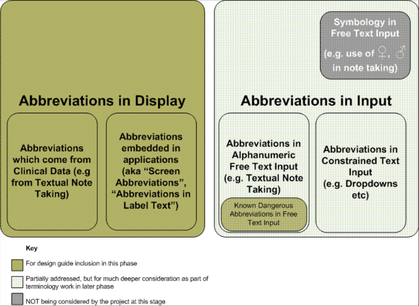
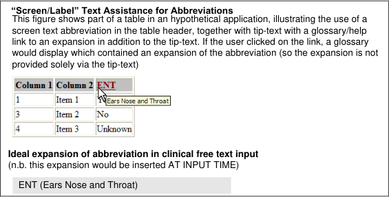

_Prepared for_

**NHS Connecting for Health**

**Tuesday, 23 June 2015**

**Version 1.0.0.0 Baseline**

_Prepared by_

**Mark A. Wilson-Thomas**

**Program Manager**

**[cuistakeholder.mailbox@hscic.gov.uk](mailto:cuistakeholder.mailbox@hscic.gov.uk)**

**This document was prepared for NHS Connecting for Health which ceased to exist on 31 March**
**2013. It may contain references to organisations, projects and other initiatives which also no**
**longer exist. If you have any questions relating to any such references, or to any other aspect of**
**[the content, please contact cuistakeholder.mailbox@hscic.gov.uk](mailto:cuistakeholder.mailbox@hscic.gov.uk)**

HSCIC Controlled Document

### TABLE OF CONTENTS

_**1**_ _**Introduction .................................................................................................................................... 2**_

1.1 Summary of Recommendations ............................................................................................... 2

1.2 Recommendations Requiring Future Research ....................................................................... 2

_**2**_ _**Scope .............................................................................................................................................. 3**_

_**3**_ _**Guidelines on Abbreviation and Acronym Usage ...................................................................... 4**_

3.1 Require the User to Resolve all Known Dangerous Abbreviations and Acronyms .................. 4

3.1.1 Recommendations ............................................................................................................ 4

3.1.2 Accessibility ....................................................................................................................... 4

3.1.3 Justification ........................................................................................................................ 5

3.1.4 Patient Safety .................................................................................................................... 5

3.2 Avoid or Explain Abbreviations and Acronyms ......................................................................... 5

3.2.1 Recommendations ............................................................................................................ 5

3.2.2 Examples ........................................................................................................................... 6

3.2.3 Accessibility ....................................................................................................................... 6

3.2.4 Justification ........................................................................................................................ 6

3.2.5 Patient Safety .................................................................................................................... 7

3.3 Present Abbreviations and Acronyms Consistently .................................................................. 7

3.3.1 Proposed Guidance ........................................................................................................... 7

_**4**_ _**Accessibility ................................................................................................................................... 8**_

4.1.1 Justification ........................................................................................................................ 8

4.1.2 Patient Safety .................................................................................................................... 8

_**5**_ _**Taxonomy of Abbreviation and Acronym Usage ....................................................................... 9**_

_**6**_ _**Research and Prototyping .......................................................................................................... 10**_

6.1 Proposed Primary Research .................................................................................................. 10

6.1.1 Review of Current Practice in Ambiguity Resolution ....................................................... 10

6.1.2 Review of Proposed Forbidden or Dangerous Abbreviations and Acronyms ................. 10

6.2 Candidates for Prototyping and User Testing ........................................................................ 10

6.2.1 Free Text Input Panel with Ambiguity Resolution ........................................................... 10

6.2.2 Text Display Panel with Ambiguity Indication .................................................................. 11

6.2.3 Candidate for Office Workstream Inclusion ..................................................................... 11

6.2.4 Ensuring Consistency of Approach with Medical Terminology Handling ........................ 11

_**7**_ _**References .................................................................................................................................... 12**_

_**APPENDIX A**_ _**Joint Commission on Accreditation of HealthCare Organizations (US) ............. 13**_

_**APPENDIX B**_ _**Institute of Safe Medical Practice (US) ................................................................... 14**_

_**APPENDIX C**_ _**Potentially Dangerous Ambiguous Abbreviations and Acronyms ..................... 16**_

Page 1

Copyright ©2013 Health and Social Care Information Centre

HSCIC Controlled Document

### 1 INTRODUCTION

This document presents design principles and guidance that describe how NHS clinical
applications should handle abbreviations and acronyms in input and display fields. This design
information uses principles from reviews of relevant literature, best practices and published
glossaries.

This document also suggests areas for future research. This research and prototyping would allow
further validation of some of the guidance.

#### **1.1 Summary of Recommendations**

NHS clinical applications should:

 Require the user to resolve known dangerous abbreviations and acronyms, especially when

a user enters information as free text.

 Avoid abbreviations or provide readily accessible explanations when displaying labels

(screen text).

 Present abbreviation punctuation and capitalisation consistently.

#### **1.2 Recommendations Requiring Future Research**

Research should be performed to validate these recommendations.

When allowing free-text input which includes abbreviations, applications can:

 Use an interface to alert the user entering the information, who can then resolve any

unexpanded abbreviations and acronyms

 Provide warnings for any remaining unexpanded abbreviations and acronyms when users

view this information.

Page 2

Copyright ©2013 Health and Social Care Information Centre

HSCIC Controlled Document

### 2 SCOPE

The following figure illustrates this documents scope of work and how it fits into the overall field of
abbreviations and acronyms:

Figure 1: Taxonomy of abbreviations and acronyms, showing scope of work

As Figure 1 illustrates, it is not possible at this stage to make specific fully-validated
recommendations around many areas of input abbreviation. However, this document presents
guidance for display abbreviation and a specific subset of input abbreviation relating to known
dangerous abbreviations (KDAs).

Future releases of this document will cover input abbreviation handling, including free text input
(FTI). A separate appendix presents a suggested design approach for handling FTI containing
abbreviations and acronyms. This design draws on current thinking within safety critical systems.

**Note**

This approach requires substantial further research for full validation and is therefore not presented as
guidance.

Page 3

Copyright ©2013 Health and Social Care Information Centre

HSCIC Controlled Document

### 3 GUIDELINES ON ABBREVIATION AND ACRONYM USAGE

This section presents each of the key guidelines on abbreviation and acronym usage that result
from current research. The key guidelines will:

 Require the user to resolve all known dangerous abbreviations and acronyms

 Avoid or explain abbreviations and acronyms

 Present abbreviations and acronyms consistently.

#### **3.1 Require the User to Resolve all Known Dangerous** **Abbreviations and Acronyms**

When accepting free text input which includes abbreviations, applications should require the user to
resolve all known dangerous abbreviations and acronyms.

##### **3.1.1 Recommendations**

Applications which provide free text input, for example for note taking, should:

 Alert the user authoring the text to the presence of known forbidden/dangerous

abbreviations and acronyms (see below for a definition of these) whenever the author
moves from one input field to another.

 Present potential expansions for selection where possible, but not provide a default

expansion.

 Prevent the storage of any such items under all circumstances.

The definition of a forbidden/known dangerous abbreviation or acronym is “one which is
categorised as such by an appropriate authority”. This might arise for several equally valid reasons:

 Confusion with another acronym or abbreviation, with potential patient safety consequences

 Relation to drugs, for example, drug names, dose amounts, dose frequencies and so on

 Misinterpretation in some other way which might affect patient safety, or be unsafe for some

other reason

 It has caused a dangerous incident in the past.

The process of collating and validating the list of forbidden/dangerous acronyms will be an ongoing
one and this guideline does not prescribe how it should be achieved or by what authority, although
initial sources for the list are suggested (see the "Rationale for Recommendation" section below)
based on primary and secondary research.

##### **3.1.2 Accessibility**

The detailed accessibility considerations for this guidance will depend on the precise design
adopted to adhere to the guidance. However several issues will have to be addressed by any
design:

 The interaction design for alerting the user to the presence of dangerous unexpanded

items, and allowing users to select the next dangerous unexpanded item, will have to be
usable by screen reader users and those who prefer or require keyboard or other input
devices rather than mouse input.

 The interaction design for distinguishing between non-dangerous and dangerous

unexpanded items will need to use more than colour to do so.

Page 4

Copyright ©2013 Health and Social Care Information Centre

HSCIC Controlled Document

##### **3.1.3 Justification**

Some forms of abbreviation and acronym are known to be dangerous from specific experiences.
The US National Patient Safety Guidelines (NPSG) Goal 2b (1) mandates a list of
forbidden/dangerous abbreviations which is enforced by audit of patient notes for all accredited
institutions. This list is deliberately constrained to those items which have caused incidents in the
past, and it is therefore beneficial to avoid using the items on it. It is also clearly evidence-based.
The list is reproduced in APPENDIX A

It is well recognised that abbreviation of drug names, dosage amounts, dose frequency etc is
dangerous. The US Institute for Safe Medication Practices (ISMP) maintains a list of known
dangerous drug-related abbreviations and acronyms which the NPSG references. This list is
reproduced in APPENDIX B.

In addition to these secondary sources, as part of the NHS CUI project, ca 4500 abbreviations and
acronyms in use across the NHS have been collated and categorised. The data has been analysed
for collisions between acronym and abbreviation definitions, in particular looking for collisions
between clinical terms or other items which might cause dangerous misinterpretation. This has
revealed around 30 potentially dangerous acronyms which are also candidates for inclusion on a
list of forbidden/dangerous abbreviations and acronyms. This list is reproduced in APPENDIX C.

##### **3.1.4 Patient Safety**

Observation of this guideline is critically important to patient safety. If applications do not resolve all
known dangerous abbreviations and acronyms at input time, then clinicians may:

 Enter text into a clinical application which may be dangerously misleading or ambiguous to

other application users

 View information in clinical applications containing potentially dangerous abbreviations and

acronyms

 Receive no warning when reading medical text that potentially dangerous abbreviations and

acronyms are present, and may act on a mistaken impression of the intent of the author of
the text – with possible negative consequences for patients.

This confusion could have unintended or hazardous results, for example:

 Patients receiving the wrong drug or an incorrect dosage

 Incorrect patient administration or clinical interaction due to mistaken abbreviations.

Appendices A,B and C provide more details of other possible dangerous conflicts.

#### **3.2 Avoid or Explain Abbreviations and Acronyms**

Applications should avoid abbreviation where possible. If it is not possible to avoid using an
acronym, the user should have easy access to an explanation of the acronym's meaning.

##### **3.2.1 Recommendations**

Applications which display labels (static text displayed by an application, for example, next to a
form field to indicate what the field contains- also known as "Screen Text") should:

 Avoid using abbreviations and acronyms wherever possible - this is the preferred approach.

 Use abbreviations and acronyms when screen space constraints would lead to horizontal

scrolling or clipping of the text if the fully expanded form were used instead.

 Use abbreviations and acronyms when clear evidence exists that they are universally used

or accepted in the target context for the application, and are more usable in their contracted
forms.

Page 5

Copyright ©2013 Health and Social Care Information Centre

HSCIC Controlled Document

 Avoid using known dangerous abbreviations and acronyms regardless of screen or other

constraints.

 Provide a method of discovering the local meaning of the abbreviation or acronym where it

is not possible to avoid use, unless the user explicitly opts not to display this discovery
method.

Methods for discovering the local meaning of an abbreviation or acronym must be:

 Simple to use

 Quick to use

 Accessible to all users (for example, through a glossary link or other form of user

assistance).

##### **3.2.2 Examples**

The figure below shows several views which conform to the recommendations in this document.

**Note**

These views do not dictate a particular interaction but merely illustrate interactions which comply with the
guidance.

Figure 2: Example Views illustrating Explanation of an Abbreviation

##### **3.2.3 Accessibility**

When providing assistance for expanding abbreviations, applications must expose the explanation
of the abbreviation in a manner which is accessible to all users, including users of assistive
technologies such as screen readers, users with limited manual dexterity and users with low vision.

In particular it is not safe for an application to rely on tool-tips alone as a means of providing
expansions, because:

 They cannot be used by non-mouse users

 It may be difficult for those with low vision to read them since they do not resize with other

text in a web context

 Those with limited manual dexterity may find them difficult to access.

##### **3.2.4 Justification**

Complexity is a well known source of human error (see for example the reference to **Thomas**
**Nolan (** 3 **)** ). In this case, it is clear that more mental effort is required for a user to expand an
abbreviation or acronym than it would be required to read the fully expanded form directly. This
added effort (increased cognitive load) increases the risk of the user making a mistake in using the
data presented, and makes mistakes in other activities more likely. In addition, in common with

Page 6

Copyright ©2013 Health and Social Care Information Centre

HSCIC Controlled Document

other usages, the potential for ambiguity exists whenever abbreviations and acronyms are
employed.

However it will not always be possible to display a fully expanded version of a long label (for
example, where screen space is at a premium or the alternative to abbreviation would be horizontal
scrolling), so in these cases it is important to mitigate the ambiguity risk by providing the user with
access to the correct expansion.

Using the expanded form of an abbreviation will not be the best approach when it is clear (for
example, from the user's context) that they do not benefit from the expansion. This can arise
because they are very familiar with the abbreviated form and will read and recognise it more quickly
than the expanded form. In these cases the user's cognitive load and reading time may be
increased rather than decreased by the presence of the expanded form. When this argument is
used for including an abbreviation, it must be substantiated by clear evidence of the common
usage and understanding of the abbreviation in question however.

##### **3.2.5 Patient Safety**

These guidelines are important because if they are not observed:

 Abbreviations and acronyms will be used unnecessarily, adding to the increased cognitive

load of users and making user errors more likely.

 When abbreviations and acronyms do need to be used, users will not be able to determine

the correct meaning of acronyms they find and may make incorrect assumptions about the
meaning, leading to error.

#### **3.3 Present Abbreviations and Acronyms Consistently**

When displaying abbreviations and acronyms, applications should always present them
consistently with respect to capitalization and punctuation.

##### **3.3.1 Proposed Guidance**

Applications which display acronyms or abbreviations should:

 Present all acronyms (phrases reduced to their initial letters only) in UPPERCASE with no

punctuation marks and no interior spaces, for example, ENT for Ears, Nose and Throat
rather than E N T, ent or E.N.T.

 Present all abbreviations (phrases truncated to two or more letters of their component

words) with every word or abbreviated word capitalized, and all truncated words punctuated
with a full stop and no interior spaces, for example, Tib.Ant. for Tibialis Anterior, rather than
TibAnt, Tib. Ant., tibant or tib ant)

Page 7

Copyright ©2013 Health and Social Care Information Centre

HSCIC Controlled Document

### 4 ACCESSIBILITY

The punctuation convention proposed may cause some difficulty for screen reader users. Some
screen readers read out the acronym as a phrase, rather than pronouncing its individual letters (for
example, ENT may be pronounced as the word "ent" rather than as the separate letters E N T).
This suggests that a punctuated form with separators (E.N.T.) would be more accessible to screen
reader users. However, any such suggestion needs to be weighed against the consequence of
introducing an unfamiliar form to non-reader users, and the fact that screen reader users may
already be very familiar with the "word forms" of common acronyms because of current usage.
User research should be performed to optimise the recommendation.

In some circumstances it will be possible to mark the acronym as being an acronym in a machinereadable form, allowing assistive technologies such as readers to take appropriate action, such as
reading out the letters individually. In HTML web applications this is achieved using the ACRONYM
or ABBR tags. However some current readers do not interpret these representations correctly, so it
is important that any recommendation stands independent of them.

##### **4.1.1 Justification**

Consistent presentation always enhances readability, and reduces the complexity of user
interactions with the application interface. Reduced complexity enhances the safety of user
interactions with the application.

Consistent presentation is particularly important with abbreviations since the user has to cope with
the process of expanding the abbreviation. Inconsistent presentation adds another mental hurdle
and contributes to usage errors, slowing the processing of patient information.

For these reasons, a set of guidelines for presentation which is consistent with common usage in
glossaries found in the NHS and elsewhere is being proposed. This common usage is derived from
observations made during the survey of ca 4500 abbreviations and acronyms in use across the
NHS performed as part of the NHS CUI project. The rationale for following common usage is that
the forms of presentation used should be familiar to clinicians and therefore yield the best chance
of minimising the complexity of the display to the user.

##### **4.1.2 Patient Safety**

These guidelines are important because if they are not observed:

 Abbreviations and acronyms will be presented in many differing forms from application to

application, adding to the cognitive load of users and making user errors more likely.

 Users will be more likely to misinterpret the acronyms or abbreviations if they are not

presented consistently.

Page 8

Copyright ©2013 Health and Social Care Information Centre

HSCIC Controlled Document

### 5 TAXONOMY OF ABBREVIATION AND ACRONYM USAGE

It is helpful in thinking about abbreviation and acronym usage to organize their potential uses into
categories for consideration, each of which has its own set of requirements and issues. The
following table presents a simple taxonomy for observations in relation to abbreviations and
acronyms.

Input Free Text (for example,
Note Taking)

Input Constrained Text (for
example, drop down
boxes, radio button lists
etc)

Any text may be entered. Impeding the flow of text input to expand abbreviations will
dramatically reduce usability.

Rules can be similar to display of label text. Capable of being much more inherently safe
than free text input of the same data with respect to abbreviation risks.

Display Label text Often possible to avoid abbreviation altogether, and always possible to provide
assistance to explain those abbreviations which are necessary.

Display User-input text Reduction of ambiguity hinges on good input validation to remove ambiguity and highlight
the remaining ambiguous text.

Special Drug-related information
(for example, units of
measure, dosages etc)

Scenarios where this data type is frequently exchanged (for example prescribing) should
be considered for special UI treatment to avoid some of the most common hazardous
abbreviations. However this sort of data often finds its way into free text notes where
constraints are more difficult to enforce.

Table 1: Simple taxonomy for observations in relation to abbreviations and acronyms

Copyright ©2013 Health and Social Care Information Centre

Page 9

HSCIC Controlled Document

### 6 RESEARCH AND PROTOTYPING

All guidance in this document is based on current research. However, in some cases this research
is not sufficient to justify the recommendations completely.

The potential design approach that “Abbreviations and Acronyms in Free Text Input.doc” provides
is based on general safety system design principles and requires further work to justify.

The following items of research and prototyping are proposed in order to strengthen the research
base for the guidance. Some of the items can logically be undertaken by the Microsoft CUI project
team, but others require specialist clinician involvement in their organisation, execution and
analysis.

#### **6.1 Proposed Primary Research**

Both these items of primary research are likely to need specialist clinician involvement in their
organisation, execution and analysis.

##### **6.1.1 Review of Current Practice in Ambiguity Resolution**

A key tenet of the proposal for free-text input is that systems will be made safer if readers of notes
are provided with information which:

 As far as possible contain fully expanded renderings of all abbreviations and acronyms

used

 Contains NO known dangerous abbreviations

 Warns them about the presence of unexpanded abbreviations and acronyms where

expansion has not been possible.

In order to prove the value of these proposals, particularly the last one, data should be collected on
how clinicians in different scenarios currently resolve ambiguity which is present in paper medical
records and notes, for example during handovers. This will show whether a system which can help
quick recognition of ambiguity would be as helpful as anticipated.

##### **6.1.2 Review of Proposed Forbidden or Dangerous Abbreviations and** **Acronyms**

The same research subject group used above could also be used to gather data on candidate
dangerous/forbidden abbreviations to validate them.

An ongoing piece of work will be required to update the list based on any adverse events involving
abbreviation.

#### **6.2 Candidates for Prototyping and User Testing**

These items can sensibly be undertaken by the Microsoft CUI Project Team.

##### **6.2.1 Free Text Input Panel with Ambiguity Resolution**

In order to test the basic usability and acceptability to end users of the ideas embodied in the Free
Text Input recommendations, we should design and build a prototype of a free text entry panel with
general text ambiguity resolution which meets the guidelines, and test it with sample user groups.
This is a complex piece of work and will probably require development team involvement in addition
to interaction design work.

Page 10

Copyright ©2013 Health and Social Care Information Centre

HSCIC Controlled Document

##### **6.2.2 Text Display Panel with Ambiguity Indication**

In parallel with the above, a companion display which mocks up approaches for displaying data,
and contains known unexpanded abbreviations and acronyms, should be designed and user
tested.

##### **6.2.3 Candidate for Office Workstream Inclusion**

Much text input in the NHS will take place in Microsoft Word documents for several years to come,
so it is vital that as much as possible of the free-text input recommendations be augmented by an
NHS-specific Office feature. This feature can be proposed for development to the Office
Workstream thereby allowing patient safety benefits to be delivered early.

The proposed feature would:

 Allow an author to be alerted to unexpanded abbreviations and acronyms

 Provide (on demand) a set of potential expansions for insertion

 Alert the author to the inclusion of any known dangerous/forbidden abbreviations.

The feature would be refined and incorporated into the Office Workstream's schedule of activities
and a plan for its development produced.

##### **6.2.4 Ensuring Consistency of Approach with Medical Terminology** **Handling**

For many systems, it will be necessary to arrive at an approach for handling the input of notes and
their transformation into systematic medical terminology (for example, coding for SNOMED-CT)
which solves the same problem of resolving ambiguous input into unambiguous output. Whatever
approach is adopted for free text handling regarding abbreviations and acronyms, the approach
taken for terminology coding must be the same for consistency.

Page 11

Copyright ©2013 Health and Social Care Information Centre

HSCIC Controlled Document

### 7 REFERENCES

1. _US National Patient Safety Guidelines 2004,5, Goal 2B_,
   [http://www.jcaho.org/accredited%2Borganizations/05_npsg_guidelines_3.pdf](http://www.jcaho.org/accredited%2Borganizations/05_npsg_guidelines_3.pdf)

2. _US Institute for Safe Medication Practices "Do Not Use" list_,

[http://www.ismp.org/msaarticles/specialissuetable.html](http://www.ismp.org/msaarticles/specialissuetable.html)

3. _System changes to improve patient safety_, Thomas W Nolan, BMJ 2000;320:771-773 ( 18
   [March ) http://bmj.bmjjournals.com/cgi/content/full/320/7237/771](http://bmj.bmjjournals.com/cgi/content/full/320/7237/771)

**Note**

At the time of writing this document, websites are referenced using active hyperlinks to the correct web
page. Due to the dynamic nature of websites, in time these links may become invalid.

Page 12

Copyright ©2013 Health and Social Care Information Centre

HSCIC Controlled Document

### APPENDIX A JOINT COMMISSION ON ACCREDITATION

##### OF HEALTHCARE ORGANIZATIONS (US)

[The following information is from the Official "Do Not Use" List from the Joint Commission on](http://www.jcaho.org/accredited+organizations/patient+safety/06_dnu_list.pdf)
[Accreditation of Healthcare Organizations Web site, at](http://www.jcaho.org/accredited+organizations/patient+safety/06_dnu_list.pdf)
[http://www.jcaho.org/accredited+organizations/patient+safety/06_dnu_list.pdf](http://www.jcaho.org/accredited+organizations/patient+safety/06_dnu_list.pdf)

U (unit) Mistaken for “0” (zero), the

number “4” (four) or “cc”

Write "unit"

IU (International Unit) Mistaken for IV (intravenous) or the number 10 (ten) Write "International Unit"

Q.D., QD, q.d., qd (daily) Q.O.D., QOD, q.o.d,
qod

(every other day)

Trailing zero (X.0 mg)\*

Lack of leading zero (.X mg)

MS

MSO4 and MgSO4

Table 2: Excerpt from the Official "Do Not Use" list

Mistaken for each other

Period after the Q mistaken for "I" and the "O" mistaken
for "I"

Write "daily"

Write "every other day"

Decimal point is missed Write X mg

Write 0.X mg

Can mean morphine sulfate or magnesium sulfate

Confused for one another

Write "morphine sulfate"

Write "magnesium
sulfate"

Additional abbreviations, acronyms and symbols (for possible future inclusion in the Official “Do Not
Use” List).

- (greater than)

< (less than)

Misinterpreted as the number “7” (seven) or the letter “L”

Confused for one another

Write “greater than”

Write “less than”

Write drug names in full

Use metric units

Write “at”

Write "ml" or “millilitres”

Write "mcg" or “micrograms”

Abbreviations for drug names Misinterpreted due to similar

abbreviations for

multiple drugs

Apothecary units Unfamiliar to many practitioners

Confused with metric units

@ Mistaken for the number

“2” (two)

cc Mistaken for U (units) when

poorly written

μg Mistaken for mg (milligrams)

resulting in one thousand-fold

overdose

Table 3: Additional abbreviations and acronyms for possible future inclusion in the Official "Do Not Use" list

Copyright ©2013 Health and Social Care Information Centre

Page 13

HSCIC Controlled Document

### APPENDIX B INSTITUTE OF SAFE MEDICAL PRACTICE (US)

[The following table of dangerous abbreviations or dose designations is from the Institute of Safe](http://www.ismp.org/msaarticles/specialissuetable.html)
[Medical Practice](http://www.ismp.org/msaarticles/specialissuetable.html) [Web site, at http://www.ismp.org/msaarticles/specialissuetable.html.](http://www.ismp.org/msaarticles/specialissuetable.html)

Apothecary symbols dram
minim

Misunderstood or misread (symbol for dram misread
for “3” and minim misread as “mL”).

Use the metric system.

AU aurio uterque (each ear) Mistaken for OU (oculo uterque—each eye). Don’t use this abbreviation.

D/C discharge
discontinue

Premature discontinuation of medications when D/C
(intended to mean “discharge”) has been
misinterpreted as “discontinued” when followed by a
list of drugs.

Use “discharge” and
“discontinue.”

Drug names Use the complete spelling
for drug names.

ARAºA vidarabine cytarabineARAºC

AZT zidovudine
(RETROVIR)

CPZ COMPAZINE
(prochlorperazine)

DPT DEMEROLPHENERGANTHORAZINE

azathioprine

chlorpromazine

diphtheria-pertussis-tetanus (vaccine)

HCl hydrochloric acid potassium chloride (The “H” is misinterpreted as “K.”)

HCT hydrocortisone hydrochlorothiazide

HCTZ hydrochlorothiazide hydrocortisone (seen as HCT250 mg)

MgSO4 magnesium sulfate morphine sulfate

MSO4 morphine sulfate magnesium sulfate

MTX methotrexate mitoxantrone

TAC triamcinolone tetracaine, ADRENALIN,cocaine

ZnSO4 zinc sulfate morphine sulfate

Stemmed names

“Nitro” drip nitroglycerin infusion sodium nitroprusside infusion

“Norflox” norfloxacin NORFLEX

m g microgram Mistaken for “mg” when handwritten. Use “mcg.”

o.d. or OD once daily Misinterpreted as “right eye” (OD—oculus dexter)
and administration of oral medications in the eye.

Use “daily.”

TIW or tiw three times a week. Mistaken as “three times a day.” Don’t use this abbreviation.

per os orally The “os” can be mistaken for “left eye.” Use “PO,” “by mouth,” or
“orally.”

q.d. or QD every day Mistaken as q.i.d., especially if the period after the “q” Use “daily” or “every day.”

Page 14

Copyright ©2013 Health and Social Care Information Centre

HSCIC Controlled Document

qn nightly or at bedtime Misinterpreted as “qh” (every hour). Use “nightly.”

qhs nightly at bedtime Misread as every hour. Use “nightly.”

q6PM, etc. every evening at 6 PM Misread as every six hours. Use 6 PM “nightly.”

q.o.d. or QOD every other day Misinterpreted as “q.d.” (daily) or “q.i.d. (four times
daily) if the “o” is poorly written.

sub q subcutaneous The “q” has been mistaken for “every” (for example,
one heparin dose ordered “sub q 2 hours before
surgery” misunderstood as every 2 hours before
surgery).

Use “every other day.”

Use “subcut.” or write
“subcutaneous.”

SC subcutaneous Mistaken for SL (sublingual). Use “subcut.” or write
“subcutaneous.”

U or u unit Read as a zero (0) or a four (4), causing a 10-fold
overdose or greater (4U seen as “40” or 4u seen as
44”).

“Unit” has no acceptable
abbreviation. Use “unit.”

IU international unit Misread as IV (intravenous). Use “units.”

cc cubic centimetres Misread as “U” (units). Use “mL.”

x3d for three days Mistaken for “three doses.” Use “for three days.”

BT bedtime Mistaken as “BID” (twice daily). Use “hs.”

ss sliding scale (insulin) or
½ (apothecary)

- and < greater than and less
  than

/ (slash mark) separates two doses or
indicates “per”

Mistaken for “55.” Spell out “sliding scale.”
Use “one-half” or use “½.”

Mistakenly used opposite of intended. Use “greater than” or “less
than.”

Misunderstood as the number 1 (“25 unit/10 units”
read as “110” units.

Do not use a slash mark to
separate doses.
Use “per.”

Name letters and dose
numbers run together
(for example, Inderal40
mg)

Zero after decimal point
(1.0)

No zero before decimal
dose
(.5 mg)

Inderal 40 mg Misread as Inderal 140 mg. Always use space between
drug name, dose and unit
of measure.

1 mg Misread as 10 mg if the decimal point is not seen. Do not use terminal zeros
for doses expressed in
whole numbers.

0.5 mg Misread as 5 mg. Always use zero before a
decimal when the dose is
less than a
whole unit.

Table 4: Dangerous abbreviations or dose designations

Copyright ©2013 Health and Social Care Information Centre

Page 15

HSCIC Controlled Document

### APPENDIX C POTENTIALLY DANGEROUS AMBIGUOUS ABBREVIATIONS AND ACRONYMS

The following potentially dangerous abbreviations and acronyms resulted from the NHS CUI
glossary consolidation exercise:

AE Adverse Event www.ukmi.nhs.uk/research/common_abreviations.asp

AE Air entry Chartered Society of Physiotherapy

amp ampoule [www.dmd.nhs.uk/documentation.asp](http://www.trentdeanery.nottingham.ac.uk/gen_acronym.htm)

AMP Austin Moore
Prosthesis

Chartered Society of Physiotherapy

BTL Bilateral tubal ligation Chartered Society of Physiotherapy

btl bottle [www.dmd.nhs.uk/documentation.asp](http://www.trentdeanery.nottingham.ac.uk/gen_acronym.htm)

CMV Controlled mandatory
ventilation

Chartered Society of Physiotherapy

CMV Cytomegalovirus [www.dmd.nhs.uk/documentation.asp](http://www.trentdeanery.nottingham.ac.uk/gen_acronym.htm)

CNS Central nervous
system

CNS Coagulase negative
streptococci

www.show.scot.nhs.uk/sign/guidelines/fulltext/53/abbreviations.html

www.bwhct.nhs.uk/index/about-clinicalreport/about-clinicalreport-abbreviations.htm

www.show.scot.nhs.uk/sign/pdf/sign28.pdf Chartered Society of Physiotherapy

www.show.scot.nhs.uk/sign/guidelines/fulltext/45/abbreviations.html

CP Cerebral palsy Chartered Society of Physiotherapy

CP Chondromalacia
patellae

www.kneeguru.co.uk/html/dictionary/abbreviations.html

CRC Colorectal cancer www.show.scot.nhs.uk/sign/guidelines/fulltext/67/abbreviations.html

CRC Concentrated red cells www.show.scot.nhs.uk/sign/guidelines/fulltext/54/abbreviations.html

CRM Circumferential
resection margin

www.show.scot.nhs.uk/sign/guidelines/fulltext/67/abbreviations.html

crm cream [www.dmd.nhs.uk/documentation.asp](http://www.trentdeanery.nottingham.ac.uk/gen_acronym.htm)

CVS Cardio Vascular
System

Chartered Society of Physiotherapy

CVS Chorionic Villus biopsy www.bwhct.nhs.uk/index/about-clinicalreport/about-clinicalreport-abbreviations.htm

ER Equilibrium Reaction Chartered Society of Physiotherapy

ER Oestrogen receptor www.show.scot.nhs.uk/sign/guidelines/fulltext/29/abbreviations.html

ES Electrical stimulation www.show.scot.nhs.uk/sign/guidelines/fulltext/64/abbreviations.html

ES Embryonic Stem www.bwhct.nhs.uk/index/about-clinicalreport/about-clinicalreport-abbreviations.htm

FET Forced expiration
technique

FET Frozen Embryo
Transfer

Chartered Society of Physiotherapy

www.bwhct.nhs.uk/index/about-clinicalreport/about-clinicalreport-abbreviations.htm

FH Familial www.show.scot.nhs.uk/sign/guidelines/fulltext/40/abbreviations.html

Copyright ©2013 Health and Social Care Information Centre

Page 16

HSCIC Controlled Document

FH Family History Chartered Society of Physiotherapy

IUD Inter uterine death Chartered Society of Physiotherapy

IUD Intra Uterine Device www.bwhct.nhs.uk/index/about-clinicalreport/about-clinicalreportabbreviations.htm,www.show.scot.nhs.uk/sign/guidelines/fulltext/42/abbreviations.html

LA Left Atrium Chartered Society of Physiotherapy

LA Local anaesthetic www.show.scot.nhs.uk/sign/guidelines/fulltext/53/abbreviations.html

LDH Lactate
dehydrogenase

www.show.scot.nhs.uk/sign/pdf/sign28.pdf

LDH Low dose heparin www.show.scot.nhs.uk/sign/guidelines/fulltext/56/abbreviations.html

MR Medial reefing www.kneeguru.co.uk/html/dictionary/abbreviations.html

MR modified-release [www.dmd.nhs.uk/documentation.asp](http://www.trentdeanery.nottingham.ac.uk/gen_acronym.htm)

P Pain Chartered Society of Physiotherapy

P Plan treatment Chartered Society of Physiotherapy

P Pulse Chartered Society of Physiotherapy

PD Parkinsons Disease Chartered Society of Physiotherapy

PD Postural drainage Chartered Society of Physiotherapy

PE Phenytoin equivalent www.show.scot.nhs.uk/sign/guidelines/fulltext/70/abbreviations.html

PE Pulmonary embolism www.show.scot.nhs.uk/sign/guidelines/fulltext/56/abbreviations.html,

www.show.scot.nhs.uk/sign/guidelines/fulltext/36/abbreviations.html

PE Pulmonary Embolus Chartered Society of Physiotherapy

PEP Positive Expiratory
Pressure

PEP Pulmonary Embolism
Prevention

Chartered Society of Physiotherapy

www.show.scot.nhs.uk/sign/guidelines/fulltext/56/abbreviations.html

PF Patello-femoral www.kneeguru.co.uk/html/dictionary/abbreviations.html,

Chartered Society of Physiotherapy

PF Pelvic Floor Chartered Society of Physiotherapy

PF Plantarflexion Chartered Society of Physiotherapy

PFS Patello-femoral
syndrome

www.kneeguru.co.uk/html/dictionary/abbreviations.html

pfs pre-filled syringe(s) [www.dmd.nhs.uk/documentation.asp](http://www.trentdeanery.nottingham.ac.uk/gen_acronym.htm)

PH Past History Chartered Society of Physiotherapy

pH percentage hydrogen Chartered Society of Physiotherapy

PID Pelvic inflammatory
disease

PID Prolapsed
intervertebral disc

www.show.scot.nhs.uk/sign/guidelines/fulltext/42/abbreviations.html,

Chartered Society of Physiotherapy

Chartered Society of Physiotherapy

PNF Passive neck flexion Chartered Society of Physiotherapy

Copyright ©2013 Health and Social Care Information Centre

Page 17

HSCIC Controlled Document

PNF Proprioceptive neuromuscular facilitation

Chartered Society of Physiotherapy

PTB Partial thickness burn Chartered Society of Physiotherapy

PTB Patella tendon bearing Chartered Society of Physiotherapy

PV Cisplatin, vinblastine www.show.scot.nhs.uk/sign/pdf/sign28.pdf

PV Per vagina Chartered Society of Physiotherapy

PV Plasma viscosity Chartered Society of Physiotherapy

PV Pulmonary Vein Chartered Society of Physiotherapy

RA Rheumatoid arthritis www.kneeguru.co.uk/html/dictionary/abbreviations.html,

www.show.scot.nhs.uk/sign/guidelines/fulltext/48/abbreviations.html,

Chartered Society of Physiotherapy

RA Right Atrium Chartered Society of Physiotherapy

RR Respiratory Rate Chartered Society of Physiotherapy

RR Righting Reaction Chartered Society of Physiotherapy

SB Sinus bradycardia Chartered Society of Physiotherapy

SB Spina Bifida Chartered Society of Physiotherapy

SCC Spinal Cord
Compression

SCC Squamous cell
carcinoma

Chartered Society of Physiotherapy

Chartered Society of Physiotherapy

ST Sinus tachycardia Chartered Society of Physiotherapy

ST Soft Tissue Chartered Society of Physiotherapy

st standing Chartered Society of Physiotherapy

TKA Through knee
amputation

TKA Total knee
arthroplasty

Chartered Society of Physiotherapy

www.show.scot.nhs.uk/sign/guidelines/fulltext/54/abbreviations.html

VL Vastus Lateralis Chartered Society of Physiotherapy

vl vial(s) [www.dmd.nhs.uk/documentation.asp](http://www.trentdeanery.nottingham.ac.uk/gen_acronym.htm)

Table 5: Potentially dangerous abbreviations and acronyms

Copyright ©2013 Health and Social Care Information Centre

Page 18

HSCIC Controlled Document

### REVISION AND SIGNOFF SHEET

#### **Change Record**

31-May-2005 Mark A.WilsonThomas

0.0.0.1 Extracted from "Abbreviations and Acronyms in Quick Wins Phase" v.0.5
for inclusion in Design Guide

1-Jun-2005 Anthony Steven 0.0.0.2 Light rewriting and reformatting of tables etc. Not a full developmental edit.

1-Jun-2005 Mark A.WilsonThomas

0.0.0.3 Reviewed rewrite and made minor corrections, simplified and removed
repetition in introduction

2-Jun-2005 Anthony Steven 0.0.0.4 Prepared for customer review at conclusion of Quick Wins phase.

9-Jun-2005 Mark A.WilsonThomas

0.0.0.5 Modified figure AAA2.gif

Included comments about context for abbreviation.

30-Jun-2005 Anthony Steven 0.0.1.0 Quick Wins Release

07-Mar-2006 L Boardman-Rule 0.0.1.1 CopyEdit

12-Jun-2006 P Robinson 0.0.1.2 Author comments.

14-Jun-2006 L Boardman-Rule 0.0.1.3 Copyedit complete on author comments.

14-Jun-2006 L Boardman-Rule 0.0.2.0 Document Cleansed.

14-Jun-2006 Vivienne Jones 1.0.0.0 Baselined ready for conversion into PDF.

Document Status has the following meaning:

 **Drafts 0.0.0.X** - Draft document reviewed by the Microsoft CUI project team and the

Authority designate for the appropriate Workstream. The document is liable to change.

 **Working Baseline 0.0.X.0** - The document has reached the end of the review phase and

may only have minor changes. The document will be submitted to the Authority CUI project
team for wider review by stakeholders, ensuring buy-in and to assist in communication.

 **Baseline Candidate 0.X.0.0** - The document has reached the end of the review phase and

it is ready to be frozen on formal agreement between the Authority and the Company

 **Baseline X.0.0.0** - The document has been formally agreed between the Authority and the

Company

Note that minor updates or corrections to a document may lead to multiple versions at a particular
status.

#### **Reviewers**

Jarnail Chudge 0.0.0.1 Design Guide Workstream Lead 31-May-2005

Paul Robinson 0.0.0.1 Program Manager 31-May-2005

Page 19

Copyright ©2013 Health and Social Care Information Centre

HSCIC Controlled Document

#### **Distribution**

Mark Farrer NHS CFH Director of Infrastructure

#### **Document Properties**

Document Title NHS CUI Design Guide Workstream Abbreviations and Acronyms

Author Mark A. Wilson-Thomas

Restrictions **RESTRICTED – COMMERCIAL; MICROSOFT COMMERCIAL;** Access restricted to: NHS
CUI Project Team, Microsoft NHS Account Team

Creation Date

Last Updated 23 June 2015

**Copyright:**

You may re-use this information (excluding logos) free of charge in any format or medium, under
the terms of the Open Government Licence. To view this licence, visit
[nationalarchives.gov.uk/doc/open-government-licence or email psi@nationalarchives.gsi.gov.uk.](https://web.nhs.net/OWA/redir.aspx?C=dMnSAL43xUOp9X_SOcscV9mT5A0smdBIh1_vxjdSDVCERI33v7-idn6tNFCNwJYUR1PxIW-Hd-E.&URL=http%3a%2f%2fnationalarchives.gov.uk%2fdoc%2fopen-government-licence)

Page 20

Copyright ©2013 Health and Social Care Information Centre
