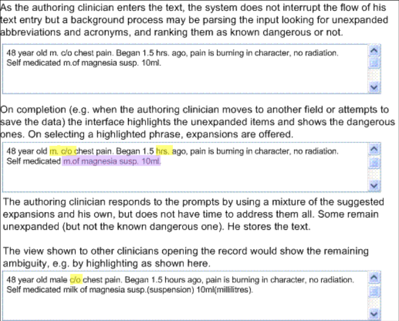

_Prepared for_

**NHS Connecting for Health**

**Tuesday, 23 June 2015**

**Version 1.0.0.0 Baseline**

_Prepared by_

**Mark A. Wilson-Thomas**

**Program Manager**

**[cuistakeholder.mailbox@hscic.gov.uk](mailto:cuistakeholder.mailbox@hscic.gov.uk)**

_Contributors_

**Jarnail Chudge**

**This document was prepared for NHS Connecting for Health which ceased to exist on 31 March**
**2013. It may contain references to organisations, projects and other initiatives which also no**
**longer exist. If you have any questions relating to any such references, or to any other aspect of**
**[the content, please contact cuistakeholder.mailbox@hscic.gov.uk](mailto:cuistakeholder.mailbox@hscic.gov.uk)**

HSCIC Controlled Document

#### **Table of Contents**

_**Table of Contents ........................................................................................................................................ 2**_

_**1**_ _**Introduction .......................................................................................................................................... 1**_

1.1 Design Suggestion.......................................................................................................................... 1

1.2 Design Details ................................................................................................................................. 1

1.3 Patient Safety ................................................................................................................................. 2

_**2**_ _**Sample Views ....................................................................................................................................... 3**_

_**3**_ _**Accessibility ......................................................................................................................................... 4**_

_**4**_ _**Research ............................................................................................................................................... 5**_

_**5**_ _**Assumptions and Dependencies ....................................................................................................... 6**_

5.1 Assumptions ................................................................................................................................... 6

5.2 Dependencies ................................................................................................................................. 6

_**6**_ _**Document Information ........................................................................................................................ 7**_

6.1 Terms and Abbreviations ................................................................................................................ 7

6.2 Definitions ....................................................................................................................................... 7

6.3 Nomenclature ................................................................................................................................. 7

6.4 Audience ......................................................................................................................................... 7

6.5 Open Issues Summary ................................................................................................................... 8

6.6 References ..................................................................................................................................... 8

Copyright ©2013 Health and Social Care Information Centre

HSCIC Controlled Document

### 1 INTRODUCTION

This document is Annex D to " _Abbreviations and Acronyms_ " and proposes a possible design
approach for handling free text input in NHS clinical applications. This approach conforms to
current practices within safety critical systems.

**Note**

This document does not present a fully researched proposal. The information is presented here as a
suggested starting point for research to prove its validity more fully.

#### **1.1 Design Suggestion**

The suggested design is that when a user enters free text into an NHS clinical application, the
application should:

 Alert the user to any unexpanded abbreviations and acronyms

 Avoid restrictions that could cause the user to circumvent the clinical application

 Warn other application users of any remaining unexpanded abbreviations and acronyms

This design would notify all users about any abbreviation and acronym ambiguities in free text input
and prompt them to take appropriate action.

#### **1.2 Design Details**

To conform to this design approach, clinical applications which provide free text input should:

 Alert a user to the presence of unexpanded abbreviations and acronyms in the text input

after he finishes entering the information but before storing the text.

 Offer potential expansions for unexpanded abbreviations and acronyms in a simple fashion.

 Insert expansions for abbreviations and acronyms into the text once the user selects the

correct term

 Avoid errors by not offering default expansions for abbreviations and acronyms, which the

user could select by accident.

 Preserve the flow of user input when offering expansions and alerts. For example, a

background task could check text on entry but only alert the user to ambiguities when he
stores the text or moves to the next input field.

 Prevent the storage of known dangerous acronyms or abbreviations. For more information,

see the Abbreviations and Acronyms feature area.

 Alert users to the presence of unexpanded abbreviations and acronyms. These alerts make

users aware of the risk and prompt them to make an informed decision about interpretation
of the unexpanded acronym.

Page 1

Copyright ©2013 Health and Social Care Information Centre

HSCIC Controlled Document

#### **1.3 Patient Safety**

Unambiguous presentation of abbreviations and acronyms promotes patient safety by minimising
the probability of confusion between similar terms. The approach that this document suggests
significantly enhances patient safety by enabling clinical applications to:

 Display a warning when users enter text containing ambiguous or misleading abbreviations

or acronyms.

 Avoid display of ambiguous or misleading abbreviations and acronyms.

 Display a warning when reading text that ambiguous items are present. This warning helps

the user to avoid acting on an incorrect interpretation of the original author's intent, with
possible undesirable consequences for the patient.

Page 2

Copyright ©2013 Health and Social Care Information Centre

HSCIC Controlled Document

### 2 SAMPLE VIEWS

The following figure shows an illustration of this design.

Figure 1: How Unexpanded Abbreviations and Acronyms May Be Handled

**Note**

Figure 1is only a simple illustration of the design principles; It is not intended to prescribe any particular
interaction. This design suggestion does not mandate the use of a text box or this highlighting style, nor
does it specify the interaction for selecting the correct expansion for an abbreviation or acronym.

Page 3

Copyright ©2013 Health and Social Care Information Centre

HSCIC Controlled Document

### 3 ACCESSIBILITY

The detailed accessibility considerations for this guidance depend on the precise design adopted to
adhere to the guidance. However this design must address several issues:

 The interface that alerts the user to the presence of unexpanded terms and allows users to

select the next unexpanded term must allow use by screen reader users, and those who
prefer or require keyboard or other input devices rather than mouse input.

 The difference between non-dangerous and dangerous unexpanded terms must be

apparent to users that cannot distinguish colours.

Page 4

Copyright ©2013 Health and Social Care Information Centre

HSCIC Controlled Document

### 4 RESEARCH

Free-form patient notes are one of the most common areas of medical record-keeping, and are
likely to become increasingly computerised over the coming years. This change requires free text
input handlers in clinical applications that can deal with abbreviations and acronyms.

The challenge of interpreting shorthand terms is particularly evident in handover scenarios in
hospitals. In these scenarios, misinterpretation of abbreviations or acronyms can endanger patient
safety.

V.Hoban {R1} makes the following observation:

"When handing over information between colleagues, the avoidance of jargon and explanation of
abbreviations is essential".

The Junior Doctor's Committee guidance on clinical handover for clinicians and managers {R2}
echoes this advice. Clinical applications need to address this potential hazard and should reduce
the possibility of misinterpretation.

Clinical applications should allow busy clinicians to use abbreviations during note-taking, while
preventing or mitigating the consequences that could result from the display of abbreviations and
acronyms which users can misinterpret. Research in safety critical systems by Professor James
Reason {R3} presents a useful approach to thinking about how such systems work with people in
those organisations with the best safety records. Professor Reason calls these "High Reliability
Organisations".

“High reliability organisations are the prime examples of the system approach. They anticipate the
worst and equip themselves to deal with it at all levels of the organisation. It is hard, even
unnatural, for individuals to remain chronically uneasy, so their organisational culture takes on a
profound significance. Individuals may forget to be afraid, but the culture of a high reliability
organisation provides them with both the reminders and the tools to help them remember."

"For these organisations, the pursuit of safety is not so much about preventing isolated failures,
either human or technical, as about making the system as robust as is practicable in the face of its
human and operational hazards. High reliability organisations are not immune to adverse events,
but they have learnt the knack of converting these occasional setbacks into enhanced resilience of
the system.”

This observation implies that computerised systems achieve the best safety results when they put
"reminders and tools" in place which aid the organisational culture in helping clinicians remember
when to be "afraid" at the right time.

Thomas Nolan extends this idea {R4} and states that:

"Although errors cannot be reduced to zero, the aim of the system should be to reduce to zero the
instances in which an error harms a patient. A safe system has procedures and attributes that
make errors visible to those working in the system so that they can be corrected before causing
harm."

This statement leads to the conclusion that safe handling of abbreviations and acronyms should
ensure that the application highlights potentially hazardous unexpanded items to the user. Even a
time pressured user should then be aware of any ambiguity and be able to view possible alternative
meanings.

Page 5

Copyright ©2013 Health and Social Care Information Centre

HSCIC Controlled Document

### 5 ASSUMPTIONS AND DEPENDENCIES

This section identifies project-oriented assumptions and dependencies that have been identified in
the process of developing this specification.

#### **5.1 Assumptions**

**A1.** None.

**A2.**

**A3.**

**A4.**

**A5.**

**A6.**

#### **5.2 Dependencies**

**D1.** None

**D2.**

**D3.**

Page 6

Copyright ©2013 Health and Social Care Information Centre

HSCIC Controlled Document

### 6 DOCUMENT INFORMATION

#### **6.1 Terms and Abbreviations**

CSA Clinical Spine Application

CUI Common User Interface

ISV Independent Software Vendor

LSP Local Service Provider

NHS National Health Service

NHS CFH NHS Connecting for Health

Table 1: Terms and Abbreviations

#### **6.2 Definitions**

NHS Entity Within this document, defined as a single NHS organisation or group that is operated within a single
technical infrastructure environment by a defined group of IT administrators.

The Authority The organisation implementing the NHS National Programme for IT (currently NHS Connecting for
Health)

Current best practice Current best practice is used rather than best practice, as over time best practice guidance may
change or be revised due to changes to products, changes in technology, or simply the additional
field deployment experience that comes over time.

Table 2: Definitions

#### **6.3 Nomenclature**

All content subject to completion, agreement or verification is denoted with highlighting.

Code, script and markup languages are denoted with `monospace text` .

#### **6.4 Audience**

The audience for this document includes:

 **Authority CUI Manager / Project Sponsor** . Overall project manager and sponsor for the

NHS CUI project within the Authority.

 **Authority NHS Design Guide Workstream Project Manager.** Responsible for ongoing

management and administration of the workstream.

 **The Authority Project Team** . This document defines the approach to be taken during this

assessment and therefore must be agreed by the Authority.

 **Microsoft NHS CUI Team** . This document defines the approach to be taken during this

assessment, including a redefinition of the Design Guide Workstream strategy.

Page 7

Copyright ©2013 Health and Social Care Information Centre

HSCIC Controlled Document

#### **6.5 Open Issues Summary**

~~None~~

Table 3: Open Issues Summary

#### **6.6 References**

**R1.** "How to…handle a handover", Hoban V., The Nursing Times 99(9): 54-5 4 March 2003

**R2.** "Safe handover: safe patients. Guidance on clinical handover for clinicians and
managers", Junior Doctors Committee of the BMA, with the National Patient
Safety Agency,

[http://www.bma.org.uk/ap.nsf/Content/Handover/$file/Handover.pdf](http://www.bma.org.uk/ap.nsf/Content/Handover/$file/Handover.pdf)

**R3.** "Human error: models and management", James Reason, BMJ 2000;320:768770

[http://bmj.bmjjournals.com/cgi/content/full/320/7237/768](http://bmj.bmjjournals.com/cgi/content/full/320/7237/768)

**R4.** "System changes to improve patient safety", Thomas W Nolan, BMJ
2000;320:771-773

[http://bmj.bmjjournals.com/cgi/content/full/320/7237/771](http://bmj.bmjjournals.com/cgi/content/full/320/7237/771)

Table 4: References

Copyright ©2013 Health and Social Care Information Centre

August 2004

18 March

18 March

Page 8

HSCIC Controlled Document

### REVISION AND SIGNOFF SHEET

#### **Change Record**

31-May2005

01-Jun2005

01-Jun2005

02-Jun2005

30-Jun2005

31-Mar2006

01-Jun2006

Mark A.WilsonThomas

0.0.0.1 Extracted from "Abbreviations and Acronyms in Quick Wins
Phase" v.0.5 for inclusion in Design Guide

Anthony Steven 0.0.0.2 Developmental Edit

Mark A.WilsonThomas

0.0.0.3 Reviewed and made minor corrections to Developmental Edit

Anthony Steven 0.0.0.4 Version released to customer at conculsion of Quick Wins
phase.

Anthony Steven 0.0.1.0 Quick Wins Release

L Boardmanrule

0.0.1.1 First copy edit.

Vivienne Jones 1.0.0.0 Cleansed and Baselined ready for converting to PDF.

Document Status has the following meaning:

 **Drafts 0.0.0.X**  - Draft document reviewed by the Microsoft CUI project team and the

Authority designate for the appropriate workstream. The document is liable to change.

 **Working Baseline 0.0.X.0**  - The document has reached the end of the review phase and

may only have minor changes. The document will be submitted to the Authority CUI project
team for wider review by stakeholders, ensuring buy-in and to assist in communication.

 **Baseline Candidate 0.X.0.0**  - The document has reached the end of the review phase and

it is ready to be frozen on formal agreement between the Authority and the Company

 **Baseline X.0.0.0**  - The document has been formally agreed between the Authority and the

Company

Note that minor updates or corrections to a document may lead to multiple versions at a particular
status.

#### **Reviewers**

Jarnail Chudge 0.0.0.1 UX Lead

#### **Distribution**

Page 9

Copyright ©2013 Health and Social Care Information Centre

HSCIC Controlled Document

#### **Document Properties**

Document Title NHS CUI Design Guide and Toolkit Workstream Abbreviations and Acronyms in Free Text
Input

Author Mark A. Wilson-Thomas

Restrictions **RESTRICTED – COMMERCIAL; MICROSOFT COMMERCIAL;** Access restricted to: NHS
CUI Project Team, Microsoft NHS Account Team

Creation Date

Last Updated 23 June 2015

**Copyright:**

You may re-use this information (excluding logos) free of charge in any format or medium, under
the terms of the Open Government Licence. To view this licence, visit
[nationalarchives.gov.uk/doc/open-government-licence or email psi@nationalarchives.gsi.gov.uk](https://web.nhs.net/OWA/redir.aspx?C=dMnSAL43xUOp9X_SOcscV9mT5A0smdBIh1_vxjdSDVCERI33v7-idn6tNFCNwJYUR1PxIW-Hd-E.&URL=http%3a%2f%2fnationalarchives.gov.uk%2fdoc%2fopen-government-licence)

Page 10

Copyright ©2013 Health and Social Care Information Centre

