_Prepared for_

**NHS Connecting for Health**

**Tuesday, 23 June 2015**

**Version 1.0.0.0 Baseline**

_Prepared by_

**Clinical Applications and Patient Safety Project**

**NHS CUI Programme Team**

[cuistakeholder.mailbox@hscic.gov.uk](mailto:cuistakeholder.mailbox@hscic.gov.uk)

HSCIC Controlled Document

#### PREFACE

**Documents replaced by this document**

None

**Documents to be read in conjunction with this document**

Display of Adverse Drug Reaction Risks – User Interface Design Guidance 1.0.0.0

Design Guide Entry – Terminology – Matching 1.0.0.0

Design Guide Entry – Terminology – Elaboration 2.0.0.0

Design Guide Entry – Terminology – Display Standards for Coded Information 2.0.0.0

Design Guide Entry – Date Display 3.0.0.0

Design Guide Entry – Date and Time Input 2.0.0.0

**This document was prepared for NHS Connecting for Health which ceased to exist on 31 March**
**2013. It may contain references to organisations, projects and other initiatives which also no**
**longer exist. If you have any questions relating to any such references, or to any other aspect of**
**[the content, please contact cuistakeholder.mailbox@hscic.gov.uk](mailto:cuistakeholder.mailbox@hscic.gov.uk)**

Copyright ©2013 Health and Social Care Information Centre

HSCIC Controlled Document

#### TABLE OF CONTENTS

_**1**_ _**Introduction .................................................................................................................................... 1**_

1.1 Customer Need ......................................................................................................................... 2

1.2 Scope ........................................................................................................................................ 3

1.2.1 In Scope .............................................................................................................................. 4

1.2.2 Out of Scope ....................................................................................................................... 4

1.3 Assumptions ............................................................................................................................. 5

1.4 Dependencies ........................................................................................................................... 6

_**2**_ _**Admissions Clerking Guidance Overview .................................................................................. 7**_

2.1 Rationale Summary .................................................................................................................. 7

2.2 Summary of Guidance .............................................................................................................. 9

_**3**_ _**Entering a List of Note Entries ................................................................................................... 11**_

3.1 Introduction ............................................................................................................................. 11

3.2 Principles ................................................................................................................................ 11

3.3 Guidelines ............................................................................................................................... 12

3.3.1 Entering the Clinical Concept ............................................................................................ 13

3.3.2 Dealing with ‘Match Not Found’ ........................................................................................ 19

3.3.3 Entering Additional Details ................................................................................................ 21

3.3.4 Editing and Deleting Entries .............................................................................................. 27

_**4**_ _**Revealing and Hiding Sections of a Set of Data ....................................................................... 30**_

4.1 Introduction ............................................................................................................................. 30

4.2 Principles ................................................................................................................................ 30

4.3 Guidelines ............................................................................................................................... 31

4.3.1 Accessing Hidden Fields ................................................................................................... 31

4.3.2 Communicating That There Are Hidden Fields ................................................................. 32

4.3.3 Hiding Fields ...................................................................................................................... 34

4.3.4 Displaying Hierarchically Nested Fields ............................................................................ 36

_**5**_ _**Required Fields ............................................................................................................................ 39**_

5.1 Introduction ............................................................................................................................. 39

5.2 Principles ................................................................................................................................ 39

5.3 Guidelines ............................................................................................................................... 40

5.3.1 Proactively Indicating Required Fields .............................................................................. 40

5.3.2 Reactively Indicating Required Fields That Have Been Missed ....................................... 41

_**6**_ _**Displaying Previous Values ........................................................................................................ 44**_

6.1 Introduction ............................................................................................................................. 44

6.2 Principles ................................................................................................................................ 44

Page iii

Copyright ©2013 Health and Social Care Information Centre

HSCIC Controlled Document

6.3 Guidelines ............................................................................................................................... 45

6.3.1 Displaying Previous Values ............................................................................................... 45

6.3.2 Contextual Attributes to Display for Previous Values........................................................ 47

_**7**_ _**Automatic Calculations Data ...................................................................................................... 49**_

7.1 Introduction ............................................................................................................................. 49

7.2 Principles ................................................................................................................................ 50

7.3 Guidelines ............................................................................................................................... 50

7.3.1 Displaying Calculated Values ............................................................................................ 50

7.3.2 Displaying Scores Where Values Are Missing .................................................................. 54

_**8**_ _**Adding Free Text.......................................................................................................................... 56**_

8.1 Introduction ............................................................................................................................. 56

8.2 Principles ................................................................................................................................ 56

8.3 Guidelines ............................................................................................................................... 57

8.3.1 Add New Free Text ........................................................................................................... 57

8.3.2 Edit Free Text .................................................................................................................... 60

8.3.3 Required or Recommended Free Text Field ..................................................................... 62

_**9**_ _**General Form Designs ................................................................................................................ 63**_

9.1 Introduction ............................................................................................................................. 63

9.2 Principles ................................................................................................................................ 63

9.3 Guidelines ............................................................................................................................... 63

9.3.1 Use of Standard Fields ...................................................................................................... 63

9.3.2 Labels and Prompts .......................................................................................................... 66

_**10**_ _**Document Information ............................................................................................................. 68**_

10.1 Terms and Abbreviations .................................................................................................. 68

10.2 Definitions .......................................................................................................................... 68

10.3 Nomenclature .................................................................................................................... 70

10.3.1 Body Text ...................................................................................................................... 70

10.3.2 Cross References.......................................................................................................... 70

10.4 References ........................................................................................................................ 70

_**APPENDIX A**_ _**Usability Principles ................................................................................................... 72**_

_**APPENDIX B**_ _**Study ID 34: Executive Summary ............................................................................ 74**_

Page iv

Copyright ©2013 Health and Social Care Information Centre

HSCIC Controlled Document

**Patient Safety Process**

The development lifecycle for this design guide includes an integrated patient / clinical safety risk
assessment and management process.

Known patient safety incidents relevant to this design guidance area have been researched and
reviewed as part of ongoing development. The resulting guidance points aim to support mitigation
of these known patient safety risks. In addition, the developers of this design guide have
undertaken a patient safety risk assessment to identify new risks that could potentially be
introduced by the guidance points in this document. Any potential risks identified have been
assessed and managed to support the ongoing clinical safety case for this design guide.

The Hazard Log records all the risks that have been identified during development and describes
mitigatory actions that, in some cases, will need to be taken by users of this design guide. The
Hazard Log is a live document that is updated as the design guide is developed and maintained.
Until this design guide has received full Clinical Authority to Release (CATR) from the NHS
Connecting for Health (CFH) Clinical Safety Group (CSG) – based on an approved Clinical Safety
Case – there may be outstanding patient safety risks yet to be identified and mitigated.

Additionally, users implementing applications that follow this design guide’s guidelines (for
example, healthcare system suppliers) are expected to undertake further clinical safety risk
assessments of their specific systems within their specific context of use.

Refer to [NHS Common User Interface for further information on the patient safety process and for](http://www.cui.nhs.uk/Pages/NHSCommonUserInterface.aspx)
the safety status and any relevant accompanying safety documentation for this design guide.

Page v

Copyright ©2013 Health and Social Care Information Centre

HSCIC Controlled Document

#### 1 INTRODUCTION

This document provides guidance for the design of User Interface (UI) controls that enable clinical
noting, specifically in the area of acute admissions clerking. It describes the area of focus, lists
mandatory and recommended guidance points with usage examples and explains the rationale
behind the guidance.

In recent years, admissions clerking pro-forma standards have been the focus of the Royal College
of Physicians’ (RCP) Health Informatics Unit (HIU), culminating in the 2008 release of
record-keeping standards on the topic (see _A Clinician’s Guide to Record Standards – Part 2_ **{R1}** ).
Typically, in acute care, the admissions clerking form has been the starting point for documenting
the patient’s stay in hospital. In some hospitals, this clerking form will become the cover-sheet for
the patient’s progress notes. During the patient’s hospital stay, the admissions clerking
documentation is often used as the first point of reference for clinicians unfamiliar with the patient,
with sections such as the ‘presenting complaint’ and ‘Past Medical History’ sections providing an
important overview of the patient.

From an electronic UI design perspective, the admissions clerking pro-forma standards raise a
number of interesting challenges. There are some categories of data implied under the RCP
standard headings that may be best handled as a small set of fixed choices from which the clinician
may choose one or more; whereas other data entry items require the flexibility of free text or a
combination of choices and free text. Some of the data entry items imply lists of summarised
clinical situations, observations or opinions, such as the patient’s ‘Past Medical History’. These may
require the input of some structured data, including dates, durations and encoded clinical concepts,
which may help future data queries, but may also need some flexible noting, such as free text
entry.

Therefore, the admissions clerking form serves as a good exemplar for a set of wider clinical noting
user interface issues. The aim of the current guidance is to highlight some of the more general
issues and solutions involved in electronic clinical noting and form completion, but specifically
within the context of admissions clerking. To this end, the structure of the current guidance
document does not mirror the structure of the RCP admissions clerking pro-forma (see _Hospital_
_Admission Pro-forma Headings and Definitions_ **{R2}** ), nor do the illustrations featured within the
guidance show a complete admissions clerking form. Designers and developers who wish to
develop an electronic admissions clerking interface should use the current guidance when
addressing some of the individual UI elements that may comprise the form, but the overall structure
of and navigation through the form is outside of the current scope. Conversely, there are some
aspects of the current guidance that can apply to other areas of clinical noting, for example, to a
discharge form or an interface for recording examination notes.

Page 1

Copyright ©2013 Health and Social Care Information Centre

HSCIC Controlled Document

To indicate their relative importance, each guideline in this document is ranked by **Conformance**
and by **Evidence Rating** . Table 1 defines those terms:

Conformance Indicates the extent to which you should follow the guideline when defining your UI implementation. There are
two levels:

 **Mandatory**         - An implementation should follow the guideline

 **Recommended**         - An implementation is advised to follow the guideline

Evidence Rating Summarises the strength of the research defining the guideline and the extent to which it mitigates patient safety
hazards. There are three ratings (with example factors used to determine the appropriate rating):

 **Low:**

 Does not mitigate specific patient safety hazards

 User research findings unclear and with few participants

 Unreferenced usability principles indicate the design is not significantly better than alternatives

 **Medium:**

 Mitigates specific patient safety hazards

 User research findings clear but with few participants

 References old authoritative guidance (for example, from National Patient Safety Agency (NPSA),

Institute for Safe Medication Practices (ISMP) or World Health Organization (WHO)) that is potentially
soon to be superseded

 Referenced usability principles indicate the design is significantly better than alternatives

 **High:**

 Mitigates specific patient safety hazards

 User research findings clear and with a significant number of participants

 References recent authoritative guidance (for example, from NPSA, ISMP or WHO)

 Referenced usability principles indicate the design is significantly better than alternatives

Table 1: Conformance and Evidence Rating Definitions

**Note**

Refer to section 10.2 for definitions of the specific terminology used in this document.

##### **1.1 Customer Need**

The delivery of safe and efficient patient care requires accurate and complete clinical noting that
does not compromise other aspects of clinical welfare.

Clinical noting data should be partly or completely structured using an accepted clinical coding
method so that data may be retrieved and re-used quickly and safely. It is generally true that an
item of clinical data, having being entered once, will then be retrieved many times over. Therefore,
effort must be made to ensure that on a range of levels the data supports browsing and searching,
and the assembly of subsets of data into sensible context-specific views. The ability of the UI to
‘slice and dice’ data is very important, given the fact that an electronic screen often offers less
space than its paper equivalent, and because navigation through the data is often less convenient
and intuitive than physically flipping through a stack of paper notes. In the absence of true machine
intelligence, this can only be achieved effectively if some of the data is encoded and that sufficient
structure is captured during noting. This requirement for structured data encoding may increase the
time and effort needed to initially record notes, but it should lead to larger efficiencies during the
retrieval and update of these notes. Capturing encoded data, while simultaneously capturing, but
separating out details of its associated context, means that a single data item can be safely
retrieved in a range of different ways.

Page 2

Copyright ©2013 Health and Social Care Information Centre

HSCIC Controlled Document

For example, the following data recorded as a block of narrative text may be accurate and
complete, but can only be viewed in one way, namely as a block of text:

‘Previously had gangrene (toes on left foot) and ketoacidosis (both last year), diabetes type 1
for past 22 years – poor glycaemic control, poor insulin compliance.

However, by recording it as follows, as separate encoded statements, the clinician may be able to
run a query to find out, for example, whether the patient has suffered from gangrene in the past or
find out when the patient was first diagnosed with asthma:

 Gangrene – toes left foot, _occurred_ March-2008

 Ketoacidosis, _occurred_ March-2008

 Diabetes type 1 – from 1987 (approx) – poor glycaemic control, poor insulin compliance

It is important to note that the context in which each of these statements has been recorded is very
important to interpreting them in a safe manner. For example, if readers of a note that a patient had
gangrene did not know the date of the gangrene and/or the context in which it was written (namely
‘Past Medical History’), they could wrongly think that the patient had gangrene at the time of writing
the note, which could obviously affect any subsequent thinking about their care.

Against this requirement for structured encoded noting, however, we must consider the context and
environment in which the clinicians have to complete the form. Training grade doctors, in particular,
face great time pressures and at certain points the clinical noting is of secondary importance to
actually providing care to the patient. Often they will only have time to write very brief notes, often
incorporating shorthand and, if presented with an electronic system, they will follow ‘the path of
least resistance’, in that they will choose those options which allow them to do the noting in the
shortest time possible, while still accurately documenting the clinical situation.

##### **1.2 Scope**

In the context of the data that needs to be captured as part of Admissions Clerking (as defined in
the RCP Admissions Clerking Standard, _Hospital Admission Pro-forma Headings and Definitions_
**{R2}** ), the guidance produced in this document will address the following Clinical Noting areas:

 Entering a list of note entries

 Revealing and hiding sections of a set of data fields

 Indicating required fields

 Displaying previous values

 Automatic calculations

 Adding free text

 General form designs

It is recognised that there are a number of potential approaches to entering clinical data into an
electronic system. For example, the style of entry could range from one that is highly rigid and
structured, through to one that is fluid and flexible, such as allowing the clinician to type in or hand
write free text. Which style is appropriate may depend in part upon the situation in which the
clinician is making the notes or upon the data requirements (for example, should the data be highly
structured and encoded).

The current guidance focuses upon a style that is semi-structured, allowing some of the flexibility of
free-text entry, but also imposing some structure in the form of fixed-choice data selection controls.
This is deemed the most appropriate approach given the usage requirements and the level of
technological sophistication that is currently available.

Page 3

Copyright ©2013 Health and Social Care Information Centre

HSCIC Controlled Document

However, this does not aim to prohibit future development of data entry controls that feature a more
flexible or, indeed, more constrained style, as long as the usage requirements are satisfied and
mandatory guidelines are followed.

###### **1.2.1 In Scope**

Table 2 lists the functional areas covered in this guidance:

Entering a list of note entries How to enable the clinician to enter lists of information quickly and safely

Revealing or hiding sections of
a set of data

How to show that further fields for capturing related data are available for a particular type of data

Required fields How you indicate that data must be entered into a particular section or field on the form

Displaying previous values For example, how to show previously taken Blood Pressure reading(s) when recording a current
reading for the same patient

Automatic calculations How to distinguish between data which has been entered by the user from data that has been
automatically calculated by the system. Also how to indicate the source of the data used in an
automatically calculated field, such as Body Mass Index (BMI)

Adding free text How to enable the clinician to add free text notes to any item on the form

General form designs How to employ standard controls in a form

Table 2: In Scope Requirements

Also considered was the notion of how to communicate certain default contextual information to the
clinician as they are recording notes. For example, such ‘soft defaults’ could include that a clinical
statement applies to the patient as opposed to another family member, unless stated otherwise.
Another default could be that a problem represents a new rather than an ongoing clinical episode.
However, following early design analysis, the conclusion was that such ‘soft defaults’ could be
captured and communicated through the use of section headings and choice of clinical terms
entered by the clinician.

For example, if the clinician were to record the phrase ‘Family history of asthma’, it is clear that the
clinical statement applies to other family members, rather than necessarily to the patient. Likewise,
if the clinician enters ‘asthma’ under the heading ‘Family history’, the clinical statement does not
necessarily apply to the patient, but instead applies to members in their family.

###### **1.2.2 Out of Scope**

This section defines areas that are not covered in this guidance. Although there may be specific
risks associated with these areas that are not addressed in this guidance, it is likely that the
principles in this guidance will extend to admissions clerking in many of the areas listed below.

Table 3 lists the subject areas that are not covered in this guidance:

Entering frequencies Entering the frequency with which clinical events occur, such as ‘weekly’ or ‘three times
a day’.

Summarising multiple occurrences of a
clinical situation

Instead of entering multiple occurrences of a clinical situation multiple times into the
form, the clinician can just enter the term once and record next to it how many times it
occurred. For example, instead of recording ‘myocardial infarction, 1994’, ‘myocardial
infarction 1998’, record ‘myocardial infarction x 2, 1994, 1998’.

Entering tabular data Entering data into cells in a table.

Copyright ©2013 Health and Social Care Information Centre

Page 4

HSCIC Controlled Document

Displaying edit history For each item of data, display:

 If it has been edited (after having been saved to record)

 The previous versions of the edits

 The relevant context of the edits, such as the date and author of the edit

Browsing terminology hierarchy Allowing the clinician to browse for SNOMED CT terms by navigating through its
hierarchical structure. For example, the clinician could select ‘fracture of forearm’, and
then browse down to a more specific instance of the term, such as ‘fracture of radius’.

Manipulating subsets (R4 guidance update) Allowing the clinician to choose which subsets the system searches when they enter
clinical phrases to be matched against SNOMED CT terms.

Linking between concepts Allowing the clinician to indicate links between concepts. For example, linking a
patient’s diabetes with their ketoacidosis.

‘Free text parsing’ Allowing the clinician to enter text from which the system matches SNOMED CT
expressions.

Table 3: Out of Scope Requirements

**Note**

Listing an item as out of scope does not classify it as unimportant. Project time and resource constraints
inevitably restrict what can be in scope for a particular release. It is possible that items out of scope for
this release may be considered for a future release.

##### **1.3 Assumptions**

**A1** The structured terminology used for this guidance will be SNOMED CT.

**A2** Appropriate subsets within SNOMED CT will be available.

**A3** This guidance applies to computer-screen-based applications that allow dynamically changing screen views, linked into a
database. It does not apply to mobile devices, electronic paper or voice-recognition software although some of the principles
that apply in the current guidance could also apply to applications delivered by those types of mechanism.

**A4** The RCP standards addressing record keeping in acute admissions will be applied to the creation of a pro-forma ( _A_
_Clinician’s Guide to Record Standards – Part 2_ **{R1}** and _Hospital Admission Pro-forma Headings and Definitions_ **{R2}** ).

**A5** The data fields and options populating the form will be provided by an appropriate clinical authority.

**A6** The clinician records the data in front of the patient or soon afterwards at a workstation.

**A7** Suppliers who implement this guidance in their designs should also follow relevant national or international accessibility
standards and guidelines. For further details see _Design Guide Entry - Accessibility Principles_ **{R4}.**

Table 4: Assumptions

Page 5

Copyright ©2013 Health and Social Care Information Centre

HSCIC Controlled Document

##### **1.4 Dependencies**

**D1** The availability of appropriate data sets, for example, SNOMED CT subsets and clinical content service archetypes.

**D2** The following design guidance documents (changes in these documents may affect the current guidance):

 Design Guide Entry – Terminology – Matching

 Design Guide Entry – Terminology – Elaboration

 Design Guide Entry – Terminology – Display Standards for Coded Information

 Design Guide Entry – Date and Time Input

 Design Guide Entry – Date Display

 Display of Adverse Drug Reaction Risks – User Interface Design Guidance

 Recording Adverse Drug Reaction Risks – User Interface Design Guidance

Table 5: Dependencies

Copyright ©2013 Health and Social Care Information Centre

Page 6

HSCIC Controlled Document

#### 2 ADMISSIONS CLERKING GUIDANCE OVERVIEW

As outlined in section 1, the current guidance addresses a set of data entry UI mechanisms that
can be employed in the context of completing an admissions clerking form. In doing so, it will show
not only how to feature standard UI fields, but also how to employ some specialised data entry field
structures. In this way, the admissions clerking form is used simply as an exemplar that illuminates
a set of wider clinical noting user interface challenges.

The guidance covers a range of data entry situations relevant to admissions clerking, starting with
how to record a list of clinical note entries quickly and easily, such as is needed when writing a
‘Past Medical History’ (see section 3). The sections that follow section 3 then address a number of
other issues associated with form entry.

The use of standard fields is covered in section 9 and is largely drawn from well established UI
style guidance, and therefore was not the subject of any design analysis.

**Note**

The guidance in that section does not prohibit the use of non-standard controls; instead, it demonstrates
how standard controls should be used, if the designer chooses to use them.

Throughout the various sections, the current document will indicate to which of the RCP
admissions clerking headings the specific guidance can apply, because data items with the various
RCP headings will demand different entry mechanisms. For example, the guidance that addresses
the entry of a list of note entries can be applied to the RCP ‘Past Medical History’ and ‘Problem list’
headings. For a more thorough discussion of the use of RCP headings, see _A Clinician’s Guide to_
_Record Standards – Part 2_ **{R1}** .

**Important**

The visual representations used within this document to display the guidance are illustrative only. They
are simplified in order to support understanding of the guidance points. Stylistic choices, such as colours,
fonts or icons are not part of the guidance and unless otherwise specified are not mandatory requirements
for compliance with the guidance in this document.

##### **2.1 Rationale Summary**

The rationale for the current guidance draws on several pieces of evidence.

**Research:**

 **Secondary research:**

 Existing guidelines and standards

 UI best practice

 Clinical noting practice

 **Primary research:**

 Interviews with health care professionals, including doctors

 A series of usability tests where we iteratively updated our designs (implemented in a

set of prototypes) and tested them, a process often labelled Rapid Iterative Test
Evaluation (RITE). Each design underwent up to five iterations, with a range of
clinicians participating in each set of tests

 **Regular consultation with experts:**

 A panel of clinical experts

Page 7

Copyright ©2013 Health and Social Care Information Centre

HSCIC Controlled Document

 A technical audience (developers)

**Usability Principles** (see APPENDIX A for details on these principles):

 Nielsen’s usability heuristics

 Shneiderman’s eight golden rules of interface design

 ISO 9241: Characteristics of presented information (taken from _ISO 9241-10: 1996_

_Ergonomic requirements for office work with visual display terminals (VDTs) -- Part 10:_
_Dialogues principles_ **{R9}** )

**Existing Standards:**

 BS ISO 9241-14:1997 _Ergonomic requirements for office work with visual display terminals_

_(VDTs) -- Part 14: Menu dialogues_ **{R6}**

 BS ISO 9241-17:1998 _Ergonomic requirements for office work with visual display terminals_

_(VDTs) -- Part 17: Form-filling dialogues_ **{R7}**

 BS ISO 9241-12:1999 _Ergonomic requirements for office work with visual display terminals_

_(VDTs) -- Part 12: Presentation of information_ **{R8}**

 BS ISO 9241-10:1996 _Ergonomic requirements for office work with visual display terminals_

_(VDTs) -- Part 10: Dialogues principles_ **{R9}**

**Evolving Standards:**

 _Design Guide Entry – Date Display_ **{R12}**

 _Design Guide Entry – Date and Time Input_ **{R13}**

 _Design Guide Entry – Terminology – Matching_ **{R14}**

 _Design Guide Entry – Terminology – Elaboration_ **{R15}**

 _Design Guide Entry – Terminology – Display Standards for Coded Information_ **{R16}**

 _Recording Adverse Drug Reaction Risks – User Interface Design Guidance_ **{R17}**

 _Display of Adverse Drug Reaction Risks – User Interface Design Guidance_ **{R18}**

Page 8

Copyright ©2013 Health and Social Care Information Centre

HSCIC Controlled Document

##### **2.2 Summary of Guidance**

Table 6 summarises the content of this document by outlining each area of guidance (along with a
cross reference to the relevant section) and providing a visual example to illustrate how it might be
implemented.

**Notes**

 Table 6 lists possible clerking data to which the guidelines may apply. These are not intended to be

exhaustive. The guidance may apply to other data which is not outlined in the table.

 Design illustrations are best viewed on a screen in colour.

Section 3 – Entering a list of note
entries

Possible clerking data:

 Past Medical History

 Problem list

Section 4 – Revealing and Hiding
Sections of a Set of Data

Possible clerking data:

 Observations/ findings

 Cardiovascular system

 Respiratory system

 Abdomen

 Genitourinary

 Nervous system

 Musculoskeletal system

 Skin

Page 9

Copyright ©2013 Health and Social Care Information Centre

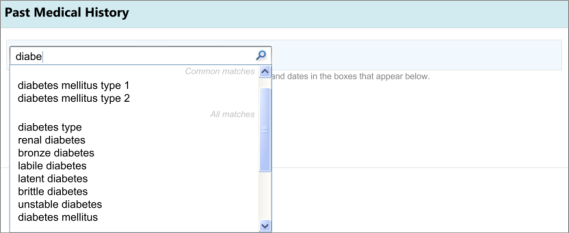

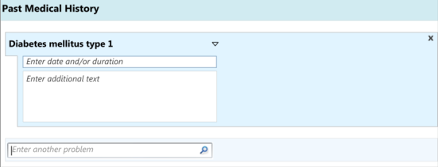

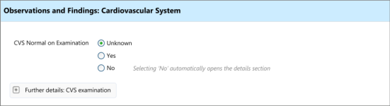
HSCIC Controlled Document

Section 5 – Required Fields

Possible clerking data:

 Presenting complaint

 History of presenting complaint

Section 6 – Displaying Previous
Values

Possible clerking data:

 Vital signs

Section 7 – Automatic
Calculations Data

Possible clerking data:

 Glasgow Coma Scale

 BMI

 Vital signs

 Duration/date

Section 8 – Adding Free Text

Possible clerking data:

 Observations/ findings

 Cardiovascular system

 Respiratory system

 Abdomen

 Genitourinary

 Nervous system

 Musculoskeletal system

 Skin

Section 9 – General Form Designs

Possible clerking data:

 Any of the data areas

Table 6: Summary of Guidance

Copyright ©2013 Health and Social Care Information Centre

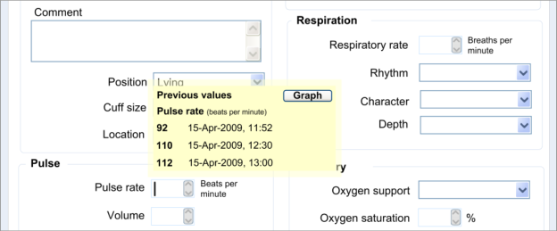

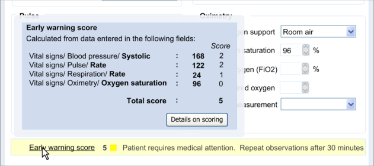

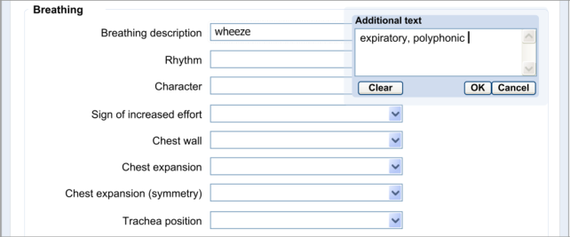

Page 10

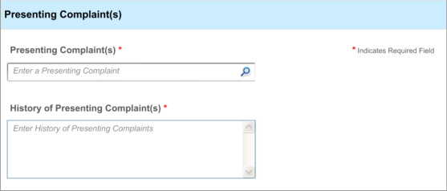
HSCIC Controlled Document

#### 3 ENTERING A LIST OF NOTE ENTRIES

##### **3.1 Introduction**

These design guidelines address the creation of any list that comprises brief notes about a set of
clinical situations, where efficiency and accuracy are prioritised over capturing detail.

This guidance applies to situations where the clinician is making a list of clinical items, such as
problems or procedures, where each clinical note entry is summarised in a concise, but accurate
format.

The designs shown in this guidance aim to allow a clinician to quickly and safely make a list of
entries.

The basic guidelines can apply to the following, amongst other areas:

 Past medical history

 Problem list

 Summary of procedures

 Action list

In some of the cases, further customisation may be required, but the basic guidelines will apply to
all of them.

The following list outlines the main user requirements for the feature addressed by the guidance in
this section. These user requirements were elicited following discussions with a panel of expert
clinicians and a series of interviews with training grade doctors:

 User must be able to enter text and match an appropriate SNOMED CT concept in the

context of the admissions clerking form

 User must be able to match multiple SNOMED CT concepts sequentially under a single

heading or subheading within the admissions clerking form

 User must be able to elaborate a single concept (or post-coordinated expression ) with

free text

 User must be able to delete matched concepts within the form before it is committed to

the record

 Users must be aware of the fixed choice attribute options available to them when they are

entering free text, for example for selecting laterality of a body site

 User must be encouraged to select or enter encoded options, where possible

 If appropriate, allow users to specify duration and dates for a concept

##### **3.2 Principles**

The following key principles inform the guidance in this section:

 Improving speed of entry whist maintaining accurate data:

 The list could be fairly long and therefore speed, in addition to accuracy, is a key factor.

 Unlike other situations, such as during a detailed physical examination, the UI will not
require the clinician to enter a lot of detail, structured or otherwise.

Page 11

Copyright ©2013 Health and Social Care Information Centre

HSCIC Controlled Document

 Instead, the emphasis is on capturing the main clinical details and moving on to the
next entry as quickly as possible.

 Encourage structured (encoded) data entry:

 Given the potential reuse of the data (for example, during the patient’s hospital stay),
capturing the accurate meaning of the clinical entries plus any relevant context is
essential to avoid its later misinterpretation, which could compromise the care delivered
to the patient.

 Therefore, the designs also encourage structured (encoded) data entry in order to
ensure accurate, unambiguous data entry.

 Arrange entries so that they are easy to scan visually. As clinicians are building up a list,

which could be ordered chronologically or otherwise, it will be necessary for them to scan
this as they are entering it, in order to:

 Maintain an ordered ‘picture’ in their mind

 Ensure that they have not missed or duplicated anything

 Screen design heuristics:

 Flexibility and efficiency of use

 Aesthetic and minimalist design

 Error prevention

##### **3.3 Guidelines**

The guidelines in this section are based around the following actions:

 Entering the clinical concept

 Entering additional details

 Editing the main clinical concept or the additional details

 Deleting an entry

This assumes a distinction between the main clinical concept and its additional details. Our
research (see APPENDIX B) has shown that clinicians understand this distinction, in the specific
context of entering a ‘Past Medical History’ list, and find it intuitive to enter one or two words which
describe the clinical situation and then add some further details associated with that situation.

Also, our analyses showed that it would be more efficient and intuitive for clinicians to enter the
additional details for a concept immediately after entering it, rather than entering all the main
concepts followed by all their associated details. This ordering was shown to be intuitive in the user
testing (see APPENDIX B) we later conducted.

In the context of the current guidance, editing the concept and/or its additional details would only be
done _**before**_ the data was committed to record and shared with other clinicians. This editing could
be done, for example, if the patient told the clinician some additional facts or corrected details
during the course of the noting, or if the clinician decided immediately after writing an entry that it
would be better expressed in a different manner. Therefore, this guidance is not covering the action
of updating data.

Likewise, guidance relating to deleting entries in the list would only apply to data that had not yet
been committed to record.

Editing and deletion of data after it has been committed to record, and thus potentially seen by
other clinicians, may also require a tight system of audit which itself could require warnings and
other relevant interface controls. However, these situations are not covered in the current guidance.

Page 12

Copyright ©2013 Health and Social Care Information Centre

HSCIC Controlled Document

It is assumed in this guidance that the clinician will be recording multiple entries sequentially.

Finally, this guidance only addresses the action of entering data and the display of data _during its_
_entry_ . It does not cover how the data should be displayed at a later time.

###### **3.3.1 Entering the Clinical Concept**

The first action that the clinician will perform will be to enter a clinical concept into the list, prior to
entering associated details.

This guidance includes:

 Entering and encoding the clinical concept

 Entering and encoding the next clinical concept

 Displaying common matches (where appropriate)

 Handling ‘match not found’

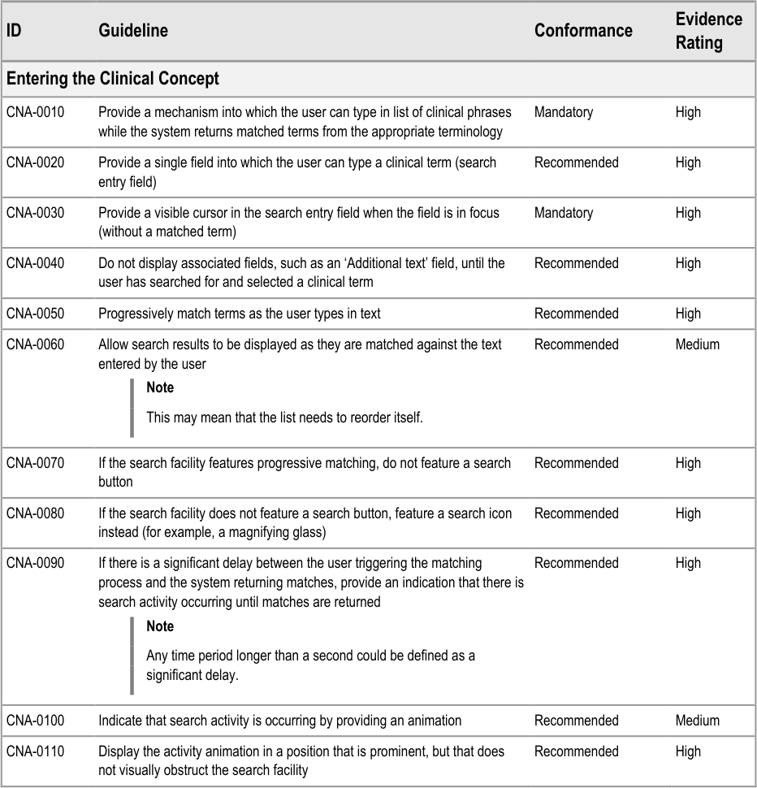

Page 13

Copyright ©2013 Health and Social Care Information Centre

HSCIC Controlled Document

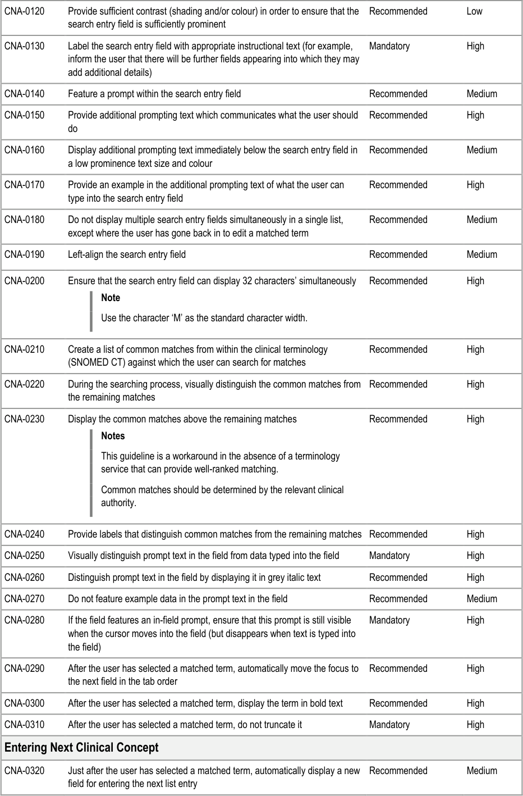

Page 14

Copyright ©2013 Health and Social Care Information Centre

HSCIC Controlled Document

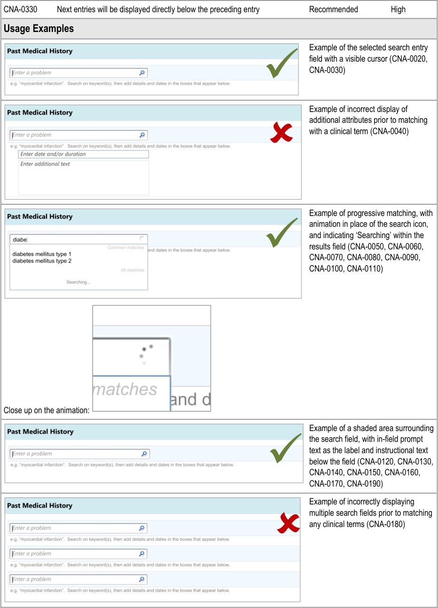

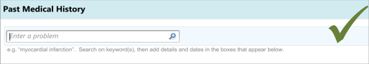

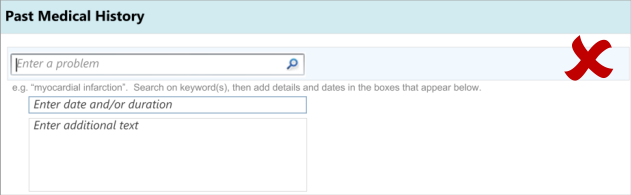

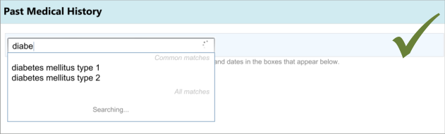

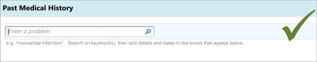

Page 15

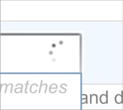

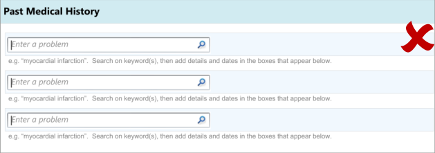

Copyright ©2013 Health and Social Care Information Centre

HSCIC Controlled Document

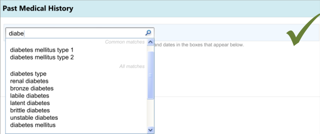

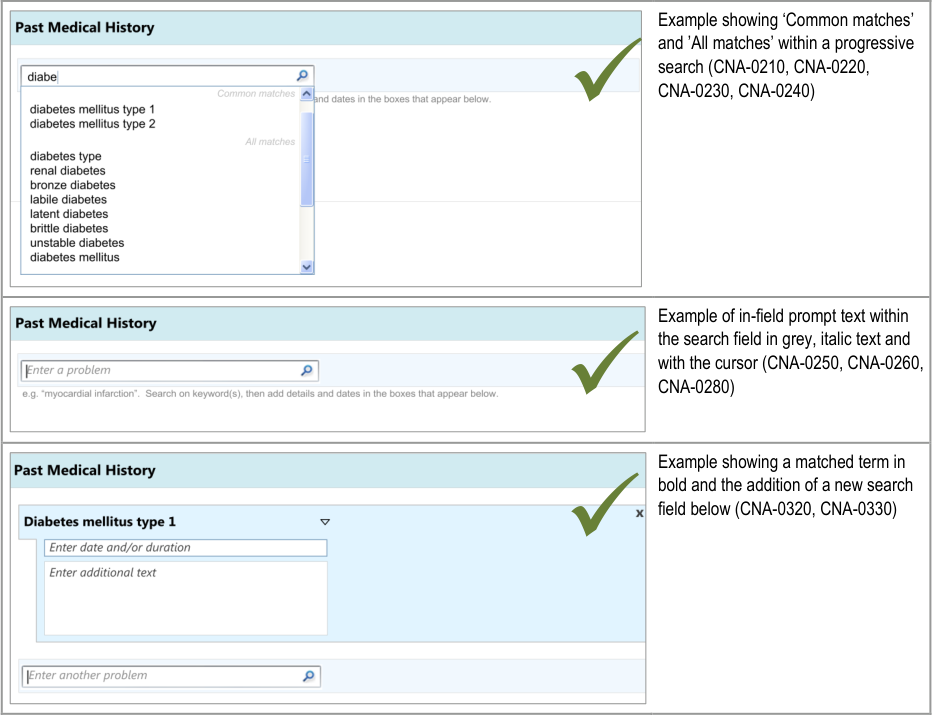

Page 16

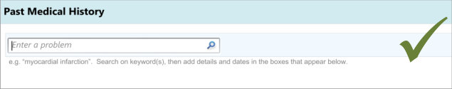

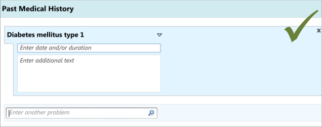

Copyright ©2013 Health and Social Care Information Centre

HSCIC Controlled Document

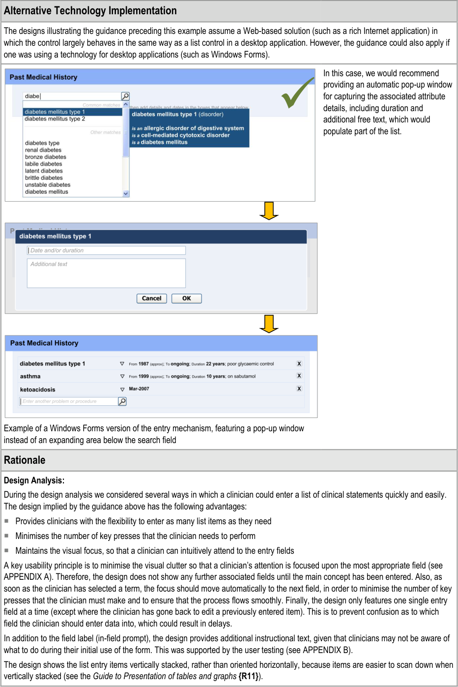

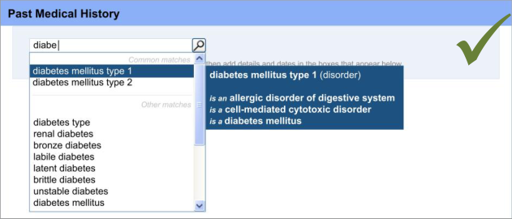

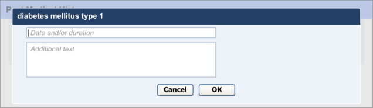

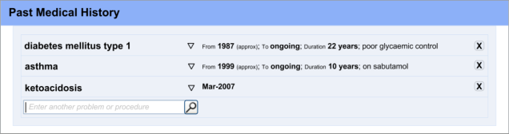

Page 17

Copyright ©2013 Health and Social Care Information Centre

HSCIC Controlled Document

**Desk Research:**

The mechanism for SNOMED CT matching, including the entry field size and the visual display used for distinguishing common
matches with other matches are based upon previous CUI guidance. For example, the width of the search entry field (32 characters)
was determined in _Design Guide Entry – Terminology – Matching_ **{R14}**, based upon analysis of the lengths of SNOMED CT terms.
Additionally, the display of the encoded term is also drawn from previous CUI guidance (see _Design Guide Entry – Terminology –_
_Display Standards for Coded Information_ **{R16}** ).

The use of ‘common’ items is sometimes used in existing paper forms in order to provide quicker entry and prompting (for example, in
_Hospital Admission Pro-forma Headings and Definitions_ **{R2}** ). This feature is also supported by an international standard, which
states that if the “frequency of option use is known (or can be determined) and option groups are small (eight or less), the most
frequently used options should be placed first” in a menu (see _Menu dialogues_ **{R6}** ).

In a recent paper outlining principles for effective clinical decision support, the authors referenced research that suggested clinicians’
satisfaction with a clinical system markedly declines if the time taken to provide system feedback exceeds one second. The authors
therefore suggested ‘subsecond screen flips’ (see _Ten Commandments for Effective Clinical Decision Support: Making the Practice of_
_Evidence-based Medicine a Reality_ **{R5}** ). This supports the need for an animation to appear if the screen change exceeds one
second **{R5}** . The need for “timely and perceptible feedback” associated with “normal task performance” which is “non-intrusive” and
does not “distract the user from the task” is also supported by international standards (see _User guidance_ **{R10}** ). Another standard
indicates that “if the system response to option execution” is delayed, “an indication should be provided to the user that the system is
processing the request” **{R6}** . This standard defines a delay as being “more than 3 s[econds] after initiation” **{R6}**, although the current
guidance authors argue that the need to reduce frustration on the part of the clinician would point to providing the indication quicker
than 3 seconds.

International standards also recommend that prompts (“user guidance information”) should be “readily distinguishable from other
displayed information” and that such messages “should provide the user with specific information relative to the task context rather
than generic messages” **{R10}** . It also states that such text “should not disrupt the user’s task and the continuation of the dialogue”
**{R10}** .

The need for a visible cursor is also underlined by a relevant standard, which states that “cursor position should always be clearly
visible if it is within the currently displayed portion of the form” (see _Form-filling dialogues_ **{R7}** ).

**User Research:**

A series of iterative usability tests (see APPENDIX B) showed that:

 Failure to provide a visible cursor encourages unnecessary mouse clicks and causes confusion

 Some clinicians would try to (incorrectly) type in a full sentence into the search entry field, prior to the introduction of progressive

matching and prompting text

 Where progressive matching had been implemented, providing a search button confuses clinicians

 Failure to provide an indication of search activity leads to unnecessary mouse clicks and user frustration

 Initially, clinicians can find it difficult to find the search entry field if it is not sufficiently prominent in relation to other fields

 Clinicians expected a list of common ‘Past Medical History’ matches and found it difficult to find a common match when there was

no separate list of common matches

Speed is a priority factor when completing an admissions clerking form. The UI should be geared towards reducing the time that it
takes to return matched results

**Hazard Risk Analysis Summary** :

**Potential Hazards:**

 Clinician tries to enter text that does not match the encoding

terminology

 Mechanism is so time consuming that the clinician does not

have sufficient time to complete the form

**Mitigations:**

 Provide progressive matching and instructional text

 Minimise number of user actions, such as number of

keystrokes

Page 18

Copyright ©2013 Health and Social Care Information Centre

HSCIC Controlled Document

###### **3.3.2 Dealing with ‘Match Not Found’**

This section addresses how the UI should behave, and what options it should offer, if clinicians
cannot find the term for which they are searching. This guidance has implications beyond the scope
of entering a list, and could apply to any matching of encoded terminology.

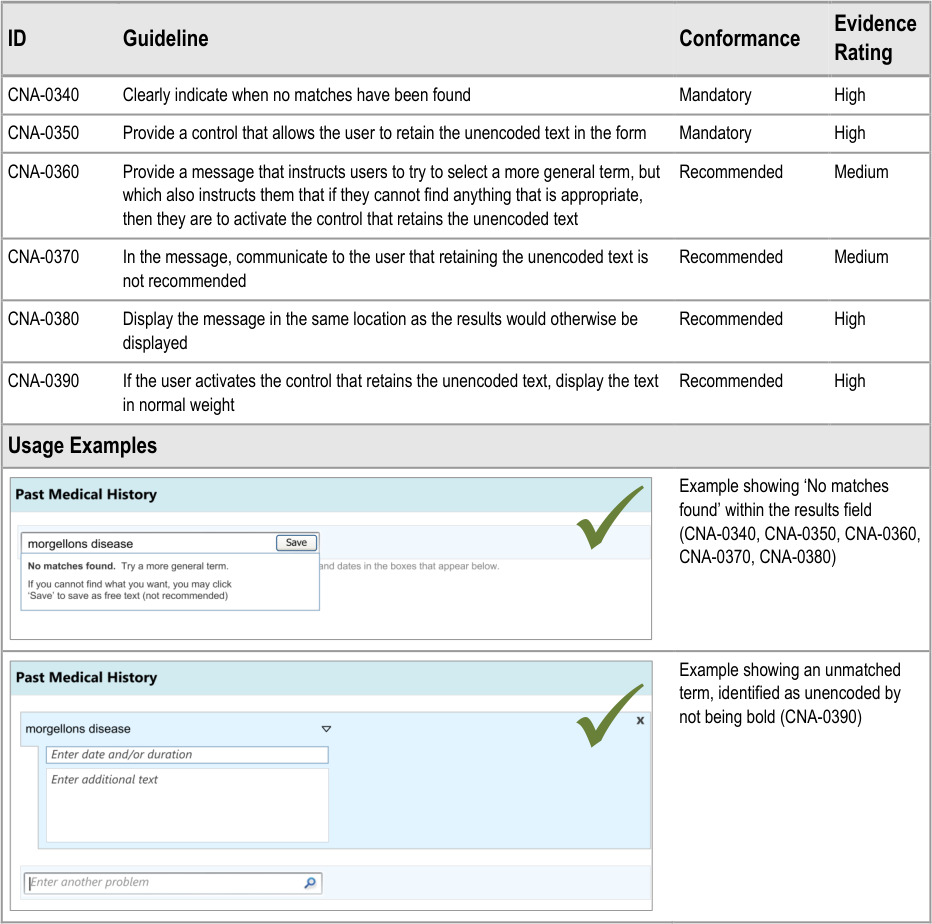

Page 19

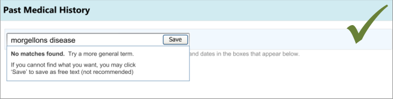

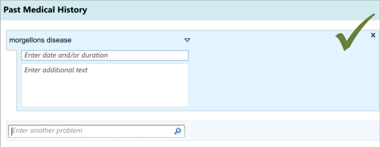

Copyright ©2013 Health and Social Care Information Centre

HSCIC Controlled Document

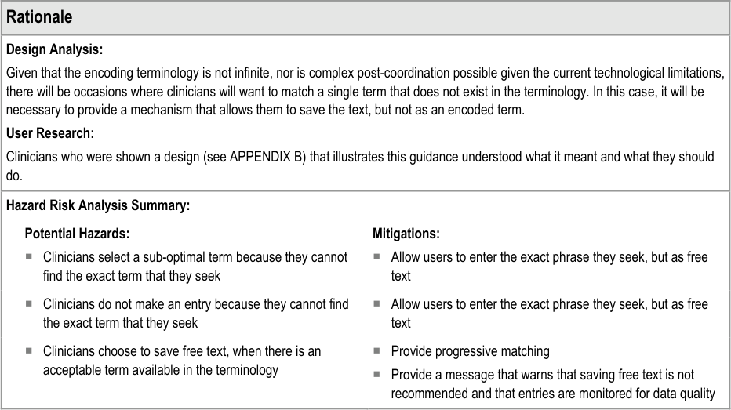

Page 20

Copyright ©2013 Health and Social Care Information Centre

HSCIC Controlled Document

###### **3.3.3 Entering Additional Details**

In addition to entering an encoded concept, it is often necessary to record some additional details,
for example dates, durations and free text to elaborate the description of the situation. In the
context of admissions clerking, this guidance focuses upon entering the duration and dates of the
clinical situation that is being summarised, in addition to entering free text which elaborates the
main concept. However, this guidance could also apply to other attribute fields, depending upon the
clinical noting need.

**Note**

In this context, the term ‘attribute’ refers to a concept which in some way further describes, characterises
or contextualises another concept. For example, ‘severe’ could be an attribute of ‘gastroenteritis’, as could
the date on which it occurred.

This guidance includes:

 Entering duration and/or date(s)

 Entering free text elaboration

 Entering other structured attributes (including additional fields for capturing context
specific or concept-specific attribute data)

 Matching SNOMED CT qualifiers

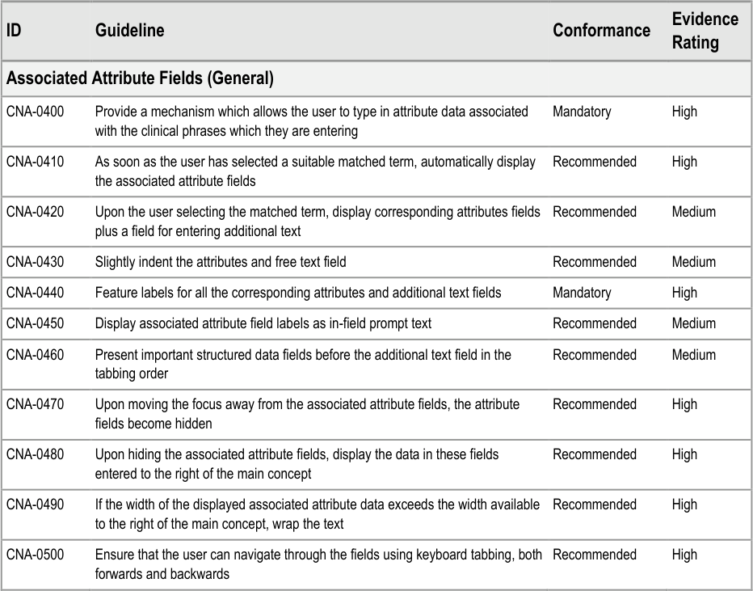

Page 21

Copyright ©2013 Health and Social Care Information Centre

HSCIC Controlled Document

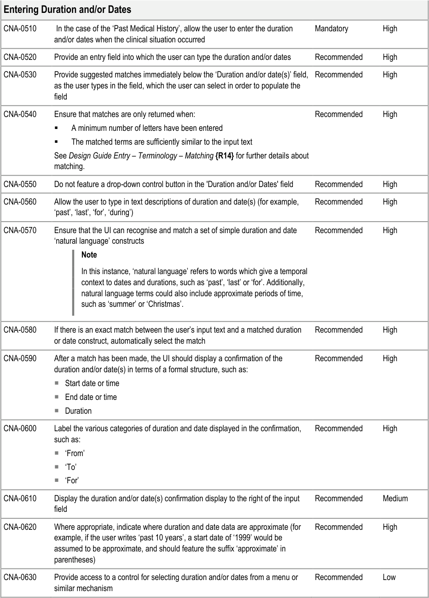

Page 22

Copyright ©2013 Health and Social Care Information Centre

HSCIC Controlled Document

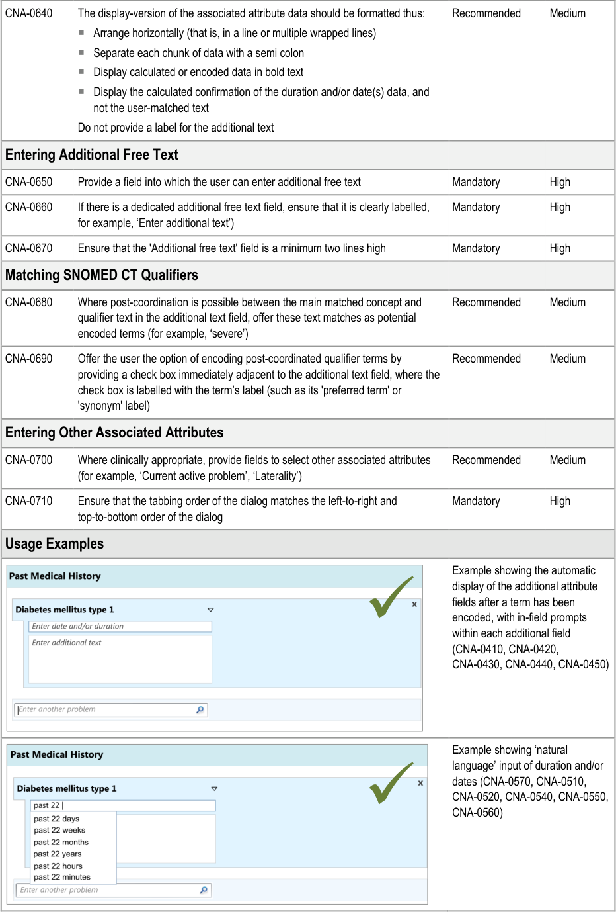

Page 23

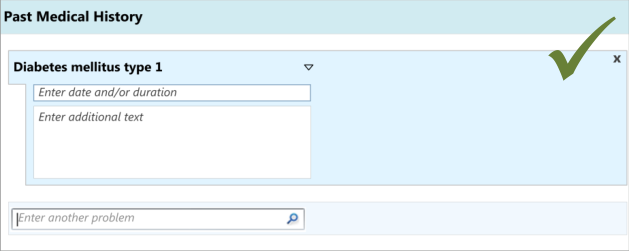

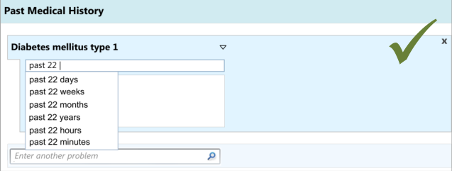

Copyright ©2013 Health and Social Care Information Centre

HSCIC Controlled Document

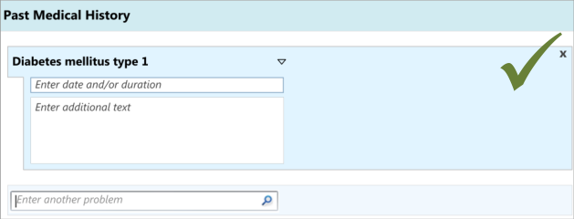

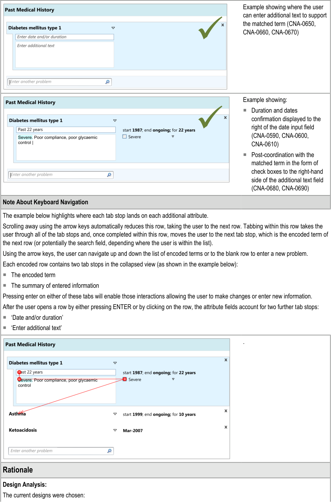

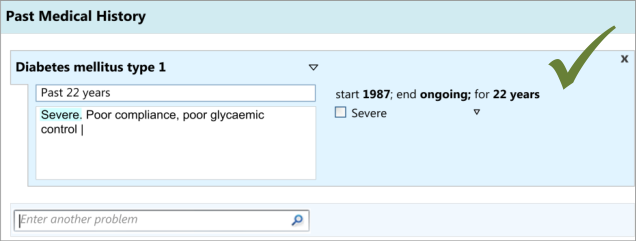

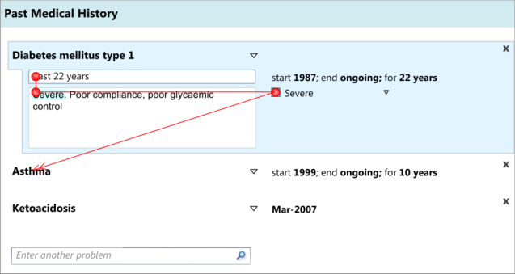

Copyright ©2013 Health and Social Care Information Centre

Page 24

HSCIC Controlled Document

 For speed of use: the number of tab and click actions have been minimised

 Because the current arrangement draws the clinician’s attention to the fields: they are located immediately below the previous one,

which is an intuitive location to look for the next field

Visually communicating a visual hierarchy between the fields, for example by indenting those lower in the hierarchy, can indicate that
the associated attribute fields ‘belong’ to the main concept.

Locating the duration and/or date field _**before**_ the additional text field is suggested in order to encourage clinicians _**not**_ to enter
duration and/or date information as free text.

Analysis of SNOMED CT indicates that single concepts are often not sufficient on their own to express realistic clinical statements.
Therefore, a field for recording additional free text is required in addition to the main concept field.

The design should be ‘expandable’ to be able to feature fields for other attributes, depending upon the concept matched, such as
‘laterality’ (that is, whether the relevant body site is on the left, right, both or neither), as some attributes may be very important for the
safe communication of the clinical concept.

**Desk Research:**

Relevant ISO guidance states that ‘all fields should be clearly and unambiguously labelled to describe what kind of content should be
entered’ (see _Form-filling dialogues_ **{R7}** ) and that these labels must be ‘distinctive’ in relation to data or instructions, for example,
using visual cues such as position, font or colour, and that these visual cues should be applied consistently throughout the form.
Therefore, provide sufficient labelling of the fields. These labels can be in-field ‘prompts’, as defined in the _Microsoft Windows User_
_Experience Interaction Guidelines_ **{R22}** .

Previous CUI guidance on terminology matching and elaboration demonstrates the need for an additional text field to complement the
single concept matching field. It also demonstrates how qualifier concepts, such as severity, can be matched within the additional text
field (See _Design Guide Entry – Date and Time Input_ **{R13}** and _Design Guide Entry – Terminology – Matching_ **{R14}** ).

Style guidance for established UIs indicates that the free text field must be a minimum of two lines high and that a vertical scroll bar
appears after the clinician’s typed entry exceeds the visible space (see _Essential guide to user interface design_ **{R21}** ).

The need to allow the clinician to complete the entry fields just using the keyboard is supported by relevant international standards
indicate that “the need for users to switch between different input devices when filling in a form should be minimized” **{R7}** . Another
standard also states that “if a keyboard is available, a keyboard method for selecting and executing options should be provided in
addition to the pointing device method” **{R6** }.

**User Research:**

Previous CUI user research, addressing the input of adverse drug reaction risks, has shown that clinicians did not understand a control
whereby the clinician can select a matched term and then type in additional text within the same field. In that set of test, the clinicians
also tended to want to click into the next input field below, rather than the one adjacent (see _Design Guide Entry – Terminology –_
_Display Standards for Coded Information_ **{R16}** ).

In the current CUI research (see APPENDIX B), clinicians indicated that they felt that the designs lacked order and felt too time
consuming, even though they were using them quickly and without errors. Therefore, the current designs feature the associated
attribute fields close together, well-aligned and slightly indented from the main concept in order to imply that they hierarchically ‘belong’
to the main concept.

As part of the CUI research (see APPENDIX B), interviews with clinicians indicated that, while writing the ‘Past Medical History’ they
often record dates and durations, where known and where relevant. However, these interviews and the subsequent usability testing
showed that these date and durations are often recorded in a more colloquial and approximate manner than the more formal way often
required for the electronic input of dates and durations. For example, they may write ‘past 10 years’ or simply ’during childhood’.
Therefore, the design allows for this type of input. During the user testing, a more formal method of date and duration capture was
evaluated that used calendar boxes, which was understandable and usable, but that some clinicians indicated would be too
complicated and ‘fussy’ for noting as part of the ‘Past Medical History’.

User testing (see APPENDIX B) showed that the ‘suggested matches’ design of the date entry field was understood and easily used
by clinicians, although it did suggest the need to ensure that if there is a perfect match between the input text and the matched date or
duration item, then the item should be selected automatically. This was because the clinicians did not always scroll down and select
from the list. Clinicians tended to appreciate the ‘confirmation display of their ‘natural language’ input in terms of the more formal
‘Start’, ‘End’ and ‘Duration’.

User testing (see APPENDIX B) also revealed that providing a button which initiates a ‘drop-down’ list on the ‘duration and/or date(s)’
field encourages clinicians to click on the button without typing anything in.

**Hazard Risk Analysis Summary:**

Page 25

Copyright ©2013 Health and Social Care Information Centre

HSCIC Controlled Document

**Potential Hazards:**

 Start-date automatically calculated from an

entered duration falsely implies a precision that is
not correct

 If the system encodes free-text durations entered

by the clinician, and the system sorts data by date,
records with encoded free-text duration dates may
not show correctly in the sorted list

**Mitigations:**

 Indicate that a date is approximate if it has been derived from words

such as ‘past 22 years’ or ‘10 years ago’. Feature the date at an
appropriate level of detail, depending upon the user's input

 Convert durations provided in free-text format into standard format

where at least two of the following values are recorded:

 Start date

 End date

 Duration

Page 26

Copyright ©2013 Health and Social Care Information Centre

HSCIC Controlled Document

###### **3.3.4 Editing and Deleting Entries**

This section focuses upon the actions of editing and deleting entries in a list. These are obviously
important, given the fact that clinicians may need to go back and change the document during the
process of writing it: they may remember relevant details later in the process of writing, or maybe, if
they are noting at the same time as clerking the patient, the patient may correct themselves or
remember further details after a clinical situation has been noted. Anecdotal evidence suggests that
patients often forget diseases or conditions that only become apparent when their drug history is
taken.

**Note**

The guidance below does not account for situations where the notes have been saved to the patient’s
record and the information has been effectively shared with the wider health team. In those cases, any
edits or deletions must be accompanied by a rigorous auditing mechanism, given the dangers and legal
implications involved in changing aspects of a patient record.

This guidance addresses:

 Editing the main concept

 Editing additional details

 Deleting entries

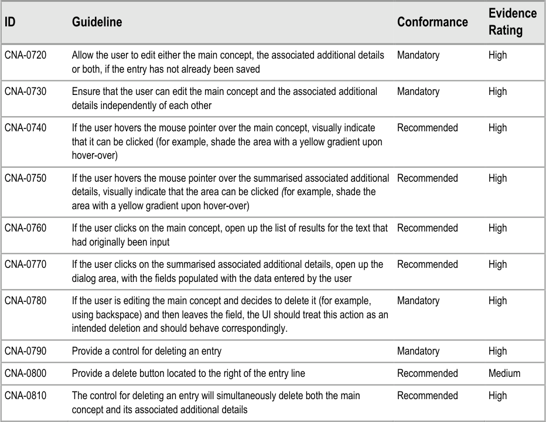

Page 27

Copyright ©2013 Health and Social Care Information Centre

HSCIC Controlled Document

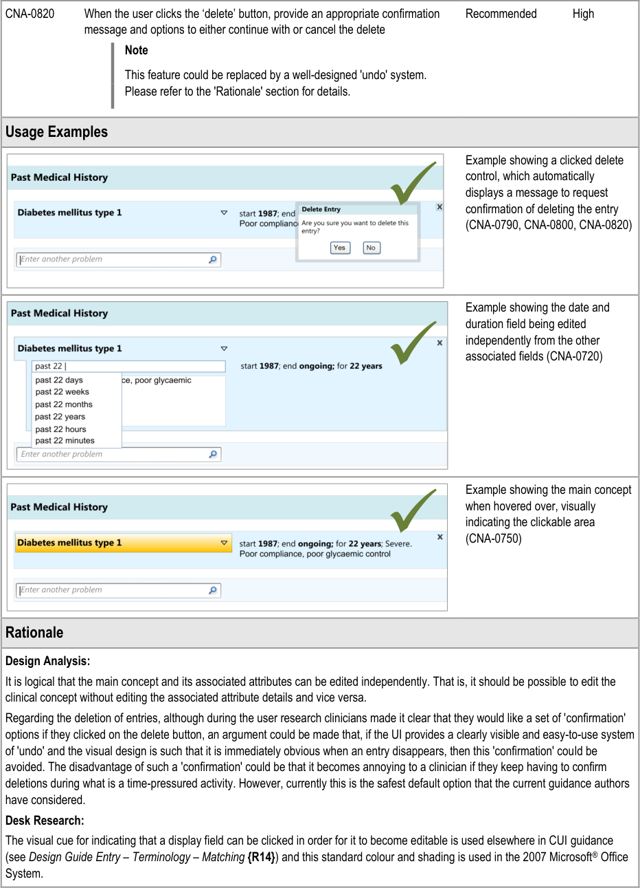

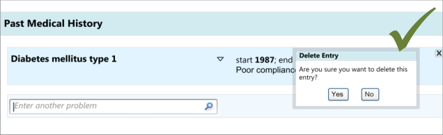

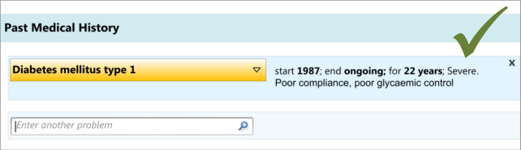

Page 28

Copyright ©2013 Health and Social Care Information Centre

HSCIC Controlled Document

**User Research:**

This mechanism was tested and clinicians used it correctly (see APPENDIX B). They found it natural to click on the associated
attribute details in order to edit them.

During the early design iterations, participants were provided with a control for deleting an entry. Although they could clearly see how
to delete an entry, participants indicated that there should be a 'confirmation' message which contained a set of options to either go
ahead with the deletion or to cancel it, as they were worried they could delete an entry by accident. Indeed, one participant had deleted
an entry by accident in a previous task without initially realising he had done, and he indicated that a confirmation message would
have been useful.

It is worth noting that the researchers did not test an 'undo' function, nor did they explore other ways of ensuring that the visual design
made it very clear if something had been deleted. In further discussions with clinicians following the testing, the issue was raised that
the confirmation dialog box could be annoying to frequent users, but no alternative designs have been tested.

Page 29

Copyright ©2013 Health and Social Care Information Centre

HSCIC Controlled Document

#### 4 REVEALING AND HIDING SECTIONS OF A SET OF DATA

##### **4.1 Introduction**

In this section, the guidance explores how to hide and reveal sections of a form. This will be an
important feature in clinical noting, given the vast array of potential data entry fields in contrast to
the limited number of fields that any given clinician will require in the case of a specific patient.
Simply presenting all the possible fields and allowing the clinician to pick and choose which ones to
complete would be prohibitive in terms of the clinician’s time and effort, not to mention the negative
impact on the clinician’s satisfaction with the system: imagine having to scroll through twenty fields
to get to the field that one wants. It would be overwhelming and fields could be missed or not found.
Therefore, some fields should be hidden when the clinician first views the form.

The current guidance is limited to traditional form designs and does not explore in detail complex
navigational structures. Instead, it seeks to show how a form can be expanded and contracted to
reveal sections of data-entry fields.

This guidance demonstrates how a form can be expanded and contracted in a basic manner. It
does not prohibit other more complex navigational structures in forms. The research showed that
clinicians understood and could use this basic mechanism for revealing and hiding data fields. But,
it also showed that, where there were a lot of data fields, clinicians felt that this basic form design
could be laborious and time consuming to use (see APPENDIX B). Therefore, this guidance should
be used only in situations where a traditional form design is deemed appropriate.

The user requirements for this section of the guidance are:

 Ensure that in a given view, the UI can filter out optional data fields in a set of data, until

the point at which the user requests them or they are triggered by the UI (contingent upon
data entered or selected)

 Provide a control for revealing optional data fields

 Ensure that users are aware of the type of data fields that they are able to access (prior to

them accessing them)

 Allow users to hide optional data fields that have not been completed

 Do not allow users to hide data fields that have been completed, unless the data is

summarised elsewhere. The default view will be that the data that has been recorded by
the user is always visible.

##### **4.2 Principles**

The following key principles inform the guidance in this section:

 Screen design heuristics:

 User control and freedom

 Visibility of system status

 Consistency and standards

 A clinician dealing with an individual patient in a given clinical situation is likely to only need

to complete a proportion of the possible fields available

 Do not present all possible data entry fields to a clinician at any one time

 Help clinicians to quickly find the fields that they need to complete

Page 30

Copyright ©2013 Health and Social Care Information Centre

HSCIC Controlled Document

 Reduce visual distractions to the clinician’s current task

##### **4.3 Guidelines**

This guidance comprises four main areas:

 Communicating that there are more hidden fields

 Accessing hidden fields

 Hiding fields

 Displaying hierarchically nested sets of fields

###### **4.3.1 Accessing Hidden Fields**

The UI must allow the clinician to quickly and easily access hidden fields.

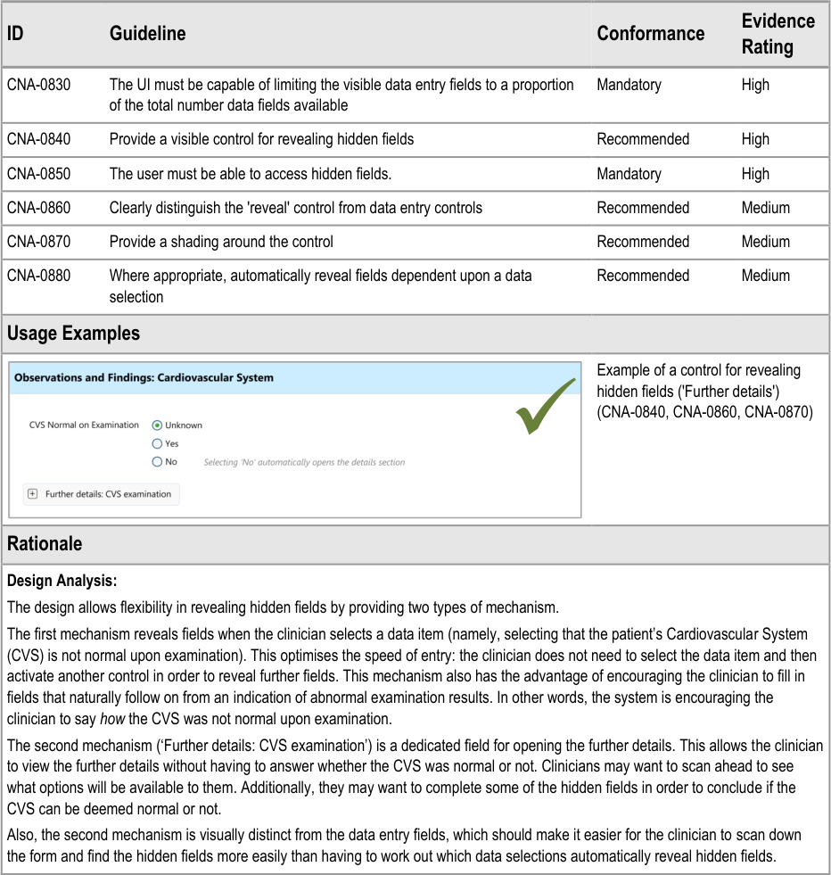

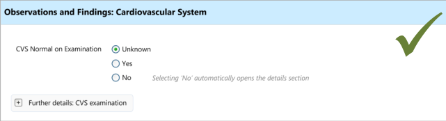

Page 31

Copyright ©2013 Health and Social Care Information Centre

HSCIC Controlled Document

**Desk Research:**

The mechanism for revealing the hidden fields has precedence in a number of existing applications, some of which will be very familiar
to clinicians. A good example is the ‘+’ button in Microsoft Outlook, a popular desktop email application through which NHSmail can be
accessed.

Additionally, the automatic revealing of fields through a data selection is a common feature on many desktop and Web applications,
many of which will be familiar to clinicians.

Indeed this feature is recommended by relevant international standards which state that ““if/then” interdependency rules among entry
fields” should either be avoided or should ”automatically be handled by the system by constraining user choices and visible fields”. In
this way the form hides fields until a data selection logically implies that these fields should be completed and the UI automatically
reveals the fields **{R7}** . A further standard also supports the notion of hiding options that are not relevant to the user at a given point in
time, which states that if “information concerning unavailable options is not required for the task”, then “only options available to the
user should be presented” **{R6}** .

**User Research:**

Testing (see APPENDIX B) revealed that just making a data selection was not sufficient and that the dual route to revealing fields was
necessary in order to be usable. Participants indicate that they did not want to be forced to make a data selection in order to see what
fields could be made available to them. However, they did understand how to open fields automatically by selecting ‘No’ (for the field
‘CVS normal on examination’)

###### **4.3.2 Communicating That There Are Hidden Fields**

The first requirement for revealing hidden fields is to communicate to the clinician that there are
hidden fields which may be revealed. If the UI does not communicate that there are hidden fields,
then the clinician may not be aware that such fields exist and may not find them. The existence of
the fields should be communicated along with a brief description of what the topic the fields cover.

This section addresses how this should be done in a basic manner, which conforms to traditional
electronic form design (for details of traditional electronic form designs, see _Essential guide to user_
_interface design_ **{R21}** ).

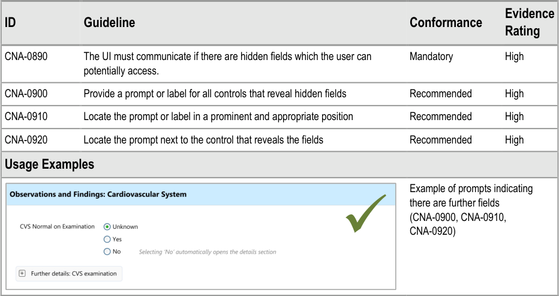

Page 32

Copyright ©2013 Health and Social Care Information Centre

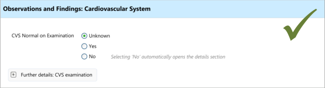
HSCIC Controlled Document

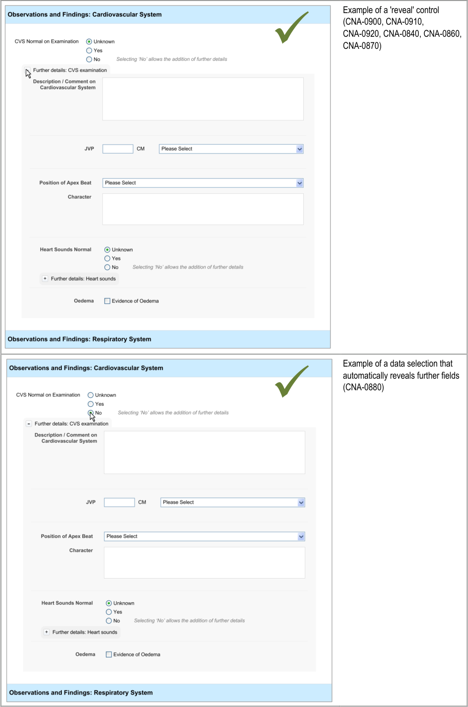

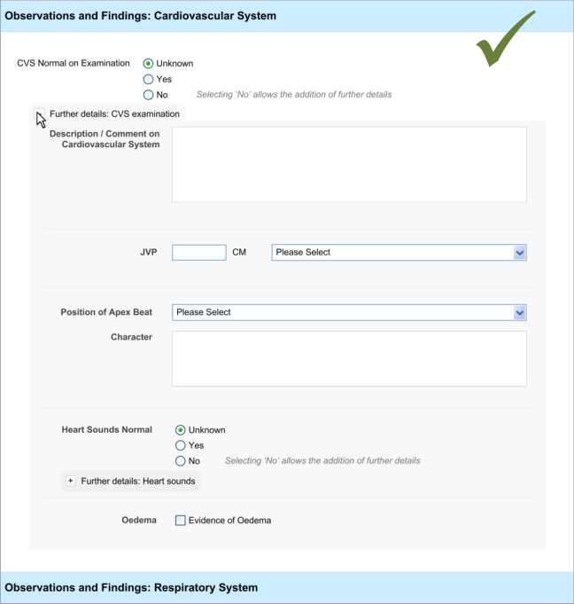

Page 33

Copyright ©2013 Health and Social Care Information Centre

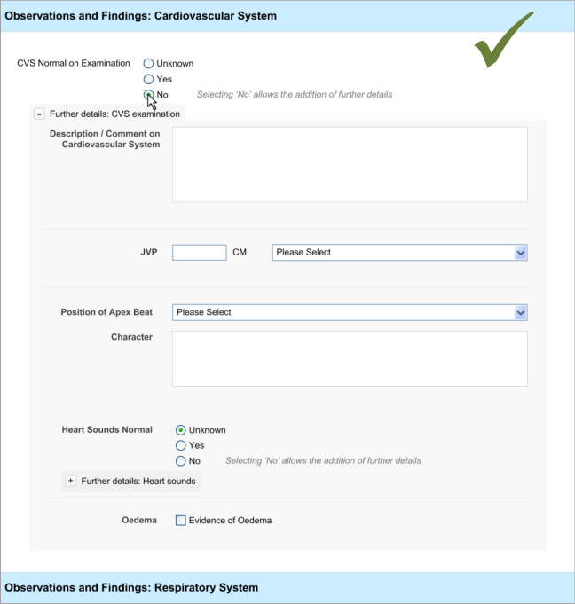
HSCIC Controlled Document

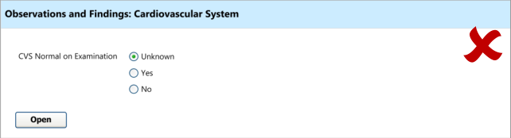

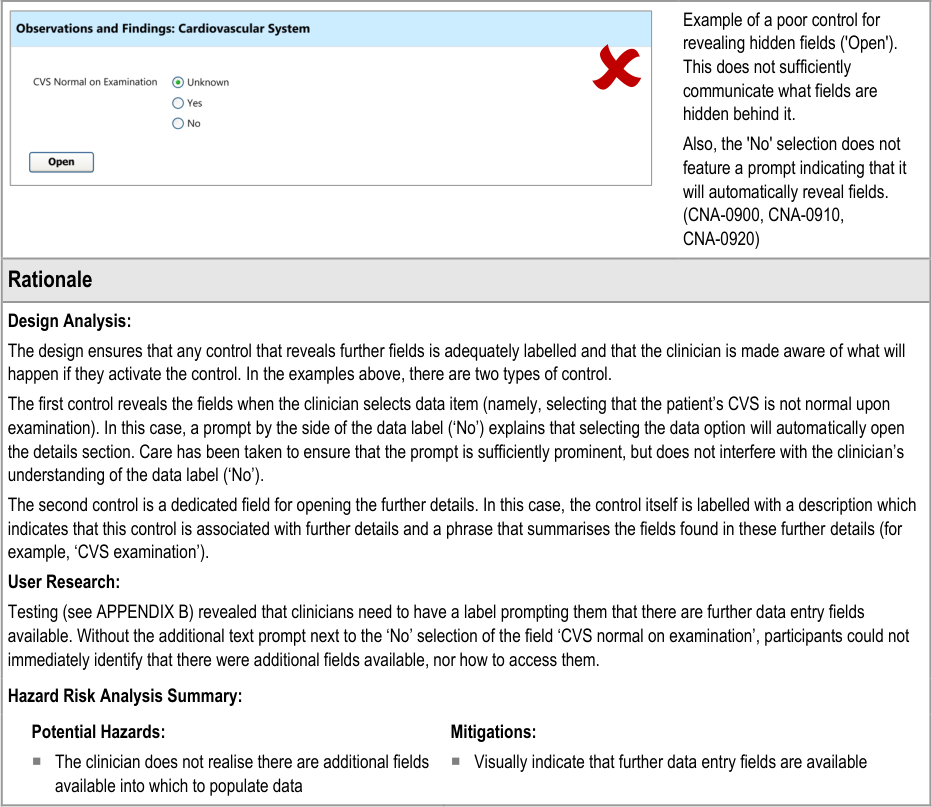

###### **4.3.3 Hiding Fields**

Upon opening a section of fields, the clinician may decide not to enter any details into that section,
and then hide those fields again, in order to focus on other fields.

This will be an important action as, if the clinician cannot hide fields after opening them, the form
could become overwhelming and unwieldy.

This section of the guidance addresses how sections of fields can be hidden. It is worth noting that
the solutions explored in this section are limited in that they do not explore how a section of fields
can be hidden even if data has been entered into one or more of its fields. The designs shown in
the current guidance assume the safest default position; namely that if a section contains any data
entered by the clinician, it cannot be hidden. Also, the current design guidance does not explore the
automatic hiding of data fields, which could, if a safe solution is found, improve the clinician's
experience by reducing the numbers of actions required.

Future design research could identify a safe solution that allows fields to be hidden, manually or
automatically, even if data has been entered into them, but this is not covered in the current design
guidance.

Page 34

Copyright ©2013 Health and Social Care Information Centre

HSCIC Controlled Document

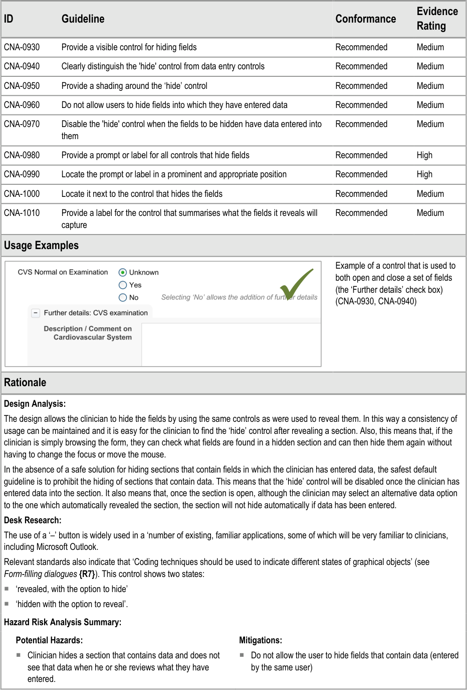

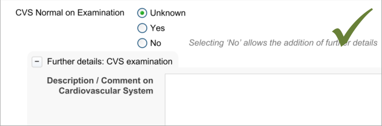

Page 35

Copyright ©2013 Health and Social Care Information Centre

HSCIC Controlled Document

###### **4.3.4 Displaying Hierarchically Nested Fields**

Where there is a section of fields that is located within another section, it may be important to
communicate the hierarchical structure so that clinicians can easily orientate where they are in the
form and to understand which fields will be hidden if they activate a given ‘Hide’ control. Failure to
adequately communicate which fields will be hidden by activating a ‘hide’ control could result in
confusion on the part of the clinician and accidental hiding of relevant fields.

This section of the guidance addresses how to communicate that one set of fields is ‘nested’ within
another.

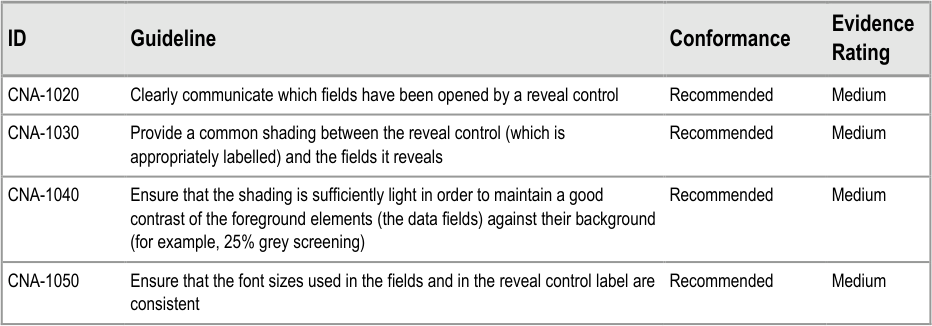

Page 36

Copyright ©2013 Health and Social Care Information Centre

HSCIC Controlled Document

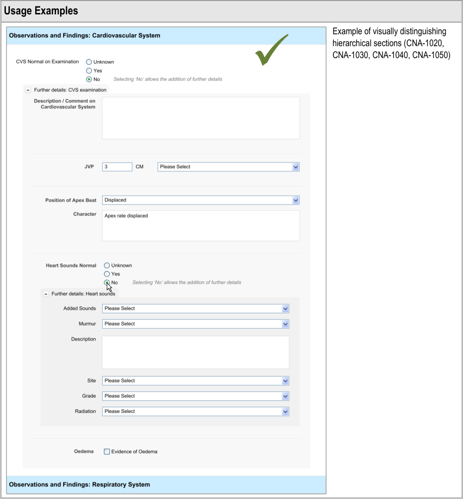

Page 37

Copyright ©2013 Health and Social Care Information Centre

HSCIC Controlled Document

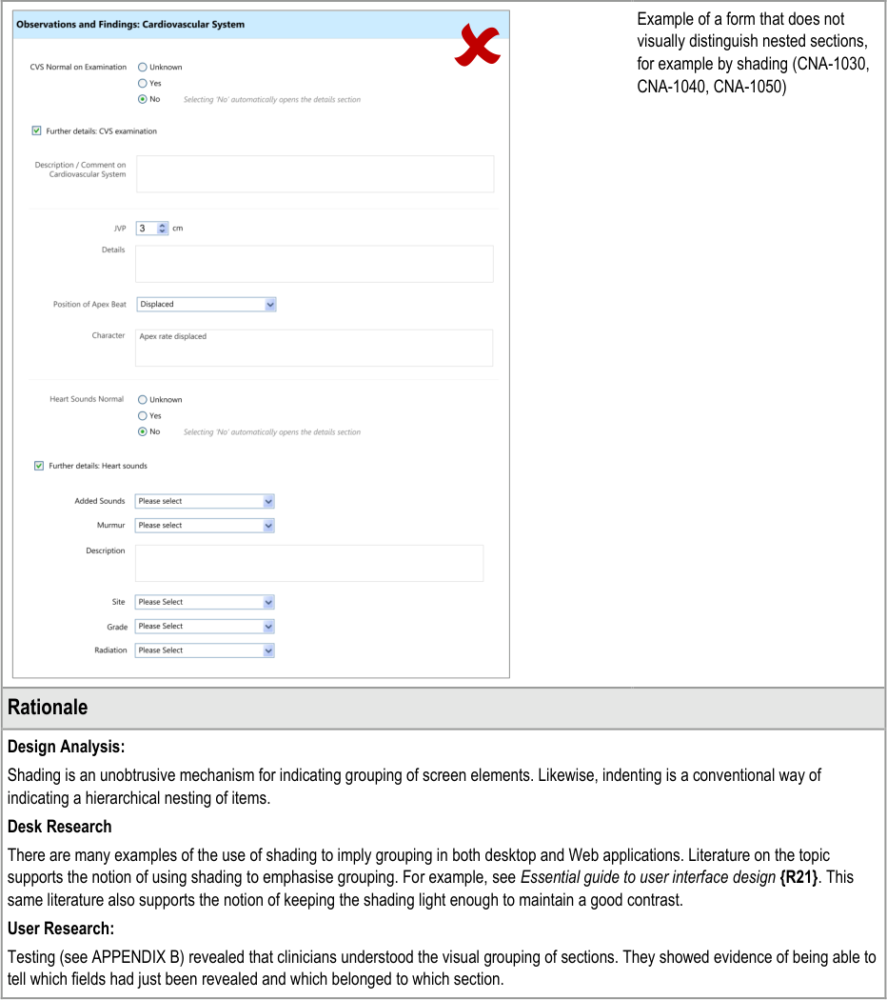

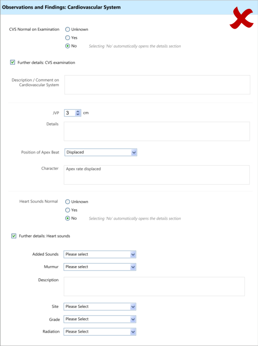

Page 38

Copyright ©2013 Health and Social Care Information Centre

HSCIC Controlled Document

#### 5 REQUIRED FIELDS

##### **5.1 Introduction**

In clinical noting, as in most data entry tasks, there will be data fields that the relevant authority will
deem to be necessary for the data author to address; that is, they must provide a selection or enter
text for that field. These fields are often referred to as ‘required’ fields and must be completed in
order for the data to be successfully saved to the record.

The current guidance is limited to situations where:

 Only a proportion of the total available fields are ‘required’

 There is a linear sequence of fields (and an accompanying tabbing order)

 Logically, the clinician can complete fields further in the sequence without having

completed a required field

 Clinicians need some degree of flexibility when completing the form

Where these conditions do not apply, other solutions may be applied that do not feature the
designs outlined in this section.

The user requirements for this section of the guidance are:

 The UI must be able to indicate to the user that one or more data fields are required

 Ensure that users are aware if they have 'missed' one or more required fields

**Note**

'Missed' is defined in terms of the user addressing other fields that are positioned later in the
tabbing order.

##### **5.2 Principles**

The following key principles inform the guidance in this section:

 Screen design heuristics:

 Visibility of system status

 Flexibility and efficiency of use

 User control and freedom

 Match between system and the real world

 Recognition rather than recall

 Do not overly restrict clinicians’ freedom to complete the form in the way they want

 Do not obstruct the clinician’s primary tasks

 Ensure that the clinician is aware of which fields are required and which are not

 Do not rely upon clinicians to remember which field(s) they have missed

Page 39

Copyright ©2013 Health and Social Care Information Centre

HSCIC Controlled Document

##### **5.3 Guidelines**

This guidance comprises two main areas:

 Proactively indicating required fields

 Reactively indicating required fields that have been missed

###### **5.3.1 Proactively Indicating Required Fields**

When clinicians are faced with a set of fields, some of which are required, the UI must distinguish
‘up front’ which ones are required and which are not.

This ‘proactive’ indication of required fields contrasts with a ‘reactive’ indication of required fields
that have been missed. ‘Reactive’ is when the UI indicates an uncompleted required field only
when the clinician attempts to move on. Reactive indication of required fields is discussed in the
next guidance section.

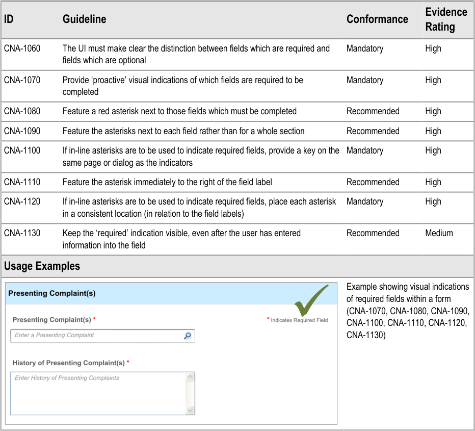

Page 40

Copyright ©2013 Health and Social Care Information Centre

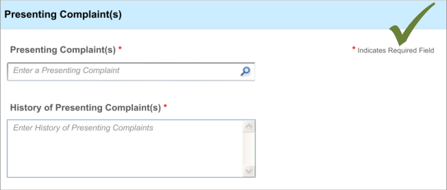
HSCIC Controlled Document

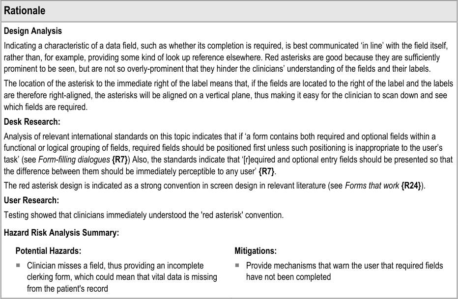

###### **5.3.2 Reactively Indicating Required Fields That Have Been Missed**

In addition to ‘proactively’ indicating required fields, and if the clinician is to be allowed some
flexibility in the order in which they complete the form, the UI must also warn the clinician where
they have missed out any required fields.

In this case, the term ‘missed’ refers to a situation where the clinician has not completed a required
field and has moved the focus to a point beyond the field in the tabbing order.

This guidance has been written with the assumption that, at any specific point in the completion of
the form, the required fields may not be visible. For example, in a form comprising ten pages, the
clinician might be viewing page 8, although there is a required field that they have missed on
page 2. Therefore, a mechanism may be required to indicate the fields that are required, which is
not in-line with these required fields.

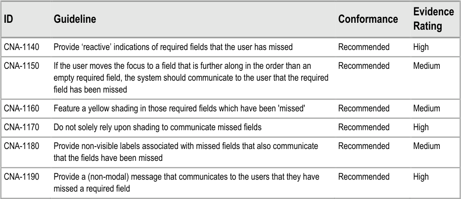

Page 41

Copyright ©2013 Health and Social Care Information Centre

HSCIC Controlled Document

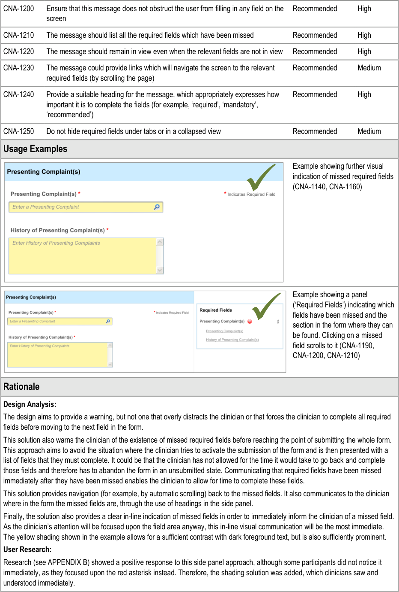

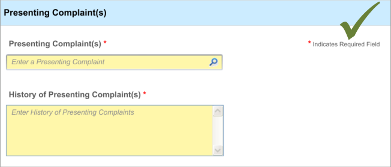

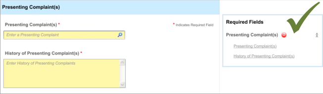

Page 42

Copyright ©2013 Health and Social Care Information Centre

HSCIC Controlled Document

**Hazard Risk Analysis Summary:**

**Potential Hazards:**

 If clinicians are forced to complete required fields at the end of

the admissions clerking process, rather than as they go along.
Risk that clinicians are forced to close the form without saving
it because they do not have time to go back and search for the
fields which are missing data

 If clinicians are unable to skip past required fields whilst

populating the form with data

**Mitigations:**

 Encourage users to complete required fields as they

progress through the form, although without forcing them to
do so

 Indicate to users that a missed field is required whilst

allowing them to progress and navigate through the form

Page 43

Copyright ©2013 Health and Social Care Information Centre

HSCIC Controlled Document

#### 6 DISPLAYING PREVIOUS VALUES

##### **6.1 Introduction**

At the point of entering new data about a patient, it may be useful for the clinician to be able to see
any previous instances of the same type of data. For example, if the clinician is about to enter the
patient’s pulse rate, it could be useful to see the previous pulse rate entries for that patient.

This contextual information may influence the clinician’s actions:

 They may change line of questioning or examination that they perform with the patient.

_Obviously this is only applicable if the clinician is entering the notes at the same time as the_
_examination._

 They may search for other data from the patient’s record in order to help their interpretation

of the data. For example, they may access the patient’s vital signs chart in order to see the
full trend of the data.

Therefore, it will be useful to display the last few values of a type of data as the clinician is about to
enter a new value.

**Note**

This feature is not intended to replace the graphical display of a full set of values; instead it is only aiming
to provide a limited window onto the most recent values.

Moreover, this guidance focuses upon the display of numerical values. Potentially this guidance
could apply to other types of data, such as descriptions of illnesses, but this has not been explored
in the designs nor in the research, and therefore any application of this guidance to non-numerical
data must be accompanied by further design and testing in order to ensure patient safety.

The user requirements for this section of the guidance are:

 Ensure that the user can access a sequence of recent values when entering the current

value into a field (for example, the last three values)

 Ensure that the dates and/or times of the previous values are clearly indicated when they

are being displayed

 Ensure that the order in which the previous values have been recorded is clearly evident

to the user

 Indicate that the data displayed may only be a proportion of the total data available

 Link to historical data or a graphical representation

##### **6.2 Principles**

The following key principles inform the guidance in this section:

 Screen design heuristics:

 Recognition rather than recall

 Aesthetic and minimalist design

 Do not obstruct the clinician’s primary tasks

 Values must be displayed with sufficient context to be meaningful and unambiguous

 Provide the clinician with sufficient context which may influence what questions they ask

Page 44

Copyright ©2013 Health and Social Care Information Centre

HSCIC Controlled Document

##### **6.3 Guidelines**

This section addresses how to display the previous values at the point at which the clinician is
about to enter a new value. In the current designs, this point is defined as the point at which the
focus moves into the relevant field.

In the examples shown below, the number of previous values shown has been set at three.
However, this is an arbitrary number, and the guidance urges that the number of previous values
shown be determined by an appropriate clinical authority, which accounts for the specific clinical
contexts.

###### **6.3.1 Displaying Previous Values**

This guidance area is focused on how to make previous values known to the clinician in a way that
aids the clinician without detracting from the process of recording the new data values.

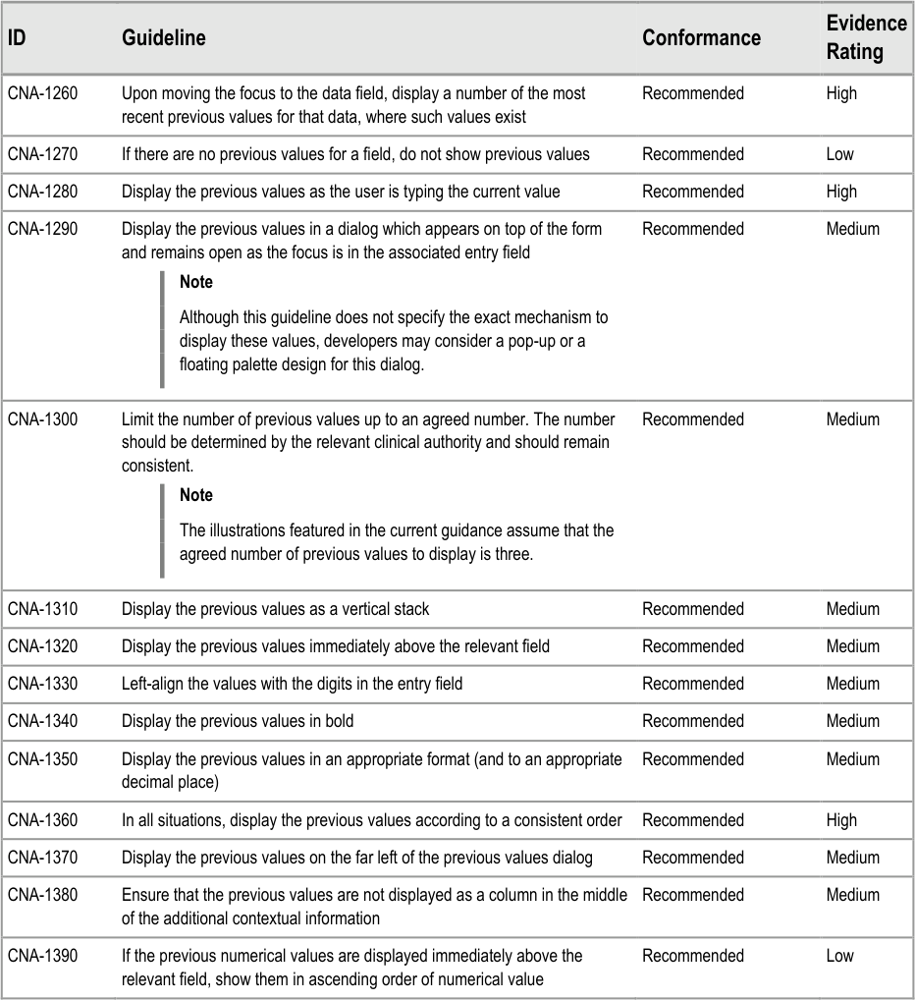

Page 45

Copyright ©2013 Health and Social Care Information Centre

HSCIC Controlled Document

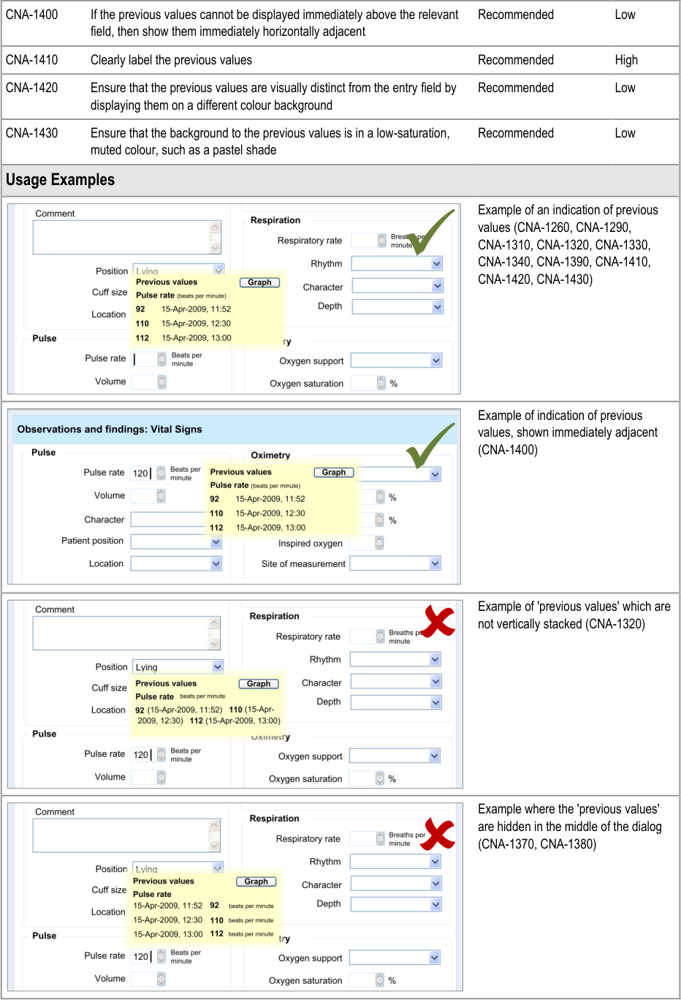

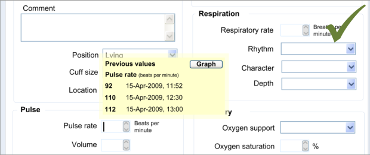

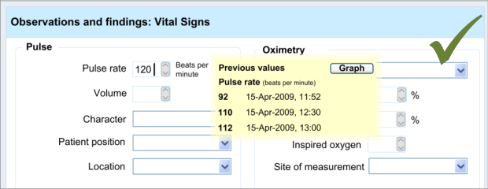

Page 46

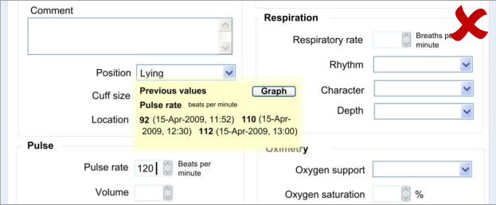

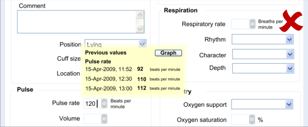

Copyright ©2013 Health and Social Care Information Centre

HSCIC Controlled Document

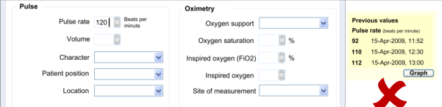

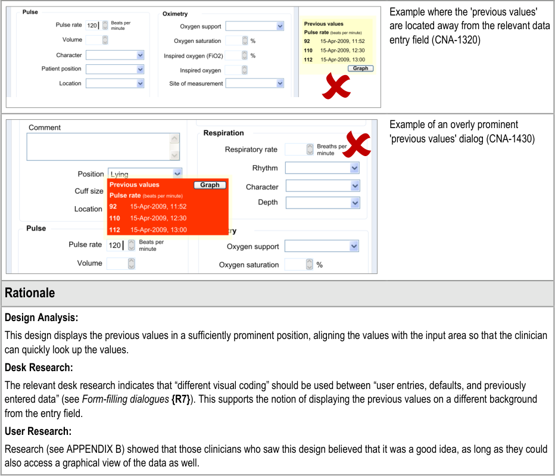

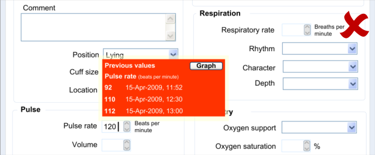

###### **6.3.2 Contextual Attributes to Display for Previous Values**

In addition to displaying the previous values, there is a requirement to display information about the
context in which the previous values were recorded. This provides valuable meaning about the
values, and reduces the likelihood that they are misinterpreted; a value without a date or time is
fairly meaningless.

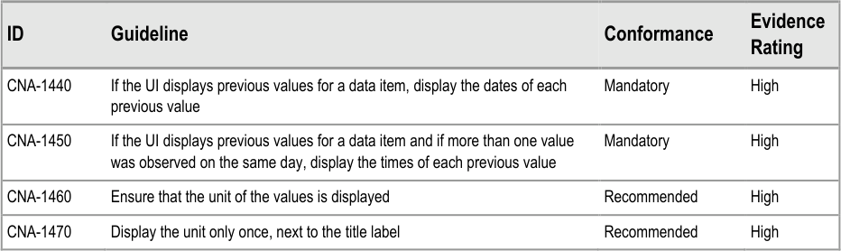

Copyright ©2013 Health and Social Care Information Centre

Page 47

HSCIC Controlled Document

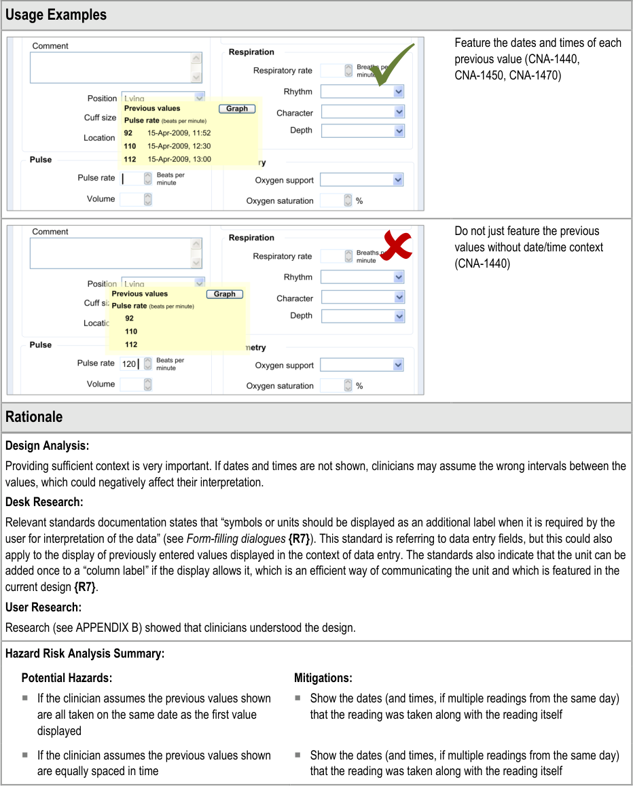

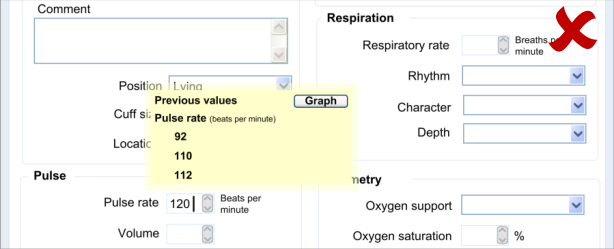

Page 48

Copyright ©2013 Health and Social Care Information Centre

HSCIC Controlled Document

#### 7 AUTOMATIC CALCULATIONS DATA

##### **7.1 Introduction**

Within clinical noting, there will be many occasions where values, such as scores, can be
automatically calculated by the system in order to reduce the clinician’s workload. For example, a
Body Mass Index (BMI) score could be instantly calculated by the system, thus saving the clinician
the vital seconds it would take them to manually calculate the score.

This feature becomes more important where the scoring system is more complex and there is more
room for errors to be made. Calculating an early warning score is an example where the
calculations are more complex and where the implications of miscalculation could be quite
dangerous.

Other situations where values could be automatically calculated include the calculation of an end
date, if the start date and duration have been entered by the clinician. This would prevent the entry
of inconsistent data, which could happen if the clinician were to enter all three data.

The guidance outlined in this section applies only to use in traditional form design. It does not
preclude different displays in other more innovative clinical noting interfaces. Also, the features
relating to displaying details of a score only apply where a score has been calculated. Such a
feature may not be necessary. For example, where an end date has been calculated from a start
date and duration, this calculation would be fairly obvious and would not require further
explanation.

The second half of this guidance addresses another important feature: communicating to the
clinician that a score has been calculated, but owing to missing data, the system has had to make
assumptions about the value of the missing data. This can be useful in that it could encourage the
clinician to enter this missing data. It is also useful in those situations where a ‘partial’ score is more
informative to the clinician than no score.

The user requirements for this section of the guidance are:

 Ensure that the user is aware when a value has been calculated by the system rather than

having been entered by the user

 Communicate to the user the data that has been used to calculate the automatically

calculated value

 Communicate both the field labels and the values of the data which contribute to the

calculated value

 Provide sufficient information to communicate the location of data items used in the

calculation (for example, in the form, in the record)

 Provide a mechanism that allows the user to easily access the data that has been used to

calculate the automatically calculated value

 Allow the user to identify where there are missing values that affect the calculation of a

derived value

 Ensure that the UI can cope with both simple and complex calculations

Page 49

Copyright ©2013 Health and Social Care Information Centre

HSCIC Controlled Document

##### **7.2 Principles**

The following key principles inform the guidance in this section:

 Screen design heuristics:

 Visibility of system status

 Consistency and standards

 Help and documentation

 Clinicians must be aware of the relationship between values that they have entered and

values that have been calculated

 Clinicians must be able to easily find out more information about a value, if appropriate and

available

##### **7.3 Guidelines**

This guidance comprises two main areas:

 Displaying calculated values

 Displaying scores where values are missing

###### **7.3.1 Displaying Calculated Values**

In this section, the guidance addresses the mechanisms required to distinguish calculated values
from user-entered values. It also addresses how the UI can communicate how the value was
calculated and, importantly, which input values contributed to the calculated value (including an
indication of where these entry fields are located).

This is particularly important as it not only provides meaning to the calculated value, but it also
teaches the clinician which values must be entered in order for the system to calculate the value. It
also helps clinicians to go back and check the input values if they want to question the calculated
value.

Further details about the calculated value, which could typically be a score, could also be
displayed. For example, in the case of displaying an early warning score or a Glasgow Coma Scale
score, the UI could also show the normal value ranges and any other ranges available.

|Col1|Evidence ID Guideline Conformance Rating|
|---|---|
||CNA-1480 The UI must make clear the distinction between values which have been directly entered by the user and values which have been calculated by the system Mandatory High|
||CNA-1490 Display calculated values in bold Recommended Medium|
||CNA-1500 Do not display calculated values in an editable field Recommended Medium|
||CNA-1510 Where appropriate, provide text that briefly explains the meaning of the calculated value (for example, if the value is a score, indicate the clinical meaning of the score) Recommended High|
||CNA-1520 Where appropriate, provide access to details of:  Which values entered by the user have contributed to the calculation  Which other values have contributed to the calculation  In which fields and under which headings were the values entered  The scoring system applied (if appropriate)  Link(s) to further details about the calculation (if appropriate) Recommended High|

Page 50

Copyright ©2013 Health and Social Care Information Centre

HSCIC Controlled Document

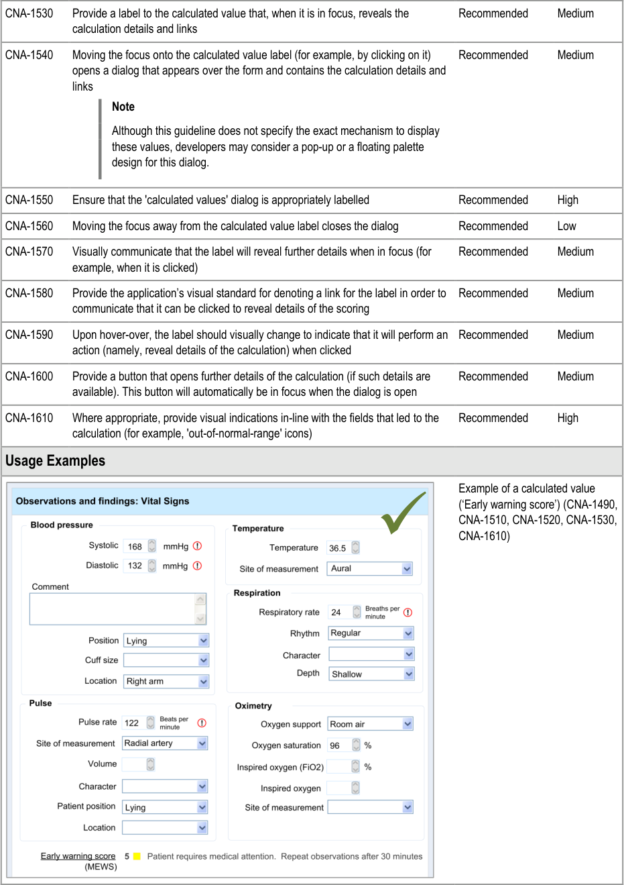

Page 51

Copyright ©2013 Health and Social Care Information Centre

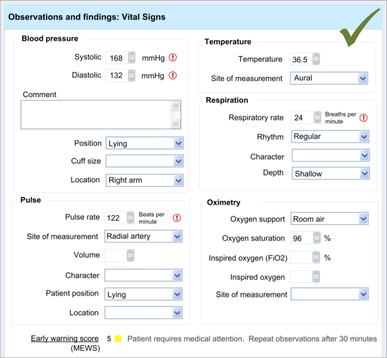
HSCIC Controlled Document

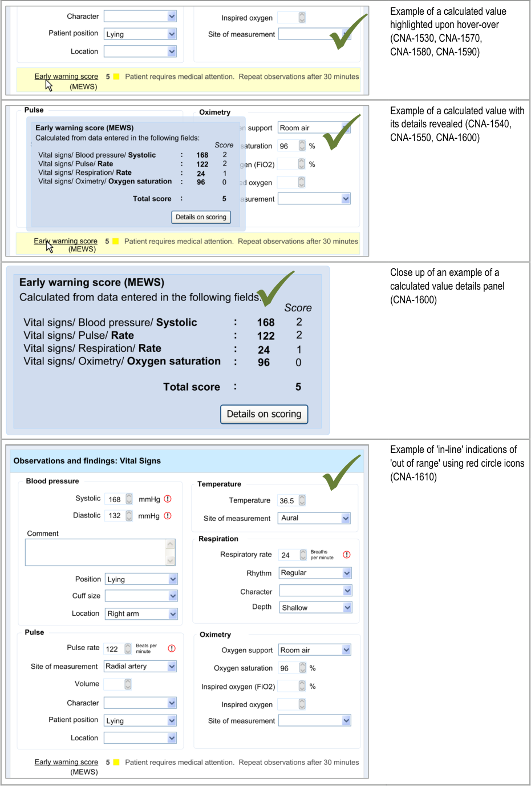

Page 52

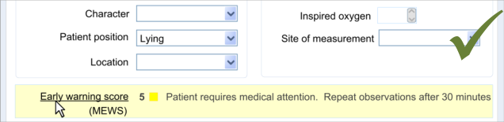

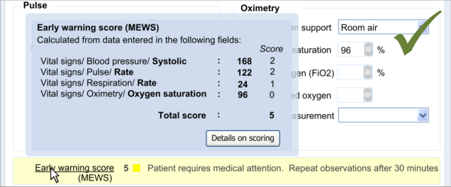

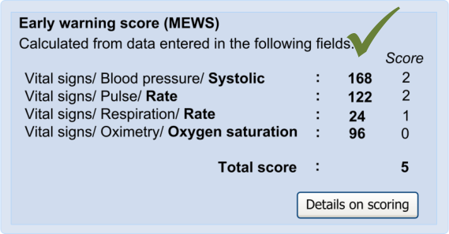

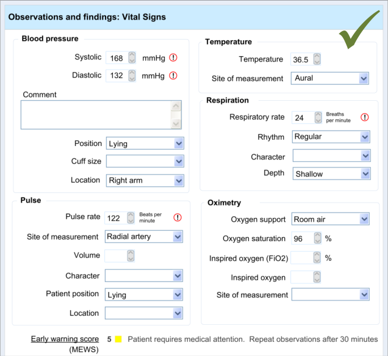

Copyright ©2013 Health and Social Care Information Centre

HSCIC Controlled Document

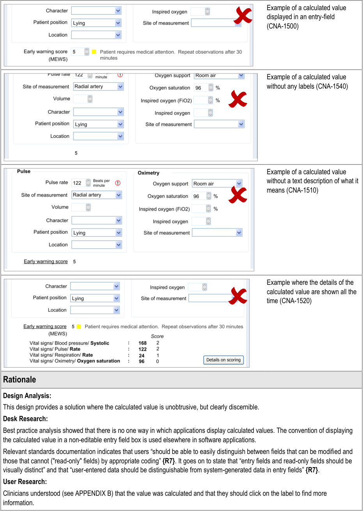

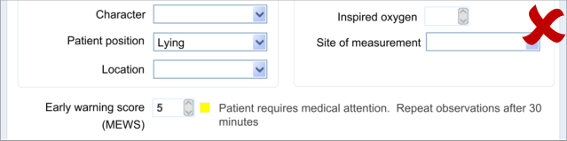

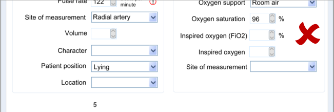

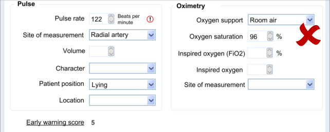

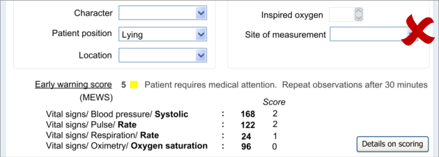

Page 53

Copyright ©2013 Health and Social Care Information Centre

HSCIC Controlled Document

**Hazard Risk Analysis Summary:**

**Potential Hazards:**

 If the calculation method employed is not obvious (for

example, type of Early Warning Score) clinicians may
misinterpret the calculated value

**Mitigations:**

 Where appropriate, provide access to the type of scoring

system applied

###### **7.3.2 Displaying Scores Where Values Are Missing**

In certain situations, an automatic calculation, such as a score, can and should be calculated even
if there are values missing that would ideally contribute to the calculated score.

In these situations, one option would be to indicate that the score cannot be calculated owing to
missing values. Where it is deemed useful to do so, the UI should indicate that a score could not be
calculated and allow the clinician to access a dialog that specifies where the relevant data entry
fields can be found.

However, another option will be to calculate the score by substituting the missing values with
assumed (default) values, while clearly communicating that values are missing. A default value
could be, for example, the value representing ‘normal’ as part of an early warning score.

As often only some values of the potential full set will be known, it is important to be able to display
partial scores in some situations.

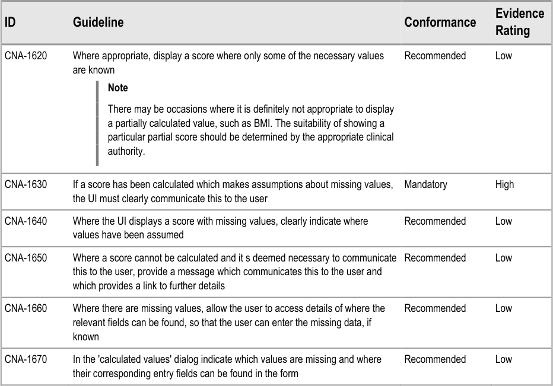

Page 54

Copyright ©2013 Health and Social Care Information Centre

HSCIC Controlled Document

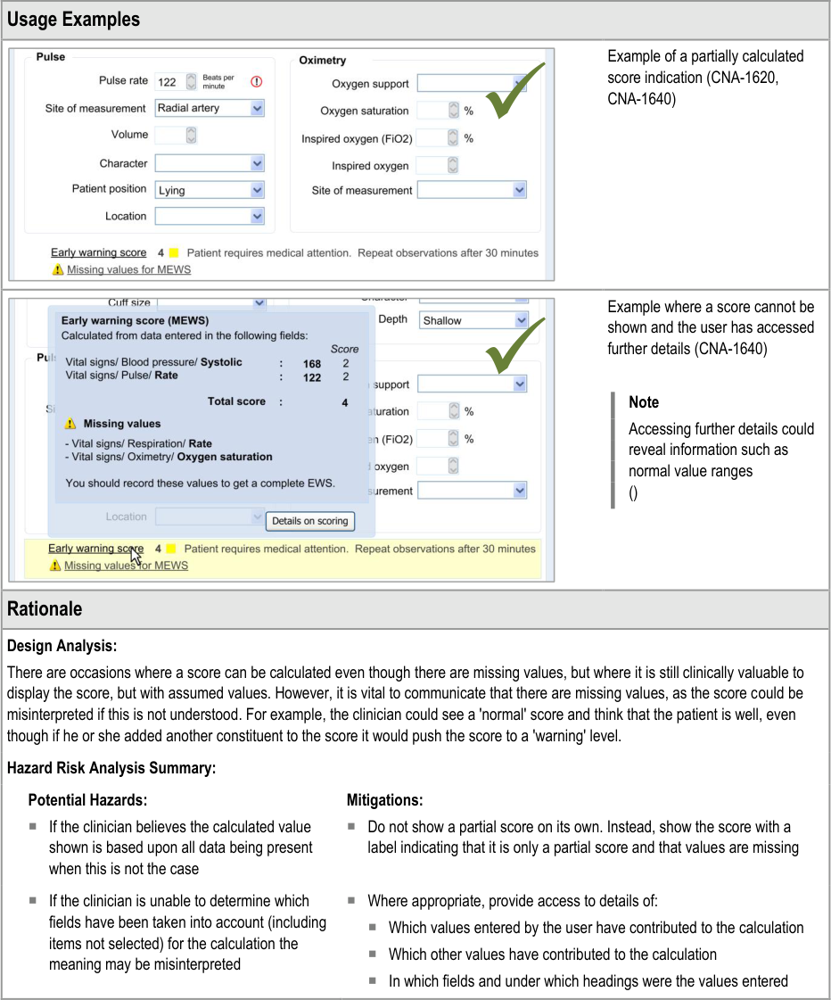

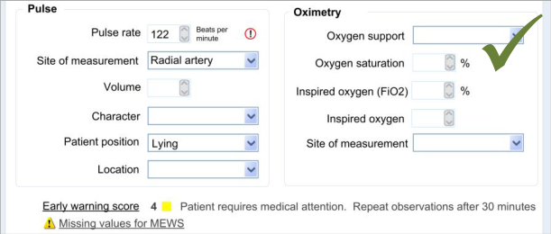

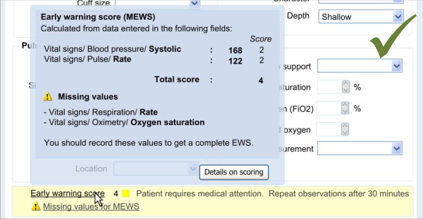

Page 55

Copyright ©2013 Health and Social Care Information Centre

HSCIC Controlled Document

#### 8 ADDING FREE TEXT

##### **8.1 Introduction**

Completing an electronic admissions clerking form will be a relatively, if not completely, new
experience for many clinicians, and an argument can be made that, in many circumstances
selecting from fixed-choice options cannot match the extent of expression that is afforded by noting
on paper. The relevant authorities may regularly increase the range of the fixed-choice options but,
in the near future, it is unlikely that these fixed-choice options will be able to express all that the
clinician wishes to express. There must be scope for the clinician to supplement the fixed-choice
options and encoded matches with free text.

The clinician could wish to add free text to any fixed-choice option, and the interface should allow
them to do this. This feature is addressed in the current section of the guidance.

This section of the guidance comprises four main areas:

 Add free text

 Display free text

 Edit free text

 Required or recommended free text fields

The user requirements for this section of the guidance are:

 Allow the user to add free text to any fixed-choice or encoded data field in the form

 Display any associated free text in a location that is visible and clearly associated with its

data item

 Allow the user to delete the free text, but only before it has been committed to the record

 Allow the user to edit the free text

 Delete the free text if the user deletes the associated data item

 Warn the user before deleting any free text

 Allow the free text to remain if the user changes the data item

##### **8.2 Principles**

The following key principles inform the guidance in this section:

 Match the flexibility of expression that clinicians currently have on paper

 Screen design heuristics:

 Match between system and the real world

 User control and freedom

 Flexibility and efficiency of use

Page 56

Copyright ©2013 Health and Social Care Information Centre

HSCIC Controlled Document

##### **8.3 Guidelines**

###### **8.3.1 Add New Free Text**

The approach taken by this guidance regarding adding new free text is to allow the clinician to
enter the free text at the same point (or rather, just after) selecting from a fixed-choice data field or
entering and selecting an encoded term. It is intuitive to feature the entry of free text ‘in-line’ with
the fixed-choice data field it is elaborating.

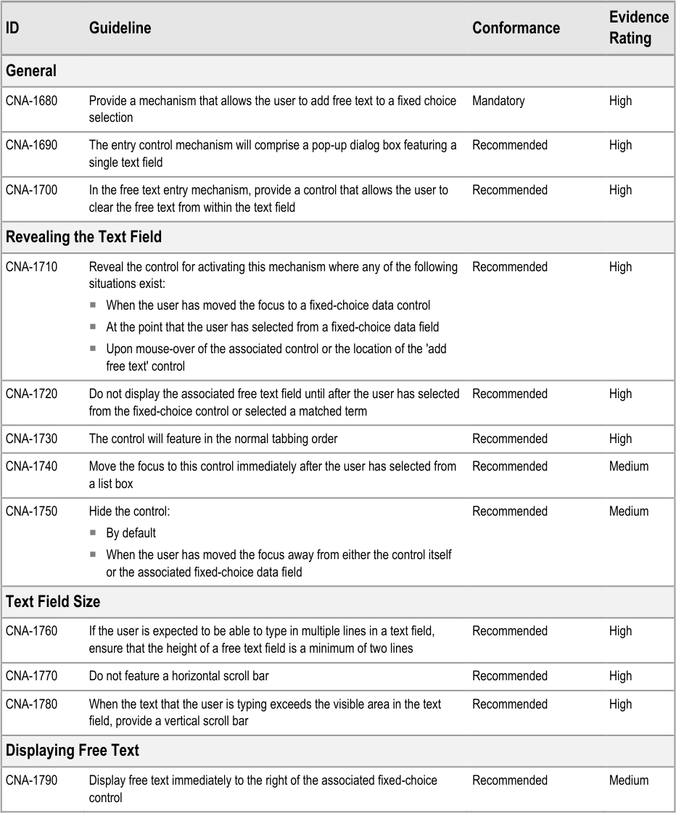

Page 57

Copyright ©2013 Health and Social Care Information Centre

HSCIC Controlled Document

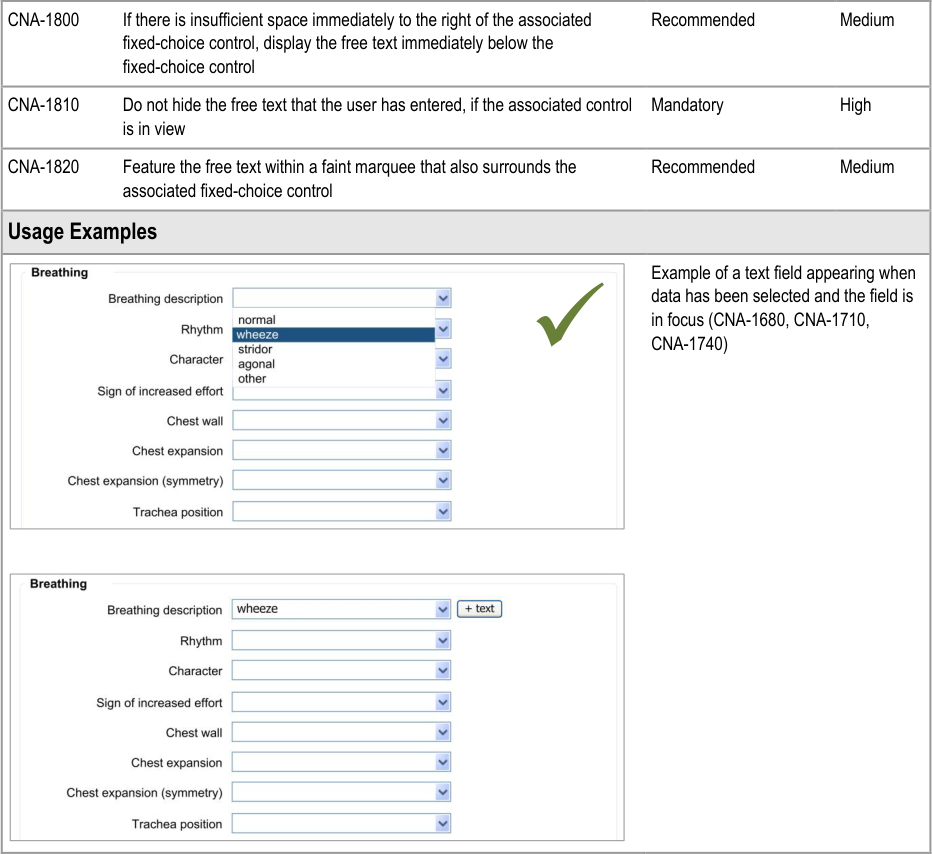

Page 58

Copyright ©2013 Health and Social Care Information Centre

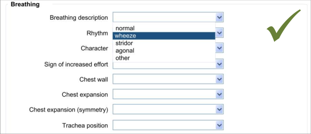

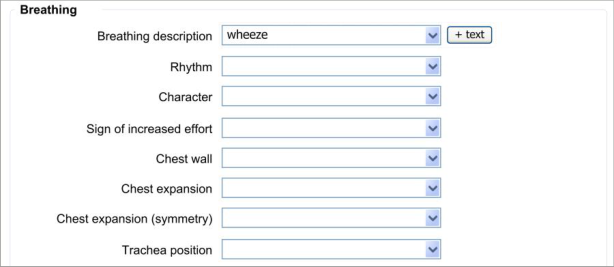
HSCIC Controlled Document

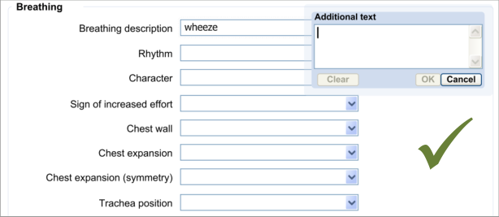

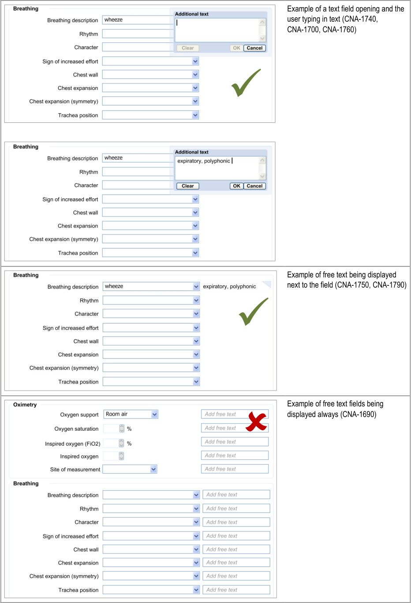

Page 59

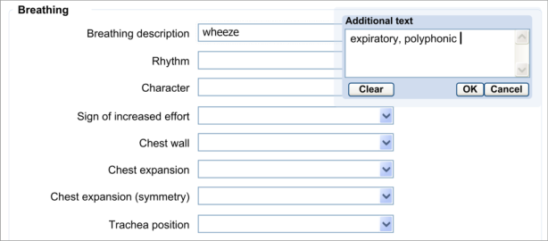

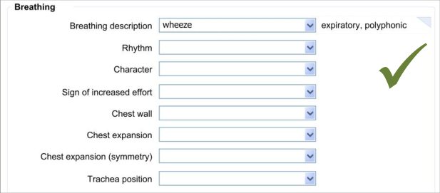

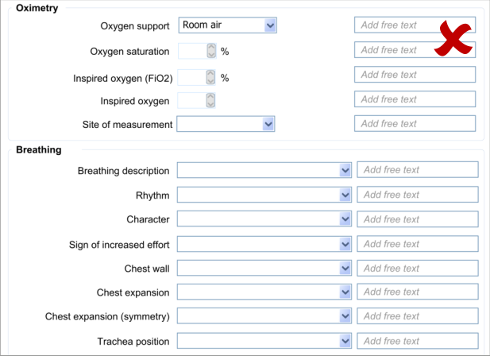

Copyright ©2013 Health and Social Care Information Centre

HSCIC Controlled Document

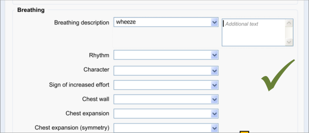

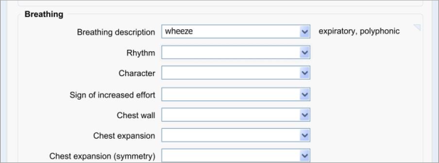

###### **8.3.2 Edit Free Text**

After the clinician has added some free text to a fixed-choice data field, they must be allowed to go
back and change that text before they save the form to the patient record. It could be that they have
made a mistake, or that they have discovered some new information from the patient. It could be
that they are new to the form and have typed some free text which is better recorded as a fixedchoice data item later in the form. Whatever the reason, the clinician must be able to quickly and
easily edit this data.

The approach adopted by the current guidance combines the control for editing the free text with
the field for displaying the free text, in order to make the action of editing intuitive to the clinician.

Page 60

Copyright ©2013 Health and Social Care Information Centre

HSCIC Controlled Document

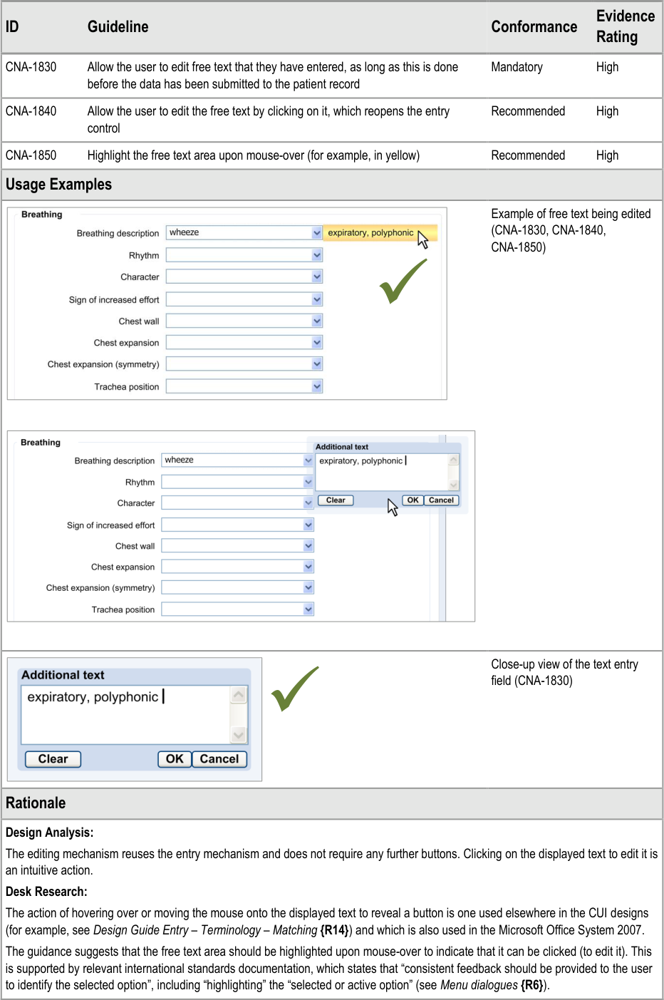

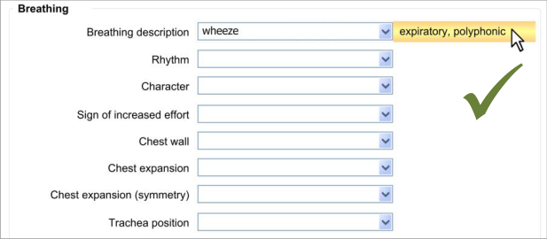

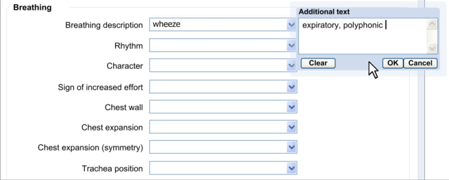

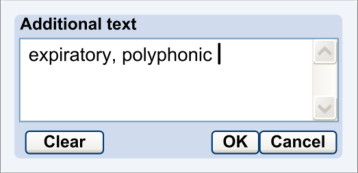

Page 61

Copyright ©2013 Health and Social Care Information Centre

HSCIC Controlled Document

**User Research:**

User research (see APPENDIX B) showed that clinicians understood that they could edit free text by clicking on it.

###### **8.3.3 Required or Recommended Free Text Field**

If the clinician is required to add some free text or, at least, is encouraged to do so, the free text
field should be made immediately visible to the clinician. That is to say, in those situations where it
is recommended that the clinician should type in some free text, do not require the clinician to
perform an action for it to appear.

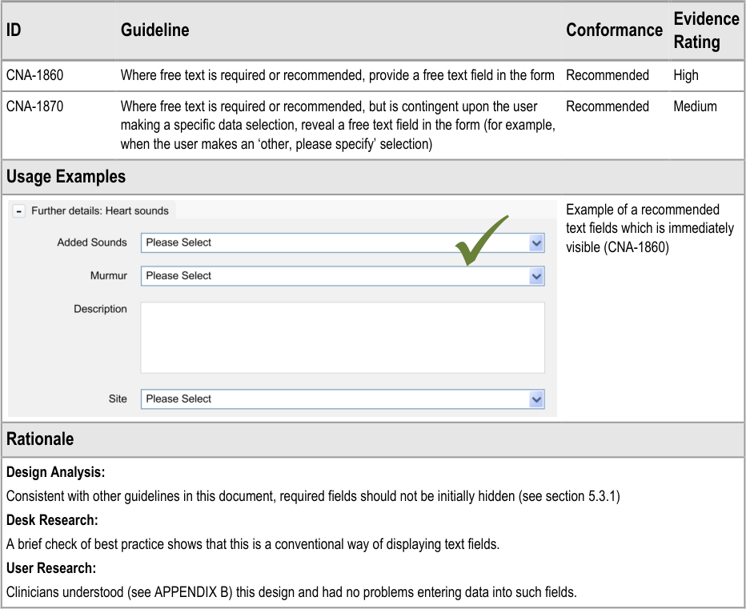

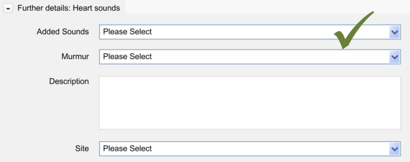

Copyright ©2013 Health and Social Care Information Centre

Page 62

HSCIC Controlled Document

#### 9 GENERAL FORM DESIGNS

##### **9.1 Introduction**

In this section, the guidelines presented are based upon standard UI practice and should be
followed by developers who are planning to employ standard data entry fields in their application.
These guidelines are not exclusive to the healthcare informatics industry but have been chosen
because they are applicable to healthcare applications.

##### **9.2 Principles**

The following key principles inform the guidance in this section:

 Consistency

 Minimal design

##### **9.3 Guidelines**

In this section, the guidelines focus upon:

 How to use standard fields, such as check boxes and radio buttons

 How to provide labels and prompts

###### **9.3.1 Use of Standard Fields**

These guidelines address how standard fields, including radio buttons, check boxes and drop-down
list boxes should be implemented in a form.

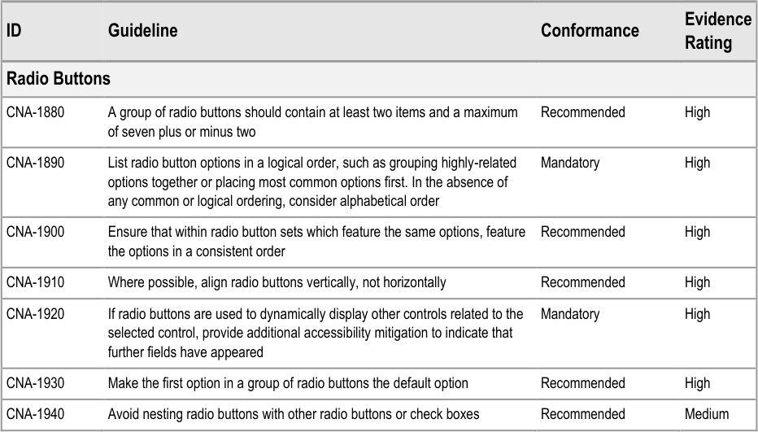

Page 63

Copyright ©2013 Health and Social Care Information Centre

HSCIC Controlled Document

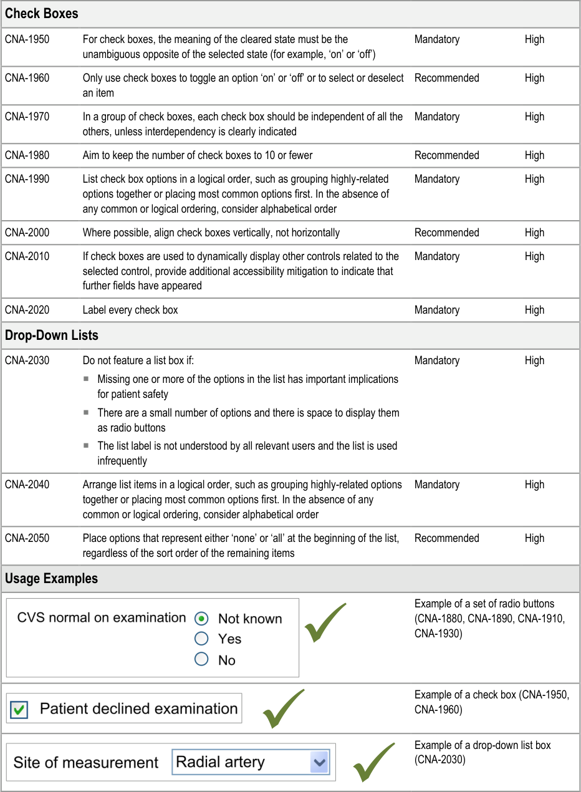

Page 64

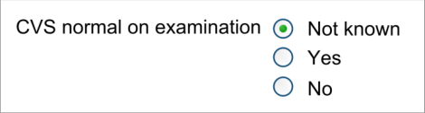

Copyright ©2013 Health and Social Care Information Centre

HSCIC Controlled Document

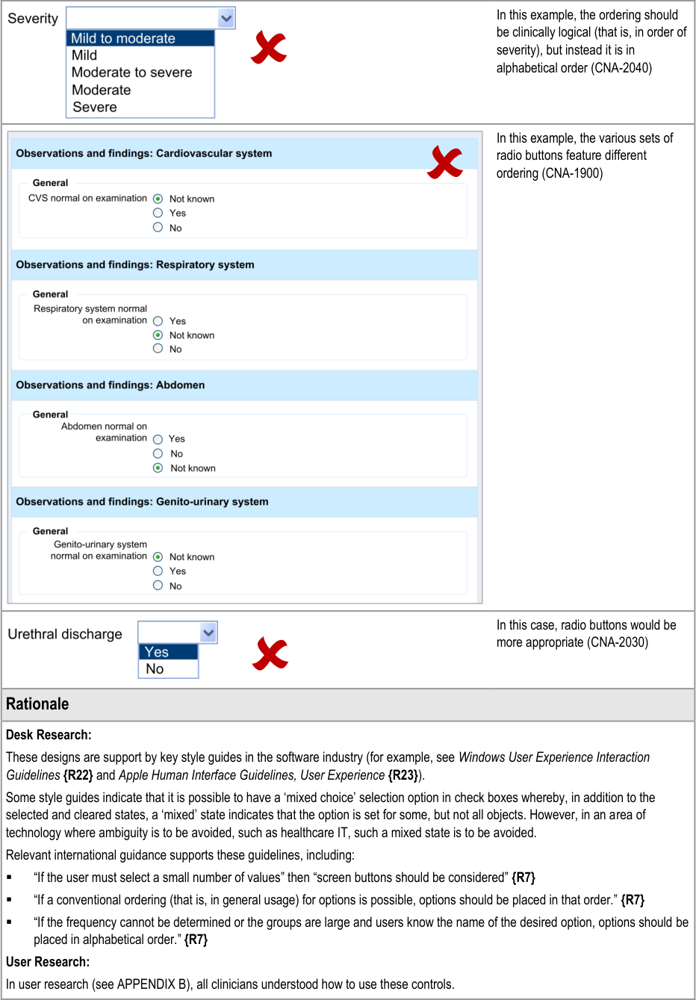

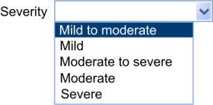

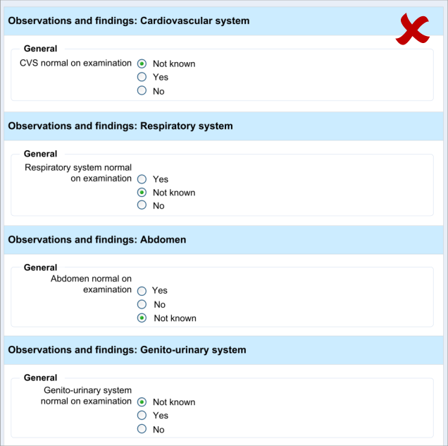

Page 65

Copyright ©2013 Health and Social Care Information Centre

HSCIC Controlled Document

###### **9.3.2 Labels and Prompts**

These guidelines address how labels and text prompts should be implemented in a standard form.

|Evidence ID Guideline Conformance Rating|Col2|
|---|---|
|CNA-2060 Unless there is reason not to do so, use sentence-style capitalisation, that is to begin the sentence with a capital and then use lower case text unless there is cause to do otherwise Recommended Medium|CNA-2060 Unless there is reason not to do so, use sentence-style capitalisation, that is to begin the sentence with a capital and then use lower case text unless there is cause to do otherwise Recommended Medium|
|CNA-2070 For a group of check boxes, aim to keep the label length about the same for all labels Recommended Medium|CNA-2070 For a group of check boxes, aim to keep the label length about the same for all labels Recommended Medium|
|CNA-2080 Use positive phrasing Recommended Medium|CNA-2080 Use positive phrasing Recommended Medium|
|CNA-2090 Where necessary, provide text prompts in order to instruct users as to the type of data they should enter in a field Recommended High|CNA-2090 Where necessary, provide text prompts in order to instruct users as to the type of data they should enter in a field Recommended High|
|CNA-2100 Write the prompt in italic grey text Recommended High|CNA-2100 Write the prompt in italic grey text Recommended High|
|CNA-2110 Prompt text should not be editable Mandatory High|CNA-2110 Prompt text should not be editable Mandatory High|
|CNA-2120 If there is sufficient space, feature the text prompt immediately below or to the right of the field Recommended Medium|CNA-2120 If there is sufficient space, feature the text prompt immediately below or to the right of the field Recommended Medium|
|CNA-2130 If space is limited, feature an in-field text prompt Recommended High|CNA-2130 If space is limited, feature an in-field text prompt Recommended High|
|CNA-2140 Allow the in-field text prompt to remain upon the focus moving to the field Recommended Medium|CNA-2140 Allow the in-field text prompt to remain upon the focus moving to the field Recommended Medium|
|CNA-2150 Remove the in-field text prompt upon data being entered into or selected in the field Recommended High|CNA-2150 Remove the in-field text prompt upon data being entered into or selected in the field Recommended High|
|CNA-2160 Do not feature examples in the in-field prompt text Recommended High|CNA-2160 Do not feature examples in the in-field prompt text Recommended High|
|**Usage Examples** |**Usage Examples** |
| ~~~~|If space is limited, feature an in-field text prompt (CNA-2130)|
|      | Distinguish the input text from the prompt text (CNA-2100)|
|  ~~~~|Do not feature the prompt the same weight as the input text (CNA-2100)|
|   |Remove the in-field text prompt upon data being entered into the field (CNA-2150)|
| ~~~~ |Do not feature examples in the in- field prompt text (CNA-2160)|

Page 66

Copyright ©2013 Health and Social Care Information Centre

HSCIC Controlled Document

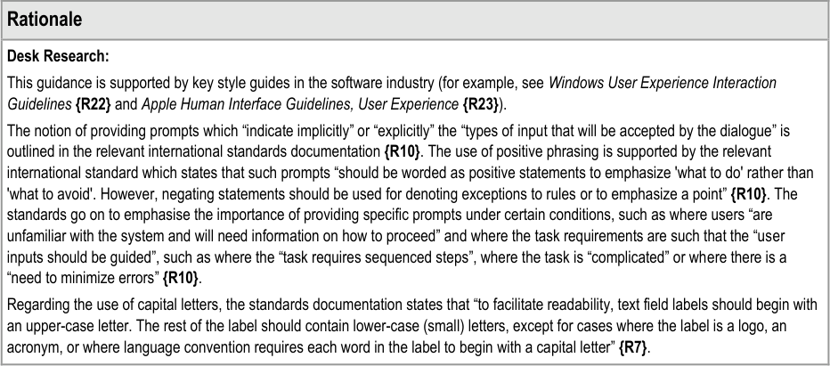

Page 67

Copyright ©2013 Health and Social Care Information Centre

HSCIC Controlled Document

#### 10 DOCUMENT INFORMATION

##### **10.1 Terms and Abbreviations**

BMI Body Mass Index

CATR Clinical Authority to Release

CSG Clinical Safety Group

CUI Common User Interface

CVS Cardiovascular System

HIU Health Informatics Unit

ISMP Institute for Safe Medication Practices

NHS National Health Service

NHS CFH NHS Connecting for Health

NPSA National Patient Safety Agency

PMH Past Medical History

RCP Royal College of Physicians

RITE Rapid Iterative Testing Evaluation

SNOMED CT Systematized Nomenclature of Medicine Clinical Terms

UI User Interface

WHO World Health Organization

Table 7: Terms and Abbreviations

##### **10.2 Definitions**

The Authority The organisation implementing the NHS National Programme for IT (currently NHS Connecting for Health).

Current best practice Current best practice is used rather than best practice, as over time best practice guidance may change or be

revised due to changes to products, changes in technology, or simply the additional field deployment
experience that comes over time.

Entry field Type of field in which data is entered. Entry fields may be optional fields or required fields.

Page 68

Copyright ©2013 Health and Social Care Information Centre

HSCIC Controlled Document

Conformance In the guidance tables, indicates the extent to which you should follow the guideline when defining your UI
implementation. There are two levels:

 **Mandatory**          - An implementation should follow the guideline

 **Recommended**          - An implementation is advised to follow the guideline

Evidence Rating In the guidance tables, summarises the strength of the research defining the guideline and the extent to which
it mitigates patient safety hazards. There are three ratings (with example factors used to determine the
appropriate rating):

 **Low:**

 Does not mitigate specific patient safety hazards

 User research findings unclear and with few participants

 Unreferenced usability principles indicate the design is not significantly better than alternatives

 **Medium:**

 Mitigates specific patient safety hazards

 User research findings clear but with few participants

 References old authoritative guidance (for example, from National Patient Safety Agency (NPSA),

Institute for Safe Medication Practices (ISMP) or World Health Organization (WHO)) that is potentially
soon to be superseded

 Referenced usability principles indicate the design is significantly better than alternatives

 **High:**

 Mitigates specific patient safety hazards

 User research findings clear and with a significant number of participants

 References recent authoritative guidance (for example, from NPSA, ISMP or WHO)

 Referenced usability principles indicate the design is significantly better than alternatives

Field Area on a screen display in which data is entered or presented.

Form Structured display with labelled fields that the user reads, fills in, selects entries for (for example, through
choice buttons or radio buttons) or modifies.

Label Short descriptive title for an entry or read-only field, table, control or object.

Navigation Ability to move from field to field within a form, to proceed forward and backward through a form and move
from form to form.

NHS Entity Within this document, defined as a single NHS organisation or group that is operated within a single technical
infrastructure environment by a defined group of IT administrators.

Optional field Field that not necessarily needs to be filled in or modified by the user.

Read-only field Field that contains data that cannot be modified by the user.

Required field Field that must be completed by the user if it does not already have a value.

Table 8: Definitions

Page 69

Copyright ©2013 Health and Social Care Information Centre

HSCIC Controlled Document

##### **10.3 Nomenclature**

This section shows how to interpret the different styles used in this document to denote various
types of information.

###### **10.3.1 Body Text**

Code `Monospace`

Script

Other markup languages

Interface dialog names **Bold**

Field names

Controls

Folder names Title Case

File names

Table 9: Body Text Styles

###### **10.3.2 Cross References**

Current document – sections Section number only

Current document – figures/tables Caption number only

Other project documents Italics and possibly a footnote

Publicly available documents Italics with a footnote

External Web-based content Italics and a hyperlinked footnote

Table 10: Cross Reference Styles

##### **10.4 References**

**R1.** Royal College of Physicians (Health Informatics Unit): A Clinician’s Guide to Record Standards

        - Part 2: Standards for the structure and content of medical records and communications when
patients are admitted to hospital, October 2008

**R2.** Royal College of Physicians (Health Informatics Unit): Hospital Admission Pro-forma Headings
and Definitions, April 2008

**R3.** NHS Connecting for Health Clinical Content Development: Hospital Admission, September
2008

2008

1.0

1.0

**R4.** NHS CUI Programme - Design Guide Entry - Accessibility Principles 1.0.0.0

**R5.** Bates, et al: Ten Commandments for Effective Clinical Decision Support: Making the Practice
of Evidence-based Medicine a Reality, Journal of the American Medical Informatics
Association, Vol. 10 Number 6 Nov / Dec 2003

**R6.** British Standards Institute, BS EN ISO 9241-14: 1997 Ergonomic requirements for office work
with visual display terminals (VDTs) _--_ Part 14: Menu dialogues

Copyright ©2013 Health and Social Care Information Centre

2003

1997

Page 70

HSCIC Controlled Document

**R7.** British Standards Institute, BS EN ISO 9241-17: 1998 Ergonomic requirements for office work
with visual display terminals (VDTs) _--_ Part 17: Form-filling dialogues

**R8.** British Standards Institute, BS EN ISO 9241-12: 1999 Ergonomic requirements for office work
with visual display terminals (VDTs) _--_ Part 12: Presentation of information

**R9.** British Standards Institute, BS EN ISO 9241-10: 1996 Ergonomic requirements for office work
with visual display terminals (VDTs) _--_ Part 10: Dialogues principles

**R10.** British Standards Institute, BS EN ISO 9241-13: 1999 Ergonomic requirements for office work
with visual display terminals (VDTs) _--_ Part 13: User guidance

1998

1999

1996

1999

**R11.** British Standards Institute, BS 7581:1992 Guide to Presentation of tables and graphs 1992

**R12.** NHS CUI Programme – Design Guide Entry – Date Display 3.0.0.0

**R13.** NHS CUI Programme – Design Guide Entry – Date and Time Input 2.0.0.0

**R14.** NHS CUI Programme – Design Guide Entry – Terminology – Matching 1.0.0.0

**R15.** NHS CUI Programme – Design Guide Entry – Terminology – Elaboration 2.0.0.0

**R16.** NHS CUI Programme – Design Guide Entry – Terminology – Display Standards for Coded
Information

**R17.** NHS CUI Programme – Recording Adverse Drug Reaction Risks – User Interface Design
Guidance

**R18.** NHS CUI Programme – Display of Adverse Drug Reaction Risks – User Interface Design
Guidance

2.0.0.0

1.0.0.0

1.0.0.0

**R19.** Nielsen, J: Usability Engineering, 1993 1993

**R20.** Shneiderman, B: Designing the User Interface – Strategies for Effective Human-Computer
Interaction, 1998

**R21.** Galitz, W.O: Essential guide to user interface design. An introduction to GUI design principles
and techniques, 1997

Third Edition

1997

**R22.** Windows User Experience Interaction Guidelines 2008

**R23.** Apple Human Interface Guidelines: User Experience 2008

**R24.** Jarrett, Caroline: Forms that work 2009

Table 11: References

Copyright ©2013 Health and Social Care Information Centre

Page 71

HSCIC Controlled Document

#### APPENDIX A USABILITY PRINCIPLES

The following usability principles have been applied through this guidance document. They are
well-recognised principles within the user experience domain.

##### **A.1 Nielsen’s Usability Heuristics**

See _Usability Engineering_ **{R19}** for more information on these principles:

 Visibility of system status

 Match between system and the real world

 User control and freedom

 Consistency and standards

 Error prevention

 Recognition rather than recall

 Flexibility and efficiency of use

 Aesthetic and minimalist design

 Help users recognise, diagnose, and recover from errors

 Help and documentation

##### **A.2 Shneiderman’s Eight Golden Rules of Interface Design**

See _Designing_ _the User Interface – Strategies for Effective Human-Computer Interaction_ **{R20}** for
more information on these principles:

 Strive for consistency

 Enable frequent users to use shortcuts

 Offer informative feedback

 Design dialogs to yield closure

 Offer error prevention and simple error handling

 Permit easy reversal of actions

 Support internal locus of control

 Reduce short-term memory load

##### **A.3 ISO 9241: Characteristics of Presented Information**

See _Ergonomic requirements for office work with visual display terminals (VDTs) -- Part 10:_
_Dialogues principles_ **{R9}** for more information on these principles:

 Clarity (the information content is conveyed quickly and accurately)

 Discriminability (the displayed information can be distinguished accurately)

 Conciseness (users are given only the information necessary to accomplish the task)

 Consistency (the same information is presented in the same way throughout the
application, according to the user’s expectation)

 Detectability (the user’s attention is directed towards information required)

Page 72

Copyright ©2013 Health and Social Care Information Centre

HSCIC Controlled Document

 Legibility (information is easy to read)

 Comprehensibility (meaning is clearly understandable, unambiguous, interpretable and
recognisable)

Page 73

Copyright ©2013 Health and Social Care Information Centre

HSCIC Controlled Document

#### APPENDIX B STUDY ID 34: EXECUTIVE SUMMARY

##### **B.1 Abstract**

The UK National Health Service (NHS) Common User Interface (CUI) Programme is a partnership
between Microsoft [®] and NHS Connecting for Health (NHS CFH), which is part the NHS National
Programme for Information Technology (NPfIT).

As part of CUI, the Clinical Applications and Patient Safety (CAPS) project has the goal of ensuring
that software applications used by the NHS enhance patient safety. To achieve this, CAPS
provides software developers with user interface design guidelines derived through a user-centric
development process that includes explicit patient-safety evaluations.

This summary describes key findings from user research carried out in April 2009 by the CUI CAPS
team on the clinical noting required for hospital admissions clerking.

**Purpose:**

To hone a set of designs in terms of their usability that would then form the basis for user interface
design guidelines for admissions clerking. Over the series of iterations, the Design Team aimed to
reduce the number of errors being made by the clinical participants and to improve the designs’
ease of, and suitability for, use in a clinical environment.

**Method:**

Over a series of five stages of usability testing, the Design Team iteratively tested the prototypes,
quickly analysed the data and updated the designs in response to the findings.

**Key Results:**

Key findings included:

 The need for progressive matching of clinical concepts

 The need to capture durations in a colloquial format

 The need for common matches to be distinguished when searching for clinical concepts

##### **B.2 Research Objectives**

The objectives of the research were to test a set of design features based on the following areas:

 General form design (standard controls)

 Entering summary lists

 Required fields

 Durations

 Displaying calculated values

 Displaying previous values

 Adding free text

The research was intended to result in a final set of designs plus a list of any outstanding issues
that could not be resolved during the test period.

Page 74

Copyright ©2013 Health and Social Care Information Centre

HSCIC Controlled Document

##### **B.3 Research Design**

Rapid Iterative Testing and Evaluation (RITE) testing: 13 sessions (15 participants), plus pilot
testing, with Health Care Professionals (HCPs) working within the UK National Health Service
(NHS). Prototypes embodying the potential guidelines were constructed in a range of media:

 Microsoft [®] Silverlight™

 Microsoft [®] Expression Blend™

 Microsoft [®] Office PowerPoint [®] slides featuring static designs created in Microsoft [®] Office

Visio [®] with some animation

The test sessions were grouped into five sequential stages. Largely, participant allocation to each
stage was determined by the location of the testing; for example, all the participants tested in
Birmingham City Hospital were part of Stage Three. Before each stage in the testing, the
prototypes were updated (if necessary), based upon the findings of the previous stage.

Participants were tested individually, with the exception of two sessions where participants doubled
up and addressed the component tasks in turn.

In each test session, the participant was given a set of typical clinical noting tasks to perform using
the various prototypes, with one prototype per task:

 Where the prototype was interactive, the participant was asked to perform the task by

using the keyboard and/or the mouse.

 Where the prototype was not interactive, the researcher presented it screen-by-screen

and asked the participant what they understood and what they would do next at each
stage in the screen flow.

The tasks were presented in the form of brief written scenarios that set the scene and gave the
participant goals to achieve with the prototype. After each task, the participant would be asked
questions about their experience of the prototype, including how suitable they thought the design
would be in a real clinical situation.

Following each stage in the testing, the researcher collaborated with the Design Team in analysing
the findings and planning updates to be implemented before the next testing stage. In this way, the
prototypes were incrementally improved over the five stages, with these changes being tested at
each subsequent stage.

In the case of the ‘entry of summary list’ design, alternative designs were presented to the
participant as part of the post-task discussion. However, this was the only exception: in all other
cases, alternative designs were not tested or discussed.

If a prototype was deemed sufficiently capable of enabling the participant to perform the task easily
and without error, it was dropped from the testing. This was because of time constraints: stopping
tests on a successful prototype released time for tests on a previously untested prototype.

##### **B.4 Results**

###### **B.4.1 Participant Description**

15 participants took part in the user research, although in two cases participants ‘doubled up’,
taking it in turns to perform user tasks (marked as 7a/7b and 12a/12b in Table 12). In total, testing
took part in six different hospitals throughout London, the South East and the West Midlands. The
participants had varying levels of IT experience, although everyone had a basic level of computer
proficiency, and all used computers to varying degrees in a clinical context.

Page 75

Copyright ©2013 Health and Social Care Information Centre

HSCIC Controlled Document

Each participant had either volunteered through the NHS CFH Events Management System (EMS)
signup or had been recruited by an HCP who had volunteered. None of the respondents had
previously taken part in CUI clinical engagement for other work areas

Table 12 shows a summary of the participants’ profiles:

1 Doctor Plastic surgery Y4 Registrar Royal Free Hospital High: HTML, ASP, SQL, developed
in-house mini-EPR

2 Health Care
Assistant

MAU Band 2 Basingstoke and North
Hampshire Hospital

3 Nurse MAU RGN Basingstoke and North
Hampshire Hospital

4 Nurse
Practitioner

Pain Band 7 Basingstoke and North
Hampshire Hospital

5 Doctor Medicine FY2 Basingstoke and North
Hampshire Hospital

6 Nurse (Pain
Sister)

7a Ward
Manager

Pain Band 6 Basingstoke and North
Hampshire Hospital

Surgical Assessment Unit Band 7 Birmingham City Hospital Medium: iSoft [®] Lorenzo [®] RCM
(transferring patients, scanning
notes). Microsoft [®] Office Word,
Excel, PowerPoint, Internet

Low: Sage, Email, Internet (four
hours a week)

Low: Pathology results, Internet
shopping, ECDL

Medium: Email, recording statistics
for clinics, booking, National Audit
database, Hospital PMS

Unknown

Medium: Hospital intranet, Microsoft [®]
Office Outlook [®], blood results, PMS
system, Google™, Microsoft [®] Office
Excel [®], record data for audits

7b Nurse Surgical Assessment Unit Band 6 Birmingham City Hospital Medium: Lorenzo RCM (transferring
patients, scanning notes). Word,
Excel, Microsoft [®] Office
PowerPoint [®], Internet

8 Nurse Medicine MSSU Band 7 Birmingham City Hospital Medium: ICM – patient finder,
results, discharge, the Microsoft [®]
Office System

9 Doctor Poisons FY2 Birmingham City Hospital High: In-house ICM, Web client
(clinical data archive), x-rays.
previous professional IT experience

10 Nurse A&E Band 7 Birmingham City Hospital Low: IPM Lorenzo PAS, x-rays

11 Doctor Rotating: Cardiology,
Neurology, Breast Surgery
(current)

12a Doctor Rotating:

Diabetes, General Medicine,
Elderly, Cardiovascular

12b Doctor Rotating:

General Medicine,
Endocrinology

FY1 Whipps Cross Medium: In-house blood system,
PACS (Agfa [®] ), PAS, Excel,
GraphPad Prism [®], email, Microsoft
Office

FY1 Royal London Hospital Medium: CRS, EPR, PACS, Word,
PPT, Internet, email

FY1 Royal London Hospital Medium: CRS, EPR, PACS, Word,
PPT, Internet, email

13 Doctor ICU FY1 Homerton n/a

Table 12: Testing Participants

Copyright ©2013 Health and Social Care Information Centre

Page 76

HSCIC Controlled Document

###### **B.4.2 Key Findings**

 Clinicians understood how to enter observation data into a form using standard controls,

such as drop-downs and radio buttons

 However, clinicians felt that it would be too time-consuming to enter data in this way

 Clinicians understood how to reveal hidden fields with the check box control and/or by

selecting a data item, as long as there is sufficient labelling and prompts

 Clinicians may try to enter too much information into a search field (such as for Past

Medical History (PMH)) unless there is progressive matching

 Clinicians do not want to navigate to a tab in order to enter a duration or date

 Clinicians quickly learn how to type in data into the ‘natural language’ ‘duration/date(s)’

field

 Clinicians find it unclear and time-consuming to search a long list of search results for a

fairly common clinical concept

 Some clinicians find a ‘Current problem’ field ambiguous and unclear, whereas others find

it easy to understand

 If the ‘Current problem’ field is located immediately below the additional text field, the

clinician may not notice it

 Clinicians want to be able to reorder a summary list (such as a PMH)

 Faced with a ‘search’ or ‘drop-down’ button alongside a search entry field (or combo box),

some clinicians may click the button without entering any text.

 Clinicians understand red asterisks mean that a field is required

 Clinicians understand the usefulness of providing a right-hand panel that indicates missed

fields, but some clinicians do not notice it: clinicians find it easier to notice in-line
indications, such as yellow shading in the missed fields

 Clinicians expected in-line indications for the data that contributed to a calculated value,

where appropriate (in this case, where the values are ‘out-of-range’)

 Clinicians need the label to be visually distinct in order to know that they can click on it to

find further information about the calculation. However, after they realise that further
information about the calculation may be available, they indicate that clicking on the label
is intuitive

 Clinicians expect the same ‘auto-complete’ mechanism in a date dialog as is employed in

the summary list entry control, which allows the entry of words such as ‘past’

 Clinicians found the button for adding free text to be insufficiently prominent

 Clinicians expect to be able to access a graphical representation of previous values

Page 77

Copyright ©2013 Health and Social Care Information Centre

HSCIC Controlled Document

###### **B.4.3 Conclusions**

 Although the guidance should clearly show how standard controls should be used in

electronic forms, further work should be done to make the process more intuitive and less
time-consuming

 In order to simply reveal fields on a form, provide a check box control in addition to

providing a mechanism that automatically reveals fields when a certain data item is
selected

 Provide progressive matching where technology supports it

 In the control for entering summary lists, do not hide fields behind a tab

 Provide a ‘natural language’ entry field which matches duration and date phrases and

numbers as they are entered, and provide a ‘play back’ of what they have entered in a
more formal structure

 Distinguish common matches in the search results

 If a ‘Current problem’ field is to be featured, locate it next to the ‘duration/date(s)’ field

 Provide a feature to reorder the summary list

 Do not feature a search button if the matching is done progressively. Feature a search icon

where appropriate

 Do not feature a drop-down button in the ‘duration/date(s)’ entry field

 Feature red asterisks next to the labels of required fields

 Shade required fields in yellow where they have been missed by the clinician (that is,

where the clinician has moved the focus to a field that is after the required field in the
tabbing order)

 Provide a right-hand panel that lists missed fields in addition to in-line indications of

missed fields

 Where appropriate, feature in-line indications of values that contribute to a calculated

score

 Ensure that the label of the calculated score visually communicates that it can be clicked

 Ensure that the button for adding free text is sufficiently prominent

 In a previous values dialog, provide access to a graphical representation of previous values

##### **B.5 Design Iterations: Findings and Design Updates**

Table 13 to Table 19 describe the design iterations in each area of testing, including the findings
and changes made in each case. The left-hand columns indicate the number of design iterations
performed.

Table 13 describes the design iterations for entering summary lists:

Page 78

Copyright ©2013 Health and Social Care Information Centre

HSCIC Controlled Document

1 Too time consuming

Don’t always want to add a date

Wants to write everything in ‘additional text’

Wants to be able to add natural terms that are how he would write them

Clinician does not like systems that require codes or exact text

2 Clinicians tried to enter everything in the first field

Clinicians tried to type all information in the ‘additional text’ field

Too many search results returned

Time consuming/too much detail required/over-complicated

It is strange separating the concept from its details, but it does make sense

More emphasis on date rather than details

‘Current problem’ is ambiguous

Want to be able to sort by date

Depending upon the situation, either the ‘natural language’ or the calculated
date would be most appropriate in the final display

3 Need to indicate that dates are approximate

Clinician tries to select from date drop-down without typing

Clinician finds it hard to find the ‘next’ entry field

Clinician cannot find items at the top of the list

Must be able to use familiar nomenclature

Not hard, but long-winded

SNOMED CT limitations – “gangrenous toes”

Did not notice ‘Current problem’ check box

4 Entered ‘ketoacidosis’ as part of the ‘diabetes’ entry

Too many results returned

Would expect a shortlist of common matches

Typed in the duration/date(s), but did not select it

Did not understand the ‘Current problem’ field

5 Clinician confused as to whether to type into the search field or click on the
button

Missed the ‘Current problem’ field

Would like to enter a problem and then, below it, list the associated
complications

Clinicians claimed that the data entry process seemed ‘time consuming’,
although they did complete the tasks quickly and without major problems

Types in date, but does not select it

Colours and alignment are not good

Wants to be able to change the order (for example. by ‘drag and drop’)

Some shorthand not recognised in the SNOMED CT search

Table 13: Entering Summary Lists

Table 14 describes the design iterations for required fields:

Remove ‘attribute’ tabs: feature
‘duration/dates’ and ‘current problem’ fields
in the same area as the additional text field

Provide ‘natural’ date input

Improve visual appearance, including
removing fields from around the calculated
date

Remove date drop-down button

Remove frames

Provide ‘progressive’ matching

Provide a common matches ‘shortlist’

Replace the ‘Search’ button with a nonclickable icon

Remove the ‘Current problem’ field

Improved alignment and slightly indented
the attribute fields.

Page 79

Copyright ©2013 Health and Social Care Information Centre

HSCIC Controlled Document

1 Red asterisks are very clear and understandable

Indifferent to the side panel

Expect such validation upon clicking the final ‘Submit’

2 Red asterisks are very clear and understandable

3 Did not notice the right-hand side panel Replace right-hand panel with in-line
indication of having missed a field: yellow
shading in the field

4 Did not notice the red asterisks Reintroduced the right-hand panel

Table 14: Required Fields

Table 15 describes the design iterations for displaying automatic calculations:

1 Expected visual cues for ‘out-of-range’ values

Label/value do not seem ‘clickable’

2 Expected visual cue for ‘out-of-range’ values

Over-complicated

Alerts are not sufficiently obvious

3 Lots of comments relating to EWS alerts rather than calculated values

Some clinicians needed prompting to click on the label to find more
information

Generally participants had no problems with understanding what was
calculated and what had been entered, and found it intuitive to click on an
item to find further information

4 Clinician would expect a standard action plan to appear if they click on the
‘details of scoring’ button

Table 15: Displaying Automatic Calculations

Table 16 describes the design iterations for entering durations:

Added visual cues for ‘out-of-range’ values

Replaced the ‘calculated’ icon with an
underline for the label

1 Limited applicability

Concerns over spurious accuracy

Would like ‘asap’ option

2 Would expect to use shorthand

Would like auto-complete

Concerns over spurious accuracy

Expects to be able to enter ‘past 22 years’

Limited in expression, in that you cannot express frequency

3 Limited applicability: this concept “falls between two stools”

Table 16: Entering Durations

Provide auto-complete

Allow the entry of words such as ‘past’

Table 17 describes the design iterations for general form design (including revealing fields):

Copyright ©2013 Health and Social Care Information Centre

Page 80

HSCIC Controlled Document

1 Would expect to type a single line, for example ‘HS 1+2+0=Clear, Otherwise
normal’

Does not think ‘Not examined’ is a good default

Wants progressive disclosure of fields

2 Free text would easier than making selections

Might not know that there are fields for further details

Negative statements are useful

3 Free text would be easier than making selections

Want drawings/annotations

Clinician does not realise they should click ‘No’ for further details

Buttons are too small

Must be able to use familiar nomenclature

4 Need the ability to add free text

Text is too small

Laborious: would prefer tick boxes

Table 17: General Form Design

Table 18 describes the design iteration for adding free text:

Implemented the progressive disclosure

1 Clinician expected to be able to find what they wanted to enter as fixed
choice widgets

Button was not sufficiently prominent

Table 18: Adding Free Text

Table 19 describes the design iteration for displaying previous values _:_

1 Clinicians liked this feature and would find it useful

Seeing a graph would be more useful

Table 19: Displaying Previous Values

Copyright ©2013 Health and Social Care Information Centre

Page 81

HSCIC Controlled Document

#### REVISION AND SIGNOFF SHEET

##### **Change Record**

01-Jun-2009 Ben Luff 0.0.0.1 Initial draft for review/discussion

01-Jun-2009 Andy Payne 0.0.1.0 Raised to Working Baseline

04-Jun-2009 Mick Harney 0.0.1.1 Copyedited Working Baseline

11-Jun-2009 Ben Luff 0.0.1.2 Updates following copyedit and NHS CFH comments

12-Jun-2009 Mick Harney 0.0.1.3 Copyedit on changes

16-Jun-2009 Andy Payne 0.0.1.4 Updates

18-Jun-2009 Graham Hoare 0.0.1.5 Copyedit complete

19-Jun-2009 Ben Luff 0.0.1.6 Updates following copyedit comments

23-Jun-2009 Simon Burnham 0.1.0.0 Updates processed and raised to Baseline Candidate

01-Jul-2009 Andy Payne 0.1.0.1 Further changes to Baseline Candidate version

01-Jul-2009 Mick Harney 0.1.0.2 Copyedit on further changes

01-Jul-2009 Mick Harney 0.2.0.0 Raised to Baseline Candidate #2

09-Jul-2009 Mick Harney 1.0.0.0 Raised to Baseline

Document Status has the following meaning:

 **Drafts 0.0.0.X**  - Draft document reviewed by the Microsoft CUI Project team and the

Authority designate for the appropriate Project. The document is liable to change.

 **Working Baseline 0.0.X.0**  - The document has reached the end of the review phase and

may only have minor changes. The document will be submitted to the Authority CUI Project
team for wider review by stakeholders, ensuring buy-in and to assist in communication.

 **Baseline Candidate 0.X.0.0**  - The document has reached the end of the review phase and

it is ready to be frozen on formal agreement between the Authority and the Company.

 **Baseline X.0.0.0**  - The document has been formally agreed between the Authority and the

Company.

Note that minor updates or corrections to a document may lead to multiple versions at a particular
status.

##### **Open Issues Summary**

None

Page 82

Copyright ©2013 Health and Social Care Information Centre

HSCIC Controlled Document

##### **Audience**

The audience for this document includes:

 **Authority CUI Manager / Project Sponsor** . Overall project manager and sponsor for the

NHS CUI project within the Authority

 **Authority Clinical Applications and Patient Safety Project Manager.** Responsible for

ongoing management and administration of the Project

 **The Authority Project Team** . Responsible for jointly agreeing with the Company NHS CUI

Project Team the approach defined in this document and any necessary redefinition of the
Clinical Applications and Patient Safety Project strategy that results from the document or
approach agreed

 **Company NHS CUI Project Team** . Responsible for agreeing with the Authority Project

Team the approach defined in this document, including any necessary redefinition of the
Clinical Applications and Patient Safety Project strategy that results from the document or
approach agreed

##### **Reviewers**

Mike Carey Workstream Lead

Tim Chearman UX Architect

Peter Johnson Clinical Architect

Frank Cross Clinical Advisor

Mike Clements Clinical Advisor

Beverley Scott Clinical Safety Officer

##### **Distribution**

Mike Carey Workstream Lead

Tim Chearman UX Architect

Peter Johnson Clinical Architect

Frank Cross Clinical Advisor

Mike Clements Clinical Advisor

Beverley Scott Clinical Safety Officer

Page 83

Copyright ©2013 Health and Social Care Information Centre

HSCIC Controlled Document

##### **Document Properties**

Document Title User Interface Design Guidance Clinical Noting in Forms: Admissions Clerking

Author Clinical Applications and Patient Safety Project

Restrictions **RESTRICTED – COMMERCIAL; MICROSOFT COMMERCIAL;** Access restricted to: NHS
CUI Project Team, Microsoft NHS Account Team

Creation Date 1 June 2009

Last Updated 23 June 2015

**Copyright:**

You may re-use this information (excluding logos) free of charge in any format or medium, under
the terms of the Open Government Licence. To view this licence, visit
[nationalarchives.gov.uk/doc/open-government-licence or email psi@nationalarchives.gsi.gov.uk.](https://web.nhs.net/OWA/redir.aspx?C=dMnSAL43xUOp9X_SOcscV9mT5A0smdBIh1_vxjdSDVCERI33v7-idn6tNFCNwJYUR1PxIW-Hd-E.&URL=http%3a%2f%2fnationalarchives.gov.uk%2fdoc%2fopen-government-licence)

Page 84

Copyright ©2013 Health and Social Care Information Centre

