# Display of Clinical Statements

<!-- TOC -->
<!-- TOC generated by Markdown All in One style -->

- [Display of Clinical Statements](#display-of-clinical-statements)
        - [Design Consultation Document](#design-consultation-document)
- [Executive Summary](#executive-summary)
- [Problem Statement](#problem-statement)
- [Background for Investigation](#background-for-investigation)
- [Scope Statement](#scope-statement)
- [Patient Safety Overview](#patient-safety-overview)
- [About this design consultation](#about-this-design-consultation)
- [Assumptions](#assumptions)
        - [Introduction to scenarios](#introduction-to-scenarios)
        - [Introduction to the statement structure](#introduction-to-the-statement-structure)
  - [CONTENT](#content)
  - [THEME 1 - STATEMENTS](#theme-1---statements)
        - [Introduction to statements](#introduction-to-statements)
        - [Statements – Perceptions of SNOMED CT](#statements-perceptions-of-snomed-ct)
        - [Statements – Free text and encoded clinical terms](#statements-free-text-and-encoded-clinical-terms)
        - [Statements – Icons and graphical noting](#statements-icons-and-graphical-noting)
        - [Statements – Unbound statements](#statements-unbound-statements)
        - [Statements – Axis modifiers](#statements-axis-modifiers)
        - [Statements – Sequence of text](#statements-sequence-of-text)
        - [Statements – Related statements](#statements-related-statements)
  - [THEME 2 – PEOPLE, DATES AND HEADINGS](#theme-2-people-dates-and-headings)
        - [Introduction to people, dates and headings](#introduction-to-people-dates-and-headings)
        - [People, dates and headings](#people-dates-and-headings)
        - [People, dates and headings – Dates and times](#people-dates-and-headings-dates-and-times)
        - [People, dates and headings – People](#people-dates-and-headings-people)
  - [THEME 3 – VISUAL DESIGN](#theme-3-visual-design)
        - [Introduction to Visual design](#introduction-to-visual-design)
        - [Visual Design – Formatting of statements](#visual-design-formatting-of-statements)
        - [Visual Design – Tables and columns](#visual-design-tables-and-columns)
  - [THEME 4 – TASKS](#theme-4-tasks)
        - [Introduction to tasks](#introduction-to-tasks)
        - [Tasks – Task-based design](#tasks-task-based-design)
        - [Tasks – Spotting mistakes](#tasks-spotting-mistakes)
        - [Tasks – Editing](#tasks-editing)
        - [Tasks – View controls](#tasks-view-controls)
      - [Future work summary](#future-work-summary)
- [Supporting Materials](#supporting-materials)
- [Distribution](#distribution)
        - [Reviewers and Distribution](#reviewers-and-distribution)

<!-- /TOC -->

Source PDF: [clinicalstatements.pdf](../../pdfs/clinical-noting-and-terminology/clinicalstatements.pdf)

##### Design Consultation Document

_Prepared for_

**NHS Connecting for Health**

Friday, 18 December 2009

Version 1.0.0.0 Baseline

_Prepared by_

**Clinical Applications and Patient Safety Project**

**NHS CUI Programme Team**

**This document was prepared for NHS Connecting for Health which ceased to exist on 31 March 2013. It may contain references to organisations, projects and other**
**initiatives which also no longer exist. If you have any questions relating to any such references, or to any other aspect of the content, please contact**
**[cuistakeholder.mailbox@hscic.gov.uk](mailto:cuistakeholder.mailbox@hscic.gov.uk)**

# Executive Summary

**Problem**

  - SNOMED CT® encoded clinical statements do not have a standardised display
format and, as such, there is a lack of consistency in user interfaces and added potential for misinterpretation when viewing such statements

**Scope**

  - Perform groundwork for guidance to define display standards

**Headline Findings**

  - A need for significant education for the clinical community on benefits and
uses from creating SNOMED CT encoded structured records at point of care

  - Users prefer designs that minimise the repetition of data (for example, by
using headings to present common attributes)

  - Using standard SNOMED CT descriptions for modifiers and qualifiers for
example, ‘Known absent’ increases the risk of confusing users

  - The free-text annotations that cannot be captured in standard SNOMED CT
descriptions are often vital to understanding the true meaning of the statement, so users need to see and/or access that information

18 December 2009 Copyright ©2013 Health and Social Care Information Centre Slide 2

   - Executive Summary

   - Problem Statement

   - Background for Investigation

   - Scope Statement

   - Patient Safety Overview

   - About this Design Consultation

   - Assumptions

   - Introduction to the Design Approach

   - Introduction to Scenarios

   - Introduction to the Statement Structure

   - Content

   - Future Work Summary

   - Supporting Materials

18 December 2009 Copyright ©2013 Health and Social Care Information Centre Slide 3

# Problem Statement

**The Problem**

  - SNOMED CT encoded clinical statements represented within the
Logical Record Architecture (LRA) do not have a standardised display format and, as such, there is a lack of consistency in user interfaces and added potential for misinterpretation when viewing such statements

**User Experience Goals**

  - Analyse common recording patterns defined in the LRA
documentation, matching these to the RCP Headings

  - Determine recommended methods and rules for the display of
those patterns

  - Provide consistent display rules for the components of a clinical
statement, such as dates, times, clinical terms and qualifiers

18 December 2009 Copyright ©2013 Health and Social Care Information Centre Slide 4

# Background for Investigation

**Background**

- Encoded clinical statements express information about a patient’s health record and provision of care

- SNOMED CT is a structured encoding system for health terms

- SNOMED CT terms are used in combination with the NHS LRA to provide a combined terminology and
information structure

**Logical Record Architecture (LRA)** The LRA is designed to allow better information sharing and based on international standards. It describes what data should be shared across multiple applications and how data will be managed, accessed and interpreted between independent information systems. The LRA includes early work on common patterns of clinical statements. Statement designs were tested based on these recording patterns, along with the standardised headings from the RCP Standards for Record Keeping project*. The two domains tested were admissions clerking and a summary presented as a chronological list.

**Recording** **patterns**

**Past medical history (PMH)** **Allergies, adverse reactions (AAR)**

**Past surgical history (PSH)** **History of current condition (HCC)**

**Family history (FH)** **Current medication (CM)**

**Medication history (MH)** **System review (SR)**

- See the [Overview document](http://www.rcplondon.ac.uk/clinical-standards/hiu/medical-records/Pages/Overview.aspx)

18 December 2009 Copyright ©2013 Health and Social Care Information Centre Slide 5

# Scope Statement

**In Scope**

   - Groundwork for future guidance on the display of encoded clinical statements for use in
delivery of clinical care

   - Sub-set of existing clinical statement ‘patterns’ with reference to the NHS LRA and
standardised headings from the Standards for Record Keeping work undertaken by the RCP

   - Indicating ability to interact with the encoded clinical statement:

       - For example, to view further associated information

       - The access to the edit mode for that statement

**Out of Scope**

   - Post coordinated SNOMED CT statements beyond those described in the LRA common
recording patterns

   - Sealed envelopes and other patient confidentiality issues

   - Demonstrating linkage of statements as defined within the LRA

   - Input of statements and/or encoding

   - Views for ‘clinical coders’

   - Multiple patient views

   - Patterns for treatment

   - Encoding for payment or other non-clinical purposes

18 December 2009 Copyright ©2013 Health and Social Care Information Centre Slide 6

# Patient Safety Overview

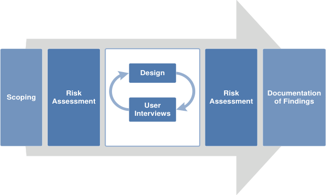

The development lifecycle for this consultation document includes an integrated patient safety assessment and management process.

Known patient safety incidents relevant to this area have been researched and reviewed as part of ongoing development. A diverse set of clinical users were consulted during this process.

The Hazard Log records all the risks that have been identified during development and describes potential mitigatory actions that could be considered alongside future exploratory work in this area. The Hazard Log is a live document that will be updated as this area of work is developed further.

Until this work is progressed and developed to full design guide status it will not be in a position to achieve full Clinical Authority to Release (CATR) from the NHS Connecting for Health (CFH) Clinical Safety Group (CSG).

Please refer to [www.cui.nhs.uk for further information on the patient safety process and for the safety](http://www.cui.nhs.uk/) status and any relevant accompanying safety documentation for this consultation document.

18 December 2009 Copyright ©2013 Health and Social Care Information Centre Slide 7

# About this design consultation

The purpose of this Design Consultation document is to summarise the current learning that has been achieved in the design and research process to date. This is articulated primarily in terms of the features that comprise the preferred current design. Four key themes have emerged from these design features:

   - Statements

   - People, dates and headings

   - Visual design

   - Tasks

For each theme we summarise the design exploration and the feedback that came out of the studies. We will then summarise the emerging themes and proposed next steps for future exploration.

18 December 2009 Copyright ©2013 Health and Social Care Information Centre Slide 8

# Assumptions

Based on feedback from the NHS CUI project team and feedback from the Opening Risk Assessment (ORA), the following assumptions informed the designs and scenarios:

**1.** **Do not show the entire SNOMED CT expression with the term identifiers**

**2.** **Hide default values for context wrapper modifiers** for example, ‘subject of record’ defaults to patient, ‘finding context’ defaults to _known_ _present_, current/past defaults to _current_ **3.** **Do not use the phrase ‘SNOMED CT’ on screen,** for example, as a label, as this confuses users who currently have limited understanding of a) what that is and b) why it is useful to them

All scenarios tested were around the point of care and did not look at data validation or coding for payment scenarios. Users were given the following caveats about designs shown at the start of the risk assessments:

   - Fully SNOMED CT encoded records

   - Conforms to standardised records structure of the LRA and RCP Headings project

   - Records are shared

   - The same record can be viewed in multiple ways

   - There is a full electronic record

   - Access to the full record is quick and easy

18 December 2009 Copyright ©2013 Health and Social Care Information Centre Slide 9

Introduction to the design approach

One of the key areas of focus for this work was the relationship users had with the encoded terms and the additional free text that was not coded. Throughout the three phases of testing, different designs were shown that explored the display of encoded terms versus free text. Three key approaches were explored in multiple designs:

1. Repeat the encoded terms separately from the free text ( _**Repeated**_ )
2. Only show the encoded terms and have users click to reveal the additional free text ( _**Separated**_ )
3. Intelligently merge the encoded terms with the free text ( _**Unified**_ )

_**Repeated**_

_Showing the full statement in its unencoded state, with_
_the encoded clinical terms shown separately (that is,_
_repeated elsewhere in the design)_

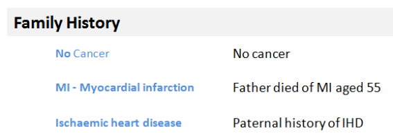

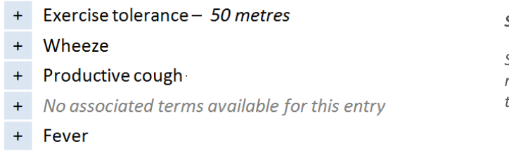

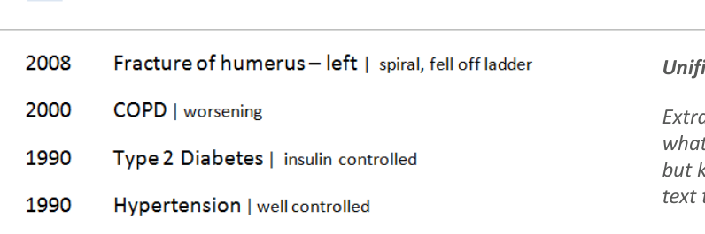

18 December 2009

Copyright ©2013 Health and Social Care Information Centre

Slide 10

##### Introduction to scenarios

Two common clinical scenarios were used in the testing, uncovering different aspects of displaying statements. Several designs were tested for both scenarios, with some common risks emerging.

**Scenario 1**

- **Single session, one clinician**

- **Typical scenario: Admissions clerking**

- **Organised by common headings**
This scenario showed all the statements from one session. All the statements shown had been entered at the same time, by the same person, for example during clerking

_One example design from this scenario:_

**Scenario 2**

- **Multiple sessions, multiple clinicians**

- **Typical scenario: Patient review**

- **Chronologically sorted**
This scenario dealt with a heterogeneous list of patterns, from different sessions. These had different authors, times, dates. The data was also more variable, for example, in some cases the statements were terse with only minimal information available

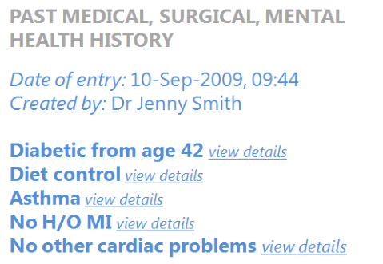

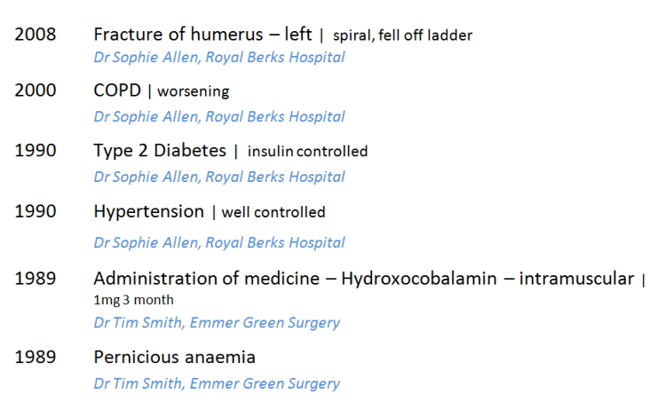

18 December 2009 Copyright ©2013 Health and Social Care Information Centre Slide 11

##### Introduction to the statement structure

These two designs illustrate how the different parts of the clinical statement can be assembled in the interface. These are not necessarily the recommended designs but both are good examples of how data structured using SNOMED CT and the LRA, together with the unencoded free text, should be presented in a unified and clear way.

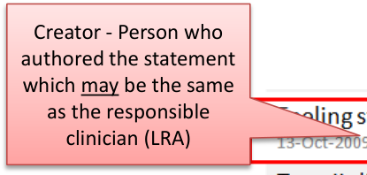

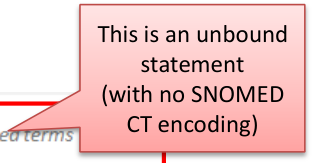

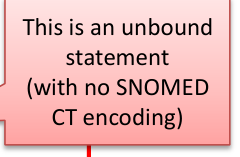

|Creator - Person who authored the statement which may be the same as the responsible clinician (LRA)|Design 1 This is an unbound statement (with no SNOMED CT encoding)|Col3|
|---|---|---|
|Creator - Person who authored the statement whichmay be the same as the responsible clinician (LRA)| CT e| CT e|
|Creator - Person who authored the statement whichmay be the same as the responsible clinician (LRA)| CT e||
|Session time - Date and time statement was recorded (LRA)  SNOMED CT encoding  Pattern heading (LRA) or could be derived from the axis modifier (person in family)  Original free text (verbatim as entered)  Location where the session happened (LRA)|Session time - Date and time statement was recorded (LRA)  SNOMED CT encoding  Pattern heading (LRA) or could be derived from the axis modifier (person in family)  Original free text (verbatim as entered)  Location where the session happened (LRA)|Session time - Date and time statement was recorded (LRA)  SNOMED CT encoding  Pattern heading (LRA) or could be derived from the axis modifier (person in family)  Original free text (verbatim as entered)  Location where the session happened (LRA)|

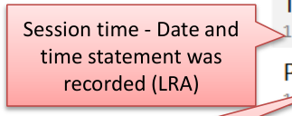

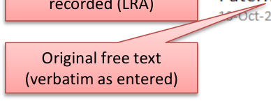

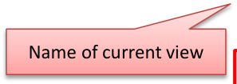

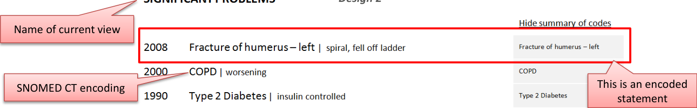

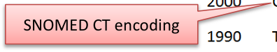

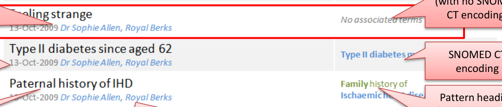

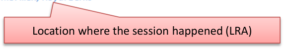

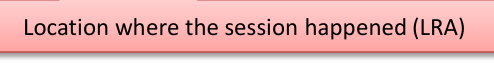

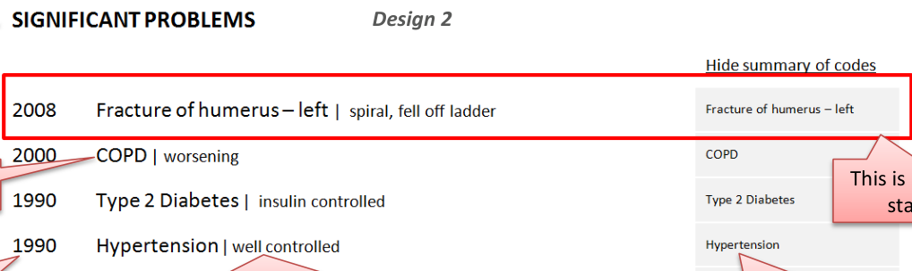

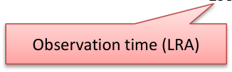

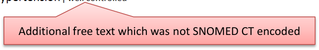

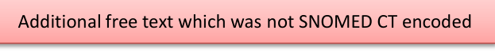

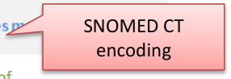

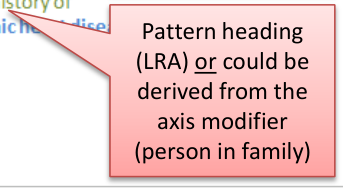

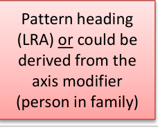

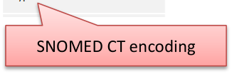

18 December 2009 Copyright ©2013 Health and Social Care Information Centre Slide 12

## CONTENT

|Themes|Topics|Themes|Topics|
|---|---|---|---|
|**Statements**|Introduction to statements Perceptions of SNOMED CT Free text and encoded clinical terms Icons and graphical noting Unbound statements* Axis modifiers** Sequence of text Related statements|**Visual Design**|Introduction to visual design Formatting of statements Tables and columns|
|**People,** **dates and** **headings**|Introduction to people, dates and headings Dates and times People Visual hierarchy and headings|**Tasks**|Introduction to tasks Task-based design Spotting mistakes Editing View controls|

_**Notes**_
_*Statements created without any SNOMED CT structure_
_** For example, ‘Known Absent’ (Negation)_

18 December 2009 Copyright ©2013 Health and Social Care Information Centre Slide 13

## THEME 1 - STATEMENTS

Introduction to statements Perceptions of SNOMED CT Free text and encoded clinical terms Icons and graphical noting Unbound statements Axis modifiers Sequence of text Related statements

18 December 2009 Copyright ©2013 Health and Social Care Information Centre Slide 14

##### Introduction to statements

This section examines how to present the statement components in a safe and usable way. Key areas of focus:

    - How to sequence the different parts of the statement to reduce risk of misinterpretation in the different scenarios

    - How to indicate the relationship between the free text and the encoded term

    - How best to present the encoded terms so users can read and understand them

    - How to present statements that do not have any encoding (unbound)
The text of the statement typically consists of three main parts:

    - The main encoded term (for example, _COPD)_

    - Additional free text (for example, _spiral, fell off ladder)_

    - Qualifiers and modifiers (for example, laterality and negation)

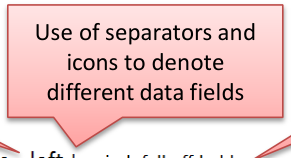

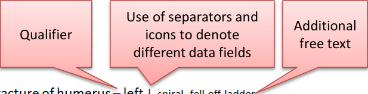

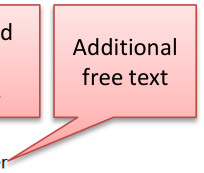

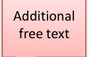

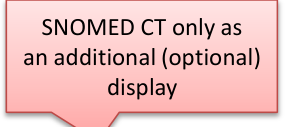

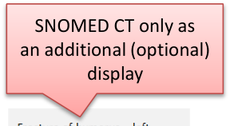

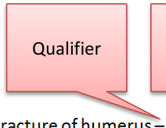

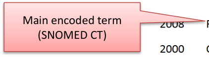

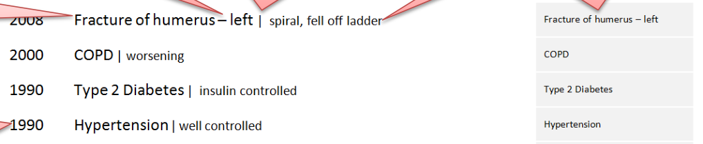

18 December 2009 Copyright ©2013 Health and Social Care Information Centre Slide 15

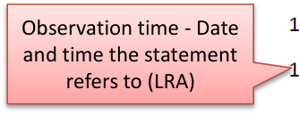

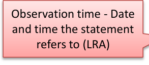

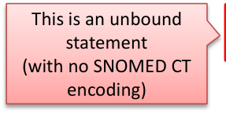

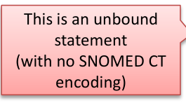
##### Statements – Perceptions of SNOMED CT

Design exploration and findings to date

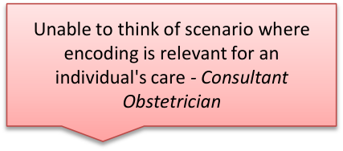

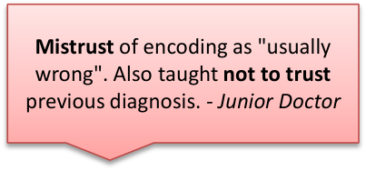

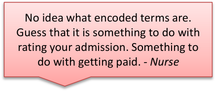

Users interviewed had an **ambivalent attitude** to SNOMED CT:

    - One user said that the need to see the data encoded structure correlated to their confidence levels in the system’s
accuracy, with low confidence driving an increased need to check There was some confusion or distrust over encoded statements generally:

    - Two users from the phone interviews had experienced issues with poor quality of encoding, with family history
conditions being wrongly attributed to the patient

    - It was usually cited as a way to get paid (which refers to different encoding, ICD-10/OPCS-4, for different purposes) but
highlights the general misconceptions in the users consulted Encoding of statements is **usually done by specialised teams:**

    - Either senior doctors or trained coders

    - Most interviewed had not done any encoding of statements themselves
Some users said they would want to **check their own encoding**

18 December 2009 Slide 16 Copyright ©2013 Health and Social Care Information Centre

##### Statements – Free text and encoded clinical terms

Design exploration and findings to date 1

The visual relationship between the free text and the encoded clinical terms was tested over several sessions.

Three key approaches were explored in multiple design treatments:

   - Repeated

   - Separated

   - Unified

The optimum design from these findings appears to be Unified:

   - This made best use of screen space and
avoided unnecessary repetition

   - Differentiated font size between free text and
encoded terms was an elegant and nonobtrusive way to show the structure

   - This did not compromise the readability of the
statements

   - Additional controls to highlight encoded
clinical terms also seem to be useful to users, although not essential

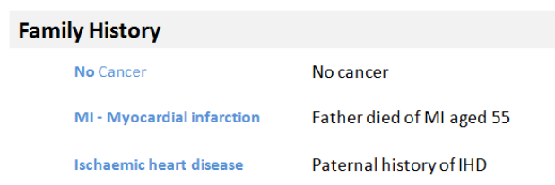

_**Repeated:**_ _Showing the full statement in its unencoded state, with the encoded_ _clinical terms shown separately (that is, repeated elsewhere in the design)_

_**Separated:**_ _Showing only the encoded clinical terms, with the user required to_ _request through a control viewing the additional free-text_

_**Unified:**_ _Extrapolating the encoded clinical terms and indicating what was the_ _additional free text that was not encoded but keeping them together to form a_ _single phrase of text that can still be read as one statement._

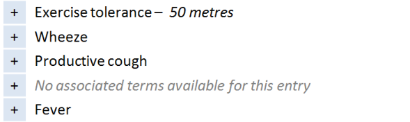

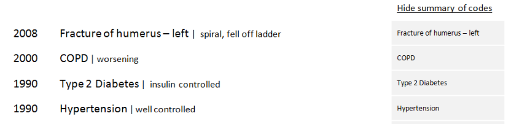

18 December 2009 Copyright ©2013 Health and Social Care Information Centre Slide 17

##### Statements – Free text and encoded clinical terms

Design exploration and findings to date 2

 - Unequivocal **preference for ‘friendly’ labels**, not a list of descriptions of modifiers and qualifiers:

     - For example, _No history of_ was always preferred to _Known absent, past_

     - This would require an interface terminology for axis modifiers

 - Showing only the encoded terms without the additional free text for a single statement was risky
because important clinical information could be missed

 - Users favoured seeing fewer repeated words from the encoding or the headings:

     - For example, **Family History** did not need to be repeated where there was a clear heading

 - Users preferred designs which used headings to group statements of the same pattern and infer
common meaning:

     - For example, **Family History** as this enabled dropping the subject modifier in the subsequent statements

18 December 2009 Copyright ©2013 Health and Social Care Information Centre Slide 18

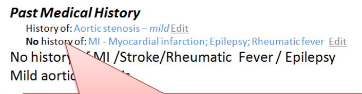

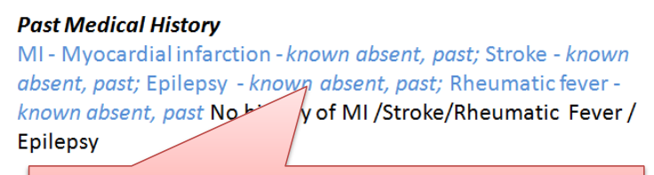

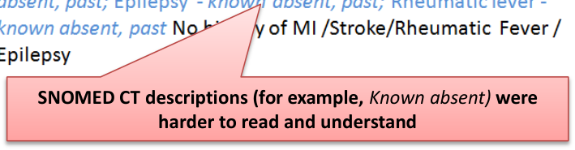

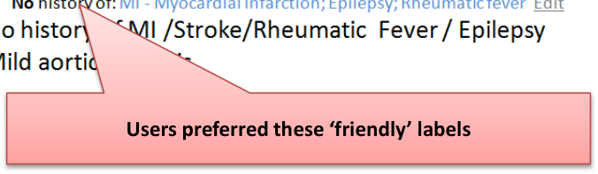

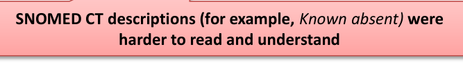
##### Statements – Free text and encoded clinical terms

Design exploration and findings to date 3

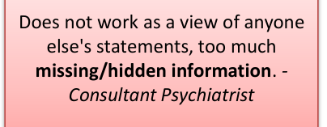

This design shows only the encoded terms in first view:

   - User would have to click to see the full statement including narrative text

Users gave this design a low usability score due to the **due to the risk of missing critical unencoded** **information only recorded in the free text:**

   - For example, decreasing tolerance to exercise

This risk was increased for **unbound statements*** where no clinical information was visible in the first view ( _No associated terms..._ ) Users did express a **positive use** for a view showing encoded values only if used as a **validation** **screen** shown after inputting and encoding of statements (for example, by that same user)

_* Unbound statements are statements that have no SNOMED CT structure associated with them, consisting only of free text entered_
_by the clinical user_

18 December 2009 Copyright ©2013 Health and Social Care Information Centre Slide 19

##### Statements – Free text and encoded clinical terms

Design exploration and findings to date 4

A design was tested that displayed the list of encoded terms separately from the full statements list:

     - Some users did not like reading in two places

     - One user (junior doctor) identified using it as an
aid to get quickly up to speed with a long, verbose list, for example, History of Current Condition

It is not as effective where sections characteristically contain terse content:

     - For example, History sections

Generally, people preferred to see a **direct** **relationship and alignment** between the encoded terms and the free-text (for example, on the same line)

_This design displays the encoded terms in a_
_separate list that comes before the full statements_

18 December 2009 Copyright ©2013 Health and Social Care Information Centre Slide 20

##### Statements – Free text and encoded clinical terms

|Emerging themes|Evidence|
|---|---|
|**Never show the full SNOMED CT expression at the point** **of care**– Hide the concept identifiers, and terms for default context modifiers (for example, the subject of the record)|**_DCS037:_**Clinicians would not read the information. It would be at risk of being ignored completely. Unanimous clinical audience feedback that they would ignore this and move on to next screen. The numbers (SNOMED CT identifiers) don't mean anything to the clinicians at all. Workarounds would be established and shared amongst clinicians.|
|**An interface terminology is required to replace both** **individual and combination of clinical terms for concept** **modifiers**|Users do not understand SNOMED CT clinical terms such as ‘known absent’. **_DCS002:_**Adds confusion for the user, different interpretations of the detail could impact on clinical decision making. An interface terminology will allow encoded terms to be presented using plain English and friendly language and never show raw encoded values to end users in care settings|
|**Any additional free text added by the clinician should be** **accessible**– If not always immediately visible|Important meaning could be hidden from view because it could not be expressed using SNOMED CT. Users use free-text to deepen their understanding of the statement, and it can often contain highly relevant information that cannot be expressed through encoding _For example, Father died of MI aged 55 – the age at death is crucial to_ _understanding the clinical risk for the patient, but this would not be expressed in the_ _SNOMED CT descriptions._ **_DCS110:_**Key information obscured, under-represented and potential for wrong code to have been selected and qualified by the free text which could actually be the correct information.|
|**_Future work:_What scenarios would favour showing** **encoded terms in isolation from free text?**|Showing related entries was out of scope, but one user did present a system (In Practice Systems - Vision 3) which used codes (only) to intelligently cluster statements together in a Timeline View|

18 December 2009 Copyright ©2013 Health and Social Care Information Centre Slide 21

##### Statements – Icons and graphical noting

Design exploration and findings to date 1

Bullet

Users felt it important to use **some kind of visual** **separator** between clinical term and additional free text. Some existing systems do this. Running text and code together could **create misleading statements**

**Pipes** [1] were visually liked but **carried risk of being** **misread as ‘1’**

**Dots** also well received, but **risk of being confused as** **a decimal point**

**Commas** initially preferred, but then discounted because of the risk of overlap with a comma used with as part of the SNOMED CT description. The same was true for hyphens

**More work is needed to identify a safe separator**

1 **Pipe** : a vertical bar separating data but indicating they are related

_Users preferred to have a_ _**separating character,**_ _but all_ _those tested carried risk, so more work required to_ _identify a safe character_

18 December 2009 Copyright ©2013 Health and Social Care Information Centre Slide 22

##### Statements – Icons and graphical noting

Design exploration and findings to date 2

_Users found the pen symbol distracting and_
_preferred not to have a graphic to indicate what_
_was free text_

_Graphical noting was out of scope, however users_
_missed having these visual short cuts, particularly_
_when reviewing examinations and findings_

Users expressed a mixed reaction to the use of an icon to indicate text – most felt it was **distracting** and did not like the pen symbol

Many users did indicate a **desire to see graphical noting** (for example, to indicate left and right)

18 December 2009 Copyright ©2013 Health and Social Care Information Centre Slide 23

##### Statements – Icons and graphical noting

Design exploration and findings to date 3

In ‘ **Examinations and Findings** ’, users were used to reading information very quickly

Current practice has led to a **reliance on** **graphical noting** as a shorthand

Users reported skim reading the numbers:

     - “You know what the test is because the value
falls within a certain range”

     - Users requested to have deviation flagged in
some way (for example, colour or icons)

_Four of eight users wanted to see graphical noting_
_in the display of test results statements_

18 December 2009 Copyright ©2013 Health and Social Care Information Centre Slide 24

##### Statements – Icons and graphical noting

|Emerging themes|Evidence|
|---|---|
|For**examinations and findings**, users find**purely text-based** **statements too dense to read**and would like to see common graphical noting used to support the text, for example, to indicate male/female, left/right|**_DCS075:_**No graphical display of the human body / male and female within the clinical system - laterality can be mis-read and misinterpreted, which can lead to significant problems, particularly when surgery indicated. **_Phone interviews:_** Needs headings to make sense (for example, type of tests, CVS). Missing pictures, lots of text to get through might lead to things being missed. Hard to compare against similar results (for example, cranial nerve examination).|
|**Graphics and icons are most effective when used as** **shorthand for data and not just used to indicate free-text** **(for example, a pencil icon) as users find this visually** **cluttering**|Users did not like the use of icons to indicate the underlying data structure, for example, what was free text. Users expressed a desire to see graphical noting in the examinations and findings statements, as they felt that this was a more effective way to communicate test results.|
|**_Future work:_Exploration of noting using graphics** **recommended, particularly for examination and findings** |Users consistently mentioned that they had become reliant on processing this kind of information with the visual aids of common graphical noting techniques.|
|**_Future work:_What is a safe character that can be used** **between encoded statements and free text?**|Users preferred statement designs which separated encoded statements from free text. A safe character has not yet been identified, several have been discounted (pipe, comma, bullet)   **Note:**whilst bullets were flagged as risky, they are a common device in current systems, so more work is required to identify the level of risk.|

18 December 2009 Copyright ©2013 Health and Social Care Information Centre Slide 25

##### Statements – Unbound statements

Design exploration and findings to date

An unbound statement is a **statement without any encoding:**

     - For the phone interview, the unbound statement ‘Feeling strange’ was used because there is no exact match to a
SNOMED CT term. The subjectivity of it means it should not be altered. 'Feeling bad' or ‘Feeling groggy' are for example available, as is 'strange sensation‘

     - This was a good example as it highlighted the value of less precise, more subjective data

_Users liked the_
_flagging of no_
_encoding_

Most users (five of eight) thought ‘Feeling strange’ **a significant statement** as it was a valuable ‘clue’ or ‘prompt’ for the clinician. One thought it should appear first _No associated terms available_ was widely understood:

     - One user said that _No terms available_ would be clearer as _associated_ implied values such as duration, severity

Users liked the **colour** **and style differentiation** between _no terms_ message and an encoded term as this made it easier to spot

18 December 2009 Copyright ©2013 Health and Social Care Information Centre Slide 26

##### Statements – Unbound statements

|Emerging themes|Evidence|
|---|---|
|**Unencoded statements should be shown in full** and never ‘hidden’ behind ‘no terms available’ messages as this carries risk that the statement could be overlooked as not important|It is not safe to assume that unbound statements are not clinically relevant **_Phone interview:_**Unbound statement (‘Feeling strange’) is important as it is the patient's subjective view of themselves. Can give clues to clinician to ask other questions. Not concerned that it isn't coded   |
|**If no encoded terms are available, this should be flagged**and not left blank. ‘No terms available’, ‘Not possible to code’, ‘No terms found’ were all good phrases|**_Phone interview:_**Associated terms implies other values (for example, duration, severity). Clearer to say ‘Not possible to code’, or ‘No terms found’|
|Consider including a**call to action,**‘Add encoding’, when a statement is not encoded|**_Phone interview:_**Prefer to see ‘no associated terms’ spelt out, not just left blank. Maybe include call to action e.g. Add terms   **Note**: if more or all statements were unencoded it is not clear if this would still be true|
|**_Future work:_Guidelines/policies for clinicians on when statements should be encoded, versus left unbound. Test assumptions –** **are any/all statements to be encoded, including all ward notes? Or just those which are “significant” – in which case, what are the** **rules for deciding this?**|**_Future work:_Guidelines/policies for clinicians on when statements should be encoded, versus left unbound. Test assumptions –** **are any/all statements to be encoded, including all ward notes? Or just those which are “significant” – in which case, what are the** **rules for deciding this?**|

18 December 2009 Copyright ©2013 Health and Social Care Information Centre Slide 27

##### Statements – Axis modifiers

Design exploration and findings to date

_The sequence of words in the family history_
_statements minimises risk_

_Word repetition is caused by the encoded_
_text and original text showing on the same_
_line. This led to confusion with the_
_suggestion of a double negative_

Axis modifiers require careful sequencing in order to reduce risk of misinterpretation

Negation and Family History risk misinterpretation directly due to the sequence of the words:

   - _**Cancer – known absent**_ carries risk of being skim read as a positive statement; _**No cancer**_ is therefore safer

   - _**Family history of MI**_ is safer than _**MI – Family Hist**_ **ory** for the same reason

   - Showing Family History at the start of the statement is required in a mixed pattern list

   - If the list is only Family History statements then users are comfortable inferring that meaning from the heading

**As long as the axis modifier appeared before** the clinical focus term no additional emphasis was required, greater benefit came from having an interface terminology to make it **easy** to understand

**Designs which repeated words because both the original text and encoded statement were on the** **same line** risked causing confusion, particularly with negative statements:

   - The design shown above right confused users who read the terms and the free text together and thought it was a double
negative

18 December 2009 Copyright ©2013 Health and Social Care Information Centre Slide 28

##### Statements – Sequence of text

Design exploration and findings to date

In lists which show statements from different patterns, there is the risk that the user could misinterpret if default values, or some parts of statement, are hidden from view:

      - For example, there is a risk of confusing
Medication History with an Allergy to a Medication

      - In this design, both the Medication and
Allergy statements lead with the drug involved

      - This is unsafe because a user could skim
read and think that Penicillin is a current drug

The guidance should follow the published CUI guidelines and ensure that the allergy should always appear first, before the agent:

   - _[Design Guidance – Displaying Adverse](http://www.mscui.net/DesignGuide/DisplayingAllergies.aspx)_
_[Drug Reaction Risks](http://www.mscui.net/DesignGuide/DisplayingAllergies.aspx)_

_Hydroxocobalamin is a Medication History statement,_
_Penicillin is an Allergy_

18 December 2009 Copyright ©2013 Health and Social Care Information Centre Slide 29

##### Statements – Sequence of text

|Emerging themes|Evidence|
|---|---|
|**Avoid designs which could lead to showing the same negative in** **two places on the same line without clear visual separation (for** **example, a column)**|**_Phone Interview:_**The designs with the ‘no cancer’ (in**Family** **History**) heightened risk of confusion and time wasting. This occurred when the same data was repeated with encoded clinical statement and original text shown on the same line. This is the only situation in which this conclusion stands|
|**A negative statement should not lead with the clinical term.** Negative statements should try to place the ‘no’ or ‘no history of’ before the key clinical term.|The risk is that if it does not appear before the clinical term, users will skim down a list and just read the first word (for example, ‘Cancer – no history of’ is not acceptable because the user may only see the first word of the statement). There are some statements into which the negative term for example, (_no, not, no history of_) cannot be easily inserted. An example of this is: _O/E –  oedema  –  absent_ **_Future work:_**The ideal solution would be to identify any common statement wordings such as ‘on examination’ and create rules to insert the negation in the correct place in the sequence. For example: _On examination – no oedema_ _No oedema on examination_|
|**Family history should always be shown in front of the statement** **in a mixed pattern setting**|The risk is that users will skim down a list and just read the first word (for example, ‘MI – family history’) |

18 December 2009 Copyright ©2013 Health and Social Care Information Centre Slide 30

##### Statements – Related statements

Design exploration and findings to date

_Users were confused by_
_these family history_
_statements and could not_
_tell if they were linked_
_and therefore significant_

**Demonstrating a user interface for linked statements was out of scope.** However, there was a **consistent demand** and **need** to see these relationships represented in all of the user sessions

**Failing to visually link related statements** to make their connection obvious to the user was raised as a significant risk in interpreting the data correctly:

     - In the design above it was unclear that the father’s death was caused by IHD, which could **lead to misinterpretation** or distrust

18 December 2009

Copyright ©2013 Health and Social Care Information Centre

Slide 31

##### Statements – Related statements

|Emerging themes|Evidence|
|---|---|
|**Users more used to working from paper-based lists may find** **time-based lists harder to process**|Users interviewed struggled to make sense of time-based lists, particularly when statements from different patterns were shown mixed together Tools that allow date reordering and intelligent grouping (for example, by condition or clinical priority) would assist in this area (see**_Future work_**).|
|**In lists where statements from multiple patterns are shown** **together, context needs to be made explicit through the user** **interface.**|For example, when presenting Family History statements this needs to be clearly marked before the statement. Hiding default values cannot be used in the same manner as in a single pattern setting or one where there is a very clear hierarchy and the context can be inferred from the heading.|
|**_Future work:_is required to test interfaces which allow users to** **group and view links between related statements**|Users found it harder to process the clinical story without seeing relationships between statements from different parts of the record. The relationships could be by a condition or even just the type of statement (for example, Family History, Past Medical History).|

18 December 2009 Copyright ©2013 Health and Social Care Information Centre Slide 32

## THEME 2 – PEOPLE, DATES AND HEADINGS

Introduction to people, dates and headings Dates and times People Visual hierarchy and headings

18 December 2009 Copyright ©2013 Health and Social Care Information Centre Slide 33

##### Introduction to people, dates and headings

This section looks at the parts of a statement other than SNOMED CT terms and free text. These elements aid users’ comprehension. Their relative importance in the display is driven by the scenario. This section includes:

   - People, dates and times, including the risk of confusion over what role the person has had, session versus
observation dates and formatting of dates

   - Using headings to group statements with common attributes to remove both repetition and redundant attributes
from each statement

   - The risks associated with scrolling, particularly when headings represent common attributes

   - The appropriate visual structure for each of the tested clinical scenarios

18 December 2009 Copyright ©2013 Health and Social Care Information Centre Slide 34

##### People, dates and headings

Design exploration and findings to date

Confusion over **session time** versus **observation time** was common. Users were **confused by multiple** **columns** of dates that presented both on screen:

     - _**Session time**_ _,_ the period when the clinical encounter occurred and the records were created

     - _**Observation time**_ _,_ the time the observation was made, or the clinically relevant time

     - They are both Intervals, so they can have a start and end time

Confusion with people, particularly over **author** versus **care provider** was also common:

     - General assumption that, in the scenarios shown, the care provider was also the author

Dates and people information **increases in importance and value** in certain situations:

     - When editing something

     - In fast-paced environments where many people are seeing the patient

     - When something goes wrong (there are legalities around the exact time something happened or was recorded)

Users did not expect to see it in a primary or default view, particularly for history statements

Users like to have dates and people as **something they can display as required**

The scenarios tested influenced the user’s need to see date/author **for every individual statement:**

     - In an admissions clerking scenario, users were “irritated” by date/people information being repeated for every statement

     - In these scenarios, the preference was to have the date/people information available at a higher (composition) level

     - In views where statements have come from more than one session or composition, so that there are multiple people and dates,
the need to show this information at statement level increases

18 December 2009 Copyright ©2013 Health and Social Care Information Centre Slide 35

##### People, dates and headings – Dates and times

Design exploration and findings to date 1

_Multiple dates per statement_
_were confusing._

_Users did favour having a less_
_granular display for older_
_items. Entries from yesterday_
_(13 October) do not show the_
_time, compared to those from_
_today (14 October) which do._

Clinicians need to have access to both session time/date and observation time:

       - They do not expect to see both on the screen at the same time and displaying multiple dates in the same view (as above)
caused confusion, even with labelling

Optimum format of date and time varies depending on situation:

       - The exact times (observation and session) are more critical the faster paced environment you are in (for example, an acute
admissions unit where minutes are significant)

       - Users favoured designs that had different date formats for more recent entries (for example, down to the minute, versus
just day or month level reporting for older items)

       - Appropriate date granularity will vary; the important point is that the system should reflect the accuracy of the date as
captured, in line with existing CUI guidance:

          - _[Design Guidance – Date Display](http://www.mscui.net/DesignGuide/DateDisplay.aspx)_

          - _[Design Guidance – Time Display](http://www.mscui.net/DesignGuide/TimeDisplay.aspx)_

18 December 2009 Copyright ©2013 Health and Social Care Information Centre Slide 36

##### People, dates and headings – Dates and times

Design exploration and findings to date 2

Position of the date field affected readability of the list:

        - Users preferred designs where the date appeared to the left of the statement

        - This was particularly important for historical items (and helped differentiate items in the past from current conditions,
as in the design above)

18 December 2009 Copyright ©2013 Health and Social Care Information Centre Slide 37

##### People, dates and headings – Dates and times

Design exploration and findings to date 3

_Extracting the word_
_‘Past’ from the_
_pattern name (Past_
_Medical History)_
_caused confusion_
_about whether a_
_condition might still_
_be ongoing_

Users **struggled to construct a full story** over time from a single date or time heading

**Using a label of ‘Past' for the pattern Past Medical History caused misinterpretation:**

      - Users thought this meant that a problem no longer existed and was either cured or not active

      - Although statements are shown under Past Medical History the condition itself may still be current or an ongoing problem

Users were not sure whether something was **still a problem and over what time period:**

      - A timeline based view of statements is one way this could be addressed and needs further investigation

      - Further work is also advised on how to represent duration or end dates through text

18 December 2009 Copyright ©2013 Health and Social Care Information Centre Slide 38

##### People, dates and headings – Dates and times

Design exploration and findings to date 4

_This search engine_
_style design was_
_popular with users_
_wanting to scan a_
_historical set of_
_statements_

In the phone-based assessment, users preferred search-engine style interfaces:

      - This design showed multiple attributes flowing together on a subsidiary line (for example, date, time, person and location)

      - Clinical terms are displayed as ‘keywords’ that pull out the key information associated with that statement (mimicking social
sites where keywords or ‘tags’ are shown alongside articles)

In a later risk assessment, users preferred not to see time/author information at a statement level:

      - More work is recommended on this type of design, specifically if it is an effective way of handling multiple session/pattern lists
which makes economical use of screen real estate

18 December 2009 Copyright ©2013 Health and Social Care Information Centre Slide 39

##### People, dates and headings – Dates and times

|Emerging themes|Evidence|
|---|---|
|**Attributes of the clinical statement, including dates and** **times and people**are information that users expect to see when editing or changing a statement|**_Phone interviews:_**Date/author information important in edit mode, acts as an audit trail|
|**Dates and times and people information does not need** **to be in primary view**but should be easily accessible for any statement (for example, in a more detailed view)|Users do not want to see this data by default, but recognise that they may need it in certain situations (for example, to check information or if there is a problem)|
|**Dates, times and people information**should be shown **somewhere in the interface at a composition level, but** **interfaces should avoid unnecessary repetition at the** **statement level**|For example, users do not want to see repetition of when the same user has entered multiple statements in the same session as this is visually cluttering|
|**Date formats can be flexible**based on situation, but as a minimum should**ideally** include month and year, if both are available|**_DCS096:_**Could associate problems incorrectly as occurred within the same year and month. Clinician could wrongly assume that treatment has ended or the problem is no longer occurring. For example, history of medication – need to know that something was given in the past but didn't work **Phone interviews:**Having less precise dates in first view for older statements might help with decluttering of the screen display|
|**_Future work:_How well do search-engine style results** **work (where metadata such as author and time appear** **after the statement)?**|This tested well on the phone interviews but less well in the last assessment so more work is required to validate the risks or legibility of this design approach. It is worthy of investigation because it is a flexible orientation that is less likely to force truncation of the statement because it can fit in a narrower width|

18 December 2009 Copyright ©2013 Health and Social Care Information Centre Slide 40

##### People, dates and headings – Dates and times

|Emerging themes|Evidence|
|---|---|
|**Date formats can be flexible**based on situation and what is available and should reflect to the level of accuracy or confidence at capture and no more|The level of date and time granularity required is variable, so for fast paced clinical environments such as acute admissions, users expect to see hours and minutes For past statements (for example, Past Medical History), users would like to see month and year, if available. However, year alone may only be available for depending on patients’ recall, so the most important point is that the date information needs to be clear on the accuracy and if it is approximated **_DCS096:_**Could associate problems incorrectly as within the same year and also a month. Clinician could wrongly assume that treatment has ended or the problem is no longer occurring. For example, history of medication – need to know that something was given in the past but didn't work **Phone interviews:**Dates are clearer, having less precise dates in first view for older statements might help with de-cluttering of the screen display|
|**If dates and time data is uncertain (for example,** **estimated) this should be indicated**|Users in the third risk assessment flagged the need to know if a date was approximate as spurious accuracy should also be avoided. Reference existing CUI guidance: _Design Guidance – Date Display _ _Design Guidance – Time Display _|

18 December 2009 Copyright ©2013 Health and Social Care Information Centre Slide 41

### People, dates and headings – Dates and times

|Emerging themes|Evidence|
|---|---|
|**Users find it easier when dates appear in the first** **column (left hand)**in tabular designs|Users found this arrangement easier to read than designs where the dates appeared on the right hand side|
|**Avoid using generic temporal values (such as ‘Past’)** **as labels.** Full headings are safer (for example, ‘Past Medical History’)|Using the word ‘Past’ might carry an inference that a condition was no longer relevant or active|
|**_Future work:_More work required on how users** **expect to view and interact with session times** **versus observation time**|**_DCS112:_**Clinicians may be confused as to what the date relates to. Is this date of recording or date of the clinical problem occurring? **_DCS042:_**Very confusing as to what the date is referring to – it could be data entry date, referring to the procedure and/or date and time of results. Feedback was that date and time of data entry in the notes is not that critical most of the time. It is felt to be more important to have date referring to a procedure, result or other specific clinical information|
|**_Future work:_What is the best way to show duration** **through text and timeline views? (out of scope for** **this Deliverable)**|**_All sessions:_**Users find it difficult to build the story over time with just the date of occurrence or date of entry|

18 December 2009 Copyright ©2013 Health and Social Care Information Centre Slide 42

##### People, dates and headings – People

Design exploration and findings to date

Users want access to the data about people associated with an entry (for example, the author or responsible clinician) but **do not** **expect it to appear on every entry in the** **default view:**

      - Having information about people in the default view
created **additional clutter** which made lists of statements harder to read

**Role and location** were other fields that users would like to have accessible

Users thought **querying by role** would be useful (for example, a view where you could click on their name and see all statements associated with them)

It should be made clear whether the name displayed is the **author** of the entry **or the** **responsible clinician**

_Users did not expect to see information about people by_
_default (as seen above) but would want to be able to_
_access it or add it into their view._

18 December 2009 Copyright ©2013 Health and Social Care Information Centre Slide 43

### People, dates and headings – People

|Emerging themes|Evidence|
|---|---|
|**When a user is editing or changing** **a statement,**the people, creation and last modified date time should be shown|**_Phone interviews: “_**Important to see date and author information at this point” (user talking about editing a statement)|
|**Dates, times and people only need** **to be presented once per session**|Users do not want to see repeated information at a session level|
|**Where statements from multiple** **sessions are presented in the same** **view, people, date and time** **information should be easily** **accessible per statement, but need** **not be visible**|Users need to have this information, but do not necessarily expect to see it immediately, even when statements are shown from different sessions. The user interface could offer different view levels or the option to add data fields into a view to allow the user control over this. It is not mandatory to appear in a default list view. (For example, a user could ask to see this by changing a view level or adding to their view) **_DCS095:_** Screen noise and clutter but unnecessary information, time wasting for the clinician away from the patient. This is overkill and what does it mean as this could be the responsible clinician, the person who entered the code or a clerk. Associating the name, role (then) and location with the text has some useful significance but need not to be displayed by default. There are appropriate areas within a record where this would be more useful in fast-paced, complex, ever-changing environment |
|**_Future work:_What are the best interface devices to present access or labelling of the author/clinician information?**|**_Future work:_What are the best interface devices to present access or labelling of the author/clinician information?**|

18 December 2009 Copyright ©2013 Health and Social Care Information Centre Slide 44

People, dates and headings – Visual hierarchy and headings

Design exploration and findings to date 1

Users were able to deduce the meaning of the statements implied by the headings:

        - For example, Family History statements were
correctly identified in the design above left

        - This was reliant on the headings being well
defined and clearly visually associated with the statements

Where headings were clear, users preferred **not** to see the heading repeated with the statements

_In this design above, users used the headings to deduce the_
_meaning of the statements_

_This design (right) was_ _**not**_ _preferred as it was_ _harder to read and more cluttered from_ _repeating the contextual label (family history)_

18 December 2009 Copyright ©2013 Health and Social Care Information Centre Slide 45

People, dates and headings – Visual hierarchy and headings

Design exploration and findings to date 2

**Scenario one** showed **all the statements from one** **session**   - so all at the same time by the same person:

      - Here there is a clear desire from users to have them grouped

      - All statements of the same pattern pulled under one heading

      - This allows all the common attributes of the pattern to be in
embedded in the heading

      - This approach is liked by users because it makes economical
use of the space by reducing the need to repeat information at the statement level

Using a header is an effective way of showing common information

Users liked these type of designs because the strong hierarchy made them easier to read:

   - Use of headings and sub headings to group similar statements
together

   - Users liked to see colour and font differentiation between
headings and statements

   - Indenting the statements under the headings improved
comprehension and mirrors paper based note taking

Line spacing aids reading flow:

   - Close vertical line spacing shown here aided readability too –
users could read the blocks of text ‘as a story’

_Users found designs with a clear hierarchy_
_easier to use, possible because they closely_
_match paper systems_

18 December 2009 Copyright ©2013 Health and Social Care Information Centre Slide 46

People, dates and headings – Visual hierarchy and headings

Design exploration and findings to date 3

_This design positioned the pattern name after the_
_clinical terms, user found this hard to read and_
_there was a risk of wrongly associating the pattern_
_name with the next statement_

_Positioning the pattern name after or away (separate column)_
_from the focus clinical terms was confusing to users and_
_risked being overlooked or misread_

These designs both addressed scenario two (multiple pattern, multiple sessions), with different authors, times, dates:

   - This presented more challenges as users needed to see more of the contextual information at the statement level

   - Several designs were tested, including columnar designs and search-engine style, where information is displayed below the
statement (top right)

Position of the contextual information (for example, pattern name) is key to user’s understanding:

   - A clear theme was that the pattern names for example, Family History, are important to keep with the statement

   - This information needs to be positioned so as not to be missed or ignored – ideally before the clinical terms

   - Placing it after the clinical term, or in a separate column, risked confusion or being overlooked

   - Users expected to read this first as it was key part of understanding the statement

   - Line spacing is important between statements to avoid the user incorrectly associating heading with statement when the
heading appears after the statement. A mitigation here would be use of a background banding

18 December 2009 Copyright ©2013 Health and Social Care Information Centre Slide 47

People, dates and headings – Visual hierarchy and headings

Design exploration and findings to date 4

Main design risk here is if the **heading** **is carrying important axis modifiers,** **and scrolls out of view, the user loses** **important contextual information:**

      - For example, the person it applies to
(subject of record)

Users were **not keen to have to scroll** to different parts of the record:

      - For example, the user might expect surgical
history to be part of the PMH so would not necessarily scroll down to find it in another section

      - Risk that clinician is not focusing on the
scroll bar but is focusing on reading the data and may miss the scroll bar.

There could be an assumption that the **information lower down is less** **interesting** and less of a priority

18 December 2009 Copyright ©2013 Health and Social Care Information Centre Slide 48

People, dates and headings – Visual hierarchy and headings

Emerging themes – 1 of 3

|Emerging themes|Evidence|
|---|---|
|**Users want and need the interface to** **intelligently derive contextual labels** **from statement data and metadata and** **to use this to build a visual information** **hierarchy**|Two sources of information were identified as sources from which headings or contextual labels could be derived: Pattern names (Past Medical History) Common context wrapper attributes (that is, all the records where the subject is not the patient) can be presented with a Family History heading Users preferred designs which assimilated statements into a hierarchical container using this information.|
|Users prefer to have**any common** **attributes, where they exist, extracted** **from the individual statement and** **placed into the heading**|Users had a clear preference for designs which made effective use of hierarchy and screen space to reduce unnecessary repetition (for example, dates and times, pattern names)|
|**Users find hierarchical designs with** **clear headings easier to read**|Users prefer designs that use font size and colour to provide a visual differentiation between heading and statement Indentation is a good device to help reinforce association between contextual headings such as the pattern name and lists of statement Effective line spacing, which keeps related items in close vertical proximity, aids readability and the user’s understanding of what is related|
|**Users prefer no repetition of words** **between the original free text and** **clinical terms**|Repetition reduces the users ability to read the statements Risk can be present when the interface presents the clinical terms and the original entered text together on the same line This risk is increased where with negative statements (_no history of_) because this can then be read as a double negative, which causes confusion|

18 December 2009 Slide 49

Copyright ©2013 Health and Social Care Information Centre

People, dates and headings – Visual hierarchy and headings

Emerging themes – 2 of 3

|Emerging themes|Evidence|
|---|---|
|**Position of the contextual** **information (for example, pattern** **name) is key to users’ understanding** |In multiple pattern, multiple session lists, users expect contextual information to precede the clinical focus terms. Designs which showed contextual information after or separate from the clinical content were confusing and risky because the context could be overlooked or wrongly associated with the next statement in the list Users process statements by understanding the context first (for example, Family History) and then reading the statement. Designs which supported that processing flow were preferred Context can be derived from a number of data points (for example, the pattern name) or derived from SNOMED CT (for example, inferring family history where the subject of record is not the patient)|
|**Designs that span multiple lines per** **statement should use background** **banding or very clear paragraph** **spacing to ensure the lines are kept** **together and clear to the user**|The search-engine style designs which position author and time information below the clinical terms were shown with and without background banding and were marginally preferred with. The recommendation would be to use this because of the risk of misalignment and misassociation if the interface white space design was not carefully constructed. This was highlighted in the tests where pattern names appeared after the clinical terms: the risk of misassociation was picked up by the users|
|Users are comfortable using**headings** **to infer meaning and context** about statements (for example, Family History)|Headings reduce the amount of repetition needed for each individual statement This also assumes that the visual style of the heading is sufficiently different (size, colour, font) from the statements style to allow the inference to be made|
|Users**prefer designs that avoid word** **repetition**|A number of different designs were tested, those which combined free text and SNOMED CT (and did not repeat the codes) were more favourable Effective use of headings led to less repetition (for example, showing the pattern headings with every statement)|

18 December 2009 Copyright ©2013 Health and Social Care Information Centre Slide 50

People, dates and headings – Visual hierarchy and headings

Emerging themes – 3 of 3

|Emerging themes|Evidence|
|---|---|
|**Using the headings to carry important** **contextual information increases the** **importance of having them visible on** **screen at all times (for example,** **when a long list is being scrolled)**|Users preferred to have headings carry common attributes or pattern information to reduce repetition for each statement. However they also realised that this meant that the heading needed to be visible on screen at all time to ensure that a statement could not be taken out of context. For example, a family history statement could be wrongly associated to the patient if the family history heading was not visible.|
|**_Future work:_Do all users find it** **harder to construct a care story using** **statements from multiple sessions** **and multiple patterns? What can be** **done with different views (for** **example, timeline) to help with this?**|Some of the users consulted found pure time-based views harder to process, particularly when compared with single session designs with a strong heading design. More work needed on what other content above a single time and date are needed to effectively construct the story|
|**_Future work:_How do users navigate** **through records with many entries**|Users did not like long scrolling screens, so more work is required on the most effective way to show a summary of the record and allow the user to navigate to the statement sets within each heading More work needed on risks, especially with long lists where heading could scroll out of view|
|**_Future work:_Which usage scenarios** **support showing SNOMED CT only in** **a separate list from the full, verbose** **statement**|Scenarios that suggest this could be useful are: • Overview of history of current condition • In validation whilst statement coding • As a navigation to a collection of related statements|

18 December 2009 Copyright ©2013 Health and Social Care Information Centre Slide 51

## THEME 3 – VISUAL DESIGN

Introduction to Visual Design Formatting of statements Tables and columns

18 December 2009 Copyright ©2013 Health and Social Care Information Centre Slide 52

##### Introduction to Visual design

This section looks at the visual representation of a statement and investigates which designs are safest and easiest to read:

   - Users’ preferences for the presentation of free text and encoded terms

   - Designs that help to indicate a visual structure, such as the presentation of headings

   - Use of icons and graphics

   - Using tables and columns to provide structure

18 December 2009 Copyright ©2013 Health and Social Care Information Centre Slide 53

##### Visual Design – Formatting of statements

Design exploration and findings to date 1

There was a preference to have **visual** **differentiation between encoded statements and** **free text** . Most felt it would be too flat and dense if all the same:

   - For example, use colour and size

**Users liked indenting statements** below headings, good sense of hierarchy and connection between statement and title:

   - This also mirrors clinicians’ note taking on paper, so feels more
familiar to users

**No real strong winner on banding,** some like background shading, others said it did not add that much

_Differentiate with colour and font size_

_Indentation was liked_

_No strong preference for banding_

18 December 2009 Copyright ©2013 Health and Social Care Information Centre Slide 54

##### Visual Design – Formatting of statements

Design exploration and findings to date 2

_Showing encoded terms in bold encouraged skim_
_reading which could lead to information being_
_overlooked_

_Users were confused by the use of inline italics_
_to denote encoded attributes_

**Inline formatting was distracting** and made no difference to comprehension

**Users found it easier to read encoded statements rendered as plain text** with no formatting

**Inline formatting increased the risk of skim reading**, leading to users overlooking important (unencoded) words

18 December 2009 Copyright ©2013 Health and Social Care Information Centre Slide 55

##### Visual Design – Formatting of statements

Design exploration and findings to date 3

_In this design, users can opt to_
_highlight the encoded terms if_
_required_

Users **did not see a clear need** to **frequently** augment the visual display of the encoded clinical terms:

      - For example, through highlighting with colour

However, where the user is performing encoding validation, a design where highlighting could be switched on or off was liked

18 December 2009 Copyright ©2013 Health and Social Care Information Centre Slide 56

##### Visual Design – Formatting of statements

Design exploration and findings to date 4

_In this design, the encoded_
_terms and additional free-text_
_are assembled to form a_
_statement with no inline_
_repetition – this was liked_

_An additional column can be_
_requested by the users to see_
_the encoded terms separated_
_out – this was thought useful_
_for data validation scenarios_

This design was effective at combining encoded terms and additional free text in a way that supported readability and reduced unnecessary repetition:

   - The ability to add into view an ‘encoded terms only’ column was liked as it was easy to scan and to see where encoded clinical
terms were missing

   - Providing a visual differentiation through font size between encoded terms and free text was liked

   - In this design the background cell colour and key lines helped link the encoded clinical terms with the statements

18 December 2009 Copyright ©2013 Health and Social Care Information Centre Slide 57

##### Visual Design – Formatting of statements

Design exploration and findings to date 5

_Both of these designs were liked by users – easy to read as a statement but also easy to see what was an encoded_
_clinical terms and additional free-text. The difference between them is the separating character (a pipe or a dot)_

Designs were preferred which **differentiated encoded clinical terms from user entered additional** **free-text**

**Font size was the best way** of doing this **without disrupting reading flow**

**A separating character was preferred**, but a risk-free character has not been identified

18 December 2009 Copyright ©2013 Health and Social Care Information Centre Slide 58

##### Visual Design – Formatting of statements

|Emerging themes|Evidence|
|---|---|
|**Minimise inline formatting, such as bold** **or italics**|Users find it harder to read and comprehend statements with inline formatting|
|**Users like to be in control of highlighting** **or picking out the encoded clinical terms** (for example, through highlighting or adding an additional column)|Users do not see a clear need to know which are encoded clinical terms, so having a control to allow them to highlight or separate them out (for example, in a separate column) is more likely to meet user need. Specific scenarios, such as data validation after data input or checking data, would lend themselves to this kind of control|
|**Font size is an effective and non-** **disruptive differentiator between** **encoded clinical terms and free-text**|Users were favourable towards designs that used a subtle difference in point size between encoded clinical terms and additional free-text The point size difference should not prevent users from scanning both types of data in a single statement. Size difference is not prescriptive, based on the designs tested, a gap of around 4 points created enough differentiation but avoided acute visual disruption|
|**Banding helps users scanning in tabular** **designs and reduces risk in multiple-line** **statement designs**|**_Phone interviews:_** Slight preference with the banding **_Third risk assessment:_**A stronger preference emerged because of the risk of wrongly attributing a pattern name if the line spacing was not clearly designed, or even just equidistant between all statements.|
|**_Future work:_Separator characters are** **thought to be a useful device, but more** **work is required on what is a safe device** **and the exact representation of numerical** **data in an encoded statement**|**_Third risk assessment:_**Users felt that all the characters used could be confused with numerical readings However, this needs more validation as the examples shown had numerical data incorrectly displayed as free-text where there would actually be encoded values, so this risk may not be true|

18 December 2009 Copyright ©2013 Health and Social Care Information Centre Slide 59

##### Visual Design – Tables and columns

Design exploration and findings to date 1

_Examples of compound columns. Multiple data fields are positioned in close proximity to make best use of space (for_
_example, date, time, author and location): good for multi-pattern, multi-session based lists (scenario two)_

**Two columns appeared to be the optimum number that users liked to read:**

     - More than two columns scored lower as ‘busy’

     - Fewer columns enabled a wider content column where the main statement text would not wrap or truncate, which users
preferred. They wanted to have as much room as possible for the most important content: the clinical terms and free-text

**Compound columns** are a useful device to present multiple data fields in small space

**Compound columns are effective for multi-pattern, multi-session type lists** with more fields of contextual information at the statement level:

     - For scenario one, simple columns were sufficient to show the amount of data required because headings could be used to
group related statements, and the date and author information could be presented once at the composition level

     - Some users were comfortable processing multiple fields in the same column, but this feedback was inconsistent and in the
last session users found this type of design visually cluttered

18 December 2009 Copyright ©2013 Health and Social Care Information Centre Slide 60

##### Visual Design – Tables and columns

Design exploration and findings to date 2

Clinical statements that contained observable entities and values – **examinations and findings**

  - were tested. Users **were familiar with**
**processing information very quickly** with **very** **little need to actually read** the full statement

**Unanimous preference for columns** here:

     - Users found it easier to scan down the test values
because they were not merged in with the test description

     - Skim reading the numbers (you know what the test is
because the value falls within a certain range)

Users wanted to **see similar tests grouped** **together:**

     - For example, all the abdominal tests, CVS, and so on

_Users preferred values in columns, and would have_
_liked to see headings to group similar tests as this_
_would be easier to read_

18 December 2009 Copyright ©2013 Health and Social Care Information Centre Slide 61

###### Visual Design – Tables and columns

|Emerging themes|Evidence|
|---|---|
|**A list of clinical statements** **containing multiple** **observable entities and** **values should be presented in** **table format**|The user testing materials presented a set of examinations and findings **_Phone interviews:_**All users picked the tabular format as their preferred design, because it was easier to scan the values Users also wanted to see headings that grouped similar tests together: they found the flat list presentation harder to read|
|**Compound columns are** **acceptable for situations** **where there is a lot of** **contextual data to present at** **the statement level**|Compound columns are most useful for handling scenario two (multi-pattern, multi-session) where many fields of contextual information needs to be shown with every statement, such as date, author, location For scenario one, simple columns were sufficient to show the amount of data required because headings could be used to group related statements, and the date and author information could be presented once at the composition level Some users were comfortable processing multiple fields in the same column, but in the last user testing session users complained of clutter that was visually disruptive|
|**Designs should look to** **maximise the width of the** **column containing the** **statement and should avoid** **more than two columns**|**_Phone interviews:_**The statement needs to have as much space (for example, the column width) as possible Fewer columns preferred as more columns add complexity to view. More spread out because there are less columns which means more space available for the statement text Users found more than two columns harder to read|
|**General dislike of designs** **with perceived repetition**|Designs that amplified repetition included aligning clinical terms and the full free-text statements vertically – this was only true when the designs did not de-dupe the clinical terms from the full statement|
|**_Future work:_Test** **effectiveness of having date** **and author line below the** **statement**|**_Phone interviews:_**“Because you can then scan all the important information in one pass down the left, only moving over to the right column with the encoded terms if you needed to” Preferences around displaying encoded terms in separate columns because they are easy to scan and ignore if necessary but, as discussed before, could be good as a validation tool|

18 December 2009 Copyright ©2013 Health and Social Care Information Centre Slide 62

## THEME 4 – TASKS

Introduction to tasks Task-based design Spotting mistakes Editing View controls

18 December 2009 Copyright ©2013 Health and Social Care Information Centre Slide 63

##### Introduction to tasks

This section looks at how the design may need to change depending on the task being performed Some tasks may lend themselves to different designs, for example, a clinician:

   - In acute care who needs to understand the immediate problems of a patient

   - Reviewing a patient’s past history collated from multiple sources

   - Reviewing a set of examination results

   - Who has seen a mistake in the encoded terms and wants to change it

   - Who is validating the encoded terms for statements they have created

_Spotting mistakes in the encoding_

_Accessing an editable view_

18 December 2009 Copyright ©2013 Health and Social Care Information Centre Slide 64

##### Tasks – Task-based design

This outlines some of the key differences in users needs and goals for these scenarios. This matrix could be used for future work to examine design requirements on a more detailed scenario basis

|Scenario|User goals|Patterns|
|---|---|---|
|You are**validating encoding**for statements you have created|• To see the encoding that has been applied in an easy to scan format • To see where encoding is missing or wrong • To ensure that the encoding matches what my understanding is|• All|
|You are in an**acute care situation** and need to understand the **immediate** problems with a patient|• Need to construct the story, what happened and when • Who else has seen the patient? • Every detail is important (for example, severity, relativity, time)|• History of current condition • Presenting complaint|
|You are reviewing a patient’s**past**  history that has been collected from **multiple sources**|• To see a summarised list of key events that have happened within their family • Dates/age can be significant because they are risk indicators • Understand which genetic findings are significant because they are a high risk for the patient|• All|
|You have treated the patient before and are**already aware**of**existing**  conditions|• Be able to see new and/or changed items|• All|
|You are reviewing a set of **examination results**|• Be able to compare results around the same body site or type (for example, all CVS, abdomen) • Have abnormalities and/or deviations clearly flagged • See normal readings • See where data has not been received yet and the status|• Examinations and findings|

18 December 2009 Copyright ©2013 Health and Social Care Information Centre Slide 65

##### Tasks – Task-based design

Different design goals and risks:

|Scenario|Considerations|Risks|
|---|---|---|
|You are**validating** **encoding**for statements**you** have created|• OK to see ‘stacked’ designs where the clinical terms are repeated below the statement • Viewing all controls is useful here, as well as individual toggles if you just need to tweak it • Column designs overall preferred for this|• Consider who the users of this will be: could be clinical user (Senior Doctor) or administrator (people trained to encode) • How is the individual being ‘measured’ (for example, accuracy, number of terms, do certain conditions score ‘more points’?)|
|You are in an**acute care** situation and need to understand the **immediate** **problems**  with a patient|• ‘Acute’ situation where it is important to know as much as possible of the verbose text as part of working out what is wrong and what to do next|• Skim reading/highlighting key terms in this situation is risky because important detail could be missed • Unbound statements (for example, ‘Feeling strange’) could be critical clues and are no less important in this situation than encoded terms|
|You are reviewing a patient’s**past** **history**  that has been collected from**multiple** **sources**|• Reviewing summarised information, a quick skim can be good • Clear context labels (for example, ‘Family History’)|• Requires judicial use of encoding and effective display of the clinical term and additional free-text • Risk of not showing valuable information (for example, date of death of father)|
|You have treated the patient before and are already aware of **existing** **conditions**|• Flagging new|• Complacency, not reading fully|
|You are reviewing a set of**examination** **results**|• Need detail, in a quickly scannable format (for example, columns)||

18 December 2009 Copyright ©2013 Health and Social Care Information Centre Slide 66

##### Tasks – Spotting mistakes

Design exploration and findings to date

_In this design, the encoded terms are for the second statement do not match the_
_full free text._

Only one user spotted the data discrepancy unprompted

One user was confused by ‘No’ and thought it meant ‘Number’

Most users understood once prompted but admitted they would not check in real life

They did not feel responsible for the accuracy of the encoded clinical terms

Many clinicians incorrectly assumed that other people are employed to do the encoding of clinical terms and that it was not within the remit of the clinician to do it, or care about it:

       - A common myth amongst users was that SNOMED CT encoding was the same as that done for payment (ICD-10/OPCS-4)

18 December 2009 Copyright ©2013 Health and Social Care Information Centre Slide 67

###### Tasks – Spotting mistakes

|Emerging themes|Evidence|
|---|---|
|**_Future work:_Test an end-to-end scenario** **where users encode the clinical terms and** **then view the encoded statements so that** **they feel more ownership over the encoded** **terms**|Many of the users consulted had low awareness or interest in the encoding process. As a result, they found it difficult to engage with why encoding should matter to them Current practice, particularly in secondary care, is that encoding is delegated to specialist teams or individuals Users did remark in several sessions that if they could see the whole process, and see how the encoding was being assigned, they may connect more with the display of the encoding|
|**_Future work:_More work required on** **flagging of discrepancies between the** **original statement and the encoded terms**|There needs to be a shift in attitudes, or a compelling reason for the codes to be right, for people to check and spot information which cannot be automatically detected as ‘wrong’|
|**_Future work:_More intelligent systems are** **required to cross check free-text against** **encoding and then flag issues** |Users were not looking for mistakes, so rarely found them involuntarily This could be tested as part of the end to end process above |

18 December 2009 Copyright ©2013 Health and Social Care Information Centre Slide 68

##### Tasks – Editing

Design exploration and findings to date

No strong preference to click inline to edit or use a button

All users agreed there needed to be validation and wanted to understand the auditing and version control process:

    - Date/author/change information was important at this point
for the auditing reasons

Users like to see a visual differentiation between the edit mode and display mode:

    - For example, a border or colour

All expected to be able to edit both code and free text

Users were more comfortable when there was a label above the fields being edited

No one understood ‘View all fields’ for editing the default values

_Inline editing was liked for_
_its fewer clicks, but concerns_
_about editing by mistake or_
_not realising you could edit_

_Users liked the different colour and form field labels_
_that differentiated the statement in edit mode_

18 December 2009 Copyright ©2013 Health and Social Care Information Centre Slide 69

### Tasks – Editing

|Emerging themes|Evidence|
|---|---|
|**Consider using colour or** **borders to demarcate the** **statement selected for editing** **Form fields available for** **editing should be labelled**|Users preferred designs which visually separated the statement being edited from those around it **_Phone interview:_**“Like the colour to indicate the edit mode - useful if you were interrupted to help prompt you when you returned, or if someone else came to the screen they could see what you were about to do.” “Preferred design, colour makes it very clear what you are editing, helps you to focus on the information. Labels on edit fields are helpful. “|
|**Users need to be able to edit** **both encoding and free text,** **and want to see how they can** **adjust or remove their changes** **during editing**|Users were confused if they thought they could only edit one and not the other. **_Phone interview:_**“Would expect to edit full text and coding. Would like a clear/delete function to remove coding if incorrect.” “Would want to edit the free text. Expect the computer to just process the coded terms automatically, with an option to override manually if necessary.” “Expects to see free text available for editing, as well as codes. Editing codes would probably require some help/instruction text”|
|**Editing should require a** **specific action by the user,** **either clicking an edit button** **or on saving**|**_Phone interview:_**“I like it. Likes step by step approach, however, not committing, in control of the action. Not forced to make extra clicks.” “Rollover (to reveal the edit button) is a good interaction method but may need instruction text for some users.” “Worry about clicking it accidentally, or if people got click happy. Would prefer a validation/confirmation stage before actually saving something (including delete). Also, an undo function (because even then you might get it wrong)”|

18 December 2009 Copyright ©2013 Health and Social Care Information Centre Slide 70

### Tasks – Editing

|Emerging themes|Evidence|
|---|---|
|**Display author and date** **information in an editing** **screen**|**_Phone interview:_**“Date and author should be visible. Who entered something (their role, seniority) has influence.” **_“_**Date/author information important in edit mode, audit trail” “Concerns about change control, original entry should be locked down, if done by someone else or at a different time. If you are editing in session then you should be able to go back in and adjust the original entry.” “Concerns over the versioning, should you really be able to edit someone else's statement?”|
|**_Future work:_Different ways** **to indicate access to editing** **default values**|Users were not very clear on what other fields might be available to edit, and this was linked with their low understanding of SNOMED CT and the concept of default values such as subject of record **_Phone interview: “_**Not sure what See All fields means or does”|
|**_Future work:_Do users** **understand and expect** **inline editing, as opposed to** **button based access**|**_Phone interviews:_**Mixed reactions to this interface, so suggest more testing may be needed. **Favourable user comments about inline editing:** “Prefers direct access to editing - just click statement, as opposed to having an edit button.” “Prefer being able to just click in and start editing.” **Negative user comments about inline editing**  “Safety concern that user might not realise the implications. So need some form of confirmation before change is made, or turn off for novice users” “Not preferred, likes the certainty of having to request to edit e.g. Via a button. (although this could be handled through confirmation on submit)” “Not preferred, likes the certainty of an edit button” “Looks like an admin screen, might use in a training, supervisory or auditing reporting capacity, but not clinical. Big leap from current practice/thinking” “Poorer editing experience, would not expect to click on statement and have it become editable, this would need to be learned. Expects to have to initiate the action e.g. Clicking an edit button. Risk that you could accidentally edit something by leaning on the keyboard.”|

18 December 2009 Copyright ©2013 Health and Social Care Information Centre Slide 71

##### Tasks – View controls

Design exploration and findings to date

_Users liked the ability to add more data into_
_view as needed_

_Most users understood the plus sign as an_
_expand control. Expected to see fuller detail_
_(not terse encoded clinical terms)_

Users like to feel in control, so the ability to add fields to views as needed was popular

‘Plus’ expand control – six of eight users understood it

However, all users thought it would expand to a fuller description and were surprised/disappointed to see a terse set of codes

18 December 2009 Copyright ©2013 Health and Social Care Information Centre Slide 72

### Tasks – View controls

|Emerging themes|Evidence|
|---|---|
|**Avoid using an expansion** **control for revealing only the** **encoded terms as this is not** **expected behaviour – users** **want to see fuller detail**|**_Phone interviews:_**“Expects this to expand, " a tree view", folder structure, to reveal more information. More information includes more verbose text, related statements” “Expects the + sign to expand to show full (more verbose) information, or linked statements e.g. Onset. Indicates a hierarchy, waterfall” “Dated design. Expects to see more information, longer narrative e.g. The story behind the headline”. “Expectation is that the plus sign indicates more information, more detail e.g. Date/author/coding. Maybe more verbose, not sure.” “If date/author was part of expanded view could be helpful” “Assumes will expand to show more information, specific to this patient. Fuller information”|
|**Using a plus sign as an** **expansion control may cause** **confusion with some users** **when used with a negative** **statement**|Mitigation for this would be to ensure that the visual treatment made it look like a control and not a data item**.** **_Phone interviews:_**“Odd to use a plus sign next to a negative statement. Thinks the plus sign is an icon, not a control.” “Confusing to have a plus sign next to a negative”|
|**_Future work:_use of controls to** **show linked statements or more** **detail**|Detailed exploration of view controls was out of scope, so more investigation into best ways of controlling views would be needed (or use past guidance)|
|**_Future work:_different** **approaches to changing view** **levels**|Detailed exploration of view controls was out of scope, so more investigation into best ways of controlling views would be needed (or use past guidance) |

18 December 2009 Copyright ©2013 Health and Social Care Information Centre Slide 73

#### Future work summary

|Area|Questions for future work|
|---|---|
|**Encoded terms**|What scenarios would favour showing encoded terms in isolation from free text?|
| **Graphics and icons**|Exploration of noting using graphics recommended, particularly for examination and findings|
| **Graphics and icons**|What is a safe character that can be used between code and free text?|
|**Unbound statements**|Guidelines/policies for clinicians on when statements should be encoded, versus left unbound. Test assumptions – are any/all statements to be encoded, including all ward notes? Or just those which are ‘significant’ – in which case, what are the rules for deciding this?|
|**Related statements**|Test interfaces which allow users to group and view links between related statements|
|**Date/time**|More work required on how users expect to view and interact with session times versus observation time|
|**Date/time**|What is the best way to show duration through text and timeline views|
|**Hierarchy**|Do all users find it harder to construct a care story using statements from multiple sessions and multiple patterns? What can be done with different views (for example, timeline) to help with this?|
|**Hierarchy**|How do users navigate through records with many entries|
|**Hierarchy**|What usage scenarios support showing SNOMED CT only in a separate list from the full, verbose statement|
|**Formatting**|Separator characters are thought to be a useful device, but more work is required on what is a safe device and the exact representation of numerical data in an encoded statement|
|**Tables**|Test effectiveness of having date and author line below the statement|
|**Spotting mistakes**|Test an end-to-end scenario where users encode the clinical terms and then view the encoded statements so that they feel more ownership over the encoded terms|
|**Spotting mistakes**|More work required on flagging of discrepancies between the original statement and the encoded terms|
|**Spotting mistakes**|More intelligent systems are required to cross check free text against encoding and then flag issues|
|**Editing**|Different ways to indicate access to editing default values|
|**Editing**|Do users understand and expect inline editing, as opposed to button based access|
|**View controls**|Use of controls to show linked statements or more detail|
|**View controls**|Different approaches to changing view levels|

18 December 2009 Copyright ©2013 Health and Social Care Information Centre Slide 74

# Supporting Materials

The following additional supporting materials were used in the research of this area and creation of this document:

   - User research detailed documentation

    - Hazard log

    - Plan of Record

    - Design iterations

   - Reference documents – LRA, SNOMED CT, RCP templates, other guidance
To obtain any of these supporting materials please [contact cuistakeholder.mailbox@nhs.net](mailto:cuistakeholder.mailbox@nhs.net)

18 December 2009 Copyright ©2013 Health and Social Care Information Centre Slide 75

# Distribution

##### Reviewers and Distribution

|Name|Position|Version Approved|Date|
|---|---|---|---|
|Mike Carey|NHS CFH Project Manager|0.2.0.0|18-Dec-2009|
|Peter Johnson|Clinical Architect|0.2.0.0|18-Dec-2009|
|Frank Cross|Clinical Advisor|0.2.0.0|18-Dec-2009|
|Lindsey Butler|Clinical Safety Advisor|0.2.0.0|18-Dec-2009|
|Greg Scott|Clinical Advisor|0.2.0.0|18-Dec-2009|
|Priya Shah|Clinical Advisor|0.2.0.0|18-Dec-2009|

18 December 2009 Copyright ©2013 Health and Social Care Information Centre Slide 76
