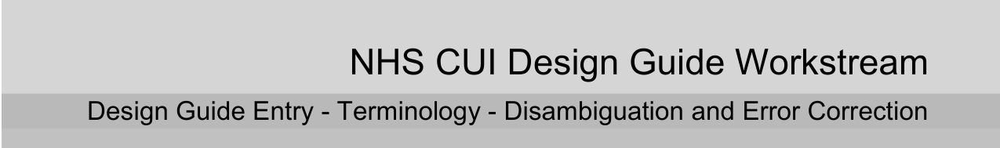
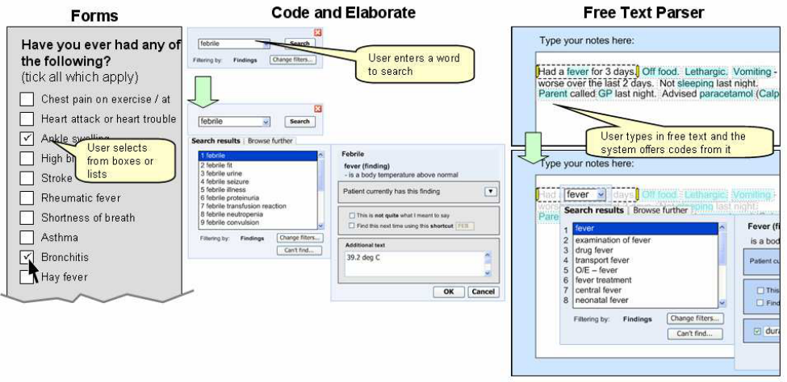
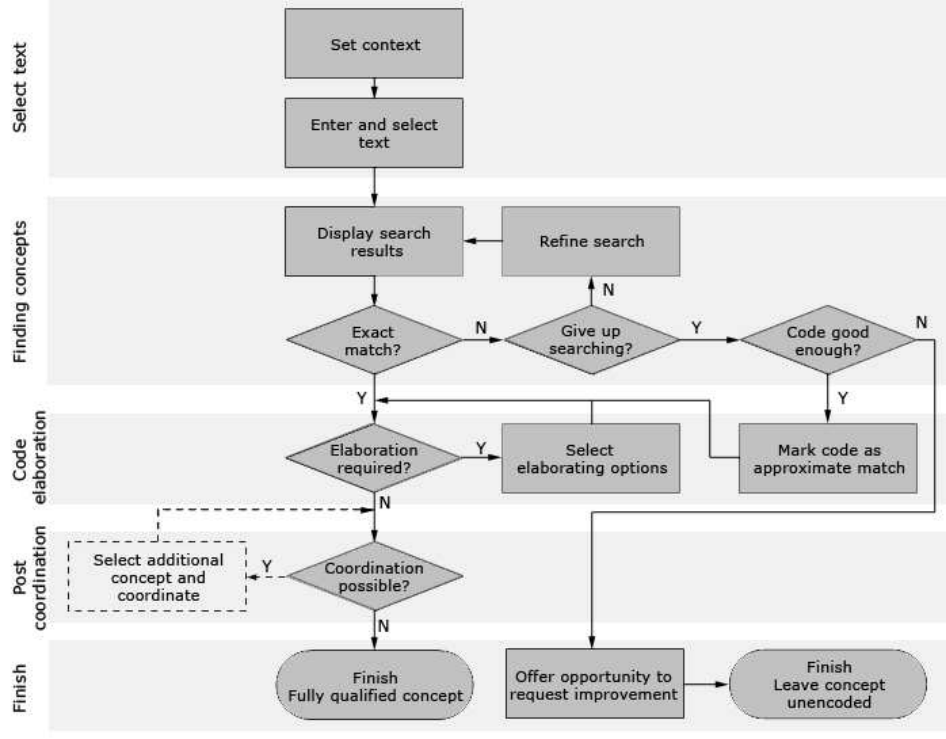

Prepared for
NHS Connecting for Health
Version 1.0.0.0 Baseline
Prepared by
NHS CUI Programme Team
mscui@microsoft.com
Contributors
Ben Luff
Laura Dromundo

Microsoft and NHS Connecting for Health Confidential
This document has been prepared for the NHS CUI project and is subject to the terms and conditions of the Development Agreement between Microsoft and the Secretary of State for Health in respect of the project. The document may contain information or work product that is Microsoft pre-existing work and/or information or work product that has been created specially for the purposes of the project. All trademarks are the property of their respective companies. Microsoft and Windows are either registered trademarks or trademarks of Microsoft Corporation in the United States and/or other countries.
© Microsoft Corporation and Crown Copyright 2006
NHS CUI Design Guide Workstream, Design Guide Entry - Terminology - Disambiguation and Error Correction Prepared by NHS CUI Programme Team, Version 1.0.0.0 Baseline Last modified on 18 August 2006
Microsoft and NHS Connecting for Health Confidential
NHS CUI Design Guide Workstream, Design Guide Entry - Terminology - Disambiguation and Error Correction Prepared by NHS CUI Programme Team, Version 1.0.0.0 Baseline Last modified on 18 August 2006
Microsoft and NHS Connecting for Health Confidential
## 1 INTRODUCTION

<!-- TOC -->
<!-- TOC generated by Markdown All in One style -->

- [1 INTRODUCTION](#1-introduction)
  - [1.1 Overview](#11-overview)
  - [1.2 Area of Focus](#12-area-of-focus)
  - [1.3 References to Table of Contents Document](#13-references-to-table-of-contents-document)
- [2 DOCUMENT INFORMATION](#2-document-information)
  - [2.1 Terms and Abbreviations](#21-terms-and-abbreviations)
  - [2.2 Definitions](#22-definitions)
  - [2.3 Nomenclature](#23-nomenclature)
  - [2.4 Audience](#24-audience)
  - [2.5 Open Issues Summary](#25-open-issues-summary)
  - [2.6 References](#26-references)

<!-- /TOC -->

Source PDF: [disambig.pdf](../../pdfs/clinical-noting-and-terminology/disambig.pdf)

This document presents an introduction into the guidance and recommendations for aspects of Terminology user interfaces related to models of Disambiguation and Error Correction.

This document should be read in conjunction with the following Design Guide documentation:

  - DG-R3-004 Design Guide Entry - Terminology - Searching

  - DG-R3-004 Design Guide Entry - Terminology - Elaboration

  - DG-R3-004 Design Guide Entry - Terminology - Display Standards for Coded Information

  - DG-R3-004 Design Guide Entry - Terminology - Post Coordination

  - DG-R3-004 Terminology Requirements

  - CFH_CUI_HAZARD_LOG_TERMINOLOGY_R3

Please ensure you also read the following Design Guide documentation:

  - Accessibility for Clinical Applications {R2}

Note

This document provides a brief introduction for the Design Guide Entry for Terminology UI Interaction Models of Disambiguation and Error Correction. The detailed guidance is provided in context within the other four Terminology Design Guide Entry documents that are listed above. Please refer to the relevant document for the error correction and disambiguation guidance that you require.

### 1.1 Overview

This document is for the use of anyone whose role includes screen design, implementation or assessment of a NHS clinical application and is involved in creating or evaluating terminology user interfaces.

Terminology user interfaces operate within a note-taking environment. These environments fall into three categories (as illustrated in Figure 1 and described below), each of which require different guidance:

  - Forms

    - The user makes notes by ticking boxes and choosing options, not by entering text

    - An encoding interface is not needed – the clinical codes should be embedded within the
form itself

  - Code and elaborate

    - The user makes notes by selecting a clinical code (such as 'asthma'), and elaborating it
with other codes (such as 'severe') and unencoded text (such as 'mother anxious')

    - Encoding interfaces require components to search for and elaborate clinical terms

Page 1

NHS CUI Design Guide Workstream, Design Guide Entry - Terminology - Disambiguation and Error Correction Prepared by NHS CUI Programme Team, Version 1.0.0.0 Baseline Last modified on 18 August 2006

Microsoft and NHS Connecting for Health Confidential

 - Free text parser

   - The user makes notes by writing text, then identifies and encodes words and phases within
that text

   - Encoding interfaces require components to identify and manage clinical terms within the
text, as well as components to search for, and elaborate, clinical terms

Figure 1: Styles of Encoding

Medical language is full of abbreviations and jargon, some of which have more than one meaning. By encoding clinical statements, they can be shared unambiguously. This should improve patient safety by reducing confusion, or errors, due to ambiguity in clinical notes.

Encoding also opens up important opportunities, such as:

 - Unambiguously sharing clinical statements between clinicians in different disciplines or
institutions

 - Using decision support mechanisms, based on codes within clinical statements, to enhance
patient safety

 - Auditing clinical activity by using codes to locate and report on specific types of information
within patient records

 - Researching clinical practice or outcomes in the NHS by extracting codes from electronic
patient records

NHS CFH has chosen SNOMED-CT as the terminology for encoding clinical statements.

Page 2

NHS CUI Design Guide Workstream, Design Guide Entry - Terminology - Disambiguation and Error Correction Prepared by NHS CUI Programme Team, Version 1.0.0.0 Baseline Last modified on 18 August 2006

Microsoft and NHS Connecting for Health Confidential

### 1.2 Area of Focus

This document aims to describe Models of Disambiguation and Error Correction within a terminology interface, as illustrated in Figure 2 below.

Figure 2: Terminology Overview

Current guidance on error correction and disambiguation is presented in context in:

  - DG-R3-004 Design Guide Entry - Terminology - Searching

  - DG-R3-004 Design Guide Entry - Terminology - Elaboration

  - DG-R3-004 Design Guide Entry - Terminology - Display Standards for Coded Information

  - DG-R3-004 Design Guide Entry - Terminology - Post Coordination

Page 3

NHS CUI Design Guide Workstream, Design Guide Entry - Terminology - Disambiguation and Error Correction Prepared by NHS CUI Programme Team, Version 1.0.0.0 Baseline Last modified on 18 August 2006

Microsoft and NHS Connecting for Health Confidential

### 1.3 References to Table of Contents Document

The document Table of Contents {R1} outlines every specific area of focus to be covered by the Design Guide. Each area of focus has an accompanying Design Guide Entry document. Table 1 indicates the areas of focus covered by this Design Guide Entry.

4.5 Disambiguation and Error Correction 25%

Table 1: References to Table of Contents Document

NHS CUI Design Guide Workstream, Design Guide Entry - Terminology - Disambiguation and Error Correction Prepared by NHS CUI Programme Team, Version 1.0.0.0 Baseline Last modified on 18 August 2006

Page 4

Microsoft and NHS Connecting for Health Confidential

## 2 DOCUMENT INFORMATION

### 2.1 Terms and Abbreviations

CUI Common User Interface

NHS National Health Service

NHS CFH NHS Connecting for Health

Table 2: Terms and Abbreviations

### 2.2 Definitions

NHS Entity Within this document, defined as a single NHS organisation or group that is operated within a single technical infrastructure environment by a defined group of IT administrators.

The Authority The organisation implementing the NHS National Programme for IT (currently NHS Connecting for Health)

Table 3: Definitions

### 2.3 Nomenclature

Cross References

Cross references to other sections in the current document comprise a section number. Cross references may also be to figures and tables, where the caption number only might be shown.

References to other Project documents are shown in italics. Footnotes with additional details may also be used.

### 2.4 Audience

The audience for this document includes:

  - Authority CUI Manager / Project Sponsor. Overall Project Manager and sponsor for the NHS
CUI Project within the Authority.

  - Authority NHS CUI Design Guide Workstream Project Manager. Responsible for ongoing
management and administration of the Workstream.

  - The Authority Project Team. This document defines the approach to be taken during this
assessment and therefore must be agreed by the Authority.

  - Microsoft NHS CUI Team. This document defines the approach to be taken during this
assessment, including a redefinition of the NHS CUI Design Guide Workstream strategy.

Page 5

NHS CUI Design Guide Workstream, Design Guide Entry - Terminology - Disambiguation and Error Correction Prepared by NHS CUI Programme Team, Version 1.0.0.0 Baseline Last modified on 18 August 2006

Microsoft and NHS Connecting for Health Confidential

### 2.5 Open Issues Summary

None

Table 4: Open Issues Summary

### 2.6 References

R1. NHS CUI Design Guide Workstream - DG-R2-011 Table of Contents 1.0.0.0 04-Apr-2006

R2. Accessibility for Clinical Applications – QW Accessibility 1000.doc 1.0.0.0 31-May-2006

R3. DG-R3-004 Design Guide Entry - Terminology - Searching 1.0.0.0 18-Aug-2006

R4. DG-R3-004 Design Guide Entry - Terminology - Elaboration 1.0.0.0 18-Aug-2006

R5. DG-R3-004 Design Guide Entry - Terminology - Display Standards for Coded 1.0.0.0 18-Aug-2006 Information

R6. DG-R3-004 Design Guide Entry - Terminology - Post Coordination 1.0.0.0 18-Aug-2006

R7. DG-R3-004 Terminology Requirements TBD TBD

R8. CFH_CUI_HAZARD_LOG_TERMINOLOGY_R3 TBD TBD

Table 5: References

NHS CUI Design Guide Workstream, Design Guide Entry - Terminology - Disambiguation and Error Correction Prepared by NHS CUI Programme Team, Version 1.0.0.0 Baseline Last modified on 18 August 2006

Page 6
