_Prepared for_
**NHS Connecting for Health**
**Version 2.0.0.0 Baseline**
_Prepared by_
**NHS CUI Programme Team**
**[cuistakeholder.mailbox@hscic.gov.uk](mailto:cuistakeholder.mailbox@hscic.gov.uk)**
_Contributors_
**Ben Luff**
## PREFACE

<!-- TOC -->
<!-- TOC generated by Markdown All in One style -->

- [PREFACE](#preface)
- [1 INTRODUCTION](#1-introduction)
    - [1.1 Overview](#11-overview)
    - [1.2 Area of Focus](#12-area-of-focus)
    - [1.3 References to Table of Contents Document](#13-references-to-table-of-contents-document)
- [2 RECOMMENDATION AND GUIDANCE](#2-recommendation-and-guidance)
    - [2.1 Display Standards for Communicating Encodable Notes](#21-display-standards-for-communicating-encodable-notes)
      - [2.1.1 Displaying Potentially Encodable Text](#211-displaying-potentially-encodable-text)
    - [ Feature unencoded text in black, normal](#feature-unencoded-text-in-black-normal)
    - [ The background for the text field should](#the-background-for-the-text-field-should)
    - [ Align (justify) text to the left Left justified This will make the text easy to read](#align-justify-text-to-the-left-left-justified-this-will-make-the-text-easy-to-read)
    - [ The space between one line of type and](#the-space-between-one-line-of-type-and)
    - [ Do not use highlight colours that could](#do-not-use-highlight-colours-that-could)
      - [2.1.2 Displaying Suggested SNOMED-CT Matches](#212-displaying-suggested-snomed-ct-matches)
    - [ Feature the suggested matches in a](#feature-the-suggested-matches-in-a)
      - [2.1.3 Displaying Potential Post-Coordinated Attribute Matches](#213-displaying-potential-post-coordinated-attribute-matches)
    - [ Display the post-coordinated expression](#display-the-post-coordinated-expression)
      - [2.1.4 Displaying Non-SNOMED-CT-Matched Elaboration](#214-displaying-non-snomed-ct-matched-elaboration)
    - [ Display each chunk of text separately See figure above](#display-each-chunk-of-text-separately-see-figure-above)
      - [2.1.5 Displaying Expression Boundaries](#215-displaying-expression-boundaries)
    - [ Feature a hover-over over the selected The hover-over could read ‘Drag the This will communicate to the user what](#feature-a-hover-over-over-the-selected-the-hover-over-could-read-drag-the-this-will-communicate-to-the-user-what)
    - [ Do not feature more than one selected n/a The proposed system will only handle](#do-not-feature-more-than-one-selected-na-the-proposed-system-will-only-handle)
    - [2.2 Display Standards for Notes Confirmed for Encoding](#22-display-standards-for-notes-confirmed-for-encoding)
      - [2.2.1 Displaying Confirmed Matches](#221-displaying-confirmed-matches)
    - [ Do not feature too dark a highlight; the](#do-not-feature-too-dark-a-highlight-the)
      - [2.2.2 Displaying Unstructured Notes that are Associated with Confirmed Matches](#222-displaying-unstructured-notes-that-are-associated-with-confirmed-matches)
- [3 DOCUMENT INFORMATION](#3-document-information)
    - [3.1 Terms and Abbreviations](#31-terms-and-abbreviations)
    - [3.2 Definitions](#32-definitions)
    - [3.3 Nomenclature](#33-nomenclature)
    - [3.4 References](#34-references)
- [APPENDIX A LIST OF HIGH LEVEL REQUIREMENTS](#appendix-a-list-of-high-level-requirements)
    - [PART I General](#part-i-general)
    - [PART II  Searching](#part-ii-searching)
    - [PART III Elaboration and Post Coordination](#part-iii-elaboration-and-post-coordination)
    - [PART IV Display of Coded Information](#part-iv-display-of-coded-information)
- [REVISION AND SIGNOFF SHEET](#revision-and-signoff-sheet)
    - [Change Record](#change-record)
    - [Audience](#audience)
    - [Open Issues Summary](#open-issues-summary)
    - [Reviewers](#reviewers)
    - [Distribution](#distribution)
    - [Document Properties](#document-properties)

<!-- /TOC -->

Source PDF: [displaystandards.pdf](../../pdfs/clinical-noting-and-terminology/displaystandards.pdf)

**Documents replaced by this document**
Design Guide Entry - Terminology - Display Standards for Coded Information 1.0.0.0
**Documents to be read in conjunction with this document**
Design Guide Entry - Terminology - Elaboration 2.0.0.0
Design Guide Entry - Terminology - Matching 1.0.0.0
Design Guide Entry - Terminology - Post Coordination 2.0.0.0
Terminology Release 4 Summary _(Presentation)_ 1.0.0.0
In using this document, please be aware that the effect of recent Patient Safety Assessments (PSAs) executed for the NHS CUI programme have not yet been addressed in the guidance in this document. Any such effect the PSAs may have on the content and guidance contained herein, will be included in a subsequent version of this document.
**This document was prepared for NHS Connecting for Health which ceased to exist on 31 March**
**2013. It may contain references to organisations, projects and other initiatives which also no longer**
**exist. If you have any questions relating to any such references, or to any other aspect of the**
**[content, please contact cuistakeholder.mailbox@hscic.gov.uk](mailto:cuistakeholder.mailbox@hscic.gov.uk)**
## 1 INTRODUCTION

This document provides guidance and recommendations with rationale for aspects of Terminology user interfaces related to display standards for clinical codes information.

This document should be read in conjunction with the following Design Guide documentation:

- _NHS CUI Design Guide Workstream -_ _Design Guide Entry - Terminology - Matching_ **{R2}**

- _NHS CUI Design Guide Workstream -_ _Design Guide Entry - Terminology - Elaboration_ **{R3}**

- _NHS CUI Design Guide Workstream -_ _Design Guide Entry - Terminology - Post-_

_Coordination_ **{R4}**

#### 1.1 Overview

This document is for the use of anyone whose role includes screen design, implementation or assessment of an NHS clinical application and is involved in creating or evaluating terminology user interfaces.

Terminology user interfaces operate within a note-taking environment. These environments fall into three categories (as illustrated in Figure 1 and described below), each of which require different guidance:

- **Forms**

 The user makes notes by selecting check boxes and choosing options, not by entering text

 An encoding interface is not needed. The clinical codes should be embedded within the form itself or derived from combinations of entries in the form.

- **Single concept matching**

 The user makes notes by selecting a clinical code, such as 'asthma', and elaborating it with other codes, such as 'severe' and unencoded text, such as ‘worse in cold weather’

 Encoding interfaces require components to search for and elaborate clinical terms

- **Text parser**

 The user makes notes by writing text, then identifies and encodes words and phases within that text

 Encoding interfaces require components to identify and manage clinical terms within the text, as well as components to search for, and elaborate, clinical terms

Page 1

Copyright ©2013 Health and Social Care Information Centre

HSCIC Controlled Document

Figure 1 below illustrates all three categories: forms (left), single concept matching (centre) and text parser matching (right):

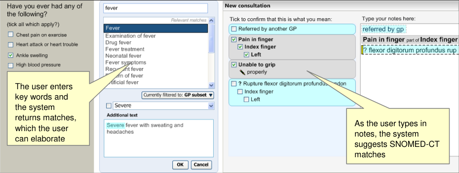

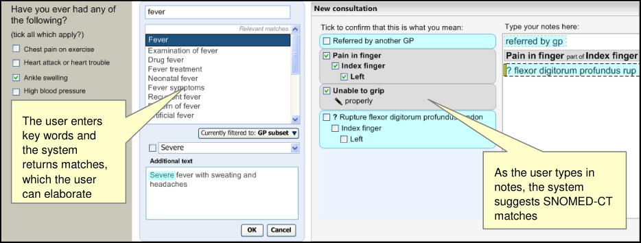

Figure 1: Styles of Encoding

A possible fourth hybrid category could be defined where forms may include areas where single concept matching or text parser is used.

Medical language is full of abbreviations and jargon, some of which have more than one meaning. By encoding clinical statements, they can be shared unambiguously. This should improve patient safety by reducing confusion, or errors, due to ambiguity in clinical notes.

Encoding also opens up important opportunities, such as:

- Filtering context specific views of medical records in order to improve searching

- Unambiguously sharing clinical statements between clinicians in different disciplines or

institutions

- Using decision support mechanisms, based on codes within clinical statements, to enhance

patient safety

- Auditing clinical activity by using codes to locate and report on specific types of information

within patient records

- Researching clinical practice or outcomes in the NHS by extracting codes from electronic

patient records

NHS Connecting for Health (NHS CFH) has chosen Systematised Nomenclature of MedicineClinical Terms as the terminology for encoding clinical statements.

#### 1.2 Area of Focus

This document describes display standards for coded information. There are three main areas of consideration across the terminology domain that will be covered within this guidance, as illustrated in Figure 2 and the points below:

- Enter and select text – including display standards for communicating encodable text

- Fully qualified concepts – including display standards for encoded text

- Leave concepts unencoded – concepts not encoded but displayed in the notes

Page 2

Copyright ©2013 Health and Social Care Information Centre

HSCIC Controlled Document

Figure 2: User Interaction Model

#### 1.3 References to Table of Contents Document

The document _NHS CUI Design Guide Workstream -_ _Table of Contents_ **{R1}** outlines every specific area of focus to be covered by the Design Guide. Each area of focus has an accompanying Design Guide Entry document. Table 1 indicates the areas of focus covered by this Design Guide Entry.

4.3 UI Display Standards for Coding Information 100%

Table 1: References to Table of Contents Documents

Page 3

Copyright ©2013 Health and Social Care Information Centre

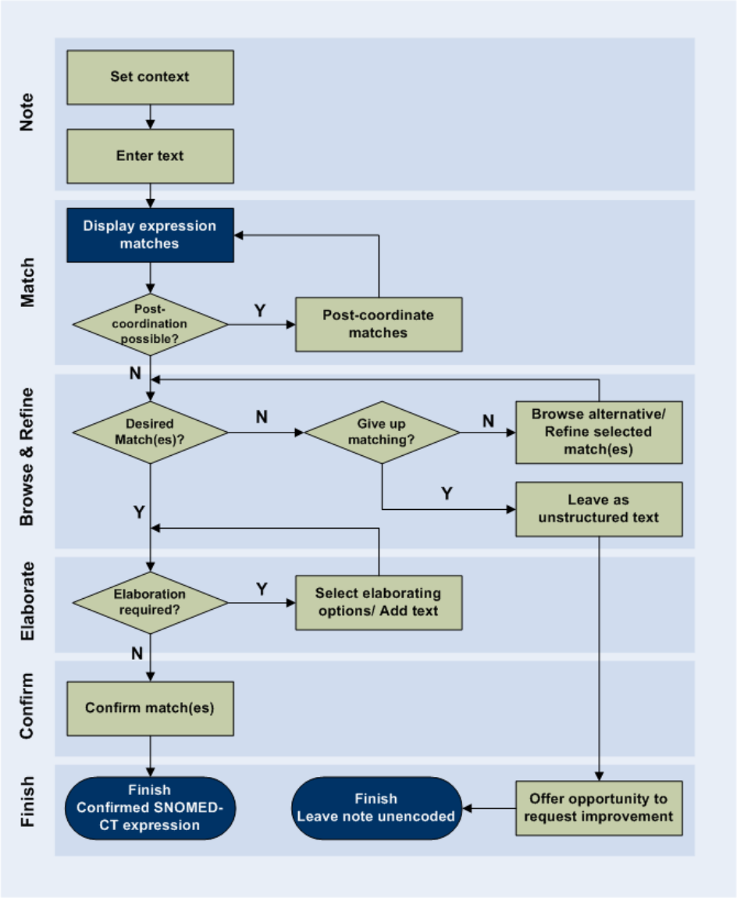
HSCIC Controlled Document

## 2 RECOMMENDATION AND GUIDANCE

#### 2.1 Display Standards for Communicating Encodable Notes

The following sections present guidance on how text that is potentially encodable should be displayed.

This guidance applies primarily to notes in the text parser approach to matching. However, it will also apply to the **additional text** area in the single concept matching approach.

Please note that this guidance applies only to the noting input and matching process. Beyond the point at which the notes are saved to record, this guidance is no longer necessarily applicable.

The requirements for this Design Guide entry are listed in Table 2 below:

D1.1 The display will be flexible enough so that it can fit into a number of different spaces and sizes.

D1.2 The system will have the capability to display both SNOMED-CT-encoded and unencoded notes.

D1.3 The system will clearly distinguish between free text that, upon committing to the record, will be SNOMED-CT encoded and text that will not be SNOMED-CT encoded.

D1.4 The system will allow users to edit SNOMED-CT-encoded terms (in other words, re-encode them) before committing them to the record.

D1.5 The system will display polished prose as well as the structured view for a post-coordinated concept.

D1.6 The system will ensure that the display of prose and encoded notes are consistent with each other.

D1.7 The system will be able account for a number of application real estate sizes and shapes.

D1.8 The system will allow users to view their original text entry, in other words, the last edit of the text they entered, prior to encoding.

D2.1 The system will communicate which text is potentially SNOMED-CT encodable.

D2.2 The system will distinguish between text that can be encoded as a standalone SNOMED-CT concept and text that can be encoded only as elaboration to a concept.

D2.3 The system will clearly distinguish between potentially encodable text and encoded text. Potentially encodable text will be committed to the record as free text if users do not encode it.

D2.4 The system will display the top match for each potentially encodable concept, in addition to the text typed in by the user.

D3.1 The system will communicate the relationship between codes and their elaboration, on display.

D3.2 The system will communicate potential relationships between concepts.

D3.3 The system will distinguish between potential relationships and user-confirmed relationships between concepts.

Table 2: Requirements for the Display of Coded Information

##### 2.1.1 Displaying Potentially Encodable Text

This guidance shows how to distinguish words and phrases that have been identified as being potentially encodable as SNOMED-CT concepts. Figure 3 illustrates how potentially encodable text typed in by the clinician as their notes, will be displayed in a clinical application.

Potentially encodable text refers to text against which the system can match SNOMED-CT expressions (which comprise single concept or multiple coordinated concepts). Whether the text can be matched may be affected by:

- filtering by contextual subsets

Page 4

Copyright ©2013 Health and Social Care Information Centre

HSCIC Controlled Document

- rules regarding what constitutes an expression, namely that a matched expression must

contain a base concept (that is, a clinical finding, procedure, observable entity, situation with explicit context or, in certain circumstances, pharmaceutical/biological product) and any other concepts that post-coordinate with the base concept

Changing the subset filtering may alter what is deemed encodable, and the formatting outlined below would be updated accordingly. Additionally, users may be allowed to force an encoding by selecting (in other words, highlighting) a text string, clicking on the right mouse button and choosing the appropriate match from the shortcut menu. In this case, the formatting would not be needed.

This text will be displayed in an input text area, in the right pane, and the suggested SNOMED-CT matches will be displayed in the left pane, as illustrated in Figure 3:

Figure 3: Formatting in the Text Input (Right Pane) and Suggested Matches (Left Pane) Areas

This guidance will also apply to the additional text field in the single concept matching design approach as illustrated in Figure 4.

Figure 4: Formatting in the Additional Text Field

In both cases, potentially encodable text will be displayed in a pale highlight that, whilst being visible, will not affect the legibility of the text.

Page 5

Copyright ©2013 Health and Social Care Information Centre

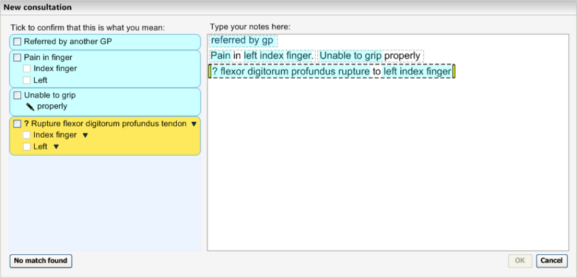

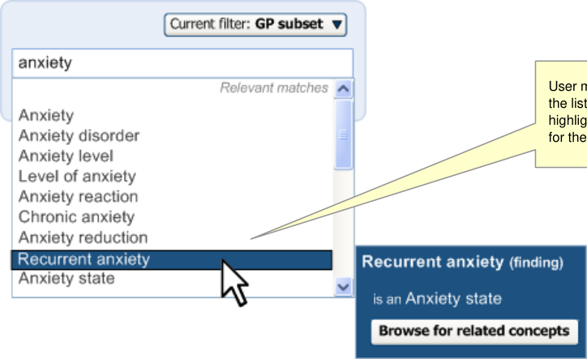
HSCIC Controlled Document

_**2.1.1.1**_ _**Guidance**_

The system:

- Must visibly display, from the text typed by the user, which words or phrases have been

recognised by the system to be potentially encodable as SNOMED-CT concepts

- Should ensure that the visible elements for communicating encodable words or phrases

must be **strongly visually associated** with the text typed by the user

- Should ensure that any communication where text can be encoded **does not hinder the**

**legibility** of the text itself

- Should communicate that a word or phrase is encodable by **highlighting** it

- Should ensure that the colour of the highlight is sufficiently visible under conditions which

do not require accessibility enhancements, but that it does not deteriorate the legibility of the text

- Should emphasise the boundaries between encodable concepts, for example, by showing

**clear gaps** in the highlight between separate encodable concepts

- Should communicate that a word or phrase is encodable **as it is being typed** (and as soon

as the system is able to recognise it as a potential SNOMED-CT concept)

- Should ensure that while typing, all text is clearly visible

- Should block additional formatting by the user, including highlights, text colour changes and

underlines

- Should allow the user to enter punctuation and carriage returns

_**2.1.1.2**_ _**How to Use the Design Guide Entry**_

####  Feature unencoded text in black, normal

weight text

####  The background for the text field should

be white (or off-white)

Black, normal text Black normal weight text is easy to read. It is important only to bold text where necessary

Black on white This should provide a good contrast to make the text easy to read

####  Align (justify) text to the left Left justified This will make the text easy to read

####  The space between one line of type and

the next should be 1.5 to 2 times the space between words

Table 3: How to Use the Design Guide Entry

Line spacing of 1.5 times This is a standard format and will make the text easy to read

_**2.1.1.3**_ _**How Not to Use the Design Guide Entry**_

the highlight

####  Do not use highlight colours that could

possibly have other connotations such as green or red

Not sleeping last night Colours such as green or red can have other connotations, for example, red can be used for an alert or green for ok

Also, green and red are difficult to distinguish for some colour-blind users

Page 6

Copyright ©2013 Health and Social Care Information Centre

HSCIC Controlled Document

too light or subtle. This may not show information may be missed by the user on high contrast/high brightness screens

Table 4: How Not to Use the Design Guide Entry

_**2.1.1.4**_ _**Benefits and Rationale**_

Users must be able to clearly see which text is encodable so that they can choose what to encode. Displaying encodable text also acts as a reminder to the user that text should be encoded in the same way that underlining spelling mistakes in a word processor reminds a user that words should be spelled correctly. This will work in conjunction with the suggested matches in the left pane (see the next section for details).

Highlights are preferred to underlines or boxes (that enclose text), since these disrupt the legibility of the text. Additionally, underlines are used in many software packages, as well as in the current design, to indicate spelling mistakes.

Additional formatting, such as text colour changes, could interfere with the visibility of the encoding highlighting and, as a result, is strongly discouraged in this guidance. Punctuation and carriage returns form part of the text meaning and, hence, are not included in this guidance.

The light blue colour used in Table 3 above, is a serene yet prominent colour, and one that does not affect legibility.

Potentially encodable text should be strongly visually linked with the text typed by the user, because the original text provides context and cues as to how the text should be encoded. Highlighting the text directly provides a strong visual association.

Encodable words and phrases must be clearly and visibly distinct from one another. This is so a phrase that is encodable as a single concept is distinguishable from a phrase that contains several distinct encodable concepts. For example, from the following text, ‘Protein deficiency, disease of kidney, finding it hard to urinate’, the system may identify the following terms: ‘Protein deficiency disease’ ‘kidney finding’ and ‘urinate’, which has a different meaning to the one intended by the user. It is therefore important that the user can clearly see where the boundaries of the encodable concepts lie, and, if necessary, take action. In the case of highlighted words, there needs to be a definite gap between them in order for them to be distinguished from one another.

Examples of this display were shown to clinicians during wireframe testing sessions. All of the participants recognised that the highlighting functionality communicated key words for encoding.

By highlighting potentially encodable words automatically, the effort on the part of users is reduced when encoding text.

_**2.1.1.5**_ _**Confidence Level**_

**High confidence**

- Must visibly display, from the text typed by the user, which words or phrases have been

recognised by the system to be potentially encodable as SNOMED-CT concepts

- Should ensure that the visible elements for communicating encodable words or phrases

must be **strongly visually associated** with the text typed by the user

- Should ensure that any communication where text can be encoded **does not hinder the**

**legibility** of the text itself

- Should ensure that the colour of the highlight is sufficiently visible under conditions which

do not require accessibility enhancements, but that it does not deteriorate the legibility of the text

Page 7

Copyright ©2013 Health and Social Care Information Centre

HSCIC Controlled Document

- Should ensure that while typing, all text is clearly visible

**Medium confidence**

- Should communicate that a word or phrase is encodable by **highlighting** it

- Should emphasise the boundaries between encodable concepts, for example, by showing

**clear gaps** in the highlight between separate encodable concepts

**Low confidence**

- Should communicate that a word or phrase is encodable **as it is being typed** (and as soon

as the system is able to recognise it as a potential SNOMED-CT concept)

- Should block additional formatting by the user, including highlights, text colour changes and

underlines

##### 2.1.2 Displaying Suggested SNOMED-CT Matches

In addition to highlighting where text is potentially encodable, the system will also display the potential SNOMED-CT matches in an area adjacent to the text input area, in the text parser approach. In the single concept matching approach, the matches will appear above the additional text input field.

The formatting of the suggested matches will be consistent with the formatting of the encodable text, namely a pale blue colour. The exception is the in-focus (selected) match, which will be displayed in yellow and will be slightly embossed (that is, standing out in relief), to convey that it is a clickable button. This colouring will also change on mouse-over. In other words, when the user moves the mouse over the suggested matches, the colour will change. The yellow handles and bold marquee in the text input area in the right pane will also move to the appropriate text when the user clicks on a suggested match in the left pane. This is illustrated in Figure 5.

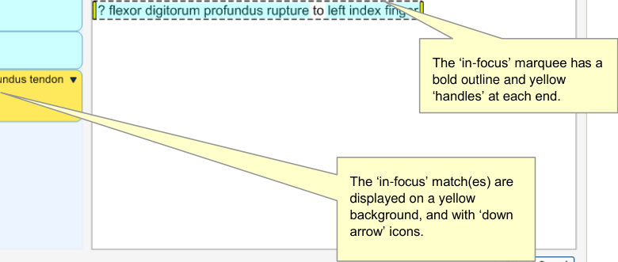

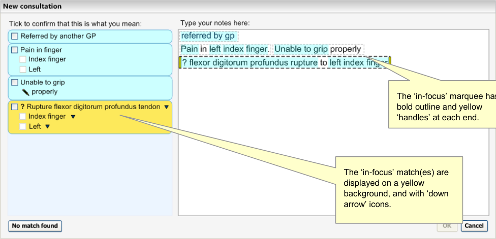

Figure 5: Suggested SNOMED-CT Matches Are Shown in the Left Pane

Additionally, when the user moves the mouse over a match, its colour will change to yellow. At this point, if there are similar matches to the top match, or there are more specific matches to be viewed, the system will communicate a message to encourage users to click further (see Figure 6).

Page 8

Copyright ©2013 Health and Social Care Information Centre

HSCIC Controlled Document

Figure 6: System Warns of Similar Matches

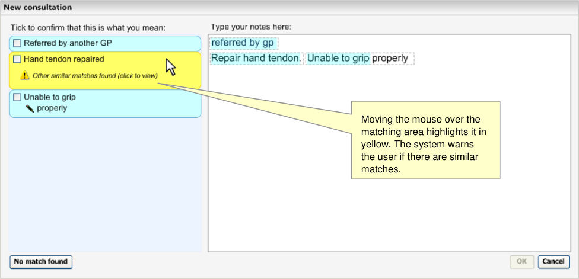

As the user moves the mouse onto the label itself, the surrounding area will become orange and slightly embossed (that is, standing out in relief) to communicate that it is a clickable button. This is illustrated in Figure 7.

Figure 7: Match Label becomes a Clickable Button

Furthermore, if there are matches that have the same spelling as the top match, the system will communicate a message that tells the user to click the button to view the alternative matches before they can confirm the top match, as shown in Figure 8.

Page 9

Copyright ©2013 Health and Social Care Information Centre

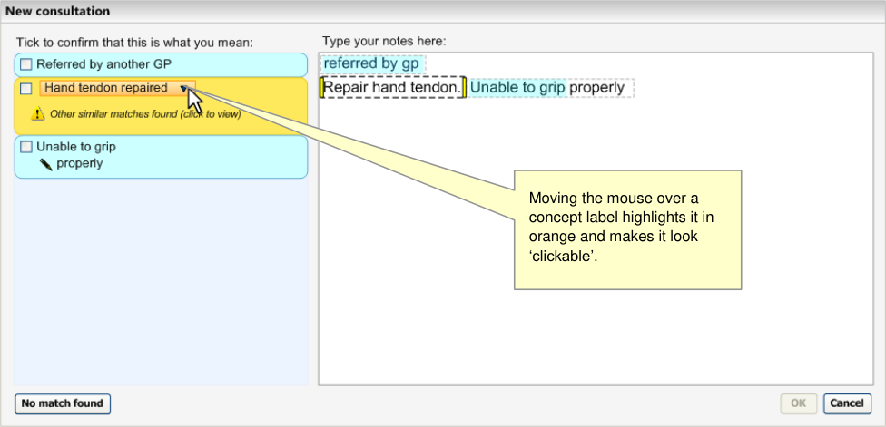
HSCIC Controlled Document

Figure 8: Confirmation Check Box is Disabled if there are Two Matches the Same

_**2.1.2.1**_ _**Guidance**_

The system:

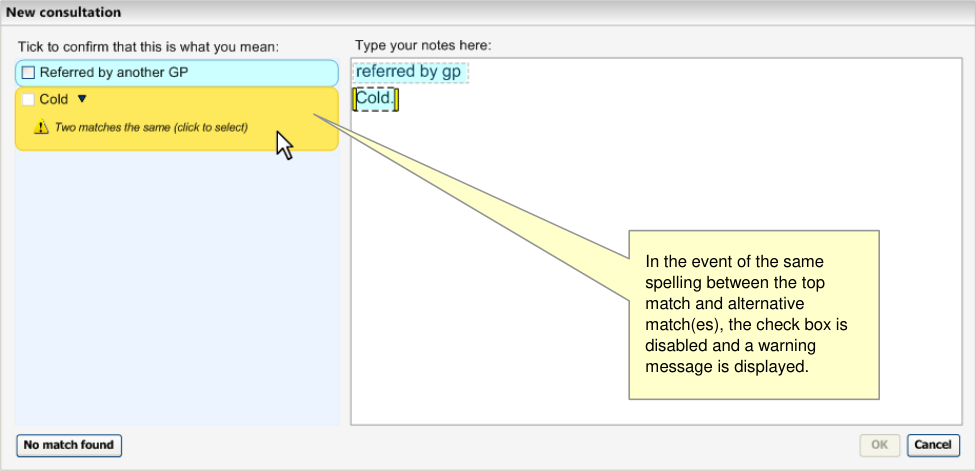

- Must ensure that the suggested matched expressions are distinct from each other

 Should ensure that each suggested matched expression is contained in a rectangular boundary

 Could round the corners of the rectangular boundaries to make the areas stand out further from the field in which they are displayed

 Could ensure that the suggested match areas have sufficient colour contrast with the background of the field in which they are displayed

- Should feature the suggested SNOMED-CT matches in the same colour as the encoded

highlight

 Could feature a yellow or orange colour for the suggested SNOMED-CT match above which the mouse is hovering

 Could change the surface of the suggested match area so that it becomes embossed and clickable on mouse-over

- Must display a message to communicate to the user when (i) there are close alternative

matches or (ii) when there are more specific alternative matches (that is, children of the top match)

 Could expand the suggested match area downwards on mouse-over, if there are messages to communicate for that match. This would push down the matches below it in order to fit the expanded area

- Should display the text on the suggested matches in normal (regular), rather than in bold

text style

- Must display the preferred term or the synonym term label for each suggested match

- Must display a confirm check box control at the far left of the suggested match area

 Should display the suggested match label immediately to the right of the confirm check box

- Should display the suggested matches stacked vertically

Page 10

Copyright ©2013 Health and Social Care Information Centre

HSCIC Controlled Document

 Should display the suggested matches in the same order in which the related text appears in the input field

- Must display the suggested matches in an area that can be viewed at the same time as the

area in which user types the notes

- Should **not** display the SNOMED-CT concept ID number in the default view of the encoded

notes

_**2.1.2.2**_ _**How to Use the Design Guide Entry**_

####  Feature the suggested matches in a

prominent colour

Table 5: How to Use the Design Guide Entry

See above

_**2.1.2.3**_ _**How Not to Use the Design Guide Entry**_

Table 6: How Not to Use the Design Guide Entry

_**2.1.2.4**_ _**Benefits and Rationale**_

The benefits of providing feedback in a location that is immediately visible to the user include:

- Giving users confidence that they have (successfully) encoded the notes and providing a

measure of progress that may encourage the user to continue encoding. Failing to provide this feedback could lead to users being uncertain that they are encoding their notes correctly and, hence, make them dissatisfied (most of the time, people like to see the immediate results of their actions).

- Allowing users to check their encoded notes before saving them to the system. This

confirmation partially mitigates the patient safety risk that the user encodes the wrong concept or fails to record an important qualification to the concept. Given the timepressured and attention-demanding environment in which the notes may be entered, ensuring that the notes are structured in a way that the user can quickly and easily pick out the most important notes first, should also help to mitigate this risk.

- Giving the user an insight into how the notes are going to be saved in the system. This

could help the user to create better-structured notes in future and could help the user understand how to best retrieve these notes when needed.

We recommend arranging the notes vertically. This is a standard way of presenting lists for users to check, and one with which users will be familiar. It also helps to ensure that the multiple notes do not appear to merge together, as in most cases there is a single term, note or value per line.

Displaying the system’s suggested matches immediately next to the text input area:

- Gives the user the opportunity to check that the structured encoded notes are accurate

- Gives the user a greater understanding of how the notes will be recorded in the system

Displaying matches to the left of the text input area means that these suggested matches will always be close to the text input, given the left-hand justification of the text input.

_**2.1.2.5**_ _**Confidence Level**_

**High confidence**

Page 11

Copyright ©2013 Health and Social Care Information Centre

HSCIC Controlled Document

- Must ensure that the suggested matched expressions are distinct from each other

- Must display the preferred term or the synonym term label for each suggested match

- Must display a confirm check box control at the far left of the suggested match area

 Should display the suggested match label immediately to the right of the confirm check box

- Should display the suggested matches stacked vertically

 Should display the suggested matches in the same order in which the related text appears in the input field

- Should **not** display the SNOMED-CT concept ID number in the default view of the encoded

notes

**Medium confidence**

- Should ensure that each suggested matched expression is contained in a rectangular

boundary

 Could round the corners of the rectangular boundaries in order to make the areas stand out further from the field in which they are displayed

- Should ensure that the suggested match areas have sufficient colour contrast with the

background of the field in which they are displayed

- Should feature the suggested SNOMED-CT matches in the same colour as the encoded

highlight

 Could feature a yellow or orange colour for the suggested SNOMED-CT match above which the mouse is hovering

 Could change the surface of the suggested match area so that it becomes embossed and clickable on mouse-over

- Should display the text on the suggested matches in normal, rather than bold, style

**Low**

- Must display a message to communicate to the user when (i) there are close alternative

matches or (ii) when there are more specific alternative matches (that is, children of the top match)

 Could expand the suggested match area downwards on mouse-over, if there are messages to communicate for that match. This would push down the matches below it in order to fit the expanded area

- Must display the suggested matches in an area that can be viewed at the same time as the

area in which user types the notes

##### 2.1.3 Displaying Potential Post-Coordinated Attribute Matches

The system must also be able to display potential post-coordinated attribute matches that it has identified from the user’s typed text.

As outlined in the _NHS CUI Design Guide Workstream -_ _Design Guide Entry - Terminology - Post_ _Coordination_ **{R4}**, the system needs to both communicate the post-coordinated expression as a unitary whole, while at the same time displaying its component parts.

The system will display the post-coordinated solution (that is, the base concept and its attribute concepts) within the same boundary. See Figure 9.

Page 12

Copyright ©2013 Health and Social Care Information Centre

HSCIC Controlled Document

Figure 9: Post-Coordinated Expression Match Displayed As a Unitary Whole

_**2.1.3.1**_ _**Guidance**_

The system:

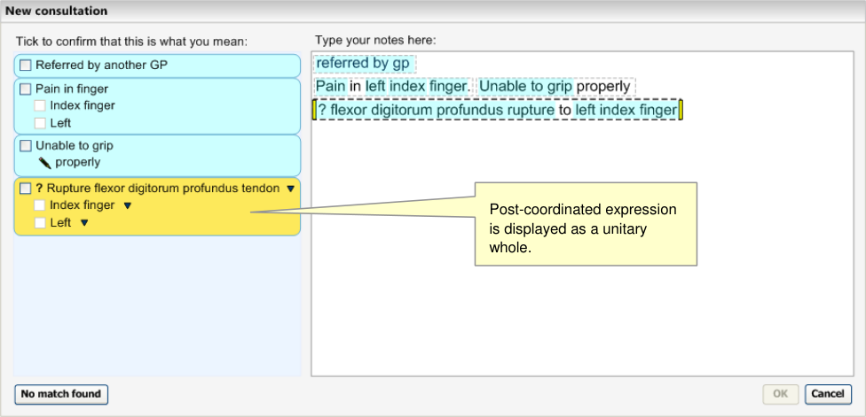

- Must display the attribute concepts that it has identified as part of the top matched

SNOMED-CT expression solution, within a single boundary

 Must display a confirm check box for each of the attributes

- Must communicate that the attribute concepts are further descriptions that belong to the

base concept

 Should indent each attribute concept in relation to its base concept

 Should indent each attribute concept approximately a width of a check box

 Should be able to communicate if an attribute concept is also a base concept for a further attribute concept, by further indentation

- Should only display the attribute value label (such as ‘Mild’), and not the attribute name

(such as ‘Severity’)

_**2.1.3.2**_ _**How to Use the Design Guide Entry**_

####  Display the post-coordinated expression

in a single suggested match area

Table 7: How to Use the Design Guide Entry

See figures above

_**2.1.3.3**_ _**How Not to Use the Design Guide Entry**_

Table 8: How Not to Use the Design Guide Entry

Copyright ©2013 Health and Social Care Information Centre

Page 13

HSCIC Controlled Document

_**2.1.3.4**_ _**Benefits and Rationale**_

We need to distinguish the base concept from its attribute concepts, and indents are a standard way of showing that items belong together or are a further description of the main item. User testing has shown that clinicians understand this presentation of post-coordinated expressions.

_**2.1.3.5**_ _**Confidence Level**_

**High confidence**

- Must display the attribute concepts that it has identified as part of the top matched

SNOMED-CT expression solution, within a single boundary

 Must display a confirm check box for each of the attributes

- Must communicate that the attribute concepts are further descriptions that belong to the

base concept

 Should indent each attribute concept in relation to its base concept

**Low confidence**

- Should only display the attribute value label (such as ‘Mild’), and not the attribute name

(such as ‘Severity’)

Although hiding the attribute name should make the communication of many attributes more efficient and easier to read, there may be some instances where this could be problematic. For example, where there are two attribute matches that fall within similar categories, and where the use of these attributes is hard to discern without the attribute name label.

##### 2.1.4 Displaying Non-SNOMED-CT-Matched Elaboration

In addition to displaying post-coordinated attributes as part of a top-matched solution, the system will also display other (free) text and structured data matches which are not SNOMED-CT matches, as illustrated in Figure 10. These structured non-SNOMED-CT matches may be drawn from an external informational model. Examples include time chunks and shorthand matches, which we recommend are created and used in conjunction with the SNOMED-CT data.

Figure 10: Chunks of Text Visibly Distinguished

Also there may be non-SNOMED-CT attribute relationships drawn from an external information model, for example, linking clinical findings with qualifiers such as expressions of time periods (such as night time).

Page 14

Copyright ©2013 Health and Social Care Information Centre

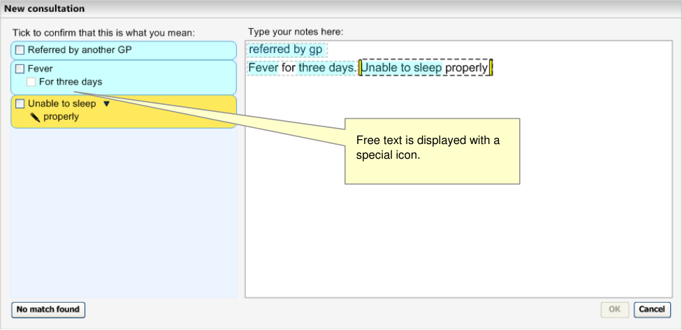
HSCIC Controlled Document

As of yet, there is no agreed way of actually linking the non-SNOMED-CT matches with the SNOMED-CT matches. Therefore, as the relationships do not exist, they are simply displayed below all the SNOMED-CT matches within a single expression envelope.

As outlined in _Design Guide Entry – Terminology – Post-Coordination_ **{R4}**, all the text that (i) cannot be matched (either with SNOMED-CT or non-SNOMED-CT matches) or (ii) coordinated with the base concept in an expression, must remain as unstructured free text if it does not match a base concept and cannot therefore form a new expression of its own.

This text will be displayed as being associated with the SNOMED-CT matches, but without being encodable itself.

Each chunk of free text, where a chunk is text in which all the words are adjacent, will be displayed separately as shown in Figure 11. Any chunk that only features words from the exclusion list, including prepositions, will not be displayed.

Figure 11: Example of Post-Coordination and Two Strings of Associated Free Text

_**2.1.4.1**_ _**Guidance**_

The system:

- Should display all structured data matches in the same way as for the SNOMED-CT

matches, regardless of whether they are drawn from SNOMED-CT or not

- Must display a confirm check box control at the far left of the suggested match area

 Should display the suggested match label immediately to the right of the confirm check box

- Should display each chunk of unstructured text separately

- Must display the unstructured text underneath all the structured matches (within a single

expression envelope)

 Should display the unstructured text one indent in from the base concept

 Should display all chunks of unstructured text at the same indent level

- Must display the non-SNOMED-CT matches below the SNOMED-CT matches

Page 15

Copyright ©2013 Health and Social Care Information Centre

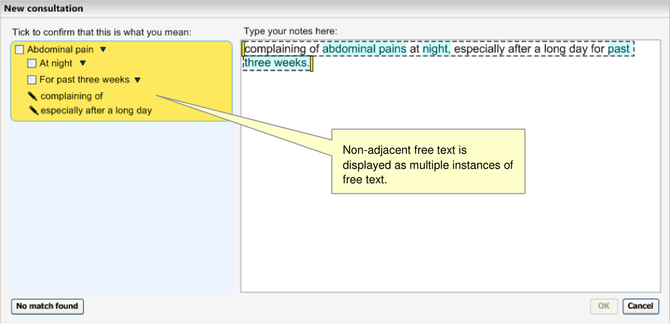
HSCIC Controlled Document

- Must visually distinguish the unstructured free text from the structured SNOMED-CT and

non-SNOMED-CT items

 Should feature a special icon for the unstructured free text

 Should feature the special icon immediately to the left of the unstructured free text

 Must not feature a confirm check box control for the unstructured free text

- Must feature the unstructured free text in normal (regular), rather than in bold text style

_**2.1.4.2**_ _**How to Use the Design Guide Entry**_

####  Display each chunk of text separately See figure above

Table 9: How to Use the Design Guide Entry

_**2.1.4.3**_ _**How Not to Use the Design Guide Entry**_

exclusion list should not be displayed on

their own

Table 10: How Not to Use the Design Guide Entry

_**2.1.4.4**_ _**Benefits and Rationale**_

We need to display the associated text, but need to distinguish it from the encodable text so that the user fully understands what they are confirming. Several rounds of usability testing have shown that clinicians understand this convention.

It must be possible to display the unstructured notes with the structured notes so that:

- The user can easily view potentially important unstructured notes that elaborate the

structured notes; the user should be encouraged to check what unstructured notes are going to be saved with the structured notes

- The user can easily view the original text that led to the creation of the structured notes; the

user can check why the structured notes are written as they are

Leaving the unstructured notes in a normal, rather than bold style, visually distinguishes them from the structured notes. Once they are saved, there are potentially more uses for the structured notes than the unstructured notes and it is important to communicate the distinction. The system should communicate that these unstructured notes belong to the main encoded concept, either because the unstructured notes should be written as elaboration for the structured notes, or because they have been part of the method for achieving the structured notes. Either way, this belonging is central to the relationship between the structured and unstructured notes.

We need to exclude certain words from the free text that would not make sense on their own. For example, it would not make sense to display the word ’of’ or ’to’ as an individual chunk of free text.

_**2.1.4.5**_ _**Confidence Level**_

**High confidence**

- Must visually distinguish the unstructured free text from the structured SNOMED-CT and

non-SNOMED-CT items

 Should feature a special icon for the unstructured free text

 Should feature the special icon immediately to the left of the unstructured free text

Page 16

Copyright ©2013 Health and Social Care Information Centre

HSCIC Controlled Document

 Must not feature a confirm check box control for the unstructured free text

**Medium confidence**

- Should display all structured data matches in the same way as for the SNOMED-CT

matches, regardless of whether they are drawn from SNOMED-CT or not

- Must display a confirm check box control at the far left of the suggested match area

 Should display the suggested match label immediately to the right of the confirm check box

- Must display the non-SNOMED-CT matches below the SNOMED-CT matches

- Must feature the unstructured free text in normal (regular), rather than in bold text style

**Low confidence**

- Should display each chunk of unstructured text separately

- Must display the unstructured text underneath all the structured matches (within a single

expression envelope)

 Should display the unstructured text one indent in from the base concept

 Should display all chunks of unstructured text at the same indent level

##### 2.1.5 Displaying Expression Boundaries

This guidance shows how the system displays groupings of words that encompass the encodable terms and the text that can elaborate the concept, either in a structured or unstructured way.

A grouping could comprise ‘mild fever for three days’, where ‘Fever’ is the main encodable (SNOMED-CT) concept, ‘Mild’ is the qualifier concept (an attribute of the concept, Fever) and ‘Three days’ is the non-SNOMED-CT time-chunk elaboration.

The system would parse the words into groups, as the user types them, according to its interpretation of the most likely structure that could be expressed with these words. (Refer to _NHS_ _CUI Design Guide Workstream_  - _Design Guide Entry - Terminology – Matching_ **{R2}** _,NHS CUI_ _Design Guide Workstream - Design Guide Entry – Terminology – Post-Coordination_ **{R4}** and _NHS_ _CUI Design Guide Workstream - Design Guide Entry - Terminology - Elaboration_ **{R3}** for details on the parsing process.)

The user then may decide to encode a term (and its group of elaboration words) or manipulate the boundaries of the group in order to include or exclude words (to give the correct meaning to the notes), prior to encoding the concept. Therefore, as these groups are identified by the system, they must be displayed to the user.

Figure 12 and Figure 13 illustrate how to display groupings through the use of marquees. Marquees are displayed around all chunks of encodable concepts and their elaboration. The selected (in-focus) marquee is distinguished by bold lines and yellow draggable handles, which change in appearance when the user points the mouse over them (see Figure 12). Additionally, a hover-over could be provided which communicates to the user what they could achieve by dragging the boundary. These descriptions could be specific depending upon what has been typed and what could be achieved by dragging it, for example, ‘Drag the selection to separate terms’ or ’Drag the selection to include or exclude text to add meaning to the concept’.

Page 17

Copyright ©2013 Health and Social Care Information Centre

HSCIC Controlled Document

Figure 12: Grouping of Terms

Figure 13: Draggable Handles

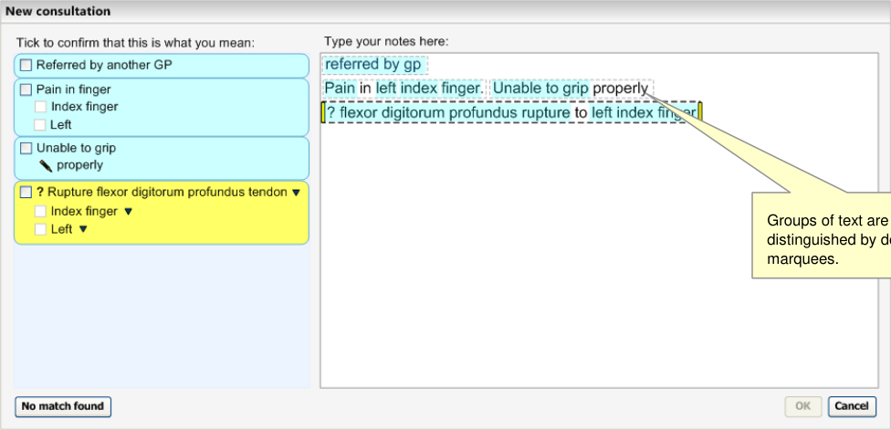

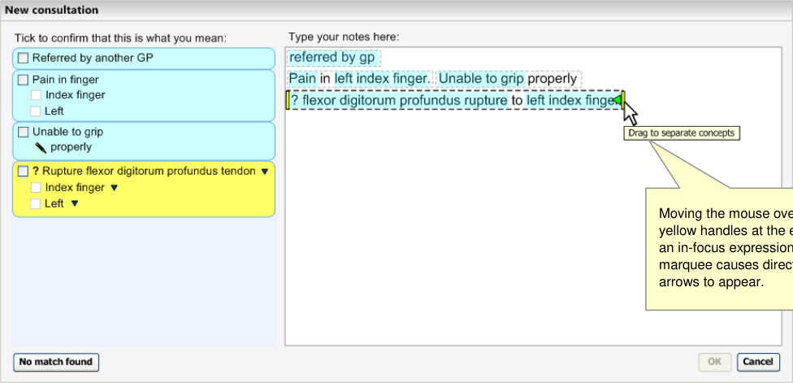

When the user changes the expression boundaries, this may have an effect on the suggested matches in the left pane (which would occur almost immediately).

_**2.1.5.1**_ _**Guidance**_

The system:

- Must communicate how potentially encodable text is grouped with potential elaboration text,

and distinguish this from text that will not be encoded

- Must distinguish the group that is selected (that is, in-focus) from the other groups that are

not selected

- Should ensure that any visual communication of grouping does not significantly reduce the

legibility of the text

Page 18

Copyright ©2013 Health and Social Care Information Centre

HSCIC Controlled Document

- Should ensure that any visual communication of grouping does not interfere with other

visual communication elements associated with the text (for example, encodable text highlights)

- Could display marquees around words to visually communicate they are grouped together

- Must communicate that the boundaries of a selected group can be dragged (to include

adjacent text or exclude text already included)

- Must display the new boundaries of the selected group as they are being dragged (as

feedback of the dragging action)

- Should communicate the direction in which the selected group boundaries can be dragged,

for instance, by changing the mouse cursor (not illustrated) or by changing the boundary marker to include arrows when the user selects the boundary marker (see Figure 13)

- Should communicate in words that the boundaries can be dragged, for instance, using

hover-over messages that communicate that users can drag the boundaries and what can be achieved by dragging them

_**2.1.5.2**_ _**How to Use the Design Guide Entry**_

unless they are selected

unless they are selected interfere with the user’s reading of the

text
####  Feature a hover-over over the selected The hover-over could read ‘Drag the This will communicate to the user what

marquee that communicates to the user selection around related text’ they can do with the selected marquee that they can drag the selection area over other text. Where appropriate, it should also communicate the corresponding keyboard actions

The hover-over could read ‘Drag the selection around related text’

This will communicate to the user what they can do with the selected marquee

Table 11: How to Use the Design Guide Entry

_**2.1.5.3**_ _**How Not to use the Design Guide Entry**_

####  Do not feature more than one selected n/a The proposed system will only handle

area (that is, an area with draggable one encoding process at a time handles) at a time

Table 12: How Not to Use the Design Guide Entry

_**2.1.5.4**_ _**Benefits and Rationale**_

The user must have an understanding of how the system will interpret the text when an encoding action is triggered, how they can manipulate this structure, as well as the effects of any manipulation.

Marquees are useful because they allow the user to read the text (because they do not cover the text) and they do not interfere with highlights (which could signify what terms are encodable as SNOMED-CT concepts). Their boundaries also afford manipulation, such as dragging. Dragging could be reinforced by featuring handles with directional arrows on the left-hand and/or right-hand boundaries of the selected group.

The notion that the directional arrows would only appear when the user points at the handles, would keep the interface clean. Also, a context-specific hover-over message could give users instructions on how and why to drag the boundaries.

Page 19

Copyright ©2013 Health and Social Care Information Centre

HSCIC Controlled Document

In early wireframe testing, upon viewing a static picture of the mouse hovered over the boundary handle, over 50% of the clinicians tested realised that they could associate text with an encodable word by dragging the boundaries to encompass the text.

Please refer to section D in the Terminology Requirements listed in APPENDIX A for a detailed description of the requirements for this guidance.

_**2.1.5.5**_ _**Confidence Level**_

**High confidence**

- Must communicate how potentially encodable text is grouped with potential elaboration text,

and distinguish this from text that will not be encoded

- Must distinguish the group that is selected (that is, in-focus) from the other groups that are

not selected

- Should ensure that any visual communication of grouping does not significantly reduce the

legibility of the text

- Should ensure that any visual communication of grouping does not interfere with other

visual communication elements associated with the text (for example, encodable text highlights)

**Medium confidence**

- Could display marquees around words to visually communicate they are grouped together

- Must communicate that the boundaries of a selected group can be dragged (to include

adjacent text or exclude text already included)

- Should communicate the direction in which the selected group boundaries can be dragged,

for instance, by changing the mouse cursor (not illustrated) or by changing the boundary marker to include arrows when the user selects the boundary marker (see Figure 13)

- Should communicate in words that the boundaries can be dragged, for instance, using

hover-over messages that communicate that users can drag the boundaries and what can be achieved by dragging them

**Low confidence**

- Must display the new boundaries of the selected group as they are being dragged (as

feedback of the dragging action)

#### 2.2 Display Standards for Notes Confirmed for Encoding

This guidance shows how the system should display the notes following the user’s confirmation that the match is correct for encoding. It applies to all notes to be encoded in the text parser matching approach. It also applies to additional text notes in the single concept matching approach. Both approaches are dealt with in this section.

Showing the distinction between notes that have been confirmed to be encoded (both as SNOMED-CT codes and as supporting informational model attributes) and those which are not, is important. Failure to do so sufficiently, could risk the user not knowing what will be encoded and possibly the user not encoding anything (depending, of course, upon whether the user interface forces them to encode at least one concept).

##### 2.2.1 Displaying Confirmed Matches

_**2.2.1.1**_ _**Suggested Matches Area**_

When the user has confirmed a note (by confirming the whole of or part of an expression), a tick appears in the check box. This happens either when the user has actually selected it or when the

Page 20

Copyright ©2013 Health and Social Care Information Centre

HSCIC Controlled Document

user has doubled-clicked on a selection (or has actioned an equivalent keyboard stroke). Furthermore, the area surrounding the appropriate match changes to grey. Those parts of the expression that have been confirmed and are structured matches are rendered in a bold text style. Those conceptual elements that have not been confirmed remain in normal text style (not bold), as shown in Figure 14. The unstructured text always remains in normal text style.

Figure 14: Confirmed Matches are Greyed Out

_**2.2.1.2**_ _**Text Input Area**_

When the user confirms a single SNOMED-CT match, the input text that spawned the match becomes replaced by the SNOMED-CT description label; either by the preferred term or synonym description label.

When the user confirms a post-coordinated expression comprising multiple SNOMED-CT concepts, the system renders the text by displaying the appropriate SNOMED-CT description labels for the base concept and for the attribute value concept(s).

Likewise, the confirmation of a non-SNOMED-CT match (such as a match against a concept from a separate informational model) also leads to the rendering of the text as that particular match label.

In between these labels, it will render a simplified translation of the attribute (relationship) label, which typically is a linkage concept. For example, in the case of the concept number 116676008, instead of displaying the preferred term label ‘associated morphology’, the system will display the word ‘with’. The system will render this label in a smaller font and in grey in order to keep it from distracting the user’s attention from the other labels.

All the confirmed structured notes in the text input area will be highlighted in grey to indicate that they are inactive, until they are unconfirmed.

_**2.2.1.3**_ _**Single Concept Approach**_

In the single concept approach to matching, matches identified in the additional text input field are displayed below the base concept list (but above the additional text input field). If the user confirms this match by selecting the check box next to this match, it will be rendered in bold. The corresponding text in the additional text input field will become highlighted in grey and will be rendered (in bold) by the appropriate SNOMED-CT description label.

In addition, if the user single-clicks on an item in the main list, and moves the mouse away from the list, the item is highlighted grey to indicate that it is selected. See the example in Figure 15:

Page 21

Copyright ©2013 Health and Social Care Information Centre

HSCIC Controlled Document

Figure 15: Confirmed Matches in the Single Concept Matching Approach

_**2.2.1.4**_ _**Guidance**_

The system:

Confirmed text is displayed in bold and with a grey highlight.

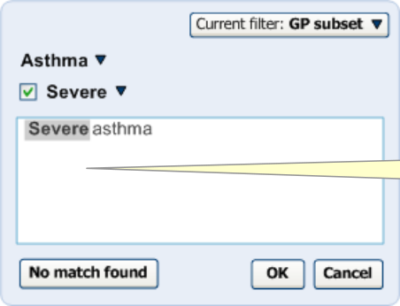

- Should ensure through visual communication that a match has been confirmed and is

consistent between the text input area and the suggested match area

- Must visually distinguish confirmed from unconfirmed or unstructured text

 Could feature a grey background/highlight for matches that have been confirmed

 Should feature the label text for all confirmed matches in bold text style

 Should ensure that all unstructured text remains in a normal text style

- Must replace the typed text with the matched SNOMED-CT label once the user confirms

the match

- Must display either the preferred term or the synonym description labels in the noting area

(depending on what the user has chosen) once the user has confirmed the match

- Must display either the preferred term or the synonym description labels in the matching

area (depending on what the user has chosen) once the user has confirmed the match

- Must render expression matches that comprise post-coordinations of multiple concepts in a

user-friendly and readable form

 Could render expressions that comprise post-coordinations of multiple concepts by displaying the preferred term/synonym descriptions in a left-to-right order, with the base concept at the far left and its attribute concept values to its right

 Could render a simplified translation of the attribute (relationship) label

 Could render the attribute label in a smaller font and in grey

**Note**

- The simplified translations of attribute relationship labels should be created and managed by NHS CFH. However, before this approach is adopted, further testing and research is required to determine the usability of the range of possible translations (for example, testing the usability of translating ‘associated morphology’ into ’with’)

- The simplified translation of attribute relationship labels is only a default approach. In the event of a more sophisticated rendering solution becoming available, the simplified translation approach should be replaced

Page 22

Copyright ©2013 Health and Social Care Information Centre

HSCIC Controlled Document

_**2.2.1.5**_ _**How to Use the Design Guide Entry**_

text box, feature a scroll bar encoded text

Table 13: How to Use the Design Guide Entry

_**2.2.1.6**_ _**How Not to Use the Design Guide Entry**_

that the user has not selected (unless to show the axial modifiers, for example, unnecessary there is a special safety reason to do ‘patient currently has this finding’, if the so) user has modified these settings

It would be unnecessary for the system to show the axial modifiers, for example, ‘patient currently has this finding’, if the user has modified these settings

This would be distracting and unnecessary

####  Do not feature too dark a highlight; the

text must be readable underneath

Table 14: How Not to Use the Design Guide Entry

Fever for three days The user must be able to read the text underneath the highlight

_**2.2.1.7**_ _**Benefits and Rationale**_

User feedback has indicated that users want to see a tidy, meaningful narrative in the text area before saving it to record. If they have typed in shorthand and have refined a concept match, they would like to see the label displayed here, rather than their original notes. Some users believed that there was the need to display the original text, but this is point for discussion within CFH.

Displaying confirmed items in grey is a useful communication that the item is finished and is now unchangeable (until the match is unconfirmed by the user). User testing has supported this notion.

_**2.2.1.8**_ _**Confidence Level**_

**High confidence**

- Should ensure through visual communication that a match has been confirmed and is

consistent between the text input area and the suggested match area

- Must visually distinguish confirmed from unconfirmed or unstructured text

 Could feature a grey background/highlight for matches that have been confirmed

 Should feature the label text for all confirmed matches in bold text style

 Should ensure that all unstructured text remains in a normal text style

- Must display either the preferred term or the synonym description labels in the noting area

(depending on what the user has chosen) once the user has confirmed the match

- Must display either the preferred term or the synonym description labels in the matching

area (depending on what the user has chosen) once the user has confirmed the match

**Medium confidence**

- Must replace the typed text with the matched SNOMED-CT label once the user confirms

the match

- Must render expression matches that comprise post-coordinations of multiple concepts in a

user-friendly and readable form

 Could render expressions that comprise post-coordinations of multiple concepts by displaying the preferred term/synonym descriptions in a left-to-right order, with the base concept at the far left and its attribute concept values to its right

 Could render a simplified translation of the attribute (relationship) label

Page 23

Copyright ©2013 Health and Social Care Information Centre

HSCIC Controlled Document

 Could render the attribute label in a smaller font and in grey

From the wireframe testing conducted with clinicians, very positive comments were received about the encoded notes view. Responses included the fact that the notes were easy to run one’s eyes over, that the encoded note view looked ‘really nice’, and that the association of elaboration and concepts was much clearer in the encoded notes view than it was in the original typed text view.

##### 2.2.2 Displaying Unstructured Notes that are Associated with Confirmed Matches

The unstructured (free text) notes that are associated with matches that have been confirmed, will remain rendered in normal text style (as opposed to a bold text style), but will also feature the marquee around them which remains fixed until the note is unconfirmed. This is illustrated in Figure 16.

Maintaining the unstructured notes in normal text style is useful to distinguish it from the encoded notes.

Figure 16: Unstructured Notes Appear in Normal Style Text

_**2.2.2.1**_ _**Guidance**_

The system:

- Must leave the unstructured (free text) notes that are associated with matches that have

been confirmed, rendered in normal text style

- Must visually link the unstructured notes with the confirmed concept match with which they

are associated

 Should visually link the unstructured notes with the associated confirmed concept match by a marquee

_**2.2.2.2**_ _**How to Use the Design Guide Entry**_

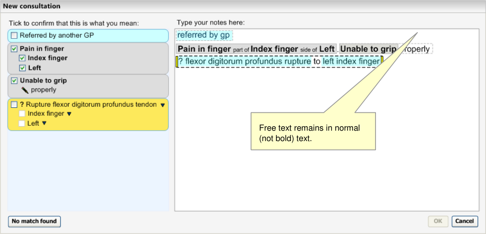

the unstructured notes, even when the structured notes have been confirmed for encoding

Copyright ©2013 Health and Social Care Information Centre

Page 24

HSCIC Controlled Document

Table 15: How to Use the Design Guide Entry

_**2.2.2.3**_ _**How Not to Use the Design Guide Entry**_

notes in bold indistinguishable from the structured

notes

Table 16: How Not to Use the Design Guide Entry

_**2.2.2.4**_ _**Benefits and Rationale**_

The user must be confident that they know what elaboration will be saved with each encoded note when they save the notes to record. Leaving the marquees in to indicate associations between confirmed notes and their associated text will be an important way to communicate this.

This notion has been supported by multiple rounds of usability testing.

_**2.2.2.5**_ _**Confidence Level**_

**High confidence**

- Must visually link the unstructured notes with the confirmed concept match with which they

are associated

 Should visually link the unstructured notes with the associated confirmed concept match by a marquee

**Medium confidence**

- Must leave the unstructured (free text) notes that are associated with matches that have

been confirmed, rendered in normal text style

Page 25

Copyright ©2013 Health and Social Care Information Centre

HSCIC Controlled Document

## 3 DOCUMENT INFORMATION

#### 3.1 Terms and Abbreviations

CUI Common User Interface

UI User Interface

NHS National Health Service

NHS CFH NHS Connecting for Health

SNIOMED-CT Systematised Nomenclature of Medicine-Clinical Terms

TLC Top Level Concept

FSN Fully Specified Name

SCT Systematized Nomenclature of Medicine – Clinical Terms

Table 17: Terms and Abbreviations

#### 3.2 Definitions

NHS Entity Within this document, defined as a single NHS organisation or group that is operated within a single technical infrastructure environment by a defined group of IT administrators.

The Authority The organisation implementing the NHS National Programme for IT (currently NHS Connecting for Health).

Current best practice Current best practice is used rather than best practice, as over time best practice guidance may change or be revised due to changes to products, changes in technology, or simply the additional field deployment experience that comes over time.

Context Model A model that specifies relationships relating to semantic context that has been defined outside of the SNOMED-CT Concept model

Table 18: Definitions

#### 3.3 Nomenclature

_**Cross References**_

Cross references to other sections in the current document comprise just a section number. Cross references may also be to figures and tables, where the caption number only might be shown.

References to other Project documents are shown in _italics_. Footnotes with additional details may also be used.

#### 3.4 References

**R1.** NHS CUI Design Guide Workstream - Table of Contents 2.0.0.0 30-Oct-2006

**R2.** NHS CUI Design Guide Workstream - Design Guide Entry - Terminology Matching

1.0.0.0 27-Mar-2007

Page 26

Copyright ©2013 Health and Social Care Information Centre

HSCIC Controlled Document

**R3.** NHS CUI Design Guide Workstream - Design Guide Entry - Terminology Elaboration

**R4.** NHS CUI Design Guide Workstream Design Guide Entry - Terminology - PostCoordination

Table 19: References

2.0.0.0 27-Mar-2007

2.0.0.0 27-Mar-2007

Page 27

Copyright ©2013 Health and Social Care Information Centre

HSCIC Controlled Document

## APPENDIX A LIST OF HIGH LEVEL REQUIREMENTS

**Note**

Requirements shown in greyed-out text have been withdrawn.

#### PART I General

**A1** **General**

A1.1 The system will support encoding solely from keyboard-driven interaction.

A1.2 The system will not prevent effective and efficient encoding with other entry devices, such as voice recognition or touch pad.

A1.3 The system will facilitate the collection of valid, unambiguous clinical statements (these will be SNOMED codes with additional context as necessary), potentially covering all parts of the care process.

A1.4 The system will respond to the changing coding requirements of differing clinical noting contexts, and will communicate these to the user.

A1.5 The system will be able to deal with the following noting contexts:

 Free-form noting without any, or very little context

 Free-form noting within a workflow context

 Free-form noting under headings

 Heavily contextualized free-form noting within a structured form

A1.6 The system will be able to deal with form creation (that is, finding relevant SNOMED-CT codes during form authoring, such as by a GP.

#### PART II  Searching

**B1** **Setting Context**

B1.1 The system will provide users with a means of limiting a search to contextually relevant portions of SNOMED-CT.

B1.2 The system will clearly communicate which contextually relevant portions of SNOMED-CT the users are searching.

B1.3 The system will be capable of automatically setting context. This automatic contextual filtering could be in response to previously entered text/encoded terms.

B1.4 The system will assist users’ searches by allowing them to expand, contract, or sort a set of search results according to meaningful contextual categories (such as 'symptoms' or 'procedures').

B2.1 The system will be able to handle free-form text entry, according to context.

B2.2 The system will attempt to structure (that is, ‘parse’) as much of the free text that it can, but will give users the option of saving it as free-form text, according to context.

B2.3 The system will offer users an efficient way of triggering an encoding interaction.

B2.4 Users will be able to modify the search term quickly and easily.

B2.5 The system will be capable of fuzzy matching text (such as in the event of a spelling error) and of offering a ‘best guess’ plus a means of viewing alternative matches.

Page 28

Copyright ©2013 Health and Social Care Information Centre

HSCIC Controlled Document

**B2** **Enter and Select Text**

B2.6 The system will not commit to the record any encoded terms that have not been confirmed by the user.

B2.7 The system will provide ‘best guess’ concepts for words within the free text.

B2.8 The system will be able to handle a limited range of structured shorthand that exists outside of SNOMED-CT.

B2.9 The system will be able to offer predictive matching of SNOMED-CT concepts (including both single words and phrases).

B2.10 The system will give users flexibility as to when they encode text prior to committing it to the record.

**B3** **Shortcuts and Abbreviations**

B3.1 Users will be able to search on abbreviations found within SNOMED-CT.

B3.2 Users will be able to define and search their own abbreviations ('shortcodes').

B3.3 The system will display, in the encoded notes, both the abbreviation entered by users, and its expansion (either preferred term or synonym).

B3.4 Users will be able to enter codes by means of keyboard shortcuts.

B3.5 Users will be able to search on single or multiple word prefixes, independent of order.

B3.6 Users will be able to define their own keyboard shortcuts.

B3.7 When displaying results, matches from all types of abbreviations will be shown and will be clearly distinguished from each other.

**B4** **Listing Matching Concepts**

B4.1 The system will display categories, (for example, TLCs), to which the term belongs, where appropriate, to ensure that users can distinguish between similar sounding results.

B4.2 The system will ensure that users can easily navigate through long lists of results.

B4.3 The system will allow users to move from a search result item to related terms (for example, a more specific term).

B4.4 The system will ensure that users see a clear definition of, and the preferred term for, a concept, before committing it to the record.

B4.5 The system will provide access to the full text of a SNOMED-CT term (up to 255 characters).

B4.6 The system will be able to communicate multiple kinds of search results ranking within the same list, where there is exceptional ranking.

B4.7 The system will allow users to reorder search lists according to a method of ranking that is distinct from the default order.

B4.8 The system will discriminate between the results returned, according to relevance (if known).

B4.9 The system will communicate if truncation has occurred.

B5.1 The system will allow users to specify that a term is only nearly correct.

B5.2 The system will allow users to record that they have given up trying to encode a concept.

B5.3 The system will be able to log approximate codes so that NHS CFH can determine whether changes are required to the terminology or the terminology user interface.

B5.4 The system will allow users to qualify a ‘nearly correct’ term with additional text.

B5.5 The system will allow users to record ‘unencodable’ concepts as free text.

B5.6 In the event of a poor match (indicated by the user), the system will allow and encourage users to navigate back up the hierarchy to a more general term.

Page 29

Copyright ©2013 Health and Social Care Information Centre

HSCIC Controlled Document

#### PART III Elaboration and Post Coordination

**C1** **General**

C1.1 Users will be able to refine/select certain key attributes of a concept.

These attributes may be based on SNOMED-CT relationships such as qualifiers, surgical procedures, and (body) finding sites. They may include axis modifiers (based on the Context Model).

C1.2 The system will allow users to negate disorder concepts.

We will outline the issues involved with the system handling user attempts to negate concepts that are not disorders. We should illustrate the issues of negation of findings. This will probably lead to SCT authoring requirements, or more metadata.

C1.3 If users have included negation text in a search, the system should be able to identify pre-coordinated negated concepts in search results and present them differently (or omit them).

C1.4 Users will be able to refine the original concept without necessarily losing the refined attributes.

For example, they start off with ‘muscle injury’, by searching on the text “musc”:

 muscle injury

 Finding site = muscle structure

 skeletal muscle structure

 skeletal muscle part

 tendon structure

 hamstring tendon

At this point, the user may wish to refine the original concept ‘muscle injury’ to ‘muscle strain’, but will not want to lose the refined, ‘hamstring tendon’.

C1.5 The system will need to handle (‘error’) situations where the refinement causes mismatches with other attribute values.

C1.6 Users will be able to simultaneously refine multiple attribute concepts of a given concept.

For example, in addition to specifying the body site, the user may also want to specify severity (such as ‘moderate’).

C1.7 The system will present all the appropriate attribute concepts for a given concept. This may need to be a subset, or even a superset, of all the attribute relations currently 'allowable' in the published Terminology data.

C1.8 Where appropriate and feasible, the system will provide graphical navigation of body sites.

C1.9 The system will allow users to specify a small set of elaboration values that are not defined by SNOMED-CT nor Context model relationships. These will include time values and values defined by additional Informational models (such as blood pressure readings and temperature readings).

C1.10 Where users can enter numerical values, appropriate units must be presented to users by the system. Where there is a choice of units, the system must present the choice clearly and explicitly to communicate the user’s choice.

C1.11 The system will encourage users to refine mandatory attributes and values (where appropriate).

This may arise when the user selects a certain attribute which must be refined in order to make sense (for example, the user could not select the attribute ‘severities’ without refining it further).

C1.12 The system will allow users to hierarchically refine an attribute through multiple levels.

C1.13 The system will allow users to hierarchically refine multiple attributes simultaneously.

C1.14 Users will have the flexibility to be able to undo and/or re-refine any elaboration, whether it be proposed by the system or selected by the user.

C1.15 Users will be able to apply elaboration to more than one concept if the relationship is allowed.

C1.16 Users will be able to move elaboration from one concept to another if the relationship is allowed.

C1.17 The system will attempt to render concepts and their elaboration in a meaningful way.

C1.18 The system will clearly communicate attribute relationships, both in a structured view and in a ‘narrative’ view.

Page 30

Copyright ©2013 Health and Social Care Information Centre

HSCIC Controlled Document

**C2** **System Identifies Elaboration Within Text**

C2.1 The system will identify potential attribute relationships between concept matches in free text, and will promote them in the search process.

C2.2 The scope for any system-led search for attribute relationship matches or other elaboration in a passage of text will be limited (by the system) and limitable (by the user).

For example, the system may only be required to search within a marquee, which in turn is automatically defined by full stops.

Further limitations may be required to reduce performance demands, such as only allowing up to four potential codes within a grouping marquee.

C2.3 The system will identify potential elaboration within the typed notes and will offer relevant elaboration options during the encoding process.

For example, by presenting and pre-populating elaboration fields.

C2.4 The system will capture ‘free’ text that has been associated with an encodable term, but has not been encoded.

**C3** **Users Associate Free Text with Encodable Items**

C3.1 The system will provide users with a mechanism for associating free-text notes that they have entered with an encodable concept.

C3.2 The system will allow users to adjust what text is converted into structured elaboration for a concept.

C3.3 The system will provide users with a mechanism to enter additional text notes with an encodable concept.

C3.4 The system will warn users if text notes contain qualifications (such as negation) that significantly affect the meaning of a concept, or conflict with other specified or assumed qualifiers.

**C4** **Composites**

C4.1 The system will prompt users to select related concepts that form meaningful composites.

#### PART IV Display of Coded Information

**D1** **General**

D1.1 The display will be flexible, so that it can fit in a number of different spaces and sizes.

D1.2 The system will have the capability to display both SNOMED-CT-encoded and unencoded notes.

D1.3 The system will clearly distinguish between free text that, upon committing to the record, will be SNOMED-CT encoded and that which will not.

D1.4 The system will allow users to edit SNOMED-CT-encoded terms (that is, re-encode them) before committing them to the record.

D1.5 The system will display polished ‘prose’ as well as the structured view for post-coordinated concept.

D1.6 The system will ensure that the display of ‘prose’ and ‘encoded’ notes are consistent with each other.

D1.7 The system will be able account for a number of application real estate sizes and shapes.

D1.8 The system will allow users to view their original text entry, that is, the last edit of the text they entered prior to encoding.

**D2** **Communicating What Can be Encoded**

D2.1 The system will communicate which text is potentially SNOMED-CT encodable.

Page 31

Copyright ©2013 Health and Social Care Information Centre

HSCIC Controlled Document

**D2** **Communicating What Can be Encoded**

D2.2 The system will distinguish between text that can be encoded as a standalone SNOMED-CT concept, and text that can be encoded only as elaboration to a concept.

For example, we would want the system to indicate that qualifier text, such as “mild” can be encoded in a structure manner, but only as elaboration to another concept (for example, “gastroenteritis”); we would not want the user to be able to encode “mild” by itself.

D2.3 The system will clearly distinguish between potentially encodable text and encoded text. Potentially encodable text will be committed to the record as free text if users do not encode it.

This becomes even more critical if the system displays ‘best matches’ (that is, predictive code matching). Users must be fully aware of what will be saved as a code and what will be saved as free text, and we have a requirement that all instances of encoded concepts must be confirmed by the user prior to committing them to the record; if not, the ‘concepts’ will remain as unstructured text.

D2.4 The system will display the top match for each potentially encodable concept, in addition to the text typed in by the user.

D3.1 The system will communicate the relationship between codes and their elaboration on display.

D3.2 The system will communicate potential relationships between concepts.

D3.3 The system will distinguish between potential relationships and user-confirmed relationships between concepts.

Page 32

Copyright ©2013 Health and Social Care Information Centre

HSCIC Controlled Document

## REVISION AND SIGNOFF SHEET

#### Change Record

20-Jun-2006 Giles Colborne 0.0.0.1 Initial draft for review/discussion

26-Jul-2006 Laura Dromundo Ben Luff

0.0.0.2 Updates to incorporate final Deliverable information

01-Aug-2006 Vivienne Jones 0.0.0.3 Copyedit carried out. Reinserted fields into footer and front page.

10-Aug-2006 Laura Dromundo 0.0.0.4 Final Updates

11-Aug-2006 L Boardman-Rule 0.0.0.5 Second copyedit.

11-Aug-2006 Paul Robinson 0.0.0.6 Updates following copy edit

14-Aug-2006 Vivienne Jones 0.0.0.7 Additional copyedit check

15-Aug-2006 Paul Robinson 0.0.0.8 Final updates prior to cleanse

15-Aug-2006 Vivienne Jones 0.1.0.0 Document cleansed. Informal reviews carried out with the Authority, hence, Working Baseline not used previously. Moved to Baseline Candidate.

27-Feb-2007 Ben Luff 0.1.0.1 Update release 3 document

28-Feb-2007 Niki Nicolaides 0.1.0.2 Copyedit

28-Feb-2007 Igor Laketic 0.1.0.3 Accepted changes

02-Mar-2007 Niki Nicolaides 0.1.1.0 Document cleansed

07-Mar-2007 Ben Luff/

Igor Laketic

0.1.1.1 Added audience’s comments

13-Mar-2007 Marc Brown 0.1.1.2 Copyedit changes (remains Baseline Candidate)

13-Mar-2007 Igor Laketic 0.1.1.3 Accepted changes

13-Mar-2007 Marc Brown 0.2.0.0 Cleansed

20-Mar-2007 Ben Luff 0.2.0.1 Added audience’s comments

20-Mar-2007 L Boardman-Rule 0.2.0.2 Copyedit on author updates

20-Mar-2007 Igor Laketic 0.2.0.3 Accepted changes

20-Mar-2007 L Boardman-Rule 0.3.0.0 Document Cleansed

27-Mar-2007 Vivienne Jones 2.0.0.0 Baseline following Acceptance

Baseline 2.0.0.0 as Baseline 1.0.0.0 issued during Release 3. This document should have continued the numbering.

25-Jul-2007 Vivienne Jones 2.0.0.0 Preface added so the document can be released to the Distribution Mechanism. The date fields were changed to static text as the original acceptance date needs to be maintained from a cross-reference point of view.

Document Status has the following meaning:

- **Drafts 0.0.0.X**  - Draft document reviewed by the Microsoft CUI Project team and the

Authority designate for the appropriate Workstream. The document is liable to change.

Page 33

Copyright ©2013 Health and Social Care Information Centre

HSCIC Controlled Document

- **Working Baseline 0.0.X.0**  - The document has reached the end of the review phase and

may only have minor changes. The document will be submitted to the Authority CUI Project team for wider review by stakeholders, ensuring buy-in and to assist in communication.

- **Baseline Candidate 0.X.0.0**  - The document has reached the end of the review phase and

it is ready to be frozen on formal agreement between the Authority and the Company.

- **Baseline X.0.0.0**  - The document has been formally agreed between the Authority and the

Company.

Note that minor updates or corrections to a document may lead to multiple versions at a particular status.

#### Audience

The audience for this document includes:

- **Authority CUI Manager/Project Sponsor** . Overall Project Manager and sponsor for the

NHS CUI Project within the Authority.

- **Authority NHS CUI Design Guide Workstream Project Manager** . Responsible for

ongoing management and administration of the Workstream.

- **The Authority Project Team** . This document defines the approach to be taken during this

assessment and therefore must be agreed by the Authority.

- **Microsoft NHS CUI Team** . This document defines the approach to be taken during this

assessment, including a redefinition of the NHS CUI Design Guide Workstream strategy.

#### Open Issues Summary

None

Table 20: Open Issues Summary

#### Reviewers

Paul Robinson Program Manager 0.0.0.4 10-Aug-2006

Ben Luff User Experience Consultant 0.0.0.4 10-Aug-2006

Laura Dromundo Program Manager 0.0.0.4 10-Aug-2006

Giles Colborne User Experience Consultant 0.0.0.1 20-Jun-2006

Paul Robinson Lead Program Manager 0.1.1.2 13-Mar-2007

#### Distribution

Roarke Batten NHS CFH Programme Manager

Kit Lewis NHS CFH Design Guide Workstream Lead

Peter Johnson NHS CFH Clinical Architect

Ed Cheetham NHS CFH Clinical Advisor

Kate Verrier-Jones NHS CFH Clinical Advisor

Page 34

Copyright ©2013 Health and Social Care Information Centre

HSCIC Controlled Document

Mike Carey NHS CFH Toolkit Workstream Lead

Tim Chearman NHS CFH Design Guide Workstream Lead

#### Document Properties

Document Title NHS CUI Design Guide Workstream UI Display Standards for Coded Information

Author NHS CUI Programme Team

Restrictions **RESTRICTED – COMMERCIAL; MICROSOFT COMMERCIAL;** Access restricted to: NHS CUI Project Team, Microsoft NHS Account Team

Creation Date 22 February 2007

Last Updated 23 June 2015

**Copyright:**

You may re-use this information (excluding logos) free of charge in any format or medium, under the terms of the Open Government Licence. To view this licence, visit [nationalarchives.gov.uk/doc/open-government-licence or email psi@nationalarchives.gsi.gov.uk.](https://web.nhs.net/OWA/redir.aspx?C=dMnSAL43xUOp9X_SOcscV9mT5A0smdBIh1_vxjdSDVCERI33v7-idn6tNFCNwJYUR1PxIW-Hd-E.&URL=http%3a%2f%2fnationalarchives.gov.uk%2fdoc%2fopen-government-licence)

Page 35

Copyright ©2013 Health and Social Care Information Centre
