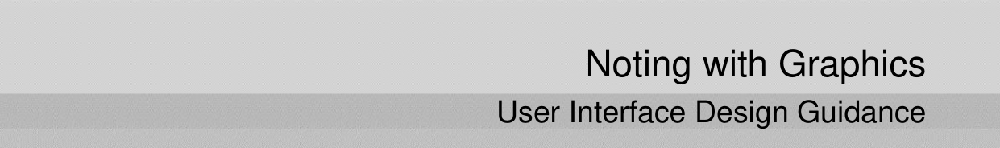

_Prepared for_

**NHS Connecting for Health**

**Tuesday, 23 June 2015 2010**

**Version 1.0**

**This document was prepared for NHS Connecting for Health which ceased to exist on 31 March**
**2013. It may contain references to organisations, projects and other initiatives which also no**
**longer exist. If you have any questions relating to any such references, or to any other aspect of**
**[the content, please contact cuistakeholder.mailbox@hscic.gov.uk](mailto:cuistakeholder.mailbox@hscic.gov.uk)**

HSCIC Controlled Document

**Amendment History:**

|Version|Date|Amendment History|
|---|---|---|
|1.0|15 November 2010|Approved first version|

**Forecast Changes:**

|Anticipated Change|When|
|---|---|
|None|Not applicable|

**Reviewers:**

This document has been reviewed by the following:

|Name|Signature|Title / Responsibility|Date|Version|
|---|---|---|---|---|
|Tim Chearman|Approved by FileCM workflow|CUI CAPS Project Manager|20 October 2010|V1.0|
|John McDermott|Approved by FileCM workflow|CUI CAPS UI Designer|20 October 2010|V1.0|
|Lindsey Butler|Approved by FileCM workflow|CUI CAPS Nurse Advisor and Clinical Safety Advisor|20 October 2010|V1.0|
|Meg Thomas|Approved by FileCM workflow|CUI CAPS UI Designer|20 October 2010|V1.0|

**Approvals:**

This document must be approved by the following:

|Name|Signature|Title / Responsibility|Date|Version|
|---|---|---|---|---|
|Steve Bentley|Approved by FileCM workflow|Senior Clinical Consultant|15 November 2010|V1.0|

**Document Status:**

This is a controlled document.

Whilst this document may be printed, the electronic version maintained in FileCM is the controlled copy. Any printed copies of the document are not controlled.

**Related Documents:**

These documents will provide additional information.

|Ref no|Doc Reference Number|Title|Version|
|---|---|---|---|
|1|NPFIT-SHR-QMS-PRP-0015|Glossary of Terms Consolidated.doc|11.0|

HSCIC Controlled Document

### Important Information

<!-- TOC -->
<!-- TOC generated by Markdown All in One style -->

- [Important Information](#important-information)
- [INTRODUCTION](#introduction)
  - [Purpose](#purpose)
  - [Intended Audience](#intended-audience)
- [SCOPE](#scope)
  - [In Scope](#in-scope)
  - [Out of Scope](#out-of-scope)
- [GUIDANCE INTRODUCTION](#guidance-introduction)
  - [Guidance Creation](#guidance-creation)
    - [Guidance Creation - Research](#guidance-creation---research)
    - [Guidance Creation - Patient Safety Assessment](#guidance-creation---patient-safety-assessment)
    - [Guidance Creation - CUI CAPS Clinical Advisors](#guidance-creation---cui-caps-clinical-advisors)
  - [Conformance Rating](#conformance-rating)
  - [Stylistic Choices](#stylistic-choices)
  - [Structure & Composition](#structure-composition)
  - [Assumptions](#assumptions)
- [GUIDANCE POINTS](#guidance-points)
  - [Noting with Graphics module](#noting-with-graphics-module)
  - [When the graphic is loaded for creation or editing purposes, display both the canvas (containing the graphic) and the toolbar](#when-the-graphic-is-loaded-for-creation-or-editing-purposes-display-both-the-canvas-containing-the-graphic-and-the-toolbar)
  - [When the graphic is loaded for viewing purposes, display only the canvas (containing the graphic and notes) and not the toolbar](#when-the-graphic-is-loaded-for-viewing-purposes-display-only-the-canvas-containing-the-graphic-and-notes-and-not-the-toolbar)
  - [When the graphic is loaded for viewing purposes, do not allow the user to edit or change any part of the annotated graphic](#when-the-graphic-is-loaded-for-viewing-purposes-do-not-allow-the-user-to-edit-or-change-any-part-of-the-annotated-graphic)
  - [Position the Noting with Graphics module in the relevant clinical notes section](#position-the-noting-with-graphics-module-in-the-relevant-clinical-notes-section)
  - [The workflow involved in creating an annotated graphic should allow the user to firstly display the desired graphic, then allow the addition of any annotating symbols and then finally the adding of any annotating text](#the-workflow-involved-in-creating-an-annotated-graphic-should-allow-the-user-to-firstly-display-the-desired-graphic-then-allow-the-addition-of-any-annotating-symbols-and-then-finally-the-adding-of-any-annotating-text)
  - [Where the Noting with Graphics module is not displayed fully on screen, ensure that the application hosting it provides scrolling to enable the user to view the entire area](#where-the-noting-with-graphics-module-is-not-displayed-fully-on-screen-ensure-that-the-application-hosting-it-provides-scrolling-to-enable-the-user-to-view-the-entire-area)
  - [When a previously annotated graphic is loaded for viewing purposes, display all the added annotations in the same way as when the graphic was created](#when-a-previously-annotated-graphic-is-loaded-for-viewing-purposes-display-all-the-added-annotations-in-the-same-way-as-when-the-graphic-was-created)
  - [Graphics when the graphic was being created remains the same when the graphic is being](#graphics-when-the-graphic-was-being-created-remains-the-same-when-the-graphic-is-being)
  - [The graphic should be a simple, lined-based image. It should not include any complex details Copyright ©2013 Health and Social Care Information Centre](#the-graphic-should-be-a-simple-lined-based-image-it-should-not-include-any-complex-details-copyright-2013-health-and-social-care-information-centre)
  - [The graphic should only be in greyscale. Coloured graphics should not be included](#the-graphic-should-only-be-in-greyscale-coloured-graphics-should-not-be-included)
  - [Include a title on each displayed graphic where there is the chance of selecting the wrong one](#include-a-title-on-each-displayed-graphic-where-there-is-the-chance-of-selecting-the-wrong-one)
  - [Include orientation labels on graphics w chance of mixing up the orientation](#include-orientation-labels-on-graphics-w-chance-of-mixing-up-the-orientation)
  - [Where the clinical context requires it, display the correct graphic taking into account the sex of the patient (e.g. display either a male or female graphic)](#where-the-clinical-context-requires-it-display-the-correct-graphic-taking-into-account-the-sex-of-the-patient-eg-display-either-a-male-or-female-graphic)
  - [When opened in the canvas, the graphic should be displayed at a suitable size to remove the need for the user having to firstly re-size it](#when-opened-in-the-canvas-the-graphic-should-be-displayed-at-a-suitable-size-to-remove-the-need-for-the-user-having-to-firstly-re-size-it)
  - [Do not allow a user to delete any part of a graphic](#do-not-allow-a-user-to-delete-any-part-of-a-graphic)
  - [If re-positioning of a graphic in the canvas is implemented, ensure that the location of any items already annotating the graphic is correctly retained](#if-re-positioning-of-a-graphic-in-the-canvas-is-implemented-ensure-that-the-location-of-any-items-already-annotating-the-graphic-is-correctly-retained)
  - [The Canvas](#the-canvas)
  - [Do not include background lines or grids on the canvas](#do-not-include-background-lines-or-grids-on-the-canvas)
  - [Upon loading, display the graphic centrally in the canvas](#upon-loading-display-the-graphic-centrally-in-the-canvas)
  - [Leave sufficient room for adding annotating text to both the left and right side of the graphic](#leave-sufficient-room-for-adding-annotating-text-to-both-the-left-and-right-side-of-the-graphic)
  - [Only permit one single graphic to be displayed on the](#only-permit-one-single-graphic-to-be-displayed-on-the)
  - [Any colour chosen for the canvas background should not reduce the readability or clarity of the graphic, or any annotating items placed on the graphic](#any-colour-chosen-for-the-canvas-background-should-not-reduce-the-readability-or-clarity-of-the-graphic-or-any-annotating-items-placed-on-the-graphic)
  - [A canvas can never be empty or blank – it must always contain a graphic](#a-canvas-can-never-be-empty-or-blank-it-must-always-contain-a-graphic)
  - [The canvas should be sufficiently sized to contain the graphic without the user needing to scroll or zoom to view the entire graphic](#the-canvas-should-be-sufficiently-sized-to-contain-the-graphic-without-the-user-needing-to-scroll-or-zoom-to-view-the-entire-graphic)
  - [The canvas should automatically grow in length when additional room for text or symbol annotations is required](#the-canvas-should-automatically-grow-in-length-when-additional-room-for-text-or-symbol-annotations-is-required)
  - [Do not allow the graphic or annotating items to be placed outside of the canvas](#do-not-allow-the-graphic-or-annotating-items-to-be-placed-outside-of-the-canvas)
  - [Do not allow vertical scrolling within the canvas](#do-not-allow-vertical-scrolling-within-the-canvas)
  - [Do not allow horizontal scrolling within the canvas](#do-not-allow-horizontal-scrolling-within-the-canvas)
  - [Loading and Searching for a Graphic](#loading-and-searching-for-a-graphic)
  - [Where the clinical context requires it, the canvas containing a graphic should be automatically loaded in the relevant location in the clinical notes without requiring any user](#where-the-clinical-context-requires-it-the-canvas-containing-a-graphic-should-be-automatically-loaded-in-the-relevant-location-in-the-clinical-notes-without-requiring-any-user)
  - [Where the clinical context requires it, provide the user with an option to load a graphic in the relevant location in the clinical notes when required](#where-the-clinical-context-requires-it-provide-the-user-with-an-option-to-load-a-graphic-in-the-relevant-location-in-the-clinical-notes-when-required)
  - [~~Where the clinical context requires it, provide a way for the~~ user to choose and load the appropriate graphic for the](#where-the-clinical-context-requires-it-provide-a-way-for-the-user-to-choose-and-load-the-appropriate-graphic-for-the)
  - [patient case in hand](#patient-case-in-hand)
  - [Where the clinical context allows it, provide the user with a mechanism that allows them to remove the entire Noting with Graphics module if they decide that they do not want to use a graphic within the clinical notes](#where-the-clinical-context-allows-it-provide-the-user-with-a-mechanism-that-allows-them-to-remove-the-entire-noting-with-graphics-module-if-they-decide-that-they-do-not-want-to-use-a-graphic-within-the-clinical-notes)
  - [Where the clinical context requires it, present the user a short list of commonly used graphics to choose from when i d](#where-the-clinical-context-requires-it-present-the-user-a-short-list-of-commonly-used-graphics-to-choose-from-when-i-d)
  - [Where the clinical context requires it, allow as a secondary way of choosing a graphic the user to perform a simple text- entry keyword search](#where-the-clinical-context-requires-it-allow-as-a-secondary-way-of-choosing-a-graphic-the-user-to-perform-a-simple-text--entry-keyword-search)
  - [Where different ways of selecting or searching for a graphic are implemented, ensure that they are visually distinct and separate from each other on screen](#where-different-ways-of-selecting-or-searching-for-a-graphic-are-implemented-ensure-that-they-are-visually-distinct-and-separate-from-each-other-on-screen)
  - [Symbol Annotations](#symbol-annotations)
  - [Provide free-hand drawing tools that allow the user to annotate the graphic by drawing on it the relevant clinical findings](#provide-free-hand-drawing-tools-that-allow-the-user-to-annotate-the-graphic-by-drawing-on-it-the-relevant-clinical-findings)
  - [NwG-0029 – Mandatory Where clinical finding symbols are very common or regularly used, provide the user with a ready-made symbol Where clinical finding symbols are difficult to draw free- to add to the graphic](#nwg-0029-mandatory-where-clinical-finding-symbols-are-very-common-or-regularly-used-provide-the-user-with-a-ready-made-symbol-where-clinical-finding-symbols-are-difficult-to-draw-free--to-add-to-the-graphic)
  - [Where clinical finding symbols are difficult to draw free- to add to the graphic hand, provide the user with a ready-made symbol that can](#where-clinical-finding-symbols-are-difficult-to-draw-free--to-add-to-the-graphic-hand-provide-the-user-with-a-ready-made-symbol-that-can)
  - [The ready-made symbols available for annotating should be relevant to the graphic that has been loaded](#the-ready-made-symbols-available-for-annotating-should-be-relevant-to-the-graphic-that-has-been-loaded)
  - [Ensure that any ready-made symbols provided are correctly sized for the graphic they are to be placed on top off](#ensure-that-any-ready-made-symbols-provided-are-correctly-sized-for-the-graphic-they-are-to-be-placed-on-top-off)
  - [Provide the user with a small set of ready-made symbols - limited to only those that are commonly used](#provide-the-user-with-a-small-set-of-ready-made-symbols---limited-to-only-those-that-are-commonly-used)
  - [Provide a ready-made symbol to indicate an exact location on the graphic](#provide-a-ready-made-symbol-to-indicate-an-exact-location-on-the-graphic)
  - [Provide a free-hand drawing or shading tool to indicate a region or spread-out area](#provide-a-free-hand-drawing-or-shading-tool-to-indicate-a-region-or-spread-out-area)
  - [Ensure that the ready-made symbols provided look visually different and are distinguishable from all other items within the canvas](#ensure-that-the-ready-made-symbols-provided-look-visually-different-and-are-distinguishable-from-all-other-items-within-the-canvas)
  - [Ensure that when used the hand-drawn symbols provided look visually different and are distinguishable from all other items within the canvas](#ensure-that-when-used-the-hand-drawn-symbols-provided-look-visually-different-and-are-distinguishable-from-all-other-items-within-the-canvas)
  - [Allow the user to make free-hand drawings outside of the graphic perimeter (but still within the canvas)](#allow-the-user-to-make-free-hand-drawings-outside-of-the-graphic-perimeter-but-still-within-the-canvas)
  - [When the user repositions a symbol ensure that any associated annotating text-box and connecting arrow also move correspondingly](#when-the-user-repositions-a-symbol-ensure-that-any-associated-annotating-text-box-and-connecting-arrow-also-move-correspondingly)
  - [Prevent the user from adding ready-made symbols outside of the graphic perimeter](#prevent-the-user-from-adding-ready-made-symbols-outside-of-the-graphic-perimeter)
  - [Provide the functionality for the user to delete any ready- made symbols or hand-drawn symbols that they have made](#provide-the-functionality-for-the-user-to-delete-any-ready--made-symbols-or-hand-drawn-symbols-that-they-have-made)
  - [When the user does delete any ready-made symbols or hand-drawn symbols ensure that the associated annotating text-box and connecting arrow are also correspondingly](#when-the-user-does-delete-any-ready-made-symbols-or-hand-drawn-symbols-ensure-that-the-associated-annotating-text-box-and-connecting-arrow-are-also-correspondingly)
  - [Allow the user to place symbols on top of one another when required](#allow-the-user-to-place-symbols-on-top-of-one-another-when-required)
  - [Ensure that when symbols are placed on top of each other that they are visually distinguishable](#ensure-that-when-symbols-are-placed-on-top-of-each-other-that-they-are-visually-distinguishable)
  - [~~When a ready-made symbol is initially placed onto the~~ canvas it should be displayed within a bounding box](#when-a-ready-made-symbol-is-initially-placed-onto-the-canvas-it-should-be-displayed-within-a-bounding-box)
  - [The ready-made symbol bounding box should disappear when the user drops the symbol into the desired position](#the-ready-made-symbol-bounding-box-should-disappear-when-the-user-drops-the-symbol-into-the-desired-position)
  - [The ready-made symbol bounding box should be semi- transparent](#the-ready-made-symbol-bounding-box-should-be-semi--transparent)
  - [Text Annotations](#text-annotations)
  - [All text to be used to annotate the graphic should be contained in a text-box](#all-text-to-be-used-to-annotate-the-graphic-should-be-contained-in-a-text-box)
  - [Allow the user to manually add a text-box for general comment text annotations that are not necessarily Copyright ©2013 Health and Social Care Information Centre associated with a symbol annotating the graphic](#allow-the-user-to-manually-add-a-text-box-for-general-comment-text-annotations-that-are-not-necessarily-copyright-2013-health-and-social-care-information-centre-associated-with-a-symbol-annotating-the-graphic)
  - [When the user adds a symbol to the graphic an associated text-box and arrow pointing to the symbol should also be automatically added to the canvas](#when-the-user-adds-a-symbol-to-the-graphic-an-associated-text-box-and-arrow-pointing-to-the-symbol-should-also-be-automatically-added-to-the-canvas)
  - [Where a text-box has been automatically added because of its association to a symbol, automatically place it on the correct side of the graphic close to the newly added symbol](#where-a-text-box-has-been-automatically-added-because-of-its-association-to-a-symbol-automatically-place-it-on-the-correct-side-of-the-graphic-close-to-the-newly-added-symbol)
  - [When a text-box is newly added to the canvas ensure that it](#when-a-text-box-is-newly-added-to-the-canvas-ensure-that-it)
  - [looks visually different to one that has been edited](#looks-visually-different-to-one-that-has-been-edited)
  - [The text-box should not be placed on top of any existing items within the canvas](#the-text-box-should-not-be-placed-on-top-of-any-existing-items-within-the-canvas)
  - [Always display any added text-boxes. They should not be hidden nor in a collapsed state](#always-display-any-added-text-boxes-they-should-not-be-hidden-nor-in-a-collapsed-state)
  - [A newly added text-box should have the cursor focus](#a-newly-added-text-box-should-have-the-cursor-focus)
  - [Do not truncate the text that has been entered into the text-box. All entered text should always be displayed in full](#do-not-truncate-the-text-that-has-been-entered-into-the-text-box-all-entered-text-should-always-be-displayed-in-full)
  - [Allow the user to enter as much text as they want in the text-box](#allow-the-user-to-enter-as-much-text-as-they-want-in-the-text-box)
  - [Pre-populate the text-box with an initial text message informing the user that they can enter some text into the text box](#pre-populate-the-text-box-with-an-initial-text-message-informing-the-user-that-they-can-enter-some-text-into-the-text-box)
  - [The initial text message informing the user that they can enter some text into the text box should be presented in a way that differentiates it from text that a user entersCopyright ©2013 Health and Social Care Information Centre](#the-initial-text-message-informing-the-user-that-they-can-enter-some-text-into-the-text-box-should-be-presented-in-a-way-that-differentiates-it-from-text-that-a-user-enterscopyright-2013-health-and-social-care-information-centre)
  - [The text-box should automatically grow in size as the user types in text](#the-text-box-should-automatically-grow-in-size-as-the-user-types-in-text)
  - [Provide a tool for emphasising text entered in the symbol's text-box](#provide-a-tool-for-emphasising-text-entered-in-the-symbols-text-box)
  - [Provide the functionality for the user to be able to delete any text-boxes that they have added to the graphic](#provide-the-functionality-for-the-user-to-be-able-to-delete-any-text-boxes-that-they-have-added-to-the-graphic)
  - [When the user does delete a text-box ensure that if it has a pointing arrow and any associated symbols that they are also correspondingly deleted](#when-the-user-does-delete-a-text-box-ensure-that-if-it-has-a-pointing-arrow-and-any-associated-symbols-that-they-are-also-correspondingly-deleted)
  - [Where text-boxes have been automatically added because of an associated symbol, do not pre-populate the text-box with any details relating to that symbol](#where-text-boxes-have-been-automatically-added-because-of-an-associated-symbol-do-not-pre-populate-the-text-box-with-any-details-relating-to-that-symbol)
  - [The Toolbar tools & functions](#the-toolbar-tools-functions)
  - [The system should be tolerant and offer the user the option to undo and redo any changes they make. At a minimum there must be one level of redo and undo](#the-system-should-be-tolerant-and-offer-the-user-the-option-to-undo-and-redo-any-changes-they-make-at-a-minimum-there-must-be-one-level-of-redo-and-undo)
  - [Provide a mechanism that allows the user to remove any items placed on the graphic](#provide-a-mechanism-that-allows-the-user-to-remove-any-items-placed-on-the-graphic)
  - [Provide a mechanism that allows the user to remove all items placed on the graphic in one go, thus returning the session to the state when the graphic was originally loaded](#provide-a-mechanism-that-allows-the-user-to-remove-all-items-placed-on-the-graphic-in-one-go-thus-returning-the-session-to-the-state-when-the-graphic-was-originally-loaded)
  - [~~When the user selects the mechanism to remove all items~~ placed on the graphic in one go, present an alert warning](#when-the-user-selects-the-mechanism-to-remove-all-items-placed-on-the-graphic-in-one-go-present-an-alert-warning)
  - [the user of the action that they are about to take with the options to cancel or continue](#the-user-of-the-action-that-they-are-about-to-take-with-the-options-to-cancel-or-continue)
  - [Place together in the toolbar those tools and functions that are related to each other](#place-together-in-the-toolbar-those-tools-and-functions-that-are-related-to-each-other)
  - [All tools must have an associated text label and a tool tip should be displayed when the user hovers over the icon with their mouse cursor](#all-tools-must-have-an-associated-text-label-and-a-tool-tip-should-be-displayed-when-the-user-hovers-over-the-icon-with-their-mouse-cursor)
  - [When the user selects a tool for creating hand-drawn symbol annotations, change the mouse cursor to reflect the chosen tool](#when-the-user-selects-a-tool-for-creating-hand-drawn-symbol-annotations-change-the-mouse-cursor-to-reflect-the-chosen-tool)
- [GUIDANCE POINTS CHECKLIST](#guidance-points-checklist)

<!-- /TOC -->

Source PDF: [notinggraphics.pdf](../../pdfs/clinical-noting-and-terminology/notinggraphics.pdf)

**Patient Safety Process**

The development lifecycle for this design guide includes an integrated patient / clinical safety risk assessment and management process.

Known patient safety incidents relevant to this design guidance area have been researched and reviewed as part of ongoing development. The resulting guidance points aim to support mitigation of these known patient safety risks. In addition, the developers of this design guide have undertaken a patient safety risk assessment to identify new risks that could potentially be introduced by the guidance points in this document. Any potential risks identified have been assessed and managed to support the ongoing clinical safety case for this design guide.

The Hazard Log records all the risks that have been identified during development and describes mitigating actions that, in some cases, will need to be taken by users of this design guide. The Hazard Log is a live document that is updated as the design guide is developed and maintained. Until this design guide has received full Clinical Authority to Release (CATR) from the NHS Connecting for Health (CFH) Clinical Safety Group (CSG) – based on an approved Clinical Safety Case – there may be outstanding patient safety risks yet to be identified and mitigated.

Additionally, users implementing applications that follow this design guide’s guidelines (for example, healthcare system suppliers) are expected to undertake further clinical safety risk assessments of their specific systems within their specific context of use.

[Refer to NHS Common User Interface for further information on the patient safety process and for the safety](http://www.cui.nhs.uk/Pages/NHSCommonUserInterface.aspx) status and any relevant accompanying safety documentation for this design guide.

**Copyright:**

You may re-use this information (excluding logos) free of charge in any format or medium, under the terms of the Open Government Licence. To view this licence, visit [nationalarchives.gov.uk/doc/open-government-licence or email](https://web.nhs.net/OWA/redir.aspx?C=dMnSAL43xUOp9X_SOcscV9mT5A0smdBIh1_vxjdSDVCERI33v7-idn6tNFCNwJYUR1PxIW-Hd-E.&URL=http%3a%2f%2fnationalarchives.gov.uk%2fdoc%2fopen-government-licence) [psi@nationalarchives.gsi.gov.uk.](https://web.nhs.net/OWA/redir.aspx?C=dMnSAL43xUOp9X_SOcscV9mT5A0smdBIh1_vxjdSDVCERI33v7-idn6tNFCNwJYUR1PxIW-Hd-E.&URL=mailto%3apsi%40nationalarchives.gsi.gov.uk)

**Feedback on this Document**

If you have any comments, suggestions or feedback on this – or any of the CUI CAPS User Interface Design Guidance, then please contact the CUI CAPS Team at the following email [address: cuistakeholder.mailbox@hscic.gov.uk.](mailto:cuistakeholder.mailbox@hscic.gov.uk)

Page 3 of 61

Copyright ©2013 Health and Social Care Information Centre

HSCIC Controlled Document

Copyright ©2013 Health and Social Care Information Centre

HSCIC Controlled Document

### INTRODUCTION

Clinicians frequently create a drawing to support their written clinical documentation. A typical example being where a clinician documenting a patient examination makes a drawing, and adds explanatory text notes and symbols to it to indicate a clinical finding on the patients’ body. An example of this is shown in figure 1.

Figure 1: an annotated set of lungs graphic.

This document gives guidance on how suppliers can create software applications that implement an electronic version of this annotated drawing process. This electronic version, allowing drawing in clinical notes, is called ‘Noting with Graphics’ throughout this document.

#### Purpose

The purpose of this document is to provide user interface design guidance for the implementation of Noting with Graphics within clinical software applications. It describes the area of focus, lists mandatory and recommended guidance points with usage examples and explains the rationale behind each guidance point.

#### Intended Audience

This document is intended for use by anyone whose role is related to screen design, or the implementation or assessment of NHS clinical applications. This document can therefore be used as guidance for the specification of creating annotated drawings through the user interface of a clinical application.

Page 1

Copyright ©2013 Health and Social Care Information Centre

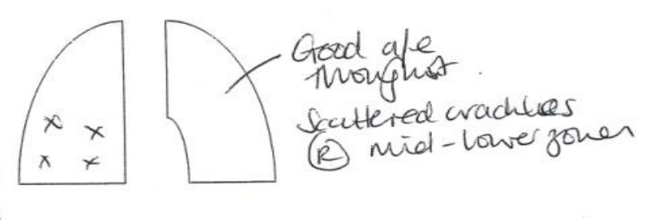
HSCIC Controlled Document

### SCOPE

This section sets out the items that are in and out of scope for this guidance.

#### In Scope

**Clinical Scope**

- Annotated graphics used by clinicians in the medical areas of assessment, examination and treatment of
patients

- Guidance for producing an electronic version of the graphics currently created by hand-drawing, those
pre-printed on a pro-forma sheet, or those created by rubber ink stamps

**Creating an Annotated Graphic**

- The user interface associated with creating the annotated graphic

- Annotating graphics with text

- Annotating graphics with hand-drawn symbols (e.g. symbols created by free-drawing with a mouse or
light-pen)

- Annotating graphics with ready-made symbols

- Indicating specific localised findings on the graphic

- Indicating spread-out regions on the graphic

- Consideration of the type of annotating tools & functionality that can be used

- Showing and displaying graphics that are pre-drawn and taken from a library or collection of images

**Viewing an annotated graphic**

- The user interface associated with viewing the annotated graphic

**Searching for and loading a graphic to be annotated**

- Simple search techniques for locating the desired graphic

**Conventions and practice of creating an annotated graphic**

- Consideration of what constitutes a ‘good quality’ text annotation on a graphic (such as the avoidance of
excessive free text, the position of the note in relation to the graphic and so on)

- Consideration of current annotating conventions and practice

#### Out of Scope

This section defines areas that are not covered by this guidance. Any specific hazards associated with these areas are not addressed in this guidance. It should also be noted that listing an item as out of scope does not classify it as unimportant. Project time and resource constraints inevitably restrict what can be in scope for a particular release. It is possible that items out of scope for this release may be considered for a future release.

**Graphic types**

- 3D graphics

- X-rays or photographs

Page 2

Copyright ©2013 Health and Social Care Information Centre

HSCIC Controlled Document

- Detailed or complex graphics, such as those used in operation notes

- Non-body graphics (such as drains or catheters etc)

- Graphics of internal systems (cardio-vascular, bone, central nervous systems)

- Non-annotated graphics used for informing patients or reference

**Graphic and symbol libraries or collections**

- Determining which graphics should be available to clinicians

- Determining which symbols should be available to annotate the graphics

- Altering or selecting for annotation only part of a loaded graphic

- Enabling clinicians to create their own graphics

- Enabling clinicians to upload and use their own graphics

**Manipulating and further handling of the graphic**

- The adding of rulers or dimensions to the annotated graphic

- Zooming or re-sizing of the graphic

- Printing of the annotated graphic

**Searching for and loading a graphic to be annotated**

- Advanced graphic selection techniques (such as selecting a graphic by navigating round a larger graphic
and selecting the body-part of interest)

**Toolbar layout and contents**

- The precise layout of the toolbar containing the annotating tools

- The exact contents of the toolbar containing the annotating tools

**Terminology Encoding**

- Consideration of identifying, matching and entering coded SNOMED CT terms

- Consideration of deriving the coded SNOMED CT body site automatically from the selection area of the
graphic

Page 3

Copyright ©2013 Health and Social Care Information Centre

HSCIC Controlled Document

### GUIDANCE INTRODUCTION

This section provides a brief introduction to the Noting with Graphics guidance. It describes how the guidance was created, how it should be used, outlines the structure & composition of the Noting with Graphics module and lists assumptions made whilst compiling the guidance.

#### Guidance Creation

Three main sources were used in order to create the guidance presented in this document. These were research, patient safety assessments and CUI CAPS clinical advisors. These are described in more detail below.

##### Guidance Creation - Research

A programme of research has been carried out in order to produce this guidance. This research has included the following:
- User interviews and observations – in order to understand the clinical users, their current processes and
clinical workflow

- Site visits – to understand the context and environment in which the users perform the noting with
graphics work

- User-based evaluations – done with various clinicians to get feedback on early designs and prototypes

- Examination of existing (clinical and non-clinical) software and technologies implementing a form of
graphical annotating

- Examination of annotated graphics in medical records / pro-formas in speciality areas where graphics are
commonly used

- Literature review of areas relating to clinical annotating of graphics.

##### Guidance Creation - Patient Safety Assessment

During the development of this guidance document, a number of clinicians from various disciplines attended workshops to explore their current practices in order to identify and record patient safety hazards associated with annotating graphics as part of clinical documenting.

In addition to workshops, relevant known patient safety incidents have been researched and reviewed. Any new research findings were assessed for new hazards or contribution to existing hazards throughout the development cycle.

##### Guidance Creation - CUI CAPS Clinical Advisors

The CUI CAPS Team includes several clinical advisors who worked on the Noting with Graphics guidance project and have provided significant clinical input throughout the creation of the guidance.

#### Conformance Rating

To indicate their relative importance, each guideline in this document is ranked by a Conformance value. This should be used by software vendors when deciding whether or not to implement a guideline into their software implementation. The conformance value can be one of two values, namely:

**Mandatory**  - an implementation should follow the guideline

Page 4

Copyright ©2013 Health and Social Care Information Centre

HSCIC Controlled Document

**Recommended**  - an implementation is advised to follow the guideline

#### Stylistic Choices

Some of the guidance points in this document are presented with a diagram to aid understanding. The visual representation of these diagrams is for illustrative purposes only. Stylistic choices (for example, display font and colours used) unless otherwise specified, are not part of the guidance and are therefore not mandatory requirements.

#### Structure & Composition

This section introduces the structure of the Noting with Graphics module and the terminology used to describe its constituent parts. Figure 2 shows an example representation of how the Noting with Graphics module might look when it is embedded in an electronic patient record.

As can be seen from Figure 2, the Noting with Graphics module comprises 2 main parts: the canvas and the toolbar. The canvas is the container for the graphic and any text or symbol annotations added to it. The toolbar is the container for the drawing tools and function buttons used in the annotating process.

The graphic is made up of one or more images. So in Figure 2, the graphic comprises 2 full-body images (i.e. a front full-body and a rear full-body image). The clinical findings that the clinician wants to document then form the annotations that are added to the graphic. These annotations are made by adding text and symbols to the graphic. The text is added to the graphic through the use of annotating text-boxes. Symbols are added to the graphic by either the user hand drawing them (using a drawing tool), or by adding one of the pre-defined ready-made symbols.

For each symbol added to the graphic an associated text-box is displayed that houses any annotating text needed for that symbol. This text then points to its associated symbol with an arrow.

Page 5

Copyright ©2013 Health and Social Care Information Centre

HSCIC Controlled Document

Figure 2: Structure and composition of the Noting with Graphics module.

#### Assumptions

The guidance provided for the Noting with Graphics module is based upon the following assumptions.

  - Only a single graphic will be loaded into the canvas at any one time.

  - There is no limit to the number of symbols – either hand-drawn or ready-made

symbols – that can be added to the graphic.

  - There is no limit to the number of annotating text-boxes that can be added to the

graphic.

  - When the canvas is displayed it must always contain a graphic. It is not possible to

display the canvas without a graphic or with a blank graphic.

  - Functionality relating to the displaying within the clinical notes of an annotated

graphic will be handled by the containing software application and not the Noting with Graphics module.

  - Functionality relating to the saving of an annotated graphic will be handled by the

containing software application and not the Noting with Graphics module.

Page 6

Copyright ©2013 Health and Social Care Information Centre

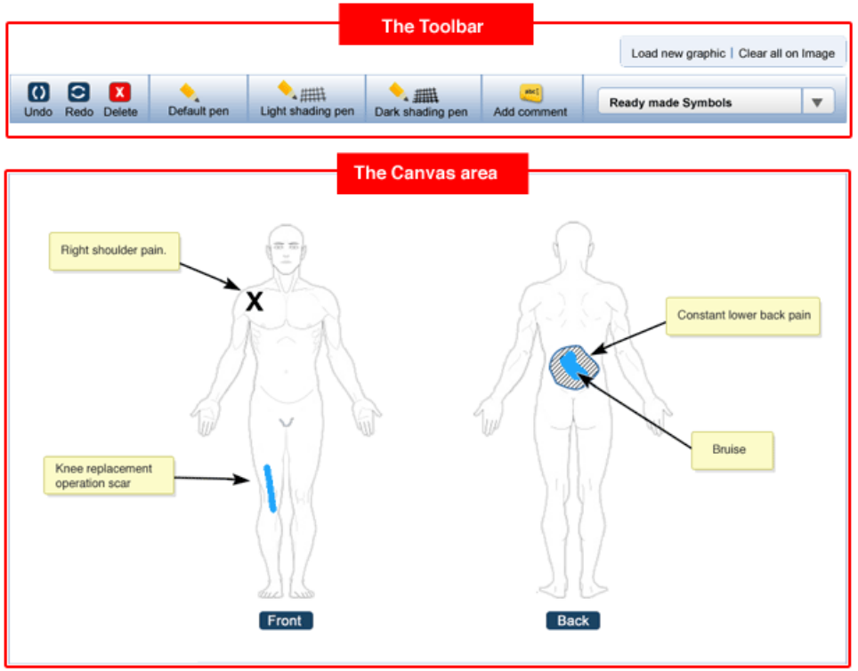
HSCIC Controlled Document

  - Where relevant, functionality relating to the re-editing of previous annotations will

be handled by the containing software application and not the Noting with Graphics module.

  - The Noting with Graphics module will work at a minimum resolution of 1024 x 768

pixels.

Page 7

Copyright ©2013 Health and Social Care Information Centre

HSCIC Controlled Document

### GUIDANCE POINTS

This chapter lists the complete set of guidance points for the Noting with Graphics module. In order to understand the structure, composition and terminology used in this chapter, the reader is advised to read the previous chapter 3, Guidance Introduction.

**Please Note** : each guidance point in this document comes with a unique guidance point ID (e.g. NwG-0012). These IDs are constant – they do not change when new versions of this document are produced. It should also be noted that the IDs are not presented sequentially in this document – that is they do not run from NwG-0001, NwG-0002, NwG-0003 and so on).

#### Noting with Graphics module

This section details the general guidance for the Noting with Graphic module as a whole.

**NwG-0112 - Mandatory**

#### When the graphic is loaded for creation or editing purposes, display both the canvas (containing the graphic) and the toolbar

Rationale: the user will need the tools and functions offered by the toolbar to

i l t th t t d hi

Page 8

Copyright ©2013 Health and Social Care Information Centre

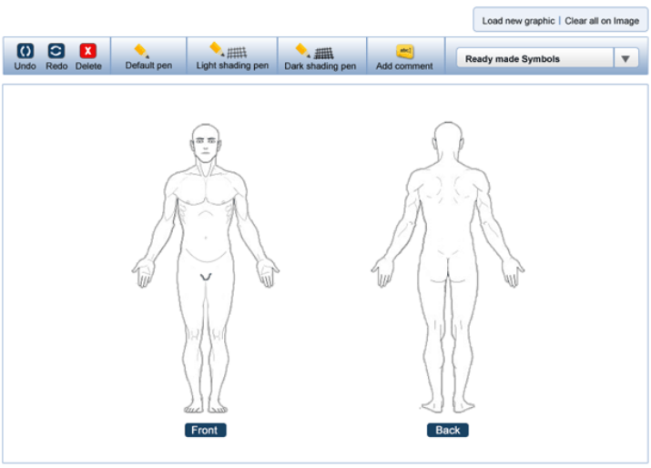
HSCIC Controlled Document

**NwG-0113 - Mandatory**

#### When the graphic is loaded for viewing purposes, display only the canvas (containing the graphic and notes) and not the toolbar

Rationale: the user will not need the creating and editing tools & functions offered b th t lb

**NwG-0114 - Mandatory**

#### When the graphic is loaded for viewing purposes, do not allow the user to edit or change any part of the annotated graphic

Rationale: the user can only edit the graphic when it is opened for creation and editing purposes

**NwG-0016 - Recommended**

#### Position the Noting with Graphics module in the relevant clinical notes section

Copyright ©2013 Health and Social Care Information Centre

Rationale: this helps the user to immediately recognise the clinical context of the graphic. For example, if a graphic of a set of lungs is created as part of a respiratory

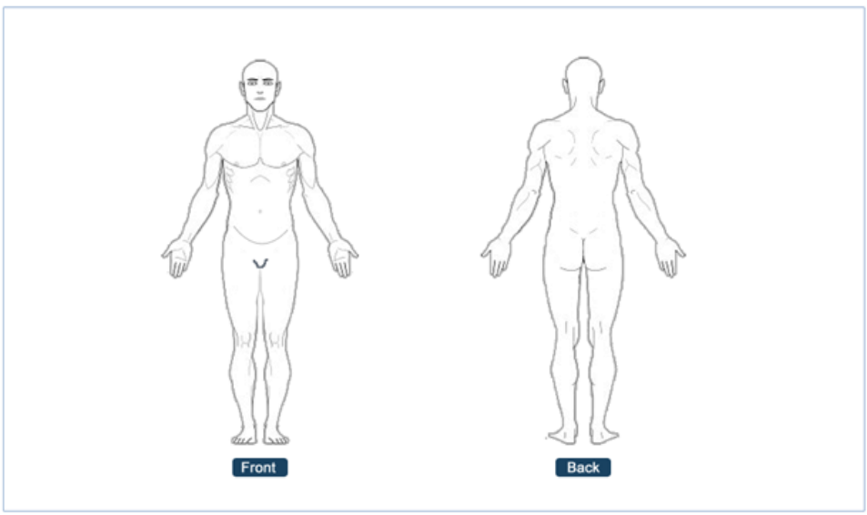

Page 9

HSCIC Controlled Document

**NwG-0012 - Mandatory**

#### The workflow involved in creating an annotated graphic should allow the user to firstly display the desired graphic, then allow the addition of any annotating symbols and then finally the adding of any annotating text

Rationale: research has shown that in most cases clinicians worked firstly on the graphic then added any symbols and finally added any text

**NwG-0107 - Mandatory**

#### Where the Noting with Graphics module is not displayed fully on screen, ensure that the application hosting it provides scrolling to enable the user to view the entire area

Rationale: so that the user has some way of viewing the entire annotated graphic when the hosting software application does not display it in full

**NwG-0116 - Mandatory**

#### When a previously annotated graphic is loaded for viewing purposes, display all the added annotations in the same way as when the graphic was created

Rationale: meaning that they are displayed in the same location on the graphic and the same size. This is so that the information that was intended to be conveyed
#### Graphics when the graphic was being created remains the same when the graphic is being

This section gives guidance on the graphics that are displayed in the canvas in the Noting with Graphic module.

**NwG-0001 - Mandatory**

#### The graphic should be a simple, lined-based image. It should not include any complex details Copyright ©2013 Health and Social Care Information Centre

Rationale: the graphics used should be simple to understand and easily recognisable for their intended users. They should not burden the user by including

Page 10

HSCIC Controlled Document

**NwG-0002 - Mandatory**

#### The graphic should only be in greyscale. Coloured graphics should not be included

Rationale: the use of colour is not advised in order to keep the graphics as simple as possible, to help prevent any difficulties for those users with colour vision deficiencies and as many clinical settings to do not have colour printing capabilities to reproduce any coloured graphics

**Usage Examples**

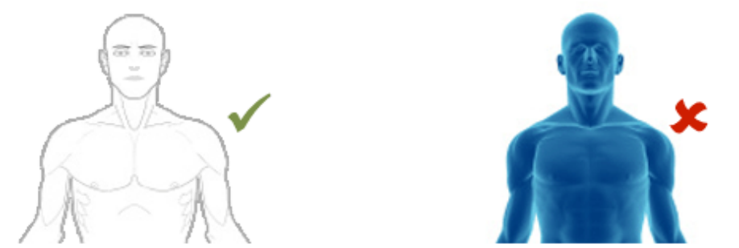

In this correct example the graphic is a greyscale outline image (NwG-0001, NwG-0002)

In this incorrect example the graphic includes different colours and shades. It also contains unnecessary detail (NwG-0001, NwG-0002)

Page 11

Copyright ©2013 Health and Social Care Information Centre

HSCIC Controlled Document

**NwG-0088 - Mandatory**

#### Include a title on each displayed graphic where there is the chance of selecting the wrong one

Rationale: so that it is clear to the user which graphic was selected. This is particularly important when graphics look similar and there exists the possibility of choosing the wrong one (e.g. left hand and right hand)

**NwG-0008 - Mandatory**

#### Include orientation labels on graphics w chance of mixing up the orientation

Rationale: orientation labels (e.g. ‘front view’ and ‘back safety issue occurring where a user chooses or annotat

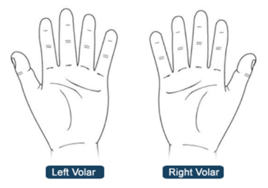

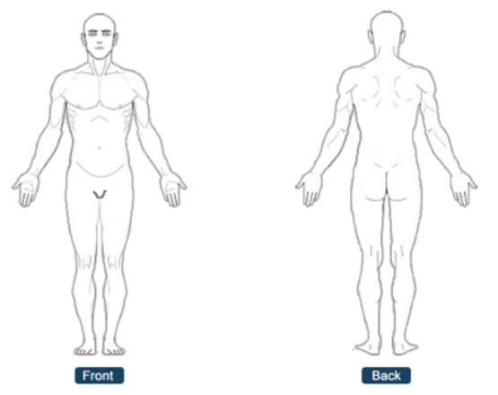

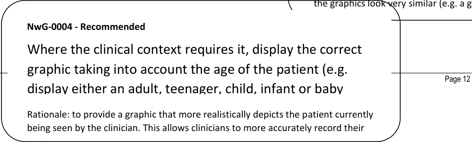

HSCIC Controlled Document

**NwG-0087 - Recommended**

#### Where the clinical context requires it, display the correct graphic taking into account the sex of the patient (e.g. display either a male or female graphic)

Rationale: to provide a graphic that more realistically depicts the patient currently being seen by the clinician. This allows clinicians to more accurately record their

**NwG-0003 – Mandatory**

#### When opened in the canvas, the graphic should be displayed at a suitable size to remove the need for the user having to firstly re-size it

Rationale: this is so that the user immediately recognises which graphic is displayed and can start working with it immediately - without firstly having to perform any

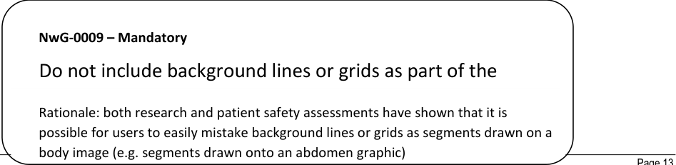

Copyright ©2013 Health and Social Care Information Centre

HSCIC Controlled Document

**Usage Examples**

In this correct example no lines nor grids are included as part of the graphic (NwG-0009)

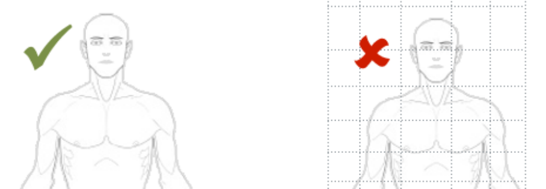

In this incorrect example the graphic includes a grid (NwG-0009)

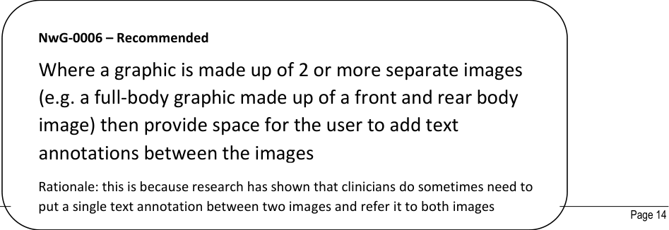

Copyright ©2013 Health and Social Care Information Centre

HSCIC Controlled Document

**Usage Examples**

In this correct example space is provided between the 2 images making up the graphic (NwG-0006)

In this incorrect example insufficient space has been left between the 2 images making up the graphic (NwG-0006)

**NwG-0010 – Mandatory**

#### Do not allow a user to delete any part of a graphic

Rationale: allowing the user to delete part of a loaded graphic has risks that they may also accidentally delete any already added annotations. It also carries the risk that any subsequent user who views the graphic may not recognise it, or may even think that the user has chosen the wrong graphic to annotate

**Usage Examples**

Page 15

Copyright ©2013 Health and Social Care Information Centre

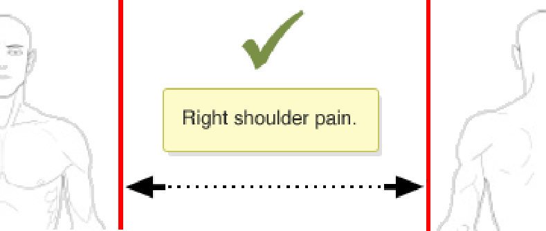

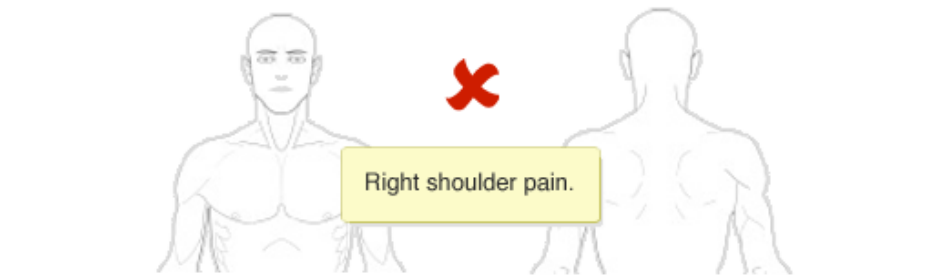
HSCIC Controlled Document

In this correct example no part of the original graphic has been – or is able to be – deleted by the user (NwG-0010)

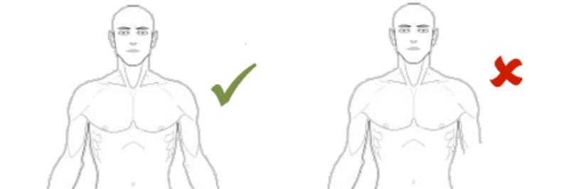

In this incorrect example part of the graphic has been deleted by the user (NwG-0010)

Page 16

Copyright ©2013 Health and Social Care Information Centre

HSCIC Controlled Document

**NwG-0011 – Mandatory**

#### If re-positioning of a graphic in the canvas is implemented, ensure that the location of any items already annotating the graphic is correctly retained

Rationale: to prevent the situation where a graphic is moved and any already added annotating items (e.g. text or symbols) do not correspondingly move. This situation carries the risk that the original meaning of the annotating information can be lost. For example, when a user adds a ‘pain’ symbol to the left-shoulder of a full-body graphic. If the graphic is then moved, the underlying pain symbol needs to move as

**Usage Examples**

In this correct example the graphic has been moved and the annotating ‘X’ pain-symbol moves with the graphic and thus remains fixed in the same location on the right shoulder (NwG-0011)

In this incorrect example the graphic has been moved but the annotating ‘X’ pain-symbol does not automatically moves with the graphic and thus it is no longer on the right shoulder (NwG-0011)

#### The Canvas

This section provides guidance on the canvas part of the Noting with Graphic module. The canvas is the bounding container for the graphic and its annotations.

Page 17

Copyright ©2013 Health and Social Care Information Centre

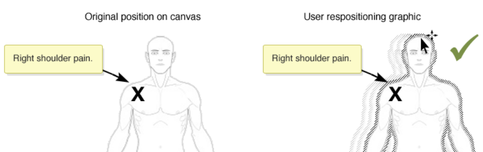

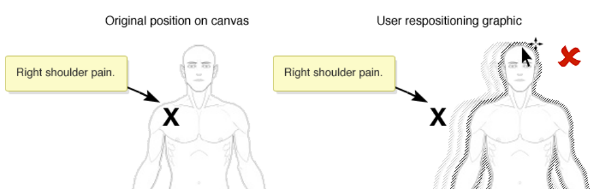
HSCIC Controlled Document

**NwG-0089 – Mandatory**

#### Do not include background lines or grids on the canvas

Rationale: as research has shown that these can be confused with segments or sections of a body image (i e quadrants in an abdomen)

**Usage Examples**

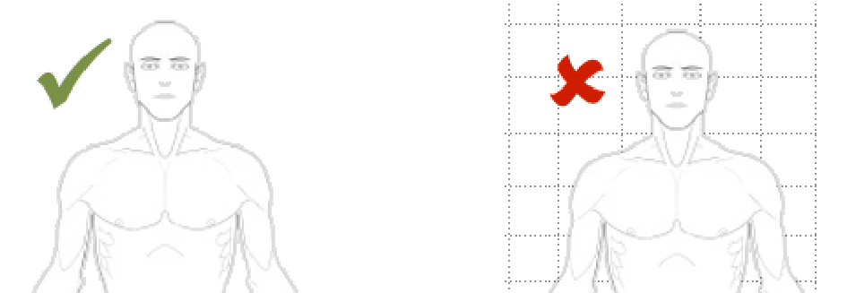

In this correct example no lines nor grids are shown on the canvas (NwG0089)

In this incorrect example a grid is displayed on the canvas (NwG-0089)

Page 18

Copyright ©2013 Health and Social Care Information Centre

HSCIC Controlled Document

**NwG-0090 – Mandatory**

#### Upon loading, display the graphic centrally in the canvas

Rationale: so that it becomes the centre of attention in the canvas and that there is room on either side of the graphic to add any required text annotations

Copyright ©2013 Health and Social Care Information Centre

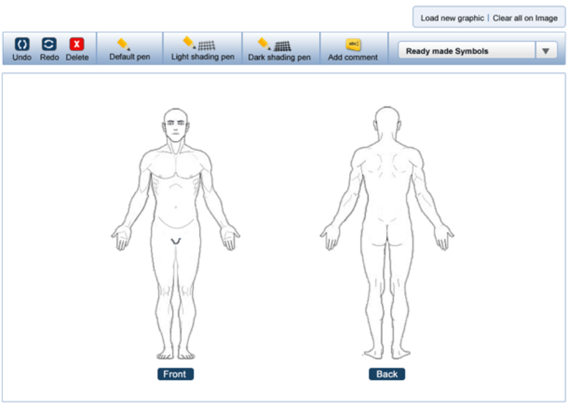

Page 19

HSCIC Controlled Document

**NwG-0005 – Mandatory**

#### Leave sufficient room for adding annotating text to both the left and right side of the graphic

Rationale: this provides freedom for the user to put annotating text on either side of the graphic. It also aids clarity by preventing arrows crossing over the body of the graphic for text annotations - that are only on one side - to point to their corresponding symbols on the other side of the graphic

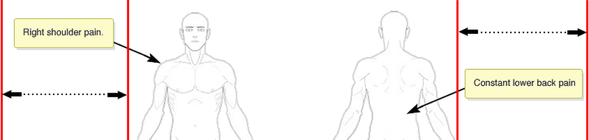

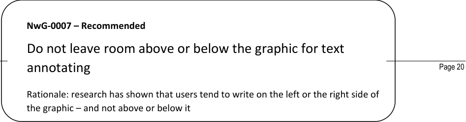

HSCIC Controlled Document

**Usage Examples**

In this incorrect example room has been left above the graphic for annotation purposes (NwG-0007)

**NwG-0021 – Recommended**

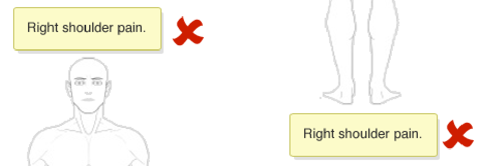

In this incorrect example room has been left below the graphic for annotation purposes (NwG-0007)

#### Only permit one single graphic to be displayed on the

Rationale: preventing 2 separate graphics being displayed on the same canvas (e.g. a left-hand graphic and a right-hand graphic) reduces the risk of similar images being loaded at the same time and then used in error

**NwG-0081 – Mandatory**

Copyright ©2013 Health and Social Care Information Centre
#### Any colour chosen for the canvas background should not reduce the readability or clarity of the graphic, or any annotating items placed on the graphic

Page 21

HSCIC Controlled Document

**NwG-0099 – Mandatory**

#### A canvas can never be empty or blank – it must always contain a graphic

Rationale: to prevent the risk that an empty canvas with no graphic is saved to the clinical notes

**NwG-0091 – Mandatory**

#### The canvas should be sufficiently sized to contain the graphic without the user needing to scroll or zoom to view the entire graphic

Rationale: the graphic should always be fully visible in the canvas, with its information available at-a-glance without the need for scrolling or zooming. This is to prevent the risk that the graphic or any annotating information is not on display – and thus could be overlooked by the user

**NwG-0083 – Mandatory**

#### The canvas should automatically grow in length when additional room for text or symbol annotations is required

Rationale: the canvas must offer more room for extra annotations to prevent the user having to scroll within the canvas

**NwG-0100 – Mandatory**

#### Do not allow the graphic or annotating items to be placed outside of the canvas

Rationale: the canvas is to act as a bounding container preventing the graphic or any annotation items (i.e. ready-made symbols, free-hand drawings, text annotations) from becoming not clearly or fully displayed

Copyright ©2013 Health and Social Care Information Centre

Page 22

HSCIC Controlled Document

**Usage Example**

In this incorrect example the full-body graphic has been placed partially outside the canvas (NwG-0100)

**NwG-0101 – Mandatory**

#### Do not allow vertical scrolling within the canvas

Rationale: scrolling implies that the complete annotated graphic may not be entirely in view. This carries risks that the user does not see all relevant information in the canvas whilst annotating the graphic. Because of this, it is advised that the canvas always be sized appropriately to fully fit the graphic without requiring the user to have to perform the additional task of vertical scrolling

**Usage Example**

Copyright ©2013 Health and Social Care Information Centre

Page 23

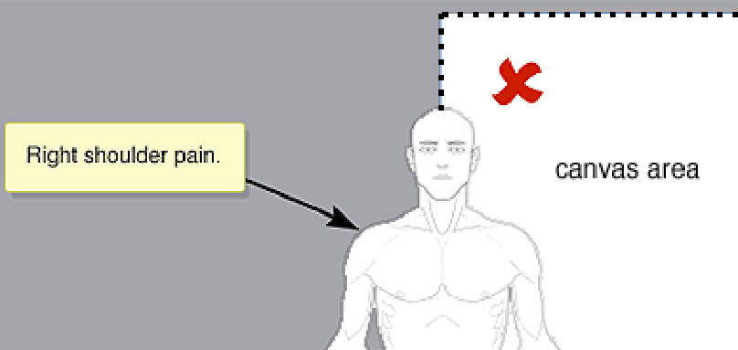
HSCIC Controlled Document

In this incorrect example a scroll bar has been added to the canvas to provide vertical scrolling (NwG-0101)

**NwG-0102 – Mandatory**

#### Do not allow horizontal scrolling within the canvas

Rationale: scrolling implies that the complete annotated graphic may not be entirely in view. This carries risks that the user does not see all relevant information in the canvas whilst annotating the graphic. Because of this, it is advised that the canvas always be sized appropriately to fully fit the graphic without requiring the user to have to perform the additional task of horizontal scrolling

**Usage Example**

Copyright ©2013 Health and Social Care Information Centre

Page 24

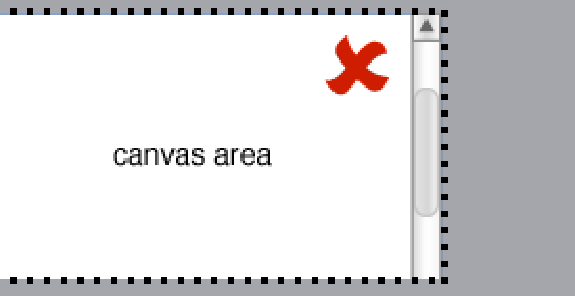
HSCIC Controlled Document

In this incorrect example a scroll bar has been added to the canvas to provide horizontal scrolling (NwG-0102)

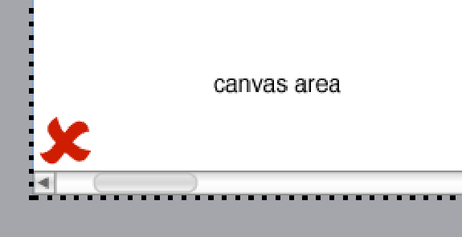

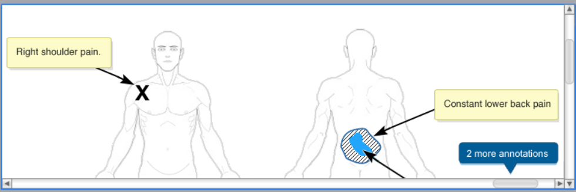

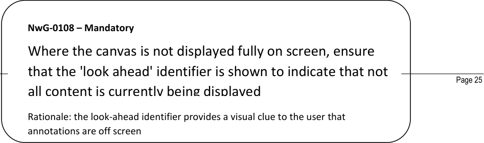

HSCIC Controlled Document

Page 26

Copyright ©2013 Health and Social Care Information Centre

HSCIC Controlled Document

#### Loading and Searching for a Graphic

This section details the guidance for the searching for and loading of graphics in the Noting with Graphic module. Be aware that several of these guidance points are dependent on the clinical context into which they are implemented. An example of this is where some clinicians or departments will want a commonly used graphic to be automatically pre-loaded as part of their clinical noting, whereas others will need to choose which graphic they want to load from a small set of offered graphics.

**NwG-0013 – Mandatory**

#### Where the clinical context requires it, the canvas containing a graphic should be automatically loaded in the relevant location in the clinical notes without requiring any user

Rationale: research has shown that in certain clinical contexts (e.g. where only a single, commonly used graphic is ever needed), users found it more convenient and efficient having the graphic automatically displayed in the clinical notes – rather than them having to elect to display the graphic

**NwG-0014 – Mandatory**

#### Where the clinical context requires it, provide the user with an option to load a graphic in the relevant location in the clinical notes when required

Rationale: research has shown that in certain clinical contexts a graphic is not always needed. In these situations the user should have a way of being able to choose whether or not they want to include a graphic in their clinical notes (e.g. a ‘Load

**NwG-0023 – Mandatory**

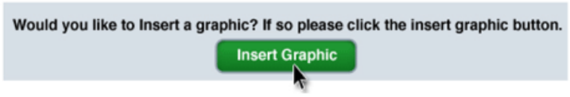
#### ~~Where the clinical context requires it, provide a way for the~~ user to choose and load the appropriate graphic for the

Copyright ©2013 Health and Social Care Information Centre
#### patient case in hand

Rationale: research has shown that in certain clinical contexts (i.e. where several different graphics are sed on a reg lar basis) the ser sho ld ha e a a of being

Page 27

HSCIC Controlled Document

**NwG-0018 – Mandatory**

#### Where the clinical context allows it, provide the user with a mechanism that allows them to remove the entire Noting with Graphics module if they decide that they do not want to use a graphic within the clinical notes

Rationale: for the situations where the user loads a graphic and then subsequently decides that it is not needed. Or for the case where one is automatically pre-loaded in the clinical notes and they again decide that it is not needed

Copyright ©2013 Health and Social Care Information Centre

Page 28

HSCIC Controlled Document

**NwG-0024 – Mandatory**

#### Where the clinical context requires it, present the user a short list of commonly used graphics to choose from when i d

Rationale: research showed that most clinicians regularly use a few common graphics and they prefer to choose a graphic from a short list rather than performing a text

**NwG-0026 – Mandatory**

#### Where the clinical context requires it, allow as a secondary way of choosing a graphic the user to perform a simple text- entry keyword search

Rationale: whilst research showed that users preferred to choose a graphic from a short list, in the case where this does not offer the required graphic the user is still able to perform a text-entry search to find the graphic they want

Copyright ©2013 Health and Social Care Information Centre

Page 29

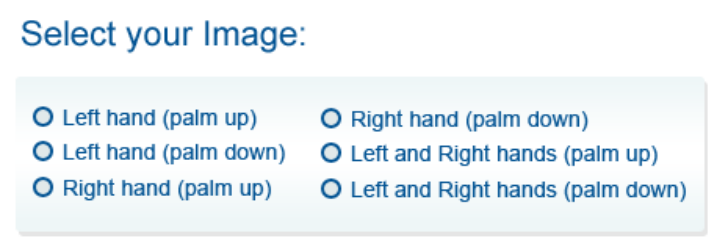

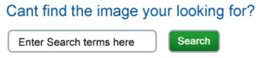
HSCIC Controlled Document

**NwG-0027 – Recommended**

#### Where different ways of selecting or searching for a graphic are implemented, ensure that they are visually distinct and separate from each other on screen

Rationale: this is so that when more than one way to search for a graphic is implemented (e.g. short list of commonly used graphics to choose from and a simple text-entry search mechanism to find the desired graphic) ensure that it is clear to the user that they are distinct separate search mechanisms

#### Symbol Annotations

This section gives guidance on symbols (both hand-drawn symbols and ready-made symbols) used to annotate the graphic.

Copyright ©2013 Health and Social Care Information Centre

Page 30

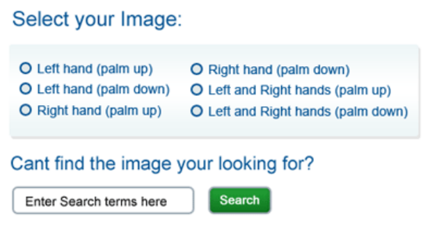
HSCIC Controlled Document

**NwG-0028 – Mandatory**

#### Provide free-hand drawing tools that allow the user to annotate the graphic by drawing on it the relevant clinical findings

Rationale: providing free-hand drawing tools (e.g. a pen tool) gives the user freedom and flexibility to be able to hand-draw any symbol they desire as part of the graphic annotation. These drawing tools are also important in the cases where a ready-made symbol cannot accurately represent a clinical finding. For example, scars come in various shapes and sizes, and to accurately represent a scar using a ready-made scar

b l ld t b il ibl

Copyright ©2013 Health and Social Care Information Centre

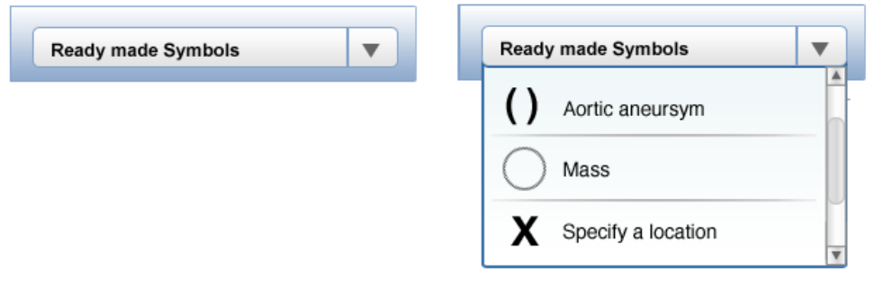

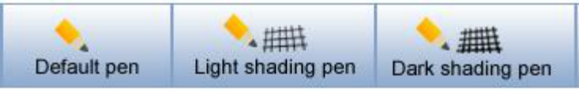
HSCIC Controlled Document

**NwG-0030 – Mandatory**

#### NwG-0029 – Mandatory Where clinical finding symbols are very common or regularly used, provide the user with a ready-made symbol Where clinical finding symbols are difficult to draw free- to add to the graphic

**NwG-0029 – Mandatory**

#### Where clinical finding symbols are difficult to draw free- to add to the graphic hand, provide the user with a ready-made symbol that can

Rationale: so that the user does not have to spend time and effort hand-drawing be simply added to the graphic

Rationale: so that the user does not have to spend time and effort hand-drawing be simply added to the graphic these difficult to draw symbols

Rationale: so that the user does not have to spend time and effort hand-drawing these difficult to draw symbols

**NwG-0032 – Mandatory**

#### The ready-made symbols available for annotating should be relevant to the graphic that has been loaded

Rationale: for example, if a lung graphic is loaded, then lung related ready-made symbols should be available for annotating purposes. This is so that the correct symbol can be quickly and simply added to the graphic and that irrelevant symbols are not being displayed to the user

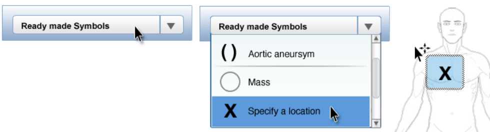

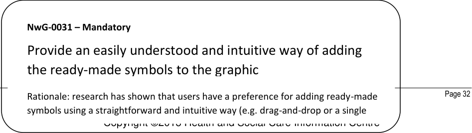

HSCIC Controlled Document

**Usage Example**

In this correct example the ready-made symbol is added to the graphic using a drag-and-drop method. The symbol in this example is shown with a blue-coloured bounding box which the user can click on with the mouse to drag the item to the desired location (NwG-0031)

**NwG-0111 – Mandatory**

#### Ensure that any ready-made symbols provided are correctly sized for the graphic they are to be placed on top off

Rationale: to prevent the risk that the user misinterprets or does not recognise a ready-made symbol annotating a graphic because it is not appropriately sized too correctly represent the clinical finding

**Usage Examples**

Copyright ©2013 Health and Social Care Information Centre

Page 33

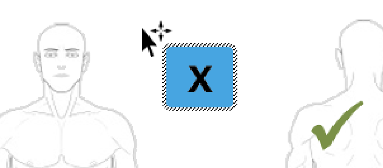
HSCIC Controlled Document

In this correct example the ready-made symbol is appropriately sized for the underlying graphic (NwG-0111)

**NwG-0033 – Mandatory**

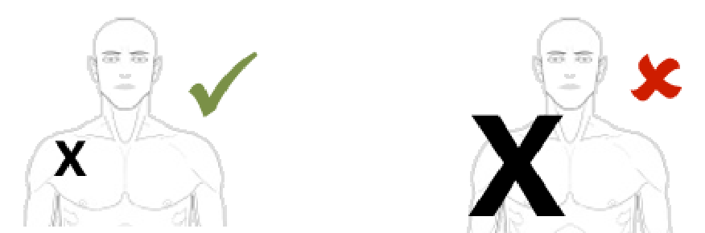

In this incorrect example the readymade symbol is too large for the underlying graphic it is placed on (NwG0111)

#### Provide the user with a small set of ready-made symbols - limited to only those that are commonly used

Rationale: so that the user does not have to spend a lot of time searching through a large set of symbols looking for the ones they need

**NwG-0092 – Mandatory**

#### Provide a ready-made symbol to indicate an exact location on the graphic

Rationale: research showed that users considered this a useful general tool to have when annotating a graphic with a very localised clinical finding. Some users stated a

**NwG-0034 – Mandatory**

Copyright ©2013 Health and Social Care Information Centre
#### Provide a free-hand drawing or shading tool to indicate a region or spread-out area

Page 34

HSCIC Controlled Document

**NwG-0105 – Mandatory**

#### Ensure that the ready-made symbols provided look visually different and are distinguishable from all other items within the canvas

Rationale: to prevent the risk that the user misinterprets or does not recognise a ready-made symbol annotating a graphic because it looks very similar to another item within the canvas (i.e. the graphic, hand drawings, connecting arrows)

**NwG-0106 – Mandatory**

#### Ensure that when used the hand-drawn symbols provided look visually different and are distinguishable from all other items within the canvas

Rationale: to prevent the risk that the user misinterprets or does not recognise a hand-drawn symbol annotating a graphic because it looks very similar to another item within the canvas (i.e. the graphic, ready-made symbols, connecting arrows)

**NwG-0035 – Mandatory**

#### Allow the user to make free-hand drawings outside of the graphic perimeter (but still within the canvas)

Rationale: research showed that some clinicians made hand-drawings on top of and around the graphic in order to alter it for anomalies (e.g. they would hand-draw a swollen wrist on top of a 'normal' wrist graphic). By allowing users to draw outside of the graphic they can continue to 'change' the underlying graphic by free-hand

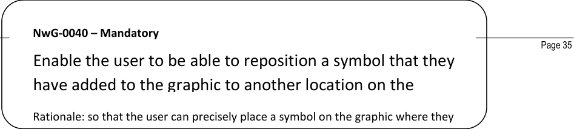

HSCIC Controlled Document

**NwG-0041 – Mandatory**

#### When the user repositions a symbol ensure that any associated annotating text-box and connecting arrow also move correspondingly

Rationale: so that the symbol and its associated items are moved in one step – removing the need for the user to have to perform several reposition actions on each item individually

**NwG-0036 – Mandatory**

#### Prevent the user from adding ready-made symbols outside of the graphic perimeter

Rationale: ready-made symbols only have relevance and meaning when they are placed on or inside a graphic

**Usage Examples**

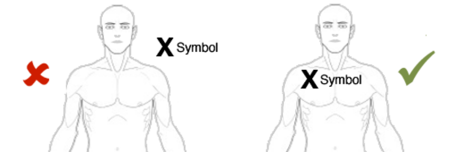

In this incorrect example the user has been able to position the ready-made symbol outside of the graphic edge (NwG-0036)

In this incorrect example the ready-made symbol cannot be placed outside of the graphic edge (NwG-0036)

Page 36

Copyright ©2013 Health and Social Care Information Centre

HSCIC Controlled Document

**NwG-0093 – Mandatory**

#### Provide the functionality for the user to delete any ready- made symbols or hand-drawn symbols that they have made

Rationale: for when the user has added the incorrect ready-made symbol or wants to remove an incorrectly hand-drawn symbol from the graphic

**NwG-0094 – Mandatory**

#### When the user does delete any ready-made symbols or hand-drawn symbols ensure that the associated annotating text-box and connecting arrow are also correspondingly

Rationale: firstly, so that the symbol and its associated items are deleted in one step

   - removing the need for the user to have to perform several delete actions on each
item individually. Secondly, because the symbol and its associated text-box and connecting arrow together form the clinical finding. Deleting one should delete all parts to ensure that there are no parts of the clinical finding remain

Copyright ©2013 Health and Social Care Information Centre

Page 37

HSCIC Controlled Document

**NwG-0038 – Mandatory**

#### Allow the user to place symbols on top of one another when required

Rationale: research has shown that there is sometimes a need to indicate more than one different clinical finding in the same area. So for example, a drawing could show a large bruise area and within that area there is a graze. To be able to achieve this, the users will need to be able to place symbols (both ready-made symbols and hand

**NwG-0039 – Mandatory**

#### Ensure that when symbols are placed on top of each other that they are visually distinguishable

Rationale: so that it is clear that more than one symbol is in the same location and that the symbol on top does not completely obscure the one below

**NwG-0064 – Mandatory**

#### ~~When a ready-made symbol is initially placed onto the~~ canvas it should be displayed within a bounding box

Copyright ©2013 Health and Social Care Information Centre

Rationale: the bounding box area around a symbol is intended to help users when dragging the symbol to the desired location on the graphic. It makes identifying the newly added symbol easier as the bounding box stands out. It also makes selecting

d d i th b l i t f th d t h t t l

Page 38

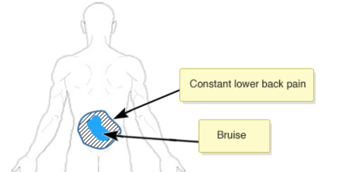

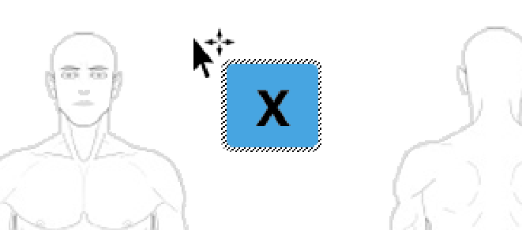
HSCIC Controlled Document

**NwG-0065 – Mandatory**

#### The ready-made symbol bounding box should disappear when the user drops the symbol into the desired position

Rationale: this is to avoid the risk that the user misinterprets or does not recognise the ready-made symbol contained within the bounding box

**NwG-0066 – Mandatory**

#### The ready-made symbol bounding box should be semi- transparent

Rationale: this is to aid the user in the correct positioning of the ready-made symbol. By providing a semi-transparency this will allow the user to continue to see exactly which area on the graphic they are placing the symbol onto

**Usage Examples**

Copyright ©2013 Health and Social Care Information Centre

Page 39

HSCIC Controlled Document

In this correct example the ready-made symbol bounding box is semi-transparent (NwG-0066)

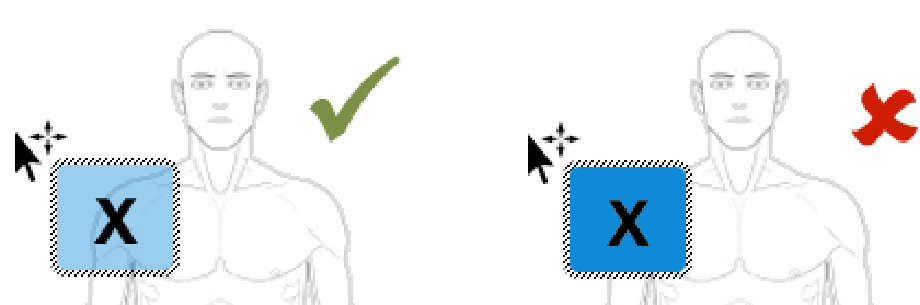

In this incorrect example the ready-made symbol bounding box is not semi-transparent (NwG-0066)

Page 40

Copyright ©2013 Health and Social Care Information Centre

HSCIC Controlled Document

#### Text Annotations

This section gives guidance for text used to annotate a graphic.

**NwG-0042 – Mandatory**

#### All text to be used to annotate the graphic should be contained in a text-box

Rationale: in order to keep each text annotation clear and distinct from one another

**Usage Examples**

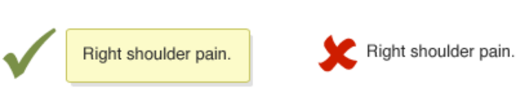

In this correct example the annotating text is contained within a text-box (NwG-0042)

**NwG-0055 – Mandatory**

In this incorrect example the annotating text is not contained within a text-box (NwG-0042)

Page 41

#### Allow the user to manually add a text-box for general comment text annotations that are not necessarily Copyright ©2013 Health and Social Care Information Centre associated with a symbol annotating the graphic

Rationale: research has shown that clinicians find it useful to have the freedom to

HSCIC Controlled Document

**NwG-0043 – Mandatory**

#### When the user adds a symbol to the graphic an associated text-box and arrow pointing to the symbol should also be automatically added to the canvas

Rationale: this is both to prompt the user to enter text for the symbol they have just added and as an efficient way of saving the user manually having to add a text-box and an arrow

**NwG-0045 – Mandatory**

#### Where a text-box has been automatically added because of its association to a symbol, automatically place it on the correct side of the graphic close to the newly added symbol

Rationale: this is to prevent arrows (pointing the text-box to the associated symbol) having to criss-cross over the graphic potentially reducing the overall clarity of the annotated graphic

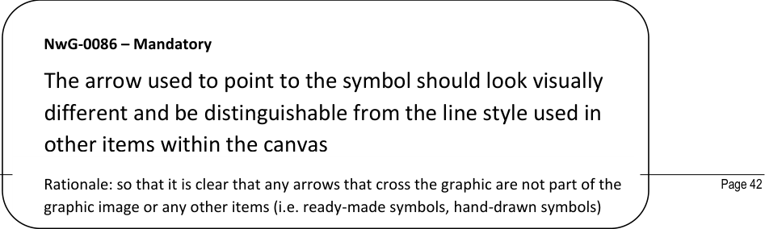

HSCIC Controlled Document

**Usage Example**

In this correct example a text-box and arrow have been automatically added to the canvas because the user added a ready-made symbol to the graphic. The arrow pointing the text-box to the symbol also looks visually different from the line style used in the graphic (NwG-0043, NwG-0086)

**NwG-0053 – Recommended**

#### When a text-box is newly added to the canvas ensure that it

Copyright ©2013 Health and Social Care Information Centre
#### looks visually different to one that has been edited

Rationale: so that it is clear to the user that the text-box has just been added and has

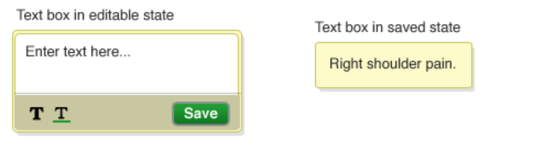

Page 43

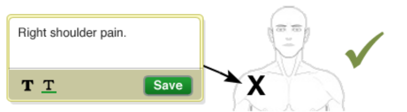
HSCIC Controlled Document

**NwG-0046 – Mandatory**

#### The text-box should not be placed on top of any existing items within the canvas

Rationale: so for example, it should not go on top of the graphic, another text-box, an arrow or a symbol etc) in order to ensure that it does not obscure any current items and thus reducing the overall clarity of the annotated graphic

**Usage Examples**

Copyright ©2013 Health and Social Care Information Centre

Page 44

HSCIC Controlled Document

In this correct example the text-box is not placed on top of the graphic (NwG-0046)

**NwG-0110 – Mandatory**

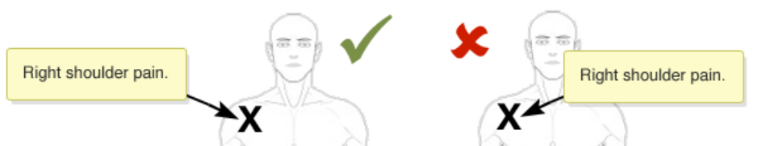

In this incorrect example the text-box is placed on top of the graphic (NwG-0046)

#### Always display any added text-boxes. They should not be hidden nor in a collapsed state

Rationale: this is so that the information they contain is always on display and can be seen 'at-a-glance' without firstly manipulating / opening them all

**NwG-0047 – Mandatory**

#### A newly added text-box should have the cursor focus

Rationale: so that the user can start typing text into the text-box immediately without firstly having to select or highlight it

**NwG-0109 – Mandatory**

Copyright ©2013 Health and Social Care Information Centre
#### Do not truncate the text that has been entered into the text-box. All entered text should always be displayed in full

R ti l thi i th t ll f th t t t d i th t t b i l di l

Page 45

HSCIC Controlled Document

**NwG-0097 – Mandatory**

#### Allow the user to enter as much text as they want in the text-box

Rationale: putting a limit on the amount of text enterable may frustrate some clinicians. It may also limit them in fully describing any clinical findings. Research showed that clinicians felt that this would be unlikely to be exploited – meaning that

li i i ld t ‘ b ’ th t t b filli th ith t t

**NwG-0048 – Recommended**

#### Pre-populate the text-box with an initial text message informing the user that they can enter some text into the text box

Rationale: for example, display something like “Enter text here...” so that the user is aware that they can enter text into the text-box

**NwG-0115 – Recommended**

#### The initial text message informing the user that they can enter some text into the text box should be presented in a way that differentiates it from text that a user entersCopyright ©2013 Health and Social Care Information Centre

Rationale: for example, by putting this text in italics or a different colour. This is to help prevent the hazard that the user forgets to enter text into a text-box that has b dd d A hi l d i i i l i ll d ll h

Page 46

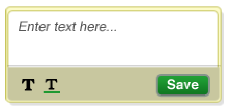
HSCIC Controlled Document

**NwG-0050 – Mandatory**

#### The text-box should automatically grow in size as the user types in text

Rationale: this is so that all of the text entered in the text-box is on display and can be seen ‘at a glance’. If the text-box did not grow in size the full text entered may not

Copyright ©2013 Health and Social Care Information Centre

Page 47

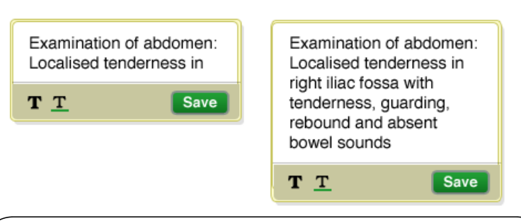
HSCIC Controlled Document

**NwG-0051 – Recommended**

#### Provide a tool for emphasising text entered in the symbol's text-box

Rationale: for example provide an text underlining or bold tool. Just as in the current pen & paper process, there is a need to be able to highlight some of the text notes that annotate a graphic

**NwG-0052 – Mandatory**

#### Provide the functionality for the user to be able to delete any text-boxes that they have added to the graphic

Rationale: as users may want to remove any text-annotations that they incorrectly made

**NwG-0095 – Mandatory**

#### When the user does delete a text-box ensure that if it has a pointing arrow and any associated symbols that they are also correspondingly deleted

Rationale: so that the text-box and if it has any associated items (i.e. arrow and symbol) are all deleted in one step. This removes the need for the user to perform several delete actions on each item individually. Also, as the text-box, its arrow and associated symbol together form the clinical finding. Deleting one should delete all parts to ensure that no parts of the clinical finding remain

**NwG-0098 – Mandatory**

#### Where text-boxes have been automatically added because of an associated symbol, do not pre-populate the text-box with any details relating to that symbol

Rationale: research has shown that pre-populating the text-box with symbol details Copyright ©2013 Health and Social Care Information Centre (i.e. name, location and description) is not always welcomed by clinicians. It carries the risk the pre-populated text implies a confirmed diagnosis whereas the clinical fi di i l b t d

Page 48

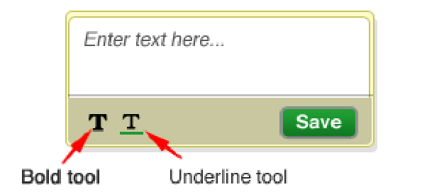
HSCIC Controlled Document

#### The Toolbar tools & functions

This section details the guidance for the toolbar tools and functions used when annotating a graphic.

**NwG-0067 – Mandatory**

#### The system should be tolerant and offer the user the option to undo and redo any changes they make. At a minimum there must be one level of redo and undo

Rationale: to allow the users to go back to a previous state when they make a

**NwG-0103 – Mandatory**

#### Provide a mechanism that allows the user to remove any items placed on the graphic

Rationale: for use in situations where the user makes a mistake or changes their mind about adding a particular annotation. This mechanism could be a delete or remove button to remove any incorrectly added ready-made symbols, hand-drawn symbols or text box annotations

**NwG-0069 – Mandatory**

#### Provide a mechanism that allows the user to remove all items placed on the graphic in one go, thus returning the session to the state when the graphic was originally loaded

Rationale: so that the user can quickly and easily return to original state when they decide that they want to remove all annotations made in one go

**NwG-0070 – Mandatory**

#### ~~When the user selects the mechanism to remove all items~~ placed on the graphic in one go, present an alert warning

Copyright ©2013 Health and Social Care Information Centre
#### the user of the action that they are about to take with the options to cancel or continue

Rationale: an alert should be presented to inform users in plain English that the

Page 49

HSCIC Controlled Document

**NwG-0075 – Recommended**

#### Place together in the toolbar those tools and functions that are related to each other

Rationale: placing the toolbar items into related groups will aid the user in identifying the relevant section of the toolbar to which their intended action is associated

**NwG-0076 – Mandatory**

#### All tools must have an associated text label and a tool tip should be displayed when the user hovers over the icon with their mouse cursor

Rationale: basic good design principles so that the user understands what each tool is

**NwG-0104 – Recommended**

#### When the user selects a tool for creating hand-drawn symbol annotations, change the mouse cursor to reflect the chosen tool

Rationale: so the user can see at a glance that the Noting with Graphics module is in a state that allows them to create hand-drawn symbols – and which hand-drawn tool is currently selected for use

Copyright ©2013 Health and Social Care Information Centre

Page 50

HSCIC Controlled Document

### GUIDANCE POINTS CHECKLIST

This chapter contains a summary checklist of all of the Noting with Graphics guidance points.

|ID|Guidance Point|Conformance Rating|
|---|---|---|
|**Noting with Graphics Module (page 12)**|**Noting with Graphics Module (page 12)**|**Noting with Graphics Module (page 12)**|
|NwG- 0112|When the graphic is loaded for creation or editing purposes, display both the canvas (containing the graphic) and the toolbar|Mandatory|
|NwG- 0113|When the graphic is loaded for viewing purposes, display only the canvas (containing the graphic and notes) and not the toolbar|Mandatory|
|NwG- 0114|When the graphic is loaded for viewing purposes, do not allow the user to edit or change any part of the annotated graphic|Mandatory|
|NwG- 0016|Position the Noting with Graphics module in the relevant clinical notes section|Recommended|
|NwG- 0012|The workflow involved in creating an annotated graphic should allow the user to firstly display the desired graphic, then allow the addition of any annotating symbols and then finally the adding of any annotating text|Mandatory|
|NwG- 0107|Where the Noting with Graphics module is not displayed fully on screen, ensure that the application hosting it provides scrolling to enable the user to view the entire area|Mandatory|
|NwG- 0116|When a previously annotated graphic is loaded for viewing purposes, display all the added annotations in the same way as when the graphic was created|Mandatory|
|**Graphics (page 15)**|**Graphics (page 15)**|**Graphics (page 15)**|
|NwG- 0001|The graphic should be a simple, lined-based image. It should not include any complex details or shaded or coloured areas|Mandatory|
|NwG- 0002|The graphic should only be in greyscale. Coloured graphics should not be included|Mandatory|
|NwG- 0088|Include a title on each displayed graphic where there is the chance of selecting the wrong one|Mandatory|
|NwG- 0008|Include orientation labels on graphics where there is the chance of mixing up the orientation|Mandatory|

Copyright ©2013 Health and Social Care Information Centre

Page 51

HSCIC Controlled Document

|NwG- 0004|Where the clinical context requires it, display the correct graphic taking into account the age of the patient (e.g. display either an adult, teenager, child, infant or baby graphic)|Recommended|
|---|---|---|
|NwG- 0087|Where the clinical context requires it, display the correct graphic taking into account the sex of the patient (e.g. display either a male or female graphic)|Recommended|
|NwG- 0003|When opened in the canvas, the graphic should be displayed at a suitable size to remove the need for the user having to firstly re-size it|Mandatory|
|NwG- 0009|Do not include background lines or grids as part of the graphic|Mandatory|
|NwG- 0006|Where a graphic is made up of 2 or more separate images (e.g. a full-body graphic made up of a front and rear body image) then provide space for the user to add text annotations between the images|Recommended|
|NwG- 0010|Do not allow a user to delete any part of a graphic|Mandatory|
|NwG- 0011|If re-positioning of a graphic in the canvas is implemented, ensure that the location of any items already annotating the graphic is correctly retained|Mandatory|
|**The Canvas (page 22)**|**The Canvas (page 22)**|**The Canvas (page 22)**|
|NwG- 0089|Do not include background lines or grids on the canvas|Mandatory|
|NwG- 0090|Upon loading, display the graphic centrally in the canvas|Mandatory|
|NwG- 0005|Leave sufficient room for adding annotating text to both the left and right side of the graphic|Mandatory|
|NwG- 0007|Do not leave room above or below the graphic for text annotating|Recommended|
|NwG- 0021|Only permit one single graphic to be displayed on the canvas|Recommended|
|NwG- 0081|Any colour chosen for the canvas background should not reduce the readability or clarity of the graphic, or any annotating items placed on the graphic|Mandatory|
|NwG- 0099|A canvas can never be empty or blank – it must always contain a graphic|Mandatory|

Copyright ©2013 Health and Social Care Information Centre

Page 52

HSCIC Controlled Document

|NwG- 0091|The canvas should be sufficiently sized to contain the graphic without the user needing to scroll or zoom to view the entire graphic|Mandatory|
|---|---|---|
|NwG- 0083|The canvas should automatically grow in length when additional room for text or symbol annotations is required|Mandatory|
|NwG- 0100|Do not allow the graphic or annotating items to be placed outside of the canvas|Mandatory|
|NwG- 0101|Do not allow vertical scrolling within the canvas|Mandatory|
|NwG- 0102|Do not allow horizontal scrolling within the canvas|Mandatory|
|NwG- 0108|Where the canvas is not displayed fully on screen, ensure that the 'look ahead' identifier is shown to indicate that not all content is currently being displayed|Mandatory|
|**Loading and Searching for a Graphic (page 31)**|**Loading and Searching for a Graphic (page 31)**|**Loading and Searching for a Graphic (page 31)**|
|NwG- 0013|Where the clinical context requires it, the canvas containing a graphic should be automatically loaded in the relevant location in the clinical notes without requiring any user intervention|Mandatory|
|NwG- 0014|Where the clinical context requires it, provide the user with an option to load a graphic in the relevant location in the clinical notes when required|Mandatory|
|NwG- 0023|Where the clinical context requires it, provide a way for the user to choose and load the appropriate graphic for the patient case in hand|Mandatory|
|NwG- 0018|Where the clinical context allows it, provide the user with a mechanism that allows them to remove the entire Noting with Graphics module if they decide that they do not want to use a graphic within the clinical notes|Recommended|
|NwG- 0024|Where the clinical context requires it, present the user a short list of commonly used graphics to choose from when required|Mandatory|
|NwG- 0026|Where the clinical context requires it, allow as a secondary way of choosing a graphic the user to perform a simple text- entry keyword search|Mandatory|
|NwG- 0027|Where different ways of selecting or searching for a graphic are implemented, ensure that they are visually distinct and separate from each other on screen|Recommended|

Copyright ©2013 Health and Social Care Information Centre

Page 53

HSCIC Controlled Document

|Symbol Annotations (page 35)|Col2|Col3|
|---|---|---|
|NwG- 0028|Provide free-hand drawing tools that allow the user to annotate the graphic by drawing on it the relevant clinical findings|Mandatory|
|NwG- 0029|Where clinical finding symbols are difficult to draw free-hand, provide the user with a ready-made symbol that can be simply added to the graphic|Mandatory|
|NwG- 0030|Where clinical finding symbols are very common or regularly used, provide the user with a ready-made symbol to add to the graphic|Mandatory|
|NwG- 0032|The ready-made symbols available for annotating should be relevant to the graphic that has been loaded|Mandatory|
|NwG- 0031|Provide an easily understood and intuitive way of adding the ready-made symbols to the graphic|Mandatory|
|NwG- 0111|Ensure that any ready-made symbols provided are correctly sized for the graphic they are to be placed on top off|Mandatory|
|NwG- 0033|Provide the user with a small set of ready-made symbols - limited to only those that are commonly used|Mandatory|
|NwG- 0092|Provide a ready-made symbol to indicate an exact location on the graphic|Mandatory|
|NwG- 0034|Provide a free-hand drawing or shading tool to indicate a region or spread-out area|Mandatory|
|NwG- 0105|Ensure that the ready-made symbols provided look visually different and are distinguishable from all other items within the canvas|Mandatory|
|NwG- 0106|Ensure that when used the hand-drawn symbols provided look visually different and are distinguishable from all other items within the canvas|Mandatory|
|NwG- 0035|Allow the user to make free-hand drawings outside of the graphic perimeter (but still within the canvas)|Mandatory|
|NwG- 0040|Enable the user to be able to reposition a symbol that they have added to the graphic to another location on the graphic|Mandatory|
|NwG- 0041|When the user repositions a symbol ensure that any associated annotating text-box and connecting arrow also move correspondingly|Mandatory|
|NwG-|Prevent the user from adding ready-made symbols outside of|Mandatory|

Page 54

Copyright ©2013 Health and Social Care Information Centre

HSCIC Controlled Document

|0036|the graphic perimeter|Col3|
|---|---|---|
|NwG- 0093|Provide the functionality for the user to delete any ready- made symbols or hand-drawn symbols that they have made|Mandatory|
|NwG- 0094|When the user does delete any ready-made symbols or hand- drawn symbols ensure that the associated annotating text-box and connecting arrow are also correspondingly deleted|Mandatory|
|NwG- 0038|Allow the user to place symbols on top of one another when required|Mandatory|
|NwG- 0039|Ensure that when symbols are placed on top of each other that they are visually distinguishable|Mandatory|
|NwG- 0064|When a ready-made symbol is initially placed onto the canvas it should be displayed within a bounding box|Mandatory|
|NwG- 0065|The ready-made symbol bounding box should disappear when the user drops the symbol into the desired position|Mandatory|
|NwG- 0066|The ready-made symbol bounding box should be semi- transparent|Mandatory|
|**Text Annotations (page 46)**|**Text Annotations (page 46)**|**Text Annotations (page 46)**|
|NwG- 0042|All text to be used to annotate the graphic should be contained in a text-box|Mandatory|
|NwG- 0055|Allow the user to manually add a text-box for general comment text annotations that are not necessarily associated with a symbol annotating the graphic|Mandatory|
|NwG- 0043|When the user adds a symbol to the graphic an associated text-box and arrow pointing to the symbol should also be automatically added to the canvas|Mandatory|
|NwG- 0045|Where a text-box has been automatically added because of its association to a symbol, automatically place it on the correct side of the graphic close to the newly added symbol|Mandatory|
|NwG- 0086|The arrow used to point to the symbol should look visually different and be distinguishable from the line style used in other items within the canvas|Mandatory|
|NwG- 0053|When a text-box is newly added to the canvas ensure that it looks visually different to one that has been edited|Recommended|
|NwG- 0046|The text-box should not be placed on top of any existing items within the canvas|Mandatory|
|NwG-|Always display any added text-boxes. They should not be|Mandatory|

Page 55

Copyright ©2013 Health and Social Care Information Centre

HSCIC Controlled Document

|0110|hidden nor in a collapsed state|Col3|
|---|---|---|
|NwG- 0047|A newly added text-box should have the cursor focus|Mandatory|
|NwG- 0109|Do not truncate the text that has been entered into the text- box. All entered text should always be displayed in full|Mandatory|
|NwG- 0097|Allow the user to enter as much text as they want in the text- box|Mandatory|
|NwG- 0048|Pre-populate the text-box with an initial text message informing the user that they can enter some text into the text box|Recommended|
|NwG- 0115|The initial text message informing the user that they can enter some text into the text box should be presented in a way that differentiates it from text that a user enters|Recommended|
|NwG- 0050|The text-box should automatically grow in size as the user types in text|Mandatory|
|NwG- 0051|Provide a tool for emphasising text entered in the symbol's text-box|Recommended|
|NwG- 0052|Provide the functionality for the user to be able to delete any text-boxes that they have added to the graphic|Mandatory|
|NwG- 0095|When the user does delete a text-box ensure that if it has a pointing arrow and any associated symbols that they are also correspondingly deleted|Mandatory|
|NwG- 0098|Where text-boxes have been automatically added because of an associated symbol, do not pre-populate the text-box with any details relating to that symbol|Mandatory|
|**The Toolbar tools & functions (page 55)**|**The Toolbar tools & functions (page 55)**|**The Toolbar tools & functions (page 55)**|
|NwG- 0067|The user must be given the option to undo any changes they make whilst annotating the graphic. There should be as a minimum 1 level of undo|Mandatory|
|NwG- 0103|Provide a mechanism that allows the user to remove any items placed on the graphic.|Mandatory|
|NwG- 0069|Provide a mechanism that allows the user to remove all items placed on the graphic in one go, thus returning the session to the state when the graphic was originally loaded.|Mandatory|
|NwG- 0070|When the user selects the mechanism to remove all items placed on the graphic in one go, present an alert warning the user of the action that they are about to take with the options|Mandatory|

Copyright ©2013 Health and Social Care Information Centre

Page 56

HSCIC Controlled Document

|Col1|to cancel or continue.|Col3|
|---|---|---|
|NwG- 0075|Place together in the toolbar those tools and functions that are related to each otherLogically group the tools and functions together in the toolbar.|Mandatory|
|NwG- 0076|All tools must have an associated text label and a tool tip should be displayed when the user hovers over the icon with their mouse cursor.|Recommended|
|NwG- 0104|When the user selects a tool for creating hand-draw symbol annotations change the mouse cursor to reflect the chosen tool.|Mandatory|

End of Document

Copyright ©2013 Health and Social Care Information Centre

Page 57
