_Prepared for_
**NHS Connecting for Health**
**Version 1.0.0.0 Baseline**
_Prepared by_
**Clinical Applications and Patient Safety Project**
**NHS CUI Programme Team**
**[cuistakeholder.mailbox@hscic.gov.uk](mailto:cuistakeholder.mailbox@hscic.gov.uk)**
#### PREFACE

<!-- TOC -->
<!-- TOC generated by Markdown All in One style -->

- [PREFACE](#preface)
- [1 INTRODUCTION](#1-introduction)
  - [1.1 Definitions of Adverse Drug Reactions](#11-definitions-of-adverse-drug-reactions)
  - [1.2 Risks versus Events](#12-risks-versus-events)
  - [1.3 Customer Need](#13-customer-need)
  - [1.4 Scope](#14-scope)
    - [1.4.1 In Scope](#141-in-scope)
    - [1.4.2 Out of Scope](#142-out-of-scope)
  - [1.5 Assumptions](#15-assumptions)
  - [1.6 Dependencies](#16-dependencies)
- [2 GUIDANCE OVERVIEW](#2-guidance-overview)
  - [2.1 Visual Summary of the Guidance](#21-visual-summary-of-the-guidance)
  - [2.2 Clinical Statement Modelling](#22-clinical-statement-modelling)
- [3 ADDING A NEW ADVERSE DRUG REACTION RISK](#3-adding-a-new-adverse-drug-reaction-risk)
  - [3.1 Principles](#31-principles)
  - [3.2 Guidelines – Adding a New Adverse Drug Reaction Risk](#32-guidelines-adding-a-new-adverse-drug-reaction-risk)
    - [3.2.1 Initiating the Addition of a New Adverse Drug Reaction Risk](#321-initiating-the-addition-of-a-new-adverse-drug-reaction-risk)
    - [3.2.2 Dialog for Adverse Drug Reaction Risk Entry](#322-dialog-for-adverse-drug-reaction-risk-entry)
    - [3.2.3 Displaying Existing Reaction Risks](#323-displaying-existing-reaction-risks)
    - [3.2.4 Entry Field Ordering and Tabbing](#324-entry-field-ordering-and-tabbing)
    - [3.2.5 Entering the Causative Agent](#325-entering-the-causative-agent)
    - [3.2.6 Entering Reaction Types](#326-entering-reaction-types)
    - [3.2.7 Elaborating the Encoded Reaction Type Keywords](#327-elaborating-the-encoded-reaction-type-keywords)
    - [3.2.8 Adding Further Details and Justification](#328-adding-further-details-and-justification)
    - [3.2.9 Specifying the Source of Information](#329-specifying-the-source-of-information)
    - [3.2.10 Displaying ADR Risk Details for the Clinician to Confirm](#3210-displaying-adr-risk-details-for-the-clinician-to-confirm)
    - [3.2.11 Warning About Duplicating Risks in the Summary](#3211-warning-about-duplicating-risks-in-the-summary)
    - [3.2.12 Feedback Upon Adding, Editing or Removing a Risk](#3212-feedback-upon-adding-editing-or-removing-a-risk)
- [4 REMOVING AN ADVERSE DRUG REACTION RISK FROM](#4-removing-an-adverse-drug-reaction-risk-from)
    - [THE SUMMARY](#the-summary)
  - [4.1 Principles](#41-principles)
  - [4.2 Guidelines – Removing an Adverse Drug Reaction Risk](#42-guidelines-removing-an-adverse-drug-reaction-risk)
- [5 RECORDING ‘NO KNOWN ADVERSE DRUG REACTIONS’](#5-recording-no-known-adverse-drug-reactions)
  - [5.1 Principles](#51-principles)
  - [5.2 Guidelines – Recording ‘No Known Adverse Drug Reactions’](#52-guidelines-recording-no-known-adverse-drug-reactions)
- [6 EDITING AN ADVERSE DRUG REACTION RISK IN THE SUMMARY](#6-editing-an-adverse-drug-reaction-risk-in-the-summary)
  - [6.1 Principles](#61-principles)
  - [6.2 Guidelines – Editing an Adverse Drug Reaction Risk](#62-guidelines-editing-an-adverse-drug-reaction-risk)
- [7 DOCUMENT INFORMATION](#7-document-information)
  - [7.1 Terms and Abbreviations](#71-terms-and-abbreviations)
  - [7.2 Definitions](#72-definitions)
  - [7.3 Nomenclature](#73-nomenclature)
    - [7.3.1 Body Text](#731-body-text)
    - [7.3.2 Cross References](#732-cross-references)
  - [7.4 References](#74-references)
- [APPENDIX A DESIGN ASPECTS BEING EXPLORED](#appendix-a-design-aspects-being-explored)
  - [A.1 Introduction](#a1-introduction)
  - [A.2 Adding New Clinical Terms in a Form](#a2-adding-new-clinical-terms-in-a-form)
  - [A.3 Adding Multiple Instances of Clinical Terms into a Form](#a3-adding-multiple-instances-of-clinical-terms-into-a-form)
  - [A.4 Displaying Edit History](#a4-displaying-edit-history)
  - [A.5 Match Not Found](#a5-match-not-found)
- [APPENDIX B STUDY ID 30: EXECUTIVE SUMMARY](#appendix-b-study-id-30-executive-summary)
  - [B.1 Abstract](#b1-abstract)
  - [B.2 Research Objectives](#b2-research-objectives)
  - [B.3 Research Design](#b3-research-design)
  - [B.4 Results](#b4-results)
    - [B.4.1 Respondent Descriptions](#b41-respondent-descriptions)
    - [B.4.2 Data Entry Format and Fields](#b42-data-entry-format-and-fields)
    - [B.4.3 Scenario Design Flow](#b43-scenario-design-flow)
    - [B.4.4 New Requirements](#b44-new-requirements)
- [APPENDIX C STUDY ID 59: EXECUTIVE SUMMARY](#appendix-c-study-id-59-executive-summary)
  - [C.1 Abstract](#c1-abstract)
  - [C.2 Research Objectives](#c2-research-objectives)
  - [C.3 Research Design](#c3-research-design)
  - [C.4 Results](#c4-results)
    - [C.4.1 Respondent Descriptions](#c41-respondent-descriptions)
    - [C.4.2 Data Entry Format and Fields](#c42-data-entry-format-and-fields)
    - [C.4.3 Design Comments](#c43-design-comments)
    - [C.4.4 New Requirements](#c44-new-requirements)
- [REVISION AND SIGNOFF SHEET](#revision-and-signoff-sheet)
  - [Change Record](#change-record)
  - [Open Issues Summary](#open-issues-summary)
  - [Audience](#audience)
  - [Reviewers](#reviewers)
  - [Distribution](#distribution)
  - [Document Properties](#document-properties)

<!-- /TOC -->

Source PDF: [recdrugrisk.pdf](../../pdfs/clinical-noting-and-terminology/recdrugrisk.pdf)

**Documents replaced by this document**
None
**Documents to be read in conjunction with this document**
Display of Adverse Drug Reaction Risks – User Interface Design Guidance 2.0.0.0
Design Guide Entry – Terminology – Matching 1.0.0.0
Design Guide Entry – Terminology – Post Coordination 2.0.0.0
Design Guide Entry – Terminology – Elaboration 2.0.0.0
Design Guide Entry – Terminology – Display Standards for Coded Information 2.0.0.0
Design Guide Entry – Date Display 3.0.0.0
Medications Management – Medication Line – User Interface Design Guidance 2.0.0.0
Displaying Graphs and Tables – User Interface Design Guidance 2.0.0.0
**This document was prepared for NHS Connecting for Health which ceased to exist on 31 March**
**2013. It may contain references to organisations, projects and other initiatives which also no**
**longer exist. If you have any questions relating to any such references, or to any other aspect of**
**[the content, please contact cuistakeholder.mailbox@hscic.gov.uk](mailto:cuistakeholder.mailbox@hscic.gov.uk)**
**Patient Safety Process**
The development cycle for this design guide is compliant with the Clinical Safety Management System (CSMS) – the patient safety risk assessment and management process defined by NHS Connecting for Health (NHS CFH) in conjunction with the National Patient Safety Agency (NPSA).
The design guide developers reviewed patient safety incidents arising from both current practice and existing systems for medications management. The resulting guidance points support mitigation of these known patient safety risks. In addition, the developers identified any potential new risks by applying a patient-safety risk-assessment process. The developers are assessing and managing all risks to support a Clinical Safety Case for this design guide.
The Hazard Log records all hazards and risks raised to date and includes mitigation actions that, in some cases, will be applicable to you if you are an implementer or other user of this design guide. The Hazard Log is a live document and updates regularly whilst this design guide continues its development. Until this design guide has received full Clinical Authority to Release (CATR) from the NHS CFH Clinical Safety Group (CSG) – based on an approved Clinical Safety Case – there may be outstanding patient safety risks yet to be identified and mitigated. Therefore, it is essential that you review the relevant Hazard Log in conjunction with this design guide.
Refer to [NHS Common User Interface (N3 connection required) for all current patient safety](http://www.cui.nhs.uk/Pages/NHSCommonUserInterface.aspx) documentation, including Hazard Logs and the current patient safety process status for this and other design guides.
#### 1 INTRODUCTION

Adverse drug reactions (ADRs) represent a significant risk to patient safety according to a recent report by the National Patient Safety Agency (NPSA), _Safety in doses: medication safety incidents_ _in the NHS_ **{R1}** .

Currently, information about a patient’s propensity (that is, risk) for suffering an ADR to a given drug is not recorded or displayed consistently across the NHS, which could result in ambiguous or incomplete communication.

This guidance aims to support clear and unambiguous communication of the known ADR risks for a patient which is also appropriate for a wide range of settings throughout the NHS.

Clinical software applications that record or display ADR risks must provide sufficient information to allow the user to make good clinical decisions, such as:

- Whether to prescribe a medication

- Whether to take additional actions (such as administering the drug in a hospital).

The users must also be able to determine whether the patient’s current symptoms are attributable to an ADR.

This guidance is written with the assumption that the display of a list of ADR risks would be featured in clinical applications in addition to automatic warning alerts based upon Decision Support Systems (DSS). Accordingly, the guidance scope does not cover such DSS alerts and the reader should not assume that the designs in this document would remove the need for such alerts. However, it is the case that DSSs would be dependent upon the clear and error-free recording of ADR risks by clinicians, which is addressed by the current guidance.

Another important issue associated with the recording and subsequent display of adverse drug reactions is that of maintaining data quality. If data is entered to a poor standard, it may be interpreted incorrectly at the point of display.

**Important**

The visual representations used within this document to display the guidance are illustrative only. They are simplified in order to support understanding of the guidance points. Stylistic choices, such as colours, fonts or icons, are not part of the guidance and, unless otherwise specified, are therefore not mandatory requirements for compliance with the guidance in this document.

##### 1.1 Definitions of Adverse Drug Reactions

The World Health Organisation defines ‘adverse drug reactions’ as “any response to a drug which is noxious and unintended, and which occurs at doses normally used in humans for prophylaxis, diagnosis, or therapy of disease, or for the modification of physiological function” **{R2}** . In other words, in normal cases, the drug itself is not toxic, but for some patients, the drug will provoke a negative physiological response.

However, beyond this general notion of what is an adverse drug reaction, there are many sub-definitions and opposing classifications.

Page 1

Copyright ©2013 Health and Social Care Information Centre

HSCIC Controlled Document

Many taxonomies categorise adverse drug reaction risks according to whether they are immune-mediated or not. Some also make the distinction between Type A (pharmacological) and Type B (hypersensitivity). For example, Figure 1 shows a classification of adverse drug reactions from the _Medical Journal of Australia_ **{R3}** :

Figure 1: Classification of Adverse Drug Reactions

Another report describes how there are multiple sub-groups within the category of immunological reactions alone, the most common being Type 1, or ‘allergy’, and that immunological reactions only account for 5-10% of adverse reactions **{R4}** .

It would be fair to say that most clinicians would not be familiar with such a detailed classification. NHS Connecting for Health (NHS CFH), who commissioned this guidance, places adverse drug reactions into three categories:

**1. Allergic drug reaction**

A response to a pharmaceutical product to which an individual has become sensitised, in which histamine, serotonin and other vasoactive substances are released, in response to an immune system-mediated reaction.

This causes systemic symptoms which can include pruritus, erythema, flushing, urticaria, angio-oedema, nausea, diarrhoea, vomiting, laryngeal oedema, bronchospasm, hypotension, cardiovascular collapse and death.

**2. Adverse drug reaction**

A response to a pharmaceutical product which is noxious and unintended and which occurs at doses normally used in man for prophylaxis, diagnosis, or therapy of disease or for modification of physiological function.

**3. Drug intolerance**

An undesirable effect produced by the pharmacological actions of a pharmaceutical product at therapeutic or sub-therapeutic dosages and which prevents the patient from tolerating treatment with that product.

The goal of the current guidance is to ensure that clinicians can easily and effectively record ADR risks in order that the patient is not given the offending drug again (unless there are extenuating circumstances). This is not about recording the expected side effects of drugs; instead it is about identifying past idiosyncratic reactions in order to prevent them in the future.

Page 2

Copyright ©2013 Health and Social Care Information Centre

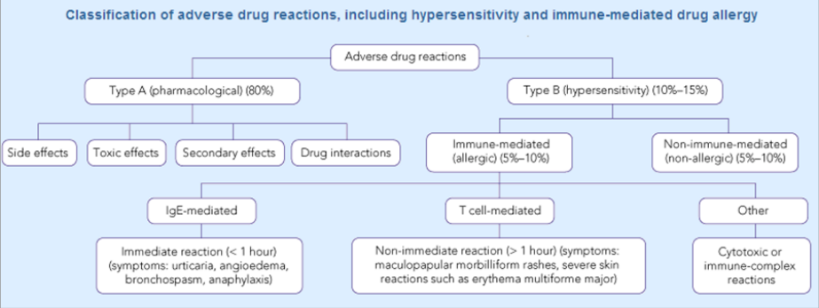
HSCIC Controlled Document

##### 1.2 Risks versus Events

This guidance will take the approach that an adverse drug reaction can be expressed in terms of an actual reaction event or in terms of a future risk to the patient. As will be shown later in the document, this is an important distinction, given that a patient can experience a reaction (event) without the clinician believing that the drug represents a serious future risk; or, conversely, the clinician may wish to record that the patient is at risk of adversely reacting to a given medication, even if the details of any past reaction are not known. For example, the patient may tell the clinician that they are allergic to penicillin, but are not able to recall any specific reaction event to justify this risk. The clinician may therefore wish to record this as a risk and not an event.

Obviously, the confusion of ‘risk’ and ‘reaction event’ at this point could be dangerous as future readers of the risk information could place undue confidence in the risk if they think that the clinician has witnessed a reaction in the patient.

Therefore, this guidance distinguishes between the risk of a future reaction and the event of past reaction, but acknowledges that these two sets of data are intimately linked and that this should be reflected in the user interface.

This notion is expressed in the _Representation in Electronic Patient Records of Allergic Reactions,_ _Adverse Reactions, and Intolerance of Pharmaceutical Products_ **{R5}**, in which it is argued that it is important to distinguish between these two kinds of ADR in the medical record: namely distinguishing discrete ADR ‘events’ and persisting ADR ‘conditions’. In this paper, the authors talk about “recording a clinician’s opinion about future risk of (or propensity to) an allergy or other ADR if the patient is exposed to a substance” **{R5}** . They also acknowledge the difficulties faced by interface developers in labelling the corresponding condition for an ADR event; they point out that the word “adversy” does not exist **{R5}** . For this reason, we refer to this condition as a ‘risk’ in this document.

A good example to demonstrate the need for a summary of ADR risks is the area on drug charts reserved for recording drugs which should be avoided, shown as ‘Drug Sensitivities’ in Figure 2:

Figure 2: Example of the 'ADR Risk' Area of an Existing Paper Drug Chart

Where possible, the ADR risks listed in this area must be based upon empirical evidence (such as the clinician witnessing a reaction). This area does not replace the need to write detailed examination notes about ADRs elsewhere in the record. Nor should the clinician be expected to write detailed notes about the ADRs on the drug chart, as this detailed information would obstruct the important medication information and may not be necessary on most occasions

This information relates to a 'risk' of reaction in the future. We can view it as a risk because:

- The relationship between the reaction and the drug is most often a likely probability,

rather than a certainty

- If a drug has caused a reaction in the past, this does not mean that it will necessarily

produce a similar reaction in the future

However, since beginning the development of this guidance, we have discovered that certain key groups of clinicians find the concept of ‘risk’ difficult to understand in the context of adverse drug reactions. Instead, they understood the notion of summarising past reactions. Therefore, we

Page 3

Copyright ©2013 Health and Social Care Information Centre

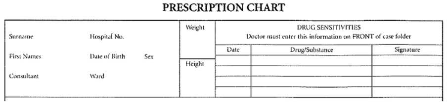
HSCIC Controlled Document

suggest that labelling in any user interface (UI) that is presented to the clinician employs the term ‘summary’. However, for the benefit of the readers of this guidance document, we shall still use the word ‘risk’ in order to distinguish it from the ADR ‘event’. This should make matters clearer to those responsible for ensuring that appropriate data is recorded during clinical noting.

Figure 3 shows an example of the ADR summary proposed:

Figure 3: Example of the ADR Summary

Therefore, to the clinician who is using the user interface, the overall list is called the **Adverse** **drug** **reaction summary** (or **Adverse drug reaction summary list** ), and each line in the list corresponds to an **Adverse drug reaction** that the list summarises. Accordingly, clinicians will be required to perform the action of adding an ADR to the summary. To the clinician, the ADR is still an ADR; it is just that they are summarising it for the purposes of warning other clinicians.

However, for the readers of the current guidance document, whereas the overall list is also called the **Adverse drug reaction summary**, each line in the list corresponds to an **Adverse drug** **reaction** **risk** .

Suppliers of clinical noting systems should ensure that the clinician not only records a detailed description of any ADR events that they witness the patient experiencing (for example, as part of examination notes) but also that the clinician records if they believe that the patient is at risk of suffering a future reaction if they take the drug again.

##### 1.3 Customer Need

Avoiding known adverse reactions to drugs is a well-recognised and important goal within the health industry. Communicating the risk of a drug to a specific patient is an important step in achieving this.

To achieve this communication, the user must be able to:

- Record that there is a risk of a medication causing an ADR in a patient, as part of a

summary of ADRs for that patient

- Record or link to justification for the ADR risk, where appropriate, which exists elsewhere in

the patient record and which includes the diagnosis of the ADRs, past reaction symptoms and medication administration or prescription events

- Record appropriate context and provenance data for the ADR risk, including date(s),

authorship and location

**Note**

Some of this recording may be automatic.

- Record that the patient has no known ADR risks

- Edit an existing ADR risk, including declassifying it as an active risk

These goals should be achieved whilst minimizing the amount of re-entry of past details by providing intuitive entry-points in the clinical noting process, whilst not interfering with the consultation process.

Page 4

Copyright ©2013 Health and Social Care Information Centre

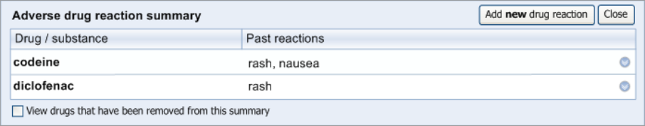
HSCIC Controlled Document

The ultimate aim is to prevent the administration of drugs known to be dangerous to a particular patient by ensuring that the clinicians are provided with sufficient information to:

- Identify the presence or confirm the positive absence of adverse drug reactions

- Determine the previous outcomes (including reaction) of the drug being administered

- Form an opinion on future outcomes if the drug is again administered

##### 1.4 Scope

###### 1.4.1 In Scope

Adding new ADR risks to the ADR summary

Editing existing ADR risks within the ADR summary

Removing existing ADR risks within the ADR summary

The guidelines in this section cover when the clinician wishes to add a new drug risk (for a particular patient) to the adverse drug reaction summary.

This will typically occur when the clinician feels that they have seen or heard sufficient evidence to conclude that the patient is at risk of suffering an adverse reaction if they take a certain drug in future. This evidence may take the form of a patient testimony, a testimony from a third party or an account in existing clinical documentation, such as a referral letter. Additionally, it may be that the clinician has examined the patient and has concluded that they have suffered an ADR.

The guidelines in this section cover when the clinician wishes to edit details of an existing ADR in the summary.

The guidelines in this section cover when the clinician wishes to remove an existing ADR from the summary. This section covers any warning messages that are required and how to allow the clinician to view risks that have been removed from the summary list in the past.

The warning messages would also communicate to the clinician that by removing the ADR risk from the summary they are not removing any corresponding notes from the rest of the patient record.

Recording ‘No known ADRs’ The guidelines in this section cover how to allow the clinician to record where they have checked the patient’s ADR status and are confident that the patient has no known ADRs.

Table 1: In Scope

###### 1.4.2 Out of Scope

If the clinician examining the patient has noticed relevant symptoms and is diagnosing the patient as having experienced an ADR, he or she is expected to make detailed notes about this reaction event and the events leading up to it, as noted in _Adverse Drug Reactions: Types and Treatment_ _Options_ **{R4}** . The clinician would be expected to note all prescription and non-prescription drugs taken prior to the reaction, including dates of administration and dosage. The clinician must also document in detail the physical examination of the patient, focusing in on the reaction symptoms, which may include a detailed skin examination as the skin is the organ most frequently and prominently affected by adverse drug reactions **{R4}** . The execution of this detailed noting is assumed, but is **not** addressed by the current guidance.

Page 5

Copyright ©2013 Health and Social Care Information Centre

HSCIC Controlled Document

Detailed documentation of adverse drug reaction events

How to communicate the link between supporting notes and ADR risk during input

Browsing up and down a terminology hierarchy structure, in order to define either the causative agent or a reaction type

How to trigger an automatic ADR entry dialog

Automatic linking between risk and supporting notes (and vice versa)

Manual linking between risk and supporting notes

Inputting dates, including distinguishing between recorded, reported and actual dates

The current guidelines have been developed on the assumption that, in the event that a clinician witnesses an ADR, they enter detailed examination notes in the record. However, the **current guidelines do not cover the entry of such notes** .

The assumption is that in addition to the detailed notes, the clinician should also record a summary of the ADR in a highly accessible and visible area of the record, which communicates that the patient is **at risk** of reacting to the drug if administered in future.

The current guidelines **only** cover the recording of this summary, or risk, of the ADR.

The current guidelines have been developed on the assumption that, within the ADR summary list, there will be links to any detailed examination notes and/or any other relevant data, such as details of past drug administration or diagnoses of ADRs.

However, the current guidelines do not cover how to create nor present these links.

In order to assist the clinician in finding the drug or substance name that they seek in attempting to define the ADR's causative agent, the UI could allow the clinician to browse the terminology hierarchy structure. For example, they could enter 'penicillin' and browse down to specific instances of penicillin, such as 'amoxicillin'.

However, this feature is not covered by the current guidance. But, for a fuller discussion of how this may be achieved, refer to the CUI _Design Guide Entry – Terminology – Matching_ **{R6}** .

The current guidelines cover some aspects of the UI that could enable the clinician to quickly and easily add an entry to the ADR summary list if they have just entered:

 Notes about an examination of ADR symptoms

 A diagnosis of an ADR

However, the current guidelines do not cover how the UI identifies that the clinician has entered information about an ADR nor the criteria for triggering an 'add to summary' prompt.

If the UI can identify where notes about an ADR event have been entered, and can automatically prompt the user to enter the corresponding risk, it can ensure that these two types of note can be linked together automatically. This would facilitate the clinician's accessing of the detailed notes from the ADR summary.

However, the current guidelines do not cover the process or the UI that would be involved in creating such links. Equally, the guidelines do not cover how much of the detailed notes are linked to the risk in the summary.

The current guidelines also assume that, in future, it will be possible for the clinician to manually link entries in the ADR summary to entries elsewhere in the patient record that document symptoms or diagnoses relating to the corresponding ADR event.

However, the current guidelines do not cover the process or the UI that would be involved in allowing the clinician to create such links.

The current guidelines outline a UI whereby ADRs are described in a fairly abstract and high-level manner; that is to say, the ADR is described as a risk that is not limited by date or time. This is in contrast to descriptions of the corresponding ADR events (namely occasions when the patient has actually reacted to the drug) that are firmly linked to a specific date and time (and place).

Although the clinician may add some dates to the summary as part of their justification (which is captured in free text), they are not required to enter dates in a structured manner. The system may automatically capture the date and time when the clinician records the risk, but the main purpose of this is for data organisation and audit and this does not need to be visible to the clinician at the point of entering the risk.

Therefore, the current guidelines do not cover when the clinician should input dates. However, for guidance on how to enter dates please refer to CUI _Design Guide Entry – Date_ _Display_ **{R7}**

Page 6

Copyright ©2013 Health and Social Care Information Centre

HSCIC Controlled Document

How to automatically extract reaction keywords from free text

Moving links to a supporting note between risks

Table 2: Out of Scope

##### 1.5 Assumptions

As part of the design work, the guidance authors considered solutions whereby the clinician could type in text freely and the UI would identify word matches with the clinical terminology and would then provide a mechanism by which the clinician could encode these words.

However, as this natural language parsing technology is still fairly immature and largely unavailable to suppliers of health technology, the current guidelines do not cover such a solution as the primary entry mechanism.

If links exist between an ADR risk entry (in the summary) and the detailed notes which support it, there may be a need for the clinician to be able to transfer links between risks. For example, following the attribution of a rash to an ADR to penicillin, subsequent evidence suggests that the rash was more likely in response to them taking diclofenac. In this case, the clinician may want to transfer the linked rash event from the penicillin risk to the diclofenac risk.

However, the current guidelines do not cover how the clinician can transfer links.

**A1** The structured terminology used for this guidance will be SNOMED CT [®] and the Dictionary of Medicines and Devices (dm+d).

**Note**

This approach has been taken in line with the NHS Connecting for Health position (see _SNOMED CT – the_ _language of the NHS Care Records Service_ **{R8})** . However, the requirement that clinical information technology (IT) suppliers must use SNOMED CT is not one endorsed by Microsoft [®].

**A2** Appropriate subsets within SNOMED CT and dm+d are available.

**A3** The user interface design should follow the agreed NHS CFH position on the structure of ADR notes **{R5}**, unless there are patient safety reasons not to do so.

**A4** The application will be able to recognise that the encoded terms 'allergy to penicillin' and 'intolerance to penicillin' are subtypes of 'propensity to adverse reaction to penicillin'.

**A5** The National Programme for Information Technology (NPfIT) Standards Consulting Group (SCG) messaging regarding allergies and ADRs is the assumed messaging standard for this guidance (see _SCG Guidance on the Representation of_ _Allergies and Adverse Reaction Information Using NHS Message Templates_ **{R9})** . Therefore, we intend that the Summary Care Record application will be consistent with this guidance [1].

**A6** This guidance applies to PC-screen-based applications that allow dynamically changing screen views, linked into a database. It does not apply to mobile devices, electronic paper or voice-recognition software although some of the principles that apply in the current guidance could also apply to applications delivered by those types of mechanism.

**A7** This guidance applies (although not exclusively) to server-based applications delivered over a network (for example, over the Internet).

Table 3: Assumptions

1 NHS Connecting for Health: NHS Care Records Service **{R10}** : [Summary Care Record](http://www.nhscarerecords.nhs.uk/)

Page 7

Copyright ©2013 Health and Social Care Information Centre

HSCIC Controlled Document

##### 1.6 Dependencies

**D1** The availability of appropriate data sets, for example, SNOMED CT subsets

**D2** The following CUI guidance documents. Changes in these documents may affect the current guidance:

 Display of Adverse Drug Reaction Risks – User Interface Design Guidance

 Design Guide Entry – Terminology – Matching

 Design Guide Entry – Terminology – Post Coordination

 Design Guide Entry – Terminology – Elaboration

 Design Guide Entry – Terminology – Display Standards for Coded Information

 Design Guide Entry – Date Display

 Medications Management – Medication Line – User Interface Design Guidance

 Displaying Graphs and Tables – User Interface Design Guidance

**D3** Certain guidelines are dependent upon the fact that the medication terminology used contains the same length terms as the current version of the dm+d

Table 4: Dependencies

Page 8

Copyright ©2013 Health and Social Care Information Centre

HSCIC Controlled Document

#### 2 GUIDANCE OVERVIEW

##### 2.1 Visual Summary of the Guidance

This section provides an overview of the main design elements that are referenced in the guidance. Figure 4 outlines the key elements that comprise the main entry dialog:

Figure 4: Key Elements in the Main Entry Dialog

Table 5 provides excerpts of the guidance illustrations and identifies where in the guidance they are found:

3.2.1 Initiating the Addition of a New Adverse Drug Reaction Risk

3.2.2 Dialog for Adverse Drug Reaction Risk Entry

Page 9

Copyright ©2013 Health and Social Care Information Centre

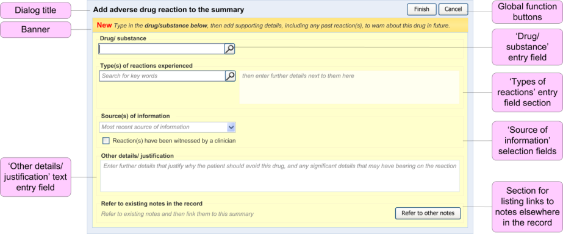

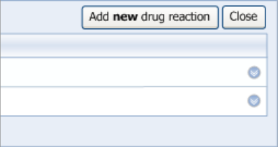

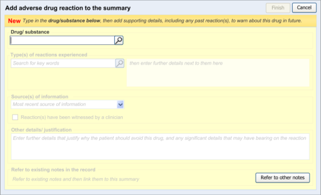
HSCIC Controlled Document

3.2.3 Displaying Existing Reaction Risks

3.2.4 Entry Field Ordering and Tabbing

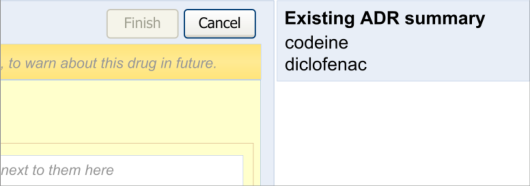

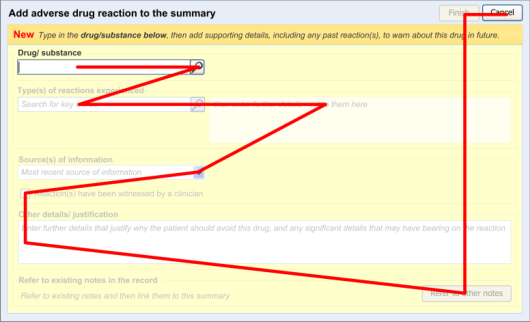

3.2.5 Entering the Causative Agent

3.2.6 Entering Reaction Types

3.2.7 Elaborating the Encoded Reaction Type Keywords

3.2.8 Adding Further Details and Justification

3.2.9 Specifying the Source of Information

|AppTedeydnnpiiteicci(oisil nl)lii annol f (t (erccexllaatacsstsiso))ns experienced|Col2|
|---|---|
|Search penicillin |G |

Page 10

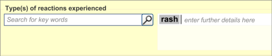

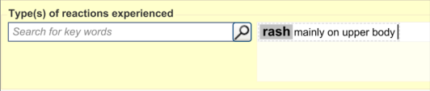

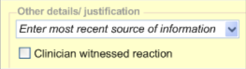

Copyright ©2013 Health and Social Care Information Centre

HSCIC Controlled Document

3.2.10 Displaying ADR Risk Details for the Clinician to Confirm

3.2.11 Warning About Duplicating Risks in the Summary

3.2.12 Feedback Upon Adding, Editing or Removing a Risk

4.2 Guidelines – Removing an Adverse Drug Reaction Risk

5.2 Guidelines – Recording ‘No Known Adverse Drug Reactions’

6.2 Guidelines – Editing an Adverse Drug Reaction Risk

Table 5: Overview of the Structure of the Adverse Drug Reaction Risk Display

##### 2.2 Clinical Statement Modelling

The user interface implied by the guidance in this document is intended to fulfil two purposes:

- Assist the clinician in creating a set of associated electronic clinical statements

- Provide an early exemplar for creating such clinical statements

The current guidance applies the following definition of a clinical statement: “an expression of a discrete item of clinical (or clinically related) information that is recorded because of its relevance to the care of a patient” (see _HL7UK NPfIT Presentation_ **{R11}).**

Page 11

Copyright ©2013 Health and Social Care Information Centre

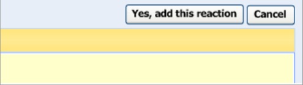

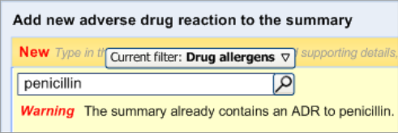

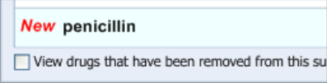

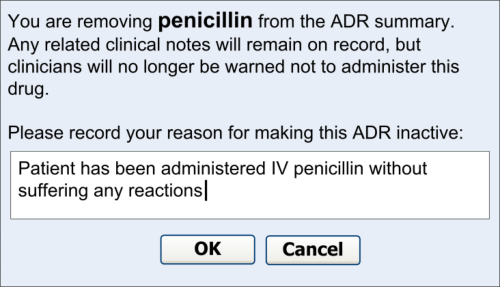

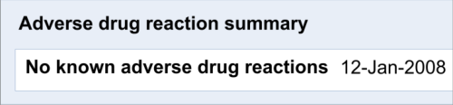

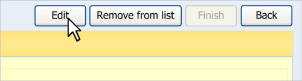
HSCIC Controlled Document

A fundamental assumption behind this guidance is that an electronic health record, which itself must support many diverse care processes, can be modelled as clinical statements. A detailed look at the various factors that contribute to this clinical statement model is beyond the current guidance, but is dealt with in more depth in a recent NHS CFH publication, _SCG Guidance on the_ _Representation of Allergies and Adverse Reaction Information using NHS Message_ _Templates_ **{R9}** .

The structure of clinical statement modelling is outlined further in the _NPfIT Clinical Statement_ _Message Pattern_ **{R12}**, which is itself based in part upon Health Language Seven (HL7) v3 messaging rules (see _HL7 delivers healthcare interoperability standards_ _[2]_ **)** . The current guidance expects that clinical user interfaces that enable the recording of ADR risks should allow them to be recorded in a way that is consistent with this clinical statement message pattern **{R12**, **R14}** .

The approach outlined in this NHS CFH publication defines clinical statements as the smallest piece of clinical data that has clinical meaning irrespective of the document or application in which it is displayed. To this end, each clinical statement must have embedded within it the entire ‘context of use’. For example, a ‘family history’ statement of ‘asthma’ contains the context of ‘family history of asthma’ and not just asthma. In this way, statements can be rearranged under different headings and within different clinical contexts and still convey a consistent, accurate meaning.

Within the context of ADR summaries, this guidance considers the following to be the main clinical statements:

- The ‘risk’ statement (for example, ‘Patient has a risk of adversely reacting to penicillin’):

 In order to be meaningful alone, this statement must also have at least one date

associated with it (such as the date of entry, an author or the source of the information [3] )

 This statement may contain additional information relating to the justification for

recording the risk

 Associated with this will be one or more ‘type of reaction’ statements and a number of

statements relating to clinical events (such as high level descriptions of the adverse reaction events).

- The ‘type of reaction’ statement (for example, ‘Patient has had a rash’):

 This statement may contain additional information relating to the quality of the

reaction (such as its severity)

 In order to be meaningful alone, this statement must also have at least one date

associated with it (such as the date of entry, an author or the source of the information). As the emphasis is not so much on the specific details of past occurrences, but rather on what has happened in the past that could potentially happen in future, the date could be the date of entry as distinct to the date of the actual event

Therefore, throughout this document, the guidance will refer to the capture of such clinical statements.

2 Health Language Seven UK: HL7 delivers healthcare interoperability standards **{R13}** [: http://www.hl7.org.uk/](mailto:mscui@microsoft.com)

3 This requirement for clinical statement content is derived in part from the NHS CFH SCG _Guidance on the Representation_ _of Allergies and Adverse Reaction Information Using NHS Message Templates_ **{R9}**

Page 12

Copyright ©2013 Health and Social Care Information Centre

HSCIC Controlled Document

#### 3 ADDING A NEW ADVERSE DRUG REACTION RISK

The guidelines in this section cover when the clinician wishes to add a new drug risk to the adverse drug reaction summary.

This will typically occur when the clinician feels that they have seen or heard sufficient evidence to conclude that the patient is at risk of suffering an adverse reaction if they take a certain drug in future. This evidence may take the form of a patient testimony, a testimony from a third party or an account in existing clinical documentation, such as a referral letter. Additionally, it may be that the clinician has examined the patient and has concluded that they have suffered an ADR. However, in addition to this detailed noting, the clinician would also be expected to add the drug to a high-level ADR summary so that future prescribers and administrators can be made aware of this risk, without having to read through pages of detailed notes. The clinician is effectively creating a clinical statement about the future risk to the patient of taking the drug, in addition to clinical statements about the events surrounding past reactions (that should be documented elsewhere in the record).

As far as is safely possible, and where it is technically feasible, the application should reduce the amount of duplicate information that the clinician must enter into the summary; it would be frustrating for clinician to have to retype part of their notes into the summary. To this end, the guidance covers when the system partly automates the summarisation of the detailed event notes.

However, the clinician must be aware of what they are entering into the ADR summary as this is the information that will be first viewed by future prescribers; in many cases, clinicians may not read beyond the summary.

Figure 5 shows the dialog flow for the process of adding a new ADR:

Figure 5: Screen Flow for ADR Entry

Page 13

Copyright ©2013 Health and Social Care Information Centre

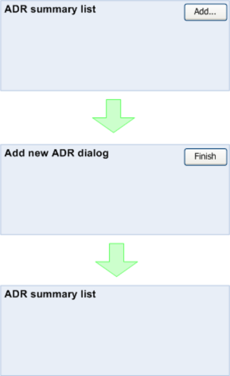
HSCIC Controlled Document

The clinician views the ADR summary list then activates a control to launch the dialog in which he or she can enter the new ADR risk. After finishing entering the necessary risk data, the clinician activates a control for finishing the adding process, which has the effect of navigating back to the ADR summary list.

##### 3.1 Principles

The following key principles inform the guidance in this section:

- The clinician may need to add a new adverse drug reaction risk to the summary at the

point of viewing the existing summary

- The clinician will need to check the existing adverse drug reaction summary before adding

a new risk to the summary

- Clinicians work in time-pressured environments and may need to trade-off detailed

reading and entry of notes against speed and efficiency

The following user interface design principles inform the guidance in this section:

- Directness: provide direct and intuitive ways for the user to accomplish their tasks

- Control: the user must control the interaction (actions should result from explicit user

requests)

- Phrasing of menu items: use familiar and consistent terminology, ensure that items are

distinct from one another, use consistent and concise phrasing, position the key words to the left of the text string

Page 14

Copyright ©2013 Health and Social Care Information Centre

HSCIC Controlled Document

##### 3.2 Guidelines – Adding a New Adverse Drug Reaction Risk

###### 3.2.1 Initiating the Addition of a New Adverse Drug Reaction Risk

This guidance covers the action of initiating the 'add new reaction' dialog.

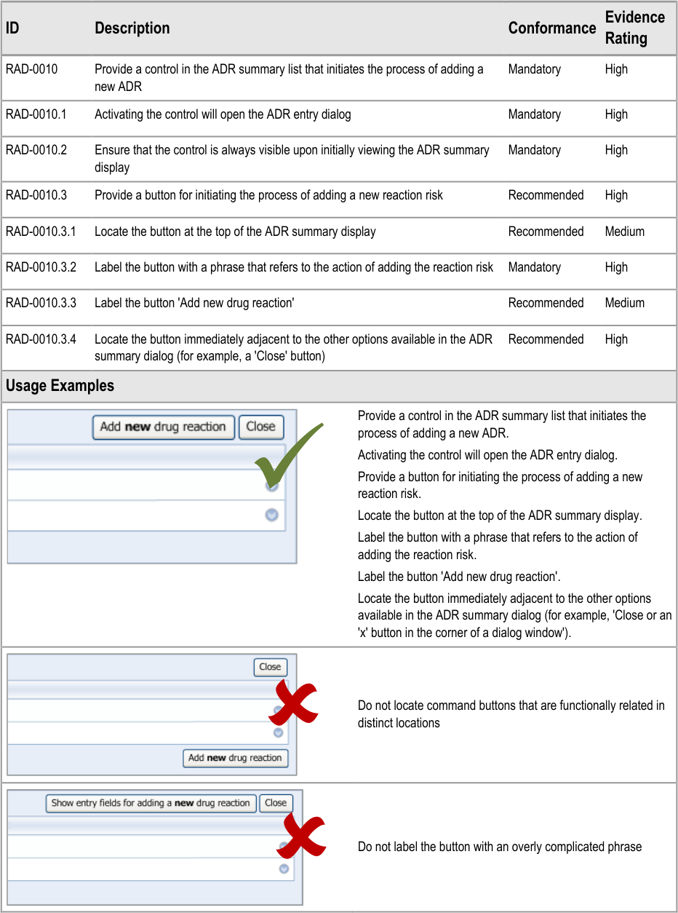

Page 15

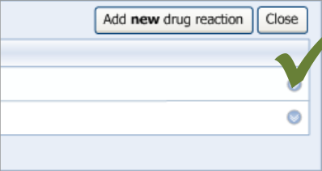

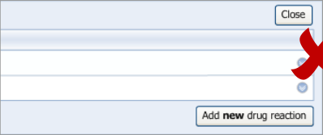

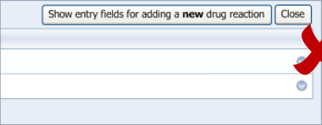

Copyright ©2013 Health and Social Care Information Centre

HSCIC Controlled Document

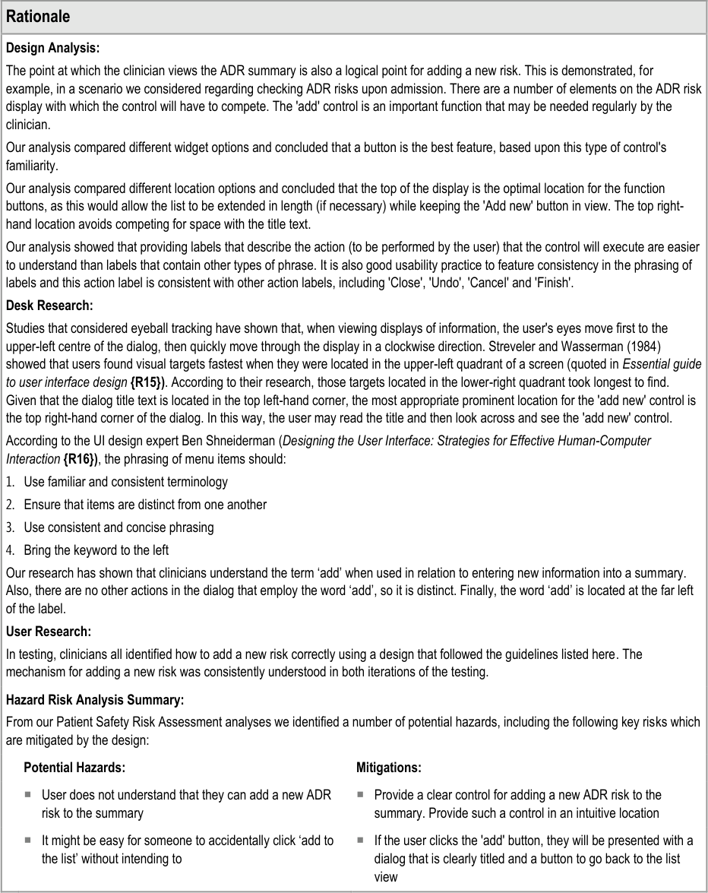

Page 16

Copyright ©2013 Health and Social Care Information Centre

HSCIC Controlled Document

###### 3.2.2 Dialog for Adverse Drug Reaction Risk Entry

This guidance covers the layout and labelling of the dialog that contains the entry fields necessary for the clinician to enter the new reaction risk. It also outlines the main screen elements that are to be contained within this dialog.

It is worth emphasising that the term 'dialog' does not necessarily imply a pop-up modal window. In the current guidance, 'dialog' could refer to a discrete set of screen elements within a given section of a page. We are also assuming that, owing to an expected constraint on screen space, the 'ADR summary list' and the 'ADR risk entry' dialogs would not be both visible at the same time. However, if space is not constrained, there would be no reason why they should not be visible at the same time.

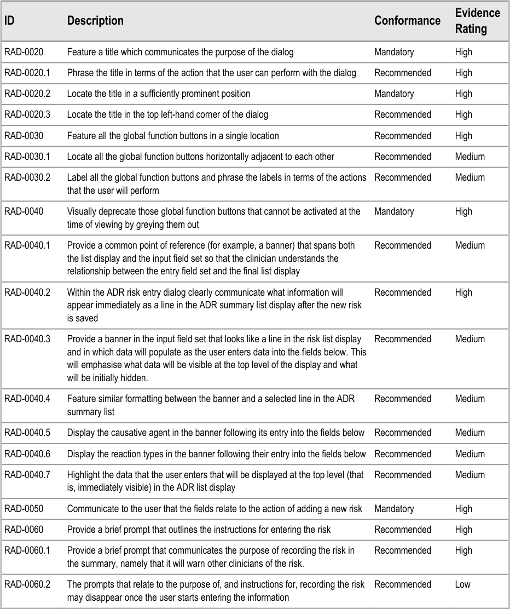

Page 17

Copyright ©2013 Health and Social Care Information Centre

HSCIC Controlled Document

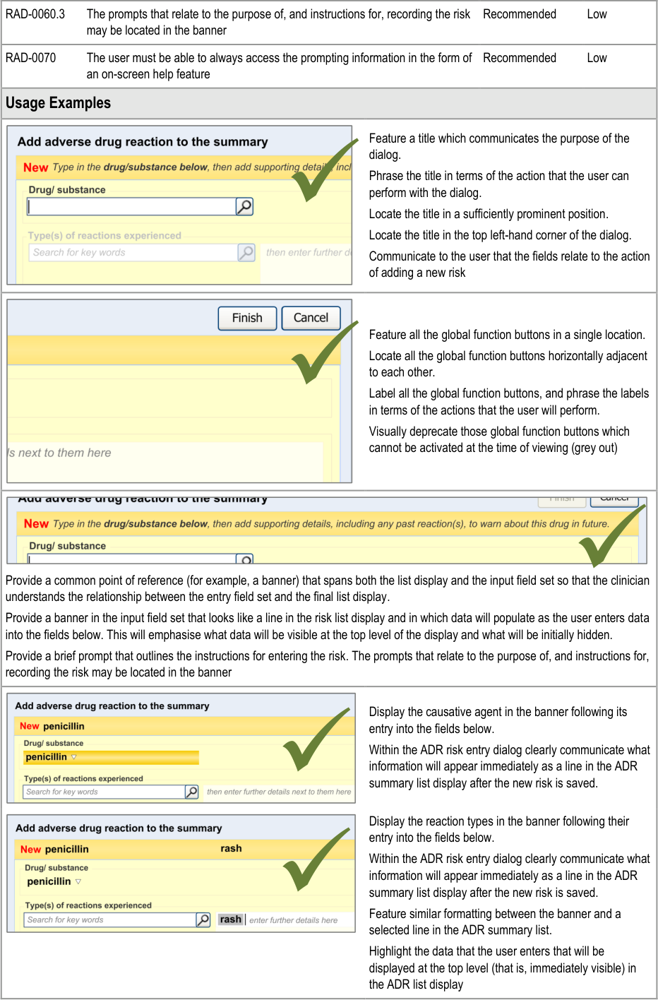

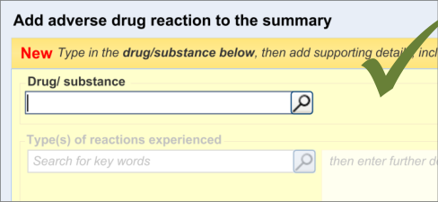

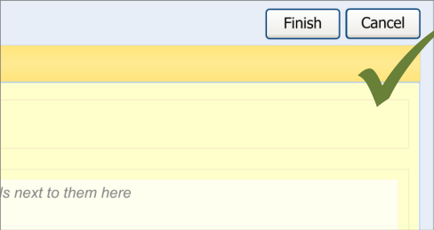

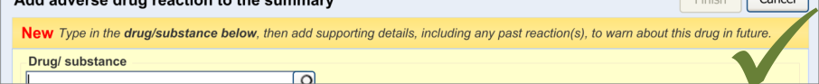

Page 18

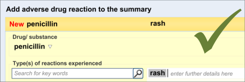

Copyright ©2013 Health and Social Care Information Centre

HSCIC Controlled Document

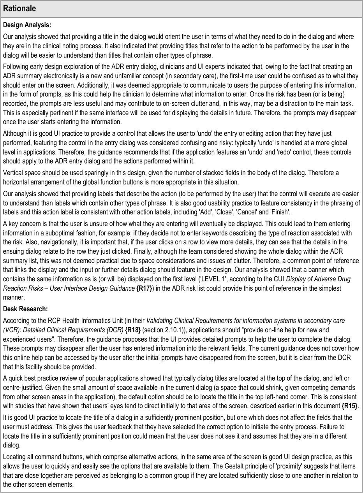

Page 19

Copyright ©2013 Health and Social Care Information Centre

HSCIC Controlled Document

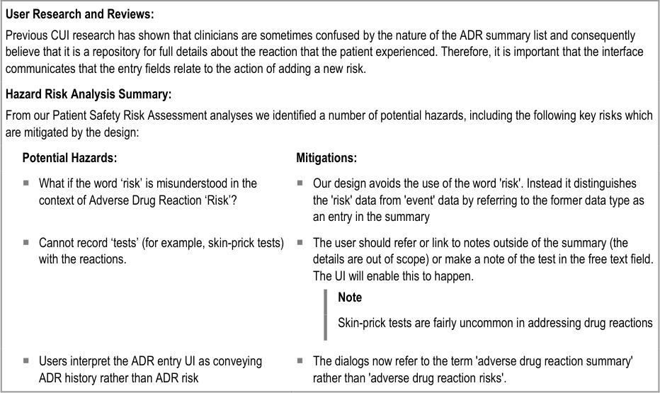

Page 20

Copyright ©2013 Health and Social Care Information Centre

HSCIC Controlled Document

###### 3.2.3 Displaying Existing Reaction Risks

It is important that the clinician can see the salient information from the existing ADR risk statements (namely the causative agents) before and during the entry of a new ADR risk, as knowledge of these other risks may influence how the clinician expresses the new risk. For example, if the clinician was entering an ADR to ampicillin, and they noticed that the patient has an existing ADR risk to flucloxacillin, they may decide to record a risk to Penicillins (the class of drug), taking care to justify this risk entry and refer to both the ampicillin and flucloxacillin in the associated justification field.

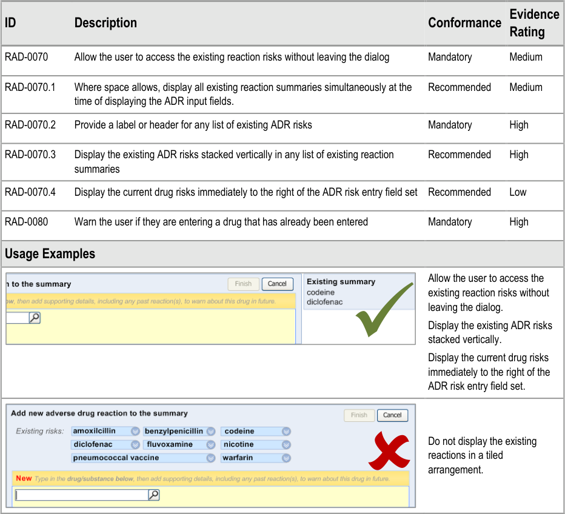

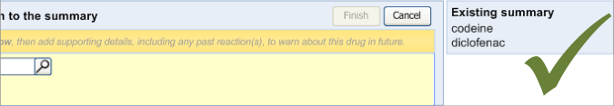

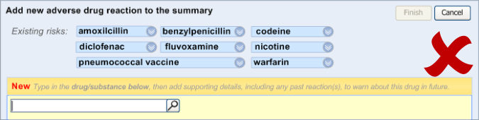

Page 21

Copyright ©2013 Health and Social Care Information Centre

HSCIC Controlled Document

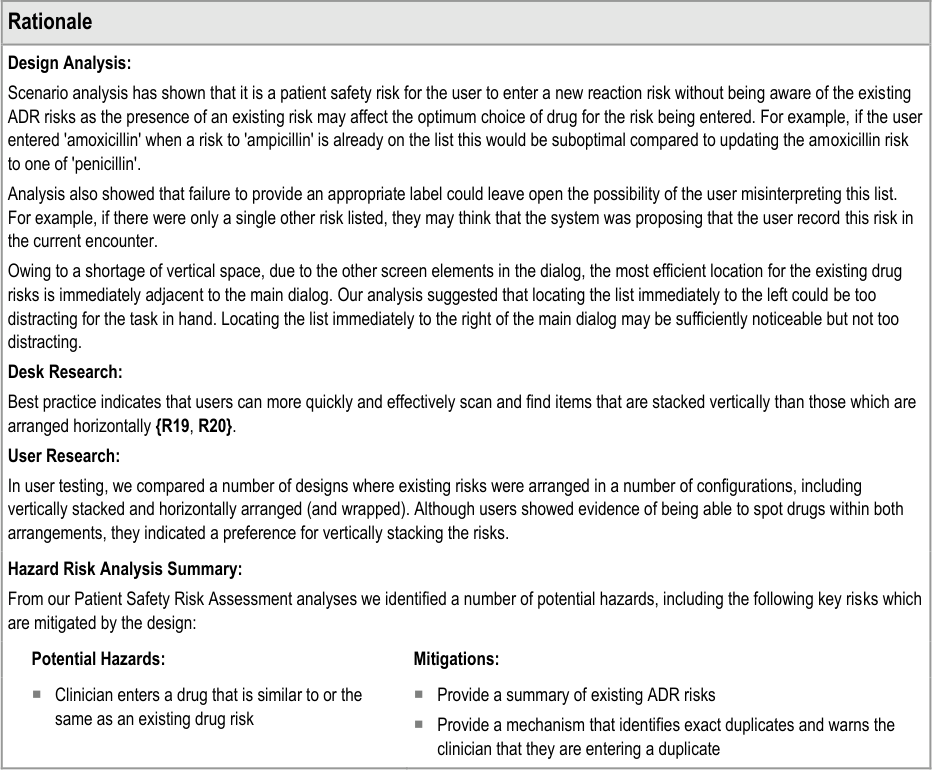

Page 22

Copyright ©2013 Health and Social Care Information Centre

HSCIC Controlled Document

###### 3.2.4 Entry Field Ordering and Tabbing

The order in which the entry fields are visually arranged, and the order in which the focus navigates through the action of keyboard tabbing, is important as it can influence whether fields are completed or not. Accordingly, this section of the guidance describes how the ordering and tabbing should be arranged to reduce such errors.

|Col1|Evidence ID Description Conformance Rating|
|---|---|
||RAD-0090 Disable all fields, except for the causative agent, until the causative agent field has been completed. Recommended High|
||RAD-0100 After the causative agent field has been completed, enable the remaining fields Recommended High|
||RAD-0110 If the user has entered data into the causative agent field, plus any other fields, and then removes the data in the causative agent field, the user must be warned that, without a causative agent, the risk will not be saved and, accordingly, will not be displayed in the list Mandatory Medium|
||RAD-0120 Automatically move the focus into the causative agent field upon opening the dialog Recommended High|
||RAD-0130 If the causative agent field is not completed, the tab order takes the user to the 'Cancel' button (that is, the point of exit from dialog) Recommended Medium|
||RAD-0140 After the user has entered a causative agent, the system must provide a control that allows the user to leave the dialog with the risk retained by the system and/or committed to the record. Mandatory High|
||RAD-0150 Feature a consistent and logical tabbing order that is reflected in the left-to-right, top-to-bottom visual ordering Mandatory High|
||RAD-0150.1 The tabbing order will follow the order of priority: causative agent, reaction types, source of information, ‘clinician witness reaction’ and then justifications and detail_s _ Recommended High|
||**Usage Examples**|
|| Disable all fields, except for the causative agent, until the causative agent field has been completed. |

Page 23

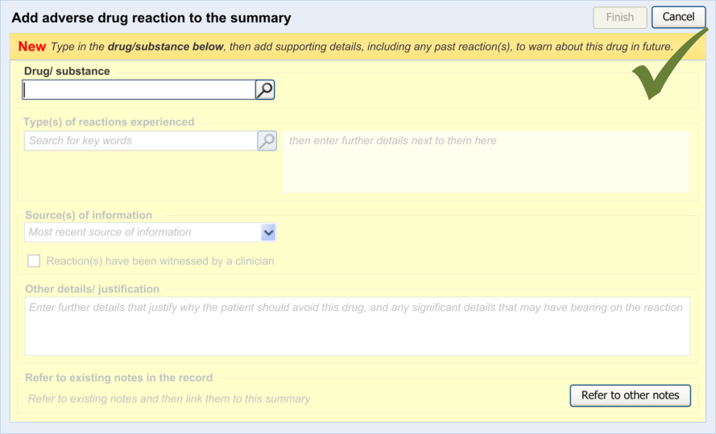

Copyright ©2013 Health and Social Care Information Centre

HSCIC Controlled Document

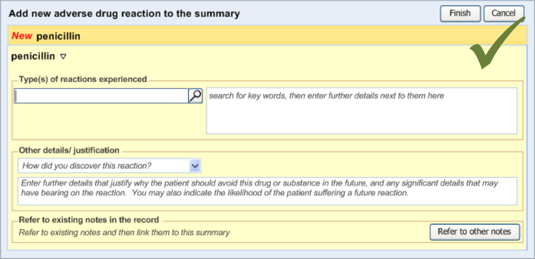

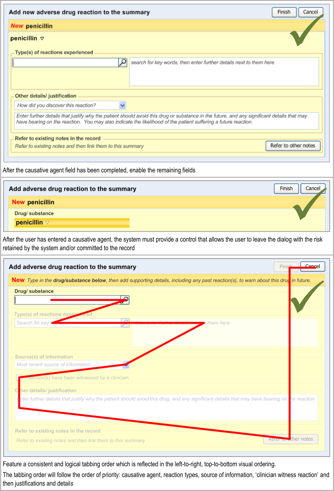

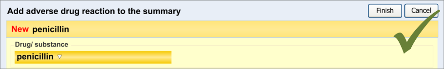

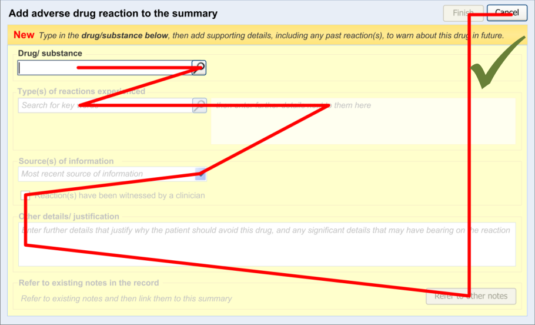

Page 24

Copyright ©2013 Health and Social Care Information Centre

HSCIC Controlled Document

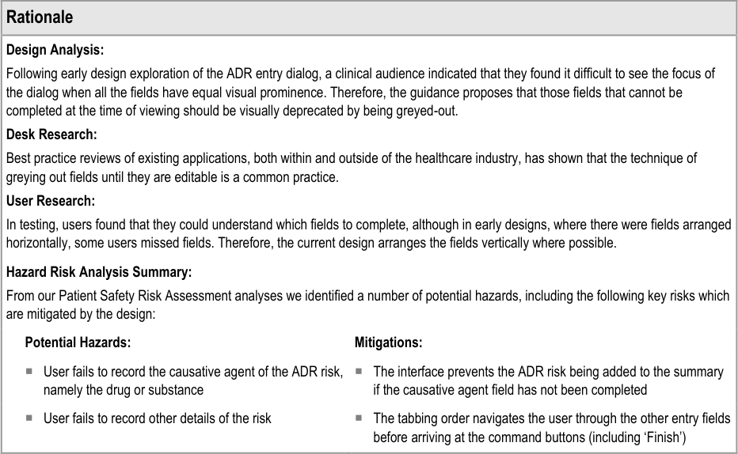

Page 25

Copyright ©2013 Health and Social Care Information Centre

HSCIC Controlled Document

###### 3.2.5 Entering the Causative Agent

This section of the guidance covers the action of entering the causative agent of the ADR risk, namely the drug or substance that is believed to provoke a reaction in the patient. The illustrations in this section largely feature design aspects that are currently being explored (further details of these design aspects can be found in section A.2).

This section only covers those guidelines that are specific to the recording of an ADR causative agent and does not cover more general design aspects, which are currently undergoing exploration. The reader is advised to refer to section A.2 and to the CUI _Design Guide Entry –_ _Terminology – Matching_ guidance **{R6}** .

The user is expected to type in all or part of the name of the drug that they believe provokes ADRs in the patient. The system then returns a list of matched drug names. The trigger for the return of the matches can be automatic (‘progressively’ matching terms as the user types in letters) or it can be user-triggered (either by clicking a button or ‘Enter’). The user then selects one of the matched terms.

This causative agent term will be automatically ‘post-coordinated’ with the concepts ‘propensity to adverse reactions to drug’ (SNOMED CT ID 419511003), or ‘propensity to adverse reactions to substance ’, if the causative agent term is identified to fall within a non-drug subset. These concepts will be connected by the attribute concept ‘has causative agent’ (SNOMED CT ID
246075003) [4]. This is consistent with the relevant SCG guidance **{R9}** .

In addition to the user explicitly entering the causative agent, the system will also automatically record the time and date of the entry and the author who entered it (from their login credentials). This information will combine with the causative agent and the source and justification free-text data to constitute the ADR risk statement.

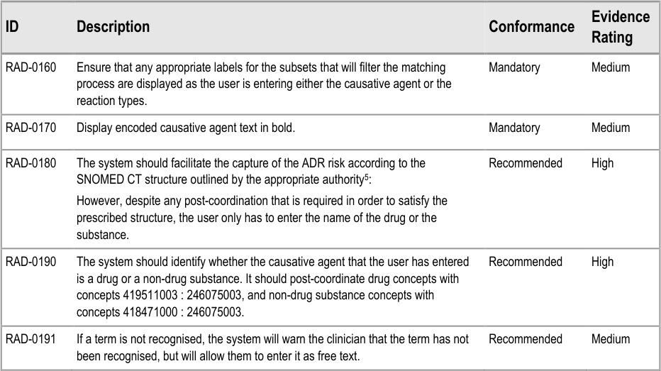

4 Further details about SNOMED CT post-coordination can be found in the _SNOMED Clinical Terms User Guide_ **{R21}** or in the CUI _Design Guide Entry – Terminology – Post Coordination_ **{R22}**

5 Note: this guideline is predicated on the assumption that the application is using SNOMED CT as the terminology for recording the ADR risk. If other terminologies are used instead or in conjunction with SNOMED CT this guideline may not hold true.

Page 26

Copyright ©2013 Health and Social Care Information Centre

HSCIC Controlled Document

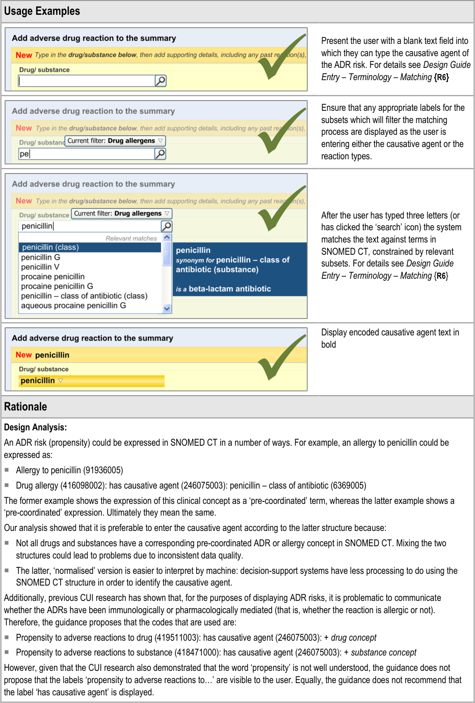

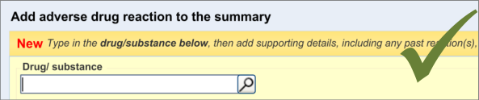

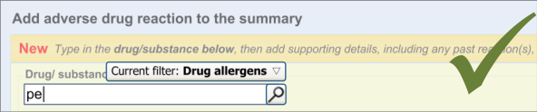

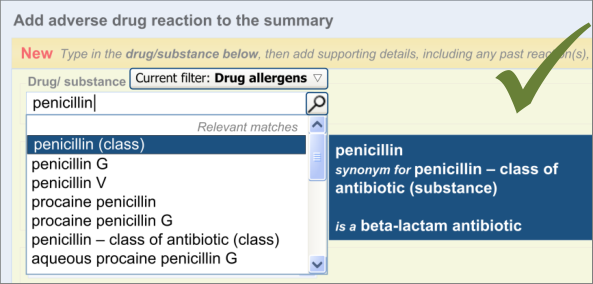

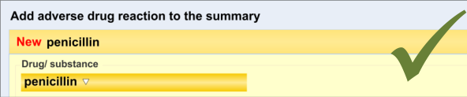

Page 27

Copyright ©2013 Health and Social Care Information Centre

HSCIC Controlled Document

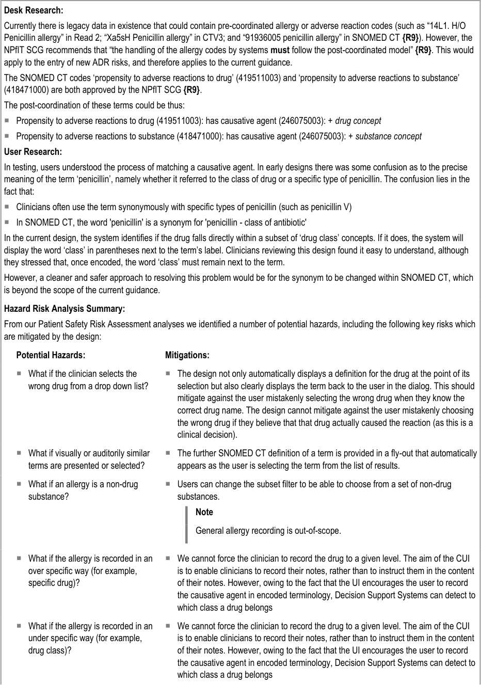

Page 28

Copyright ©2013 Health and Social Care Information Centre

HSCIC Controlled Document

 What if the clinician does not

recognise the generic drug from a drug brand name (or vice-versa)?

 What if a term is misspelled and not

recognised?

 Our design allows the clinician to enter a drug brand name, although it encourages

users to enter the generic name, if known. The default subset does not include trade family names (brand names), but the user can expand the subset range to include them.

 The drug names and reaction types are to be encoded. We are recommending partial

word matching or pre-fix matching to allow misspelled terms to be recognized. Also, if an application has the capability for progressive matching, this feature could help the user to get to the correct spelling.

 What if a term is not recognised?  If a term is not recognised, the system will still allow the user to enter it. The system

will warn the clinician that the term has not been recognised, but will allow them to enter it as free text.

 Singular and plural for penicillin have

different implications

 Readers want to navigate to more

details of specific reactions

 Although in our design, if a drug term refers to a drug class, the word 'class' is

displayed in brackets next to the term's label, we would recommend that this issue is solved by changing the terminology (SNOMED CT) in order that the synonym for 'penicillin - class of antibiotic' features the word 'class' in it or is removed.

 The design will allow readers to navigate to details of specific reactions, if such

details have been linked to the summary.

Page 29

Copyright ©2013 Health and Social Care Information Centre

HSCIC Controlled Document

###### 3.2.6 Entering Reaction Types

This section of the guidance covers the action of entering the types of adverse reaction that have been provoked in the patient after taking the drug or substance. It is worth emphasising that the clinician is only expected to enter brief details of the types of reaction that the patient has suffered, rather than providing a detailed account of an examination of the patient. Detailed notes of the reaction event(s) suffered by the patient will have been fully documented when the reaction occurred, and are likely to be elsewhere the patient’s record, but not in the ADR summary list. Instead, the clinician is expected to summarise the most significant reactions, ideally as single words or phrases.

The illustrations in this section largely feature design aspects that are currently being explored (further details of these design aspects can be found in section A.3. This section only covers those guidelines that are specific to the recording of types of adverse reaction and will not cover guidelines for general terminology encoding, for which the reader is advised to refer to APPENDIX A and to the CUI _Terminology – Matching_ guidance **{R6}** .

The clinician is expected to enter each reaction type in the same way as for the causative agent, except that, when the clinician selects a reaction type, the encoded term is displayed in the text box to the right of the search field and the search field becomes blank. At this point, the clinician may tab to the text field in order to add additional text to the encoded term or may enter an additional reaction type. In this way, the clinician may enter several types of reaction that the patient has suffered in response to taking the drug.

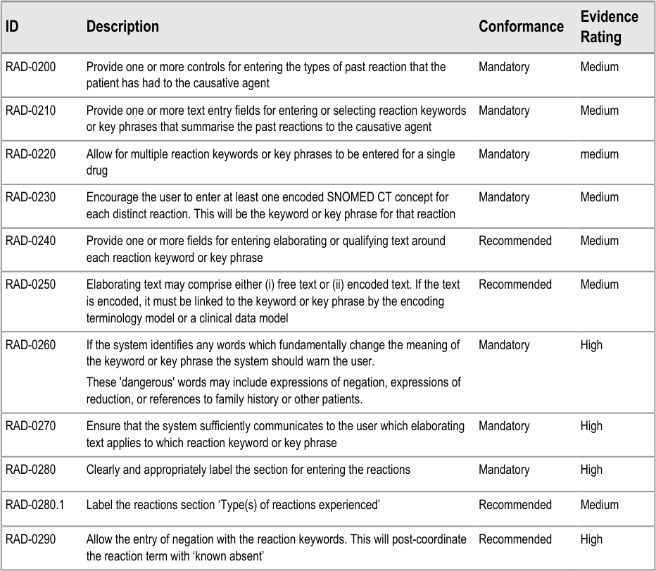

Page 30

Copyright ©2013 Health and Social Care Information Centre

HSCIC Controlled Document

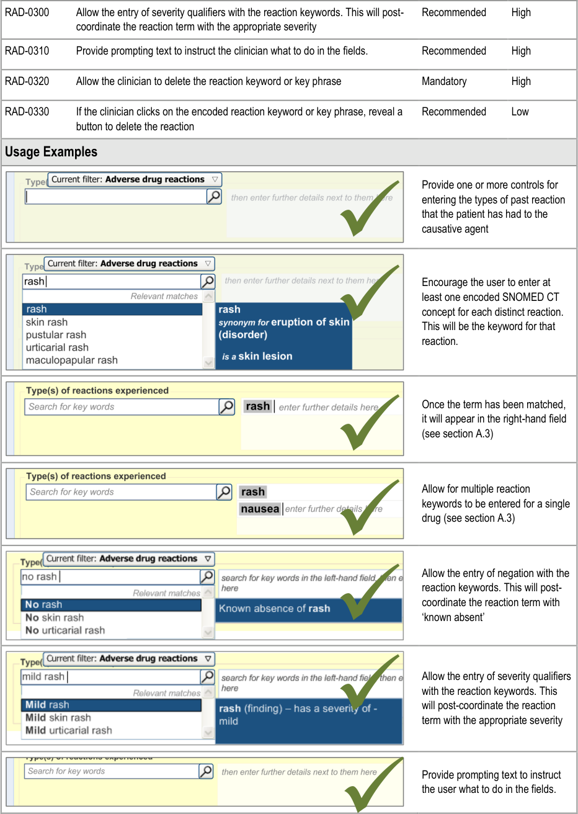

Page 31


Copyright ©2013 Health and Social Care Information Centre

HSCIC Controlled Document


Page 32

Copyright ©2013 Health and Social Care Information Centre

HSCIC Controlled Document

###### 3.2.7 Elaborating the Encoded Reaction Type Keywords

This section of the guidance covers the action of entering additional information to an encoded reaction type term. For example, the clinician may want to add some additional description to the reaction, which they feel is significant enough to include in the summary.

This text would be packaged up with the keyword to which it relates to form a clinical statement. Therefore, it is imperative that the UI clearly shows which text belongs with which keyword.

The general mechanism for this ‘elaboration’ action is being covered in more detail in ongoing design work (see section A.3 **)** and, in part, by the CUI _Design Guide Entry – Terminology –_ _Elaboration_ **{R24}** document.


6 This follows the CUI _Design Guide Entry – Terminology – Elaboration_ **{R16}** document.

Page 33


Copyright ©2013 Health and Social Care Information Centre

HSCIC Controlled Document


Page 34

Copyright ©2013 Health and Social Care Information Centre

HSCIC Controlled Document

###### 3.2.8 Adding Further Details and Justification

This section of the guidance covers the action of entering additional free text that (further) justifies the clinician’s belief that the drug or substance constitutes a significant risk to the patient in the future.


Copyright ©2013 Health and Social Care Information Centre

Page 35


HSCIC Controlled Document


Page 36

Copyright ©2013 Health and Social Care Information Centre

HSCIC Controlled Document

###### 3.2.9 Specifying the Source of Information

This section of the guidance deals with how to allow the clinician to record the source of the ADR risk information.


Page 37


Copyright ©2013 Health and Social Care Information Centre

HSCIC Controlled Document


Page 38

Copyright ©2013 Health and Social Care Information Centre

HSCIC Controlled Document

###### 3.2.10 Displaying ADR Risk Details for the Clinician to Confirm

This section covers guidance relating to the system:

- Identifying where the clinician has noted details about an ADR event (for example, as part

of a diagnosis)

- Presenting the clinician with a dialog that allows the clinician to create a corresponding

entry in the ADR summary

This guidance assumes that a mechanism is put in place that can identify where an ADR event is being noted and then triggers a dialog accordingly. The current guidance only addresses the dialog itself (shown on the right in Figure 6), and not the triggering process.

Figure 6: UI Triggers a Dialog for Entering an ADR Risk into the Summary


Page 39

Copyright ©2013 Health and Social Care Information Centre

HSCIC Controlled Document


|Col1|RAD-0540 Display a 'selection' of the original notes from which the system identified the potential Recommended Medium ADR risk (for example, the text which contained the term ‘allergy to penicillin’) These notes could be encoded or free text and could have been entered by a number of mechanisms, including by free text field or by a set of form fields|
|---|---|
||RAD-0550 If they are known, prepopulate the fields in the 'risk confirmation' dialog with the:  Causative agent  Reaction type keywords Recommended Low|
||RAD-0560 If the 'selection' text comprises a 'narrative block', display it in the 'Justification/ Details' field and highlight the encoded text items Recommended Low|
||RAD-0570 Where data is not known by the system, feature a blank in the relevant field Recommended Medium|
||RAD-0580 Disable the ‘Yes, record the risk’ button if there is no causative agent entered into the appropriate field Mandatory High|
||RAD-0590 Following the confirmation of a risk, the dialog should provide clear feedback that the risk has been added to the ADR risk list Recommended High|
||RAD-0600 Following the confirmation of a risk, the dialog should automatically close and, in its place, reveal the ADR risk list Recommended High|
||**Usage Examples**|
|| If, when the clinician is making a note entry, and the system has identified a potential ADR risk, it should display a dialog that allows the user to confirm that they believe it is a risk that should be displayed in the ADR risk list. The dialog for confirming a potential ADR risk must feature an option to add the risk to the list ( that is, it allows the user to confirm that they believe it to be a risk) Display all the details that will form the ADR risk to the user prior to their confirming the risk Display the details so that each field appears editable Encourage the user to edit the displayed details if they feel that this action is appropriate Display a 'selection' of the original notes from which the system identified the potential ADR risk (for example, the text which contained the term ‘allergy to penicillin’) These notes could be encoded or free text and could have been entered by a number of mechanisms, including by free text field or by a set of form fields If they are known, prepopulate the fields in the 'risk confirmation' dialog with the:  Causative agent  Reaction type keywords If the 'selection' text comprises a 'narrative block', display it in the 'Justification/ Details' field and highlight the encoded text items |

Page 40

Copyright ©2013 Health and Social Care Information Centre

HSCIC Controlled Document


Page 41

Copyright ©2013 Health and Social Care Information Centre

HSCIC Controlled Document

###### 3.2.11 Warning About Duplicating Risks in the Summary


Page 42

Copyright ©2013 Health and Social Care Information Centre

HSCIC Controlled Document

###### 3.2.12 Feedback Upon Adding, Editing or Removing a Risk


Copyright ©2013 Health and Social Care Information Centre


Page 43

HSCIC Controlled Document


Page 44

Copyright ©2013 Health and Social Care Information Centre

HSCIC Controlled Document

#### 4 REMOVING AN ADVERSE DRUG REACTION RISK FROM
###### THE SUMMARY

##### 4.1 Principles

The following key principles inform the guidance in this section:

- Clinicians should not delete notes from the record (with a few exceptions) but they can

remove them from a summary

- Clinicians should explain why they believe that a particular drug no longer presents a

significant risk

- Clinicians should be able to see what risks have been removed from the summary

##### 4.2 Guidelines – Removing an Adverse Drug Reaction Risk


Page 45

Copyright ©2013 Health and Social Care Information Centre

HSCIC Controlled Document


Page 46

Copyright ©2013 Health and Social Care Information Centre


HSCIC Controlled Document


Page 47

Copyright ©2013 Health and Social Care Information Centre

HSCIC Controlled Document

#### 5 RECORDING ‘NO KNOWN ADVERSE DRUG REACTIONS’

##### 5.1 Principles

The following key principles inform the guidance in this section:

- Clinicians must distinguish between a lack of knowledge about the patient’s ADR risk

history and a knowledge that the patient does not have any ADR risks (‘No known ADR risks’)

##### 5.2 Guidelines – Recording ‘No Known Adverse Drug Reactions’

This section of the guidance covers the act of the clinician confirming that, as far as he or she knows, the patient has no known adverse drug reactions. This statement is distinct from not knowing the patient’s adverse drug reaction status; instead it communicates a ‘known’ absence of ADRs.


Page 48

Copyright ©2013 Health and Social Care Information Centre

HSCIC Controlled Document


Page 49

Copyright ©2013 Health and Social Care Information Centre

HSCIC Controlled Document

#### 6 EDITING AN ADVERSE DRUG REACTION RISK IN THE SUMMARY

##### 6.1 Principles

The following key principles inform the guidance in this section:

- Clinical summary information can be edited, given that the clinical events upon which it is

based are documented elsewhere

- Clinicians may wish to add further information to a summary item as and when new

information becomes available

- Changing the causative agent in an ADR risk would significantly change the meaning of the

risk to the extent that all the details associated with it must be re-addressed

The following usability principles inform the guidance in this section:

- Provide the mechanism for editing a data item as close as possible to its display (‘direct

editing’)

- Clearly demarcate what is editable from what is not editable

##### 6.2 Guidelines – Editing an Adverse Drug Reaction Risk

This section covers guidelines relating to the editing of and adding to an ADR risk that has already been edited and saved in the ADR summary.


Page 50

Copyright ©2013 Health and Social Care Information Centre

HSCIC Controlled Document


Copyright ©2013 Health and Social Care Information Centre


Page 51

HSCIC Controlled Document


Page 52

Copyright ©2013 Health and Social Care Information Centre

HSCIC Controlled Document

#### 7 DOCUMENT INFORMATION

##### 7.1 Terms and Abbreviations

ADR Adverse Drug Reaction

CUI Common User Interface

dm+d dictionary of medicines + devices (NHS)

DCR Detailed Clinical Requirements

DSS Decision Support Systems

HL7 Health Language Seven

IT Information Technology

NHS National Health Service

NHS CFH NHS Connecting for Health

NPfIT National Programme for Information Technology

SCG Standards Consulting Group

SNOMED CT Systematized Nomenclature of Medical Clinical Terms

UI User Interface

VCR Validating Clinical Requirements:

Table 6: Terms and Abbreviations

##### 7.2 Definitions

NHS Entity Within this document, defined as a single NHS organisation or group that is operated within a single technical infrastructure environment by a defined group of IT administrators.

The Authority The organisation implementing the NHS National Programme for IT (currently NHS Connecting for Health).

Current best practice Current best practice is used rather than best practice, as over time best practice guidance may change or be revised due to changes to products, changes in technology, or simply the additional field deployment experience that comes over time.

Summary Care Record Part of the NHS Care Records Service, the Summary Care Record is centrally held patient data that can be uploaded and viewed by different NHS organizations, such as the GP practice and the hospital, and by patients themselves.

Post-coordination Post-coordination is a process which allows the combination of concepts. For example, a focus concept may be qualified to produce a more specific clinical concept. See _SNOMED CT – the_ _language of the NHS Care Records Service_ **{R8}** for further details on post-coordination.

Table 7: Definitions

Page 53

Copyright ©2013 Health and Social Care Information Centre

HSCIC Controlled Document

##### 7.3 Nomenclature

This section shows how to interpret the different styles used in this document to denote various types of information.

###### 7.3.1 Body Text

Code `Monospace`

Script

Other markup languages

Interface dialog names **Bold**

Field names

Controls

Folder names Title Case

File names

Table 8: Body Text Styles

###### 7.3.2 Cross References

Current document – sections Section number only

Current document – figures/tables Caption number only

Other project documents _Italics_ and possibly a footnote

Publicly available documents _Italics_ with a footnote

External Web-based content _Italics_ and a hyperlinked footnote

Table 9: Cross Reference Styles

##### 7.4 References

**R1.** Safety in doses: medication safety incidents in the NHS, NHS National Patient Safety Agency, 2007

**R2.** World Health Organization: Requirements for adverse reaction reporting, Geneva: Author, 1975.

**R3.** Thien, F., Practice Essentials: Drug Hypersensitivity, Medical Journal of Australia 2006

**R4.** American Academy of Family Physicians: Riedl, M.A. and Casillas, A.M., Adverse Drug Reactions: Types and Treatment Options: [www.aafp.org/afp/20031101/1781.html](http://www.hl7.org.uk/)

**R5.** Horsfield, P. and Sibeko, S., Representation in Electronic Patient Records of Allergic Reactions, Adverse Reactions, and Intolerance of Pharmaceutical Products, 2008

01-Nov-2003

1.6

**R6.** NHS CUI Programme – Design Guide Entry – Terminology – Matching 1.0.0.0

**R7.** NHS CUI Programme – Design Guide Entry – Date Display 3.0.0.0

**R8.** NHS Connecting for Health, SNOMED CT – the language of the NHS Care Records Service – A guide for NHS staff in England, 2007

Copyright ©2013 Health and Social Care Information Centre

Page 54

HSCIC Controlled Document

**R9.** Bentley, S. and Long, R. (NPfIT Standards Consulting Group), SCG Guidance on the Representation of Allergies and Adverse Reaction Information Using NHS Message Templates, 2008

**R10.** NHS Connecting for Health: NHS Care Records Service: [Summary Care Record](http://www.nhscarerecords.nhs.uk/)

**R11.** Jones, T. NPfIT and the International Input into HL7, HL7 UK Annual Conference, 2004: [www.hl7.org.uk/marketing/downloads/HL7UKConference2004/HL7UK%20NPfIT%20presentation.ppt](http://www.nhscarerecords.nhs.uk/)

1.0

**R12.** NPfIT Clinical Statement Message Pattern, NPFIT-FNT-TO-DPM-0053.01, 14 June 2005 1.9

**R13.** Health Language Seven UK: HL7 delivers healthcare interoperability standards: [http://www.hl7.org.uk/](http://www.nhscarerecords.nhs.uk/)

**R14.** Bishop, C. (NPfIT) Clinical Statement Message Pattern Explanatory Notes, NPfIT, 14 June 2005

**R15.** Galitz, W.O., Essential guide to user interface design, 1997

**R16.** Shneiderman, B., Designing the User Interface: Strategies for Effective Human-Computer Interaction, 1998

Third edition

**R17.** NHS CUI Programme – Display of Adverse Drug Reaction Risks – User Interface Design Guidance 2.0.0.0

**R18.** RCP Health Informatics Unit: Validating Clinical Requirements for information systems in secondary care (VCR): Detailed Clinical Requirements (DCR), 23-Oct-2003

**R19.** British Standards Institute: Guide to Presentation of tables and graphs: British Standard BS 7581: 1992

1.1

**R20.** Few, Stephen. Show me the numbers. Designing tables and graphs to enlighten,(2004) First edition

**R21.** The International Health Terminology Standards Development Organisation: SNOMED Clinical Terms User Guide

July 2008

**R22.** NHS CUI Programme – Design Guide Entry – Terminology – Post Coordination 2.0.0.0

**R23.** Pumphrey, R. Anaphylaxis: Can We Tell Who is at Risk of a Fatal Reaction?, Current Opinion in Allergy and Clinical Immunology 4(4): 285-290, 2004

**R24.** NHS CUI Programme – Design Guide Entry – Terminology – Elaboration 2.0.0.0

**R25.** Challen, R., Allergy and Adverse Drug Reaction: Implementation of SNOMED CT in structured electronic records, (NHS Connecting for Health: SSeRP Working Document), 2007

**R26.** NHS CUI Programme – Design Guide Entry – Terminology – Display Standards for Coded Information

Table 10: References

Copyright ©2013 Health and Social Care Information Centre

0.1

2.0.0.0

Page 55

HSCIC Controlled Document

#### APPENDIX A DESIGN ASPECTS BEING EXPLORED

##### A.1 Introduction

This appendix illustrates design aspects that could assist the implementation of the guidelines outlined in the main document, but which are still undergoing development and exploration.

Future planned guidance development work aims to explore the application of these design aspects in other areas of clinical noting.

Therefore, the designs in this appendix should not be mistaken for actual guidelines: they have not been tested with clinicians to the same degree as the designs that are implied by the guidelines in the body of this document. Instead of being followed as guidelines, the designs in this appendix are intended to inspire further development. They also provide some context to help readers of this guidance understand the guidelines themselves.

This appendix is divided into sections pertaining to different functional areas or features, each of which contains some visual illustrations and lists some UI assumptions. In some cases, there may be multiple designs that are still being considered, but those other designs are not presented here.

##### A.2 Adding New Clinical Terms in a Form

The process of adding new clinical terms within a form has been based largely on previous CUI guidance (see _Design Guide Entry – Terminology – Matching_ **{R6}** ). The general assumption is that clinicians are presented with a field into which they may type the word or words that they feel expresses the clinical belief, observation, risk or plan that they wish to record. At that point, the UI invokes the matching of these words against a recognized clinical terminology, such as SNOMED CT.

Table 11 shows the possible sequence of steps taken to add new clinical terms in a form:

1

Page 56

Copyright ©2013 Health and Social Care Information Centre


HSCIC Controlled Document

2

3

4

Copyright ©2013 Health and Social Care Information Centre


Page 57

HSCIC Controlled Document

5

Table 11: Adding a New Clinical Term in a Form

##### A.3 Adding Multiple Instances of Clinical Terms into a Form

Another common requirement will be to add multiple instances of a single category of clinical content. For example, the user may want to enter several types of reaction. The terms ‘rash’, ‘nausea’ and ‘anaphylaxis’ are all instances of the same clinical category, namely ‘reaction type’. In these cases, there may be no clear limit as to how many such instances of a single category of clinical content the clinician may need to enter. Therefore the control must have sufficient flexibility to allow the clinician to enter many terms but also clearly show that they are all instances of the same type of term. The control must also be efficient enough to meet the space limitations of a screen-based form.

The design being explored features a single input field and a list field into which the clinician can enter multiple instances of a clinical term (such as a type of reaction). After clinicians have matched a term to their inputted text, this term automatically populates the next available line in the list. The clinician may also then type in additional text next to the term.

Table 12 shows the possible sequence of steps taken to add multiple clinical terms in a form:

1

Page 58

Copyright ©2013 Health and Social Care Information Centre


HSCIC Controlled Document

2

3

4

5

Copyright ©2013 Health and Social Care Information Centre


Page 59

HSCIC Controlled Document

6

7

Table 12: Example of a Sequence of Screens That Allow the Entry of Multiple Concepts

##### A.4 Displaying Edit History

Displaying the edit history of a data item will be very important to clinicians as it contextualises the current data. Currently, clinicians tend to view this history by paging back through the patient’s record.

Figure 7 shows an example of an ‘edit history’ feature:

Figure 7: Example of an Edit History Feature

Page 60

Copyright ©2013 Health and Social Care Information Centre


HSCIC Controlled Document

##### A.5 Match Not Found

If the clinician types in a term that is not matched against SNOMED CT, the clinician must be able to record it anyway, albeit formatted in a way that indicates that it is not encoded. The clinician should also be warned that the term has not been matched but informed that they can record it anyway.

Figure 8 shows an example of a message that could appear if a match were not found:

Figure 8: Example of a 'Match Not Found' Message

Page 61

Copyright ©2013 Health and Social Care Information Centre


HSCIC Controlled Document

#### APPENDIX B STUDY ID 30: EXECUTIVE SUMMARY

##### B.1 Abstract

The UK National Health Service (NHS) Common User Interface (CUI) programme is a partnership between Microsoft® and NHS Connecting for Health (NHS CFH), which is part the NHS National Programme for Information Technology (NPfIT).

As part of CUI, the Clinical Applications and Patient Safety (CAPS) project has the goal of ensuring that software applications used by the NHS enhance patient safety. To achieve this, CAPS provides software developers with user interface design guidelines derived through a user-centric development process that includes explicit patient-safety evaluations.

This summary describes the results of interviews conducted with five NHS Health Care Professionals (HCPs) at their normal place of work.

**Purpose** :

**T**  - gather feedback to enhance static wireframe preliminary design options for recording information about Adverse Drug Reactions (ADRs) that will enable patient-safe prescribing decisions.

**Method** :

Within an audio-recorded interview, participants were presented with designs arranged in ideal click-through routes for five use scenarios and asked to describe what they saw and what they would do next.

**Results** :

The designs were generally very well received as a significant improvement over paper recording and prompted responses like: “This might improve the recording of allergies and have an unintended effect on the quality of care” (p1), “Excellent” (p2), “I think this is probably enough” (p3), “Perfect, a list of drugs and what they cause” (p4).

The most significant design changes suggested by the research are to enable the HCP to:

- Record and discover recorded severity of reactions. Otherwise, the existing data entry fields

were acceptable with a range of information presentation and navigation changes

- View the reaction history of ADR risks before combing them within a drug class

- Avoid all those issues identified use issues that represented potential patient safety hazards

##### B.2 Research Objectives

This study was designed to gather HCP understandings, preferences and patient safety assessments of preliminary wireframe design flows.

The specific objectives were:

- Use the following five use scenarios to assess and refine preliminary design task flows:

a. Recording a new ADR risk

b. Diagnosing an ADR risk

c. Removing an ADR risk

d. Recording no known ADR risk

e. Combining recorded ADR risks under a parent drug

Page 62

Copyright ©2013 Health and Social Care Information Centre

HSCIC Controlled Document

- Identify whether the data entry format and fields are appropriate

- Identify design strengths and weaknesses with specific reference to patient-safety

- Identify new design requirements

##### B.3 Research Design

Design click-throughs were used to provide a structure to the three interviews with individuals and the one interview with two individuals. To assess their understanding of the information represented in the design, and whether it supported progression to effectively complete the scenario, HCPs were asked two questions:

- What do you see?

- What would you do next?’

All interviews were audio recorded to facilitate analysis and to identify quotes from individual HCPs.

##### B.4 Results

###### B.4.1 Respondent Descriptions

Five people that had not previously participated in CUI studies were interviewed at their normal place of work between 08-Dec-2008 and 11-Dec-2008. Participants had worked for the NHS for a wide range of durations (from 1 to 29 years). Table 13 provides a summary of the interviewee’s job roles, NHS employment, workplace and main work location:

p1 Consultant Pharmacist for safe medications practice

p2 Consultant Pharmacist for infectious diseases

15 years Hospital London Using Microsoft [®] Office Access™

20 years Hospital London Designing Web pages

p3 Prescribing Pharmacist 4 years GP Surgery South West Using Microsoft [®] Office PowerPoint [®]

p4 F2 – Junior Doctor 1 year GP Surgery South West Using Access

p5 GP (Primary Care Trust prescribing lead)

Table 13: Respondent Descriptions

29 years GP Surgery South West Evaluating systems for use in clinical practice

###### B.4.2 Data Entry Format and Fields

The participants:

- Requested some way to systematically indicate the severity of recorded reactions (all). This

was illustrated by a request for explicit severity rating or by reference to the implications of not having this information such as: “There’s a difference between anaphylaxis and a small rash on your hand.You don’t want to not give someone a life saving antibiotic just because they had a tiny rash from it before” (p4) _,_ “I’d like to have ‘potentially fatal, don’t do this’”.(p5)

- Requested a way to systematically record ‘Reaction Certainty’ whether the reaction was

suspected as an ADR (p1) or proven as an ADR (p2)

- Interpreted the ‘Undo’ button as acting on the main user interface component rather than on

the last user-action (p2)

Page 63

Copyright ©2013 Health and Social Care Information Centre

HSCIC Controlled Document

- Senior HCPs (p1, p2, p5) preferred the ADR process to be based on completing multiple

required field selections (p1, p2) rather than open text

- Mentioned the difference between drug side-effects and drug allergies. Requested distinct

recording categories for drug side-effects and drug allergies (p5)

- Indicated that the route to editing an entered ADR required too many clicks, particularly

having to click two different buttons labelled ‘Edit’

###### B.4.3 Scenario Design Flow

The participants:

- Noticed, liked and acted on the prompt to record an ADR being a notification that arrived

within the clinical notes as they were being typed (all)

- Did not notice the availability of an open-text field to enter a justification for recording a new

ADR (p1, p2, p5)

- Wanted to view the reaction history of an ADR before combining it with a parent drug (p1,

p2, p5)

- Believed there should be a requirement to provide a justification for the addition (p1, p2,

p5), or removal (all), of an ADR

###### B.4.4 New Requirements

New requirements that the interviews revealed include providing HCPs with the ability to:

- View the reaction history of an ADR before combining it with a parent drug

- Add and easily discover the certainty of a reaction (such as ‘suspected’ or ‘proven’)

Individual HCPs made suggestions that are being considered by the design team, for example, HCPs variously asked for:

- The ability to record the outcomes of drug reactions tests systematically using dedicated

fields (for example, the outcomes of a skin-prick test).

- Completion of all data entry fields shown for recording an ADR to be made compulsory (p1)

- Explicit distinction between ADR and allergies (p3)

- Use of the term ‘unknown’ to refer to an ADR past reaction in the ADR risk display

summary to be unacceptable (there should be some summary of what is actually recorded) (p1)

Page 64

Copyright ©2013 Health and Social Care Information Centre

HSCIC Controlled Document

#### APPENDIX C STUDY ID 59: EXECUTIVE SUMMARY

##### C.1 Abstract

The UK National Health Service (NHS) Common User Interface (CUI) programme is a partnership between Microsoft® and NHS Connecting for Health (NHS CFH), which is part the NHS National Programme for Information Technology (NPfIT).

As part of CUI, the Clinical Applications and Patient Safety (CAPS) project has the goal of ensuring that software applications used by the NHS enhance patient safety. To achieve this, CAPS provides software developers with user interface design guidelines derived through a user-centric development process that includes explicit patient-safety evaluations.

This summary describes the results of interviews conducted with five NHS Health Care Professionals (HCPs) at their normal place of work.

**Purpose** :

**T**  - gather feedback to enhance static wireframe preliminary design options for recording information about Adverse Drug Reactions (ADRs) that will enable patient-safe prescribing decisions.

**Method** :

Within an audio-recorded interview, participants were presented with designs arranged in ideal click-through routes for six use scenarios and asked to describe what they saw and what they would do next.

**Results** :

Feedback from 27 HCPs was gathered through two cognitive walk-throughs (one with five people and one with six people) and work-place interviews (with 16 people). The HCPs were presented with click-through screenshots of proposed design solutions to add, remove, combine, reclassify and edit ADR risks, and to record no known ADR risks.

28 use actions by the HCPs introduced issues that will lead to design changes. These use actions primarily stem from:

- HCP uncertainty about what is required in the reactions keyword and details justification

text entry boxes

- Command links not recognised as actionable and command line text being interpreted in

diverse ways

- An opened ADR risk did not look editable

All HCPs were able to record no known ADR risk. Many requested the ability to cite the steps they had taken to ascertain the lack of a known risk (for example, asked the patient, reviewed hospital notes, called the GP).

Most HCPs do not want to remove an ADR risk history from the summary, even when it is proven to be no longer a risk. Removed ADR risks should be available to prescribers and recorders as a listed proven non-risk.

The majority of HCPs attempted to combine ADR risks by editing an existing risk.

Most HCPs questioned the clinical validity of reclassifying a penicillin ADR risk to a Beta-Lactam ADR risk. No HCP was able to complete this task with the current design, primarily because they did not perceive the ADR fields as editable.

Page 65

Copyright ©2013 Health and Social Care Information Centre

HSCIC Controlled Document

##### C.2 Research Objectives

This study was designed to gather HCP understandings, preferences and patient safety assessments of wireframe design flows.

The specific objectives were:

- Use the following five use scenarios to assess and refine design task flows:

a. Add penicillin ADR risk

b. Add penicillin ADR risk from clinical notes

c. Record No Known ADR Risk

d. Remove an ADR risk

e. Combine ADR as class risk

f. Edit ADR to class risk

- Identify whether the data entry format and fields are appropriate

- Identify design strengths and weaknesses with specific reference to patient-safety

- Identify new design requirements

##### C.3 Research Design

Two streamlined cognitive walk-throughs were completed, session one with five technically able clinical advisors and session two with six technically able clinical advisors.

In addition to the cognitive walk-throughs, on-site interviews were conducted with 16 people as individuals, pairs and one threesome in a meeting-room at their normal place of work.

During the interviews, design click-throughs were used to provide a structure to the three interviews with individuals and the one interview with two individuals. To assess their understanding of the information represented in the design, and whether it supported progression to effectively complete the scenario, HCPs were asked two questions:

- What do you see?

- What would you do next?’

All interviews were audio recorded to facilitate analysis and to identify quotes from individual HCPs.

##### C.4 Results

###### C.4.1 Respondent Descriptions

Table 14 provides a summary of the interviewee’s job roles, NHS employment, workplace and main work location:

p1 Other Nurse 30 years or more Hospital West Midlands Written Software Code

p2 Pharmacist 10–14 years Hospital London Modified Microsoft [®] Office Access™ database

p3 Pharmacist 10–14 years Hospital West Midlands Installed a program

p4 Pharmacist 10–14 years Hospital London Modified Microsoft Office Access database

Page 66

Copyright ©2013 Health and Social Care Information Centre

HSCIC Controlled Document

p5 Pharmacist 20–24 years Other Other Written Software code

p6 Pharmacist 5–9 years Hospital South West Written Software code

p7 Midwife 15–19 years Hospital East Midlands Modified Microsoft Office Access database

p8 Pharmacist 5–9 years Hospital London Modified Microsoft Office Access database

p9 Surgeon 30 years or more Hospital London Written Software code

p10 Pharmacist 25–29 years Hospital Yorkshire and Humberside

Modified Microsoft Office Access database

p11 GP 25–29 years General Practice North West Written Software code

p12 SHO Anaesthetist

3 years General Hospital North East Confident with Microsoft [®] Office System applications

P13 ICU Ward Sister 14 years General Hospital North East Microsoft [®] Office PowerPoint [®]

P14 ICU Staff Nurse 16 months General Hospital North East Microsoft Office PowerPoint

P15 Pre-Assessment Sister

25 years General Hospital North East Providing clinical feedback on beta-trail software

p16 ENP (not given) Walk-in Hospital London Audits using symphony

p17 Staff nurse (not given) Walk-in Hospital London Using Microsoft [®] Office Excel [®] and Microsoft Office PowerPoint

p18 ENP 25 years Walk-in Hospital London Leaning a new program with no training (.ppt)

p19 ENP 15 years Walk-in Hospital London Leaning a new program with no training (.ppt)

p20 ENP 24 years Walk-in Hospital London Leaning a new program with no training (.ppt)

p21 GP Partner 30 years GP Surgery North East System-1

p22 GP Partner 30 years GP Surgery North East System-1

p23 Practice Nurse 21 years GP Surgery North East Entering data to templates

p24 Practice Nurse 23 years GP Surgery North East Entering data to templates

p25 GP registrar 6 years GP Surgery North East Using clinical systems

p26 Principle GP 25 years GP Surgery North East Using Clinical systems

p27 Pharmacist 23 years GP Surgery North East Auditing

Table 14: Respondent Descriptions

###### C.4.2 Data Entry Format and Fields

The participants:

- Were unclear how to record ADR when more than one drug is the potential source of the

reaction

- May type two or three drug names in the ADR drug field

Page 67

Copyright ©2013 Health and Social Care Information Centre

HSCIC Controlled Document

- Were unsure what is meant by ‘keyword’ on first encounter of ADR form (p16, p17)

- Interpreted ‘Add more reactions’ as an instruction for the first reaction entry textbox

- Did not recognise ‘Add more reactions text’ as a command-link

- May omit to enter reaction keywords in the reactions field

- May not type more text after having seen the reaction text highlighted ‘grey’ in the reactions

field

- Interpreted blue highlighted text within the ‘Details/Justification’ field as a severity warning,

not as actionable

- Commented that ‘More keywords’ pop-up is too complicated and out of context

- Questioned whether the ‘More keywords’ reaction entry-pop-up was a description or

actionable item

- Were confused about why some reactions were grey (swollen tongue) in justification text

and others were not (rash)

- Were unable to enter source of KNADR risk or view how previous no known ADR was

established

- Commented that an opened ADR (including drug name) did not look editable

###### C.4.3 Design Comments

The participants:

- May enter a list of reactions (rash and nausea) in one reactions entry field (p13, p14, p17,

p18, p19)

- Questioned whether the second reaction entry box was for entering another reaction to a

different drug (p13, p14)

- Interpreted ‘Link to notes’ as a way to add the ADR to the clinical notes

- Were confused as to whether ‘How did you discover the risk?’ is a question to the patient or

to the HCP

- Were unclear as to how to access notes to find if there is more relevant information before

making the entry (p13, p15)

- Were unsure if cancelling a pre-filled form would remove data from clinical notes that was

used to create the form

- Were unclear about the action associated with the ADR pop-up chevron (this may not

indicate how to record the entry as an ADR risk)

- Were confused about the term ‘Record ADR Risk’ because it is already recorded in the

clinical notes

- May be uncomfortable with the action of removing the risk

- Were unsure that the ‘Removal justification’ conveyed the clinical risk of removing this item

- Were concerned that removal of a risk is too easy

- Were unclear about the behaviour of the auto-suggestion menu and pop-up menu

Page 68

Copyright ©2013 Health and Social Care Information Centre

HSCIC Controlled Document

###### C.4.4 New Requirements

New requirements that the interviews revealed include providing HCPs with the ability to:

- Arrange reactions in order of severity (swollen tongue more important than rash)

- Enter justification text before taking an action (for example, select remove, select combine)

Page 69

Copyright ©2013 Health and Social Care Information Centre

HSCIC Controlled Document

#### REVISION AND SIGNOFF SHEET

##### Change Record

13-Feb-2009 Ben Luff 0.0.0.1 Initial draft for review/discussion

18-Feb-2009 Manuela Perr 0.0.1.0 Raised to Working Baseline

24-Feb-2009 Mick Harney 0.0.1.1 First copyedit pass

26-Feb-2009 Ben Luff 0.0.1.2 Updates for copyedit and NHS CFH comments

27-Feb-2009 Mick Harney 0.0.1.3 Copyedit pass over updates. Questions remaining.

04-Feb-2009 Ben Luff 0.0.1.4 Ongoing development

04-Feb-2009 Mick Harney 0.0.1.5 Re-implement references for numeric sequence and add new ticks/crosses

06-Mar-2009 Mick Harney 0.0.1.6 Compared/merged version marking up all changes since 0.0.1.3

09-Mar-2009 Mick Harney 0.0.1.7 Pre-verification copyedit pass

10-Mar-2009 Ben Luff 0.0.1.8 Completion of content

10-Mar-2009 Mick Harney 0.0.1.9 Clarified final details

10-Mar-2009 Mick Harney 0.1.0.0 Raised to Baseline Candidate

18-Mar-2009 Ben Luff 0.1.0.1 Changes to figures and amendments to text

18-Mar-2009 Mick Harney 0.2.0.0 Raised to Baseline Candidate #2

24-Mar-2009 Niki Nicolaides 1.0.0.0 Raised to Baseline

Document Status has the following meaning:

- **Drafts 0.0.0.X**  - Draft document reviewed by the Microsoft CUI Project team and the

Authority designate for the appropriate Project. The document is liable to change.

- **Working Baseline 0.0.X.0**  - The document has reached the end of the review phase and

may only have minor changes. The document will be submitted to the Authority CUI Project team for wider review by stakeholders, ensuring buy-in and to assist in communication.

- **Baseline Candidate 0.X.0.0**  - The document has reached the end of the review phase and

it is ready to be frozen on formal agreement between the Authority and the Company

- **Baseline X.0.0.0**  - The document has been formally agreed between the Authority and the

Company

Note that minor updates or corrections to a document may lead to multiple versions at a particular status.

##### Open Issues Summary

None

Page 70

Copyright ©2013 Health and Social Care Information Centre

HSCIC Controlled Document

##### Audience

The audience for this document includes:

- **Authority CUI Manager / Project Sponsor** . Overall project manager and sponsor for the

NHS CUI project within the Authority.

- **Authority Clinical Applications** and Patient Safety Project **Project Manager.** Responsible

for ongoing management and administration of the Project.

- **The Authority Project Team** . This document defines the approach to be taken during this

assessment and therefore must be agreed by the Authority.

- **Microsoft NHS CUI Team** . This document defines the approach to be taken during this

assessment, including a redefinition of the Clinical Applications and Patient Safety Project strategy.

##### Reviewers

Peter Johnson NHS CFH – Specific Audience Member

Mike Carey NHS CFH – Specific Audience Member

Tim Chearman NHS CFH – Specific Audience Member

Dee Hackett NHS CFH – Specific Audience Member

Beverley Scott NHS CFH – Patient Safety Advisor

Jas Gill NHS CFH – Specific Audience Member (temporary)

Frank Cross NHS CFH – Specific Audience Member

##### Distribution

Peter Johnson NHS CFH – Specific Audience Member

Mike Carey NHS CFH – Specific Audience Member

Tim Chearman NHS CFH – Specific Audience Member

Dee Hackett NHS CFH – Specific Audience Member

Beverley Scott NHS CFH – Patient Safety Advisor

Jas Gill NHS CFH – Specific Audience Member (temporary)

Frank Cross NHS CFH – Specific Audience Member

Steve Bentley NHS CFH

Andy Payne Microsoft

Philip Joe Microsoft

Mike Fenna Microsoft

Sarah Schrock Microsoft

Page 71

Copyright ©2013 Health and Social Care Information Centre

HSCIC Controlled Document

##### Document Properties

Document Title Recording Adverse Drug Reaction Risks User Interface Design Guidance

Author Clinical Applications and Patient Safety Project

Restrictions **RESTRICTED – COMMERCIAL; MICROSOFT COMMERCIAL;** Access restricted to: NHS CUI Project Team, Microsoft NHS Account Team

Creation Date 2 February 2009

Last Updated 23 June 2015

**Copyright:**

You may re-use this information (excluding logos) free of charge in any format or medium, under the terms of the Open Government Licence. To view this licence, visit [nationalarchives.gov.uk/doc/open-government-licence or email psi@nationalarchives.gsi.gov.uk.](https://web.nhs.net/OWA/redir.aspx?C=dMnSAL43xUOp9X_SOcscV9mT5A0smdBIh1_vxjdSDVCERI33v7-idn6tNFCNwJYUR1PxIW-Hd-E.&URL=http%3a%2f%2fnationalarchives.gov.uk%2fdoc%2fopen-government-licence)

Page 72

Copyright ©2013 Health and Social Care Information Centre
