_Prepared for_
**NHS Connecting for Health**
**Version 2.0.0.0 Baseline**
_Prepared by_
**NHS CUI Programme Team**
**Cuistakeholder.mailbox@hscic.gov.uk**
_Contributors_
**Ben Luff**
### PREFACE

<!-- TOC -->
<!-- TOC generated by Markdown All in One style -->

- [PREFACE](#preface)
- [1 INTRODUCTION](#1-introduction)
  - [1.1 Overview](#11-overview)
  - [1.2 Area of Focus](#12-area-of-focus)
  - [1.3 References to Table of Contents Document](#13-references-to-table-of-contents-document)
- [2 RECOMMENDATION AND GUIDANCE](#2-recommendation-and-guidance)
  - [2.1 Elaboration with Free Text](#21-elaboration-with-free-text)
    - [2.1.1 Additional Text](#211-additional-text)
  - [ Align the additional text field with the](#align-the-additional-text-field-with-the)
  - [ Provide an additional text field for all](#provide-an-additional-text-field-for-all)
  - [ Retain the additional text until the user](#retain-the-additional-text-until-the-user)
  - [ Do not locate the additional text field in](#do-not-locate-the-additional-text-field-in)
  - [ Do not allow users to apply their own](#do-not-allow-users-to-apply-their-own)
  - [ Do not provide an additional text field](#do-not-provide-an-additional-text-field)
    - [2.1.2 Text Remaining Unstructured](#212-text-remaining-unstructured)
  - [ Must feature an appropriate icon next to](#must-feature-an-appropriate-icon-next-to)
  - [ Provide an appropriate ToolTip that](#provide-an-appropriate-tooltip-that)
  - [ In the text parser approach to matching,](#in-the-text-parser-approach-to-matching)
  - [2.2 Elaboration with SNOMED-CT Attributes](#22-elaboration-with-snomed-ct-attributes)
    - [2.2.1 Matching SNOMED-CT Attributes Within Additional Free Text](#221-matching-snomed-ct-attributes-within-additional-free-text)
  - [ Allow the matching of multiple concepts,](#allow-the-matching-of-multiple-concepts)
  - [ Allow users to browse related concepts](#allow-users-to-browse-related-concepts)
  - [ Matching concepts that are not](#matching-concepts-that-are-not)
    - [2.2.2 Warning of Important Unconfirmed Elaboration](#222-warning-of-important-unconfirmed-elaboration)
  - [ Clearly outline the problem and the way](#clearly-outline-the-problem-and-the-way)
  - [ Present the user with an array of](#present-the-user-with-an-array-of)
    - [2.2.3 Mandatory SNOMED-CT Qualification](#223-mandatory-snomed-ct-qualification)
  - [ Highlight the mandatory elaboration with](#highlight-the-mandatory-elaboration-with)
  - [ Provide a hover-over message that](#provide-a-hover-over-message-that)
  - [ Feature the text ‘Please specify’ within](#feature-the-text-please-specify-within)
  - [ Provide a key that communicates how](#provide-a-key-that-communicates-how)
  - [ Do not allow users to encode a term](#do-not-allow-users-to-encode-a-term)
  - [2.3 Elaboration with Additional Values](#23-elaboration-with-additional-values)
    - [2.3.1 Identifying Values Within Text](#231-identifying-values-within-text)
  - [ Deduce the appropriate unit and display](#deduce-the-appropriate-unit-and-display)
  - [ Interpret a full stop character as a full](#interpret-a-full-stop-character-as-a-full)
    - [2.3.2 Templates](#232-templates)
  - [ Offer default units See Figure 27](#offer-default-units-see-figure-27)
  - [ Offer default values n/a This could lead to the system encoding](#offer-default-values-na-this-could-lead-to-the-system-encoding)
- [3 DOCUMENT INFORMATION](#3-document-information)
  - [3.1 Terms and Abbreviations](#31-terms-and-abbreviations)
  - [3.2 Definitions](#32-definitions)
  - [3.3 Nomenclature](#33-nomenclature)
  - [3.4 References](#34-references)
- [APPENDIX A LIST OF HIGH LEVEL REQUIREMENTS](#appendix-a-list-of-high-level-requirements)
  - [PART I General](#part-i-general)
  - [PART II  Searching](#part-ii-searching)
  - [PART III Elaboration and Post Coordination](#part-iii-elaboration-and-post-coordination)
  - [PART IV Display of Coded Information](#part-iv-display-of-coded-information)
- [REVISION AND SIGNOFF SHEET](#revision-and-signoff-sheet)
  - [Change Record](#change-record)
  - [Audience](#audience)
  - [Open Issues Summary](#open-issues-summary)
  - [Reviewers](#reviewers)
  - [Distribution](#distribution)
  - [Document Properties](#document-properties)

<!-- /TOC -->

Source PDF: [termelab.pdf](../../pdfs/clinical-noting-and-terminology/termelab.pdf)

**Documents replaced by this document**
Design Guide Entry - Terminology - Elaboration 1.0.0.0
**Documents to be read in conjunction with this document**
Design Guide Entry - Terminology - Display Standards for Coded Information 2.0.0.0
Design Guide Entry - Terminology - Matching 1.0.0.0
Design Guide Entry - Terminology - Post Coordination 2.0.0.0
Terminology Release 4 Summary _(Presentation)_ 1.0.0.0
In using this document, please be aware that the effect of recent Patient Safety Assessments (PSAs) executed for the NHS CUI programme have not yet been addressed in the guidance in this document. Any such effect the PSAs may have on the content and guidance contained herein, will be included in a subsequent version of this document.
**This document was prepared for NHS Connecting for Health which ceased to exist on 31 March**
**2013. It may contain references to organisations, projects and other initiatives which also no longer**
**exist. If you have any questions relating to any such references, or to any other aspect of the**
**[content, please contact cuistakeholder.mailbox@hscic.gov.uk](mailto:cuistakeholder.mailbox@hscic.gov.uk)**
### 1 INTRODUCTION

This document provides guidance and recommendations with rationale for aspects of Terminology user interfaces related to Terminology Elaboration.

This document should be read in conjunction with the following Design Guide documentation:

- _NHS CUI Design Guide Workstream –_ _Design Guide Entry – Terminology – Matching_ **{R2}**

- _NHS CUI Design Guide Workstream –_ _Design Guide Entry – Terminology – Display_

_Standards for Coded Information_ **{R3}**

- _NHS CUI Design Guide Workstream –_ _Design Guide Entry – Terminology – Post-_

_Coordination_ **{R4}**

#### 1.1 Overview

This document is for anyone whose role includes screen design, implementation or assessment of a NHS clinical application, and who is involved in creating or evaluating terminology user interfaces.

Terminology user interfaces operate within a note-taking environment. These environments fall into three categories (as illustrated in Figure 1 and described below), each of which require different guidance:

- **Forms**

 The user makes notes by selecting boxes and choosing options, not by entering text.

 An encoding interface is not needed. The clinical codes should be embedded within the form itself or derived from combinations of entries in the form.

- **Single concept matching**

 The user makes notes by typing the note for a single concept (such as 'asthma'), and the system returns SNOMED-CT matches. The user can then choose an appropriate match, refine the concept, then elaborate it with a combination of free text, qualifying SNOMED-CT attributes (such as 'severe'), and numerical values.

 Encoding interfaces require components to match and elaborate SNOMED-CT concepts.

- **Text parser matching**

 The user makes notes by writing unconstrained text, while the system matches words and phrases against the SNOMED-CT database, or a constrained subset of the database, and displays the matches. The user then has the option to do one of the following:

 Confirm that they want to encode these SNOMED-CT expressions

 Browse alternative matches

 Refine a selected match

 Leave the note un-encoded, in which case it will be saved as unstructured text rather than as a SNOMED-CT expression

 Encoding interfaces require components to identify and match SNOMED-CT concepts, as well as build post-coordinated SNOMED-CT expressions, based upon attribute relationships, from within the text. The interface must also be able to identify terms and relationships from additional informational models in order to support accurate and comprehensive clinical noting.

Page 1

Copyright ©2013 Health and Social Care Information Centre

HSCIC Controlled Document

Figure 1 (below) illustrates all three categories: forms (left), single concept matching (centre) and text parser matching (right).

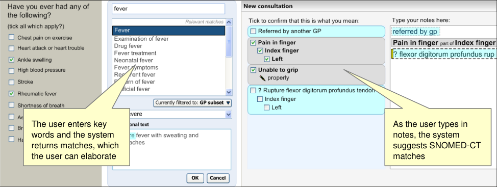

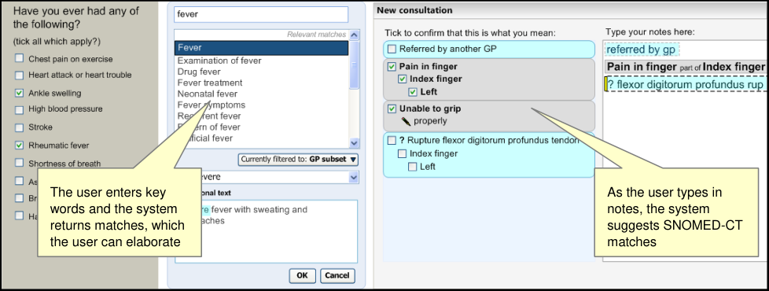

Figure 1: Styles of Encoding

A possible fourth hybrid category could be defined where forms may include areas where single concept matching or text parser is used.

Medical language is full of abbreviations and jargon, some of which have more than one meaning. By encoding clinical statements, they can be shared unambiguously. This should improve patient safety by reducing confusion, or errors, due to ambiguity in clinical notes.

Encoding also opens up important opportunities, such as:

- Filtering context specific views of medical records in order to improve searching

- Unambiguously sharing clinical statements between clinicians in different disciplines or

institutions

- Using decision support mechanisms, based on codes within clinical statements, to enhance

patient safety

- Auditing clinical activity by using codes to locate and report on specific types of information

within patient records

- Researching clinical practice or outcomes in the NHS by extracting codes from electronic

patient records

NHS Connecting for Health (CFH) has chosen SNOMED-CT as the terminology for encoding clinical statements.

Page 2

Copyright ©2013 Health and Social Care Information Centre

HSCIC Controlled Document

#### 1.2 Area of Focus

This document describes the elaboration of a SNOMED-CT expression, which could be a single pre-coordinated or post-coordinated expression comprising multiple concepts. Often, encoding an individual SNOMED-CT expression on its own will not provide sufficient meaning to match what the clinician wishes to express. In these cases, the concept requires some elaboration.

Elaboration could be as simple as adding some unstructured text to the expression to give the expression further meaning. Obviously the scope for future data manipulation is limited with free text elaboration. However, in order to give the clinician the freedom and flexibility to express their notes in a comprehensive and accurate manner, this type of elaboration is essential. Free text elaboration could be achieved by finding a SNOMED-CT expression and adding text to it (as in a single concept matching approach). Alternatively it could be done by matching a SNOMED-CT expression from within a passage of text, and leaving some of the text itself un-encoded, but at the same time associated with the encoded expression. The current Design Guide entry deals with the former, for the latter see the document: _Design Guide Entry – Terminology – Matching_ **{R2}** .

Another type of elaboration involves post-coordinating a SNOMED-CT attribute (such as a qualifier) with the selected SNOMED-CT expression. This could be done by the system offering the user certain SNOMED-CT qualifiers to add to the selected expression. As we shall indicate, this should be limited to instances where this qualification is mandatory. This type of elaboration could also be achieved by the user typing in further notes for a selected SNOMED-CT expression, and the system offering SNOMED-CT matches that coordinate with the expression from within these notes.

Examples of common qualifiers include the attribute ‘Severity’, which has values such as ‘Severe’, ‘Mild’ and ‘Moderate’. An example of potential mandatory attribute could be ‘Laterality’, of which the common values are ‘Left’ and ‘Right’, and which would apply to any relevant body structure concept.

All attribute relationships should be conformant with the published Concept Model, and ideally further constrained appropriate (that is, sensible) sanctioning. Conforming to sanctioned relationships should optimise system behaviour.

A third type of elaboration involves the user adding or selecting numerical (or date and time) values for a SNOMED-CT expression. Given the importance of numerical values (such as measurements and timings) to clinical noting, the system must give the user every opportunity to record these values in their notes, and must sometimes actively encourage users to add these values. These values, and their relationships with SNOMED-CT expressions, are not modelled in the SNOMEDCT terminology, and will rely on an additional informational model of clinical statements. These may be expressions of time, such as ‘for 3 days’, or quantities plus their units, such as ‘42 mmol/l’ for blood sugar level.

The area of elaboration is highlighted in the User Interaction Model, shown in Figure 2 (below).

Page 3

Copyright ©2013 Health and Social Care Information Centre

HSCIC Controlled Document

Figure 2: User Interaction Model

The guidance in this Design Guide Entry aims to meet the NHS CFH requirements listed in Table 1 (below).

C1.9 The system will allow users to specify a small set of elaboration values that are not defined by SNOMED-CT nor the Context Model relationships. These will include time values and values defined by additional informational models (such as blood pressure readings and temperature readings).

Page 4

Copyright ©2013 Health and Social Care Information Centre

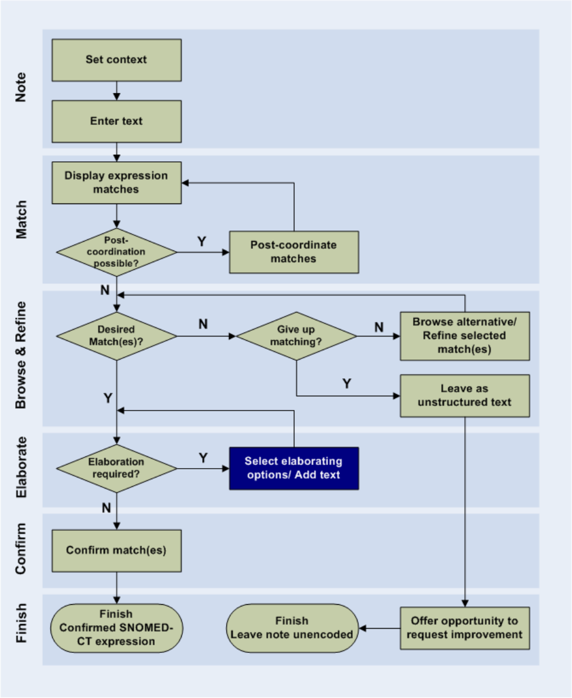
HSCIC Controlled Document

C1.10 Where users can enter numerical values, appropriate units must be presented to users by the system. Where there is a choice of units, the system must present the choice clearly, and explicitly communicate the user’s choice.

C1.11 The system will encourage users to refine mandatory attributes and values (where appropriate).

C2.3 The system will identify potential elaboration within the typed notes and will offer relevant elaboration options during the encoding process.

C3.3 The system will provide users with a mechanism to enter additional text notes with an encodable concept.

C3.4 The system will warn users if text notes contain qualifications (such as negation) that significantly affect the meaning of a concept or conflict with other specified or assumed qualifiers.

Table 1: NHS CFH Requirements for Terminology Elaboration

In the current document, the topic of elaboration has been divided into a set of key sections. These are:

- Elaboration with Free Text

- Elaboration with SNOMED-CT Attributes

- Elaboration with Additional Values

#### 1.3 References to Table of Contents Document

The document _NHS CUI Design Guide Workstream -_ _Table of Contents_ **{R1}** outlines every specific area of focus to be covered by the Design Guide. Each area of focus has an accompanying Design Guide Entry document. Table 2 (below) indicates the areas of focus covered by this Design Guide Entry.

4.2 UI Interaction Model for Terminology Elaboration

Table 2: References to Table of Contents Documents

Copyright ©2013 Health and Social Care Information Centre

Page 5

HSCIC Controlled Document

### 2 RECOMMENDATION AND GUIDANCE

Despite the wide scope of the terminology, individual SNOMED-CT concepts on their own will often not be sufficient to accurately and comprehensively reflect the encounter which the clinician is trying to express. There are three main areas that are covered in this guidance:

- Elaboration with Free Text

- Elaboration with SNOMED-CT Attributes

- Elaboration with Additional Values

The first area concerns adding unstructured free text to a note, in order to give the SNOMED-CT concept a more qualified and accurate meaning.

The second area requires a form of ‘post-coordination’, or joining together, of existing SNOMED-CT concepts, in order to express a synthesised meaning. In the entry of the Design Guide, we explore, in particular, where post-coordination is used to qualify or contextualise a given concept. The user interface (UI) mechanism for post-coordinating concepts is outlined in more detail in its own dedicated Design Guide entry, ‘Post-Coordination’, and we will refer to this mechanism throughout the current document.

The third area involves adding structured data and relationships that will often need to be modelled outside of the SNOMED-CT terminology.

_**Notional Clinical Record**_

The guidance outlined in this Design Guide entry is based upon assumptions about the composition of a clinical record. We assume in our ‘notional clinical record’ that the following rules will apply.

A single clinical record may comprise one or more ‘notes’ plus some contextual information, such as a heading (for example, ’past medical history’).

A note will comprise of one of these:

- A pre-coordinated SNOMED-CT expression

- A post-coordinated SNOMED-CT expression

- A free text (non-SNOMED-CT) expression

In addition, each of these SNOMED-CT expressions may have a set of appropriate axis modifiers associated with it. These values may be:

- Default values

- User selected values

In addition each of the SNOMED-CT expressions may have the following associated with it:

- Non-SNOMED-CT numerical or time values, for example, reading measurements

- Free text

We will not allow:

- Numerical values to be recorded as values rather than free text if they are not associated

with an encoded SNOMED-CT expression

- More than one expression to be saved, except in those instances where multiple concepts

comprise a single ‘composite’, which will be defined by NHS CFH.

Within each record entry there may be multiple ‘notes’, each of which comprise combinations of a SNOMED-CT expression, numerical/time values and free text. See Figure 3 and Figure 4.

Page 6

Copyright ©2013 Health and Social Care Information Centre

HSCIC Controlled Document

Figure 3: Structure of Notional Clinical Record Entry

Figure 4: Example of Notional Clinical Record Entry Structure

#### 2.1 Elaboration with Free Text

Despite the range and depth of SNOMED-CT, there may many instances where expressing the specific nuance of what the clinician wants to say cannot be done by only encoding SNOMED-CT concepts. Also, the conceptual relationships required to articulate a statement may be lacking in the released SNOMED-CT data and may not be covered by additional information models at the system’s disposal. In these cases, the clinician may want to choose a SNOMED-CT concept and elaborate it with ‘free’ text; that is, text that remains un-encoded at the point of saving the record. This might include non-clinical information, such as indicating the professions of a patient’s parents.

Page 7

Copyright ©2013 Health and Social Care Information Centre

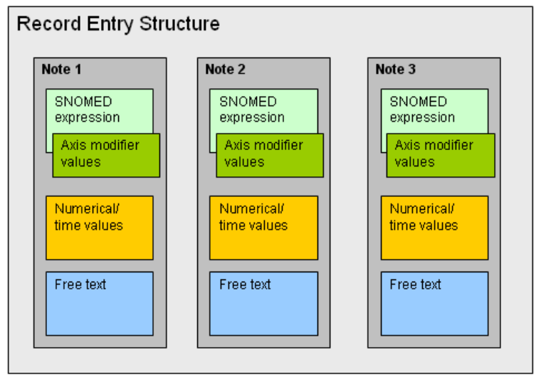

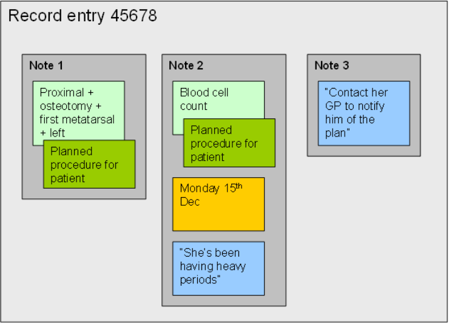
HSCIC Controlled Document

Unstructured free text can be associated with a SNOMED-CT expression in both the single concept matching and text parser matching approaches.

As outlined in Figure 5 (below), there are a number of functional areas in the standard ‘encoding dialog’, which is used in both the single concept matching and text parser matching approaches.

Figure 5: Functional Areas of Encoding Dialog

##### 2.1.1 Additional Text

In the single concept matching approach, the user is presented with a text input field, labelled ‘Additional text’. In addition to selecting a SNOMED-CT concept match, they may also type in free unstructured text, which will be associated with the concept. The additional text input field is featured within the encoding dialog, immediately below the list of SNOMED-CT matches.

The user selects the best match from the list of possible matches, and then types the free text into the additional text field, as illustrated in Figure 6 and Figure 7.

Page 8

Copyright ©2013 Health and Social Care Information Centre

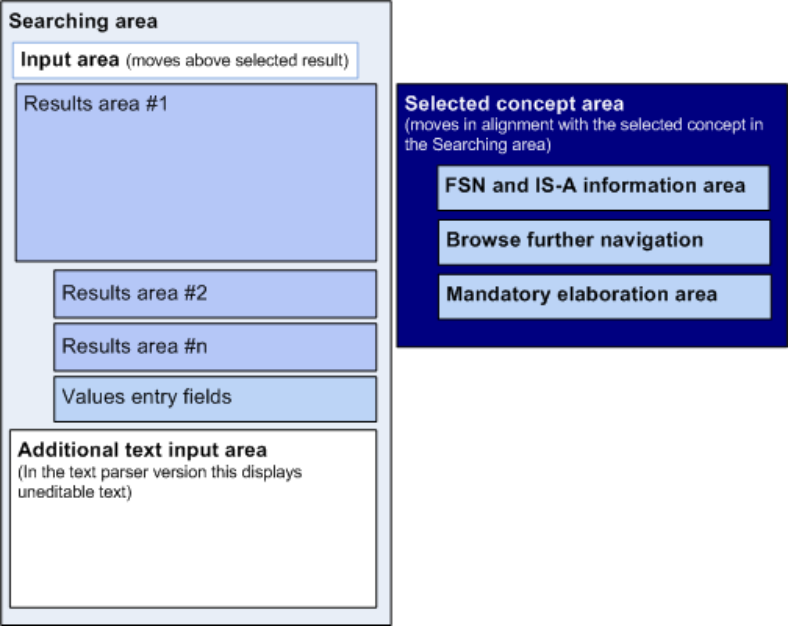
HSCIC Controlled Document

Figure 6: Selecting a Concept Match

Figure 7: Entering Additional Text to Elaborate the Concept

_**2.1.1.1**_ _**Guidance**_

The system:

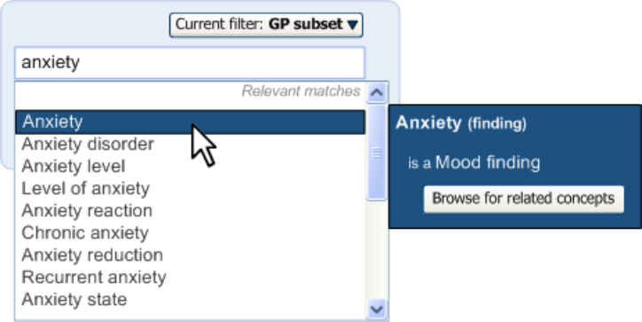

Once the user has chosen a concept match, an ‘additional text’ box appears, into which the user may type elaborating text.

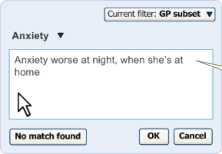

- Must allow the user to add free, unstructured text to a SNOMED-CT match selection

 Must appropriately label the input field for adding free unstructured text

 Should locate the additional text field in a position that is visible to the user when they are viewing the SNOMED-CT matches

_**2.1.1.2**_ _**How to Use the Design Guide Entry**_

####  Align the additional text field with the

field displaying the list of matches

####  Provide an additional text field for all

definition/elaboration dialogs in the ‘Code and Elaborate’ environment

####  Retain the additional text until the user

selects a code or closes the search dialog

See above figures This should allow the user to scan down to the additional text field easily

See Figure 7 This is a universal feature that could apply to all concepts

n/a Although text notes may apply to one concept, but not to another, users may be writing a lot of notes and using a concept as a ‘hook’ to hang the notes onto. Therefore, they will want the system to retain the unstructured text even if they change concept

Page 9

Copyright ©2013 Health and Social Care Information Centre

HSCIC Controlled Document

Table 3: How to Use the Design Guide Entry

_**2.1.1.3**_ _**How Not to Use the Design Guide Entry**_

####  Do not locate the additional text field in

the flyout area

####  Do not allow users to apply their own

formatting to text in the additional text field

####  Do not provide an additional text field

for the ‘text parser’ approach to encoding

Table 4: How Not to Use the Design Guide Entry

Users should not be able to apply styles, such as bold, or highlighting to text in the additional text field

Additional formatting would obstruct the communication of confirmed or encodable text

n/a It would be confusing to offer two places to add unstructured text notes

_**2.1.1.4**_ _**Benefits and Rationale**_

In the single concept matching approach, the additional text field must be located close to the matches list (and therefore, the selected SNOMED-CT match to which the elaboration will apply).

We had looked at featuring the additional text field in the flyout which, when tested, was understood. However, locating it in the flyout can appear strange, especially when the flyout is moving as the mouse moves down the list.

Featuring the additional text field in the same area as the list of matches does require an additional user action, namely single-clicking on the desired SNOMED-CT match (which turns the highlight grey) before clicking in the additional text field to write elaboration text. Alternatively, the user may write the text before selecting the list item, if they wish. However, despite a possible additional user action, it does make the process clearer.

Featuring the additional text below the selected match communicates that the text belongs to the match, and is an elaboration of the match. It also follows the more typical task order, which would be to select a match and then elaborate it.

_**2.1.1.5**_ _**Confidence Level**_

_**High**_

- Must allow the user to add free, unstructured text to a SNOMED-CT match selection

 Must appropriately label the input field for adding free unstructured text

 Should locate the additional text field in a position that is visible to the user when they are viewing the SNOMED-CT matches

##### 2.1.2 Text Remaining Unstructured

In the text parser approach to matching, free text can be associated with a SNOMED-CT expression by not encoding text that falls within the expression envelope marquee. This may be the user’s choice not to confirm a potential match for encoding (that is, by not selecting the appropriate check box), or it might be because the text cannot be matched with SNOMED-CT concepts (or data from additional information modelling).

In the example shown in Figure 8 (below), the user has typed in ‘Unable to grip properly’, from which the system has matched the concept ‘Unable to grip’ (ConceptID 284258001). The remaining text cannot be matched, but still falls within the user defined expression envelope (there are no full stops or carriage returns between ‘Unable to grip’ and ‘properly’) and the system has not associated the text ‘properly’ with any other matched concepts.

Page 10

Copyright ©2013 Health and Social Care Information Centre

HSCIC Controlled Document

The text ‘properly’ appears in the suggested matching area, indented to the SNOMED-CT concept. It also features a special icon (currently undefined, but in this example, a ‘pencil’ icon has been shown) to distinguish it from the potential SNOMED-CT matches. Any free text will be displayed in this position (that is, below and indented to the SNOMED-CT expression).

If the free text is divided into two separate strings, these will be displayed as two bullets (that is, they would comprise two separate lines, each with an icon). For example, if the user had typed in ‘David unable to grip properly’, the system would display the concept match ‘Unable to grip’ and below this it would feature one line containing the text ‘David’ and another line containing the text ‘properly’.

Figure 8: System Matching the Concept: Unable to Grip

If the user clicks on a suggested match label, the system will display the associated free text below the list of matches, again with the special icon, as shown in Figure 9. This is in the same position as the additional text field in the single concept matching approach.

Figure 9: Clicking a Match Label to Use the Encoding Dialog

Page 11

Copyright ©2013 Health and Social Care Information Centre

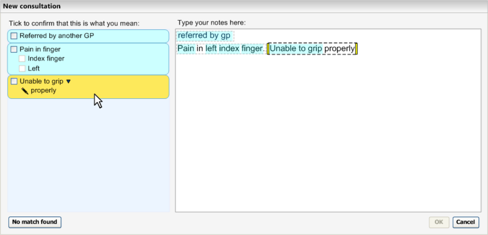

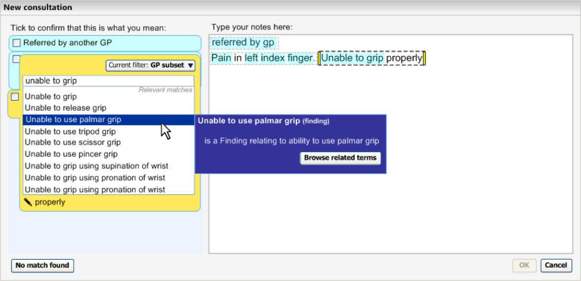
HSCIC Controlled Document

If the user does not want the free text to be associated with the SNOMED-CT expression, they can either delete the text from the note altogether or they can adjust the marquee boundaries by dragging the appropriate yellow handle with the mouse. As shown in Figure 10 (below), when the user moves the mouse over one of the yellow marquee handles, two directional arrows appear on the handle to further communicate to the user that they can drag the handle. When the user has dragged the handle so that the marquee no longer contains the text ‘properly’, the text disappears from the suggested match area. The text ‘properly’ would then have its own marquee.

Figure 10: Adjusting the Expression Envelope (Marquee) Boundaries

Conversely, the user may also drag the boundary handles so that they include text that was not previously associated with a matched expression. The user, for example, may want to associate multiple sentences with a single matched expression.

_**2.1.2.1**_ _**Guidance**_

The system:

- Must allow the user to associate free text with SNOMED-CT expressions in the text parser

approach to matching

- Must define ‘free text’ as any text that cannot be matched, either with a SNOMED-CT

expression or another modelled expression (such as expressions of time or measurement readings)

- Must assume that free text is associated with a SNOMED-CT expression if it falls within the

‘expression envelope’, which itself is defined by (i) proximity, that is, if the text is immediately adjacent to the SNOMED-CT matched text, and by (ii) user-defined boundaries, such as full stops and carriage returns

- Should display the free text in the same area as the suggested match in the left-hand

confirmation pane

 Must distinguish the free text from the matched text

 Could feature an icon to communicate that it is free text, rather than matched text

 Could indent the free text and display it below the matched text, to show that the free text ‘belongs’ to the matched expression

- Should allow the user to read the free text while they are viewing the possible SNOMED-CT

matches.

Page 12

Copyright ©2013 Health and Social Care Information Centre

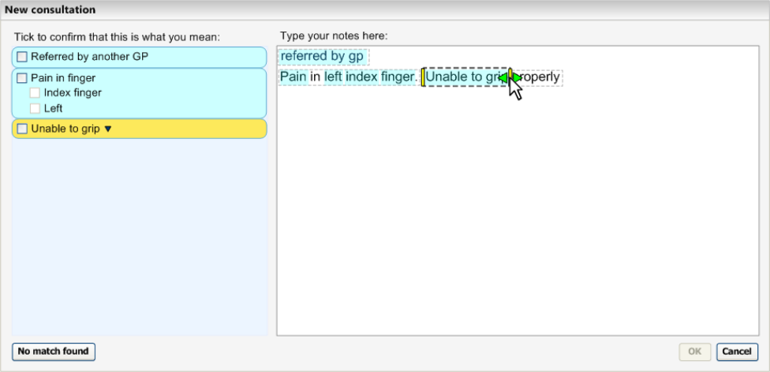
HSCIC Controlled Document

 Should display the free text below the list of possible SNOMED-CT matches

- Must allow the user to ‘un-associate’ the free text from the matched expression

 Should allow the user to delete the free text

 Should allow the user to manipulate the expression envelope boundaries, in order to move the free text outside of the expression envelope, and thus disassociate it from the matched expression

 Should, conversely, allow the user to associate free text with a matched expression by manipulating the marquee boundaries, that is, dragging the boundaries so that they include text that was not already in the expression envelope

_**2.1.2.2**_ _**How to Use the Design Guide Entry**_

####  Must feature an appropriate icon next to

the free text in the suggested match area

####  Provide an appropriate ToolTip that

appears when the user moves the mouse over the handles of the marquee boundaries

Table 5: How to Use the Design Guide Entry

We have shown a pencil icon, but we believe a better icon can be created

“Drag the handles to include or exclude text in the expression”

_**2.1.2.3**_ _**How Not to Use the Design Guide Entry**_

####  In the text parser approach to matching,

allowing users to edit additional text anywhere but in the text input area

Table 6: How Not to Use the Design Guide Entry

Providing an additional text field in the encoding dialog in the text parser approach.

In the text parser approach to matching, the user must only be able to edit additional text in one area, otherwise the interaction may become confusing.

_**2.1.2.4**_ _**Benefits and Rationale**_

The approach outlined in this guidance is a very natural and unobtrusive way of allowing the user to associate free text elaboration with SNOMED-CT concepts. In fact, the user is doing what they would do anyway: write their notes in sentences. As the sentences commonly define the expression envelopes and, in many cases, sentences are self-contained units of meaning, this approach does not require the user to do any unnatural action to associate this text (in most cases).

Where the user needs to associate free text that sits outside of the expression window, they must stretch the marquee around this additional text. Again, the notion of stretching a marquee around objects that one wants to include in the marquee is an intuitive action, akin to encircling notes that belong together. Clinicians confirmed that this approach is clear and understandable in usability testing. The mouse-over arrows (and ToolTip) reinforce the communication of this action.

However, there are a few open issues that remain with this parsing approach. For example, the clinician may enter a contextual modifier that applies to more than one expression, as in the note “Father has suffered heart failure. He also has arthritis”. In this example, the modifier ‘Father’ should apply to both the expression of ‘heart failure’ and ‘arthritis’. Under certain contextual headings (see _Design Guide Entry – Terminology – Matching_ **{R2}** for details of contextual headings), the system could apply the modifier to all subsequent expressions until the user enters

Page 13

Copyright ©2013 Health and Social Care Information Centre

HSCIC Controlled Document

another modifier. Further rules may need to be developed and tested to overcome these specific issues.

_**2.1.2.5**_ _**Confidence Level**_

_**High**_

- Must allow the user to associate free text with SNOMED-CT expressions in the text parser

approach to matching

- Must define ‘free text’ as any text that cannot be matched, either with a SNOMED-CT

expression or another modelled expression (such as expressions of time or measurement readings)

- Should display the free text in the same area as the suggested match in the left-hand

confirmation pane

- Must distinguish the free text from the matched text

- Could feature an icon to communicate that it is free text, rather than matched text

- Could indent the free text and display it below the matched text, to show that the free text

‘belongs’ to the matched expression

- Should allow the user to delete the free text

_**Medium**_

- Must assume that free text is associated with a SNOMED-CT expression if it falls within the

‘expression envelope’, which itself is defined by (i) proximity, that is, if the text is immediately adjacent to the SNOMED-CT matched text, and by (ii) user-defined boundaries, such as full stops and carriage returns

- Must allow the user to ‘un-associate’ the free text from the matched expression

- Should allow the user to manipulate the expression envelope boundaries, in order to move

the free text outside of the expression envelope, and thus disassociate it from the matched expression

- Should, conversely, allow the user to associate free text with a matched expression by

manipulating the marquee boundaries, that is, dragging the boundaries so that they include text that was not already in the expression envelope

_**Low**_

- Should allow the user to read the free text while they are viewing the possible SNOMED-CT

matches

- Should display the free text below the list of possible SNOMED-CT matches

#### 2.2 Elaboration with SNOMED-CT Attributes

The requirement for additional elaboration may arise because, on its own, the concept is missing some important qualification. For example, a diagnosis of ‘gastroenteritis’ could have different implications, depending upon the suspected severity of the disorder. The clinician may want to qualify this diagnosed disorder as being ‘mild’. Likewise, the clinician may want to specify that a patient’s asthma is ‘on-going’ rather than being a new episode.

As with other areas of the Terminology UI, the design primarily adopts a user-led approach. That is to say, the user gets what they enter. This principle applies for most qualifier attributes in this design. The user will only be offered matches for qualifier attributes that they have typed in

Page 14

Copyright ©2013 Health and Social Care Information Centre

HSCIC Controlled Document

themselves. This will apply to both the single concept matching approach and the text parser matching approach.

The text parser approach to matching attributes is covered in detail in the document: _Design Guide_ _Entry – Terminology – Post Coordination_ **{R4}**, and will not be outlined in detail here. Instead, this document will focus on how the user may add qualifiers to a SNOMED-CT match using the single concept matching approach.

One exception to this ‘user-led’ principle of qualifier matching is when attributes are deemed ‘mandatory’, or are at least strongly recommended. A plausible example is laterality. This could apply to a body structure or a procedure that is defined in part by a body structure. In these situations, NHS CFH require that the user be forced to enter the laterality at the point of encoding. In this case, the system will actively offer the selection choices to the user, bearing in mind that ‘Not specified’ and ‘Both’ are both legitimate choices.

##### 2.2.1 Matching SNOMED-CT Attributes Within Additional Free Text

In the single concept matching approach, the user may need to add structured qualification to a SNOMED-CT concept. This is especially important if the user is offered a field for free text entry, as there will be a temptation to qualify the matched concept with free text, and some of this free text qualification could be very important to the meaning of the note.

Therefore, the design matches attributes from within the free text, in a similar manner to the text parser approach. Unlike the text parser approach, the user can only enter one expression at a time, although the expression could comprise a SNOMED-CT concept plus multiple qualifiers.

In the example shown in Figure 11, the user has found matches for the word ‘asthma’ and selects the concept ‘Asthma’, by a single click. They then click in the additional text input field, and start typing some additional qualifying text.

Figure 11: Selecting a SNOMED-CT Match Using a Single Click

Page 15

Copyright ©2013 Health and Social Care Information Centre

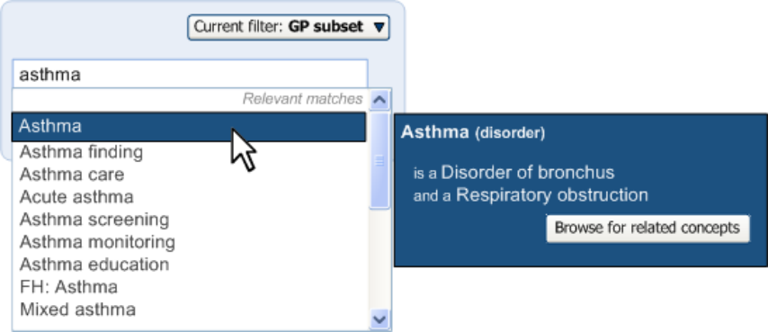
HSCIC Controlled Document

As the user is typing in the additional text, the system is matching individual words (or strings of words) against SNOMED-CT attributes for the concept ‘Asthma’. When it identifies a match, it highlights it in blue and displays the match above the additional text field, along with a check box for the user to confirm the match, as shown in Figure 12.

The system matches the attribute ‘Mild’ from the additional text

Figure 12: System Identifying a Match from Additional Qualifying Text

As the user moves the mouse over the label ‘Mild’, the area around it changes colour to signify that it is clickable, as shown in Figure 13.

The user moves the mouse over the attribute match label, which causes it to turn orange and ‘clickable’

Figure 13: Label Changing Colour on Hover

The user clicks on the label to reveal other possible attribute matches for the word ‘Mild’, but decides that the top selection is the best match as shown in Figure 14.

Figure 14: Displaying Possible Matches after Clicking on the Label

Page 16

Copyright ©2013 Health and Social Care Information Centre

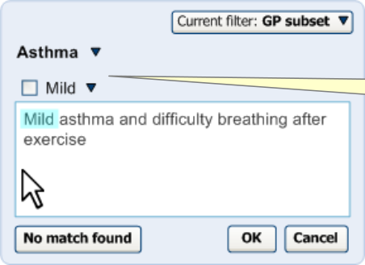

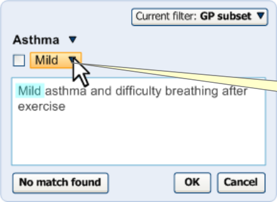

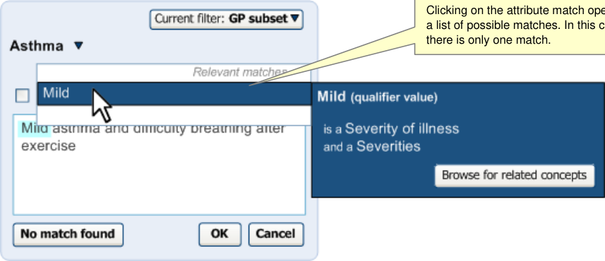
HSCIC Controlled Document

The user then selects the check box, and the attribute match becomes confirmed for encoding upon saving the note to record as shown in Figure 15.

Having selected the confirmation check box, the match becomes bold (and highlighted in grey in the ‘Additional text’ input field).

Figure 15: Additional Text after Selecting the Check Box

_**2.2.1.1**_ _**Guidance**_

The system:

- Must allow the user to type in notes that the system can match against SNOMED-CT

matches that have attribute relationships with the selected SNOMED-CT concept, which are defined by the Concept Model (which specifies allowable relationships, including those in the Context Model) or an external information model.

 Should make the noting clear and efficient by using the same field for both the additional text and the input for attributes

 Should re-use the mechanisms for matching the text parser, namely: highlighting, bolding, featuring a confirmation check box, and featuring a control for viewing alternative matches

**Note**

Relationships defined by an external information model would need to be approved by the NHS CFH. These would be those relationships that are needed for clinical noting, but which do not exist in the SCT, Concept or Context Models. An example would be the relationships between measurement values (that is, quantity and unit values) and the appropriate SNOMED-CT concepts.

_**2.2.1.2**_ _**How to Use the Design Guide Entry**_

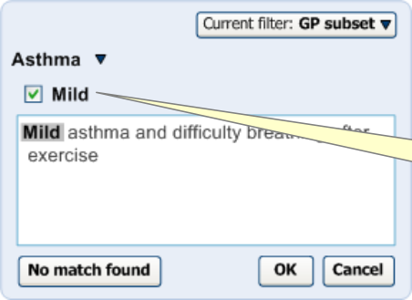
####  Allow the matching of multiple concepts,

if they are all attributes of the baseconcept

####  Allow users to browse related concepts

of an attribute

Table 7: How to Use the Design Guide Entry

The system could match ‘Severe’ and ‘Sudden onset’ when the base-concept is ‘Asthma’

The user may wish to see what other levels of severity there are to choose from

Page 17

Copyright ©2013 Health and Social Care Information Centre

HSCIC Controlled Document

_**2.2.1.3**_ _**How Not to Use the Design Guide Entry**_

####  Matching concepts that are not

attributes of the base-concept (which is selected in the main list of matches)

Table 8: How Not to Use the Design Guide Entry

Matching the concept ‘Foot’ if the user has selected the concept ‘Fever’ in the list above

_**2.2.1.4**_ _**Benefits and Rationale**_

This approach is a good example of the user-led principle of elaboration or, in other words, the user will type in what they want up-front.

Previous designs which featured a few elaboration settings displayed in drop-down list boxes in the flyout confused users who did not understand why these settings were being offered to them. They wondered why they were being offered selections for severity or episodicity, but not for other ways of adding description to the concept. Also, some users thought that they must select from the fields if they were being offered to them, which was incorrect and could lead to a lot of unnecessary encoding.

The display of lists of options that naturally belong in a logical order, but which are unordered in the SNOMED-CT database, can be confusing and misleading if they are left unordered. For example, in a list of severity ratings, the user would expect them to be arranged in a list of increasing or decreasing severity. However, the metadata to order these concepts in a meaningful way has not been created. The user-led approach removes the need for such metadata in this instance.

Consistent use of highlighting and matching labels with the text parser approach to matching will reduce the need for learning between the two approaches. The benefits and rationale for these mechanisms are covered in detail in the relevant sections of the following documents:

- _Design Guide Entry – Terminology – Matching_ **{R2}**

- _Design Guide Entry – Terminology – Display Standards for Coded Information_ **{R3}**

_**2.2.1.5**_ _**Confidence Level**_

_**Low**_

- Must allow the user to type in notes that the system can match against SNOMED-CT

matches that have attribute relationships with the selected SNOMED-CT concept

 Should make the noting clear and efficient by using the same field for both the additional text and the input for attributes

 Should re-use the mechanisms for matching the text parser, namely: highlighting, bolding, featuring a confirmation check box, and featuring a control for viewing alternative matches

We have not tested the use of the additional text field in this way.

##### 2.2.2 Warning of Important Unconfirmed Elaboration

If users are allowed to type in free text, the system must identify important words that can modify the meaning of the concept. If the user has typed in a word in the additional text field that is recognised to be an axis modifier, such as negation or a relation to the patient (meaning that the other family member is suffering from the disorder rather than the patient themselves), the system may offer this to the user in the same way as for the qualifier, namely with a highlight and a check box.

Page 18

Copyright ©2013 Health and Social Care Information Centre

HSCIC Controlled Document

However, if the user fails to confirm the encoding of this axis modifier, the system should warn the user that they have not done so, and offer them a quick control to confirm it.

In the example shown in Figure 16 (below), the user has typed that the patient’s mother had asthma. The clinician could be trying to communicate that both the user and their mother have asthma, or they could mean that only the patient’s mother is known to have asthma.

Figure 16: Presenting a Control for Confirming an Axis Modifier in Additional Text for Encoding

When the user tries to save the note by clicking ‘OK’, the system displays a warning, as shown in Figure 17 (below), that they have not confirmed that it is the patient’s mother and not necessarily the patient that has asthma. The system will offer the user the choice of confirming this or leaving the note as it is (which has the meaning that the patient has asthma and so does their mother).

The user has tried to save the note without confirming the axis modifier match (‘Mother’).

Figure 17: System Requesting Confirmation of Who Has Asthma

_**2.2.2.1**_ _**Guidance**_

The system:

- Must attempt to identify axis modifiers, such as negation, in the additional text notes and

present them for confirmation in the same way as for the qualifier values

- Must warn the user if they try to save the note without confirming the axis modifier

- Should offer the user a quick control for confirming the axis modifier

**Note**

In order for this approach to work well, the high risk trigger words should be identified in SNOMED-CT itself.

Page 19

Copyright ©2013 Health and Social Care Information Centre

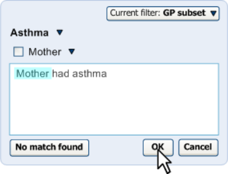

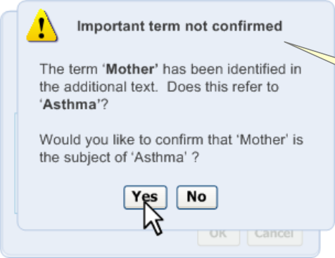
HSCIC Controlled Document

_**2.2.2.2**_ _**How to Use the Design Guide Entry**_

####  Clearly outline the problem and the way

in which the user may resolve the problem

Table 9: How to Use the Design Guide Entry

See text in Figure 17

_**2.2.2.3**_ _**How Not to Use the Design Guide Entry**_

####  Present the user with an array of

options in the warning message.

Table 10: How Not to Use the Design Guide Entry

Do not offer users the choice of ‘Yes’, ‘No’ and ‘Cancel’

_**2.2.2.4**_ _**Benefits and Rationale**_

It is important to alert users to ‘dangerous’ elaboration words that the user may expect the system to act on (such as negation). The guidance outlined here allows the user flexibility to type in what they want, but forces them to attend to any critical elaboration. Words that match with axis modification concepts are particularly dangerous as they fundamentally change the meaning of the expression. Qualifier values do not need these warning messages.

The design allows the user to type in axis modifiers in the text entry fields, but will not present these modifiers (even the default ‘soft’ settings of these values) unless the user has typed them in. Previous designs featured a fly-out that displayed fields for axis modifier concept values, but users found them confusing. For example, featuring the text ‘the patient currently has this finding’ was not understood by clinicians.

_**2.2.2.5**_ _**Confidence Level**_

_**High**_

- Must warn the user if they try to save the note without confirming the axis modifier

_**Medium**_

- Must attempt to identify axis modifiers, such as negation, in the additional text notes and

present them for confirmation in the same way as for the qualifier values

- Should offer the user a quick control for confirming the axis modifier

##### 2.2.3 Mandatory SNOMED-CT Qualification

As part of the NHS CUI guidance development process, the NHS CFH has requested that the guidance shows how some qualification could be communicated as mandatory by the user interface. The best example of this is laterality, that is, whether a body structure or a procedure or finding that is partly defined by a body structure is the left or right instance of that body structure. For example, if the user types in ‘Fracture of radius’, it will be important to know whether this refers to the patient’s left radius, right radius or both. This has important implications for levels of patient safety.

In the example shown in Figure 18 (below), the user has selected ‘Fracture of radius’ in the single concept matching approach. The flyout for the concept contains a drop-down list from which the user must select the laterality of the radius, or state that they do not know which side the affected radius is on. The drop-down is coloured yellow to grab the user’s attention, and the user cannot click ‘OK’ to save the note until they have selected a choice from the drop-down list.

Page 20

Copyright ©2013 Health and Social Care Information Centre

HSCIC Controlled Document

Please note that if the user has typed laterality into the additional text field and has confirmed the match, the drop-down list box will disappear and the ‘OK’ will be enabled.

Figure 18: Example of a Mandatory Qualifier Field in the Single Concept Matching Approach

The implementation of mandatory qualifier fields also applies to the text parser approach. In the example shown in Figure 19 (below), the user has typed in ‘Fracture of radius’ and the system has matched this with the SNOMED-CT concept ‘Fracture of radius’. However, the system does not enable the check box for confirming the encoding of the phrase. Instead, when the user moves the mouse over the concept match area, the system displays a warning message, telling the user to specify whether the radius is on the left, right or both (or unknown).

Figure 19: Concept that Requires a Statement of Laterality

At this point, the user could add the word ‘left’ (or ‘right’, or ‘both’) in the text input area. Alternatively, they could click on the match in the left-hand pane, which would reveal the qualifier drop-down list as illustrated in Figure 20 (below).

Page 21

Copyright ©2013 Health and Social Care Information Centre

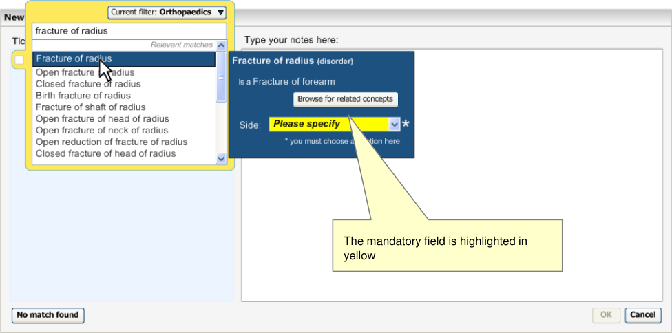

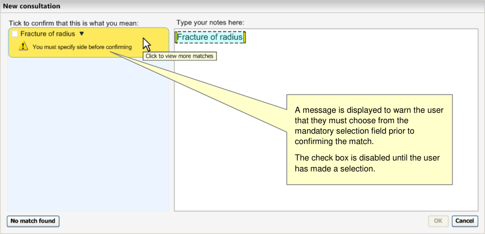
HSCIC Controlled Document

Figure 20: Displaying the Field for Selecting Laterality

Selecting the laterality from the list box enables the confirmation check box. Also, at this point, the background of the qualifier’s drop-down turns from yellow to white as shown in Figure 21 (below).

Figure 21: Selecting a Qualifier Value, Enabling the Confirmation Checkbox

Page 22

Copyright ©2013 Health and Social Care Information Centre

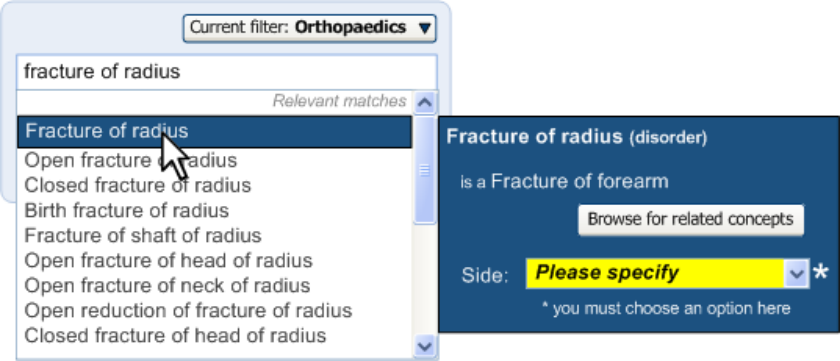

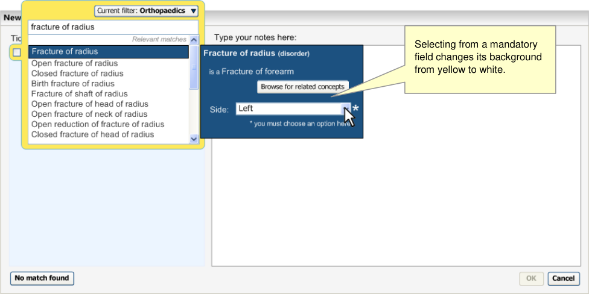
HSCIC Controlled Document

Figure 22 (below) shows that when the user confirms the match, the qualifier value is displayed in the match and is rendered in the text input area. Please note that the check box for the qualifier value is selected, but is disabled to prevent the user from removing the qualifier, but leaving the base concept confirmed. If the user wants to change the laterality setting, they must un-confirm the base concept (that is, ‘Fracture of radius’) before clicking on it and changing the setting in the match’s flyout.

Figure 22: Confirmed Match with Qualifier

_**2.2.3.1**_ _**Guidance**_

The system:

- Must disable the control for confirming a match (text parser matching approach) or the

control for saving the note (single concept matching approach) if there is a mandatory qualifier that remains unresolved

- Must provide a control for selecting the mandatory qualifier

 Could feature a drop-down list box

 Should associate the control with the individual match

 Should feature the control in the match’s flyout

- Must communicate to the user that they must select the mandatory qualifier in order to

confirm/save the note

 Should feature a warning message in the suggested match area (in the left-hand pane) that appears when the user moves the mouse over the area

 Should feature the words ‘Please specify’ in the mandatory qualifier selection control

 Should make the mandatory qualifier selection control sufficiently prominent

 Could feature the mandatory qualifier selection control in yellow, until the user selects an option from it

- Must not allow the user to un-confirm the mandatory qualifier value independently from the

base concept

Page 23

Copyright ©2013 Health and Social Care Information Centre

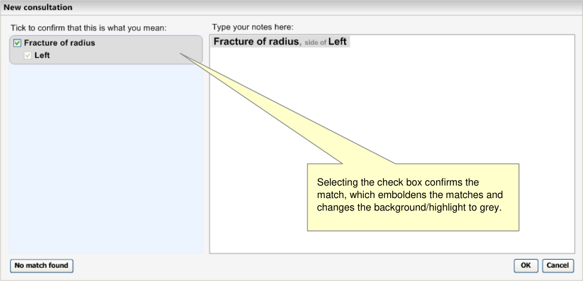
HSCIC Controlled Document

**Note**

The identification of mandatory elaboration would imply the creation of appropriate meta-data by the NHS CFH.

_**2.2.3.2**_ _**How to Use the Design Guide Entry**_

####  Highlight the mandatory elaboration with

a bright colour

####  Provide a hover-over message that

indicates that the field is mandatory

####  Feature the text ‘Please specify’ within

the initial view of the selection field

####  Provide a key that communicates how

mandatory fields are displayed

Table 11: How to Use the Design Guide Entry

See Figure 20

The message could read “You must select from this list to be able to encode ‘ _name of the concept_ ’”

See Figure 20

See Figure 20

_**2.2.3.3**_ _**How Not to Use the Design Guide Entry**_

####  Do not allow users to encode a term

without selecting all its mandatory fields

Table 12: How Not to Use the Design Guide Entry

n/a

_**2.2.3.4**_ _**Benefits and Rationale**_

Preventing users from encoding a concept without selecting a mandatory field forces the user to select it (if they want to encode the concept). A bright background in the mandatory field will grab the user’s attention, and the asterisk icon with the key at the foot of the dialog would make it explicit that the field is mandatory. This asterisk and footnote will be more important if there are multiple fields in the flyout, for example, if there are values to enter

Another good place to communicate that there are mandatory fields for the user to complete is near to the confirmation control in the suggested matches area, as this area is also used to display warning messages about similar matches.

_**2.2.3.5**_ _**Confidence Level**_

_**High**_

- Must provide a control for selecting the mandatory qualifier

 Could feature a drop-down list box

 Should associate the control with the individual match

 Should feature the control in the match’s flyout

- Must not allow the user to un-confirm the mandatory qualifier value independently from the

base concept

- Must communicate to the user that they must select the mandatory qualifier in order to

confirm/save the note

Page 24

Copyright ©2013 Health and Social Care Information Centre

HSCIC Controlled Document

_**Medium**_

- Must disable the control for confirming a match (text parser matching approach) or the

control for saving the note (single concept matching approach) if there is a mandatory qualifier that remains unresolved

- Should feature the words ‘Please specify’ in the mandatory qualifier selection control

- Should make the mandatory qualifier selection control sufficiently prominent

 Could feature the mandatory qualifier selection control in yellow, until the user selects an option from it

_**Low**_

 Should feature a warning message in the suggested match area (in the left-hand pane) that appears when the user moves the mouse over the area

#### 2.3 Elaboration with Additional Values

There will be additional values that SNOMED-CT does not contain, but which will be crucial to creating a meaningful note. These may be time values, such as months, hours or dates (there are some codable dates in SNOMED-CT; the system would need to distinguish expressions of date that are codable in SNOMED-CT from those which are not); or values for an observable entity reading, such as temperature or blood pressure.

The system must be able to recognise these values and any specified units from within the user’s typed notes, and where there are not appropriate units identified, the system must suggest an appropriate default unit. The relationships between the concepts and the value, plus the values themselves, must be taken from an external information model if they are not present in SNOMEDCT itself.

Upon NHS CFH completion of information model definitions for these composite statements, further NHS CUI guidance will need to be issued. The information that follows is preliminary guidance.

##### 2.3.1 Identifying Values Within Text

It will be important for the clinician to be able to type numerical values into their notes, and for the system to recognise these values and to associate them with the correct concept. These values are not modelled in SNOMED-CT, and will be derived from an external information model, but the system must ensure that, from the user’s point of view, the interaction appears seamless.

It is also important that the system can derive the appropriate measurement unit, based upon the numbers and the concept (SNOMED-CT or non-SNOMED-CT) with which they are associated. It is also crucial that the system can validate the numbers, for example, to avoid decimal points in the wrong place, or the user entering too few digits. We would expect to employ an information model that contained information about the formats and ranges of the measurement types covered.

The design will allow the user to type values into the text input area. In the example shown in Figure 23, the user types in a temperature of ’39.8°C’. Meanwhile, the system has matched the text ‘Temperature’ with the SNOMED-CT observable entity concept, ‘Body temperature’. Drawing from an appropriate information model, the system recognises that, for the concept of ‘Body temperature’, the figure ’39.8’ falls within a range that would imply that this was a measurement taken in degrees centigrade. In its match, therefore, the system adds the unit, ‘°C’. It also inserts the temperature value after the SNOMED-CT match, with an equals (‘=’) sign between concept and value.

Page 25

Copyright ©2013 Health and Social Care Information Centre

HSCIC Controlled Document

Figure 23: Entering Text that Contains Measurement Values

If the user expands the encoding dialog for the match, the system presents fields in the flyout for the value and the value’s unit, pre-populated with ’39.8’ and ‘°C’ respectively as shown in Figure
24. If the user were to change the figure or the unit, this would be reflected in the suggest match
label in the left pane and, if the user confirmed the match, in the final rendered text.

Figure 24: Selecting the Match to Display Value and Unit Fields in the Flyout

_**2.3.1.1**_ _**Guidance**_

The system:

- Must identify values and units from within the notes

- Should suggest default units for measurement values

- Must display the values and units it has identified back to the user for the user’s

confirmation

- Should allow the user to adjust the values and units in the expanded encoding dialog

Page 26

Copyright ©2013 Health and Social Care Information Centre

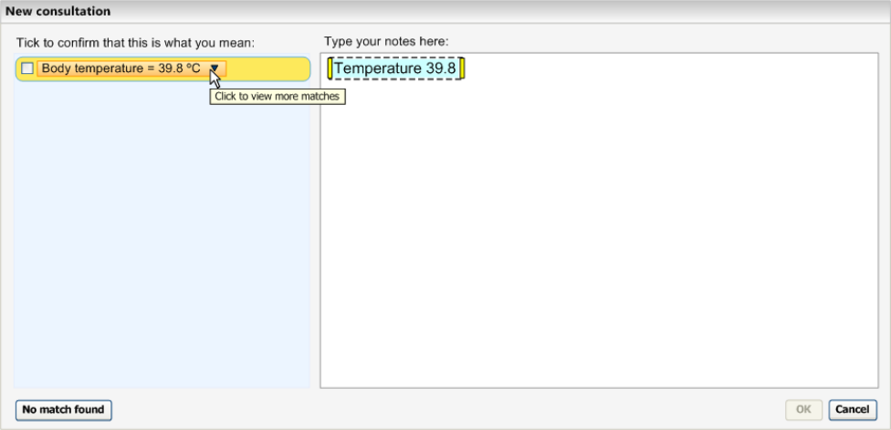

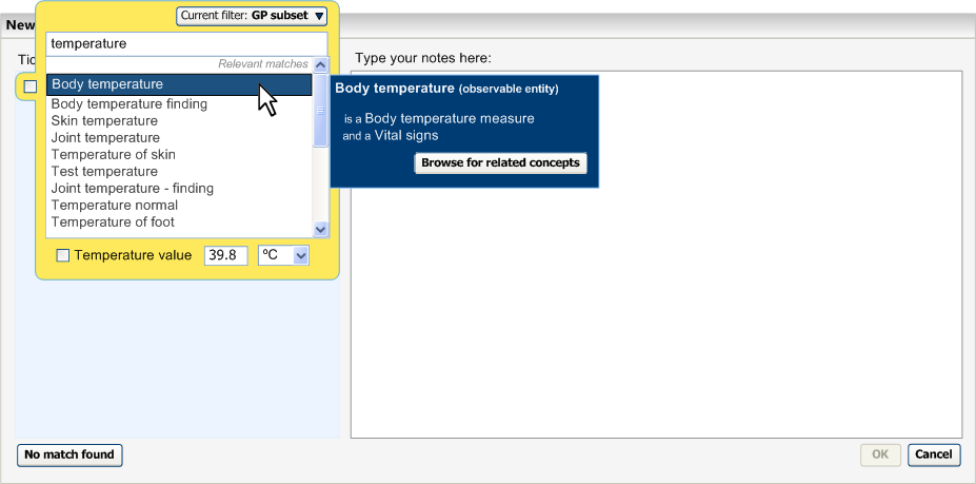
HSCIC Controlled Document

**Note**

Quantity and unit values, and their relationships with appropriate SNOMED-CT concepts, in the main, will require additional information model data.

_**2.3.1.2**_ _**How to Use the Design Guide Entry**_

####  Deduce the appropriate unit and display

this with the value

Table 13: How to Use the Design Guide Entry

See Figure 23

_**2.3.1.3**_ _**How Not to Use the Design Guide Entry**_

####  Interpret a full stop character as a full

stop if it has digits immediately both sides of it.

Table 14: How Not to Use the Design Guide Entry

39.8 should not be interpreted by the system as two sentences

_**2.3.1.4**_ _**Benefits and Rationale**_

This approach allows users to enter values as part of their typing in notes in a narrative format. In this way, the entry of values should not require additional actions to the typing of the user’s textbased notes. However, the validation mechanism is important, and users should be warned if the values fall outside of recognised ranges or formats.

User testing has shown that users understand and accept this approach.

_**2.3.1.5**_ _**Confidence Level**_

_**High**_

- Must identify values and units from within the notes

- Must display the values and units it has identified back to the user for the user’s

confirmation

_**Medium**_

- Should allow the user to adjust the values and units in the expanded encoding dialog

##### 2.3.2 Templates

In addition to the system identifying values and units from with the clinician’s notes, the system should also encourage users to enter values in response to matching certain concepts that are associated with or require certain values.

In the example shown in Figure 25 (below), the user has selected the SNOMED-CT concept match ‘Body temperature’ within the single concept matching approach. The system identifies that this concept is associated with temperature readings, and that the default unit is degrees centigrade. It therefore presents two fields, one for value, the other for unit (which, in this case, is set by default to ‘°C’). The value field has a validation process triggered upon the focus leaving the field. Failure to meet the validation criteria will trigger an ‘error’ message which will tell the user to change the value if they wish to confirm the concept. For example, if the user types in 398 (instead of 39.8), the system would launch an error message, inviting the user to correct the figure.

Page 27

Copyright ©2013 Health and Social Care Information Centre

HSCIC Controlled Document

Figure 25: Displaying Fields in the Flyout for Entering Measurement Values

Fields for entering quantity and unit values

Typing a figure into the ‘Temperature value’ field will automatically select its confirmation check box. On the other hand, if the user selects the confirmation check box, but does not enter a value, the system will launch a warning message when the user clicks the ‘OK’ button.

Figure 26 (below) illustrates the text parser matching approach. The system identifies the match for ‘Blood pressure’ in the clinician’s notes, and recognises it as an opportunity for the entry of values. The system tags the expression with a yellow mark in the lower right-hand corner of the marquee.

Figure 26: Identifying an Opportunity for Entry of Values

When the user moves the focus to the relevant expression, the system displays a floating dialog into which the user can enter blood pressure values, as shown in Figure 27 (below). Additionally, in the suggested match area (highlighted in yellow in the left-hand pane) the system displays a message encouraging the user to enter values for the blood pressure reading (‘You should enter values’). At this point, if the user wishes to enter values, they have the choice of:

- Clicking on the match label (‘Blood pressure’) and entering the values into the encoding

dialog flyout

- Entering the values into the floating dialog in the text input area (in the right-hand pane)

- Typing the values directly into the text input area

Page 28

Copyright ©2013 Health and Social Care Information Centre

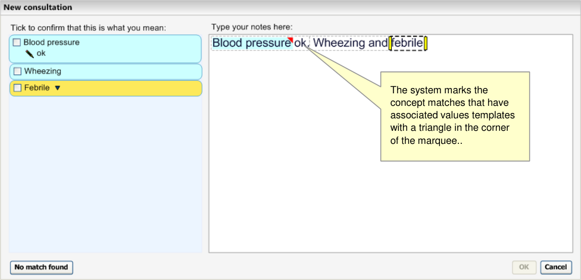
HSCIC Controlled Document

Figure 27: Dialog Box for Entering Values

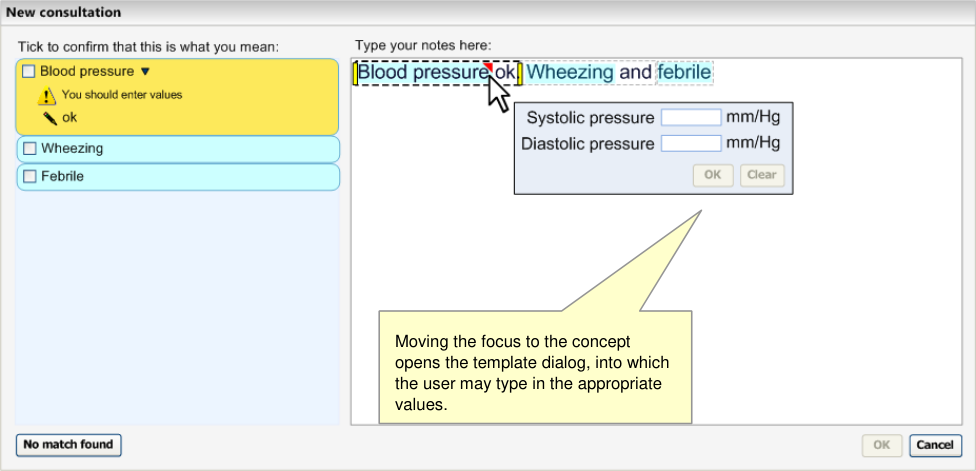

The case of ‘Blood pressure reading’ also highlights an instance of a ‘composite’ expression, where multiple concepts are combined to form a single output unit. Real world concepts (for example, BP 120/80 mmHg) are often expressed quite differently in SNOMED-CT (in this case, as a combination of diastolic and systolic blood pressure). Although the atomic components of these relationships are found in SNOMED-CT, the relationships are not. Therefore, the relationships which create the composites may need to be modelled outside of SNOMED-CT, in an external information model.

Figure 28: Example of a Composite of Three Concepts ('Blood Pressure Reading')

_**2.3.2.1**_ _**Guidance**_

The system:

- Should identify where matched concepts are associated with or require values

- Should encourage users to enter values where appropriate

 Could provide fields into which users can enter these values

 Could provide a process whereby it marks those expressions which could require values and display a floating dialog when the focus moves to these expressions

- Should pre-populate the template with any values it has identified during the text parsing

process

Page 29

Copyright ©2013 Health and Social Care Information Centre

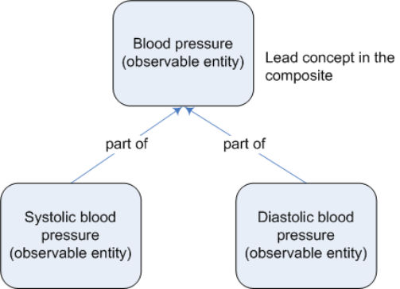
HSCIC Controlled Document

- Should identify elements of composites and communicate them as a single composite (in

addition to the individual elements), such as ‘Blood pressure’

- Should be able to recognise composite values entered alongside a concept

- Should encourage users to enter in further values that comprise the composite by offering

entry fields where appropriate

**Note**

- Quantity and unit values, and their relationships with appropriate SNOMED-CT concepts, in the main, will require additional information model data.

- Composites do not exist in the SNOMED-CT Concept Model. Expressing these relationships requires metadata.

_**2.3.2.2**_ _**How to Use the Design Guide Entry**_

####  Offer default units See Figure 27

Table 15: How to Use the Design Guide Entry

_**2.3.2.3**_ _**How Not to Use the Design Guide Entry**_

####  Offer default values n/a This could lead to the system encoding

values that the user had not entered

Table 16: How Not to Use the Design Guide Entry

_**2.3.2.4**_ _**Benefits and Rationale**_

Offering appropriate entry fields for composite values could assist users in their workflow. Validation of the measurements should help to prevent errors, and is therefore important for patient safety. The system should offer the flexibility to the user of either typing the values into the main notes, or adding the values at the point of confirming the note (that is, in the expanded encoding dialog).

These templates have been presented to clinicians in usability tests, and clinicians have responded positively to them, saying that they understood what they are for and that they would be useful.

_**2.3.2.5**_ _**Confidence Level**_

_**High**_

- Should identify where matched concepts are associated with or require values

- Should encourage users to enter values where appropriate

 Could provide fields into which users can enter these values

_**Medium**_

- Could provide a process whereby it marks those expressions which could require values

and display a floating dialog when the focus moves to these expressions

Page 30

Copyright ©2013 Health and Social Care Information Centre

HSCIC Controlled Document

### 3 DOCUMENT INFORMATION

#### 3.1 Terms and Abbreviations

CUI Common User Interface

FSN Fully Specified Name

NHS National Health Service

NHS CFH NHS Connecting for Health

SCT Systematised Nomenclature of Medicine – Clinical Terms

SNOMED-CT Systematised Nomenclature of Medicine-Clinical Terms

TLC Top Level Concept

UI User Interface

Table 17: Terms and Abbreviations

#### 3.2 Definitions

NHS Entity Within this document, defined as a single NHS organisation or group that is operated within a single technical infrastructure environment by a defined group of IT administrators.

The Authority The organisation implementing the NHS National Programme for IT (currently NHS Connecting for Health)

Current best practice Current best practice is used rather than best practice, as over time best practice guidance may change or be revised due to changes to products, changes in technology, or simply the additional field deployment experience that comes over time.

Context Model A model that specifies relationships relating to semantic context that has been defined outside of the SNOMED-CT Concept Model

Table 18: Definitions

#### 3.3 Nomenclature

_**Cross References**_

Cross references to other sections in the current document comprise a section number. Cross references may also be to figures and tables, where the caption number only might be shown.

References to other Project documents are shown in _italics_. Footnotes with additional details may also be used.

Page 31

Copyright ©2013 Health and Social Care Information Centre

HSCIC Controlled Document

#### 3.4 References

**R1.** NHS CUI Design Guide Workstream - Table of Contents 2.0.0.0 30-Oct-2006

**R2.** NHS CUI Design Guide Workstream - Design Guide Entry - Terminology Matching

**R3.** NHS CUI Design Guide Workstream - Design Guide Entry - Terminology - Display Standards for Coded Information

**R4.** NHS CUI Design Guide Workstream - Design Guide Entry - Terminology - PostCoordination

Table 19: References

1.0.0.0 27-Mar-2007

2.0.0.0 27-Mar-2007

2.0.0.0 27-Mar-2007

Page 32

Copyright ©2013 Health and Social Care Information Centre

HSCIC Controlled Document

### APPENDIX A LIST OF HIGH LEVEL REQUIREMENTS

**Note**

Requirements shown in greyed-out text have been withdrawn.

#### PART I General

**A1** **General**

A1.1 The system will support encoding solely from keyboard-driven interaction.

A1.2 The system will not prevent effective and efficient encoding with other entry devices, such as voice recognition or touch pad.

A1.3 The system will facilitate the collection of valid, unambiguous clinical statements (these will be SNOMED codes with additional context as necessary), potentially covering all parts of the care process.

A1.4 The system will respond to the changing coding requirements of differing clinical noting contexts, and will communicate these to the user.

A1.5 The system will be able to deal with the following noting contexts:

 Free-form noting without any, or very little context

 Free-form noting within a workflow context

 Free-form noting under headings

 Heavily contextualised free-form noting within a structured form

A1.6 The system will be able to deal with form creation (that is, finding relevant SNOMED-CT codes during form authoring, such as by a GP.

#### PART II  Searching

**B1** **Setting Context**

B1.1 The system will provide users with a means of limiting a search to contextually relevant portions of SNOMED-CT.

B1.2 The system will clearly communicate which contextually relevant portions of SNOMED-CT the users are searching.

B1.3 The system will be capable of automatically setting context. This automatic contextual filtering could be in response to previously entered text/encoded terms.

B1.4 The system will assist users’ searches by allowing them to expand, contract, or sort a set of search results according to meaningful contextual categories (such as 'symptoms' or 'procedures').

B2.1 The system will be able to handle free-form text entry, according to context.

B2.2 The system will attempt to structure (that is, ‘parse’) as much of the free text that it can, but will give users the option of saving it as free-form text, according to context.

B2.3 The system will offer users an efficient way of triggering an encoding interaction.

B2.4 Users will be able to modify the search term quickly and easily.

B2.5 The system will be capable of fuzzy matching text (such as in the event of a spelling error) and of offering a ‘best guess’ plus a means of viewing alternative matches.

Page 33

Copyright ©2013 Health and Social Care Information Centre

HSCIC Controlled Document

**B2** **Enter and Select Text**

B2.6 The system will not commit to the record any encoded terms that have not been confirmed by the user.

B2.7 The system will provide ‘best guess’ concepts for words within the free text.

B2.8 The system will be able to handle a limited range of structured shorthand that exists outside of SNOMED-CT.

B2.9 The system will be able to offer predictive matching of SNOMED-CT concepts (including both single words and phrases).

B2.10 The system will give users flexibility as to when they encode text prior to committing it to the record.

**B3** **Shortcuts and Abbreviations**

B3.1 Users will be able to search on abbreviations found within SNOMED-CT.

B3.2 Users will be able to define and search their own abbreviations ('shortcodes').

B3.3 The system will display, in the encoded notes, both the abbreviation entered by users, and its expansion (either preferred term or synonym).

B3.4 Users will be able to enter codes by means of keyboard shortcuts.

B3.5 Users will be able to search on single or multiple word prefixes, independent of order.

B3.6 Users will be able to define their own keyboard shortcuts.

B3.7 When displaying results, matches from all types of abbreviations will be shown and will be clearly distinguished from each other.

**B4** **Listing Matching Concepts**

B4.1 The system will display categories, (for example, TLCs), to which the term belongs, where appropriate, to ensure that users can distinguish between similar sounding results.

B4.2 The system will ensure that users can easily navigate through long lists of results.

B4.3 The system will allow users to move from a search result item to related terms (for example, a more specific term).

B4.4 The system will ensure that users see a clear definition of, and the preferred term for, a concept, before committing it to the record.

B4.5 The system will provide access to the full text of a SNOMED-CT term (up to 255 characters).

B4.6 The system will be able to communicate multiple kinds of search results ranking within the same list, where there is exceptional ranking.

B4.7 The system will allow users to reorder search lists according to a method of ranking that is distinct from the default order.

B4.8 The system will discriminate between the results returned, according to relevance (if known).

B4.9 The system will communicate if truncation has occurred.

B5.1 The system will allow users to specify that a term is only nearly correct.

B5.2 The system will allow users to record that they have given up trying to encode a concept.

B5.3 The system will be able to log approximate codes so that NHS CFH can determine whether changes are required to the terminology or the terminology user interface.

B5.4 The system will allow users to qualify a ‘nearly correct’ term with additional text.

B5.5 The system will allow users to record ‘unencodable’ concepts as free text.

B5.6 In the event of a poor match (indicated by the user), the system will allow and encourage users to navigate back up the hierarchy to a more general term.

Page 34

Copyright ©2013 Health and Social Care Information Centre

HSCIC Controlled Document

#### PART III Elaboration and Post Coordination

**C1** **General**

C1.1 Users will be able to refine/select certain key attributes of a concept.

These attributes may be based on SNOMED-CT relationships such as qualifiers, surgical procedures, and (body) finding sites. They may include axis modifiers (based on the Context Model).

C1.2 The system will allow users to negate disorder concepts.

We will outline the issues involved with the system handling user attempts to negate concepts that are not disorders. We should illustrate the issues of negation of findings. This will probably lead to SCT authoring requirements, or more metadata.

C1.3 If users have included negation text in a search, the system should be able to identify pre-coordinated negated concepts in search results and present them differently (or omit them).

C1.4 Users will be able to refine the original concept without necessarily losing the refined attributes.

For example, they start off with ‘muscle injury’, by searching on the text ‘musc’:

 muscle injury

 Finding site = muscle structure

 skeletal muscle structure

 skeletal muscle part

 tendon structure

 hamstring tendon

At this point, the user may wish to refine the original concept ‘muscle injury’ to ‘muscle strain’, but will not want to lose the refined, ‘hamstring tendon’.

C1.5 The system will need to handle (‘error’) situations where the refinement causes mismatches with other attribute values.

C1.6 Users will be able to simultaneously refine multiple attribute concepts of a given concept.

For example, in addition to specifying the body site, the user may also want to specify severity (such as ‘moderate’).

C1.7 The system will present all the appropriate attribute concepts for a given concept. This may need to be a subset, or even a superset, of all the attribute relations currently 'allowable' in the published Terminology data.

C1.8 Where appropriate and feasible, the system will provide graphical navigation of body sites.

C1.9 The system will allow users to specify a small set of elaboration values that are not defined by SNOMED-CT nor Context Model relationships. These will include time values and values defined by additional Informational models (such as blood pressure readings and temperature readings).

C1.10 Where users can enter numerical values, appropriate units must be presented to users by the system. Where there is a choice of units, the system must present the choice clearly and explicitly to communicate the user’s choice.

C1.11 The system will encourage users to refine mandatory attributes and values (where appropriate).

This may arise when the user selects a certain attribute which must be refined in order to make sense (for example, the user could not select the attribute ‘severities’ without refining it further).

C1.12 The system will allow users to hierarchically refine an attribute through multiple levels.

C1.13 The system will allow users to hierarchically refine multiple attributes simultaneously.

C1.14 Users will have the flexibility to be able to undo and/or re-refine any elaboration, whether it be proposed by the system or selected by the user.

C1.15 Users will be able to apply elaboration to more than one concept if the relationship is allowed.

C1.16 Users will be able to move elaboration from one concept to another if the relationship is allowed.

C1.17 The system will attempt to render concepts and their elaboration in a meaningful way.

C1.18 The system will clearly communicate attribute relationships, both in a structured view and in a ‘narrative’ view.

Page 35

Copyright ©2013 Health and Social Care Information Centre

HSCIC Controlled Document

**C2** **System Identifies Elaboration Within Text**

C2.1 The system will identify potential attribute relationships between concept matches in free text, and will promote them in the search process.

C2.2 The scope for any system-led search for attribute relationship matches or other elaboration in a passage of text will be limited (by the system) and limitable (by the user).

For example, the system may only be required to search within a marquee, which in turn is automatically defined by full stops.

Further limitations may be required to reduce performance demands, such as only allowing up to four potential codes within a grouping marquee.

C2.3 The system will identify potential elaboration within the typed notes and will offer relevant elaboration options during the encoding process.

For example, by presenting and pre-populating elaboration fields.

C2.4 The system will capture ‘free’ text that has been associated with an encodable term, but has not been encoded.

**C3** **Users Associate Free Text with Encodable Items**

C3.1 The system will provide users with a mechanism for associating free-text notes that they have entered with an encodable concept.

C3.2 The system will allow users to adjust what text is converted into structured elaboration for a concept.

C3.3 The system will provide users with a mechanism to enter additional text notes with an encodable concept.

C3.4 The system will warn users if text notes contain qualifications (such as negation) that significantly affect the meaning of a concept, or conflict with other specified or assumed qualifiers.

**C4** **Composites**

C4.1 The system will prompt users to select related concepts that form meaningful composites.

#### PART IV Display of Coded Information

D1.1 The display will be flexible, so that it can fit in a number of different spaces and sizes.

D1.2 The system will have the capability to display both SNOMED-CT-encoded and unencoded notes.

D1.3 The system will clearly distinguish between free text that, upon committing to the record, will be SNOMED-CT encoded and that which will not.

D1.4 The system will allow users to edit SNOMED-CT-encoded terms (that is, re-encode them) before committing them to the record.

D1.5 The system will display polished ‘prose’ as well as the structured view for post-coordinated concept.

D1.6 The system will ensure that the display of ‘prose’ and ‘encoded’ notes are consistent with each other.

D1.7 The system will be able account for a number of application real estate sizes and shapes.

D1.8 The system will allow users to view their original text entry, that is, the last edit of the text they entered prior to encoding.

D2.1 The system will communicate which text is potentially SNOMED-CT encodable.

Page 36

Copyright ©2013 Health and Social Care Information Centre

HSCIC Controlled Document

**D2** **Communicating What Can be Encoded**

D2.2 The system will distinguish between text that can be encoded as a standalone SNOMED-CT concept, and text that can be encoded only as elaboration to a concept.

For example, we would want the system to indicate that qualifier text, such as ‘mild’ can be encoded in a structure manner, but only as elaboration to another concept (for example, ‘gastroenteritis’); we would not want the user to be able to encode ‘mild’ by itself.

D2.3 The system will clearly distinguish between potentially encodable text and encoded text. Potentially encodable text will be committed to the record as free text if users do not encode it.

This becomes even more critical if the system displays ‘best matches’ (that is, predictive code matching). Users must be fully aware of what will be saved as a code and what will be saved as free text, and we have a requirement that all instances of encoded concepts must be confirmed by the user prior to committing them to the record; if not, the ‘concepts’ will remain as unstructured text.

D2.4 The system will display the top match for each potentially encodable concept, in addition to the text typed in by the user.

D3.1 The system will communicate the relationship between codes and their elaboration on display.

D3.2 The system will communicate potential relationships between concepts.

D3.3 The system will distinguish between potential relationships and user-confirmed relationships between concepts.

Page 37

Copyright ©2013 Health and Social Care Information Centre

HSCIC Controlled Document

### REVISION AND SIGNOFF SHEET

#### Change Record

20-Jun-2006 Giles Colborne 0.0.0.1 Initial draft for review/discussion

26-Jul-2006 Laura Dromundo

Ben Luff

0.0.0.2 Updates to incorporate final Deliverable information

28-Jul-2006 Paul Robinson 0.0.0.3 Formatting updates

02-Aug-2006 Vivienne Jones 0.0.0.4 Copyedit

10-Aug-2006 Laura Dromundo

Ben Luff

0.0.0.5 Final Updates

14-Aug-2006 Vivienne Jones 0.0.0.6 Copyedited following updates from informal review with the Authority.

15-Aug-2006 Ben Luff

Laura Dromundo

0.0.0.7 Changes in response to copy edit

15-Aug-2006 Vivienne Jones 0.0.0.8 Copyedit on updates.

15-Aug-2006 Ben Luff 0.0.0.9 Changes in response to copy edit

16-Aug-2006 Paul Robinson 0.0.0.10 Final check of document

16-Aug-2006 Vivienne Jones 0.1.0.0 Document cleansed. Informal reviews carried out with the Authority, hence, Working Baseline not used previously. Moved to Baseline Candidate.

18-Aug-2006 Vivienne Jones 1.0.0.0 Baseline following Acceptance

26-Feb-2007 Ben Luff 1.0.0.1 Update Release 3 document

27-Feb-2007 Marc Brown 1.0.0.2 Copyedit

27-Feb-2007 Igor Laketic 1.0.0.3 Accepted changes

01-Mar-2007 Marc Brown 1.0.1.0 Document cleansed

12-Mar-2007 Ben Luff 1.0.1.1 Changes post audience review

13-Mar-2007 Vivienne Jones 1.0.1.2 Copyedited updates

13-Mar-2007 Igor Laketic 1.0.1.3 Accepted changes

13-Mar-2007 Vivienne Jones 1.1.0.0 Document cleansed

20-Mar-2007 Ben Luff 1.1.0.1 Changes post audience review

20-Mar-2007 Marc Brown 1.1.0.2 Copyedit of changes

20-Mar-2007 Igor Laketic 1.1.0.3 Accepted changes

21-Mar-2007 Marc Brown 1.2.0.0 Cleansed, Baseline Candidate

27-Mar-2007 Vivienne Jones 2.0.0.0 Baseline following Acceptance

25-Jul-2007 Vivienne Jones 2.0.0.0 Preface added so the document can be released to the Distribution Mechanism. The date fields were changed to static text as the original acceptance date needs to maintained from a cross-reference point of view.

Document Status has the following meaning:

- **Drafts 0.0.0.X**  - Draft document reviewed by the Microsoft CUI project team and the

Authority designate for the appropriate Workstream. The document is liable to change.

Page 38

Copyright ©2013 Health and Social Care Information Centre

HSCIC Controlled Document

- **Working Baseline 0.0.X.0**  - The document has reached the end of the review phase and

may only have minor changes. The document will be submitted to the Authority CUI project team for wider review by stakeholders, ensuring buy-in and to assist in communication.

- **Baseline Candidate 0.X.0.0**  - The document has reached the end of the review phase and

it is ready to be frozen on formal agreement between the Authority and the Company

- **Baseline X.0.0.0**  - The document has been formally agreed between the Authority and the

Company

Note that minor updates or corrections to a document may lead to multiple versions at a particular status.

#### Audience

The audience for this document includes:

- **Authority CUI Manager / Project Sponsor** . Overall Project Manager and sponsor for the

NHS CUI Project within the Authority.

- **Authority NHS CUI Design Guide Workstream Project Manager.** Responsible for

ongoing management and administration of the Workstream.

- **The Authority Project Team** . This document defines the approach to be taken during this

assessment and therefore must be agreed by the Authority.

- **Microsoft NHS CUI Team** . This document defines the approach to be taken during this

assessment, including a redefinition of the NHS CUI Design Guide Workstream strategy.

#### Open Issues Summary

None

Table 20: Open Issues Summary

#### Reviewers

Paul Robinson Program Manager 0.0.0.3 28-Jul-2006

Ben Luff User Experience Consultant 0.0.0.5 10-Aug-2004

Laura Dromundo Program Manager 0.0.0.5 10-Aug-2004

Giles Colborne User Experience Consultant 0.0.0.1 20-Jun-2006

Roarke Batten NHS CFH Programme Manager 1.1.0.0 16-Mar-2007

Peter Johnson NHS CFH Clinical Architect 1.1.0.0 16-Mar-2007

Kate Verrier-Jones NHS CFH Clinical Advisor 1.1.0.0 16-Mar-2007

Ed Cheetham NHS CFH Clinical Advisor 1.1.0.0 16-Mar-2007

Mike Carey NHS CFH Toolkit Workstream Lead 1.1.0.0 16-Mar-2007

Page 39

Copyright ©2013 Health and Social Care Information Centre

HSCIC Controlled Document

#### Distribution

Roarke Batten NHS CFH Programme Manager

Kit Lewis NHS CFH Design Guide Workstream Lead

Tim Chearman NHS CFH Design Guide Workstream Lead

Peter Johnson NHS CFH Clinical Architect

Kate Verrier-Jones NHS CFH Clinical Advisor

Ed Cheetham NHS CFH Clinical Advisor

Mike Carey NHS CFH Toolkit Workstream Lead

#### Document Properties

Document Title NHS CUI Design Guide Workstream Design Guide Entry – Terminology - Elaboration

Author NHS CUI Programme Team

Restrictions **RESTRICTED – COMMERCIAL; MICROSOFT COMMERCIAL;** Access restricted to: NHS CUI Project Team, Microsoft NHS Account Team

Creation Date 20 June 2006

Last Updated 23 June 2015

**Copyright:**

You may re-use this information (excluding logos) free of charge in any format or medium, under the terms of the Open Government Licence. To view this licence, visit [nationalarchives.gov.uk/doc/open-government-licence or email psi@nationalarchives.gsi.gov.uk.](https://web.nhs.net/OWA/redir.aspx?C=dMnSAL43xUOp9X_SOcscV9mT5A0smdBIh1_vxjdSDVCERI33v7-idn6tNFCNwJYUR1PxIW-Hd-E.&URL=http%3a%2f%2fnationalarchives.gov.uk%2fdoc%2fopen-government-licence)

Page 40

Copyright ©2013 Health and Social Care Information Centre
