_Prepared for_

**NHS Connecting for Health**

**Tuesday, 27 March 2007**

**Version 1.0.0.0 Baseline**

_Prepared by_

**NHS CUI Programme Team**

**Cuistakeholder.mailbox@hscic.gov.uk**

_Contributors_

**Ben Luff**

HSCIC Controlled Document

### PREFACE

**Documents replaced by this document**

Design Guide Entry - Terminology - Disambiguation and Error Correction 1.0.0.0

Design Guide Entry - Terminology - Searching 1.0.0.0

**Documents to be read in conjunction with this document**

Design Guide Entry - Terminology - Display Standards for Coded Information 2.0.0.0

Design Guide Entry - Terminology - Elaboration 2.0.0.0

Design Guide Entry - Terminology - Post Coordination 2.0.0.0

Terminology Release 4 Summary _(Presentation)_ 1.0.0.0

In using this document, please be aware that the effect of recent Patient Safety Assessments (PSAs)
executed for the NHS CUI programme have not yet been addressed in the guidance in this document.
Any such effect the PSAs may have on the content and guidance contained herein, will be included in
a subsequent version of this document.

**This document was prepared for NHS Connecting for Health which ceased to exist on 31 March**
**2013. It may contain references to organisations, projects and other initiatives which also no longer**
**exist. If you have any questions relating to any such references, or to any other aspect of the**
**[content, please contact cuistakeholder.mailbox@hscic.gov.uk](mailto:cuistakeholder.mailbox@hscic.gov.uk)**

Page ii

Copyright ©2013 Health and Social Care Information Centre

HSCIC Controlled Document

### TABLE OF CONTENTS

_**1**_ _**Introduction .......................................................................................................................................... 1**_

1.1 Overview ......................................................................................................................................... 1

1.2 Area of Focus ................................................................................................................................. 2

1.3 References to Table of Contents Document .................................................................................. 5

_**2**_ _**Recommendation and Guidance ........................................................................................................ 6**_

2.1 Approaches to Matching SNOMED-CT Concepts to Clinicians’ Notes .......................................... 6

2.1.1 Single Concept Approach to Matching .................................................................................... 8

2.1.2 Text Parser Approach to Matching .......................................................................................... 9

2.2 Inputting Notes .............................................................................................................................. 11

2.2.1 Input in the Text Parser Approach......................................................................................... 12

2.2.2 Input in the Single Concept Approach ................................................................................... 15

2.2.3 Additional Text Input .............................................................................................................. 20

2.2.4 Spell-Checker Input ............................................................................................................... 23

2.2.5 Dealing with Clinicians’ Shorthand ........................................................................................ 26

2.3 Matching ....................................................................................................................................... 28

2.3.1 Matching Input Text Against the SNOMED-CT Database .................................................... 28

2.3.2 Presenting SNOMED-CT Matches ........................................................................................ 39

2.3.3 Selecting and Confirming SNOMED-CT Matches ................................................................. 48

2.3.4 Dealing with Abbreviations .................................................................................................... 53

2.3.5 ‘Undoing’ Matches ................................................................................................................. 56

2.4 Context ......................................................................................................................................... 58

2.4.1 Optimising Matching by the Use of Contextual Limitation ..................................................... 60

2.5 Refinement ................................................................................................................................... 66

2.5.1 Refining a Selected Concept ................................................................................................. 66

_**3**_ _**Next Steps .......................................................................................................................................... 72**_

_**4**_ _**Document Information ...................................................................................................................... 74**_

4.1 Terms and Abbreviations .............................................................................................................. 74

4.2 Definitions ..................................................................................................................................... 74

4.3 Nomenclature ............................................................................................................................... 74

4.4 References ................................................................................................................................... 75

_**APPENDIX A**_ _**List of High Level Requirements ................................................................................... 76**_

PART I General .................................................................................................................................. 76

PART II Searching .............................................................................................................................. 76

Page iii

Copyright ©2013 Health and Social Care Information Centre

HSCIC Controlled Document

PART III Elaboration and Post Coordination ................................................................................... 78

PART IV Display of Coded Information ............................................................................................ 79

Page iv

Copyright ©2013 Health and Social Care Information Centre

HSCIC Controlled Document

### 1 INTRODUCTION

This document provides guidance and recommendations with rationale for aspects of Terminology
user interfaces related to searching for clinical codes.

This document should be read in conjunction with the following Design Guide documentation:

 _NHS CUI Design Guide Workstream -_ _Design Guide Entry - Terminology - Display_

_Standards for Coded Information_ **{R3}**

 _NHS CUI Design Guide Workstream -_ _Design Guide Entry - Terminology - Elaboration_ **{R4}**

 _NHS CUI Design Guide Workstream -_ _Design Guide Entry - Terminology - Post_

_Coordination_ **{R2}**

This guidance is based in part upon user testing performed with the designs outlined in this
document. For further information, refer to the following documents:

 _NHS National Programme for Information Technology’s ‘SNOMED CT Post-coordination_

_rules Guidance’_ **{R5}**

 _NHS Common User Interface Programme, Release 4 Terminology Jan 2007, User_

_Feedback_ **{R6}**

 _NHS Common User Interface Programme, Release 4 Terminology, Nov 2006, User_

_Feedback_ **{R7}**

 _NHS CUI Design Guide Workstream, Terminology Demonstrator and Wireframe User_

_Feedback_ **{R8}**

#### **1.1 Overview**

This document is for anyone whose role includes screen design, implementation or assessment of
a NHS clinical application and who is involved in creating or evaluating terminology user interfaces.

Terminology user interfaces operate within a note-taking environment. These environments fall into
three categories, (as illustrated in Figure 1 and described below), each of which require different
guidance:

 **Forms**

 The user makes notes by selecting options, not by entering text

 An encoding interface is not needed–the clinical codes should be embedded within the
form itself

 **Single concept matching**

 The user makes notes by typing the note for a single concept (such as 'asthma'), and
the system returns SNOMED-CT [®] matches. The user can then choose an appropriate
match, refine the concept, then elaborate it with a combination of free text, qualifying
SNOMED-CT attributes (such as 'severe') and numerical values.

 Encoding interfaces require components to match and elaborate SNOMED-CT
concepts.

 **Text parser matching**

 The user makes notes by writing unconstrained text, while the system matches words
and phrases against the SNOMED-CT database, or a constrained subset of the
database, and displays the matches. The user then has the option to do one of the
following:

 Confirm that they want to encode these SNOMED-CT expressions

Page 1

Copyright ©2013 Health and Social Care Information Centre

HSCIC Controlled Document

 Browse alternative matches

 Refine a selected match

 Leave the note unencoded, in which case it will be saved as unstructured text rather
than as a SNOMED-CT expression

 Encoding interfaces require components to identify and match SNOMED-CT concepts,
as well as build post-coordinated SNOMED-CT expressions, based upon sanctioned
attribute relationships, from within the text. The interface must also be able to identify
terms and relationships from additional informational models in order to support
accurate and comprehensive clinical noting.

Figure 1 illustrates all three categories: forms (left), single concept matching (centre) and Text
parser matching (right).

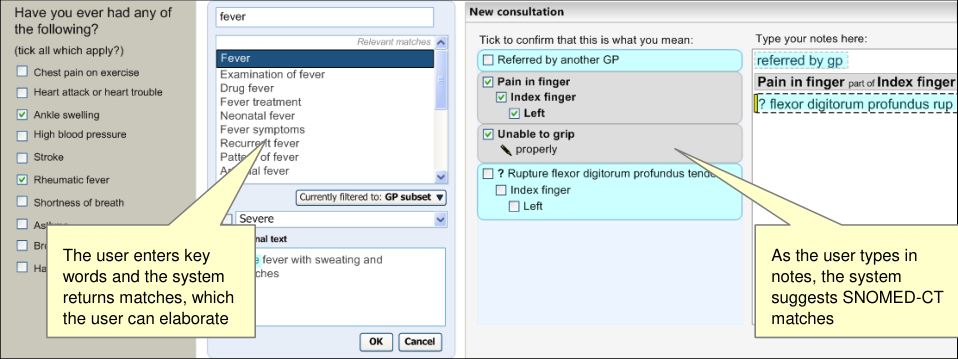

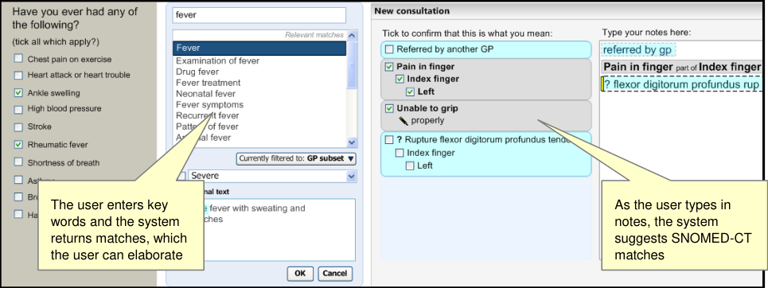

Figure 1: Styles of Encoding

Medical language is full of abbreviations and jargon, some of which have more than one meaning.
By coding clinical statements, they can be shared unambiguously. This should improve patient
safety by reducing confusion or errors, due to ambiguity in clinical notes.

Encoding also opens up important opportunities, such as:

 Unambiguously sharing clinical statements between clinicians in different disciplines or

institutions

 Using decision support mechanisms, based on codes within clinical statements, to enhance

patient safety

 Auditing clinical activity by using codes to locate and report on specific types of information

within patient records

 Researching clinical practice or outcomes in the NHS by extracting codes from electronic

patient records

NHS Connecting for Health (CFH) has chosen SNOMED-CT as the terminology for encoding
clinical statements.

Please note that, although the Common User Interface (CUI) team will show how an encoding
interface should work, it does not have responsibility for determining what and how much the
clinician encodes. Determining what each clinician should or should not encode is the responsibility
of the NHS.

#### **1.2 Area of Focus**

This document describes Terminology matching, covering the following areas:

Page 2

Copyright ©2013 Health and Social Care Information Centre

HSCIC Controlled Document

 Set context

 Enter text

 Display expression matches

 Browse alternative/ Refine selected match(es)

 Leave as unstructured text

 Confirm match(es)

 Offer opportunity to request improvement

These areas of matching are highlighted in the User Interaction Model, in Figure 2 below:

Copyright ©2013 Health and Social Care Information Centre

Page 3

HSCIC Controlled Document

Figure 2: User Interaction Model

Please note that this guidance covers mechanisms for encoding in a single interaction and at the
point of care. It does not cater for ‘post-hoc’ encoding, either by the clinician who first entered the
note or by another person, such as dedicated ‘coder’. In the future the design solution implied by
the guidance could be adapted to allow post-hoc encoding, but further consideration would need to
be given to this guidance, especially given the potential safety risks involved with moving the noting
activity away from the patient interaction that it describes.

Page 4

Copyright ©2013 Health and Social Care Information Centre

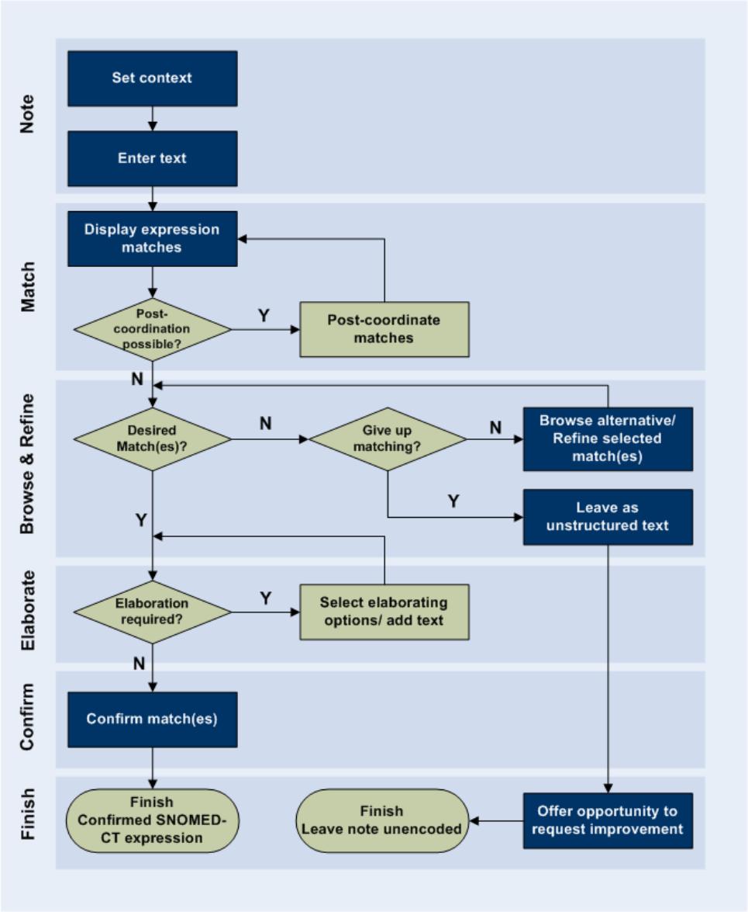
HSCIC Controlled Document

Also, this guidance does not cover mechanisms for storing clinical noting data (including SNOMEDCT data); it only shows how to build interfaces into which the user may enter the notes.

Please note that the latest guidance outlined in this document has not been subject to a formal
Patient Safety Assessment (PSA), conducted by the NHS. Such an assessment is expected, and
potential updates to the guidance may occur following its completion.

#### **1.3 References to Table of Contents Document**

The document _Table of Contents_ **{R1}** outlines every specific area of focus to be covered by the
Design Guide. Each area of focus has an accompanying Design Guide Entry document. Table 1
(below) indicates the areas of focus covered by this Design Guide Entry.

4.1 UI Interaction Model for Terminology Matching

Table 1: References to Table of Contents Documents

Copyright ©2013 Health and Social Care Information Centre

Page 5

HSCIC Controlled Document

### 2 RECOMMENDATION AND GUIDANCE

#### **2.1 Approaches to Matching SNOMED-CT Concepts to Clinicians’** **Notes**

The usability of entering or inputting notes into the interface, against which the system can match
SNOMED-CT concepts, is essential. Clinicians spend a large proportion of their working day writing
notes, and the effects of miswriting the notes or failing to include an important detail could impact
on patient care and safety. This risk could be increased using encoded noting as encoding
automatically lends a greater legitimacy to a note; one is more likely to assume that an encoded
term is accurate and appropriate than a handwritten note. In addition, it could be more difficult to
see where the clinician went wrong in an encoded note, rather than in a handwritten note, because
the latter expresses nuances relating to the meaning, and this could be lost in encoded notes (for
example, the location of words in relation to one another).

In addition to its accuracy, the success of an encoding system will hinge on the levels of flexibility
and efficiency experienced by clinicians, for example, if noting interferes too much with the
clinician’s interaction with their patient, which is often the primary task at hand, or it takes so much
time as to delay their already busy workflow, the system will be rejected by clinicians.

The issue of flexibility also extends to the fact that noting styles and requirements vary greatly
across the clinician audience, at specialty level, context, Trust, practice and at individual levels. An
obvious distinction exists between Primary, Secondary and Mental Health Care; the Primary Care
clinician typically writing terse, efficient notes, the Mental Health clinician writing expansive, highly
descriptive notes, and the Secondary Care clinician’s noting style falling somewhere in between.
Again, failure to accommodate one or more of these noting styles, or, worse, compromising on all
three, would also lead to charges that the system is not fit for purpose and ultimately to a lack of
adoption.

It is essential that the interface provides:

 Accuracy

 Efficiency

 Flexibility

The guidance in this Design Guide Entry aims to meet the NHS CFH requirements listed in Table 2
(below). The requirements which have been greyed out are those that were originally approved by
the CFH CUI team, but which have subsequently been dropped, owing to theoretical and technical
reasons, with the consent of the team. The full table of requirements can be found in APPENDIX A.

A1.2 The system will not prevent effective and efficient encoding with other entry devices, such as voice recognition or touch
pad.

A1.3 The system will facilitate the collection of valid, unambiguous clinical statements (these will be SNOMED codes with
additional context as necessary), potentially covering all parts of the care process.

A1.4 The system will respond to the changing coding requirements of differing clinical noting contexts, and will communicate
these to the user.

A1.5 The system will be able to deal with the following noting contexts:

 Free-form noting without any, or very little context

 Free-form noting within a workflow context

 Free-form noting under headings

 Heavily contextualized free-form noting within a structured form

Page 6

Copyright ©2013 Health and Social Care Information Centre

HSCIC Controlled Document

B1.1 The system will provide users with a means of limiting a search to contextually relevant portions of SNOMED-CT.

B1.2 The system will clearly communicate which contextually relevant portions of SNOMED-CT the users are searching.

B1.3 The system will be capable of **automatically** setting context. This automatic contextual filtering could be in response to
previously entered text/encoded terms.

B1.4 The system will assist users’ searches by allowing them to expand, contract, or sort a set of search results according to
meaningful contextual categories (such as 'symptoms' or 'procedures').

B2.1 The system will be able to handle free-form text entry, according to context.

B2.2 The system will attempt to structure (that is, ‘parse’) as much of the free text that it can, but will give users the option of
saving it as free-form text, according to context.

B2.3 The system will offer users an efficient way of triggering an encoding interaction.

B2.4 Users will be able to modify the search term quickly and easily.

B2.5 The system will be capable of fuzzy matching text (such as in the event of a spelling error) and of offering a ‘best guess’
plus a means of viewing alternative matches.

B2.6 The system will not commit to the record any encoded terms that have not been confirmed by the user.

B2.7 The system will provide ‘best guess’ concepts for words within the free text.

B2.8 The system will be able to handle a limited range of structured shorthand that exists outside of SNOMED-CT.

B2.9 The system will be able to offer predictive matching of SNOMED-CT concepts (including both single words and phrases).

B2.10 The system will give users flexibility as to when they encode text prior to committing it to the record.

B3.1 Users will be able to search on abbreviations found within SNOMED-CT.

B3.3 The system will display, in the encoded notes, both the abbreviation entered by users, and its expansion (either Preferred
term or synonym).

B3.5 Users will be able to search on single or multiple word prefixes, independent of order.

B4.1 The system will display categories (for example, TLCs), to which the term belongs (where appropriate) to ensure that
users can distinguish between similar sounding results.

B4.2 The system will ensure that users can easily navigate through long lists of results.

B4.3 The system will allow users to move from a search result item to related terms (for example, a more specific term).

B4.4 The system will ensure that users see a clear definition of, and the Preferred term for, a concept, before committing it to
the record.

B4.5 The system will provide access to the full text of a SNOMED-CT term (up to 255 characters).

B4.6 The system will be able to communicate multiple types of ranking of search results within the same list, where there is
exceptional ranking.

B4.7 The system will allow users to reorder search lists according to a method of ranking distinct from the default order.

B4.8 The system will discriminate between the results returned, according to relevance (if known).

B4.9 The system will communicate if truncation has occurred.

B5.1 The system will allow users to specify that a term is only nearly correct.

B5.2 The system will allow users to record that they have given up trying to encode a concept.

B5.3 The system will be able to log approximate codes so that NHS CFH can determine whether changes are required to the
terminology or the terminology user interface.

B5.6 In the event of a poor match (indicated by the user), the system will allow and encourage users to navigate back up the
hierarchy to a more general term.

Page 7

Copyright ©2013 Health and Social Care Information Centre

HSCIC Controlled Document

C1.1 Users will be able to refine/select certain key attributes of a concept.

C4.1 The system will prompt users to select related concepts that form meaningful composites.

Table 2: NHS CFH Requirements for Matching

##### **2.1.1 Single Concept Approach to Matching**

As a minimum requirement, the system should allow users to find a single SNOMED-CT concept
by typing in the word, or words that comprise this concept. The system will then present the user
with a list of matches from which the user is to select the most appropriate. The user then has the
opportunity to refine this concept by (i) browsing related concepts, (ii) adding additional ‘free’
supporting text, and (iii) selecting any mandatory qualifiers.

Figure 3: Example of a Single Concept Matching Dialog

The system then records this concept (both its Concept ID and the specific Description ID that the
user has chosen, for example, ‘Preferred term’), and the additional elaboration.

_**2.1.1.1**_ _**Guidance**_

The system:

 Must allow the user to search for a single concept and immediately view the possible

matches (‘single concept matching’)

 This function should be available as a standalone process; or

 As part of matching refinement in a Text parser approach

 Must allow the user to add some additional ‘free’ text (that is, unencoded text)

 This function must be available as part of a single concept matching process

_**2.1.1.2**_ _**How to Use the Design Guide Entry**_

one SNOMED-CT concept elaboration only with this approach

Table 3: How to Use the Design Guide Entry

_**2.1.1.3**_ _**How Not to Use the Design Guide Entry**_

approach if the clinician is expected to elaboration one by one, is not conducive to

Page 8

Copyright ©2013 Health and Social Care Information Centre

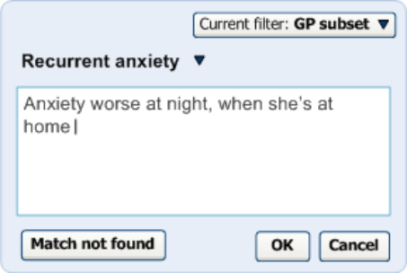
HSCIC Controlled Document

enter a large and rich set of notes typing multiple notes which have a lot of
elaboration, especially when the elaboration
could apply to multiple concepts. The flexible
Text parser matching approach would be better
suited for such as situation
####  Offer the single concept matching n/a Although the Single concept matching approach

approach if the clinician may wish to may allow post-coordination, users will find it
enter notes that will require post- easier to perform such a process using the
coordinated SNOMED-CT expressions alternative—Text parser approach. The Single

concept matching approach forces the user to
match the ‘base concept’ before inputting and
matching attributes. However, it may not always
be apparent to the user what is the base and
what is the attribute

Table 4: How Not to Use the Design Guide Entry

_**2.1.1.4**_ _**Benefits and Rationale**_

Offering a Single concept matching process provides a great deal of benefit, where:

 The range of possible concepts that can be coded is limited. The data may be heavily

filtered owing to the narrow range of appropriate selections

 The user is only expected to record a single concept

The CUI team has shown how this approach to matching SNOMED-CT concepts may contribute to
the clinical noting process. Further details are contained in the _Clinical Noting User Interface Vision_
_and Scope_ document **{R9}** .

From a development point of view, it provides a simple solution that could be implemented in the
face of any technical issues with the richer, more flexible Text parser matching solution.

User testing with both an interactive demonstrator and wireframes has shown that clinicians
understand and respond positively to this approach to matching.

_**2.1.1.5**_ _**Confidence Level**_

_**High**_

 Must allow the user to search for a single concept, and immediately view the possible

matches (‘Single concept matching’)

 This function should be available as a standalone process; or

 As part of matching refinement in a Text parser approach

 Must allow the user to add some additional ‘free’ text (that is, unencoded text).

 This function must be available as part of a Single concept matching process

##### **2.1.2 Text Parser Approach to Matching**

In addition to the single concept approach to matching, the system will also allow users the
flexibility of typing in their notes as a passage of text (rather than sequentially searching for and
matching concepts).

The Text parser approach to matching is based on the notion that the clinician should be free to
type in the notes that they feel best describes the clinical encounter, while, at the same time, the
system matches terms and phrases within their notes. As the system identifies what it considers to
be the best SNOMED-CT match for a text string within the notes, it presents this for the user to
either confirm that the match is correct, or to browse for similarly-worded or semantically-related
matches (see Figure 4).

Page 9

Copyright ©2013 Health and Social Care Information Centre

HSCIC Controlled Document

Figure 4: Text Parser Approach to Matching

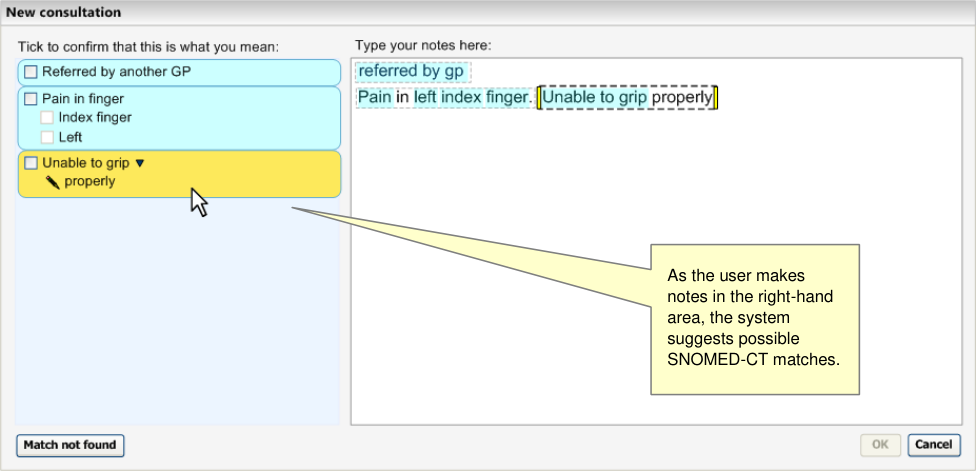

This approach aims to offer an appropriate balance of letting clinicians type in their notes as they
see fit, but, at the same time, encouraging them to encode SNOMED-CT concepts. The matching
process should also help the clinician to enter their notes, especially in situations where the
clinician is unsure of the best way to articulate a term, or is unsure of its spelling.

If prefix matching or progressive matching are implemented, the system will feed back possible
terms to the user, based on a few characters of the word. This would become an especially
powerful feature if contextual subset filters are also applied to the matching process. Instead of
having to type out their notes in full, the clinician would only need to partially type each term and
the system would suggest the full version, which the user can then confirm. In this way, the clinician
may be partly guided by the system in their noting. The power of this feature could be increased
further with the introduction of decision support, if this support could be triggered by SNOMED-CT
matches and could then influence further matches, in addition to offering informational and decision
support.

_**2.1.2.1**_ _**Guidance**_

The system:

 Must allow the user to type in free-text notes without requiring any further actions until the

time they decide to save the record

 Must suggest possible SNOMED-CT matches based upon the free-text notes that the user

has typed

_**2.1.2.2**_ _**How to Use the Design Guide Entry**_

constraint want. The system may aim to influence and

guide the clinician to achieve clear and
consistent noting, but, ultimately, the
representation and content of the notes is the
responsibility of the individual clinician. The
underlying assumption of the current Design
guidance is that the clinician knows what they
want to note

Page 10

Copyright ©2013 Health and Social Care Information Centre

HSCIC Controlled Document

Table 5: How to Use the Design Guide Entry

_**2.1.2.3**_ _**How Not to Use the Design Guide Entry**_

concepts to the record without the intelligent as to be able to derive the precise
user’s confirmation meaning of the clinicians’ notes without risk of

misinterpretation. Given the potentially
dangerous impact of miswriting notes on patient
safety, the system must always get the user’s
explicit confirmation that a SNOMED-CT is a
correct representation of their noting before
saving it to the record

Table 6: How Not to Use the Design Guide Entry

_**2.1.2.4**_ _**Benefits and Rationale**_

This approach aims to allow the clinician the most natural approach to noting, that is, unconstrained
writing. This may be achieved by typing in via a keyboard or by writing into an electronic pad with
handwriting recognition (or a combination of voice recognition and handheld pad), although only the
keyboard/mouse interactions are covered in the current design guidance documentation. In
addition, it is fulfilling the need to encode the notes according to a common standard terminology,
by matching and offering SNOMED-CT concepts and multi-concept expressions, based on the
wording of the clinician’s noting (plus contextual constraints, for example, based upon workflow).
However, by encouraging but not forcing clinicians to encode in SNOMED-CT, the system should
not overly-disrupt the clinician’s working pattern.

This approach to noting has been tested with real clinicians in a series of tests that has involved at
least three separate wireframe designs. In each case, they understood and responded positively to
the designs, even though the designs did differ in terms of specific detail. This overall endorsement
of the Text parser matching approach to noting gives us confidence in the potential usability and
usefulness of this approach.

The CUI team has shown how this approach to matching SNOMED-CT concepts may contribute to
the clinical noting process. Further details are contained in the _Clinical Noting User Interface Vision_
_and Scope_ document **{R9}** .

User testing with both an interactive demonstrator and wireframes has shown that clinicians
understand and respond positively to this approach to matching.

_**2.1.2.5**_ _**Confidence Level**_

_**High**_

 Must allow the user to type in free-text notes without requiring any further actions until the

time they decide to save the record

 Must suggest possible SNOMED-CT matches based upon the free-text notes that the user

has typed

#### **2.2 Inputting Notes**

In this section, we will explore five areas of guidance:

 Input using the ‘Text parser’ approach to matching

 Input using the ‘single concept’ approach to matching

 Input of ‘additional text’ in the single concept approach

Page 11

Copyright ©2013 Health and Social Care Information Centre

HSCIC Controlled Document

 Dealing with clinicians’ shorthand

 Spell-checking input

##### **2.2.1 Input in the Text Parser Approach**

The Text parser approach allows the user to type in unconstrained textual notes from which the
system matches SNOMED-CT expressions. As shown in the schematic and the example below
(Figure 5 and Figure 6), the user types their notes into a clearly defined and labelled text field. This
field has a background of white (or just off-white) in order to indicate that it is editable. It also has a
well-contrasted dark grey border to help it stand out. In contrast, the left-hand ‘Suggested matches
area’ has a light blue background, in order to indicate that the user may not type notes into this
area. In addition, both fields are clearly labelled ‘Type your notes here:’ and ‘Tick to confirm that
this is what you mean:’ for the Text input area and the Suggested matches area respectively.

Both areas have sufficient contrast to stand out against the light grey dialog background, so that
the user can clearly see them both.

Figure 5: Schematic of User Interface Areas in Text Parser Approach to Matching

Page 12

Copyright ©2013 Health and Social Care Information Centre

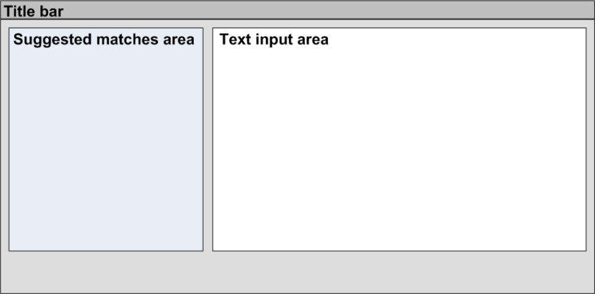
HSCIC Controlled Document

Figure 6: Text Parser Approach to Matching in Detail

As the user types in their notes, the system automatically draws a marquee (a dashed-line
perimeter) around the characters. The yellow bars on either side of the characters perform two
functions, they, (i) indicate focus and (ii) allow marquee manipulation (which is outlined in more
detail in section 2.3.3).

As the user continues to type in characters, the system triggers the matching process and presents
the matches in the left-hand column. Further details of concept matching are outlined in section 2.3.
The key point to note is that as the text input field is left-justified, the user’s typed notes are
generally located close to the suggested matches. This is assisted if the user types a carriage
return after each phrase (or sentence), which may help them to view their input and the matches
together.

Before typing in certain notes, the user may need to insert a ‘clerking heading’, which will influence
the filtering of matches returned, in addition to providing a visual structure to the text. This will
appear within the ‘Text input area’ and will be visually distinct from the normal text (through a
distinct formatting). Further details of the use of clerking headings can be found in section 2.4.

The width of the ‘Text input area’ should not exceed 60 characters, but there are fewer limits on the
depth of the text input area.

_**2.2.1.1**_ _**Guidance**_

The system:

 Must provide a clearly defined area into which the user may type in text

 Must ensure that this area is separate from an area in which the system presents
suggested SNOMED-CT matches (see section 2.3 for details of concept matching)

 Must allow users to types in a full range of alphanumeric characters

 Should allow users to type in punctuation

 Should allow users to capitalise letters

 Should **not** allow users to format the text, in particular:

 Emboldening text

 Underlining text

 Highlighting text

Page 13

Copyright ©2013 Health and Social Care Information Centre

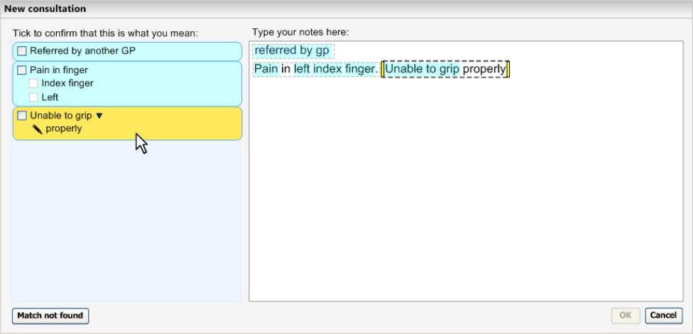
HSCIC Controlled Document

 Could allow users to cut, copy and paste text in the text entry field

 Could allow users to copy/cut/paste text to and from other areas in the Clinical
Application or external software/electronic documents

 Must display the text in a readable (for on-screen viewing) and sufficiently sized font, for

example, Arial 10 point as a minimum

 **Must** clearly distinguish the text input field from the area in which suggested SNOMED-CT

matches are displayed

 **Should** feature a white background in the text input field and a very light off-white or
pale blue background in the suggested matches area

 Must clearly indicate where the user is to start typing

 Should feature a cursor in the top left-hand corner of the text input field

 Could feature a flashing cursor (as per standard word processing software
packages)

 Must feature an appropriate label to communicate to users that they must start typing
into the text input field

 Could feature a label that reads ‘Type your notes here:’

 Must feature a distinct label for the matching area

 Could feature a label that reads ‘Tick to confirm that this is what you mean:’

 Should grey-out this label until the system has matched at least one SNOMED-CT
concept and displayed it in the matching area

 Should grey-out the matching area until the system has matched at least one
SNOMED-CT concept and displayed it in the matching area

_**2.2.1.2**_ _**Benefits and Rationale**_

The convention of displaying editable text fields with a white background, and non-editable with a
grey/blue background is a fairly universal convention. The left-justification of the text input field,
combined with the fact that the suggested matching area is located to the left of the text input field,
means that the user’s typed notes will appear close to the suggested matches, especially if the
user types a carriage return after each phrase (or sentence), which may help them to view their
input and the matches together.

The text input field is also located to the right of the Suggested matches area for the following
reasons: the final output of the noting process will be a combination of user-typed and wellrendered (using matched SNOMED-CT expressions), and the suggested matches are a means of
arriving at these final notes. It is a Western convention to read from left-to-right, and this convention
also informs other activities; for example, people typically fill in forms from left to right. Essentially,
in the current noting process, the user is ending up with output on the right-hand side, which fits
with this convention. In fact, it is a right-to-left-to-right action.

This positioning also helps to ensure that the suggested match areas can be expanded from left-toright (over the top of the text input area) without widening the overall footprint of the noting window
(see section 2.3.3 for details on selecting matches).

User testing with both an interactive demonstrator and multiple iterations of wireframes has shown
that clinicians respond positively to this input design. For example, in recent testing, a large
proportion of users commented that this method of encoding was either ‘easy’ or, at least,
‘attractive’. Less than a quarter of the clinicians had any negative comments about the overall
encoding process.

Page 14

Copyright ©2013 Health and Social Care Information Centre

HSCIC Controlled Document

_**2.2.1.3**_ _**Confidence Level**_

_**High**_

 Must provide a clearly defined area into which the user may type in text

 Must ensure that this area is separate from an area in which the system presents
suggested SNOMED-CT matches

 Must allow users to type in a full range of alphanumeric characters

 Should allow users to type in punctuation

 Should allow users to capitalise letters

 Should **not** allow users to format the text, in particular:

 Emboldening text

 Underlining text

 Highlighting text

 Must clearly distinguish the text input field from the area in which suggested SNOMED-CT

matches are displayed

 Should feature a white background in the text input field and a very light off-white or
pale blue background in the suggested matches area

 Must clearly indicate where the user is to start typing

 Should feature a cursor in the top left-hand corner of the text input field

 Could feature a flashing cursor (as per standard word processing software
packages)

 Must feature an appropriate label to communicate to users that they must start typing
into the text input field

 Could feature a label that reads ’Type your notes here:’

 Must feature a distinct label for the matching area

 Could feature a label that reads ’Tick to confirm that this is what you mean:’

 Should grey-out this label until the system has matched at least one SNOMED-CT
concept and displayed it in the matching area

 Should grey-out the matching area until the system has matched at least one SNOMED-CT

concept and displayed it in the matching area

 Must display the text in a readable (for on-screen viewing) and sufficiently sized font, for

example, Arial 10 point as a minimum

_**Medium**_

 Could allow users to cut, copy and paste text in the text entry field

 Could allow users to copy/cut/paste text to and from other areas in the Clinical
Application or external software/electronic documents

##### **2.2.2 Input in the Single Concept Approach**

The Single concept matching approach demands a slightly different input process. In contrast to
the Text parser approach, the input only requires words or partial words that will be matched
against a single word or phrase. Therefore, the input area is limited in size. In the example below,
the input field can accommodate 32 visible characters, and up to 255 characters in total. If the user

Page 15

Copyright ©2013 Health and Social Care Information Centre

HSCIC Controlled Document

types beyond the 32 character visible limit, the field scrolls from left-to-right (but without a scroll
bar), in order to ensure that the last character that the user has typed is visible. The user may scroll
back to the first letters in the phrase—which may have been pushed out of the visible area.

The user types in the
note here.

Figure 7: Blank Input Field in Single Concept Approach to Matching

The system suggests
matches as the user
types.

Figure 8: User Types in Characters

Figure 9: User Selects an Item From the List

The input in the single concept approach to matching will adopt a ‘progressive’ matching process,
that is, matching on each successive character typed in (or deleted), with a slight delay, of
approximately 200 milliseconds, to reduce the number of server requests.

The progressive matching will also adopt a ‘prefix’ matching approach, which allows the system to
match the first few letters of multiple words. For example, it could match ‘Nec fem’ with ’Neck of
femur’. The system should also be able to do this irrespectively of order; for example, matching
‘Fem nec’.

Page 16

Copyright ©2013 Health and Social Care Information Centre

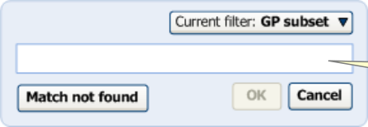

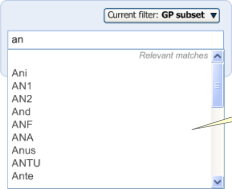

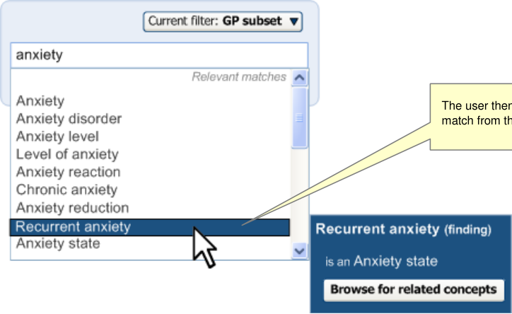
HSCIC Controlled Document

Once the user has selected a match from the list, the input field disappears and is replaced by the
match’s label with a small black ‘down’ arrow (▼). In addition, the focus automatically moves to the
‘OK’ button, to assist keyboard entry of a single concept without additional text. The ‘Additional text’
field also appears, as shown in Figure 10.

Special provision is made to ensure that the user can move the mouse from the list item to the ‘flyout’ dialog, without the fly-out disappearing if the user accidentally moves just outside of the
highlight area. For example, movement over the scroll bar and just outside the fly-out area will not
close it.

The selected match
appears here.

A field for adding
additional text notes
appears below.

Figure 10: User has Selected an Item and the Additional Text Field Appears

The user can open the input field again by clicking on the label. As the user moves the mouse over
the label, the area surrounding the label turns orange and appears ‘clickable’ (that is, slightly
‘embossed’), as shown in Figure 11.

The label turns orange
and clickable upon
mouse-over.

Figure 11: User Moves Mouse onto the Label

Clicking on the label displays the input field, pre-populated with the last set of input text entered by
the user before selecting the label. For example, if the user had typed in ‘anxiet’ and had selected
the SNOMED-CT concept ‘Recurrent anxiety’, the text ‘anxiet’ would appear in the input field. In the
returned matches list, the concept ‘Recurrent anxiety’ would appear selected at the top of the list
(with the appropriate scroll position).

Upon re-opening the
matching list, the
system remembers the
last input text.

Page 17

Copyright ©2013 Health and Social Care Information Centre

HSCIC Controlled Document

Figure 12: Clicking on the Label Opens up the List Again

_**2.2.2.1**_ _**Guidance**_

The system:

 Must provide a clearly defined text field into which the user can type the note

 Must be distinct from the area that displays the resulting SNOMED-CT matches

 Must allow users to be able to type multiple words into the input field

 Must allow users to type in a full range of alphanumeric characters

 Could allow users to type in punctuation

 Could allow users to capitalise letters

 Must provide a visible space in the input field that can accommodate a text string of 32

characters long

 Must allow users to delete text with in the search input field

 Must allow a ’Backspace’ deletion

 Could allow a select and ‘Delete’ deletion

 Should **not** allow users to format the text, in particular:

 Emboldening text

 Underlining text

 Highlighting text

 Could allow users to cut, copy and paste text in the text entry field

 Could allow users to copy/cut/paste text to and from other areas in the Clinical
Application or external software/electronic documents

 Must display the text in a readable (for on-screen viewing) and sufficiently sized font, for

example, Arial 10 point as a minimum

 Should provide a progressive matching algorithm

 Should allow the user to move just outside of the list item or fly-out area without the fly-out

disappearing

 Must provide an ‘OK’ button to close the dialog and save the matches

 Should also allow the user to close the dialog and save the matches by double-clicking on

the list item

Page 18

Copyright ©2013 Health and Social Care Information Centre

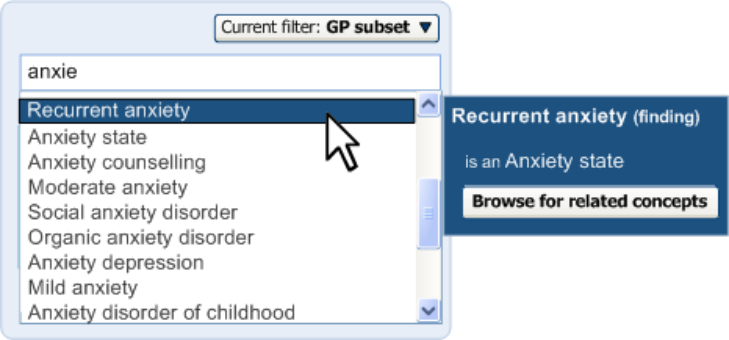
HSCIC Controlled Document

 Must provide a ‘Cancel’ button to close the dialog without saving the matches

_**2.2.2.2**_ _**Benefits and Rationale**_

The visible number of characters recommended in the input field (that is, 32 characters) means that
the user may type in the full text of over 65% of SNOMED-CT labels. This length also ties in with
the recommended width of the list box containing the matched SNOMED-CT labels returned by the
system and which need to accommodate up to 62 characters. This covers 95% of label lengths in
SNOMED-CT, which are wrapped (see section 2.3.2), with the second line indented by two
characters, thus leaving a width of 32 characters. Also, the maximum length of SNOMED-CT labels
is 255 characters and this is reflected in the maximum length of text that can be typed into the input
field.

Horizontal scrolling of the nature described above is a standard feature of many text input fields
throughout a range of popular software applications.

The ‘progressive’ matching process has been shown to work well when the data is stored at the
client end. However, some questions remain about how feasible this solution could be when the
system is sending requests to the server each time the user types in a successive character (even
with a slight delay), especially if the user has a slow internet connection.

Providing an ‘OK’ button in the main dialog rather than in the fly-out has been implemented, as
tests indicated that users could not find an ‘OK’ button in the fly-out. Some users tried to doubleclick on the item to select it and this feature has been implemented in the current design.

If the progressive solution is not feasible, we recommend that a ‘Go’ button is featured immediately
to the right of the field (see Figure 13). This could be an icon with a tooltip communicating that it is
a button that triggers the matching process. The matching could also be activated by pressing the
ENTER key.

The progressive matching
could be replaced by a ‘Go’
button triggering the
matching process

Figure 13: Example of the Design that Features a ‘User-Triggered’ Rather Than ‘Progressive’ Matching Process

The ‘progressive matching’ process has not been tested with clinicians. However, this method of
matching is used in a number of popular software designs, including the Google toolbar. For this
reason, we are confident that users will understand this process.

The basic design, irrespective of progressive matching, has been successfully user tested, both
with interactive demonstrator prototypes and with wireframes. In these tests, there were no
instances where users did not understand how to enter their notes. Indeed, in a recent test, overall
feedback indicated that 80% users indicated that the encoding process was ‘fine’, ‘ok’, ‘easy’ or
‘straightforward’.

_**2.2.2.3**_ _**Confidence Level**_

_**High**_

 Must provide a clearly defined text field into which the user can type the note

 Must be distinct from the area that displays the resulting SNOMED-CT matches

 Must allow users to be able to type multiple words into the input field

 Must allow users to type in a full range of alphanumeric characters

 Could allow users to type in punctuation

Page 19

Copyright ©2013 Health and Social Care Information Centre

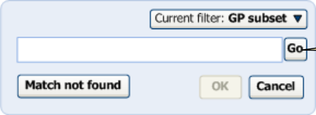
HSCIC Controlled Document

 Could allow users to capitalise letters

 Must provide a visible space in the input field that can accommodate a text string of 32

characters long

 Must allow the user to type up to 255 characters in the input field

 Must allow users to delete text within the search input field

 Must allow a ‘Backspace’ deletion

 Could allow a select and ‘Delete’ deletion

 Should **not** allow users to format the text, in particular:

 Emboldening text

 Underlining text

 Highlighting text

 Should allow the user to move just outside of the list item or fly-out area without the fly-out

disappearing

 Must provide an ‘OK’ button to close the dialog and save the matches

 Should also allow the user to close the dialog and save the matches by double-clicking on

the list item

 Must provide a ‘Cancel’ button to close the dialog without saving the matches

_**Medium**_

 Could allow users to cut, copy and paste text in the text entry field

 Could allow users to copy/cut/paste text to and from other areas in the Clinical
Application or external software/electronic documents

 Must display the text in a readable (for on-screen viewing) and sufficiently sized font, for

example, Arial 10 point as a minimum

 Should provide a progressive searching algorithm

##### **2.2.3 Additional Text Input**

In the single concept approach to matching, the user is presented with a text field, labelled
‘Additional text’, in order to elaborate on the matched concept. This additional text input field should
be located below the search input box to indicate to the user that it is for information that further
relates to the selected match. Once selected, the match also acts as heading.

The label ‘Additional text’ is displayed inside the additional text input field, in grey, as shown in
Figure 14.

Page 20

Copyright ©2013 Health and Social Care Information Centre

HSCIC Controlled Document

Figure 14: Additional Text Field

The label appears inside the
additional text box, so as not
to distract from the concept
label above it.

Once the user clicks on the field, or tabs to it, the label disappears and a cursor appears, as shown
in Figure 15.

Clicking in the field removes
the label, and inserts a
cursor.

Figure 15: Cursor Appears When User Clicks the Field

At this point, the user can type elaborating text into the field, as shown in Figure 16.

The user may type text into
this field, which will be saved
with the concept match in the
record.

Figure 16: Entering Text in the Additional Text Field

This text will also be parsed for relevant attributes of the main concept (see _Design Guide Entry –_
_Terminology - Elaboration_ **{R4}** for details).

_**2.2.3.1**_ _**Guidance**_

The system:

 Must allow the user to type in ‘additional’ text that is associated with a selected concept

 Must provide a clearly defined text field into which the user may type this additional text

 Must ensure that this area is clearly distinct from the single concept input field

Page 21

Copyright ©2013 Health and Social Care Information Centre

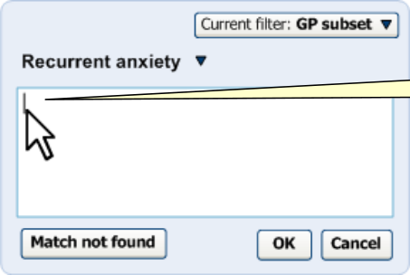

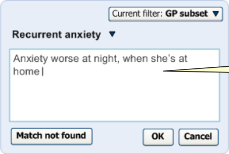
HSCIC Controlled Document

 Should clearly label this additional text area

 Could label this additional text area as ‘Additional text

 Could feature the label in grey text which disappears when the user clicks on it (or tabs
to it). The label will reappear if the user moves the focus out of the text box without
typing any text in it

 Must provide a visible space in the input field that can accommodate a passage of text of a

minimum of three lines high

 Must provide a vertical scrolling mechanism if the length of the text that the user types
in exceeds the visible space

 Must allow users to delete text within the search input field

 Must allow a ‘Backspace’ deletion

 Could allow a select and ‘Delete’ deletion

 Should **not** allow users to format the text, in particular:

 Emboldening text

 Underlining text

 Highlighting text

 Could allow users to cut, copy and paste text in the text entry field

 Could allow users to copy/cut/paste text to and from other areas in the Clinical
Application or external software/electronic documents

 Must display the text in a readable (for on-screen viewing) and sufficiently sized font, for

example, Arial 10 point as a minimum

_**2.2.3.2**_ _**Benefits and Rationale**_

It is extremely important to allow users to add further details about a matched concept, for a couple
of reasons. The first is that the range of the SNOMED-CT terminology, although wide, can only
account for a fraction of the terms, and relationships between terms, that are used by clinicians in
their noting. Not only could the clinician want to express their note with a rich use of English, but
also, there will be a large amount of specialist noting that SNOMED-CT will not cover. The second
is that there may be a number of occasions when the clinician wants to elaborate a term with free
text that they would not want to encode. They may wish to record a suspicion or a ‘note-to-self’ that
is ‘weak’ and should not be treated as a ‘strong’ code, even if it is preceded by the qualifying code
‘possible’.

Featuring the field label within the field area (box) and displaying it in small grey text prevents this
text from distracting the user’s view of the matched SNOMED-CT concept label. There is also the
potential to add further instructive text in the box, such as ‘Add some detail to the matched concept’
or even some dynamic text, such as ‘Type in additional details about the ‘Recurrent anxiety’’.

In addition, by featuring it immediately below the matched concept indicates that the field is for
information that further relates to the selected match.

_**2.2.3.3**_ _**Confidence Level**_

_**High**_

 Must allow the user to type in ‘additional’ text that is associated with a selected concept

 Must provide a clearly defined text field into which the user may type this additional text

 Must ensure that this area is clearly distinct from the single concept input field

Page 22

Copyright ©2013 Health and Social Care Information Centre

HSCIC Controlled Document

 Should clearly label this additional text area

 Could label this additional text area, ‘Additional text’

 Must provide a vertical scrolling mechanism if the length of the text that the user types
in exceeds the visible space

 Must allow users to delete text within the search input field

 Must allow a ‘Backspace’ deletion

 Could allow a select and ‘Delete’ deletion

 Should **not** allow users to format the text, in particular:

 Emboldening text

 Underlining text

 Highlighting text

 Must display the text in a readable (for on-screen viewing) and sufficiently sized font, for

example, Arial 10 point as a minimum

_**Medium**_

 Must provide a visible space in the input field that can accommodate a passage of text of a

minimum of three lines high

_**Low**_

 Could feature the label written in grey text that disappears when the user clicks on it (or

tabs to it). The label will reappear if the user moves the focus out of the box without typing
any text into it.

 Could allow users to cut, copy and paste text in the text entry field

 Could allow users to copy/cut/paste text to and from other areas in the Clinical
Application or external software/electronic documents

##### **2.2.4 Spell-Checker Input**

Users may mistype or misspell words as they type them. The system should provide a way of
managing this human error. However, this will only apply when the system employs a full word
rather than partial word (that is, ‘prefix’) matching approach.

As the example, Figure 17 shows how a spelling mistake is highlighted and underlined in red.

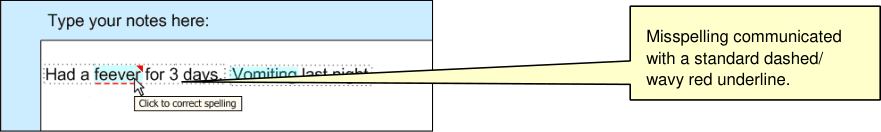

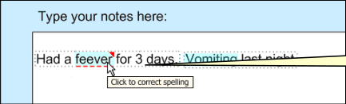

Figure 17: Highlighting Spelling Mistakes

The user then opens the Spell checker dialog by clicking on the word, as shown in Figure 18.

Copyright ©2013 Health and Social Care Information Centre

Page 23

HSCIC Controlled Document

Figure 18: Spell Checker Dialog

Clicking on the misspelt word
opens a spell-checker dialog.

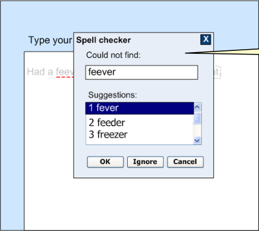

Once the user has selected a word, the system should automatically run another post-coordination
parse.

Please note that the spell-checker feature only applies to the Text parser approach to matching,
and not to the Single concept matching.

_**2.2.4.1**_ _**Guidance**_

The system:

 Must identify all words that are not SNOMED-CT matched, and do not match with a

standard English dictionary

 Should underline all unmatched words with a red dashed line

 Should remove the red dashed underline once a spelling mistake has been resolved

 Should invoke a spell-checker dialog when the user clicks the unmatched word

 Should offer spell-checked words (drawn from both SNOMED-CT and a standard English

dictionary)

 Should allow the user to select one of the fuzzy-matched words

 Should allow the user to close the spell-checker dialog without selecting any of the
matches

 Should replace the unmatched word with a matched word selected by the user

 Must not automatically confirm any matched words selected by the user, in the spell
checker dialog

 Could offer these three options (or their equivalents) in the spell-checker dialog:

 **OK**     - change the word to the word that the user has selected

 **Ignore**     - to close the dialog and to remove the red underline

 **Cancel**     - to close the dialog and to keep the red underline

_**2.2.4.2**_ _**How to Use the Design Guide Entry**_

Microsoft [®] Office spelling checker) processing package

Page 24

Copyright ©2013 Health and Social Care Information Centre

HSCIC Controlled Document

database

Table 7: How to Use the Design Guide Entry

_**2.2.4.3**_ _**How Not to Use the Design Guide Entry**_

be resolved by fuzzy matching, do not match (or fuzzy match) has been recognised
feature a highlight around the
unrecognised word

Table 8: How Not to Use the Design Guide Entry

_**2.2.4.4**_ _**Benefits and Rationale**_

It is important for the user to resolve the spelling of the word prior to encoding it. Simply launching a
fuzzy match could lead to incorrect matches, compound the user error and possibly compromise
patient safety. Featuring a method of spell-checking that is similar to that found in popular word
processing packages will ensure that learning can be transferred easily, and that the tool is intuitive
to most users.

The system should not automatically confirm words that have been spell-checked, as the newly
matched concept could form part of a post-coordinated expression which should be confirmed as a
unit.

Please refer to PART II of APPENDIX A for a detailed description of the requirements for this
guidance.

This has not been tested with clinicians. However, this method of spell-checking is used in a
number of popular word-processing packages. Therefore, we are confident that this will be
understood by clinicians.

_**2.2.4.5**_ _**Confidence Level**_

Although this has not been explored in wireframe testing, it follows behaviour that is similar to
popular word processing software packages, such as Microsoft Word. It can be recommended with
medium confidence.

This guidance is only relevant where the system attempts to match complete rather than partial
words.

_**Medium**_

 Must identify all words that are not SNOMED-CT matched and do not match with a

standard English dictionary

 Should underline all words identified as spelling mistakes with a red dashed line

 Should remove the red dashed underline once a spelling mistake has been resolved

 Should invoke a spell-checker dialog when the user clicks the unmatched word

 Should offer spell-checked words (drawn from both SNOMED-CT and a standard English

dictionary)

 Should allow the user to select one of the fuzzy-matched words

 Should allow the user to close the spell-checker dialog without selecting any of the
matches

Page 25

Copyright ©2013 Health and Social Care Information Centre

HSCIC Controlled Document

 Should replace the unmatched word with a matched word selected by the user

 Must not automatically confirm any matched words selected by the user in the spell-checker

dialog

##### **2.2.5 Dealing with Clinicians’ Shorthand**

Clinicians use a large amount of shorthand when noting. In the Design Guidance, although we will
not attempt to identify all shorthand terms in order for the system to deal with every possibility, we
need to specify a mechanism for the system to deal with this shorthand.

The design shown below in Figure 19 will identify instances of possible shorthand and will underline
the shorthand in the same way as the spell-checker (see section 2.2.4 for details on the spellchecker). It will also feature a small red triangle in the top right-hand corner of the marquee around
the words.

Meanwhile, a warning message will appear in the corresponding suggested match (when in focus)
in the left-hand column, which communicates that there is a possible example of shorthand to
resolve. It also displays the shorthand phrase as free text.

Clicking on the phrase will open the list of possible resolutions for the shorthand. Once the user has
selected a resolution, such as ‘3 months’, the system will change the words and will automatically
run another post-coordination parse.

Figure 19: System Underlines Shorthand and Lists Shorthand Options

Page 26

Copyright ©2013 Health and Social Care Information Centre

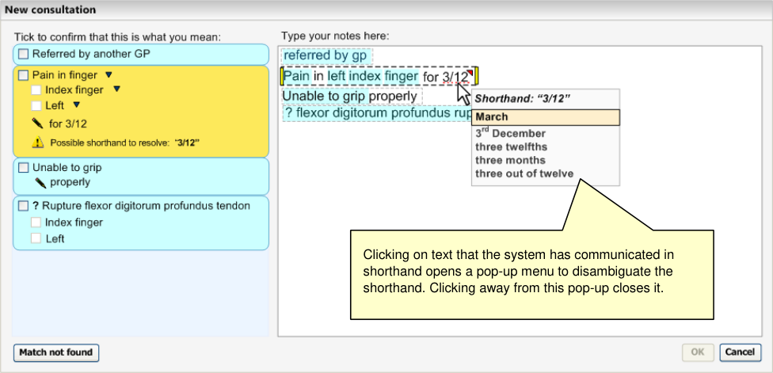
HSCIC Controlled Document

_**2.2.5.1**_ _**Guidance**_

The system:

 Should recognise a limited set of clinicians’ shorthand comprising non-SNOMED-CT

synonyms

 Should access these terms from an NHS-maintained database of shorthand terms and
their corresponding SNOMED-CT or administrative terms (such as dates).

_**2.2.5.2**_ _**How to Use the Design Guide Entry**_

approved shorthand terms

Table 9: How to Use the Design Guide Entry

_**2.2.5.3**_ _**How Not to Use the Design Guide Entry**_

without explicit user actions

Table 10: How Not to Use the Design Guide Entry

_**2.2.5.4**_ _**Benefits and Rationale**_

The system allows the user to resolve the shorthand prior to the confirmation process, as the
shorthand may influence the post-coordination process. For example, it may post-coordinate with a
concept when resolved, therefore, it would be cleaner to resolve the term prior to addressing the
post-coordination of the expression in which it sits. Also, it is different from the normal matching
process in that for some shorthand, there is a lot of variation in the way it can be written. In
addition, as shown in the example above (Figure 19), one particular chunk of shorthand can have
many different meanings, but the system does not have any way to discriminate between these
different meanings, so displaying a ‘top match’ will not be possible.

This topic has not undergone rigorous user testing, and so further usability testing is expected,
possibly resulting in potential updates.

**Note**

This solution requires additional data to be created and managed by the NHS.

_**2.2.5.5**_ _**Confidence Level**_

_**Low**_

 Should recognise a limited set of clinicians’ shorthand comprising non-SNOMED-CT

synonyms

 Should access these terms from an NHS-maintained database of shorthand terms and
their corresponding SNOMED-CT or administrative terms (such as dates)

Page 27

Copyright ©2013 Health and Social Care Information Centre

HSCIC Controlled Document

#### **2.3 Matching**

##### **2.3.1 Matching Input Text Against the SNOMED-CT Database**

The matching process is the means by which clinicians’ notes are translated into SNOMED-CT
expressions. An effective and efficient matching process will influence the success of the system.
This section outlines:

 The underlying matching process(es)

 Matching interface in the Text parser matching approach

 Matching interface in the Single concept matching approach

 SNOMED-CT interface features

_**The Underlying Matching/Searching Algorithms**_

The designs feature a similarity measure, which calculates the ‘fit’ between the input words and the
words in the matched SNOMED-CT expression. The benefits of this approach are discussed in the
following sections. The design also features partial or ‘prefix’ matching which allows users to find
matches by typing just the first three or four letters of each word in an expression. The solution also
allows matching in spite of an inverted ordering of words between the input and the matched
expression. This approach is based upon the assumption that clinicians will want to search on
prefixes rather than on word endings. There could be an argument for also allowing clinicians to
search on word endings (such as ‘…ectomy’), but this has not been addressed by the current
guidance. We could look at this during the development of future guidance (see section 3).

Please note that all the matching behaviour outlined in this guidance assumes a standard and
optimal indexing of SNOMED-CT.

_**Matching in the Text Parser Approach**_

The matching event will occur automatically as the user types in their notes. There are a number of
ways in which this may be done, some of which may carry greater performance penalties than
others, which in the case of a Web-based interface could be prohibitive. Further work is being done
to understand the practical implementation issues associated with the different matching event
triggers. Meanwhile, in the guidance, we will outline the seven main alternatives that we are
considering:

 Progressive matching

 Matching upon the completion of each sentence

 Matching upon the completion of each word

 Batch processing

 Line-by-line matching

 Time-based matching (that is, periodical triggering)

 User-triggered matching (such as pushing a button)

The matching event will not interfere with the user’s typing of their notes. Instead, the top matches
for each text string, (where matching is possible), will be displayed to the user to confirm that this is
the correct match (see section 2.3.2 for details).

These will be displayed in the context of the wider ‘expressions’ to which they belong (although an
expression may only comprise a single concept). This is covered in more detail in the ‘Post
Coordination’ entry of the Design Guide, **{R2}** .

The current design also excludes certain common words from the searching, including
prepositions, such as ‘for’ or ‘to’. Such an exclusion list would need to be developed and

Page 28

Copyright ©2013 Health and Social Care Information Centre

HSCIC Controlled Document

maintained outside of the released SNOMED-CT data. However, there are further issues that need
to be resolved with such an exclusion list, and so it is not currently recommended guidance (see
section 3).

The matching process will be subject to a number of text parsing rules which may affect which
concepts are matched. In particular, in the Text parser approach, the system will not match any
concepts that are not drawn from the two major SNOMED-CT Upper Level hierarchies: ‘Clinical
findings’ and ‘Procedures’, or from the supporting hierarchies ‘Observable Entities’ or ‘Situations
with explicit context‘, unless the concept post-coordinates with a concept from one of these
hierarchies. In certain contexts, concepts from the category ‘Events’ may also be base concepts.
For example when recording the history of a complaint, the clinician may want to record that the
patient has been involved in a ‘car accident’, which is an event. It is worth noting that, after
consideration, we excluded the category, ‘Pharmaceutical/biological products’, from this list of base
concepts. Further work would need to be done to show how concepts from within this category
could be disambiguated to determine whether the note refers, for example, to prescription,
administration, history of administration or supply (see section 3 for an outline of potential next
steps in this area). The rules that determine such ‘base’ concepts have been devised in light of the
October 2006 publication of SNOMED-CT, and would need to be revised in light of any changes
made to the database. These rules are also discussed in further detail in the ‘Post Coordination’
entry of the Design Guide **{R2}** .

Also, the system will only return matches that meet a predefined similarity score threshold. This
score, excludes words from the ‘exclusion’ list (a list which includes very common words, such as
prepositions). Further work needs to be devoted to determining this threshold, but currently it could
be set at about 70%.

For example, the input text ‘leg’ could potentially be matched against the concepts ‘Leg
fracture’ or ‘Leg injury’, but the system would not return these matches because the input text
does not meet the similarly threshold, therefore no matches would be returned. In order to get
a match, the user must type in more words, for example, ‘leg fracture’.

This feature reduces the risk of inappropriate matching, although it cannot guard against the text
‘left leg’ returning the match ‘Pain in left leg’ (where the word ‘in’ is excluded).

The triggering of matching in the Text parser approach is still under discussion, but a leading
method is to allow ‘progressive’ matching, whereby a match request is sent upon the insertion or
deletion of each character into the text input area, possibly with a slight delay (of 200 milliseconds)
in order to reduce the numbers of requests. However, this approach may be fairly performanceintensive and therefore further feasibility studies should be conducted. Other methods of triggering
the matching include:

 Matching upon the completion of each sentence

 Matching upon the completion of each word

 Batch processing

 Line-by-line matching

 Time-based matching

 User-triggered matching

Each of these matching processes has their own merits. For example, line-by-line processing
would require fewer requests to the server, and thus could reduce problems with performance due
to server traffic. Batch processing could also reduce the Web service requests, although if the
batches were too big, there could be long delays when the matching is triggered.

Matching word-by-word could involve fewer Web service requests than progressive matching.
However, progressive matching does have the advantage over the other processes in that it allows
the user to see the concept building up as they type. In this way, the process could help to guide

Page 29

Copyright ©2013 Health and Social Care Information Centre

HSCIC Controlled Document

the user into getting the right match. Obviously the user would not be able to see the alternative
matches unless they actually expand the list of matches (see section 2.3.3 for details), but this
could give them very useful feedback as they type.

We are not currently in a position to definitively recommend any of these matching processes, as
further work needs to be carried out regarding:

 The technical and performance issues surrounding each approach

 The user experience associated with each issue

Details of feasibility analyses conducted so far can be found in section 2.3.1.3 (‘Benefits and
Rationale’).

Figure 20 below shows the system displaying top matches (in the left-hand column) for the text
typed in by the user in the right-hand text input area. Each match (or set of matches, where there is
possible post-coordination) is displayed within a boundary and has a pale blue background, except
where it is ‘in focus’, in which case the background is yellow.

Figure 20: Text Parser Approach to Matching

_**Matching in the Single Concept Matching Approach**_

The Single concept matching approach will employ a progressive matching event, in that the
matching event is triggered by the user typing in a new character, or deleting a character. It will
also feature partial (prefix) matching which can match multiple partial text strings irrespective of the
order in which they are typed.

For example, the text ‘fem nec’ will return the top match of ‘neck of femur’.

Certain qualifiers and negation will also be recognised in this matching approach; this is outlined in
detail in the ‘Post Coordination’ entry of the Design Guide, **{R2}** .

The figures below (Figure 21, Figure 22, Figure 23 and Figure 24) show the matching sequence in
the Single concept matching approach.

The user starts to type their
note in this field.

Page 30

Copyright ©2013 Health and Social Care Information Centre

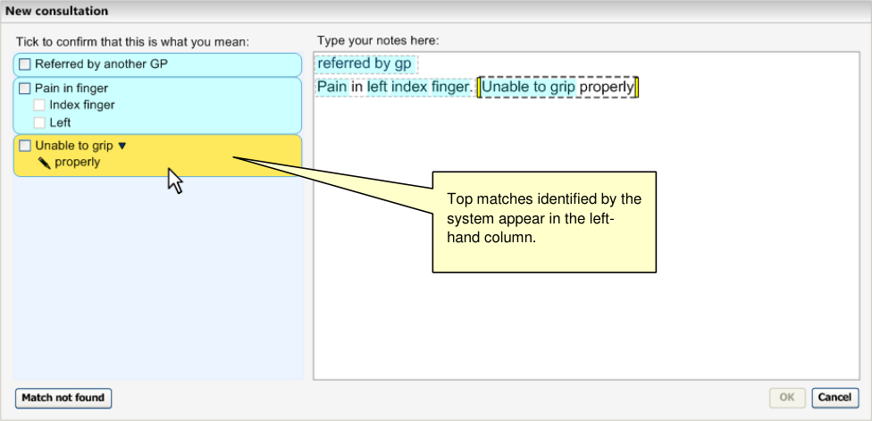

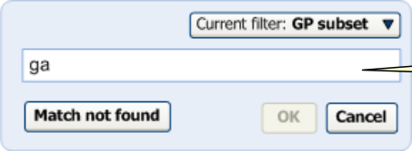
HSCIC Controlled Document

Figure 21: Single Concept Approach to Matching – Step 1

Figure 22: Single Concept Approach to Matching – Step 2

Figure 24: Single Concept Approach to Matching – Step 4

The system displays possible
matches.

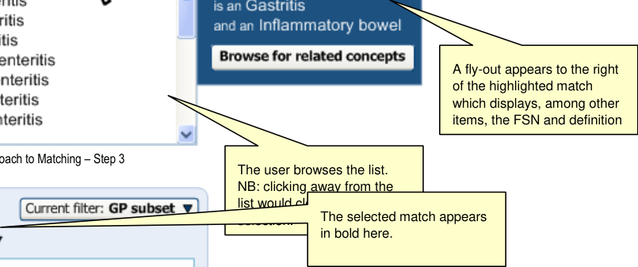

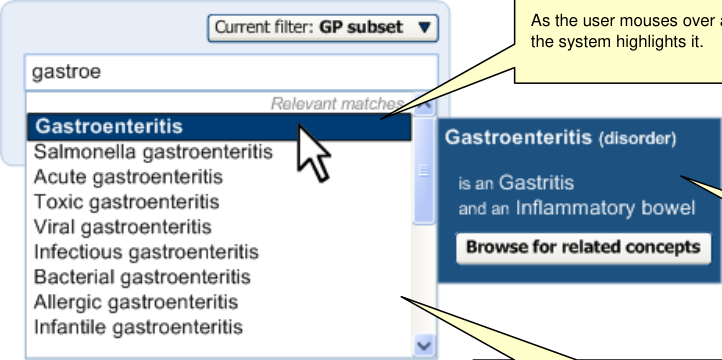

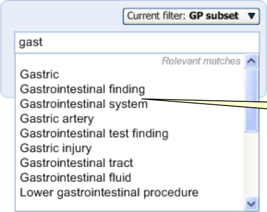

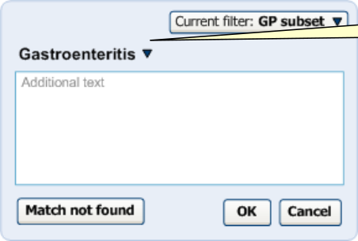

_**SNOMED-CT Interface Features - Synonyms and Word Equivalence**_

SNOMED-CT has a number of useful interface features. One of these is the inclusion of synonyms,
and the other is the use of ‘equivalence’ matching.

The terminology features synonym description labels for a vast number of concepts. In addition to
the ConceptID, a concept also has a DescriptionID. The Description table features several labels:
the Fully specified name and the Preferred Term, and some have one or more synonym labels.

Page 31

Copyright ©2013 Health and Social Care Information Centre

HSCIC Controlled Document

For example, in the case of ConceptID 22298006, the Fully specified name is ‘Myocardial
infarction’ (disorder) and the Preferred Term is ‘Myocardial infarction’. It also has a number of
synonyms:

 Heart attack

 Myocardial infarct

 Infarction of heart

 MI – Myocardial infarction

 Cardiac infarction

The system must allow matching of synonyms as clinicians often use different terms from one
another. Even leading experts in a discipline often refer to a pathology using different terms from
one another. Failure to account for synonyms in a noting system could mean that many commonly
used terms are left unmatched and, therefore, unencoded. The fourth term in the list above (‘MI –
Myocardial infarction’) is an example of an abbreviation. These abbreviations must also be
accounted for in a matching process, owing to their common usage, and efficiency of use.

The system will match text with synonym description labels as well as with Preferred term
description labels. However, when a synonym is matched, the system will clearly communicate that
it is a synonym in the selection fly-out (see Figure 25). This is because, unlike the Preferred term
description label, the synonym label is often different to the Fully specified name label that is also
displayed in the fly-out.

Figure 25: System Communicates that a Match is a Synonym

Also, in order to allow for clinicians to express phrases in multiple synonymous ways, SNOMED-CT
publishes tables of ‘equivalence’. This provides the match between, for example, ‘nose’ and ‘nasal’,
or ‘boil’ and ‘furuncle’. These tables may also, in the future, express equivalence between
abbreviations and their full terms, such as ‘FDP’ and ‘Flexor digitorum profundus’.

Using these equivalence tables, the system could return equivalence matches, such as ‘nasal
furuncle’ if the user types in ‘nose boil’. This could be very useful for the user who may decide,
upon viewing the matches, that ‘nasal furuncle’ is the correct term. It can also allow for matching of
phrases where only a single input word is synonymous with the desired match. For example,
matching the text ‘rupture of cervix’ without any equivalence matching would return the possibly
over-specific concept ‘rupture of uterine cervix’. However, if the system recognises that ‘rupture’ is
equivalent to ‘tear’, it can provide the match ‘tear of cervix’, which could be more similar wording to
what the user intended. Similarly, if the appropriate terms were featured in the equivalence tables,
the system could also return matches for ‘FDP tear’, that is, ‘Rupture of flexor digitorum profundus
tendon’, which it would not do without equivalence matching.

Page 32

Copyright ©2013 Health and Social Care Information Centre

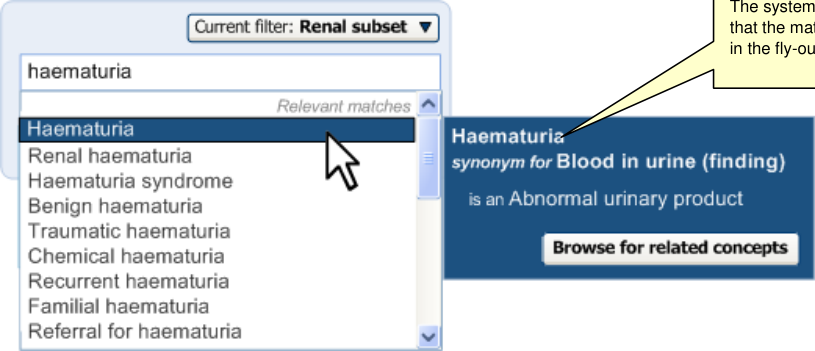
HSCIC Controlled Document

**Note**

The term ‘equivalence matching’ is used in this section in a different way to ‘canonical equivalence’, that
is, the equivalence between a coordinated SNOMED-CT concept and its component attribute concepts.

When implementing word equivalence matching in a user interface, it is important to ensure that
the user is explicitly aware of what is going on, as it breaks the typical word matching rules. We
would recommend that the system explicitly communicates all the words against which is it
searching for matches, and that this is displayed close to any search input field. We also
recommend that the user can ‘opt out’ of the equivalence matching (on a match-by-match basis).
Also, progressive matching must handle equivalence matching in an elegant way: the system can
only show equivalent matches against complete words rather than partial words. We would
recommend that, for progressive matching, the system does not search for equivalence by default,
unless the system cannot return a matching concept after a word boundary has been defined by
the user, that is, by inserting a space or carriage return after the last character in the text string. In
the case of not returning a concept, the system would automatically attempt to match any
equivalence words it recognised from the equivalence tables. If the system returns matches, then
the equivalence matching remains switched off by default, but the system provides a control that
allows users to switch it on.

The following screens (Figure 26 and Figure 27) show a situation where equivalence matching
could apply. In the example, the user starts to type in the words ‘nose boil’.

The user starts to type in
their note.

Figure 26: User Starts to Type Input

The system identifies
equivalent words for the
words typed in by the
user.

Figure 27: System Offers Option to Match Equivalent Words

When the user clicks on the control to switch on word equivalence, the list expands to include
matches with the equivalent terms (see Figure 28).

The user may choose to
include these equivalent
words in the phrase
matches.

Figure 28: User Switches on Word Equivalence

There will be some cases where equivalence matching is the only way for the system to return
results. If the system cannot return any results, but it recognises equivalent words, it will

Page 33

Copyright ©2013 Health and Social Care Information Centre

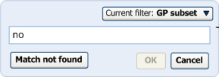

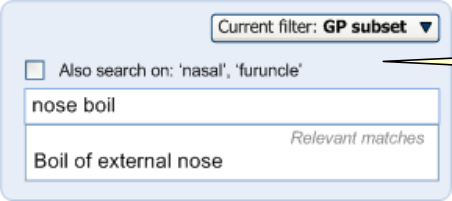

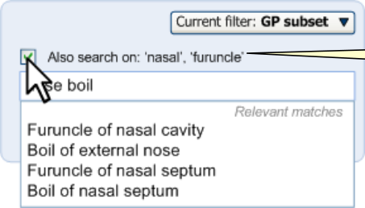
HSCIC Controlled Document

automatically switch on the equivalence—and will display the control switched to ‘on’ (see Figure
29 for details). Please note that the synonym ‘FDP’ is not yet listed in the equivalence tables, but
we would expect that this would be a good candidate for inclusion in the future. Abbreviation
synonyms will be used frequently and it will be useful if these return matches when used within
larger expressions.

Where no matches are
found, but there are
equivalent words, the
system will automatically
invoke the word
equivalence matching.

Figure 29: System Cannot Return Matches and Therefore Switches on Word Equivalence

Page 34

Copyright ©2013 Health and Social Care Information Centre

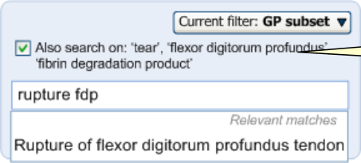
HSCIC Controlled Document

_**2.3.1.1**_ _**Guidance**_

The system:

 Must match text against SNOMED-CT concept ‘Preferred term’ and ‘synonym’ descriptions

 Should employ a statistical word matching algorithm

 Should feature a vector-space matching algorithm for text that contains multiple words

 Must communicate to the user where a match is a synonym

 Should communicate to the user in the fly-out that a match is a synonym. The fly-out
appears when the user moves the mouse over the concept in a list

 Must allow the user to view the Fully specified name for any concept

 Should allow the user to view the Fully specified name for the concept in a fly-out that
appears when the user moves the mouse over the concept in a list

 Must feature a consistent method of triggering the matching event in the Text parser

approach

 Could invoke a matching event upon input by the user of each new character
(‘progressive’ matching)

 Could invoke a matching event when the user defines a new word boundary (that is, by
inserting a space after a text string)

 Could invoke a matching event when the user defines a new sentence boundary (that
is, by typing a full stop or a carriage return)

 Could invoke a matching event at regular intervals during the noting session (for
example, once every 200 milliseconds)

 Should filter out false positives by rejecting any match which fails to achieve a threshold of

similarity with the corresponding SNOMED-CT label

 Should match text against equivalent SNOMED-CT concepts, as defined in the equivalence

table(s) in the latest SNOMED-CT release data

 Must provide two matching states for equivalence matching: ‘on’ and ‘off’

 Must provide a control to allow the user to choose whether equivalence matching is
switched on or off

 Must ensure that the equivalence matching is switched off by default in those
situations where the matching is done progressively as the user types (that is, in the
Single concept matching and in the encoding dialog in the Text parser approach)

 Could ensure that equivalence matching is switched on by default in those
situations where matching is not done progressively

 Must clearly indicate where equivalence matching is switched on, that is, where
the system has attempted to match on equivalent words

(i) Should communicate this in a location close to the match results list

 Must communicate which equivalent words the system is searching

 Should display these equivalence words adjacent to the input field

 Should feature partial, or ‘prefix’, matching in the case of Single concept matching and

matching within the encoding dialog

Page 35

Copyright ©2013 Health and Social Care Information Centre

HSCIC Controlled Document

 Should feature progressive matching in the case of Single concept matching and matching

within the encoding dialog, that is, typing in a new character (or deleting a character)
invokes a matching event

 Must display the SNOMED-CT matches close to the input field (in the case of Single
concept matching and matching within the encoding dialog)

 Should display the SNOMED-CT matches below the input field

 Must ensure that the matching event invoked during progressive matching is sufficiently
timely

 Should ensure that the matching event is invoked within 200 milliseconds of the key
press

 Must be able to match multiple words against a SNOMED-CT description that contains

multiple words

 Must be able to match words regardless of order

 Must be able to match the longest string of adjacent possible, depending also upon the

outcome of the post-coordination parsing process (see _DG-R4-003 Design Guide Entry –_
_Post-coordination_ **{R2}** )

 Must display the top match candidates (that is, the ‘suggested matches’) for each text string

(where a viable match can be made), in a location visible to the user when they are typing

 Should display the suggested matches in an area adjacent to the Text parser input field
(in the Text parser matching approach)

 Should locate the suggested match area immediately to the left of the Text parser
field

 Must allow the user to confirm the suggested matches before they are saved to record as

SNOMED-CT codes

_**2.3.1.2**_ _**How Not to Use the Design Guide Entry**_

SNOMED-CT descriptions:

 Concept ID

 Fully specified name
####  Switching on word equivalence

matching automatically if some matches
have been returned

Table 11: How Not to Use the Design Guide Entry

_**2.3.1.3**_ _**Benefits and Rationale**_

We have explored a number of ways of matching text against SNOMED-CT matches (both in the
context of the text-parsing and the single concept approaches). These have been based around
statistical word matching, where the system matches the user-input text strings against SNOMEDCT concept text strings and determines the fit (in terms of percentages of matching characters and
character/word orders). This also employs a vector-space matching algorithm which determines the
relevance of a matched word in relation to all other occurrences of that word within SNOMED-CT
(or a subset of SNOMED-CT), but this only works where there are more than one word in the infocus text string.

Page 36

Copyright ©2013 Health and Social Care Information Centre

HSCIC Controlled Document

We have demonstrated in prototypes and in user testing that matching can be well handled by
statistical word matching (and Vector-space) matching. We have also shown that both full-word
matching and partial (prefix) matching often result in a quick and easy-to-use matching process.
The guidance falls in favour of prefix matching, which can match parts of words with SNOMED-CT
expressions. It can also allow matching, irrespective of the order in which the chunks of words
appear. As outlined in a previous section, the text strings ‘nec fem’ will result in matching of
expressions such as ‘Neck of femur’, whether the text ‘nec’ is typed before the text ‘fem’ or vice
versa. The fact that the system can match expressions even if the input text inverts the order of the
words is important, given that often the expression can be articulated in either way, and because
SNOMED-CT does not feature a synonym for each instance inverted order. For example, a
clinician may type in ‘neck fracture’, but if the system required the ordering of the words in the
expression to match, it would not find a match, as the match is ‘Fracture of neck’.

The development team in the CUI programme have conducted some early technical feasibility
studies, including testing a prototype, which works with actual SNOMED-CT data via a Web
service, under a series of stress conditions, including under simulated delays. The performance
was good, especially when the communication with the Web service was asynchronous, with the
process ignoring changes to text in between making the call and receiving the response. This
asynchronous process involved assigning an incremental integer to each chunk of text matched via
the Web service, and detecting whether the original text had changed upon receiving the response.
This process was shown to work well, in spite of artificial delays imposed to simulate poor network
connections.

Also, the fact that the Web service must exist on the same domain as the client, according to an
AJAX (Asynchronous Javascript and XML) approach, should defuse many concerns with
performance.

These results and analyses are encouraging, although further development and testing should be
conducted before firm guidance can be given.

Regarding the user experience associated with the various matching approaches, further research
needs to be carried out using interactive prototypes, in order to compare the user experience for
each approach. To date, we have only been able to test wireframes and an interactive
demonstrator limited to a narrow functionality.

However, further investigation is required in the matching processes before full word matching can
be discarded as a viable and efficient matching approach. Potential updates in the guidance may
result from this testing.

_**2.3.1.4**_ _**Confidence Level**_

_**High**_

 Must match text against SNOMED-CT concept ‘Preferred term’ and ‘synonym’ descriptions

 Should employ a statistical word matching algorithm

 Must communicate to the user where a match is a synonym

 Should communicate to the user in the fly-out that a match is a synonym. The fly-out
appears when the user moves the mouse over the concept in a list

 Must allow the user to view the Fully specified name for any concept

 Should allow the user to view the Fully specified name for the concept in a fly-out that
appears when the user moves the mouse over the concept in a list

 Must feature a consistent method of triggering the matching event in the Text parser

approach

Page 37

Copyright ©2013 Health and Social Care Information Centre

HSCIC Controlled Document

 Should feature progressive matching in the case of Single concept matching and matching

within the encoding dialog, that is, typing in a new character (or deleting a character)
invokes a matching event

 Must display the SNOMED-CT matches close to the input field (in the case of Single
concept matching and matching within the encoding dialog)

 Should display the SNOMED-CT matches below the input field

 Must ensure that the matching event invoked during progressive matching is sufficiently
timely

 Should ensure that the matching event is invoked with 200 milliseconds of the key
press

 Must be able to match multiple words against a SNOMED-CT description that contains

multiple words

 Must be able to match words regardless of order

 Must be able to match the longest string of adjacent possible, depending also upon the

outcome of the post-coordination parsing process (see _DG-R4-003 Design Guide Entry –_
_Post-coordination_ **{R2}** )

 Must display the top match candidates (that is, the ‘suggested matches’) for each text string

(where a viable match can be made), in a location visible to the user when they are typing

 Should display the suggested matches in an area adjacent to the Text parser input field
(in the Text parser matching approach)

 Should locate the suggested match area immediately to the left of the Text parser
field

 Must allow the user to confirm the suggested matches before they are saved to record as

SNOMED-CT codes

_**Medium**_

 Could invoke a matching event upon input by the user of each new character (‘progressive’

matching)

 Could invoke a matching event when the user defines a new word boundary (that is, by

inserting a space after a text string)

 Could invoke a matching event when the user defines a new sentence boundary (that is, by

typing a full stop or a carriage return)

 Could invoke a matching event at regular intervals during the noting session (for example,

once every 200 milliseconds)

 Should match text against equivalent SNOMED-CT concepts, as defined in the equivalence

table(s) in the latest SNOMED-CT release data

 Must provide two matching states for equivalence matching: ‘on’ and ‘off’

 Must provide a control to allow the user to choose whether equivalence matching is
switched on or off

 Must ensure that the equivalence matching is switched off by default in those
situations where the matching is done progressively as the user types (that is, in the
Single concept matching and in the encoding dialog in the Text parser approach)

 Could ensure that equivalence matching is switched on by default in those
situations where matching is not done progressively

Page 38

Copyright ©2013 Health and Social Care Information Centre

HSCIC Controlled Document

 Must clearly indicate where equivalence matching is switched on, that is, where
the system has attempted to match on equivalent words

 Should communicate this in a location close to the match results list

 Must communicate which equivalent words the system is searching

 Should display these equivalence words adjacent to the input field

 Should feature partial, or ‘prefix’, matching in the case of Single concept matching and

matching within the encoding dialog

_**Low**_

 Should filter out false positives by rejecting any match which fails to achieve a threshold of

similarity with the corresponding SNOMED-CT label

##### **2.3.2 Presenting SNOMED-CT Matches**

The system must be able to display several aspects derived from the matching process. In the Text
parser approach to matching, the system will initially present ‘top’ matches only, with a control to
view the top match listed with alternative matches. In the Single concept matching process, the
system immediately displays the full list of matches. Additionally, within both approaches, the
system must be able to display each matched concept’s ‘definition’ to help ensure the user fully
understands the matches that they are choosing. This section outlines these types of matching.

_**Top Match Suggestions**_

In the Text parser approach, the system will display ‘top matches’ for each of the text strings that
the user has typed in. These are to be displayed in such a way that they do not distract the user to
such an extent that they obstruct the typing of further notes. However, they should be easily
noticeable and readable as they can give users useful feedback that the system is correctly
recognising their typed notes. This feedback will be extremely useful if a progressive matching
algorithm is implemented as users may type in a few characters of their desired term and can see
the possible completed matches appear as they type; this has the potential to be a very useful
interactive tool that could save users typing in the full text before confirming the concept match,
thus rendering the complete text in the notes. For these reasons, the suggested ‘top matches’ must
be:

 Located in a visible, consistent position that does not obstruct the typed text. We have

shown that featuring a column to the left of the text input area is sufficiently visible, but also
unobtrusive. The matches remain close to the typed text as the input text field is leftjustified (the most common form of text justification).

 Sufficiently ordered so that the user can easily see which match is resulting from the text

that they are typing. Stacking the matches vertically with the earliest matches at the top of
the column and the most recent at the foot of the column is a well-understood way of
achieving this order.

 Visually associated with the typed input text strings. We have linked them by colour, and

the focus will move to the appropriate text expression in the input text depending on the
match selected by the user in the left-hand column.

Page 39

Copyright ©2013 Health and Social Care Information Centre

HSCIC Controlled Document

Figure 30: Top Match Suggestions are Displayed in the Left-Hand Column

_**Alternative Matches**_

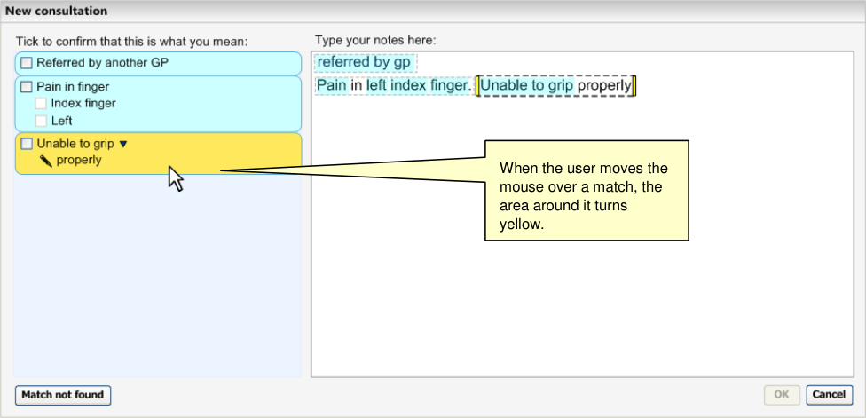

In the Single concept matching approach, and in the ‘view all matches’ stage in the Text parser
approach, the system will display both the top SNOMED-CT match and all alternative concepts that
fall within the matching threshold. The user will be able select alternative matches to the top match,
in addition to changing the input text (and thus changing the matches on offer).

In order to support these user actions, the matches will be shown in a relevant order; in this case,
in the order of statistical word relevance—plus some additional ordering of ‘common’ versus ‘all
other’ matches; see section 2.4 for further details. In addition, the input field will be located in a
position such that the user can view it simultaneously with the matches. The user should not be
overwhelmed by a long list of matches (some lists of matches can comprise hundreds of items): the
design assumes that users will be comfortable viewing up to nine matches simultaneously, and
therefore only shows this number in the default view. Users may scroll down the list or stretch the
dialog so that more matches are visible simultaneously.

All matches will be displayed in either their SNOMED-CT ‘Preferred term’ or ‘synonym’ description
ID labels, depending upon which of these IDs has been matched.

In the Text parser approach to matching, there are two potential, and mutually exclusive,
mechanisms for viewing alternative matches.

The first, the default mechanism, is a control whereby the user accesses the alternative matches by
clicking on the top match ‘clickable area’. The match’s area becomes clickable when the user
moves the mouse over it; this is signified by the area changing colour and becoming slightly
embossed/’3D’. Crucially, on moving the mouse over the area, the area also indicates if the system
has returned:

 Alternative matches with very similar spelling (see Figure 31)

 Alternative matches that are further specific examples of the top match, that is, further down

the hierarchical lineage (see Figure 31)

 Alternative matches with the same spelling (see Figure 32)

Page 40

Copyright ©2013 Health and Social Care Information Centre

HSCIC Controlled Document

Figure 31: System Warns the User That There are Very Similar Matches

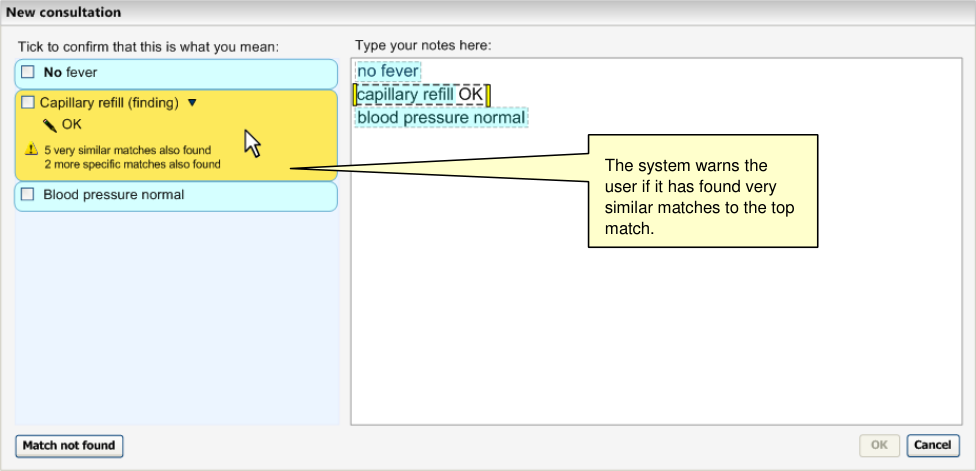

If there are any alternative matches with the same spelling, the check box will be disabled until the
user has clicked on the area to view the alternative matches (see Figure 32).

Figure 32: System Forces the User to View Matches with Same Spelling Prior to Confirmation

**Note**

This solution requires thresholds for similarity to be agreed by the NHS, as the level of similarity that
triggers a warning has patient safety implications.

When the alternative matches are displayed in a list, the list width will allow 32 characters in a line.
If the SNOMED-CT concept exceeds this length, it should wrap onto a second line which is
indented by two characters. If the text for a single match exceeds 62 characters, the system must
display all that it can over the two lines and feature an ellipsis (‘…’) at the end of the text, to indicate
that it has been truncated. 95% of the SNOMED-CT concepts comprise 62 characters or less. The
user may view the full label in the fly-out (which displays the Fully specified name).

Page 41

Copyright ©2013 Health and Social Care Information Centre

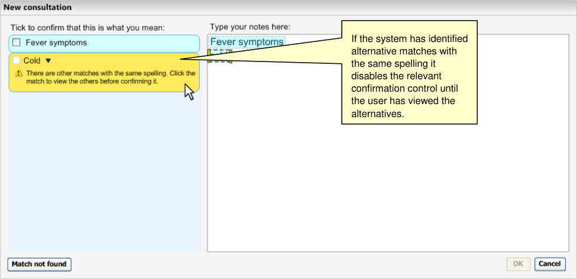
HSCIC Controlled Document

Figure 33: System Displays List of Alternative Matches

_**Viewing the Concept ‘Definition’**_

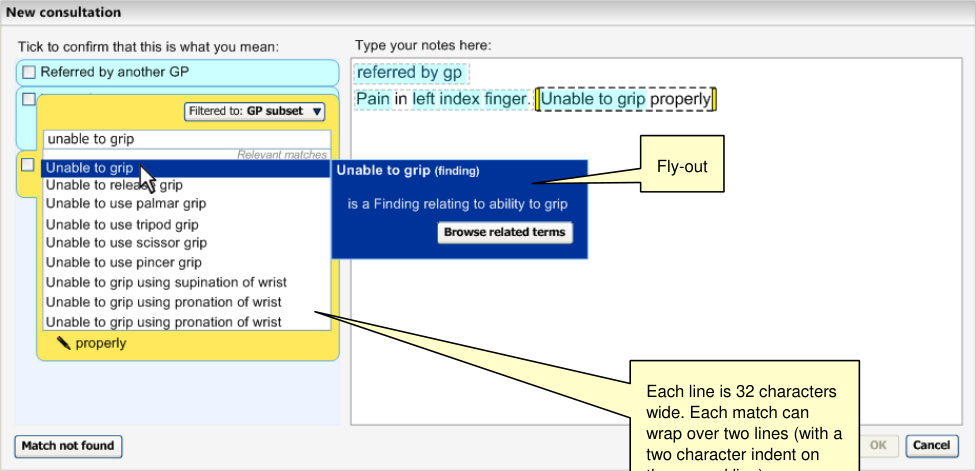

It will be important for the user to view a ‘definition’ of the concept, given the potential for confusion
between similar sounding and similarly spelt concepts.

As a user moves focus over each results list item, a fly-out dialog displays a definition. This dialog
opens automatically. The definition illustrated below is derived from the ‘is a’ relationships within
SNOMED-CT (see Figure 34 and Figure 35).

The concept’s hierarchical
‘parents’ displayed as an
‘is a’ definition.

Figure 34: Definitional Fly-out

Page 42

Copyright ©2013 Health and Social Care Information Centre

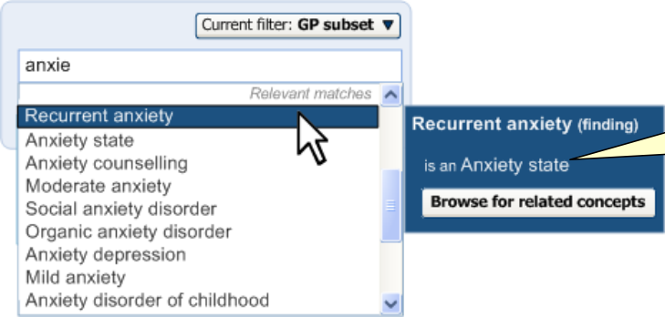
HSCIC Controlled Document

Figure 35: User Moves Mouse Down the List and Fly-out Moves with Highlight

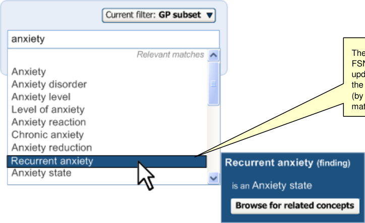

The ‘Is a’ concepts, which are the parents of the highlighted concept, are displayed immediately
below the highlighted concept. They feature appropriate labels, such as ‘Is a’. However, if there is
more than one parent, the second parent should be labelled ‘And a’, in order to avoid the user
thinking that they are mutually exclusive choices.

This is a manageable solution to the need for a definition. There are other ways of defining a
concept, such as displaying its subtypes or siblings, or by displaying a number of levels of
supertypes, in order to pinpoint where it sits in the SNOMED-CT hierarchy. However, the solution
outlined above allows clear definition of the concept, without overwhelming the user with references
to related concepts. The user may get a fuller indication of where the concept sits within the
hierarchy by clicking on the ‘Browse for related concepts’, which opens up a dialog for browsing the
hierarchy (see section 2.5).

The topic of possible ways to communicate concept definitions is further discussed in SNOMED
_Clinical Terms ® Guide – Abstract logical models and Representational forms_ **{R12}.**

_**Presenting ‘No Matches Found’**_

In the Single concept matching approach, if the system cannot return any matches for a text input,
it does not show any matches below the input field and no fly-out appears. Owing to the interactive
nature of the progressive matching, it will be clear to the user that if nothing is showing, then there
are no matches.

In the Text parser matching approach, if the system cannot return any matches for a text input, it
does not show any matches in the ‘Suggested matches’ column, neither does it highlight the match
in the ‘encodable’ highlight.

Users can open the encoding dialog for any text they want in the text input area of the Text parser
approach, by highlighting the text, right-clicking to open the contextual menu and selecting ‘Find
matches for this text’. This will open up the encoding dialog with the input field pre-populated with
the selected text. The user may then tweak the text in order to find a match.

No list is displayed if no
matches are returned

Page 43

Copyright ©2013 Health and Social Care Information Centre

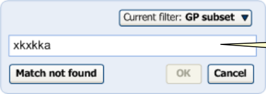
HSCIC Controlled Document

Figure 36: No Matches Found

_**Reporting ‘No Matches Found’**_

The user must also be able to report if the system has not been able to match the term that they
need.

In the design below (Figure 37), the user has two ways of reporting ‘no match found’. The first way
involves right-clicking on the word that has not been matched. This will offer an option to report this.
Alternatively, the user may click on the ‘No match found’ button at the foot of the page. This will
launch a wizard which allows the user to enter the word that they could not match. Both methods
will launch a process that will inform those who manage and maintain SNOMED-CT of the missing
term. However, currently this process is undefined.

The system will not encourage the user to enter an ‘approximate’ concept. Instead, the user may
either browse the hierarchy to a more general instance of the concept (if this is appropriate) or may
leave the word in free text.

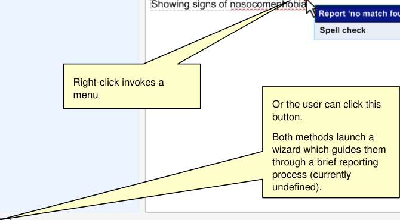

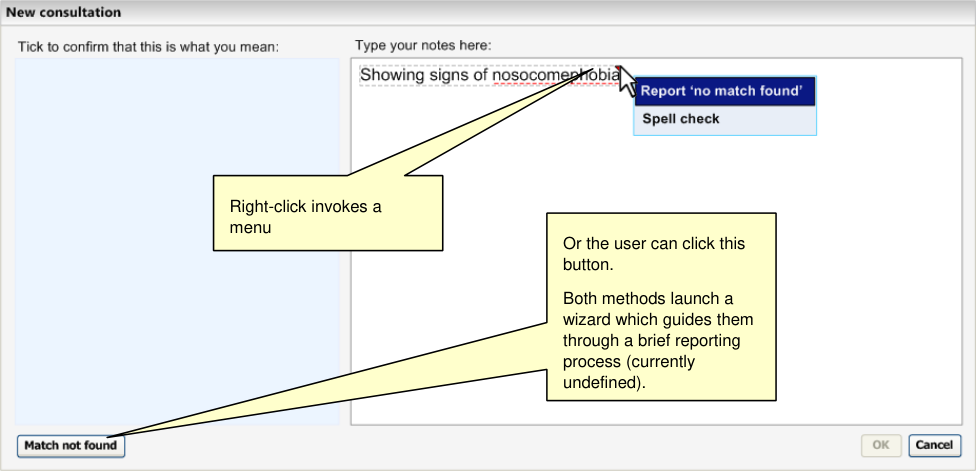

Figure 37: Reporting No Match Found

_**2.3.2.1**_ _**Guidance**_

The system:

 Must display top matches to the user while the user is typing their notes

 Must ensure that the suggested matches do not obstruct the user’s noting

 Must ensure that the suggested matches are visible to the user as they type in their notes

 Should stack the suggested matches vertically

 Should bound each suggested match visually (for example, in a rectangular or lozenge
shaped perimeter)

 Must provide an automatic scroll bar in the suggested matches area, if the matches exceed

the space available

 Must warn the user if there are very similar alternative matches or matches which constitute

a ‘child’ (in terms of the SNOMED-CT hierarchy)

 Should communicate to the user that they can access these alternative matches by
clicking on the suggested match area

Page 44

Copyright ©2013 Health and Social Care Information Centre

HSCIC Controlled Document

 Must display the matched synonym description label if the match is with a synonym

description and the Preferred term description label if the match is with a Preferred term
description

 Must directly expose clinicians to SNOMED-CT labels; Preferred term, synonym (where

appropriate) and Fully specified names

 Should display the highlighted concept’s parent concept labels

 Should display the highlighted concept’s parent concept labels in the fly-out

 Should feature appropriate labels next to each parent concept

 Should feature the labels ‘Is a’ for the first parent, and ‘And a’ for further parents

 Must keep SNOMED-CT Concept IDs hidden from the clinician

 Should display nothing if a word or phrase cannot be matched

 Must provide the user with a method of reporting ‘No matches found’

 Must allow a width of 32 characters for the matches list

 Should wrap labels that exceed 32 characters over two lines, with the second line indented

by two characters

 Should truncate labels that exceed 62 characters and feature an ellipsis to communicate

the truncation

_**2.3.2.2**_ _**How to Use the Design Guide Entry**_

sufficiently promptly 200 milliseconds of the last

Display matches within
200 milliseconds of the last
key press

Insufficient responsiveness can cause the user to
think that something is wrong, and they may try to
type other characters in order to get a response

Table 12: How to Use the Design Guide Entry

_**2.3.2.3**_ _**How Not to Use the Design Guide Entry**_

next to each match

next to each match concept labels, especially ‘Clinical finding’
####  Feature numbering next to each list item ‘1. Anxiety In testing, users were confused by a system of

2. Anxiety disorder

3. Anxiety level’

In testing, users were confused by a system of
numbering

Table 13: How Not to Use the Design Guide Entry

_**2.3.2.4**_ _**Benefits and Rationale**_

The matches should be displayed in a visible, but unobtrusive manner. The user should not be
distracted by the matches. and the matching process should definitely not interfere or stop their
typing. This is especially important given the interpersonal interaction that may be taking place
between the clinician and their patient, or the clinician and their colleagues during the noting
activity.

These designs have been tested with clinicians, who noticed the matches and understood the
matching process.

Testing has shown that many users (50% in a recent test) end up choosing a match that is more
specific than the text that they had originally entered. For example, when they had typed in ‘chest

Page 45

Copyright ©2013 Health and Social Care Information Centre

HSCIC Controlled Document

pain’, they would end up choosing ‘Acute chest pain’. It is for this reason that the system should
indicate where there are more specific instances of the top match within the list of alternative
matches, and should encourage users to view this list before confirming the match.

Also, testing showed that users were confused by the parent concept labels if there were more than
one present. Users thought they were mutually exclusive selections. Appropriate labelling should
reduce this risk.

In testing, users also commented on the usefulness of presenting the suggested matches in view of
the text entry area, as they provided a ‘confirmation’ of their noting. All users understood, without
prompting, that the suggested matches in the left-hand column were the most likely code matches
proposed by the system. Users described them as ‘predictive encoding’, ‘do you mean?’,
‘suggesting a code’, ‘is this what you meant?’ and ‘asking you to confirm a queried code’. Also,
most users understood that the matches are not coded immediately, but need confirmation.

In previous designs, unconfirmed matches featured a ‘?’ symbol, but this was replaced with a check
box as some users confused this with the communication of a query. Also, the check box
emphasises the fact that the left-hand column is interactive. In previous designs that did not feature
the check box, 50% users felt that items in this column were not interactive. In subsequent testing,
the check box design was shown to be understood by all clinicians as meaning ‘coded’ and ‘not
coded’.

In recent testing, users were shown wire-framed sequences of ‘auto-completion’ matches, which
auto-completed the users’ words as they typed. Users though that this is a useful idea as it allows
them to ‘keep an eye on the codes’ and gave ‘helpful suggestions’. However they felt that the autocompletion of the text that they were typing was distracting and could slow their noting. The current
design includes the ‘concept suggesting’ feature, but without the distracting auto-complete function
in the text entry area.

Testing also revealed that users prefer labels to be wrapped over two lines, rather than be
truncated to fit a single line (if the text exceeds 32 characters in length).

Some areas of this guidance have not undergone rigorous user testing, such as the ‘No matches
found’ feature, and so further usability testing is expected, which will possibly result in potential
updates.

_**2.3.2.5**_ _**Confidence Level**_

_**High**_

 Must display top matches to the user while the user is typing their notes

 Must ensure that the suggested matches do not obstruct the user’s noting

 Must ensure that the suggested matches are visible to the user as they type in their notes

 Should stack the suggested matches vertically

 Should bound each suggested match visually (for example, in a rectangular or lozenge
shaped perimeter)

 Must provide an automatic scroll bar in the suggested matches area if the matches exceed

the space available

 Must display the matched synonym description label if the match is with a synonym

description, and the Preferred term description label if the match is with a Preferred term
description

 Must directly expose clinicians to SNOMED-CT labels; Preferred term, synonym (where

appropriate) and Fully specified names

 Must keep SNOMED-CT Concept IDs hidden from the clinician

Page 46

Copyright ©2013 Health and Social Care Information Centre

HSCIC Controlled Document

 Should display nothing if a word or phrase cannot be matched

 Should display the highlighted concept’s parent concept labels

 Should display the highlighted concept’s parent concept labels in the fly-out

 Should feature appropriate labels next to each parent concept

 Should feature the labels ‘Is a’ for the first parent, and ‘And a’ for further parents

 Must allow a width of 32 characters for the matches list

 Should wrap labels that exceed 32 characters over two lines, with the second line indented

by two characters

_**Medium**_

 Must warn the user if there are very similar alternative matches or matches which constitute

a ‘child’ (in terms of the SNOMED-CT hierarchy)

 Should communicate to the user that they can access these alternative matches by
clicking on the suggested match area

 Must provide the user with a method of reporting ‘No matches found’

 Should truncate labels that exceed 62 characters and feature an ellipsis to communicate

the truncation

Page 47

Copyright ©2013 Health and Social Care Information Centre

HSCIC Controlled Document

##### **2.3.3 Selecting and Confirming SNOMED-CT Matches**

Users must be able to select SNOMED-CT matches in a quick and consistent manner. The
guidance outlines how this could be achieved.

_**Selecting and Confirming in the Text Parser Approach**_

As outlined earlier, in the Text parser approach to matching (section 2.1.2), the system displays the
top matches in the Suggested matches area, in the left-hand column. At this point, the user may:

 Select the check box to confirm that the match is correct

 Click on the match’s label to view and select alternative matches

 Change the text they have typed

As the user moves the mouse down the suggested match areas in the left hand column, the
selection areas become yellow. If the user clicks on the yellow area (but not necessarily on a label
area) this will move the marquee selection in the right-hand text input area.

Moving the mouse over the marquee does not move the selection area (on either side), but if the
user moves the focus in the text input area, the corresponding selected match is highlighted in the
left-hand column (see Figure 38).

Figure 38: Moving the Mouse Over a Suggested Match Highlights the Area in Yellow

Page 48

Copyright ©2013 Health and Social Care Information Centre

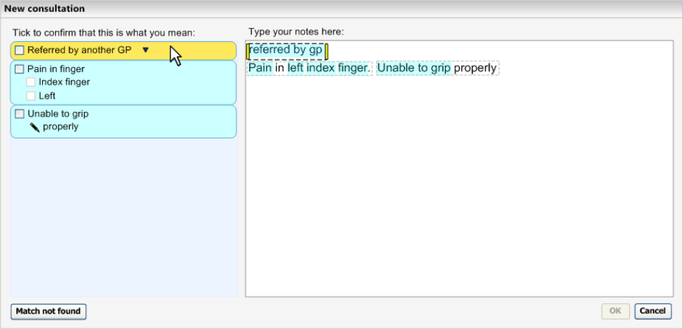
HSCIC Controlled Document

Figure 39: Moving the Mouse to a Selected Area and Clicking on it Moves the Focus in the Right-Hand Area

At this point, if the system has returned similar matches to the one displayed, the system will
communicate a warning to the user (see Figure 40).

Figure 40: Warning That There are Very Similar Matches

The user can click the appropriate check box to confirm that the match is correct. This match will
then be encoded when the record is saved (see Figure 41).

Page 49

Copyright ©2013 Health and Social Care Information Centre

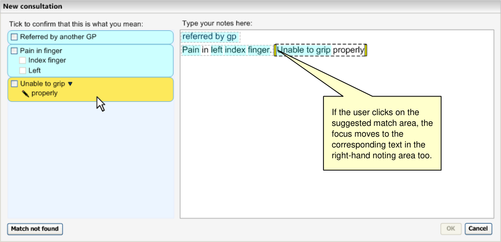

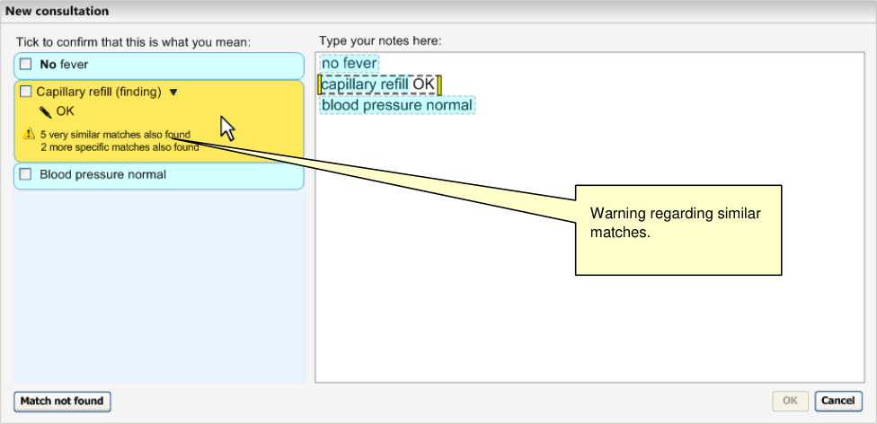
HSCIC Controlled Document

Figure 41: Confirming the Match

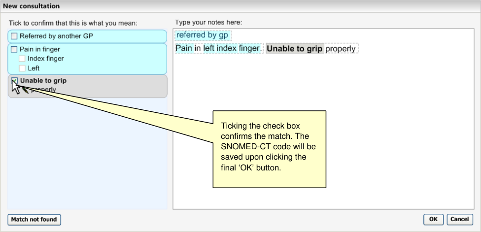

Once confirmed, the system will replace the user-typed ‘original’ text with a rendering of the
SNOMED-CT concepts. If it is a single pre-coordinated SNOMED-CT concept, the system will
simply replace the text with either the ‘Preferred term’ or ‘synonym’ label.

The confirmation check box is only enabled if there are no unselected mandatory fields associated
with the selected match. For example, if the matched concept is a body structure that requires an
indication of laterality, the check box is not enabled until the user has selected a side (which could
be ‘unspecified’).

Alternatively, the user may choose to view the alternative matches. In the example below the user
moves the mouse over onto the label itself, which turns orange and appears ‘clickable’ (that is,
slightly embossed). See Figure 42.

Figure 42: User Moves Mouse onto Label which Turns Orange and Clickable

The user then clicks the label which reveals a list of alternative matches, and a field into which they
may adjust the input text (using progressive matching). See Figure 43.

Page 50

Copyright ©2013 Health and Social Care Information Centre

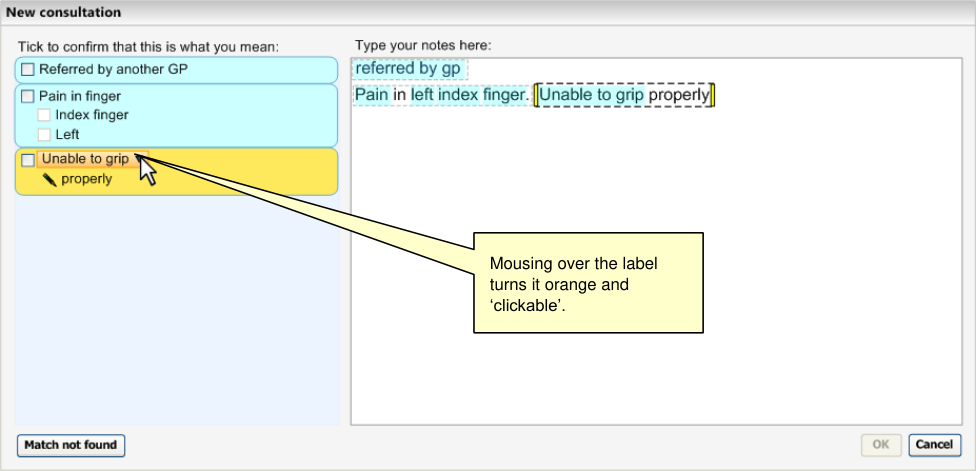
HSCIC Controlled Document

Figure 43: User Clicks on Label to Reveal Alternative Matches

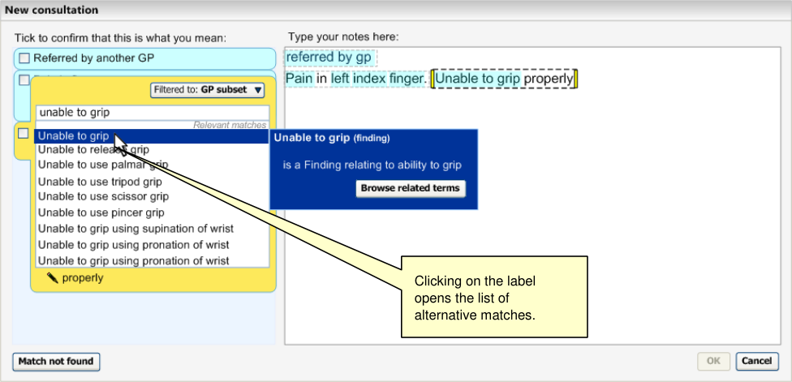

The user may move the mouse down the list (which alters the content of the fly-out) and select an
item by clicking on it (see Figure 44).

Figure 44: User Moves Mouse Down the List

Selecting an item from the list closes the expanded list view and automatically confirms the match
(see Figure 45).

Page 51

Copyright ©2013 Health and Social Care Information Centre

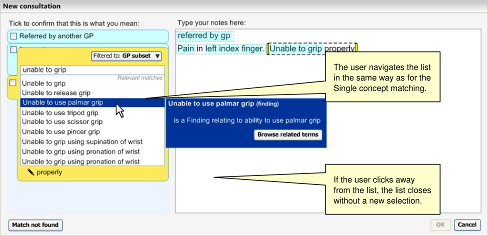
HSCIC Controlled Document

Figure 45: Clicking on a List Item Closes the List and Confirms the Match

_**2.3.3.1**_ _**Guidance**_

The system:

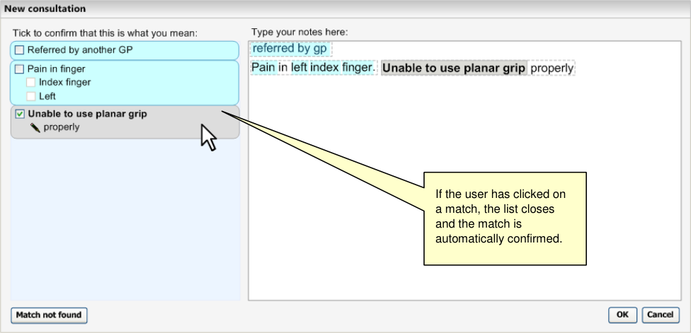

 Must allow the user to confirm, or not confirm suggested matches

 Should provide the user with a clear confirmation control for each suggested match

 Should feature a check box to enact confirmation

 Must allow the user to view the full list of matches for each suggested match

 Should allow the user to view this full list by clicking on the relevant match label

 Could display the relevant match label in orange and emboss it when the user
moves the mouse over it, in order to communicate that it is clickable

 Must clearly display which match the user has selected

 Could highlight the suggested match area in yellow when the user moves the mouse
over it

 Should display ‘drop-down’ arrows next to each of the labels in the highlighted area to
indicate that there are more matches available

 Should ensure that the highlight in the left hand ‘suggested matches’ area is reflected by

the focus in the text input area. Clicking on a suggested match highlights that area and also
moves the focus to the corresponding text in the text input area

 Should replace the original text in the text input area with the relevant SNOMED-CT

concept label (which will be either a ‘Preferred term’ label or ‘synonym’ label) upon
confirmation

 Should only enable the confirmation control if there are no unselected mandatory

elaboration fields associated with the match

 Should disable the confirmation control if there is an alternative match that has the same

spelling as the top match. The user must view the expanded list of matches prior to
confirmation

 Must warn the user where there are very similar matches or matches that are ‘children’ of

the top match

Page 52

Copyright ©2013 Health and Social Care Information Centre

HSCIC Controlled Document

_**2.3.3.2**_ _**Benefits and Rationale**_

The system must encourage the user to confirm the matches before saving the note to record, and
must feature appropriate controls for doing this. A vertical stack of check boxes is a clear and easy
way of doing this, and this follows the standard ‘checklist’ metaphor. User testing has confirmed
that clinicians understand this.

Also, the system must allow users to view the alternative matches as the top match may not be
appropriate, and this could have safety implications if it is wrong. Again, user testing has supported
this guidance.

Although user testing has shown that users understand the process of ticking the boxes to confirm
matches, this has not been tested with an interactive prototype. Therefore, further usability testing
is expected, which may result in potential updates.

_**2.3.3.3**_ _**Confidence Level**_

_**High**_

 Must allow the user to confirm, or not confirm suggested matches

 Must allow the user to view the full list of matches for each suggested match

 Should allow the user to view this full list by clicking on the relevant match label

 Could display the relevant match label in orange and emboss it when the user
moves the mouse over it, in order to communicate that it is clickable

_**Medium**_

 Should provide the user with a clear confirmation control for each suggested match

 Should feature a check box to enact confirmation

 Must clearly display which match the user has selected

 Could highlight the suggested match area in yellow when the user moves the mouse
over it

 Should display ‘drop-down’ arrows next to each of the labels in the highlighted area to
indicate that there are more matches available

 Should ensure that the highlight in the left hand ‘suggested matches’ area is reflected by

the focus in the text input area. Clicking on a suggested match highlights that area and also
moves the focus to the corresponding text in the text input area

 Should replace the original text in the text input area with the relevant SNOMED-CT

concept label (which will be either a ‘Preferred term’ label or ‘synonym’ label) upon
confirmation

 Must only enable the confirmation control if there are no unselected mandatory elaboration

fields associated with the match

##### **2.3.4 Dealing with Abbreviations**

The system looks for matches in synonyms, including abbreviations, from within SNOMED-CT.
When the user types in an abbreviation; the resulting abbreviation is shown with the Fully specified
name (FSN) and its hierarchical parents (see Figure 46).

Page 53

Copyright ©2013 Health and Social Care Information Centre

HSCIC Controlled Document

Figure 46: Displaying Abbreviations

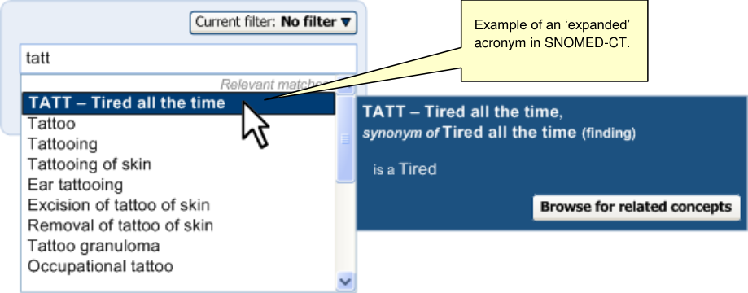

The use of abbreviations and acronyms does introduce further risk that the user selects the wrong
concept because:

 Some abbreviated terms in SNOMED-CT do not feature the expansion in the label

 In a number of instances multiple concepts share the same abbreviation or acronym

In the worst cases, there are abbreviations/acronyms for multiple concepts which do not feature the
expansion in their labels. For example there are two ‘SLE’ acronyms in SNOMED-CT that do not
have any further text in their labels. One is a synonym for the disorder, ‘Systemic lupus
erythematosus’ (ConceptID 55464009), while the other is a synonym for the disorder,
‘Neuroinvasive St. Louis encephalitis virus infection’ (ConceptID 417607009). In these cases, the
meaning of the acronym only becomes apparent in the Fully specified name (FSN). Therefore, the
system must always display these matches with the synonym name and the FSN (minus the
reference to the high-level category, such as ‘disorder) in a combined label (see Figure 43). This
combined label will also be displayed in the right-hand noting area upon confirmation.

Where there are two acronyms/abbreviations with the same spelling, the mechanism for dealing
with same-spelling matches will apply (see Figure 32 in section 2.3.2).

However, there are a few cases where the acronym does not need to be expanded, as in the case
of ‘Laser’. These would be excluded from the list of those acronyms/abbreviations that require the
FSN in the label.

Page 54

Copyright ©2013 Health and Social Care Information Centre

HSCIC Controlled Document

Figure 47: System Forces the User to View the Acronym Definition Prior to Confirming it

For further discussion about abbreviations and acronyms, please refer to _NHS CUI Design Guide_
_Workstream – Abbreviations and Acronyms_ **{R10}** and _NHS Design Guide and Toolkit Workstream_

_– Abbreviations and Acronyms in Free Text Input_ **{R11}.**

**Note**

The creation of lists of unexpanded acronyms or abbreviation synonyms would need to conducted
externally, under the supervision of the NHS

_**2.3.4.1**_ _**Guidance**_

The system:

 Must allow users to search using SNOMED-CT abbreviations in the same way as for any

other synonym

 Must allow the user to search on an abbreviation in both the ‘single concept’ and 'text

parser' approaches

 Should not treat abbreviations as case sensitive (that is, treat ‘TATT’, ‘Tatt’ and ‘tatt’ as

equivalent entries)

 Should display both the abbreviation and FSN in the fly-out (as with other SNOMED-CT

synonyms)

 Must display a combined label of both the acronym and the FSN in those instances where

the acronym is not expanded in the synonym label

 Must render the combined acronym/FSN label in the right-hand text input area upon
confirmation of the match (this applies only to the Text parser approach)

_**2.3.4.2**_ _**How to Use the Design Guide Entry**_

search results list and in the modifier avoid mistakenly choosing an incorrect concept
dialog

Page 55

Copyright ©2013 Health and Social Care Information Centre

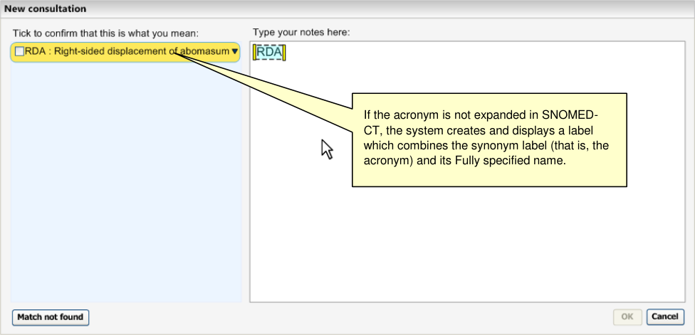
HSCIC Controlled Document

####  Ensure that abbreviations are always

written in capital letters and in bold

Table 14: How to Use the Design Guide Entry

See Figure 46 This ensures that they are prominent, distinct
from normal concept labels and consistently
formatted

_**2.3.4.3**_ _**How Not to Use the Design Guide Entry**_

abbreviation in capital letters even not force the user to capitalise letters
though they are displayed by the
system in capitals. Mixed or lower case
letter combinations should be
recognised too

Table 15: How Not to Use the Design Guide Entry

_**2.3.4.4**_ _**Benefits and Rationale**_

Users should not be penalised for using abbreviations recognised by SNOMED-CT, therefore
abbreviations should be treated in exactly the same way as other terms and synonyms.

In recent testing, several users were ‘pleasantly surprised’ by the abbreviation recognition provided
by SNOMED-CT (by way of synonyms), and it is imperative that the user interface does not
obstruct this recognition.

Please refer to PART II in APPENDIX A for a detailed description of the requirements for this
guidance.

_**2.3.4.5**_ _**Confidence Level**_

Although not specifically tested in wireframe testing, we are confident that, as this method of input
and matching is essentially the same as for matching unabbreviated terms in SNOMED-CT, the
good response users gave the vanilla matching can translate to matching abbreviations.

_**High**_

 Must allow users to search using SNOMED-CT abbreviations in the same way as for any

other synonym or Preferred term

 Must allow the user to search on an abbreviation in both the ‘single concept’ and 'text

parser' approaches

 Should not treat abbreviations as case sensitive (that is, treat ‘TATT’, ‘Tatt’ and ‘tatt’ as

equivalent entries)

 Should display both the abbreviation and FSN in the fly-out (as with other SNOMED-CT

synonyms)

_**Low**_

 Must display a combined label of both the acronym and the FSN in those instances where

the acronym is not expanded in the synonym label

 Must render the combined acronym/FSN label in the right-hand text input area upon
confirmation of the match (this applies only to the Text parser approach)

##### **2.3.5 ‘Undoing’ Matches**

The user may ‘undo’ confirmed matches, before they are saved to record, by either:

Page 56

Copyright ©2013 Health and Social Care Information Centre

HSCIC Controlled Document

 Double-clicking on the appropriate concept text in the text entry field. This will open up the

appropriate encoding dialog with the confirmation check box deselected, or

 Unselecting the check box next to the appropriate match in the ‘Suggested matches’

column

Also, the system should provide ‘undo’ and ‘redo’ buttons that will undo the last matching or parsing
action.

Figure 48: Undo and Redo Buttons (Top Right Hand Corner)

_**2.3.5.1**_ _**Guidance**_

The system:

 Must allow users to undo the confirmation of a matched expression

 Should allow the user to undo a confirmed match by deselecting the appropriate check
box

 Should allow the user to undo a confirmed match by clicking on the appropriate text in
the text input area

 Must return the text to its original form upon un-confirming a matched expression

 Must provide an ‘undo’ and ‘redo’ function which undoes the effects of the last send

matching request

 The controls should be visible from the main window

_**2.3.5.2**_ _**Benefits and Rationale**_

It is good practice to feature an ‘undo’ function, and users will expect it, given its prevalence in most
office-based software packages. Users should also have the opportunity to un-confirm a confirmed
item before saving it to record.

_**2.3.5.3**_ _**Confidence Level**_

_**High**_

 Must allow users to undo the confirmation of a matched expression

Page 57

Copyright ©2013 Health and Social Care Information Centre

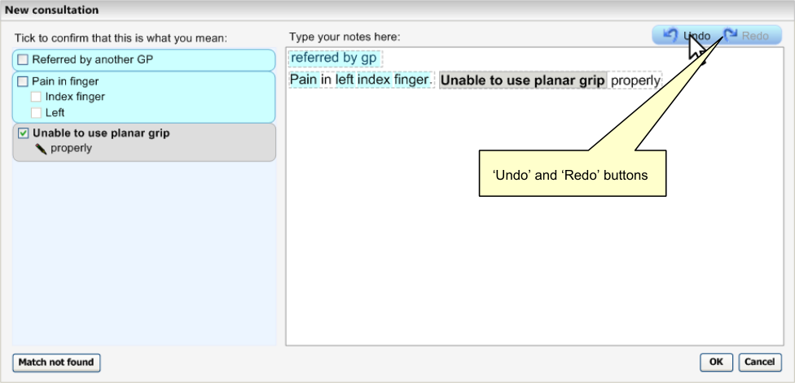
HSCIC Controlled Document

 Should allow the user to undo a confirmed match by deselecting the appropriate check
box

 Should allow the user to undo a confirmed match by clicking on the appropriate text in
the text input area

 Must return the text to its original form upon un-confirming a matched expression

_**Low**_

 Must provide an ‘undo’ and ‘redo’ function which undoes the effects of the last send

matching request

 The controls should be visible from the main window

#### **2.4 Context**

Context plays an important role in any kind of clinical noting. In this section, we refer to context in
two distinct ways:

 Context as a giver of meaning to an encoded concept (‘semantic context’)

 Context as a filter for improving searches for concepts or for preventing erroneous matches

These two interpretations of the term ‘context’ are distinct, but in certain ways, they can be handled
using similar mechanisms in the user interface.

_**Semantic Context**_

The context in which the user has written the note will affect the meaning of the note, and so it is
important that this context is made explicit, both at the point of encoding and at the point of
retrieval.

For example, if the clinician were to record the concept ‘Aspirin’, it would not mean much in clinical
terms. However, if they recorded this in a field marked ‘Does the patient suffer from any drug
allergies?’, they would assume that the patient suffers from a drug allergy, the causative agent
being the analgesic.

In this instance, it would be meaningless to save the code for the substance ‘Aspirin’ (ConceptID
387458008) by itself. Instead, the system must record the implication that the substance is the
causative agent of the allergy which is suffered by the patient. This would require a postcoordinated expression, such as:

Allergic reaction to drug (ConceptID 416093006 ) | Has causative agent (ConceptID
246075003) | Aspirin (ConceptID 387458008).

This expression is canonically equivalent to ‘Aspirin allergy’ (ConceptID 293586001)

Also, there may be other specific circumstances when a concept is modified by context-attributes.
These may be set by:

 The nature of the modifying clinical expression

 The placement of the concept within a record, document or message component

 Default context value settings

_**Context As a Filter**_

The large number of concepts in the SNOMED-CT Terminology means that restricting the search
according to context will reduce the load on the user; it should make it easier for the user to get to
the desired concepts that they wish to articulate by avoiding many irrelevant concepts. Sometimes
context must be imposed. For example, in a field for entering details of an allergy, the clinician
should be prevented from entering anything other than an allergen or an allergy (and if they do

Page 58

Copyright ©2013 Health and Social Care Information Centre

HSCIC Controlled Document

enter an allergen, the system must ensure that this is saved as a post-coordinated expression with
the concept of ‘allergy’).

The system would do this by reducing the number of results presented to the user and by providing
a basis for prioritising the search results. This prioritisation would help users to differentiate
synonyms, by promoting the most relevant synonyms up the results list.

Context also allows the system to further reduce the load on the user by selecting and suggesting
default values (during the 'elaboration' steps of the interaction).

The context of an encoding interaction depends on a number of factors, each of which may affect
the way in which the system filters and presents search results, these are:

 The corporate requirements (for example, different NHS Trusts or GP practices may have

different requirements for encoding)

 The clinical specialities (for example, a diabetes clinic versus a casualty department)

 The healthcare provider (for example, a consultant versus a general practitioner)

 The patient (for example, an infant versus a patient suffering from chronic heart disease)

 The note-taking task (for example, describing family history versus describing planned

procedures)

These context descriptors may be set by the system or by the user. For example, when a user
enters notes under a 'Family history' heading, the system may automatically adjust the context
accordingly. Equally, the user could restrict the context by choosing to search only for ‘symptoms’
rather than for the full range of options.

Page 59

Copyright ©2013 Health and Social Care Information Centre

HSCIC Controlled Document

##### **2.4.1 Optimising Matching by the Use of Contextual Limitation**

In the Text parser approach to matching (see Figure 49), the design allows the user, or the
workflow, to set the context for matching through the use of ‘clerking headings’.

Figure 49: Clerking Headings

The user may view which subset of filters apply to the matches by clicking on the clerking heading
(see Figure 50). They may adjust the control by expanding the subset to a higher level. However, if
such ‘nested’ subsets are not available, the system will present a binary choice of ‘Filter’ or ‘No
filter’ (see Figure 51).

Figure 50: Subset Control

Page 60

Copyright ©2013 Health and Social Care Information Centre

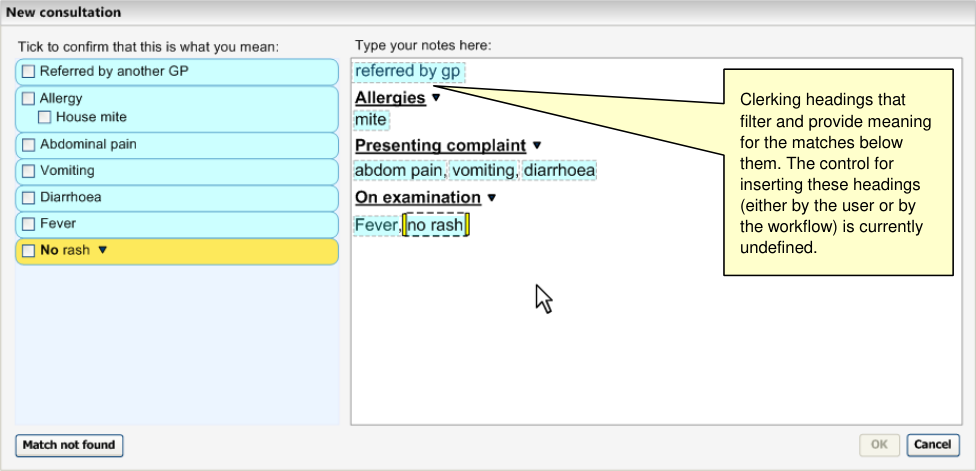

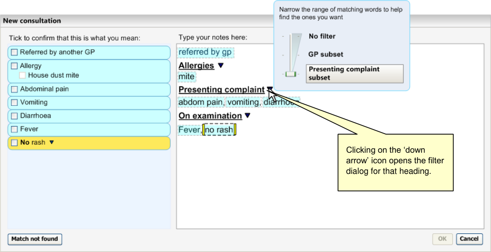
HSCIC Controlled Document

Figure 51: Binary Subset Control

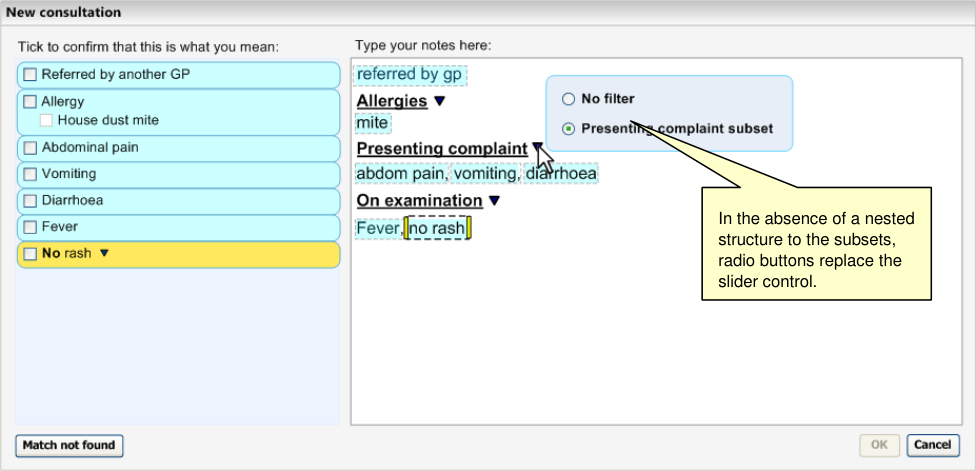

In the Single concept matching approach, the system will display the subset which is being applied
in a button above the matching entry field (see Figure 52). The label will contain part, or all, of the
‘human readable’ label of the subset. If the subset label exceeds 20 characters, it should be
truncated at the end and feature an ellipsis (‘…’).

Figure 52: Subset Filter Control for the Single Concept Matching

The subset control features instructional text to communicate to the user what they can do with the
control (see Figure 52). This text changes depending on the setting that the user has chosen (see
Figure 53).

Page 61

Copyright ©2013 Health and Social Care Information Centre

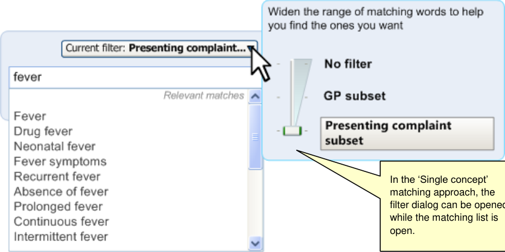
HSCIC Controlled Document

Figure 53: Subset Filter Control: 'GP subset' Selected

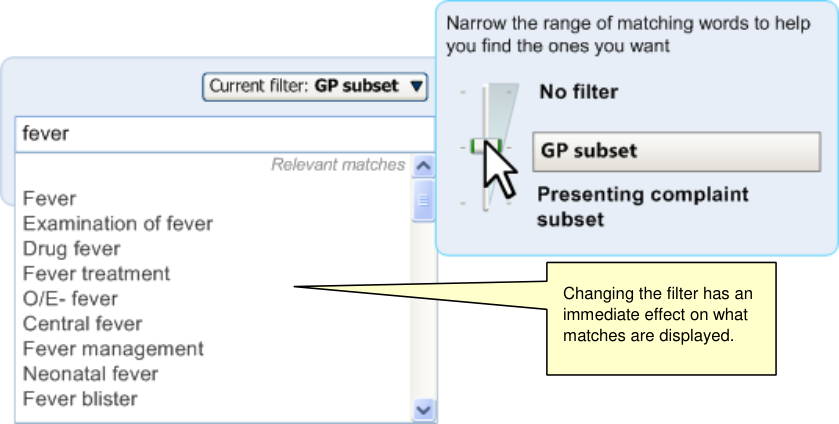

As shown in the examples above, the user may adjust the control when the list of alternative
matches is being displayed. When the user adjusts the control, the list automatically updates,
possibly revealing or hiding match options.

Additionally, the system will reorder the matches list according to a ‘common matches’ subsets. It
will split the matches list with a line, and appropriate headers within the list (see Figure 54).

Common matches can be
displayed at the top of the
list. How this set is
determined is undefined in
the current guidance.

Figure 54: System Distinguishes Common Matches and Pushes Them Up the List

In addition to these specific filters, a number of global subsets should also apply: the ‘Core’ set of
SNOMED-CT terms, plus UK extension components, filtered by the UK language set. Additionally,
the only concepts to be included will have a status of ‘current’ or ‘pending move’.

Also in the Text parser approach (as stated in section 9), the system will filter the matches to
certain top-level categories and their attributes (which could be drawn from anywhere in the
hierarchy). Typically, these ‘base’ concepts will be ‘Clinical findings’, ‘Procedures’, ‘Observable
Entities’ and ‘Situations with explicit context, but this filter may change according to the necessary
context (for example, to include ‘Events’ as well).

**Note**

This solution requires the creation of appropriate subsets and contextual ‘hooks’ to be defined by the
NHS.

Page 62

Copyright ©2013 Health and Social Care Information Centre

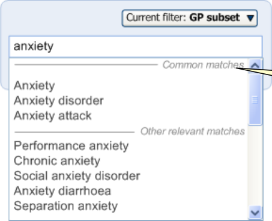
HSCIC Controlled Document

The system will also appropriately post-coordinate those concepts which derive part of their
meaning from the heading under which they are written, such as when ‘Aspirin’ is written under the
heading ‘Allergies’. The system will display the simplest post-coordination solution; in this case, the
base concept ‘Allergies’ and the attribute value, ‘Aspirin’. The system will not display the attribute
name (in this case, ‘Has causative agent’).

However, there may be cases where the base concept and attribute value labels are insufficient,
and therefore further research and user testing should be conducted in this area (see section 3).

_**2.4.1.1**_ _**Guidance**_

The system:

 Must filter the concepts considered during the matching process, by subsets, where such

subsets are available

 Must allow users to adjust the subset filters

 Could provide a control next to the clerking headings and above the encoding dialog

matching input field

 Should feature an ‘▼’ icon to open the subset control

 Must not obscure the listed matches with the control

 Must display the subset control level with or above the header label, in order to reduce
the risk that the control obscures the relevant text

 Should feature a slider control if there is a linear relationship between the subsets, that
is, if the subsets are logically nested

 Must not display more than three levels of subsets

 Should not feature a slider control if there is no relationship between the subsets

 Must feature appropriate instructional text within the control that explains to users what
they may do with the control and why they would want to use it

 Could feature dynamic instructional text that changes depending upon which level
of subsets is currently chosen

 Could display further information, if such information is made available by the NHS,
about the subset if the user clicks on the subset label in the subset control

 Should close the subset control dialog if the user clicks away from the dialog area

 Could refer to limiting matches by subsets as ‘Filtering’

 Should ensure that adjusting the subset filters has an immediate effect on the matches

displayed

 Must display the ‘human readable’ labels for the subsets.

 Should truncate those labels on the subset button which exceed the button size (without
wrapping) and feature an ellipsis (‘’…’)

 Should display the full ‘human readable’ labels within the subset control

 Must allow multiple subsets to apply simultaneously, if appropriate

 Should provide a listing of matches from a ‘common matches’ subset, that is, push them to

the top of the matching list

 Should distinguish between ‘common’ and other matches in the list (where common
matching applies)

Page 63

Copyright ©2013 Health and Social Care Information Centre

HSCIC Controlled Document

 Should only display clerking headings in the text input area

 Must appropriately post-coordinate those concepts which derive part of their meaning from

the heading under which they are written

 Should display the simplest post-coordination solution, that does not, for example,
feature soft status defaults (for example, status of a finding or procedure) that have not
been modified by the user

 Must filter matches to the ‘Core’ set of SNOMED-CT terms, plus UK extension components

 Must filter to the UK language set

 Must only match concepts that are ‘current’ or ‘pending move’.

_**2.4.1.2**_ _**Benefits and Rationale**_

Users should be able to adjust the subsets in those situations where they cannot match what they
want under the current subset. It is important that the system clearly communicates what subset
filter is being currently applied, so that the user is aware of why the system is matching as it is.

In recent testing, users seemed to understand the notion of subsets and understood that certain
concepts would not be made available in certain concepts.

The subset control must be located in a prominent position. In previous designs where the subset
control was featured immediately below the list, users often did not see it. Therefore, the system
must display the control in a highly visible location. Positioning it immediately above the text entry
field also mirrors the use of clerking headings, thus employing a consistent layout of related
features (that is, subset controls and headings).

Test results indicated that the subset control must also give an indication of the current subset filter
affecting the matching. For example ‘Current filter: Lifestyle and Allergens’ was understood, and
preferred to a label that simply read ‘Filter = On’.

Also, in tests, all users who were questioned indicated that they grasped the idea of the slider
control. It was preferred to two other alternative designs. However, they were not sure if they were
supposed to narrow or widen the matching scope. Therefore, appropriate labelling is necessary to
give users confidence to adjust these settings.

In recent testing, 75% of users who commented on the ‘common matches’ versus ‘other relevant
matches’ design feature, immediately understood its presentation. All users who commented on it
also thought that it was sensible to feature the most common match results at the top of the list.

Clerking headings is a common noting tool used by clinicians, especially those working in
Secondary Care.

Please note that the latest version of this guidance has not undergone rigorous user testing.
Therefore, further usability testing is expected, which may result in potential updates. It is also
worth noting that the nature, and potential usage, of the subsets that will be available over the
coming years is not fully defined. Therefore, the guidance may need to be adapted once this
picture is clearer.

_**2.4.1.3**_ _**Confidence Level**_

_**High**_

 Must filter the concepts considered during the matching process, by subsets, where such

subsets are available

 Should ensure that adjusting the subset filters has an immediate effect on the matches

 Should feature an ‘▼’ icon to open the subset control

 Must not obscure the listed matches with the control

Page 64

Copyright ©2013 Health and Social Care Information Centre

HSCIC Controlled Document

 Must display the subset control level with or above the header label, in order to reduce the

risk that the control obscures the relevant text

 Should not feature a slider control if there is no relationship between the subsets

 Must filter matches to the ‘Core’ set of SNOMED-CT terms, plus UK extension components

 Must filter to the UK language set

 Must only match concepts that are ‘current’ or ‘pending move’.

_**Medium**_

 Must allow users to adjust the subset filters

 Should provide ‘velocity’ listing of matches from a ‘common matches’ subset, that is, push

them to the top of the matching list

 Should distinguish between ‘common’ and other matches in the list (where common
matching applies)

 Should feature a slider control if there is a linear relationship between the subsets, that is, if

the subsets are logically nested

 Must feature appropriate instructional text within the control that explains to users what they

may do with the control and why they would want to use it

 Could feature dynamic instructional text that changes depending upon which level of
subsets is currently chosen

 Should close the subset control dialog if the user clicks away from the dialog area

 Could refer to limiting matches by subsets as ‘Filtering’

 Must display the ‘human readable’ labels for the subsets

 Should truncate those labels on the subset button which exceed the button size (without
wrapping) and feature an ellipsis (‘’…’)

 Should display the full ‘human readable’ labels within the subset control

 Must allow multiple subsets to apply simultaneously, if appropriate
_**Low**_

 Could provide a control next to the clerking headings and above the encoding dialog

matching input field

 Should only display clerking headings in the text input area

 Could display further information, if such information is made available by the NHS, about

the subset if the user clicks on the subset label in the subset control

 Must not display more than three levels of subsets

 Must appropriately post-coordinate those concepts which derive part of their meaning from

the heading under which they are written

 Should display the simplest post-coordination solution that does not, for example,
feature soft axial modification defaults that have not been modified by the user

Page 65

Copyright ©2013 Health and Social Care Information Centre

HSCIC Controlled Document

#### **2.5 Refinement**

##### **2.5.1 Refining a Selected Concept**

In addition to viewing possible SNOMED-CT matches for a text input, the system will also offer the
user the opportunity to refine a selected concept by browsing (and selecting) concepts that are
hierarchically related in the following ways:

 Parents of the selected concept

 Children of the selected concept

 Siblings of the selected concept (that is, the children of the concepts’ parents)

This will allow the user to select a more general or more specific instance of the concept. This
could be very useful in allowing the user to precisely express their notes. It will be especially
important when users are learning the SNOMED-CT terminology or they are noting in an unfamiliar
topic area, as they may not be aware of what terms they can match. As they become more familiar
with the terminology, they will be less likely to want to refine concepts as they will type in more
precise terms in their notes.

However, this will also expose users to the SNOMED-CT hierarchy, which is not particularly userfriendly, in that there may be areas of it which do not fit with the user’s concept of semantic
relationships between concepts. This means that, without proper safeguards, the user could get
lost within the hierarchy. It is for this reason that hierarchy browsing is not the primary method of
concept matching, but should be available for those instances where the user cannot find what they
want, or are unsure about the precise labelling of what they want. In the design, we have hidden
this feature so that the user is not exposed to it immediately. Instead the user is firstly presented
with top matches, then they can choose to view alternative matches and finally they can choose to
browse the hierarchy itself.

We will also be allowing the user to refine attribute values, which refer to the defining concepts that
comprise a fully defined SNOMED-CT concept. So, for example, the user may refine the body
structure that is the site of a procedure. This is important, given that, in many cases there will not
be an available pre-coordinated term for these refinements.

This refinement process is relevant to both the Text parser and single concept approaches.

The user will be able to access the refinement controls by clicking a button in the selected
concept’s fly-out panel. This will open a modal dialog that appears over the top of the encoding
dialog. This dialog will provide lists of the parents, siblings and children of the selected concept.

In the example below (Figure 55, Figure 56, Figure 57, Figure 58, Figure 59 and Figure 60) the
user clicks on the suggested match to open the expanded list view. They then click on the ‘Browse
for related concepts’ button in the fly-out. This opens the navigation dialog, from which they may
browse for related concepts.

Page 66

Copyright ©2013 Health and Social Care Information Centre

HSCIC Controlled Document

Figure 55: User Moves Mouse Over the Match They Wish to Refine

Figure 56: User Clicks on the 'Browse for related concepts' Button

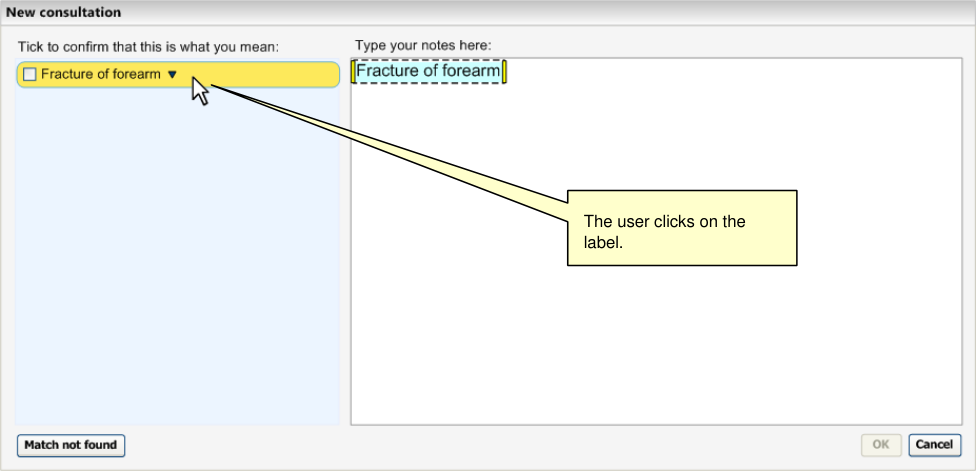

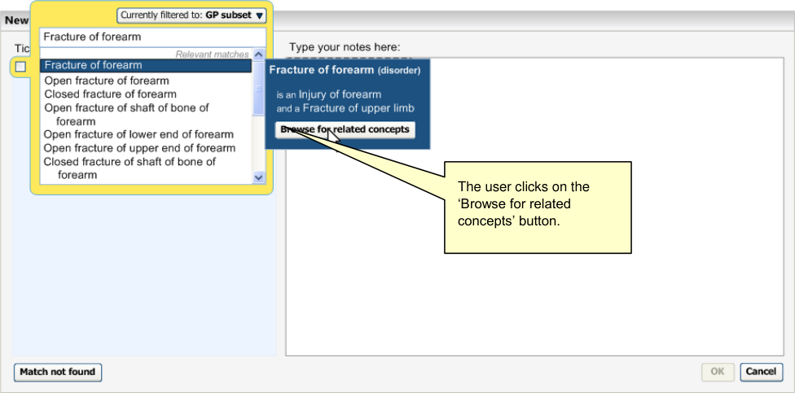

The navigation dialog shows three columns (see Figure 57). The far left column displays the
parents of the selected concept, the middle column displays the children of the parents (that is, the
concept’s ‘siblings’) and the far right column displays the children of the selected concept. Given
the absence of any other logical ranking, all the items in each list are ordered alphabetically.

When the user selects a concept from the list, this concept becomes the ‘selected’ concept. When
the user clicks ‘OK’, the dialog closes (along with the expanded list view) and the selected concept
is automatically confirmed.

Page 67

Copyright ©2013 Health and Social Care Information Centre

HSCIC Controlled Document

Figure 57: System Displays a Navigation Dialog

Figure 58: User Selects 'Fracture of ulna'

The user may also refine the defining attributes of a selected concept (if the concept is ‘fully
defined’ rather than ‘primitive’). For example, in the case of the concept ‘Fracture of forearm’, the
user may refine either of its attributes: the associated morphology, ‘Fracture’, and the finding site,
‘Bone structure of forearm’.

The design allows them to do this by clicking on the appropriate tab and refining in the same way
as for the concept itself. The refined concept appears in the ‘selected’ concept field with userfriendly attribute labels (see **{R2}** for further details about these labels) joining up the refined
concepts; for example, ‘Fracture, **site of** Bone structure of radius’, where ‘site of’ is an attribute label.

Once the user has refined an attribute of the selected concept, the ‘Browse related concepts’ tab is
hidden, as the user would not then be able to browse related concepts for the newly postcoordinated selected concept. They can, however, navigate back to an earlier refinement using the
‘Back’ navigation button, to a point where the tab reappears.

Page 68

Copyright ©2013 Health and Social Care Information Centre

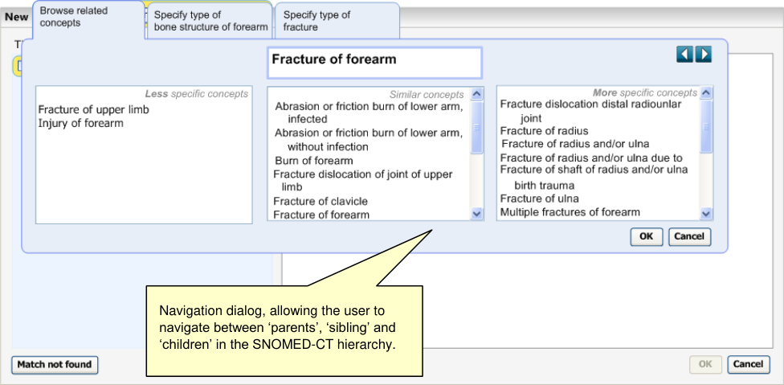

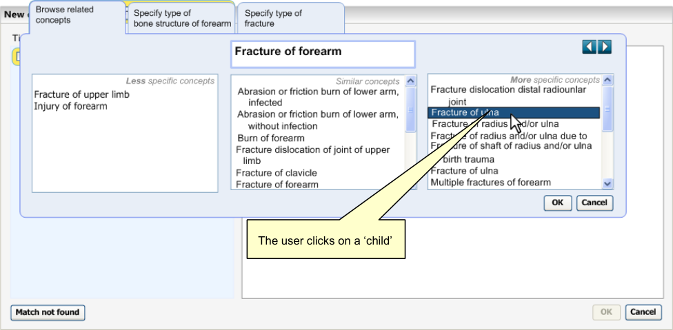
HSCIC Controlled Document

Following selection and confirmation of a refined concept, if the user wants to re-open the encoding
dialog, the input field will be blank by default, and only the refined concept will be displayed below
it.

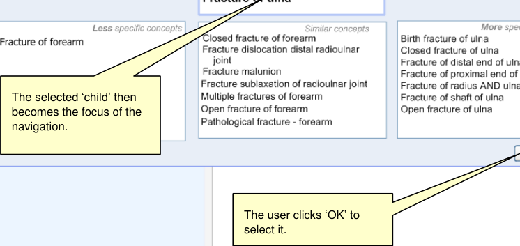

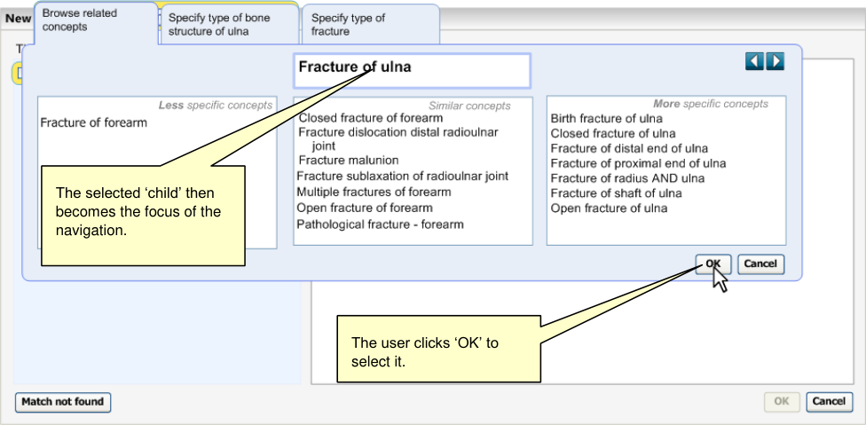

Figure 59: User Clicks ‘OK’ to Confirm This is the Term They Want

Figure 60: Selecting the Refined Item Closes the Expanded List and Confirms the Match

Double-clicking on a concept in the list selects that concept, and it will be displayed in the ‘selected’
text area (and will be the ‘in-focus’). Clicking ‘OK’ will close the dialog and, if there are no
outstanding mandatory fields, will confirm the selected (refined) concept and close the encoding
dialog.

_**2.5.1.1**_ _**Guidance**_

The system:

 Must allow the user to navigate parts of the SNOMED-CT hierarchy

 Should only allow the user to access the SNOMED-CT hierarchy at the point of having

selected a concept

Page 69

Copyright ©2013 Health and Social Care Information Centre

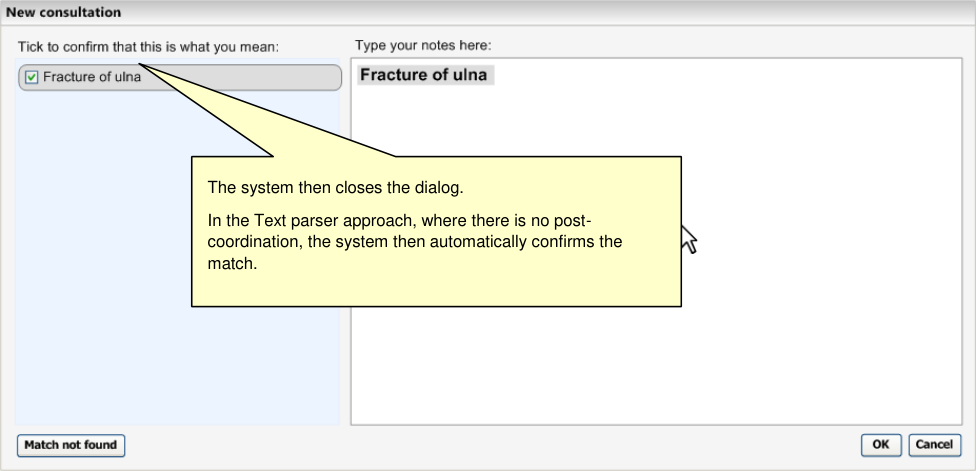
HSCIC Controlled Document

 Must distinguish between the parents, siblings and children of a selected concept

 Should feature a ‘three list box’ solution: a list for the parents, a list for the siblings of all
parents and a list of the children

 Must feature appropriate labels for each list box

 Should order each list alphabetically

 Must display the currently selected concept clearly

 Should allow the user to double-click to select a concept and close the dialog

 Could allow the user to build up a post-coordinated expression by refining the selected
concept’s attribute values from hierarchical lists

 If the user is browsing a concept that is part of a larger post-coordinated expression, [the

system] must limit the hierarchy according to SNOMED-CT-allowed concept relationships.
In other words, the system will only show a subset of the hierarchy, namely those concepts
that can post-coordinate with the base concept

_**2.5.1.2**_ _**Benefits and Rationale**_

This navigation is a necessary feature in a small number of cases. We do not predict that it will be
used much in everyday noting, but its presence may be useful in those cases where the user
cannot find what they want using the normal matching process.

In testing, although users were unsure about the attribute refinement areas (which have been
replaced by tabs in the current design), they did correctly guess that it might enable them to refine
part of the concept.

Most users also felt that it is preferable to hide the navigation dialog unless it is specifically
requested, as is the case in the current design. They felt that making this dialog visible too soon is
overwhelming. As one user commented, ‘initially it needs to be simple’. Also, presenting the users
with the navigation dialog without the user’s request, leads to users incorrectly thinking that they
_**must**_ refine the concept.

In tests, the users disliked the traditional ‘tree’ design, but instead preferred the ‘three list boxes’
approach. Regarding the ‘three list boxes approach’, most preferred to see them stacked vertically
(or rather, diagonally). However, due to design constraints, this is not possible, but we are confident
that the current ‘three list box’ design will be understood, particularly if each list box is well labelled.

Please note that the latest version of this guidance has not undergone rigorous user testing.
Therefore, further usability testing is expected, which may result in potential updates. In particular,
it would be useful to test whether users understand the display of ‘step’ siblings; that is, showing all
the children of all the parents of a concept.

We would also suggest that further design development should be conducted into a design that
provides a ‘search’ facility for refining attribute values (see section 3).

_**2.5.1.3**_ _**Confidence Level**_

_**Low**_

 Must allow the user to navigate parts of the SNOMED-CT hierarchy

 Should only allow the user to access the SNOMED-CT hierarchy at the point of having

selected a concept

 Must distinguish between the parents, siblings and children of a selected concept

 Should feature a ‘three list box’ solution: a list for the parents, a list for the siblings of all
parents and a list of the children

Page 70

Copyright ©2013 Health and Social Care Information Centre

HSCIC Controlled Document

 Must feature appropriate labels for each list box

 Must display the currently selected concept clearly

 Should order each list alphabetically

 Should allow the user to double-click to select a concept and close the dialog

 Could allow the user to build up a post-coordinated expression by refining the selected
concept’s attribute values from hierarchical lists

 If the user is browsing a concept that is part of a larger post-coordinated expression, [the

system] must limit the hierarchy according to SNOMED-CT-allowed concept relationships.
In other words, the system will only show a subset of the hierarchy, namely those concepts
that can post-coordinate with the base concept

Although some navigation designs have been tested with clinicians, further usability work would be
required in order to raise the confidence level in this guidance.

Page 71

Copyright ©2013 Health and Social Care Information Centre

HSCIC Controlled Document

### 3 NEXT STEPS

In this section, we briefly outline some areas of further design work that have been identified by the
CUI team as logical next steps in the development of the guidance. Please note that this list is not
exhaustive, but instead covers specific issues that were identified during the development of
Release 4 design guidance.

 Test the ‘similar matches’ warning messages

Presenting the user with a message to warn them that similarly-worded matches have been
found, in order to encourage users to click on the match and view its alternatives, has not
been tested. An alternative solution is to force the user to view these alternative matches by
automatically opening the full list when the user moves the mouse over the relevant
confirmation checkbox. The efficacy and efficiency of either solution cannot be properly
compared until both solutions have been tested with a sufficiently interactive prototype. For
example, we need to find out whether users do actually notice the message and click
further. Equally, we would like to find out whether the alternative ‘hover-over’ solution is
considered too obtrusive and overwhelming by users.

 Consider a mechanism that allows users to search by word endings as well as by prefixes

Although prefix matching has an intuitive appeal, there may be situations where a clinician
knows what word ending they want, but is unsure of the beginning of the word. In these
cases, they would be better served by a mechanism that allows users to search by word
endings. For example, the clinician may know that they are searching for an ‘…ectomy’, but
not know the precise wording of the beginning of the word. However, we need to better
define these situations prior to developing any solutions.

 Review, and possibly develop, the concept of the ‘exclusion list’

The notion of excluding very commonly occurring words, such as prepositions, has been
shown to work, but only to a certain extent. In some situations this practice can result in
legitimate matches not being found. Any further work in this area must be done in
conjunction with the research into matching algorithms.

 Further disambiguation may be required for recording ‘Pharmaceutical/Biological Products’

The recording of, and possible post-coordination of, concepts from within the category,
‘Pharmaceutical/Biological Products’ requires an additional layer of disambiguation that is
specific to this category. For example, if the clinician has typed in the word ‘Salbutamol’,
they must indicate whether they wish to:

 Prescribe this medication

 Indicate that they have administered this medication

 Record a history of administration of this medication

 Record that the patient has a supply of this medication, for example, at home

Not only will these contexts influence the meaning of the recorded concept and the way in
which it could be post-coordinated, but in the case of prescription, the system may need to
force the clinician to prescribe via an external prescription mechanism.

 User testing of possible expressions that could arise from post-coordinating concepts with

axis modifiers

The issue of how to display modified concepts in close-to-user forms deserves further user
testing.

 User testing of displaying ‘step’ siblings

Page 72

Copyright ©2013 Health and Social Care Information Centre

HSCIC Controlled Document

Displaying ‘step’ siblings, that is, the hierarchical children of multiple parents of a concept is
a relatively unknown practice and could result in a number of very different concepts being
presented in a single list. Further research should be conducted to assess whether users
understand them being presented in a single list.

 Develop a ‘search’ facility for attribute refinement

The notion of refining specific defining concepts was not fully understood by users in recent
testing, and an alternative solution could involve a generic ‘search for attributes’ feature.
This would require further design mechanisms to be developed and tested.

 Investigate the current use of and scope for guidance regarding keyboard shortcuts

The designs behind the guidance have been created so that they do not preclude a
keyboard-only interaction. However, we have not specified any keyboard shortcuts within
the guidance. The problem is that existing and planned clinical applications may employ
keyboard shortcuts for a variety of uses. In order to avoid conflicts, we would need to gain
an understanding of this usage and investigate the extent to which guidance can be
provided regarding such keyboard-only shortcuts.

Page 73

Copyright ©2013 Health and Social Care Information Centre

HSCIC Controlled Document

### 4 DOCUMENT INFORMATION

#### **4.1 Terms and Abbreviations**

CUI Common User Interface

FSN Fully Specified Name

NHS National Health Service

NHS CFH NHS Connecting for Health

SCT Systematized Nomenclature of Medicine – Clinical Terms

SNOMED-CT Systematized Nomenclature of Medicine – Clinical Terms

TLC Top Level Concept

Table 42: Terms and Abbreviations

#### **4.2 Definitions**

NHS Entity Within this document, defined as a single NHS organisation or group that is operated within a single
technical infrastructure environment by a defined group of IT administrators.

The Authority The organisation implementing the NHS National Programme for IT (currently NHS Connecting for
Health).

Current best practice Current best practice is used rather than best practice, as over time best practice guidance may
change or be revised due to changes to products, changes in technology, or simply the additional
field deployment experience that comes over time.

Context Model A model that specifies relationships relating to semantic context that has been defined outside of
the SNOMED-CT Concept model.

Table 43: Definitions

#### **4.3 Nomenclature**

_**Cross References**_

Cross references to other sections in the current document comprise a section number. Cross
references may also be to figures and tables, where the caption number only might be shown.

References to other Project documents are shown in _italics_ . Footnotes with additional details may
also be used.

Page 74

Copyright ©2013 Health and Social Care Information Centre

HSCIC Controlled Document

#### **4.4 References**

**R1.** NHS CUI Design Guide Workstream - Table of Contents 2.0.0.0 30-Oct-2006

**R2.** NHS CUI Design Guide Workstream - Design Guide Entry - Terminology - Post
Coordination

**R3.** NHS CUI Design Guide Workstream - Design Guide Entry - Terminology Display Standards for Coding Information

**R4.** NHS CUI Design Guide Workstream - Design Guide Entry - Terminology Elaboration

**R5.** NHS National Programme for Information Technology’s ‘SNOMED CT Postcoordination rules Guidance’

**R6.** NHS Common User Interface Programme, Release 4 Terminology Jan 2007,
User Feedback

**R7.** NHS Common User Interface Programme, Release 4 Terminology, Nov 2006,
User Feedback

**R8.** NHS CUI Design Guide Workstream, Terminology Demonstrator and
Wireframe User Feedback

**R9.** NHS CUI Design Guide Workstream - Clinical Noting User Interface Vision and
Scope

2.0.0.0 27-Mar-2007

2.0.0.0 27-Mar-2007

2.0.0.0 27-Mar-2007

1.0 13-Jan-2005

n/a 29-Jan-2007

n/a 13-Dec-2006

n/a

2.0.0.0 20-Feb-2007

**R10.** NHS CUI Design Guide Workstream – Abbreviations and Acronyms 1.0.0.0 14-Jun-2006

**R11.** NHS Design Guide and Toolkit Workstream – Abbreviations and Acronyms in
Free Text Input

**R12.** SNOMED Clinical Terms ® Guide – Abstract logical models and
Representational forms

Table 45: References

1.0.0.0 01-Jun-2006

Version 5 Jan-2006

Page 75

Copyright ©2013 Health and Social Care Information Centre

HSCIC Controlled Document

### APPENDIX A LIST OF HIGH LEVEL REQUIREMENTS

**Note:**

Requirements shown in greyed-out text have been withdrawn.

#### **PART I General**

**A1** **General**

A1.1 The system will support encoding solely from keyboard-driven interaction.

A1.2 The system will not prevent effective and efficient encoding with other entry devices, such as voice recognition or touch
pad.

A1.3 The system will facilitate the collection of valid, unambiguous clinical statements (these will be SNOMED codes with
additional context as necessary), potentially covering all parts of the care process.

A1.4 The system will respond to the changing coding requirements of differing clinical noting contexts, and will communicate
these to the user.

A1.5 The system will be able to deal with the following noting contexts:

 Free-form noting without any, or very little context

 Free-form noting within a workflow context

 Free-form noting under headings

 Heavily contextualized free-form noting within a structured form

A1.6 The system will be able to deal with form creation (that is, finding relevant SNOMED-CT codes during form authoring,
such as by a GP.

#### **PART II  Searching**

**B1** **Setting Context**

B1.1 The system will provide users with a means of limiting a search to contextually relevant portions of SNOMED-CT.

B1.2 The system will clearly communicate which contextually relevant portions of SNOMED-CT the users are searching.

B1.3 The system will be capable of automatically setting context. This automatic contextual filtering could be in response to
previously entered text/encoded terms.

B1.4 The system will assist users’ searches by allowing them to expand, contract, or sort a set of search results according to
meaningful contextual categories (such as 'symptoms' or 'procedures').

B2.1 The system will be able to handle free-form text entry, according to context.

B2.2 The system will attempt to structure (that is, ‘parse’) as much of the free text that it can, but will give users the option of
saving it as free-form text, according to context.

B2.3 The system will offer users an efficient way of triggering an encoding interaction.

B2.4 Users will be able to modify the search term quickly and easily.

B2.5 The system will be capable of fuzzy matching text (such as in the event of a spelling error) and of offering a ‘best guess’
plus a means of viewing alternative matches.

Page 76

Copyright ©2013 Health and Social Care Information Centre

HSCIC Controlled Document

**B2** **Enter and Select Text**

B2.6 The system will not commit to the record any encoded terms that have not been confirmed by the user.

B2.7 The system will provide ‘best guess’ concepts for words within the free text.

B2.8 The system will be able to handle a limited range of structured shorthand that exists outside of SNOMED-CT.

B2.9 The system will be able to offer predictive matching of SNOMED-CT concepts (including both single words and phrases).

B2.10 The system will give users flexibility as to when they encode text prior to committing it to the record.

**B3** **Shortcuts and Abbreviations**

B3.1 Users will be able to search on abbreviations found within SNOMED-CT.

B3.2 Users will be able to define and search their own abbreviations ('shortcodes').

B3.3 The system will display, in the encoded notes, both the abbreviation entered by users, and its expansion (either Preferred
term or synonym).

B3.4 Users will be able to enter codes by means of keyboard shortcuts.

B3.5 Users will be able to search on single or multiple word prefixes, independent of order.

B3.6 Users will be able to define their own keyboard shortcuts.

B3.7 When displaying results, matches from all types of abbreviations will be shown and will be clearly distinguished from
each other.

**B4** **Listing Matching Concepts**

B4.1 The system will display categories, (for example, TLCs), to which the term belongs, where appropriate, to ensure that
users can distinguish between similar sounding results.

B4.2 The system will ensure that users can easily navigate through long lists of results.

B4.3 The system will allow users to move from a search result item to related terms (for example, a more specific term).

B4.4 The system will ensure that users see a clear definition of, and the Preferred term for, a concept, before committing it to
the record.

B4.5 The system will provide access to the full text of a SNOMED-CT term (up to 255 characters).

B4.6 The system will be able to communicate multiple kinds of search results ranking within the same list, where there is
exceptional ranking.

B4.7 The system will allow users to reorder search lists according to a method of ranking that is distinct from the default order.

B4.8 The system will discriminate between the results returned, according to relevance (if known).

B4.9 The system will communicate if truncation has occurred.

B5.1 The system will allow users to specify that a term is only nearly correct.

B5.2 The system will allow users to record that they have given up trying to encode a concept.

B5.3 The system will be able to log approximate codes so that NHS CFH can determine whether changes are required to the
terminology or the terminology user interface.

B5.4 The system will allow users to qualify a ‘nearly correct’ term with additional text.

B5.5 The system will allow users to record ‘unencodable’ concepts as free text.

B5.6 In the event of a poor match (indicated by the user), the system will allow and encourage users to navigate back up the
hierarchy to a more general term.

Page 77

Copyright ©2013 Health and Social Care Information Centre

HSCIC Controlled Document

#### **PART III Elaboration and Post Coordination**

**C1** **General**

C1.1 Users will be able to refine/select certain key attributes of a concept.

These attributes may be based on SNOMED-CT relationships such as qualifiers, surgical procedures, and (body) finding
sites. They may include axis modifiers (based on the Context Model).

C1.2 The system will allow users to negate disorder concepts.

We will outline the issues involved with the system handling user attempts to negate concepts that are not disorders. We
should illustrate the issues of negation of findings. This will probably lead to SCT authoring requirements, or more
metadata.

C1.3 If users have included negation text in a search, the system should be able to identify pre-coordinated negated concepts
in search results and present them differently (or omit them).

C1.4 Users will be able to refine the original concept without necessarily losing the refined attributes.

For example, they start off with ‘muscle injury’, by searching on the text ‘musc’:

 muscle injury

 Finding site = muscle structure

 skeletal muscle structure

 skeletal muscle part

 tendon structure

 hamstring tendon

At this point, the user may wish to refine the original concept ‘muscle injury’ to ‘muscle strain’, but will not want to lose the
refined, ‘hamstring tendon’.

C1.5 The system will need to handle (‘error’) situations where the refinement causes mismatches with other attribute values.

C1.6 Users will be able to simultaneously refine multiple attribute concepts of a given concept.

For example, in addition to specifying the body site, the user may also want to specify severity (such as ‘moderate’).

C1.7 The system will present all the appropriate attribute concepts for a given concept. This may need to be a subset, or even
a superset, of all the attribute relations currently 'allowable' in the published Terminology data.

C1.8 Where appropriate and feasible, the system will provide graphical navigation of body sites.

C1.9 The system will allow users to specify a small set of elaboration values that are not defined by SNOMED-CT nor Context
model relationships. These will include time values and values defined by additional Informational models (such as blood
pressure readings and temperature readings).

C1.10 Where users can enter numerical values, appropriate units must be presented to users by the system. Where there is a
choice of units, the system must present the choice clearly and explicitly to communicate the user’s choice.

C1.11 The system will encourage users to refine mandatory attributes and values (where appropriate).

This may arise when the user selects a certain attribute which must be refined in order to make sense (for example, the
user could not select the attribute ‘severities’ without refining it further).

C1.12 The system will allow users to hierarchically refine an attribute through multiple levels.

C1.13 The system will allow users to hierarchically refine multiple attributes simultaneously.

C1.14 Users will have the flexibility to be able to undo and/or re-refine any elaboration, whether it be proposed by the system or
selected by the user.

C1.15 Users will be able to apply elaboration to more than one concept if the relationship is allowed.

C1.16 Users will be able to move elaboration from one concept to another if the relationship is allowed.

C1.17 The system will attempt to render concepts and their elaboration in a meaningful way.

C1.18 The system will clearly communicate attribute relationships, both in a structured view and in a ‘narrative’ view.

Page 78

Copyright ©2013 Health and Social Care Information Centre

HSCIC Controlled Document

**C2** **System Identifies Elaboration Within Text**

C2.1 The system will identify potential attribute relationships between concept matches in free text, and will promote them in
the search process.

C2.2 The scope for any system-led search for attribute relationship matches or other elaboration in a passage of text will be
limited (by the system) and limitable (by the user).

For example, the system may only be required to search within a marquee, which in turn is automatically defined by full
stops.

Further limitations may be required to reduce performance demands, such as only allowing up to four potential codes
within a grouping marquee.

C2.3 The system will identify potential elaboration within the typed notes and will offer relevant elaboration options during the
encoding process.

For example, by presenting and pre-populating elaboration fields.

C2.4 The system will capture ‘free’ text that has been associated with an encodable term, but has not been encoded.

**C3** **Users Associate Free Text with Encodable Items**

C3.1 The system will provide users with a mechanism for associating free-text notes that they have entered with an encodable
concept.

C3.2 The system will allow users to adjust what text is converted into structured elaboration for a concept.

C3.3 The system will provide users with a mechanism to enter additional text notes with an encodable concept.

C3.4 The system will warn users if text notes contain qualifications (such as negation) that significantly affect the meaning of a
concept, or conflict with other specified or assumed qualifiers.

**C4** **Composites**

C4.1 The system will prompt users to select related concepts that form meaningful composites.

#### **PART IV Display of Coded Information**

**D1** **General**

D1.1 The display will be flexible, so that it can fit in a number of different spaces and sizes.

D1.2 The system will have the capability to display both SNOMED-CT-encoded and unencoded notes.

D1.3 The system will clearly distinguish between free text that, upon committing to the record, will be SNOMED-CT encoded
and that which will not.

D1.4 The system will allow users to edit SNOMED-CT-encoded terms (that is, re-encode them) before committing them to the
record.

D1.5 The system will display polished ‘prose’ as well as the structured view for post-coordinated concept.

D1.6 The system will ensure that the display of ‘prose’ and ‘encoded’ notes are consistent with each other.

D1.7 The system will be able account for a number of application real estate sizes and shapes.

D1.8 The system will allow users to view their original text entry, that is, the last edit of the text they entered prior to encoding.

**D2** **Communicating What Can be Encoded**

D2.1 The system will communicate which text is potentially SNOMED-CT encodable.

Page 79

Copyright ©2013 Health and Social Care Information Centre

HSCIC Controlled Document

**D2** **Communicating What Can be Encoded**

D2.2 The system will distinguish between text that can be encoded as a standalone SNOMED-CT concept, and text that can
be encoded only as elaboration to a concept.

For example, we would want the system to indicate that qualifier text, such as ‘mild’ can be encoded in a structure
manner, but only as elaboration to another concept (for example, ‘gastroenteritis’); we would not want the user to be able
to encode ‘mild’ by itself.

D2.3 The system will clearly distinguish between potentially encodable text and encoded text. Potentially encodable text will be
committed to the record as free text if users do not encode it.

This becomes even more critical if the system displays ‘best matches’ (that is, predictive code matching). Users must be
fully aware of what will be saved as a code and what will be saved as free text, and we have a requirement that all
instances of encoded concepts must be confirmed by the user prior to committing them to the record; if not, the
‘concepts’ will remain as unstructured text.

D2.4 The system will display the top match for each potentially encodable concept, in addition to the text typed in by the user.

**D3** **Showing Structure**

D3.1 The system will communicate the relationship between codes and their elaboration on display.

D3.2 The system will communicate potential relationships between concepts.

D3.3 The system will distinguish between potential relationships and user-confirmed relationships between concepts.

Page 80

Copyright ©2013 Health and Social Care Information Centre

HSCIC Controlled Document

### REVISION AND SIGNOFF SHEET

#### **Change Record**

20-Jun-2006 Giles Colborne 0.0.0.1 Initial draft for review/discussion

26-Jul-2006 Laura Dromundo

Ben Luff

0.0.0.2 Updates to incorporate final Deliverable information

28-Jul-2006 Paul Robinson 0.0.0.3 Updates and reformatting

11-Aug-2006 Giles Colborne 0.0.0.4 Updates following customer review

11-Aug-06 Laura Dromundo

Ben Luff

0.0.0.5 Final Updates

15-Aug-2006 Vivienne Jones 0.0.0.6 Copyedit

15-Aug-2006 Ben Luff 0.0.0.7 Copyedit changes incorporated

16-Aug-2006 Vivienne Jones 0.0.0.8 Changes checked. Two outstanding comments found.

16-Aug-2006 Paul Robinson 0.0.0.9 Comments addressed.

16-Aug-2006 Vivienne Jones 0.1.0.0 Document cleansed. Informal reviews carried out with the Authority, hence,
Working Baseline not used previously. Moved to Baseline Candidate.

02-Mar-2007 Ben Luff 0.1.0.1 Updated document

08-Mar-2007 Clare Coney 0.1.0.2 Copyedit

09-Mar-2007 Ben Luff 0.1.0.3 Accepted changes post Copyedit

09-Mar-2007 Vivienne Jones 0.1.0.4 Copyedit of updates only

09-Mar-2007 Vivienne Jones 0.1.1.0 Document Cleansed.

21-Mar-2007 Ben Luff 0.1.1.1 Final Updates

22-Mar-2007 L Boardman-Rule 0.1.1.2 Copyedit in progress

22-Mar-2007 L Boardman-Rule 0.1.1.3 Updates with author

23-Mar-2007 L Boardman-Rule
Vivienne Jones

0.2.0.0 Document cleansed

27-Mar-2007 Vivienne Jones 1.0.0.0 Baseline following Acceptance

25-Jul-2007 Vivienne Jones 1.0.0.0 Preface added so the document can be released to the Distribution
Mechanism. The date fields were changed to static text as the original
acceptance date needs to be maintained from a cross-reference point of
view.

Document Status has the following meaning:

 **Drafts 0.0.0.X**  - Draft document reviewed by the Microsoft CUI project team and the

Authority designate for the appropriate Workstream. The document is liable to change.

 **Working Baseline 0.0.X.0**  - The document has reached the end of the review phase and

may only have minor changes. The document will be submitted to the Authority CUI project
team for wider review by stakeholders, ensuring buy-in and to assist in communication.

 **Baseline Candidate 0.X.0.0**  - The document has reached the end of the review phase and

it is ready to be frozen on formal agreement between the Authority and the Company

Page 81

Copyright ©2013 Health and Social Care Information Centre

HSCIC Controlled Document

 **Baseline X.0.0.0**  - The document has been formally agreed between the Authority and the

Company

Note that minor updates or corrections to a document may lead to multiple versions at a particular
status.

#### **Audience**

The audience for this document includes:

 **Authority CUI Manager / Project Sponsor** . Overall Project Manager and sponsor for the

NHS CUI Project within the Authority.

 **Authority NHS CUI Design Guide Workstream Project Manager.** Responsible for

ongoing management and administration of the Workstream.

 **The Authority Project Team** . This document defines the approach to be taken during this

assessment and therefore must be agreed by the Authority.

 **Microsoft NHS CUI Team** . This document defines the approach to be taken during this

assessment, including a redefinition of the NHS CUI Design Guide Workstream strategy.

#### **Open Issues Summary**

None

#### **Reviewers**

Paul Robinson Program Manager 0.0.0.4 11-Aug-2006

Ben Luff User Experience Consultant 0.0.0.4 11-Aug-2006

Laura Dromundo Program Manager 0.0.0.4 11-Aug-2006

Giles Colborne User Experience Consultant 0.0.0.1 20-Jun-2006

Igor Laketic Program Manager 0.1.0.4 08-Mar-2007

Paul Robinson Lead Program Manager 0.1.0.4 08-Mar-2007

#### **Distribution**

Roarke Batten NHS CFH Programme Manager

Kit Lewis NHS CFH Design Guide Workstream Lead

Peter Johnson NHS CFH Clinical Architect

Kate Verrier Jones NHS CFH Clinical Advisor

Ed Cheetham NHS CFH Clinical Advisor

Mike Carey NHS CFH Toolkit Workstream Lead

Tim Chearman NHS CFH Design Guide Workstream Lead

Page 82

Copyright ©2013 Health and Social Care Information Centre

HSCIC Controlled Document

#### **Document Properties**

Document Title NHS CUI Design Guide Workstream UI Interaction Model for Terminology Searching

Author NHS CUI Programme Team

Restrictions **RESTRICTED – COMMERCIAL; MICROSOFT COMMERCIAL;** Access restricted to: NHS
CUI Project Team, Microsoft NHS Account Team

Creation Date 20 June 2006

Last Updated 23 June 2015

**Copyright:**

You may re-use this information (excluding logos) free of charge in any format or medium, under
the terms of the Open Government Licence. To view this licence, visit
[nationalarchives.gov.uk/doc/open-government-licence or email psi@nationalarchives.gsi.gov.uk.](https://web.nhs.net/OWA/redir.aspx?C=dMnSAL43xUOp9X_SOcscV9mT5A0smdBIh1_vxjdSDVCERI33v7-idn6tNFCNwJYUR1PxIW-Hd-E.&URL=http%3a%2f%2fnationalarchives.gov.uk%2fdoc%2fopen-government-licence)

Page 83

Copyright ©2013 Health and Social Care Information Centre

