_Prepared for_
**NHS Connecting for Health**
**Version 2.0.0.0 Baseline**
_Prepared by_
**NHS CUI Programme Team**
**[Cuistakeholder.mailbox@hscic.gov.uk](mailto:Cuistakeholder.mailbox@hscic.gov.uk)**
_Contributors_
**Ben Luff**
### PREFACE

<!-- TOC -->
<!-- TOC generated by Markdown All in One style -->

- [PREFACE](#preface)
- [1 INTRODUCTION](#1-introduction)
  - [1.1 Overview](#11-overview)
  - [1.2 Area of Focus](#12-area-of-focus)
  - [1.3 References to Table of Contents Document](#13-references-to-table-of-contents-document)
- [2 RECOMMENDATION AND GUIDANCE](#2-recommendation-and-guidance)
  - [2.1 Post-Coordination](#21-post-coordination)
    - [2.1.1 Matching Post-Coordinated Expressions within Text](#211-matching-post-coordinated-expressions-within-text)
  - [ Attempt to post coordinate matches in](#attempt-to-post-coordinate-matches-in)
    - [2.1.2 Negation and Uncertainty](#212-negation-and-uncertainty)
  - [ Allow users to browse the hierarchy for](#allow-users-to-browse-the-hierarchy-for)
    - [2.1.3 Adjusting Post-Coordination Matching](#213-adjusting-post-coordination-matching)
  - [ Feature a slight delay in updating the](#feature-a-slight-delay-in-updating-the)
  - [ Obscure the input text with the encoding](#obscure-the-input-text-with-the-encoding)
    - [2.1.4 Selecting and Confirming Post-Coordinated Expressions](#214-selecting-and-confirming-post-coordinated-expressions)
  - [ Render the confirmed attributes in the](#render-the-confirmed-attributes-in-the)
  - [ Allow users to confirm an attribute](#allow-users-to-confirm-an-attribute)
- [3 NEXT STEPS](#3-next-steps)
- [4 DOCUMENT INFORMATION](#4-document-information)
  - [4.1 Terms and Abbreviations](#41-terms-and-abbreviations)
  - [4.2 Definitions](#42-definitions)
  - [4.3 Nomenclature](#43-nomenclature)
  - [4.4 References](#44-references)
- [APPENDIX A LIST OF HIGH LEVEL REQUIREMENTS](#appendix-a-list-of-high-level-requirements)
  - [PART I General](#part-i-general)
  - [PART II  Searching](#part-ii-searching)
  - [PART III Elaboration and Post Coordination](#part-iii-elaboration-and-post-coordination)
  - [PART IV Display of Coded Information](#part-iv-display-of-coded-information)
- [APPENDIX B EXAMPLE OF A PARSING PROCESS](#appendix-b-example-of-a-parsing-process)
- [REVISION AND SIGNOFF SHEET](#revision-and-signoff-sheet)
  - [Change Record](#change-record)
  - [Audience](#audience)
  - [Open Issues Summary](#open-issues-summary)
  - [Reviewers](#reviewers)
  - [Distribution](#distribution)
  - [Document Properties](#document-properties)

<!-- /TOC -->

Source PDF: [termpostcoord.pdf](../../pdfs/clinical-noting-and-terminology/termpostcoord.pdf)

**Documents replaced by this document**
Design Guide Entry - Terminology - Post Coordination 1.0.0.0
**Documents to be read in conjunction with this document**
Design Guide Entry - Terminology - Display Standards for Coded Information 2.0.0.0
Design Guide Entry - Terminology - Elaboration 2.0.0.0
Design Guide Entry - Terminology - Matching 1.0.0.0
Terminology Release 4 Summary _(Presentation)_ 1.0.0.0
In using this document, please be aware that the effect of recent Patient Safety Assessments (PSAs) executed for the NHS CUI programme have not yet been addressed in the guidance in this document. Any such effect the PSAs may have on the content and guidance contained herein, will be included in a subsequent version of this document.
**This document was prepared for NHS Connecting for Health which ceased to exist on 31 March**
**2013. It may contain references to organisations, projects and other initiatives which also no longer**
**exist. If you have any questions relating to any such references, or to any other aspect of the**
**[content, please contact cuistakeholder.mailbox@hscic.gov.uk](mailto:cuistakeholder.mailbox@hscic.gov.uk)**
### 1 INTRODUCTION

This document provides guidance and recommendations with rationale for aspects of Terminology user interfaces related to Terminology Post Coordination.

This document should be read in conjunction with the following Design Guide documentation:

- _NHS CUI Design Guide Workstream -_ _Design Guide Entry - Terminology - Matching_ **{R2}**

- _NHS CUI Design Guide Workstream -_ _Design Guide Entry - Terminology - Display_

_Standards for Coded Information_ **{R3}**

- _NHS CUI Design Guide Workstream -_ _Design Guide Entry - Terminology - Elaboration_ **{R4}**

NHS Connecting for Health (CFH) has chosen SNOMED-CT (Systematised Nomenclature of Medicine-Clinical Terms) as the terminology for encoding clinical statements.

#### 1.1 Overview

This document is for anyone whose role includes screen design, implementation or assessment of a NHS clinical application, and who is involved in creating or evaluating terminology user interfaces.

Terminology user interfaces operate within a note-taking environment. These environments fall into three categories (as illustrated in Figure 1, and described below), each of which require different guidance:

- **Forms**

 The user makes notes by selecting boxes and choosing options, not by entering text

 An encoding interface is not needed–the clinical codes should be embedded within the form itself

- **Single concept matching**

 The user makes notes by typing the note for a single concept (such as 'asthma'), and the system returns SNOMED-CT matches. The user can then choose an appropriate match, refine the concept, then elaborate it with a combination of free text, qualifying SNOMED-CT attributes (such as 'severe'), and numerical values.

 Encoding interfaces require components to match and elaborate SNOMED-CT concepts.

- **Text parser matching**

 The user makes notes by writing unconstrained text, while the system matches words and phrases against the SNOMED-CT database, or a constrained subset of the database, and displays the matches. The user then has the option to do one of the following:

 Confirm that they want to encode these SNOMED-CT expressions

 Browse alternative matches

 Refine a selected match

 Leave the note un-encoded, in which case it will be saved as unstructured text rather than as a SNOMED-CT expression

 Encoding interfaces require components to identify and match SNOMED-CT concepts, as well as build post-coordinated SNOMED-CT expressions, based upon sanctioned attribute relationships, from within the text. The interface must also be able to identify

Page 1

Copyright ©2013 Health and Social Care Information Centre

HSCIC Controlled Document

terms and relationships from additional informational models in order to support accurate and comprehensive clinical noting.

Figure 1 (below) illustrates all three categories: forms (left), single concept matching (centre) and text parser matching (right).

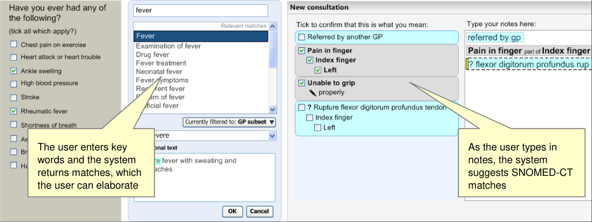

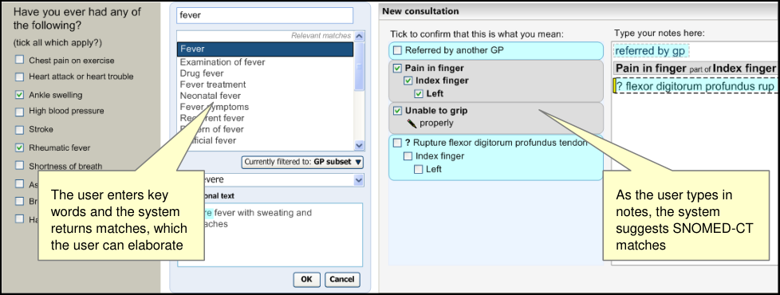

Figure 1: Styles of Encoding

A possible fourth hybrid category could be defined where forms may include areas where single concept matching or text parser is used.

Medical language is full of abbreviations and jargon, some of which have more than one meaning. By encoding clinical statements, they can be shared unambiguously. This should improve patient safety by reducing confusion, or errors, due to ambiguity in clinical notes.

Encoding also opens up important opportunities, such as:

- Filtering context specific views of medical records in order to improve searching

- Unambiguously sharing clinical statements between clinicians in different disciplines or

institutions

- Using decision support mechanisms, based on codes within clinical statements, to enhance

patient safety

- Auditing clinical activity by using codes to locate and report on specific types of information

within patient records

- Researching clinical practice or outcomes in the NHS by extracting codes from electronic

patient records

#### 1.2 Area of Focus

This document describes Terminology post-coordination. Post-coordination is defined in the document: NHS National Programme for Information Technology’s ‘SNOMED CT Post-coordination rules Guidance’ **{R5}** as:

_“A representation of a concept using a combination of two or more codes. SNOMED CT_
_allows many concepts to be represented in a post-coordinated form using a collection of_
_several SNOMED Concept IDs”_

In addition to the hierarchical ‘IS A’ relationships that define SNOMED-CT concepts, there are also non-hierarchical ‘attribute’ relationships. These link concepts by factors such as causality, associated changes and locations on the body. It is a strength of the terminology that users can build new phrases from component concepts that do not pre-exist as a single concept.

Page 2

Copyright ©2013 Health and Social Care Information Centre

HSCIC Controlled Document

Many concepts are partly defined by a combination of attribute concepts and relationships. In this way there may be equivalence between the ‘pre-coordinated’ concept (that is, the representation of a potentially complex concept using a single code) and a post-coordinated expression.

For example, the concept ‘Total gastrectomy’ (ConceptID 26452005) is equivalent to the following expression:

‘Gastrectomy (ConceptID 53442002) | Procedure site (ConceptID 363704007) | = ‘Entire stomach’ (ConceptID 181246003)

Another example is ‘Fracture of radius’ (ConceptID 12676007), which is equivalent to:

‘Fracture (ConceptID 125605004) | Finding site (ConceptID 363698007) | Bone structure of radius (ConceptID 62413002)’

In these examples, the concepts ‘Procedure site’ and ‘Finding site’ are the attribute names, and the ‘Entire stomach’ and ‘Bone structure of radius’ are attribute values.

Whether it is more desirable for the clinician to construct post-coordinated expressions or to select pre-coordinated concepts is a question that we have not addressed in this documentation. A related question is whether, if the user has constructed a post-coordinated expression that has an equivalent pre-coordinated, the system should display the pre-coordinated label.

Indeed, rules have been specified within SNOMED-CT which, when applied to pre- or postcoordinated concept expression, generate a standard comparable representation, known as the ‘canonical form’. This makes it possible to calculate equivalence between different pre- and postcoordinated expressions. It also allows ‘subsumption’ to be computed regardless of whether in pre or post coordinated form.

Subsumption describes where a concept is subsumed by another concept, if it represents a subtype of that concept. Concept A is a subtype of concept B if A always implies B, but B does not always imply A. For example ‘Severe asthma’ is a subtype of ‘Asthma’.

The implication of subsumption for a clinical noting interface is that a subtype of a post-coordinated concept may take on the defining characteristics of its equivalent pre-coordinated concept.

There are three main forms of post-coordination:

- **Subtype qualification**

This is where the concept is elaborated (that is, linked with an attribute concept) in such a way as to result in a post-coordinated expression which is equivalent to a subtype of the unelaborated concept.

For example, the concept ‘Asthma’ can be qualified with the attribute concept ‘Severe’ to produce an expression that is the subtype of the concept ‘Asthma’.

Ideally, where expressions have been post-coordinated and saved in this way, at the point of retrieving the stored codes the application should be able to compute equivalence, and therefore, subsumption. However, this process is out of the scope of the current Design Guide documentation.

There are four types of subtype qualification:

 Qualification

 Refinement of a defining attribute

 Addition of unsanctioned qualifiers

 Addition of ‘nested’ qualifiers

- **Axis modification (including negation)**

Page 3

Copyright ©2013 Health and Social Care Information Centre

HSCIC Controlled Document

This is where the elaboration fundamentally changes the meaning of the concept, rather than simply qualifies or refines it. Such an elaboration of the concept results in it no longer being subsumed as a subtype of a parent concept.

For example, if we elaborated the concept ‘Asthma’ to associate it with a patient’s mother, the meaning of the resulting expression would have a fundamentally different meaning, and therefore different clinical implications, from the noting of the concept of ‘Asthma’ by itself. If the clinician were running a query of all instances of asthma in their practice, they would not expect the system to return instances where asthma is linked to a family member.

Additionally, concepts that are post-coordinated with a negation concept (such as ‘Known absent’), have their meanings fundamentally shifted.

A modified concept is not a subtype of the unmodified instance of the concept. For example, ‘Asthma present’ is not the subtype of the context-neutral concept, ‘Asthma’. Instead, it is a type of ‘Explicit context’. Indeed, negated concepts subsume in the opposite direction to their positive counterparts. Whereas positive expressions are subsumed by more general instances, negated expressions are subsumed by more specific negative expressions.

It is for this reason that modified concepts should be treated differently to concepts that have been refined through subtype qualification.

- **Concept combination and linkage**

Concepts can be combined by way of a number of relationships, such as causal or temporal relationships. For example, one may post-coordinate the concept ‘Laparoscopic procedure’ with the concept ‘Cholecystectomy’, which is the canonical equivalent of the concept ‘Laparoscopic cholecystectomy’.

Concepts can also be linked together, for example, to indicate causality. In this way, the concept ‘Anaemia’ can be linked by the attribute ‘Due to’ to the concept ‘Ascorbic acid deficiency’. The resulting post-coordination is equivalent to the concept ‘Anaemia due to ascorbic acid deficiency’. It is worth noting here that, in this example, the concept ‘Anemia’ may be the ‘base’ concept, with ‘Due to’ the attribute name, and ‘Ascorbic acid deficiency’ the attribute value.

A terminology user interface must also allow the user to add non-SNOMED-CT concepts, such as time values and units, or measurement readings, to SNOMED-CT expressions. For example, the user should be able to add the value ’38.9’ and the unit ‘Degrees centigrade’ to the concept of ‘Body temperature’. This is discussed in more detail in the document _NHS CUI Design Guide_ _Workstream -_ _Design Guide Entry - Terminology - Elaboration_ **{R4}** . For the current document, we assume that the appropriate relationships are provided by an external information model (such as one based on HL7 v3 or EN13606) and that the coordination of these values and units with SNOMED-CT concepts will be handled in the same way as with other attribute values.

The area of post-coordination is highlighted in the User Interaction Model, in Figure 2 (below).

Page 4

Copyright ©2013 Health and Social Care Information Centre

HSCIC Controlled Document

Figure 2: User Interaction Model

#### 1.3 References to Table of Contents Document

The document _Table of Contents_ **{R1}** outlines every specific area of focus to be covered by the Design Guide. Each area of focus has an accompanying Design Guide Entry document. Table 1 indicates the areas of focus covered by this Design Guide Entry.

Page 5

Copyright ©2013 Health and Social Care Information Centre

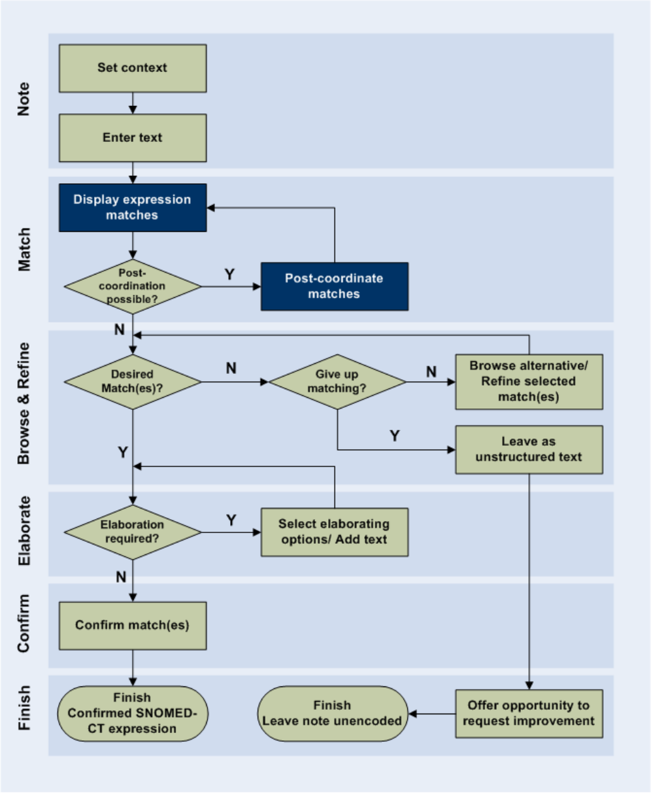
HSCIC Controlled Document

4.4 Terminology - UI Interaction Models for Post Coordination

Table 1: References to Table of Contents Documents

Copyright ©2013 Health and Social Care Information Centre

Page 6

HSCIC Controlled Document

### 2 RECOMMENDATION AND GUIDANCE

#### 2.1 Post-Coordination

‘Post-coordination’ refers to the process of linking together SNOMED-CT concepts according to sanctioned relationships, in order to express new, more complex, meanings. Within this process, the SNOMED-CT concepts can be viewed as building blocks, with the mortar that holds these blocks together being the sanctioned attribute relationships. It is coordination ‘on-the-fly’, because these post-coordinated concepts are not automatically added to the SNOMED-CT database. However, those responsible for publishing the database may want to add some of the common post-coordinated expressions to the database, making them pre-coordinated expressions.

Additionally, we envisage that there may be situations where the process of post-coordination is ‘anticipatory’, where developers, and not SNOMED-CT publishers, post-coordinate frequently-used expressions and make them available as single expressions in the system. However, this anticipatory post-coordination is not covered in the current documentation. Instead, it focuses upon the more flexible and user-driven ‘on-the-fly’ post-coordination.

The NHS CFH requirements for this design guidance are outlined in Table 2 (below).

C1.1 Users will be able to refine/select certain key attributes of a concept. These attributes may be based on SNOMED-CT relationships such as qualifiers, surgical procedures, and (body) finding sites. They may include axis modifiers (based on the Context Model).

C1.2 The system will allow users to negate **disorder** concepts.

C1.3 If users have included negation text in a search, the system should be able to identify pre-coordinated negated concepts in search results and present them differently (or omit them).

C1.4 Users will be able to refine the base concept without necessarily losing the refined attributes.

C1.5 The system will need to handle ‘error’ situations where the refinement causes mismatches with other attribute values.

C1.6 Users will be able to simultaneously refine multiple attribute concepts of a given concept.

C1.9 The system will allow users to specify a small set of elaboration values that are not defined by SNOMED-CT nor Context Model relationships. These will include time values and values defined by additional Informational models (such as blood pressure readings and temperature readings).

C1.10 Where users can enter numerical values, appropriate units must be presented to users by the system. Where there is a choice of units, the system must present the choice clearly and explicitly communicate the user’s choice.

C1.11 The system will encourage users to refine mandatory attributes and values (where appropriate).

C1.14 Users will have the flexibility to be able to undo and/or re-refine any elaboration, whether it be proposed by the system or selected by the user.

C1.15 Users will be able to apply elaboration to more than one concept if the relationship is allowed.

C1.16 Users will be able to move elaboration from one concept to another if the relationship is allowed.

C1.17 The system will attempt to render concepts and their elaboration in a meaningful way.

C1.18 The system will clearly communicate attribute relationships, both in a structured view and in a ‘narrative’ view

C2.1 The system will identify potential attribute relationships between concept matches in free text and will promote them in the search process.

Page 7

Copyright ©2013 Health and Social Care Information Centre

HSCIC Controlled Document

C2.2 The scope for any system-led search for attribute relationship matches or other elaboration in a passage of text will be limited (by the system) and limitable (by the user).

For example, the system may only be required to search within a marquee, which in turn is automatically defined by full stops.

Further limitations may be required to reduce performance demands, such as only allowing up to four potential codes within a grouping marquee.

C2.3 The system will identify potential elaboration within the typed notes and will offer relevant elaboration options during the encoding process.

Table 2: NHS CFH Requirements for Post-Coordination

##### 2.1.1 Matching Post-Coordinated Expressions within Text

In this section we will outline how an interface could match concepts within text typed in by the clinician and build post-coordinated expressions from these concepts, according to allowed SNOMED-CT relationships.

All attribute relationships should be conformant with the published Concept Model, and ideally further constrained appropriate (that is, sensible) sanctioning. Conforming to sanctioned relationships should optimise system behaviour, and should allow ‘equivalence’ to be calculated, once the question of equivalence has been addressed by NHS CFH in the future.

The main challenge faced by the system will be matching concept values and relationships from a rich and varied noting text. There are numerous ways to articulate a clinical expression in text noting. Clinicians will have different styles of noting that may invert the order of words from the way in which they appear in the relevant SNOMED-CT concept label. They may also leave out words or add additional words that are not included in the concept label.

In the current design guidance, we have not taken it upon ourselves to outline designs for an intelligent ‘natural language processing’. Natural language processing is a topic which has occupied many researchers to date, and for which there are currently no clear solutions. As such, this topic is out of scope for the current Design Guide entry. However, if a solution were to become available, we would recommend considering it within the design of a post-coordination matching process.

However, in the absence of natural language processing, we have developed a process based almost entirely on what is available within SNOMED-CT.

Matching post-coordinated expressions against phrases typed in by the clinician requires a number of different calculations in order for the system to discover the best fit. The guiding approach behind the user interface is that the system will make its best guess at the expression and present it to the user. In response, the user has a number of controls at their disposal to adjust the match before confirming it. An iterative process of matching will be necessary, given the many ways in which clinicians could express a single encounter and the potential word matches against SNOMED-CT concepts.

This process could (and should) be augmented by a process of system learning in order to ensure that the matching improves over time. Defining a more ‘intelligent’ machine learning process is not within the scope of the current guidance, but could be an important avenue of investigation for the NHS CFH project in the future.

The guidance is based upon a notional clinical record structure in which each note may comprise:

- A pre-coordinated SNOMED-CT expression

- A post-coordinated SNOMED-CT expression

- A free text (non-SNOMED-CT) expression

Page 8

Copyright ©2013 Health and Social Care Information Centre

HSCIC Controlled Document

- A configuration of one or more expressions defined by a non-SNOMED-CT information

model

Each of the SNOMED-CT expressions may have non-SNOMED-CT numerical or time values and free text associated with them. Additionally each of the SNOMED-CT expressions must have a set of appropriate axis modifier values associated with them, although typically these will be ‘soft’ default values (which do not necessarily need to be explicitly communicated) rather than userselected values.

Each single output unit will comprise no more than a single expression. Also, the matching process must establish a ‘base’ concept. This can be any of the following top-level category types:

- Clinical findings

- Procedures

- Observable entities

- Situation with explicit context

It is worth noting that, as a base concept, a concept from the category ‘Observable entities’ will only be post-coordinated with numerical values.

Numerical values cannot be recorded as values (rather than free text) if they are not associated with an encoded SNOMED-CT expression.

Also, after consideration, we have excluded the category ‘Pharmaceutical/biological products’ from this list of base concepts. Further work would need to be done to show how concepts from within this category could be disambiguated to determine whether the note refers, for example, to prescription, administration, history of administration, or supply.

_**2.1.1.1**_ _**The Parsing Process**_

In this section we outline the issues and design features to consider when creating a parsing process which matches post-coordinated expressions from the text.

In order to do so, we have worked through a possible parsing scenario. Consider the situation where the user has typed the following text:

“? nontraumatic flexor digitorum profundus rupture to left index finger due to plate fixation on wrist”

The system would identify a number of potential base concepts, including (matched words are shown in bold):

- **Rupture**

- **Nontraumatic rupture**

- **Rupture flexor digitorum profundus** tendon

- **Rupture** wrist **flexor** s

- **Rupture flexor digitorum** superficialis tendon

- On examination – pinhole **left** eye counts **finger** s only

- Obstruction due to foreign body accidentally **left** in operative wound AND/OR body cavity

during a procedure

- [Malocclusion due to](http://127.0.0.1:4224/get.concept?id=109632005) **finger** habits

- Volar **plate** [injury of](http://127.0.0.1:4224/get.concept?id=263125003) **finger** joint

- Advancement of tendon **profundus**

- [Arthrodesis of interphalangeal joint of](http://127.0.0.1:4224/get.concept?id=56331004) **finger** with internal fixation

Page 9

Copyright ©2013 Health and Social Care Information Centre

HSCIC Controlled Document

- **Fixation** [of fracture using](http://127.0.0.1:4224/get.concept?id=239289001) **plate**

- **Fixation**

- Arthroscopy of **wrist** [with internal](http://127.0.0.1:4224/get.concept?id=112752007) **fixation** for fracture

- **Left** ventricular stroke work **index**

Of these, the best matched concept would be ‘Rupture flexor digitorum profundus tendon’, owing to the number of matching words, letters and ordering.

If the system then considers possible attribute concept matches from the remaining text, the base concept, ‘Rupture flexor digitorum profundus tendon’, would again be the best match, with the following additional attribute matches:

- ‘Associated morphology’ attribute | value = ‘Nontraumatic rupture’

- [‘Finding site’ attribute, ‘Part of’ | value = ‘Index finger’](http://127.0.0.1:4224/get.concept?id=1350001)

- ‘Laterality’ nested qualifier attribute | value = ‘Left’

- ‘Contextual qualifier’ attribute = ‘Possible’

This matching solution would leave the remaining text “due to plate fixation on wrist” unmatched. Therefore the system could run another matching process, which could yield the following solution as the top match:

- ‘Fixation of fracture using plate’ | ‘Finding site’ = ‘Wrist bone’

The words ‘due to’ would be dropped from the display, as these should fall within a matching exclusion list (see _NHS CUI Design Guide Workstream - Design Guide Entry - Terminology –_ _Matching_ **{R2}** for details of the matching exclusion list). The resulting matched expression is illustrated in Figure 3 (below).

Figure 3: Post-Coordination Matching

_**2.1.1.2**_ _**Guidance**_

The system:

- Must allow users to define the expression boundaries

- Must be able to match expressions that contain SNOMED-CT concepts that are linked by

attribute relationships outlined in the Concept Model

Page 10

Copyright ©2013 Health and Social Care Information Centre

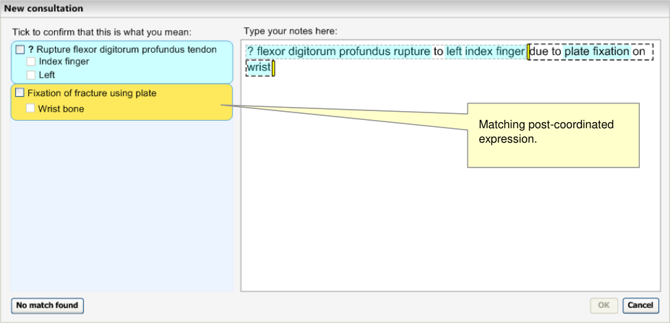
HSCIC Controlled Document

- Should feature a matching process that scores, ranks and selects expressions, which

considers:

 Matching fit of the base concept

 Matching fit of concepts linked to the base concept through sanctioned SNOMED-CT attribute relationships

- Must ensure that there is at least one base concept (that is, a Clinical finding, Procedure,

Observable entity or Situation with explicit context concept) in each expression.

_**2.1.1.3**_ _**How to Use the Design Guide Entry**_

expression boundary (such as a full stop or carriage return) until running the post-coordination matching process.

Table 3: How to Use the Design Guide Entry

_**2.1.1.4**_ _**How Not to Use the Design Guide Entry**_

####  Attempt to post coordinate matches in

different expression windows

Table 4: How Not to Use the Design Guide Entry

_**2.1.1.5**_ _**Benefits and Rationale**_

This process has been chosen for a number of reasons. The main reason for basing the postcoordination upon word matching and phrase matching against SNOMED-CT concepts is in order to avoid the need for intelligent natural language processing.

Additionally, the principle behind this approach is to display a suggestion clearly enough to the user so that the user can see if the suggestion matches their expectation. Then, if it does not, they can easily change the matching.

Displaying the matches stacked down the left-hand pane is a clear indication of the way in which the system is interpreting the user’s notes. This has been confirmed in usability testing: users see these suggested matches and also understand what they mean. Also, the user is given multiple ways to change the matches:

- They can change the specific matches individually, by clicking on them in the left-hand

pane

- They can adjust the marquees

- They can change the text directly

When the user makes changes, the system will automatically update and display the new matching. This will provide an important feedback to the user so that they can quickly arrive at the expression that they want.

Usability testing has shown that users understand this matching process.

Some early ideas of such a parsing process (in terms of an algorithm) are outlined in APPENDIX B. However, this process has not undergone rigorous testing and is included in this document as a starting point for further development, which could include more sophisticated linguistic processing.

Page 11

Copyright ©2013 Health and Social Care Information Centre

HSCIC Controlled Document

_**2.1.1.6**_ _**Confidence Level**_

_**High**_

- Must allow users to define the expression boundaries

- Must be able to match expressions that contain SNOMED-CT concepts that are linked by

attribute relationships outlined in the Concept Model

_**Medium**_

- Must ensure that there is at least one base concept (that is, a Clinical finding, Procedure,

Observable entity or Situation with explicit context concept) in each expression.

_**Low**_

- Should feature a matching process that scores, ranks and selects expressions according to:

 Matching fit of the base concept

 Could calculate fit in terms of ‘efficiency of fit’ and ‘scope of fit’

 Matching fit of concepts linked to the base concept through sanctioned SNOMED-CT attribute relationships

 Proximity/order weighting, that is, how close the input words that match the expression are to one another, and the extent to which they match the order of the words in the SNOMED-CT expression

We have yet to test this matching model in an interactive prototype. We anticipate that there could be some performance penalties associated with the matching of longer sentences. In such situations, there may be a need for a restriction on the size of expression that the user can parse at any one time. Equally, the character-by-character matching may not be viable for this postcoordination model.

##### 2.1.2 Negation and Uncertainty

There are a couple of important instances where the system will need to treat the post-coordination process in a different manner. The first is dealing with the negation of disorder concepts, and the second is dealing with the indication of uncertainty, for example, before a suspected disorder or pathology. These need to be treated differently because:

- They might have a big impact on the meaning of the expression

- The necessary attribute relationships may not currently exist in SNOMED-CT

- The correct concept label in SNOMED-CT may be different to the way that the clinician

articulates it

When clinicians write ‘No’ plus the name of a disorder, what they mean is that the disorder is known to be absent. Therefore, in the absence of any other qualifier values, ‘No’ means ‘Known absent’; this is a SNOMED-CT concept (ConceptID 410516002).

The coordinated matches must be returned in a familiar form so that the user can clearly see that the concept is negated or is qualified with uncertainty. Clinicians will be used to seeing the order ‘No’ then concept, or ‘?’ then concept, for example, ‘No gastroenteritis’.

Therefore, if the user types in the word ‘No’ followed by a space and some text, the system will identify the word ‘no’ and will run a separate simultaneous matching process against the subsequent text, but filtered to disorders only. Meanwhile, it will continue to match the full text in the normal way. The negated disorders will be distinguished by the fact that the word ‘No’ will be rendered in bold style text in order to make the negation stand out. The system will take results for

Page 12

Copyright ©2013 Health and Social Care Information Centre

HSCIC Controlled Document

both matches and order them as normal, that is, according to statistic word matching scores and any filtering that applies.

Likewise, if the user types in the character ‘?’, the system will identify this as a synonym of ‘Known possible’, and will run a matching process against the subsequent text, but filtered to disorders only. Given that no SNOMED-CT concept description label begins with the character ‘?’ the system does not need to run two simultaneous matching processes.

The following figures (Figure 4, Figure 5 and Figure 6) demonstrate the matching of negation and uncertainty.

Figure 4: System Identifying an Expression of Negation

Figure 5: Display of Negated Concepts

Page 13

Copyright ©2013 Health and Social Care Information Centre

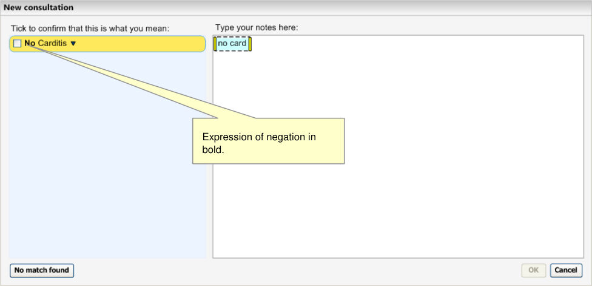

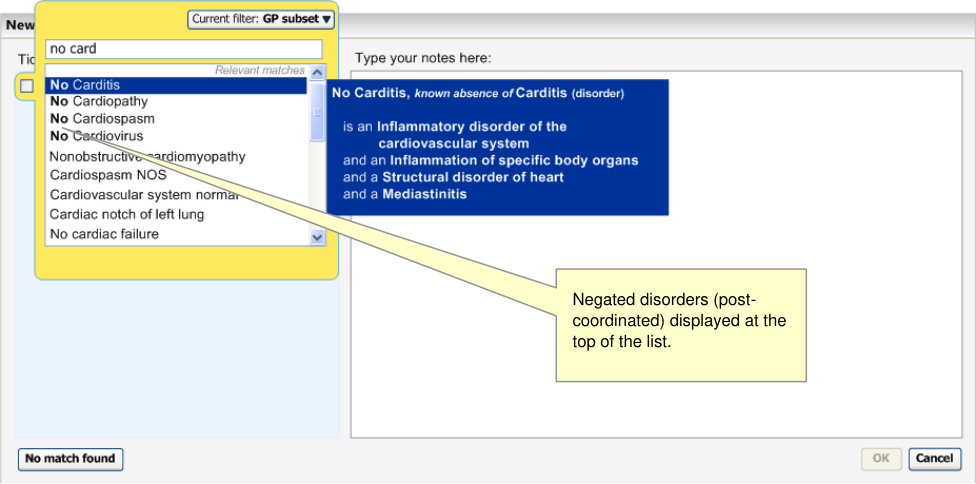
HSCIC Controlled Document

Figure 6: System Displays all Matching Disorders with a '?' Character in Front

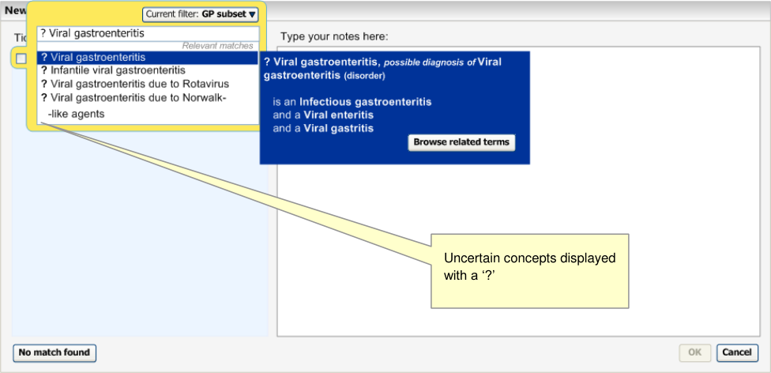

Negation qualifiers and uncertainty qualifiers are displayed in front (that is, immediately left of) the base concept. The negation is rendered in bold.

All other negation will be treated in the same way as any other post-coordination. These concepts include: ‘Not involving’, ‘Does not’, ‘Not seen’, ‘Not done’, ‘Not used’, ‘Not offered’, ‘Not wanted’.

_**2.1.2.1**_ _**Negation Applying to Multiple Disorders**_

Ideally, the system would be able to perform some intelligent language processing in order to determine whether the negation should apply to multiple concepts, or just the one. For example, it may identify the word ‘or’ and possibly draw upon statistical data to determine the likelihood that the negation should apply to both concepts (see Figure 7).

Figure 7: Example of Hypothetical Intelligent Linguistic Parsing

However, in the absence of such intelligence, the system should apply the negation to a single concept. It should also recognise that there are no user-defined boundaries between the concepts, and it should provide a warning message to the user to remind them to type the word ‘No’, either into the right-hand text input area, or into the progressive matching input field in the expanded

Page 14

Copyright ©2013 Health and Social Care Information Centre

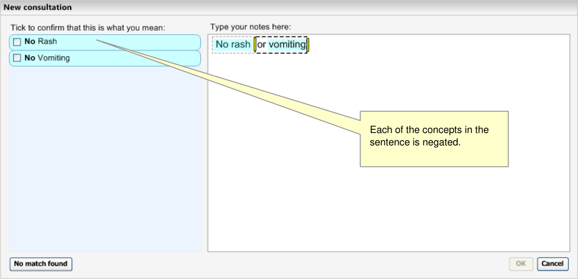
HSCIC Controlled Document

encoding dialog pane (accessed by clicking on the label or the down-arrow icon). See Figure 8 and Figure 9.

Figure 8: System Associates Negation with the Nearest Concept

Figure 9: System Warns that there are Concepts in the Sentence that have not been Negated

The same could apply to the ‘?’ marking, although it is less likely that the clinician would note a single question mark for both concepts; instead they would type a question mark against both concepts.

_**2.1.2.2**_ _**Guidance**_

The system:

- Should support the negation of the form ‘Known absent’ for disorder concepts by:

 Identifying the key word ‘No‘ at the start of an expression (with a space character after the letters) in the user’s typed input

Page 15

Copyright ©2013 Health and Social Care Information Centre

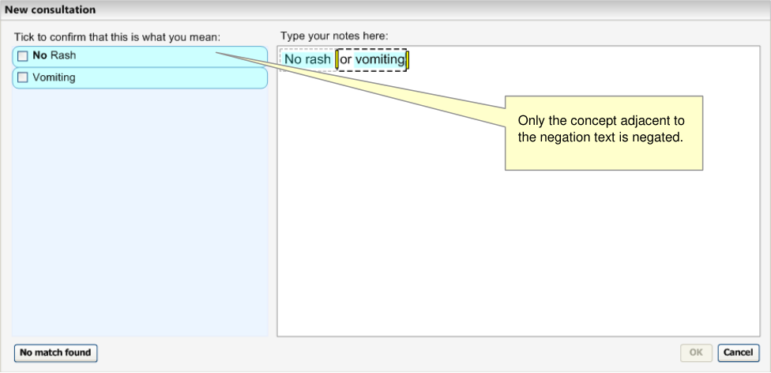

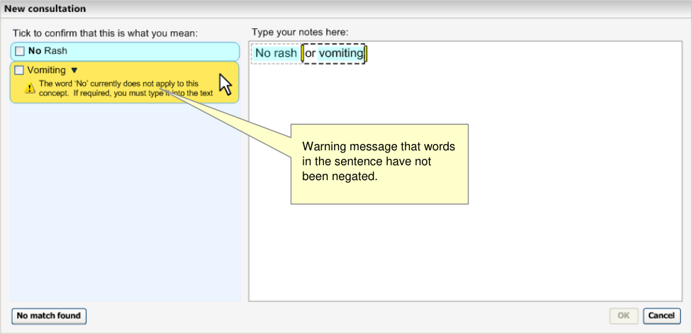
HSCIC Controlled Document

 Running a parallel matching process for disorders against the subsequent text typed in by the user

 Displaying the word ‘No’ in front of the matched disorder concepts

 Merging the returned results from both matching processes, and order them according to statistic word matching

 Post-coordinating the chosen match with the Finding context attribute (ConceptID
408729009) with the qualifier value ‘Known possible’ (ConceptID 410590009)

- Should post-coordinate expressions of uncertainty (‘?’, meaning ‘Known possible’) for

disorder concepts by:

 Identifying the key word ‘?’ at the start of an expression in the user’s typed input

 Running a matching process for disorders against the subsequent text typed in by the user

 Displaying the word ‘?’ in front of the matched disorder concepts

 Post-coordinating the chosen match with the Finding context attribute with the qualifier value ‘Known possible’

- Must only provide this simple method of negation and uncertainty post-coordination for

concepts within the ‘Disorder’ hierarchy (which is a sub-hierarchy of the ‘Clinical Findings’ top level category)

- Must also allow the post-coordination of other negation and possibility axis modifiers in the

same way as other post-coordination

- Should not allow the user to browse for subtypes of a negated concept

- Should allow the user to browse for subtypes or super-types (‘related concepts’) for a

concept qualified with uncertainty

- Should display the Fully Specified Name (FSN) of the negated disorder in the flyout, linked

to the post-coordinated label by the text ‘known absence of’

- Should display the Fully Specified Name (FSN) of the uncertain disorder in the flyout, linked

to the post-coordinated label by the text ‘possibly present’

- Must confirm the whole post-coordinated simple negation expression by selection of a

single check box

- Must confirm the whole post-coordinated queried expression by selection of a single check

box

- Should only apply a negation match or an uncertainty match to one concept at time (in the

absence of any intelligent language processing)

 Should identify whether there are concepts in the same sentence as a negation match that have not been negated, and display a warning message that they have not been negated.

 Should identify if there are concepts in the same sentence as an uncertainty match that have not been associated with it, and display a warning message to that effect.

_**2.1.2.3**_ _**How to Use the Design Guide**_

words in bold, regardless of confirmation status

Page 16

Copyright ©2013 Health and Social Care Information Centre

HSCIC Controlled Document

Table 5: How to Use the Design Guide Entry

_**2.1.2.4**_ _**How Not to Use the Design Guide**_

####  Allow users to browse the hierarchy for

a negated concept

Table 6: How Not to Use the Design Guide Entry

_**2.1.2.5**_ _**Benefits and Rationale**_

The notion of typing the negation into the input field rather than adding negation to a matched positive instance of the concept has been supported by usability with clinicians. In the case of negation, a ‘match then elaborate’ approach is completely alien to the user’s thinking. They see the negation as unbreakable part of the concept, as the positive instance of the concept has completely the opposite meaning.

Also, in their current noting, clinicians tend to write the ‘?’ character immediately before the disorder that they are recording. Again, this has a fundamental affect on the concept that follows it and it would be intuitive to let users input it as part of the same text string as the concept to which it applies.

In user testing, just under half the users stressed the importance of being able to record (or view) the ‘query’ status, which is an expression of uncertainty. They also mentioned the need for being able to indicate ‘planned procedure’ status, which could be treated by the noting interface in the same way as negation and uncertainty.

We have equated the expression of uncertainty, ‘?’ (or ‘query’) as the concept ‘Known possible’, but this concept has three subtypes, ‘Probably present’, ‘Probably not present’ or ‘Suspected’, all of which could be suitable refinements, depending in part upon the type of disorder (or possibly finding) that the clinician is qualifying. Future research and design could be aimed at creating an interface that allows users to further define the level of uncertainty they wish to express.

User testing also showed that users prefer to use the word ‘no’ and to see it fed back to them as ‘No’ followed by the name of the disorder, rather than seeing the name of the disorder followed by the phrase ‘Known absent’.

Some users who were tested also indicated that if one enters ‘no something’, one is unlikely to want to be more specific about it, and that being able to browse to more specific options is not necessary.

Although the guidance prohibits the browsing of subtypes of a negated term, there may be some scope for the browsing of super-types as the clinician may want to browse to a more abstract negated instance of the concept in order to summarise a long list of negated specifics. For example, the clinician may begin by expressing ‘no rash’ and be about to add ‘no skin abrasions’ and ‘no warts’ before deciding that the more general ‘no skin disorder’ would be a more efficient note. However, the possible user interface to handle this should be subject to further research and testing.

In the future we may want to allow users to type other modifiers or qualifiers into the single concept matching input field, such as more sophisticated forms of negation and also possibly expressions of laterality. We may also explore the use of shorthand to represent negation, such as placing a ‘0’ (zero) in front of a word to be negated.

_**2.1.2.6**_ _**Confidence**_

_**High**_

- Should not allow the user to browse for subtypes of a negated concept

Page 17

Copyright ©2013 Health and Social Care Information Centre

HSCIC Controlled Document

_**Medium**_

- Must only provide this simple method of negation and uncertainty post-coordination for

concepts within the ‘Disorder’ hierarchy (which is a sub-hierarchy of the ‘Clinical Findings’ top level category)

- Must confirm the whole post-coordinated simple negation expression by selection of a

single check box

- Must confirm the whole post-coordinated queried expression by selection of a single check

box

_**Low**_

- Should support the negation of the form ‘Known absent’ for disorder concepts by::

 Identifying the key word ‘No‘ at the start of an expression (with a space character after the letters) in the user’s typed input

 Running a parallel matching process for disorders against the subsequent text typed in by the user

 Displaying the word ‘No’ in front of the matched disorder concepts

 Merging the returned results from both matching processes, and order them according to statistic word matching

 Post-coordinating the chosen match with the Finding context attribute (ConceptID 408729009), with the qualifier value ‘Known absent’ (ConceptID 410516002)

- Should post-coordinate expressions of uncertainty (‘?’, meaning ‘Possible diagnosis’) for

disorder concepts by:

 Identifying the key word ‘?’ at the start of an expression in the user’s typed input

 Running a matching process for disorders against the subsequent text typed in by the user

 Displaying the word ‘?’ in front of the matched disorder concepts

 Post-coordinating the chosen match with the Finding context attribute (ConceptID
408729009) with the qualifier value ‘Known possible’ (ConceptID 410590009)

- Must also allow the post-coordination of other negation and possibility axis modifiers in the

same way as other post-coordination

- Should display the Fully Specified Name (FSN) of the negated disorder in the flyout, linked

to the post-coordinated label by the text ‘known absence of’

- Should display the Fully Specified Name (FSN) of the uncertain disorder in the flyout, linked

to the post-coordinated label by the text ‘possibly present’

- Should allow the user to browse for subtypes or super-types (‘related concepts’) for a

concept qualified with uncertainty

- Should only apply a negation match or a query match to one concept at time (in the

absence of any intelligent language processing)

 Should identify whether there are concepts in the same sentence as a negation match that have not been negated, and display a warning message that they have not been negated.

 Should identify if there are concepts in the same sentence as a query match that have not been associated with the query, and display a warning message that they have not been associated with the query.

Page 18

Copyright ©2013 Health and Social Care Information Centre

HSCIC Controlled Document

##### 2.1.3 Adjusting Post-Coordination Matching

An important part of the post-coordination process will be the user’s adjustment of the suggested post-coordination presented by the system. Users need one or more clear mechanisms to quickly adjust the matching, and responsive feedback to indicate the effects of this adjustment.

In the following example, the clinician has typed in some notes, against which the system has matched a number of SNOMED-CT concepts, including a post-coordinated expression comprising three separate concepts: a base-concept (‘Pain in finger’), a finding site attribute with the value ‘Index’ finger’, and the laterality qualifier ‘Left’. Out of the three concepts, the user is only able to select the base-concept as the system does not allow the user to confirm body structures or qualifiers on their own (see Figure 10).

Figure 10: Suggested Top Matches Including a Post-Coordinated Expression Match

As the user moves the mouse over the match area, the area changes colour (yellow to indicate focus) and ‘down arrow’ icons appear next to each of the concept labels to indicate that the user can click on the label to view more controls for that concept (see Figure 11).

Figure 11: User Moves the Mouse over the Suggested Post-Coordination Match

Page 19

Copyright ©2013 Health and Social Care Information Centre

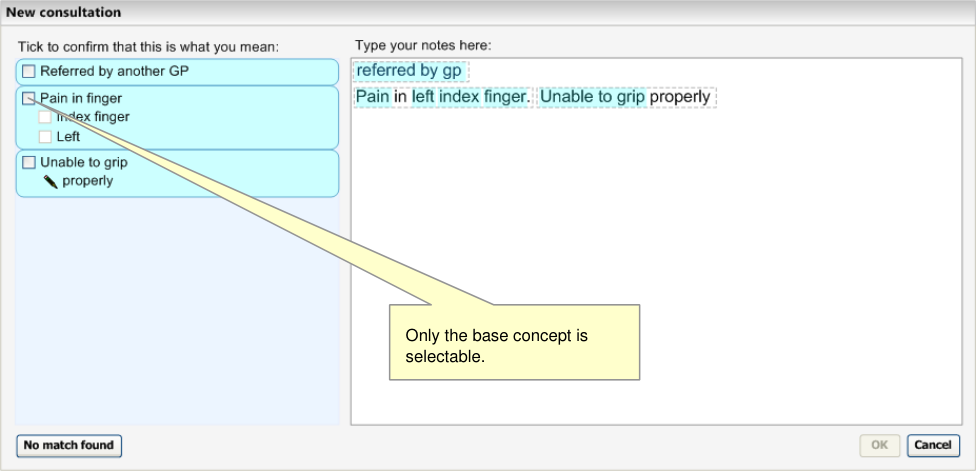

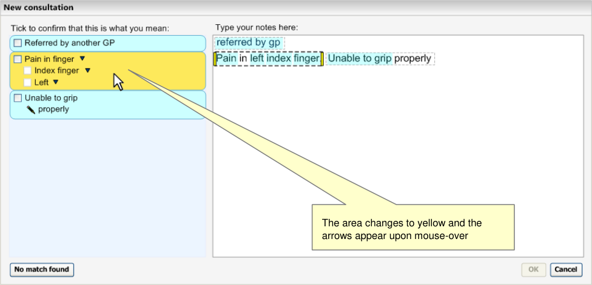
HSCIC Controlled Document

As the user moves the mouse over the arrow (or the rest of the label), the area directly around the label changes to a darker shade (see Figure 12).

Figure 12: User Moves the Mouse Over the Base-Concept Match, ‘Pain in finger’

When the user clicks on the label area, the whole matched area expands to reveal an encoding dialog with the alternative matches listed for the relevant concept, in this case the base-concept ‘Pain in finger’. The other concept labels are pushed further down the area so that they are still visible.

Above the list is an input field that allows the user to alter the input text (which would immediately change the matches below in a ‘progressive matching’ fashion). Also, a flyout appears with the mouse-over. The area will stay expanded, showing the list of matches, until the user clicks outside of the list, the flyout or the input field above the list (see Figure 13).

Figure 13: Expanded View of Matches List

Page 20

Copyright ©2013 Health and Social Care Information Centre

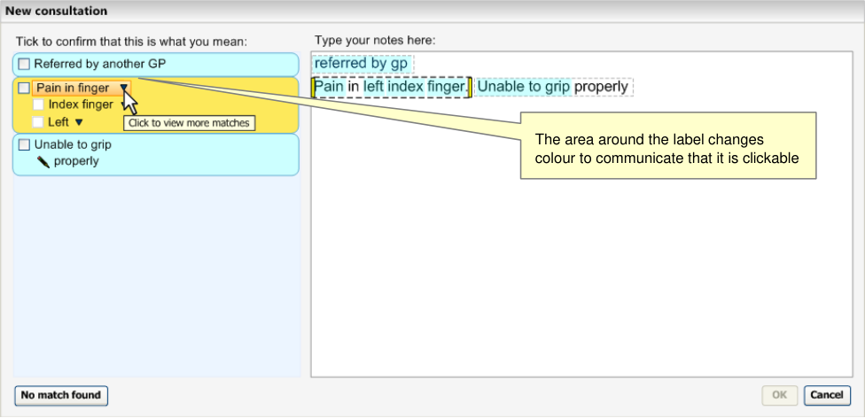

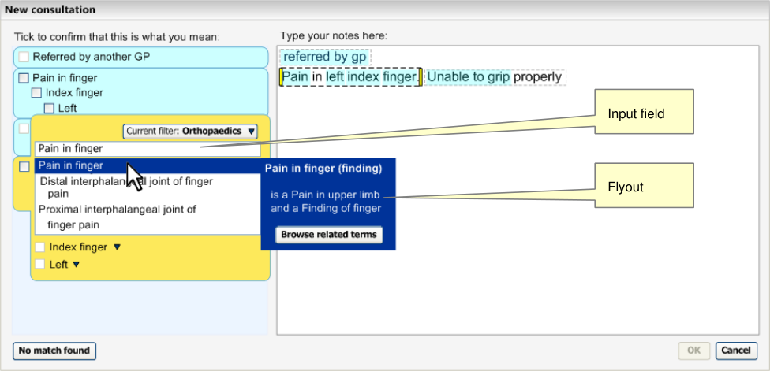
HSCIC Controlled Document

The user clicks away from the list and then moves the mouse over the next concept label (the ‘Finding site’ attribute, with the value of ‘Index finger’) (see Figure 14).

Figure 14: Mouse-Over on the Label ‘Index finger’

Clicking on this label opens up a list of matches against the input word ‘index’, but filtered to those concepts that are sanctioned attributes for the concept ‘Pain in finger’. Again, the input field appears above the list of matches (see Figure 15).

Figure 15: Expanded View of Matches List

Page 21

Copyright ©2013 Health and Social Care Information Centre

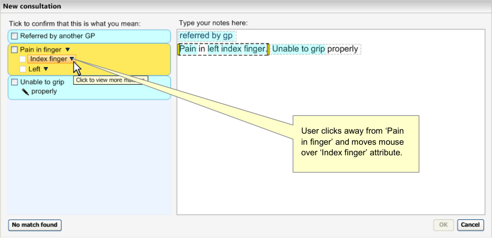

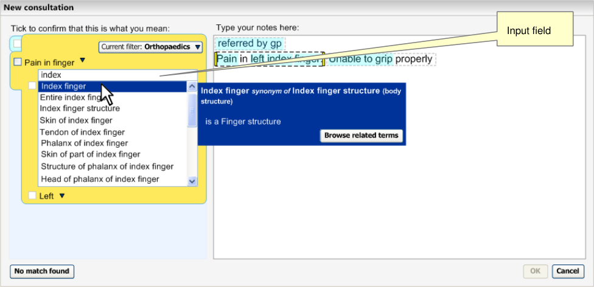
HSCIC Controlled Document

The user moves the mouse down the list, clicking the scroll bar to move further down the list (see Figure 16).

Figure 16: Expanded View of Matches List

The user selects the Finding site attribute value of ‘Distal phalanx of index finger’ by clicking on the match in the list (see Figure 17).

Figure 17: Mouse-Over on the Suggested Matches Area

Page 22

Copyright ©2013 Health and Social Care Information Centre

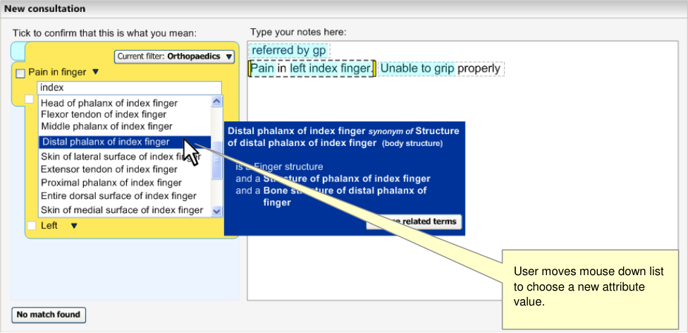

HSCIC Controlled Document

Selecting the check box for ‘Pain in finger’ also selects the attribute concepts (see Figure 18).

Figure 18: Confirmation of a Match

_**2.1.3.1**_ _**Adjusting the Expression Boundaries**_

The user will be able to adjust the expression boundaries in a number of different ways:

- Dragging the marquee handles

- Moving, removing or adding a full-stop or carriage return

- Retyping the text in a different way

When the user moves the mouse over the yellow boundary marker, the ‘arrow’ icons appear that communicate that the user may move the boundaries. Moving the boundaries will trigger another text parse, but with the new user-defined expression windows. This is outlined in the example below, where the user adjusts the boundaries to change the meaning of the notes.

Page 23

Copyright ©2013 Health and Social Care Information Centre

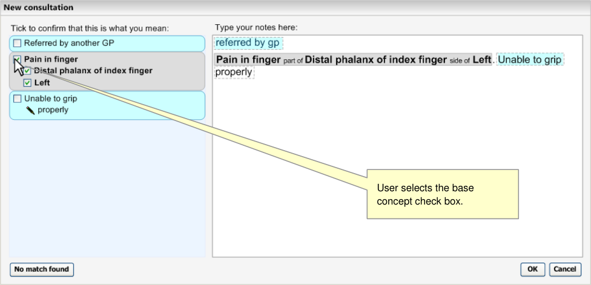
HSCIC Controlled Document

Here the user has typed in ‘Contusion thigh hip laceration knee painful’, without any punctuation (see Figure 19). Although the user means to record ‘contusion of thigh’, ‘hip laceration’ and ‘knee painful, the system has interpreted it as ‘Contusion of thigh and hip’ and ‘Laceration of knee’.

Figure 19: Two Phrases Matched

When the user moves the mouse over the relevant marquee, handles appear to indicate that they may drag the marquee boundary (see Figure 20).

Figure 20: User Dragging Marquee Boundaries

Page 24

Copyright ©2013 Health and Social Care Information Centre

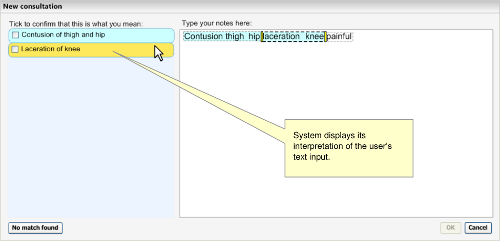

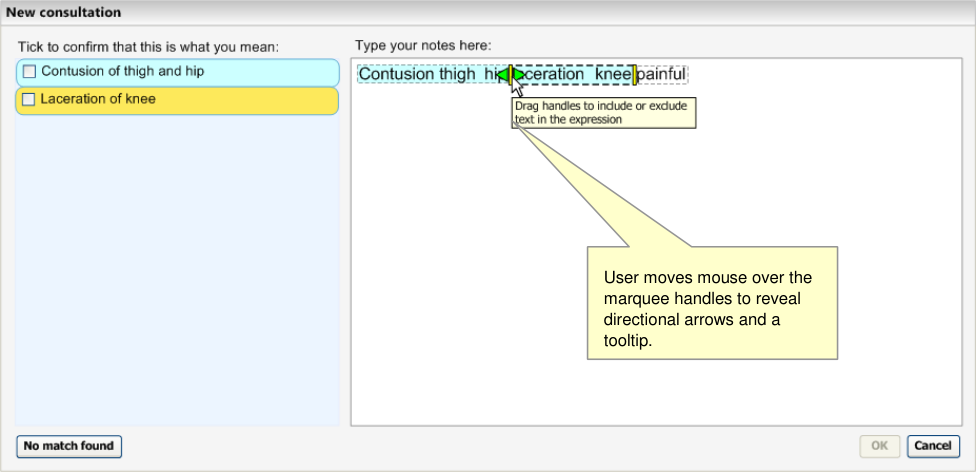
HSCIC Controlled Document

The user moves the left-hand boundary to include the word ‘hip’ with ‘laceration knee’ (see Figure 21). At this point the system runs the matching (and post-coordination) process, but cannot find any match better than ‘Knee laceration’.

Figure 21: User Dragging Marquee Boundaries to Include the Word ‘hip’

The user then drags the right-hand boundary to exclude the word ‘knee’. The subsequent matching process results in the user’s desired matches.

Figure 22: User Dragging Marquee Boundaries to Exclude the Word ‘Knee’

_**2.1.3.2**_ _**Guidance**_

The system:

- Must allow users to view and select alternative matches on a concept-by-concept basis

- Must only offer those attribute matches that are allowed by the attribute relationships

dictated by its base concept

Page 25

Copyright ©2013 Health and Social Care Information Centre

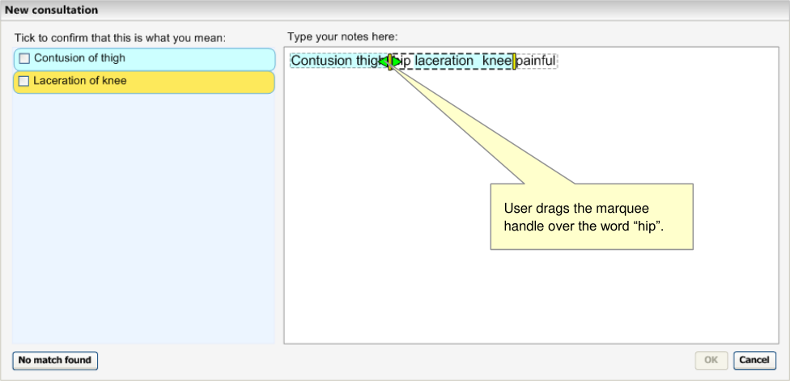

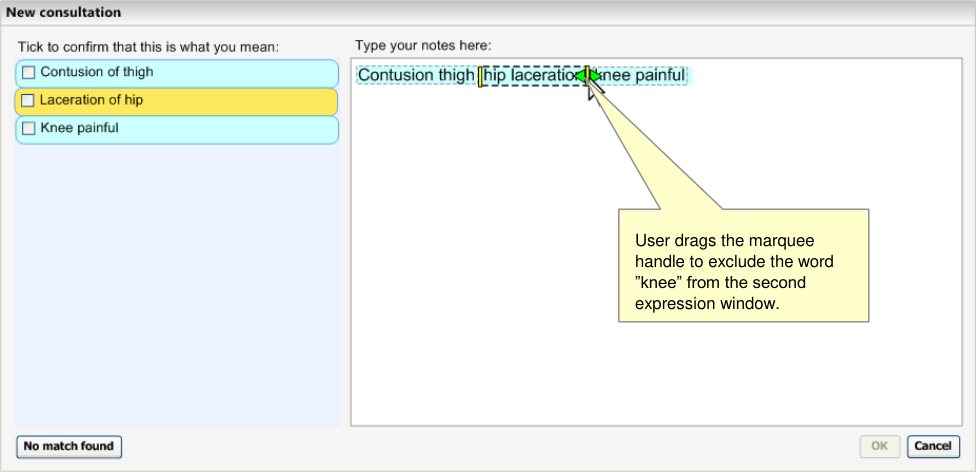
HSCIC Controlled Document

- Should remove an attribute match from the expression if the user changes the base

concept to a match that does not support the attribute relationships

- Must display all the attribute components involved in the expression when displaying

alternative matches for a concept

- Should allow users to adjust expression boundaries

 Should allow users to adjust expression boundaries by dragging the boundaries of the expression marquee

_**2.1.3.3**_ _**How to Use the Design Guide Entry**_

moved a marquee boundary

####  Feature a slight delay in updating the

matching following boundary adjustments

Table 7: How to Use the Design Guide Entry

_**2.1.3.4**_ _**How Not to Use the Design Guide Entry**_

The matching updating should not be instantaneous as there could be a number of unnecessary matching calls to the server while the user is trying to position the boundary where they want it

####  Obscure the input text with the encoding

dialog flyout

Table 8: How Not to Use the Design Guide Entry

_**2.1.3.5**_ _**Benefits and Rationale**_

Instead, the system should feature a mechanism that moves the flyout either above or below the relevant text

The system must allow the user to adjust the matching within post-coordinated expressions. In particular, the user must be able to match each component individually, in order to match precisely what they want to say.

When the user is adjusting a component that is part of an expression, they must also be able to view the other concepts in the expression, so that they: (i) can see if the matches they are considering will break the expression (that is, change the encoded attribute to free text), and (ii) do not try to repeat words within the expression, for example, by typing ‘Left arm’ into the input field when the system has already matched the concept ‘Left’ as part of the fuller expression.

This process of adjusting concept matches has been shown to clinicians in usability testing and has received a positive response.

_**2.1.3.6**_ _**Confidence Level**_

_**High**_

- Must allow users to view and select alternative matches on a concept-by-concept basis

- Should allow users to adjust expression boundaries

 Should allow users to adjust expression boundaries by dragging the boundaries of the expression marquee

Page 26

Copyright ©2013 Health and Social Care Information Centre

HSCIC Controlled Document

_**Medium**_

- Must only offer those attribute matches that are allowed by the attribute relationships

dictated by its base concept

- Should remove an attribute match from the expression if the user changes the base

concept to a match that does not support the attribute relationships

- Must display all the attribute components involved in the expression when displaying

alternative matches for a concept

##### 2.1.4 Selecting and Confirming Post-Coordinated Expressions

Once the user has typed in some notes, for which the system returned matches, the user must confirm that they would like to encode these matched expressions.

In the design shown in Figure 23 (below), the user has moved the mouse onto the suggested match area, which causes the area to turn yellow, and for the ‘in-focus’ boundary to move to the appropriate text in the right-hand text input area.

Figure 23: User Moves Mouse Over Suggested Match

Page 27

Copyright ©2013 Health and Social Care Information Centre

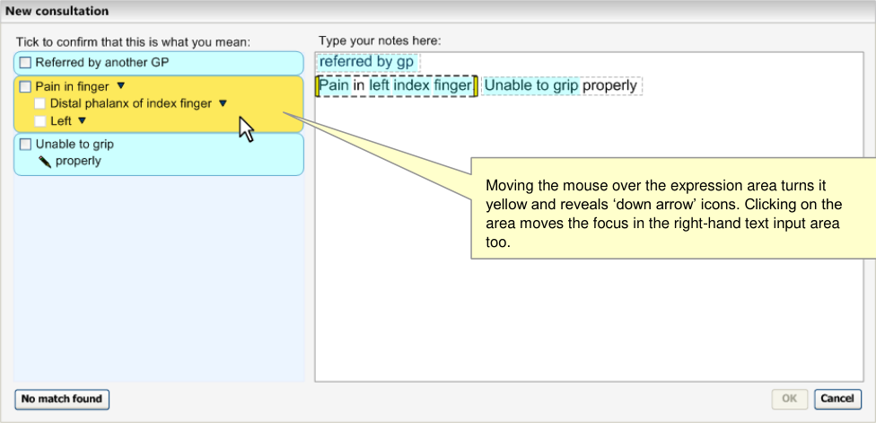
HSCIC Controlled Document

When the user selects the base-concept check box, it selects the whole expression, automatically selecting the check boxes for the other two concepts. The text in the input area then renders to the SNOMED-CT labels as shown in Figure 24 (below), plus additional post-coordination rendering (see _NHS CUI Design Guide Workstream_  - _Design Guide Entry - Terminology - Display Standards_ _for Coded Information_ **{R3}** )

Figure 24: Confirmation of Match

If the user clears the base-concept check box, thus ‘un-confirming’ the selected match, the box turns yellow again (because the mouse is still over the area) and the text in the input area returns to the original notes typed by the user. At this point, the labels in the ‘matches’ area stay as they did before the user confirmed them. In the example in Figure 25 (below), the ‘Find site’ attribute stays as ‘Distal phalanx of index finger’ (rather than returning to the original match suggested by the system)

Figure 25: User Clears the Base-Concept

Page 28

Copyright ©2013 Health and Social Care Information Centre

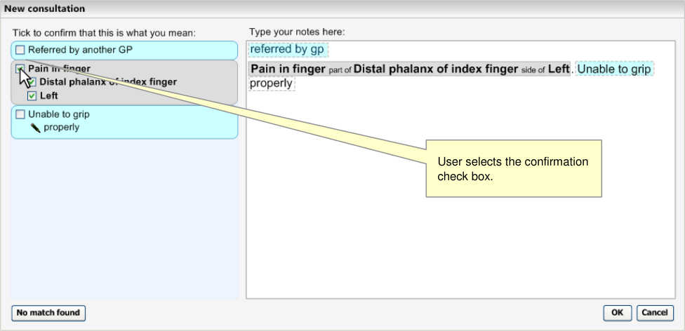

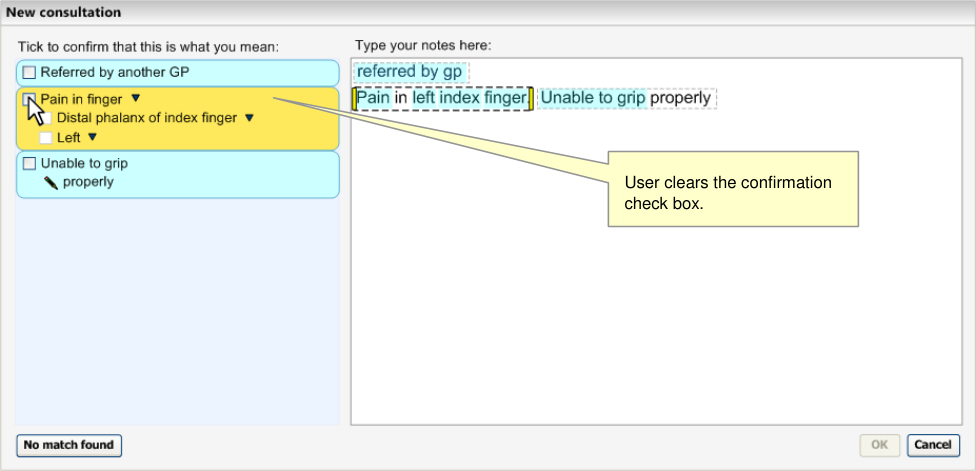
HSCIC Controlled Document

However, if the user clears the check box next to just one of the attribute concepts, the relevant text is removed from the expression in the text input area on the right-hand pane, as shown in Figure 26 (below).

Figure 26: Unconfirming an Attribute Match

Clearing the base-concept check box will return the original text (and the area will return to yellow when the mouse hovers over it, and light blue at all other times), as shown in Figure 27 (below).

Figure 27: Unconfirming a Base Concept Match

_**2.1.4.1**_ _**Guidance**_

The system:

- Must allow the user to confirm concepts individually within a post-coordinated expression

(that is, independently from the others in the expression), but only if the user has confirmed the base-concept

 Should feature a separate check box control for each separate concept in the postcoordinated expression

Page 29

Copyright ©2013 Health and Social Care Information Centre

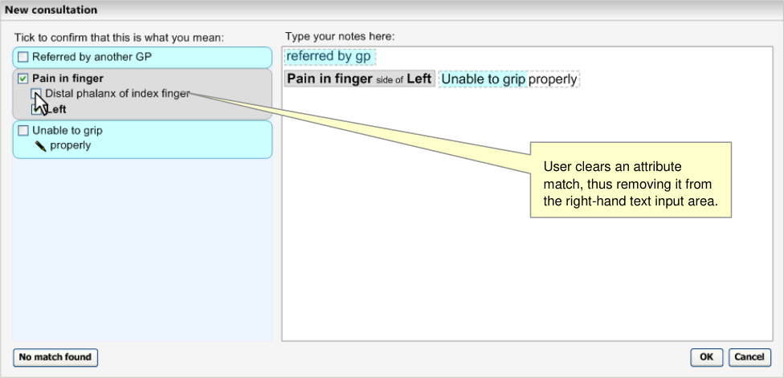

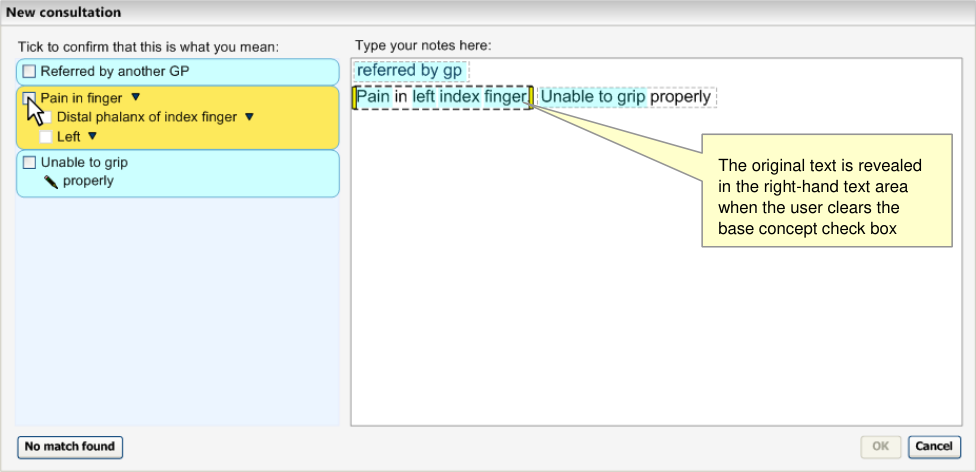
HSCIC Controlled Document

 Must not allow users to confirm any concepts in a post-coordinated expression if they have not confirmed the base-concept

 Could disable all the check boxes for confirming attribute concepts in an expression until the user selects the check box to confirm the base-concept

- Should allow users to un-confirm any of the individual concepts within a post-coordinated

expression (that is, independently from the others in the expression)

- Could automatically select all of the concepts within an expression when the user selects

the base-concept for confirmation, but allow the user to clear the check boxes afterwards

- Must allow the user to return to the original input text by un-confirming the base-concept

- Could allow the user to un-confirm an attribute without un-confirming the base-concept.

This will remove the attribute SNOMED-CT label from the text input field

**Note**

The method of rendering the attribute name labels (that is, translating them into more user-friendly and readable words) would require the creation and management of such data by the NHS CFH. However, this is merely a default position until a more sophisticated solution is developed. This point is also outlined in _Design Guide Entry - Terminology - Display Standards for Coded Information_ **{R3}**

_**2.1.4.2**_ _**How to Use the Design Guide Entry**_

the start of the sentence. The only exception is in the case where it has been associated with axial modifiers such as expressions of negation or possibility.
####  Render the confirmed attributes in the

order in which they appear in the user’s typed text

Table 9: How to Use the Design Guide Entry

_**2.1.4.3**_ _**How Not to Use the Design Guide Entry**_

####  Allow users to confirm an attribute

match without confirming its base concept match

Table 10: How Not to Use the Design Guide Entry

_**2.1.4.4**_ _**Benefits and Rationale**_

This approach to confirming concepts for encoding is quick and efficient, and is understood by users (as shown in usability tests with real clinicians). It follows a ‘checklist’ metaphor, which is universally recognised.

_**2.1.4.5**_ _**Confidence Level**_

_**Medium**_

- Must allow the user to return to the original input text by un-confirming the base-concept

Page 30

Copyright ©2013 Health and Social Care Information Centre

HSCIC Controlled Document

- Should allow users to un-confirm any of the individual concepts within a post-coordinated

expression (that is, independently from the others in the expression)

- Could automatically select all of the concepts within an expression when the user selects

the base-concept for confirmation, but allow the user to clear the check boxes afterwards

_**Low**_

- Must allow the user to confirm concepts individually within a post-coordinated expression

(that is, independently from the others in the expression), but only if the user has confirmed the base-concept

 Should feature a separate check box control for each separate concept in the postcoordinated expression

 Must not allow users to confirm any concepts in a post-coordinated expression if they have not confirmed the base-concept

 Could disable all the check boxes for confirming attribute concepts in an expression until the user selects the check box to confirm the base-concept

- Could allow the user to un-confirm an attribute without un-confirming the base-concept.

This will remove the attribute SNOMED-CT label from the text input field

Page 31

Copyright ©2013 Health and Social Care Information Centre

HSCIC Controlled Document

### 3 NEXT STEPS

In this section, we briefly outline some areas of further design work that have been identified by the CUI team as logical next steps in the development of the guidance. Please note that this list is not exhaustive, but instead covers specific issues that were identified during the development of Release 4 design guidance.

- Further disambiguation may be required for recording ‘Pharmaceutical/Biological Products’

The recording and possible post-coordination of concepts from within the category ‘Pharmaceutical/Biological Products’ requires an additional layer of disambiguation that is specific to this category. For example, if the clinician has typed in the word ‘Salbutamol’, they must indicate whether they wish to:

 Prescribe this medication

 Indicate that they have administered this medication

 Record a history of administration of this medication

 Record that the patient has a supply of this medication, for example, at home

Not only will these contexts influence the meaning of the recorded concept and the way in which it could be post-coordinated, but in the case of prescription, the system may need to force the clinician to prescribe using an external prescription mechanism.

- The solution outlined for dealing with negation and uncertainty should be extended to other

modifiers.

The rendering solution outlined for dealing with negation and uncertainty could and should be expanded to include further expressions concerning negation and axis modification. There are an estimated thirty context variants that could be usefully handled in a ‘single concept’ matching approach. In the current guidance, contextual modifiers, such as ‘No family history of disorder’, can be post-coordinated with an appropriate concept (in the example; a disorder concept). However, this is only possible in the ‘text parser’ matching approach. Also, these modified expressions could benefit from being displayed differently from normal post-coordinated expressions. For example, given that the contextual concept and the concept which it is modifying are equally important, the system may need to display as such. However, unlike the word ‘No’ or the character ‘?’, these concept labels may not easily fit immediately to the left of the modified concept. Further work is required.

- The solution outlined for dealing with negation needs to deal with further complexity and

SNOMED-CT data issues.

Although the current negation solution is appropriate for expressing the absence of a disorder, it is not well suited for expressing the absence of a body part, such as ‘absence of the right hand’, or of certain findings. For example, ‘No right hand’ implies a different type of negation to ‘No gastroenteritis’.

There are also SNOMED-CT publishing issues that could impact the current solution, namely that some disorder concepts are tagged as ‘findings’. In the current solution, the system would not provide negated instances of these concepts. Further work is required to assess the extent of this issue and to formulate a solution.

- Further research needs to be done into how clinicians would naturally type modifiers.

The current guidance regarding expressions of uncertainty is based upon anecdotal evidence that clinicians tend to write ‘?’ in front of notes that they wish to record as uncertain. However, not only has this not been demonstrated with any more rigorous research, it is also based upon handwritten notes, and typed notes could be subject to different clinician behaviours. Further research is therefore needed.

Page 32

Copyright ©2013 Health and Social Care Information Centre

HSCIC Controlled Document

- Further work needs to be done to address overlapping value sets

There are many occasions where the available value sets do not help to distinguish the best representational option. In particular, many surgical methods are overloaded by device or energy based mechanisms.

For example, the words ‘Excision tonsils laser’ could be matched as ‘Excision of tonsils’ (using device) ‘Laser’ or as ‘Laser excision’ (procedure site) ‘Tonsils’. The way in which they are saved may have an impact on future queries.

This is essentially a ‘retrieval’ issue (and also, possibly a SNOMED-CT issue), but the solution may need to involve the input stages too.

- A solution needs to be developed to deal with problems arising from hiding attribute labels.

Attribute name labels are sometimes fairly confusing, such as ‘Associated morphology’, and sometimes redundant, such as in the case of labelling the attribute value ‘Mild’ with the name ‘Severity’. Therefore the current design does not present the attribute name labels to the user prior to confirmation. Following confirmation, a simplified, ‘user-friendly’ label will be displayed in the final text rendering, which substitutes the SNOMED-CT labels with shorter, more general user-friendly labels (although this may be replaced by a more sophisticated solution as and when one is found).

However, there could be occasions where there are two attributes from similar categories, where the use of these attributes is hard to discern without the attribute name label. For example, a procedure could involve an indirect use of one device and the direct use of another device. In this case, it is important to distinguish the two devices in terms of which one is the direct device and which one is the indirect one.

The current system design would not be able to detect situations where the meanings of similar attributes are unclear without the attribute names.

We might consider a solution of agreeing and publishing (in SNOMED-CT) which attributes could be safely hidden (such as ‘finding site’), and only hide these attribute name labels.

Further work is required in this area.

Page 33

Copyright ©2013 Health and Social Care Information Centre

HSCIC Controlled Document

### 4 DOCUMENT INFORMATION

#### 4.1 Terms and Abbreviations

CUI Common User Interface

FSN Fully Specified Name

NHS National Health Service

NHS CFH NHS Connecting for Health

SCT Systematized Nomenclature of Medicine – Clinical Terms

SCTIDs SNOMED Concept IDs

SNOMED-CT Systematised Nomenclature of Medicine-Clinical Terms

TLC Top Level Concept

Table 11: Terms and Abbreviations

#### 4.2 Definitions

Allowable relationships. Allowable attribute relationships between SNOMED-CT concepts that may be unsanctioned by the SNOMED-CT Concept Model. These should be limited to qualifications that the Concept Model specifies for concepts of the same general type, for example, a ‘finding’ attribute used for another ‘finding’ concept (but not for an ‘approach’ concept).

Attributes Concepts that express characteristics of other concepts. SNOMED-CT concepts form relationships to other SNOMED-CT concept s through attributes. SNOMED-CT attributes are found in the ‘Linkage’ concept hierarchy.

The Authority The organisation implementing the NHS National Programme for IT (currently NHS Connecting for Health).

Canonical equivalence When two SNOMED-CT concepts or post-coordinated expressions have the same meaning. Equivalence can occur when a post-coordinated expression has the same meaning as a precoordinated concept; or when two different post-coordinated expressions have the same meaning.

Concept ID The unique identifier (code) for each SNOMED-CT concept.

Context Model A model that specifies relationships relating to semantic context that has been defined outside of the SNOMED-CT Concept Model.

Current best practice Current best practice is used rather than best practice, as over time best practice guidance may change or be revised due to changes to products, changes in technology, or simply the additional field deployment experience that comes over time.

Fully defined concept SNOMED CT concepts are either primitive or fully defined. A concept is primitive when its modelling (attributes and parents) does not fully express its meaning.

Fully defined concepts can be differentiated from their parent and sibling concepts by virtue of their relationships. Primitive concepts do not have the unique relationships needed to distinguish them from their parent or sibling concepts.

Fully Specified Name A description that names a concept in a manner intended to be unambiguous.

Page 34

Copyright ©2013 Health and Social Care Information Centre

HSCIC Controlled Document

Hierarchy An ordered organisation of concepts. General concepts are at the top of the hierarchy; at each level down the hierarchy, concepts become increasingly specialised. SNOMED CT concepts are arranged into top-level hierarchies. Each of these hierarchies subdivides into smaller subhierarchies. Concepts are related by IS-A relationships to their more general parent concepts directly above them in a hierarchy. There is one concept from which the top-level hierarchies descend called _SNOMED CT concept_ or the ‘Root concept’.

Nested qualifiers Where the value of a qualifier is a refinement of a refined concept.

NHS Entity Within this document, defined as a single NHS organisation or group that is operated within a single technical infrastructure environment by a defined group of IT administrators.

Primitive concept A concept is primitive when its modelling (roles and parents) does not fully express its meaning. A concept definition is the list of its relationships to other concepts. Primitive concepts do not have the unique relationships needed to distinguish them from their parent or sibling concepts.

Qualifying attribute Some SNOMED CT concepts can have Qualifying attributes, which are optional non-defining relationships that may be applied by a user or implementer in post-coordination. The qualifier value mechanism in SNOMED CT constrains the possible values an implementer can select in assigning a qualifying characteristic to a concept.

Relationship An association between two concepts. The nature of the association is indicated by a Relationship Type.

Sanctioned relationships Relationships between SNOMED-CT concepts that are sanctioned by the SNOMED-CT Concept Model. Sanctioned relationships are specified in a row in the SNOMED-CT Relationships table, as opposed to ‘Allowable’ relationships, which are a pattern in the Concept Model.

Unsanctioned qualifiers Qualifiers that link to a base concept by sanctioned relationships. See ‘Sanctioned relationships’.

Table 12: Definitions

#### 4.3 Nomenclature

_**Cross References**_

Cross references to other sections in the current document comprise a section number. Cross references may also be to figures and tables, where the caption number only might be shown.

References to other Project documents are shown in _italics_. Footnotes with additional details may also be used.

#### 4.4 References

**R1.** NHS CUI Design Guide Workstream - Table of Contents 2.0.0.0 30-Oct-2006

**R2.** NHS CUI Design Guide Workstream - Design Guide Entry - Terminology Matching

**R3.** NHS CUI Design Guide Workstream - Design Guide Entry - Terminology Display Standards for Coding Information

**R4.** NHS CUI Design Guide Workstream - Design Guide Entry - Terminology Elaboration

**R5.** NHS National Programme for Information Technology’s ‘SNOMED CT Postcoordination rules Guidance’

**R6.** NHS Common User Interface Programme, Release 4 Terminology Jan 2007, User Feedback

1.0.0.0 27-Mar-2007

2.0.0.0 27-Mar-2007

2.0.0.0 27-Mar-2007

1.0 13-Jan-2005

n/a 29-Jan-2007

Page 35

Copyright ©2013 Health and Social Care Information Centre

HSCIC Controlled Document

**R7.** NHS Common User Interface Programme, Release 4 Terminology, Nov 2006, User Feedback

**R8.** NHS CUI Design Guide Workstream, Terminology Demonstrator and Wireframe User Feedback

Table 13: References

n/a 13-Dec-2006

n/a July 2006

Page 36

Copyright ©2013 Health and Social Care Information Centre

HSCIC Controlled Document

### APPENDIX A LIST OF HIGH LEVEL REQUIREMENTS

**Note**

Requirements shown in greyed-out text have been withdrawn.

#### PART I General

**A1** **General**

A1.1 The system will support encoding solely from keyboard-driven interaction.

A1.2 The system will not prevent effective and efficient encoding with other entry devices, such as voice recognition or touch pad.

A1.3 The system will facilitate the collection of valid, unambiguous clinical statements (these will be SNOMED codes with additional context as necessary), potentially covering all parts of the care process.

A1.4 The system will respond to the changing coding requirements of differing clinical noting contexts, and will communicate these to the user.

A1.5 The system will be able to deal with the following noting contexts:

 Free-form noting without any, or very little context

 Free-form noting within a workflow context

 Free-form noting under headings

 Heavily contextualized free-form noting within a structured form

A1.6 The system will be able to deal with form creation (that is, finding relevant SNOMED-CT codes during form authoring, such as by a GP.

#### PART II  Searching

**B1** **Setting Context**

B1.1 The system will provide users with a means of limiting a search to contextually relevant portions of SNOMED-CT.

B1.2 The system will clearly communicate which contextually relevant portions of SNOMED-CT the users are searching.

B1.3 The system will be capable of automatically setting context. This automatic contextual filtering could be in response to previously entered text/encoded terms.

B1.4 The system will assist users’ searches by allowing them to expand, contract, or sort a set of search results according to meaningful contextual categories (such as 'symptoms' or 'procedures').

B2.1 The system will be able to handle free-form text entry, according to context.

B2.2 The system will attempt to structure (that is, ‘parse’) as much of the free text that it can, but will give users the option of saving it as free-form text, according to context.

B2.3 The system will offer users an efficient way of triggering an encoding interaction.

B2.4 Users will be able to modify the search term quickly and easily.

B2.5 The system will be capable of fuzzy matching text (such as in the event of a spelling error) and of offering a ‘best guess’ plus a means of viewing alternative matches.

Page 37

Copyright ©2013 Health and Social Care Information Centre

HSCIC Controlled Document

**B2** **Enter and Select Text**

B2.6 The system will not commit to the record any encoded terms that have not been confirmed by the user.

B2.7 The system will provide ‘best guess’ concepts for words within the free text.

B2.8 The system will be able to handle a limited range of structured shorthand that exists outside of SNOMED-CT.

B2.9 The system will be able to offer predictive matching of SNOMED-CT concepts (including both single words and phrases).

B2.10 The system will give users flexibility as to when they encode text prior to committing it to the record.

**B3** **Shortcuts and Abbreviations**

B3.1 Users will be able to search on abbreviations found within SNOMED-CT.

B3.2 Users will be able to define and search their own abbreviations ('shortcodes').

B3.3 The system will display, in the encoded notes, both the abbreviation entered by users, and its expansion (either preferred term or synonym).

B3.4 Users will be able to enter codes by means of keyboard shortcuts.

B3.5 Users will be able to search on single or multiple word prefixes, independent of order.

B3.6 Users will be able to define their own keyboard shortcuts.

B3.7 When displaying results, matches from all types of abbreviations will be shown and will be clearly distinguished from each other.

**B4** **Listing Matching Concepts**

B4.1 The system will display categories, (for example, TLCs), to which the term belongs, where appropriate, to ensure that users can distinguish between similar sounding results.

B4.2 The system will ensure that users can easily navigate through long lists of results.

B4.3 The system will allow users to move from a search result item to related terms (for example, a more specific term).

B4.4 The system will ensure that users see a clear definition of, and the preferred term for, a concept, before committing it to the record.

B4.5 The system will provide access to the full text of a SNOMED-CT term (up to 255 characters).

B4.6 The system will be able to communicate multiple kinds of search results ranking within the same list, where there is exceptional ranking.

B4.7 The system will allow users to reorder search lists according to a method of ranking that is distinct from the default order.

B4.8 The system will discriminate between the results returned, according to relevance (if known).

B4.9 The system will communicate if truncation has occurred.

B5.1 The system will allow users to specify that a term is only nearly correct.

B5.2 The system will allow users to record that they have given up trying to encode a concept.

B5.3 The system will be able to log approximate codes so that NHS CFH can determine whether changes are required to the terminology or the terminology user interface.

B5.4 The system will allow users to qualify a ‘nearly correct’ term with additional text.

B5.5 The system will allow users to record ‘unencodable’ concepts as free text.

B5.6 In the event of a poor match (indicated by the user), the system will allow and encourage users to navigate back up the hierarchy to a more general term.

Page 38

Copyright ©2013 Health and Social Care Information Centre

HSCIC Controlled Document

#### PART III Elaboration and Post Coordination

**C1** **General**

C1.1 Users will be able to refine/select certain key attributes of a concept.

These attributes may be based on SNOMED-CT relationships such as qualifiers, surgical procedures, and (body) finding sites. They may include axis modifiers (based on the Context Model).

C1.2 The system will allow users to negate disorder concepts.

We will outline the issues involved with the system handling user attempts to negate concepts that are not disorders. We should illustrate the issues of negation of findings. This will probably lead to SCT authoring requirements, or more metadata.

C1.3 If users have included negation text in a search, the system should be able to identify pre-coordinated negated concepts in search results and present them differently (or omit them).

C1.4 Users will be able to refine the original concept without necessarily losing the refined attributes.

For example, they start off with ‘muscle injury’, by searching on the text ‘musc’:

 muscle injury

 Finding site = muscle structure

 skeletal muscle structure

 skeletal muscle part

 tendon structure

 hamstring tendon

At this point, the user may wish to refine the original concept ‘muscle injury’ to ‘muscle strain’, but will not want to lose the refined, ‘hamstring tendon’.

C1.5 The system will need to handle (‘error’) situations where the refinement causes mismatches with other attribute values.

C1.6 Users will be able to simultaneously refine multiple attribute concepts of a given concept.

For example, in addition to specifying the body site, the user may also want to specify severity (such as ‘moderate’).

C1.7 The system will present all the appropriate attribute concepts for a given concept. This may need to be a subset, or even a superset, of all the attribute relations currently 'allowable' in the published Terminology data.

C1.8 Where appropriate and feasible, the system will provide graphical navigation of body sites.

C1.9 The system will allow users to specify a small set of elaboration values that are not defined by SNOMED-CT nor Context Model relationships. These will include time values and values defined by additional Informational models (such as blood pressure readings and temperature readings).

C1.10 Where users can enter numerical values, appropriate units must be presented to users by the system. Where there is a choice of units, the system must present the choice clearly and explicitly to communicate the user’s choice.

C1.11 The system will encourage users to refine mandatory attributes and values (where appropriate).

This may arise when the user selects a certain attribute which must be refined in order to make sense (for example, the user could not select the attribute ‘severities’ without refining it further).

C1.12 The system will allow users to hierarchically refine an attribute through multiple levels.

C1.13 The system will allow users to hierarchically refine multiple attributes simultaneously.

C1.14 Users will have the flexibility to be able to undo and/or re-refine any elaboration, whether it be proposed by the system or selected by the user.

C1.15 Users will be able to apply elaboration to more than one concept if the relationship is allowed.

C1.16 Users will be able to move elaboration from one concept to another if the relationship is allowed.

C1.17 The system will attempt to render concepts and their elaboration in a meaningful way.

C1.18 The system will clearly communicate attribute relationships, both in a structured view and in a ‘narrative’ view.

Page 39

Copyright ©2013 Health and Social Care Information Centre

HSCIC Controlled Document

**C2** **System Identifies Elaboration Within Text**

C2.1 The system will identify potential attribute relationships between concept matches in free text, and will promote them in the search process.

C2.2 The scope for any system-led search for attribute relationship matches or other elaboration in a passage of text will be limited (by the system) and limitable (by the user).

For example, the system may only be required to search within a marquee, which in turn is automatically defined by full stops.

Further limitations may be required to reduce performance demands, such as only allowing up to four potential codes within a grouping marquee.

C2.3 The system will identify potential elaboration within the typed notes and will offer relevant elaboration options during the encoding process.

For example, by presenting and pre-populating elaboration fields.

C2.4 The system will capture ‘free’ text that has been associated with an encodable term, but has not been encoded.

**C3** **Users Associate Free Text with Encodable Items**

C3.1 The system will provide users with a mechanism for associating free-text notes that they have entered with an encodable concept.

C3.2 The system will allow users to adjust what text is converted into structured elaboration for a concept.

C3.3 The system will provide users with a mechanism to enter additional text notes with an encodable concept.

C3.4 The system will warn users if text notes contain qualifications (such as negation) that significantly affect the meaning of a concept, or conflict with other specified or assumed qualifiers.

**C4** **Composites**

C4.1 The system will prompt users to select related concepts that form meaningful composites.

#### PART IV Display of Coded Information

**D1** **General**

D1.1 The display will be flexible, so that it can fit in a number of different spaces and sizes.

D1.2 The system will have the capability to display both SNOMED-CT-encoded and unencoded notes.

D1.3 The system will clearly distinguish between free text that, upon committing to the record, will be SNOMED-CT encoded and that which will not.

D1.4 The system will allow users to edit SNOMED-CT-encoded terms (that is, re-encode them) before committing them to the record.

D1.5 The system will display polished ‘prose’ as well as the structured view for post-coordinated concept.

D1.6 The system will ensure that the display of ‘prose’ and ‘encoded’ notes are consistent with each other.

D1.7 The system will be able account for a number of application real estate sizes and shapes.

D1.8 The system will allow users to view their original text entry, that is, the last edit of the text they entered prior to encoding.

**D2** **Communicating What Can be Encoded**

D2.1 The system will communicate which text is potentially SNOMED-CT encodable.

Page 40

Copyright ©2013 Health and Social Care Information Centre

HSCIC Controlled Document

**D2** **Communicating What Can be Encoded**

D2.2 The system will distinguish between text that can be encoded as a standalone SNOMED-CT concept, and text that can be encoded only as elaboration to a concept.

For example, we would want the system to indicate that qualifier text, such as ‘mild’ can be encoded in a structure manner, but only as elaboration to another concept (for example, ‘gastroenteritis’); we would not want the user to be able to encode ‘mild’ by itself.

D2.3 The system will clearly distinguish between potentially encodable text and encoded text. Potentially encodable text will be committed to the record as free text if users do not encode it.

This becomes even more critical if the system displays ‘best matches’ (that is, predictive code matching). Users must be fully aware of what will be saved as a code and what will be saved as free text, and we have a requirement that all instances of encoded concepts must be confirmed by the user prior to committing them to the record; if not, the ‘concepts’ will remain as unstructured text.

D2.4 The system will display the top match for each potentially encodable concept, in addition to the text typed in by the user.

D3.1 The system will communicate the relationship between codes and their elaboration on display.

D3.2 The system will communicate potential relationships between concepts.

D3.3 The system will distinguish between potential relationships and user-confirmed relationships between concepts.

Page 41

Copyright ©2013 Health and Social Care Information Centre

HSCIC Controlled Document

### APPENDIX B EXAMPLE OF A PARSING PROCESS

In this section we outline an example of how a system could approach post-coordination parsing, in order to highlight aspects of the guidance (see Figure 28). This process is an initial attempt to show that parsing could be done with minimal linguistic processing and should not be considered a fully developed solution. Developers may use alternative parsing algorithms while keeping within the key areas of guidance.

Figure 28: Process Flow for Post-Coordination Matching

Page 42

Copyright ©2013 Health and Social Care Information Centre

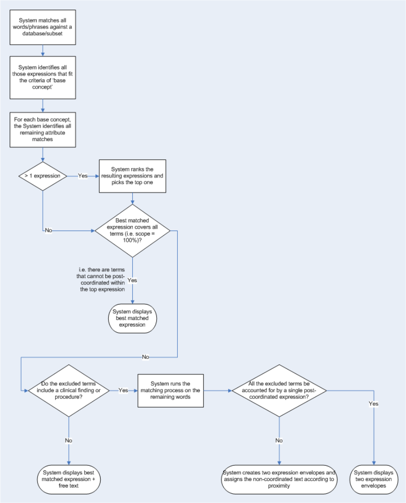
HSCIC Controlled Document

_**Step 1–System identifies phrase boundaries**_

If the system employs a sentence boundary parsing approach, the system will identify all phrase boundaries input by the user; these would be any full stops or carriage returns. If the system employs a word-by-word or character-by-character parsing approach, the system will assume that the expression window is defined by the last word boundary, that is the last character space, full stop or carriage return.

The system could possibly parse sentence-by-sentence, even if the system is matching on a per character basis.

_**Step 2–System matches base-concepts**_

Within each expression window, the system will run a match against the words in the text (excluding words from an externally defined exclusion list, which excludes very common words that are not useful in distinguishing between concept labels), but will filter the matching to the following base concept categories:

- Clinical findings

- Procedures

- Situation with explicit context

Please note that the system will reject any matches which do not meet a system-defined similarity threshold, in order to avoid spurious matching.

_**Step 3–System matches ‘attribute’ concepts**_

For each of the base concepts identified, the system will run a second set of matches, but filter the matching to those concepts that have SNOMED-CT attribute relationships with the base-concepts.

For each coordinated expression identified, the system can only use any input text once, that is, it cannot re-use words within a single expression (unless, of course, the user has typed in the same word twice).

_**Step 4–System ranks coordinated expressions and selects the best expression**_

If more than one expression has been identified, the system will rank these expressions and pick the top one, based upon:

- **Efficiency**  - Percentage of the expression that is accounted for by the input words)

- **Matching scope**  - Percentage of the input words that are accounted for by the expression)

- **Proximity**  - Priority goes to the expression that comprises words that are closer together in

the input text

- **Order**  - The extent to which the input words match the order of the corresponding words in

the SNOMED-CT expression

If the best matched coordinated SNOMED-CT expression covers all the input words (barring words from the excluded words list, such as prepositions) in the expression window, then the system displays this best match and the process ends.

_**Step 5–System matches base concepts in remaining text**_

The system runs a match against the remaining words (that is, the words that are not included in the best matched expression) filtered to the base concept categories.

If the system cannot find a base concept (where matches in the text do not meet a system-defined similarity threshold) it displays the remaining words as ‘free text’ associated with the best matched expression.

Page 43

Copyright ©2013 Health and Social Care Information Centre

HSCIC Controlled Document

_**Step 6–System defines a new expression boundary and runs the matching process**_
_**again**_

If the system can find at least one base concept, it runs steps 3 to 5 again.

Page 44

Copyright ©2013 Health and Social Care Information Centre

HSCIC Controlled Document

### REVISION AND SIGNOFF SHEET

#### Change Record

20-Jun-2006 Giles Colborne 0.0.0.1 Initial draft for review/discussion

26-Jul-2006 Laura Dromundo

Ben Luff

0.0.0.2 Updates to incorporate final Deliverable information

28-Jul-2006 Paul Robinson 0.0.0.3 Formatting updates

02-Aug-2006 Vivienne Jones 0.0.0.4 Copyedit

10-Aug-2006 Laura Dromundo

Ben Luff

0.0.0.5 Final Updates

14-Aug-2006 Vivienne Jones 0.0.0.6 Copyedited following updates from informal review with the Authority.

15-Aug-2006 Ben Luff

Laura Dromundo

0.0.0.7 Changes in response to copy edit

15-Aug-2006 Vivienne Jones 0.0.0.8 Copyedit on updates.

15-Aug-2006 Ben Luff 0.0.0.9 Changes in response to copy edit

16-Aug-2006 Paul Robinson 0.0.0.10 Final check of document

16-Aug-2006 Vivienne Jones 0.1.0.0 Document cleansed. Informal reviews carried out with the Authority, hence, Working Baseline not used previously. Moved to Baseline Candidate.

18-Aug-2006 Vivienne Jones 1.0.0.0 Baseline following Acceptance

27-Feb-2007 Ben Luff 1.0.0.1 Updated working baseline document

01-Mar-2007 Marc Brown 1.0.0.2 Copyedit

01-Mar-2007 Igor Laketic 1.0.0.3 Changes post copyedit

02-Mar-2007 Marc Brown 1.0.1.0 Cleansed, Working Baseline

12-Mar-2007 Ben Luff /

Igor Laketic

1.0.1.1 Added audience’s comments

13-Mar-2007 Vivienne Jones 1.0.1.2 Copyedit of updates

13-Mar-2007 Vivienne Jones 1.0.1.3 Accepted changes

14-Mar-2007 Vivienne Jones 1.1.0.0 Copyedit changes accepted by Igor. Document cleansed

20-Mar-2007 Ben Luff 1.1.0.1 Added audience’s comments

20-Mar-2007 Marc Brown 1.1.0.2 Copyedit of updates

20-Mar-2007 Igor Laketic 1.1.0.3 Accepted changes

21-Mar-2007 Marc Brown 1.2.0.0 Cleansed, Baseline Candidate

27-Mar-2007 Vivienne Jones 2.0.0.0 Baseline following Acceptance

25-Jul-2007 Vivienne Jones 2.0.0.0 Preface added so the document can be released to the Distribution Mechanism. The date fields were changed to static text as the original acceptance date needs to be maintained from a cross-reference point of view.

Page 45

Copyright ©2013 Health and Social Care Information Centre

HSCIC Controlled Document

Document Status has the following meaning:

- **Drafts 0.0.0.X**  - Draft document reviewed by the Microsoft CUI project team and the

Authority designate for the appropriate Workstream. The document is liable to change.

- **Working Baseline 0.0.X.0**  - The document has reached the end of the review phase and

may only have minor changes. The document will be submitted to the Authority CUI project team for wider review by stakeholders, ensuring buy-in and to assist in communication.

- **Baseline Candidate 0.X.0.0**  - The document has reached the end of the review phase and

it is ready to be frozen on formal agreement between the Authority and the Company

- **Baseline X.0.0.0**  - The document has been formally agreed between the Authority and the

Company

Note that minor updates or corrections to a document may lead to multiple versions at a particular status.

#### Audience

The audience for this document includes:

- **Authority CUI Manager / Project Sponsor** . Overall Project Manager and sponsor for the

NHS CUI Project within the Authority.

- **Authority NHS CUI Design Guide Workstream Project Manager.** Responsible for

ongoing management and administration of the Workstream.

- **The Authority Project Team** . This document defines the approach to be taken during this

assessment and therefore must be agreed by the Authority.

- **Microsoft NHS CUI Team** . This document defines the approach to be taken during this

assessment, including a redefinition of the NHS CUI Design Guide Workstream strategy.

#### Open Issues Summary

None

Table 14: Open Issues Summary

#### Reviewers

Paul Robinson Program Manager 0.0.0.3 28-Jul-2006

Ben Luff User Experience Consultant 0.0.0.5 10-Aug-2004

Laura Dromundo Program Manager 0.0.0.5 10-Aug-2004

Giles Colborne User Experience Consultant 0.0.0.1 20-Jun-2006

Roarke Batten NHS CFH Programme Manager 1.1.0.0 16-Mar-2007

Peter Johnson NHS CFH Clinical Architect 1.1.0.0 16-Mar-2007

Kate Verrier-Jones NHS CFH Clinical Advisor 1.1.0.0 16-Mar-2007

Ed Cheetham NHS CFH Clinical Advisor 1.1.0.0 16-Mar-2007

Mike Carey NHS CFH Toolkit Workstream Lead 1.1.0.0 16-Mar-2007

Page 46

Copyright ©2013 Health and Social Care Information Centre

HSCIC Controlled Document

#### Distribution

Roarke Batten NHS CFH Programme Manager

Kit Lewis NHS CFH Design Guide Workstream Lead

Tim Chearman NHS CFH Design Guide Workstream Lead

Peter Johnson NHS CFH Clinical Architect

Kate Verrier Jones NHS CFH Clinical Advisor

Ed Cheetham NHS CFH Clinical Advisor

Mike Carey NHS CFH Toolkit Workstream Lead

#### Document Properties

Document Title NHS CUI Design Guide Workstream Design Guide Entry – Terminology - Elaboration

Author NHS CUI Programme Team

Restrictions **RESTRICTED – COMMERCIAL; MICROSOFT COMMERCIAL;** Access restricted to: NHS CUI Project Team, Microsoft NHS Account Team

Creation Date 20 June 2006

Last Updated 23 June 2015

**Copyright:**

You may re-use this information (excluding logos) free of charge in any format or medium, under the terms of the Open Government Licence. To view this licence, visit [nationalarchives.gov.uk/doc/open-government-licence or email psi@nationalarchives.gsi.gov.uk.](https://web.nhs.net/OWA/redir.aspx?C=dMnSAL43xUOp9X_SOcscV9mT5A0smdBIh1_vxjdSDVCERI33v7-idn6tNFCNwJYUR1PxIW-Hd-E.&URL=http%3a%2f%2fnationalarchives.gov.uk%2fdoc%2fopen-government-licence)

Page 47

Copyright ©2013 Health and Social Care Information Centre
