# Truncation of Clinical Terms

### Design Consultation Document

_Prepared for_

**NHS Connecting for Health**

Friday, 18 December 2009

Version 1.0.0.0 Baseline

_Prepared by_

**Clinical Applications and Patient Safety Project**

**NHS CUI Programme Team**

**This document was prepared for NHS Connecting for Health which ceased to exist on 31 March 2013. It may contain references to organisations, projects and other**
**initiatives which also no longer exist. If you have any questions relating to any such references, or to any other aspect of the content, please contact**
**[cuistakeholder.mailbox@hscic.gov.uk](mailto:cuistakeholder.mailbox@hscic.gov.uk)**

# Executive Summary

**Problem**

    - Truncation of text is already widely used in information rich views in both nonclinical and clinical software

    - Truncated clinical terms may be more prone to misinterpretation and misselection than terms displayed in full

    - An assessment of the patient safety risks of alternatives to truncation is needed
to inform future design decisions
**Scope**

    - This study focuses on truncation of the text of clinical terms displayed in a
selection list, with a brief look at truncation of terms in a summary view
**Headline Findings**

    - Truncation of clinical terms should be avoided where possible

    - Truncated clinical terms may introduce more patient safety risks than terms
displayed in full

    - In most cases, clinical terms should be displayed in full in a list with a vertical
scroll bar

    - Truncation may be relevant in specific contexts, types of information, tasks or
views

    - It is unlikely that a set of generic rules for truncation can be defined

18 December 2009 Copyright ©2013 Health and Social Care Information Centre Slide 2

# Table of Contents

  - Executive Summary

  - Table of Contents

  - Problem Statement

  - Scope Statement

  - Process Overview

  - About this design consultation

  - Patient Safety Overview

  - Design Exploration

  - Themes

  - Supporting Materials

18 December 2009 Copyright ©2013 Health and Social Care Information Centre Slide 3

# Problem Statement

#### **Customer need**
###### • Effectively display lists of clinical terms when UI space is limited • Review the potential for generic guidance for the truncation of clinical terms in any context

#### **User experience goals**
###### • Support the user task of selecting a clinical term from a list as part of the process of encoding • Suggest mitigations for patient safety risks associated with hidden text and mis-selection in lists

18 December 2009 Copyright ©2013 Health and Social Care Information Centre Slide 4

# Scope Statement

**In Scope**

   - How to truncate coded clinical terms displayed in a selection list

    - Exploration and research limited to SNOMED CT®

   - How to truncate coded clinical terms displayed in a list or table

    - Limited feedback based on evolving work in the Display of Clinical Statements Workstream

   - How to access the full text of a truncated clinical term

    - Limited feedback based on evolving work in the Display of Clinical Statements Workstream

**Out of Scope**

   - Truncation of coded clinical terms in scenarios not listed above

   - Truncation of user interface elements (such as menu items and window titles)

   - Truncation of other information, such as medications (apart from those
displayed as coded clinical terms), patient names and dates

   - Truncation of non-encoded clinical terms

   - Truncation of post coordinated coded clinical terms

   - Using approved acronyms or abbreviations to shorten text

   - Truncation of free text

18 December 2009 Copyright ©2013 Health and Social Care Information Centre Slide 5

# Process Overview

**Scoping and Research**

   - Review of _NHS CFH Rules for the Display of Coded Clinical Data_

   - Review of truncation in a small number of clinical and non-clinical applications

   - Review of NHS CFH analysis of SNOMED CT

   - Review of UI principles for avoiding truncation

**Risk Assessments**

   - Preparation of scenario and design alternatives

   - Reporting findings

**Design Exploration**

   - Design exploration for truncating in selection lists

   - Design exploration for truncating in views that summarise clinical statements

**User Research**

   - Risk assessment of designs in interviews with six participants

   - Reporting user research findings

18 December 2009 Copyright ©2013 Health and Social Care Information Centre Slide 6

# About this design consultation

The purpose of the document is to summarize the current learning that has been
achieved in the design and research process to date. This is articulated primarily in
terms of the features that comprise the preferred current design. These design
features aggregate into seven themes.

For each theme we illustrate a few design points with images of the current design,
plus an indication of some of the alternatives we have been considering. We then
summarise the key design points, including some that haven’t been illustrated, plus
the rationale for choosing these points. We end each theme by outlining the proposed
next steps and future exploration.

18 December 2009 Copyright ©2013 Health and Social Care Information Centre Slide 7

# Patient Safety Overview

The development lifecycle for this consultation document includes an integrated patient safety assessment and
management process.

Known patient safety incidents relevant to this area have been researched and reviewed as part of ongoing
development.

The Hazard Log records all the risks that have been identified during development and describes potential
mitigatory actions that could be considered alongside future exploratory work in this area. The Hazard Log is a
live document that will be updated as this area of work is developed further.

Until this work is progressed and developed to full design guide status it will not be in a position to achieve full
Clinical Authority to Release (CATR) from the NHS Connecting for Health (CFH) Clinical Safety Group (CSG).

Please refer to [www.cui.nhs.uk for further information on the patient safety process and for the safety](http://www.cui.nhs.uk/)
status and any relevant accompanying safety documentation for this consultation document.

18 December 2009 Copyright ©2013 Health and Social Care Information Centre Slide 8

## **DESIGN EXPLORATION**

18 December 2009 Copyright ©2013 Health and Social Care Information Centre Slide 9

# Design Exploration

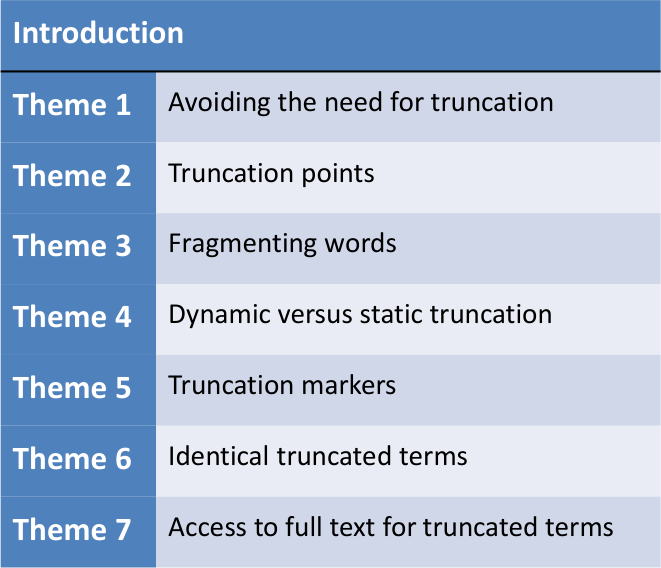

All illustrations use current SNOMED CT terms.

18 December 2009 Copyright ©2013 Health and Social Care Information Centre Slide 10

### Introduction – what is truncation?

In this document, the word ‘truncation’ is used to refer to the removal of a
section of text in order to fit the remainder into a smaller space

Although this document focuses on
truncation, the use of truncation
must be compared to obscuring

Obscured text

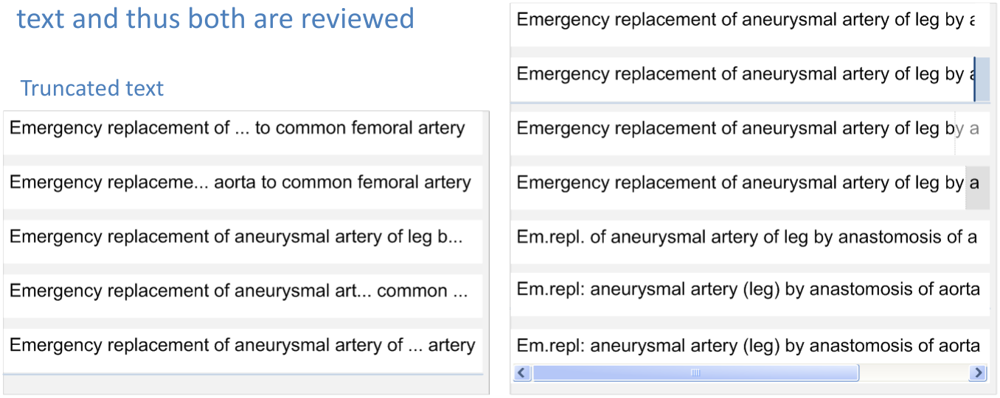

18 December 2009 Copyright ©2013 Health and Social Care Information Centre Slide 11

### Introduction – truncation in non-clinical applications

Truncation is widely used in both clinical and non-clinical applications
Text is truncated at the end or in the (approximate or exact) ‘middle’

|pending on context|Col2|Col3|
|---|---|---|
||||
||||
|||A list of emails truncated at the end|

A list of files truncated in the ‘middle’

Truncation of text is generally used when text is limited to
single lines in dynamic width spaces so the truncated text
changes as the width is changed. Words are usually
fragmented to make best use of the available space

18 December 2009 Copyright ©2013 Health and Social Care Information Centre Slide 12

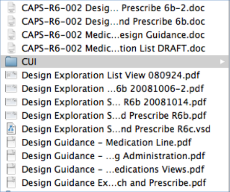
### Introduction – truncation in clinical applications

Truncation is a popular solution to solving the need to display long terms in
information-rich views, especially when that information is presented in

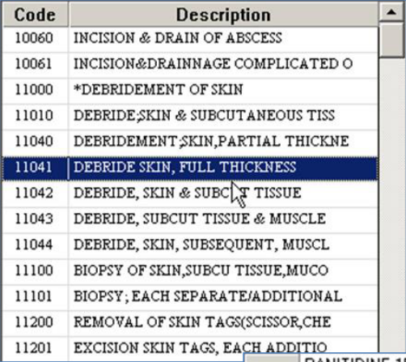

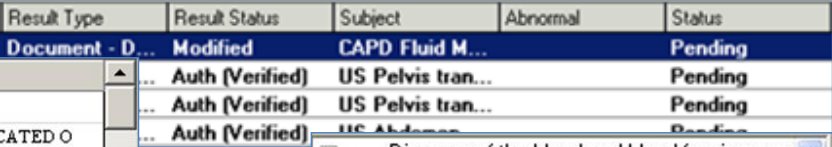

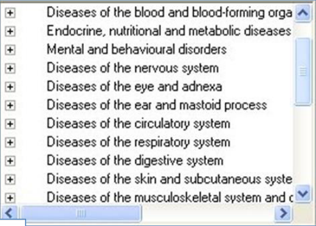

|ular form|Col2|Truncated Text with an Ellipsis|Col4|Col5|Col6|
|---|---|---|---|---|---|
|||||||
|||||||
|||||||
|||||||
|||||||
|Terms cut short by the edge of the list|Terms cut short by the edge of the list|Terms cut short by the edge of the list|Terms cut short by the edge of the list|Terms cut short by the edge of the list|Horizontal and Vertical Scroll Bars|

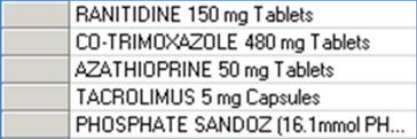

Truncation of medications

18 December 2009 Copyright ©2013 Health and Social Care Information Centre Slide 13

### Introduction – lengths of SNOMED CT terms

18,000

16,000

14,000

12,000

10,000

8,000

6,000

4,000

2,000

0

Term Lengths (number of characters)

18 December 2009 Copyright ©2013 Health and Social Care Information Centre Slide 14

Theme 1
## AVOIDING the need for TRUNCATION

18 December 2009 Copyright ©2013 Health and Social Care Information Centre Slide 15

the need for
### Avoiding truncation – wrapping

Wrapping ensures that all items are displayed in full. If each item in a list can
be scrolled into view so that the whole term is visible, then each term can
be reviewed easily before a selection is made

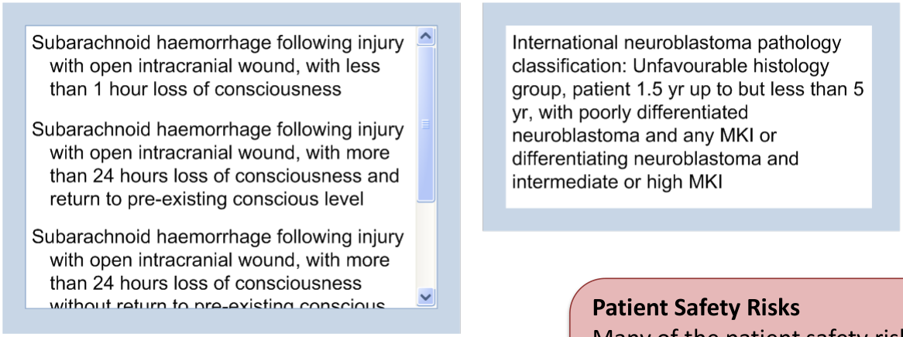

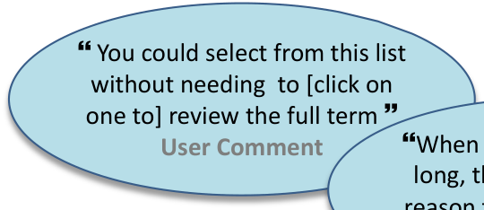

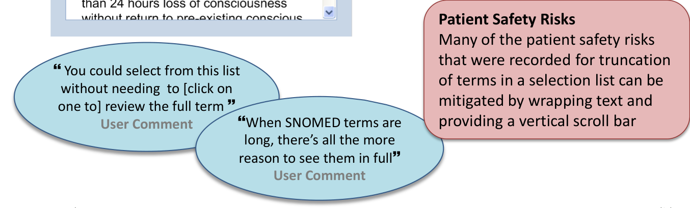

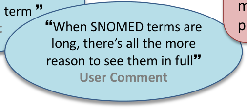

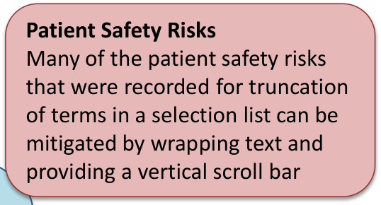

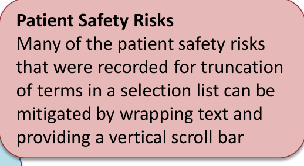

the need for
### Avoiding truncation – scrolling

Truncation of clinical terms may not be appropriate for some tasks. For example,
when the task is browsing (rather than searching for a known term), the list may
be presented as a tree

provides more immediate access to full terms

18 December 2009 Copyright ©2013 Health and Social Care Information Centre Slide 17

the need for
### Avoiding truncation – grouping

Groups help to break the list down into smaller chunks and reduce the
number of list items that need to be reviewed

18 December 2009 Copyright ©2013 Health and Social Care Information Centre Slide 18

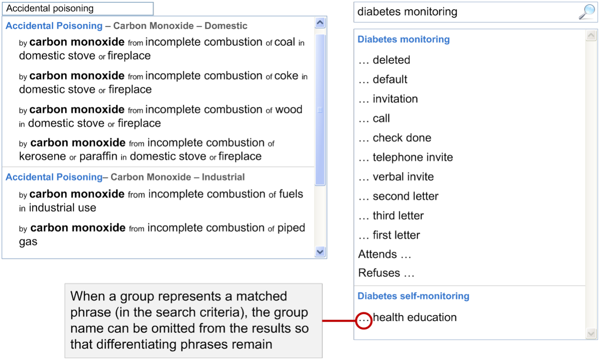
the need for
### Avoiding truncation
#### **Summary**

1. Wrapping

a) Ensures that all items are displayed in full (with the help of a vertical scroll bar)
b) When long words wrap, it can create a lot of unused space on the right of the text
c) When wrapping, rules may be needed to keep associated elements such as numbers and

units together
2. If summaries can be created that are meaningful, it may be possible to provide
higher level summary views that can then be used to drill down a subset of the
detail that can then be displayed in full (without truncation)
3. Approved acronyms and abbreviations can be used to shorten some structured
text entries
4. Groups add structure and can be used to hide the text in each list item that is
implied by the group it is in
5. Modifying search processes and supporting filtering may help users to work with
shorter lists in which truncation is not necessary
6. Showing or hiding certain types of information (or labels in a chart view) may
simplify the view and leave more room for other information to be displayed
with minimum truncation

18 December 2009 Copyright ©2013 Health and Social Care Information Centre Slide 19

the need for
### Avoiding truncation

|Emerging Recommendations|Evidence|
|---|---|
|Use truncation as a last resort and only when truncated terms are the exception rather than the rule|• Tasks associated with both summary views and selection lists are not well supported when truncation of terms is a common occurrence • There are many patient safety risks (such as misinterpretation and missing the presence of truncated text) associated with the interpretation of truncated terms|
|When wrapping encoded text ensure that elements such as labels, numbers, units and separators are kept together where necessary|• When wrapping separates quantities (100) from units (milligrams), there is a risk that, in skim reading, the wrapped text is guessed rather than actively read. Preserving them together mitigates this risk • _The completion of further work in this area may_ _generate a set of more specific recommendations_|

**Note:** _Emerging recommendations are at many levels (some high level and generic, others more_
_detailed) and include more than one (mutually exclusive) approach. They need significant_
_further design, research and risk assessment before they can be considered as candidates for_
_future guidance_

18 December 2009 Copyright ©2013 Health and Social Care Information Centre Slide 20

the need for
### Avoiding truncation

|Emerging Recommendations|Evidence|
|---|---|
|Do not wrap mid-word (thus creating word fragments with or without hyphens)|• Hyphenating words that are not usually hyphenated may create fragments that can be misinterpreted as whole words • As above, the wrapped part of a hyphenated word may be guessed by the user rather than actively read • _The completion of further work in this area may identify_ _the need for a technical solution to prevent applications_ _from taking hyphens as wrapping points by default_|
|If a list can include items that are too long to be displayed in full without scrolling, allow the list to be resized so that it is possible to see the longest term without scrolling|• The task of selecting from a list is not well supported if rapid scrolling is needed and list items must be held in short term memory in order to compare between them and make an appropriate selection|

18 December 2009 Copyright ©2013 Health and Social Care Information Centre Slide 21

the need for
### Avoiding truncation

|Emerging Recommendations|Evidence|
|---|---|
|Do not provide a horizontal scroll bar in selection lists unless the list can be resized to display all terms in full|• The task of selecting from a list is not well supported if rapid scrolling is needed and list items must be held in short term memory in order to compare between them and make an appropriate selection • Horizontal scrolling does not allow a list to be scrolled so that a list item is visible in full • Comparing list items is more difficult with a horizontal scroll bar unless the differentiating text is at the end of each term • Horizontal scrolling is a more complex mechanical interaction than vertical scrolling when a mouse with a scroll wheel is used|

18 December 2009 Copyright ©2013 Health and Social Care Information Centre Slide 22

the need for
### Avoiding truncation
#### **Areas / questions for further study**

  - If truncation is being considered, is the design solution the best way
of supporting the user task?

    - For example, if truncation is being considered for selection lists of clinical terms, is

a selection list the best mechanism for making that selection?

  - In which contexts is truncated information sufficiently meaningful
to support the tasks of searching and selecting an appropriate term
or reviewing a patient using summary views?

  - There may be some contexts in which truncation is appropriate only
for expert users or certain roles and should be avoided for novice
users or for other roles

  - If groups are used in search results, more work is needed to
determine whether the structure of the results should be manuallydefined or influenced by the search criteria

  - _Emerging recommendations can be used to inform further work on_
_avoiding the need for truncation_

18 December 2009 Copyright ©2013 Health and Social Care Information Centre Slide 23

Theme 2
## **TRUNCATION POINTS**

If truncation cannot be avoided, where should text truncate?

18 December 2009 Copyright ©2013 Health and Social Care Information Centre Slide 24

### Truncation points – risks

Truncating in the ‘middle’ may create ‘artificially meaningful’ sentences,
cause more than one fragmented word and / or affect the space and

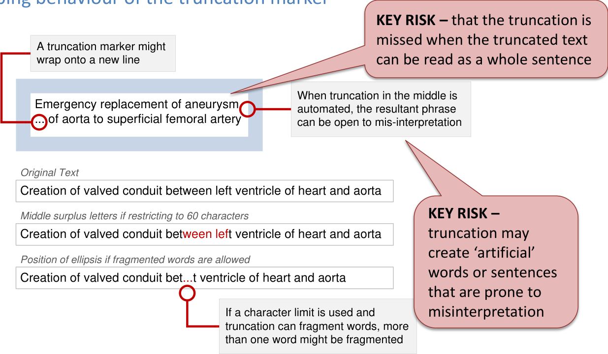

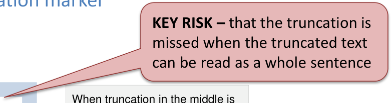

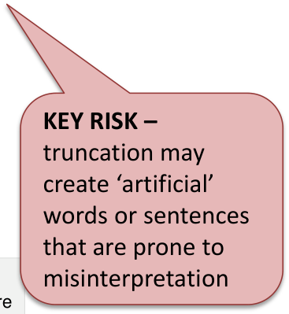

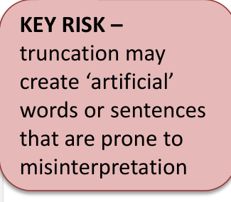

18 December 2009 Copyright ©2013 Health and Social Care Information Centre Slide 25

### Truncation points – visibility

Truncating at the end is potentially easier to
notice and a truncation point at the end is
more consistently placed (visually) than a
truncation point in the ‘middle’. However,
truncation in the ‘middle’ may be more
effective and easier to notice when each item
is limited to a single line

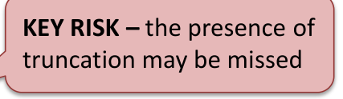

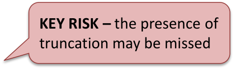

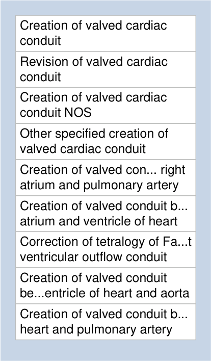

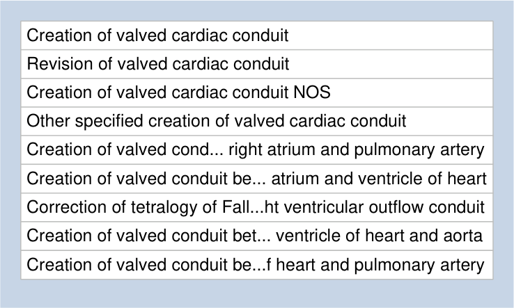

18 December 2009 Copyright ©2013 Health and Social Care Information Centre Slide 26

ntial

### Truncation points – manually-defined truncation

A set of manually defined truncation points (defined for each term) could
ensure that clinical terms are always truncated in acceptable places and that
phrases are preserved where necessary

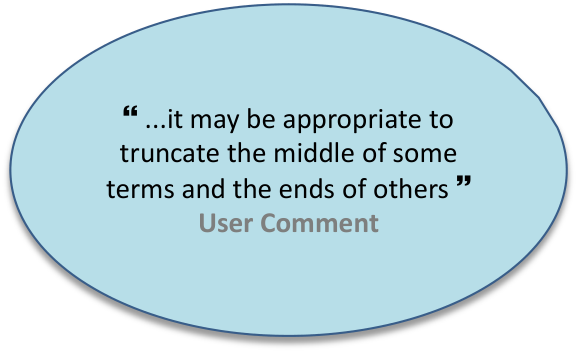

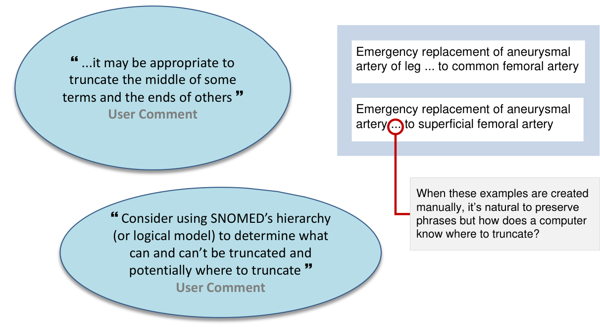

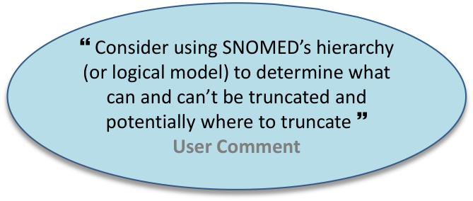

18 December 2009 Copyright ©2013 Health and Social Care Information Centre Slide 27

### Truncation points – summary views

A summary view (containing clinical terms) is not effective if the information

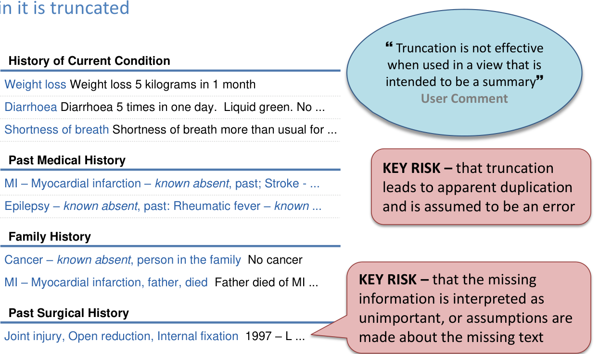

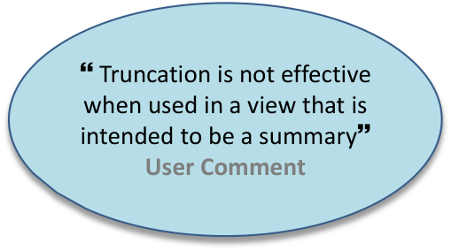

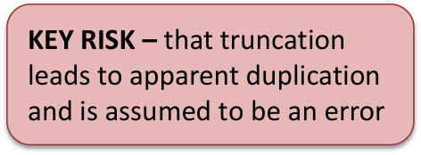

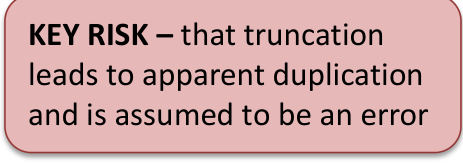

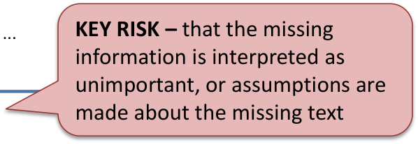

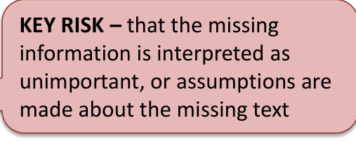

18 December 2009 Copyright ©2013 Health and Social Care Information Centre Slide 28

### Truncation points – numbers and units

Numbers may be separated from associated units when wrapping or
truncation is used

When truncation allows numbers to be fragmented,
a number may be missing one or more digits

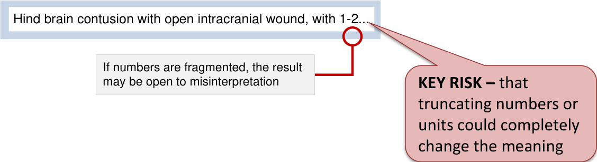

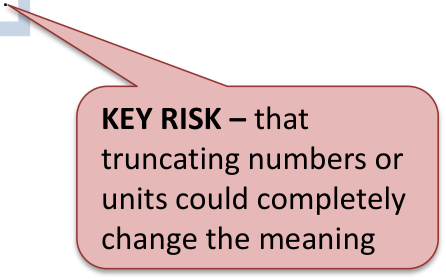

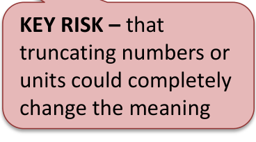

18 December 2009 Copyright ©2013 Health and Social Care Information Centre Slide 29

### Truncation points
#### **Summary**

1. Preserving phrases is difficult to do automatically
2. Fixed character limit

a) Can create an artificially large space after the point of truncation
b) Not likely to make the best use of the available space
c) Could be used to ensure consistent truncation in different contexts but likely to introduce problems in a

context where the character limit is less suitable
3. Truncating at the end

a) Is potentially easier to notice
b) A truncation point at the end is more consistently placed (visually) than a truncation point in the ‘middle’

(wrapping rules and whole word or fragmented words)

4. Truncating in the ‘middle’

a) May create ‘artificially meaningful’ sentences
b) May create more than one fragmented word and affects the space and wrapping behaviour of the

truncation marker
c) May be more effective when limiting to a single line

5. More than one truncation point (in a single term or text item)

a) May allow phrases or differentiating words to be maintained in view
b) Requires sophisticated logic and is more difficult to achieve with a dynamic truncation point
6. A set of approved, manually-defined truncation points could ensure that terms are always
truncated in acceptable (and expected) places

18 December 2009 Copyright ©2013 Health and Social Care Information Centre Slide 30

### Truncation points

|Emerging Recommendations|Evidence|
|---|---|
|Do not truncate clinical terms when they appear in a list of fixed-width|• When a width is fixed, a solution is needed to support access to the full text for truncated terms • A fixed-width list cannot be resized (even temporarily) to reveal the truncated text • Any solution for accessing the full text of a truncated term is likely to be even less direct (and effective) than scrolling|
|Only use truncation in a selection list of clinical terms if the choice of text to truncate is informed by the data structure or a manually defined means of selecting acceptable text to truncate is available|• If truncation can be used in a way that supports accurate review of a list without accessing the full text, then some of the patient safety risks associated with truncated text are mitigated|

18 December 2009 Copyright ©2013 Health and Social Care Information Centre Slide 31

### Truncation points

|Emerging Recommendations|Evidence|
|---|---|
|Only use ‘middle truncation’ when text is limited to a single line |• ‘Middle’ truncation is used effectively in non-clinical contexts and is therefore likely to be effective in some clinical contexts (depending on the nature of the information) • ‘Middle’ truncation may be the best approach for summary views that display information in which the end of the text is known to be the likely differentiator and no actions can be completed on the truncated text that are unsafe • _The completion of further work in this area may generate_ _exceptions to this rule, such as ‘don’t use ‘middle’_ _truncation for clinical terms’_|

18 December 2009 Copyright ©2013 Health and Social Care Information Centre Slide 32

### Truncation points
#### **Areas / questions for further study**

### • Determining when to use truncation and where to truncate may be dependent on an analysis of the specific type of information subject to truncation • Emerging recommendations can be used to _inform further work on truncation points_

18 December 2009 Copyright ©2013 Health and Social Care Information Centre Slide 33

Theme 3
## **FRAGMENTING WORDS**

18 December 2009 Copyright ©2013 Health and Social Care Information Centre Slide 34

### Fragmenting words – dynamic width

Fragmenting words works best with dynamic truncation – since the
truncation point can move one letter at a time as a text area is resized

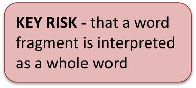

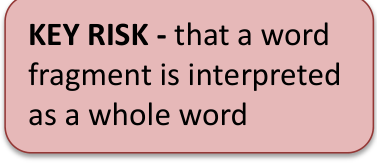

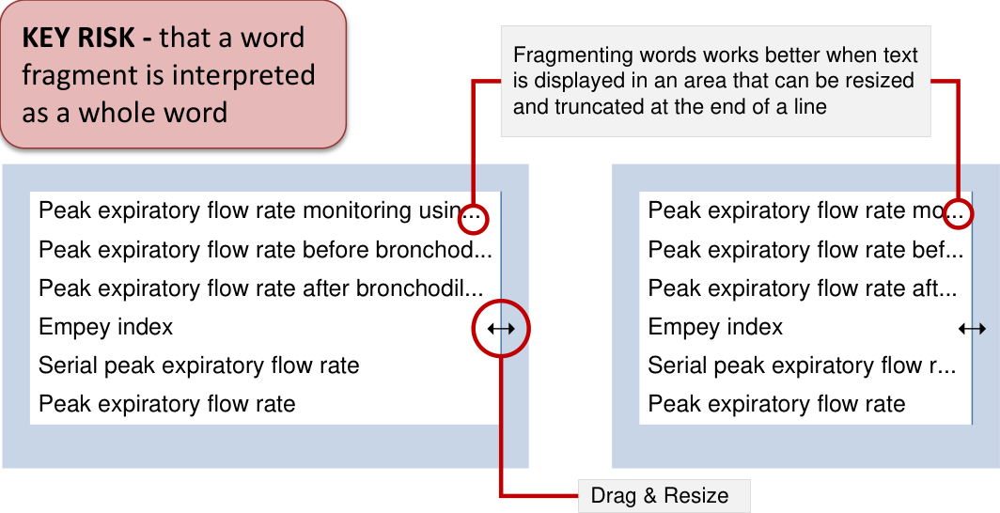

A fragmented word may be more noticeable than
truncated text in which whole words are preserved

18 December 2009 Copyright ©2013 Health and Social Care Information Centre Slide 35

### Fragmenting words – contexts

Truncation rules may need to be different depending on the context since it
may be acceptable or even necessary to fragment words in some contexts

18 December 2009 Copyright ©2013 Health and Social Care Information Centre Slide 36

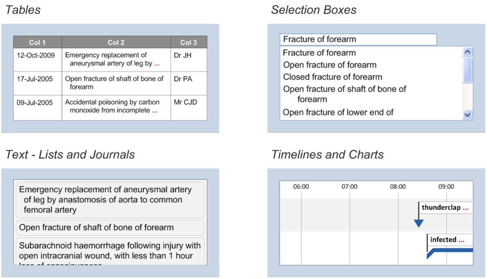
### Fragmenting words
#### **Summary**

1. Fragmenting words works best with dynamic truncation because the truncation
point can move one letter at a time as a text area is resized and more of the text
is visible than when a whole word is truncated at a time

2. A fragmented word may be more noticeable than truncated text in which whole
words are preserved

3. A fragmented word might look like a whole word. Similarly, fragmented
numbers may be interpreted as whole when it is missing one or more digits

4. Hyphenation can be used to maximise the quantity of text that can be displayed
on each line but creates fragmented words

5. When words are preserved, there may be greater space at the end of truncated
text

6. In views (such as a timeline, chart or graph) where text cannot wrap onto a new
line, it may be more appropriate to truncate and to fragment words in order to
preserve as much visible text as possible

18 December 2009 Copyright ©2013 Health and Social Care Information Centre Slide 37

### Fragmenting words

|Emerging Recommendations|Evidence|
|---|---|
|Do not truncate such that characters or digits are missing from numbers or units|• Removal of digits from numbers creates new numbers • Separation of numbers from units may lead to the units being guessed • Truncation of a unit (such as millilitres) may create or imply a different unit (such as milli... or ...litres)|
|Do not fragment words when truncating text that is displayed in a fixed-width area|• For similar reasons that clinical terms should not be truncated in fixed-width lists.  Ease of access to the full term is important here|

18 December 2009 Copyright ©2013 Health and Social Care Information Centre Slide 38

### Fragmenting words
#### **Areas / questions for further study**

### • Emerging recommendations can be used to _inform further work on fragmenting words_

18 December 2009 Copyright ©2013 Health and Social Care Information Centre Slide 39

Theme 4
## DYNAMIC versus STATIC TRUNCATION

18 December 2009 Copyright ©2013 Health and Social Care Information Centre Slide 40

### Dynamic versus static truncation

When truncation is dynamic, the truncation point depends on the space
available to display the text. When truncation is static, each term is always
truncated at the same point in the text, regardless of the space available

|The point of truncation depends Dynamic – Limited to 2 Creation of valved conduit on the space available between right ventricle of ... lines|Col2|The point of truncation depends on the space available|
|---|---|---|
|**Dynamic**– Limited to 2 lines|Creation of valved conduit between right ventricle of ...|Creation of valved conduit between right ventricle of ...|

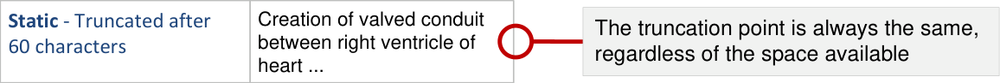

25 characters wide

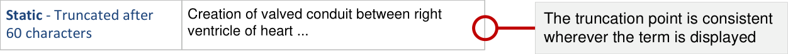

50 characters wide

18 December 2009 Copyright ©2013 Health and Social Care Information Centre Slide 41

### Dynamic versus static truncation

When a space has fixed dimensions, the text will always be truncated at the
same point

18 December 2009 Copyright ©2013 Health and Social Care Information Centre Slide 42

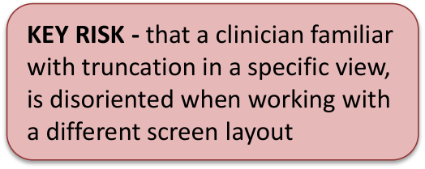

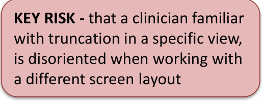
### Dynamic versus static truncation

If the width of a selection list can be changed, it may be possible to increase
the width until none of the items are truncated. When words can be
fragmented, resizing may appear smooth as the text is truncated one letter
at a time. Truncating whilst preserving whole words causes whole words to
disappear when a width is reduced

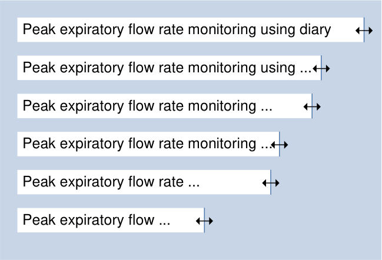

18 December 2009 Copyright ©2013 Health and Social Care Information Centre Slide 43

### Dynamic versus static truncation
#### **Summary**

1. When using static truncation, such as truncating after a fixed number of characters

a) If an area is a set size, the truncation point will always be the same
b) Truncation after a set number of characters may leave a lot of white space (thus not
making full use of the available space)
c) It may be easier to use more sophisticated methods of indicating truncation when the
truncation point is static, since the location of the point at which the text is truncated is
more predictable

2. When using dynamic truncation, such as number of lines to wrap in a variable

width space

a) Truncating whole words might create a jerkiness as words are replaced with the
truncation marker
b) It is more difficult to draw attention to apparent duplicates or text that is open to
misinterpretation as a result of the truncation because the truncation point (and thus
whether it is duplicated or not) changes
c) When truncating within cells, applying truncation to one column may not make best use
of space if truncation is not also applied in other columns
d) Using a single line limit with a variable width makes it easier to scan a list but it is less
effective for selecting from a list when a large number of list items are truncated

18 December 2009 Copyright ©2013 Health and Social Care Information Centre Slide 44

### Dynamic versus static truncation

|Emerging Recommendations|Evidence|
|---|---|
|Do not use a set number of characters as a rule for determining an appropriate truncation point|• A set number of characters is likely to be appropriate to a specific context.  Since one of the benefits of using a set truncation point is consistency, it becomes irrelevant if the chosen point is not effective in all contexts|
|Do not provide a horizontal scroll bar for a view containing terms that are truncated at a set point|• If it is possible to scroll so that the point of truncation is off screen, it is more likely that a truncated term is misinterpreted as being whole|

18 December 2009 Copyright ©2013 Health and Social Care Information Centre Slide 45

### Dynamic versus static truncation
#### **Areas / questions for further study**

### • Emerging recommendations can be used to _inform further work on dynamic versus static_ _truncation_

18 December 2009 Copyright ©2013 Health and Social Care Information Centre Slide 46

ntial

Theme 5
## **TRUNCATION MARKERS**

18 December 2009 Copyright ©2013 Health and Social Care Information Centre Slide 47

### Truncation markers

Text markers can be placed at the point of truncation and may be easier to
implement than icons or images. Some text markers could be misread as

|ers or numbers|Col2|
|---|---|
|Creation of valved conduit between right atrium and pulmo / Creation of valved conduit between atrium and ventricle of / Creation of valved conduit between left ventricle of heart a / Correction of tetralogy of Fallot using valved right ventricul / Text markers such as “/” or “>” may be easier to notice than an ellipsis but may also be misinterpreted as letters or numbers|Text markers such as “/” or “>” may be easier to notice than an ellipsis but may also be misinterpreted as letters or numbers|
|Creation of valved conduit between right atrium and pulmo /|Creation of valved conduit between right atrium and pulmo /|
|Creation of valved conduit between atrium and ventricle of /|Creation of valved conduit between atrium and ventricle of /|
|Correction of tetralogy of Fallot using valved right ventricul /|Correction of tetralogy of Fallot using valved right ventricul /|
|Creation of valved conduit between left ventricle of heart a /|Creation of valved conduit between left ventricle of heart a /|

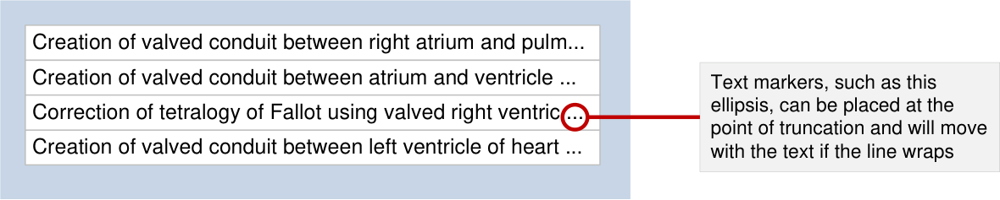

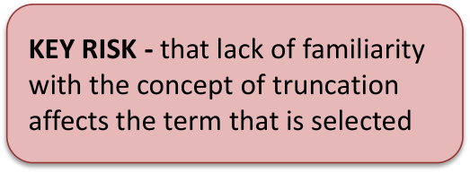

18 December 2009 Copyright ©2013 Health and Social Care Information Centre Slide 48

### Truncation markers

A sequence of text characters, such as ‘… >>’ or ‘*… /’ may be easier to
notice than a text marker such as an ellipsis ‘…’

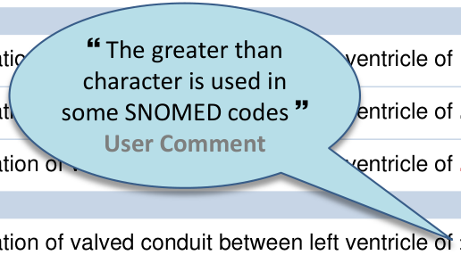

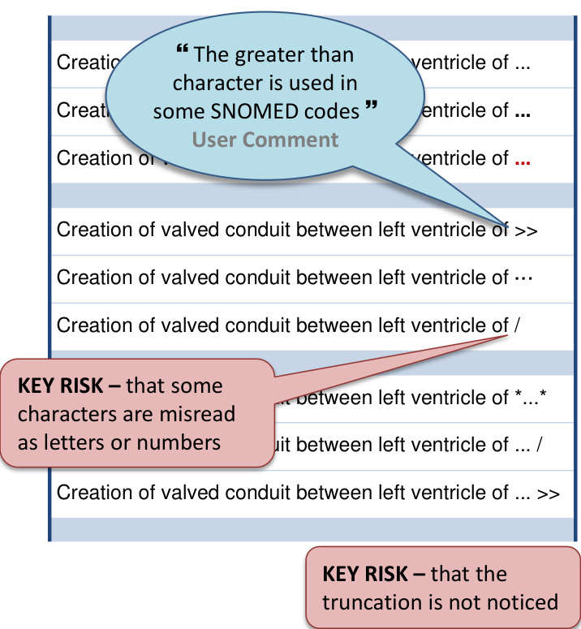

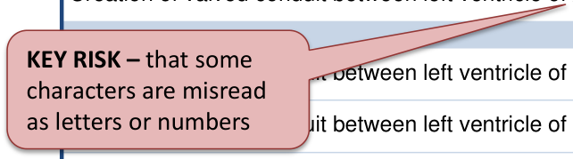

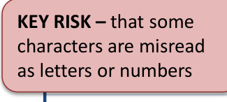

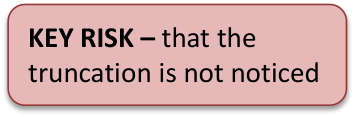

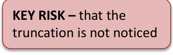

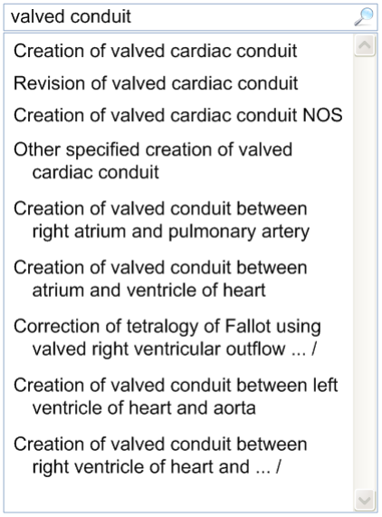

Symbols, icons or controls may be
more noticeable than an ellipsis
They may also take up more space
(so more text has to be truncated)

18 December 2009 Copyright ©2013 Health and Social Care Information Centre Slide 49

### Truncation markers

Icons or controls may distract too much from the text itself, especially if
there are many of them in one view

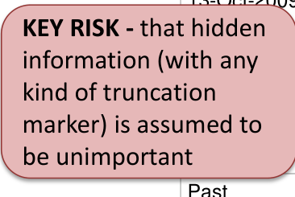

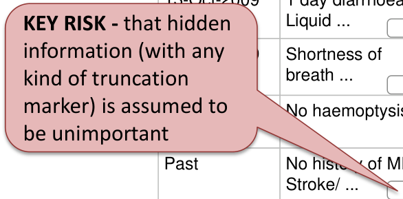

|KEY RISK - that information (w kind of truncat marker) is assu be unimportan|13-Oct-2009 hidden|1 day diarrhoea. Liquid ...|History of current condition ...|13-Oct-2009 Dr Sophie Allen|
|---|---|---|---|---|
|**KEY RISK -**that information (w kind of truncat marker) is assu be unimportan|13-Oct-2009  ith any  ion|Shortness of breath ...|History of current condition ...|13-Oct-2009 Dr Sophie Allen|
|**KEY RISK -**that information (w kind of truncat marker) is assu be unimportan|13-Oct-2009  med to  t|No haemoptysis|History of current condition ...|13-Oct-2009 Dr Sophie Allen|
|**KEY RISK -**that information (w kind of truncat marker) is assu be unimportan|Past|No history of MI/ Stroke/ ...|Past medical history Known absent: Epilepsy|13-Oct-2009 Dr Sophie Allen|
|**KEY RISK -**that information (w kind of truncat marker) is assu be unimportan||Mild aortic stenosis|Past medical history Aortic stenosis - Mild|13-Oct-2009 Dr Sophie Allen|
|**KEY RISK -**that information (w kind of truncat marker) is assu be unimportan||No cancer|Family history Known absent: ...|13-Oct-2009 Dr Sophie Allen|
|**KEY RISK -**that information (w kind of truncat marker) is assu be unimportan|2008 (calculated)|Father died of MI aged 55|Family history Known present: ...|13-Oct-2009 Dr Sophie Allen|
|**KEY RISK -**that information (w kind of truncat marker) is assu be unimportan|1997|L index finger, PIP joint ...|Past surgical history Joint injury, Open ...|02-Feb-2007 Dr Tim Smith|

18 December 2009 Copyright ©2013 Health and Social Care Information Centre

ial

Slide 50

### Truncation markers

Markers can be placed at the point where text is truncated or in association
with the text item

A marker may also be placed
such that it is associated with
the text but not part of it

The ellipsis can be placed at the
point where text is truncated

|13-Jun-2008|international neuroblastoma pathology xxclassification: Favourable histology ...|13-Oct-2009 Dr Sophie Allen|
|---|---|---|
|13-Nov-1997|emergency replacement of aneurysmal xxbifurcation of aorta by anastomosis ...|16-Jan-1999 Dr Sophie Allen|
|13-Jan-1990|open fracture of forearm, lower end, xxunspecified|16-Jan-2009 Dr Sophie Allen|
|13-Oct-1987|pancreatic stone|13-Oct-1987 Dr Sophie Allen|

18 December 2009 Copyright ©2013 Health and Social Care Information Centre Slide 51

### Truncation markers
#### **Summary**

1. Text markers:

a) Ellipses are used in typography to mark omission from speech or writing of a word or words

that are superfluous or able to be understood from the context. It is also the term for a set
of dots (…) used to indicate such an omission
b) A text marker may be easier to implement and to place at the point of truncation than an

icon or control
c) Text markers, such as ‘>>’ or ‘/’, may be easier to notice than ‘…’ but may also be

misinterpreted or mistaken for text
d) A sequence of text characters, such as ‘*…*’ or ‘/ … /’, may be easier to notice than a single

character such as the ellipsis ‘…’
e) Bold or colourful truncation markers may draw attention away from the text
f) Placing a space between the text and truncation marker may cause the marker to wrap to

the beginning of a new line

2. Symbols, icons and controls:

a) May be useful if a control for displaying the full text is to be placed near the truncated text
b) May distract too much from the text itself
c) A symbol or icon may be more noticeable than an ellipsis
d) The use of larger markers or controls may take up more space and result in more text being

truncated

18 December 2009 Copyright ©2013 Health and Social Care Information Centre Slide 52

### Truncation markers

|Emerging Recommendations|Evidence|
|---|---|
|When text is truncated at the end, display (at least) an ellipsis at the point of truncation|• An ellipsis is more noticeable when displayed at the end of a line of truncated text (than in the ‘middle’) • Truncation without a truncation marker is easily missed • Without a truncation marker truncated text may not be noticed in a dynamic width list in which text is cut off by the right hand edge of the area.  If the user does not realise that the area can be resized, the truncation may never be discovered.|
|If truncation is used in a selection list, supplement the ellipsis with a symbol for each truncated list item|• Positive feedback in user testing and risk assessments • _The completion of further work in this area should_ _include a review of this recommendation since it_ _depends heavily on the contents of the list, the type_ _of task it is designed to support, the type of_ _truncation used and whether it can be resized.  A_ _guidance point would need to be more specific than_ _this_|

18 December 2009 Copyright ©2013 Health and Social Care Information Centre Slide 53

### Truncation markers

|Emerging Recommendations|Evidence|
|---|---|
|Do not support the use of the ellipsis as a control (such as a button) for accessing the full text of a truncated term|• Derived from the Windows Style Guide • The ellipsis is not commonly used as a control so this function is not likely to be sufficiently discoverable|

18 December 2009 Copyright ©2013 Health and Social Care Information Centre Slide 54

### Truncation markers
#### **Areas / questions for further study**

### • A more detailed study of revealing full text in selection lists containing other types of data is needed to determine whether there is a generic approach that can be used in other contexts • Emerging recommendations can be used to _inform further work on truncation markers_

18 December 2009 Copyright ©2013 Health and Social Care Information Centre Slide 55

Theme 6
## **IDENTICAL TRUNCATED TERMS**

Where ‘identical terms’ are ‘apparent duplicates’ created by the truncation

18 December 2009 Copyright ©2013 Health and Social Care Information Centre Slide 56

### Identical truncated terms

When truncated, some terms may be identical. These apparently duplicate
terms can be either marked, consolidated into one item or avoided

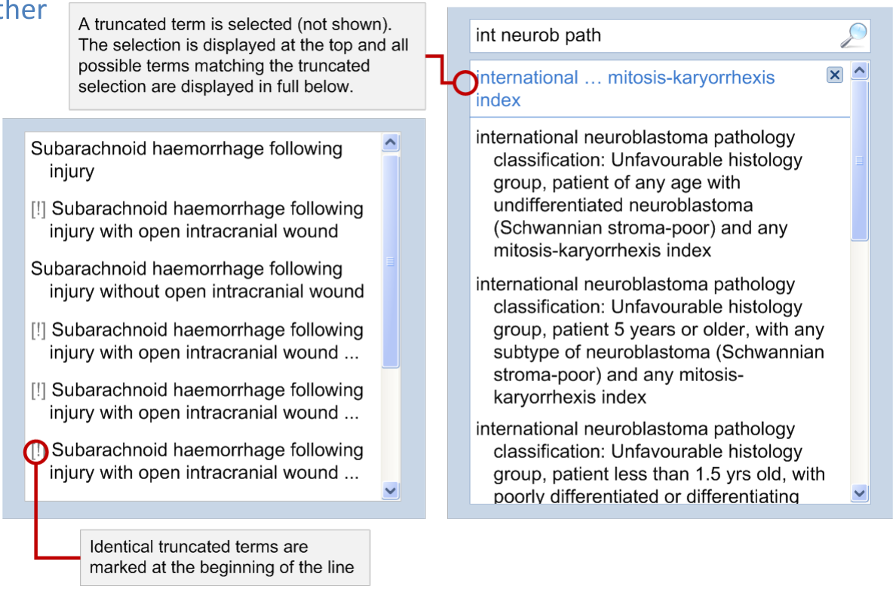

18 December 2009 Copyright ©2013 Health and Social Care Information Centre

onfidential

Slide 57

### Identical truncated terms

If the presence of identical truncated terms in the list is easily avoided by
changing the search criteria, a system could suggest words that would
reduce the number of duplicates in the search results. A similar approach
could be used to avoid the need for truncation altogether

appear next to one another in the list

18 December 2009 Copyright ©2013 Health and Social Care Information Centre Slide 58

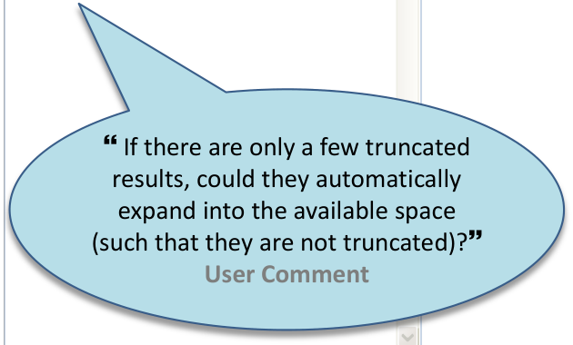

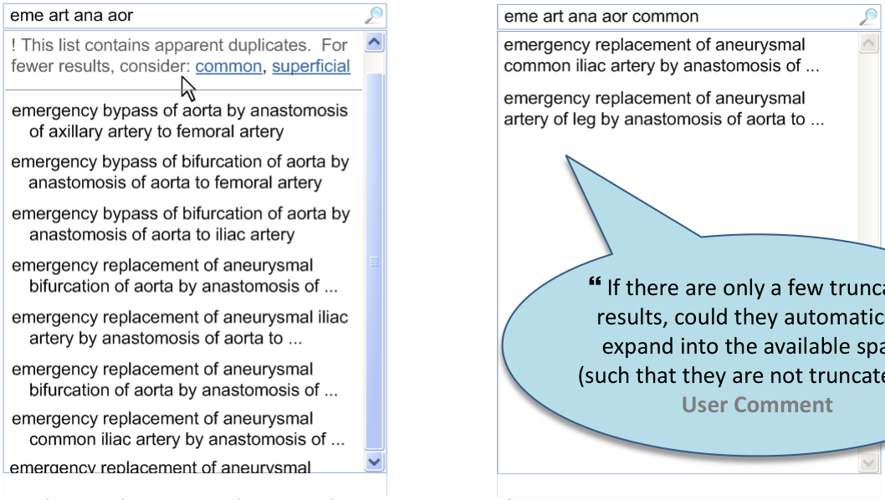
### Identical truncated terms
#### **Summary**

1. When truncation causes identical terms to be displayed in a selection list:

a) it may be necessary to draw attention to each
b) it may be possible to consolidate them so that they are only displayed once

2. If the presence of identical truncated terms is easily avoided by changing the
search criteria, a system could provide prompts to support narrowing the search
results

3. An improved search process can support access to shorter lists in which identical
terms are much less likely

4. Progressive disclosure can help to mitigate apparent duplicates since they can be
expanded in context

5. A rule that requires identical truncated terms to be expanded automatically
would create a potentially confusing mixed list with some expanded and others
truncated

6. When many terms are truncated, it is more likely that there are similar
(truncated) terms in a list, thus increasing the risk of mis-selection even when
they are not identical

18 December 2009 Copyright ©2013 Health and Social Care Information Centre Slide 59

### Identical truncated terms

|Emerging Recommendations|Evidence|
|---|---|
|For fixed-width lists, when a list contains identical truncated terms (and when this can be determined) display the list without truncation by default|• An expert user familiar with the list can choose to re-apply truncation (so this still allows truncation to be used but only in certain circumstances) • _This recommendation is as close as possible to a_ _rule stating that lists should never contain truncated_ _text if they can contain duplicate items (without_ _being unnecessarily restrictive).  It should be tested_ _further_|
|For fixed-width lists, when it is not possible for the system to determine whether a list contains identical truncated terms, provide a notification warning of the presence of identical truncated terms|• _This recommendation is a reminder that when it is_ _possible for identical truncated terms to appear in a_ _list, a way of mitigating the associated risks is_ _needed_|

18 December 2009 Copyright ©2013 Health and Social Care Information Centre Slide 60

### Identical truncated terms
#### **Areas / questions for further study** • Many of the recommendations refer specifically to fixed or dynamic-width lists. This repetition implies that further work is needed to clarify the priorities and the scenarios in which truncation must be excluded • Emerging recommendations can be used to inform _further work on identical truncated terms_

18 December 2009 Copyright ©2013 Health and Social Care Information Centre Slide 61

Theme 7
## ACCESS to FULL TEXT for truncated terms

18 December 2009 Copyright ©2013 Health and Social Care Information Centre Slide 62

to for truncated terms
### Access full text

When a selection list contains truncated terms, the full term must be easily
available to support the task of comparing and making a selection

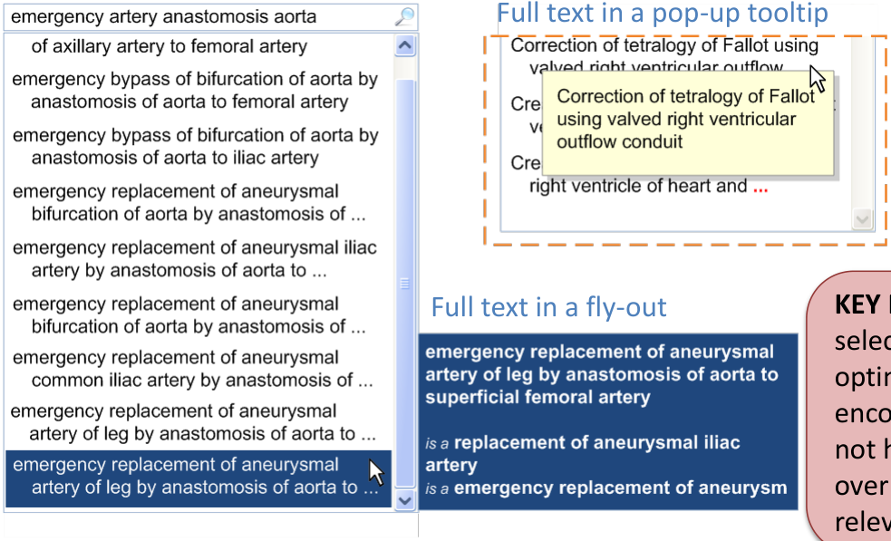

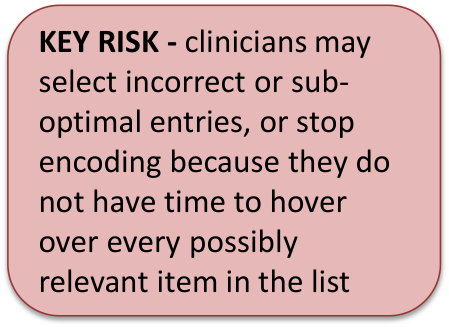

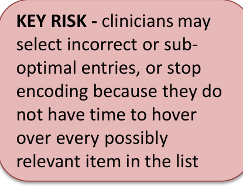

A fly-out for a selection list takes more space than a
tooltip but does not obscure other information in the list

18 December 2009 Copyright ©2013 Health and Social Care Information Centre Slide 63

to for truncated terms
### Access full text

Progressive disclosure can allow more than one truncated term to be
displayed in full without obscuring other information

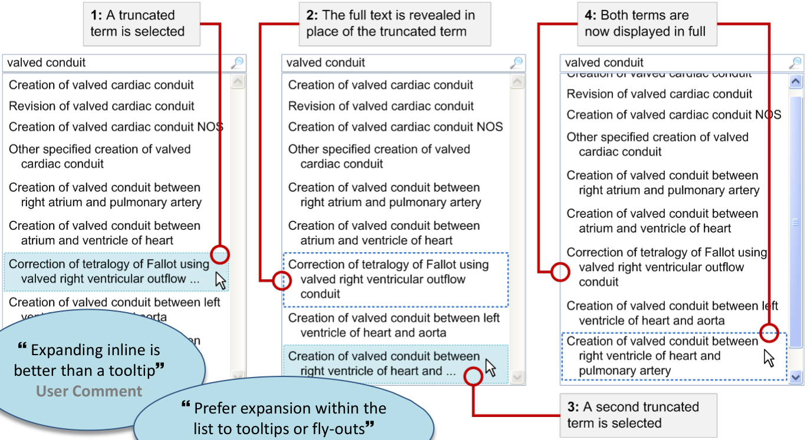

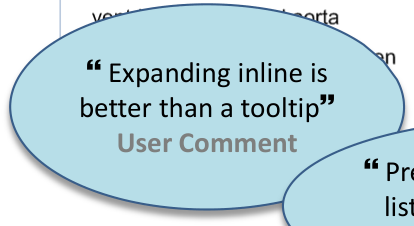

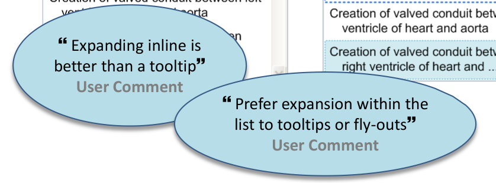

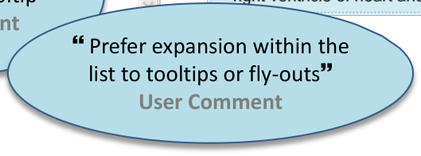

18 December 2009 Copyright ©2013 Health and Social Care Information Centre Slide 64

to for truncated terms
### Access full text

A control could be provided that allows all truncated terms in the list to be
revealed

18 December 2009 Copyright ©2013 Health and Social Care Information Centre Slide 65

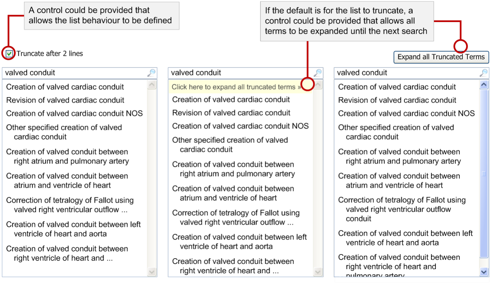
to for truncated terms
### Access full text
#### **Summary**

1. Fly-outs and pop-ups

a) Show the full text in place of or in close proximity to the truncated text
b) Hover is used to highlight an item in a selection list (immediately) and

display a fly-out (with a delay)
c) A fly-out for a selection list takes more space but does not obscure other

information in the list
d) A tooltip obscures other information in the same list or table

2. Expand inline

a) Allows more than one item to be displayed in full
b) Allows an item to be expanded in context without obscuring other

information

3. Expand all truncated terms

a) A control could be provided that allows all truncated terms in the list to be

expanded, either just this once or as a setting for the search results list

18 December 2009 Copyright ©2013 Health and Social Care Information Centre Slide 66

to for truncated terms
### Access full text

|Emerging Recommendations|Evidence|
|---|---|
|If it is possible that a list may contain truncated terms, allow the user to display the list without truncation|• If a list contains truncated terms, but the user is sufficiently familiar with those terms and they are truncated in places that allow them to be differentiated without revealing the full text, then it may be acceptable to work with the truncated list. If the user is not familiar with the terms, they may choose (and it is safer for them) to view the list without truncation|
|If it is possible that a list may contain truncated text, give the user control over the width of the list|• In many cases, this allows a simple and direct method of removing the truncation by resizing the list • Larger lists may be appropriate when reviewing long terms • When a list is resized, more text is displayed within them • _This recommendation aims to encourage the provision of_ _dynamic-width lists as far as possible until more work is_ _completed that can generate more specific_ _recommendations or guidance_|

18 December 2009 Copyright ©2013 Health and Social Care Information Centre Slide 67

to for truncated terms
### Access full text

|Emerging Recommendations|Evidence|
|---|---|
|Ensure that the full text of a truncated term is displayed and acknowledged before an action can be carried out on the selected term|• This guidance aims to ensure that the full text of a term is reviewed actively before any action is carried out on the selection|

18 December 2009 Copyright ©2013 Health and Social Care Information Centre Slide 68

to for truncated terms
### Access full text
#### **Areas / questions for further study**

##### • Assuming that the need to access full text for a truncated term is expected to be infrequent, are the methods of accessing full text explored here too complex? • When assessing design alternatives for accessing full text, consider the full process including the steps immediately before and after the display of truncated terms • The primary purpose of accessing full text is to support the process of comparing and selecting so there should be a focus on considering mis-selection risks • Emerging recommendations can be used to inform _further work on access to full text for truncated terms_

18 December 2009 Copyright ©2013 Health and Social Care Information Centre Slide 69

# Supporting Materials

The following additional supporting materials were used in the research of this area and creation of this
document

   - Working Documents

    - _Truncation Kick-off_ (PowerPoint)

    - Risk Assessment Presentation - _Truncation ORA 4_ _[th]_ _-Nov-2009_ (PowerPoint)

    - Risk Assessment Scenarios - _ORA Scenario_ (Visio)

    - Risk Assessment Design Alternatives - _ORA Design Alternatives_ (Visio)

    - Risk Assessment Findings - _ORA Findings_ (Visio)

    - Risk Assessment Findings (illustrations) - _Truncation ORA – Findings_ (PowerPoint)

    - _Truncation Design Log_ (Excel)

    - _Truncation Design Challenges_ (PowerPoint) (Visio)

    - _Truncation User Research Materials_ (PowerPoint) (Visio)

    - _User Research Notes_ (Word)

    - _Truncation Notes_ (Word)

    - User Research Findings - _NHS CUI CAPS Truncation user feedback Nov 2009 0.0.0.2_ (PowerPoint)

   - NHS CFH Documents

    - _Truncation – Master Hazard Log – v0.5 – 13 Nov 2009_ (Excel)

    - _CFH_Position-paper_Rules-for-truncation-and-wrapping-of-coded-clinical-data_v10_27-Jun-2008_
(Word)

    - Analysis of SNOMED CT terms (Excel)
[To obtain any of these supporting materials please contact cuistakeholder.mailbox@nhs.net](mailto:cuistakeholder.mailbox@nhs.net)

18 December 2009 Copyright ©2013 Health and Social Care Information Centre Slide 70

# Distribution

### Reviewers and Distribution

|Name|Position|Version Approved|Date|
|---|---|---|---|
|Mike Carey|NHS CFH Project Manager|0.2.0.0|17-Dec-2009|
|Tim Chearman|NHS CFH Project Lead|0.2.0.0|17-Dec-2009|
|Peter Johnson|Clinical Architect|0.2.0.0|17-Dec-2009|
|Frank Cross|Clinical Advisor|0.2.0.0|17-Dec-2009|
|Lindsey Butler|Clinical Safety Advisor|0.2.0.0|17-Dec-2009|
|Greg Scott|Clinical Advisor|0.2.0.0|17-Dec-2009|
|Priya Shah|Clinical Advisor|0.2.0.0|17-Dec-2009|

18 December 2009 Copyright ©2013 Health and Social Care Information Centre Slide 71

