# Noting Using Templates

<!-- TOC -->
<!-- TOC generated by Markdown All in One style -->

- [Noting Using Templates](#noting-using-templates)
    - [Design Consultation Document](#design-consultation-document)
    - [Executive Summary](#executive-summary)
    - [Problem Statement](#problem-statement)
    - [Scope Statement](#scope-statement)
        - [• Basic searching • Section search • Additional template search • Search on abbreviations • SNOMED CT® search trigger • Free text trigger • Browsing • Revisiting and adding templates • Reordering](#basic-searching-section-search-additional-template-search-search-on-abbreviations-snomed-ct-search-trigger-free-text-trigger-browsing-revisiting-and-adding-templates-reordering)
    - [Items Out of Scope](#items-out-of-scope)
        - [• Patient-specific decision support • Special data previewing functions • Any display of data beyond its initial entry • Printing of forms • Workflow management • Saving data • Actual form design (such as field layout)](#patient-specific-decision-support-special-data-previewing-functions-any-display-of-data-beyond-its-initial-entry-printing-of-forms-workflow-management-saving-data-actual-form-design-such-as-field-layout)
    - [Background to design consultation](#background-to-design-consultation)
    - [Patient Safety Process](#patient-safety-process)
    - [About this design consultation](#about-this-design-consultation)
    - [Assumptions](#assumptions)
    - [Brief outline of the themes](#brief-outline-of-the-themes)
    - [Design exploration themes](#design-exploration-themes)
    - [Glossary and acronyms](#glossary-and-acronyms)
  - [THEME 1 – BASIC SEARCHING](#theme-1-basic-searching)
    - [1.1 Introduction to Basic Searching](#11-introduction-to-basic-searching)
    - [1.2 Design summary](#12-design-summary)
    - [1.3 Design exploration](#13-design-exploration)
    - [1.4 Next steps](#14-next-steps)
    - [1.4 Future exploration](#14-future-exploration)
  - [THEME 2 – SECTION SEARCH](#theme-2-section-search)
    - [2.1 Introduction to Section Search](#21-introduction-to-section-search)
    - [2.2 Design summary](#22-design-summary)
    - [2.3 Design exploration](#23-design-exploration)
    - [2.4 Next steps](#24-next-steps)
  - [THEME 3 – ADDITIONAL TEMPLATE SEARCH](#theme-3-additional-template-search)
    - [3.1 Introduction to Additional Template Search](#31-introduction-to-additional-template-search)
    - [3.2 Design summary](#32-design-summary)
    - [3.3 Design exploration](#33-design-exploration)
    - [3.4 Next steps](#34-next-steps)
  - [THEME 4 – SEARCHING USING ABBREVIATIONS](#theme-4-searching-using-abbreviations)
    - [4.1 Introduction to Searching Using Abbreviations](#41-introduction-to-searching-using-abbreviations)
    - [4.2 Design summary](#42-design-summary)
    - [4.3 Design exploration](#43-design-exploration)
    - [4.4 Next steps](#44-next-steps)
  - [THEME 5 – SNOMED CT SEARCH TRIGGER](#theme-5-snomed-ct-search-trigger)
    - [5.1 Introduction to SNOMED CT Search Trigger](#51-introduction-to-snomed-ct-search-trigger)
    - [5.2 Design summary](#52-design-summary)
    - [5.3 Design exploration](#53-design-exploration)
    - [5.4 Next steps](#54-next-steps)
  - [THEME 6 – FREE TEXT TRIGGER](#theme-6-free-text-trigger)
    - [6.1 Introduction to Free Text Trigger](#61-introduction-to-free-text-trigger)
    - [6.2 Design summary](#62-design-summary)
    - [6.3 Design exploration](#63-design-exploration)
    - [6.4 Next steps](#64-next-steps)
  - [THEME 7 – BROWSING](#theme-7-browsing)
    - [7.1 Introduction to Browsing](#71-introduction-to-browsing)
    - [7.2 Design summary](#72-design-summary)
    - [7.3 Design exploration](#73-design-exploration)
    - [7.4 Next steps](#74-next-steps)
  - [THEME 8 – REVISITING AND ADDING TEMPLATES](#theme-8-revisiting-and-adding-templates)
    - [8.1 Introduction to Revisiting and Adding Templates](#81-introduction-to-revisiting-and-adding-templates)
    - [8.2 Design summary](#82-design-summary)
    - [8.3 Design exploration](#83-design-exploration)
    - [8.4 Next steps](#84-next-steps)
  - [THEME 9 – REORDERING](#theme-9-reordering)
    - [9.1 Introduction to Reordering](#91-introduction-to-reordering)
    - [9.2 Design summary](#92-design-summary)
    - [9.3 Design exploration](#93-design-exploration)
    - [9.4 Next steps](#94-next-steps)
    - [Areas/questions for further work and study](#areasquestions-for-further-work-and-study)
    - [Not included in this deck • Supporting material and evidence:](#not-included-in-this-deck-supporting-material-and-evidence)
      - [– Study ID 76: Executive Summary (September 2009) – Study ID 78: Executive Summary (November 2009) – Noting Using Templates Design Demonstrator](#study-id-76-executive-summary-september-2009-study-id-78-executive-summary-november-2009-noting-using-templates-design-demonstrator)
- [Distribution](#distribution)
    - [Reviewers and Distribution](#reviewers-and-distribution)

<!-- /TOC -->

Source PDF: [usingtemplates.pdf](../../pdfs/clinical-noting-and-terminology/usingtemplates.pdf)

### Design Consultation Document
_Prepared for_
**NHS Connecting for Health**
Version 1.0.0.0 Baseline
_Prepared by_
**Clinical Applications and Patient Safety Project**
**NHS CUI Programme Team**
**This document was prepared for NHS Connecting for Health which ceased to exist on 31 March 2013. It may contain references to organisations,**
**projects and other initiatives which also no longer exist. If you have any questions relating to any such references, or to any other aspect of the**
**[content, please contact cuistakeholder.mailbox@hscic.gov.uk](mailto:cuistakeholder.mailbox@hscic.gov.uk)**
### Executive Summary
**Problem**
  - Clinicians need only some of the clinical data entry structures (‘templates’) available to them in any
given situation
  - Clinicians risk missing the correct template, opening the wrong template or eschewing data structures
and entering free text
**Scope**
  - Assist the clinician accessing and then entering data into the relevant template in a safe, efficient and
timely manner
  - Focus upon the entry of an acute medical admissions form implied by the relevant headings defined by
the Royal College of Physicians
**Headline Findings**
  - To afford the clinician sufficient flexibility during admissions clerking, searching as well as browsing
must be considered in noting using templates
  - The UI may proactively offer templates (either by following the concept encoding or by matching terms
within free text)
  - The UI must be able to accommodate repeated use of certain data fields within the same template
  - Executive Summary
  - Table of Contents
  - Problem Statement
  - Scope Statement
  - Items Out of Scope
  - Background to design consultation
  - Patient Safety Process
  - About this design consultation
  - Assumptions
  - Brief outline of the themes
  - Design exploration themes
  - Glossary and acronyms
  - Themes
  - Areas/questions for further work and study
  - Not included in this deck
### Problem Statement
**Background**
Traditionally, secondary care clinicians have recorded notes directly on paper or dictated to an assistant. With the advent of electronic noting, clinicians increasingly need to record structured data using electronic systems, in order that the data can be safely accessed, displayed and queried.
**The Problems**
   - In free text, a lot of meaning can be conveyed (and implied) by a small number of characters.
Conversely, a lot of data fields may be required in order to capture the same meaning in structured data entry. This is particularly true of acute medical admission clerking, where, despite following standard high level topic areas, there could be much variation in the details captured. The UI must provide access to all these data fields
   - In natural language, the structures are stored and accessed in the user’s mind, whereas in
structured data entry, the UI needs to offer access to many data permutations. In effect, the onus for navigating and selecting entry components is shifted from the clinician’s mind, where most of the considerations are subconscious, to the UI, where the UI needs to offer options and the clinician needs to choose from them. This potentially introduces a big time penalty for capturing structured data
### Problem Statement
**The Problems (continued)**
   - Previous NHS CUI usability tests have shown that clinicians perceive electronic forms which
have been literally translated from paper to be unwieldy to use in the context of admissions clerking
   - Previous NHS CUI usability tests have shown that clinicians’ natural inclination is to type in a
string of words when noting
   - A form in which the data fields are arranged in a fixed order is not conducive to noting in
which different topics may be addressed in a number of different orders, depending upon factors such as the patient’s specific health problems and needs, the way in which the patient relays their history, and the noting style of the individual clinician. A traditional form design does not afford such flexibility
### Scope Statement
##### • Basic searching • Section search • Additional template search • Search on abbreviations • SNOMED CT® search trigger • Free text trigger • Browsing • Revisiting and adding templates • Reordering
### Items Out of Scope
##### • Patient-specific decision support • Special data previewing functions • Any display of data beyond its initial entry • Printing of forms • Workflow management • Saving data • Actual form design (such as field layout)
### Background to design consultation
This design exploration is based upon the notion that data structure has been defined in the form of data ‘templates’, that is, fixed configurations of data fields, some of which are constrained by the values that can be entered. Templates have a number of different meanings, not least in the health informatics field, but the term is used in a general way in this consultation.
In graphical user interface terms, the most conventional manifestation of templates would be as ‘forms’, where the data fields are presented to the user, typically as a set of boxes into which the user can type or select data. They could be manifested in other ways, such as constraining matches in a text parsing context, but typically they are presented as forms.
Forms may comprise sections and subsections, all of which contain fields. In this consultation document, we assume that any section or subsection is a template in its own right. That is to say, templates can be nested.
Although ‘template’ refers to a standalone unit of data structure, in the wider noting context we are not assuming that any template can be used in isolation. A form may comprise a number of sections, each of which constitutes a template, and these templates may be accessed as individual units within the context of the form. However, it does not follow that clinicians can access sections outside of the context of the form in which they belong.
### Patient Safety Process
The development lifecycle for this consultation document includes an integrated patient safety assessment and management process.
Known patient safety incidents relevant to this area have been researched and reviewed as part of ongoing development.
The Hazard Log records all the risks that have been identified during development and describes potential mitigatory actions that could be considered alongside future exploratory work in this area. The Hazard Log is a live document that will be updated as this area of work is developed further.
Until this work is progressed and developed to full design guide status it will not be in a position to achieve full Clinical Authority to Release (CATR) from the NHS Connecting for Health (CFH) Clinical Safety Group (CSG).
[Please refer to NHS Common User Interface for further information on the patient safety process](http://www.cui.nhs.uk/Pages/NHSCommonUserInterface.aspx) and for the safety status and any relevant accompanying safety documentation for this consultation document.
### About this design consultation
The purpose of the document is to summarize the current learning that has been achieved in the design and research process to date. This is articulated primarily in terms of the features that comprise the preferred current design. These design features aggregate into nine themes.
For each theme we summarise the key design points, plus the rationale for choosing these points. We then illustrate these with images of the current design, plus an indication of some of the alternatives we have been considering. We end each theme by outlining the proposed next steps and future exploration.
### Assumptions
 - Aspects of care can be documented within standalone data templates which can
be assembled to form a coherent patient record
 - The UI should encourage the user to complete a template rather than entering
free text, where appropriate templates exist
 - The UI will offer multiple routes for opening structured data templates:
    - Providing a means to browse the template
    - Providing a means to search for sections within the template
    - Allowing the clinician to open the whole template in a single action
    - Suggesting possible templates based upon terms that the clinician has entered
 - Appropriate search engine technology is available to support the searching
outlined in this consultation
 - Appropriate authorities will manage the creation of and access to appropriate
clinical templates
 - SNOMED CT is the chosen terminology in the NHS
 - The Royal College of Physicians (RCP) guidelines on acute medical admissions
clerking provide the standard high level structure for an admission template
### Brief outline of the themes
This design consultation is addressing several solutions which address the problem of accessing the appropriate template from within a large set of templates. These solutions are intended to be mutually compatible.
The **Basic searching** design topic addresses how clinicians can search for templates. It provides the foundation for the rest of the searching designs, which in turn address specific searching needs.
The **Section search**, which also includes the **Additional template search** and **Search on** **abbreviations** topics, is a particular type of search where the clinician can search for section headings within a form, in addition to finding additional templates.
Another way in which the clinician can access sections within the form is by **Browsing**, for example via a tree structure.
In addition to allowing the clinician to search for templates, the designs also address how the UI can proactively suggest templates based upon terms that the clinician has entered, either via a **SNOMED CT search trigger** or via a **Free text trigger** .
Finally, the design addresses some auxiliary features. It covers what happens if the clinician decides to revisit a template via the search or browse functions, and how the clinician can add more of the same fields ( **Revisiting and Adding templates** ). It also deals with how the clinician may reorder the sections according to a standard sequence ( **Reordering)** .
### Design exploration themes
|Themes|Key topics|
|---|---|
|**1. Basic searching**|Layout and ordering of search results|
|**2. Section search**|Accessing the feature; displaying results; inserting sections|
|**3. Additional template search**|Labelling; displaying alongside internal results|
|**4. Search on abbreviations**|Labelling; prioritisation in results|
|**5. SNOMED CT search trigger**|Triggering; display; access|
|**6. Free text trigger**|Tagging; display; access|
|**7. Browsing**|Location of browse; default visibility|
|**8. Revisiting and Adding templates**|Opening an existing section; opening new fields|
|**9. Reordering**|Standard reordering; reordering by entry|
### Glossary and acronyms
|Term/ Acronym|Details|
|---|---|
|**CF**|Clinical feedback: The designs were subjected to regular feedback from select members of NHS Connecting for Health|
|**CUI**|Previous or concurrent NHS Common User Interface (CUI) work: Where relevant, the designs take account of other NHS CUI work, such as guidance or design consultation|
|**EP**|Existing Practice: In creating the designs, we considered examples of existing practice, that is UI elements with existing software which perform similar actions (both within or without the health industry)|
|**PSA**|Patient Safety Assessment findings: The designs were subjected to a series of safety hazard assessments with healthcare professionals working in and with the NHS|
|**REQ**|User requirements: The designs have been based upon user requirements identified during early analyses of the design areas|
|**UR**|User research: The designs were tested with NHS healthcare professionals|
|**UX**|User experience input: The designs have been shaped by knowledge and principles from the user experience domain|
## THEME 1 – BASIC SEARCHING
### 1.1 Introduction to Basic Searching

This theme explores the necessary features required to provide the clinician with a means for searching for and opening clinical templates, primarily manifested as forms, of varying sizes, but also as section headings within forms.

Such a function would be intended to be used in a number of situations, including at the start of clerking a patient and in those contexts where the clinician is already entering notes and needs an additional template.

The designs in this theme explore the basic UI features that will comprise such a search function, including:

 - How to allow clinicians to type in the (criteria) search text

 - How to display the results

 - How to filter the results, including displaying the current filter

 - How to display relevant metadata

 - How to search on metadata, such as structure (for example, section headings) within the form

 - How to browse between and within search results

|Col1|Col2|Col3|
|---|---|---|
||||
||**Example of a filtering control**||

|Col1|Col2|Col3|
|---|---|---|
||||
||**Example of a metadata display**||

18 December 2009 Copyright ©2013 Health and Social Care Information Centre Slide 16

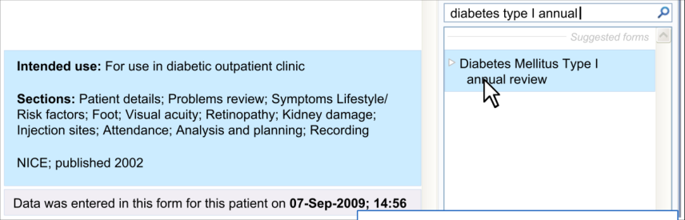

### 1.1 Introduction to Basic Searching

**Note** : Although this design consultation focuses upon admissions clerking, the designs in Theme 1 may also apply to template searching in general.

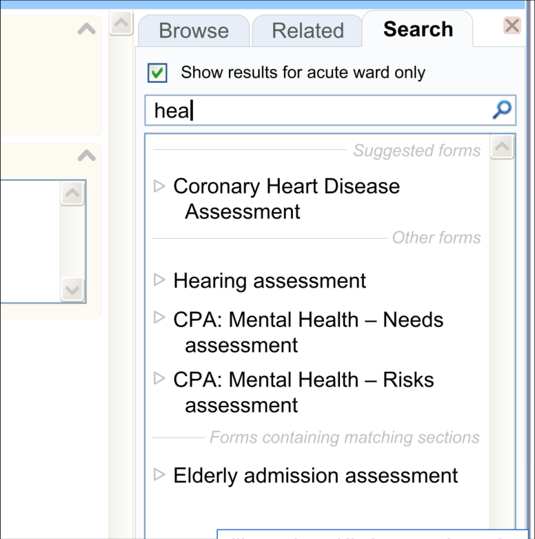

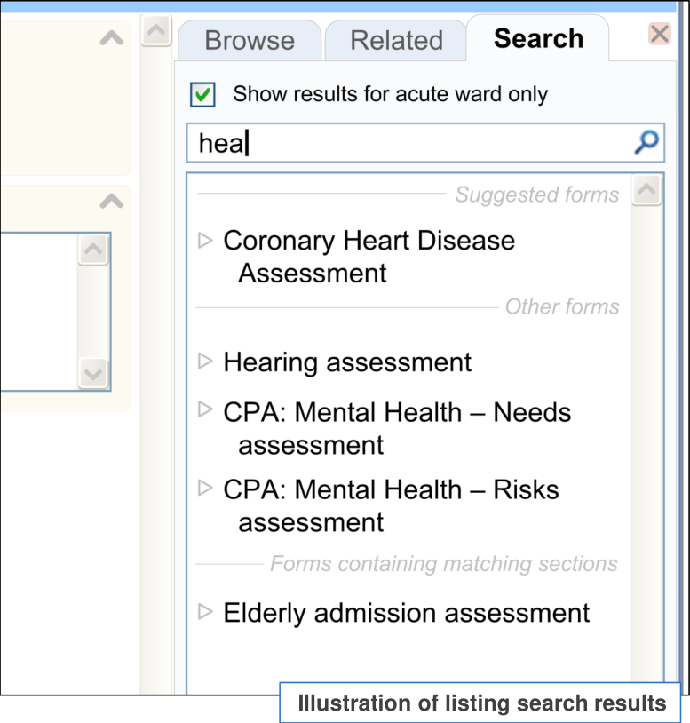

18 December 2009 Copyright ©2013 Health and Social Care Information Centre Slide 17

### 1.2 Design summary

|Design point|Rationale key points|
|---|---|
|The UI provides a search entry field which supports progressive matching|This type of search mechanism has many precedents on the Internet and will be familiar to clinicians (EP)   User research confirmed that clinicians understand how to use this mechanism (UR)|
|The template options are matched according to phrase similarity: • That is, the search engine matches the text entered by the clinician against the text in the template labels|This type of search mechanism has many precedents on the Internet and will be familiar to clinicians (EP)   Also, this type of searching has been shown to work in previous CUI research (for example, searching for SNOMED CT terms or for drugs) (UR)|
|The search features ‘fuzzy’ matching|Clinicians will not necessarily know the exact names of templates or sections, so some flexibility needs to be accorded their search (CF)   Fuzzy matching, such as ‘stem’ matching, is a common feature on Internet search features and may be expected (EP)|

Key to abbreviations (slide 14)

Slide 18 18 December 2009 Copyright ©2013 Health and Social Care Information Centre

### 1.2 Design summary

|Design point|Rationale key points|
|---|---|
|The UI allows searching by section heading as well as by template title|Clinicians may not know the exact title of the template they require, but may know what sections would be contained within it (CF)   Must reduce the risk of the clinician being unable to find a template or choosing the wrong template (PSA)   Clinicians understood the concept of searching by section, although the specific labeling of the feature was unclear. The primary focus should be on the template titles matching (UR)|
|The UI does not allow the user to search by fields: • Unless there is an appropriate use case • Field searches could be achieved by a separate 'Find' function|Searching for and opening a single field will rarely be required and could be risky due to the lack of resulting context surrounding the field (CF)|
|The UI is able to search for any size of template|Templates can vary significantly by size, from small templates for capturing measurement values through to large templates, such as the acute medical admission form (CF)|

Key to abbreviations (slide 14)

Slide 19 18 December 2009 Copyright ©2013 Health and Social Care Information Centre

### 1.2 Design summary

|Design point|Rationale key points|
|---|---|
|The results are filtered according to context: • For example, by a local filter which could account for the clinician’s specialty, division or department • For example, by the specific stage in the patient’s treatment|There is a risk of the clinician choosing a template out of context, unless filtering is applied. Completing the wrong template could adversely affect future interpretations of the patient’s health (PSA) (UX)   The concept of filtering was supported by the clinicians tested (UR)|
|The filtering includes rather than excludes generic templates|Generic templates, such as a general medical admission form, may be missed if filtering means that only domain-specific templates are selected (UR)|
|The current filter label is displayed as part of the filter adjustment control|User research indicated the importance of clearly communicating the current filter, plus a control for adjusting (for example, breaking out of) the filter (UR)|
|The results are ordered by phrase similarity|Research within other areas of CUI have revealed that clinicians understand ordering by phrase similarity (CUI)|
|The list only displays a maximum number of results by default: • Meanwhile a widget is provided which reveals more results|Depending upon the search criteria, the search could return any number of results. The space available will necessarily limit the number of results that can be displayed simultaneously. Also, showing more than several at a time can reduce the user's ability to find what they need. Therefore, although the search could return any number of results, only a set number are shown in the initial view(CF)|

Key to abbreviations (slide 14)

Slide 20 18 December 2009 Copyright ©2013 Health and Social Care Information Centre

### 1.2 Design summary

|Design point|Rationale key points|
|---|---|
|The search field is located above the results list|Allows the clinician to easily recognize the association between the search control and the template that has been returned (UX)   This is standard practice in search features (EP)|
|The results are displayed in a vertical list|The template labels returned must be visually presented as to allow scanning and comparison between them in order to reduce the risk that they choose the wrong template (PSA)   Allows the clinician to easily recognize the association between the search control and the template that has been returned (UX)   This is standard practice in search features (EP)   The stacked approach was endorsed by user research (UR)|
|The template labels are not truncated in the results list: • Instead, the label wraps, with a slight indent on the second line and any subsequent lines|Avoiding truncation of labels in searches is an early conclusion in the emerging CUI design on truncation’(CUI)|

Key to abbreviations (slide 14)

Slide 21 18 December 2009 Copyright ©2013 Health and Social Care Information Centre

|.2 Design summary|Col2|
|---|---|
|**Design point**|**Rationale key points**|
|The UI displays and allows searching on appropriate metadata for each template: • Where appropriate metadata exists • May include section headings, version details and other contextual details   |There is no universal convention for labelling templates and, even if there were, it is unlikely that an authority would be able to create one where every label can clearly and unequivocally communicate exactly the configuration of fields it contains. Metadata provides a further means of identifying the suitability of a template (CF)   Clinicians agreed that access to certain metadata will be useful in identifying templates, although the template title is probably sufficient in the default view (UR)|
|Any metadata is displayed in a fly-out: • Appears upon hover and/or keyboard focus of a template option • Will be able to deal with data of varying lengths|Displaying additional (meta) data in a fly-out is consistent with previous CUI designs, such as SNOMED CT matching (CUI)   User research suggested that clinicians preferred meta-data to be shown in a fly-out, partly owing to problems with alternative designs (UR)|
|Any matched metadata text is highlighted|Sometimes there could be much metadata (for example, if there are many section headings). The clinician must quickly identify their search terms within this data (UX)   There are precedents for highlighting search terms in existing online search features (EP)   User research indicated a need for showing the connection between the search criteria and the metadata (UR)|

Key to abbreviations (slide 14)

Slide 22 18 December 2009 Copyright ©2013 Health and Social Care Information Centre

### 1.2 Design summary

|Design point|Rationale key points|
|---|---|
|The UI distinguishes 'suggested' matches|Local policy may promote certain templates over others, and this mechanism allows them to do this (CF)|
|The search supports synonym matching: • Synonyms would be created and managed by an appropriate authority (for example, the NHS)|User testing revealed that often the term for which the clinician is searching is not an exact match for the template label (for example, clinicians may search for the word ‘examination’ or ‘o/e’ instead of the word ‘observations’) (UR)|
|The UI displays a message where no matches are returned|The UI must be able to deal with no templates being returned. In this case, it must communicate this to the user and must suggest ways in which the user may find what they seek (CF)   This need for such a message was supported by user research (UR)|
|The UI allows the clinician to browse within the search results, including viewing sections and subsections of each template|A mechanism for browsing within search results was understood by clinicians (UR)|

Key to abbreviations (slide 14)

Slide 23 18 December 2009 Copyright ©2013 Health and Social Care Information Centre

### 1.3 Design exploration

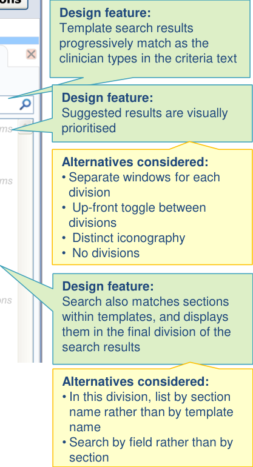

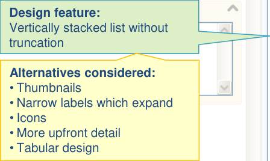

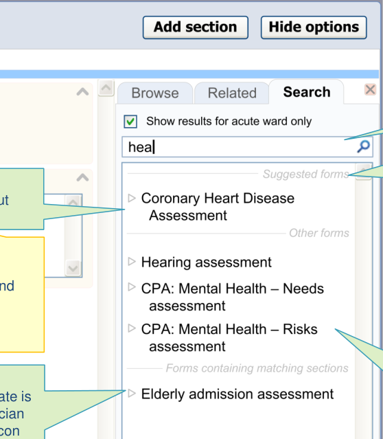

**Design feature:**

to browse within the structure, although they can only select the whole template (rather than any individual section)

Slide 24 18 December 2009 Copyright ©2013 Health and Social Care Information Centre

### 1.3 Design exploration

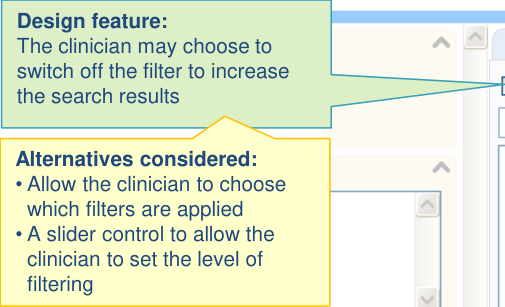

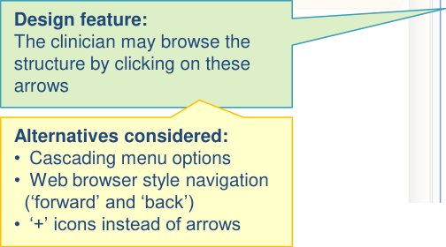

**Design feature:** The feature automatically filters the results, based upon the clinician context

**Design feature:** Labels are wrapped, instead of truncated

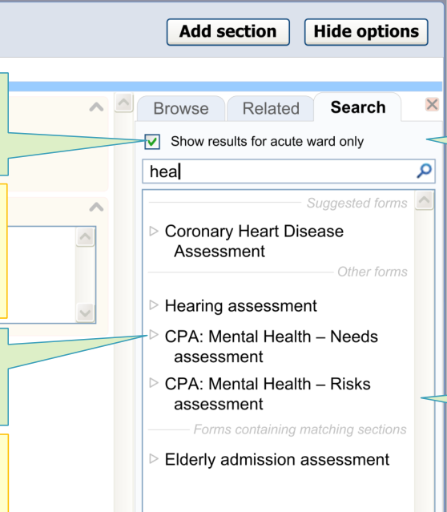

Slide 25 18 December 2009 Copyright ©2013 Health and Social Care Information Centre

### 1.3 Design exploration

         - Display the metadata in the main list

         - Slider control to reveal/hide meta-data details

         - Fisheye within the main list

        - Separate dialog boxes to display meta-data

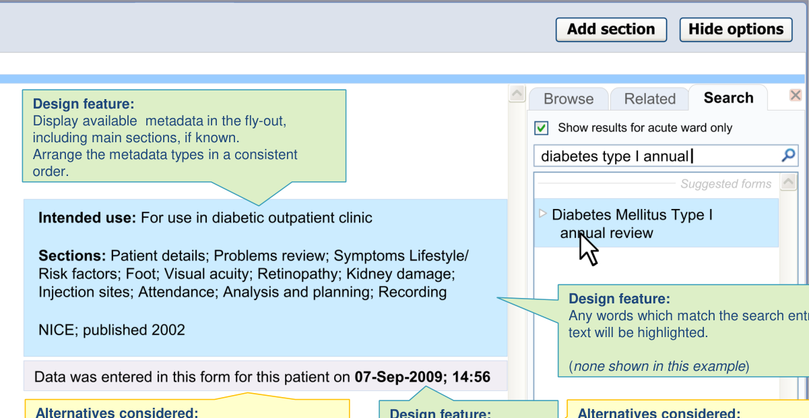

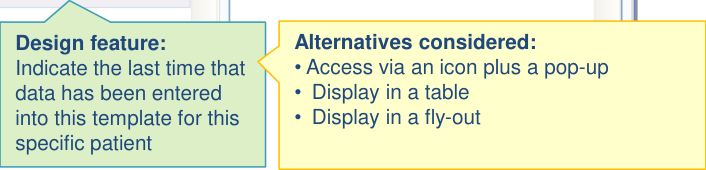

Slide 26 18 December 2009 Copyright ©2013 Health and Social Care Information Centre

### 1.4 Next steps

  - Validate assumptions around the availability of templates, including understanding
what templates could be available according to the Logical Record Architecture roadmap

  - Explore and refine guidance around search logic. Further define the high level rules

  - Test the usability of the filter function and confirm assumptions around what contextual
information can be used automatically by the UI

  - Evaluate the use of the template search function within the context of the acute
medical admission clerking. In the current designs, this function is featured in the righthand panel. Further testing is required to understand its potential use in relation to the other search and match features offered by the design

  - Further explore the concept of browsing within search results. This was deemed to be
worthy of further exploration by the user research

Slide 27 18 December 2009 Copyright ©2013 Health and Social Care Information Centre

### 1.4 Future exploration

  - Explore the utility and feasibility of searching on fields and possible field values within
templates (for example, search on ‘stridor’, which is a possible selection value rather than a field or section)

  - Validate the use of metadata. Given its potential utility, assess how feasible the
creation and maintenance of such data would be in future

  - Explore the management of suggested and/or prioritised templates

  - Explore the interaction between this feature and wider knowledge and decision
support mechanisms

18 December 2009 Copyright ©2013 Health and Social Care Information Centre Slide 28

## THEME 2 – SECTION SEARCH

18 December 2009 Copyright ©2013 Health and Social Care Information Centre Slide 29

### 2.1 Introduction to Section Search

This theme tackles a problem with offering someone a large template, namely the time taken to navigate around it to find the section and fields that one needs, in the order in which one needs them.

One solution is to provide a visual browsing mechanism (such as a tree). However, another solution is to provide a search function that allows the clinician to search for sections and subsections within the template. In this way, it starts to replicate the clinician’s current noting behaviour: namely entering a heading and then entering notes below it.

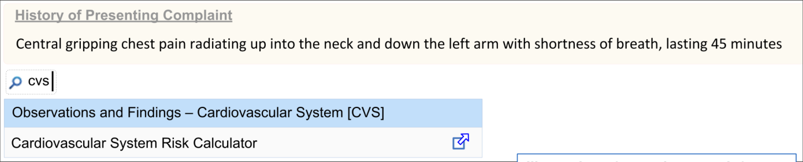

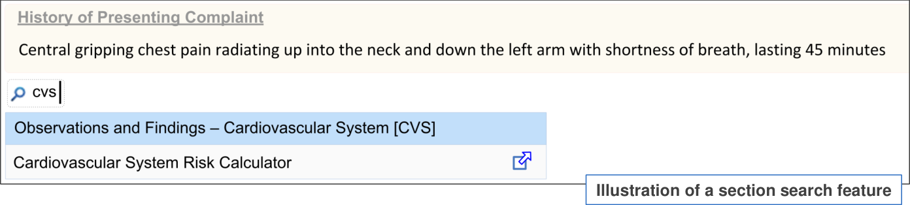

The designs in this theme assume an initial situation where the clinician has opened the admissions noting page and it is blank (or possibly there are one or two default sections already there, such as ‘Presenting Complaint(s)’).

It addresses how clinicians can add and complete sections of the acute medical admissions form to the noting page incrementally, by typing in search text.

It builds on the designs explored in the Basic searching exploration.

18 December 2009 Copyright ©2013 Health and Social Care Information Centre Slide 30

### 2.2 Design summary

|Design point|Rationale key points|
|---|---|
|Sections and subsections can be inserted in any order|Clinicians may enter medical admission data in multiple ways, depending upon the clinician encounter (UR) (CF)|
|The UI allows the user to choose which sections or subsections they open and which they do not|The Royal College of Physicians’ (RCP) standard acute admissions headings will imply more content than is typically needed within an individual clinical situation (CF)|
|Encoding is not a required precursor for offering templates|Forcing an encoding first could be unintuitive and could result in users not completing structured templates (PSA)|
|There are multiple ways to access the section search: • Clicking into white space outside of a section • Clicking a button at the top of the page • Pressing a key combination|Users intuitively clicked into the next available white space and start typing headings (UR)   Users also felt it is necessary to have an explicit control for inserting a heading, such as a button (UR)   A key combination is an appropriate method where the user is not using a mouse (UX)|
|We are considering offering a right-click mechanism for accessing templates, where possible|When searching for templates within free text, some users intuitively right-click to find a contextual menu which will offer a template (UR)|

Key to abbreviations (slide 14)

18 December 2009 Copyright ©2013 Health and Social Care Information Centre Slide 31

### 2.2 Design summary

|Design point|Rationale key points|
|---|---|
|The search results are ordered primarily by word similarity|The list will be ordered in a way that is meaningful to the user (REQ)|
|Synonyms are required to assist the search|Users searched on terms such as ‘o/e’ and ‘examination’, which yielded no results as the RCP headings use the prefix ‘Observations and Findings’ (UR)|
|The search text disappears after template chosen (or upon click away or <ESC>)|Without this feature, users had problems closing the results list. They tried to click away (UR)|
|The section search feature closes after inserting a template|The assumption is that the user will find a template, then complete it, rather than searching for another template (CF)|
|Upon opening a section, the UI shows where in the template structure it is located|To reduce the risk that the user enters data into the wrong section (PSA)|

Key to abbreviations (slide 14)

18 December 2009 Copyright ©2013 Health and Social Care Information Centre Slide 32

### 2.2 Design summary

|Design point|Rationale key points|
|---|---|
|The sections are appropriately labelled, so that they are uniquely identifiable: • Templates labels comprise a composite of the immediate section label and the super-section label (‘breadcrumb’ style)|A field could exist under multiple headings, but the different contexts could imply different meanings (CF) |
|The UI does not allow sections to be inserted into other sections, except where the data structure allows it|The current design follows the Royal College of Physicians’ guidelines on record keeping in acute admissions. Inserting a section into another section could affect its meaning in such a way that could lead to misinterpretation between author and subsequent reader (CF)|

Key to abbreviations (slide 14)

18 December 2009 Copyright ©2013 Health and Social Care Information Centre Slide 33

### 2.3 Design exploration

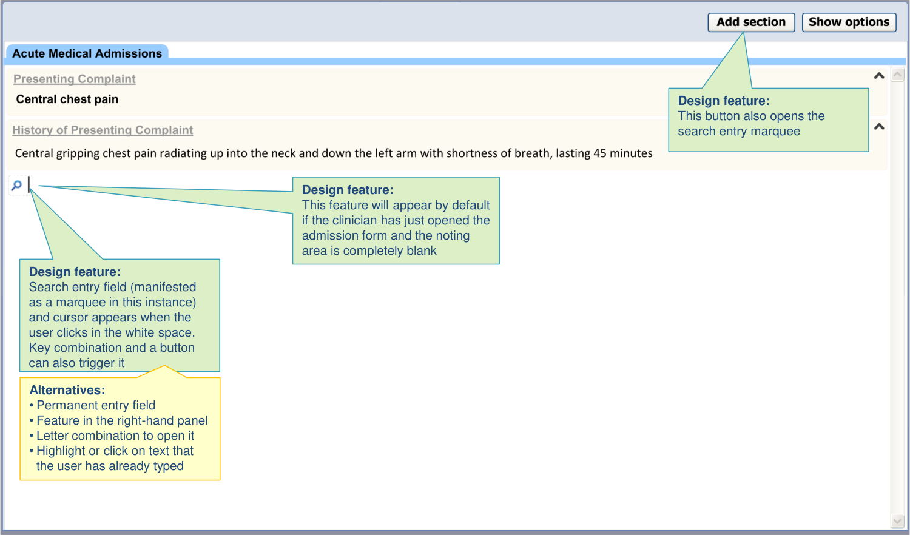

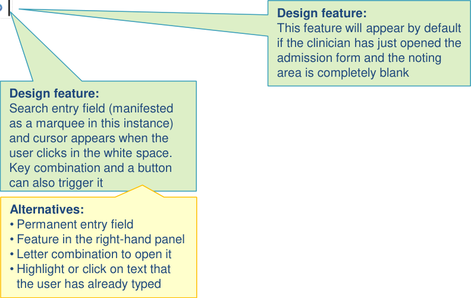

18 December 2009 Copyright ©2013 Health and Social Care Information Centre Slide 34

### 2.3 Design exploration

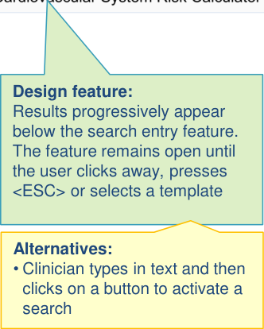

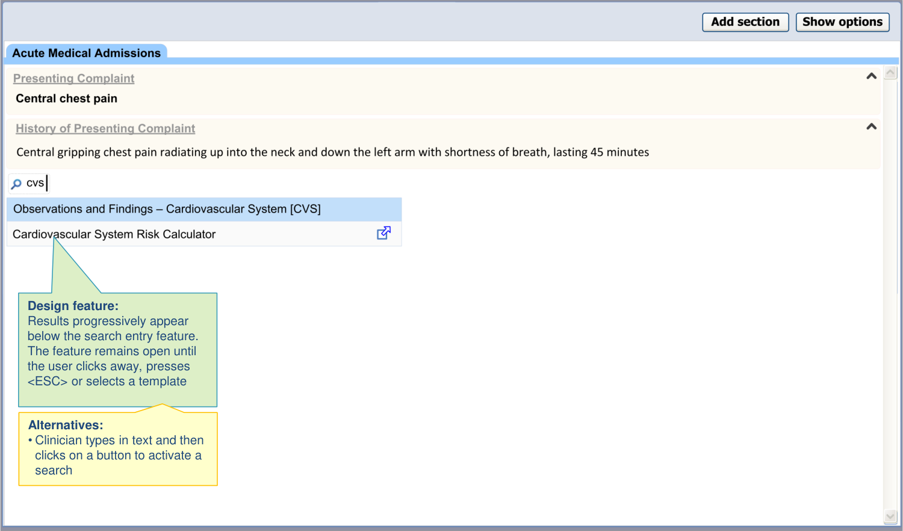

18 December 2009 Copyright ©2013 Health and Social Care Information Centre Slide 35

### 2.3 Design exploration

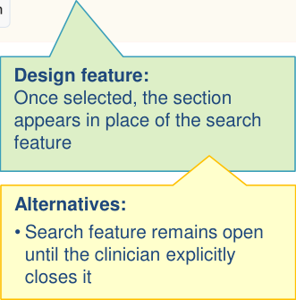

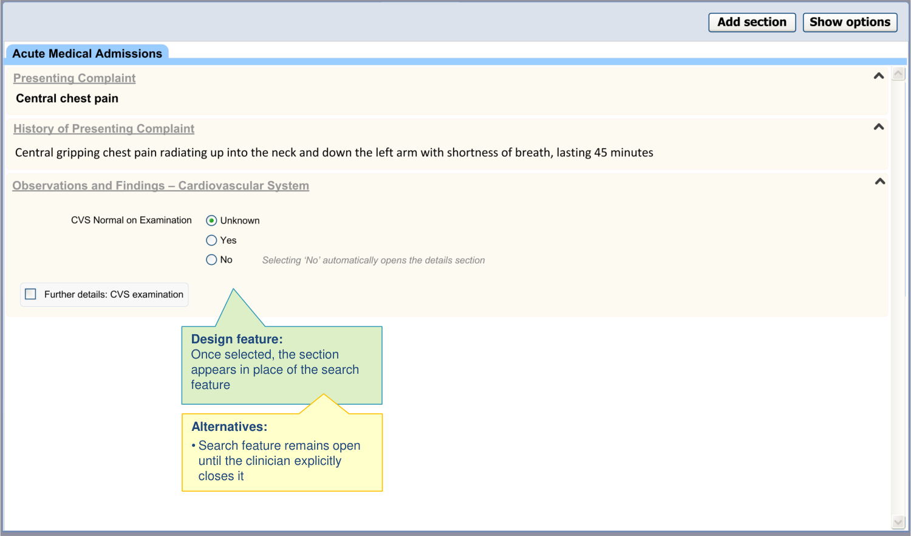

18 December 2009 Copyright ©2013 Health and Social Care Information Centre Slide 36

### 2.4 Next steps

**Next steps:**

  - Confirm the usability of opening the section search by clicking in white space

**Future exploration:**

  - Further explore the interaction between the section search, the right-hand template
search and the suggested templates (such as single concept matching and narrative triggers)

  - Explore the use of a right-click driven contextual menu for use in situations that can
accommodate such a control

  - Better define the need for synonyms in the section search

18 December 2009 Copyright ©2013 Health and Social Care Information Centre Slide 37

## THEME 3 – ADDITIONAL TEMPLATE SEARCH

18 December 2009 Copyright ©2013 Health and Social Care Information Centre Slide 38

### 3.1 Introduction to Additional Template Search

There may be points within the admission clerking process where the clinician needs to access additional templates, such as a score or a risk calculator. In this respect, templates built for medical admission clerking tend to be wide-reaching, but not exhaustive. We predict that a proportion of the noting will require templates which do not belong to the core template.

However, we assume that clinicians will not necessarily know which data structures belong within the core template and which are additional templates. Therefore, the designs assume that additional templates can be accessed in the same way as the core sections.

Nevertheless, the additional templates will open outside of the core admission template, and therefore, to avoid confusion, the clinician should be aware that there is a distinction between core and additional templates. Therefore, the designs:

 - Show how the clinician can access additional templates during admission clerking

 - Show how to display additional templates results in the (section) search feature

 - Distinguish core from additional templates

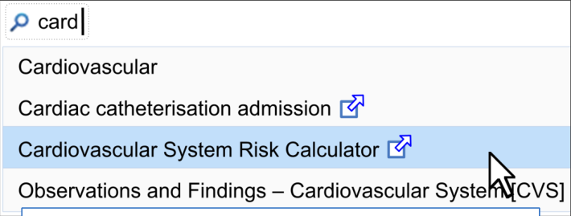

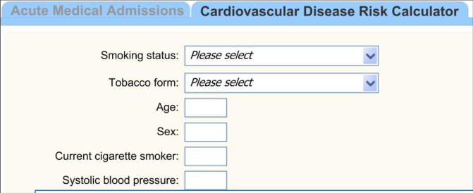

|Col1|Col2|Col3|
|---|---|---|
||||
||**Illustration of additional templates in search results**||

|Col1|Col2|
|---|---|
||**Illustration of an additional template opened in a** **new tab**|

18 December 2009 Copyright ©2013 Health and Social Care Information Centre Slide 39

### 3.2 Design summary

|Design point|Rationale key points|
|---|---|
|The UI allows access to additional templates from within the admission form|Users may wish to complete templates, such as scores or detailed examination templates, which are not part of the core acute medical admission form (REQ)   Some headings could require significantly different data structures depending upon the patient’s circumstances, for example, in the Family History section (REQ)|
|The additional template search is provided through the same mechanism as the core section search|This has been done for the sake of convenience: to reduce the number of mechanisms. Also, the user may not be aware what is or is not included in the admission form (UX)|
|The additional and core template search results are displayed in same list and are ordered without bias to either category|Splitting the ‘core' from the ‘additional‘ templates as done in the test design (horizontal dividing lines and right-aligned headers) risks the user missing the lower, additional template results. Users may assume that the matches in the lower half are not well matched (UR)|
|The additional template search results are distinct from the core template results:  • For example, by featuring an icon next to the additional template search results|Clinicians felt that this would be the most appropriate mechanism, if these core and additional results are combined in a single list (CF)   This use of iconography has its origins in web conventions (UX)|

Key to abbreviations (slide 14)

18 December 2009 Copyright ©2013 Health and Social Care Information Centre Slide 40

### 3.2 Design summary

|Design point|Rationale key points|
|---|---|
|The additional templates are labelled upon access|It is good UI practice to clearly label forms and fields, especially as the additional templates are not part of the standard structure of the admissions notes (UX)|
|The additional templates are not inserted into sections with the admissions form: • However, the system may link these templates to the terms which triggered them (where appropriate)|The design aims to follow the standard RCP headings and the NHS CCS data structures where appropriate (CF)   Inserting a template under a heading may assign it new meaning, either in the mind of the author or the reader (UX)|

Key to abbreviations (slide 14)

18 December 2009 Copyright ©2013 Health and Social Care Information Centre Slide 41

### 3.3 Design exploration

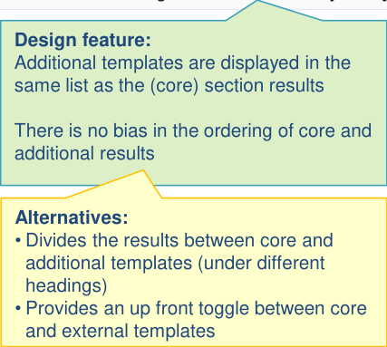

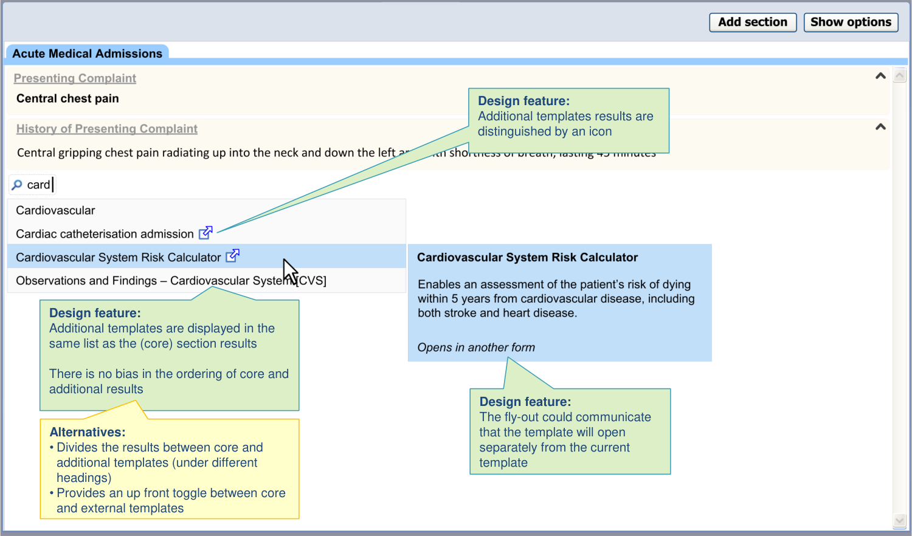

18 December 2009 Copyright ©2013 Health and Social Care Information Centre Slide 42

### 3.3 Design exploration

18 December 2009 Copyright ©2013 Health and Social Care Information Centre Slide 43

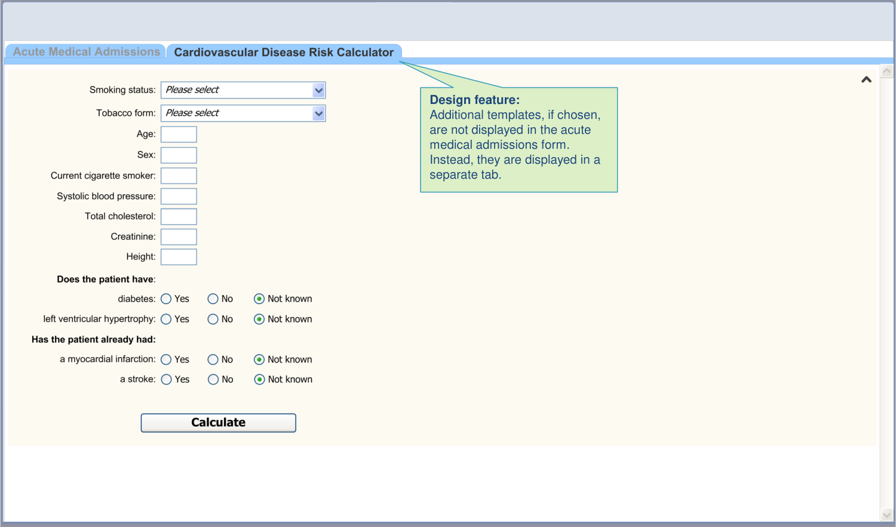
### 3.4 Next steps

**Immediate next steps:**

  - Further investigate the usability of returning additional template results in the same list
as internal template results

  - Confirm the usability of distinguishing additional from core template results by way of
an icon

  - Investigate whether clinicians understand the difference between additional and core
templates and what are the consequences of them not recognising the difference

**Future exploration:**

  - Explore the linkages between a given template (such as the acute medical admissions
form) and additional templates. Should the templates feature visible linkages, and, if so, how?

  - Explore if additional templates can safely be inserted into a given form

  - Explore if there are circumstances where additional templates could replace sections
within the acute admissions form (for example, if the patient has a need for a specialist examination). How would these be inserted into the form? Should they then be represented within the browseable tree structure?

18 December 2009 Copyright ©2013 Health and Social Care Information Centre Slide 44

## THEME 4 – SEARCHING USING ABBREVIATIONS

18 December 2009 Copyright ©2013 Health and Social Care Information Centre Slide 45

### 4.1 Introduction to Searching Using Abbreviations

One of the values that clinicians can immediately see from electronic noting is the use of ‘acceleration’ facilities, such as ‘hot keys’ and shorthand codes. The current search can benefit from the use of ‘abbreviation’ search.

The designs show how the clinician can type in certain abbreviations of section labels. The search engine deals with the abbreviations in a similar way to other synonyms of the section labels.

For example, the clinician may type ‘PMH’ and the system will offer ‘Past Medical History’ in the results.

|Illustration of a search by abbreviation|Col2|Col3|
|---|---|---|
|**Illustration of a search by abbreviation**|**Illustration of a search by abbreviation**|**Illustration of a search by abbreviation**|
||||

18 December 2009 Copyright ©2013 Health and Social Care Information Centre Slide 46

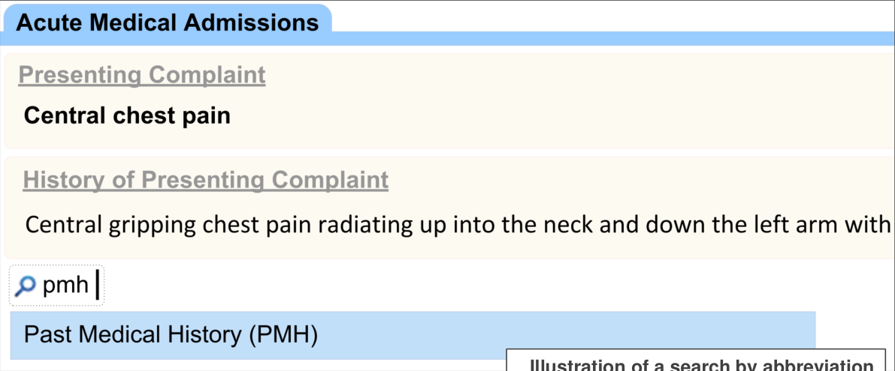
### 4.2 Design summary

|Design point|Rationale key points|
|---|---|
|The user can search on predefined abbreviations   The results found by abbreviations are prioritised over other search criteria|Being able to search using abbreviations will provide immediately perceived value for the user (CF)|

Key to abbreviations (slide 14)

18 December 2009 Copyright ©2013 Health and Social Care Information Centre Slide 47

### 4.3 Design exploration

|Design feature: The user can search on abbreviation. Abbreviation matches are prioritised to the top of the results list|Col2|Col3|
|---|---|---|
||**Alternatives:** • Features a separate search facility for abbreviations • Provides an up front toggle between full word and abbreviation searching ||

18 December 2009 Copyright ©2013 Health and Social Care Information Centre Slide 48

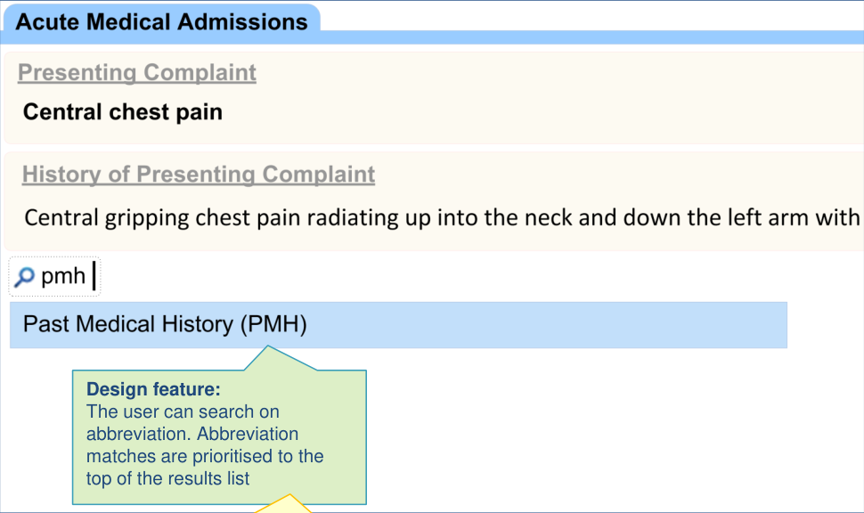
### 4.4 Next steps

**Next steps:**

  - Explore the feasibility of a look-up list so that the user can browse the abbreviation
labels for each section. Consider providing abbreviation labels in the existing browse section

**Future exploration:**

  - Explore whether abbreviations should be provided for additional templates as well as
core templates (that is, sections within the admissions clerking form)

  - Explore how the user can customise their own abbreviations and the safety implications
of allowing them to do this

  - Explore the implications of localised abbreviations

  - What would the rules be regarding the vocabulary of abbreviations in these situations?

Copyright ©2013 Health and Social Care Information Centre 18 December 2009 Slide 49

ial

## THEME 5 – SNOMED CT SEARCH TRIGGER

18 December 2009 Copyright ©2013 Health and Social Care Information Centre Slide 50

### 5.1 Introduction to SNOMED CT Search Trigger

As part of electronic clinical noting, there may be many occasions where the clinician records a key clinical term (such as an individual problem or procedure), and they may do this meaningfully and efficiently by searching for and selecting an appropriate SNOMED CT term. Sometimes the clinician may enter several such terms sequentially (such as when they are listing items, such as in a past medical history).

Associated with certain terms may be one or more templates which, for example, may allow the clinician to enter further details and values relating to the term. For example, if the clinician indicates that the patient may have deep vein thrombosis, the template may offer them a Wells’ Score to further assess this diagnosis.

|Col1|Col2|Col3|
|---|---|---|
||||
||**Illustration of a suggested template list**||

By suggesting templates, the UI may also reduce the risk that the clinician enters those further details as free text (for example, in an ‘additional details’ free text field).

For example if the clinician has performed an arterial blood gas analysis, it is preferred that they enter the results in a form rather than as free text. The UI can encourage this by suggesting the relevant templates once the clinician has entered the term ‘arterial blood gas analysis’.

18 December 2009 Copyright ©2013 Health and Social Care Information Centre Slide 51

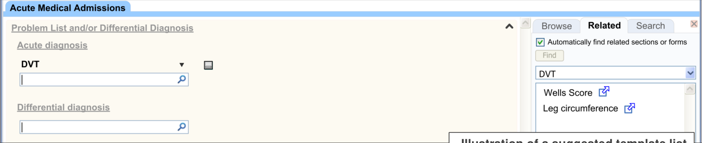
### 5.2 Design summary

|Design point|Rationale key points|
|---|---|
|The UI offers templates related to a recently encoded term|This is one way in which UI can encourage users to enter data in a structured manner, which brings huge benefits of data organisation and retrieval (CF)   Encoded terms (such as in SNOMED CT) carry sufficient meaning that it is safer to link them to specific templates, with less risk of ambiguity than simply running searches against free text (UX)   Clinicians were positive about the concept of the UI automatically offering template suggestions based upon their input (UR)|
|It automatically ‘pushes’ template options, in addition to allowing the user to request them ('pull')|If the system does not provide prompts of related templates, there is the potential to miss essential assessments related to the original clinical problem (CF)   There are precedents in the medical arena, such as popular GP systems (EP)|
|It can offer more than one template for a single term|We assume that, in some cases, an encoded term could have several templates associated with it (CF)|

Key to abbreviations (slide 14)

18 December 2009 Copyright ©2013 Health and Social Care Information Centre Slide 52

### 5.2 Design summary

|Design point|Rationale key points|
|---|---|
|The UI ensures the suggestions are sufficiently prominent: • Right hand side panel • Does not rely upon a hover over • Drop-down to select terms • Not at header or footer of the page • Template options for a term persist in the panel until clinician chooses another term • The feature is non-modal (that is, it does not force the clinician to interact with it)|Users may not wish to open a related template immediately after encoding a term, so the ability to browse the related templates some time after encoding is important (CF)   Users may not expect suggestions to appear on the left-hand side (PSA)   The footer location is too hidden and displaying at the top would preclude a conventional list, unless initially hidden (UX)|
|Templates are filtered according to context|Lack of contextual constraints in offering templates could result in inefficient noting due to the time taken to search for templates (CF)|
|Templates are displayed in a vertical text list|This format is familiar to clinicians, is flexible and economical (UX)|
|The UI visually links templates to trigger words|The clinician may be confused as to why or how to use the suggested template if they do not realize what term triggered it (UX)|
|The UI is able to deal with ‘no templates found’|We assume that only a proportion of encoded terms will be appropriate triggers for a template and some encoded terms distinctly preclude a template (CF)|

Key to abbreviations (slide 14)

18 December 2009 Copyright ©2013 Health and Social Care Information Centre Slide 53

### 5.2 Design summary

|Design point|Rationale key points|
|---|---|
|The suggestions do not obstruct the noting task|User must not be unduly distracted from the task of noting by the task of opening templates (CF)|
|The interface does not become too cluttered: • Does not cumulatively build up a single list • Does not disrupt the ability to scan a list of matched terms|There is a risk of information overload, confusion and frustration when suggesting templates/forms (PSA)   Building up the results in a single list as terms are being encoded could produce a very long list (CF)   Users did not like templates being offered in-line, where they obstructed scanning the main notes (UR)|
|The UI emphasises that suggestions are optional|There is a risk that clinicians rely on the template suggestions as diagnostic support (PSA)   There is a risk that the user feels obliged to complete templates just because they are offered to them, even though the specific circumstance may not require them (PSA)|
|The template matching accounts for post-coordination (for example, contextual wrappers)|In some cases, the UI will need to present templates for postcoordinated expressions. The majority of these are contextual wrappers. For example, if the user types 'Family history of Cystic Fibrosis', they would expect templates that are matched to the resulting post coordinated SNOMED CT expression (CF)|

Key to abbreviations (slide 14)

18 December 2009 Copyright ©2013 Health and Social Care Information Centre Slide 54

### 5.2 Design summary

|Design point|Rationale key points|
|---|---|
|Templates can be opened by default: • If there is only a single template available • If it is assumed that the user will need to complete it • And the user can then 'opt out' rather than 'opt in‘   Observables, such as arterial blood gases, are a good example of terms which may have default templates|In some cases, such as the entry of measurement values, it is vital that the clinician enters the values as structured data. If not, important values may be missed in later analysis (PSA)   In these cases, the UI should be able to force the user to either complete or opt out of a template (CF)|
|Access to suggested templates is also provided in one of two ways in the main noting area: • By a hover-over which appears upon mousing-over or focusing on a matched concept • By a button located adjacent to the matched term|Users did not immediately notice the templates being suggested on the right-hand side, although some felt that it was good for them to be sufficiently unobtrusive (UR)   A button could be easier for the user to understand and operate (UX)|
|Options are shown to the right of the matched term to minimise obstruction of other terms in a list|There is a risk that displaying a floating menu adjacent to a term matched by the single concept matching control in a list could obscure other items in the list (CF)|

Key to abbreviations (slide 14)

18 December 2009 Copyright ©2013 Health and Social Care Information Centre Slide 55

### 5.3 Design exploration

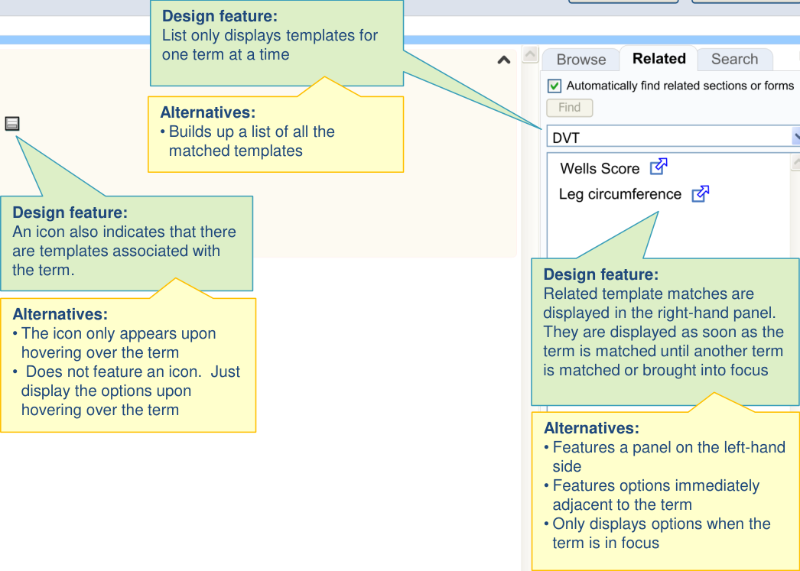

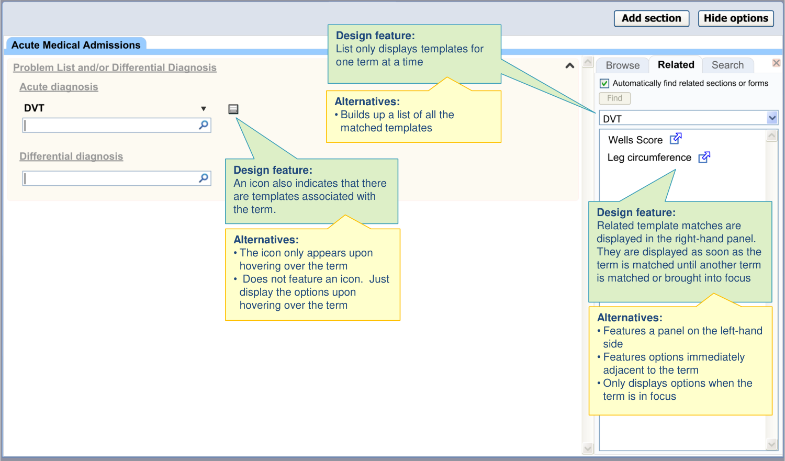

18 December 2009 Copyright ©2013 Health and Social Care Information Centre Slide 56

### 5.3 Design exploration

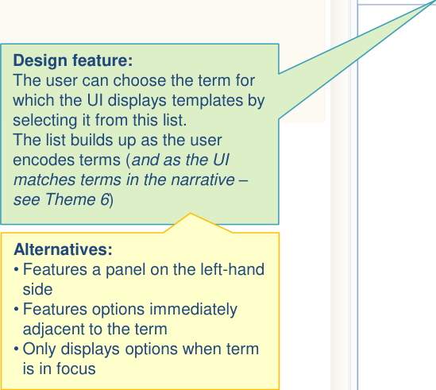

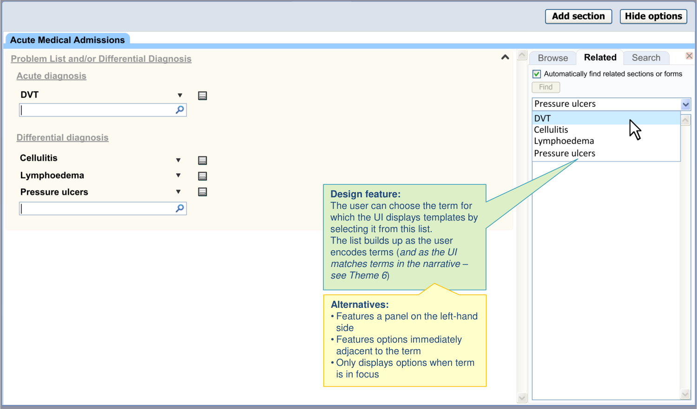

18 December 2009 Copyright ©2013 Health and Social Care Information Centre Slide 57

### 5.3 Design exploration

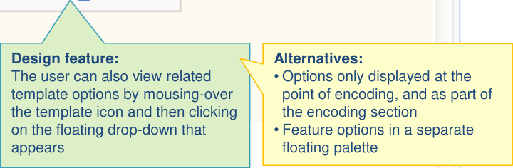

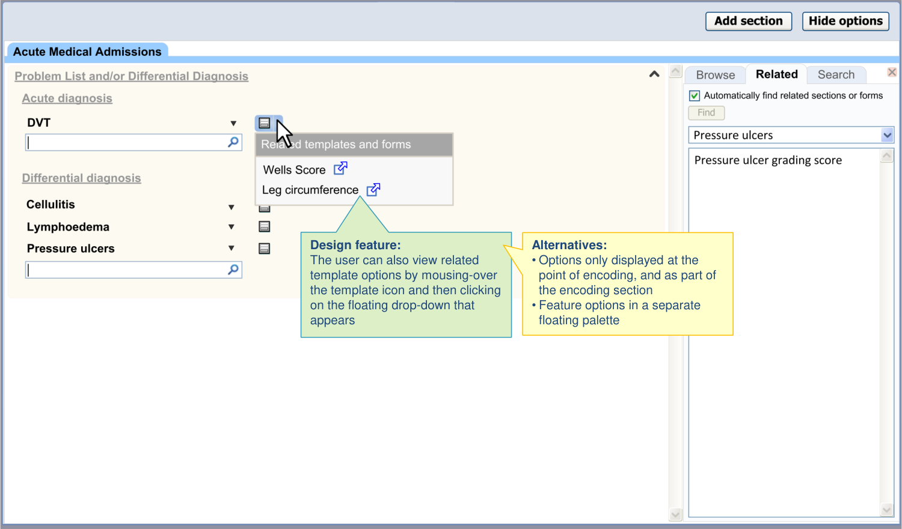

18 December 2009 Copyright ©2013 Health and Social Care Information Centre Slide 58

### 5.3 Design exploration

18 December 2009 Copyright ©2013 Health and Social Care Information Centre Slide 59

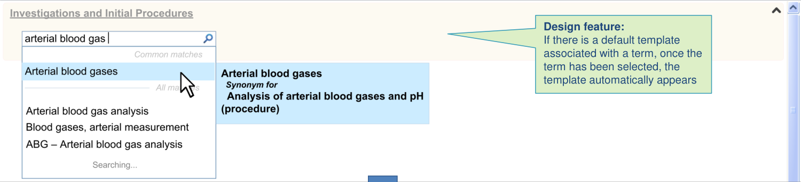

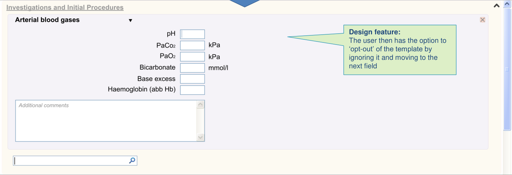
### 5.4 Next steps

**Immediate next steps:**

  - Explore if and how contextual filters should be displayed and manipulated

  - Further define the circumstances under which default templates may be triggered

  - Validate, through user testing, the designs where the options are accessed in the main
noting area

**Future exploration:**

  - Explore whether decision support can be ‘pushed’ here alongside the template
options:

      - For example, in the right-hand panel

      - However, decision support should be considered in a wider focus; and not just in relation to
admission clerking

  - Explore work-flow triggers, namely template suggestions that are independent of any
user action (for example, triggered by Quality Outcome Framework criteria)

  - Generalise design findings and/or guidance to other templates (such as discharge
forms)

18 December 2009 Copyright ©2013 Health and Social Care Information Centre Slide 60

## THEME 6 – FREE TEXT TRIGGER

18 December 2009 Copyright ©2013 Health and Social Care Information Centre Slide 61

### 6.1 Introduction to Free Text Trigger

Although there will be occasions where the clinician actively searches for individual SNOMED CT terms, often the quickest and most appropriate entry format will be free text. In these instances, there is a risk that the clinician enters data which would be better recorded as structured data (for example, via a form) than as free text.

Therefore, the designs in this theme show how the UI can:

 - Offer templates based upon terms it matches in the free text

 - Allow the clinician to choose between and open these templates

|Col1|Col2|Col3|
|---|---|---|
||||
||**Illustration of visually tagging a term for which related templates have been found**||

The designs assume that the terms which the UI matches are SNOMED CT terms (before identifying which templates are associated with those terms). However, they stop short of showing how this feature may integrate with full SNOMED CT text parsing and the emphasis is upon offering templates rather than encoding terms within the text.

18 December 2009 Copyright ©2013 Health and Social Care Information Centre Slide 62

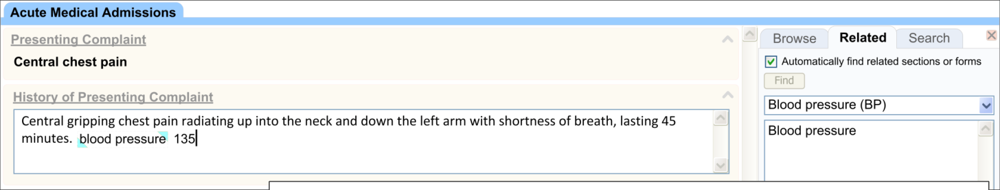
### 6.2 Design summary

|Design point|Rationale key points|
|---|---|
|The UI allows the user to trigger templates from free text   The UI proactively offers certain template matches from within free text |The clinician’s inclination is to write in free-text, as it is often intuitive and quick. However, organisation and retrieval of the patient record benefits from the entry of structured data. Triggering templates from free-text encourages structured entry while allowing an intuitive data entry style (CF)   Risk that clinician enters all data in free text. Important measurement values could be missed in later retrieval (PSA)   Clicking on or highlighting a word was not sufficiently 'discoverable' for some users (UR)|
|Template options are displayed in the right- hand panel|In order to be noticed, the templates options need to be displayed (semi) permanently. However, there is a risk of visual overload if the template options were to be permanently displayed in the noting area (UX)   Clinicians appreciated the template options being displayed in the right-hand panel (UR)|
|The UI also provides access by tags (icons overlaid on top of text)|Clinicians agreed that a proactive free text template trigger could work by marking up text the UI has matched against SNOMED CT terms with associated templates as well as by displaying template options in the right-hand panel in the same way as the SCM feature (CF)|

Key to abbreviations (slide 14)

18 December 2009 Copyright ©2013 Health and Social Care Information Centre Slide 63

### 6.2 Design summary

|Design point|Rationale key points|
|---|---|
|Free text triggering is markedly distinct from the section search|Clinicians were confused by previous designs where the free text trigger feature performed the same function as the section search (UR)|
|The floating drop-down control appears on focus and reveals template options|This mechanism has several precedents in existing software and so should be familiar to clinicians (EP)|
|Text tags demarcate the whole of the relevant matched phrase|There is a risk that the clinician thinks that the tag is associated with a different term if the whole phrase is not clearly tagged (for example, ‘pressure’ rather than the full phrase ‘blood pressure’) (CF)|
|Text tags do not comprise an underline|Underlines are too prevalent (with other meanings) in existing software. Also, previous CUI research has shown that they make the text too prominent (EP) (CUI)|
|Visual tagging clinical terms in the text is sufficiently muted   There is an option to switch off the free text template trigger mode|Risk that the template options are too overwhelming and they distract from the primary noting task or the clinician ends up ignoring them (PSA)|

Key to abbreviations (slide 14)

18 December 2009 Copyright ©2013 Health and Social Care Information Centre Slide 64

### 6.2 Design summary

|Design point|Rationale key points|
|---|---|
|The UI matches terms without requiring active encoding|The approach cannot rely on the user encoding a term before the UI offers a template (if it is important for the user to use the template) (CF)|
|Matching is driven by a specific subset (for example, of SNOMED CT terms) which is determined by the context|An unlimited text search would match templates against most words in the narrative. Only constrained matching against specific terms, such as measurement concepts, will be useful (CF)|
|The following template access and data entry, one of two conditions apply: • Original free text remains • Text is replaced by the template values|There are some clinical phrases which can be easily inserted back into free text and some which cannot (for example, measurement values can be easily inserted back into the free text) (CF)|
|The search algorithm is sufficiently ‘fuzzy’ in order to find words and phrases that almost match the search text|In usability tests, clinicians were unable to invoke a template because they were using slightly different words (such as ‘smokes’ instead of ‘smoking’. This could be managed by introducing some ‘fuzziness’ to the search algorithm (UR)|

Key to abbreviations (slide 14)

18 December 2009 Copyright ©2013 Health and Social Care Information Centre Slide 65

### 6.3 Design exploration

The matched terms are visually tagged in the narrative text

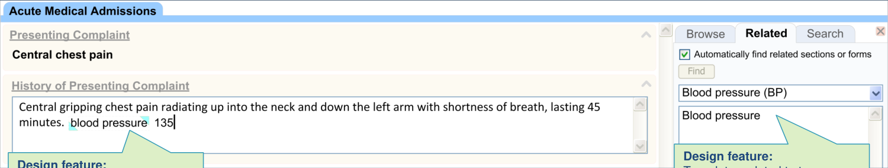

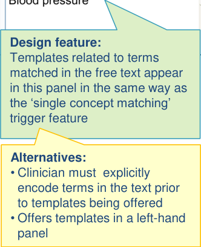

**Alternatives:**

- Other visual tagging styles are

18 December 2009 Copyright ©2013 Health and Social Care Information Centre Slide 66

### 6.3 Design exploration

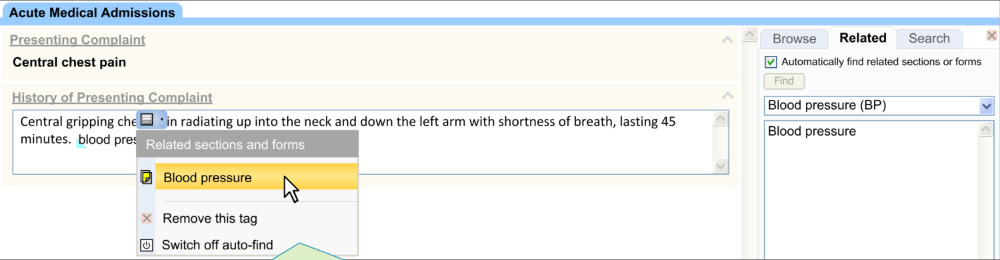

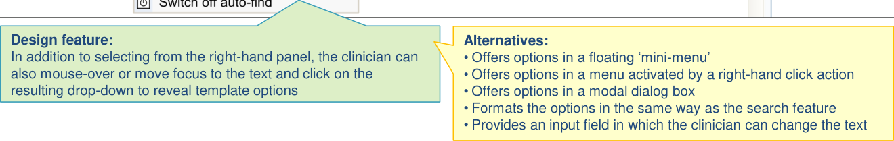

18 December 2009 Copyright ©2013 Health and Social Care Information Centre Slide 67

### 6.4 Next steps

**Immediate next steps:**

  - Test and refine the design with an interactive prototype

  - Comparatively test alternative visual tags

  - Investigate the extent to which fuzzy matching should be implemented

  - Investigate how to link the template data with the original matched term. Should there
be a visual indication that remains with the original term?

**Future exploration:**

  - Investigate ways in which a value entered into the template can replace or
complement the original term within the free text

  - Explore the further knowledge and decision support implications of this feature. How
could this integrate with other support systems?

  - Explore how the templates may be applied, but without the use of a form. For
example, how the UI may recognise values in free text, where the parsing is constrained by a template (and the subsets and relationships implied by it)

18 December 2009 Copyright ©2013 Health and Social Care Information Centre Slide 68

## THEME 7 – BROWSING

18 December 2009 Copyright ©2013 Health and Social Care Information Centre Slide 69

### 7.1 Introduction to Browsing

In addition to showing how the clinician can search for sections within the acute medical admission form, the designs also illustrate another familiar way of navigating data structure, namely browsing.

The clinician may use a ‘tree’ to find and open the section they require. The advantage given by browsing rather than searching is that the clinician can see the structure available, which may be particularly useful for clinicians who are unfamiliar with the precise structure of the template. The disadvantage is that it may require more actions to browse rather than search, and browsing may be best done with a mouse whereas a lot of the noting may be done via a keyboard. This may make the

search a more attractive option in places, especially for clinicians who are more familiar with the structure and know exactly what they want.

This design consultation assumes that a mixed economy of browse and search is the most accommodating solution which can deal with varying levels of experience and different types of noting needs.

The clinician may browse up and down the tree, and open sections by clicking on them.

|Col1|Col2|Col3|
|---|---|---|
|**Illustration of a browse feature**|||

18 December 2009 Copyright ©2013 Health and Social Care Information Centre Slide 70

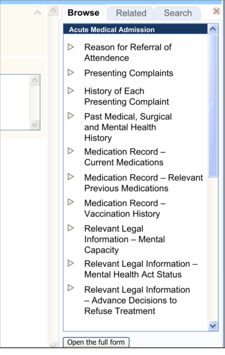
### 7.2 Design summary

|Design point|Rationale key points|
|---|---|
|A browsing feature is provided in addition to search features: • This allows the user to browse the structure of the Acute Medical Admission form and open subsections from within it|Browse is a function which clinicians expect and, for first-time users at least, the browse is a more popular feature than search (UR)|
|The browsing feature is opened by default|The browsing feature can communicate the structure of the template in an economical way, while providing access to sections (UX)   Allowing users to enter data in fragments, rather than as a coherent whole template, may mean the clinician loses sight of where they are in the process. The browsing feature can provide context to the noting (PSA)   Clinicians like the idea of the browsing feature being open by default, as long as they can hide it (UR)|
|The browsing feature can be hidden and then subsequently revealed|There is a risk that the clinician is distracted from their primary noting task by the template options (PSA)   Therefore, they need the ability to hide the browsing feature from view (UX)|

Key to abbreviations (slide 14)

18 December 2009 Copyright ©2013 Health and Social Care Information Centre Slide 71

### 7.3 Design exploration

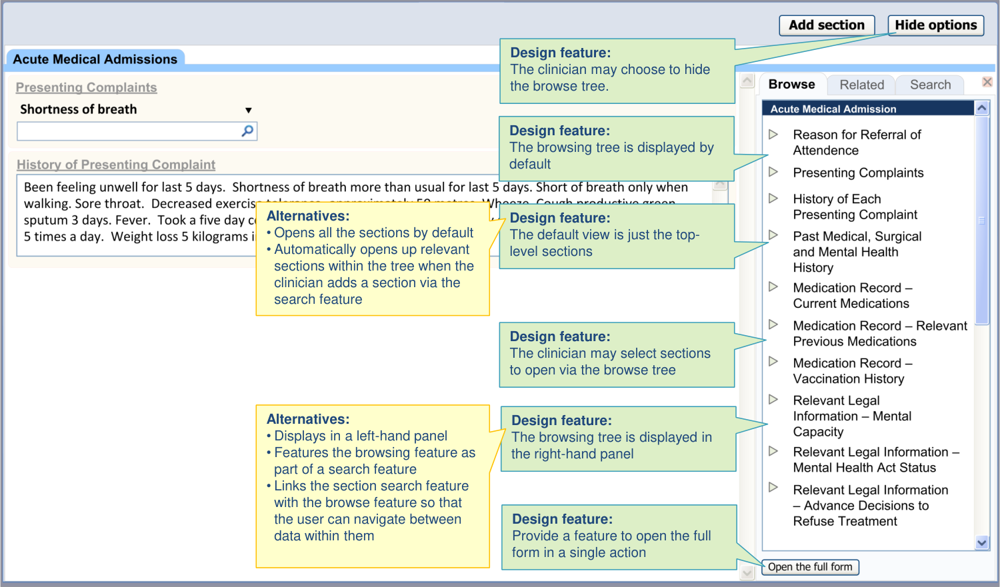

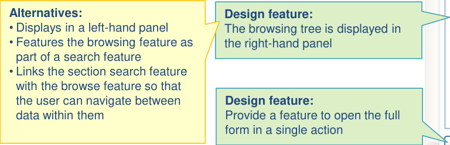

18 December 2009 Copyright ©2013 Health and Social Care Information Centre Slide 72

### 7.4 Next steps

**Next steps:**

  - Further understand the possible interaction between the search and browse features

  - Test the browse feature alongside the search features in an interactive prototype.
Refine the designs where appropriate

  - Explore how some sections could be further nested in order to make the browsing
experience clearer. For example, nest all the sections with the prefix ‘Observations and Findings’ into a single item of the same name and remove the prefix from all the remaining labels

**Future exploration:**

  - Explore how the browse feature could be used to indicate which sections the clinician
has addressed (that is, opened and possibly entered information into) and which remain closed. This gives the clinician a quick overview of what is left to do

18 December 2009 Copyright ©2013 Health and Social Care Information Centre Slide 73

## THEME 8 – REVISITING AND ADDING TEMPLATES

18 December 2009 Copyright ©2013 Health and Social Care Information Centre Slide 74

### 8.1 Introduction to Revisiting and Adding Templates

As the clinician progresses through the notes, there may be times where they need to revisit sections that they have already opened. In those cases, they could scroll back up the form to revisit them. However, in this theme, the designs show how the UI may assist the clinician to access previously opened sections by using the search or browse functions.

The designs show how the UI will open a new instance of the section, while pre-populating it with the previous data, so the clinician does not need to look for the previous instance.

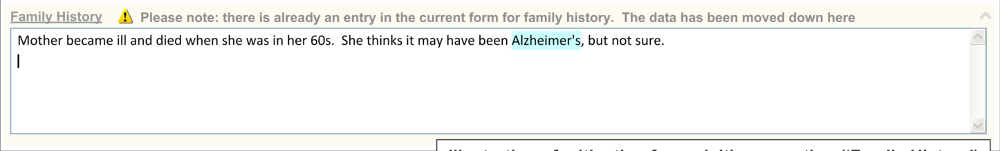

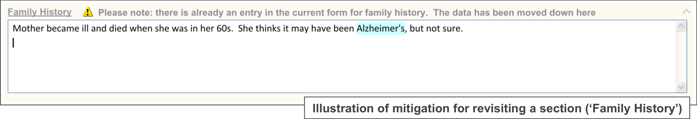

18 December 2009 Copyright ©2013 Health and Social Care Information Centre Slide 75

### 8.1 Introduction to Revisiting and Adding Templates

In other instances, the clinician may wish not to revisit existing sections or subsections but to add a new instance.

For example, the clinician may wish to add a new ‘Blood pressure’ subsection in order to add a new reading not to edit the blood pressure they entered earlier in the clerking.

Therefore, the design will show how the clinician can add further instances of a data type, where this is permitted (such as for examination measurement values).

18 December 2009 Copyright ©2013 Health and Social Care Information Centre Slide 76

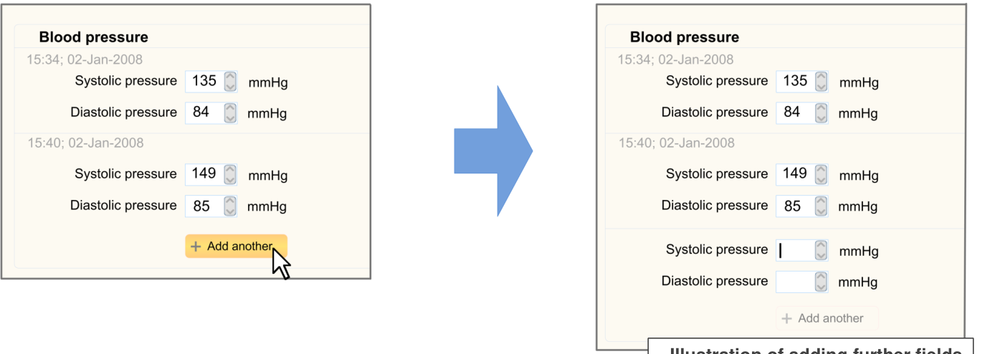
### 8.2 Design summary

|Design point|Rationale key points|
|---|---|
|The search returns section options even when there is already an instance open within the form|Given the flexible approach to section entry, there is a risk that the clinician will try to open a template that is already open. In such a case, the UI could do nothing and leave it up to the user to go back and find the opened template. A more helpful approach is to open the template at the current point in the template, but mitigate the risks associated with a duplication (UX)|
|The UI does not open multiple instances of the same section   Upon opening a duplicate section, the UI will pre-populate it with the existing data (from within the form) and will simultaneously remove the original instance of the template|Allowing duplication raises the risk of contradiction between different data. Having the data in separate places reduces ability to compare (PSA)   Clinicians preferred the approach where data is pulled into a newly duplicated template rather than being forced back up to the location of the original instance (PSA) |

Key to abbreviations (slide 14)

18 December 2009 Copyright ©2013 Health and Social Care Information Centre Slide 77

|.2 Design summary|Col2|
|---|---|
|**Design point**|**Rationale key points**|
|There is a feature for adding multiple instances of the same template (for example, a set of data fields): • For example, for ordinal/numerical measurement data   Duplicate fields are displayed adjacent to each other|There will be occasions where the clinician will need to enter multiple instances of the same data type (CF)|
|The ‘add another’ control is located in a prominent position, adjacent to the most recent instance|It is useful for the clinician to be able to see previous measurement values when entering the current value (PSA)|
|Each set of duplicate fields are uniquely labelled|Clinicians indicated that they preferred designs where the fields are uniquely labelled (UR)|
|Each set of duplicate fields are labelled with the time of entry/measurement|Clinicians preferred labels which indicated the time of entry (or the time of measurement) (UR)|
|The UI may automatically open a set of new fields upon revisiting a section with the search/browse feature|If a clinician chooses to open a previously opened section, which contains populated measurement fields, it is assumed that the clinician requires fresh fields to enter future values (UX)|

Key to abbreviations (slide 14)

18 December 2009 Copyright ©2013 Health and Social Care Information Centre Slide 78

### 8.2 Design summary

|Design point|Rationale key points|
|---|---|
|The UI warns if statements have been duplicated|This would help to prevent duplication of actual data (CF)|

Key to abbreviations (slide 14)

18 December 2009 Copyright ©2013 Health and Social Care Information Centre Slide 79

### 8.3 Design exploration

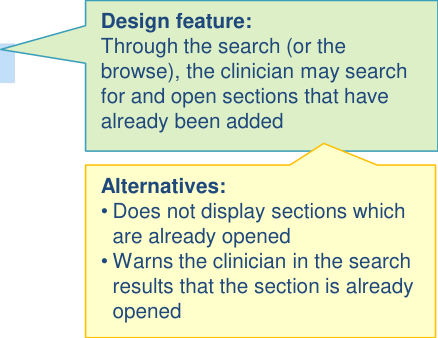

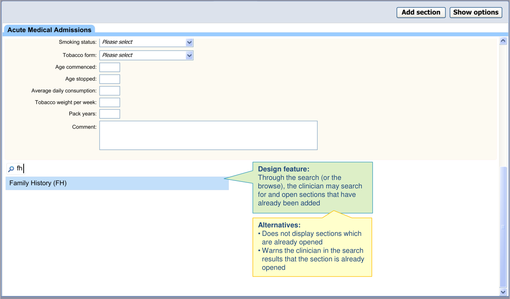

18 December 2009 Copyright ©2013 Health and Social Care Information Centre Slide 80

### 8.3 Design exploration

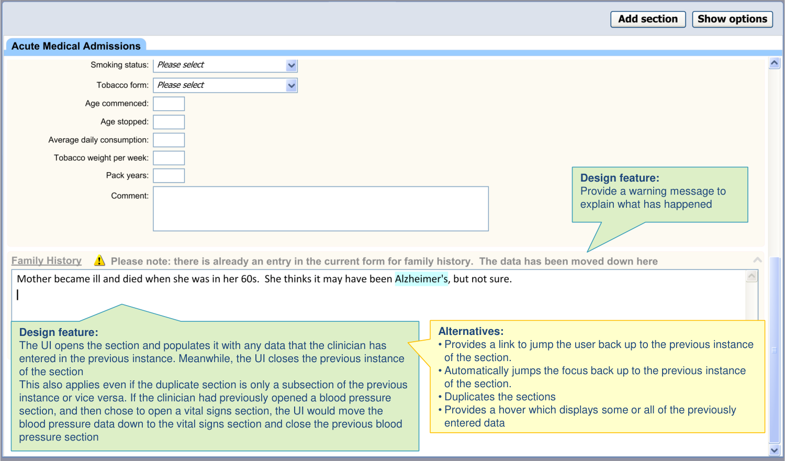

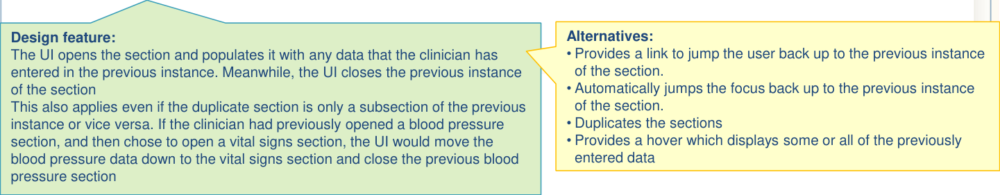

18 December 2009 Copyright ©2013 Health and Social Care Information Centre Slide 81

### 8.3 Design exploration

|Design feature: If the section contains certain examination measurement data, the UI also automatically opens a fresh set of fields, where appropriate|Col2|Col3|
|---|---|---|
||**Alternatives:** • Does not automatically open a fresh set of fields; the clinician must click on an ‘Add another’ button to open fresh fields||

18 December 2009 Copyright ©2013 Health and Social Care Information Centre Slide 82

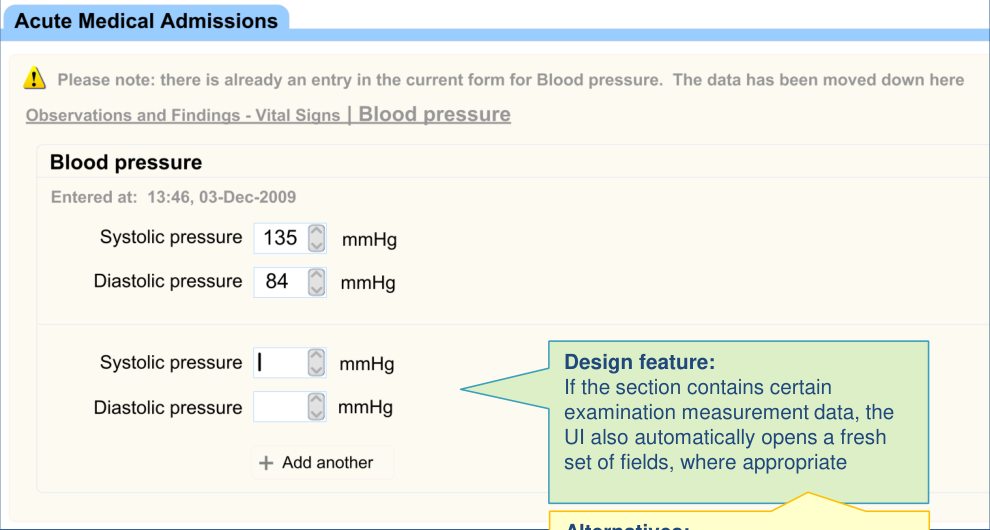
### 8.3 Design exploration

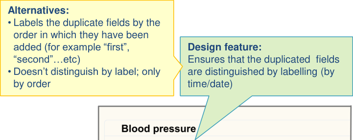

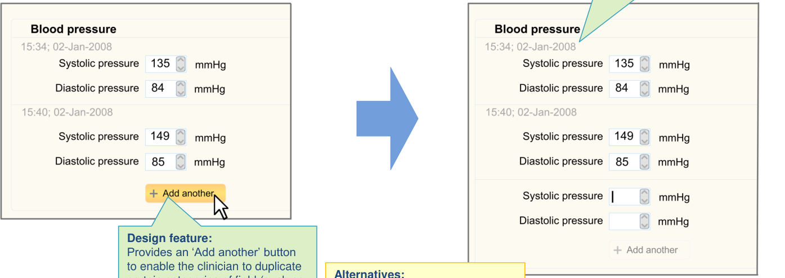

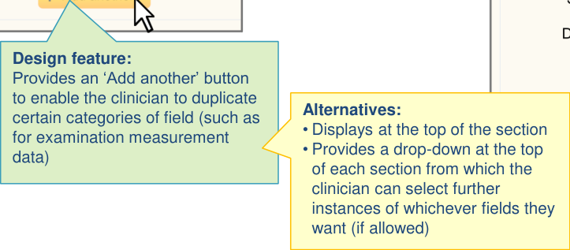

18 December 2009 Copyright ©2013 Health and Social Care Information Centre Slide 83

### 8.4 Next steps

**Next steps:**

  - Test the design in an interactive prototype. Refine the design where appropriate

  - Further define where fields can be duplicated (that is, so the clinician can enter
multiple instances of the same value type). Currently the designs assume that certain numerical examination measurement values can be duplicated (such as vital signs data). However, there may be other types of data that can be duplicated

  - Explore in more detail how sections may be revisited via the browsing feature, and
whether any further UI will be required

**Future exploration:**

   - Explore ways in which the UI may alert clinicians that they are entering duplicate
statements (that is, statements they have entered into the form earlier)

18 December 2009 Copyright ©2013 Health and Social Care Information Centre Slide 84

## THEME 9 – REORDERING

18 December 2009 Copyright ©2013 Health and Social Care Information Centre Slide 85

### 9.1 Introduction to Reordering

It is assumed that sections are arranged according to the order in which they were added, but this may make it difficult for clinicians to assess what they have done and what is missing. It would be simpler to scan through the sections in a standard order as, this way, it becomes more apparent what is missing (as missing sections would stand out against the familiar pattern).

Therefore, the designs in this theme show how the UI can:

 - Show how clinicians can reorder the sections within the form according to a standard sequence, so that
they can better review the completeness of their note

 - Show how clinicians may rearrange the sections back to the order in which they were added

|Illustration of reordering the data according to a standard sequence|Col2|Col3|Col4|
|---|---|---|---|
|||||
|||||
|||||

18 December 2009 Copyright ©2013 Health and Social Care Information Centre Slide 86

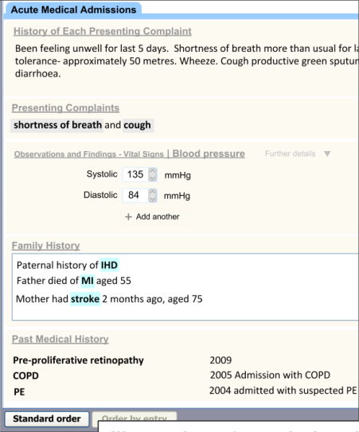

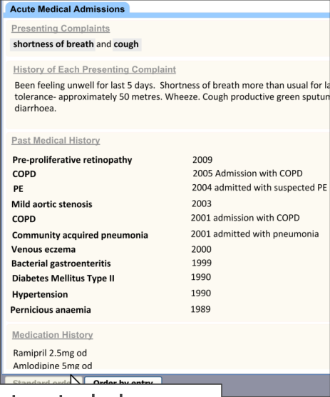
### 9.2 Design summary

|Design point|Rationale key points|
|---|---|
|By default, sections are arranged in the order in which the user has added them|Users will expect the sections to build up sequentially as they access them (UX)|
|During input, a control is provided to reorder the template sections according to the standard RCP headings order|The clinician needs to be able to view the data according to a standard order, partly in order to check that they had completed all that they need to (CP)   Clinicians believed it would be useful for the UI to be able to reorder the templates to a standard (RCP) order (UR)|
|The ‘reordering’ control does not automatically reorder lists within sections (for example, by chronology)|The order in which a clinician has entered items into a list may be intentionally out of (chronological) order. For example, they may wish to give emphasis to certain items in the list (CF)|
|During input, a control is provided to reorder the template sections back to the order in which they were added by the user |There is a risk that the user chooses to automatically reorder the form (according to a standard) and then wants to change it back, but cannot (PSA).   The record needs to retain a history of the order in which the user added and completed the sections (CF)|

Key to abbreviations (slide 14)

18 December 2009 Copyright ©2013 Health and Social Care Information Centre Slide 87

### 9.3 Design exploration

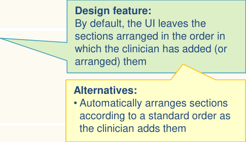

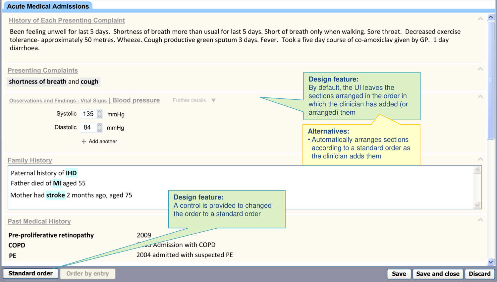

18 December 2009 Copyright ©2013 Health and Social Care Information Centre Slide 88

### 9.3 Design exploration

18 December 2009 Copyright ©2013 Health and Social Care Information Centre Slide 89

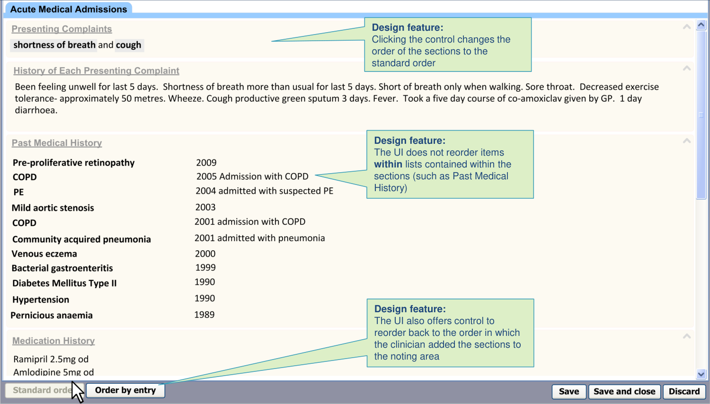
### 9.4 Next steps

**Immediate next steps:**

  - Design, test and refine a control for reordering the form. Address the type of control,
where it may be offered and how it should be labelled

  - Consider the implications of allowing the clinician to manually reorder the sections

  - Create a design feature to allow the clinician to manually reorder the sections

**Future exploration:**

  - Explore whether to present the clinician with a reordered view before saving and
closing the form. Would this be a redundant step?

18 December 2009 Copyright ©2013 Health and Social Care Information Centre Slide 90

### Areas/questions for further work and study

The previous sections have outlined next steps and further areas of exploration. To summarise the immediate next steps:

  - Test and refine the existing designs

  - Answer any relevant design questions that remain open

  - Translate the design features into CUI guidance

  - Refine and prioritise the future areas of design exploration

18 December 2009 Copyright ©2013 Health and Social Care Information Centre Slide 91

### Areas/questions for further work and study

Additionally, there are some general themes which have not been discussed, but which would be important to address:

  - Providing a special preview feature in order to help the clinician scan through the salient points
of their notes. The format may be more condensed than the entry view (which contains additional screen furniture, such as drop-down mechanisms and empty fields)

  - Exploring the end-to-end passage of data from admission to discharge, including possible
viewing and querying of the data

  - Exploring how to ‘cite’ previous data in the current notes

  - Further exploring whether and how clinicians can hide or close template sections that they have
added to a form. Our research into this topic proved inconclusive, with clinicians failing to understand why they would want to perform this action. We would want to conclude whether such actions should be disallowed

18 December 2009 Copyright ©2013 Health and Social Care Information Centre Slide 92

### Not included in this deck • Supporting material and evidence:
#### – Study ID 76: Executive Summary (September 2009) – Study ID 78: Executive Summary (November 2009) – Noting Using Templates Design Demonstrator

18 December 2009 Copyright ©2013 Health and Social Care Information Centre Slide 93

# Distribution

### Reviewers and Distribution

|Name|Position|Version Approved|Date|
|---|---|---|---|
|Mike Carey|NHS CFH Project Manager|0.2.0.0|17-Dec-2009|
|Tim Chearman|NHS CFH Project Lead|0.2.0.0|17-Dec-2009|
|Peter Johnson|Clinical Architect|0.2.0.0|17-Dec-2009|
|Frank Cross|Clinical Advisor|0.2.0.0|17-Dec-2009|
|Lindsey Butler|Clinical Safety Advisor|0.2.0.0|17-Dec-2009|
|Greg Scott|Clinical Advisor|0.2.0.0|17-Dec-2009|
|Priya Shah|Clinical Advisor|0.2.0.0|17-Dec-2009|

**Copyright:** You may re-use this information (excluding logos) free of charge in any format or medium, under the [terms of the Open Government Licence. To view this licence, visit nationalarchives.gov.uk/doc/open-](https://web.nhs.net/OWA/redir.aspx?C=dMnSAL43xUOp9X_SOcscV9mT5A0smdBIh1_vxjdSDVCERI33v7-idn6tNFCNwJYUR1PxIW-Hd-E.&URL=http://nationalarchives.gov.uk/doc/open-government-licence) [government-licence](https://web.nhs.net/OWA/redir.aspx?C=dMnSAL43xUOp9X_SOcscV9mT5A0smdBIh1_vxjdSDVCERI33v7-idn6tNFCNwJYUR1PxIW-Hd-E.&URL=http://nationalarchives.gov.uk/doc/open-government-licence) [or email psi@nationalarchives.gsi.gov.uk](https://web.nhs.net/OWA/redir.aspx?C=dMnSAL43xUOp9X_SOcscV9mT5A0smdBIh1_vxjdSDVCERI33v7-idn6tNFCNwJYUR1PxIW-Hd-E.&URL=mailto:psi@nationalarchives.gsi.gov.uk)

18 December 2009 Copyright ©2013 Health and Social Care Information Centre Slide 94
