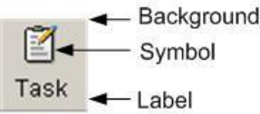
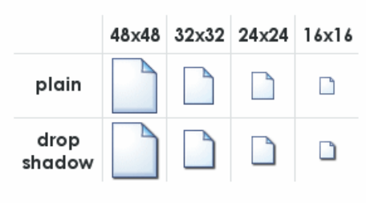
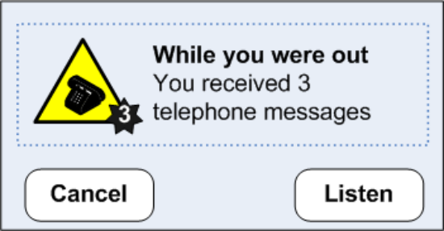
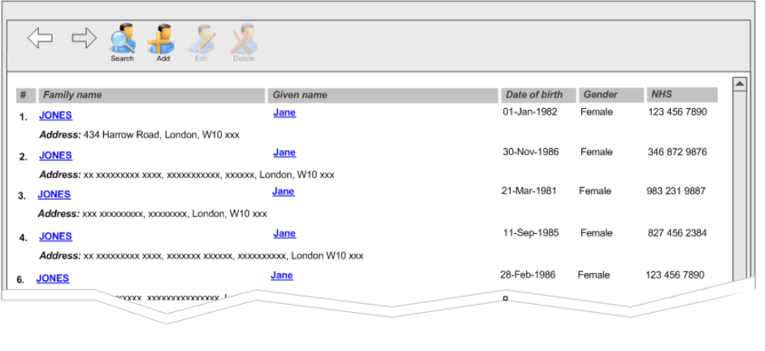
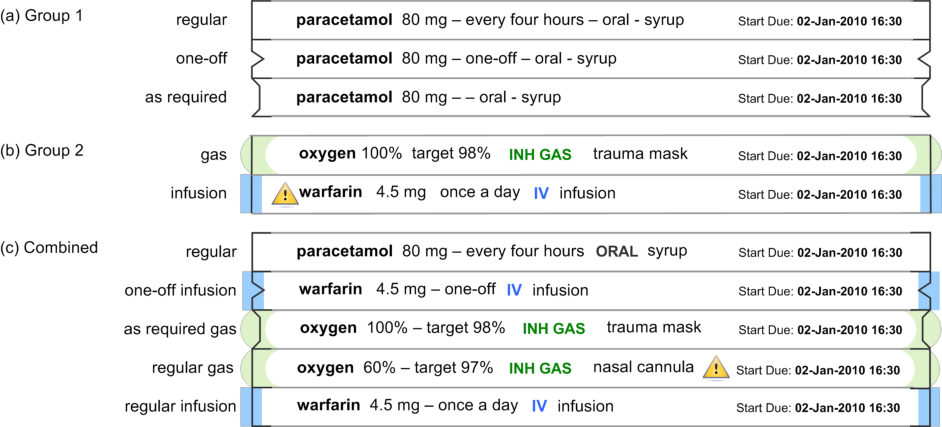

_Prepared for_
**NHS Connecting for Health**
**Version 1.0.0.0 Baseline**
_Prepared by_
**NHS CUI Programme Team**
**[Cuistakeholder.mailbox@hscic.gov.uk](mailto:Cuistakeholder.mailbox@hscic.gov.uk)**
_Contributors_
**Ceri Abberley**
**Tony Rose**
**This document was prepared for NHS Connecting for Health which ceased to exist on 31 March**
**2013. It may contain references to organisations, projects and other initiatives which also no**
**longer exist. If you have any questions relating to any such references, or to any other aspect of**
**[the content, please contact cuistakeholder.mailbox@hscic.gov.uk](mailto:cuistakeholder.mailbox@hscic.gov.uk)**
## 1 INTRODUCTION

<!-- TOC -->
<!-- TOC generated by Markdown All in One style -->

- [1 INTRODUCTION](#1-introduction)
  - [1.1 Overview](#11-overview)
  - [1.2 Area of Focus Description](#12-area-of-focus-description)
  - [1.3 References to Table of Contents Document](#13-references-to-table-of-contents-document)
- [2 RECOMMENDATION AND GUIDANCE](#2-recommendation-and-guidance)
  - [2.1 High-Level Principles](#21-high-level-principles)
    - [2.1.1 What is an Icon?](#211-what-is-an-icon)
    - [2.1.2 Icon Types](#212-icon-types)
    - [2.1.3 Icon Composition](#213-icon-composition)
    - [2.1.4 Internationalisation Issues](#214-internationalisation-issues)
    - [2.1.5 Accessibility Issues](#215-accessibility-issues)
    - [2.1.6 Benefits and Rationale](#216-benefits-and-rationale)
    - [2.1.7 Confidence Level](#217-confidence-level)
  - [2.2 Icon Design](#22-icon-design)
    - [2.2.1 Level of Detail and Realism](#221-level-of-detail-and-realism)
    - [2.2.2 Size](#222-size)
    - [2.2.3 Labels](#223-labels)
    - [2.2.4 Colour](#224-colour)
    - [2.2.5 Shape](#225-shape)
    - [2.2.6 Icon Groups](#226-icon-groups)
    - [2.2.7 Benefits and Rationale](#227-benefits-and-rationale)
    - [2.2.8 Confidence Level](#228-confidence-level)
  - [2.3 Icon Usage](#23-icon-usage)
    - [2.3.1 When to Use Icons](#231-when-to-use-icons)
    - [2.3.2 Current NPfIT Icon Usage](#232-current-npfit-icon-usage)
    - [2.3.3 Conveying Importance with Icons](#233-conveying-importance-with-icons)
    - [2.3.4 Benefits and Rationale](#234-benefits-and-rationale)
    - [2.3.5 Confidence Level](#235-confidence-level)
  - [2.4 A Grammar for Icon Design](#24-a-grammar-for-icon-design)
    - [2.4.1 Developing an Icon Grammar](#241-developing-an-icon-grammar)
    - [2.4.2 Guidance](#242-guidance)
    - [2.4.3 Benefits and Rationale](#243-benefits-and-rationale)
    - [2.4.4 Confidence Level](#244-confidence-level)
- [3 DOCUMENT INFORMATION](#3-document-information)
  - [3.1 Terms and Abbreviations](#31-terms-and-abbreviations)
  - [3.2 Definitions](#32-definitions)
  - [3.3 Nomenclature](#33-nomenclature)
  - [3.4 References](#34-references)
- [REVISION AND SIGNOFF SHEET](#revision-and-signoff-sheet)
  - [Change Record](#change-record)
  - [Audience](#audience)
  - [Reviewers](#reviewers)
  - [Distribution](#distribution)
  - [Open Issues Summary](#open-issues-summary)
  - [Document Properties](#document-properties)

<!-- /TOC -->

Source PDF: [iconssymb.pdf](../../pdfs/consistent-navigation/iconssymb.pdf)

This document describes the entry in the Design Guide for Consistent Navigation - Icons and Symbology. The objective of this document is to describe the area of focus, provide guidance and recommendations, and explain the rationale behind the guidance and recommendations.

Prior to reading this document, please ensure you have read the following Design Guide documentation:

- _Alerts Symbol Design_ **{R1}**

### 1.1 Overview

This document is intended for the use of anyone whose role includes screen design, implementation, or assessment of an NHS clinical application. This document can therefore be used as guidance for the design of an icon on a user interface, the usage of an icon within an application, and the assessment of an NHS clinical application’s user interface.

### 1.2 Area of Focus Description

This document provides guidance and recommendations for the following aspects of icons and symbology:

- High-level principles for the design of icons and symbology

- High-level principles for the usage of icons and symbols within clinical applications

- High-level principles for developing an icon grammar

The design and use of icons is a complex subject, about which much has been written. Clearly, it is not practicable to attempt to cover this entire field in any degree of depth. Instead, this document shall focus primarily on the key issues that relate to the usage of icons within existing clinical applications, and attempt to provide practical advice and guidance, illustrated by real world examples and case studies. Consequently, this guidance will not cover areas such as:

- Understanding how the target audience interprets icons and symbols

- Understanding how the clinical environment affects the interpretation of icons and symbols

### 1.3 References to Table of Contents Document

The document _Table of Contents_ **{R2}** outlines every specific area of focus to be covered by the Design Guide. Each area of focus has an accompanying Design Guide Entry document. Table 1 indicates the areas of focus covered by this Design Guide Entry.

12.9 Icons and Symbology

Table 1: References to Table of Contents Document

Page 1

Copyright ©2013 Health and Social Care Information Centre

HSCIC Controlled Document

## 2 RECOMMENDATION AND GUIDANCE

The guidance provided in this document is based upon an initial review of existing clinical applications and knowledge of best practice usability guidelines and heuristics. However, it should be noted that a Patient Safety Assessment (PSA) has yet to be completed and therefore this guidance may be updated following the PSA.

### 2.1 High-Level Principles

#### 2.1.1 What is an Icon?

An icon is a “visual, graphic representation of an object, word, or concept” **{R3}** . Icons may be used as visual metaphors to represent an area of content, textual information or functional area within an application. Figure 1 shows some examples of commonly used icons.

Figure 1: Icon Examples

#### 2.1.2 Icon Types

An icon can be categorised in three ways:

**Image-related icons** (also referred to as metaphoric icons)

These icons are highly pictorial representations the object or action they represent Printer icon

**Concept-related icons** These icons are based on an example or property of a real-world object or action House icon to denote a patient’s address

**Arbitrary icons** (also referred to as abstract icons)

Table 2: Icon Types

_**2.1.2.1**_ _**Guidance**_

These icons do not resemble the object or action they represent, but become meaningful only through convention or education

Bow tie icon to denote a referral to a specialist

**{R3}**, **{R4}**

**{R3}**, **{R4}**

**{R3}**, **{R4}**

Each icon type has important and different implications for icon design:

- Image-related icons are directly comprehended and should be used wherever possible

- Concept-related icons can be used if the user can be expected to understand the context in

which the icon is presented

- Arbitrary icons can be difficult to recognise, hard to learn and remember. They should only

be used if both context and special knowledge are present. In this case, idioms should be used rather than force a concrete representation where none make sense. Cooper and Riemann (2003) **{R4}** point out that although idiomatic icons must be learned, “ _good icons_ _are easily memorised and need to be learned only once”._ For example, traffic symbols such

as the ubiquitous red circle and diagonal line

Page 2

Copyright ©2013 Health and Social Care Information Centre

HSCIC Controlled Document

#### 2.1.3 Icon Composition

An icon comprises several components (see Figure 2). These components work together to increase the likelihood that users will understand the icon.

_**2.1.3.1**_ _**Guidance**_

Figure 2: Key Components of an Icon

- **Background**

 Patterns in the background should be avoided

 The image should be clearly displayed in front of the background

 The background must be static. If anything blinks or moves, the user perceives it as a foreground image

 The background should use unsaturated, cool colours and the foreground image should use saturated, warm colours

 The background image should be limited to a simple rendition of a recognisable, concrete object

 Complex backgrounds that do not offer a sufficient colour contrast should be avoided

- **Symbol**

 Commonly accepted or standardised elements should be used wherever possible

- **Text Label** (see section 2.2.4 for more details on labels)

 Text labels should only be used when necessary (such as, when an icon is conceptrelated or arbitrary)

 Text labels should be no more than two to three words

#### 2.1.4 Internationalisation Issues

Users from different cultures may interpret icons differently. There are a number of key guidelines to follow in complying with internationalisation requirements.

_**2.1.4.1**_ _**Guidance**_

- Hands, eyes and faces should not be used in icons. This type of imagery can be interpreted

quite differently among a variety of cultures **{R4}**, **{R5}**, **{R6}** If representations of people or users are needed, depict them as generically as possible **{R6}**

- Consideration should be given to cultural differences when using arrows or indicating

directionality. Make sure there is text that explains the directionality. If arrows are used, then assessment must be made in determining whether or not a bi-directional version of the icon is needed **{R4}**, **{R5}**

- Consideration should be given to cultural differences when using certain colours (for

example, white, black, and/or red can be sensitive colours for certain cultures **{R4}**, **{R5}** )

- Avoid using anti-aliased text in an icon, as the text will not be translatable if it is a graphic

**{R7}**

Page 3

Copyright ©2013 Health and Social Care Information Centre

HSCIC Controlled Document

#### 2.1.5 Accessibility Issues

There are a number of key guidelines to follow in complying with accessibility standards **{R8}** .

_**2.1.5.1**_ _**Guidance**_

- An icon should be accompanied with explanatory text either displayed on the page (such

as, text label) or accessible by HTML attributes (such as, the "alt" tag for images)

- The HTML code should use the "alt" attribute to the "img src" tag to describe the graphic. If

the image is not available (for example, the users' browsers preferences are set to not display graphics) or a screen reader is reading the page, the “alt” tag will be used in place of the image

- Colour should not be the only indicator used to denote meaning and importance of icons

- Flashing in the 2-59Hz range must be avoided

#### 2.1.6 Benefits and Rationale

Using well designed icons will:

- Improve usability by making objects and actions easier to identify, learn and find **{R6}**

- Allow users to understand the function being represented which will helps users understand

an interface

- Improve recognition and visual communication, because icons are visually more distinctive

than words **{R6}**

- Strongly influence the user’s overall impression of the application’s visual design **{R6}**

#### 2.1.7 Confidence Level

- **High**

 Image-related icons are directly comprehended and should be used wherever possible

 Concept-related icons can be used if the user can be expected to understand the context in which the icon is presented

 Arbitrary icons can be difficult to recognise, hard to learn and remember

 Patterns in the background should be avoided

 The image should be clearly displayed in front of the background

- **Medium**

 The background must be static. If anything blinks or moves, the user perceives it as a foreground image

 The background should use unsaturated, cool colours and the foreground image should use saturated, warm colours

 The background image should be limited to a simple rendition of a recognisable, concrete object

 Complex backgrounds that do not offer a sufficient colour contrast should be avoided

 Commonly accepted or standardised elements should be used wherever possible

 Text labels should only be used when necessary

 Text labels should be no more than two to three words

 An icon should be accompanied with explanatory text

Page 4

Copyright ©2013 Health and Social Care Information Centre

HSCIC Controlled Document

 Avoid using anti-aliased text in an icon, as the text will not be translatable if it is a graphic

 The HTML code should use the "alt" attribute to the "img src" tag to describe the graphic

 Colour should not be the only indicator used to denote meaning and importance of icons

 Flashing in the 2-59Hz range must be avoided

- **Low**

 Hands, eyes and faces should not be used in icons

 Consideration should be given to cultural differences when using arrows or indicating directionality

 Consideration should be given to cultural differences when using certain colours

This guidance is currently classified as ‘Initial Guidance’. Further usability testing is expected and potential updates to the guidance may be completed following this usability testing.

### 2.2 Icon Design

#### 2.2.1 Level of Detail and Realism

Using the appropriate level of detail and realism makes an icon easier to recognise. However, detail can distract and clutter (for example, excessive detail makes it harder to see a pattern of relationships). An icon can be designed with five different degrees of detail and realism (see Table 3).

_**2.2.1.1**_ _**Guidance**_

Photographic realism

Simplified drawing

Caricature

Outline

Silhouette

Photographs and photographic Use for presenting complex symbols with a lot of detail

Outline with distinct interior details Use for presenting complex symbols with small

significant parts, especially when the objects have similar profiles

Exaggerations of crucial details Use for presenting symbols that have a small, crucial feature or for simplifying complex details

Outline with only prominent details

Shape filled with solid colour contrasting with background

Use for presenting small symbols that represent a familiar object with a distinct profile

Use for presenting symbols that are too thin to show in outline format and for symbols that have a very distinct profile and do not require details for recognition

Page 5

Copyright ©2013 Health and Social Care Information Centre

HSCIC Controlled Document

Table 3: Five Different Degrees of Detail and Realism **{R3}**

#### 2.2.2 Size

The size of an icon determines how easy it is to notice, understand and select. The recommended size depends on many factors, including the device controlling the cursor, the manual dexterity of the user, and the required level of performance **{R3}**, **{R9}**, **{R10}**, **{R12}** . Figure 3 shows the popular icon sizes used by Microsoft [®] Windows [®].

Figure 3: Popular Icon Sizes

_**2.2.2.1**_ _**Guidance**_

Table 4 provides guidance on the recommended icon sizes for common interface components.

Taskbar, detailed lists 16x16

Windows XP menus 24x24

Desktop, lists 32x32

Windows XP Explorer, system lists 48x48

Table 4: Recommended Icon Sizes

#### 2.2.3 Labels

Well designed icons can save space, improve recall and recognition. However, icons that are not obvious can make an application more difficult to use **{R10}** . Therefore, if an icon is not obvious or understood by all its users, a label should be used. Note that some applications allow the labels to be switched on or off by the user.

_**2.2.3.1**_ _**Guidance**_

Use of labels should be considered when:

- Icons are abstract and have no conventional, or broadly understood, meaning

- The icon is safety-critical unless they are self-explanatory **{R10}**

- The icon represents a message that is particularly important or warns of a particular

situation (for example, immunisation is due)

- The task is complex (for example, dispensing drugs)

When labels are used they should:

- Be brief, no more than two or three words

- Be used sparingly because they reduce the space available for the icon, making them less

interpretable

- Use a clear and simple sans serif typeface (such as, Arial).

Page 6

Copyright ©2013 Health and Social Care Information Centre

HSCIC Controlled Document

- Not use boldface, italics, underline or differences of colour to emphasise words

- Be consistent in the location and format of text labels **{R10}**

- Use sentence-style capitalisation **{R10}**

#### 2.2.4 Colour

Colour offers advantages over black and white or greyscale icons, such as the ability to group icons, direct attention and show importance. However, colour can also confuse and mislead users if used incorrectly **{R5}**, **{R10}** .

_**2.2.4.1**_ _**Guidance**_

- Icons should first be designed in black and white to focus on shape (see section 2.2.5) and

maximise legibility

- Colour coding should only be used when well-established conventions exist, such as red for

error or failure **{R5}**, **{R10}**

- Red should be used to indicate conditions such as no-go, error, failure, alarm or

malfunction

- Yellow should be used to indicate marginal conditions, cautionary information or alert

- Green should be used to indicate that it is acceptable to proceed, normal or satisfactory

- Blue should only be used for advisory items

- If colour is used that does not follow well-established meanings, a colour key should be

readily accessible for the user

- Colour should not be the only indicator used to denote the meaning and importance of an

icon. Colour should be used as a secondary cue to reinforce icon meaning

- Certain colours or colour combinations should be avoided:

 Highly saturated colours, particularly from different parts of the spectrum (for example, saturated red and blue and saturated red and green) can cause unwanted visual effects

 Pure blue, as it can be difficult to read or resolve on small objects

 The contrast between a symbol and background should be sufficient to enhance colour perception and perceive image resolution

- Where elements overlap, the foreground should be brighter than the background to make

the interpretation clear

#### 2.2.5 Shape

The use of shape facilitates the recognition of warnings and intended actions and can help support the user’s ability to discriminate between categories of icons **{R10}** .

Arrows pointing left and right are now commonly understood to mean “Back” and “Forward” respectively

Two arrows pointing left are now commonly understood as “rewind”. Two arrows pointing right are understood as “fast forward”

Warning is indicated by a combination of shape (triangle) and colour (yellow)

Table 5: Examples of Different Shape Icons

Page 7

Copyright ©2013 Health and Social Care Information Centre

HSCIC Controlled Document

_**2.2.5.1**_ _**Guidance**_

- Shapes should be clearly discernable from one another, avoiding similar geometric forms

such as those shown in Figure 4.

Figure 4: Similar Geometric Shapes

#### 2.2.6 Icon Groups

Organising icons into meaningful groups provides users with visual cues regarding system functionality and aids icon comprehension **{R5}** . Grouping can be accomplished using position, design and labelling.

_**2.2.6.1**_ _**Guidance**_

- Icon groups should be based on user tasks, rather than the architecture of the system

- Related icons should displayed close together

- If an icon fits into more than one group, the icon should be duplicated for each group

- A border or extra space should be used to differentiate between icon groups

- A common background colour or icon element should be used to distinguish between icon

groups

- Within a group of icons, similar style, level of realism, and level of detail should be used

- The arrangement of icons on the screen should support the user’s spatial memory capacity.

This allows users to learn icon function relationships quickly because users remember both the icon and its position **{R5}**

#### 2.2.7 Benefits and Rationale

Using the appropriate icon size will:

- Increase icon legibility as users will be able to see the icon before any decoding or

comprehension occurs

Using text labels will:

- Improve patient safety, by improving learning, identifying an appropriate icon, and

emphasising critical or important information

- Facilitate clinical effectiveness, by clarifying a message and guide users to correct actions

that might otherwise be obscured if the message were portrayed with only an icon or text

Proper use of colour coding will:

- Decrease response times and facilitate visual search **{R10}**

- Effectively highlight information and enhance interpretation of complex icons **{R4}**

- Provide a means of grouping and relating icons together **{R4}**

Proper use of shape coding will:

- Increase the recognition of warnings and will help to support the user’s ability to

discriminate between categories of icons **{R10}**

Grouping icons will:

Page 8

Copyright ©2013 Health and Social Care Information Centre

HSCIC Controlled Document

- Help users to search displays more effectively and learn icon-function relationships more

quickly by allowing them to make inferences about categories of icon-function relations. This in turn aids the interpretation of individual icons within groups **{R5}**

- Help reduce workload and enhance visual search and comprehension **{R5}**

- Help users to locate appropriate functionality more quickly and effectively

#### 2.2.8 Confidence Level

- **Medium**

 Use of labels should be considered when:

 Icons are abstract and have no conventional, or broadly understood, meaning

 The icon is safety-critical unless it is self-explanatory

 The icon represents a message that is particularly important or warns of a particular situation

 The task is complex

 When labels are used they should:

 Be brief, no more than two or three words

 Be used sparingly

 Use a clear and simple sans serif typeface

 Not use boldface, italics, underline or differences of colour to emphasise words

 Be consistent in the location and format of text labels

 Use sentence-style capitalisation

 Icons should first be designed in black and white to focus on shape and maximise legibility

 Colour coding should only be used when well-established conventions exist

 If colour is used that does not follow well-established meanings, a colour key should be readily accessible for the user

 Colour should not be the only indicator used to denote the meaning and importance of an icon

 Where elements overlap, the foreground should be brighter than the background to make the interpretation clear

 Shapes should be clearly discernable from one another, avoiding similar geometric forms

 Icon groups should be based on user tasks, rather than the architecture of the system

 Related icons should be displayed close together

 If an icon fits into more than one group, the icon should be duplicated for each group

 A border or extra space should be used to differentiate between icon groups

 A common background colour or icon element should be used to distinguish between icon groups

 Within a group of icons, similar style, level of realism, and level of detail should be used

 The arrangement of icons on the screen should support the user’s spatial memory capacity

Page 9

Copyright ©2013 Health and Social Care Information Centre

HSCIC Controlled Document

- **Low**

 Certain colours or colour combinations should be avoided:

 Highly saturated colours, particularly from different parts of the spectrum

 Pure blue, as it can be difficult to read or resolve on small objects

 The contrast between a symbol and the background should be sufficient to enhance colour perception and perceive image resolution

This guidance is currently classified as ‘Initial Guidance’. Further usability testing is expected and potential updates to the guidance may be completed following this usability testing.

### 2.3 Icon Usage

#### 2.3.1 When to Use Icons

This section considers the criteria and issues that should be considered when determining whether or not an icon is the appropriate display element to use within a clinical application. Determining when to use an icon is an extremely important design decision.

_**2.3.1.1**_ _**Guidance**_

Icons should be used when:

- Quick and accurate recognition is necessary (for example, warnings, alerts and so on)

- The amount of space on the display is limited and presenting the information textually will

take up more space than is available (for example, using a toolbar) **{R5}**, **{R7}** . However, icons should not be the only method to access UI functionality

- A suitable icon already exists and has a generally accepted meaning (for example, Search,

Home, Back, Forward, Exit, Help and so on). However, generic icons (for example, Windows) should not be used to denote clinical information as this will cause confusion and frustration

Icons should be used to:

- Highlight bounded lists (for example, medication types “Regular”, “One-off” or “As required”)

rather than unbounded lists

- Represent ‘information scent’ for high risk actions and/or highlight sensitive information (for

example, “sealed envelope” information and so on)

- Highlight critical or important information (for example, allergies, risks, medical conditions

and so on). However, too many icons on a particular display can burden user memory and cause confusion as important information does not stand out. Studies have shown that the number of icons with which a user is required to interact can affect user performance. The larger the number of icons, the greater the demand placed on the user memory, leading to decreased performance **{R10}**

#### 2.3.2 Current NPfIT Icon Usage

Table 6 shows the wide variety in which icons are used within clinical applications to facilitate interaction. Icons can help users take appropriate actions when used to label controls.

Page 10

Copyright ©2013 Health and Social Care Information Centre

HSCIC Controlled Document

Global Buttons

Toolbar

Buttons

A global button contains an iconic representation of the functional or Help content global area

Exit

Search

Toolbar buttons appear at the top of many applications. The function of the window determines which buttons appear

Information Information icons are used to visually describe a page's content, or a section of the page's content

Functional Functional icons when selected, either perform an action, or the user navigates to another page to perform an action

Save

Cancel

Clear

Edit

Add to List

Add to Patient List

Component There are multiple icons used in

Show/Hide icons different components

Locator elements: Previous/Next

Enabled

Active

Disabled

Enabled

Disabled

[Display ]

only

Enabled

Disabled

Active

Status

Inline Inline icons are used throughout a page. They can be seen next to a label, a field, data, in a table, associated with text in a paragraph and so on. Inline icons may be active or just status icons. Selecting an active icon (by clicking on it) will reveal more information or functionality. Depending on an application's functionality, inline active icons can also have multiple states (enabled or disabled). Status icons denote a state only and can not be clicked on for further information.

Issue Drug

Repeat Drug

Last Treatment

Table 6: Examples of Icons Currently Used Within Clinical Applications

#### 2.3.3 Conveying Importance with Icons

Not every icon is equally important. When all icons are equally emphatic, users often overlook small, critical details. To convey the importance of an icon, adjust the icons characteristics to reflect the appropriate level of importance. These adjustments enhance response times and appropriateness.

Page 11

Copyright ©2013 Health and Social Care Information Centre

HSCIC Controlled Document

_**2.3.3.1**_ _**Guidance**_

To increase the perceived importance of an icon:

- Increase font size of labels to identify icons of greater importance (see section 2.2.3 for

more information on labels)

- Increase white space around the label

- Increase line weight of the border

- Increase relative size of the high urgency icon (see section 2.2.2 for more information on

icon size)

- Do not use blue or green coloration, as those convey low urgency (see section 2.2.4 for

more information on colour)

#### 2.3.4 Benefits and Rationale

- Improves patient safety and clinical effectiveness, by emphasising critical and/or important

information

- Incorporating standardised, recognisable, unambiguous, information-rich icons will increase

patient safety, more efficient user time utilisation, greater user satisfaction and ultimately improve user satisfaction

- Increases user accuracy, efficiency, satisfaction and reduces time required for user training

#### 2.3.5 Confidence Level

- **Medium**

 Icons should be used when:

 Quick and accurate recognition is necessary

 The amount of space on the display is limited

 A suitable icon already exists and has a generally accepted meaning

 Icons should be used to:

 Highlight bounded lists rather than unbounded lists

 Represent ‘information scent’ for high risk actions and/or highlight sensitive information

 Highlight critical or important information

- **Low**

 To increase the perceived importance of an icon:

 Increase font size of labels to identify icons of greater importance (see section 2.2.3 for more information on labels)

 Increase white space around the label

 Increase line weight of the border

 Increase relative size of the high urgency icon (see section 2.2.2 for more information on icon size)

 Do not use blue or green coloration, as those convey low urgency (see section 2.2.4 for more information on colour)

This guidance is currently classified as ‘Initial Guidance’. Further usability testing is expected and potential updates to the guidance may be completed following this usability testing.

Page 12

Copyright ©2013 Health and Social Care Information Centre

HSCIC Controlled Document

### 2.4 A Grammar for Icon Design

Icons are used to communicate information, and in that respect they can be said to exhibit some of the characteristics of human language. For example, icons can be used as symbols to represent concepts in the real world, analogous to words in a language. A picture of a printer can be said to convey as much information about its referent (that is, the object to which it refers) as the word “printer” itself (perhaps more, in some cases). Likewise, a set of icons representing the key concepts in a domain can be thought of as a visual vocabulary for that universe of discourse.

Furthermore, iconic concepts can be combined to produce a composite meaning; analogous to words arranged within a sentence. For example, a picture of a printer with a large “plus” symbol in the foreground might reasonably be construed to mean “Add printer”. In this respect, the process of icon design becomes one of developing composite icons from more basic “iconic primitives” which represent atomic units of meaning.

However, once concepts are combined in this manner, the limitations of the approach become apparent. Language is more than just the arbitrary combination of symbols, as there are strict rules of syntax that govern how and where they may be combined. Moreover, it is only through a common understanding of these rules that native speakers are able to converse fluently. Without a grammar to resolve the structural ambiguities that arise when concepts are combined, composite meanings are inherently ambiguous, and only simple atomic concepts can be communicated effectively.

Consequently, much has been written about the notion of building a “grammar” for icons **{R11}** . Indeed, there would be clear benefits in developing such a framework:

- Icon designers would have a clear set of rules to follow, thereby promoting icon reusability

and consistency

- The rules could also be applied “in reverse”, to determine if a given icon is well-formed

- Once a user has learnt this language, their comprehension of the icons (and the context in

which they are used) will be enhanced

The purpose of this section is to review some of the issues involved in developing a grammar for icons, and to explore the possibilities of applying such a grammar within clinical applications.

#### 2.4.1 Developing an Icon Grammar

To a degree, the idea of developing an icon grammar has already been partially explored in previous NHS CUI work, in particular the _Alert Symbol Design_ **{R1}**, in which an attempt was made to define a “visual syntax” for alert symbols. For example, an alert such as that shown in Figure 5 could be said to be composed of the following components:

- An objective symbol (the telephone icon)

- A modifier (the number 3 next to the telephone icon)

- A container (bounding the objective symbol)

- Informational text (describe the symbol)

Page 13

Copyright ©2013 Health and Social Care Information Centre

HSCIC Controlled Document

Figure 5: Visual Syntax for an Alert Symbol

However, whilst this work did succeed in enumerating some of the key properties of icons and articulating them as design dimensions, it stopped short of actually trying to define the rules by which iconic primitives could be combined into meaningful composite units. In other words, it alluded to the existence of a grammar, but did not try to define it.

Moreover, a further fundamental difference is that the focus of the previous work was on exploring the role of certain icon design dimensions (such as shape, colour, size, and so on) within a classification framework defined by the key criteria of intensity and polarity. By contrast, the focus of the current work is on developing a vocabulary of symbols to represent real world objects (such as “patients” or “medications”) and actions (such as “add” or “delete”), and exploring ways in which these symbols can be combined to form meaningful composite units (such as “Add Patient”).

Moreover, the current work takes this idea further, by attempting to assign grammatical categories to each of the words in the iconic vocabulary, for example:

- Nouns are used to represent objects

- Verbs are used to represent actions (applied to objects)

- Adjectives are used to represent attributes (of objects)

_**2.4.1.1**_ _**Example 1: Patient Records and Toolbar Icons**_

Table 7 shows an example of a simple icon grammar, consisting of a single noun (“patient”) and a number of verbs (“search”, “add”, “delete”, and “edit”). As can be seen, these basic icons can be combined to form more complex, composite meanings such as “Search for patient”, “Add patient”, and so on.

However, it should be noted that, even with this simple example, ambiguities still arise:

- The denotation of the patient icon is actually the _patient record_, rather than the patient itself

- The composite “Search for patient” icon has a more subtle nuanced meaning, that is,

search FOR patient, rather than the more literal “patient search”, which could imply that the patient was actually the agent of the search rather than the object. Alternatively, the “Search for Patient” icon could also be interpreted to mean “search WITHIN a patient record”

Page 14

Copyright ©2013 Health and Social Care Information Centre

HSCIC Controlled Document

Search for Patient

Add Patient

Delete Patient

Edit Patient

Patient

Patient

Patient

Patient

Search

Add

Delete

Edit

Table 7: Composite Meanings Created from Basic Icons

However, despite these limitations, most users would be able to interpret the correct meaning of such composite icons in most contexts, particularly if presented with the appropriate label.

Moreover, the meaning of such icons is further clarified when combined with appropriate semantics. Figure 6 and Figure 7 show the same four composite icons within the context of a toolbar, consisting of four action buttons. The toolbar is attached to a panel showing a list of patient records. In Figure 6, no patient record is selected, so it is not possible to “edit” or “delete”. This is reflected in the state of the buttons, which are disabled for those two verbs. By contrast, Figure 7 shows the same toolbar with a patient record selected – in this case, we see that all four buttons are enabled, in keeping with the contextual semantics of the four verbs. The semantics can therefore be used to reinforce the composite meanings created by the icon grammar.

Page 15

Copyright ©2013 Health and Social Care Information Centre

HSCIC Controlled Document

Figure 6: No Patient Record Selected

Figure 7: Patient Record Selected

_**2.4.1.2**_ _**Example 2: A Symbology for Medication Lines**_

The example above explored some initial possibilities of an icon grammar consisting of nouns and verbs. In this section we attempt to extend the grammar by using icons to represent the adjectives (or attributes) possessed by an object.

Figure 8 shows a further example of a simple icon grammar, which in this case represents a single noun (“medication”) and a set of possible values for one of its key adjectives, in this case, that of “type”. This attribute can have values from the following two groups:

- Group 1: “regular”, “one-off”, or “as required”

- Group 2: “gas” or “infusion”

Page 16

Copyright ©2013 Health and Social Care Information Centre

HSCIC Controlled Document

Figure 8: Composite Meanings Created from Basic Symbols

The Group 1 value is represented by the line style used at the end of each medication line, and Group 2 value is represented by the use of a coloured glyph overlaying the end of each medication line. We can thus use this visual symbology to generate composite meanings, such as a “one-off infusion”. Although this example has many principles in common with example 1 in section 2.4.1.1 above, there are two fundamental differences:

- The representation of the noun (the medication) uses text as the primary information

medium and in this respect the visual symbology is additional reinforcement of this meaning

- The adjectives are more abstract and therefore harder to represent visually, requiring the

use of an arbitrary symbol for each value (whose meaning must be learnt by the user)

Nonetheless, these basic symbols can be combined to form composite meanings such as “cefotaxime, regular IV injection”, or “sodium chloride, continuous IV infusion”, and so on. However, instead of being used as labels for action buttons on a toolbar, with an associated semantic, these iconic primitives are being combined to provide a visualisation of qualitative information to aid rapid assimilation of complex data.

Evidently, the example in Figure 8 explores one of the many attributes that a medication may possess. Other important attributes would include:

- Route – such as topical, oral, intravenous, and so on

- Form – such as tablet, capsule, solution for injection, cream, suspension, and so on

- Dose – which is usually a quantitative value, measured (for example in milligrams)

- Frequency – which could be “every four hours”, or “every eight hours”, and so on

However, a brief review of these attributes exposes the limitations of this approach – the reason the example in Table 7 is plausible is that the range of meanings being encoded corresponds to a small, finite set of (arguably) learnable symbols. In the case of other attributes, such as route or form, this assumption no longer applies. Consequently, any attempt to encode the full range of values for these attributes using an arbitrary symbology would place highly unrealistic demands on the user. Likewise, this approach would be unsuitable for the display of quantitative information, such as dose or frequency **{R16}** .

Page 17

Copyright ©2013 Health and Social Care Information Centre

HSCIC Controlled Document

#### 2.4.2 Guidance

To develop a grammar for icons within a specific domain:

- List all the things for which icons will eventually be needed (for example, messages,

prompts and so on). List both generic and specific concepts

- Design basic symbols for vocabulary (for example, actions, objects, attributes and so on)

- Set up rules for combining symbols, for example:

 Which elements are required and which are optional

 How elements may be graphically combined

 How elements are arranged (such as left to right, top to bottom, front to back)

 How each element is represented (for example, as a border, as an object within the border, as an attachment and so on)

- Avoid trying to represent all the concepts within a domain:

 Focus only on the key concepts

 Look for finite, enumerable sets

#### 2.4.3 Benefits and Rationale

Developing a set of rules for combining symbols will:

- Reduce the effort required to design, draw, test and revise the icons

- Ensure and enforce fundamental consistency

- Make icons self-explanatory and intuitive

- Help users get started more quickly and master advanced features sooner

- Give the application a distinct style

#### 2.4.4 Confidence Level

- **Medium**

 To develop a grammar for icons within a specific domain:

 List all the things for which icons will eventually be needed

 Design basic symbols for vocabulary

 Set up rules for combining symbols, for example:

 Which elements are required and which are optional

 How elements may be graphically combined

 How elements are arranged

 How each element is represented

 Avoid trying to represent all the concepts within a domain

 Focus only on the key concepts

 Look for finite, enumerable sets

This guidance is currently classified as ‘Initial Guidance’. Further usability testing is expected and potential updates to the guidance may be completed following this usability testing.

Page 18

Copyright ©2013 Health and Social Care Information Centre

HSCIC Controlled Document

## 3 DOCUMENT INFORMATION

### 3.1 Terms and Abbreviations

CUI Common User Interface

NHS National Health Service

NHS CFH NHS Connecting for Health

NPfIT National Programme for IT

UI User Interface

Table 8: Terms and Abbreviations

### 3.2 Definitions

NHS Entity Within this document, defined as a single NHS organisation or group that is operated within a single technical infrastructure environment by a defined group of IT administrators.

The Authority The organisation implementing the NHS National Programme for IT (currently NHS Connecting for Health)

Current best practice Current best practice is used rather than best practice, as over time best practice guidance may change or be revised due to changes to products, changes in technology, or simply the additional field deployment experience that comes over time.

Anti-aliasing A technique of minimizing distortions created when representing a high-resolution signal at a lower resolution

Table 9: Definitions

### 3.3 Nomenclature

This section shows how to interpret the different styles used in this document to denote various types of information.

_**Body Text**_

Code, script and other markup languages within the main text are denoted with `monospace text` .

Interface dialog names, field names and controls are denoted with **bold** text.

Folder and file names are denoted with Title Case text.

_**Cross References**_

Cross references to other sections in the current document comprise a section number. Cross references may also be to figures and tables, where the caption number only might be shown.

References to other Project documents are shown in _italics_. Footnotes with additional details may also be used.

References to sections in publicly available documents are shown in _italics_ and the document referred to will be given as a footnote.

References to other external web-based content are shown in _italics_ and a hyperlink will be given as a footnote.

Page 19

Copyright ©2013 Health and Social Care Information Centre

HSCIC Controlled Document

At the time of writing this document, websites are referenced using active hyperlinks to the correct Web page. Due to the dynamic nature of websites, in time these links might become invalid.

### 3.4 References

**R1.** NHS CUI Design Guide Workstream - Alert Symbol Design 1.0.0.0 31-May-2006

**R2.** NHS CUI Design Guide Workstream - Table of Contents 2.0.0.0 30-Oct-2006

**R3.** Horton, W. K. The icon book: Visual symbols for computer systems and

documentation. New York: J. Wiley & Sons.

1994

**R4.** Cooper, A & Reimann, R, About Face 2.0 The Essentials of Interaction Design 2.0 2003

**R5.** McDougall, S. & Curry, M. More than just a picture: Icon Interpretation in context

**R6.** Microsoft Windows Vista Icon Development Guidelines 2006

**R7.** Mullet, K. & Sano, D. Designing Visual Interfaces 1995

**R8.** [www.w3.org/WAI/](http://www.w3.org/WAI/) This is the Web site for Web Accessibility Initiative (WAI) by the W3C

**R9.** Designing for Small Screens 2005

**R10.** A Catalog of Graphic Symbols Used at Maintenance Control Centres: Toward a Symbol Standardization Process

**R11.** Snyder, R, Designing Icons for Web Sites

[http://www.hci.iastate.edu/TRS/REPORTS/ISU-HCI-2005-03.pdf](http://www.hci.iastate.edu/TRS/REPORTS/ISU-HCI-2005-03.pdf)

April 2002

April 3005

**R12.** Holzinger, A. Lessons Learned from Mobile Application Design for Health Care 2005

**R13.** Chu, J. et al. Icon Size As a Function of Display Screen May 1999

**R14.** Cano, D. & Mullet, K. Designing Visual Interfaces, USA 1995

**R15.** Haramundanis, K. Why Icons Cannot Stand Alone

[http://delivery.acm.org/10.1145/390000/381819/p1-](http://delivery.acm.org/10.1145/390000/381819/p1-haramundanis.pdf?key1=381819&key2=8340422711&coll=&dl=GUIDE&CFID=15151515&CFTOKEN=6184618) [haramundanis.pdf?key1=381819&key2=8340422711&coll=&dl=GUIDE&CFID](http://delivery.acm.org/10.1145/390000/381819/p1-haramundanis.pdf?key1=381819&key2=8340422711&coll=&dl=GUIDE&CFID=15151515&CFTOKEN=6184618) [=15151515&CFTOKEN=6184618](http://delivery.acm.org/10.1145/390000/381819/p1-haramundanis.pdf?key1=381819&key2=8340422711&coll=&dl=GUIDE&CFID=15151515&CFTOKEN=6184618)

**R16.** Tufte, E. The Visual Display of Quantitative Information, 2 [nd] Edition, USA 2000

Table 10: References

Page 20

Copyright ©2013 Health and Social Care Information Centre

HSCIC Controlled Document

## REVISION AND SIGNOFF SHEET

### Change Record

18-Jan-2007 Ceri Abberley 0.0.0.1 Initial draft for review/discussion

27-Feb-2007 Vivienne Jones 0.0.0.2 Copyedit

28-Feb-2007 Ceri Abberley 0.0.0.3 Copyedit comments incorporated

28-Feb-2007 Vivienne Jones 0.0.1.0 Document cleansed

09-Mar-2007 Tony Rose 0.0.1.1 Changes following review meeting on 06-Mar-2007

12-Mar-2007 Clare Coney 0.0.1.2 Copyedit

12-Mar-2007 Tony Rose 0.0.1.3 Accepted changes following copy edit

12-Mar-2007 Clare Coney 0.1.0.0 Document cleansed. Baseline Candidate

16-Mar-2007 Tony Rose 0.1.0.1 Changes following verification meeting on 14-Mar-2007

16-May-2007 Vivienne Jones 0.1.0.2 Copyedit of changes

19-Mar-2007 Tony Rose 0.1.0.3 Accepted changes following copy edit

19-Mar-2007 L Boardman-Rule 0.2.0.0 Cleansed

29-Mar-2007 Vivienne Jones 1.0.0.0 Baseline following Acceptance

Document Status has the following meaning:

- **Drafts 0.0.0.X**  - Draft document reviewed by the Microsoft CUI project team and the

Authority designate for the appropriate Workstream. The document is liable to change.

- **Working Baseline 0.0.X.0**  - The document has reached the end of the review phase and

may only have minor changes. The document will be submitted to the Authority CUI project team for wider review by stakeholders, ensuring buy-in and to assist in communication.

- **Baseline Candidate 0.X.0.0**  - The document has reached the end of the review phase and

it is ready to be frozen on formal agreement between the Authority and the Company

- **Baseline X.0.0.0**  - The document has been formally agreed between the Authority and the

Company

Note that minor updates or corrections to a document may lead to multiple versions at a particular status.

### Audience

The audience for this document includes:

- **Authority CUI Manager / Project Sponsor** . Overall project manager and sponsor for the

NHS CUI project within the Authority.

- **Authority NHS CUI Design Guide Workstream Project Manager.** Responsible for

ongoing management and administration of the Workstream.

- **The Authority Project Team** . This document defines the approach to be taken during this

assessment and therefore must be agreed by the Authority.

- **Microsoft NHS CUI Team** . This document defines the approach to be taken during this

assessment, including a redefinition of the NHS CUI Design Guide Workstream strategy.

Page 21

Copyright ©2013 Health and Social Care Information Centre

HSCIC Controlled Document

### Reviewers

Kate Verrier-Jones Clinical Advisor

Peter Johnson Clinical Advisor

David Allan-Smith Clinical Advisor

Sara Wood Clinical Advisor

Tim Chearman Design Guide Workstream Lead

Kit Lewis Clinical Architect

Paul Robinson Lead Program Manager 0.1.0.1 14-Mar-2007

### Distribution

Kit Lewis NHS CFH Workstream Manager

Roarke Batten NHS CFH Programme Manager

As Reviewers

### Open Issues Summary

None

### Document Properties

Document Title NHS CUI Design Guide Workstream Design Guide Entry - Consistent Navigation - Icons and Symbology

Author NHS CUI Programme Team

Restrictions **RESTRICTED – COMMERCIAL; MICROSOFT COMMERCIAL;** Access restricted to: NHS CUI Project Team, Microsoft NHS Account Team

Creation Date 1 December 2006

Last Updated 23 June 2015

**Copyright:**

You may re-use this information (excluding logos) free of charge in any format or medium, under the terms of the Open Government Licence. To view this licence, visit [nationalarchives.gov.uk/doc/open-government-licence or email psi@nationalarchives.gsi.gov.uk.](https://web.nhs.net/OWA/redir.aspx?C=dMnSAL43xUOp9X_SOcscV9mT5A0smdBIh1_vxjdSDVCERI33v7-idn6tNFCNwJYUR1PxIW-Hd-E.&URL=http%3a%2f%2fnationalarchives.gov.uk%2fdoc%2fopen-government-licence)

Page 22

Copyright ©2013 Health and Social Care Information Centre
