_Prepared for_
**NHS Connecting for Health**
**Version 1.0.0.0 Baseline**
_Prepared by_
**Maggie Thomson**
_Contributors_
**Jarnail Chudge**
**This document was prepared for NHS Connecting for Health which ceased to exist on 31 March**
**2013. It may contain references to organisations, projects and other initiatives which also no**
**longer exist. If you have any questions relating to any such references, or to any other aspect of**
**[the content, please contact cuistakeholder.mailbox@hscic.gov.uk](mailto:cuistakeholder.mailbox@hscic.gov.uk)**
### 1 INTRODUCTION

<!-- TOC -->
<!-- TOC generated by Markdown All in One style -->

- [1 INTRODUCTION](#1-introduction)
- [2 SCOPE](#2-scope)
  - [2.1 Strategic Focus](#21-strategic-focus)
  - [2.2 Current Focus](#22-current-focus)
    - [2.2.1 In Scope](#221-in-scope)
    - [2.2.2 Out of Scope](#222-out-of-scope)
    - [2.2.3 Background](#223-background)
    - [2.2.4 Considerations](#224-considerations)
    - [2.2.5 Assumptions](#225-assumptions)
    - [2.2.6 Hypotheses](#226-hypotheses)
- [3 RESEARCH](#3-research)
  - [3.1 Sources](#31-sources)
    - [3.1.1 UK Government Accesskeys Standard](#311-uk-government-accesskeys-standard)
    - [3.1.2 NHS Identity](#312-nhs-identity)
    - [3.1.3 Guidelines for Keyboard User Interface Design](#313-guidelines-for-keyboard-user-interface-design)
    - [3.1.4 Operating System Based Accessibility Guidelines](#314-operating-system-based-accessibility-guidelines)
    - [3.1.5 General Accessibility Guidelines](#315-general-accessibility-guidelines)
    - [3.1.6 Web Conte n t Accessibility Guidelines (WCAG)](#316-web-conte-n-t-accessibility-guidelines-wcag)
    - [3.1.7 Disability Discrimination Act](#317-disability-discrimination-act)
    - [3.1.8 ISO Standards](#318-iso-standards)
    - [3.1.9 Other Documents](#319-other-documents)
    - [3.1.10 Application Shortcuts](#3110-application-shortcuts)
- [4 RECOMMENDATIONS](#4-recommendations)
  - [4.1 Current Recommendations](#41-current-recommendations)
    - [4.1.1 ALT Key Shortcuts](#411-alt-key-shortcuts)
    - [4.1.2 Function Key Shortcuts](#412-function-key-shortcuts)
    - [4.1.3 Control Key Shortcuts](#413-control-key-shortcuts)
    - [4.1.4 General Justifications](#414-general-justifications)
    - [4.1.5 General Benefits](#415-general-benefits)
    - [4.1.6 General Drawbacks](#416-general-drawbacks)
  - [4.2 Potential Recommendations](#42-potential-recommendations)
    - [4.2.1 Justification](#421-justification)
  - [Easy zone (optimum hotspot)](#easy-zone-optimum-hotspot)
- [5 FUTURE RESEARCH](#5-future-research)
  - [5.1 Establish Clinical Patterns of Actual Keyboard Usage](#51-establish-clinical-patterns-of-actual-keyboard-usage)
  - [5.2 Gather Feedback about Keyboard Shortcut Awareness](#52-gather-feedback-about-keyboard-shortcut-awareness)
  - [5.3 Determine Usage of Adaptive Technologies](#53-determine-usage-of-adaptive-technologies)
  - [Conflicts, important?](#conflicts-important)
  - [5.4 Collate and Analyse ISV Keyboard Shortcuts Information](#54-collate-and-analyse-isv-keyboard-shortcuts-information)
  - [5.5 Categorise Applications According to Importance/Clinical Safety and Usage](#55-categorise-applications-according-to-importanceclinical-safety-and-usage)
  - [Categorise according to i](#categorise-according-to-i)
  - [5.6 Perform Further Research into Keyboard Ergonomics](#56-perform-further-research-into-keyboard-ergonomics)
  - [5.7 Produce Developing and Refined Recommendation Lists](#57-produce-developing-and-refined-recommendation-lists)
  - [Refine and develop recommendations lists](#refine-and-develop-recommendations-lists)
  - [5.8 Future Considerations](#58-future-considerations)
    - [5.8.1 Management](#581-management)
    - [5.8.2 Documentation](#582-documentation)
    - [5.8.3 Use of Sticky Keys](#583-use-of-sticky-keys)
    - [5.8.4 Internationalisation](#584-internationalisation)
    - [5.8.5 Non-Standard 101 Keyboards](#585-non-standard-101-keyboards)
    - [5.8.6 Non-Standard Devices](#586-non-standard-devices)
    - [5.8.7 Dvorak Keyboard Layout](#587-dvorak-keyboard-layout)
- [6 DOCUMENT INFORMATION](#6-document-information)
  - [6.1 Terms and Abbreviations](#61-terms-and-abbreviations)
  - [6.2 Definitions](#62-definitions)
  - [6.3 Nomenclature](#63-nomenclature)
  - [6.4 Audience](#64-audience)
  - [6.5 Open Issues](#65-open-issues)
- [CHANGE RECORD](#change-record)

<!-- /TOC -->

Source PDF: [keyshorts.pdf](../../pdfs/consistent-navigation/keyshorts.pdf)

A keyboard shortcut is a keyboard action that performs a task that would otherwise require use of a mouse or other input device. It may take the form of a single key press or a combination of keys that are pressed simultaneously. Keyboard shortcuts save time and effort for users, especially when working in a busy environment. They are essential for screen reader users, who rely on the keyboard as their main input device.

This document describes the results of the ’Quick Wins’ activity in relation to keyboard shortcuts. It begins by defining the overall 'strategic focus' of the keyboard-related work within the Design Guide Workstream. This is followed by a description of the 'current focus' of activity, explaining the main considerations, research findings, suggested recommendations and associated benefits. The final section contains a proposed roadmap for future research within this area.

For more information, go directly to the relevant section in this document:

- Scope

- Research

- Recommendations

- Future Research

Page 1

Copyright ©2013 Health and Social Care Information Centre

HSCIC Controlled Document

### 2 SCOPE

The formulation of Design Guide recommendations with regard to keyboard usage is a long-term goal of the Design Guide Workstream. This overall goal is described below as the _'Strategic Focus'_. As a first step towards this goal, the 'quick wins' activity has focussed on a core set of the overall requirements. This is described within section 2.2, “Current Focus”.

#### 2.1 Strategic Focus

The overall focus of this component is to provide a comprehensive set of recommendations for the implementation of keyboard navigation and shortcuts within NHS clinical applications.

Keyboard navigation and shortcuts are critical features of the user interface across all NHS applications. Multiple applications may be used by individuals every day and the ease of switching between them while working efficiently is important.

Standardising keyboard usage allows greater accessibility for all NHS clinical applications:

- NHS staff will be able to quickly adapt to new software regardless of origin. This is

especially important in data entry components where touch-typing is used to increase efficiency and speed.

- Common navigation methods and shortcuts for text entry, field movement and general

application management will ease acclimatisation for new or cross trained staff in the NHS.

The aim of this research is to provide recommendations for keyboard access and navigation within NHS clinical applications. These recommendations will be focussed on increased patient safety through the promotion of common keyboard usage patterns. The key benefits of these recommendations are accuracy and efficiency of keyboard access.

In order to fulfil the goal of formulating a set of recommendations for keyboard navigation and shortcuts the following research areas must be analysed:

- Published standards and guidelines

- Commonly used keyboard actions

- Ergonomic factors

- Accessibility needs

- Existing NHS clinical applications

As a final step, the recommendations must be integrated within NHS clinical applications. Consideration must be given to the formulation of an appropriate process through which to ensure successful integration, while minimising effort from the application vendors.

The strategic scope is illustrated in Figure 1:

Page 2

Copyright ©2013 Health and Social Care Information Centre

HSCIC Controlled Document

Figure 1: Strategic Scope for Keyboard Navigation and Shortcuts

#### 2.2 Current Focus

The 'Quick Wins' activity is focussed on the provision of a set of base guidelines for keyboard shortcuts. This encompasses research of existing standards and the proposition of 'common sense' principles, in order to form a set of suggested recommendations.

The current scope is highlighted within figure 2.

Page 3

Copyright ©2013 Health and Social Care Information Centre

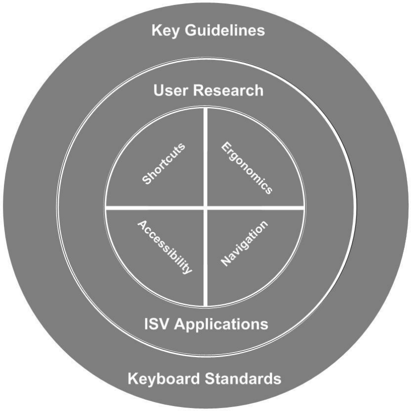
HSCIC Controlled Document

Figure 2: Current Scope for Keyboard Navigation and Shortcuts

##### 2.2.1 In Scope

The current scope is defined as follows:

- Devise a set of hypotheses relating to keyboard shortcuts

- Research existing standards for keyboard shortcuts

- Research published keyboard shortcuts information from application vendors

- Formulate a set of base recommendations for keyboard shortcuts

- Propose general 'common practice' principles as potential recommendations

- Suggest a roadmap for future research to complete the overall strategic scope

##### 2.2.2 Out of Scope

The following areas are out of current scope:

- Keyboard navigation

- Comprehensive set of recommendations for keyboard shortcuts

- User research and ergonomics investigation

Copyright ©2013 Health and Social Care Information Centre

Page 4

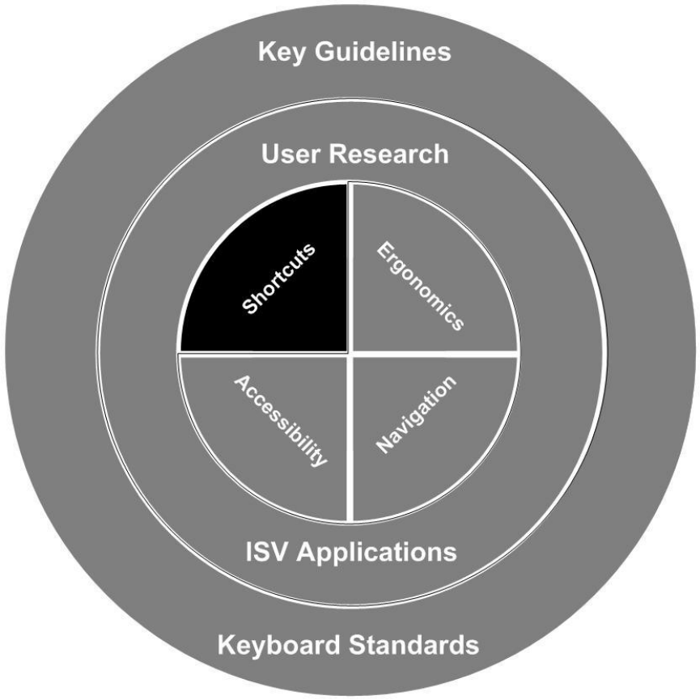
HSCIC Controlled Document

- User testing of recommendations

- Analysis of keyboard shortcut usage within existing NHS clinical applications

##### 2.2.3 Background

No international standards for keyboard navigation and shortcuts exist. However there are some 'de facto' standards which have been promoted by major software companies, some of which have become standard by commonality of use in productivity software and browsers. In addition there are sets of shortcuts used by assistive technology software to aid accessibility. Many of the above have been reviewed alongside existing Governmental and Authority guidelines.

No standards or common shortcuts exist within the NHS.

##### 2.2.4 Considerations

The following considerations apply to NHS keyboard shortcuts implementation.

_**2.2.4.1**_ _**Patient Safety**_

Patient safety is of prime importance across NHS clinical applications, where there is a need for both speed and accuracy during keyboard operation. Incorrect key presses may cause wasted time due to errors, such as lost data. In some cases the impact of a key press mistake may be much worse, causing potentially dangerous errors.

The keyboard shortcuts used across NHS clinical applications can affect patient safety in many ways. An example is the incorrect selection of functionality within an application. Where keyboard shortcuts have conflicting functions across NHS clinical applications it is possible for an operator to select the wrong function or menu option. This may not be immediately apparent to the operator, potentially causing incorrect updates to a patient record.

The proposed recommendations should enable a consistent implementation of keyboard shortcuts across NHS clinical applications. This in turn allows doctors, clinicians and other health professionals to use multiple applications in a consistent, efficient and safe manner.

**Note**

In all cases where keyboard conflicts currently occur it is important to ensure that the user will easily know that the wrong shortcut is being used.

_**2.2.4.2**_ _**Accessibility**_

From an accessibility perspective, users should be able to operate all aspects of the applications with just a keyboard. It should not be assumed that the mouse is the input device used by all users.

Keyboard shortcuts are a necessity for people who cannot use a mouse due to disability or unavailability of suitable hardware. The following groups of people particularly rely on keyboard shortcuts:

- Blind users of screen reader software (for example, Jaws®, WindowEyes™) who are reliant

on their own shortcuts

- Mobility impaired users who, for whatever reason, are unable to use a mouse

- Other non-mouse users (for example those with a broken or otherwise non-available

mouse)

From a legal perspective, the NHS has a responsibility to ensure that software can be used by [employees with disabilities. See Part II – Employment of the Disability Discrimination Act.](http://disability.gov.uk/)

Page 5

Copyright ©2013 Health and Social Care Information Centre

HSCIC Controlled Document

Some applicable accessibility guidelines include:

- IBM software guidelines 1.1 and 1.2

- Irish National Disability Authority (NDA) 1.1, 1.4, 1.5

- ISO standard 16071, sections 7.2.1 and 7.2.2

**Note**

Increasing accessibility, by utilising the most functional and intuitive shortcuts for non-mouse users improves the ergonomics of keyboard use for all users.

_**2.2.4.3**_ _**Construction**_

It is important that developers who design or modify applications ensure that shortcuts do not fail silently and that shortcuts do not perform hidden (unexpected) functionality silently.

- Provide feedback if a deprecated shortcut is activated by the user

- Provide feedback if context sensitive shortcuts are not used in the correct context

_**2.2.4.4**_ _**Ergonomic Factors**_

The following is a list of important ergonomic factors for keyboard usage:

- Users will have various hand size, causing varied user experiences with respect to

keyboard usage

- Left-handed and right-handed users will have different keyboard experiences. They will

have a natural tendency to use different hands for applying keyboard shortcuts

- A standard 101 keyboard provides two CTRL keys

- Keyboards other than the standard 101 type will alter the assumptions

##### 2.2.5 Assumptions

The following assumptions have been made in relation to keyboard shortcut research and recommendations:

- Keyboard shortcuts are essential for user accessibility

- All users should be able to operate all aspects of the applications with a keyboard

- Keyboard shortcuts act as "expert" accelerators to actions within IT applications

- Keyboard shortcuts are commonly used and relied on in existing NHS clinical applications

- Intuitive and recognised keyboard mappings are important

- Ergonomic factors must be considered

- Keyboard shortcut combinations which cause conflicts with other important applications will

have an impact on patient safety

- Users of NHS clinical applications will rely on familiarity with the keyboard to quickly

execute the keyboard shortcuts they require to complete a task

- Only standard 101 keyboards will be considered

- The majority of users are likely to be right-handed

- It is anticipated that a majority of users prefer to execute one-handed shortcuts

- We will not be able to analyse NHS clinical applications within the 'Quick Wins' timeframe

Page 6

Copyright ©2013 Health and Social Care Information Centre

HSCIC Controlled Document

##### 2.2.6 Hypotheses

The initial set of hypotheses are stated below. These must be tested through contextual research against current standards, analysis of actual shortcut usage and understanding the related clinical functionality.

During the 'Quick Wins' activity we are working from the following hypotheses:

1. **Preference for ALT key Keyboard Combinations**

Keyboard combinations based on the ALT key will be best for execution of clinically specialised actions within a NHS clinical application, because:

- The ALT key is ergonomically well positioned (bottom left of keyboard, easy access on most keyboards)

- ALT+letter is commonly used for application specific functionality, usually driving internal navigation within menu items

- ALT+number is not a commonly used combination, mostly restricted to WindowEyes screen reader, UK Government AccessKey Standards, and some other application specific functionality

- ALT+Function key is not commonly used and tends to be used for application specific functionality. An exception is ALT+F4, which is used for close or quit.

2. **Adhere to Commonly Recognised Keyboard Assignments**

Where commonly recognised keyboard shortcut assignments exist, such as CTRL+C for Copy, they should be implemented within NHS clinical applications, because:

- This will prevent potential conflicts between applications

- The user should not need to relearn common shortcuts

3. **Use Function Keys**

The F1 key is commonly recognized as the means for accessing Help information within an application. All other function keys should be used for application specific functions, because this is a commonly implemented practice within existing computer applications.

4. **Avoid Customisable Keyboard Layouts**

The use of keyboard layouts that are customisable within an application must be avoided because customisation is likely to introduce:

- Keyboard conflicts

- Confusion between the assignment of tasks to keyboard shortcuts

5. **Separate Clinically Significant Features**

Within the implementation of keyboard shortcuts, clinically significant functions must be spatially separated from other functions. This will reduce the potential for clinical errors. For example, a shortcut for prescribing dangerous drugs (such as CTRL+A) should not be placed near shortcuts for mundane tasks (such as CTRL+Z)

6. **Associate Keyboard Shortcuts with All Functions**

All functions must have an associated keyboard shortcut, which should comply with the relevant operating system, because:

- This is essential for accessibility for users who rely solely on the keyboard

- This is recommended by several accessibility guidelines

- It is a legal requirement Disability Discrimination Act 1995 (DDA parts II and III)

Page 7

Copyright ©2013 Health and Social Care Information Centre

HSCIC Controlled Document

7. **Avoid Conflicts with Existing Applications**

Conflicts with keyboard shortcuts within existing applications must be avoided, because such conflicts can have negative implications for patient safety, training and efficiency.

Conflicts with keyboard shortcuts are defined where two applications have:

- Two different actions that are assigned to the same keyboard shortcut

- Two different keyboard shortcuts that provide the same action within an application

Page 8

Copyright ©2013 Health and Social Care Information Centre

HSCIC Controlled Document

### 3 RESEARCH

#### 3.1 Sources

Information regarding existing keyboard shortcuts was gathered from the following sources.

##### 3.1.1 UK Government Accesskeys Standard

The UK government has issued guidelines for keyboard shortcuts that provide an alternative form of navigation on websites. These are becoming a standard and should be implemented on webbased applications where possible.

Accesskeys allow users with limited physical capabilities to navigate more easily. However, there are some drawbacks:

- Functionality depends on the type of operating system being used

- The attribute is only supported by MS Internet Explorer 4 and above and by Netscape 6x

versions

- With Windows [®] -based systems the user has to press the ALT key and the accesskey

- With the Macintosh system the user has to press the CTRL key and the accesskey

For more information, see the _UK government accesskey standards_ at the following location:

[http://www.cabinetoffice.gov.uk/e-government/resources/handbook/html/2-4.asp#2.4.4.](http://www.cabinetoffice.gov.uk/e-government/resources/handbook/html/2-4.asp#2.4.4)

##### 3.1.2 NHS Identity

The information on use of Government Accesskeys Standards within NHS web-based applications was obtained from the NHS Identity website as illustrated in Figure 3. The guidelines on this website set out the design style and technical standards for NHS websites. They are also applicable to web-based applications.

[For more information, see http://www.nhsidentity.nhs.uk/websites/index.htm](http://www.nhsidentity.nhs.uk/websites/index.htm) and navigate to _Keyboard shortcuts_ under the Websites tab.

Page 9

Copyright ©2013 Health and Social Care Information Centre

HSCIC Controlled Document

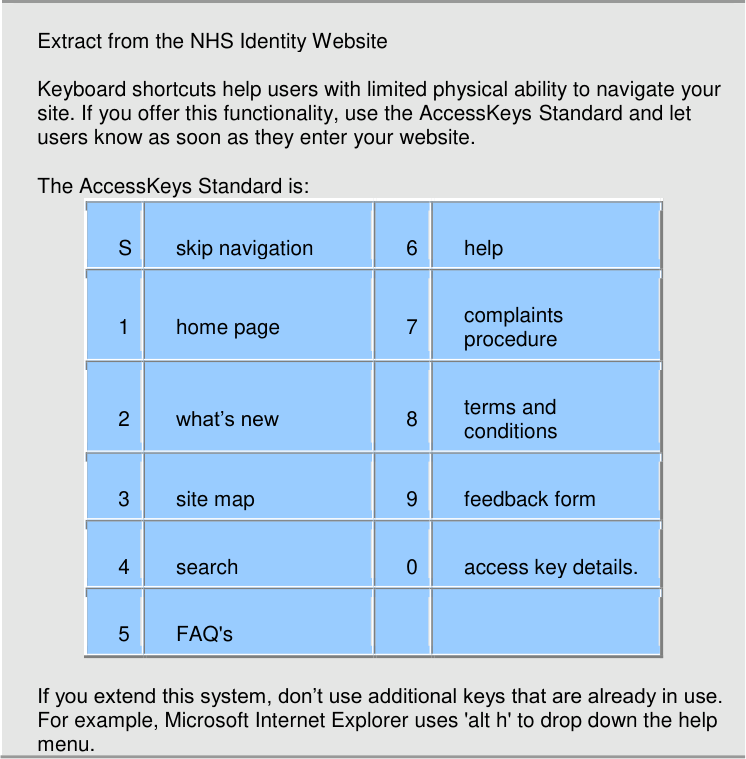

|S|skip navigation|6|help|
|---|---|---|---|
|1|home page|7|complaints procedure|
|2|what’s new|8|terms and conditions|
|3|site map|9|feedback form|
|4|search|0|access key details.|
|5|FAQ's|||

Figure 3: Extract from the NHS Identity Website

##### 3.1.3 Guidelines for Keyboard User Interface Design

This MSDN article describes the guidelines for designing a keyboard user interface for Microsoft Windows applications. It includes the following suggestions:

- Well designed applications must be useable even when the keyboard is the sole input

device

- Provide keyboard access to all features, and document the keyboard interface

"It is recommended that the keyboard be able to perform the same tasks as a mouse device…"

- Provide consistent keyboard shortcuts

"A consistent keyboard UI between applications helps users to learn and interact with new applications. An application must not affect any system-wide shortcut keys (a key or a combination of keys used to perform a command), such as the Windows logo key ( ) that opens the Start menu. An application must also follow commonly recognized shortcut key assignments, such as CTRL+C for Copy and CTRL+Z for Undo.

However, this does not mean that all shortcut keys need to be standardized or that applications must always be forced to support the same shortcut keys. For example, not all applications need to support CTRL+P for printing."

Page 10

Copyright ©2013 Health and Social Care Information Centre

HSCIC Controlled Document

- Keyboard UI Conflicts

"You can assign shortcut keys in various ways by using a combination of standard keys and modifier keys. However, this can cause conflicts with applications that provide global key sequences for proprietary features, as do many assistive technologies. To prevent conflicts, do not use the Windows global key sequences or common sequences for shortcut keys.

Keyboard UIs vary widely among assistive technologies, and may conflict with an application's shortcut keys. Therefore, provide custom shortcut keys for important keystrokes only, and avoid commonly used keys. For example, in many screen readers, users press the CTRL key to stop the speech review process. Therefore, you should perform usability studies on newly assigned shortcut keys and customizable shortcut keys to avoid conflicts with the system and other applications."

[This excerpt is taken from the Guidelines for Keyboard User Interface Design.](http://www.msdn.microsoft.com/library/default.asp?url=/library/en-us/dnacc/html/ATG_KeyboardShortcuts.asp?frame=true)

##### 3.1.4 Operating System Based Accessibility Guidelines

Sun and Microsoft have developed their own sets of software accessibility guidelines. These incorporate information and guidelines about keyboard access and shortcut key mappings generally.

_**3.1.4.1**_ _**Sun Accessibility Quick Reference Guide**_

This guide provides tips for making websites more accessible. It includes the following information:

" _Comprehensive keyboard access is essential for users with physical and visual disabilities who_ _cannot utilize a mouse:_

- Provide comprehensive keyboard access to application features.

- Follow the key mapping guidelines in your environment's style guide."

[See the Sun Accessibility Quick Reference Guide for more details.](http://www.sun.com/access/developers/access.quick.ref.html)

_**3.1.4.2**_ _**Microsoft Accessibility Guidance**_

[General Microsoft guidelines on accessibility issues are available at Microsoft Accessibility](http://www.microsoft.com/enable/) [Guidance.](http://www.microsoft.com/enable/)

Microsoft also provides a comprehensive list of keyboard shortcuts for Microsoft products. See the [Keyboard Shortcuts](http://www.microsoft.com/enable/products/keyboard.aspx) list.

##### 3.1.5 General Accessibility Guidelines

There are a range of general accessibility guidelines available to assist in the development of software applications. Most include reference to keyboard access. Two sources are listed below:

_**3.1.5.1**_ _**IBM Software Accessibility Guidelines**_

IBM has a set of general guidelines to help develop accessible software. Guidelines 1.1 and 1.2 specifically relate to keyboard access.

- 1.1 Provide keyboard equivalents for all actions

- 1.2 Do not interfere with keyboard accessibility features built into the operating system

[See the IBM Software Accessibility Guidelines for more details.](http://www-3.ibm.com/able/guidelines/software/accesssoftware.html)

Page 11

Copyright ©2013 Health and Social Care Information Centre

HSCIC Controlled Document

_**3.1.5.2**_ _**Irish National Disability Authority**_

Irish National Disability Authority (NDA) has developed a set of accessibility guidelines for application software. These guidelines cover application software running under any operating system or runtime environment. Guidelines 1.1 and 1.4 specifically relate to keyboard access.

- 1.1 Ensure that users have access to the operating system accessibility tools, without

affecting application functionality (Priority 1)

- 1.4 Adhere to the standard keyboard access methods (Priority 1)

- 1.5 Do not require the use of a pointing device (Priority 1)

[See the NDA accessibility guidelines for application software](http://accessit.nda.ie/technologyindex_4.html) for more details.

##### 3.1.6 Web Conte n t Accessibility Guidelines (WCAG)

The W3C WAI WCAG guidelines relate to the web. Guidelines 6.4, 9.5, and 9.5 relate to keyboard access.

- 6.4 For scripts and applets, ensure that event handlers are input device independent (P2)

- 9.4 Create a logical tab order through links, form controls, and objects (P3)

- 9.5 Provide keyboard shortcuts to important links (P3)

Although these are guidelines for the web, they have been included here for completeness.

[See the web content accessibility guidelines at W3C Web Accessibility Initiative (WAI) Web](http://www.w3.org/TR/WCAG10/full-checklist.html) Content Accessibility Guidelines (WCAG).

##### 3.1.7 Disability Discrimination Act

The Disability Discrimination Act (DDA) aims to end the discrimination which many disabled people face. This Act gives disabled people rights in the areas of:

- Employment

- Access to goods, facilities and services

- Buying or renting land or property

The employment rights and first rights of access came into force on 2 December 1996; further rights of access came into force on 1 October 1999; and the final rights of access came into force in October 2004.

[See the Disability Discrimination Act for more details.](http://disability.gov.uk/)

##### 3.1.8 ISO Standards

**ISO 16071** : Ergonomics of human-system interaction – Guidance on accessibility for humancomputer interfaces. This standard is aimed at providing help and support to the software designer of applications software.

[Sections 7.2.1, 7.2.2 and 7.4 are particularly relevant to keyboard access.](http://www.iso.org/iso/en/ISOOnline.frontpage)

##### 3.1.9 Other Documents

_**Instrumented Keyboard and Mouse Study: Keyboard Use Summary**_

Lisa Kimmerly (5/11/05)

This handbook documents user research undertaken for keyboards in the Microsoft Hardware Design Group. It is designed to be a reference for use within Microsoft for hardware and software designers, mechanical engineers, current and future usability researchers, and other

Page 12

Copyright ©2013 Health and Social Care Information Centre

HSCIC Controlled Document

appropriate groups. The last section (MSDN Guidelines) is for use to external developers who use Microsoft product development guidelines.

This document offers some interesting statistics about keyboard usage, for example keyboard usage generally per hour by use of various keys.

_**Handbook for Keyboard Design**_

Melissa Jacobson, 56seven8 design, inc.

30 June 2004

This report details research undertaken at the beginning of May in 2004. Microsoft Wireless Optical Desktop (WOD) and WOD-Elite sets were deployed to over 75 primary users, along with tracking software developed by Pawin Suthapong which monitored the use of both mouse and keyboard hardware.

Data was automatically uploaded to servers every 24 hours and compiled weekly for up to six months (business users) or nine months (home users).

The average length of participation (adjusted for technical difficulties and occasional nonuse) was: 32 weeks for novice home users, 39 weeks for experienced home users, and 26 weeks for business users.

In this report, all single stroke keyboarding activities are presented in summary form per total active hour of use.

_**3-Month Real People, Real Data Report (3/22/2002)**_

Hugh McLoone

This report details research undertaken during March 2002. 27 participants in 12 homes in Chicago and Phoenix used either a Microsoft Office Keyboard or a Microsoft Natural Keyboard Pro in their homes. This study was conducted to record key usage among “real” people using Microsoft keyboard products. Computers were instrumented with tracking software to record key actuations and key repeats including key combinations.

Results concluded that:

- Nearly everyone used the letters, numbers across the top, tilde (~), Enter, space

bar, Delete and Backspace keys.

- Approximately half of the participants used the numbers on the number pad.

- The space bar was used 311 key depresses per day on average (850 key

depresses per hour of active use of keyboard).

- The letter “E” was the most frequently used QWERTY key at 165 key depresses per

day on average (456 key depresses per hour of active keyboard use).

_**3.1.9.1**_ _**Notes from the Microsoft Product Group Regarding Keyboard**_ _**Usage**_

Some general notes from the Microsoft Product Group:

- Sixteen users of the Wireless Optical Desktop Elite set responded to a question about

whether they had “discovered” the shortcut markings on the keyboard. Of those, 10 (63%) said “yes”, 4 (25%) said “no”, and 2 (12%) said they were already familiar with the shortcuts.

- When asked if they thought these markings might be useful, 15 responded. 10 (67%) said

“yes”, 4 (27%) said they were already familiar and didn’t need any reminders, and 1 (6%) said those keys were not working correctly anyway.

Page 13

Copyright ©2013 Health and Social Care Information Centre

HSCIC Controlled Document

- Of the 43 people who responded to a question about how they felt about having shortcut

markings on their keyboard, 1 (2%) said “hate it”, 7 (16%) said “like somewhat”, 18 (42%) said “like quite a bit”, and 17 (40%) said “love it”.

- Asked how often they might utilize these markings, 1 (2%) said “never”, 16 (36%) said “a

little”, 17 (39%) said “quite a bit”, and 10 (23%) said “daily”.

- Although the markings seemed popular and useful, only 32% (14) said they would require

these markings on future keyboards.

Interpretation of these findings is that while the markings on the keyboard lead to the discovery of shortcuts, once people “know” them, they do not need reminders.

One alternative to having multiple key depressions to perform shortcut tasks would be to have single touch functionality on the keyboard (perhaps as a replacement to “new, open, close” or “reply, fwd, send” on the alternate functionality of the function keys).

##### 3.1.10 Application Shortcuts

The research sources included over 3,000 shortcuts from 18 commonly used applications, browsers and accessibility products. The included shortcuts were mostly extracted from on-line help files for the various applications.

_**3.1.10.1**_ _**UK Government AccessKeys Standards**_

**General applications**

- Mac

- Microsoft Windows

**Productivity applications**

- Office XP

- Word

- Excel

- PowerPoint

- Outlook

- StarOffice™ (Sun™)

**Browsers**

- Firefox [®]

- Mozilla

- IE5/6

- Netscape [®]

- Opera

**Adaptive technologies**

- Jaws [®]

- WindowEyes

- ZoomText [®]

**NHS**

- EMIS™

Page 14

Copyright ©2013 Health and Social Care Information Centre

HSCIC Controlled Document

- InPractice

Page 15

Copyright ©2013 Health and Social Care Information Centre

HSCIC Controlled Document

### 4 RECOMMENDATIONS

The following recommendations apply to the use of NHS keyboard shortcuts across all operating systems and clinical applications.

The recommendations are split into two areas:

- **Current Recommendations**

Recommendations based on research undertaken during the Quick Wins phase. Comprises examples of specific shortcuts to use for the associated functionality in all applications

- **Potential Recommendations**

Principles based on experience of 'common practice'. These must be validated through further research, analysis of existing clinical applications and user testing.

#### 4.1 Current Recommendations

The following recommendations include tables listing suggested mappings between shortcut keys and functions. Where matching functions exist in an application the related shortcut keys should be used.

An explanation of the general justifications, benefits and drawbacks associated with all of these recommendations is included at the end of this section. Specific justifications, benefits and drawbacks are included within each recommendation.

##### 4.1.1 ALT Key Shortcuts

The following table lists recommended ALT key shortcuts. The Government Access Standards are included as they are the only standards available. (These standards apply to websites generally, but can be extended to web-based applications.)

ALT+F4 Quit Application

ALT+V View Menu

ALT+E Edit Menu

ALT+F File Menu

ALT+H Help Menu

ALT+HOME First/Homepage

ALT+TAB Switch Windows

ALT+ESC Display Next

ALT+1 Homepage (Government AccessKey standards)

ALT+2 What's New (Government AccessKey standards)

ALT+3 Site Map (Government AccessKey standards)

ALT+4 Search (Government AccessKey standards)

ALT+5 FAQs (Government AccessKey standards)

ALT+6 Help (Government AccessKey standards)

ALT+7 Complaints Procedure (Government AccessKey standards)

ALT+8 Terms and Conditions (Government AccessKey standards)

ALT+9 Feedback Form (Government AccessKey standards)

Page 16

Copyright ©2013 Health and Social Care Information Centre

HSCIC Controlled Document

ALT+0 Access Key Details (Government AccessKey standards)

ALT+S Skip Navigation (Government AccessKey standards)

Figure 4: ALT Key Shortcuts

Figure 5: Recommended ALT Key Shortcuts

_**4.1.1.1**_ _**Justification**_

ALT keys were found to be in general use as menu shortcuts within MS Windows. In particular, some combinations are very likely to be found as menu shortcuts. Those menu shortcuts that were found to be common across applications were suitable for recommendation. Additional navigation keys were also found to have common functionality.

The Government AccessKeys standard ALT key definitions were added to the list as the only set of actual standards currently available. Applicability is questionable as these are standards for web usage and they are not strictly adhered to anyway. Further investigation is required before these can be fully ratified as a recommendation that applies in all contexts.

Special note is also given for the use of ALT-F4 key combination which would have severe implications should it be used for anything other than to quit an application.

- It is ergonomically well positioned (bottom left of keyboard, easily accessed with smallest

finger of left hand)

- ALT+letter is commonly used for application specific functionality, usually opening

application menus

- ALT+number is not a commonly used combination, mostly restricted to WindowEyes screen

reader, UK Government AccessKey Standards, and minimal other application specific functionality

- ALT+Function key is not commonly used and tends to be used for application specific

functionality (the exception is ALT+F4 which is used for close or quit)

_**4.1.1.2**_ _**Benefits**_

- Ergonomically friendly, in that users can use one handed execution, using the smallest

finger for ALT and index or thumb for letter/number

- ALT+Function key for clinically significant shortcut keys is recommended (spatial distance

is enough to separate from mundane keys)

Page 17

Copyright ©2013 Health and Social Care Information Centre

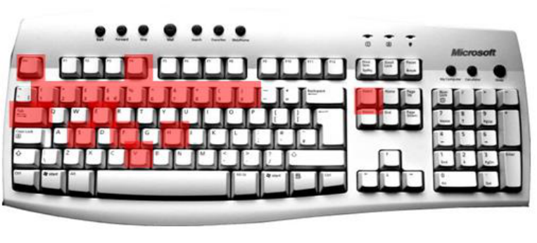
HSCIC Controlled Document

_**4.1.1.3**_ _**Drawbacks**_

 ALT+number – potential conflicts with Government AccessKeys (and other applications)

##### 4.1.2 Function Key Shortcuts

The following tables list recommended Function key shortcuts.

_**General Function Key Shortcuts**_

Use the following Function keys for all applications and in most contexts:

F1 Help

Figure 6: General Function Key Shortcuts

Figure 7: Recommended Function Key Shortcuts (General)

_**Browser Function Key Shortcuts**_

In addition to the general function key shortcuts, for browsers we recommend using the following keys for the listed functions, based on general user expectations.

F5 Refresh/reload

F11 Full Screen

Figure 8: Browser Function Key Shortcuts

Page 18

Copyright ©2013 Health and Social Care Information Centre

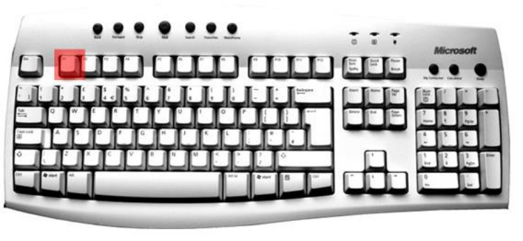
HSCIC Controlled Document

Figure 9: Recommended Function Key Shortcuts (Browser)

_**Justification**_

Function keys are generally considered to be application specific. However it was noted that one key was used consistently across sources. This was the F1 key which is used for Help in some form across all the applications looked at.

Other function keys have some potential for cross application conformity (for example within browsers) but further research is required to finalise these considerations.

_**Benefits**_

- Quick, single key press - efficiency

##### 4.1.3 Control Key Shortcuts

The following tables list recommended CTRL key shortcuts.

_**General Control Key Shortcuts**_

Use the following CTRL keys for all applications and in most contexts.

CTRL+A Select All

CTRL+S Save

CTRL+F Find/Search

CTRL+Z Undo

CTRL+X Cut

CTRL+C Copy

CTRL+V Paste

CTRL+N New

CTRL+W Close

CTRL+Y Redo/Repeat

CTRL+O Open

CTRL+P Print

Page 19

Copyright ©2013 Health and Social Care Information Centre

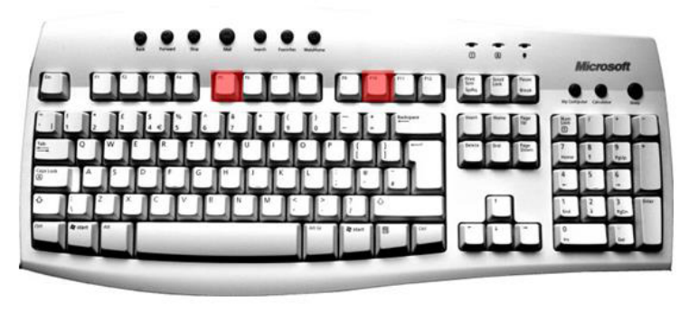
HSCIC Controlled Document

CTRL+F4 Close

Figure 10: Recommended CTRL Key Shortcuts (General)

_**Text Editing Control Key Shortcuts**_

In addition to the general control key shortcuts, the following shortcut keys are recommended for text editing applications, based on general user expectations:

CTRL+E Centre

CTR+R Right align

CTRL+T Indent

CTRL+U Underline

CTRL+I Italics

CTRL+G Go to

CTRL+J Justify

CTRL+K Hyperlink

CTRL+L Left align

CTRL+B Bold

Page 20

Copyright ©2013 Health and Social Care Information Centre

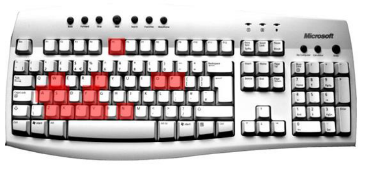
HSCIC Controlled Document

Figure 11: Recommended CTRL Key Shortcuts (Text Editing)

_**Browser Control Key Shortcuts**_

In addition to the general control key shortcuts, for browsers it is recommended the following keys are used for the listed functions, based on general user expectations.

CTRL+Q Exit

CTR+E Web search

CTRL+R Refresh

CTRL+U View Source

CTRL+H History

CTRL+L New Location

Figure 12: Browser Control Key Shortcuts

Figure 13: Recommended CTRL Key Shortcuts (Browsers)

_**Justification**_

Certain CTRL keys were found to share commonality across applications. Those that had shared commonality across most, if not all applications were suitable for recommendation.

These were placed into three sub-categories based on usage context. The usage contexts were:

Page 21

Copyright ©2013 Health and Social Care Information Centre

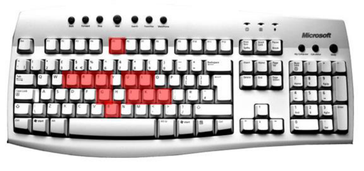

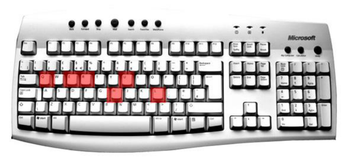
HSCIC Controlled Document

- General

- Text Editing

- Browsers

Differentiating these categories helps reduce unnecessary conflicts and provides better guidance to developers. Splitting into these categories also helps to consider assistive technology applications which have specific usage contexts and which might otherwise appear as conflicts with general application use.

_**Other General Shortcuts**_

The following tables list other recognized common shortcuts:

TAB Move through fields on the screen

SHIFT+TAB Move through fields on the screen (opposite direction)

ARROW KEYS Move through patient records

ESC Cancel action

Figure 14: Other Recognized Shortcuts

Figure 15: Recommended General Shortcuts

_**Justification**_

These shortcuts were found to have the same function across most applications.

##### 4.1.4 General Justifications

The justification for the current recommendations was determined by analyzing a number of keyboard shortcuts in use, over a number of different applications and sources, to look for common patterns of usage and levels of conflicts.

Each keyboard shortcut was analysed for its usage across the featured applications and sources.

Where conflicts occurred the usage context was taken into consideration such that shortcut keys that are used under widely different circumstances were not considered to be major conflicts.

A dynamic list of keyboard shortcuts and their associated conflicts from the currently selected sources is being used as part of the ongoing research process.

Page 22

Copyright ©2013 Health and Social Care Information Centre

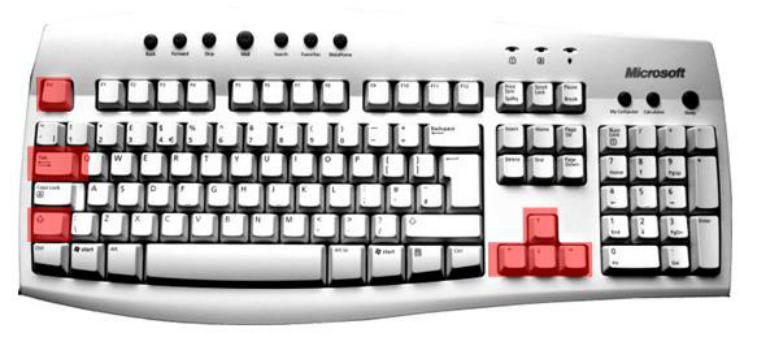
HSCIC Controlled Document

The primary considerations given to whether a keyboard shortcut should be recommended for use are:

- Patient Safety

- Governmental Standards

- Lack of conflicts with adaptive technology shortcuts

- Lack of major functional conflicts with existing applications

- Level of commonality of use across popular applications

- Ease of use with appropriate mapping between letter and function

##### 4.1.5 General Benefits

- Avoids cognitive conflicts

- Prevents potential conflicts between applications

- Users will not have to "relearn" common shortcuts

- Reduces potential for patient safety issues (for example dangerous conflicts)

##### 4.1.6 General Drawbacks

There is always potential for conflict in these recommendations. It is impossible to eliminate conflicts, they can only be minimized.

#### 4.2 Potential Recommendations

These recommendations are not based on existing standards but rather are based on experience from common practice. These recommendations must be tested through user research and further investigation. An explanation of the justifications associated with all of these recommendations is included at the end of this section.

1. Keep Shortcuts Simple

Shortcuts must be simple, intuitive and easy to remember. Try to avoid shortcuts that use more than 2 key presses, for example, CTRL+SHIFT combinations. Shortcuts with more complicated key presses are difficult to remember and execute.

Also, try to use an appropriate mapping between letter and function. Simple mapping helps users recall a shortcut combination.

2. Use Common Shortcuts

Use commonly recognised and existing shortcuts wherever possible, to meet with users' existing expectations and prevent them having to "relearn" shortcuts. Fitting in with user expectations generally reduces the potential for confusion and avoids cognitive conflicts.

Some examples of common shortcuts in Microsoft Windows are:

 F1 for Help

 CTRL+C for Copy

 CTRL+V for Paste

3. Avoid Conflicts That Cause Confusion

The NHS uses a large number of applications, which is likely to lead to shortcut conflicts. Avoid creating more confusion by only employing shortcuts that do not conflict with other applications.

Page 23

Copyright ©2013 Health and Social Care Information Centre

HSCIC Controlled Document

Further research needs to be undertaken to determine the significance of conflicts.

4. Avoid Dangerous Conflicts

In particular, do not use shortcuts that will conflict with any shortcuts used for opposite or contradictory features in existing applications, for example, do not use a shortcut for **Close** **and Save** if an identical shortcut for **Close without Saving** exists in another application.

Further research needs to be undertaken to determine the significance of conflicts.

5. Where possible, use single key press shortcuts

For speed and efficiency, make use of single key press shortcuts (for example, the function keys) for application specific functionality as much as possible.

The exception is F1 which should always invoke a help function of some description.

6. Use simple CTRL and ALT shortcut combinations

For mundane and general application specific tasks, where possible use simple CTRL and ALT shortcut combinations. These are the keys most comfortably accessed using smallest finger for depressing CTRL or ALT key and then index finger or thumb for second key press (assuming left hand usage). See later justification of recommendations.

Use ALT+letter for recognized functions such as opening menus. These are generally application specific but some are recognized, such as ALT+F for file, ALT+H for Help.

Use CTRL+letter for recognized functions, for example, in text editing mode use CTRL+C for copy, etc.

7. Separate clinically significant functions from the mundane

Where possible spatially separate clinically significant functions on the keyboard from mundane and general application specific features, to avoid unnecessary clinical errors. Ensure the user has to move their hand from its natural comfort zone to perform these tasks.

##### 4.2.1 Justification

Speed and accuracy are central to NHS work. Consequently, the keyboard manipulation that is required to enter and work with data, such as patient records, is at the heart of efficiency and safety.

Best practice dictates:

- Quick and easily remembered shortcuts

- Intuitive mappings of shortcuts to functions

- Consistent mappings of shortcuts to existing functions where possible

_**Modes of Operation**_

When using IT applications users probably prefer one handed execution of keyboard shortcuts, as opposed to two. Most users are right handed (9 out of 10 people are right handed), so for these users the natural inclination is to use the left hand to execute keyboard shortcuts. The right hand will be busy doing other things like jotting notes, using mouse in tandem, etc.

Patient engagement is also a consideration. Within the office setting where the patient and clinician are sitting together, the orientation of their bodies will affect the availability of hands to execute shortcuts. The natural inclination is to have the patient to the right of the clinician with the clinician's body turned slightly towards the patient. This setup lends itself also to left handed execution of shortcuts.

Page 24

Copyright ©2013 Health and Social Care Information Centre

HSCIC Controlled Document

_**Preferred Shortcuts**_

The preferred keyboard shortcuts are probably going to be those that favour short, intuitive key presses reached comfortably with the left hand. As the left hand rests naturally at the bottom left of the keyboard these will be key presses using the CTRL and ALT keys (also these are commonly recognised keys used to invoke shortcuts).

Figure 16: Keyboard Hotspots

Assuming the smallest finger holds down the CTRL or ALT key, key presses located in the lower to upper, and left to middle of the keypad are optimum.

The most natural and easiest to execute two-finger combinations are:

- Smallest finger with index finger (making optimum key presses CTRL or ALT+R,T,Y,U or

numbers)

- Smallest finger with thumb (making optimum key presses CTRL or ALT+V,B,N,M)

One finger key presses are also easy, making function keys ideal possibilities.

Additionally, users will not mind moving their left hand from its natural position to the arrow keys or num pad for simple, single key press actions.

Page 25

Copyright ©2013 Health and Social Care Information Centre

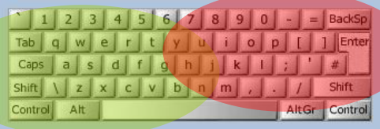

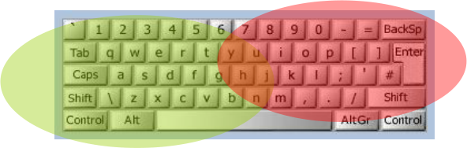
HSCIC Controlled Document

_**Hotspots**_

Optimum hotspots for using two key presses involving CTRL and ALT keys occur with the smallest finger depressing the CTRL or ALT key and the second key press executed using the index finger or thumb.

#### Easy zone (optimum hotspot)

Figure 17: Keyboard Hotspots

**Within the easy zone (optimum hotspot):**

- Certain keyboard shortcuts cannot be changed and must be used for the recognised

function, for example:

 CTRL+C=copy

 CTRL+X=paste

- Certain keyboard shortcuts must not be used due to already too many existing conflicts, for

example:

 ALT+F

- Certain keyboard shortcuts are more likely candidates due to their use as application

specific shortcuts only:

 These are mostly based around the ALT key

**Within the difficult zone:**

- Place clinically significant functions that may affect patient safety within the difficult zone,

to avoid unnecessary clinical errors.

Page 26

Copyright ©2013 Health and Social Care Information Centre

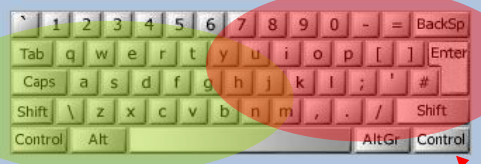

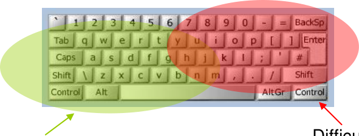
HSCIC Controlled Document

### 5 FUTURE RESEARCH

The research into keyboard shortcuts is an ongoing piece of work, with recommendation lists being refined and developed as further investigations are made.

Areas for proposed further research and work include:

- Establish clinical patterns of actual keyboard usage

- Gather feedback about general keyboard shortcut awareness

- Determine the usage of adaptive technologies within the NHS

- Incorporate ISV keyboard shortcuts into the master spreadsheet

- Categorise applications according to importance/clinical safety and usage

- Perform further research into ergonomics of keyboard usage

- Produce developing and refined recommendation lists

Figure 18: Next Steps for Research

**Note**

There is no specified time sequence for these steps. They may be completed in parallel, as relevant information becomes available.

Page 27

Copyright ©2013 Health and Social Care Information Centre

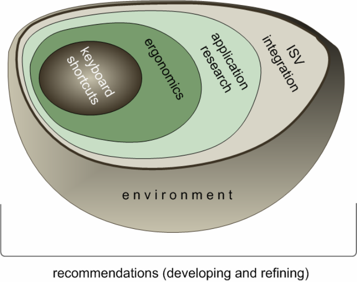
HSCIC Controlled Document

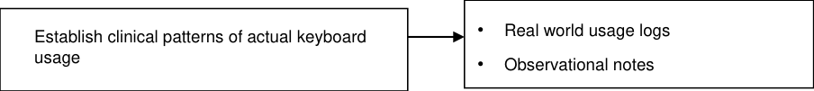

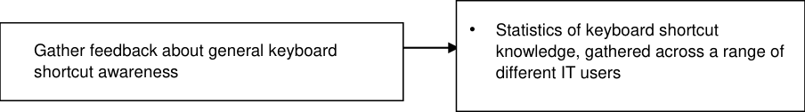

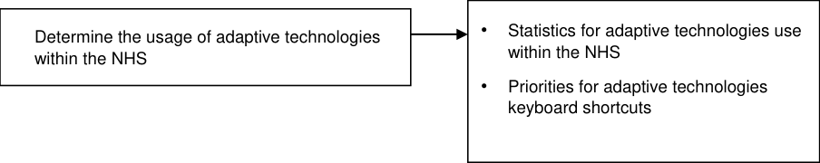

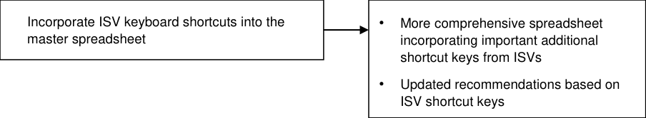

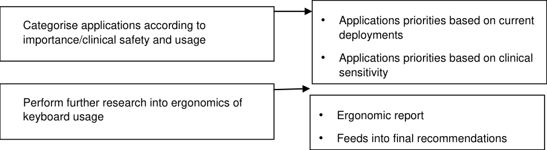

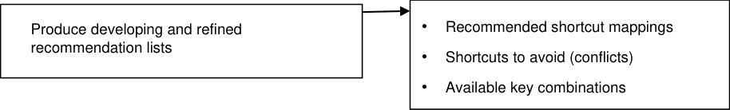

Figure 19: Summary of Future Research Steps

#### 5.1 Establish Clinical Patterns of Actual Keyboard Usage

Perform observations of NHS staff in their working environment:

- Use logging sheets to record keyboard shortcuts used in typical processes:

 What keyboard shortcuts are used for?

 What shortcuts map to what functions?

Copyright ©2013 Health and Social Care Information Centre

Page 28

HSCIC Controlled Document

 With what application?

- How do users execute shortcut commands, what is the preferred method:

 One hand?

 Two hands?

 Issues with change from normal hand position?

- What difficulties are encountered, record and ask why

- Preferred usage (one/two hands, left/right hand), record and question why

This will help to confirm both established and optimally efficient shortcuts.

#### 5.2 Gather Feedback about Keyboard Shortcut Awareness

Present questionnaires to establish usage and familiarity. The questionnaires will be presented to:

- A cross-section of the target users (NHS staff)

- A cross-section of other general users of IT Applications (non-NHS staff)

This will help establish which keyboard shortcuts are commonly known and the proportion of users using these on a regular basis.

#### 5.3 Determine Usage of Adaptive Technologies

Contact established adaptive technology users and other relevant sources within the NHS to determine:

- What % of staff use adaptive technologies within the NHS?

- What are the most commonly used technologies, for example:

 Screen readers – JAWS, WindowEyes

 Screen magnifiers – ZoomText, SuperNova

**Note**

Predict that the most commonly used screen reader in the NHS is JAWS, it is by far the most popular generally. According to the research so far, JAWS conflicts minimally with other applications and uses unusual keystrokes - so should not cause too many problems with conflicts. WindowEyes on the other hand conflicts far more frequently; however it is not a widely used screenreader. Research needs to be carried out to confirm real world usage.

Will help establish priorities for adaptive technologies keyboard shortcuts which will influence the final recommendations.

Page 29

Copyright ©2013 Health and Social Care Information Centre

HSCIC Controlled Document

Figure 20: Conflicts

#### Conflicts, important?

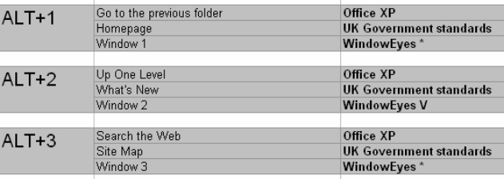
#### 5.4 Collate and Analyse ISV Keyboard Shortcuts Information

Collect as many existing ISV shortcut keys for inclusion as is possible:

- Some information will come from observations made during hospital visits, using the

logging sheets

- Some information will come from other sources, such as the ISVs themselves

**Note**

Need to establish as many applications currently in use in the NHS as we can and get the (most common) shortcut keys used with these applications.

Will allow more comprehensive recommendations to be made based on specific clinical functionality and associated keyboard shortcuts.

#### 5.5 Categorise Applications According to Importance/Clinical Safety and Usage

This process involves collecting information on which platforms, operating systems and software applications are used within the NHS.

Suggestions include:

- Questionnaires to IT managers

- Target buyers and decision makers

Will better target recommendations to the specific needs of the NHS environment, according to the most commonly used applications.

Page 30

Copyright ©2013 Health and Social Care Information Centre

HSCIC Controlled Document

Figure 21: Application List

#### Categorise according to i

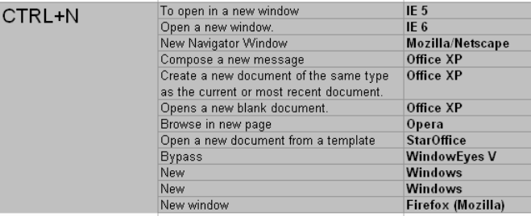
#### 5.6 Perform Further Research into Keyboard Ergonomics

Research relevant papers, books, document observations made during hospital visits and perform a number of real user tests to gather qualitative and quantitative data.

This will help to determine:

- Favoured hotspots

- Ergonomic efficiency, for example, with one hand

 CTRL Z and CTRL X easy

 CTRL O, CTRL P difficult

 Preferred method – one handed or two handed

 Change of resting/normal hand position to perform the shortcut

 Effectiveness of alternate keyboard layouts – not everyone uses a standard keyboard

Will extend recommendations based on existing research.

#### 5.7 Produce Developing and Refined Recommendation Lists

Producing extended and refined recommendation lists based on the research. These lists will outline:

- Commonly used keyboard shortcuts which must maintain a consistent mapping to existing

functions

- Potential areas of concern regarding existing conflicts

- Keyboard shortcuts that are available for as yet undefined application specific use

Refined recommendation lists will develop in parallel to research undertaken.

Page 31

Copyright ©2013 Health and Social Care Information Centre

HSCIC Controlled Document

Figure 22: Recommendations Lists

**Note**

#### Refine and develop recommendations lists

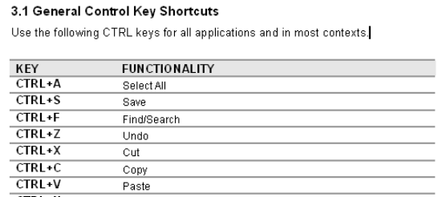

Specifications for the required applications will help clarify further research and direct analysis to provide more focused recommendations, for example, knowledge of likely menu items allows recommendation to be made regarding appropriate ALT+shortcuts for activating these menu options.

#### 5.8 Future Considerations

##### 5.8.1 Management

A complete recommendation for keyboard shortcuts must also look at the management of these shortcuts in the future. This includes considering:

- Storing a dynamic keyboard shortcuts list/database

- Distributing shortcut definitions and guidelines to ISVs

- Ensuring information provided to ISVs is always up to date

- Managing requests for changes and additions

##### 5.8.2 Documentation

There is a requirement for good documentation and educational assistance for the shortcuts that are available - to aid learning and memory.

##### 5.8.3 Use of Sticky Keys

Sticky keys are a method of typing where modifier keys, such as CTRL, ALT, and SHIFT will "stick" down and apply to the next keystroke, so that only one key needs to be pressed at a time. This is extremely useful for people who have motor impairments that make it difficult to press combinations of keys at the same time.

Applications must support sticky key features. This may need emphasising in documentation and education to highlight these features for end users.

##### 5.8.4 Internationalisation

Keyboard mappings vary across global regions; for a complete set of recommendations these variations should be considered:

##### 5.8.5 Non-Standard 101 Keyboards

There are many types of keyboard currently in use. These include:

- Ergonomic keyboards

Page 32

Copyright ©2013 Health and Social Care Information Centre

HSCIC Controlled Document

- Peripheral keyboards (mobile add-ons)

- Laptops

- Mini Keyboards

- Left Handed Keyboards

- Programmable Keyboards

Non-standard 101 keyboard devices will have different keyboard shortcut requirements.

##### 5.8.6 Non-Standard Devices

There are many types of non-standard devices in use. These include:

- Tablet PCs

- Personal Digital Assistants (PDAs)

Non-standard devices will have different keyboard shortcut requirements.

##### 5.8.7 Dvorak Keyboard Layout

The Dvorak keyboard rearranges the keys on the keyboard so that highest frequency keys are located on the home row, with lower frequency keys on the other rows.

Dvorak keyboard users will have very different keyboard shortcut requirements.

Page 33

Copyright ©2013 Health and Social Care Information Centre

HSCIC Controlled Document

### 6 DOCUMENT INFORMATION

#### 6.1 Terms and Abbreviations

CSA Clinical Spine Application

CUI Common User Interface

DDA Disability Discrimination Act

ISV Independent Software Vendor

LSP Local Service Provider

NDA Irish National Disability Authority

NHS National Health Service

NHS CFH NHS Connecting for Health

PDAs Personal Digital Assistants

WAI Web Accessibility Initiative

WCAG Web Content Accessibility Guidelines

WOD Wireless Optical Desktop

DDA Disability Discrimination Act 1995

Table 1: Terms and Abbreviations

#### 6.2 Definitions

NHS Entity Within this document, defined as a single NHS organisation or group that is operated within a single technical infrastructure environment by a defined group of IT administrators.

The Authority The organisation implementing the NHS National Programme for IT (currently NHS Connecting for Health)

Current best practice Current best practice is used rather than best practice, as over time best practice guidance may change or be revised due to changes to products, changes in technology, or simply the additional field deployment experience that comes over time.

Table 2: Definitions

#### 6.3 Nomenclature

All content subject to completion, agreement or verification is denoted with highlighting.

Code, script and markup languages are denoted with `monospace text` .

#### 6.4 Audience

The audience for this document includes:

- **Authority CUI Manager / Project Sponsor** . Overall project manager and sponsor for the

NHS CUI project within the Authority.

- **Authority NHS CUI Design Guide Workstream Project Manager.** Responsible for

ongoing management and administration of the workstream.

Page 34

Copyright ©2013 Health and Social Care Information Centre

HSCIC Controlled Document

- **The Authority Project Team** . This document defines the approach to be taken during this

assessment and therefore must be agreed by the Authority.

- **Microsoft NHS CUI Team** . This document defines the approach to be taken during this

assessment, including a redefinition of the NHS CUI Design Guide Workstream strategy.

#### 6.5 Open Issues

Open issues are cross-referenced against items in the Acceptance Tracking log.

Copyright ©2013 Health and Social Care Information Centre

Page 35

HSCIC Controlled Document

### CHANGE RECORD

Each change description will be associated with a section reference within this document.

16 May 2005 Maggie Thomson 0.1 Draft Initial version

19 May 2005 Maggie Thomson 0.2 Draft Revised after review by Paul Robinson and Jarnail Chudge

19 May 2005 Maggie Thomson 0.3 Draft New template

03-Jun-2005 Maggie Thomson and Graeme Benson

0.0.0.4 Draft Restructured and substantially reworked in preparation for customer review

11 [th] May 2006 L Boardman-Rule 0.0.0.5 Draft First copyedit complete

26 [th] May 2006 L Boardman-Rule 0.0.0.6 Draft Author comments incorporated and reviewed.

31-May-2006 Vivienne Jones 1.0.0.0 Baseline Baselined ready for conversion to PDF

**Copyright:**

You may re-use this information (excluding logos) free of charge in any format or medium, under the terms of the Open Government Licence. To view this licence, visit [nationalarchives.gov.uk/doc/open-government-licence or email psi@nationalarchives.gsi.gov.uk.](https://web.nhs.net/OWA/redir.aspx?C=dMnSAL43xUOp9X_SOcscV9mT5A0smdBIh1_vxjdSDVCERI33v7-idn6tNFCNwJYUR1PxIW-Hd-E.&URL=http%3a%2f%2fnationalarchives.gov.uk%2fdoc%2fopen-government-licence)

Page 36

Copyright ©2013 Health and Social Care Information Centre
