Prepared for

NHS Connecting for Health

Wednesday, 28 March 2007

Version 1.0.0.0 Baseline

Prepared by

NHS CUI Programme Team

mscui@microsoft.com

Contributors

Igor Laketic

Martin Storey

Microsoft and NHS Connecting for Health Confidential

This document has been prepared for the NHS CUI project and is subject to the terms and conditions of the Development Agreement between Microsoft and the
Secretary of State for Health in respect of the project. The document may contain information or work product that is Microsoft pre-existing work and/or
information or work product that has been created specially for the purposes of the project.
All trademarks are the property of their respective companies. Microsoft and Windows are either registered trademarks or trademarks of Microsoft Corporation in
the United States and/or other countries.

© Microsoft Corporation and Crown Copyright 2007

Page ii

NHS CUI Design Guide Workstream, Care Pathways Conceptual Modelling
Prepared by NHS CUI Programme Team, Version 1.0.0.0 Baseline
Last modified on 28 March 2007

Microsoft and NHS Connecting for Health Confidential

### TABLE OF CONTENTS

1 Introduction..........................................................................................................................................1

2 Conceptualisation of Care Pathways.................................................................................................2

2.1 Overview of Care Pathways ...........................................................................................................2

3 Approaches Explored..........................................................................................................................4

3.1 High Level Objectives.....................................................................................................................4

3.2 Design Exploration to Date.............................................................................................................4

3.2.1 Gantt Chart View .....................................................................................................................4

3.2.2 Long Term Conditions .............................................................................................................5

3.2.3 Logic and Key Decision Points................................................................................................6

3.2.4 Sub-Pathways .........................................................................................................................6

3.2.5 Variant Triggers.......................................................................................................................7

3.3 Further Exploratory Work Required................................................................................................7

4 Visualisation of Care Pathways..........................................................................................................9

4.1 Design Goals ..................................................................................................................................9

4.2 User Requirements.........................................................................................................................9

4.3 Visual Vocabulary.........................................................................................................................10

4.4 Designs Discussion Wireframes...................................................................................................12

4.4.1 Multiple Pathways .................................................................................................................12

4.4.2 Stages and Time ...................................................................................................................12

4.4.3 Care Boundaries....................................................................................................................14

4.4.4 Showing Everything...............................................................................................................14

4.4.5 Met and Missed Targets........................................................................................................15

4.4.6 Sub-Pathways .......................................................................................................................16

4.4.7 Status of Stages ....................................................................................................................16

4.4.8 Decision Making ....................................................................................................................17

4.4.9 Long Term Cycles .................................................................................................................18

4.4.10 Phases of Care......................................................................................................................19

4.4.11 Linked Focus .........................................................................................................................20

4.4.12 Collapsing Cycle Diagram .....................................................................................................20

4.5 Scenario........................................................................................................................................21

4.6 Scenario Illustration Wireframes...................................................................................................22

4.6.1 Patient Arrives at Emergency Department............................................................................22

4.6.2 Start Neck of Femur (NOF) Pathway ....................................................................................22

4.6.3 Patient Admitted to Ward ......................................................................................................23

4.6.4 Sub-Pathway Collapsed ........................................................................................................24

Page iii

NHS CUI Design Guide Workstream, Care Pathways Conceptual Modelling
Prepared by NHS CUI Programme Team, Version 1.0.0.0 Baseline
Last modified on 28 March 2007

Microsoft and NHS Connecting for Health Confidential

4.6.5 Surgery..................................................................................................................................24

4.6.6 Post-Operation Stage............................................................................................................25

4.6.7 Rehabilitation Assessment....................................................................................................26

4.6.8 Rejoin Long Term Parkinson’s Disease Pathway .................................................................27

5 Document Information ......................................................................................................................28

5.1 Terms and Abbreviations..............................................................................................................28

5.2 Definitions .....................................................................................................................................28

5.3 Nomenclature ...............................................................................................................................28

5.4 References ...................................................................................................................................29

Page iv

NHS CUI Design Guide Workstream, Care Pathways Conceptual Modelling
Prepared by NHS CUI Programme Team, Version 1.0.0.0 Baseline
Last modified on 28 March 2007

Microsoft and NHS Connecting for Health Confidential

### 1 INTRODUCTION

This document presents the initial thinking towards the conceptualisation of care pathways within a
clinical application. The manifestation of care pathways within clinical applications is seen as a critical
aspect of the National Programme for Information Technology (NPfIT) within the NHS. This document
therefore puts forward a view of care pathways based on a set of definitions and assumptions agreed
within NHS Connecting for Health (NHS CFH).

The manifestation of care pathways within Clinical Applications is needed to support the vision of
consistent and personalised care. It does this by providing patient information and evidence-based
knowledge whenever and wherever it is needed, giving benefits to patients, clinicians and managers.

Page 1

NHS CUI Design Guide Workstream, Care Pathways Conceptual Modelling
Prepared by NHS CUI Programme Team, Version 1.0.0.0 Baseline
Last modified on 28 March 2007

Microsoft and NHS Connecting for Health Confidential

### 2 CONCEPTUALISATION OF CARE PATHWAYS

Electronic care pathways integrated into clinical systems are one of the key deliverables of Connecting
for Health and its supplier community. These, by their very nature, span carer types, organisations,
health communities and even clusters. To achieve the aims of integrated care pathways, it is
necessary to define a framework which ensures that clinical best practice propagates across the NHS
and facilitates the interoperability of disparate clinical systems to achieve seamless healthcare across
boundaries.

The purpose of the National Electronic Care Pathways High Level Conceptual Vision {R1} document is
to provide suppliers of NHS clinical IT systems with a strategic overview of the National Integrated
Care Pathway architecture and define the components that make up the electronic care pathways
service. This document will also describe the expected local interactions with National elements at a
conceptual level.

This document is written on the premise that IT systems deployed to the NHS will vary in both
capability and NHS Care Records Service (NHS CRS) compliance, and that the NHS will operate in
such a heterogeneous environment for the foreseeable future. Any framework for electronic care
pathways must therefore both:

  - Accommodate systems delivering basic electronic care pathways integration (recognising that
this will add value to care professionals)

  - Support their transition to advanced integration with electronic care pathways and the patient
record

#### 2.1 Overview of Care Pathways

A care pathway maps out a consistent set of decisions and activities relating to one or more issues or
problems. The aim is to define a structured process of care in order to achieve specified goals. Care
pathways present current best practices supported by an evidence base. A care pathway enables the
variance between proposed and actual care to be audited, and best practice to be refined accordingly.

In essence, a care pathway comprises a set of stages of care. Each stage of care has associated
bundles of care activity, which defines what should be recorded about the care. In addition, it should be
delivered in such a way that any variance between proposed and actual care can be audited, and local
practice refined accordingly. Once a stage of care is assigned to a patient, it becomes a care pathway
in-use, which is recorded in the patient record.

A care pathway may specify the goal and/or expected outcome of the care. In achieving this, the care
pathway determines:

  - The stages of care

  - The bundles of care activity

  - The items of care activity within each bundle

  - The data required to complete the prescribed care

  - The decisions and choices that may be appropriate (with supporting arguments)

  - The actions to be carried out, by when, and by whom

At any point through a care pathway, there may be references to prescribed guidance or care
protocols.

Page 2

NHS CUI Design Guide Workstream, Care Pathways Conceptual Modelling
Prepared by NHS CUI Programme Team, Version 1.0.0.0 Baseline
Last modified on 28 March 2007

Microsoft and NHS Connecting for Health Confidential

For further information on electronic care pathways, please refer to National Electronic Care Pathways
High Level Conceptual Vision {R1}.

Page 3

NHS CUI Design Guide Workstream, Care Pathways Conceptual Modelling
Prepared by NHS CUI Programme Team, Version 1.0.0.0 Baseline
Last modified on 28 March 2007

Microsoft and NHS Connecting for Health Confidential

### 3 APPROACHES EXPLORED

Research conducted on the visualisation of the care pathways has looked at a number of different
approaches as listed below:

  - Gantt chart view

  - Long term conditions

  - Logic and key decision points

  - Sub pathways

  - Variant triggers

This list is not exhaustive and further research will need to be undertaken as highlighted in section 3.3

The aim of this document is to explore one example of visualisation style for care pathways that can be
seen in section 4.This is an initial investigation, and further research, user testing, patient safety
assessment and supplier participation are required to define the final guidance.

The work described in this document follows on the past work completed on care pathways as detailed
in NHS CUI Toolkit Demonstrator Release Build 3.2.161.001{R2}. This earlier work produced a
prototype of care pathway in use, for one approach of how a care pathway could be manifested within
a clinical application. This initial approach focused on a simple linear care pathway which was limited in
functionality but revealed some of the complexities of attempting to integrate the disparate elements of
care within one single view. The model described later in this document builds on this initial approach
and adds further complexity.

#### 3.1 High Level Objectives

The high level objectives were to:

  - Show visible long term, cyclical pathways

  - Show more than one pathway simultaneously

  - Show pathways within pathways

  - Show interaction between pathways

#### 3.2 Design Exploration to Date

##### 3.2.1 Gantt Chart View

Approach Explored

The approach explored in this visualisation was one based on Gantt chart structure evident in many
project plans.

Reasons for Exploration

The Gantt chart approach was considered for two main reasons:

  - Different pathways can be presented vertically, at the same moment in time

  - Gantt Charts are an accepted way of illustrating long term plans

Page 4

NHS CUI Design Guide Workstream, Care Pathways Conceptual Modelling
Prepared by NHS CUI Programme Team, Version 1.0.0.0 Baseline
Last modified on 28 March 2007

Microsoft and NHS Connecting for Health Confidential

Nature of Exploration

The key premise for this approach was the intent to structure a care pathway in a vertical layout that
utilised best practice structuring of plans using tasks, milestones and bar charts to visualise the time
element of the plan.

Advantages and Disadvantages of Approach

The Gantt chart approach seemed superficially attractive from the point of view of storytelling. It is a
cognitive style that was recognised as an option, and it seemed obvious as a potential solution.

However, as soon as an attempt was made to make parallel pathways sit on timelines, all of the
benefits of the pathways they currently provide disappeared:

  - Items might get forced off the screen because a user chooses to look at another time on a
parallel pathway

  - Display of sequence and causality are more important than time

  - It would be hard to display and print a long Gantt chart

  - It is not possible to use the full width of the screen to display the maximum amount of
information

Outcome of Exploration

Following the initial analysis and exploration, the Gantt chart approach was stopped due it its
unsuitability for representing the complexities of care pathways.

##### 3.2.2 Long Term Conditions

Approach Explored

Long term conditions provide an overview of care and emphasise the nature of repetition. That is why
the suggested visual designs use the circular diagram as an addition to the conventional pathway.

Reasons for Exploration

The view of long term conditions is cyclical. Therefore there is a need for these conditions to be shown
as circles as they are often visualised as such.

Advantages and Disadvantages of Approach

This approach attempts to give overall context of the current care within phases, to show that phases
repeat an indeterminate number of times, and to provide access to previous phases.

The level of detail that can be shown on these views is rather limited. In addition, they give the
impression that the kind of stages and bundles of care items on a long term pathway are fundamentally
different in nature to those on a linear pathway, which in practice, is not true. Patients still do get
investigated, assessed and treated.

Everything a user learns about using a linear pathway should apply to care that happens over a long
term period.

Page 5

NHS CUI Design Guide Workstream, Care Pathways Conceptual Modelling
Prepared by NHS CUI Programme Team, Version 1.0.0.0 Baseline
Last modified on 28 March 2007

Microsoft and NHS Connecting for Health Confidential

Outcome of Exploration

As a separate concept, this exploration was stopped due to its unsuitability for representing care
pathwaysin a similar way to that produced for a linear care pathway. However, elements of the cyclical
exploration have been carried forward into the visualisations presented later in this document.

##### 3.2.3 Logic and Key Decision Points

Approach Explored

The approach explored in this visualisation was one based on the flowchart-like nature of care
pathways currently in use across health care.

Reasons for Exploration

The care pathway prototype created during Release 3 did not include the logical flow, the decision
points or the flowchart-like nature that is inherent in the authoring and design of care pathways.

Nature of Exploration

At the point of delivery of care, Health Care Professionals (HCPs) already know the decisions they are
making. Because they have learned this during their training, they do not need a system to record their
ongoing decision-making process. Furthermore, they continually make assessments of the patient’s
condition.

Advantages and Disadvantages of Approach

A simple visual aid should not make the pathways look like flowcharts, but it would help in flagging key
assessment moments.

It is clear that there are key decisions that result in pathways being joined or not being joined, and
pathways that show a little more of this logic could be very helpful. That is why a simple, visual way of
doing this could be useful.

Outcome of Exploration

The key aspect of this exploration was revealing the need for simplicity in the manifestation of care
pathways. This element was carried forward into the visualisations presented later.

##### 3.2.4 Sub-Pathways

Approach Explored

It is clear that viewing multiple pathways in parallel is only one aspect to consider. Essentially, some
pathways run in parallel, and some are enchained, such as rehabilitation following surgery.

Reasons for Exploration

It may be that at the XML level, a parent pathway has children and that pathway contains subpathways. But what happens in reality is that rehabilitation follows discharge from the ward, and is
required the moment the recovery milestones are missed.

Nature of Exploration

This exploration assessed the concept of paused and suspended pathways.

Page 6

NHS CUI Design Guide Workstream, Care Pathways Conceptual Modelling
Prepared by NHS CUI Programme Team, Version 1.0.0.0 Baseline
Last modified on 28 March 2007

Microsoft and NHS Connecting for Health Confidential

Advantages and Disadvantages of Approach

The reality is that HCPs need to be aware of the existence of a long term condition, and will either
manually adjust care, follow other routes, or add sub-pathways because they can see that a patient is
on a long term pathway. This approach allows them to do that.

Boundaries of care often sit at the junction of sub-pathways which was revealed during this
investigation.

Outcome of Exploration

As a separate concept, this exploration was stopped due to its unsuitability for representing care
pathways in that the view should be similar to that produced for a linear care pathway. However,
elements of the need to ‘pause’ a care pathway have been carried forward into the visualisations
presented later in this document.

##### 3.2.5 Variant Triggers

Approach Explored

Investigation into triggering changes, variants to existing pathways or additional pathways though
adding a care pathway.

Reasons for Exploration

Trigger and variant changes to existing pathways that resulted from adding a new care pathway were
investigated.

Advantages and Disadvantages of Approach

The current care pathway schema does not support the business logic for ’If pathway Y is added,
modify pathway X in the following way’.

This approach would also have an impact on decisions made by clinicians and nursing staff.

Outcome of Exploration

This approach was briefly explored but was rejected as an option, through audience design iteration. It
was suggested that this is explored in the next phase of care pathway visualisation.

#### 3.3 Further Exploratory Work Required

The aim of the care pathway investigation in Release 4 of the NHS CUI Design Guide Workstream was
to produce a set of initial visualisations of care pathway models for clinical applications.

Having produced this document, the activities listed below are suggestions which aim to evaluate the
requirements in terms of accuracy and completeness:

  - Review, enhance and conduct comparative design for the visualisation requirements during
Phase 2

  - Perform extensive user research and user testing to determine the most appropriate design
paradigm for care pathway guidance, covering questions such as:

    - What is the most appropriate way to display a care pathway on screen?

    - How much of the care pathway can be integrated into a clinical application?

Page 7

NHS CUI Design Guide Workstream, Care Pathways Conceptual Modelling
Prepared by NHS CUI Programme Team, Version 1.0.0.0 Baseline
Last modified on 28 March 2007

Microsoft and NHS Connecting for Health Confidential

  - Can a view of the pathway be opened at the same time as working within the clinical
system?

  - How do users know that an item (for example, a task) that they receive belongs to a
pathway?

  - How does automated messaging interact between HCPs on different pathways?

  - How is automatic flagging of identical actions on different pathways managed?

  - How is zoom used to view different levels of detail (both high level and detailed)?

- Develop designs further:

  - Provide visible mechanisms for starting and stopping pathways, for shifting phases, for
deleting or varying items, and so on

  - Show the hierarchy of justification

- Select the appropriate design paradigm from the comparative design activity

- Refine selected designs

- Produce Design Guide guidance for care pathways

Page 8

NHS CUI Design Guide Workstream, Care Pathways Conceptual Modelling
Prepared by NHS CUI Programme Team, Version 1.0.0.0 Baseline
Last modified on 28 March 2007

Microsoft and NHS Connecting for Health Confidential

### 4 VISUALISATION OF CARE PATHWAYS

In this section, examples of care pathways used within clinical applications are demonstrated. The
designs presented are illustrative only and show one potential design paradigm that can be used to
manifest care pathways within a clinical application.

#### 4.1 Design Goals

The design goals are to:

  - Achieve simplicity for the user. Although the care pathways inevitably become complex, it is
important to keep the cognitive load low for the user.

  - Maintain key benefits of user experience design, such as lack of scroll bars, content and
window management. The environment should adapt to the user’s focus, and not vice versa.

  - Provide both a high-level overview and a low level of detail, for example, understanding what
the situation is with this patient, as well as what has just happened, or what is about to happen
with this patient. Both high-level and low-level views are necessary.

  - Create a visual representation of the structure of care that matches the view of a healthcare
professional.

#### 4.2 User Requirements

The user requirements are to:

  - Provide information to answer questions such as:

    - Where is the patient on the pathway?

    - How far along is the patient from the start of the pathway?

    - How far is it for the patient to the end of the pathway?

    - How many pathways is the patient on?

  - View only a pathway that is of interest, whilst diminishing other pathways (letting them fade to
the background)

  - Communicate clearly when something goes wrong within the pathway, and when and where
abnormalities for a patient occur

  - Communicate the stages and bundles that have gone right

  - Provide historical information to answer questions such as:

    - How did this patient arrive on this pathway?

    - Who is delivering this care?

    - What is the team’s responsibility?

  - Show clearly any national guidance that drives a particular pathway

  - Show the key time targets, if they have been met, or if they will be missed

  - Make information on geographical locations of the care being delivered easily accessible

Page 9

NHS CUI Design Guide Workstream, Care Pathways Conceptual Modelling
Prepared by NHS CUI Programme Team, Version 1.0.0.0 Baseline
Last modified on 28 March 2007

Microsoft and NHS Connecting for Health Confidential

  - Show how pathways (in cases where a patient is on more than one pathway) are joined
together, and the key decisions or assessments that have sent a patient down those particular
routes

#### 4.3 Visual Vocabulary

The aim is to show the range and variety of states that have to be dealt with in a live implementation.
The suggested designs are wireframes only and not pixel-level designs.

The assumption taken during the design stage was that the colour, pixels and particular widget-sets
are part of that level of implementation.

However, the designs enumerate the features and elements that such an implementation would have
to cover, which are:

  - Pathway title

  - Pathway stage title

  - Pathway status icon, colour, description

  - Pathway minimise, maximise and ‘mediumise’ icons

  - Boundary of care separator, title

  - Boundary of care collapse and open widget

  - Stage container

  - Stage container past, current, future

  - Focus for stage

  - Current stage indicator icon

  - Bundle typography, iconography: past, completed, failed, future, unattempted, variant, warning,
and so on

  - Start of linear pathway

  - End of linear Pathway

  - Goal for pathway

  - Outcome for pathway

  - Crossing care boundary arrow

  - Collapsed stage

  - Collapsed multiple stages container

  - Stage status icon - success, failure and warning

  - Stage mouse-over - extra information

  - Team icon

  - Info icon

  - Target time icon

  - Time typography for actual, target, and missed target statuses

  - Splitter drag pointer icon

Page 10

NHS CUI Design Guide Workstream, Care Pathways Conceptual Modelling
Prepared by NHS CUI Programme Team, Version 1.0.0.0 Baseline
Last modified on 28 March 2007

Microsoft and NHS Connecting for Health Confidential

- Group stages begin, end icons and description (for example, day of operation)

- Key decision point

- Key decision typography

- Other routes, sub-pathways heading and arrow, with and without focus, in past, current and
unattempted modes

- Phases (cycles)

- Milestones, reviews and care stages on cycles

- Spinner controls to advance and retard phases and cycles

- ‘You are here’ indicator

- Cycle focus is here indicator

- Cycle repeats indicator with periodicity

- Collapsed mini version of the cycle diagram

Page 11

NHS CUI Design Guide Workstream, Care Pathways Conceptual Modelling
Prepared by NHS CUI Programme Team, Version 1.0.0.0 Baseline
Last modified on 28 March 2007

Microsoft and NHS Connecting for Health Confidential

#### 4.4 Designs Discussion Wireframes

##### 4.4.1 Multiple Pathways

The suggested design of wireframes supports user needs by providing information related to the
following (as illustrated in Figure 1):

  - Title bar with name of pathway

  - Stack pathways vertically (if there is more than one pathway)

  - Provide access to expanding and collapsing on the right (as window controls)

  - Show minimal state information for collapsed pathways

  - Show pathways that are in an abnormal state together with the reasons

  - Show the number of pathways that the patient is currently on

  - Allows users to shrink (but not entirely forget) the pathways that are not relevant to their
immediate tasks

  - Provide minimal (but some) context about other pathways

  - Enable users to get to more detail if they require

  - Show anything abnormal so that the user can decide if it’s relevant

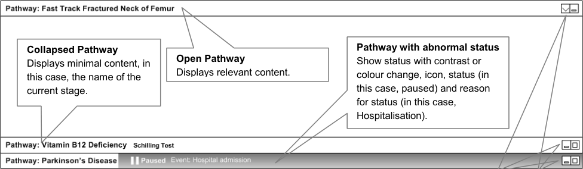

Figure 1: Multiple Pathways

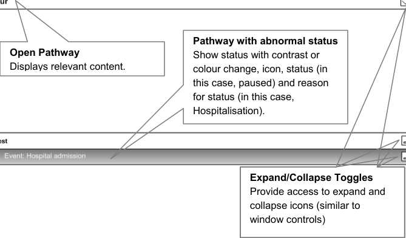

##### 4.4.2 Stages and Time

The following list of statements is taken into consideration for stages and time designs of wireframes
and is illustrated in Figure 2:

  - Pathways are displayed left to right

  - Pathways consist of a set of stages

  - The expected sequence of stages runs left to right

  - Linear pathways have distinct start and goal points

  - Stages are either completed, current or future

Page 12

NHS CUI Design Guide Workstream, Care Pathways Conceptual Modelling
Prepared by NHS CUI Programme Team, Version 1.0.0.0 Baseline
Last modified on 28 March 2007

Microsoft and NHS Connecting for Health Confidential

- The Graphical User Interface (GUI) attempts to create visual precursors to what led to a patient
being placed on a pathway

- It shows if a patient is on a linear pathway

- Enables the user to see how many stages a patient’s pathway comprises

- Shows where and by whom (geography, team, trust, and so on) the care is principally being
delivered to

- Provides info about how far along the pathway the patient is

- Clearly displays what is completed and what remains to be done

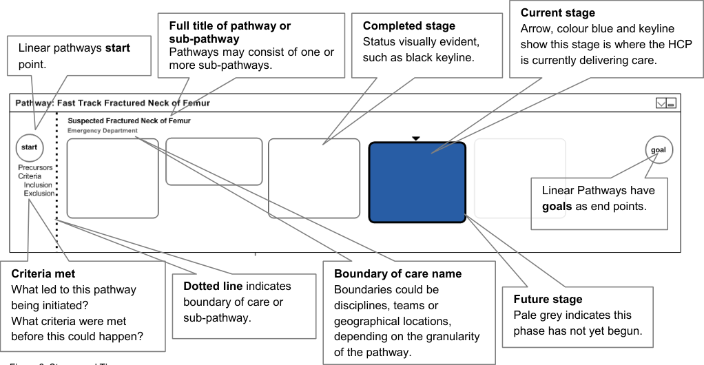

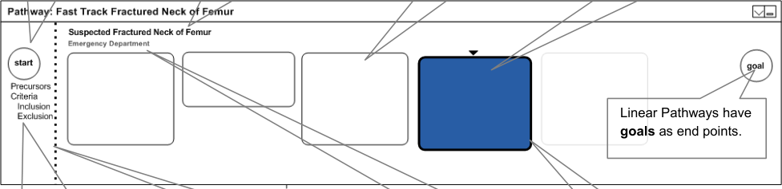

Page 13

NHS CUI Design Guide Workstream, Care Pathways Conceptual Modelling
Prepared by NHS CUI Programme Team, Version 1.0.0.0 Baseline
Last modified on 28 March 2007

Microsoft and NHS Connecting for Health Confidential

##### 4.4.3 Care Boundaries

The care boundaries demonstrate the key patient handover periods. From the user’s perspective, it
shows when a patient leaves the team’s care as well as provides an overview of the different teams,
locations and disciplines that comprise this patient’s care. Figure 3 shows an example of care
boundaries:

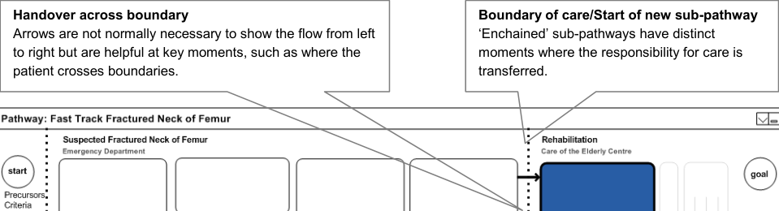

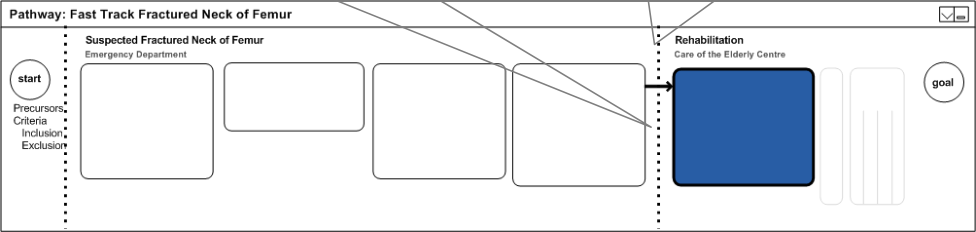

Figure 3: Care Boundaries

##### 4.4.4 Showing Everything

The key design objective is to be able to show all stages on a pathway at all times, as shown in Figure
4. In addition to this, it is important to avoid the use of scroll bars.

In many interactive environments, scroll bars allow users to move a portion of the document off the
screen. A pathways interface should avoid this, in preference, by shrinking stages to thin sections, or
by shrinking groups of adjacent stages to composite blocks. A moving focus should expand and
collapse stages to provide a relevant view.

A screen should always be able to show the detail for at least three stages:

  - What has happened

  - What is happening

  - What will happen next

It is important that the context of where the patient is, within the overall pathway, is not lost.

Furthermore, the HCP always needs to be aware of the stages that have passed, those that are to
come, as well as the location of the patient within the overall pathway progress.

Page 14

NHS CUI Design Guide Workstream, Care Pathways Conceptual Modelling
Prepared by NHS CUI Programme Team, Version 1.0.0.0 Baseline
Last modified on 28 March 2007

Microsoft and NHS Connecting for Health Confidential

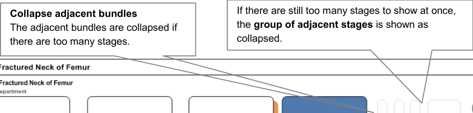

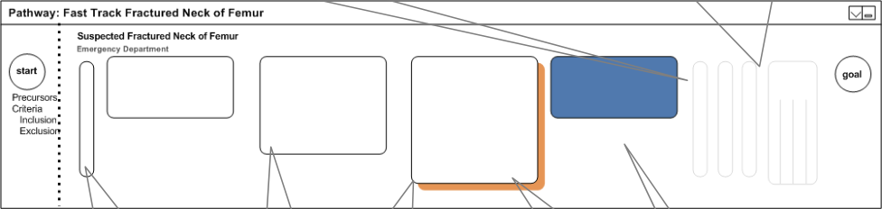

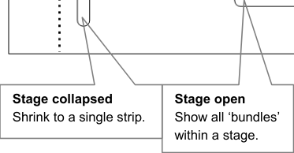

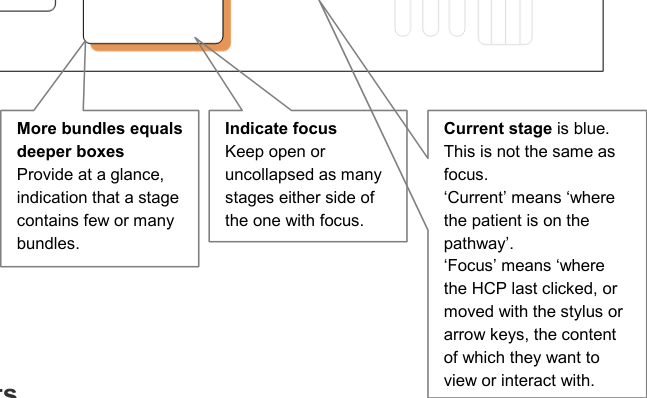

Figure 4: Showing Everything

Another use for care pathways is to objectively provide information on met and missed targets. These
targets do not refer to the time a patient takes to respond to a treatment, but rather the actual time the
HCP takes to complete the well-understood procedure.

Displaying these targets will allow the user to have a clear idea of how long a pathway will take before
it is completed. In addition, it will allow the user to understand that targets that have been missed
and/or successfully achieved as shown in Figure 5:

Full details
Displaying full details for every
stage would be distracting but
they should be accessible,
such as on mouse-over

Figure 5: Met and Missed Targets

Actual times (target time
achieved)
Indicating the time taken to
complete this sub-pathway.

Missed targets
Knowing that a
sub-pathway or key target
time was missed might
warrant a different visual
display.

Target times
The target times for the final
stage of a pathway.

Page 15

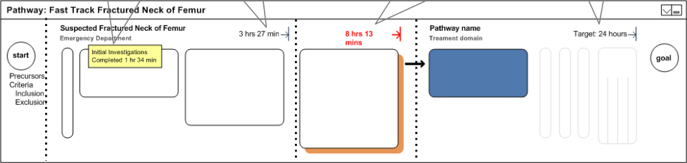

NHS CUI Design Guide Workstream, Care Pathways Conceptual Modelling
Prepared by NHS CUI Programme Team, Version 1.0.0.0 Baseline
Last modified on 28 March 2007

Microsoft and NHS Connecting for Health Confidential

##### 4.4.6 Sub-Pathways

From a clinician’s point of view, a pathway is only closed when a patient reaches the end of a pathway,
dies, or moves to a completely different pathway. Taking this into consideration, the following designs
avoid the concept of a closed pathway.

The suggested designs, as shown in Figure 6, put the control of collapsing sub-pathways firmly in the
user’s hands. It provides widgets for expanding and contracting a pathway. It also removes the detail of
the pathway, whilst maintaining visibility of existing sub-pathways. All this will allow more space for the
sub-pathway, where care is being delivered, or where detailed content is being viewed, to be shown.

Group stages that belong together,
such as Day of Operation. This is a
concept that is neither a sub-pathway,
nor a stage, nor a care boundary.
However, it needs to be visible but the

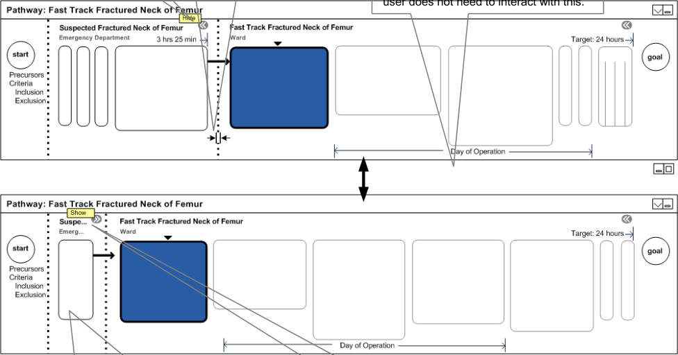

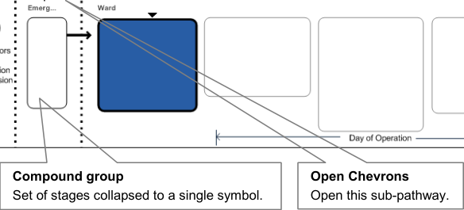

Figure 6: Sub-Pathways

##### 4.4.7 Status of Stages

Stages and bundles display their status through colour, contrast and symbols.

The explored design, shown in Figure 7, uses the tick and cross icons to provide status for stages at a
glance. Similarly, for the status of bundles, the design uses a tick, a cross or a bullet icon.

It also uses, but does not rely solely upon, colours. It shows the currently attempted task in high
contrast.

Page 16

NHS CUI Design Guide Workstream, Care Pathways Conceptual Modelling
Prepared by NHS CUI Programme Team, Version 1.0.0.0 Baseline
Last modified on 28 March 2007

Microsoft and NHS Connecting for Health Confidential

The use of colour, contrast and symbols helps the user to focus on what is to be done immediately. It
also helps to inform the user that there is a problem, to show which bundle within the stage has caused
the problem and to depict that a whole stage has completed successfully.

The display of these statuses also provides the feedback on what has been done for a patient, thus
preventing a clinician repeating the work of others. In addition, it provides information on who provided
the care for this patient in the past.

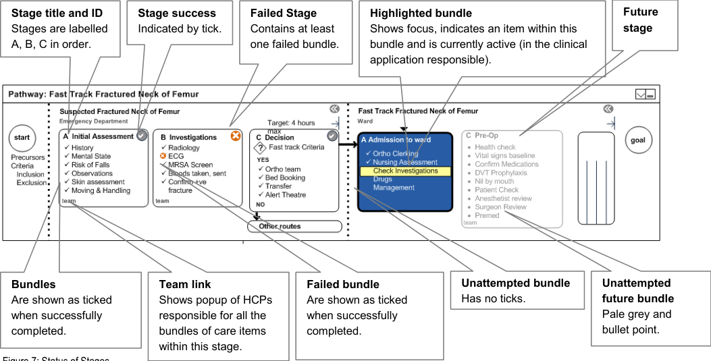

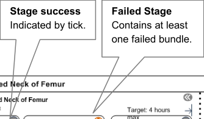

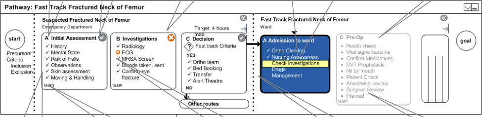

##### 4.4.8 Decision Making

Pathways involve many decisions. An interface that showed all decision points would be overwhelming.
The following designs purposefully restrict the amount of logic that is displayed (for example, other
routes).

There are some key decision points where some kind of triage or assessment occurs, that should be
visible at a glance. There is no special design for a stage that contains a decision point. Instead, a flag
symbol displays, in place of the tick or the cross, to indicate that a bundle is actually a decision point.

Typical decision stages might involve sending the patient on another pathway (sub-pathway). These
might involve more that two possible outcomes. Figure 8, design key decision or branch points are
clearly visible, whilst hundreds of smaller, implicit decisions are hidden from the user.

Page 17

NHS CUI Design Guide Workstream, Care Pathways Conceptual Modelling
Prepared by NHS CUI Programme Team, Version 1.0.0.0 Baseline
Last modified on 28 March 2007

Microsoft and NHS Connecting for Health Confidential

Arrows
Used only when (i) stage contains key decision or (ii) flow could
pass to other (sub)pathway.

Key decision point

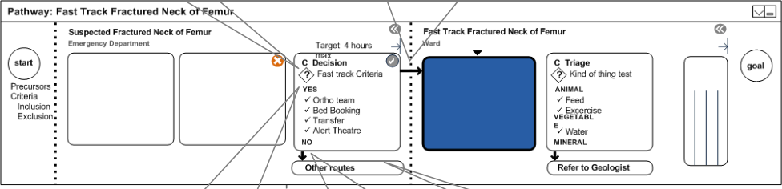

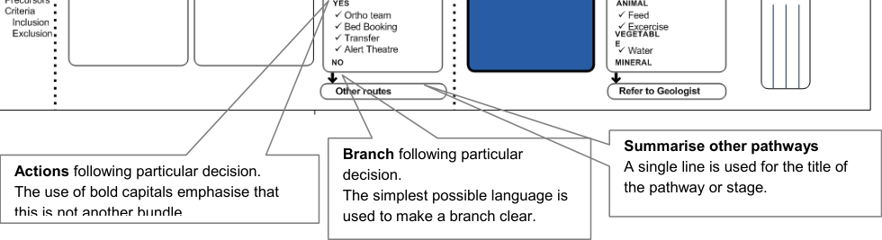

Figure 8: Decision Making

##### 4.4.9 Long Term Cycles

Long term conditions are typically cyclical where the care repeats periodically. As the condition
progresses, patients typically shift to more intense, complex patterns of care. The example used in the
Parkinson’s disease scenario has three cycles or phases:

  - Maintenance

  - Complex

  - Palliative

A patient might go round a maintenance cycle several times. The phases as shown in Figure 9 are
represented as concentric circles.

Each cycle has a review, and a set of care episodes (stages). The same visual vocabulary as
conventional linear pathways is used throughout, but without the start and goal symbols.

The benefit to the users is that they understand from this that care, in this instance, is long term and
that it repeats over a set period of time. It makes the progressive nature of disease/care phases
evident.

However, the delivery of care is still serial, linear, and compartmentalised: previous stage, current
stage, next stage.

It also allows the user to visually see the relationship between assessment and care episodes and
provides easy access to previous cycles and other phases through use of spinner controls. On click of
the spinner control, a user will be presented with completed stages/bundles from the previous cycle.

Page 18

NHS CUI Design Guide Workstream, Care Pathways Conceptual Modelling
Prepared by NHS CUI Programme Team, Version 1.0.0.0 Baseline
Last modified on 28 March 2007

Microsoft and NHS Connecting for Health Confidential

Current Phase
Provides access to
other phases of
care.

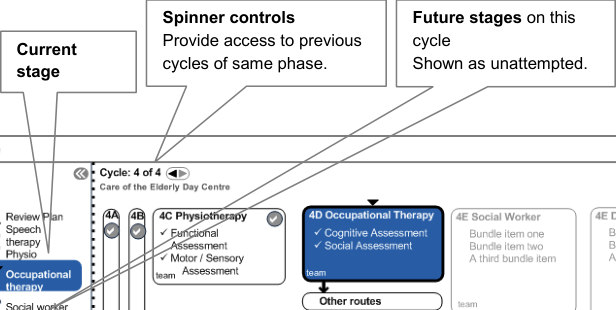

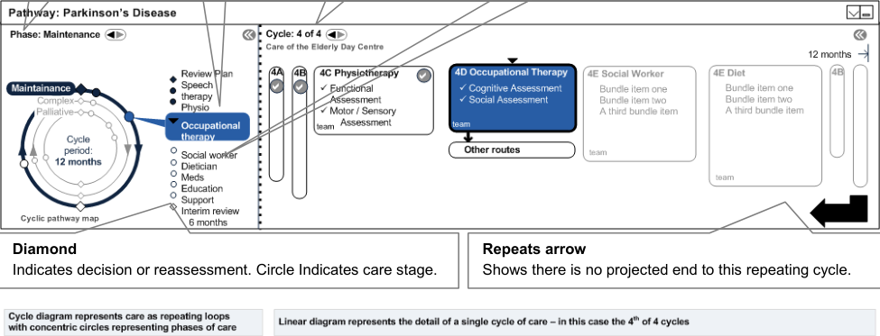

Figure 9: Long Term Cycles

##### 4.4.10 Phases of Care

A phase is a major shift in the patient state which warrants a major shift in a patient’s care plan. Long
term conditions typically have more than one phase, for which a care could be cyclical. Repeating an
acute event causes another shift in the care phase.

Figure 10 shows visual mechanisms for visited and unvisited phases:

Figure 10: Phases of Care

Page 19

NHS CUI Design Guide Workstream, Care Pathways Conceptual Modelling
Prepared by NHS CUI Programme Team, Version 1.0.0.0 Baseline
Last modified on 28 March 2007

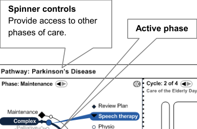

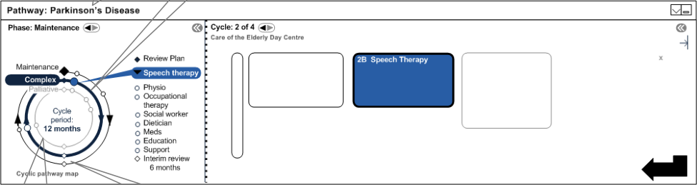

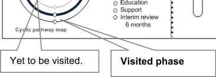
Microsoft and NHS Connecting for Health Confidential

##### 4.4.11 Linked Focus

Shifting focus in the linear diagram shifts focus on the cyclical diagram. This is also true for shifting the
focus from the cyclical diagram to the linear diagram.

This feature allows the user to explore other phases and other stages of the pathway, and helps them
to understand implicitly that the two interfaces are representations of the same thing. This is illustrated
in Figure 11:

Show focus Stage with focus Stage patient is at

Figure 11: Linked Focus

##### 4.4.12 Collapsing Cycle Diagram

Given that the user’s screen is limited in terms of space, it is important that the cyclical diagram in the
pathway can be collapsed, thus making more space for stages to be displayed. Figure 12 explores this
option: Hide

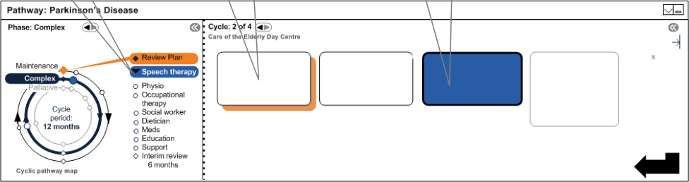

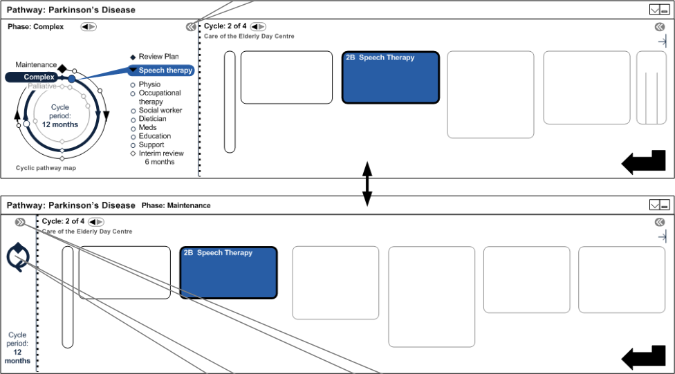

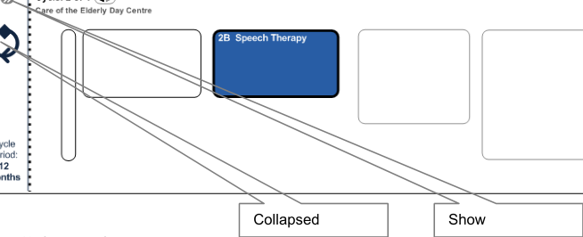

NHS CUI Design Guide Workstream, Care Pathways Conceptual Modelling
Prepared by NHS CUI Programme Team, Version 1.0.0.0 Baseline
Last modified on 28 March 2007

Page 20

Microsoft and NHS Connecting for Health Confidential

#### 4.5 Scenario

The following scenario describes a patient’s journey from the moment the patient was involved in an
accident. It also takes into consideration the patient’s medical history.

The steps that the patient moves through are listed below, highlighting the key moments that best
demonstrate how the features and elements are used to visualise the use of the suggested designs.
Not all steps are visualised.

Patient’s journey steps:

Note

The steps in bold are the examples that are demonstrated in section 25.

1. Patient is diagnosed with Parkinson’s Disease (PD) and placed on a long term pathway
(maintenance phase)

2. Patient is diagnosed with vitamin B12 deficiency and is placed on a long term pathway

3. Patient repeats PD annual cycle four times

4. Patient has completed physiotherapy and is due for occupational therapy (OT)

5. Patient falls at home, 999 is called

6. Paramedics attend

7. Patient is admitted to the Emergency Department

8. Patient record is accessed by the doctor

9. Existing pathways are opened

10. Patient is placed on suspected fractured neck of femur (fast track) pathway

11. Parkinson’s pathway is placed on pause

12. Parkinson’s HCPs are messaged with new patient status – planning and scheduling activities
occur

13. Patient is assessed and confirmed for fast track (sub-pathway)

14. Patient is moved from Emergency Department to Ward (Orthopaedic) – boundary crossing

15. Orthopaedic team collapses view of Emergency Department activities to focus on their
stages of care

16. Patient is assessed for surgery

17. Patient is prepared for surgery

18. Patient goes to theatre for hip replacement

19. Patient spends five days in post-op recovery

20. Patient fails day five milestones for recovery

21. Patient is referred to rehabilitation unit

22. Patient is assessed for rehabilitation

23. Patient is admitted to the rehabilitation unit and is placed on the rehabilitation sub-pathway –
boundary crossing

24. During rehabilitation, Parkinson’s HCPs open pathway to see the state of the patient.
Hospitalisation event is clearly visible within PD pathway.

25. Parkinson’s disease HCPs reassess patient, and place or restart patient on a new version of
the Parkinson’s pathway

Page 21

NHS CUI Design Guide Workstream, Care Pathways Conceptual Modelling
Prepared by NHS CUI Programme Team, Version 1.0.0.0 Baseline
Last modified on 28 March 2007

Microsoft and NHS Connecting for Health Confidential

#### 4.6 Scenario Illustration Wireframes

##### 4.6.1 Patient Arrives at Emergency Department

The Senior House Officer (SHO) opens the patient record and discovers that the patient has been
placed on two pathways, as shown in Figure 13. He collapses the Vitamin B12 pathway and takes a
moment to check and see from the system that the patient has recently seen the OT, and is due for an
assessment with the social worker.

Figure 13: Patient Arrives at Emergency Department

##### 4.6.2 Start Neck of Femur (NOF) Pathway

The SHO initiates the fast track pathway. The fast track is the Suspected Fractured Neck of Femur
Pathway. The long term pathway that the patient is on, displays as paused due to a Hospital Admission
Event as shown in Figure 14:

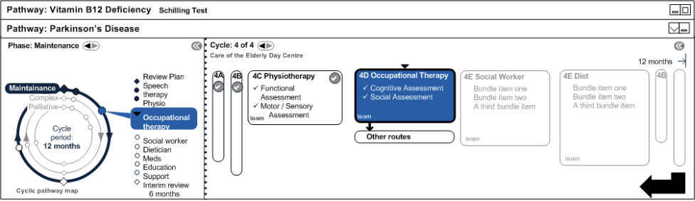

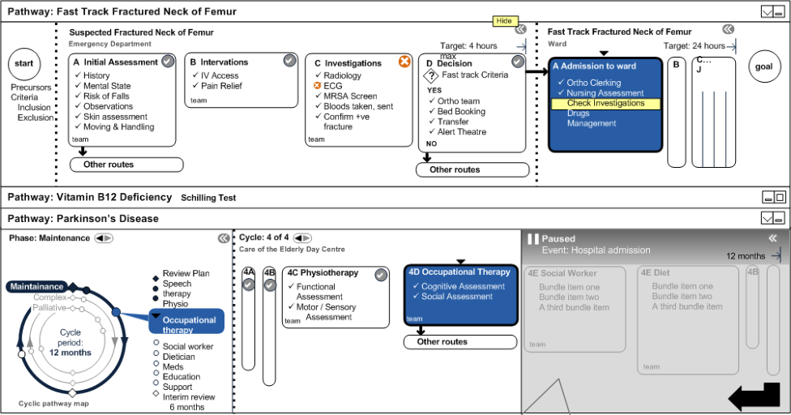

Figure 14: Start NOF Pathway

Paused (automatically or manually)

NHS CUI Design Guide Workstream, Care Pathways Conceptual Modelling
Prepared by NHS CUI Programme Team, Version 1.0.0.0 Baseline
Last modified on 28 March 2007

Page 22

Microsoft and NHS Connecting for Health Confidential

##### 4.6.3 Patient Admitted to Ward

The patient passes the fast track criteria in the Emergency Department and is admitted to the care of
the Orthopaedic team in a ward, as illustrated in Figure 15: Click

Figure 15: Patient Admitted to Ward

Orthopaedic team can contact social work/Parkinson’s team to let them know of patient’s admission to hospital.
This could be automatic, but would depend on planning/scheduling/messaging architecture which is beyond the scope of
this document.

Page 23

NHS CUI Design Guide Workstream, Care Pathways Conceptual Modelling
Prepared by NHS CUI Programme Team, Version 1.0.0.0 Baseline
Last modified on 28 March 2007

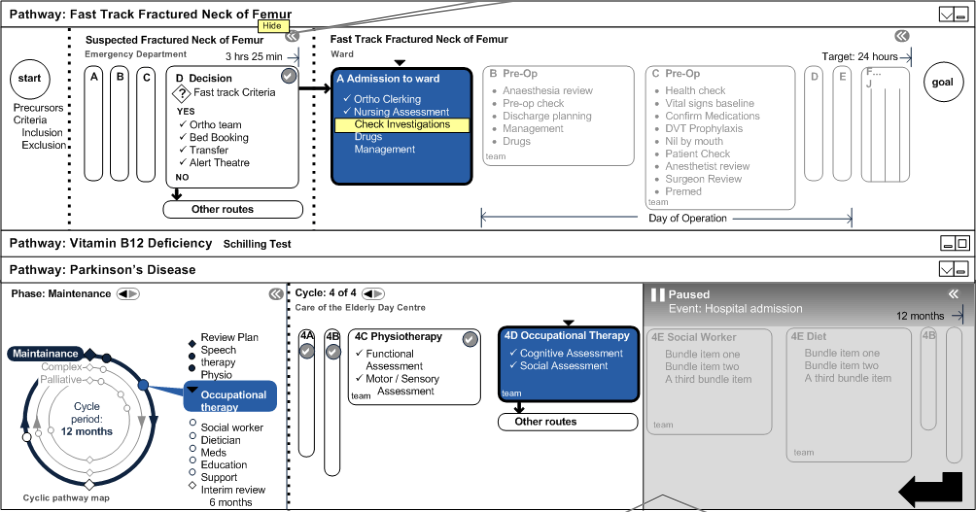
Microsoft and NHS Connecting for Health Confidential

##### 4.6.4 Sub-Pathway Collapsed

Enchained sub-pathways that the patient is following are shown in Figure 16 as sequential steps, and
are also shown as joined on the same ‘parent pathway’.

On mouse-over, it is possible to see
full details of shrunk sub-pathway.

Figure 16: Sub-Pathway Collapsed

##### 4.6.5 Surgery

In the example in Figure 17, the patient undergoes surgery and the Parkinson’s pathway is collapsed.

Note

A Day of Operation marker for a grouped set of stages displays within a sub-hierarchy.

Figure 17: Surgery

Page 24

NHS CUI Design Guide Workstream, Care Pathways Conceptual Modelling
Prepared by NHS CUI Programme Team, Version 1.0.0.0 Baseline
Last modified on 28 March 2007

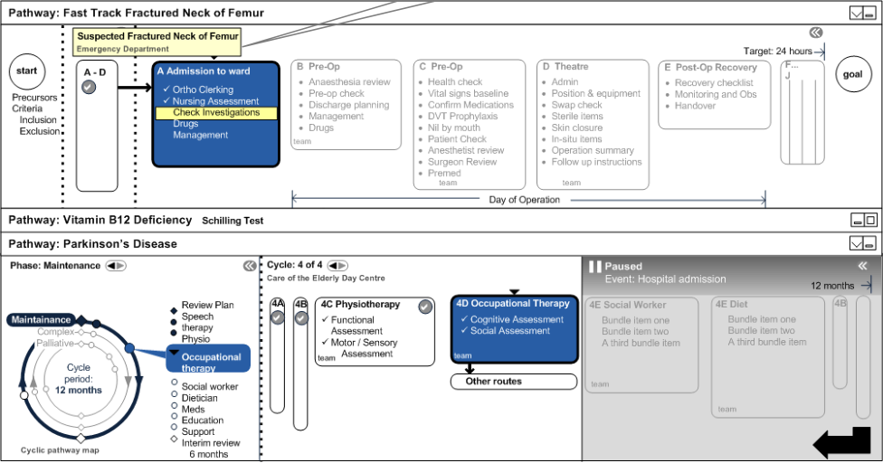

Microsoft and NHS Connecting for Health Confidential

##### 4.6.6 Post-Operation Stage

The patient reaches the Day Five stage post-op, which may or may not be five numerical days after
surgery. The example is illustrated in Figure 18:

Figure 18: Post-Operation Stage

Page 25

NHS CUI Design Guide Workstream, Care Pathways Conceptual Modelling
Prepared by NHS CUI Programme Team, Version 1.0.0.0 Baseline
Last modified on 28 March 2007

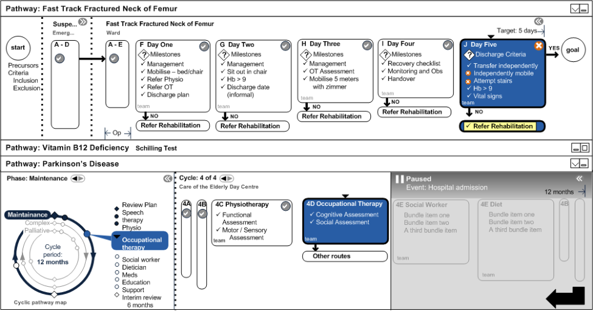
Microsoft and NHS Connecting for Health Confidential

##### 4.6.7 Rehabilitation Assessment

The following designs, illustrated in Figure 19, suggest the first stage of rehabilitation. Any decision
making by the clinician at this time might reveal an extra phase.

Stage K is new, based on
discharge criteria failure.

Figure 19: Rehabilitation Assessment

Page 26

NHS CUI Design Guide Workstream, Care Pathways Conceptual Modelling
Prepared by NHS CUI Programme Team, Version 1.0.0.0 Baseline
Last modified on 28 March 2007

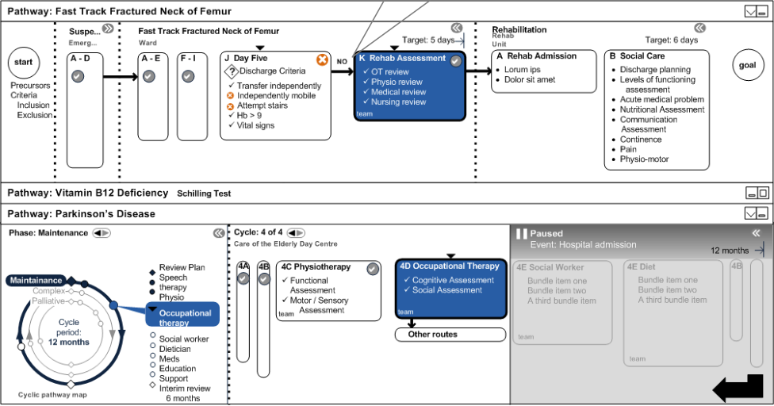
Microsoft and NHS Connecting for Health Confidential

##### 4.6.8 Rejoin Long Term Parkinson’s Disease Pathway

During rehabilitation, the patient’s long term Parkinson’s Disease pathway is restarted. The social
worker is able to pay visits to the patient in the rehabilitation unit. The design in Figure 20 also
demonstrates the use of the hospitalisation event to indicate that something happened between the
stages.

If PD HCPs check the system, they may not automatically see the NOF pathway or its recorded
outcome once it has been closed. However, they should see the hospitalisation event which should link
them to the relevant pathway/records.

Long term care resumed
PD team can reassess their care plan and
pathways/phases of care at this point.

Figure 20: Rejoin Long Term Pathway

Page 27

NHS CUI Design Guide Workstream, Care Pathways Conceptual Modelling
Prepared by NHS CUI Programme Team, Version 1.0.0.0 Baseline
Last modified on 28 March 2007

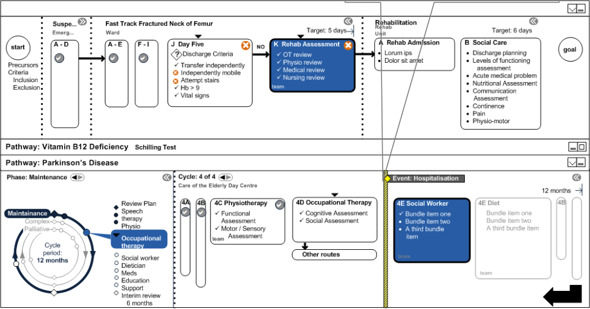
Microsoft and NHS Connecting for Health Confidential

### 5 DOCUMENT INFORMATION

#### 5.1 Terms and Abbreviations

CRE Care Record Elements

CUI Common User Interface

GUI Graphical User Interface

HCP Health Care Professional

NHS National Health Service

NHS CFH NHS Connecting for Health

NHS CRS NHS Care Records Service

NOF Neck of Femur

NPfIT National Programme for Information Technology

OT Occupational Therapy

PD Parkinson’s Disease

SHO Senior House Officer

Table 1: Terms and Abbreviations

#### 5.2 Definitions

NHS Entity Within this document, defined as a single NHS organisation or group that is operated within a single
technical infrastructure environment by a defined group of IT administrators.

The Authority The organisation implementing the NHS National Programme for IT (currently NHS Connecting for
Health).

Current best practice Current best practice is used rather than best practice, as over time best practice guidance may
change or be revised due to changes to products, changes in technology, or simply the additional
field deployment experience that comes over time.

Table 2: Definitions

#### 5.3 Nomenclature

This section shows how to interpret the different styles used in this document to denote various types
of information.

Body Text

Code, script and other markup languages within the main text are denoted with monospace text.

Interface dialog names, field names and controls are denoted with bold text.

Folder and file names are denoted with Title Case text.

Page 28

NHS CUI Design Guide Workstream, Care Pathways Conceptual Modelling
Prepared by NHS CUI Programme Team, Version 1.0.0.0 Baseline
Last modified on 28 March 2007

Microsoft and NHS Connecting for Health Confidential

Cross References

Cross references to other sections in the current document comprise a section number. Cross
references may also be to figures and tables, where the caption number only might be shown.

References to other Project documents are shown in italics. Footnotes with additional details may also
be used.

References to sections in publicly available documents are shown in italics and the document referred
to will be given as a footnote.

References to other external Web-based content are shown in italics and a hyperlink will be given as a
footnote.

Code Fragments

This document uses courier font plus a shaded background to denote code fragments. For example,
the following shows part of the standard header included in a Visual Basic script file:

hwnd = 0          '** window handle **

hwndHelper = 0

debugx = 0

Set objArgs = WScript.Arguments

Command Lines

This document uses courier font plus a shaded background to denote command line entries – text to
be entered is highlighted in bold. For example, the following shows the command to be executed to
display the cmd help text:

C:> CMD.exe /?

#### 5.4 References

R1. National Electronic Care Pathways High Level Conceptual Vision 0.4 31-Jan-2007

R2. NHS CUI Toolkit Demonstrator Release Build 3.2.161.001

Table 3: References

Page 29

NHS CUI Design Guide Workstream, Care Pathways Conceptual Modelling
Prepared by NHS CUI Programme Team, Version 1.0.0.0 Baseline
Last modified on 28 March 2007

