_Prepared for_
**NHS Connecting for Health**
**Version 1.0.0.0 Baseline**
_Prepared by_
**NHS CUI Programme Team**
**[Cuistakeholder.mailbox@hscic.gov.uk](mailto:Cuistakeholder.mailbox@hscic.gov.uk)**
_Contributors_
**Shruti Kapur**
**Igor Laketic**
**This document was prepared for NHS Connecting for Health which ceased to exist on 31 March**
**2013. It may contain references to organisations, projects and other initiatives which also no**
**longer exist. If you have any questions relating to any such references, or to any other aspect of**
**[the content, please contact cuistakeholder.mailbox@hscic.gov.uk](mailto:cuistakeholder.mailbox@hscic.gov.uk)**
### 1 INTRODUCTION

<!-- TOC -->
<!-- TOC generated by Markdown All in One style -->

- [1 INTRODUCTION](#1-introduction)
  - [1.1 Overview](#11-overview)
  - [1.2 Area of Focus Description](#12-area-of-focus-description)
    - [1.2.1 Scope](#121-scope)
    - [1.2.2 Out of Scope](#122-out-of-scope)
  - [1.3 Key Principles](#13-key-principles)
  - [1.4 References to Table of Contents Document](#14-references-to-table-of-contents-document)
- [2 RECOMMENDATION AND GUIDANCE](#2-recommendation-and-guidance)
  - [2.1 Communication of Decision Support Capability](#21-communication-of-decision-support-capability)
    - [2.1.1 How to Display the Overview of Decision Support Capability](#211-how-to-display-the-overview-of-decision-support-capability)
    - [2.1.2 How to Display the Detailed Level of Decision Support Capability](#212-how-to-display-the-detailed-level-of-decision-support-capability)
  - [ Displaying unavailable services Unavailable services should be](#displaying-unavailable-services-unavailable-services-should-be)
  - [ Displaying unavailable services Incorrect format for displaying](#displaying-unavailable-services-incorrect-format-for-displaying)
  - [2.2 Information Window Anatomy](#22-information-window-anatomy)
    - [2.2.1 Guidance](#221-guidance)
    - [2.2.2 How to Use the Guidance](#222-how-to-use-the-guidance)
  - [ Showing no actions available](#showing-no-actions-available)
    - [2.2.3 How Not to Use the Guidance](#223-how-not-to-use-the-guidance)
    - [2.2.4 Benefits and Rationale](#224-benefits-and-rationale)
    - [2.2.5 Confidence Level](#225-confidence-level)
  - [2.3 Choice Lists with Preferences](#23-choice-lists-with-preferences)
    - [2.3.1 Guidance](#231-guidance)
    - [2.3.2 How to Use the Guidance](#232-how-to-use-the-guidance)
  - [ Displaying multiple information](#displaying-multiple-information)
    - [2.3.3 How Not to Use the Guidance](#233-how-not-to-use-the-guidance)
    - [2.3.4 Benefits and Rationale](#234-benefits-and-rationale)
    - [2.3.5 Confidence Level](#235-confidence-level)
  - [2.4 Unprompted Notifications (System-Generated Alerts)](#24-unprompted-notifications-system-generated-alerts)
    - [2.4.1 Guidance](#241-guidance)
    - [2.4.2 How to Use the Guidance](#242-how-to-use-the-guidance)
    - [2.4.3 How Not to Use the Guidance](#243-how-not-to-use-the-guidance)
    - [2.4.4 Benefits and Rationale](#244-benefits-and-rationale)
    - [2.4.5 Confidence Level](#245-confidence-level)
  - [2.5 Next Steps](#25-next-steps)
- [3 DOCUMENT INFORMATION](#3-document-information)
  - [3.1 Terms and Abbreviations](#31-terms-and-abbreviations)
  - [3.2 Definitions](#32-definitions)
  - [3.3 Nomenclature](#33-nomenclature)
  - [3.4 References](#34-references)
- [REVISION AND SIGNOFF SHEET](#revision-and-signoff-sheet)
  - [Change Record](#change-record)
  - [Audience](#audience)
  - [Reviewers](#reviewers)
  - [Distribution](#distribution)
  - [Open Issues Summary](#open-issues-summary)
  - [Document Properties](#document-properties)

<!-- /TOC -->

Source PDF: [decsupport.pdf](../../pdfs/decision-support/decsupport.pdf)

This document describes the Design Guide Entry for Decision Support, covering these three areas:

- Communication of decision support capability

- Display of choice lists with preferences and display

- Interaction with unprompted notifications

The objective of this document is to describe the area of focus, provide guidance and recommendations, and explain the rationale behind the guidance and recommendations.

This initial investigation is a concise piece of work, based around the three areas listed above. Further research, user testing, patient safety assessment and supplier participation are required to define the final guidance.

During this investigative work, consideration has been given to the wider research material available within this domain. Research references of such material include:

- _Kensaku Kawamoto et al, 2005, Information in practice, Improving clinical practice using_

_clinical decision support systems: a systematic review of trials to identify features critical to_
_success, BMJ, March_

- _Amit X Garg et al, 2005, Effects of Computerized Clinical Decision Support Systems on_

_Practitioner Performance and Patient Outcomes, JAMA; Mar 9_

#### 1.1 Overview

This document is intended for the use by anyone whose role includes screen design, implementation, or assessment of an NHS clinical application. This document can therefore be used as guidance for the specification of user interfaces for decision support systems.

Conceptually (as illustrated in Figure 1), knowledge and decision support uses a general messaging capability to deliver communication in a healthcare environment. The context in which the decision support operates is closely linked to the user’s role, organisation, speciality and care setting. It is also linked to the electronic patient record. The clinical application functions, such as medication management, investigations, knowledge support and decision support, will utilise the messaging framework to communicate between components. In this context, decision support is one of the components that forms the clinical application.

Figure 1 illustrates components that can be defined individually as follows:

- User Context – The current role and situation in which the user is operating

- Electronic Patient Record – The record of the patient’s medical and demographic

information

- Clinical Functionality – The services offered by the application

- Knowledge Support – The service that provides information to the user in the relevant

context

- Decision Support – The service that provides system alerts, defined by locally-configured

rules

- User Information – The information that includes the user’s role, responsibilities,

demographics, access rights, and so on

- Alert Log – The information captured for the alert audit trail

- Clinical Alerting – Generation of alerts in response to a change in the information available

Page 1

Copyright ©2013 Health and Social Care Information Centre

HSCIC Controlled Document

- Messaging Service – The functionality used to pass the messages, alerts and messaging of

other events between different components of a clinical application

Figure 1: Context of Knowledge and Decision Support within the Application

The degree and extent of decision support within the messaging framework may be dependent on many factors, including:

- The user’s role

- The user’s organisation

- The user’s speciality

- The user’s current care setting

The user interface for Knowledge and Decision Support contains a set of fundamental elements that provide a mechanism for informing the user of important, relevant information, notifications and alerts for a specific patient within areas such as medication management and clinical testing, as illustrated in Figure 2.

Page 2

Copyright ©2013 Health and Social Care Information Centre

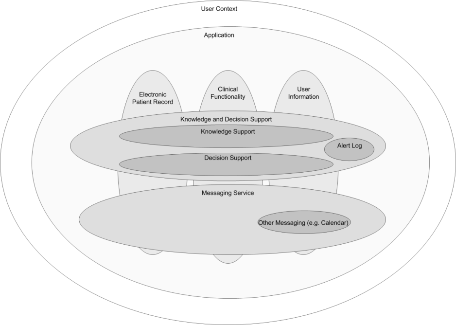
HSCIC Controlled Document

Figure 2: Decision Support Components

This document provides guidance and recommendations for the following aspects of decision support design within a clinical application:

- **Communication of decision support capability**

The communication to the user that decision support is currently active/inactive during the user’s current session within a clinical application.

- **Display of choice lists with preferences**

Allowing choice from a set of graded recommendations of activities in a patient situation.

- **Display and interaction with system-generated alerts**

An alert relevant to this patient generated in response to a change in the information available.

Decision support is driven by a module which manages the logic of alerts, notifications, recommendations and relevant actions.

Alerts inform the user of a situation that requires attention. There are two alert levels:

- Priority

- High Priority

Page 3

Copyright ©2013 Health and Social Care Information Centre

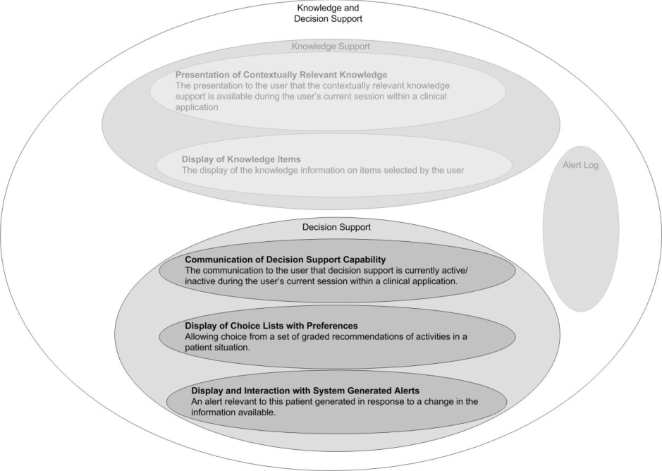
HSCIC Controlled Document

#### 1.2 Area of Focus Description

##### 1.2.1 Scope

This document considers decision support within the context of an individual patient record.

The area of focus for this guidance, within the context of an individual patient record, is:

- Communication of decision support capability

- Display of choice lists with preferences and display

- Interaction with unprompted notifications

##### 1.2.2 Out of Scope

The following areas are out of scope for this Deliverable:

- Forwarding, referring and escalating an alert

- Design for clinician’s Home page

- Handling alerts when a clinician is outside a patient’s EPR

- Handling notification messages, such as ‘Test results are back’

- The user's ability to turn elements of decision support on/off

- Inserting any actions required as a result of an alert

- A state transition model to define alert transition

- Additional ‘monitoring conditions’ to be put in place, to ensure the safety of any particular

decision

- A library of icons for alerts and notifications

- An audit trail of an alert

- Logging of an alert

- Rating of an alert

- Overriding an alert

- The messaging framework

- Viewing when an alert has been raised

- Viewing the priority of an alert (which can change over a period of time)

- Local configuration of clinical rules

- Triggers for alerts (locally configurable)

- Knowledge authoring of priority levels and context for an alert

- Configuration of alerts (managed through the configuration of the clinical application)

Page 4

Copyright ©2013 Health and Social Care Information Centre

HSCIC Controlled Document

#### 1.3 Key Principles

Underlying the guidance provided in section 2 are a set of key principles for decision support within a clinical application, some of which are listed below:

- There are two types of communication in decision support: informing and recommending

- When an informed act/recommended act occurs it is recorded in the electronic patient

record

- For alerts, the aim is to combine multiple axes of importance, such as criticality and

urgency, into one axis of priority

- For choice lists, the aim is to combine multiple axes into a single scale for preference

- There needs to be a defined number of priority levels for an alert

- The significance of the priority levels must be easily understood by the user

- Recommendations for appropriate actions following an alert will be displayed if they are

available from a decision support system

- Alerts need to be compatible with, and exist within the messaging framework

- Explanations will be available for any alert or preference

- Where explanations refer to an item in a patient record, it must be possible to view that item

in its original context

- Consistency of structure in the display of information

- There is a standard NHS CFH catalogue of all available decision support services

- The full set of local decision support functionality will be provided when the user logs on

#### 1.4 References to Table of Contents Document

The document _Table of Contents_ **{R1}** outlines every specific area of focus to be covered by the Design Guide. Table 1 indicates the areas of focus covered by this Design Guide Entry.

5.3 Display of Choice Lists with Preferences

5.4 Display of and Interaction with Unprompted Notifications

5.5 Communication of Decision Support Capability

Table 1: References to Table of Contents Document

Page 5

Copyright ©2013 Health and Social Care Information Centre

HSCIC Controlled Document

### 2 RECOMMENDATION AND GUIDANCE

#### 2.1 Communication of Decision Support Capability

The primary requirement of communicating decision support capability is to inform the users about the different decision support services that are currently available in their clinical application.

Decision support capability should be displayed at two levels:

- **Overview**

Indicates if the decision support services are running as expected (or not as expected).

- **Detailed**

Indicates the status of every individual service within the system compared with the standard NHS CFH catalogue. For example, Drug to Disease Contraindications Checking (Available, Not Available)

##### 2.1.1 How to Display the Overview of Decision Support Capability

Figure 3 illustrates an example of how to display the overview of decision support capability.

Indicates that decision support is running with full functionality for this local system

Indicates that decision support is not running with full functionality for this local system. This could be a flashing animation

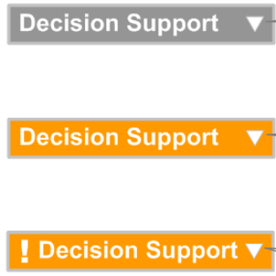

Figure 3: Overview of Decision Support Capability

_**2.1.1.1**_ _**Guidance**_

Indicates that decision support is not running with full functionality for this local system and there has been a change since last viewed. This could be a flashing animation

- The title of the decision support capability tool should be short so that it occupies the

minimum space on the screen (for example, ‘Decision Support’). An icon could be used to suggest decision support capability; however, this still needs to be explored.

- An arrow or chevron should be displayed next to the title to visually suggest that detailed

information is available on a click.

- If decision support is running with full functionality for this local system:

 The title should be displayed against a neutral colour (for example, grey)

- If decision support is not running with full functionality for this local system:

 The title should be displayed against a colour that captures attention (for example, orange)

 The title could be used as a flashing animation to attract immediate attention

 The title should also be supported by an icon to indicate that there has been a change since last viewed

- For every change in availability of a decision support service, a pop-up should be displayed

showing a message which summarises the change, as illustrated in Figure 4.

Page 6

Copyright ©2013 Health and Social Care Information Centre

HSCIC Controlled Document

 The pop-up should appear in close proximity to the title to visually suggest a connection between the message and the decision support functionality

 The pop-up should display the date and time of the change, according to the existing _NHS CUI Design Guide Workstream – Design Guide Entry - Time_ _Display_ **{R2}** and _NHS CUI Design Guide Workstream – Design Guide Entry - Date Display_ **{R3}** guidance

 The pop-up should display a textual description of the change (for example, “Dose Calculations and Formulary Management are not running”)

 The pop-up should visually fade out over a period of time (approximately 5-10 seconds) as it should not obstruct the view of the clinical application

Figure 4: Example of a Pop-up

_**2.1.1.2**_ _**How to Use the Guidance**_

the same box displayed next to the title to suggest

detailed information is available on a click

Table 2: How to Use the Design Guide Entry

_**2.1.1.3**_ _**How Not to Use the Guidance**_

outside the title box display

Table 3: How Not to Use the Design Guide Entry

_**2.1.1.4**_ _**Benefits and Rationale**_

- Informs the user as to whether the decision support services are running with full

functionality for this local system.

- Better informs the user by flagging a change in the decision support capability via the

overview status.

_**2.1.1.5**_ _**Confidence Level**_

This guidance is currently classified as ‘Initial Guidance’ with ’Low’ confidence level. Further usability testing and a Patient Safety Assessment (PSA) is expected, and the guidance will be updated following this usability testing.

Page 7

Copyright ©2013 Health and Social Care Information Centre

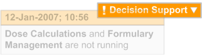
HSCIC Controlled Document

##### 2.1.2 How to Display the Detailed Level of Decision Support Capability

This section defines the guidance for displaying the detailed level of decision support capability to the user. Figure 5 illustrates an example of this.

Use of a green tick and bold text suggests the service is available and running

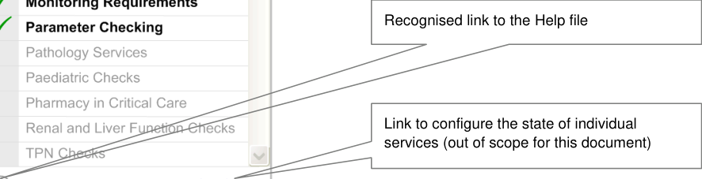

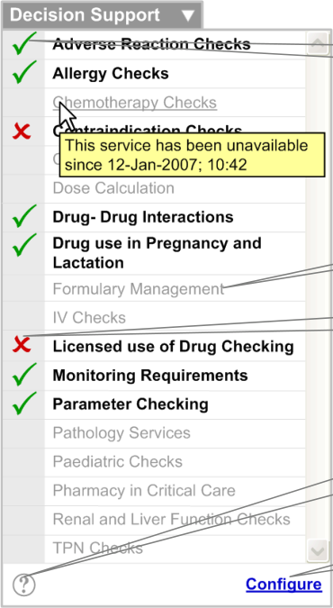

Figure 5: Example of How to Display Detailed Level Decision Support Capability

_**2.1.2.1**_ _**Guidance**_

When the arrow or chevron is clicked, the detailed level of decision support capability is displayed. This should capture the following:

- A list of decision support services (for example, ‘Licensed use of Drug Checking’) should be

displayed. This list should:

 Contain services from the standard NHS CFH catalogue

 Be displayed in alphabetical order

 Be visually treated to help distinguish between services that are available and not available. This means the two states should be obvious to the user when the user scans through the list

 Display available services in black, bold font. The status of the service should be reinforced with an icon (for example, a green tick)

 Display services that are available but not running in black, bold font. The status of the service should be reinforced with an icon (for example, a red cross)

 Display unavailable services in light grey, regular font

 Display the status of any service in a tooltip (with date and time) according to the existing _NHS CUI Design Guide Workstream – Design Guide Entry – Time_ _Display_ **{R2}** and _NHS CUI Design Guide Workstream – Design Guide Entry – Date Display_ **{R3}** guidance (for example, ‘This service has been unavailable since 12-Jan-2007; 10:42’)

Page 8

Copyright ©2013 Health and Social Care Information Centre

HSCIC Controlled Document

 Display the Help file when any service is clicked. The Help file should automatically scroll to the location of the selected service

- A vertical scroll bar should be introduced if the list grows beyond the designated screen

space.

- A link to configure the states of individual services should be provided. This is currently

outside the scope of this document.

- A recognised link to the Help file should be provided, which could be an icon (see Figure 6):

 The Help file should display information in alphabetical order, in the same way as the list of services

 A brief description of each service should be displayed

 The Help file should be accessible through the Help link as well as by clicking on an individual service

 Where possible the Help system should be integrated with the generic Help.

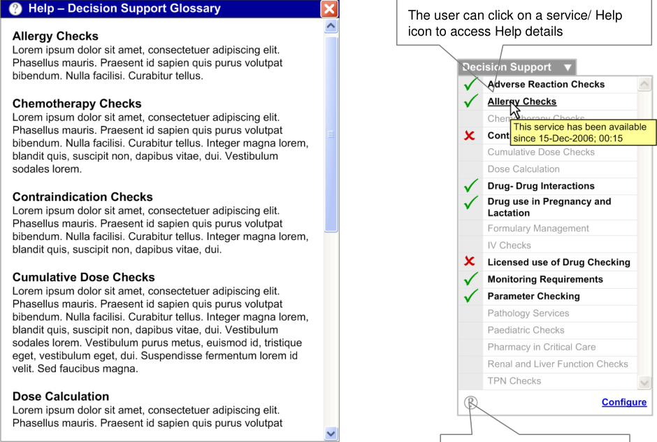

Figure 6: Example of a Help Glossary

_**2.1.2.2**_ _**How to Use the Guidance**_

A recognised link to the Help file (such as an icon)

in black, bold font. The status of the service should be reinforced with an icon (for example, a tick)
####  Displaying unavailable services Unavailable services should be

displayed in light grey, regular font

Table 4: How to Use the Design Guide Entry

Copyright ©2013 Health and Social Care Information Centre

Page 9

HSCIC Controlled Document

_**2.1.2.3**_ _**How Not to Use the Guidance**_

services using a selected check box
####  Displaying unavailable services Incorrect format for displaying

unavailable services using an unselected check box

Table 5: How Not to Use the Design Guide Entry

_**2.1.2.4**_ _**Benefits and Rationale**_

- Allows access to context sensitive Help for the decision support framework

- Allows the user to evaluate the available local system decision support in comparison with

the standard NHS CFH catalogue

- Provides information to the user about the local systems’ current availability to support the

user’s decision making

_**2.1.2.5**_ _**Confidence Level**_

This guidance is currently classified as ‘Initial Guidance’ with ’Low’ confidence level. Further usability testing and a Patient Safety Assessment (PSA) is expected, and the guidance will be updated following this usability testing.

#### 2.2 Information Window Anatomy

This section describes the anatomy of the decision support information window.

##### 2.2.1 Guidance

All information windows should contain the following areas or elements (as illustrated in Figure 7), and this should be consistent across choice lists with preferences and unprompted notifications:

- Header area

- Summary area

- Details area

- Resizing control

Header area

Details area (available by clicking the ’Details’ tab or the **Details…** link (available in the ‘Summary Area’).)

Summary area

Resizing control

Page 10

Copyright ©2013 Health and Social Care Information Centre

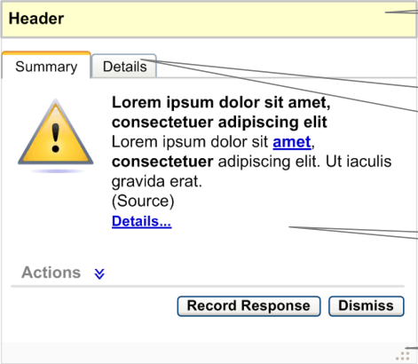
HSCIC Controlled Document

Figure 7: Anatomy of an Information Window

_**2.2.1.1**_ _**Header Area**_

The information window header is placed at the top of the information window.

_**2.2.1.2**_ _**Summary Area**_

By default, the ‘Summary’ tab of the information window should be selected. This tab should be to the left of the ‘Details’ tab. It should contain the following elements:

- **Icon**

The icon should be placed to the left of the summary information. There could be several types of icon, where each icon suggests a different type of information. This library of icons does not exist and needs to be explored.

- **Information Summary**

The summary should be brief and should summarise the details found on the ‘Details’ tab (for example, “There are potential additive hypotensive effects with Lisinopril and Furosemide, a current medication for this patient”).

- **Information Source**

The source of the information should be displayed in brackets, below the summary. The information source should identify services from the standard NHS CFH catalogue.

- **Information Details**

A textual link to the information details should be displayed below the source. This link should display the same information that is available under the ‘Details’ tab.

- **Actions**

 By default, the ‘Actions’ label should be displayed with a chevron next to it. This area should be displayed in a collapsed state by default. The chevron should act as an interactive element, expanding the Actions when clicked

 On expansion, this area should display a list of recommended actions (see Figure 8)

 The actions should be displayed in order of preference, with the most preferred first

 The preference rating for actions should be visually supported by icons, which should be placed on the left side of every action. On mouse-over of this icon a tooltip explaining the preference should be displayed (for example, ‘High Preference Option’)

 An action can be selected by clicking its option button

 An action could have multiple sub options which should be selectable by check boxes or option buttons. For example, ‘Option 3’ is an action and the associated options are ‘Sub Option 1, Sub Option 2 and Sub Option 3’

 If decision support is not recommending any actions, elements including the label and the chevron should not be displayed (see Figure 9)

Page 11

Copyright ©2013 Health and Social Care Information Centre

HSCIC Controlled Document

Figure 8: Anatomy of an Information Window – When Decision Support Recommends Actions

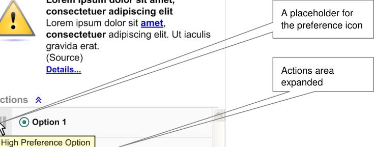

Multiple options for an action

No actions present in this information

i d

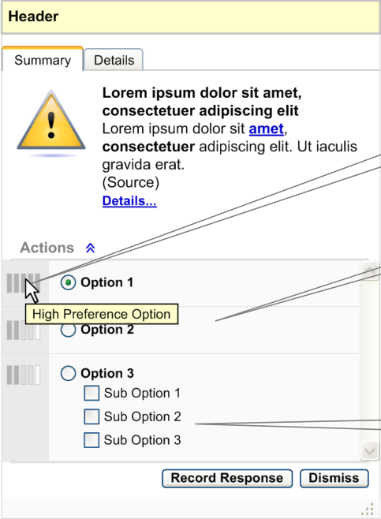

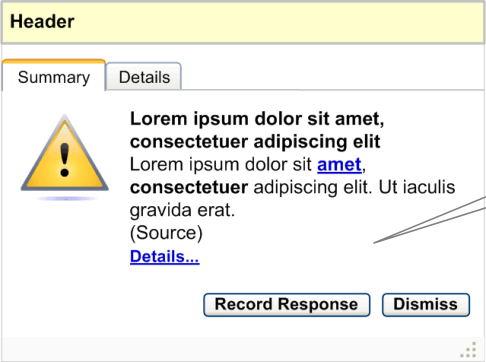

Figure 9: Anatomy of an Information Window – When Decision Support Does Not Recommend Actions

- **Record Response**

The **Record Response** button should be enabled at all times. When this button is clicked, the user should be taken to the relevant area of the clinical application to allow them to record a response. This button should be placed before, and to the left of the **Dismiss** button.

- **Dismiss**

The **Dismiss** button should be enabled at all times. When this button is clicked, the information window should be dismissed. This button should be placed after, and to the right of the **Record Response** button.

Page 12

Copyright ©2013 Health and Social Care Information Centre

HSCIC Controlled Document

_**2.2.1.3**_ _**Details Area**_

The details area should be available when the ‘Details’ tab is selected. This tab should be placed after the ‘Summary’ tab. This area should also be available by clicking the **Details…** link from the ‘Summary’ tab.

This area displays the explanation or reasoning behind the information window. It should capture the following information (see Figure 10):

- A summary of the information

- Patient-specific information

- Rationale

- References

Subject to business rules in the decision support system and elements in the screen that have been derived from the patient record, there should be hyperlinks to go back to the relevant part of the patient record.

Details area (available by selecting the Details tab or clicking the **Details…** link from the Summary tab)

Hyperlinks to the patient’s record

Figure 10: Anatomy of an Information Window – Details Area

_**2.2.1.4**_ _**Resizing Control**_

The resizing control should be placed at the bottom right or left corner of the alert box. The user should be able to drag this control to resize the alert box (see Figure 7).

Page 13

Copyright ©2013 Health and Social Care Information Centre

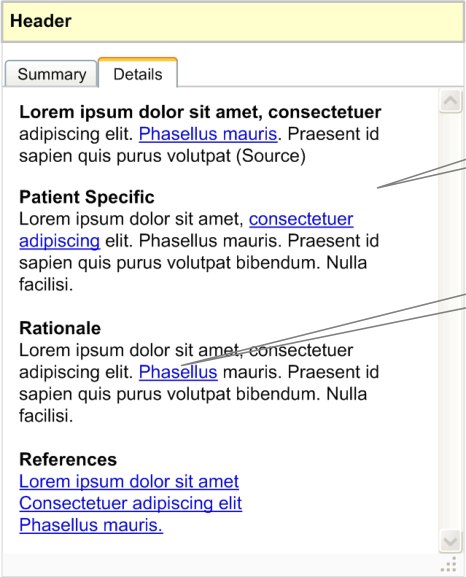
HSCIC Controlled Document

##### 2.2.2 How to Use the Guidance

the summary information

####  Showing no actions available

Table 6: How to Use the Design Guide Entry

##### 2.2.3 How Not to Use the Guidance

If decision support is not recommending any actions, elements including the label and chevron should not be displayed

within the information window

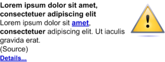
####  Showing no actions available

Table 7: How Not to Use the Design Guide Entry

##### 2.2.4 Benefits and Rationale

Incorrect format for displaying no actions recommended

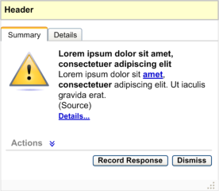

- Provides consistent display of information and reduces the users’ learning curve.

##### 2.2.5 Confidence Level

This guidance is currently classified as ‘Initial Guidance’ with ’Low’ confidence level. Further usability testing and a Patient Safety Assessment (PSA) is expected, and the guidance will be updated following this usability testing.

Page 14

Copyright ©2013 Health and Social Care Information Centre

HSCIC Controlled Document

#### 2.3 Choice Lists with Preferences

Choice lists with preferences provides graded recommendations of activities in a particular patient situation.

##### 2.3.1 Guidance

- Preferences in a choice list should be represented by icons placed to the left of the

appropriate option (see Figure 11).

- On mouse-over of the preference icon, a summary of the information should be displayed

as a tooltip. (For further details see section 2.3.1.2.)

- When the preference icon is clicked, the information window should be displayed as an

overlay aligned to the top right side of the choice list, as illustrated in Figure 12.

- If the user clicks on any other area of the screen, outside the information window, the

information window should close.

- If the user clicks on the **Dismiss** button, the information window should close.

- If the user clicks on the **Record Response** button they should be taken to the relevant area

of the clinical application to allow them to record a response.

An icon to suggest preference ratings. The icon should be placed on the left side of the option in the choice list

The information window is displayed as an overlay, aligned to the top right

Figure 11: Placement of the Preference Icon in a Choice List

Figure 12: Information Window Displayed as an Overlay

_**2.3.1.1**_ _**Icon**_

There should be unique icons to represent the different preferential ratings. However, this library of icons does not exist and needs to be explored.

Page 15

Copyright ©2013 Health and Social Care Information Centre

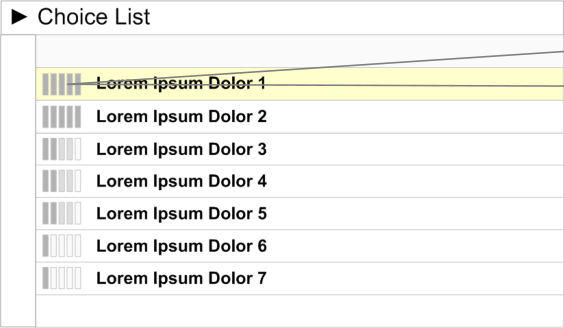

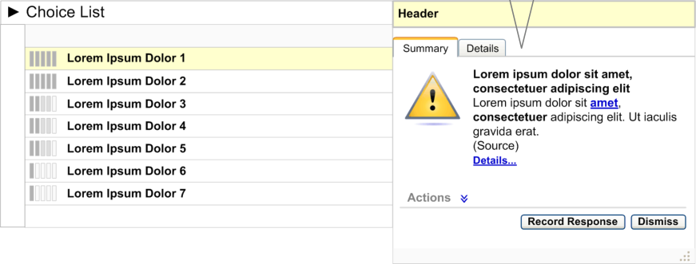
HSCIC Controlled Document

_**2.3.1.2**_ _**Summary Information on Mouse-Over**_

On mouse-over of the preference icon, a summary of the information should be displayed as a tooltip (see Figure 13). The summary information should identify the reason for the preference (for example, “Potential drug–drug interaction with Furosemide”). The summary information should be brief.

**Note**

The following examples (Figure 13 and Figure 14) are taken from the _NHS CUI Design Guide Workstream_

_– Design Guide Entry – Medications Management – Search and Prescribe_ **{R4}** and are used here for illustrative purposes only.

Example of a single summary

Figure 13: Single Information Summary

If there are multiple reasons for a particular preference, display all the information summaries on mouse-over.

Example of multiple summaries

Figure 14: Multiple Information Summaries

_**2.3.1.3**_ _**Information Window Anatomy**_

The information window anatomy should essentially follow the guidelines defined in section 2.2, with only the following minor differences:

- **Header Area**

Should be labelled ’Explanation’.

- **Summary Area – Single Summary**

If any wording in the summary is derived from one or more patient items, it should be linked to that record item in its original context. For example, if the summary says “There are

Page 16

Copyright ©2013 Health and Social Care Information Centre

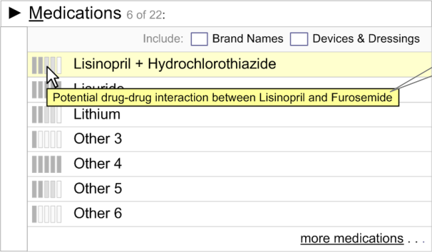

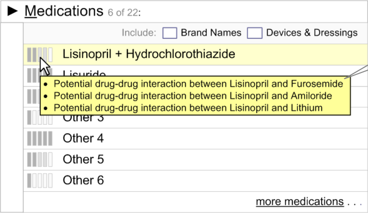
HSCIC Controlled Document

potential additive hypotensive effects with Lisinopril and Furosemide, a current medication for this patient”, then ‘Furosemide’ should be a hyperlink (see Figure 15) which, when clicked, should display the current medications list in conjunction with the alert box. This interactive behaviour has not been detailed and needs to be explored.

If the summary refers to any record item of the patient, this reference should be linked to that record item

Figure 15: Summary Area

- **Summary Area – Multiple Summaries**

If there are multiple summaries for the same option, display all the summaries within the same information window as illustrated in Figure 16. Actions for multiple summaries should be consolidated as a single list in the actions area. Explanations for multiple summaries should be consolidated in the explanation area.

Page 17

Copyright ©2013 Health and Social Care Information Centre

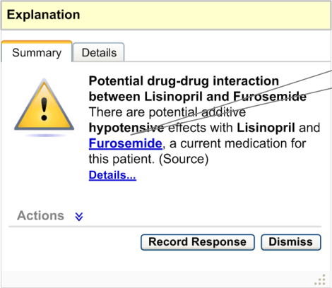
HSCIC Controlled Document

Figure 16: Summary Area – Multiple Pieces of Information

##### 2.3.2 How to Use the Guidance

This is how multiple pieces of information for the same option should be displayed

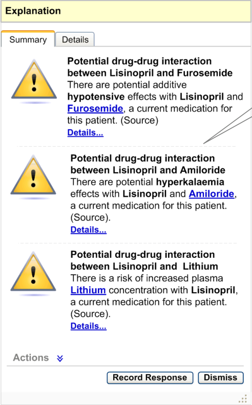

placed to the left side of the option in the choice list

####  Displaying multiple information

summaries

If there are multiple reasons for a low preferential rating, on mouse-over all information summaries should be listed as bullet points

Page 18

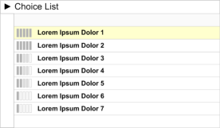

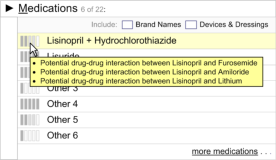

Copyright ©2013 Health and Social Care Information Centre

HSCIC Controlled Document

summaries within the same information window

Table 8: How to Use the Design Guide Entry

##### 2.3.3 How Not to Use the Guidance

the choice list

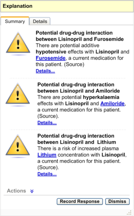

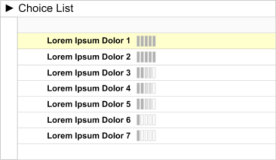
####  Displaying multiple information

summaries

####  Displaying multiple information

Table 9: How Not to Use the Design Guide Entry

##### 2.3.4 Benefits and Rationale

Do not display the multiple summaries without bullet points

Do not divide the information into individual information windows

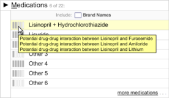

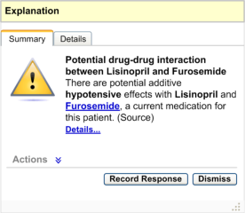

- By providing the preferred options at an early stage in the process, disruption to the

workflow is minimised.

Copyright ©2013 Health and Social Care Information Centre

Page 19

HSCIC Controlled Document

##### 2.3.5 Confidence Level

This guidance is currently classified as ‘Initial Guidance’ with ’Low’ confidence level. Further usability testing and a Patient Safety Assessment (PSA) is expected, and the guidance will be updated following this usability testing.

#### 2.4 Unprompted Notifications (System-Generated Alerts)

An ‘Alert’ is a notification that is relevant to the patient, and is generated in response to a change in the information available.

##### 2.4.1 Guidance

_**2.4.1.1**_ _**Alert Behaviour**_

This section details the interactive behaviour of system-generated alerts.

- In the context of a clinical application, there should be an indicator for system-generated

alerts. This indicator could be represented by an icon.

- The indicator icon should clearly indicate the state it represents, as detailed in section

2.4.1.2.

- When a new alert appears, a pop-up should be displayed in close proximity to the indicator

icon (see Figure 17). This pop-up should capture the status, date and time of the alert in its header, according to the existing _NHS CUI Design Guide Workstream – Design Guide_ _Entry – Time_ _Display_ **{R2}** and _NHS CUI Design Guide Workstream – Design Guide Entry –_ _Date Display_ **{R3}** guidance. The pop-up should also capture the alert icon and description. The pop-up should fade out over a period of time (approximately 5–10 seconds) as it should not obstruct the view of the clinical application.

- If the user clicks on the pop-up, the system should display the alert container.

- When the indicator icon is clicked, the system should display the alert container, which lists

all the active system-generated alerts for this patient. The alerts should be grouped by status and stacked in reverse chronological order.

- There should be two types of alert status: High Priority and Priority. All ‘Priority’ alerts

should be displayed in a collapsed state by default, where only the alert header is visible. All ‘High Priority’ alerts should be displayed in an expanded state by default, where the alert details are visible (see Figure 18). The group of ‘High Priority’ alerts should be placed above the group of ‘Priority’ alerts.

- The user should be able to collapse and expand every alert by clicking on the alert header.

- If the number of alerts increases beyond the designated screen space of the alert container,

a vertical scroll bar should be introduced to accommodate all the alerts. This holds true even if the expanded alerts need to take up additional vertical screen space.

Figure 17: High Priority Alert Pop-Up

Page 20

Copyright ©2013 Health and Social Care Information Centre

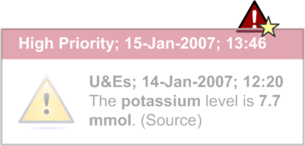
HSCIC Controlled Document

Figure 18: Different Default States for High/Priority Alerts

_**2.4.1.2**_ _**Alert Icon**_

All ‘High Priority’ alerts should be displayed in an expanded state by default

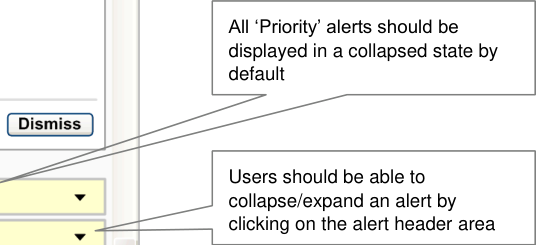

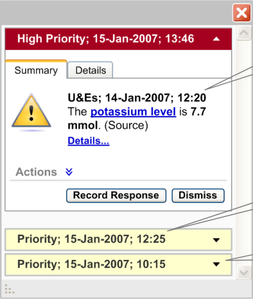

There should be unique icons to represent the different states of the indicator icon. There should also be unique icons to represent the different types of system-generated alerts. However, this library of icons does not exist and needs to be explored.

The indicator icon should suggest the following states (as illustrated in Table 10):

- No active alerts

- One or more active Priority alert which has not been viewed

- One or more active Priority alert which has been viewed

- One or more High Priority active alert and a possible number of Priority alerts which have

not been viewed

- One or more High Priority active alert and a possible number of Priority alerts which have

been viewed

Page 21

Copyright ©2013 Health and Social Care Information Centre

HSCIC Controlled Document

Icon suggests there are no active alerts

Icon suggests there is one or more active Priority alert which has not been viewed

Icon suggests there is one or more active Priority alert which has been viewed

Icon suggests there is one or more High Priority active alert and a possible number of Priority alerts which have not been viewed

Icon suggests there is one or more High Priority active alert and a possible number of Priority alerts which have been viewed

Table 10: States of the Indicator Icon

Icons could represent different types of system-generated alerts. The different types of systemgenerated alerts need to be defined.

_**2.4.1.3**_ _**Alert Summary**_

There should be two types of an alert summary for system-generated alerts. The first appears as a pop-up for a new alert (as illustrated in Figure 17). The second is displayed as the alert header when an alert is in a collapsed state in the alert container (as illustrated Figure 18).

The alert summary in the pop-up should display the alert status, date and time according to the existing _NHS CUI Design Guide Workstream – Design Guide Entry – Time_ _Display_ **{R2}** and _NHS_ _CUI Design Guide Workstream – Design Guide Entry – Date Display_ **{R3}** guidance. The summary should also display the alert icon and identify the reason for the alert (for example, “The potassium level is 7.7 mmol”). The alert summary should be brief.

The summary in the header should display the alert status, date and time according to the existing _NHS CUI Design Guide Workstream – Design Guide Entry – Time_ _Display_ **{R2}** and _NHS CUI_ _Design Guide Workstream – Design Guide Entry – Date Display 1000_ **{R3}** guidance.

_**2.4.1.4**_ _**Alert Window Anatomy**_

The alert window anatomy should essentially follow the guidelines defined in section 2.2 with minor differences:

- **Header Area**

Should capture the alert status (for example, High Priority), date and time of the alert according to the existing _NHS CUI Design Guide Workstream – Design Guide Entry – Time_ _Display_ **{R2}** and _NHS CUI Design Guide Workstream – Design Guide Entry – Date Display_ **{R3}** guidance. See Figure 19.

- **Summary Area**

 If the alert summary refers to any record item of the patient, this reference should be linked to that record item. For example if the alert summary says “The potassium level is 7.7 mmol”. “Potassium level” should be a hyperlink which, when clicked, should display the patient’s potassium level details along with the other U&E results.

 The resizing control should not be present for an individual alert box.

Page 22

Copyright ©2013 Health and Social Care Information Centre

HSCIC Controlled Document

- **Alerts Container Area**

 This area should contain all the active system-generated alerts in context for this patient (as illustrated in Figure 20)

 The alerts should be stacked in reverse chronological order

 If the number of alerts increases beyond the designated screen space of the alert container, a vertical scroll bar should be introduced

 The resizing control should be available here. On resizing the container area, all the alerts in the container should also get resized

 The minimum dimensions of the alert container and information window should be fixed.

The alert header area should capture the status, date and time of the alert

Figure 19: Anatomy of a System-Generated Alert

Page 23

Copyright ©2013 Health and Social Care Information Centre

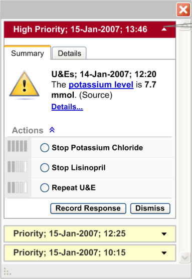
HSCIC Controlled Document

Figure 20: Alert Container

##### 2.4.2 How to Use the Guidance

Alert container which stacks all the system generated alerts, grouped by status, in reverse chronological order

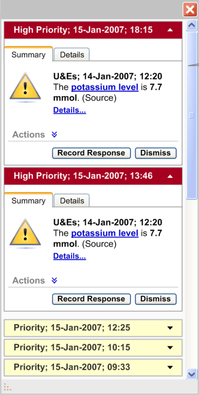

default, where the alert details are visible. All ‘Priority’ alerts should be displayed in a collapsed state by default, where only the alert header details are visible

Page 24

Copyright ©2013 Health and Social Care Information Centre

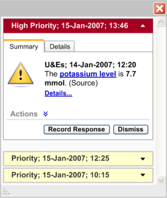
HSCIC Controlled Document

and stacked in reverse chronological order. The group of ‘High Priority’ alerts should be placed above the group of ‘Priority’ alerts

Table 11: How to Use the Design Guide Entry

##### 2.4.3 How Not to Use the Guidance

Page 25

Copyright ©2013 Health and Social Care Information Centre

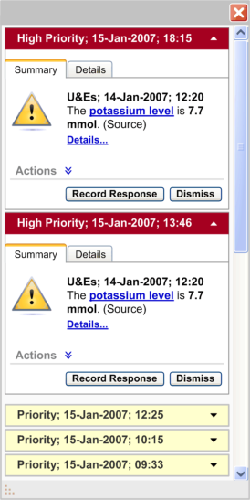

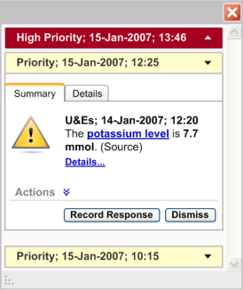
HSCIC Controlled Document

Table 12: How Not to Use the Design Guide Entry

##### 2.4.4 Benefits and Rationale

- System-generated alerts inform the user about a situation which requires attention.

- Interruption of important care processes is minimized because system-generated alerts are

designed to demand attention without modal behaviour.

##### 2.4.5 Confidence Level

This guidance is currently classified as ‘Initial Guidance’ with ’Low’ confidence level. Further usability testing and a Patient Safety Assessment (PSA) is expected, and the guidance will be updated following this usability testing.

#### 2.5 Next Steps

In order to progress this work further, the following aspects of decision support require consideration and investigation:

- Carry out further research, user testing and patient safety assessments

- Handling of multi-patient alerts when a clinician is not in a patient’s record

- Design a library of icons for alerts and the display of preferences

- Ability to turn elements of the decision support capability window on/off

- Extend this guidance to have multiple patient views

- Work with the software and application providers to refine the guidance

- The header information for system-generated alerts should be explored further to

accommodate summary information of the alert

- Research into how to summarise an alert to make it meaningful

Page 26

Copyright ©2013 Health and Social Care Information Centre

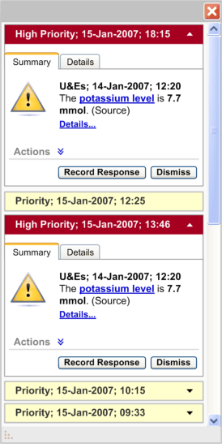
HSCIC Controlled Document

- Design for the ‘look-ahead scroll bar’ to suggest the number of system-generated alerts that

are behind the scroll bar

- Placement of the system-generated alerts container within a clinical application

Page 27

Copyright ©2013 Health and Social Care Information Centre

HSCIC Controlled Document

### 3 DOCUMENT INFORMATION

#### 3.1 Terms and Abbreviations

CUI Common User Interface

EPR Electronic Patient Record

NHS National Health Service

NHS CFH NHS Connecting for Health

PSA Patient Safety Assessment

Table 13: Terms and Abbreviations

#### 3.2 Definitions

NHS Entity Within this document, defined as a single NHS organisation or group that is operated within a single technical infrastructure environment by a defined group of IT administrators.

The Authority The organisation implementing the NHS National Programme for IT (currently NHS Connecting for Health).

Current best practice Current best practice is used rather than best practice, as over time best practice guidance may change or be revised due to changes to products, changes in technology, or simply the additional field deployment experience that comes over time.

Pop-up Within this document, a pop-up is a feature that behaves like a small window, and fades in and out of the current clinical application over a period of time.

Table 14: Definitions

#### 3.3 Nomenclature

This section shows how to interpret the different styles used in this document to denote various types of information.

_**Body Text**_

Code, script and other markup languages within the main text are denoted with `monospace text` .

Interface dialog names, field names and controls are denoted with **bold** text.

Folder and file names are denoted with Title Case text.

_**Cross References**_

Cross references to other sections in the current document comprise a section number. Cross references may also be to figures and tables, where the caption number only might be shown.

References to other Project documents are shown in _italics_. Footnotes with additional details may also be used.

References to sections in publicly available documents are shown in _italics_ and the document referred to will be given as a footnote.

References to other external Web based content are shown in _italics_ and a hyperlink will be given as a footnote.

Page 28

Copyright ©2013 Health and Social Care Information Centre

HSCIC Controlled Document

At the time of writing this document, Web sites are referenced using active hyperlinks to the correct Web page. Due to the dynamic nature of Web sites, in time these links might become invalid.

#### 3.4 References

**R1.** NHS CUI Design Guide Workstream - Table of Contents 2.0.0.0 30-Oct-2006

**R2.** NHS CUI Design Guide Workstream – Design Guide Entry - Time Display 2.0.0.0 01-Feb-2007

**R3.** NHS CUI Design Guide Workstream – Design Guide Entry – Date Display, Quick Wins

**R4.** NHS CUI Design Guide Workstream – Design Guide Entry – Medications Management – Search and Prescribe

Table 15: References

1.0.0.0 01-Jun-2006

1.0.0.0 18-Aug-2006

Page 29

Copyright ©2013 Health and Social Care Information Centre

HSCIC Controlled Document

### REVISION AND SIGNOFF SHEET

#### Change Record

05 Mar-2007 Shruti Kapur /

Igor Laketic

12-Mar-2007 Shruti Kapur /

Igor Laketic

0.0.0.1 Initial draft for review/discussion

0.0.0.2 Added comments from the audience

14-Mar-2007 L Boardman-Rule 0.0.0.3 Initial copyedit.

14-Mar-2007 Igor Laketic /

Shruti Kapur

0.0.0.4 Accepted changes

14-Mar-2007 L Boardman-Rule 0.0.0.5 Copyedit

14-Mar-2007 Igor Laketic 0.0.0.6 Accepted changes

14-Mar-2007 L Boardman-Rule 0.0.1.0 Document cleansed.

16-Mar-2007 Shruti Kapur /

Igor Laketic

0.0.1.1 Added audience’s comments.

20-Mar-2007 Paul Robinson 0.0.1.2 Review prior to final copy edit

21-Mar-2007 Clare Coney 0.0.1.3 Copyedit

21-Mar-2007 Igor Laketic /

Shruti Kapur

0.0.1.4 Accepted changes

21-Mar-2007 Clare Coney 0.1.0.0 Document cleansed. Baseline Candidate

28-Mar-2007 Vivienne Jones 1.0.0.0 Baseline following Acceptance

Document Status has the following meaning:

- **Drafts 0.0.0.X**  - Draft document reviewed by the Microsoft CUI project team and the

Authority designate for the appropriate Workstream. The document is liable to change.

- **Working Baseline 0.0.X.0**  - The document has reached the end of the review phase and

may only have minor changes. The document will be submitted to the Authority CUI project team for wider review by stakeholders, ensuring buy-in and to assist in communication.

- **Baseline Candidate 0.X.0.0**  - The document has reached the end of the review phase and

it is ready to be frozen on formal agreement between the Authority and the Company

- **Baseline X.0.0.0**  - The document has been formally agreed between the Authority and the

Company

Note that minor updates or corrections to a document may lead to multiple versions at a particular status.

Page 30

Copyright ©2013 Health and Social Care Information Centre

HSCIC Controlled Document

#### Audience

The audience for this document includes:

- **Authority CUI Manager / Project Sponsor** . Overall project manager and sponsor for the

NHS CUI project within the Authority.

- **Authority NHS CUI Design Guide Workstream Project Manager.** Responsible for

ongoing management and administration of the Workstream.

- **The Authority Project Team** . This document defines the approach to be taken during this

assessment and therefore must be agreed by the Authority.

- **Microsoft NHS CUI Team** . This document defines the approach to be taken during this

assessment, including a redefinition of the NHS CUI Design Guide Workstream strategy.

#### Reviewers

Paul Robinson Lead Program Manager 0.0.0.1 08-Mar-2007

Paul Robinson Lead Program Manager 0.0.1.2 20-Mar-2007

#### Distribution

Tim Chearman NHS CFH Design Guide Workstream Lead

Peter Johnson NHS CFH Clinical Architect

Kate Verrier Jones NHS CFH Clinical Advisor

Mike Carey NHS CFH Toolkit Workstream Lead

David Allan-Smith NHS CFH Clinical Advisor

Dee Hackett NHS CFH Clinical Advisor

Sara Wood NHS CFH Clinical Advisor

As Reviewers

#### Open Issues Summary

None

Page 31

Copyright ©2013 Health and Social Care Information Centre

HSCIC Controlled Document

#### Document Properties

Document Title NHS CUI Design Guide Workstream Design Guide Entry - Decision Support

Author NHS CUI Programme Team

Restrictions **RESTRICTED – COMMERCIAL; MICROSOFT COMMERCIAL;** Access restricted to: NHS CUI Project Team, Microsoft NHS Account Team

Creation Date 5 March 2007

Last Updated 23 June 2015

**Copyright:**

You may re-use this information (excluding logos) free of charge in any format or medium, under the terms of the Open Government Licence. To view this licence, visit [nationalarchives.gov.uk/doc/open-government-licence or email psi@nationalarchives.gsi.gov.uk.](https://web.nhs.net/OWA/redir.aspx?C=dMnSAL43xUOp9X_SOcscV9mT5A0smdBIh1_vxjdSDVCERI33v7-idn6tNFCNwJYUR1PxIW-Hd-E.&URL=http%3a%2f%2fnationalarchives.gov.uk%2fdoc%2fopen-government-licence)

Page 32

Copyright ©2013 Health and Social Care Information Centre
