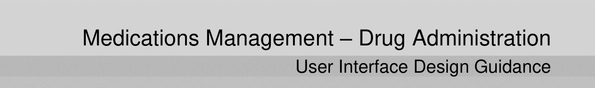
_Prepared for_
**NHS Connecting for Health**
**Version 5.0.0.0 Baseline**
_Prepared by_
**Clinical Applications and Patient Safety Project**
**NHS CUI Programme Team**
[Cuistakeholder.mailbox@hscic.gov.uk](mailto:Cuistakeholder.mailbox@hscic.gov.uk)
#### PREFACE

<!-- TOC -->
<!-- TOC generated by Markdown All in One style -->

- [PREFACE](#preface)
- [1 INTRODUCTION](#1-introduction)
  - [1.1 Customer Need](#11-customer-need)
  - [1.2 Scope](#12-scope)
    - [1.2.1 In Scope](#121-in-scope)
    - [1.2.2 Out of Scope](#122-out-of-scope)
    - [1.2.3 Decision Support Statement](#123-decision-support-statement)
  - [1.3 Assumptions](#13-assumptions)
  - [1.4 Dependencies](#14-dependencies)
- [2 GUIDANCE OVERVIEW](#2-guidance-overview)
  - [2.1 Rationale Summary](#21-rationale-summary)
  - [2.2 Summary of Guidance](#22-summary-of-guidance)
- [3 DRUG ADMINISTRATION GUIDELINES](#3-drug-administration-guidelines)
  - [3.1 Introduction](#31-introduction)
  - [3.2 Principles](#32-principles)
  - [3.3 Structure and Contents](#33-structure-and-contents)
    - [3.3.1 Composition of the Drug Administration View](#331-composition-of-the-drug-administration-view)
    - [3.3.2 Inclusion Criteria](#332-inclusion-criteria)
  - [3.4 List Order](#34-list-order)
  - [3.5 Drug Administration View Controls](#35-drug-administration-view-controls)
    - [3.5.1 Controls in the Drug Administration View](#351-controls-in-the-drug-administration-view)
    - [3.5.2 Grouping](#352-grouping)
    - [3.5.3 Status Bar](#353-status-bar)
  - [3.6 Navigation](#36-navigation)
  - [3.7 The Look-Ahead Scroll Bar](#37-the-look-ahead-scroll-bar)
  - [3.8 Left-Hand Panel](#38-left-hand-panel)
    - [3.8.1 LHP Structure and Contents](#381-lhp-structure-and-contents)
    - [3.8.2 LHP Icons](#382-lhp-icons)
    - [3.8.3 LHP Information Panel](#383-lhp-information-panel)
  - [3.9 Chart Area](#39-chart-area)
    - [3.9.1 Chart Area Structure and Layout](#391-chart-area-structure-and-layout)
    - [3.9.2 Time Scale](#392-time-scale)
    - [3.9.3 Indicating Past and Future](#393-indicating-past-and-future)
    - [3.9.4 Indicating Today](#394-indicating-today)
    - [3.9.5 Indicating the Currently-Selected Day](#395-indicating-the-currently-selected-day)
    - [3.9.6 Information Display](#396-information-display)
    - [3.9.7 Information Display for the Currently-Selected Day](#397-information-display-for-the-currently-selected-day)
    - [3.9.8 Chart Area Access to More Details](#398-chart-area-access-to-more-details)
    - [3.9.9 Symbols and Icons](#399-symbols-and-icons)
  - [3.10 Overdue Drugs](#310-overdue-drugs)
    - [3.10.1 Overdue Drugs](#3101-overdue-drugs)
    - [3.10.2 Past Overdue](#3102-past-overdue)
  - [3.11 Displaying As Required Administration Events](#311-displaying-as-required-administration-events)
  - [3.12 Displaying Once Only Administration Events](#312-displaying-once-only-administration-events)
  - [3.13 Administrations of Significant Duration](#313-administrations-of-significant-duration)
    - [3.13.1 Displaying Significant Duration Drugs](#3131-displaying-significant-duration-drugs)
    - [3.13.2 Status Box](#3132-status-box)
    - [3.13.3 Detailed View](#3133-detailed-view)
    - [3.13.4 Recording Significant Duration Drug Administrations](#3134-recording-significant-duration-drug-administrations)
  - [3.14 When a Patient is Nil by Mouth](#314-when-a-patient-is-nil-by-mouth)
    - [3.14.1 Displaying Nil by Mouth Status](#3141-displaying-nil-by-mouth-status)
    - [3.14.2 Supporting Administrations While a Patient is Nil by Mouth](#3142-supporting-administrations-while-a-patient-is-nil-by-mouth)
  - [3.15 Complex Drugs](#315-complex-drugs)
    - [3.15.1 Variable Dose Drugs](#3151-variable-dose-drugs)
    - [3.15.2 Preconditions](#3152-preconditions)
    - [3.15.3 Time-Critical Administration Events](#3153-time-critical-administration-events)
    - [3.15.4 Witnessed, Role-Specific and Self-Administrations](#3154-witnessed-role-specific-and-self-administrations)
    - [3.15.5 Displaying Partially-Logged Administrations](#3155-displaying-partially-logged-administrations)
  - [3.16 Recording Administration Events](#316-recording-administration-events)
    - [3.16.1 Recording Administration Events](#3161-recording-administration-events)
    - [3.16.2 Structure of the Form](#3162-structure-of-the-form)
    - [3.16.3 Recording Administrations](#3163-recording-administrations)
  - [3.17 Medication Updates](#317-medication-updates)
- [4 DOCUMENT INFORMATION](#4-document-information)
  - [4.1 Terms and Abbreviations](#41-terms-and-abbreviations)
  - [4.2 Definitions](#42-definitions)
  - [4.3 Nomenclature](#43-nomenclature)
    - [4.3.1 Body Text](#431-body-text)
    - [4.3.2 Cross References](#432-cross-references)
  - [4.4 References](#44-references)
- [APPENDIX A STUDY ID 8: EXECUTIVE SUMMARY](#appendix-a-study-id-8-executive-summary)
  - [A.1 Abstract](#a1-abstract)
  - [A.2 Research Objectives](#a2-research-objectives)
  - [A.3 Research Design](#a3-research-design)
    - [A.3.1 Interviews](#a31-interviews)
    - [A.3.2 Survey](#a32-survey)
  - [A.4 Results](#a4-results)
    - [A.4.1 Interview Participant Description](#a41-interview-participant-description)
    - [A.4.2 Survey Respondent Description](#a42-survey-respondent-description)
    - [A.4.3 Design Areas](#a43-design-areas)
- [APPENDIX B STUDIES ID 14 AND 40: EXECUTIVE SUMMARY](#appendix-b-studies-id-14-and-40-executive-summary)
  - [B.1 Abstract](#b1-abstract)
  - [B.2 Research Objectives](#b2-research-objectives)
  - [B.3 Research Design](#b3-research-design)
    - [B.3.1 Interviews (Study ID 40)](#b31-interviews-study-id-40)
    - [B.3.2 Survey (Study ID 14)](#b32-survey-study-id-14)
  - [B.4 Results](#b4-results)
    - [B.4.1 Interview Participant Description](#b41-interview-participant-description)
    - [B.4.2 Survey Respondent Description](#b42-survey-respondent-description)
    - [B.4.3 Design Areas](#b43-design-areas)
- [APPENDIX C CHANGES SINCE PREVIOUS VERSION](#appendix-c-changes-since-previous-version)
- [REVISION AND SIGNOFF SHEET](#revision-and-signoff-sheet)
  - [Change Record](#change-record)
  - [Open Issues Summary](#open-issues-summary)
  - [Audience](#audience)
  - [Reviewers](#reviewers)
  - [Distribution](#distribution)
  - [Document Properties](#document-properties)

<!-- /TOC -->

Source PDF: [drugadmin.pdf](../../pdfs/medications-management/drugadmin.pdf)

**Documents replaced by this document**
Medications Management – Drug Administration – User Interface Design Guidance 4.0.0.0
Design Guide Entry – Medications Management – Drug Administration 3.0.0.0
Design Guide Entry – Medications Management – Drug Administration 2.0.0.0
Design Guide Entry – Medications Management – Drug Administration 1.0.0.0
**Documents to be read in conjunction with this document**
Design Guide Entry – Medications Management – Medications List 1.0.0.0
Design Guide Entry – Time Display 4.0.0.0
Design Guide Entry – Date Display 4.0.0.0
Design Guide Entry – Date and Time Input 3.0.0.0
Design Guide Entry – Patient Banner 4.0.0.0
Medications Management – Search and Prescribe – User Interface Design Guidance 1.0.0.0
Accessibility Checkpoints for NHS Applications 1.0.0.0
Accessibility for Clinical Applications 1.0.0.0
Medications Management – Medication Line – User Interface Design Guidance 2.0.0.0
Timeline View – User Interface Design Guidance 1.0.0.0
**This document was prepared for NHS Connecting for Health which ceased to exist on 31 March**
**2013. It may contain references to organisations, projects and other initiatives which also no**
**longer exist. If you have any questions relating to any such references, or to any other aspect of**
**[the content, please contact cuistakeholder.mailbox@hscic.gov.uk](mailto:cuistakeholder.mailbox@hscic.gov.uk)**
**Patient Safety Process**
The development lifecycle for this design guide includes an integrated patient / clinical safety risk assessment and management process.
Known patient safety incidents relevant to this design guidance area have been researched and reviewed as part of ongoing development. The resulting guidance points aim to support mitigation of these known patient safety risks. In addition, the developers of this design guide have undertaken a patient safety risk assessment to identify new risks that could potentially be introduced by the guidance points in this document. Any potential risks identified have been assessed and managed to support the ongoing clinical safety case for this design guide.
The Hazard Log records all the risks that have been identified during development and describes mitigatory actions that, in some cases, will need to be taken by users of this design guide. The Hazard Log is a live document that is updated as the design guide is developed and maintained. Until this design guide has received full Clinical Authority to Release (CATR) from the NHS Connecting for Health (CFH) Clinical Safety Group (CSG) – based on an approved Clinical Safety Case – there may be outstanding patient safety risks yet to be identified and mitigated.
Additionally, users implementing applications that follow this design guide’s guidelines (for example, healthcare system suppliers) are expected to undertake further clinical safety risk assessments of their specific systems within their specific context of use.
[Refer to www.cui.nhs.uk](http://www.cui.nhs.uk/) for further information on the patient safety process and for the safety status and any relevant accompanying safety documentation for this design guide.
#### 1 INTRODUCTION

This document provides design guidance for Drug Administration. It describes the area of focus, provides guidance and recommendations and explains the rationale behind the guidance and recommendations.

To indicate their relative importance, each guideline in this document is ranked by **Conformance** and by **Evidence Rating** . Table 1 defines those terms:

Conformance Indicates the extent to which you should follow the guideline when defining your UI implementation. There are two levels:

 **Mandatory**         - An implementation should follow the guideline

 **Recommended**         - An implementation is advised to follow the guideline

Evidence Rating Summarises the strength of the research defining the guideline and the extent to which it mitigates patient safety hazards. There are three ratings (with example factors used to determine the appropriate rating):

 **Low:**

 Does not mitigate specific patient safety hazards

 User research findings unclear and with few participants

 Unreferenced usability principles indicate the design is not significantly better than alternatives

 **Medium:**

 Mitigates specific patient safety hazards

 User research findings clear but with few participants

 References old authoritative guidance (for example, from National Patient Safety Agency (NPSA),

Institute for Safe Medication Practices (ISMP) or World Health Organization (WHO)) that is potentially soon to be superseded

 Referenced usability principles indicate the design is significantly better than alternatives

 **High:**

 Mitigates specific patient safety hazards

 User research findings clear and with a significant number of participants

 References recent authoritative guidance (for example, from NPSA, ISMP or WHO)

 Referenced usability principles indicate the design is significantly better than alternatives

Table 1: Conformance and Evidence Rating Definitions

**Note**

It is also important to understand the meaning of the term ‘current’ as used in this document. Current medications refer to those that have been prescribed to a patient and have not yet been discontinued or completed. A medication can also be termed current with reference to a time in the past when the medication was current for the patient.

Refer to section 4.2 for definitions of the specific terminology used in this document.

This document is intended for use by anyone whose role involves screen design and the implementation or assessment of NHS clinical applications. This document can therefore be used as guidance for the specification of display and interaction models for drug administration.

Page 1

Copyright ©2013 Health and Social Care Information Centre

HSCIC Controlled Document

Table 2 describes the changes made since the previous version of this guidance (Baseline version 4.0.0.0 dated 23-Mar-2009):

**Deleted** This document has been significantly enhanced since the previous version. Many guidelines have **Modified** been deleted, modified and added as have their associated Usage Examples and Rationales. In consequence, the list of changes is very extensive and has been relocated to APPENDIX C.

**Added**

Table 2: Updates since the Last Baseline Version

##### 1.1 Customer Need

The administration (or giving) of drugs to patients has long been recognised as a safety-critical area [1]. It is both a complex activity in itself and the last possibility for care professionals to pick up errors made earlier in the overall process of drug management. A successful display solution must therefore perform a dual function:

- Provide sufficient information to review the intended schedule and previous history of

administration

- Support the tasks at hand safely (for example, record administration events).

**Paper Charts**  - Over 20 paper based charts from a variety of locations and specialities have been assessed. The overall format of paper drug charts are broadly consistent, however there are significant differences in design, with no clearly-favoured standard for layout and organisation. Some of these design differences may well already impact patient safety as care professionals move between hospitals and have to get used to new information groupings while working in stressful environments. A key feature of paper charts is their size: they typically run to a number of sides of A4 and contain large amounts of information that needs to be viewed simultaneously for maximum comprehension.

Consistent design principles identified through these reviews are reflected in the design outlined in this document (for example, locating the information about the drug on the left hand side of the screen and the administration events on the right hand side). Much of this document will refer to this ‘Typical Generic Paper’ (TGP) drug chart, an example of which is shown in Figure 1:

Figure 1: Example of a TGP Drug Chart Format for a Regular Drug

1 Building a safer NHS for patients: Improving Medication Safety, Department of Health **{R1}** : http://www.dh.gov.uk/en/Publicationsandstatistics/Publications/PublicationsPolicyAndGuidance/DH_4071443

Page 2

Copyright ©2013 Health and Social Care Information Centre

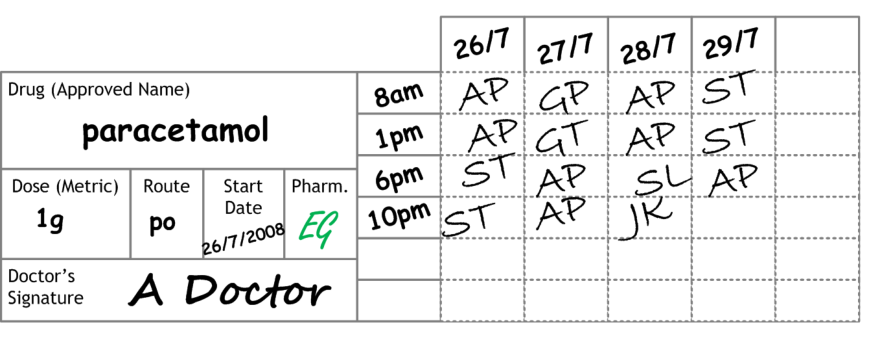
HSCIC Controlled Document

Points to note about this TGP drug chart style are:

- The drug details are located in a panel located on the left hand side

- Dates of administration are located along a top title bar

- Administration times are not fixed

- Administration times are located between the left hand details and the main administration

event area

- Six administration timeslots are permanently available

- Drugs are often split into the following categories:

 Once Only

 Regular

 As Required (also known as ‘PRN’, referencing the Latin _Pro Re Nata_ )

 Infusions

- There are often additional categories (such as ‘Oral Anticoagulants’ and ‘Insulin’) that have

dedicated areas on the chart or are recorded on subsidiary charts

**Electronic systems**  - The display formats for medicines administration information within electronic systems are much less consistent than the formats of paper charts. These differences impact both the review and task completion functions referred to above and will become a safety concern as electronic systems become more widely available. The challenge for developers of electronic systems is particularly great in this area, as there are no universally-accepted, paperbased standards to refer to and computer screens are not capable of displaying the same density of information as a sheet of A4 paper (let alone a fold-out chart, which may cover up to three sheets). This ‘information density problem’ is one of the primary reasons why designers of electronic systems resort to ‘creative solutions’ and why display solutions inevitably diverge. The intention of this guidance is to use design principles that are common across paper drug charts so that there is a familiarity with aspects of the current paper drug charts, thus reducing the training required to move to these electronic systems.

**Note**

Also see the _ePrescribing System Evaluations_ document _[2]_.

##### 1.2 Scope

The guidance in this document is for the Drug Administration View. This view is envisaged as being part of a clinical system that includes a series of views, some of which present medications information for each patient. Guidance for the display of a patient's medications is defined in _Medications Management – Medications List – User Interface Design Guidance_ **{R3}**, and more detailed guidance for the layout and formatting of individual medications is defined in _Medications_ _Management – Medication Line – User Interface Design Guidance_ **{R4}** . Medications may also be displayed within another view, such as a Timeline View as defined in _Timeline View – User_ _Interface Design Guidance_ **{R5}** .

Figure 2 shows a simple outline of the structure and layout of elements within the Drug Administration View. This illustration is used throughout the document, with shaded sections highlighting the area to which the guidance in that section applies.

2 NHS CFH: ePrescribing System Evaluations **{R2}** [: http://nww.connectingforhealth.nhs.uk/eprescribing](http://nww.connectingforhealth.nhs.uk/eprescribing)

[Access requires an N3 connection. If you do not have an N3 connection, email eprescribing@nhs.net](mailto:eprescribing@nhs.net) for help.

Page 3

Copyright ©2013 Health and Social Care Information Centre

HSCIC Controlled Document

Figure 2: Drug Administration View Outline

Figure 3 contains an example of how this outline may appear when implemented in a styled application:

Figure 3: Example of Styled Medical Application Featuring the Drug Administration View

Copyright ©2013 Health and Social Care Information Centre

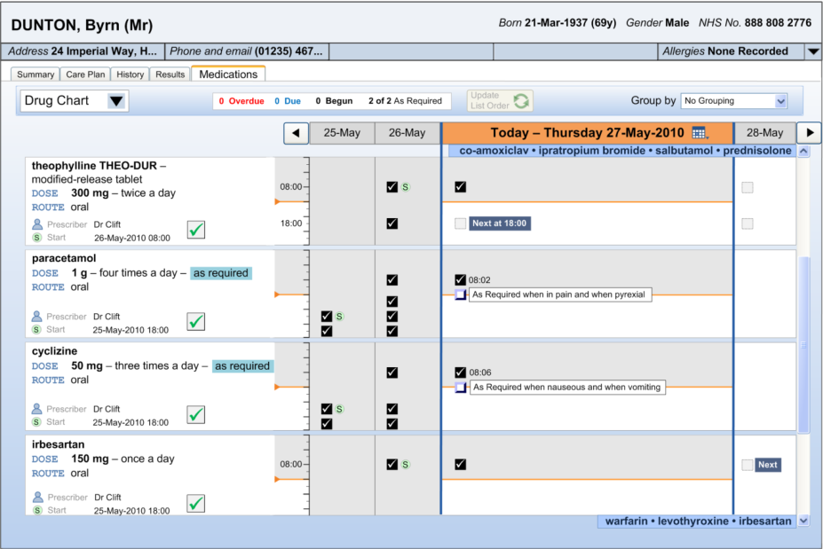

Page 4

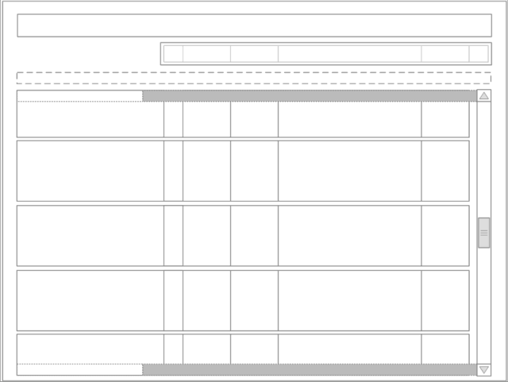
HSCIC Controlled Document

The guidance within this document relates to the area highlighted in Figure 4. All other areas displayed outside of this will not be discussed in this document.

Figure 4: Outline Displaying Drug Administration View Area

Figure 5 provides an overview of the Drug Administration View structure. **Drugs** are presented in the Drug Administration View as a set of horizontal strips within a list. Controls for manipulating the list are positioned above the Drug Administration View in an area called the **Toolbar** and controls for changing the days in view (time navigation) are in the area labelled **Navigation Controls** .

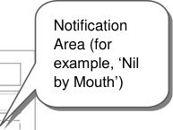

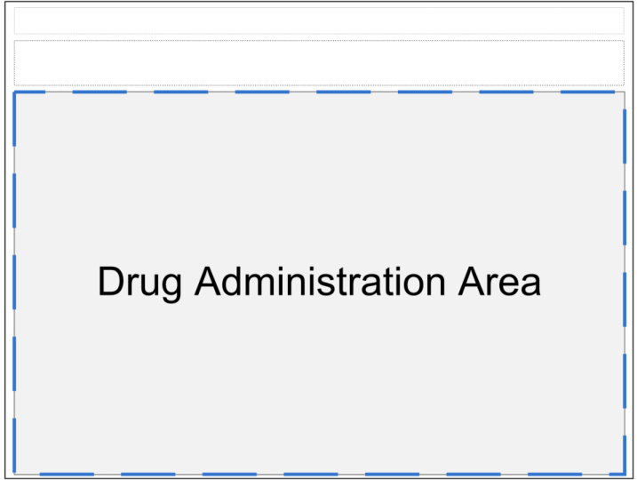

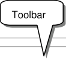

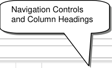

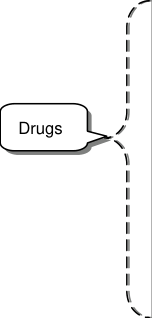

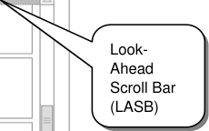

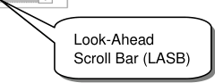

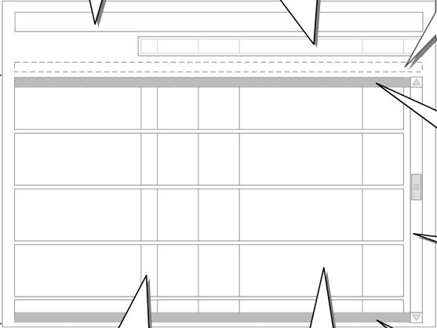

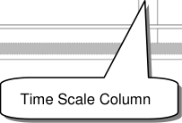

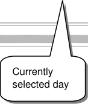

Figure 5: Overview of the Drug Administration View Areas

Copyright ©2013 Health and Social Care Information Centre

Page 5

HSCIC Controlled Document

Figure 6 indicates two key areas of the Drug Administration View: the **Left-Hand Panel** (LHP) and the **Chart Area** . Broadly speaking, information about the drug’s prescription is displayed in the Left-Hand Panel and the drug’s administration schedule is represented in the Chart Area.

Left-Hand Panel Chart Area

Figure 6: The Left-Hand Panel and Chart Area in the Drug Administration View

The Drug Administration View displays four days of the administration schedule at any one time. Days are represented by columns and drugs by rows, as shown in Figure 7:

Figure 7: Outline Display of the Four Day View

Page 6

Copyright ©2013 Health and Social Care Information Centre

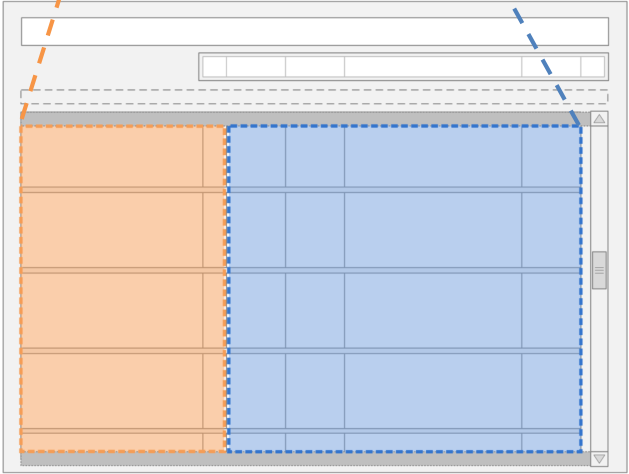

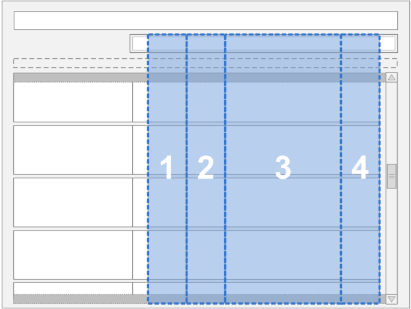
HSCIC Controlled Document

Column three is the widest column and is often referred to in this document as being ‘in focus’ or ‘selected’ (see Figure 8). This column uses the additional width to display more detail than can be viewed in the surrounding narrower columns.

Figure 8: The Location of the Currently Selected Day in the Drug Administration View

Columns one and two display the administration information for the two days prior to the day ‘in focus’, with column one displaying the information for two days prior and column two displaying the information for one day prior. The fourth column displays the details for the day after, as shown in Figure 9:

Figure 9: The Location of the Unfocused Days in the Drug Administration View

Page 7

Copyright ©2013 Health and Social Care Information Centre

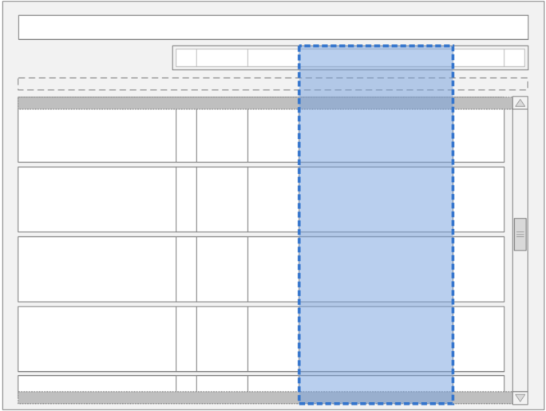

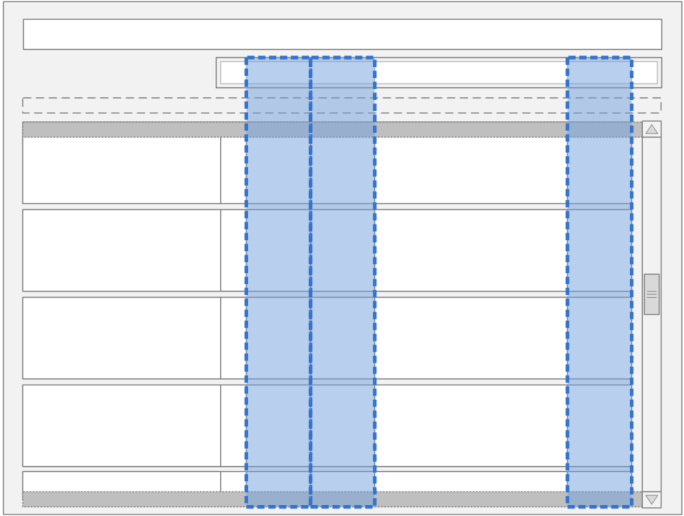
HSCIC Controlled Document

###### 1.2.1 In Scope

This guidance has been developed for, and is supported by research in, short-term acute managed care settings. The guidance is relevant to the presentation of, and interaction with, drug information for a single patient. This is specifically to support the detailed review of administration events and to record drug administrations.

Although this view has been developed for a particular setting, the design has been created so that it can be used in other settings. There are some areas where the detail required is more than the space available in the Chart Area. In this case, the user should be able to click in the relevant area to view more detail. The Drug Administration View remains a valid overview. The drugs referred to in the out of scope section (section 1.2.2) will either fit into the summary view or require an additional level of detail that the user can navigate to so are catered for by the generic design principles in this document.

The guidance in this document covers the following features:

- Recording a successful drug administration for a single patient

- Recording an unsuccessful drug administration for a single patient

- Reviewing details of an individual administration event (past administrations) for a single

patient

The following users are covered in this guidance:

- Doctor

- Nurse

- Pharmacist

The following care settings are covered in this guidance:

- Acute managed care (Inpatient)

The following types of drugs are covered in this guidance:

- Oral solids and liquids

- Inhalers and sprays

- Eye/ear/nose drops

- Topical liquids

- Creams, ointments and gels

- Enemas and rectal solutions

- Granules and powders

- Suppositories and pessaries

- Topical patches

- Nebules

- Patients own drugs (PODs)

- Drugs prescribed by independent prescribers

Other situations considered in this document:

- When a patient is Nil by Mouth

Page 8

Copyright ©2013 Health and Social Care Information Centre

HSCIC Controlled Document

###### 1.2.2 Out of Scope

**Note**

Listing an item as out of scope does not classify it as unimportant. Project time and resource constraints inevitably restrict what can be in scope for a particular release. It is possible that items out of scope for this release may be considered for a future release.

The guidance in this document does not cover the following features:

- Prescribing a drug

- Reviewing what drugs a patient is prescribed

- Checking the accuracy of a prescription

- Adjusting a prescription

- Diagnosing a patient’s condition

- Reviewing drugs for a handover

- Recording administrations without a prescription

- Supporting dose calculation

- Making changes to drugs

- Reconciliation

- Verification

- Compliance

- Discharge

- Drug stock checking

- Multi-patient tasks

- Views framework for a single patient (for example, access to the Care Plan)

- CUI Medications List View

- CUI Timeline View

- Monitoring chart view

- Selection and action in mixed views

- Drugs in other views

- Display of observations and test results

- Single day view (and additional levels of detail)

- Recording administered doses different from those prescribed

- Incomplete administration

- Partial dose administration

- Administration errors

- Partially-logged administrations

- Management of adverse reactions

- Recording administrations on behalf of another clinician

- Recording self-administrations

Page 9

Copyright ©2013 Health and Social Care Information Centre

HSCIC Controlled Document

- Preparation and administration instructions

The following users are not covered in this guidance:

- Patients

- Ward managers (multiple patient use)

- Non-clinical staff

- Other health professionals

- Anaesthetists

The following care settings are not covered in this guidance:

- Outpatients

- Clinics

- Pharmacies

- Emergency

- Intensive care

- High-Dependency Units (HDU)

- Primary care (including GP practices)

- Community and home visits

The following types of drugs are not covered in this guidance:

- Enteral feeds

- Dressings and devices

- Implants and sticks

- Intrauterine devices (IUDs)

- Cements

- Homeopathic products (including complementary and alternative therapies)

- Dialysis drugs

- Injections

- Anaesthetics

- Insulin

- Warfarin

- Infusions and fluids (these are partially addressed by Section 3.13)

- Combination Infusions

- Total Parenteral Nutrition (TPN)

- Gases

- Blood and platelet products

- Radio-pharmacy

- Foams

- Radioactive agents

- Controlled drugs

Copyright ©2013 Health and Social Care Information Centre

Page 10

HSCIC Controlled Document

- Unlicensed drugs

- Regimens and order sets

- Advisory Committee on Borderline Substances (ACBS) products

- Over the counter (OTC)

- Under the counter

- Recreational

- Unscheduled drugs, other than unscheduled As Required (for example, drugs to be

administered two hours before surgery where the date and time of surgery is unscheduled)

- Drugs with titrating doses

- Discharge drugs – to take out (TTO)

- Variable dose drugs

- Drugs prescribed by Patient Specific Direction (PSD)

- Drugs prescribed by Patient Group Direction (PGD)

- Drugs supplied under homely remedy protocols

- Drugs prescribed by supplementary prescribers

The following are not covered in this guidance:

- Sealed envelope

- Decision support (see section 1.2.3)

- Knowledge support

- Alerts and warnings

- Allergies and adverse reactions

###### 1.2.3 Decision Support Statement

Some of the guidance points in this document might be interpreted as implying that the system offers a degree of decision support (for example, time lockouts on As Required medication). However, a full definition of decision support is out of scope for this document.

##### 1.3 Assumptions

A1 The Drug Administration View is one of a set of drugs views within a medications framework that assumes the presence of a drugs section within a patient record.

A2 This guidance assumes that the clinical application will have a complete record of drugs for each patient and that the application can access and combine information about current and previous drugs.

A3 This guidance assumes that the user can access any allergy information recorded about the patient.

Table 3: Assumptions

Page 11

Copyright ©2013 Health and Social Care Information Centre

HSCIC Controlled Document

##### 1.4 Dependencies

D1 The display of dates and time and the controls used to input them are defined by the guidance in the _Time Display_ **{R6}**, _Date Display_ **{R7}** and _Date and Time Input_ **{R8}** documents.

D2 This guidance is informed by the NHS National Programme for Information Technology (NPfIT) document _dm+d_ _Implementation Guide (Secondary Care)_ _[3]_ referred to in this document as the NHS Connecting for Health (NHS CFH) Medication Types Rules. Changes to this work may trigger changes to this guidance

D3 This guidance is informed by the NHS CFH _ePrescribing Functional Specification_ _[4]_

D4 This project is in turn informed by _The Dictionary of Medicines + Devices_ _[5]_ (referred to as ‘dm+d’).

D5 The display of the drug details (name, dose, form, route, frequency and so on) in the Left-Hand Panel conforms to the guidance in the _Medication Line_ **{R4}** document.

Table 4: Dependencies

3 NHS NPfIT – dm+d Implementation Guide (Secondary Care) **{R9}:** [http://www.connectingforhealth.nhs.uk/systemsandservices/eprescribing/refdocs/index_html](http://www.connectingforhealth.nhs.uk/systemsandservices/eprescribing/refdocs/index_html)

4 NHS CFH – ePrescribing Functional Specification for NHS Trusts **{R10}** : [http://www.connectingforhealth.nhs.uk/systemsandservices/eprescribing/baselinefunctspec.pdf](http://www.connectingforhealth.nhs.uk/systemsandservices/eprescribing/baselinefunctspec.pdf)

5 The Dictionary of Medicines + Devices **{R11}** [: http://www.dmd.nhs.uk/](http://www.dmd.nhs.uk/)

Page 12

Copyright ©2013 Health and Social Care Information Centre

HSCIC Controlled Document

#### 2 GUIDANCE OVERVIEW

The guidance in this document describes a view for displaying a single patient’s drug administration schedule and history and for the recording of individual drug administration events. This **Drug** **Administration View** supports the tasks of drug administration recording and drug administration review from a single view.

The structure of the full end-to-end process of drug administration has been considered when designing this guidance. However, only the items listed in section 1.2.1 are in scope for this document. Section 2.2 summarises the guidance points detailed in the rest of this document.

**Important**

The visual representations used within this document to display the guidance are illustrative only. They are simplified in order to support understanding of the guidance points. Stylistic choices, such as colours, fonts or icons are not part of the guidance and unless otherwise specified are not mandatory requirements for compliance with the guidance in this document.

Though it is not explicit guidance, the illustrations in this document and in _Medications List_ **{R3}** follow the secondary care convention of having each fixed dose prescription on a new line, rather than, for example, putting all prescriptions for the same medication on the same line. Variable dose prescriptions may follow different conventions

In several of the usage examples, notional icons are illustrated by placeholders. Figure 10 shows examples of such notional icons:

Figure 10: Examples of Notional Icons

##### 2.1 Rationale Summary

The guidance in this document works towards reducing patient safety risks arising from the information used to administer drugs.

General Principles:

- The identification of specific drugs that are due for administration

- Supporting the safe recording of drug administrations

- Must be able to record what actually happened

- Aim not to introduce any additional risks from current paper practice

Usability Principles:

- Highlight the primary functions to support accurate recording of what happened for an

administration event

- Display safety critical elements to the clinician without requiring user action

- Promote the primary functions to support quick recording of an administration event

- Support access to secondary functions without introducing screen clutter

- Transfer key design principles from the paper drug charts studied to reduce the need for

training and increase familiarity when users move to electronic systems.

Page 13

Copyright ©2013 Health and Social Care Information Centre

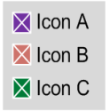
HSCIC Controlled Document

Existing Standards:

- NPfIT _ePrescribing Functional Specification for NHS Trusts_ **{R10}**

- Nursing and Midwifery Council (NMC) Standards [6]

- NHS NPfIT _dm+d Implementation Guide (Secondary Care_ ) **{R9}**

**Note**

The forthcoming NPSA report on medication administration errors has not been accounted for in the production of this guidance.

##### 2.2 Summary of Guidance

Table 5 summarises the content of this document by outlining each area of guidance (along with a cross reference to the relevant section) and providing a visual example to illustrate how it might be implemented:

3.3.1 Composition of the Drug Administration View

3.3.2 Inclusion Criteria

3.4 List Order

3.5.1 Controls in the Drug Administration View

6 Standards for medicines management **{R12}** [: http://www.nmc-uk.org/aDisplayDocument.aspx?DocumentID=6228](http://www.nmc-uk.org/aDisplayDocument.aspx?DocumentID=6228)

Page 14

Copyright ©2013 Health and Social Care Information Centre

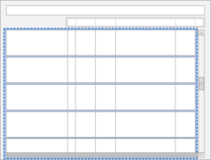

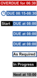

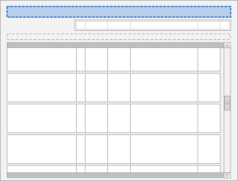
HSCIC Controlled Document

3.5.2 Grouping

3.5.3 Status Bar

3.6 Navigation

3.7 The Look-Ahead Scroll Bar

3.8.1 LHP Structure and Contents

3.8.2 LHP Icons

3.8.3 LHP Information Panel

Copyright ©2013 Health and Social Care Information Centre

Page 15

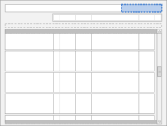

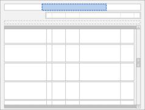

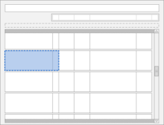

HSCIC Controlled Document

3.9.1 Chart Area Structure and Layout

3.9.2 Time Scale

3.9.3 Indicating Past and Future

3.9.4 Indicating Today

3.9.5 Indicating the Currently-Selected Day

3.9.6 Information Display

Copyright ©2013 Health and Social Care Information Centre

Page 16

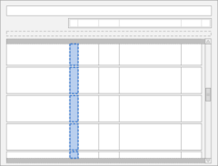

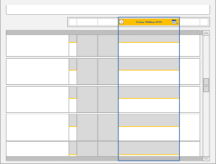

HSCIC Controlled Document

3.9.7 Information Display for the Currently-Selected Day

3.9.8 Chart Area Access to More Details

3.9.9 Symbols and Icons

3.10.1 Overdue Drugs

3.10.2 Past Overdue

3.11 Displaying As Required Administration Events

Copyright ©2013 Health and Social Care Information Centre

Page 17

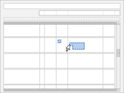

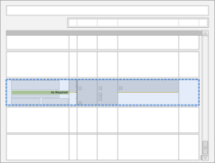
HSCIC Controlled Document

3.12 Displaying Once Only Administration Events

3.13.1 Displaying Significant Duration Drugs

3.13.2 Status Box

3.13.3 Detailed View

3.13.4 Recording Significant Duration Drug Administrations

3.14.1 Displaying Nil by Mouth Status

Copyright ©2013 Health and Social Care Information Centre

Page 18

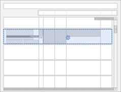

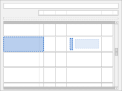

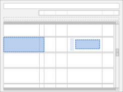

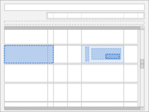

HSCIC Controlled Document

3.14.2 Supporting Administrations While a Patient is Nil by Mouth

3.15.1 Variable Dose Drugs

3.15.2 Preconditions

3.15.3 Time-Critical Administration Events

3.15.4 Witnessed, Role-Specific and SelfAdministrations

3.16.1 Recording Administration Events

Copyright ©2013 Health and Social Care Information Centre

Page 19

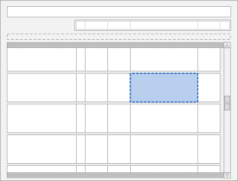

HSCIC Controlled Document

3.16.2 Structure of the Form

3.16.3 Recording Administrations

3.17 Medication Updates No Visual Summary associated with this guidance

Table 5: Summary of Guidance

Copyright ©2013 Health and Social Care Information Centre

Page 20

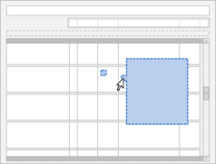
HSCIC Controlled Document

#### 3 DRUG ADMINISTRATION GUIDELINES

##### 3.1 Introduction

This section of the document presents the guidance for the Drug Administration View split by component or topic area.

##### 3.2 Principles

The following key principles inform this guidance:

- Provide a visually-rich chart of information relevant to, and prioritised for, the administration

of drugs

- Support the presentation of drugs with different characteristics (such as Significant

Duration, Once Only or As Required drugs) within one view

- Display sufficient information for an accurate interpretation of the administration schedule

(past, current and planned) and status of administration events within a relevant time interval

- Restrict the display of unnecessary information to reduce clutter and prioritise the

information most likely to require action

- Provide access, in context, to further details on demand

- Mitigate the potential for action to be taken without sufficient information by presenting

carefully selected information and explicit labels to clarify what information is displayed and the extent to which it is complete

- When dynamically presenting information (such as status information, error messages or

warnings), display the information in context and facilitate action where necessary by clearly providing associated controls

- Support efficient and accurate recording of administration events with enough flexibility for

differences in drugs and working practices

Page 21

Copyright ©2013 Health and Social Care Information Centre

HSCIC Controlled Document

##### 3.3 Structure and Contents

This section of the guidance document looks at the general composition of the Drug Administration View. It describes the rules concerning the overall structure and contents required.

###### 3.3.1 Composition of the Drug Administration View

The guidance points in this section relate to the whole Chart Area used to display the medication lines in the Drug Administration View. Figure 11 highlights this area:

Figure 11: Drug Administration View Area

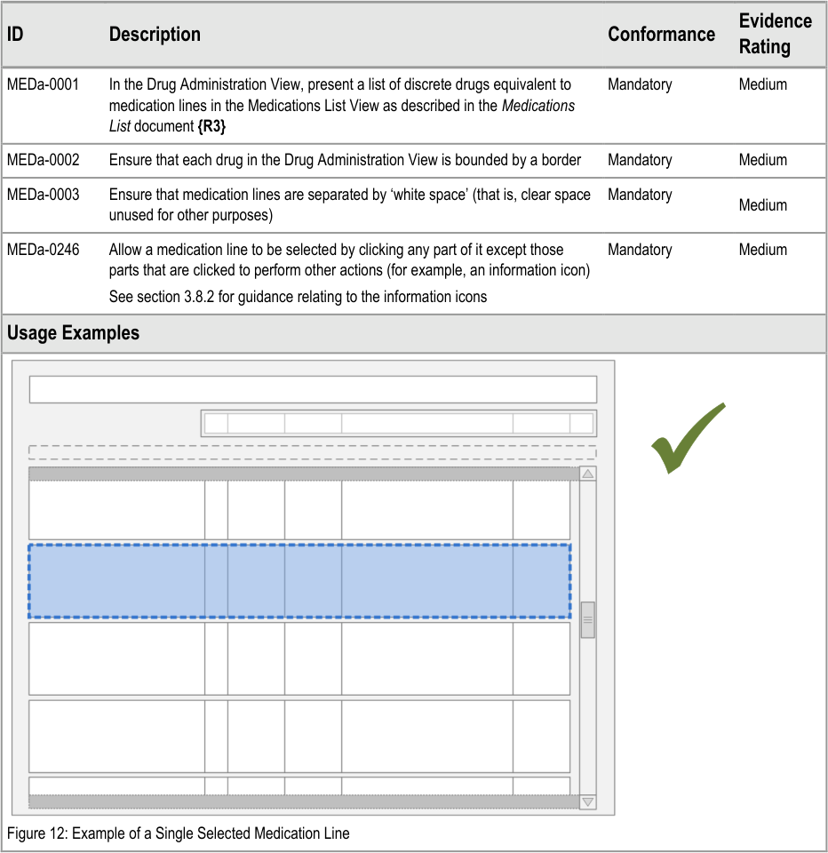

Page 22

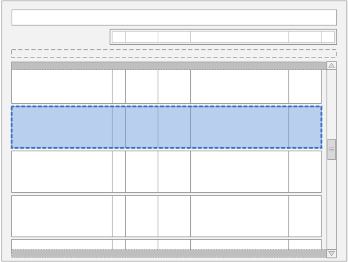

Copyright ©2013 Health and Social Care Information Centre

HSCIC Controlled Document

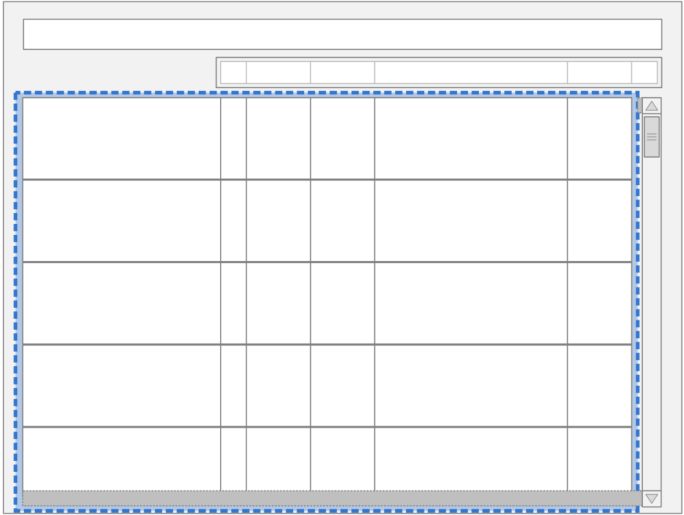

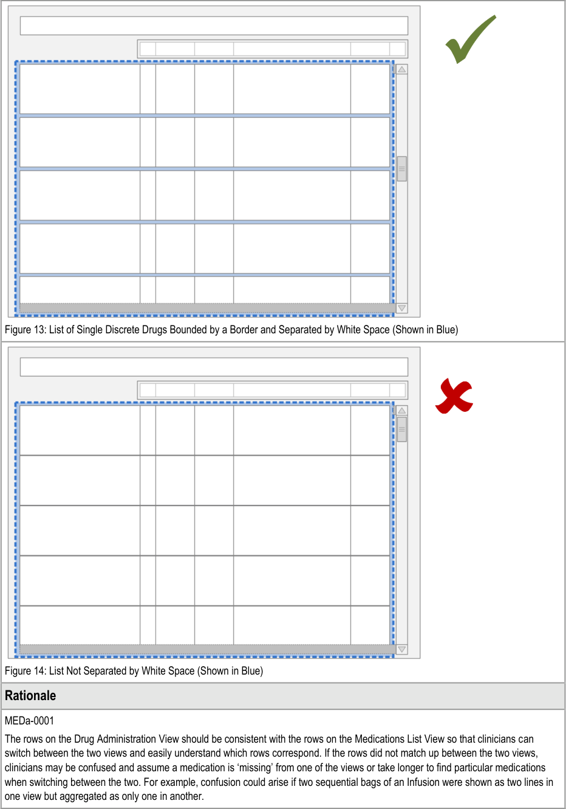

Page 23

Copyright ©2013 Health and Social Care Information Centre

HSCIC Controlled Document

MEDa-0002

Though it is not explicit guidance, the illustrations in this document and in _Medications List_ **{R3}** follow the secondary care convention of having each fixed dose prescription on a new line, rather than, for example, putting all prescriptions for the same medication on the same line. Variable dose prescriptions may follow different conventions.

Medication ‘lines’ in the Drug Administration View are collections of text, lines and symbols. Medication lines need to be clearly demarcated from each other in order to prevent misreading between the lines. For example, misassociating the left hand drug details with another line’s administration events. Alternative means of demarcating the lines (such as alternate row shading or keylines) would not on their own be sufficient to distinguish the medication line.

MEDa-0003

Medication lines are separated by ‘white space’ to provide a clear but uncluttered division between the lines to reduce the risk of misreading.

###### 3.3.2 Inclusion Criteria

The guidance points in this section relate to when a medication line is included in the available list in the Drug Administration View. Figure 15 displays an example of this list:

Figure 15: Inclusion Criteria Area

**Note**

In this document, ‘current’ medications refer to those that have been prescribed to a patient and have not yet been discontinued or completed. A medication can also be termed current with reference to a time in the past when the medication was current for the patient.

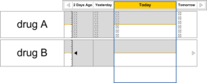

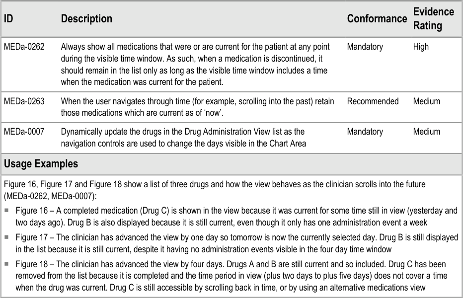

Page 24

Copyright ©2013 Health and Social Care Information Centre

HSCIC Controlled Document

Copyright ©2013 Health and Social Care Information Centre

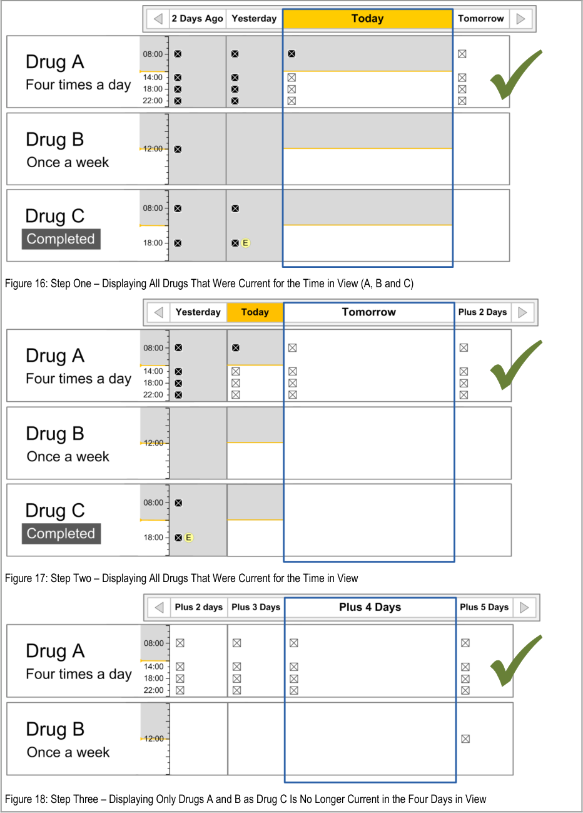

Page 25

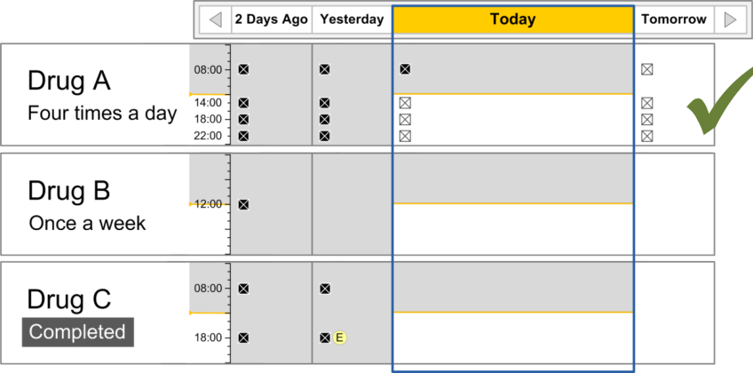

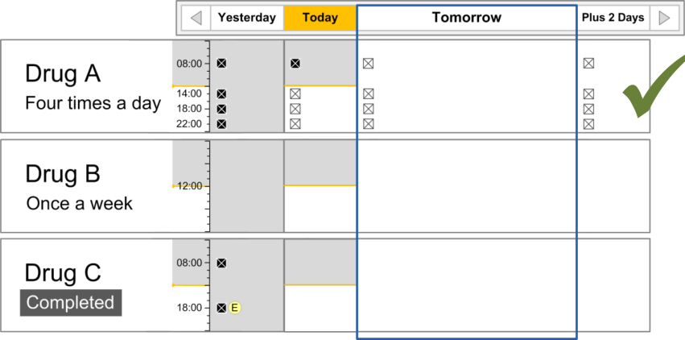

HSCIC Controlled Document

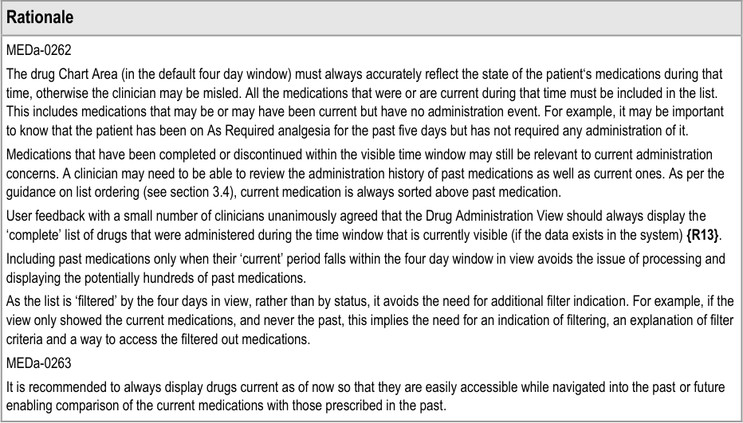

##### 3.4 List Order

The guidance points in this section relate to the hierarchical list order for the drug lines in the Drug Administration View. Figure 19 displays an example of this list using just the labels:

Figure 19: List Order

This section includes guidance that defines the rules for determining the list order for drugs in the Drug Administration View. This guidance assumes that the system will have access to information about when the drugs are scheduled to be administered and what is considered to be a safe threshold of time tolerance for how early or late a drug can be given before it is not considered to have been given on time.

**Note**

Time tolerances will be down to local governance and are not defined in this document.

The terms defined in Table 6 are used in this section and later in the document to refer to states of scheduled administrations:

Page 26

Copyright ©2013 Health and Social Care Information Centre

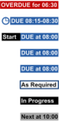
HSCIC Controlled Document

Empty Future The event is scheduled but is not Due, Overdue or Next

Next Next event to be Given The event is the Next chronological event for that drug that is not Due or Overdue

Due Ready to be Given The event is within the tolerances for the drug administration schedule (example time tolerances could be one hour before and after the scheduled administration time)

Overdue Should have been Given by now

Begun Drug administration underway

Depends on context

If administered while Next, the administration might be categorised as Given Early

If administered while Due, the administration might be categorised as Given

If administered while Overdue, the administration might be categorised as Given Late.

Depends on context

If administered As Required, the administration might be categorised as Given

Unscheduled As Required

A drug that is administered according to patient need

The event is later than the time constraints of the drug administration schedule

A Significant Duration drug such as an infusion (see section 3.13), for which a start date and time have been recorded, is scheduled to still be running and has nothing recorded to indicate that it has stopped.

A drug that has not been given a regular schedule and therefore is only given on an ad-hoc basis based on clinical judgement and preset criteria. For more on As Required medication see section 3.9.1.

Table 6: Scheduled Administration Terms

In summary, the list-ordering rules place:

- Overdue drugs at the top of the list

- Drugs with scheduled administrations that are not yet Due lower in the list

- Drugs with only past administrations (and no further planned administrations) at the bottom

of the list

**Note**

The list order is based on the time of Next scheduled administration and not on any clinical decision support.

Page 27

Copyright ©2013 Health and Social Care Information Centre

HSCIC Controlled Document

Page 28

Copyright ©2013 Health and Social Care Information Centre

HSCIC Controlled Document

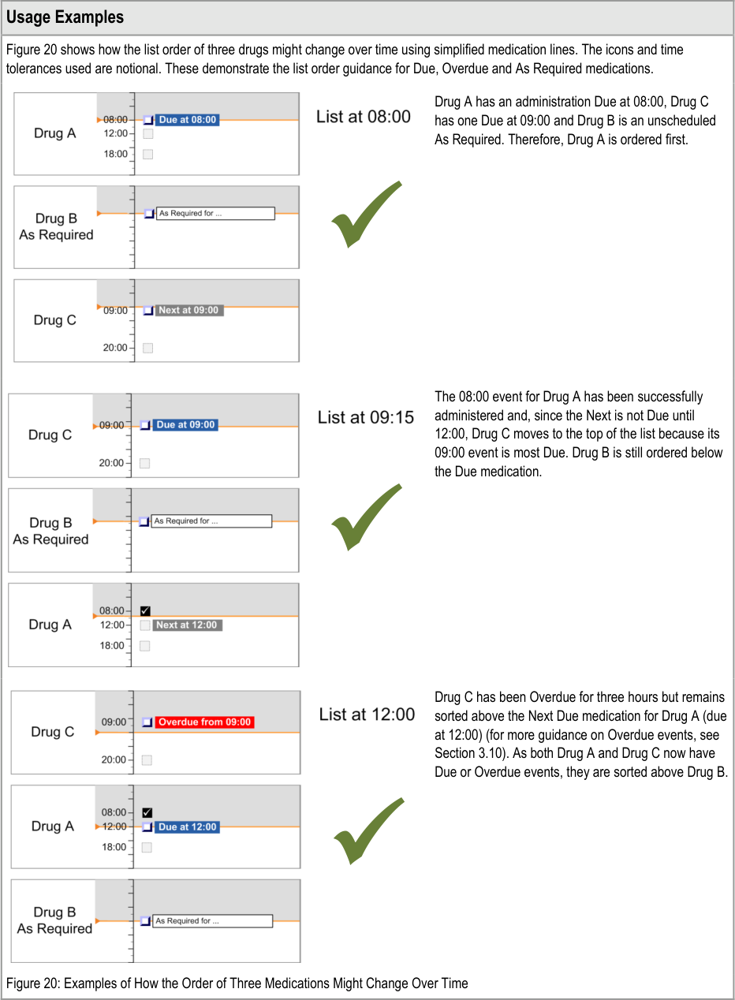

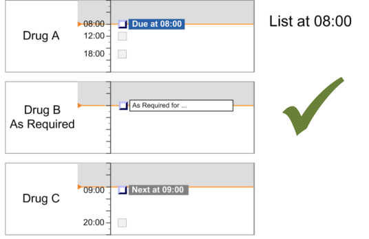

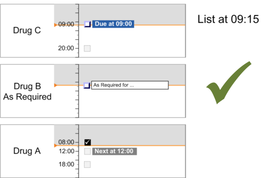

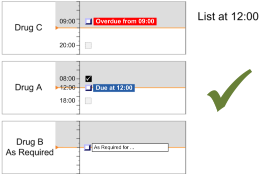

Copyright ©2013 Health and Social Care Information Centre

Page 29

HSCIC Controlled Document


Page 30

Copyright ©2013 Health and Social Care Information Centre

HSCIC Controlled Document

Given that reordering of drug lists is unfamiliar to the vast majority of current NHS staff, the feature was the subject of repeated clinician assessment. Three rounds of user feedback with small numbers of clinicians showed support for a dynamic ordering by ‘dueness’ as the most appropriate order for supporting the task of drug administration, as opposed to a fixed sort order (for example, by start date) ( **{R13, R14},** see APPENDIX A and APPENDIX B). Those responses were based on the assumption that users would be able to access a ‘fixed’ sort order (for example, by start date) if required. Staff who use the administration schedule and history for tasks other than drug administration (such as pharmacists) felt the ordering by dueness was less appropriate (see APPENDIX A) **.** Though positive about the concept of dynamic ordering, clinicians were generally concerned that it would require training to explain its use.

Another approach to bringing Due and Overdue medications to the clinician’s attention would have been to filter the list (or provide access to a filtered list) of only those medications which are Due or Overdue. However, this approach was felt to reduce the clinician’s awareness of the patient’s other medications. In addition, reordering can provide a more fine-grained distinction between medication priorities than pure filtering (for example, by ordering Overdue above Due and more Due above less Due).

Though not specified in guidance, use of reordering would allow additional rules to support local administration conventions. For example, some wards may have a convention to administer intravenous (IV) medications after non-IV medications if both are scheduled for the same drug round time. In this case, an additional setting (which has not been hazard assessed) might be that for medications Due at the same time, non-IV should be ordered above IV.

MEDa-0032

The list reordering should not be totally dynamic. It should only reorder when:

 It is manually refreshed

 The view is re-opened

 A medication is added or updated (by anyone)

This is so users retain control and can see feedback from the actions they perform that trigger a change in order. For example, when a clinician records a Due administration as Given, a totally dynamic reordering would immediately move the medication further down the list. The medication would seem to ‘disappear’ from view and another medication ‘appear’ in its place. This potential confusion is removed by not allowing automatic reordering while the list is open.

MEDa-0264

The label of ‘Begun’ is only recommended as it was only suggested late in the guidance development process and has not been evaluated or formally risk assessed. The challenges for this label are that it has to be unambiguous such that:

 It is associated only with Significant Duration drugs (‘Start’ is used as a label associated with all medications courses)

 It only conveys that the medication has been started and not that it is running to plan (the system does not know this at this point)

 It is not confused with the ‘To Start At’ indicator for Significant Duration medications

##### 3.5 Drug Administration View Controls

###### 3.5.1 Controls in the Drug Administration View

The guidance points in this section relate to the main controls for the Drug Administration View. Figure 22 highlights the area in which they are located:

Figure 22: Main Controls

Guidance for the controls for navigating between different views of drugs and for manipulating the Drug Administration View is defined in the _Medications List_ document **{R3}** . The guidance in this section is for the controls associated specifically with the Drug Administration View.

Page 31

Copyright ©2013 Health and Social Care Information Centre


HSCIC Controlled Document


Page 32

Copyright ©2013 Health and Social Care Information Centre

HSCIC Controlled Document

MEDa-0248

Filtering of the view introduces the risk that a clinician may miss a medication or administration event when looking at the chart and, as a result, he or she may potentially not perform or delay an administration. This guidance assumes that longer, scrollable lists are less likely to cause the clinician to overlook items. This principle is similar to that used in the _Medications List_ document **{R3}** .

User controlled filtering of the view is also not permitted as:

 The list is already filtered to those medications current within the four days in view

 It would be difficult to clearly communicate further filtering

 The view is already visually rich and further filtering controls and indications might overwhelm a user

###### 3.5.2 Grouping

The guidance points in this section relate to the Grouping Control for the Drug Administration View. Figure 25 highlights the area in which it is located:

Figure 25: Grouping Control

The Grouping Control is a standard control that is also used in the Medications List View and may be used in other drug views. Generic guidance for this control, including examples of grouping that may be applied, is defined in the _Medications List_ document **{R3}** .


Page 33

Copyright ©2013 Health and Social Care Information Centre

HSCIC Controlled Document


Page 34

Copyright ©2013 Health and Social Care Information Centre

HSCIC Controlled Document

MEDa-0218

As described in the section 3.4 rationale, the reordering of drug lists was the subject of repeated clinician assessment as it is unfamiliar to the vast majority of current NHS staff. User responses showed support for a dynamic ordering by ‘dueness’. However, those responses were based on the assumption that users would be able to access a ‘fixed’ order (for example, by start date) if required, as this was more familiar ( **{R13, R14},** see APPENDIX A and APPENDIX B). _Medications List_ **{R3}** defaults to a static sort order by start date and time.

MEDa-0219

Of the 20 or so paper drug charts from different trusts analysed, the majority had a core set of groups:

 Once Only

 As Required

 Regular

 Infusions

But, many had further subdivisions including variable medications, oral anticoagulants, syringe drivers, IV regulars and so on. That is, there is no current, universal convention for the exact groups to use but a fairly standard minimum set does exist. Furthermore, observations of chart usage showed that the ‘Infusions’ group was used differently by different clinicians.

###### 3.5.3 Status Bar

The guidance points in this section relate to the Status Bar control for the Drug Administration View. Figure 28 highlights the area in which it is located:

Figure 28: Status Bar Control

The Status Bar serves two main functions:

1. It highlights drugs with important states, such as those that have administrations that are

Overdue

2. It provides controls that allow drugs in the list to be reordered according to a predefined set

of rules that are designed to bring drugs that need attention to the top of the list


Page 35

Copyright ©2013 Health and Social Care Information Centre

HSCIC Controlled Document


Page 36

Copyright ©2013 Health and Social Care Information Centre

HSCIC Controlled Document


##### 3.6 Navigation

The guidance points in this section relate to the day navigation controls for the Drug Administration View. Figure 31 highlights the area in which they are located:

Figure 31: Day Navigation Controls

Navigation involves using the controls to move the Chart Area backwards or forwards one day or using the calendar control to move a specific date into view.

Page 37

Copyright ©2013 Health and Social Care Information Centre

HSCIC Controlled Document

In this section, ‘navigation’ refers to navigating the chart by changing the time interval being displayed in the Chart Area so that administration events further in the past or future can be reviewed.

Navigation controls that step through the chart day-by-day are provided at either side of the column headings for the Chart Area and the calendar control is displayed within the column heading for the currently-selected day.


Page 38


Copyright ©2013 Health and Social Care Information Centre

HSCIC Controlled Document


Copyright ©2013 Health and Social Care Information Centre

Page 39


HSCIC Controlled Document


##### 3.7 The Look-Ahead Scroll Bar

The guidance points in this section relate to the Look-Ahead Scroll Bar (LASB) control for the Drug Administration View. Figure 36 highlights the area in which it is located:

Figure 36: Look-Ahead Scroll Bar Area

The LASB is a modification from a standard scroll bar control that is designed to enhance visibility of the presence of list items that are out of view. Generic guidance for the Look-Ahead Scroll Bar is defined in the _Medications List_ document **{R3}** . This section defines additional guidance specifically for enhancements to the Look-Ahead Scroll Bar when it is used in the Drug Administration View.

The guidance in this section relates specifically to the display of Overdue and Due drugs in the look-ahead notification areas.


Page 40

Copyright ©2013 Health and Social Care Information Centre

HSCIC Controlled Document

|Col1|Usage Examples|
|---|---|
||The shaded area in Figure 37 shows the location of the two look-ahead notifications (in addition to the standard scroll bar):   Figure 37: Drug Administration View Areas – Look-Ahead Scroll Bar |
||Figure 38 to Figure 40 illustrates a Look-Ahead Scroll Bar with drugs in the look-ahead notifications at the top and bottom of a short list of drugs (twelve in this case):   Figure 38: Example LASB with the Top of a List of Twelve Medication Lines   Figure 39: Example LASB with the Middle of a List of Twelve Medication Lines   |

Page 41

Copyright ©2013 Health and Social Care Information Centre


HSCIC Controlled Document

Page 42

Copyright ©2013 Health and Social Care Information Centre


HSCIC Controlled Document


##### 3.8 Left-Hand Panel

The Left-Hand Panel (LHP) is a static area that contains a text description of the drug represented on that line, as well as controls which indicate the presence of further information and allow this further information to be displayed. The following sections describe the contents of the Left-Hand Panel and guidance for accessing and displaying further information.

###### 3.8.1 LHP Structure and Contents

The guidance points in this section relate to the whole of the Left-Hand Panel and its associated contents for the medication lines in the Drug Administration View. Figure 44 highlights the area in which it is located:

Figure 44: Left-Hand Panel

Page 43

Copyright ©2013 Health and Social Care Information Centre

HSCIC Controlled Document

The Left-Hand Panel contains a text description of the drug; this is similar to the information in the Drug Details column of the Medications List View, as defined in the _Medications List_ document **{R3}** . It contains a further set of attributes which are relevant to users of the Drug Administration View. Some of these attributes are displayed as text and some are represented by icons.


Page 44

Copyright ©2013 Health and Social Care Information Centre

HSCIC Controlled Document


Copyright ©2013 Health and Social Care Information Centre

Page 45


HSCIC Controlled Document


Page 46

Copyright ©2013 Health and Social Care Information Centre

HSCIC Controlled Document

NMC guidance on medications management **{R12}** requires that the registrant must make certain checks before administering a medicinal product:

 The prescription (or other direction to administer) is signed and dated by the authorised prescriber

 That they can contact the prescriber

It is arguable that a continually visible prescriber name is not necessary as medication cannot get onto the Drug Administration View unless it has been prescribed by an authorised prescriber. Additionally, accessing the prescriber’s name could perhaps be by a link or button rather than a continually visible name. However, it was felt that there is a strong expectation to see the prescriber name due to many years of experience with the paper charts, and that continual display of the prescriber name provides a reassuring familiarity.

MEDa-0044, MEDa-0045

Display of the start, end and/or review dates allows the clinician to see the duration of the course immediately. The clinician does not have to navigate by time through the view to find the dates and then calculate the duration manually. Displaying the dates helps support the NMC requirement for the registrant to check the start and end dates before administration. Display of the start date is common to many examples of existing paper charts (some also display the stop date).

MEDa-0222, MEDa-0223

User feedback (see APPENDIX B) concluded that it was important to clearly indicate both whether a medication was past and, if so, whether it was completed or discontinued.

###### 3.8.2 LHP Icons

The guidance points in this section relate to the icons presented in the Left-Hand Panel of the drug lines in the Drug Administration View. Figure 50 highlights the area in which these might be located:

Figure 50: LHP Information Icon Area

Icons are used in two different ways in the Information Panel:

1. As additions to text labels (label icons)

2. To signify the presence (or absence) of certain types of information (status icons)

The icons that are used to signify the presence of information (status icons) are also controls used to open the Information Panel in which that information is displayed.


Page 47

Copyright ©2013 Health and Social Care Information Centre

HSCIC Controlled Document


Page 48

Copyright ©2013 Health and Social Care Information Centre

HSCIC Controlled Document

MEDa-0050

Consistent placement of a notification near to the main drug details helps remind the clinician this information may need to be checked.

MEDa-0059

Icons for start date, end or review dates are used in the Chart Area. Using them as additional labels in the LHP helps provide familiarity with the icons and reinforces their meaning. The prescriber icon provides access to more details about the prescriber.

MEDa-0266, MEDa-0267, MEDa-0229

Widespread current practice is for pharmacists to mark verified prescriptions on the paper drug chart, often using notation such as a green tick. User feedback from nurses reported that seeing a medication has been verified provided extra confidence that the medication was correct, even though administration of most medications is allowed before pharmacy verification (see APPENDIX A) **.**

User feedback from a wider variety of clinicians highlighted that it would be beneficial to know at a glance if the prescription has been checked (see APPENDIX A and APPENDIX B) **.**

The guidance to mark verified medications (as opposed to marking unverified medications) follows this existing practice in order to increase the familiarity of the view. User feedback supports marking verified medications (see APPENDIX B) **.**

MEDa-0268

A ‘disabled’ pharmacist verification icon might be incorrectly interpreted as meaning ‘not verified’. In fact, it is intended to mean ‘the system does not know if the medication has been verified’. In a worst case scenario, a ‘disabled’ verification icon might be misinterpreted as meaning that the medication has been checked. This might arise because the use of three states (verified, not verified and disabled) reduces the clarity between the verified and not verified states.

Presenting no icon also reduces clutter in the view.

MEDa-0298

From anecdotal evidence, many pharmacists use green ink when marking on paper drug charts.

###### 3.8.3 LHP Information Panel

The guidance points in this section relate to the Information Panel attached to the Left-Hand Panel of the medication lines in the Drug Administration View. Figure 54 highlights the area in which it is located:

Figure 54: LHP Information Panel Area

When an information icon is selected to access more information, the information is displayed within an area referred to as the Information Panel.


Page 49

Copyright ©2013 Health and Social Care Information Centre

HSCIC Controlled Document


Page 50

Copyright ©2013 Health and Social Care Information Centre

HSCIC Controlled Document

##### 3.9 Chart Area

The Chart Area is the time window for the Drug Administration View in which icons representing administration events are plotted for each drug and supplemented with descriptive text where appropriate.

This section contains guidance on the presentation of information within the Chart Area.

###### 3.9.1 Chart Area Structure and Layout

The guidance points in this section relate to the Chart Area for the administration event icons and details in the Drug Administration View. Figure 56 highlights the area in which it is located:

Figure 56: Chart Area

Administration events for each individual drug are plotted against both a vertical and a horizontal time scale as on the traditional TGP drug chart for recording prescriptions. The vertical time scale on the right of the Left-Hand Panel represents times of day such that time progresses from top to bottom. Columns in the horizontal time scale represent days and events that are plotted such that time progresses from left to right.

In order to interpret some of the guidance points below, it is necessary to clarify different types of ‘As Required’ prescription that might be supported by a system. The following three types have been provided by the NHS CFH ePrescribing team:

1. Unscheduled As Required

The medication can be given whenever necessary as long as it does not contravene its minimum interval or maximum frequency rules

2. Unscheduled As Required with Indicative Frequency

The same as type 1 but the medication has a suggested frequency to guide those administering it as to how often it should be administered (such as ‘morphine one to four times hourly As Required’). The suggested frequency is only present as an instruction and is not plotted as one or more planned events

3. Scheduled As Required

The medication is scheduled to specific times (as for Regular medications), but at each scheduled administration time those administering it should consider whether the medication should be given or not. These medications would be plotted as for other scheduled medications and so follow the appropriate guidance on list ordering and event positioning

Page 51

Copyright ©2013 Health and Social Care Information Centre


HSCIC Controlled Document


Page 52

Copyright ©2013 Health and Social Care Information Centre

HSCIC Controlled Document


Page 53

Copyright ©2013 Health and Social Care Information Centre


HSCIC Controlled Document

Page 54

Copyright ©2013 Health and Social Care Information Centre


HSCIC Controlled Document


Page 55

Copyright ©2013 Health and Social Care Information Centre

HSCIC Controlled Document

MEDa-0067, MEDa-0068

Four rounds of user feedback with small numbers of clinicians showed strong support for the TGP drug chart style of displaying administration events on two time axes (hours and days). This was due to its familiarity for acute care clinicians **{R13, R14, R15, R16}** . Laying the chart out in a similar way to current paper charts is likely to reduce the training load on staff as drug administration moves from paper to electronic.

It is envisaged that other views (such as a Timeline View **{R5}** ) can provide the ability to view administration events on a single horizontal timescale, which allows graphing of other data (such as patient observations) against the administration events.

MEDa-0269, MEDa-0232

Icons need to clearly represent the time they are plotted against. Therefore, they have to have a consistent match between the icon’s outline shape and the time it is associated with. If an icon is to be plotted with its ‘centre’ aligning with a time, then the icon’s outline shape must not mislead clinicians as to which time it relates to. For this reason, the icon should be symmetrical about a horizontal axis.

MEDa-0270

Plotting scheduled events against their intended time follows current practice and gives an accurate visual representation of when events are Due and how far apart they are.

MEDa-0271

Unscheduled As Required drugs do not have an intended time of administration and so cannot be plotted at specific times. Plotting an event tied to the current time allows an unscheduled As Required drug to be administered whenever it is appropriate. Plotting the event in this way also helps to remind those administering it that the drug can be given. See section 3.11 for more guidance on As Required administrations.

MEDa-0272

Administration events that have a ‘recorded’ status have three times associated with them:

 The intended time of administration

 The recorded time of administration

 The time of recording

The clinician is most likely to be interested in the intended time and the recorded administration time, and potentially the size of the difference between these. It is especially important to highlight a significant difference between the intended time and recorded time as this may indicate delayed treatment and put administration events closer together then intended by the prescriber. Figure 62 and Figure 63 showed that positioning the events at either time still allows the other time to be communicated (or at least inferred) but with reduced emphasis. There are risks with either approach:

 The risk with plotting the events at the recorded time (Figure 62) is that if the event has been administered late or early, the

intended time is less clear, and once again how late or how early is not immediately apparent

 The risk with plotting the events at the intended time (Figure 63) is that if the event has been administered late or early, how late or

how early is not made apparent by the position

Another option would be to display both times as two linked events, but this raises the potential for confusion and creates a more cluttered view.

Anecdotal reports suggest that the current practice on paper charts is to ‘re-plot’ significantly late events in a time closer to the recorded rather than the intended time of administration. However the decision to ‘re-plot’ is at the documenter’s discretion.

Implementers of this guidance should consider these risks with the different approaches to plotting administration events and their possible mitigations.

MEDa-0273

As unscheduled As Required medications do not have an intended time of administration, plotting them at their recorded time of administration gives the most accurate record of the administrations. This follows current practice of documenting the time of administration for As Required medication.

Page 56

Copyright ©2013 Health and Social Care Information Centre

HSCIC Controlled Document

###### 3.9.2 Time Scale

The guidance points in this section relate to the time scale area of the drug lines in the Drug Administration View. Figure 66 highlights the area in which it is located:

Figure 66: Time Scale Area


Page 57

Copyright ©2013 Health and Social Care Information Centre

HSCIC Controlled Document


Copyright ©2013 Health and Social Care Information Centre

Page 58


HSCIC Controlled Document

Page 59

Copyright ©2013 Health and Social Care Information Centre


HSCIC Controlled Document


Page 60

Copyright ©2013 Health and Social Care Information Centre

HSCIC Controlled Document

###### 3.9.3 Indicating Past and Future

The guidance points in this section relate to the indication of past and future time in the Chart Area of the Drug Administration View. Figure 74 highlights the default example areas in which they are located:

Figure 74: Example Areas for Indicating Past and Future


|Col1|Evidence ID Description Conformance Rating|
|---|---|
||MEDa-0277 Use shading of the Chart Area to differentiate past and future time. Try to ensure the shading used is consistent with other displays of past and future, such as in a Timeline View**{R5}**.  Mandatory Medium|
||MEDa-0078 Differentiate between scheduled events that have had an administration status recorded and those that have not by the form of the symbols used Mandatory Medium|
||**Usage Examples**|
||Figure 75 illustrates how the past and future could be indicated using shading (MEDa-0277):         Figure 75: Different Shading Used to Represent Past and Future Time   Filled Area: Past Line: Now Unfilled Area: Future Filled Area: Past|
||Figure 76 and Figure 77 illustrate how different times can be displayed in the Chart Area:   Figure 76: How Different Times Can Be Displayed In a Medication Line (Navigating Back Two Days) |

Copyright ©2013 Health and Social Care Information Centre

Page 61


HSCIC Controlled Document


###### 3.9.4 Indicating Today

The guidance points in this section relate to the display of the current day in the Chart Area of the Drug Administration View. Figure 78 highlights the area in which it is located:

Figure 78: Current Day Area


Page 62

Copyright ©2013 Health and Social Care Information Centre

HSCIC Controlled Document


Page 63

Copyright ©2013 Health and Social Care Information Centre

HSCIC Controlled Document

###### 3.9.5 Indicating the Currently-Selected Day

The guidance points in this section relate to the display of the currently selected day in the Chart Area of the Drug Administration View. Figure 81 highlights the area in which it is located:

Figure 81: Currently-Selected Day Area


Copyright ©2013 Health and Social Care Information Centre

Page 64

HSCIC Controlled Document

###### 3.9.6 Information Display

The guidance points in this section relate to the display of administration event information in the Chart Area of the Drug Administration View. Figure 83 highlights an example area in which it is located:

Figure 83: Example Information Display Area

The guidance models administration events so that they are represented by different types of icons:

- Scheduled events that are not yet Due are represented by a simple generic icon. Although

not explicitly represented as such, these icons are clickable to enable early administration where necessary

- Administration events that are Overdue or Due are represented by ‘clickable' icons since an

administration is expected to be recorded for them

- Administration events for which an event has been recorded are represented by an icon

that indicates the status (such as Given or Patient Refused). The status is recorded using the administration recording form


Page 65

Copyright ©2013 Health and Social Care Information Centre

HSCIC Controlled Document


Copyright ©2013 Health and Social Care Information Centre

Page 66

HSCIC Controlled Document


###### 3.9.7 Information Display for the Currently-Selected Day

The guidance points in this section relate to the display of administration event information in the currently selected day in the Chart Area of the Drug Administration View. Figure 87 highlights the area in which it is located:

Figure 87: Area Displaying Information for the Currently-Selected Day

Page 67

Copyright ©2013 Health and Social Care Information Centre

HSCIC Controlled Document


Copyright ©2013 Health and Social Care Information Centre

Page 68

HSCIC Controlled Document


Page 69

Copyright ©2013 Health and Social Care Information Centre

HSCIC Controlled Document

###### 3.9.8 Chart Area Access to More Details

The guidance points in this section relate to the display of further details of administration events in the Chart Area of the Drug Administration View. Figure 91 highlights an example of an area in which this is located:

Figure 91: Example Area for Display of Further Details

This section relates specifically to the mechanism of obtaining additional information about administration events that have had administrations recorded. Details on the mechanism for recording an administration are provided in section 3.16.

Additional information for an already recorded administration could be details about that administration or it could be that the user wishes to undertake an additional action for the administration (for example, add notes to the recorded administration).


Page 70

Copyright ©2013 Health and Social Care Information Centre


HSCIC Controlled Document

|otional.|Col2|Col3|Col4|Col5|Col6|
|---|---|---|---|---|---|
||||n as Planned nge  a note|||
|||||||
|||||||
|||||||


###### 3.9.9 Symbols and Icons

The guidance points in this section relate to the display of symbols and icons in the administration events in the Chart Area of the Drug Administration View. Figure 94 highlights an example of where these may be located:

Figure 94: Example Locations for Symbols and Icons

**Note**

MEDa-0066 should also be considered when reading the guidance points below.


Page 71

Copyright ©2013 Health and Social Care Information Centre

HSCIC Controlled Document


Page 72

Copyright ©2013 Health and Social Care Information Centre

HSCIC Controlled Document


##### 3.10 Overdue Drugs

This section refers to administration events that have become Overdue and what should happen after a medication has been Overdue for some time with no administration status recorded against it.

###### 3.10.1 Overdue Drugs

The guidance points in this section relate to the display of Overdue administration events in the Chart Area of the Drug Administration View. Figure 97 highlights an example of where these could be located:

Figure 97: Example Overdue Drug Display Areas


Page 73

Copyright ©2013 Health and Social Care Information Centre

HSCIC Controlled Document


###### 3.10.2 Past Overdue

The guidance points in this section relate to the behaviour of administration events after they have been Overdue for some time. Figure 99 highlights an example of where these could be located:

Figure 99: Example Past Overdue Areas

There are conditions which determine when an event’s status changes from ‘Next’ to Due and from Due to ‘Overdue’. The conditions are most likely to be time tolerances (as described in section 3.4). For example, an event might become Due 15 minutes before its scheduled time and become ‘Overdue’ 1 hour after its scheduled time. Similarly, a system developer might consider including an additional condition which causes an ‘Overdue’ event to automatically change at some point. This does not mean that such a condition is supported by this guidance.


Page 74

Copyright ©2013 Health and Social Care Information Centre

HSCIC Controlled Document


Page 75

Copyright ©2013 Health and Social Care Information Centre


HSCIC Controlled Document


##### 3.11 Displaying As Required Administration Events

The guidance points in this section relate to the display of As Required administration events in the Chart Area of the Drug Administration View. Figure 103 highlights an example of where these could be located:

Figure 103: Example As Required Display Area

The three types of As Required medication are defined in section 3.9.1.

Page 76

Copyright ©2013 Health and Social Care Information Centre


HSCIC Controlled Document


Copyright ©2013 Health and Social Care Information Centre

Page 77


HSCIC Controlled Document


##### 3.12 Displaying Once Only Administration Events

The guidance points in this section relate to the display of Once Only administration events in the Chart Area of the Drug Administration View. Figure 106 highlights an example where this could be located:

Figure 106: Example Once Only Display Area


Page 78

Copyright ©2013 Health and Social Care Information Centre

HSCIC Controlled Document


##### 3.13 Administrations of Significant Duration

###### 3.13.1 Displaying Significant Duration Drugs

The guidance points in this section relate to the display of Significant Duration drugs in the Chart Area of the Drug Administration View. Figure 109 highlights an example of where the display would appear in the Chart Area:

Figure 109: Example Significant Duration Drugs Display Area

The design for ‘Significant Duration’ drugs is intended to be used for those drugs where it is useful to record and subsequently view duration and other attributes such as rate. Gases and Infusions are examples of Significant Duration drugs. The guidance does not imply that all drugs that have an ‘important’ administration duration (such as aminophylline injections over 5 minutes) must be displayed according to the Significant Duration design. The decision about which medications to display using the Significant Duration guidelines will vary according to clinical context.

Page 79

Copyright ©2013 Health and Social Care Information Centre


HSCIC Controlled Document

The guidance relates to inpatient environments other than HDU, ITU and similar areas. The display of Significant Duration drugs in these more intensive areas is out of scope. Consideration of displays that are linked to machines such as Infusion pumps is also out of scope.

There are acknowledged risks associated with infusion bag changes that are not addressed by this guidance.


Page 80

Copyright ©2013 Health and Social Care Information Centre

HSCIC Controlled Document

Page 81

Copyright ©2013 Health and Social Care Information Centre


HSCIC Controlled Document


Page 82

Copyright ©2013 Health and Social Care Information Centre

HSCIC Controlled Document

User feedback indicated that significant time gaps in Significant Duration drug administration (such as interruptions or suspensions) should be indicated at the summary level **{R16}** .

###### 3.13.2 Status Box

The guidance points in this section relate to the display of the status box for Significant Duration drugs in the Chart Area of the Drug Administration View. Figure 113 highlights an example of where this could be located:

Figure 113: Example Status Box Display Area


Copyright ©2013 Health and Social Care Information Centre

Page 83


HSCIC Controlled Document


###### 3.13.3 Detailed View

The guidance points in this section relate to the display of further details for Significant Duration drugs. Figure 116 highlights an example of where this could be accessed from:

Figure 116: Example Further Details Display Area


Page 84

Copyright ©2013 Health and Social Care Information Centre

HSCIC Controlled Document


###### 3.13.4 Recording Significant Duration Drug Administrations

The guidance points in this section relate to the recording of administration events for Significant Duration drugs in the Chart Area of the Drug Administration View. Figure 117 highlights an example of where this could be located:

Figure 117: Example Significant Duration Drugs Recording Area

This guidance does not cover cases where an administration is incomplete (for example, where a drip has ‘tissued’ part of the way through the administration of an Infusion so that fluid has leaked into the tissue surrounding the cannula). Cases where an administration is incomplete are out of scope for this document.


Page 85

Copyright ©2013 Health and Social Care Information Centre

HSCIC Controlled Document

##### 3.14 When a Patient is Nil by Mouth

###### 3.14.1 Displaying Nil by Mouth Status

The guidance points in this section relate to the display of the Nil by Mouth status in the Drug Administration View. Figure 118 highlights an example of where this could be located:

Figure 118: Example Nil by Mouth Display Area


Page 86


Copyright ©2013 Health and Social Care Information Centre

HSCIC Controlled Document


###### 3.14.2 Supporting Administrations While a Patient is Nil by Mouth

The guidance points in this section relate to recording administration events when the patient is Nil by Mouth. Figure 122 highlights an example of where this could be located:

Figure 122: Example Nil by Mouth Administration Recording Area

Page 87

Copyright ©2013 Health and Social Care Information Centre

HSCIC Controlled Document


Page 88

Copyright ©2013 Health and Social Care Information Centre

HSCIC Controlled Document

MEDa-0166

Taken with guidance point MEDa-0165, this means that when a patient is Nil by Mouth the clinician has to take three steps for every administration event for oral medication:

1. Open the administration recording form for that event

2. Select the option to not give the medication due to Nil by Mouth

3. Confirm the administration (for example, through a ‘Record Administration’ button)

This may seem like a lot of steps to ‘accept’ a Nil by Mouth; however it is the same number of steps that would be made for recording any administration as Not Given. The system cannot accept the administration after the second selection as the clinician may want to add other information in options present on the administration form.

##### 3.15 Complex Drugs

###### 3.15.1 Variable Dose Drugs

The guidance points in this section relate to the display of administration events for drugs where the prescriber has specified that the dose will vary. Figure 124 highlights an example of where this could be located:

Figure 124: Example Variable Dose Drugs Display Area

There are a number of ways that a dose may vary. Table 7 describes the ways a dose may vary and indicates whether each type is addressed in this guidance:

Conditional Dose Dosage likely to vary per administration or per day based on criteria such as drug levels

Dose Range Dosage range specified by the prescriber within which those administering it can choose a dose depending on patient need

Constant Dose–Pattern Dosage variations repeating either within or between days based on a schedule defined by the prescriber

Varying Dose–Pattern Dosage schedule defined by the prescriber that does not fall into a repeating pattern

Loading Dose An initial higher dosage at the start of a course that reduces to a regular, consistent dose

Adjusted Dose Dosage changed by a prescriber after the initial prescription where this change was not specified by the original prescriber. (This is not counted as a variable dose by this guidance).

Table 7: Ways a Dose May Vary

warfarin, insulin, gentamicin

As Required analgesia

furosemide morning and evening

prednisolone tapering dose

Yes

Yes

Yes

Yes

amiodarone No

enalapril 2.5 mg changed to enalapril 5 mg

No

The guidance in this section covers drugs whose dose has been prescribed to vary. The guidance does not apply to adjusted doses as these are cases where the dose varies after the initial prescription.

In current practice, some of the variable drug types in Table 7 are commonly prescribed on ‘one line’. For example, it is common to find special lines on paper charts that allow for differing oral

Page 89

Copyright ©2013 Health and Social Care Information Centre

HSCIC Controlled Document

anticoagulant doses every day. On some paper charts, variable drug types such as constant dose patterns (for example morning and evening furosemide doses) may be written as two separate prescriptions (on two lines). Other paper charts allow for varying doses within a day so can be written up as one prescription on one line.

The guidance does not require that variable dose drugs are displayed as a single prescription on a single line but does offer direction on how this display should work if the application does display medication in this way. For example, the two representations of furosemide in Figure 125 and Figure 126 both have guidance compliant Chart Areas: Figure 125 displays the furosemide as one prescription on one line, whereas Figure 126 displays the two doses as separate prescriptions on separate lines:

Figure 125: Two Dose Prescription Displayed as a Single Medication Line

Figure 126: Two Dose Prescription Displayed as Two Medication Lines

If the application does display variable doses over multiple lines (as in Figure 126) then it is likely there will need to be some indication of linkage between these lines. This guidance document does not address the design of this linkage.

This guidance does not address loading doses as it has not been determined whether they should ever be displayed on single lines (that aggregate the loading and subsequent doses) or whether the guidance for variable doses would be appropriate for loading doses also.


Page 90

Copyright ©2013 Health and Social Care Information Centre

HSCIC Controlled Document

|Col1|MEDa-0291 For Dose Range drugs, display the actual dose administered next to the Mandatory Medium administration event icon for all events that have a status of Given or those that have been partially administered. Display the dose for all applicable days, not just the currently selected day|
|---|---|
||MEDa-0292 For drugs with a constant or varying dose-pattern, display the actual dose administered next to the administration event icon for all events that have a status of Given or those that have been partially administered. In that the dose should be displayed for all applicable days, not just the currently selected day Mandatory Medium|
||MEDa-0293 For drugs with a constant or varying dose pattern, display the intended dose against all scheduled administration events, whether in the currently selected day or not Mandatory Medium|
||**Usage Examples**|
||Figure 127 shows an example of a Conditional Dose drug. It shows the dose criteria for the Next administration (MEDa-0288) and the doses administered for the previous successful administrations (MEDa-0289):   Figure 127: Conditional Dose Drug|
||Figure 128 shows an example of a drug with a Dose Range. It shows the dose range and criteria for the dose in the Next administration event in the selected day (MEDa-0290)and the doses administered for previous successful administrations (MEDa-0291):   Figure 128: Drug With Dose Range|
||Figure 129 shows an example of a varying dose-pattern and Figure 130 shows an example of a drug with a constant dose-pattern. Both figures show the dose administered for all events with a successful administration recorded (MEDa-0292) and intended dose for all scheduled events (MEDa-0293):   Figure 129: Drug With Varying Dose Pattern   Figure 130: Constant Dose Pattern|
||**Rationale**|
||MEDa-0288—MEDa-0293 Across the guidance in this section, the principle has been applied that for some variable dose types it is useful to see a dosage trend and for some it is less useful. For example, it is useful to know at what stage a patient is in a tapering dose regimen by being able to reference the Next dose with those around it. MEDa-0288 Displaying more detail per event is one advantage of having more space for the currently selected day. Display of the criteria for|

Page 91

Copyright ©2013 Health and Social Care Information Centre


HSCIC Controlled Document

###### 3.15.2 Preconditions

The guidance points in this section relate to the display of preconditions in the Chart Area of the Drug Administration View. Figure 131 highlights an example of where this could be located:

Figure 131: Example Preconditions Display Area

The display and interaction with administration preconditions is a complex area, which this guidance addresses only at a high level. Preconditions such as level checking are out of scope.


Page 92

Copyright ©2013 Health and Social Care Information Centre

HSCIC Controlled Document


###### 3.15.3 Time-Critical Administration Events

The guidance points in this section relate to the display of time-critical events in the Drug Administration View. Figure 133 highlights an example of where this could be located:

Figure 133: Example Time-Critical Event Display Area

Page 93

Copyright ©2013 Health and Social Care Information Centre

HSCIC Controlled Document


###### 3.15.4 Witnessed, Role-Specific and Self-Administrations

The guidance points in this section relate to the display of witnessed, role-specific and self-administered drugs in the Drug Administration View. Figure 135 highlights an example of where this could be located:

Figure 135: Example Witnessed, Role-Specific and Self-Administered Display Area


Page 94

Copyright ©2013 Health and Social Care Information Centre

HSCIC Controlled Document


###### 3.15.5 Displaying Partially-Logged Administrations

There may be a requirement for a clinician to be able to record an administration, but not complete the minimum data required for a complete administration (for example, when under emergency conditions). This is referred to as a partially-logged administration.

This guidance does not cover partially-logged administrations.

**Important**

Implementers of systems that support such a function must carefully consider what constitutes a safe user interface for both the recording and subsequent display of partially-logged administrations.

Page 95

Copyright ©2013 Health and Social Care Information Centre

HSCIC Controlled Document

##### 3.16 Recording Administration Events

###### 3.16.1 Recording Administration Events

The guidance points in this section relate to the way administration events are recorded using a form in the Drug Administration View. Figure 137 highlights an example of this area:

Figure 137: Example Recording Administration Events Area


Page 96

|Col1|Col2|25-May-2007|26-May-2007|Today: 27-May-2007|Col6|28-May-2007|
|---|---|---|---|---|---|---|
|Medication 1|||||||
|Medication 1|||||Administra|ion|
|Medication 1|||||||
|Medication 1||||| Recording| Recording|
|Medication 2|||||||
|Medication 2|||||||
|Medication 2|||||||

Copyright ©2013 Health and Social Care Information Centre


HSCIC Controlled Document


|Col1|Col2|25-May-2007|26-May-2007|Today: 27-May-2007|Col6|Col7|28-May-2007|
|---|---|---|---|---|---|---|---|
|||||||||
|||||||||
|||||||Administrat|ion|
|||||||||

|Col1|Col2|Col3|Col4|Col5|Col6|Recording F|orm|
|---|---|---|---|---|---|---|---|
|||||||||
|||||||||
|||||||||
|||||||||


Page 97

Copyright ©2013 Health and Social Care Information Centre

HSCIC Controlled Document

###### 3.16.2 Structure of the Form

The guidance points in this section relate to how the recording form should be structured. Figure 140 highlights an example of where this could be located:

Figure 140: Example Recording Form Location


Page 98

Copyright ©2013 Health and Social Care Information Centre

HSCIC Controlled Document


Page 99

Copyright ©2013 Health and Social Care Information Centre

HSCIC Controlled Document

###### 3.16.3 Recording Administrations

The guidance points in this section relate to the display of the recording of drug administrations in the Drug Administration View. Figure 142 highlights an example of where this could be located:

Figure 142: Example Recording Administrations Location

This guidance does not cover cases where an administration is incomplete (for example, where a patient has vomited up part of the medication or a drip has tissued part of the way through the administration of an Infusion). Cases where an administration is incomplete are out of scope for this document.


Page 100

Copyright ©2013 Health and Social Care Information Centre

HSCIC Controlled Document


Page 101

Copyright ©2013 Health and Social Care Information Centre

HSCIC Controlled Document

MEDa-0207

Administration recording is speeded up by pre-filling values where it is safe to do so. Example values would include ones that are implicit on the paper drug charts, such as the time of administration.

MEDa-0239

As per MEDa-0190, administration can be logged against Future events but the administration must have occurred in the past and be recorded as such. For example, at 10:00 a clinician can record the 12:00 dose as Given as long as he or she records it as having been given before 10:00. That is, prospective administration recording is not supported.

##### 3.17 Medication Updates

In the event that a patient’s prescriptions are updated while the Drug Administration View is open, these updates must be immediately reflected in the view. Updates would include new prescriptions, discontinued prescriptions and edited prescriptions.


Page 102

Copyright ©2013 Health and Social Care Information Centre

HSCIC Controlled Document

MEDa-0295, MEDa-0296

However, if the view dynamically updates without a clear indication of the change, clinicians may not appreciate its exact nature resulting in confusion or mis-administration. For example, if a clinician is preparing to administer a medication displayed at the top of the screen, he or she may read the name of the medication, look away to get the medication out of the relevant drawer and then look back at the view to check the dosage. If the top item has meanwhile been replaced by another medication (without a clear indication that this has changed), there is a danger that the clinician may not notice the name change and reads the dosage of the new item as the dosage to give of the medication in their hands.

Freezing the view and providing a message to draw attention to the nature of the update helps mitigate the risk that the update is not noticed or understood. This guidance is rated as recommended as the method described and risks of doing this have not been fully explored. For example, it is possible that the view could dynamically update but very clearly mark what change has occurred. However, this behaviour would have to be very carefully specified in order to be safe and the required exploration was not in scope for this guidance.

MEDa-0297

The documentation should always reflect reality. Therefore, if a medication is changed between a clinician reading the instruction to administer and the documentation of this administration, the administration must still be recorded as it happened. It is reasonable to clarify to clinicians how they should proceed as this kind of change will be unfamiliar to users of paper drug charts, especially since the administration may be seen as an error.

Page 103

Copyright ©2013 Health and Social Care Information Centre

HSCIC Controlled Document

#### 4 DOCUMENT INFORMATION

##### 4.1 Terms and Abbreviations

ACBS Advisory Committee on Borderline Substances

CUI Common User Interface

INR International Normalized Ratio

IUD Intrauterine Device

LASB Look-Ahead Scroll Bar

LHP Left-Hand Panel

HDU High-Dependency Unit

MRI Magnetic Resonance Imaging

NHS National Health Service

NHS CFH NHS Connecting for Health

NMC Nursing and Midwifery Council

NPfIT National Programme for Information Technology

OTC Over the Counter

PGD Patient Group Direction

POD Patient’s Own Drugs

PRN Pro Re Nata (‘As Required’)

PSD Patient Specific Direction

TGP Typical Generic Paper

TPN Total Parental Nutrition

TTO To Take Out

Table 8: Terms and Abbreviations

##### 4.2 Definitions

As Required A drug that has not been given a regular schedule and therefore is only given on an ad-hoc basis based on clinical judgement and preset criteria.

Begun A Significant Duration drug, for which a start date and time have been recorded, is scheduled to still be running and has nothing recorded to indicate that it has stopped.

Conformance In the guidance tables, indicates the extent to which you should follow the guideline when defining your UI implementation. There are two levels:

 **Mandatory**          - An implementation should follow the guideline

 **Recommended**          - An implementation is advised to follow the guideline

Current best practice Current best practice is used rather than best practice, as over time best practice guidance may change or be revised due to changes to products, changes in technology, or simply the additional field deployment experience that comes over time.

Page 104

Copyright ©2013 Health and Social Care Information Centre

HSCIC Controlled Document

Current medication Current medications refer to those that have been prescribed to a patient and have not yet been discontinued or completed. A medication can also be termed current with reference to a time in the past when the medication was current for the patient

Due Within the time constraints that allow the administration to be recorded as given successfully (‘Given’).

Evidence Rating In the guidance tables, summarises the strength of the research defining the guideline and the extent to which it mitigates patient safety hazards. There are three ratings (with example factors used to determine the appropriate rating):

 **Low:**

 Does not mitigate specific patient safety hazards

 User research findings unclear and with few participants

 Unreferenced usability principles indicate the design is not significantly better than alternatives

 **Medium:**

 Mitigates specific patient safety hazards

 User research findings clear but with few participants

 References old authoritative guidance (for example, from National Patient Safety Agency (NPSA),

Institute for Safe Medication Practices (ISMP) or World Health Organization (WHO)) that is potentially soon to be superseded

 Referenced usability principles indicate the design is significantly better than alternatives

 **High:**

 Mitigates specific patient safety hazards

 User research findings clear and with a significant number of participants

 References recent authoritative guidance (for example, from NPSA, ISMP or WHO)

 Referenced usability principles indicate the design is significantly better than alternatives

NHS Entity Within this document, defined as a single NHS organisation or group that is operated within a single technical infrastructure environment by a defined group of IT administrators.

Overdue Outside the time constraints for recording an administration as ‘Given’ but still within time constraints for recording a late administration (‘Given Late’).

Past drugs Drugs that have been prescribed and subsequently have either been discontinued or completed at the time the list is being viewed

The Authority The organisation implementing the NHS National Programme for IT (currently NHS Connecting for Health).

White Space Area of user interface left clear and unused

Table 9: Definitions

##### 4.3 Nomenclature

This section shows how to interpret the different styles used in this document to denote various types of information.

###### 4.3.1 Body Text

Code `Monospace`

Script

Other markup languages

Page 105

Copyright ©2013 Health and Social Care Information Centre

HSCIC Controlled Document

Interface dialog names **Bold**

Field names

Controls

Folder names Title Case

File names

Table 10: Body Text Styles

###### 4.3.2 Cross References

Current document – sections Section number only

Current document – figures/tables Caption number only

Other project documents _Italics_ and possibly a footnote

Publicly available documents _Italics_ with a footnote

External Web-based content _Italics_ and a hyperlinked footnote

Table 11: Cross Reference Styles

##### 4.4 References

**R1.** Department of Health – Building a safer NHS for patients: Improving Medication Safety [http://www.dh.gov.uk/en/Publicationsandstatistics/Publications/PublicationsPolicyAndGuidance/DH_40](http://www.dh.gov.uk/en/Publicationsandstatistics/Publications/PublicationsPolicyAndGuidance/DH_4071443) [71443](http://www.dh.gov.uk/en/Publicationsandstatistics/Publications/PublicationsPolicyAndGuidance/DH_4071443)

**R2.** NHS CFH: ePrescribing System Evaluations: [http://nww.connectingforhealth.nhs.uk/eprescribing](http://nww.connectingforhealth.nhs.uk/eprescribing)

[Access requires an N3 connection. If you do not have an N3 connection, email eprescribing@nhs.net](mailto:eprescribing@nhs.net) for help.

**R3.** NHS CUI Programme – Medications Management – Medications List – User Interface Design Guidance

**R4.** NHS CUI Programme – Medications Management – Medication Line – User Interface Design Guidance

22-Jan-2004

November 2008

1.0.0.0

2.0.0.0

**R5.** NHS CUI Programme – Timeline View –User Interface Design Guidance 1.0.0.0

**R6.** NHS CUI Programme – Design Guide Entry – Time Display 4.0.0.0

**R7.** NHS CUI Programme – Design Guide Entry – Date Display 4.0.0.0

**R8.** NHS CUI Programme – Design Guide Entry – Date and Time Input 3.0.0.0

**R9.** NHS NPfIT – dm+d Implementation Guide (Secondary Care) [http://www.connectingforhealth.nhs.uk/systemsandservices/eprescribing/refdocs/index_html](http://www.connectingforhealth.nhs.uk/systemsandservices/eprescribing/refdocs/index_html)

**R10.** NHS CFH – ePrescribing Functional Specification for NHS Trusts [http://www.connectingforhealth.nhs.uk/systemsandservices/eprescribing/baselinefunctspec.pdf](http://www.connectingforhealth.nhs.uk/systemsandservices/eprescribing/baselinefunctspec.pdf)

**R11.** NHS – The Dictionary of Medicines and Devices [http://www.dmd.nhs.uk/](http://www.dmd.nhs.uk/)

Copyright ©2013 Health and Social Care Information Centre

May 2009

1.0

2.3

Page 106

HSCIC Controlled Document

**R12.** Nursing and Midwifery Council – Standards for medicines management [http://www.nmc-uk.org/aDisplayDocument.aspx?DocumentID=6228](http://www.nmc-uk.org/aDisplayDocument.aspx?DocumentID=6228)

2008

**R13.** NHS CUI Design Guide Medications Overview and Administration User Feedback 2007-08-20 20-Aug-2007

**R14.** NHS CUI Design Guide R4 Medications Overview and Admin User Feedback 2007-02-12 12-Feb-2007

**R15.** NHS CUI Design Guide R4 Medications Admin and Overview User Feedback 2007-01-18 18-Jan-2007

**R16.** NHS CUI Design Guide Medications Admin and Overview User Feedback 2006-11-13 13-Nov-2006

**R17.** Sanders, M. and McCormick, E., Human Factors In Engineering and Design Seventh Edition

Table 12: References

Page 107

Copyright ©2013 Health and Social Care Information Centre

HSCIC Controlled Document

#### APPENDIX A STUDY ID 8: EXECUTIVE SUMMARY

##### A.1 Abstract

The UK National Health Service (NHS) Common User Interface (CUI) programme is a partnership between Microsoft [®] and NHS Connecting for Health (NHS CFH), which is part the NHS National Programme for Information Technology (NPfIT).

As part of CUI, the Clinical Applications and Patient Safety (CAPS) project has the goal of ensuring that software applications used by the NHS enhance patient safety. To achieve this, CAPS provides software developers with user interface design guidelines derived through a user-centric development process that includes explicit patient-safety evaluations.

This summary describes key findings from user research carried out in June 2008 by the CUI CAPS team on Drug Administration. These findings are a subset of those in a larger internal report prepared for the CUI CAPS Drug Administration team.

**Purpose:**

To gain clinical feedback on design concepts for Drug Administration in electronic systems.

**Method:**

Interviews: structured interviews with 15 Health Care Professionals (HCPs) eliciting HCP preferences and qualitative feedback on design alternatives.

Survey: six respondents answered open and closed questions on a subset of the same designs shown in the interviews.

**Key Results:**

Based on clinician preference and rationale:

- Sorting by ‘dueness’ seems appropriate for the task of drug administration. However,

concerns were raised that this was not the most appropriate sort order for non-administration tasks

- There was mixed feedback on whether to group drugs by default or not

- The current model for pharmacist verification was supported

- The notional 'dueness' state transition model was supported (though alternatives were not

considered)

##### A.2 Research Objectives

To gather HCP preferences and qualitative feedback on, and to identify possible patient safety hazards with, CUI Drug Administration designs.

##### A.3 Research Design

###### A.3.1 Interviews

Interviews were structured, lasted one hour and were carried out in person. Participants were taken through design alternatives for each area and asked for preferences based on patient safety rationale. Qualitative feedback was also elicited.

Detailed notes from the interviews were qualitatively analysed using thematic coding.

Page 108

Copyright ©2013 Health and Social Care Information Centre

HSCIC Controlled Document

###### A.3.2 Survey

Respondents completed a 30 minute online survey containing a subset of the images used in the interviews. As with the interviews, respondents were asked for preferences among the design alternatives, based on patient safety rationale, and asked for qualitative feedback.

##### A.4 Results

###### A.4.1 Interview Participant Description

15 participants were interviewed in 13 sessions. Each had either volunteered through the NHS CFH Event Management System (EMS) signup or had been recruited by an HCP who had volunteered. Table 3 shows a summary of the participants’ profiles:

240 Pharmacy Technician - Yes?

241 Pharmacist? Yes?

242 Pharmacist Specialist Medicine No?

243 Pharmacist Clinical Systems Yes High

244 Pharmacist Intensive care and Surgery Yes?

246 Pharmacist

Senior sister

Clinical Systems

Care of the Elderly

Yes

Yes

High

Medium

247 Pharmacist Department and Clinical System Management

Yes High

248 Ward Manager Care of the Elderly No Medium

249 Ward Manager Cardiology No Medium/High

250 Pharmacist

Chief Pharmacist

Discharge

Oncology and Management

No

No

?

?

251 Senior nurse Critical Care and Practice Development Yes Medium/High

252 Pharmacist ‘Interface’ with PCT No High

253 Senior Nurse Care of the Elderly and Practice Development

Table 13: Interview Participants

No Medium

All participants were from acute secondary care and were from two teaching hospital trusts and one district general hospital.

8 out of 15 participants had used an electronic medication administration record (eMAR) before and 10 had used ePrescribing. The majority had ‘medium’ or ‘high’ computer experience as they had to use computers as part of their clinical work.

Page 109

Copyright ©2013 Health and Social Care Information Centre

HSCIC Controlled Document

###### A.4.2 Survey Respondent Description

Six respondents completed the survey. All had either taken part in previous CUI feedback or were forwarded the survey by a colleague. Table 2 shows a summary of the respondents:

1 Nurse

Nurse

EPR

eMAR

Yes Medium

Medium

2 Pharmacist? No Medium

3 Pharmacist? Yes High

4 UI Designer (NHS CFH) Clinical Software No High

5 Pharmacist? Yes Medium

Table 14: Survey Respondents

###### A.4.3 Design Areas

Bullet text _in italics_ represents researcher recommendations or comments in order to distinguish them from user feedback.

_**Example Pharmacist Tasks with Drug Charts**_

- Is there anything that I need to verify?

- Is there anything that I need to supply?

 And how soon do I need to supply it: is an administration imminent?

- Are there any patterns of non-administration that might need to be addressed?

- How is the XXXX medication doing?

- Why is the patient’s blood pressure still high? Have they had their blood pressure

medication yet?

- Should any of the As Requireds be changed to Regulars (or vice versa)?

- Is the patient’s discharge medication correct?

- Does the patient need a compliance aid at home?

_**As Required**_

- Four participants raised concerns about showing timescale with times for As Required

medications. The presence of times on the timescale implies it was Regular medication with scheduled events

- The ‘As Required for...’ text was seen as useful

- Three participants suggested that it would be helpful to see the administration times for

the As Requireds of previous days by default so that they could determine if the medication needed to be converted to a Regular

- Questions were raised over whether both the minimum interval and maximum frequency

should be displayed and how they should be phrased:

 _Deferred to NHS CFH ePrescribing team_

Page 110

Copyright ©2013 Health and Social Care Information Centre

HSCIC Controlled Document

_**Sorting by Dueness**_

- All participants were positive about sorting by dueness (“quite a good idea”) or very

positive (“a really good idea”) for the task of drug administration

- One nurse had used an eMAR with sorting by dueness before and found it “fine”

- Considering non-administration tasks, the pharmacists interviewed felt that ordering by

dueness would not be the most appropriate sort order for them or for doctors:

 And therefore they would like access to an alternative sort order or a different view to

see the administration schedule and history

- Several pointed out that, as many medications were likely to be Due at the same time,

secondary sort orders would be useful:

 Such as by ‘priority’ (for example, those with a narrow time tolerance)

_**Grouping by Default**_

- Preferences were very mixed on whether medications should be grouped by default or not

- Differences centred around the pros and cons of ‘mixing’ of As Required with the rest of

the medications

- Roughly, more nurses would prefer not grouped by default and more pharmacists would

prefer grouped by default:

 _Presumably because sorting by ‘dueness’ is of less use to the pharmacist than a nurse_

_carrying out administrations (and not grouping allows the most Due to rise to the top_
_of the list not just the top of the group)_

- Why not grouping by default?

 Users wanted to prioritise sorting by dueness

 Having As Required and stat drugs in a separate section would perpetuate the problem

of these being accidentally ‘missed’

 One nurse had used a system with no grouping by default, describing that it “was fine”

 The issue of seeing a familiar view (for example, grouped like the paper drug charts)

can be satisfied by applying the grouping afterwards (if the user wants to)

- Why grouping by default?

 Having no groups would be “TOO big a change” (253) in that familiarity and

acceptance was more important overall

 “Nurses have a learnt routine of groups which they go through” (253)

 As Required ‘mixed in’ would lead to over administration (250)

 An As Required ‘query’ (‘can we give them anything for pain?’) would be easier to

answer if it was in a separate section

_**Never-Administered As Required**_

- Of eight participants asked, six felt it would be important to see discontinued As Requireds

on the chart even if they had never been administered

Page 111

Copyright ©2013 Health and Social Care Information Centre

HSCIC Controlled Document

_**Status Bar**_

- Preferences for the Status Bar design were inconclusive, however several respondents felt

that the whole Status Bar was unnecessary if the information was clear in the list:

 However, one participant realised that if you could apply grouping or alternative sort

orders (which is likely), then the Status Bar would alert you to Due and Overdue medication that you might be able to currently see and therefore was a useful feature

_**Pharmacist Verification**_

- Both nurses and pharmacists confirmed it was useful to see verification

- The two pharmacists asked felt that each medication was verified on its own and a global

verification was not necessary

- All six participants asked felt it was not necessary to permanently display the verifier’s

name, as long as it could be easily accessed

- Feedback was inconclusive on the use of a flag for verified or unverified

_**Due – The State Transition Model**_

- The potential time-based model was discussed with participants. The model includes:

 Flagging an event as Next when it is the next non-Due or Overdue event for that

medication

 Flagging an event as Due when it passes its scheduled time and becomes Overdue

around an hour after that

 Flagging whether administration was recorded early or late

- All seven participants with whom it was discussed felt the model was acceptable for the

general inpatient context:

 They also supported the idea of variable time tolerance within this model

_**Discontinued**_

- One participant was concerned that discontinued medications were currently not sufficiently

distinguished

Page 112

Copyright ©2013 Health and Social Care Information Centre

HSCIC Controlled Document

#### APPENDIX B STUDIES ID 14 AND 40: EXECUTIVE SUMMARY

##### B.1 Abstract

The UK National Health Service (NHS) Common User Interface (CUI) programme is a partnership between Microsoft [®] and NHS Connecting for Health (NHS CFH), which is part the NHS National Programme for Information Technology (NPfIT).

As part of CUI, the Clinical Applications and Patient Safety (CAPS) project has the goal of ensuring that software applications used by the NHS enhance patient safety. To achieve this, CAPS provides software developers with user interface design guidelines derived through a user-centric development process that includes explicit patient-safety evaluations.

This summary describes key findings from user research carried out in August 2008 by the CUI CAPS team on designs for Drug Administration. These findings are a subset of those in a larger internal report prepared for the CUI CAPS Drug Administration team.

**Purpose:**

To gain clinical feedback on design concepts for Drug Administrations in electronic systems.

**Method:**

Interviews: structured interviews with 14 Health Care Professionals (HCPs) eliciting HCP preferences and qualitative feedback on design alternatives.

Survey: 45 respondents answered open and closed questions on a subset of the same design images used in the interviews.

**Key Results:**

Based on clinician preference and rationale:

- ‘Long’ Overdue administration events should not re-sort in the list until after clinician action

- ‘Long’ Overdue administration events probably should not change to another state (for

example, Not Recorded) without clinician action

- A less mis-interpretable description for a Not Recorded state might be ‘Unknown’

- The Status Bar refresh control does not need to display multiple times and can simply

indicate that the list order needs updating

##### B.2 Research Objectives

To gather HCP preferences and qualitative feedback on, and to identify possible patient safety hazards with, CUI Medication Administration designs focusing on unfinished scope areas such as dealing with Not Recorded.

##### B.3 Research Design

###### B.3.1 Interviews (Study ID 40)

Interviews were structured, lasted one hour and carried out in person. Participants were taken through design alternatives for each area and asked for preferences based on patient safety rationale. Qualitative feedback was also elicited.

Detailed notes from the interviews were qualitatively analysed using thematic coding.

Page 113

Copyright ©2013 Health and Social Care Information Centre

HSCIC Controlled Document

###### B.3.2 Survey (Study ID 14)

Respondents completed a 30 minute online survey containing a subset of the images used in the interviews. As with the interviews, respondents were asked for preferences among the design alternative, based on patient safety rationale, and asked for qualitative feedback.

##### B.4 Results

###### B.4.1 Interview Participant Description

14 participants were interviewed in 12 sessions. Each had either volunteered through the NHS CFH Event Management System (EMS) signup or had been recruited by an HCP who had volunteered. Table 3 shows a summary of the participants’ profiles:

292 Doctor Anaesthetist SpR No Medium No

293 Nurse Acute pain Sister No Medium No

294 Pharmacist? ? HIS Medium No

295 Resus Officer Resuscitation Senior No High No

296 Doctor Obstetrics and Gynaecology

297 Doctor Obstetrics and Gynaecology

FY2 No Medium No

FY2 No Medium No

298 Nurse Gynaecology Staff Nurse No Medium / Low No

299 Nurse Gynaecology Staff Nurse No Medium / Low No

300 Nurse Gynaecology Junior Sister No Medium No

301 Pharmacist? Senior ServeRx™ High Yes

302 Nurse

Pharmacist

Table 15: Interview Participants

Surgery

Safety

Sister

?

ServeRx

ServeRx

Medium / Low

Medium / High

No

No

All participants were from acute secondary care and were from three different teaching hospital trusts with diverse geographical locations.

Only 4 out of 12 participants had used an electronic medication administration record (eMAR) before. The majority had ‘medium’ computer experience as they had to use computers as part of their clinical work.

###### B.4.2 Survey Respondent Description

45 respondents completed the survey. All had either taken part in previous CUI feedback or were forwarded the survey by a colleague. Table 16 shows a summary of the respondent’s job roles:

Hospital Staff Nurse 2

Ward Manager 1

Other Nurse 5

Junior Doctor 2

Page 114

Copyright ©2013 Health and Social Care Information Centre

HSCIC Controlled Document

Medical Consultant 6

Anaesthetist 2

Pharmacist 23

Healthcare Manager 1

Software Analyst 1

Change Agent 1

Healthcare IT Clinician 1

TOTAL 45

Table 16: Survey Respondents

53% of respondents had used some kind of ePrescribing and 27% had used some kind of electronic drug administration. Most respondents had medium to high computer experience.

###### B.4.3 Design Areas

Bullet text _in italics_ represents researcher recommendations or comments in order to distinguish them from user feedback.

Results from the interviews and survey have been combined where they covered the same design areas.

_**Not Recorded: Indication**_

- Only 45% of interview participants and 64% of survey respondents correctly interpreted

what the Not Recorded indicator would mean (the label was supplemented with a cross):

 _Implying that the label and cross symbol are not safe for use to represent this concept_

 _‘Unknown’ was suggested as a more appropriate term_

_**Not Recorded: Current Practice**_

- Pharmacists described unrecorded administration as a very common problem, expecting

to see several a day on their rounds:

 “Very serious, very prevalent and universal.....not catastrophic but it is the insidious

nature of the problem”

- Participants felt that it was very unusual not to be able to discover what actually

happened to the administration

- Participants speculated that blanks are often caused by interruptions in drugs rounds

_**Not Recorded: Time Change**_

- When shown an example of what might happen to an event that had been Overdue for

two hours, the majority of participants and respondents:

 Anticipated it would stay Overdue

 Reasoned that it should stay Overdue

 Or saw problems with it changing to a Not Recorded state after two hours

Page 115

Copyright ©2013 Health and Social Care Information Centre

HSCIC Controlled Document

_**Not Recorded: Sorting and Changing**_

- As well as changing state, participants were asked about whether the ‘long’ Overdue event

should re-sort so that other Due events came to the top of the list (as the list is ordered by dueness)

- Table 17 shows participant’s and respondent’s preferences for the behaviour of an

Overdue event after two hours:

Option 1 – Change to Not Recorded and re-sort 0 8%

Option 2 – Change to Not Recorded and not re-sort 36%

*If longer time till change

22%

Option 3 – No change and not re-sort 64% 67%

Don’t know 0 2%

Table 17: Preferences for Behaviour of an Event Over Two Hours Overdue

- Preference was to not change and not re-sort, with clear rationale such as that if you

change and re-sort the unrecorded events will get forgotten:

 However, an important risk raised was that if ‘unrecorded’ events did remain as

Overdue an administerer might administer BOTH doses in quick succession

_**Not Recorded: Recommendations**_

- _Until after clinician action, administration events that have gone beyond Overdue should:_

 _Not re-sort automatically_

 _Remain prominent in the display (perhaps through the Status Bar, label or visual_

_design)_

 _Indicate the original Due time_

 _Not use a mis-interpretable label or icon (for example, do not use Not Recorded or a_

_cross)_

 _Be very clear that there has NOT been any user-initiated change (perhaps by remaining_

_Overdue)_

 _Strongly encourage a user to deal with that administration event before any others for_

_that medication_

- _A clinician should be able to record that the administration status of an event is unknown_

_(as an exceptional circumstance)_

- _Consider whether an automatic change of state (that does not violate the above_

_recommendation) after either a ‘longer’ period of time or ‘when the Next event becomes_
_Due’ is feasible, compared to just remaining Overdue_

- _Illustrate all administration states on days not in focus on the administration view,_

_ensuring that they are still interpretable_

- _Address the risk that multiple Overdue events are mistakenly administered in quick_

_successio_ n

Page 116

Copyright ©2013 Health and Social Care Information Centre

HSCIC Controlled Document

_**Self-Administration**_

- Participants described a variety of practice around self-administration, including one trust

which did not support it

- Table 18 shows survey respondent’s preferences for assessing compliance with Level 3

self-administration:

Nurse makes no documentation 0%

Nurse documents stated compliance daily 29%

Nurse documents stated compliance per drug round 55%

Other practice 10%

Don’t know 6%

Table 18: Preferences for Self-Administration Level 3 Compliance Documentation

- _Self-administration was placed out of scope shortly after this research as current clinical_

_policy is unclear and it is not the CUI’s responsibility to determine such policy_

_**As Required in the Status Bar**_

- Both interview participants and survey respondents preferred the design option which

showed a count of ‘givable’ and all As Required medications in the Status Bar:

 Reasons given were that it provided more information and made you think about the

As Required status

- _However, as several participants were confused by the count of ‘givable’ it should be_

_considered how this can be made more explicable to clinicians without increasing clutter_

_**Status Bar Refresh Control**_

- Of the three design options shown, participants felt the option indicating time of last

update and time of last input was overly wordy and confusing:

 In addition, a small time since last list order update does not mean that there are no

important order updates

- The option that just indicated that an list order update was available was seen as simplest

- The option in the style of a Internet browser alert bar was seen as a little confusing,

though most noticeable

_**Preconditions**_

- Feedback implied that there are at least two types of non-time-based preconditions:

a. The clinician has to record or view a measure (for example, pain score) before

administering

b. The clinician has to record or view a measure AND it has to be over a certain value (for

example, for digoxin) before administering

_(Type b preconditions are out of scope for the CUI Drug Administration work_ )

- A number of complicating factors were raised:

Page 117

Copyright ©2013 Health and Social Care Information Centre

HSCIC Controlled Document

 Indication that a score is not the only factor in a decision to give a PRN

 Dealing with a choice between multiple As Requireds (for example, with analgesics)

 A value may already be recorded recently as part of observation rounds so MIGHT

need to be imported or checked rather than input again

 The clinician may need to record a score AFTER administration to document the effect

of treatment

 There may need to be an indication of WHICH score to use (for example there may be

multiple pain scores in use)

- _Along with other issues, such as indicating trough-level requirements, this implies that the_

_CUI preconditions guidance will have to include a caveat that it does not cover the full_
_complexity of preconditions_

_**Indicating ‘Out-of-Round’**_

- As seen in other feedback, concern was raised at circling administration times to indicate

administrations ‘out of normal’ times as this clashed with the current paper convention to circle the times of administration

Page 118

Copyright ©2013 Health and Social Care Information Centre

HSCIC Controlled Document

#### APPENDIX C CHANGES SINCE PREVIOUS VERSION

Table 19 describes the changes made since the previous version of this guidance (Baseline version 4.0.0.0 dated 23-Mar-2009).

There are significant updates to the Usage Examples and Rationale descriptions throughout this document. There are also instances of changed terminology, some of which affects section titles. This table does not detail those but only lists guideline-related modifications, deletions and additions.

**Notes**

- ‘Modified’ indicates a change to one or more of a guideline’s description, conformance or evidence

rating

- IDs are listed in the order in which they appear, not numerically

**3.3.1** **Modified** MEDa-0001, MEDa-0003, MEDa-0246

**3.3.2** **Deleted** MEDa-0005, MEDa-0006

**Added** MEDa-0262, MEDa-0263

**3.4** **Deleted** MEDa-0024

**Modified** MEDa-00023, MEDa-0025, MEDa-0026, MEDa-0027, MEDa-0028, MEDa-0029, MEDa-0252

**Added** MEDa-0264

**3.5.1** **Modified** MEDa-0248

**3.5.2** **Modified** MEDa-0218, MEDa-0219, MEDa-0249

**3.5.3** **Deleted** MEDa-0221

**Modified** MEDa-0016, MEDa-0021, MEDa-0257

**3.6** **Modified** MEDa-0036

**3.7** **Modified** MEDa-0039

**3.8.1** **Modified** MEDa-0043, MEDa-0044, MEDa-0224, MEDa-0225, MEDa-0251

**Added** MEDa-0265

**3.8.2** **Deleted** MEDa-0055, MEDa-0228, MEDa-0230

**Modified** MEDa-0051, MEDa-0050, MEDa-0053, MEDa-0054, MEDa-0059, MEDa-0058, MEDa-0229

**Added** MEDa-0266, MEDa-0267, MEDa-0268, MEDa-0298

**3.8.3** **Modified** MEDa-0060, MEDa-0061, MEDa-0062

**3.9.1** **Modified** MEDa-0064, MEDa-0065, MEDa-0066, MEDa-0067, MEDa-0232

**Added** MEDa-0269, MEDa-0270, MEDa-0271, MEDa-0272, MEDa-0273, MEDa-0274, MEDa-0275

**3.9.2** **Modified** MEDa-0069, MEDa-0073, MEDa-0234, MEDa-0235, MEDa-0236, MEDa-0237

**Added** MEDa-0276

**3.9.3** **Deleted** MEDa-0077

**Modified** MEDa-0078

**Added** MEDa-0277

Page 119

Copyright ©2013 Health and Social Care Information Centre

HSCIC Controlled Document

**3.9.6** **Deleted** MEDa-0088, MEDa-0092

**Modified** MEDa-0085, MEDa-0086, MEDa-0087, MEDa-0089, MEDa-0095, MEDa-0096, MEDa-0258

**Added** MEDa-0278

**3.9.7** **Modified** MEDa-0099, MEDa-0256

**Added** MEDa-0299

**3.9.8** **Modified** MEDa-0108, MEDa-0109, MEDa-0111, MEDa-0112

**Deleted** MEDa-0110

**3.9.9** **Modified** MEDa-0117, MEDa-0119

**3.10.1** **Added** MEDa-0279

**3.10.2** **Deleted** MEDa-0124, MEDa-0125, MEDa-0126, MEDa-0127, MEDa-0240

**Added** MEDa-0280, MEDa-0281, MEDa-0282, MEDa-0283, MEDa-0284

**3.10.3** **Deleted** Section deleted (MEDa-0128, MEDa-0129, MEDa-0130, MEDa-0131)

**3.11** **Modified** MEDa-0134

**3.12** **Deleted** MEDa-0242, MEDa-0243

**3.13.1** **Modified** MEDa-0142, MEDa-0143, MEDa-0145, MEDa-0146, MEDa-0147

**Added** MEDa-0285, MEDa-0286, MEDa-0287

**3.13.2** **Modified** MEDa-0148, MEDa-0149, MEDa-0150, MEDa-0151

**3.13.3** **Deleted** MEDa-0154, MEDa-0155, MEDa-0156

**Modified** MEDa-0152, MEDa-0153, MEDa-0157, MEDa-0159

**3.13.4** **Modified** MEDa-0160, MEDa-0161, MEDa-0162

**3.14.1** **Modified** MEDa-0163, MEDa-0164

**3.14.2** **Modified** MEDa-0165, MEDa-0166, MEDa-0167

**3.15.1** **Deleted** MEDa-0165, MEDa-0166, MEDa-0167, MEDa-0169

**Added** MEDa-0288, MEDa-0289, MEDa-0290, MEDa-0291, MEDa-0292, MEDa-0293

**3.15.2** **Modified** MEDa-0177

**3.15.3** **Modified** MEDa-0179

**3.15.4** **Modified** MEDa-0181, MEDa-0182, MEDa-0186

**3.15.5** **Deleted** Section deleted except for informational note (MEDa-0187, MEDa-0188, MEDa-0189)

**3.16.1** **Modified** MEDa-0194

**3.16.2** **Deleted** MEDa-0198, MEDa-0202

**Modified** MEDa-0196, MEDa-0201, MEDa-0203

**3.16.3** **Modified** MEDa-0204, MEDa-0207, MEDa-0208, MEDa-0209, MEDa-0210, MEDa-0211, MEDa-0212, MEDa-0239

**3.16.4** **Deleted** Section deleted (MEDa-0213, MEDa-0214, MEDa-0215, MEDa-0217)

**3.17** **Added** New section (MEDa-0294, MEDa-0295, MEDa-0296, MEDa-0297)

Table 19: Updates since the Last Baseline Version

Copyright ©2013 Health and Social Care Information Centre

Page 120

HSCIC Controlled Document

#### REVISION AND SIGNOFF SHEET

##### Change Record

10-Sep-2007 Sarah Parker 2.0.0.1 Initial draft for review/discussion.

12-Sep-2007 Anne O’Neill 2.0.0.2 Initial edit.

12-Sep-2007 Sarah Parker 2.0.0.3 Reviewed editing queries

13-Sep-2007 Anne O’Neill 2.0.1.0 Accepted changes and proofread document. Raised to Working Baseline.

01-Oct-2007 Sarah Parker 2.0.1.1 Updated to follow up Comment Response Sheets.

04-Oct-2007 Anne O’Neill 2.1.0.0 Changes arising from CRS reviewed

09-Octo-2007 Sarah Parker 2.1.0.1 Changes from verification meeting

11-Oct-2007 Anne O’Neill 2.2.0.0 Changes reviewed and document cleansed

11-Oct-2007 Vivienne Jones 3.0.0.0 Baseline following Acceptance

20-Aug-2008 Alan Pimm 3.0.0.1 Initial draft for review/discussion.

28-Aug-2008 Alan Pimm 3.0.1.0 Working Baseline version for formal review

03-Sep-2008 Mick Harney 3.0.1.1 Copyedit of Working Baseline version

14-Nov-2008 Alan Pimm 3.0.1.2 Updated after copyedit and NHS CFH comments

19-Nov-2008 Mick Harney 3.0.1.3 First copyedit pass over updates

03-Dec-2008 Alan Pimm 3.0.1.4 Revisions after copyedit and NHS CFH review

05-Dec-2008 Mick Harney 3.1.0.0 Copyedit revisions, implement Appendix, raise to Baseline Candidate

30-Jan-2009 Andy Payne 3.1.0.1 Updated following further comments received during verification pass

09-Mar-2009 Mick Harney 3.1.0.2 Copyedit pass over updates

09-Mar-2009 Andy Payne 3.1.0.3 Final details confirmed

10-Mar-2009 Mick Harney 3.2.0.0 Raised to Baseline Candidate #2

23-Mar-2009 Mick Harney 4.0.0.0 Raised to Baseline

05-Oct-2009 James Fone 4.0.0.1 Major enhancements throughout

13-Oct-2009 Mick Harney 4.0.0.2 Copyedit of enhancements. Consistency corrections still required.

14-Oct-2009 James Fone 4.0.0.3 Responded to copyedit updates and comments

19-Oct-2009 Mick Harney 4.0.0.4 Adding Appendices, aligning capitalisation, general tidy-up work

19-Oct-2009 Mick Harney 4.0.1.0 Include final updates from James and raise to Working Baseline

16-Nov-2009 James Fone 4.0.1.1 Implemented changes in response to CRS comments

18-Nov-2009 Mick Harney 4.0.1.2 Copyedit pass over changes

20-Nov-2009 James Fone 4.0.1.3 Going through copyedit comments

23-Nov-2009 Mick Harney 4.1.0.0 Raised to Baseline Candidate

08-Dec-2009 Mick Harney 5.0.0.0 Raised to Baseline

Page 121

Copyright ©2013 Health and Social Care Information Centre

HSCIC Controlled Document

Document Status has the following meaning:

- **Drafts 0.0.0.X**  - Draft document reviewed by the Microsoft CUI Project team and the

Authority designate for the appropriate Project. The document is liable to change.

- **Working Baseline 0.0.X.0**  - The document has reached the end of the review phase and

may only have minor changes. The document will be submitted to the Authority CUI Project team for wider review by stakeholders, ensuring buy-in and to assist in communication.

- **Baseline Candidate 0.X.0.0**  - The document has reached the end of the review phase and

it is ready to be frozen on formal agreement between the Authority and the Company

- **Baseline X.0.0.0**  - The document has been formally agreed between the Authority and the

Company

Note that minor updates or corrections to a document may lead to multiple versions at a particular status.

##### Open Issues Summary

None

##### Audience

The audience for this document includes:

- **Authority CUI Manager / Project Sponsor** . Overall project manager and sponsor for the

NHS CUI project within the Authority

- **Authority Clinical Applications and Patient Safety Project Project Manager.**

Responsible for ongoing management and administration of the Project

- **The Authority Project Team** . Responsible for jointly agreeing with the Company NHS CUI

Project Team the approach defined in this document and any necessary redefinition of the Clinical Applications and Patient Safety Project strategy that results from the document or approach agreed

- **Company NHS CUI Team** . Responsible for agreeing with the Authority Project Team the

approach defined in this document, including any necessary redefinition of the Clinical Applications and Patient Safety Project strategy that results from the document or approach agreed

##### Reviewers

Mike Carey NHS CFH Project Manager

Tim Chearman NHS CFH Project Lead

Peter Johnson Clinical Architect

Frank Cross Clinical Advisor

Priya Shah Clinical Advisor

Ann Slee Clinical Lead for ePrescribing

Lindsey Butler Clinical Safety Advisor

Page 122

Copyright ©2013 Health and Social Care Information Centre

HSCIC Controlled Document

##### Distribution

As listed for reviewers

##### Document Properties

Document Title Medications Management – Drug Administration User Interface Design Guidance

Author Clinical Applications and Patient Safety Project

Restrictions **RESTRICTED – COMMERCIAL; MICROSOFT COMMERCIAL;** Access restricted to: NHS CUI Project Team, Microsoft NHS Account Team

Creation Date 27 August 2008

Last Updated 23 June 2015

**Copyright:**

You may re-use this information (excluding logos) free of charge in any format or medium, under the terms of the Open Government Licence. To view this licence, visit [nationalarchives.gov.uk/doc/open-government-licence or email psi@nationalarchives.gsi.gov.uk.](https://web.nhs.net/OWA/redir.aspx?C=dMnSAL43xUOp9X_SOcscV9mT5A0smdBIh1_vxjdSDVCERI33v7-idn6tNFCNwJYUR1PxIW-Hd-E.&URL=http%3a%2f%2fnationalarchives.gov.uk%2fdoc%2fopen-government-licence)

Page 123

Copyright ©2013 Health and Social Care Information Centre
