# **Medication Line**

## **Quick Implementation Guide**

### **Edition 1** **20 [th] May 2010**

Copyright ©2013 Health and Social Care Information Centre

#### **Contents**

**Introduction** **2**

**Formatting Drug Names** **4**

**Displaying Numbers** **5**

**Separators** **6**

**Wrapping** **7**

**Abbreviation** **8**

**Truncation** **9**

**Symbols** **10**

**Text Labels** **11**

**Line Breaks** **13**

**Line Spacing** **14**

**Displaying Dose** **15**

**Displaying Strength** **17**

**Attribute Order** **19**

**This document was prepared for NHS Connecting for Health which ceased to exist on 31 March 2013. It may**
**contain references to organisations, projects and other initiatives which also no longer exist. If you have any**
**questions relating to any such references, or to any other aspect of the content, please contact**
**cuistakeholder.mailbox@hscic.gov.uk**

**Copyright:**
You may re-use this information (excluding logos) free of charge in any format or medium, under the terms
of the Open Government Licence. To view this licence, visit nationalarchives.gov.uk/doc/open-governmentlicence or email psi@nationalarchives.gsi.gov.uk.

#### **1**

Copyright ©2013 Health and Social Care Information Centre

#### **Introduction** **Introduction**

Medications may be represented electronically in varying degrees of detail as well as in
different areas of a user interface. For example:

§ A prescription summary displayed as part of a patient summary

§ A subset of prescription detail displayed in a list of a patient’s current

medications

§ A different subset of prescription detail displayed in an electronic drug

administration schedule

A text description of a medication appearing in such views is referred to in this guidance
as a ‘medication line’. The guidance in this document details the content, formatting and
layout of medication lines. The guidance applies to all views intended to support
medications management for a single patient in a hospital ward

**Important**

Although it contains all of the guidance points, this document omits supporting
information and is therefore not intended as a substitute for the full NHS CUI
documents _Medication Line_ **[1]** . Refer to that document for the definitive statement of the
design guidance in this area.

The visual representations used to display the guidance are illustrative only. Stylistic
choices (for example, display font used), unless otherwise specified, are not part of the
guidance and are therefore not mandatory requirements.

**1** Medications Management – Medication Line – User Interface Design Guidance (v2.0.0.0)

Copyright ©2013 Health and Social Care Information Centre

#### **2**

#### **Introduction**

The following examples show how the guidance can be applied to four different styles of
medication line in four notional views:

View 1

Medication Line 1

**diltiazem**       - CALCICARD CR – modified-release tablet – **`DOSE`** **120 mg**       - oral – three times a day

View 2

View 3

View 4

Medication Line 2

**diltiazem** - CALCICARD CR –
modified-release tablet
**`DOSE`** **120 mg**
**`ROUTE`** oral – three times a day

Medication Line 3

**diltiazem** - CALCICARD CR – modified-release tablet
**`DOSE`** **120 mg** - oral – three times a day

Medication Line 4

**diltiazem** - CALCICARD CR
**`FORM`** modified-release tablet
**`DOSE`** **120 mg**
**`ROUTE`** oral
**`FREQUENCY`** three times a day

Copyright ©2013 Health and Social Care Information Centre

#### **3**

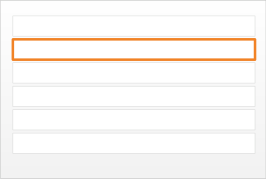

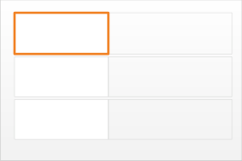

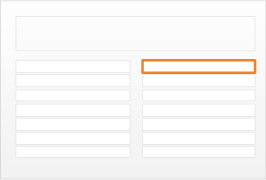

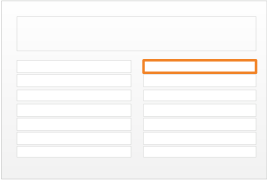

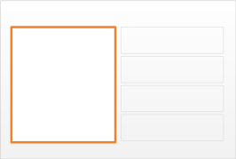
#### **Guidance**

### **Formatting Drug Names**

MEDi-001
#### Display generic drug names in bold

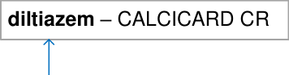

bold

Mandatory

MEDi-002

|diltiazem – CALCICARD CR|Col2|
|---|---|
|||

lowercase

#### Display generic drug names in lowercase (capital letters may still be used for acronyms and abbreviations in some drug names such as amphotericin B, factor VIII, carbomer 974P)

Mandatory

MEDi-003
#### Display drug brand names in uppercase

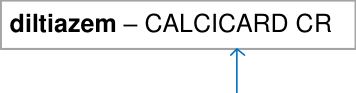

uppercase

Mandatory

MEDi-013

generic name

(first)

brand name

#### Where both the generic name and the brand name appear in a medication line, list the generic name first

Mandatory

Copyright ©2013 Health and Social Care Information Centre

#### **4**

#### **Guidance**

### **Displaying Numbers**

**paracetamol**  - tablet
**`DOSE`** **1 g**  - oral – every 6 hours

**paracetamol**  - tablet
**`DOSE`** **500 mg**  - oral – every 6 hours

INFANRIX-IPV Vaccine –
suspension for injection
**`DOSE`** **0.5 mL**  - oral – every 6 hours

MEDi-014
#### Where possible, avoid the need for decimal points by changing the units without breaking convention

_Recommended_

MEDi-015
#### Do not put a trailing zero after a sub-decimal value (that is, ‘0.5’ is correct but ‘0.50’ is incorrect)

Mandatory

MEDi-016
#### Put a leading zero before a decimal point for values of less than one

Mandatory

MEDi-017

|DOSE 5,000 units|Col2|
|---|---|
|||

comma

#### Use a comma to break up numeric values of one thousand and above

Mandatory

#### **5**

Copyright ©2013 Health and Social Care Information Centre

#### **Guidance**

### **Separators**

MEDi-018
**paracetamol**  - 120 mg in 5 mL –
#### When combining attributes in a
suspension – **`DOSE`** **80 mg**  - oral –
#### every 6 hours text string, use a long dash (em dash) surrounded by spaces between the attributes

Mandatory

double spaces

MEDi-019
#### Use a double space instead of a long dash or separator between a drug name and strength when there are multiple drug names in one medication line

_Recommended_

MEDi-020
#### Use a double space instead of a long dash or separator between a drug name and strength when the strength is expressed as a percentage

_Recommended_

|Col1|Col2|Col3|
|---|---|---|
|**paracetamol**  500 mg + **metoclopramide**  5 mg – sachet – **`DOSE` 2 sachets** – oral – every 4 hours as required – maximum 6 doses in 24 hours|**paracetamol**  500 mg + **metoclopramide**  5 mg – sachet – **`DOSE` 2 sachets** – oral – every 4 hours as required – maximum 6 doses in 24 hours|**paracetamol**  500 mg + **metoclopramide**  5 mg – sachet – **`DOSE` 2 sachets** – oral – every 4 hours as required – maximum 6 doses in 24 hours|

|double|space|
|---|---|
|||
|**sodium chloride** 0.9% – infusion – **`VOLUME` 1,000 mL** – 40 mL per hour – over 12 hours – intravenous – once only|**sodium chloride** 0.9% – infusion – **`VOLUME` 1,000 mL** – 40 mL per hour – over 12 hours – intravenous – once only|

Copyright ©2013 Health and Social Care Information Centre

#### **6**

#### **Guidance**

### **Wrapping**

MEDi-010
#### When wrapping the text of a medication line, do so without breaking up the contents of a attribute will not fit on one line

Mandatory

MEDi-008
#### Do not allow wrapping to separate a label from a value

Mandatory

MEDi-011

|insulin soluble human|Col2|Col3|
|---|---|---|
|ACTRAPID |– |100 units per mL |
|solution for injection |solution for injection |solution for injection |
|**`DOSE`12 units**  |**`DOSE`12 units**  |**`DOSE`12 units**  |
|twice a day|twice a day|twice a day|

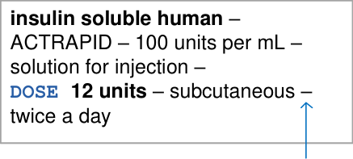

trailing delimiter

**haemophilus influenzae**
**type B vaccine** solution for injection –
**`DOSE`** **0.5 mL** intramuscular – once only

#### When wrapping the text of a medication line, keep trailing delimiters with the preceding attribute

Mandatory

MEDi-021
#### If a long drug name exceeds the available screen space and has to be wrapped, ensure that the drug name is wrapped between words

Mandatory

Copyright ©2013 Health and Social Care Information Centre

#### **7**

### **Abbreviation**

**paracetamol** 500 mg +
**metoclopramide** 5 mg – sachet –
oral – **`DOSE`** **2 sachets**  every 4 hours as required –
maximum 6 doses in 24 hours

**sodium chloride** 0.9% – infusion –
**`VOLUME`** **1,000 mL**  40 mL per hour – over 8 hours –
intravenous – once only

#### **Guidance**

MEDi-022
#### Do not abbreviate drug names

Mandatory

MEDi-023
#### Use long form names rather than abbreviations or symbols where possible

_Recommended_

MEDi-024
#### Do not put a full stop after abbreviations for units (for example mg and mL)

Mandatory

Copyright ©2013 Health and Social Care Information Centre

#### **8**

#### **Guidance**

### **Truncation**

**cefotaxime**    powder for solution for injection –
intravenous – **`DOSE`** **400 mg**    every 8 hours

#### **9**

MEDi-025
#### Do not truncate drug names

Mandatory

MEDi-012
#### If necessary, wrap but do not truncate medication line information

Mandatory

MEDi-054
#### Do not display a part of the medication line alone if its meaning relies on other parts that are not displayed

Mandatory

Copyright ©2013 Health and Social Care Information Centre

#### **Guidance**

### **Symbols**

|@|At sign|
|---|---|
|||Vertical bar|
|>|Greater than bracket|
|<|Less than bracket|
|/|Forward slash|
|\|Backslash|
|&|Ampersand|
|°|Degree|

spaces

|Col1|Col2|Col3|
|---|---|---|
|**paracetamol**500 mg + **metoclopramide**5 mg – sachet – oral –**`DOSE` 2 sachets** – every 4 hours as required – maximum 6 doses in 24 hours|**paracetamol**500 mg + **metoclopramide**5 mg – sachet – oral –**`DOSE` 2 sachets** – every 4 hours as required – maximum 6 doses in 24 hours|**paracetamol**500 mg + **metoclopramide**5 mg – sachet – oral –**`DOSE` 2 sachets** – every 4 hours as required – maximum 6 doses in 24 hours|

|paracetamol – tablet DOSE 1 g – oral – every 6 hours|Col2|
|---|---|
|||

dash

#### Do not use symbols that may be confused with numbers or otherwise misinterpreted, including those illustrated

Mandatory

MEDi-027
#### Use the ‘+’ (plus symbol) only for multiple drug name medications and surround it with spaces. When a ‘+’ is displayed adjacent to a ‘4’, separate the two with a double space

Mandatory

MEDi-028
#### Use alternatives such as a dash or a black dot (�) instead of brackets and separators such as those illustrated that look like the number one

Mandatory

|( )|Parentheses|
|---|---|
|[ ]|Brackets|
|{ }|Braces|

Copyright ©2013 Health and Social Care Information Centre

#### **10**

#### **Guidance**

### **Text Labels**

space

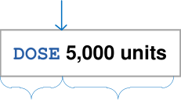

MEDi-009
#### Use a different font and colour to differentiate labels from values

Mandatory

MEDi-031
#### Use a space to separate a label from a value

Mandatory

MEDi-032
#### Do not use a colon after a label

Mandatory

MEDi-033
#### Display labels in uppercase

_Recommended_

Copyright ©2013 Health and Social Care Information Centre

label value

uppercase

#### **11**

#### **Guidance**

### **Text Labels**

MEDi-034
#### Keep the number of text labels in a medication represented as a single-text sentence to a minimum

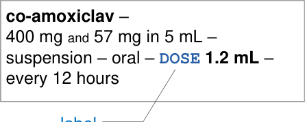

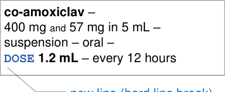

_Recommended_

MEDi-029
#### When a medication is represented as a single-text sentence, use a label for dose only

Mandatory

MEDi-030
#### When a medication is represented as a series of lines with hard line breaks, labels should appear at the beginning of a new line after a hard line break

Mandatory

Copyright ©2013 Health and Social Care Information Centre

#### **12**

#### **Guidance**

### **Line Breaks**

MEDi-035

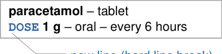

#### When using hard line breaks at set points (such as before a dose), do not use a long dash at the end of the previous line

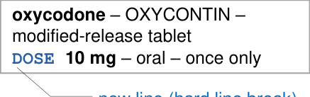

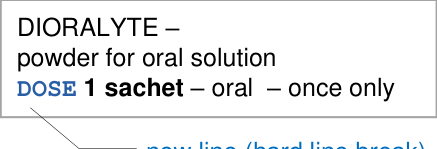

_Recommended_

Copyright ©2013 Health and Social Care Information Centre

#### **13**

### **Line Spacing**

#### **Guidance**

line height from 120% to 140%

MEDi-036
#### When displaying a medication as one or many lines of text, preserve white space between the lines by ensuring that the line height is no less than 120% (120% leading) and no greater than 140% (140% leading)

_Recommended_

at least 100% of line height

MEDi-037
#### When displaying a list of medications, ensure that there is a space equivalent to at least one line height of 100% between the last line of one medication line and the first line of the medication line below

_Recommended_

|Col1|Col2|
|---|---|
|**paracetamol** – tablet||
|**`DOSE` 1 g**– oral – every 6 hours|**`DOSE` 1 g**– oral – every 6 hours|

|paracetamol – tablet DOSE 1 g – oral – every 6 hours|Col2|
|---|---|
|||
|||
|**oxycodone**– OXYCONTIN – modified-release tablet **`DOSE`10 mg** – oral – once only|**oxycodone**– OXYCONTIN – modified-release tablet **`DOSE`10 mg** – oral – once only|

Copyright ©2013 Health and Social Care Information Centre

#### **14**

#### **Guidance**

### **Displaying Dose**

**morphine**  - 2 mg in 10 mL –
solution for injection – **`DOSE`** **2 mg**   intravenous – once only

**sodium chloride** 0.9% – infusion –
**`VOLUME`** **1,000 mL**  40 mL per hour –
over 12 hours – intravenous –
once only

#### **15**

MEDi-007
#### Provide a text label that reads ‘DOSE’ before a dose

Mandatory

MEDi-038
#### Display the dose amount and units in bold

Mandatory

MEDi-039
#### When a dose is expressed as a volume, display the volume amount in bold

Mandatory

MEDi-040
#### When there is no dose or volume, display a dose equivalent in place of the dose and subject to the same guidance points as a dose. Precede with an appropriate text label

Mandatory

Copyright ©2013 Health and Social Care Information Centre

### **Displaying Dose**

|DOSE 500 mg|Col2|
|---|---|
|||

space

INFANRIX-IPV Vaccine –
suspension for injection
**`DOSE`** **0.5 mL**  - oral – every 6 hours

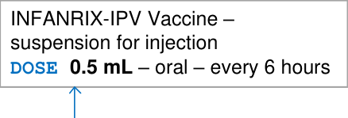

#### **Guidance**

MEDi-041
#### Separate the dose amount from the dose units with a space

Mandatory

MEDi-042
#### Do not put a trailing zero after a sub-decimal value when displaying a dose amount (that is, ‘0.5’ is correct but ‘0.50’ is incorrect)

Mandatory

MEDi-043
#### Put a leading zero before a decimal point for values of less than one when displaying a dose value

Mandatory

leading zero

MEDi-044

|DOSE 5,000 units|Col2|
|---|---|
|||

comma

#### Use a comma to break up numeric values of one thousand and above when displaying a dose value

Mandatory

Copyright ©2013 Health and Social Care Information Centre

#### **16**

#### **Guidance**

### **Displaying Strength**

**co-amoxiclav**  400 and 57 mg in 5 mL –
suspension – oral – **`DOSE`** **1.2 mL**  every 12 hours

**heparin**  - 5,000 units per mL –
solution for injection –
**`DOSE`** **5,000 units**  - subcutaneous
injection – once only

**co-codamol**  - 8 and 500 mg –
tablet – oral – **`DOSE`** **1 tablet**   every 4 to 6 hours as required

#### **17**

MEDi-045
#### When describing strengths with an active ingredient in a fluid, use ‘in’ rather than a forward slash ( ‘/’ ) before the fluid quantity

Mandatory

MEDi-046
#### When describing strengths of an ingredient in a single unit of fluid, use the word ‘per’ to describe the unit of fluid

Mandatory

MEDi-047
#### When describing a strength for a combination drug whose two strength values use the same unit (such as mg), use the word ‘and’ in a smaller font to join the two strength values and display the units after the second strength value

Mandatory

Copyright ©2013 Health and Social Care Information Centre

### **Displaying Strength**

#### **Guidance**

MEDi-048
#### Do not put a trailing zero after a decimal point when displaying numbers in a strength value

_Recommended_

MEDi-049
#### Put a leading zero before a decimal point for values of less than one when displaying numbers in a strength value

_Recommended_

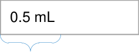

strength

MEDi-050
#### heparin – 5,000 units per mL – Use a comma to break up

solution for injection –
#### numeric values of one thousand
**`DOSE`** **5,000 units** - subcutaneous
#### and above when displaying
injection – once only
#### numbers in a strength value

_Recommended_

Copyright ©2013 Health and Social Care Information Centre

#### **18**

#### **Guidance**

### **Attribute Order**

MEDi-051

|1|Drug name|
|---|---|
|2|Brand name|
|3|Strength|
|4|Form|
|5|Dose or volume|
|6|Rate|
|_7_|Dose duration|
|8|Route|
|9|Frequency|

**morphine** - 10 mg in 2 mL –
solution for injection – **`DOSE`** **2 mg** intravenous – once only

**oxycodone** - OXYCONTIN –
modified-release tablet –
**`DOSE`** **10 mg** - oral – once only

#### When describing a medication as a line of text, adhere to the order illustrated for the display of the medication attributes (as applicable)

_Recommended_

Copyright ©2013 Health and Social Care Information Centre

#### **19**

### **Attribute Order**

**salbutamol**  - metered dose inhaler
**`STRENGTH`** 100 micrograms per dose
**`DOSE`** **2 puffs**
**`ROUTE`** inhaled
every 4 hours as required –
maximum 8 puffs in 24 hours

#### **Guidance**

MEDi-052
#### When designing for specific contexts, especially those that need additional text labels and line breaks, display drug name first and display other attributes (in a different order if necessary) from the one defined above

_Recommended_

MEDi-053
#### When a medication is not displayed as a single line of text and the attributes of a medication are listed in a different order, use text labels for as many of the illustrated attributes as possible

_Recommended_

Copyright ©2013 Health and Social Care Information Centre

#### **20**

