_Prepared for_

**NHS Connecting for Health**

**Tuesday, 23 June 2015**

**Version 1.0.0.0 Baseline**

_Prepared by_

**Clinical Applications and Patient Safety Project**

**NHS CUI Programme Team**

**[Cuistakeholder.mailbox@hscic.gov.uk](mailto:Cuistakeholder.mailbox@hscic.gov.uk)**

HSCIC Controlled Document

### PREFACE

**Documents replaced by this document**

Design Guide Entry – Medications Management – Medication Views 2.0.0.0

**Documents to be read in conjunction with this document**

Medications Management – Medication Line – User Interface Design Guidance 2.0.0.0

Design Guide Entry – Patient Banner 3.0.0.0

Displaying Graphs and Tables – User Interface Design Guidance 2.0.0.0

**Patient Safety Process**

The development cycle for this design guide is compliant with the Clinical Safety Management
System (CSMS) – the patient safety risk assessment and management process defined by NHS
Connecting for Health (NHS CFH) in conjunction with the National Patient Safety Agency (NPSA).

The design guide developers reviewed patient safety incidents arising from both current practice
and existing systems for medications management. The resulting guidance points support
mitigation of these known patient safety risks. In addition, the developers identified any potential
new risks by applying a patient-safety risk-assessment process. The developers are assessing and
managing all risks to support a Clinical Safety Case for this design guide.

The Hazard Log records all hazards and risks raised to date and includes mitigation actions that, in
some cases, will be applicable to you if you are an implementer or other user of this design guide.
The Hazard Log is a live document and updates regularly whilst this design guide continues its
development. Until this design guide has received full Clinical Authority to Release (CATR) from the
NHS CFH Clinical Safety Group (CSG) – based on an approved Clinical Safety Case – there may
be outstanding patient safety risks yet to be identified and mitigated. Therefore, it is essential that
you review the relevant Hazard Log in conjunction with this design guide.

Refer to nww.cui.nhs.uk (N3 connection required) for all current patient safety documentation,
including Hazard Logs and the current patient safety process status for this and other design
guides.

**This document was prepared for NHS Connecting for Health which ceased to exist on 31 March**
**2013. It may contain references to organisations, projects and other initiatives which also no**
**longer exist. If you have any questions relating to any such references, or to any other aspect of**
**[the content, please contact cuistakeholder.mailbox@hscic.gov.uk](mailto:cuistakeholder.mailbox@hscic.gov.uk)**

Copyright ©2013 Health and Social Care Information Centre

HSCIC Controlled Document

### TABLE OF CONTENTS

_**1**_ _**Introduction .................................................................................................................................... 1**_

1.1 Customer Need ......................................................................................................................... 3

1.2 Scope ........................................................................................................................................ 4

1.2.1 In Scope .............................................................................................................................. 4

1.2.2 Out of Scope ....................................................................................................................... 4

1.3 Dependencies ........................................................................................................................... 6

_**2**_ _**Guidance Overview ....................................................................................................................... 7**_

2.1 Summary of Guidance .............................................................................................................. 7

_**3**_ _**Guidance Details .......................................................................................................................... 12**_

3.1 Introduction ............................................................................................................................. 12

3.2 Principles ................................................................................................................................ 13

3.3 Guidelines ............................................................................................................................... 14

3.3.1 Tabular Layout .................................................................................................................. 15

3.3.2 Indicating List Length ........................................................................................................ 17

3.3.3 Gridlines ............................................................................................................................ 18

3.3.4 Row Formatting ................................................................................................................. 19

3.3.5 Displaying Icons for Drug Details ...................................................................................... 20

3.3.6 Empty Lists ........................................................................................................................ 20

3.3.7 Mandatory Columns .......................................................................................................... 21

3.3.8 Date Columns .................................................................................................................... 22

3.3.9 Column Headings .............................................................................................................. 24

3.3.10 Composite Columns ...................................................................................................... 25

3.3.11 Constraining Dimensions .............................................................................................. 26

3.3.12 Displaying Status........................................................................................................... 28

3.3.13 Specific Status Values .................................................................................................. 30

3.3.14 Formatting Status .......................................................................................................... 32

3.3.15 Controls for Displaying Current and Past Medications ................................................. 34

3.3.16 Displaying Current Medications .................................................................................... 36

3.3.17 Displaying Recent Past Notifications ............................................................................ 38

3.3.18 Displaying Past Medications ......................................................................................... 40

3.3.19 Filtering Past Medications ............................................................................................. 42

3.3.20 Displaying a LASB......................................................................................................... 44

3.3.21 Defining LASB Interactions ........................................................................................... 48

3.3.22 Displaying LASB Notifications ....................................................................................... 50

3.3.23 Selecting LASB Contents .............................................................................................. 52

3.3.24 Displaying LASB Contents ............................................................................................ 54

3.3.25 Formatting LASB Contents ........................................................................................... 56

3.3.26 Drug Names in the LASB .............................................................................................. 57

3.3.27 Formatting LASB Notifications ...................................................................................... 58

Copyright ©2013 Health and Social Care Information Centre

Page iii

HSCIC Controlled Document

3.3.28 Displaying a LASB for Past Medications ....................................................................... 59

3.3.29 Providing a Grouping Control ........................................................................................ 60

3.3.30 Supporting Grouping ..................................................................................................... 61

3.3.31 Displaying Group Headings .......................................................................................... 63

3.3.32 Collapsing Groups ......................................................................................................... 65

3.3.33 Combining Groups to Avoid Duplication ....................................................................... 67

3.3.34 Supporting Sorting......................................................................................................... 68

3.3.35 Supporting Levels of Detail ........................................................................................... 69

3.3.36 Supporting Selection and Action ................................................................................... 70

3.3.37 Providing Context Menus .............................................................................................. 72

3.3.38 Providing Access to Medication Details ........................................................................ 73

3.4 Rationale Summary ................................................................................................................ 74

_**4**_ _**Document Information ................................................................................................................ 75**_

4.1 Terms and Abbreviations ........................................................................................................ 75

4.2 Definitions ............................................................................................................................... 76

4.3 Nomenclature ......................................................................................................................... 76

4.3.1 Body Text .......................................................................................................................... 76

4.3.2 Cross References.............................................................................................................. 76

4.4 References ............................................................................................................................. 77

_**APPENDIX A**_ _**Reference Summary of Guidance ........................................................................... 78**_

Copyright ©2013 Health and Social Care Information Centre

Page iv

HSCIC Controlled Document

### 1 INTRODUCTION

This document provides guidance for the display of a list of medications for one patient in a user
interface (UI). It describes what is meant by a list of medications, defines the scope, lists mandatory
and recommended guidance points with usage examples and explains the rationale behind the
guidance.

This document replaces the previously published guidance _Medications Management – Medication_
_Views_ **{R1}** . A significant number of the changes to the guidance are designed to allow flexibility
and encourage innovation. The guidance has been amended to ensure that it is relevant to lists of
medications that may have different structures and content and it has been extended to provide
specific guidance where a standard is needed to mitigate patient safety hazards.

Table 1 describes the changes made since the previous version of this guidance (Baseline version
2.0.0.0 dated 12-Oct-2008):

**Deleted** MEDv-001 to
MEDv-015

MEDv-016 to
MEDv-018

Deleted to remove constraints that relate to specific views other than a medication list, navigation between
views and guidance relating to a framework of views

Removed because they are general versions of the more specific guidance in the sections on Current and
Past (MEDv-063), Past Filters (MEDv-066) and Grouping (MEDv-084) respectively

MEDv-019 Removed as further research is being carried out that may inform the production of guidance for the
display of and navigation between different sets of medications information (Levels of Detail)

MEDv-033 Removed because decision support alerts need to be considered as part of a larger framework

MEDv-034
MEDv-040

Superseded by more detailed guidance in _Medications Management – Medication Line_ **{R2}** guidance
document, section 3.3.4

MEDv-039 Replaced by MEDi-001 in _Medications Management – Medication Line_ **{R2}** guidance document

MEDv-041 Replaced by MEDi-018 in _Medications Management – Medication Line_ **{R2}** guidance document

MEDv-026 Removed because the formatting defined in MEDv-024 and MEDv-025 is sufficient to distinguish
medications with a different status

MEDv-046 Replaced by MEDv-179, MEDv-180 and MEDv-181 as the look-ahead scroll bar (LASB) is now displayed
in a reserved space

MEDv-047 Replaced by the more specific MEDv-181

MEDv-057 Deleted because medication lines are no longer shown within a recent past notification

MEDv-060
MEDv-061

Superseded by MEDv-182 because the LASB is no longer recommended as a navigation tool

MEDv-073 Removed because this is covered by MEDv-068

MEDv-076
MEDv-078 to
MEDv-082

Removed to mitigate UI design and technical issues associated with the display of recent past medications
within the current medications list

MEDv-088 Removed to allow the user to control the grouping and group states (expanded or collapsed) in each of
Current and Past medications respectively and independently

MEDv-093 to
MEDv-098

Relate to the duplication of medications that belong in more than one group. Removed as this approach is
no longer recommended since guidance cannot effectively mitigate the risks that it has been found to
introduce.

MEDv-106 This sorting restriction (do not allow sorting by hidden attributes) has been removed to allow the provision
of mechanisms that can support sorting other than by clicking on visible column headings

MEDv-107 to Relate to the control and display of Levels of Detail. Removed because guidance can only assess risks by

Page 1

Copyright ©2013 Health and Social Care Information Centre

HSCIC Controlled Document

rather than extending it, we hope to encourage innovation in this area

MEDv-134 Removed to avoid the implication that the context menu should be used to display information about the
selected medications

MEDv-137 to
MEDv-140

Relate to display of detailed information about a single medication. These guidance points have been
removed because further work is needed to identify guidance in this area. If all details for one medication
are displayed in such a way that occludes the information in the list, there is a risk that the partially visible
medications information may be used to inform clinical judgement. This risk needs further assessment and
further design exploration is needed to explore the provision of information without occluding the
medications in the list. These risks are best addressed as part of a more comprehensive design for the
display of all details for one medication.

**Modified** MEDv-020 Rephrased and extended to clarify that each line represents one medication

MEDv-025 Rephrased to remove the potential for it to be interpreted as supporting the display of current and past
medications concurrently in the same list

MEDv-028 to
MEDv-032
MEDv-034 to
MEDv-038

Replaced with new guidance that is provides principles for the ordering and formatting of columns and for
wrapping rather than requiring the display of specific columns in a set order

MEDv-049 Rephrased to clarify that the order of drugs in the look-ahead notifications must be consistent with the
order of medications in the list

MEDv-056 Rephrased to clarify that the black dot in the look-ahead scroll bar notifications should have a space either
side

MEDv-067 Rephrased to clarify that a ‘show all past’ (or equivalent) option should be available in the list of filters for
past medications

MEDv-068 Rephrased to differentiate it from MEDv-070 and to clarify that it refers specifically to the presence and
location of a control for removing a filter

MEDv-072 Conformance rating changed from Mandatory to Recommended to allow for brevity in filter notification
messages

MEDv-083 Conformance rating changed from Mandatory to Recommended to allow for the default presentation of
grouping to support users focused solely on a specific task

MEDv-084 Rephrased to replace to ‘combo-box’ with the more accurate ‘drop-down box’

MEDv-089 Changed so that it only requires counts to be shown in group headings for groups that are collapsed

MEDv-090 Conformance rating changed from mandatory to recommended in order to allow for the display of group
headings for empty groups when the grouping scheme has few groups and is used for specific tasks that
require explicit confirmation of empty groups

MEDv-099
MEDv-100

Rephrased to clarify that ‘start date’ and ‘end date’ are not necessarily the correct definitions or column
labels for the dates to which the default sorts are applied

MEDv-103 Conformance rating changed from Mandatory to Recommended since it is supplementary to the use of an
icon to indicate the sort order in a column heading

MEDv-104 Rephrased to clarify that a text symbol such as a triangle could be used instead of an icon

MEDv-105 Rephrased to refer to the default sort rather than reference an explicit sort order

MEDv-127 Extended to describe the keyboard shortcuts explicitly

MEDv-022
MEDv-059
MEDv-064
MEDv-074

Wording revised for clarity, without altering the meaning

Copyright ©2013 Health and Social Care Information Centre

Page 2

HSCIC Controlled Document

**Added** MEDv-141 to
MEDv-201

These guidance points have been added

Table 1: Changes Since the Last Baseline Version

**Note**

In this document, the words ‘generic’ and ‘brand’, when associated with drug names, are used with very
specific meanings that may differ from their accepted meanings in other contexts. Refer to section 4.2 for
definitions of the specific terminology used in this document.

#### **1.1 Customer Need**

An electronic system for managing a patient’s medications must be able to support the complex
needs of a wide range of health care professions and health care settings. A successful display
solution must therefore balance those complex information needs with safety concerns, and ensure
consistency across views and between systems.

**Medications Incidents**  - The National Patient Safety Agency (NPSA) reports that the majority of
medication incidents reported between January 2005 and June 2006 (59,802 in total) related to the
administration of medicines (59.3 percent), followed by incidents related to the preparation and
dispensing of medications (17.8 percent) and the prescribing of medications (15.7 percent). Their
findings, documented in _Safety in doses: medication safety incidents in the NHS_ _[1]_, also state that
the most common types of medication incidents reported to the NSPA included incorrect dose,
incorrect strength or frequency, omitted medicine and wrong medicine.

**Existing Systems**  - In-patient hospital care settings currently use multiple kinds of medications
documents, both paper-based and electronic. As care professionals move between hospitals and
are faced with new information groupings while working in stressful environments, the differences
in the designs of the documents they use may well already impact patient safety. Differences in
display formats for medicines impact both the review and management of those medications and
will become a safety concern as electronic systems become more widely available in the next few
years. The challenge for designers developing electronic systems in this area is particularly great
as there are no universally-accepted paper-based standards to reference.

Research in which extensive studies of medication-related errors were reviewed, suggests that the
most powerful means of preventing medication-related errors are computerised order entry and
administration management along with standards for processes and for the writing of prescriptions
(see _Medication Errors_ **{R4}**, _To Err Is Human_ **{R5}** and _Understanding Patient Safety_ **{R6}** ).

In the UK, emerging standards and guidelines designed to improve medicines management in the
NHS draw attention to the need for active review of long term medications in a Primary Care
environment (see _Room for Review_ **{R7}** and _National Service Framework for Older People_
_(NHS)_ _[2]_ ) **.** For in-patient settings however, medication reviews are carried out as part of regular and
often daily reviews of treatment. Medications are reviewed to assess whether they are achieving
the desired therapeutic intent, ensure that there are no more medications prescribed than is
necessary and to monitor for adverse effects.

An in-patient review of medications may form only part of a more comprehensive review that
depends on other information such as observations, test results and clinical notes (including
diagnoses and plans). The information required for a medication review will vary for different

1 NPSA – Safety in doses: medication safety incidents in the NHS **{R3}** :
[http://www.npsa.nhs.uk/nrls/alerts-and-directives/directives-guidance/safety-in-doses/](http://www.npsa.nhs.uk/nrls/alerts-and-directives/directives-guidance/safety-in-doses/)

2 National service framework for older people – Department of Health **{R8}** :
[http://www.dh.gov.uk/en/publicationsandstatistics/publications/publicationspolicyandguidance/DH_4003066](http://www.dh.gov.uk/en/publicationsandstatistics/publications/publicationspolicyandguidance/DH_4003066)

Page 3

Copyright ©2013 Health and Social Care Information Centre

HSCIC Controlled Document

contexts so it is unlikely that the needs for all kinds of medications review would be met by the
design of one, specific UI. However, there are needs that are common to all kinds of medications
review. Guidance for these areas can help to mitigate errors caused or heightened by
inconsistencies of core medications information between systems.

#### **1.2 Scope**

This guidance has been designed for the display of medications for a single patient in a hospital
ward environment. The guidance applies to the display of information about medications in a list
that is organised using columns and rows and specifically to the way that the information is
organised and can be manipulated by the clinical user.

##### **1.2.1 In Scope**

Users Hospital-based doctors, nurses and pharmacists

Care settings In-patient, hospital ward environment only

Tasks Reviewing medications that have been prescribed for a single patient and checking the accuracy of
scripts

Medications  Oral solids and liquids

 Inhalers and sprays

 Eye, ear and nose drops

 Topical liquids

 Creams, ointments and gels

 Enemas and rectal solutions

 Granules and powders

 Insulin

 Suppositories and pessaries

 Topical patches

 Nebuliser solutions

 Simple infusions (by example only)

 Injections (insulin example only)

 Unlicensed medications

Grouping Controls for applying and changing sorting and grouping respectively. The display of group headers,
expanding and collapsing groups and handling medications that belong in more than one group

Notifications General notifications, such as ‘Patient nil by mouth’ and recent past medications

Look-ahead scroll bars Generic guidance for the display of a look-ahead scroll bar in any view and guidance that is specific to the
display of current medications and past medications. See section 3.3.20 for a description of the lookahead scroll bar.

List structure Structure and layout of a list of medications

Filtering Filtering to display current or past medications respectively and filters to display subsets of past
medications

Table 2: In Scope

##### **1.2.2 Out of Scope**

Table 3 defines areas that are not covered in this guidance. Although there may be specific risks
associated with these areas that are not addressed in this guidance, it is likely that the principles in
this guidance will extend to the display of medication information in many of the areas listed below.

The patient is indicated as out of scope in so far as not being a user of clinical software; the
guidance is designed to support user interfaces used by clinicians. As such, it will therefore present
information in formats that are designed to support health care professionals. The display of
medication information in views that are designed for patients is not addressed in this guidance.

The care settings listed in Table 3 are out of scope because they have not been studied in depth in
our research. The Medication List guidance is likely to be relevant to all of these care settings, but

Page 4

Copyright ©2013 Health and Social Care Information Centre

HSCIC Controlled Document

there may be specific risks associated with each that have not been considered and therefore
mitigated in this guidance.

**Guidance Areas** **Details**

Users Non-clinical staff, patients and other health care professionals not listed in the in scope section (that is,
only hospital-based doctors, nurses and pharmacists are in scope).

Care settings Care settings other than in-patient, hospital ward environments, including: outpatients, clinics,
pharmacies, emergency services and departments, intensive care, High Dependency Unit (HDU), primary
care, including general practice, community and home visits, ward management, multi-patient tasks.

Tasks  Reviewing administration events to gain an understanding of the degree to which the medication has

been successfully administered

 Relating medications to information elsewhere in the patient record, including the linking of information

in a plan or notes to medications

 Medications reconciliation

Medications

Although these
medications can be
displayed in the list view
defined by this guidance,
they may have additional
requirements or introduce
specific risks that are not
explicitly addressed by
the guidance.

 Enteral feeds

 Dressings and devices

 Implants and sticks

 Intrauterine devices (IUDs)

 Cements

 Homeopathic products (including

complementary and alternative therapies)

 Dialysis solutions

 Injections (except by specific example)

 Infusions and fluids (except by specific

examples)

 Combination infusions

 Total Parental Nutrition (TPN)

 Gases

 Blood and platelet products

 Radio-pharmacy

 Variable dose medications

 Foams

 Radioactive agents

 Regimens and order sets

 Advisory Committee on Borderline Substances

(ACBS) products

 Over the counter (OTC) medications

 Recreational drugs

 Medications with titrating doses

 Discharge medications – to take out (TTO)

 Patient’s own drugs (PODs)

 Epidurals and patient controlled analgesia

 Extemporaneous prescriptions

 Medication administered or supplied as part of a

Patient Group Direction (PGD)

 Medication prescribed by supplementary

prescribers

Identity of a medication Definition of which attributes can be changed without the need for a new medication line to be
represented (in the UI).

All details for one
medication

Specific Properties of
Individual Medications

Decision and knowledge
support

The layout and structure for the presentation of all information about one medication from the selection of
a medication anywhere in a clinical application. This includes the selection of a medication to present a
separate window or area with more detailed information about that medication.

Guidance for the indication (as text or as an icon) of specific attributes of a medication, including:

 Indicating medications that were added when they were already ‘past’ medications in order to

complete missing information in a past medical history

 Indicating an owner for each medication (for within multi-disciplinary cross boundary records)

All forms of decision support, including alerting for allergies and drug-to-drug interactions. Knowledge
support such as browsing drugs by classification and looking up information about medications.

Allergies The display and recording of allergy information and adverse drug reaction risks is covered in a separate
guidance document.

Patient consent and
preference

Patient preference, such as for a particular drug form. Patient consent, particularly in a mental health
context.

Page 5

Copyright ©2013 Health and Social Care Information Centre

HSCIC Controlled Document

**Guidance Areas** **Details**

Other  Sealed envelopes

 Supply and dispensing

 Guidance (other than notifications) that might be needed for when a patient is ‘Nil by Mouth’

Table 3: Out of Scope

#### **1.3 Dependencies**

**D1** This guidance is informed by ongoing and unpublished work by the NHS National Programme for IT (NPfIT) that is referred
to in this document as NHS Connecting for Health (NHS CFH) Medication Types Rules. The NHS CFH Medication Types
Rules is still evolving and is based on extensive research and consultation. Changes to this work may trigger changes to this
guidance.

**D2** This guidance is informed by the NHS NPfIT _ePrescribing Functional Specification_ _[3]_

**D3** This guidance uses the concepts ‘generic drug’ and ‘brand name’ and depends on access to, or creation of, a database or
dictionary, that can support these concepts, such as the _Dictionary of Medicines and Devices_ (known as ‘dm+d’) [4] .

**D4** This guidance includes guidance points for filtering, sorting and grouping that are expected to be included in a separate
guidance document for this area. Availability of such a document may trigger changes to this guidance.

**D5** This guidance assumes that a list of medications is provided as part of a larger framework of medications that collectively
provide enough information to support a review of the current and past medications of a single patient. A comprehensive
understanding of the current status of a patient’s medications is expected to be gained from the use of more than one
medications view.

Table 4: Dependencies

3 NHS NPfIT – ePrescribing Functional Specification **{R9}** :
[http://www.connectingforhealth.nhs.uk/newsroom/news-stories/eprescfunctspec](http://www.connectingforhealth.nhs.uk/newsroom/news-stories/eprescfunctspec)

4 Dictionary of Medicines and Devices **{R10}** [: http://www.dmd.nhs.uk/](http://www.dmd.nhs.uk/)

Page 6

Copyright ©2013 Health and Social Care Information Centre

HSCIC Controlled Document

### 2 GUIDANCE OVERVIEW

**Important**

The visual representations used within this document to display the guidance are illustrative only. They
are simplified in order to support understanding of the guidance points in each section respectively, so
some details that are included in usage examples are excluded from the summary. Stylistic choices such
as colours, fonts or icons, are not part of the guidance and, unless otherwise specified, are therefore not
mandatory requirements for compliance with the guidance in this document.

#### **2.1 Summary of Guidance**

Detailed guidance and rationale for all guidance points is in sections 3.3.1 to 3.3.38. Refer to
APPENDIX A for a reference list of all the guidance descriptions. Table 5 provides a summary of
the guidance.

**Note**

In the **Visual Summary** column, items highlighted in blue indicate correct usage and those in red indicate
incorrect usage.

MEDv-020
MEDv-141

3.3.1 Tabular Layout

|Col1|sentence|tabula|
|---|---|---|
||||
|**xxxx**– xxxx - xxxx yyyy zzzz|**xxxx**– xxxx - xxxx yyyy zzzz|**xxxx**– xxxx - xxxx yyyy zzzz|
|**xxxx**– xxxx - xxxx yyyy zzzz|**xxxx**– xxxx - xxxx yyyy zzzz|**xxxx**– xxxx - xxxx yyyy zzzz|
|**xxxx**– xxxx - xxxx yyyy zzzz|**xxxx**– xxxx - xxxx yyyy zzzz|**xxxx**– xxxx - xxxx yyyy zzzz|
|**xxxx**– xxxx - xxxx yyyy zzzz|**xxxx**– xxxx - xxxx yyyy zzzz|**xxxx**– xxxx - xxxx yyyy zzzz|

MEDv-142 3.3.2 Indicating List Length

MEDv-021 3.3.3 Gridlines

|xxxx – xxxx - xxxx yyyy zzzz xxxx – xxxx - xxxx yyyy zzzz xxxx – xxxx - xxxx yyyy zzzz xxxx – xxxx - xxxx yyyy zzzz|Col2|
|---|---|
|||
||space|

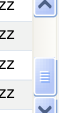

|Col1|no strong|
|---|---|
|||
|**xxxx**– xxxx - xxxx yyyy zzzz|**xxxx**– xxxx - xxxx yyyy zzzz|
|**xxxx**– xxxx - xxxx yyyy zzzz|**xxxx**– xxxx - xxxx yyyy zzzz|
|**xxxx**– xxxx - xxxx yyyy zzzz|**xxxx**– xxxx - xxxx yyyy zzzz|
|**xxxx**– xxxx - xxxx yyyy zzzz|**xxxx**– xxxx - xxxx yyyy zzzz|

MEDv-022
MEDv-143
to
MEDv-145

3.3.4 Row Formatting

Alternate row shading and lines
between rows.

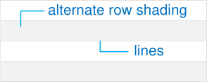

MEDv-023 3.3.5 Displaying Icons for Drug
Details

|Col1|Col2|icons|Col4|
|---|---|---|---|
|||||
|**xxxx**– xxxx - xx|**A**|**B**|yyyy zzzz|
|**xxxx**– xxxx - xx yyyy zzzz **B**|**xxxx**– xxxx - xx yyyy zzzz **B**|**xxxx**– xxxx - xx yyyy zzzz **B**|**xxxx**– xxxx - xx yyyy zzzz **B**|
|**xxxx**– xxxx - xx|**A**|yyyy zzzz|yyyy zzzz|

Page 7

Copyright ©2013 Health and Social Care Information Centre

HSCIC Controlled Document

MEDv-146 3.3.6 Empty Lists

|aaaa|bbbb|cccc|
|---|---|---|
|_There are no current medications for this patient_ empty list message|_There are no current medications for this patient_ empty list message|_There are no current medications for this patient_ empty list message|

MEDv-147
to
MEDv-150

MEDv-151
to
MEDv-154

MEDv-155
to
MEDv-157

MEDv-027
MEDv-158

MEDv-159
to
MEDv-161

MEDv-162
to
MEDv-165

MEDv-166
to
MEDv-173

MEDv-024
MEDv-025
MEDv-042

MEDv-062
to
MEDv-067
MEDv-174

3.3.7 Mandatory Columns

3.3.8 Date Columns

Relative placement of date
columns, column widths and
recommended date columns to
include.

3.3.9 Column Headings

How to label columns
appropriately.

3.3.10 Composite Columns

How to combine information into
a single column.

3.3.11 Constraining Dimensions

How to ensure appropriate
column and overall list widths.

3.3.12 Displaying Status

How to display status for
medications in the list.

3.3.13 Specific Status Values

Recommended values to use for
status.

3.3.14 Formatting Status

How to format the display of
status.

3.3.15 Controls for Displaying
Current and Past Medications

|Drug Details|Status|Date|
|---|---|---|
||||

mandatory columns

|Col1|Col2|Col3|
|---|---|---|
|Start|Start|End|
||||

First
Administration

Last
Administration

Start and End Dates
**Start** zzzz

**End** zzzz

**Start** zzzz

**End** zzzz

|aaaa|bbbb|cccc|
|---|---|---|
|relative widths|||

Current Past

Status
**Started**

**Not Started**

**Suspended**

Current

Past

Status
**Completed**

**Discontinued**

Started

Not Started

Suspended

Completed

Discontinued

|xxxx – xxxx - xxxx yyyy zzzz|Col2|
|---|---|
|**xxxx**– xxxx - xxxx yyyy zzzz|**xxxx**– xxxx - xxxx yyyy zzzz|
|**xxxx**– xxxx - xxxx yyyy zzzz|**xxxx**– xxxx - xxxx yyyy zzzz|
|**xxxx**– xxxx - xxxx|yyyy zzzz|
||Important S|

Page 8

Copyright ©2013 Health and Social Care Information Centre

HSCIC Controlled Document

MEDv-099
MEDv-173

MEDv-074
MEDv-075
MEDv-077
MEDv-174

MEDv-100
MEDv-175

MEDv-068
to
MEDv-073

MEDv-176

MEDv-177
to
MEDv-181

MEDv-058
MEDv-059
MEDv-182

MEDv-043
to
MEDv-045

3.3.16 Displaying Current
Medications

3.3.17 Displaying Recent Past
Notifications

How to present a notification for
recently past medications.

3.3.18 Displaying Past
Medications

Sort order and column
placement for past medications.

3.3.19 Filtering Past Medications

How to support filtering for past
medications.

3.3.20 Displaying a LASB

How to present a look-ahead
scroll bar.

3.3.21 Defining LASB
Interactions

How a look-ahead scroll bar
should behave.

3.3.22 Displaying LASB
Notifications

How to present look-ahead scroll
bar notifications

|Drug Details|xxxx|Start ▼|
|---|---|---|
||default sort|default sort|

|Status|Col2|Drug Details|End ▼|
|---|---|---|---|
|||default sort|default sort|
||first column|first column|first column|

|look-ahead notification|Col2|Col3|Col4|Col5|
|---|---|---|---|---|
||||||
||||||
||||||
||||||
||reserved space|reserved space|reserved space|reserved space|

|Col1|Col2|Col3|
|---|---|---|
|**ddd**– xxxx - xxxx **eee**– xxxx - xxxx **ccc**– xxxx - xxxx yyyy zzzz yyyy zzzz yyyy zzzz|**ddd**– xxxx - xxxx **eee**– xxxx - xxxx **ccc**– xxxx - xxxx yyyy zzzz yyyy zzzz yyyy zzzz|**ddd**– xxxx - xxxx **eee**– xxxx - xxxx **ccc**– xxxx - xxxx yyyy zzzz yyyy zzzz yyyy zzzz|
||||

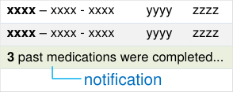

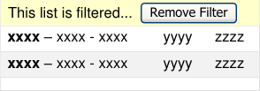

Current

first column

Current

Past

Past

|joined to scroll bar|Col2|Col3|Col4|Col5|
|---|---|---|---|---|
||||||
||||||
||||||
||||||
|single line|single line|single line|||

Page 9

Copyright ©2013 Health and Social Care Information Centre

HSCIC Controlled Document

MEDv-049
MEDv-183

MEDv-048
MEDv-052
MEDv-053
MEDv-055

MEDv-056
MEDv-184
MEDv-185

MEDv-050
MEDv-051

MEDv-186
to
MEDv-189

3.3.23 Selecting LASB Contents

How to determine what the
contents of a look-ahead scroll
bar notification should be

3.3.24 Displaying LASB
Contents

How to display the contents of a
look-ahead scroll bar notification

3.3.25 Formatting LASB
Contents

How to format the contents of a
look-ahead scroll bar notification.

3.3.26 Drug Names in the LASB

How to present drug names in
the look-ahead scroll bar
notification.

3.3.27 Formatting LASB
Notifications

How to format the look-ahead
scroll bar notifications.

|aaa – xxxx - xxxx|l|
|---|---|
|**bbb**– xxxx - xxxx|**bbb**– xxxx - xxxx|
|**ccc**– xxxx - xxxx|**ccc**– xxxx - xxxx|
|**ccc**– xxxx - xxxx|l|
|**ddd**– xxxx - xxxx|**ddd**– xxxx - xxxx|
|**eee**– xxxx - xxxx|**eee**– xxxx - xxxx|
|**fff**– xxxx - xxxx|**fff**– xxxx - xxxx|

|Col1|Col2|aaa ·|bbb|
|---|---|---|---|
|**ddd**– xxxx - xxxx **eee**– xxxx - xxxx **ccc**– xxxx - xxxx yyyy zzzz yyyy zzzz yyyy zzzz    |**ddd**– xxxx - xxxx **eee**– xxxx - xxxx **ccc**– xxxx - xxxx yyyy zzzz yyyy zzzz yyyy zzzz    |**ddd**– xxxx - xxxx **eee**– xxxx - xxxx **ccc**– xxxx - xxxx yyyy zzzz yyyy zzzz yyyy zzzz    |**ddd**– xxxx - xxxx **eee**– xxxx - xxxx **ccc**– xxxx - xxxx yyyy zzzz yyyy zzzz yyyy zzzz    |
||**2 more**·**  kkk**·**  jjj**·**  iii**·**  ggg**·**  fff**|**2 more**·**  kkk**·**  jjj**·**  iii**·**  ggg**·**  fff**|**2 more**·**  kkk**·**  jjj**·**  iii**·**  ggg**·**  fff**|

|Col1|text|Col3|
|---|---|---|
||||
|**atenolol**·** fluoxetine**·** naproxen**|**atenolol**·** fluoxetine**·** naproxen**|**atenolol**·** fluoxetine**·** naproxen**|
|||background|

Past Current

visible list

MEDv-054 3.3.28 Displaying a LASB for
Past Medications

How to display a look-ahead
scroll bar in past medications.

|Col1|2 more|
|---|---|
|**ppp**– xxxx - xxxx **qqq**– xxxx - xxxx **ooo**– xxxx - xxxx |**ppp**– xxxx - xxxx **qqq**– xxxx - xxxx **ooo**– xxxx - xxxx |
||4 more|

|Col1|Col2|aaa · bbb|
|---|---|---|
|**ddd**– xxxx - xxxx **eee**– xxxx - xxxx **ccc**– xxxx - xxxx |**ddd**– xxxx - xxxx **eee**– xxxx - xxxx **ccc**– xxxx - xxxx |**ddd**– xxxx - xxxx **eee**– xxxx - xxxx **ccc**– xxxx - xxxx |
||2 more ·**  ggg**·**  fff**|2 more ·**  ggg**·**  fff**|

MEDv-084
MEDv-085
MEDv-190

MEDv-083
MEDv-087
MEDv-191
to
MEDv-193

MEDv-086
MEDv-090
MEDv-091
MEDv-194
MEDv-195

3.3.29 Providing a Grouping
Control

How to provide a control to
support grouping and the display
of the currently selected group.

3.3.30 Supporting Grouping

How to support grouping within
the list.

3.3.31 Displaying Group
Headings

How to display headings for
groups.

**Group A**

**xxxx** - xxxx - xxxx

**Group B**

yyyy zzzz

**xxxx** - xxxx - xxxx yyyy zzzz

**xxxx** - xxxx - xxxx

yyyy zzzz

|Tablet|Col2|
|---|---|
|**xxxx**– xxxx - xxxx yyyy zzzz|**xxxx**– xxxx - xxxx yyyy zzzz|
|**(No Form Specified)**|**(No Form Specified)**|
|**xxxx**– xxxx - xxxx yyyy zzzz **xxxx**– xxxx - xxxx yyyy zzzz|**xxxx**– xxxx - xxxx yyyy zzzz **xxxx**– xxxx - xxxx yyyy zzzz|

Page 10

Copyright ©2013 Health and Social Care Information Centre

HSCIC Controlled Document

MEDv-089
MEDv-092
MEDv-093
MEDv-196

MEDv-197
to
MEDv-200

MEDv-101
to
MEDv-105

3.3.32 Collapsing Groups

How to support expanding and
collapsing of groups.

3.3.33 Combining Groups to
Avoid Duplication

How to combine groups for
medications that belong to more
than one group.

3.3.34 Supporting Sorting

How to support changing the
sort order.

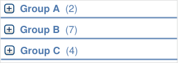

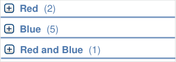

|Col1|Col2|Col3|Col4|
|---|---|---|---|
|aaaa|Start▼|Start▼|Start▼|
|aaaa|Start▼|||
|zzzz yyyy xxxx aaaa aaaa aaaa|zzzz yyyy xxxx aaaa aaaa aaaa|||

MEDv-201 3.3.35 Supporting Levels of
Detail

How to support access to
medication lists that display
different details.

|xxxx – xxxx - xxxx yyyy|Col2|
|---|---|
|**xxxx**– xxxx - xxxx yyyy|**xxxx**– xxxx - xxxx yyyy|
|**xxxx**– xxxx - xxxx yyyy||
|**xxxx**– xxxx - xxxx yyyy|**xxxx**– xxxx - xxxx yyyy|

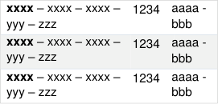

formatting

MEDv-122
to
MEDv-127
MEDv-202
MEDv-203

MEDv-128
to
MEDv-133

MEDv-135
MEDv-136

3.3.36 Supporting Selection and
Action

How to support selection of list
items and access relevant
actions.

3.3.37 Providing Context Menus

How to present a context menu.

3.3.38 Providing Access to
Medication Details

How to support access to
detailed information about a
selected medication.

|xxxx – xxxx - xxxx yyyy zzzz|Col2|Col3|
|---|---|---|
|**xxxx**– xxxx - xxxx yyyy zzzz|**xxxx**– xxxx - xxxx yyyy zzzz|**xxxx**– xxxx - xxxx yyyy zzzz|
|**xxxx**– xxxx - xxxx yyyy zzzz ~~Action 1~~|**xxxx**– xxxx - xxxx yyyy zzzz ~~Action 1~~|**xxxx**– xxxx - xxxx yyyy zzzz ~~Action 1~~|
|**xxxx**– xxxx - xxxx yyyy zzzz ~~Action 1~~|yyyy zzzz ~~Action 1~~|yyyy zzzz ~~Action 1~~|
|**xxxx**– xxxx - xxxx|yyyy zzzz   Action 2 ||
||Action 3||

|xxxx – xxxx - xxxx yyyy zzzz|Col2|Col3|
|---|---|---|
|**xxxx**– xxxx - xxxx yyyy zzzz|**xxxx**– xxxx - xxxx yyyy zzzz||
|**xxxx**–|xxxx - xxxx yyyy zzzz|xxxx - xxxx yyyy zzzz|
|**xxxx**–|xxxx - xxxx yyyy zzzz |xxxx - xxxx yyyy zzzz |
|**xxxx**–|xxxx - xxxx yyyy zzzz ~~Detailed informat~~ |xxxx - xxxx yyyy zzzz ~~Detailed informat~~ |
||||

Table 5: Summary of Guidance

Copyright ©2013 Health and Social Care Information Centre

Page 11

HSCIC Controlled Document

### 3 GUIDANCE DETAILS

#### **3.1 Introduction**

This section contains detailed guidance for the display of a list of medications that have been
prescribed for a single patient. A list of medications is expected to be one of many ways of
displaying medications information for a single patient. This list of medications forms only part of
the medications management views and tools that would be available in a clinical application.

A full framework for medications management in a clinical application might include:

 The definition of a set of views each of which has a different focus and presentation style

 The definition of specialist views that combine information in a particular way for use in

specific contexts. For example, a monitoring chart for tracking medication doses,
observations and test results in a high dependency unit, or a Timeline View for long term
management of diabetes

 Mechanisms for accessing medications management tools and navigating between

medications views. These may be dependent on the application architecture

 The degree to which, and means by which, medications information is integrated into other

parts of a clinical application

 The dimensions of each of the medications views and the way in which they integrate into

the surrounding application. This includes whether views are panels, separate windows or
full-screen views and defines how the user navigates between and interacts with them.
Figure 1 shows an example of a full width medications view and Figure 2 shows a
medications view displayed alongside another view.

Global Navigation

Patient Banner

|Col1|Col2|
|---|---|
|||
||Medications View|
|||

Figure 1: A Medications View Within a Clinical Application

Patient Banner

Global Navigation

Medications Toolbar

|Col1|Col2|Other Toolbar Other View|
|---|---|---|
||||
|Medications View|||
||||

Figure 2: A Medications View Displayed Alongside Another View

Copyright ©2013 Health and Social Care Information Centre

Page 12

HSCIC Controlled Document

The CUI program provides design guidance for selected medications views that are expected to be
commonly used and that would provide more benefit to the user by being consistent between
clinical applications.

A common set of medications views is expected to include:

 A Medications List View, in line with the guidance in this document

 A Drug Administration View, in line with the guidance in _Drug Administration_ **{R11}**

 A Timeline View, in which medications and associated events are plotted along a vertical

timescale. A Timeline View could be designed to support users reviewing sequences of
medications-related events and allow users to review medications being taken on a specific
day or within a date range

 A view in which medication doses can be tracked alongside related test results and

recorded observations

Medications information is not only displayed in views that are dedicated to medications
management. The _Medication Line_ **{R2}** design guidance defines display rules that remain
consistent wherever a medication is displayed. Figure 3 shows medications information displayed
in a view that focuses on other (non-medications) information:

|Patient Banner Global Navigation Other Toolbar|Col2|Col3|Medications information displayed within a view that is designed to display other information|
|---|---|---|---|
|Patient Banner Global Navigation Other Toolbar||Other View|Other View|
|Other Toolbar|Other Toolbar|Other Toolbar|Other Toolbar|

Figure 3: Medications Information Displayed as Part of a View that is Designed to Display Other Information

Although not displayed within a Medications List View, Drug Administration View or Timeline View,
the medications information must still conform to the _Medication Line_ **{R2}** design guidance.

#### **3.2 Principles**

The following key principles inform the guidance in this section:

 Provide the information required to make a high-level clinical assessment of the patient’s

medications

 Restrict the display of unnecessary information to reduce clutter and prioritise information

most likely to require action

 Provide access in context to further details on demand

 Mitigate the potential for action to be taken without sufficient information by presenting

carefully selected information by default, avoiding occlusion and providing clear signposts
to further information.

 Describe inclusion criteria clearly by providing explicit labels to clarify what information is

displayed and the extent to which it is complete

Page 13

Copyright ©2013 Health and Social Care Information Centre

HSCIC Controlled Document

#### **3.3 Guidelines**

Figure 4 is a simplified diagram that shows how some of the areas of guidance fit together in a
Medications List View:

Current and Past Menu Buttons

Grouping Control

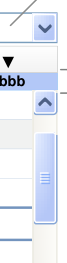

bar notification

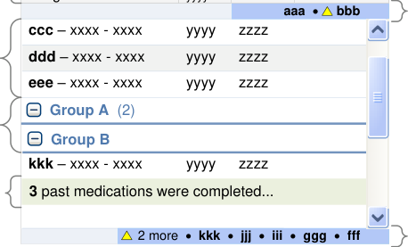

|Drug Details|yyyy|zzzz|Start ▼|Col5|
|---|---|---|---|---|
|Drug Details|yyyy|**aaa**·|**aaa**·|**     bbb**|

Medications

Group Headings

Notification

Look-ahead scroll
bar notification

Figure 4: Key Parts of a Medications List View

Copyright ©2013 Health and Social Care Information Centre

Page 14

HSCIC Controlled Document

##### **3.3.1 Tabular Layout**

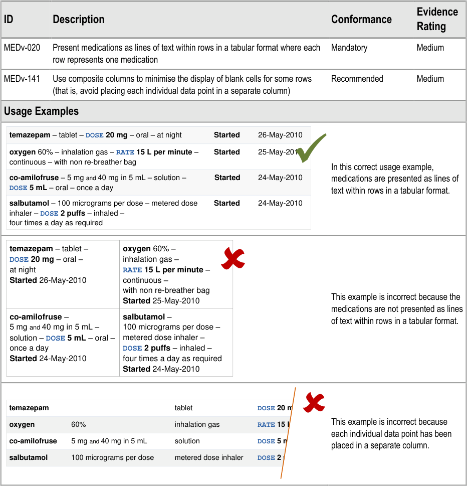

Page 15

|temazepam – tablet – DOSE 20 mg – oral – at night Started 26-May-2010|oxygen 60% – inhalation gas – RATE 15 L per minute – continuous – with non re-breather bag Started 25-May-2010|
|---|---|
|**co-amilofruse**–  5 mgand40 mg in 5 mL – solution –**`DOSE` 5 mL**– oral – once a day **Started**24-May-2010|**salbutamol**–  100 micrograms per dose – metered dose inhaler – **`DOSE` 2 puffs**– inhaled – four times a day as required **Started**24-May-2010|

Copyright ©2013 Health and Social Care Information Centre

HSCIC Controlled Document

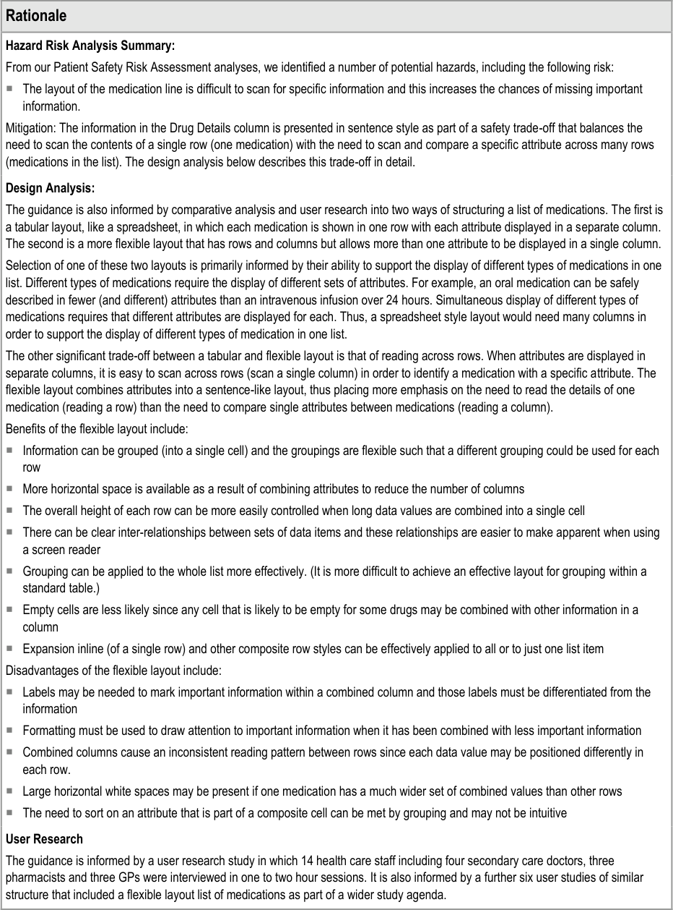

Page 16

Copyright ©2013 Health and Social Care Information Centre

HSCIC Controlled Document

##### **3.3.2 Indicating List Length**

For the sake of brevity, the usage examples in this section omit look-ahead scroll bar notifications.
Refer to sections 3.3.21 to 3.3.28 for guidance on the look-ahead scroll bar and to sections 3.3.20
and 3.3.22 for specific guidance on reserving space for and displaying the look-ahead scroll bar
notifications.

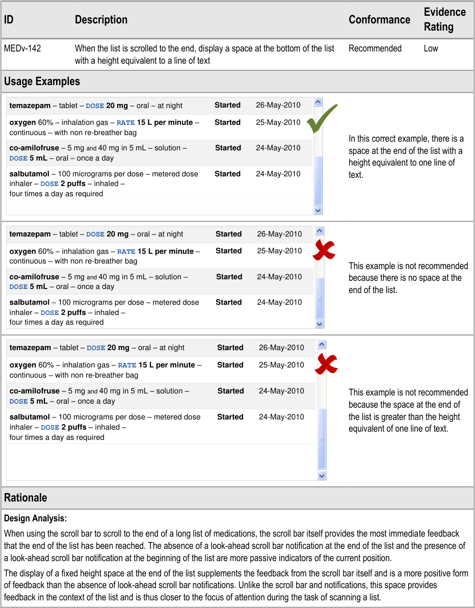

Page 17

Copyright ©2013 Health and Social Care Information Centre

HSCIC Controlled Document

##### **3.3.3 Gridlines**

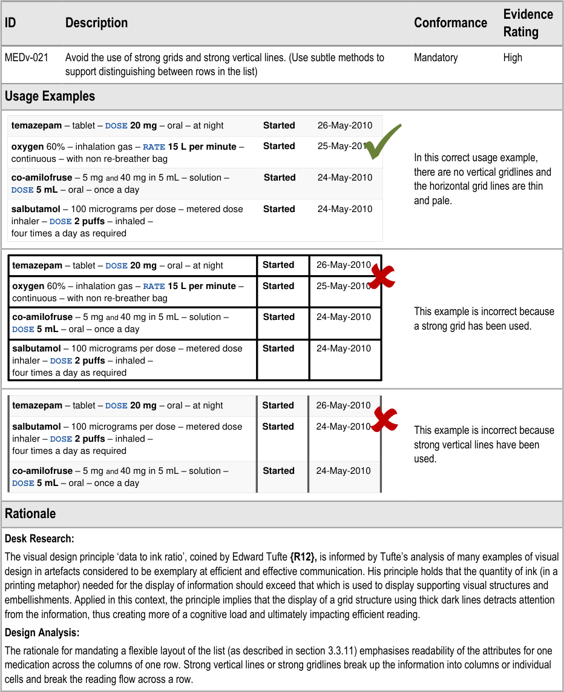

|temazepam – tablet – DOSE 20 mg – oral – at night|Started|26-May-2010|
|---|---|---|
|**oxygen** 60% – inhalation gas –**`RATE` 15 L per minute**–  continuous – with non re-breather bag|**Started**|25-May-2010|
|**co-amilofruse**– 5 mgand40 mg in 5 mL – solution – **`DOSE` 5 mL**– oral – once a day|**Started**|24-May-2010|
|**salbutamol**– 100 micrograms per dose – metered dose inhaler –**`DOSE` 2 puffs**– inhaled – four times a day as required|**Started**|24-May-2010|

|temazepam – tablet – DOSE 20 mg – oral – at night|Started|26-May-2010|
|---|---|---|
|**salbutamol**– 100 micrograms per dose – metered dose inhaler –**`DOSE` 2 puffs**– inhaled – four times a day as required|**Started**|24-May-2010|
|**co-amilofruse**– 5 mgand40 mg in 5 mL – solution – **`DOSE` 5 mL**– oral – once a day|**Started**|24-May-2010|

Page 18

Copyright ©2013 Health and Social Care Information Centre

HSCIC Controlled Document

##### **3.3.4 Row Formatting**

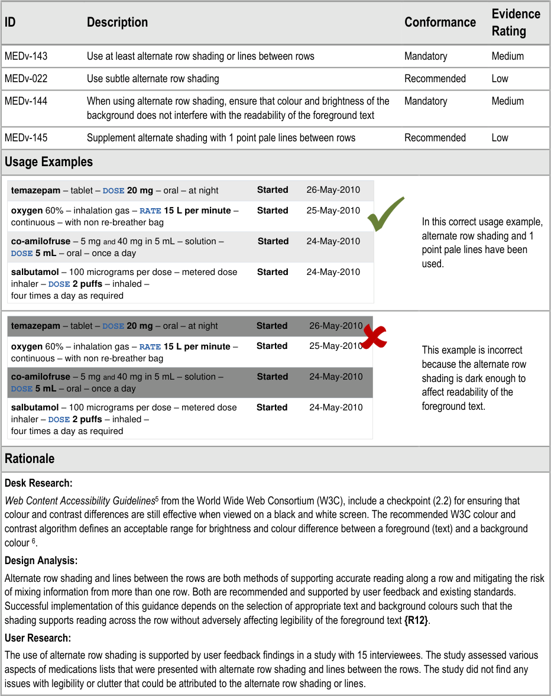

5 Web Content Accessibility Guidelines 1.0 **{R13}** [: http://www.w3.org/TR/WAI-WEBCONTENT/](http://www.w3.org/TR/WAI-WEBCONTENT/)

6 Techniques for Accessibility Evaluation and Repair Tools – Technique 2.2.1 **{R14}** :
[http://www.w3.org/TR/AERT#color-contrast](http://www.w3.org/TR/AERT#color-contrast)

Page 19

Copyright ©2013 Health and Social Care Information Centre

HSCIC Controlled Document

##### **3.3.5 Displaying Icons for Drug Details**

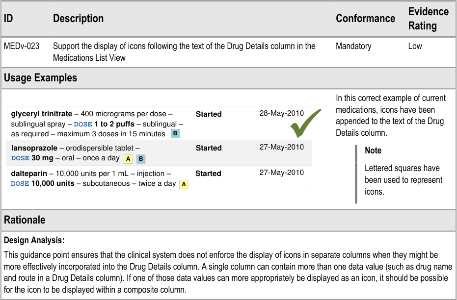

##### **3.3.6 Empty Lists**

|Drug Details|Status|
|---|---|
|_There are no current medications for this patient_|_There are no current medications for this patient_|

Page 20

Copyright ©2013 Health and Social Care Information Centre

HSCIC Controlled Document

##### **3.3.7 Mandatory Columns**

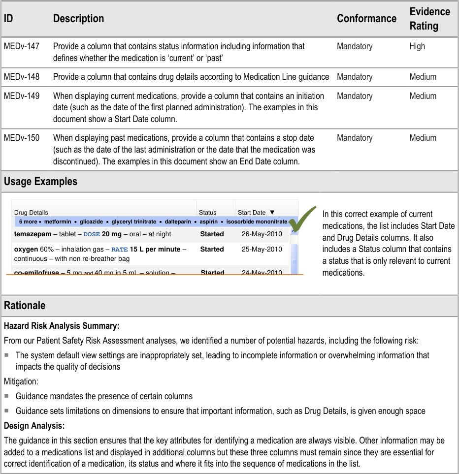

|Col1|Col2|Col3|Col4|
|---|---|---|---|
|Drug Details|Drug Details|Status|Start Date  ▼|
||**6 more**·**  metformin**·**  glicazide**·**  glyceryl trinitrate**·**  dalteparin**·**  aspirin**·**  isosorbide mononitrate**|**6 more**·**  metformin**·**  glicazide**·**  glyceryl trinitrate**·**  dalteparin**·**  aspirin**·**  isosorbide mononitrate**|**6 more**·**  metformin**·**  glicazide**·**  glyceryl trinitrate**·**  dalteparin**·**  aspirin**·**  isosorbide mononitrate**|
|25-May-2010 26-May-2010 **Started** **Started** **oxygen** 60% – inhalation gas –**`RATE` 15 L per minute**–  continuous – with non re-breather bag **temazepam**– tablet –**`DOSE` 20 mg**– oral – at night **co-amilofruse**– 5 mgand40 mg in 5 mL – solution – 24-May-2010 **Started**|25-May-2010 26-May-2010 **Started** **Started** **oxygen** 60% – inhalation gas –**`RATE` 15 L per minute**–  continuous – with non re-breather bag **temazepam**– tablet –**`DOSE` 20 mg**– oral – at night **co-amilofruse**– 5 mgand40 mg in 5 mL – solution – 24-May-2010 **Started**|25-May-2010 26-May-2010 **Started** **Started** **oxygen** 60% – inhalation gas –**`RATE` 15 L per minute**–  continuous – with non re-breather bag **temazepam**– tablet –**`DOSE` 20 mg**– oral – at night **co-amilofruse**– 5 mgand40 mg in 5 mL – solution – 24-May-2010 **Started**|25-May-2010 26-May-2010 **Started** **Started** **oxygen** 60% – inhalation gas –**`RATE` 15 L per minute**–  continuous – with non re-breather bag **temazepam**– tablet –**`DOSE` 20 mg**– oral – at night **co-amilofruse**– 5 mgand40 mg in 5 mL – solution – 24-May-2010 **Started**|
| **`DOSE` 5 mL**– oral – once a day  | **`DOSE` 5 mL**– oral – once a day  | **`DOSE` 5 mL**– oral – once a day  | **`DOSE` 5 mL**– oral – once a day  |

Page 21

Copyright ©2013 Health and Social Care Information Centre

HSCIC Controlled Document

##### **3.3.8 Date Columns**

The guidance in this section refers to date columns. The specific information to display in these
columns is not part of guidance because needs differ between tasks and contexts. Guidance is
provided for the relative placement of date columns when there are columns such as ‘Date
Prescribed’ or ‘First Administration’ that include date and time information.

In what follows, columns that contain date and time information for the start or initiation of a
medication are referred to as ‘start date’. Columns that contain date and time information for an end
or completion of a medication are referred to as ‘end date’. The guidance does not refer to the
relative placement of any other date columns (such as ‘Review Date’) that may be present.

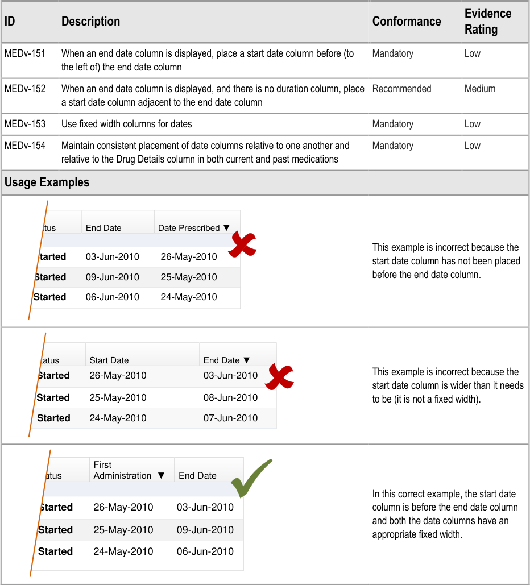

Page 22

|Col1|Status|End Date|Date Prescribed ▼|
|---|---|---|---|
|03-Jun-2010 **Started** 26-May-2010|03-Jun-2010 **Started** 26-May-2010|03-Jun-2010 **Started** 26-May-2010|03-Jun-2010 **Started** 26-May-2010|
|09-Jun-2010 **Started** 25-May-2010|09-Jun-2010 **Started** 25-May-2010|09-Jun-2010 **Started** 25-May-2010|09-Jun-2010 **Started** 25-May-2010|
|06-Jun-2010 **Started** 24-May-2010|06-Jun-2010 **Started** 24-May-2010|06-Jun-2010 **Started** 24-May-2010|06-Jun-2010 **Started** 24-May-2010|

|Col1|Status|Start Date|End Date ▼|
|---|---|---|---|
|26-May-2010 **Started** 03-Jun-2010|26-May-2010 **Started** 03-Jun-2010|26-May-2010 **Started** 03-Jun-2010|26-May-2010 **Started** 03-Jun-2010|
|25-May-2010 **Started** 08-Jun-2010|25-May-2010 **Started** 08-Jun-2010|25-May-2010 **Started** 08-Jun-2010|25-May-2010 **Started** 08-Jun-2010|
|24-May-2010 **Started** 07-Jun-2010|24-May-2010 **Started** 07-Jun-2010|24-May-2010 **Started** 07-Jun-2010|24-May-2010 **Started** 07-Jun-2010|

|Col1|Status|First Administration ▼|End Date|
|---|---|---|---|
|||||
|03-Jun-2010 **Started** 26-May-2010|03-Jun-2010 **Started** 26-May-2010|03-Jun-2010 **Started** 26-May-2010|03-Jun-2010 **Started** 26-May-2010|
|09-Jun-2010 **Started** 25-May-2010|09-Jun-2010 **Started** 25-May-2010|09-Jun-2010 **Started** 25-May-2010|09-Jun-2010 **Started** 25-May-2010|
|06-Jun-2010 **Started** 24-May-2010|06-Jun-2010 **Started** 24-May-2010|06-Jun-2010 **Started** 24-May-2010|06-Jun-2010 **Started** 24-May-2010|

Copyright ©2013 Health and Social Care Information Centre

HSCIC Controlled Document

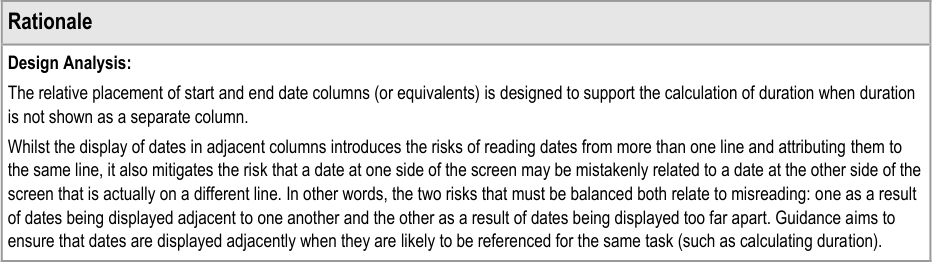

Page 23

Copyright ©2013 Health and Social Care Information Centre

HSCIC Controlled Document

##### **3.3.9 Column Headings**

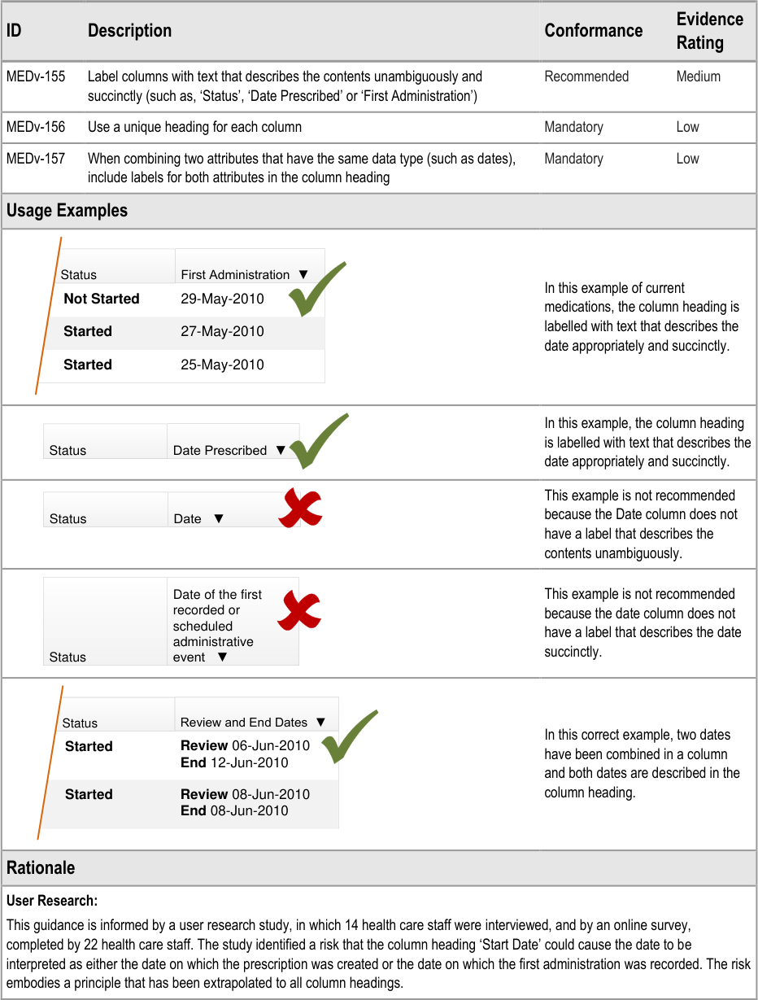

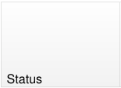

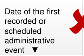

Page 24

Copyright ©2013 Health and Social Care Information Centre

HSCIC Controlled Document

##### **3.3.10 Composite Columns**

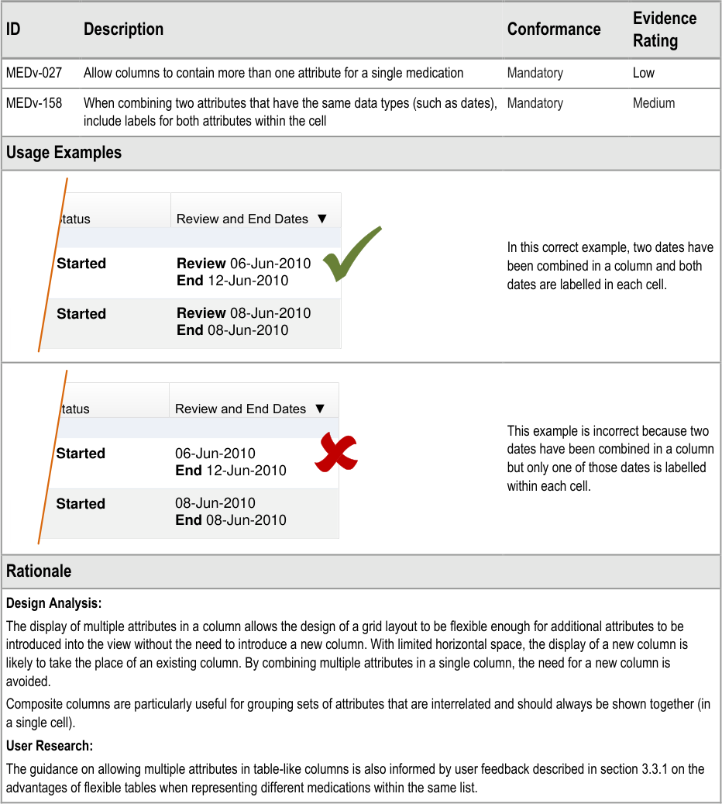

|Status Review and End Dates ▼ Started 06-Jun-2010 End 12-Jun-2010|Status|Review and End Dates ▼|
|---|---|---|
|08-Jun-2010 **End**08-Jun-2010 **Started**|08-Jun-2010 **End**08-Jun-2010 **Started**|08-Jun-2010 **End**08-Jun-2010 **Started**|

Page 25

Copyright ©2013 Health and Social Care Information Centre

HSCIC Controlled Document

##### **3.3.11 Constraining Dimensions**

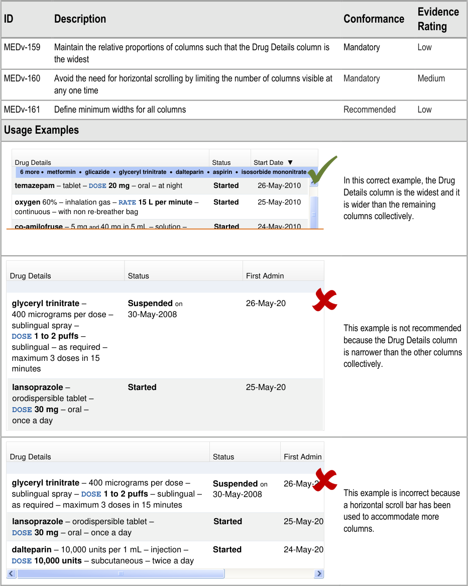

|Col1|Col2|Col3|Col4|
|---|---|---|---|
|Drug Details|Drug Details|Status|Start Date  ▼|
||**6 more**·**  metformin**·**  glicazide**·**  glyceryl trinitrate**·**  dalteparin**·**  aspirin**·**  isosorbide mononitrate**|**6 more**·**  metformin**·**  glicazide**·**  glyceryl trinitrate**·**  dalteparin**·**  aspirin**·**  isosorbide mononitrate**|**6 more**·**  metformin**·**  glicazide**·**  glyceryl trinitrate**·**  dalteparin**·**  aspirin**·**  isosorbide mononitrate**|
|25-May-2010 26-May-2010 **Started** **Started** **oxygen** 60% – inhalation gas –**`RATE` 15 L per minute**–  continuous – with non re-breather bag **temazepam**– tablet –**`DOSE` 20 mg**– oral – at night **co-amilofruse**– 5 mgand40 mg in 5 mL – solution – 24-May-2010 **Started**|25-May-2010 26-May-2010 **Started** **Started** **oxygen** 60% – inhalation gas –**`RATE` 15 L per minute**–  continuous – with non re-breather bag **temazepam**– tablet –**`DOSE` 20 mg**– oral – at night **co-amilofruse**– 5 mgand40 mg in 5 mL – solution – 24-May-2010 **Started**|25-May-2010 26-May-2010 **Started** **Started** **oxygen** 60% – inhalation gas –**`RATE` 15 L per minute**–  continuous – with non re-breather bag **temazepam**– tablet –**`DOSE` 20 mg**– oral – at night **co-amilofruse**– 5 mgand40 mg in 5 mL – solution – 24-May-2010 **Started**|25-May-2010 26-May-2010 **Started** **Started** **oxygen** 60% – inhalation gas –**`RATE` 15 L per minute**–  continuous – with non re-breather bag **temazepam**– tablet –**`DOSE` 20 mg**– oral – at night **co-amilofruse**– 5 mgand40 mg in 5 mL – solution – 24-May-2010 **Started**|
| **`DOSE` 5 mL**– oral – once a day  | **`DOSE` 5 mL**– oral – once a day  | **`DOSE` 5 mL**– oral – once a day  | **`DOSE` 5 mL**– oral – once a day  |

|Drug Details|Status|First Admin|
|---|---|---|
|**glyceryl trinitrate** – 400 micrograms per dose – sublingual spray – **`DOSE` 1 to 2 puffs**–  sublingual – as required – maximum 3 doses in 15 minutes **Suspended**on  30-May-2008 26-May-20|**glyceryl trinitrate** – 400 micrograms per dose – sublingual spray – **`DOSE` 1 to 2 puffs**–  sublingual – as required – maximum 3 doses in 15 minutes **Suspended**on  30-May-2008 26-May-20|**glyceryl trinitrate** – 400 micrograms per dose – sublingual spray – **`DOSE` 1 to 2 puffs**–  sublingual – as required – maximum 3 doses in 15 minutes **Suspended**on  30-May-2008 26-May-20|
|**lansoprazole** – orodispersible tablet – **`DOSE` 30 mg**– oral – once a day **Started** 25-May-20|**lansoprazole** – orodispersible tablet – **`DOSE` 30 mg**– oral – once a day **Started** 25-May-20|**lansoprazole** – orodispersible tablet – **`DOSE` 30 mg**– oral – once a day **Started** 25-May-20|

Page 26

|Drug Details|Status|First Admin|
|---|---|---|
|**glyceryl trinitrate** – 400 micrograms per dose – sublingual spray –**`DOSE` 1 to 2 puffs**– sublingual – as required – maximum 3 doses in 15 minutes **Suspended**on  30-May-2008 26-May-20|**glyceryl trinitrate** – 400 micrograms per dose – sublingual spray –**`DOSE` 1 to 2 puffs**– sublingual – as required – maximum 3 doses in 15 minutes **Suspended**on  30-May-2008 26-May-20|**glyceryl trinitrate** – 400 micrograms per dose – sublingual spray –**`DOSE` 1 to 2 puffs**– sublingual – as required – maximum 3 doses in 15 minutes **Suspended**on  30-May-2008 26-May-20|
|**lansoprazole** – orodispersible tablet – **`DOSE` 30 mg**– oral – once a day **Started** 25-May-20|**lansoprazole** – orodispersible tablet – **`DOSE` 30 mg**– oral – once a day **Started** 25-May-20|**lansoprazole** – orodispersible tablet – **`DOSE` 30 mg**– oral – once a day **Started** 25-May-20|
|**dalteparin** – 10,000 units per 1 mL – injection – **`DOSE` 10,000 units**– subcutaneous – twice a day **Started** 24-May-20|**dalteparin** – 10,000 units per 1 mL – injection – **`DOSE` 10,000 units**– subcutaneous – twice a day **Started** 24-May-20|**dalteparin** – 10,000 units per 1 mL – injection – **`DOSE` 10,000 units**– subcutaneous – twice a day **Started** 24-May-20|

Copyright ©2013 Health and Social Care Information Centre

HSCIC Controlled Document

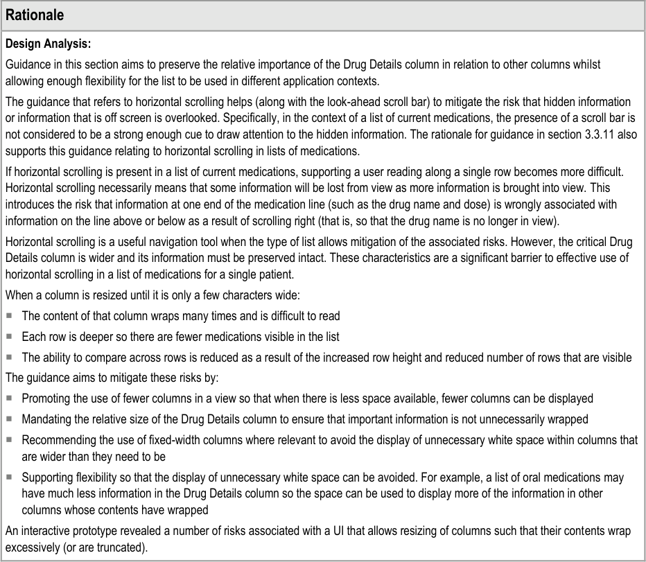

Page 27

Copyright ©2013 Health and Social Care Information Centre

HSCIC Controlled Document

##### **3.3.12 Displaying Status**

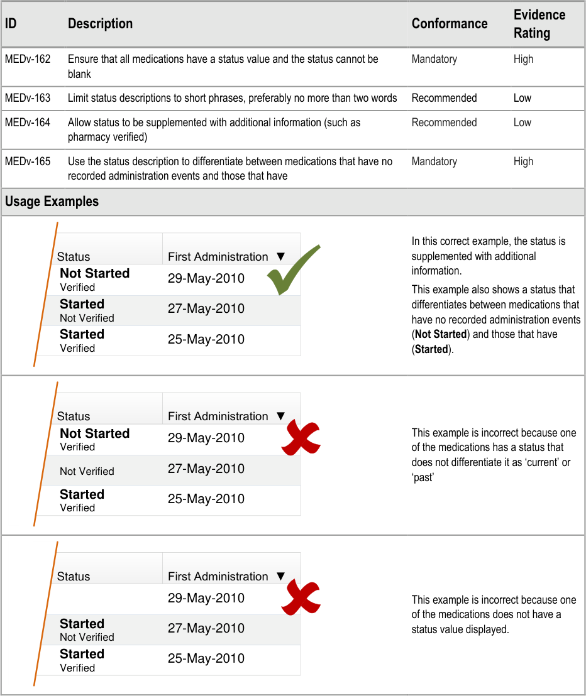

Page 28

|Status First Administration ▼ Not Started 29-May-2010 Verified|Status|First Administration ▼|
|---|---|---|
|27-May-2010 **Started** Not Verified|27-May-2010 **Started** Not Verified|27-May-2010 **Started** Not Verified|
|25-May-2010 **Started** Verified|25-May-2010 **Started** Verified|25-May-2010 **Started** Verified|

|Status First Administration ▼ Not Started 29-May-2010 Verified|Status|First Administration ▼|
|---|---|---|
|27-May-2010 Not Verified|27-May-2010 Not Verified|27-May-2010 Not Verified|
|25-May-2010 **Started** Verified|25-May-2010 **Started** Verified|25-May-2010 **Started** Verified|

|Status First Administration ▼ 29-May-2010|Status|First Administration ▼|
|---|---|---|
|27-May-2010 **Started** Not Verified|27-May-2010 **Started** Not Verified|27-May-2010 **Started** Not Verified|
|25-May-2010 **Started** Verified|25-May-2010 **Started** Verified|25-May-2010 **Started** Verified|

Copyright ©2013 Health and Social Care Information Centre

HSCIC Controlled Document

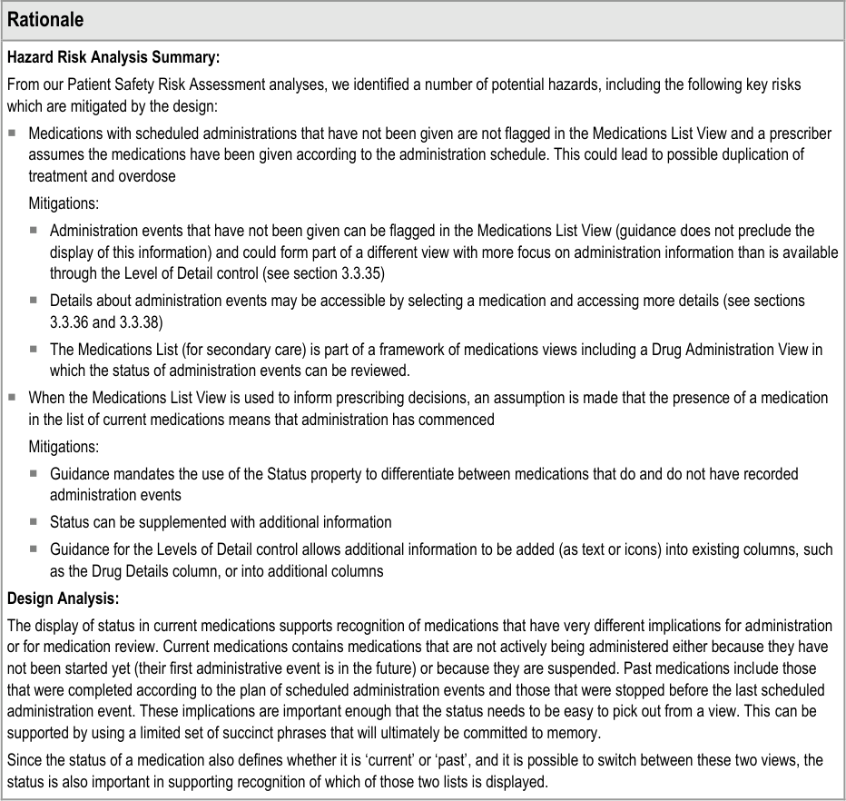

Page 29

Copyright ©2013 Health and Social Care Information Centre

HSCIC Controlled Document

##### **3.3.13 Specific Status Values**

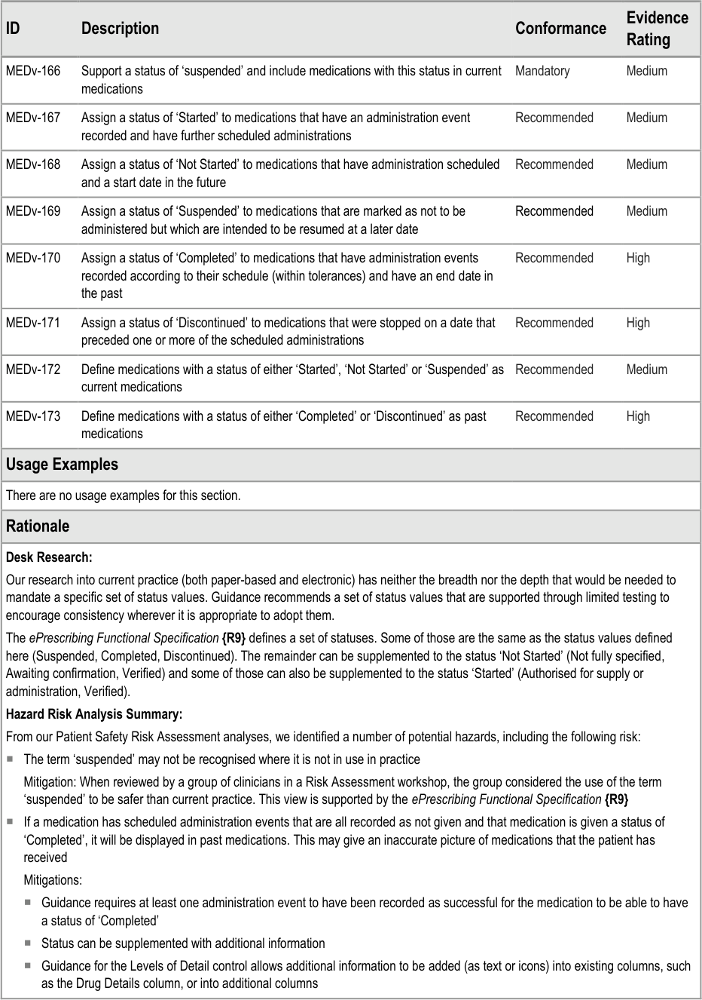

Page 30

Copyright ©2013 Health and Social Care Information Centre

HSCIC Controlled Document

**Design Analysis:**

This guidance aims to introduce a set of status values that::

 Are more detailed than simply ‘current’ and ‘past’

 Are relevant to all care settings and can be supplemented to add granularity

 Can be used in conjunction with other, more granular sets of status values.

Copyright ©2013 Health and Social Care Information Centre

Page 31

HSCIC Controlled Document

##### **3.3.14 Formatting Status**

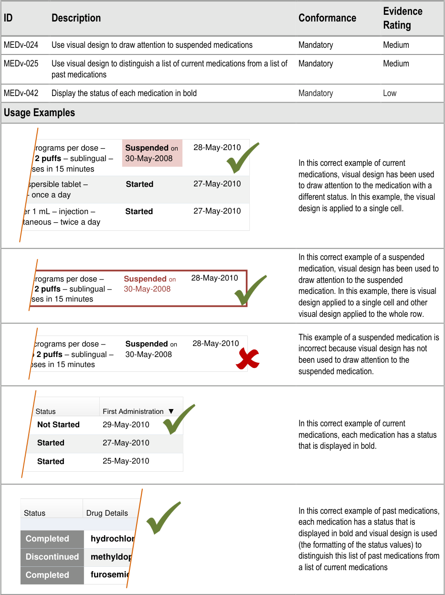

Page 32

|Status First Administration ▼ Not Started 29-May-2010|Status|First Administration ▼|
|---|---|---|
|27-May-2010 **Started**|27-May-2010 **Started**|27-May-2010 **Started**|
|25-May-2010 **Started**|25-May-2010 **Started**|25-May-2010 **Started**|

|Status|Drug Details|
|---|---|
|||
|**hydrochloro** **Completed**|**hydrochloro** **Completed**|
|**methyldopa** – **Discontinued**|**methyldopa** – **Discontinued**|
|**furosemide** – **Completed**|**furosemide** – **Completed**|

Copyright ©2013 Health and Social Care Information Centre

HSCIC Controlled Document

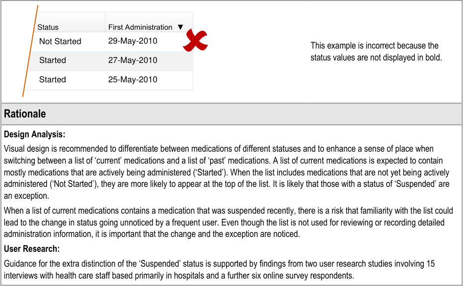

|Status First Administration ▼ Not Started 29-May-2010|Status|First Administration ▼|
|---|---|---|
|27-May-2010 Started|27-May-2010 Started|27-May-2010 Started|
|25-May-2010 Started|25-May-2010 Started|25-May-2010 Started|

Page 33

Copyright ©2013 Health and Social Care Information Centre

HSCIC Controlled Document

##### **3.3.15 Controls for Displaying Current and Past Medications**

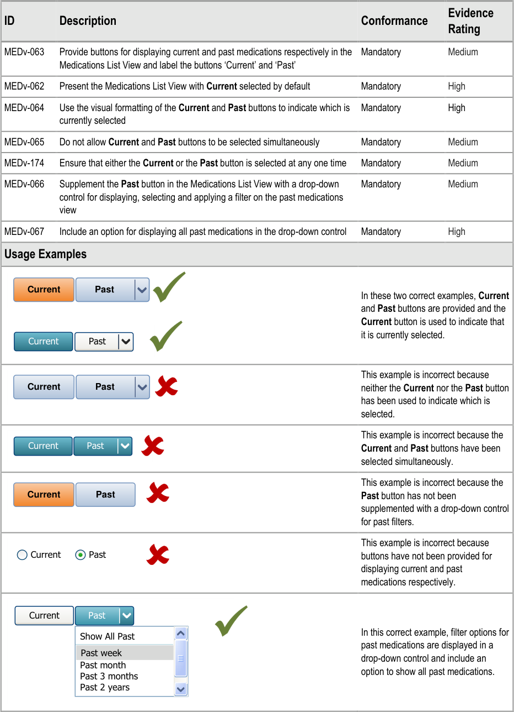

Page 34

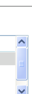

Copyright ©2013 Health and Social Care Information Centre

HSCIC Controlled Document

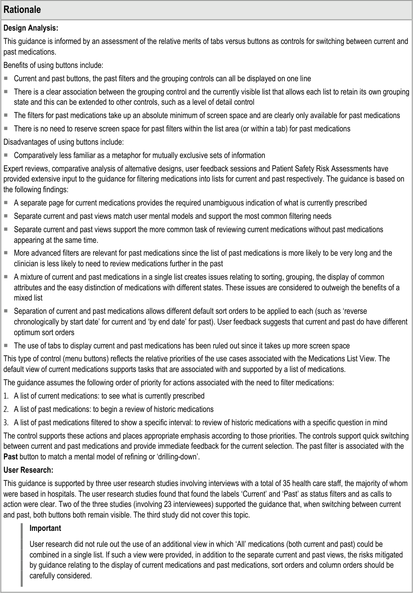

Page 35

Copyright ©2013 Health and Social Care Information Centre

HSCIC Controlled Document

##### **3.3.16 Displaying Current Medications**

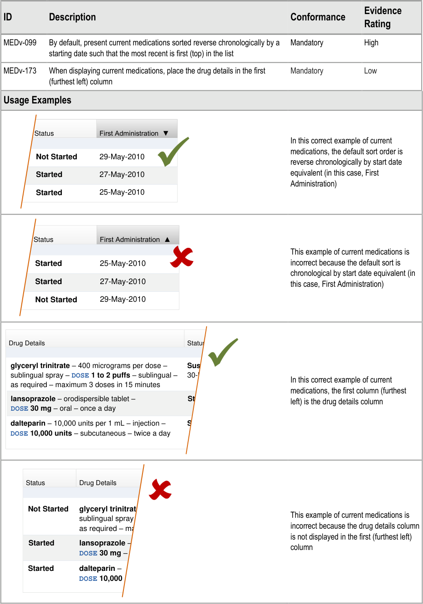

Page 36

|Status First Administration ▼ Not Started 29-May-2010|Status|First Administration ▼|
|---|---|---|
|27-May-2010 **Started**|27-May-2010 **Started**|27-May-2010 **Started**|
|25-May-2010 **Started**|25-May-2010 **Started**|25-May-2010 **Started**|

|Status First Administration ▲ Started 25-May-2010|Status|First Administration ▲|
|---|---|---|
|27-May-2010 **Started**|27-May-2010 **Started**|27-May-2010 **Started**|
|29-May-2010 **Not Started**|29-May-2010 **Not Started**|29-May-2010 **Not Started**|

|Drug Details|Status|
|---|---|
|**glyceryl trinitrate** – 400 micrograms per dose – sublingual spray –**`DOSE` 1 to 2 puffs**– sublingual – as required – maximum 3 doses in 15 minutes **Suspen** 30-May|**glyceryl trinitrate** – 400 micrograms per dose – sublingual spray –**`DOSE` 1 to 2 puffs**– sublingual – as required – maximum 3 doses in 15 minutes **Suspen** 30-May|
|**lansoprazole** – orodispersible tablet – **`DOSE` 30 mg**– oral – once a day **Started**|**lansoprazole** – orodispersible tablet – **`DOSE` 30 mg**– oral – once a day **Started**|
|**dalteparin** – 10,000 units per 1 mL – injection – **`DOSE` 10,000 units**– subcutaneous – twice a day **Started**|**dalteparin** – 10,000 units per 1 mL – injection – **`DOSE` 10,000 units**– subcutaneous – twice a day **Started**|

|Status|Drug Details|
|---|---|
|**Started** **Not Started** **Started** **glyceryl trinitrate**  sublingual spray as required – max **lansoprazole** – **`DOSE` 30 mg**–  **dalteparin** – **`DOSE` 10,000**|**Started** **Not Started** **Started** **glyceryl trinitrate**  sublingual spray as required – max **lansoprazole** – **`DOSE` 30 mg**–  **dalteparin** – **`DOSE` 10,000**|

Copyright ©2013 Health and Social Care Information Centre

HSCIC Controlled Document

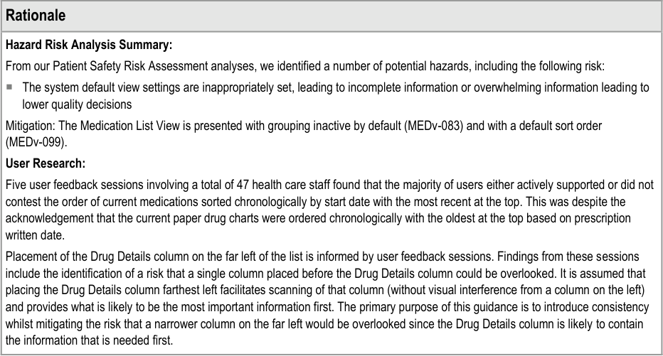

Page 37

Copyright ©2013 Health and Social Care Information Centre

HSCIC Controlled Document

##### **3.3.17 Displaying Recent Past Notifications**

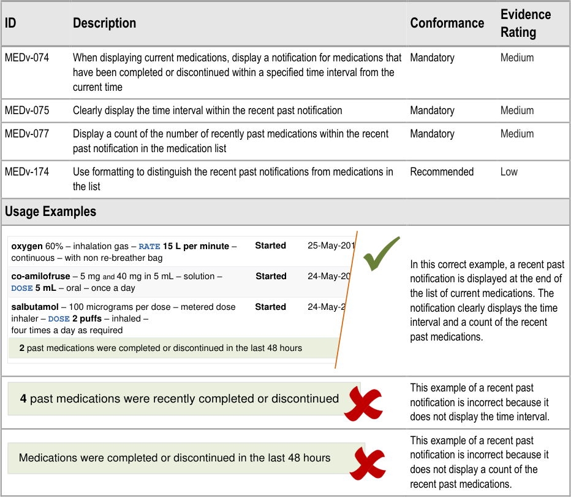

Page 38

Copyright ©2013 Health and Social Care Information Centre

HSCIC Controlled Document

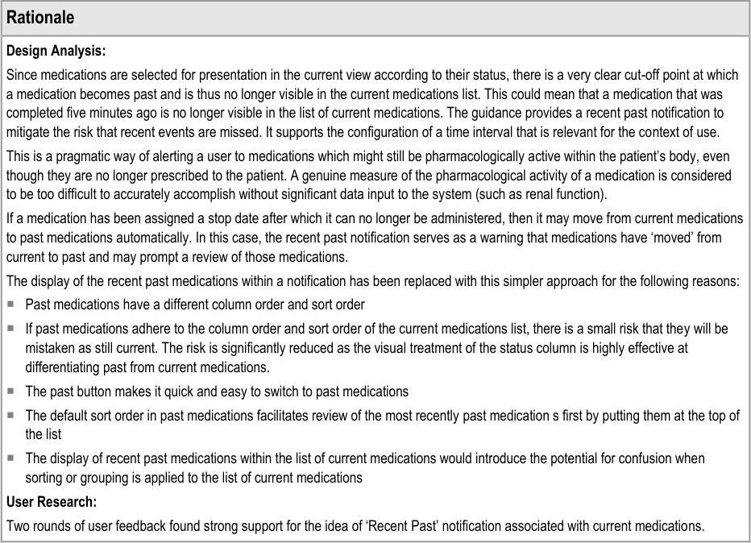

Page 39

Copyright ©2013 Health and Social Care Information Centre

HSCIC Controlled Document

##### **3.3.18 Displaying Past Medications**

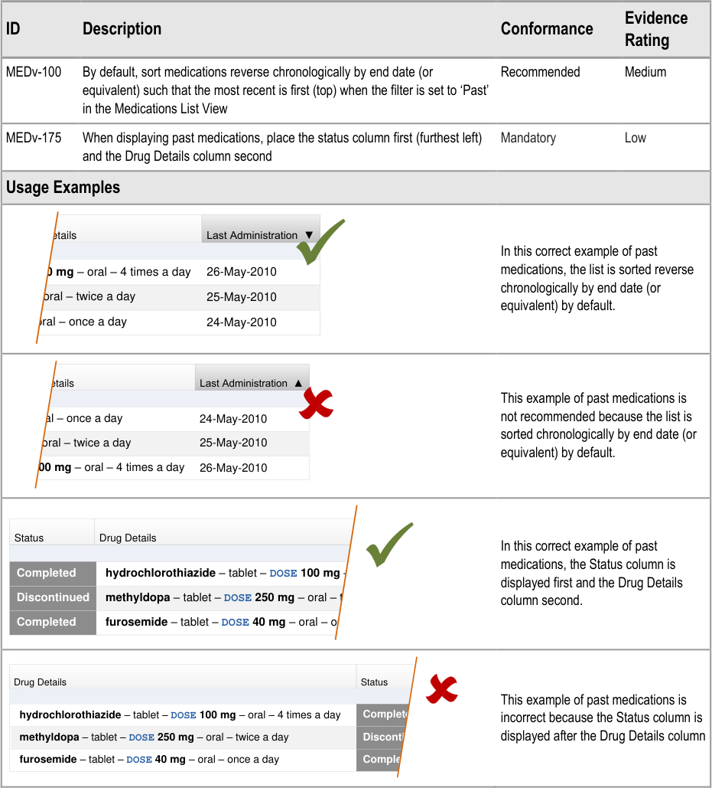

Page 40

|Drug Details|Last Administration ▼|
|---|---|
|||
|26-May-2010 **`E` 100 mg** – oral – 4 times a day|26-May-2010 **`E` 100 mg** – oral – 4 times a day|
|**g** – oral – twice a day 25-May-2010|**g** – oral – twice a day 25-May-2010|
|24-May-2010  – oral – once a day|24-May-2010  – oral – once a day|

|Drug Details|Last Administration ▲|
|---|---|
|||
|24-May-2010  – oral – once a day|24-May-2010  – oral – once a day|
|**g** – oral – twice a day 25-May-2010|**g** – oral – twice a day 25-May-2010|
|26-May-2010 **`E` 100 mg** – oral – 4 times a day|26-May-2010 **`E` 100 mg** – oral – 4 times a day|

|Status|Drug Details|
|---|---|
|**hydrochlorothiazide** – tablet –**`DOSE` 100 mg** – ora **Completed**|**hydrochlorothiazide** – tablet –**`DOSE` 100 mg** – ora **Completed**|
|**methyldopa** – tablet –**`DOSE` 250 mg** – oral – twice **Discontinued**|**methyldopa** – tablet –**`DOSE` 250 mg** – oral – twice **Discontinued**|
|**furosemide** – tablet –**`DOSE` 40 mg** – oral – once a **Completed**|**furosemide** – tablet –**`DOSE` 40 mg** – oral – once a **Completed**|

|Drug Details|Status|Col3|
|---|---|---|
||||
|**hydrochlorothiazide** – tablet –**`DOSE` 100 mg** – oral – 4 times a day **Completed**|**hydrochlorothiazide** – tablet –**`DOSE` 100 mg** – oral – 4 times a day **Completed**|**hydrochlorothiazide** – tablet –**`DOSE` 100 mg** – oral – 4 times a day **Completed**|
|**methyldopa** – tablet –**`DOSE` 250 mg** – oral – twice a day **Discontinue**|**methyldopa** – tablet –**`DOSE` 250 mg** – oral – twice a day **Discontinue**|**methyldopa** – tablet –**`DOSE` 250 mg** – oral – twice a day **Discontinue**|
|**furosemide** – tablet –**`DOSE` 40 mg** – oral – once a day **Completed**|**furosemide** – tablet –**`DOSE` 40 mg** – oral – once a day **Completed**|**furosemide** – tablet –**`DOSE` 40 mg** – oral – once a day **Completed**|

Copyright ©2013 Health and Social Care Information Centre

HSCIC Controlled Document

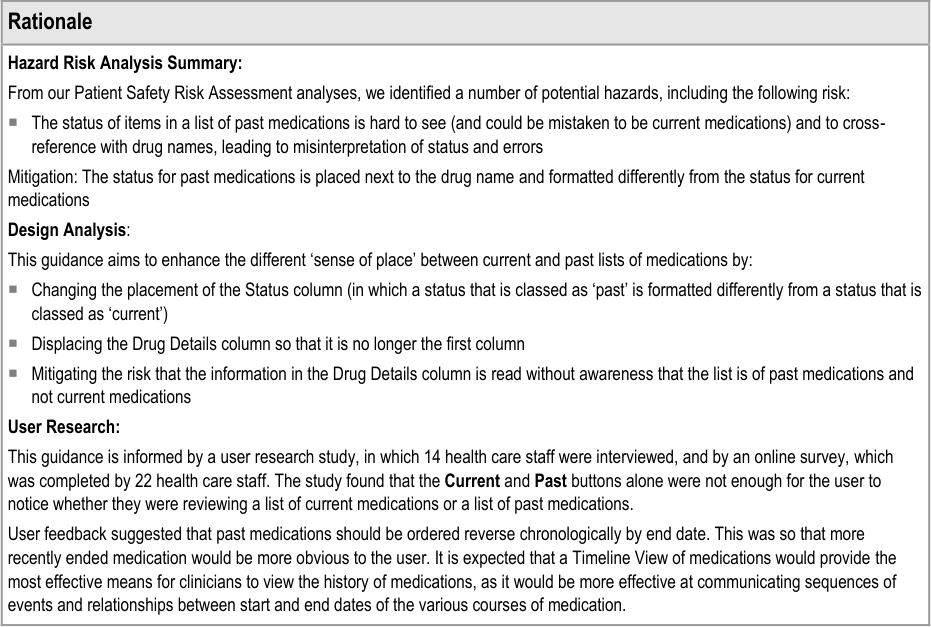

Page 41

Copyright ©2013 Health and Social Care Information Centre

HSCIC Controlled Document

##### **3.3.19 Filtering Past Medications**

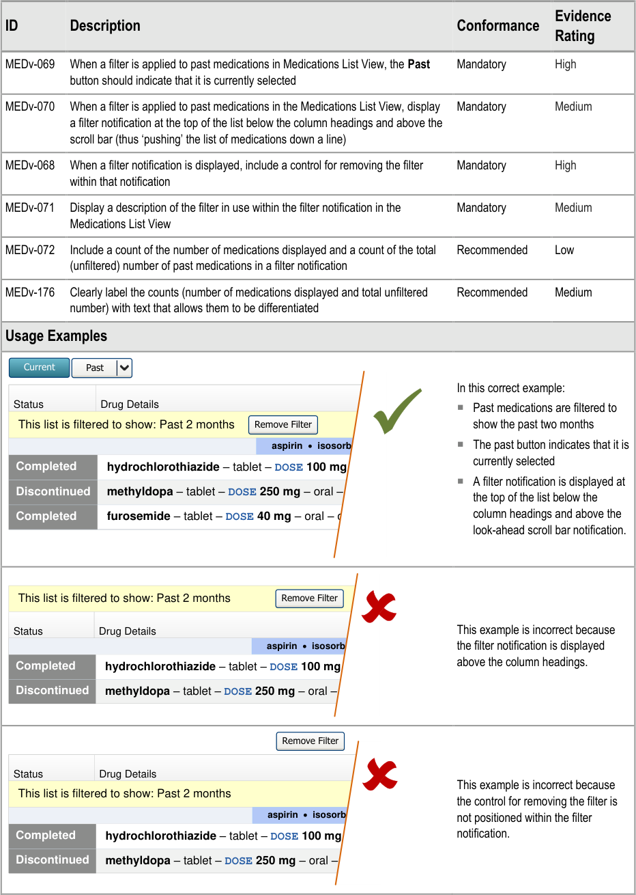

Page 42

|Status|Drug Details|Col3|Col4|
|---|---|---|---|
|This list is filtered to show: Past 2 months Remove Filter|This list is filtered to show: Past 2 months Remove Filter|This list is filtered to show: Past 2 months Remove Filter||
|||**aspirin**·**  isosorbide**||
|**hydrochlorothiazide** – tablet –**`DOSE` 100 mg** – ora **Completed**|**hydrochlorothiazide** – tablet –**`DOSE` 100 mg** – ora **Completed**|**hydrochlorothiazide** – tablet –**`DOSE` 100 mg** – ora **Completed**||
|**methyldopa** – tablet –**`DOSE` 250 mg** – oral – twice **Discontinued**|**methyldopa** – tablet –**`DOSE` 250 mg** – oral – twice **Discontinued**|**methyldopa** – tablet –**`DOSE` 250 mg** – oral – twice **Discontinued**||
|**furosemide** – tablet –**`DOSE` 40 mg** – oral – once a **Completed**|**furosemide** – tablet –**`DOSE` 40 mg** – oral – once a **Completed**|**furosemide** – tablet –**`DOSE` 40 mg** – oral – once a **Completed**||

|This list is filtered to show: Past 2 months Remove Filter|Col2|Col3|Col4|
|---|---|---|---|
|Status|Drug Details|Drug Details||
|||**aspirin**·**  isosorbide**||
|**hydrochlorothiazide** – tablet –**`DOSE` 100 mg** – ora **Completed**|**hydrochlorothiazide** – tablet –**`DOSE` 100 mg** – ora **Completed**|**hydrochlorothiazide** – tablet –**`DOSE` 100 mg** – ora **Completed**||
|**methyldopa** – tablet –**`DOSE` 250 mg** – oral – twice **Discontinued**|**methyldopa** – tablet –**`DOSE` 250 mg** – oral – twice **Discontinued**|**methyldopa** – tablet –**`DOSE` 250 mg** – oral – twice **Discontinued**||

|Status|Drug Details|Col3|Col4|
|---|---|---|---|
|This list is filtered to show: Past 2 months|This list is filtered to show: Past 2 months|This list is filtered to show: Past 2 months||
|||**aspirin**·**  isosorbide**||
|**hydrochlorothiazide** – tablet –**`DOSE` 100 mg** – ora **Completed**|**hydrochlorothiazide** – tablet –**`DOSE` 100 mg** – ora **Completed**|**hydrochlorothiazide** – tablet –**`DOSE` 100 mg** – ora **Completed**||
|**methyldopa** – tablet –**`DOSE` 250 mg** – oral – twice **Discontinued**|**methyldopa** – tablet –**`DOSE` 250 mg** – oral – twice **Discontinued**|**methyldopa** – tablet –**`DOSE` 250 mg** – oral – twice **Discontinued**||

Copyright ©2013 Health and Social Care Information Centre

HSCIC Controlled Document

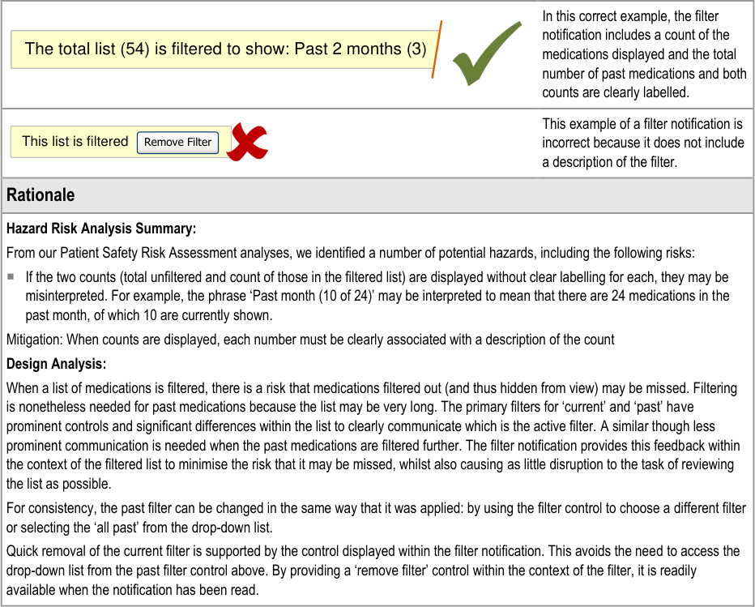

Page 43

Copyright ©2013 Health and Social Care Information Centre

HSCIC Controlled Document

##### **3.3.20 Displaying a LASB**

Sections 3.3.20 to 3.3.28 include guidance for look-ahead scroll bars. A look-ahead scroll bar is a
standard scroll bar that is supplemented with notifications at the top and bottom to indicate that

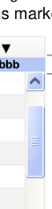

Look-ahead scroll
bar notification

Look-ahead scroll bar

Look-ahead scroll
bar notification

Medications

|Drug Details|Col2|yyyy|zzzz|Start ▼|Col6|
|---|---|---|---|---|---|
||||**aaa**·|**aaa**·|**   bbb**|
|**ddd**– xxxx - xxxx **eee**– xxxx - xxxx **ccc**– xxxx - xxxx yyyy zzzz yyyy zzzz yyyy zzzz  **fff**– xxxx - xxxx yyyy zzzz **ggg**– xxxx - xxxx yyyy zzzz **hhh**– xxxx - xxxx yyyy zzzz **iii**– xxxx - xxxx yyyy zzzz **jjj**– xxxx - xxxx yyyy zzzz|**ddd**– xxxx - xxxx **eee**– xxxx - xxxx **ccc**– xxxx - xxxx yyyy zzzz yyyy zzzz yyyy zzzz  **fff**– xxxx - xxxx yyyy zzzz **ggg**– xxxx - xxxx yyyy zzzz **hhh**– xxxx - xxxx yyyy zzzz **iii**– xxxx - xxxx yyyy zzzz **jjj**– xxxx - xxxx yyyy zzzz|**ddd**– xxxx - xxxx **eee**– xxxx - xxxx **ccc**– xxxx - xxxx yyyy zzzz yyyy zzzz yyyy zzzz  **fff**– xxxx - xxxx yyyy zzzz **ggg**– xxxx - xxxx yyyy zzzz **hhh**– xxxx - xxxx yyyy zzzz **iii**– xxxx - xxxx yyyy zzzz **jjj**– xxxx - xxxx yyyy zzzz|**ddd**– xxxx - xxxx **eee**– xxxx - xxxx **ccc**– xxxx - xxxx yyyy zzzz yyyy zzzz yyyy zzzz  **fff**– xxxx - xxxx yyyy zzzz **ggg**– xxxx - xxxx yyyy zzzz **hhh**– xxxx - xxxx yyyy zzzz **iii**– xxxx - xxxx yyyy zzzz **jjj**– xxxx - xxxx yyyy zzzz|**ddd**– xxxx - xxxx **eee**– xxxx - xxxx **ccc**– xxxx - xxxx yyyy zzzz yyyy zzzz yyyy zzzz  **fff**– xxxx - xxxx yyyy zzzz **ggg**– xxxx - xxxx yyyy zzzz **hhh**– xxxx - xxxx yyyy zzzz **iii**– xxxx - xxxx yyyy zzzz **jjj**– xxxx - xxxx yyyy zzzz|**ddd**– xxxx - xxxx **eee**– xxxx - xxxx **ccc**– xxxx - xxxx yyyy zzzz yyyy zzzz yyyy zzzz  **fff**– xxxx - xxxx yyyy zzzz **ggg**– xxxx - xxxx yyyy zzzz **hhh**– xxxx - xxxx yyyy zzzz **iii**– xxxx - xxxx yyyy zzzz **jjj**– xxxx - xxxx yyyy zzzz|
||2 more ·** ooo**·** nnn**·** mmm **·** lll**·** kkk**|2 more ·** ooo**·** nnn**·** mmm **·** lll**·** kkk**|2 more ·** ooo**·** nnn**·** mmm **·** lll**·** kkk**|2 more ·** ooo**·** nnn**·** mmm **·** lll**·** kkk**|2 more ·** ooo**·** nnn**·** mmm **·** lll**·** kkk**|

Alert icon

Figure 5: Diagram of a Medication List View with Look-ahead Scroll Bars

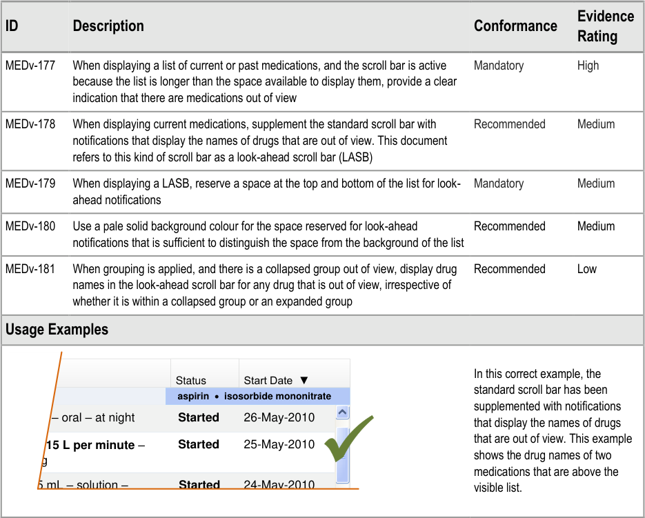

Page 44

|Col1|Col2|Status|Start Date ▼|
|---|---|---|---|
||**aspirin**·**  isosorbide mononitrate**|**aspirin**·**  isosorbide mononitrate**|**aspirin**·**  isosorbide mononitrate**|
|25-May-2010 26-May-2010 **Started** **Started** **`ATE` 15 L per minute**–   bag **0 mg**– oral – at night  in 5 mL – solution – 24-May-2010 **Started**|25-May-2010 26-May-2010 **Started** **Started** **`ATE` 15 L per minute**–   bag **0 mg**– oral – at night  in 5 mL – solution – 24-May-2010 **Started**|25-May-2010 26-May-2010 **Started** **Started** **`ATE` 15 L per minute**–   bag **0 mg**– oral – at night  in 5 mL – solution – 24-May-2010 **Started**|25-May-2010 26-May-2010 **Started** **Started** **`ATE` 15 L per minute**–   bag **0 mg**– oral – at night  in 5 mL – solution – 24-May-2010 **Started**|

Copyright ©2013 Health and Social Care Information Centre

HSCIC Controlled Document

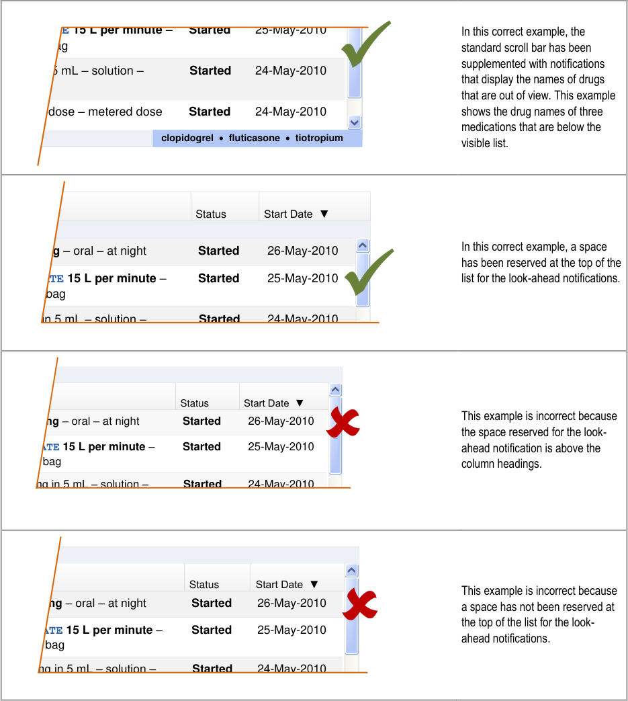

Page 45

|TE 15 L per minute – Started 25-May-2010 ag 5 mL – solution – Started 24-May-2010 r dose – metered dose Started 24-May-2010|Col2|
|---|---|
|25-May-2010 **Started** 24-May-2010 **Started** **`TE` 15 L per minute**–  ag r dose – metered dose    5 mL – solution – 24-May-2010 **Started** ||
||**clopidogrel**·**  fluticasone**·**  tiotropium**|

|Col1|Status|Start Date ▼|
|---|---|---|
|25-May-2010 26-May-2010 **Started** **Started**  **`RATE` 15 L per minute**–  er bag **mg**– oral – at night  in 5 mL – solution – 24-May-2010 **Started**|25-May-2010 26-May-2010 **Started** **Started**  **`RATE` 15 L per minute**–  er bag **mg**– oral – at night  in 5 mL – solution – 24-May-2010 **Started**|25-May-2010 26-May-2010 **Started** **Started**  **`RATE` 15 L per minute**–  er bag **mg**– oral – at night  in 5 mL – solution – 24-May-2010 **Started**|

|Col1|Col2|Col3|
|---|---|---|
||Status|Start Date  ▼|
|25-May-2010 26-May-2010 **Started** **Started**  **`RATE` 15 L per minute**–  er bag ** mg**– oral – at night  mg in 5 mL – solution – 24-May-2010 **Started**|25-May-2010 26-May-2010 **Started** **Started**  **`RATE` 15 L per minute**–  er bag ** mg**– oral – at night  mg in 5 mL – solution – 24-May-2010 **Started**|25-May-2010 26-May-2010 **Started** **Started**  **`RATE` 15 L per minute**–  er bag ** mg**– oral – at night  mg in 5 mL – solution – 24-May-2010 **Started**|

|Col1|Col2|Col3|
|---|---|---|
||Status|Start Date  ▼|
|25-May-2010 26-May-2010 **Started** **Started**  **`RATE` 15 L per minute**–  er bag ** mg**– oral – at night  mg in 5 mL – solution – 24-May-2010 **Started**|25-May-2010 26-May-2010 **Started** **Started**  **`RATE` 15 L per minute**–  er bag ** mg**– oral – at night  mg in 5 mL – solution – 24-May-2010 **Started**|25-May-2010 26-May-2010 **Started** **Started**  **`RATE` 15 L per minute**–  er bag ** mg**– oral – at night  mg in 5 mL – solution – 24-May-2010 **Started**|

Copyright ©2013 Health and Social Care Information Centre

HSCIC Controlled Document

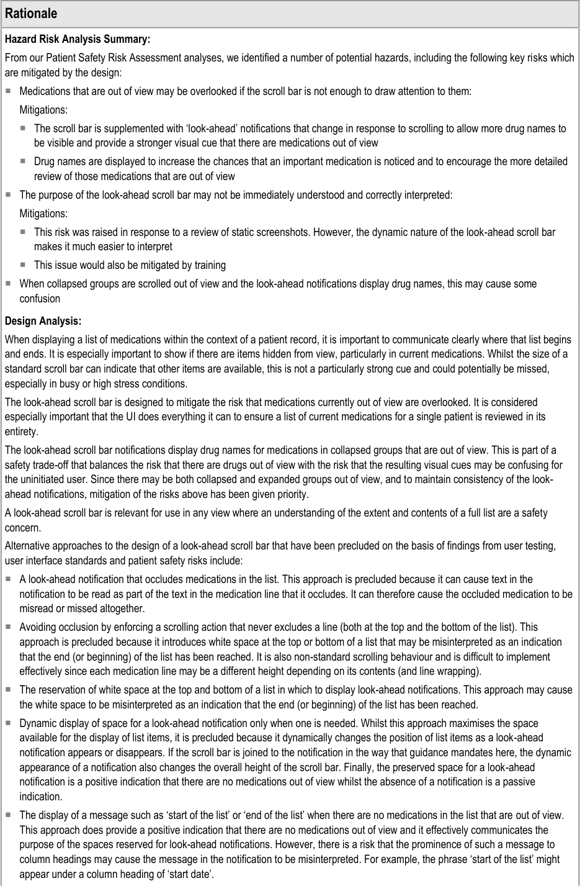

Page 46

Copyright ©2013 Health and Social Care Information Centre

HSCIC Controlled Document

Reserving space for the look-ahead scroll bar achieves the following:

 The scroll bar and look-ahead notifications have fixed positions so there is no impact from the resizing or repositioning of the scroll

bar or the contents of the list as the notifications appear and disappear

 The look-ahead notification cannot overlap a medication in the list, so some of the risks associated with occlusion are mitigated

 A clearer definition of when a medication should appear in the notification can be achieved

**User Feedback:**

The guidance is supported by a user feedback study with nine health care staff that showed strong support for a mechanism of
indicating that there are medications out of view. The look-ahead scroll bar is the example mechanism that was used in this study. The
guidance is also supported by an iterative assessment of an interactive prototype.

Page 47

Copyright ©2013 Health and Social Care Information Centre

HSCIC Controlled Document

##### **3.3.21 Defining LASB Interactions**

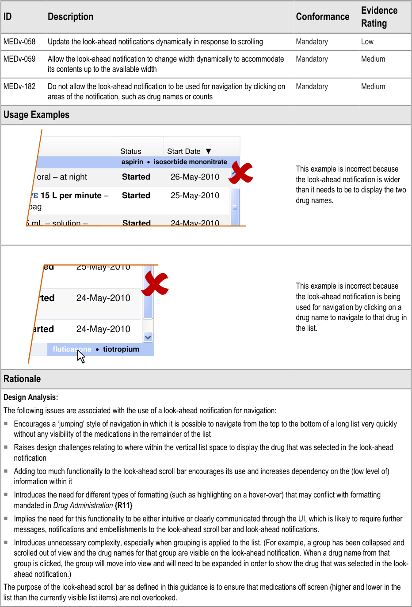

|Col1|Col2|Status|Start Date ▼|
|---|---|---|---|
|**aspirin**·**  isosorbide mononitrate**|**aspirin**·**  isosorbide mononitrate**|**aspirin**·**  isosorbide mononitrate**|**aspirin**·**  isosorbide mononitrate**|
|25-May-2010 26-May-2010 **Started** **Started** **`RATE` 15 L per minute**–  er bag  – oral – at night 24-May-2010 **Started**  in 5 mL – solution –|25-May-2010 26-May-2010 **Started** **Started** **`RATE` 15 L per minute**–  er bag  – oral – at night 24-May-2010 **Started**  in 5 mL – solution –|25-May-2010 26-May-2010 **Started** **Started** **`RATE` 15 L per minute**–  er bag  – oral – at night 24-May-2010 **Started**  in 5 mL – solution –|25-May-2010 26-May-2010 **Started** **Started** **`RATE` 15 L per minute**–  er bag  – oral – at night 24-May-2010 **Started**  in 5 mL – solution –|

|S S S|Col2|Col3|
|---|---|---|
|**S** **S** **S**|25-May-2010 **tarted** 24-May-2010 **tarted** 24-May-2010 **tarted** |25-May-2010 **tarted** 24-May-2010 **tarted** 24-May-2010 **tarted** |
|**S** **S** **S**|25-May-2010 **tarted** 24-May-2010 **tarted** 24-May-2010 **tarted** ||
|**S** **S** **S**||**fluticasone  **·**  tiotropium**|

Page 48

Copyright ©2013 Health and Social Care Information Centre

HSCIC Controlled Document

**User Research:**

The use of look-ahead notifications to support navigation has been explored extensively in user research studies, including a study
with an interactive prototype. It has also been explored extensively through the assessment of design alternatives.

Page 49

Copyright ©2013 Health and Social Care Information Centre

HSCIC Controlled Document

##### **3.3.22 Displaying LASB Notifications**

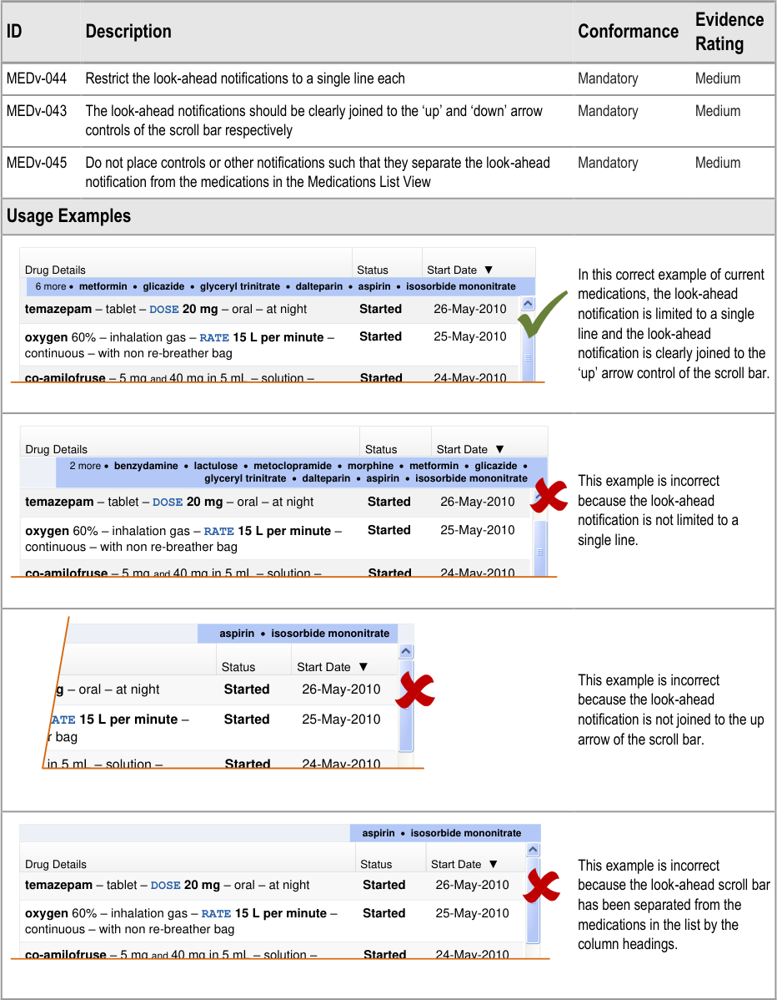

Page 50

|Col1|Col2|Col3|
|---|---|---|
|Drug Details|Status|Start Date  ▼|
|6 more·**  metformin**·**  glicazide**·**  glyceryl trinitrate**·**  dalteparin**·**  aspirin**·**  isosorbide mononitrate**|6 more·**  metformin**·**  glicazide**·**  glyceryl trinitrate**·**  dalteparin**·**  aspirin**·**  isosorbide mononitrate**|6 more·**  metformin**·**  glicazide**·**  glyceryl trinitrate**·**  dalteparin**·**  aspirin**·**  isosorbide mononitrate**|
|25-May-2010 26-May-2010 **Started** **Started** **oxygen** 60% – inhalation gas –**`RATE` 15 L per minute**–  continuous – with non re-breather bag **temazepam**– tablet –**`DOSE` 20 mg**– oral – at night **co-amilofruse**– 5 mgand40 mg in 5 mL – solution – 24-May-2010 **Started**|25-May-2010 26-May-2010 **Started** **Started** **oxygen** 60% – inhalation gas –**`RATE` 15 L per minute**–  continuous – with non re-breather bag **temazepam**– tablet –**`DOSE` 20 mg**– oral – at night **co-amilofruse**– 5 mgand40 mg in 5 mL – solution – 24-May-2010 **Started**|25-May-2010 26-May-2010 **Started** **Started** **oxygen** 60% – inhalation gas –**`RATE` 15 L per minute**–  continuous – with non re-breather bag **temazepam**– tablet –**`DOSE` 20 mg**– oral – at night **co-amilofruse**– 5 mgand40 mg in 5 mL – solution – 24-May-2010 **Started**|
| **`DOSE` 5 mL**– oral – once a day  | **`DOSE` 5 mL**– oral – once a day  | **`DOSE` 5 mL**– oral – once a day  |

|Col1|Col2|Col3|Col4|
|---|---|---|---|
|Drug Details|Drug Details|Status|Start Date  ▼|
||2 more ·**  benzydamine**·**  lactulose**·**  metoclopramide**·**  morphine**·**  metformin**·**  glicazide**·  **glyceryl trinitrate**·**  dalteparin**·**  aspirin**·**  isosorbide mononitrate**|2 more ·**  benzydamine**·**  lactulose**·**  metoclopramide**·**  morphine**·**  metformin**·**  glicazide**·  **glyceryl trinitrate**·**  dalteparin**·**  aspirin**·**  isosorbide mononitrate**|2 more ·**  benzydamine**·**  lactulose**·**  metoclopramide**·**  morphine**·**  metformin**·**  glicazide**·  **glyceryl trinitrate**·**  dalteparin**·**  aspirin**·**  isosorbide mononitrate**|
|25-May-2010 26-May-2010 **Started** **Started** **oxygen** 60% – inhalation gas –**`RATE` 15 L per minute**–  continuous – with non re-breather bag **temazepam**– tablet –**`DOSE` 20 mg**– oral – at night **co-amilofruse**– 5 mgand40 mg in 5 mL – solution – 24-May-2010 **Started**|25-May-2010 26-May-2010 **Started** **Started** **oxygen** 60% – inhalation gas –**`RATE` 15 L per minute**–  continuous – with non re-breather bag **temazepam**– tablet –**`DOSE` 20 mg**– oral – at night **co-amilofruse**– 5 mgand40 mg in 5 mL – solution – 24-May-2010 **Started**|25-May-2010 26-May-2010 **Started** **Started** **oxygen** 60% – inhalation gas –**`RATE` 15 L per minute**–  continuous – with non re-breather bag **temazepam**– tablet –**`DOSE` 20 mg**– oral – at night **co-amilofruse**– 5 mgand40 mg in 5 mL – solution – 24-May-2010 **Started**|25-May-2010 26-May-2010 **Started** **Started** **oxygen** 60% – inhalation gas –**`RATE` 15 L per minute**–  continuous – with non re-breather bag **temazepam**– tablet –**`DOSE` 20 mg**– oral – at night **co-amilofruse**– 5 mgand40 mg in 5 mL – solution – 24-May-2010 **Started**|
| **`DOSE` 5 mL**– oral – once a day  | **`DOSE` 5 mL**– oral – once a day  | **`DOSE` 5 mL**– oral – once a day  | **`DOSE` 5 mL**– oral – once a day  |

|Col1|aspirin · isosorbide mononitrate|Col3|Col4|Col5|
|---|---|---|---|---|
|||Status|Start Date  ▼|Start Date  ▼|
|25-May-2010 26-May-2010 **Started** **Started**  –**`RATE` 15 L per minute**–  ther bag **mg**– oral – at night  mg in 5 mL – solution – 24-May-2010 **Started**|25-May-2010 26-May-2010 **Started** **Started**  –**`RATE` 15 L per minute**–  ther bag **mg**– oral – at night  mg in 5 mL – solution – 24-May-2010 **Started**|25-May-2010 26-May-2010 **Started** **Started**  –**`RATE` 15 L per minute**–  ther bag **mg**– oral – at night  mg in 5 mL – solution – 24-May-2010 **Started**|25-May-2010 26-May-2010 **Started** **Started**  –**`RATE` 15 L per minute**–  ther bag **mg**– oral – at night  mg in 5 mL – solution – 24-May-2010 **Started**|25-May-2010 26-May-2010 **Started** **Started**  –**`RATE` 15 L per minute**–  ther bag **mg**– oral – at night  mg in 5 mL – solution – 24-May-2010 **Started**|

|Col1|aspirin · isosorbide mononitrate|Col3|
|---|---|---|
|Drug Details|Status|Start Date  ▼|
|25-May-2010 26-May-2010 **Started** **Started** **oxygen** 60% – inhalation gas –**`RATE` 15 L per minute**–  continuous – with non re-breather bag **temazepam**– tablet –**`DOSE` 20 mg**– oral – at night **co-amilofruse**– 5 mgand40 mg in 5 mL – solution – 24-May-2010 **Started**|25-May-2010 26-May-2010 **Started** **Started** **oxygen** 60% – inhalation gas –**`RATE` 15 L per minute**–  continuous – with non re-breather bag **temazepam**– tablet –**`DOSE` 20 mg**– oral – at night **co-amilofruse**– 5 mgand40 mg in 5 mL – solution – 24-May-2010 **Started**|25-May-2010 26-May-2010 **Started** **Started** **oxygen** 60% – inhalation gas –**`RATE` 15 L per minute**–  continuous – with non re-breather bag **temazepam**– tablet –**`DOSE` 20 mg**– oral – at night **co-amilofruse**– 5 mgand40 mg in 5 mL – solution – 24-May-2010 **Started**|
| **`DOSE` 5 mL**– oral – once a day  | **`DOSE` 5 mL**– oral – once a day  | **`DOSE` 5 mL**– oral – once a day  |

Copyright ©2013 Health and Social Care Information Centre

HSCIC Controlled Document

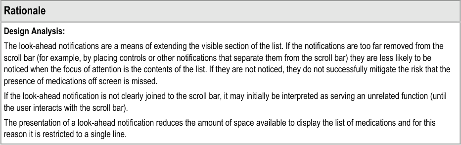

Page 51

Copyright ©2013 Health and Social Care Information Centre

HSCIC Controlled Document

##### **3.3.23 Selecting LASB Contents**

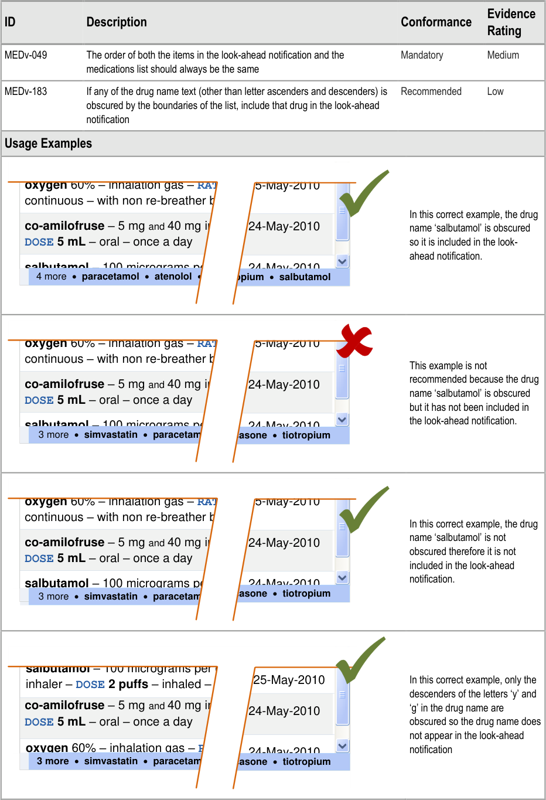

Page 52

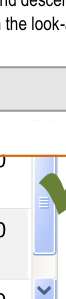

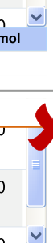

|Col1|Col2|Col3|Col4|25-May-2010 24-May-2010 24-May-2010|
|---|---|---|---|---|
|**oxygen** 60% – inhalation gas –**`RA`** continuous – with non re-breather|**oxygen** 60% – inhalation gas –**`RA`** continuous – with non re-breather|**`T`**      ba|**`E` **      g|**`E` **      g|
|**co-amilofruse**– 5 mgand40 mg in **`DOSE` 5 mL**– oral – once a day|**co-amilofruse**– 5 mgand40 mg in **`DOSE` 5 mL**– oral – once a day||5|5|
|**salbutamol**– 100 micrograms per dose 4 more ·**  paracetamol**·**  atenolol**·|**salbutamol**– 100 micrograms per dose 4 more ·**  paracetamol**·**  atenolol**·||||
|**salbutamol**– 100 micrograms per dose 4 more ·**  paracetamol**·**  atenolol**·| ose 4 more ·**  paracetamol**·**  atenolol**·|**t** |**iot**|**ropium**·**  salbutamol**|
||||||


|Col1|Col2|Col3|Col4|25-May-2010 24-May-2010 24-May-2010|
|---|---|---|---|---|
|**oxygen** 60% – inhalation gas –**`RA`** continuous – with non re-breather|**oxygen** 60% – inhalation gas –**`RA`** continuous – with non re-breather|**`T`**      ba|**`E` **      g|**`E` **      g|
|**co-amilofruse**– 5 mgand40 mg in **`DOSE` 5 mL**– oral – once a day|**co-amilofruse**– 5 mgand40 mg in **`DOSE` 5 mL**– oral – once a day||5|5|
|**salbutamol**– 100 micrograms per dose 3 more·**  simvastatin**·**  paracetam**|**salbutamol**– 100 micrograms per dose 3 more·**  simvastatin**·**  paracetam**||||
|**salbutamol**– 100 micrograms per dose 3 more·**  simvastatin**·**  paracetam**| ose 3 more·**  simvastatin**·**  paracetam**| |** lut**|** icasone**·**  tiotropium**|
||||||


|Col1|Col2|Col3|Col4|25-May-2010 24-May-2010 24-May-2010|
|---|---|---|---|---|
|**oxygen** 60% – inhalation gas –**`RA`** continuous – with non re-breather|**oxygen** 60% – inhalation gas –**`RA`** continuous – with non re-breather|**`T`**      ba|**`E` **      g|**`E` **      g|
|**co-amilofruse**– 5 mgand40 mg in **`DOSE` 5 mL**– oral – once a day|**co-amilofruse**– 5 mgand40 mg in **`DOSE` 5 mL**– oral – once a day||5|5|
|**salbutamol**– 100 micrograms per dose 3 more·**  simvastatin**·**  paracetam**|**salbutamol**– 100 micrograms per dose 3 more·**  simvastatin**·**  paracetam**||||
|**salbutamol**– 100 micrograms per dose 3 more·**  simvastatin**·**  paracetam**| ose 3 more·**  simvastatin**·**  paracetam**| |** lut**|** icasone**·**  tiotropium**|
||||||

|Col1|Col2|Col3|Col4|e 25-May-2010 24-May-2010 24-May-2010|
|---|---|---|---|---|
|**salbutamol**– 100 micrograms per inhaler –**`DOSE` 2 puffs**– inhaled –|**salbutamol**– 100 micrograms per inhaler –**`DOSE` 2 puffs**– inhaled –| |o|o|
|**salbutamol**– 100 micrograms per inhaler –**`DOSE` 2 puffs**– inhaled –|**salbutamol**– 100 micrograms per inhaler –**`DOSE` 2 puffs**– inhaled –| |||
|**co-amilofruse**– 5 mgand40 mg in **`DOSE` 5 mL**– oral – once a day|**co-amilofruse**– 5 mgand40 mg in **`DOSE` 5 mL**– oral – once a day||5|5|
|**co-amilofruse**– 5 mgand40 mg in **`DOSE` 5 mL**– oral – once a day|**co-amilofruse**– 5 mgand40 mg in **`DOSE` 5 mL**– oral – once a day||||
|**oxygen** 60% – inhalation gas –**`RA`** continuous – with non re-breather **3 more**·**  simvastatin**·**  paracetam**|**oxygen** 60% – inhalation gas –**`RA`** continuous – with non re-breather **3 more**·**  simvastatin**·**  paracetam**|**`T`**|**`E` **|**`E` **|
|**oxygen** 60% – inhalation gas –**`RA`** continuous – with non re-breather **3 more**·**  simvastatin**·**  paracetam**| ontinuous – with non re-breather **3 more**·**  simvastatin**·**  paracetam**|       b|** lut**        ag|** icasone**·**  tiotropium**|
||||||

Copyright ©2013 Health and Social Care Information Centre

HSCIC Controlled Document


Page 53

Copyright ©2013 Health and Social Care Information Centre

HSCIC Controlled Document

##### **3.3.24 Displaying LASB Contents**


Page 54

|Col1|Col2|
|---|---|
|25-May-2010 **Started** 24-May-2010 **Started** **er minute**–   metered dose  solution – 24-May-2010 **Started** |25-May-2010 **Started** 24-May-2010 **Started** **er minute**–   metered dose  solution – 24-May-2010 **Started** |
|25-May-2010 **Started** 24-May-2010 **Started** **er minute**–   metered dose  solution – 24-May-2010 **Started** ||
||**fluticasone**·**      tiotropium**|

Copyright ©2013 Health and Social Care Information Centre

HSCIC Controlled Document

Page 55

Copyright ©2013 Health and Social Care Information Centre

HSCIC Controlled Document

##### **3.3.25 Formatting LASB Contents**


|Col1|– RATE 15 L per minute – Started 25-May-2010 ther bag mg in 5 mL – solution – Started 24-May-2010 ms per dose – metered dose Started 24-May-2010 haled –|
|---|---|
|| |
||**enolol#paracetamol**#**atenolol**#**ramipril**#**clopidogrel**#**fluticasone#tiotropium**|

|Col1|Col2|
|---|---|
|25-May-2010 **Started** 24-May-2010 **Started** **er minute**–   metered dose  solution – 24-May-2010 **Started** |25-May-2010 **Started** 24-May-2010 **Started** **er minute**–   metered dose  solution – 24-May-2010 **Started** |
|25-May-2010 **Started** 24-May-2010 **Started** **er minute**–   metered dose  solution – 24-May-2010 **Started** ||
||**fluticasone**·**  tiotropium**·|

Copyright ©2013 Health and Social Care Information Centre

Page 56

HSCIC Controlled Document

##### **3.3.26 Drug Names in the LASB**


|Col1|Col2|
|---|---|
|25-May-2010 **Started** 24-May-2010 **Started** **oxygen** 60% – inhalation gas –**`RATE` 15 L per minute**–  continuous – with non re-breather bag **salbutamol**– 100 micrograms per dose – metered dose inhaler –**`DOSE` 2 puffs**– inhaled –   **co-amilofruse**– 5 mgand40 mg in 5 mL – solution – **`DOSE` 5 mL**– oral – once a day 24-May-2010 **Started** |25-May-2010 **Started** 24-May-2010 **Started** **oxygen** 60% – inhalation gas –**`RATE` 15 L per minute**–  continuous – with non re-breather bag **salbutamol**– 100 micrograms per dose – metered dose inhaler –**`DOSE` 2 puffs**– inhaled –   **co-amilofruse**– 5 mgand40 mg in 5 mL – solution – **`DOSE` 5 mL**– oral – once a day 24-May-2010 **Started** |
|25-May-2010 **Started** 24-May-2010 **Started** **oxygen** 60% – inhalation gas –**`RATE` 15 L per minute**–  continuous – with non re-breather bag **salbutamol**– 100 micrograms per dose – metered dose inhaler –**`DOSE` 2 puffs**– inhaled –   **co-amilofruse**– 5 mgand40 mg in 5 mL – solution – **`DOSE` 5 mL**– oral – once a day 24-May-2010 **Started** |   |
|four times a day as require|d 3 more ·**  atenolol**·**  ramipril**·**  clopidogrel**·**  fluticasone**·**  tiotropium**|

Page 57

Copyright ©2013 Health and Social Care Information Centre

HSCIC Controlled Document

##### **3.3.27 Formatting LASB Notifications**


Page 58

Copyright ©2013 Health and Social Care Information Centre

HSCIC Controlled Document

##### **3.3.28 Displaying a LASB for Past Medications**


|Discontinued digoxin – tablet – DOSE 125 micrograms – oral – once a day|Col2|
|---|---|
| **methyldopa** – tablet –**`DOSE` 250 mg** – oral – twice a day  **Discontinued** **Completed** **Completed** **hydrochlorothiazide** – tablet –**`DOSE` 100 mg** – oral – 4 times a day **furosemide** – tablet –**`DOSE` 40 mg** – oral – once a day| **methyldopa** – tablet –**`DOSE` 250 mg** – oral – twice a day  **Discontinued** **Completed** **Completed** **hydrochlorothiazide** – tablet –**`DOSE` 100 mg** – oral – 4 times a day **furosemide** – tablet –**`DOSE` 40 mg** – oral – once a day|
||3 more|

Page 59

Copyright ©2013 Health and Social Care Information Centre

HSCIC Controlled Document

##### **3.3.29 Providing a Grouping Control**


Page 60

Copyright ©2013 Health and Social Care Information Centre

HSCIC Controlled Document

##### **3.3.30 Supporting Grouping**


Page 61

Copyright ©2013 Health and Social Care Information Centre

HSCIC Controlled Document

Page 62

Copyright ©2013 Health and Social Care Information Centre


HSCIC Controlled Document

##### **3.3.31 Displaying Group Headings**


Page 63

Copyright ©2013 Health and Social Care Information Centre

HSCIC Controlled Document


Page 64

Copyright ©2013 Health and Social Care Information Centre

HSCIC Controlled Document

##### **3.3.32 Collapsing Groups**


Page 65

Copyright ©2013 Health and Social Care Information Centre

HSCIC Controlled Document


Page 66

Copyright ©2013 Health and Social Care Information Centre

HSCIC Controlled Document

##### **3.3.33 Combining Groups to Avoid Duplication**


Page 67

Copyright ©2013 Health and Social Care Information Centre

HSCIC Controlled Document

##### **3.3.34 Supporting Sorting**

Section 3.3.15 includes guidance on the default sort order of a list of current medications and
section 3.3.18 includes guidance on the default sort order of past medications.


|Status First Administration ▼ Not Started 29-May-2010|Status|First Administration ▼|
|---|---|---|
|27-May-2010 **Started**|27-May-2010 **Started**|27-May-2010 **Started**|
|25-May-2010 **Started**|25-May-2010 **Started**|25-May-2010 **Started**|

Page 68

Copyright ©2013 Health and Social Care Information Centre

HSCIC Controlled Document

##### **3.3.35 Supporting Levels of Detail**


Page 69

Copyright ©2013 Health and Social Care Information Centre

HSCIC Controlled Document

##### **3.3.36 Supporting Selection and Action**


Page 70

Copyright ©2013 Health and Social Care Information Centre

HSCIC Controlled Document


Page 71

Copyright ©2013 Health and Social Care Information Centre

HSCIC Controlled Document

##### **3.3.37 Providing Context Menus**


|temazepam – tablet – DOSE 20 mg – oral – at night Started 26-May-2010|Col2|Col3|
|---|---|---|
|**oxygen** 60% – inhalation gas –**`RATE` 15 L per minute**–  continuous – with non re-breather bag 25-May-2010 **Started**|**oxygen** 60% – inhalation gas –**`RATE` 15 L per minute**–  continuous – with non re-breather bag 25-May-2010 **Started**|**oxygen** 60% – inhalation gas –**`RATE` 15 L per minute**–  continuous – with non re-breather bag 25-May-2010 **Started**|
|**co-amilofruse**– 5 mgand40 mg in 5 mL – solution – **`DOSE` 5 mL**– oral – once a day 24-May-2010 **Started** Action 1|**co-amilofruse**– 5 mgand40 mg in 5 mL – solution – **`DOSE` 5 mL**– oral – once a day 24-May-2010 **Started** Action 1|**co-amilofruse**– 5 mgand40 mg in 5 mL – solution – **`DOSE` 5 mL**– oral – once a day 24-May-2010 **Started** Action 1|
|**co-amilofruse**– 5 mgand40 mg in 5 mL – solution – **`DOSE` 5 mL**– oral – once a day 24-May-2010 **Started** Action 1|Action 1|Action 1|
|**salbutamol**– 100 micrograms per dose – metered dose inhaler –**`DOSE` 2 puffs**– inhaled – four times a day as required| **Started** 24-Ma   Action 2 Action 3 Action 4|y-2010|
|**salbutamol**– 100 micrograms per dose – metered dose inhaler –**`DOSE` 2 puffs**– inhaled – four times a day as required| Action 5 Action 6 Action 7| Action 5 Action 6 Action 7|

Page 72

Copyright ©2013 Health and Social Care Information Centre

HSCIC Controlled Document

##### **3.3.38 Providing Access to Medication Details**


Page 73

Copyright ©2013 Health and Social Care Information Centre

HSCIC Controlled Document

#### **3.4 Rationale Summary**

This section summarises the principles behind the rationale for all guidance points in this
document.

General Principles:

 Provide support for legibility

 Mitigate risks of incorrect selection and misinterpretation

Usability Principles:

 Minimise the use of embellishments (for example, bold, colour, fonts, font sizes, italics,

separators and symbols)

 Minimise instances of each type of embellishment within a reading unit

 Consistent use of specific embellishments within and preferably between user-interface

contexts or ‘views’

 Use words instead of symbols where it is important for removing ambiguity

Existing Standards:

 NHS NPfIT – _ePrescribing Functional Specification_ **{R9}**

 NHS NPfIT – _Guidelines for the Design and Presentation of Medication Elements Required_

_in Electronic Prescribing or Medication Ordering Systems_ **{R15}**

 Institute for Safe Medication Practices (ISMP) (US) – _Draft Guidelines for Safe Electronic_

_Communication of Medication Orders_ _[7]_

Evolving Standards:

 Standard set of information needed to safely describe a medication

7 ISMP – ISMP MedicationSafetyAlert! – It’s Time for Standards to Improve Safety with Electronic Communication of
Medication Orders – Draft Guidelines for Safe Electronic Communication of Medication Orders **{R16}** :
[http://www.ismp.org/Newsletters/acutecare/articles/20030220.asp](http://www.ismp.org/Newsletters/acutecare/articles/20030220.asp)

Page 74

Copyright ©2013 Health and Social Care Information Centre

HSCIC Controlled Document

### 4 DOCUMENT INFORMATION

#### **4.1 Terms and Abbreviations**

ACBS Advisory Committee on Borderline Substances

AMP Actual Medicinal Product

CATR Clinical Authority to Release

CSG Clinical Safety Group

CSMS Clinical Safety Management System

CUI Common User Interface

dm+d Dictionary of Medicines and Devices

HDU High Dependency Unit

ISMP The Institute for Safe Medication Practices

IUD Intrauterine Device

LASB Look-Ahead Scroll Bar

NHS National Health Service

NHS CFH NHS Connecting for Health

NPfIT National Programme for IT

NPSA National Patient Safety Agency

OTC Over the Counter

PGD Patient Group Direction

PODs Patient’s Own Drugs

TFN Trade Family Name

TPN Total Parental Nutrition

TTO To Take Out

UI User Interface

VTM Virtual Therapeutic Moiety

W3C World Wide Web Consortium

Table 6: Terms and Abbreviations

Copyright ©2013 Health and Social Care Information Centre

Page 75

HSCIC Controlled Document

#### **4.2 Definitions**

NHS Entity Within this document, defined as a single NHS organisation or group that is operated within a single
technical infrastructure environment by a defined group of IT administrators.

The Authority The organisation implementing the NHS National Programme for IT (currently NHS Connecting for Health).

Current best practice Current best practice is used rather than best practice, as over time best practice guidance may change or
be revised due to changes to products, changes in technology, or simply the additional field deployment
experience that comes over time.

Generic drug name This can be a single drug name that refers to a single active ingredient or it can be multiple active
ingredients that are prescribed as one drug. In the structure of the dm+d **{R10}**, this generally equates to a
Virtual Therapeutic Moiety (VTM)

Brand name A brand name for a product containing medication. A brand name may be associated with many products.
In some cases, the same brand name may be associated with different generic drugs. Future versions of
the dm+d **{R10}** are expected to include a separate entity for brand name, known as Trade Family Name
(TFN). In the meantime, the brand name is part of the Actual Medicinal Product (AMP)

Table 7: Definitions

#### **4.3 Nomenclature**

This section shows how to interpret the different styles used in this document to denote various
types of information.

##### **4.3.1 Body Text**

Code `Monospace`

Script

Other markup languages

Interface dialog names **Bold**

Field names

Controls

Folder names Title Case

File names

Table 8: Body Text Styles

##### **4.3.2 Cross References**

Current document – sections Section number only

Current document – figures/tables Caption number only

Other project documents _Italics_ and possibly a footnote

Publicly available documents _Italics_ with a footnote

External Web-based content _Italics_ and a hyperlinked footnote

Table 9: Cross Reference Styles

Page 76

Copyright ©2013 Health and Social Care Information Centre

HSCIC Controlled Document

#### **4.4 References**

**R1.** NHS CUI Programme – Design Guide Entry – Medications Management – Medication Views 2.0.0.0

**R2.** NHS CUI Programme – Medications Management – Medication Line – User Interface Design
Guidance

**R3.** NPSA – Safety in doses: medication safety incidents in the NHS
http://www.npsa.nhs.uk/nrls/alerts-and-directives/directives-guidance/safety-in-doses/

**R4.** Medication Errors – Causes, Prevention, and Risk Management – Cohen M R (Ed) – Jones and
Bartlett Publishers

**R5.** To Err is Human _–_ Building a Safer Health System – Kohn L, Corrigan J, Donaldson M –
Washington, DC: National Academy Press, 2000

2.0.0.0

2007

2004

2000

**R6.** Understanding Patient Safety – Wachter R M – The McGraw-Hill Companies, Inc, 2008 2008

**R7.** Healthcare Commission Patient Survey – Room for Review: a Guide to Medication Review 2004

**R8.** National service framework for older people – Department of Health
[http://www.dh.gov.uk/en/publicationsandstatistics/publications/publicationspolicyandguidance/DH_4](http://www.dh.gov.uk/en/publicationsandstatistics/publications/publicationspolicyandguidance/DH_4003066)
[003066](http://www.dh.gov.uk/en/publicationsandstatistics/publications/publicationspolicyandguidance/DH_4003066)

**R9.** NHS NPfIT – ePrescribing Functional Specification
[http://www.connectingforhealth.nhs.uk/newsroom/news-stories/eprescfunctspec](http://www.connectingforhealth.nhs.uk/newsroom/news-stories/eprescfunctspec)

**R10.** NHS – dictionary of medicines + devices
[http://www.dmd.nhs.uk/](http://www.dmd.nhs.uk/)

**R11.** NHS CUI Programme – Medications Management – Drug Administration – User Interface Design
Guidance

2001

1.0

Release 2.3

3.0.0.0

**R12.** The Visual Display of Quantitative Information – Tufte E, 2001, Cheshire, CT – Graphics Press Second Edition
2001

**R13.** Web Content Accessibility Guidelines 1.0 – W3C Recommendation 5-May-1999
[http://www.w3.org/TR/WAI-WEBCONTENT/](http://www.w3.org/TR/WAI-WEBCONTENT/)

**R14.** Techniques for Accessibility Evaluation and Repair Tools – W3C Working Draft – 26 April 2000 –
Technique 2.2.1 [priority 3] Test the colour attributes of the following elements for visibility:
[http://www.w3.org/TR/AERT#color-contrast](http://www.w3.org/TR/AERT#color-contrast)

**R15.** NHS NPfIT – Guidelines for the Design and Presentation of Medication Elements Required in
Electronic Prescribing or Medication Ordering Systems – NPfIT-EP-DB-0003.01

**R16.** ISMP – ISMP MedicationSafetyAlert! – It’s Time for Standards to Improve Safety with Electronic
Communication of Medication Orders – Draft Guidelines for Safe Electronic Communication of
Medication Orders
[http://www.ismp.org/Newsletters/acutecare/articles/20030220.asp](http://www.ismp.org/Newsletters/acutecare/articles/20030220.asp)

Table 10: References

Copyright ©2013 Health and Social Care Information Centre

1999

2000

2005

20-Feb-2003

Page 77

HSCIC Controlled Document

### APPENDIX A REFERENCE SUMMARY OF GUIDANCE

**MEDv-020**
**MEDv-141**
**Visual Summary:**

|Col1|sentence|tabula|
|---|---|---|
||||
|**xxxx**– xxxx - xxxx yyyy zzzz|**xxxx**– xxxx - xxxx yyyy zzzz|**xxxx**– xxxx - xxxx yyyy zzzz|
|**xxxx**– xxxx - xxxx yyyy zzzz|**xxxx**– xxxx - xxxx yyyy zzzz|**xxxx**– xxxx - xxxx yyyy zzzz|
|**xxxx**– xxxx - xxxx yyyy zzzz|**xxxx**– xxxx - xxxx yyyy zzzz|**xxxx**– xxxx - xxxx yyyy zzzz|
|**xxxx**– xxxx - xxxx yyyy zzzz|**xxxx**– xxxx - xxxx yyyy zzzz|**xxxx**– xxxx - xxxx yyyy zzzz|

MEDv-020 3.3.1 Present medications as lines of text within rows in a tabular format where each row represents one
medication

**MEDv-142**
**Visual Summary:**


|minimise the display of blank cells for some row n a separate column)|Col2|
|---|---|
|**xxxx**– xxxx - xxxx **xxxx**– xxxx - xxxx **xxxx**– xxxx - xxxx **xxxx**– xxxx - xxxx yyyy zzzz yyyy zzzz yyyy zzzz yyyy zzzz|**xxxx**– xxxx - xxxx **xxxx**– xxxx - xxxx **xxxx**– xxxx - xxxx **xxxx**– xxxx - xxxx yyyy zzzz yyyy zzzz yyyy zzzz yyyy zzzz|
|||
||space|

MEDv-142 3.3.2 When the list is scrolled to the end, display a space at the bottom of the list with a height equivalent to
a line of text

**MEDv-021**
**Visual Summary:**

|Col1|no strong|
|---|---|
|||
|**xxxx**– xxxx - xxxx yyyy zzzz|**xxxx**– xxxx - xxxx yyyy zzzz|
|**xxxx**– xxxx - xxxx yyyy zzzz|**xxxx**– xxxx - xxxx yyyy zzzz|
|**xxxx**– xxxx - xxxx yyyy zzzz|**xxxx**– xxxx - xxxx yyyy zzzz|
|**xxxx**– xxxx - xxxx yyyy zzzz|**xxxx**– xxxx - xxxx yyyy zzzz|

MEDv-021 3.3.3 Avoid the use of strong grids and strong vertical lines. (Use subtle methods to support distinguishing
between rows in the list)

**MEDv-022,**
**MEDv-142 to MEDv-145**
**Visual Summary:**


MEDv-143 3.3.4 Use at least alternate row shading or lines between rows

MEDv-022 3.3.4 Use subtle alternate row shading

MEDv-144 3.3.4 When using alternate row shading, ensure that colour and brightness of the background does not
interfere with the readability of the foreground text

MEDv-145 3.3.4 Supplement alternate shading with 1 point pale lines between rows

**MEDv-023**
**Visual Summary:**

|Col1|Col2|icons|Col4|
|---|---|---|---|
|||||
|**xxxx**– xxxx - xx|**A**|**B**|yyyy zzzz|
|**xxxx**– xxxx - xx yyyy zzzz **B**|**xxxx**– xxxx - xx yyyy zzzz **B**|**xxxx**– xxxx - xx yyyy zzzz **B**|**xxxx**– xxxx - xx yyyy zzzz **B**|
|**xxxx**– xxxx - xx|**A**|yyyy zzzz|yyyy zzzz|

MEDv-023 3.3.5 Support the display of icons following the text of the Drug Details column in the Medications List View

Page 78

Copyright ©2013 Health and Social Care Information Centre

HSCIC Controlled Document

**MEDv-146**
**Visual Summary:**

|aaaa|bbbb|cccc|
|---|---|---|
|empty list message|empty list message|empty list message|

MEDv-146 3.3.6 Display a message when a list is empty (for example, when there are no current medications)

**MEDv-147 to MEDv-150**
**Visual Summary:**

mandatory columns

MEDv-147 3.3.7 Provide a column that contains status information including information that defines whether the
medication is ‘current’ or ‘past’

MEDv-148 3.3.7 Provide a column that contains drug details according to Medication Line guidance

MEDv-149 3.3.7 When displaying current medications, provide a column that contains an initiation date (such as the
date of the first planned administration). The examples in this document show a Start Date column.

MEDv-150 3.3.7 When displaying past medications, provide a column that contains a stop date (such as the date of the
last administration or the date that the medication was discontinued). The examples in this document
show an End Date column.

**MEDv-151 to MEDv-154**
**Visual Summary:**

|Col1|Col2|Col3|
|---|---|---|
|Start|Start|End|
||||

MEDv-151 3.3.8 When an end date column is displayed, place a start date column before (to the left of) the end date
column

MEDv-152 3.3.8 When an end date column is displayed, and there is no duration column, place a start date column
adjacent to the end date column

MEDv-153 3.3.8 Use fixed width columns for dates

MEDv-154 3.3.8 Maintain consistent placement of date columns relative to one another and relative to the Drug Details
column in both current and past medications

**MEDv-150 toMED-152**
**Visual Summary:**

First
Administration

Last
Administration

MEDv-155 3.3.9 Label columns with text that describes the contents unambiguously and succinctly (such as, ‘Status’,
‘Date Prescribed’ or ‘First Administration’)

MEDv-156 3.3.9 Use a unique heading for each column

MEDv-157 3.3.9 When combining two attributes that have the same data type (such as dates), include labels for both
attributes in the column heading

Page 79

Copyright ©2013 Health and Social Care Information Centre

HSCIC Controlled Document

**MEDv-027, MEDv-158**
**Visual Summary:**

Start and End Dates
**Start** zzzz

**End** zzzz

**Start** zzzz

**End** zzzz

MEDv-027 3.3.10 Allow columns to contain more than one attribute for a single medication

MEDv-158 3.3.10 When combining two attributes that have the same data types (such as dates), include labels for both
attributes within the cell

**MEDv-159 to MEDv-161**
**Visual Summary:**

|aaaa|bbbb|cccc|
|---|---|---|
|relative widths|||

MEDv-159 3.3.11 Maintain the relative proportions of columns such that the Drug Details column is the widest

MEDv-160 3.3.11 Avoid the need for horizontal scrolling by limiting the number of columns visible at any one time

MEDv-161 3.3.11 Define minimum widths for all columns

Current Past

Status
**Completed**

**Discontinued**

**MEDv-162 to MEDv-165**
**Visual Summary:**

Status
**Started**

**Not Started**

**Suspended**

MEDv-162 3.3.12 Ensure that all medications have a status value and the status cannot be blank

MEDv-163 3.3.12 Limit status descriptions to short phrases, preferably no more than two words

MEDv-164 3.3.12 Allow status to be supplemented with additional information (such as pharmacy verified) .

MEDv-165 3.3.12 Use the status description to differentiate between medications that have no recorded administration
events and those that have.

Started

Not Started

Suspended

Completed

Discontinued

**MEDv-166 to MEDv-172**
**Visual Summary:**

Current

Past

MEDv-166 3.3.13 Support a status of ‘suspended’ and include medications with this status in current medications

MEDv-167 3.3.13 Assign a status of ‘Started’ to medications that have an administration event recorded and have further
scheduled administrations

MEDv-168 3.3.13 Assign a status of ‘Not Started’ to medications that have administration scheduled and a start date in
the future

MEDv-169 3.3.13 Assign a status of ‘Suspended’ to medications that are marked as not to be administered but which
are intended to be resumed at a later date

MEDv-170 3.3.13 Assign a status of ‘Completed’ to medications that have administration events recorded according to
their schedule (within tolerances) and have an end date in the past

MEDv-171 3.3.13 Assign a status of ‘Discontinued’ to medications that were stopped on a date that preceded one or
more of the scheduled administrations

Page 80

Copyright ©2013 Health and Social Care Information Centre

HSCIC Controlled Document

MEDv-172 3.3.13 Define medications with a status of either ‘Started’, ‘Not Started’ or ‘Suspended’ as current
medications

MEDv-173 3.3.13 Define medications with a status of either ‘Completed’ or ‘Discontinued’ as past medications

**MEDv-024, MEDv-025,**
**MEDv-042**
**Visual Summary:**

|xxxx – xxxx - xxxx yyyy zzzz|Col2|
|---|---|
|**xxxx**– xxxx - xxxx yyyy zzzz|**xxxx**– xxxx - xxxx yyyy zzzz|
|**xxxx**– xxxx - xxxx yyyy zzzz|**xxxx**– xxxx - xxxx yyyy zzzz|
|**xxxx**– xxxx - xxxx|yyyy zzzz|
||Important S|

MEDv-024 3.3.14 Use visual design to draw attention to suspended medications

MEDv-025 3.3.14 Use visual design to distinguish a list of current medications from a list of past medications

MEDv-042 3.3.14 Display the status of each medication in bold

**MEDv-062 to MEDv-067,**
**MEDv-172**
**Visual Summary:**

MEDv-063 3.3.15 Provide buttons for displaying current and past medications respectively in the Medications List View
and label the buttons ‘Current’ and ‘Past’

MEDv-062 3.3.15 Present the Medications List View with **Current** selected by default

MEDv-064 3.3.15 Use the visual formatting of the **Current** and **Past** buttons to indicate which is currently selected

MEDv-065 3.3.15 Do not allow **Current** and **Past** buttons to be selected simultaneously

MEDv-174 3.3.15 Ensure that either the **Current** or the **Past** button is selected at any one time

MEDv-066 3.3.15 Supplement the **Past** button in the Medications List view with a drop-down control for displaying,
selecting and applying a filter on the past medications view

MEDv-067 3.3.15 Include an option for displaying all past medications in the drop-down control

Current

**MEDV-099, MEDV-173**
**Visual Summary:**

|Drug Details|Col2|xxxx|Start ▼|
|---|---|---|---|
|||default sort|default sort|
||first column|first column|first column|

MEDv-099 3.3.16 By default, present current medications sorted reverse chronologically by a starting date such that the
most recent is first (top) in the list

MEDv-173 3.3.16 When displaying current medications, place the drug details in the first (furthest left) column

Current

**MEDv-074, MEDv-075,**
**MEDv-077, MEDv-175**
**Visual Summary:**


MEDv-074 3.3.17 When displaying current medications, display a notification for medications that have been completed
or discontinued within a specified time interval from the current time

MEDv-075 3.3.17 Clearly display the time interval within the recent past notification

Page 81

Copyright ©2013 Health and Social Care Information Centre

HSCIC Controlled Document

MEDv-077 3.3.17 Display a count of the number of recently past medications within the recent past notification in the
medication list

MEDv-174 3.3.17 Use formatting to distinguish the recent past notifications from medications in the list

Past

**MEDv-100, MEDv-173**
**Visual Summary:**

|Status|Col2|Drug Details|End ▼|
|---|---|---|---|
|||default sort|default sort|
||first column|first column|first column|

MEDv-100 3.3.18 By default, sort medications reverse chronologically by end date (or equivalent) such that the most
recent is first (top) when the filter is set to ‘Past’ in the Medications List View

MEDv-175 3.3.18 When displaying past medications, place the status column first (furthest left) and the Drug Details
column second

Past

**MEDv-068 to MEDv-073**
**Visual Summary:**


MEDv-069 3.3.19 When a filter is applied to past medications in the Medications List View, the **Past** button should
indicate that it is currently selected

MEDv-070 3.3.19 When a filter is applied to past medications in the Medications List View, display a filter notification at
the top of the list below the column headings and above the scroll bar (thus ‘pushing’ the list of
medications down a line)

MEDv-068 3.3.19 When a filter notification is displayed, include a control for removing the filter within that notification

MEDv-071 3.3.19 Display a description of the filter in use within the filter notification in the medications list

MEDv-072 3.3.19 Include a count of the number of medications displayed and a count of the total (unfiltered) number of
past medications in a filter notification

MEDv-073 3.3.19 Clearly label the counts (number of medications displayed and total unfiltered number) with text that
allows them to be differentiated

MEDv-176 3.3.19 When a filter is applied to past medications in the Medications List View, the **Past** button should
indicate that it is currently selected

**MEDv-177 to MEDv-179**
**Visual Summary:**

|look-ahead notification|Col2|Col3|Col4|Col5|
|---|---|---|---|---|
||||||
||||||
||||||
||||||
||reserved space|reserved space|reserved space|reserved space|

MEDv-177 3.3.20 When displaying a list of (current or past) medications and the scroll bar is active because the list is
longer than the space available to display them, provide a clear indication that there are medications
out of view

MEDv-178 3.3.20 When displaying current medications, supplement the standard scroll bar with notifications that display
the names of drugs that are out of view. This document refers to this kind of scroll bar as a look-ahead
scroll bar (LASB)

MEDv-179 3.3.20 When displaying a LASB, reserve a space at the top and bottom of the list for look-ahead notifications

Page 82

Copyright ©2013 Health and Social Care Information Centre

HSCIC Controlled Document

MEDv-180 3.3.20 Use a pale solid background colour for the space reserved for look-ahead notifications that is sufficient
to distinguish the space from the background of the list

MEDv-181 3.3.20 When grouping is applied and there is a collapsed group out of view, display drug names in the lookahead scroll bar for any drug that is out of view irrespective of whether it is within a collapsed group or
an expanded group

**MEDv-058, MEDv-059,**
**MEDv-177**
**Visual Summary:**

|Col1|Col2|Col3|
|---|---|---|
|**ddd**– xxxx - xxxx **eee**– xxxx - xxxx **ccc**– xxxx - xxxx yyyy zzzz yyyy zzzz yyyy zzzz|**ddd**– xxxx - xxxx **eee**– xxxx - xxxx **ccc**– xxxx - xxxx yyyy zzzz yyyy zzzz yyyy zzzz|**ddd**– xxxx - xxxx **eee**– xxxx - xxxx **ccc**– xxxx - xxxx yyyy zzzz yyyy zzzz yyyy zzzz|
||||

MEDv-058 3.3.21 Update the look-ahead notifications dynamically in response to scrolling

MEDv-059 3.3.21 Allow the look-ahead notification to change width dynamically to accommodate its contents up to the
available width

MEDv-182 3.3.21 Do not allow the look-ahead notification to be used for navigation by clicking on areas of the
notification, such as drug names or counts

**MEDv-043 to MEDv045**
**Visual Summary:**

alignment

|Col1|Col2|Col3|Col4|Col5|
|---|---|---|---|---|
|aaaa|bbbb|bbbb|cccc|cccc|
||||||
|**ddd**– xxxx - xxxx **eee**– xxxx - xxxx **ccc**– xxxx - xxxx yyyy zzzz yyyy zzzz yyyy zzzz|**ddd**– xxxx - xxxx **eee**– xxxx - xxxx **ccc**– xxxx - xxxx yyyy zzzz yyyy zzzz yyyy zzzz|**ddd**– xxxx - xxxx **eee**– xxxx - xxxx **ccc**– xxxx - xxxx yyyy zzzz yyyy zzzz yyyy zzzz|**ddd**– xxxx - xxxx **eee**– xxxx - xxxx **ccc**– xxxx - xxxx yyyy zzzz yyyy zzzz yyyy zzzz||
||||||

MEDv-044 3.3.22 Restrict the look-ahead notifications to a single line each

MEDv-043 3.3.22 The look-ahead notifications should be clearly joined to the ‘up’ and ‘down’ arrow controls of the scroll
bar respectively

MEDv-045 3.3.22 Do not place controls or other notifications such that they separate the look-ahead notification from the

visible list

**MEDv-049, MEDv-181**
**Visual Summary:**

|edications List View|Col2|
|---|---|
|**aaa**– xxxx - xxxx|l|
|**bbb**– xxxx - xxxx|**bbb**– xxxx - xxxx|
|**ccc**– xxxx - xxxx|**ccc**– xxxx - xxxx|
|**ccc**– xxxx - xxxx|l|
|**ddd**– xxxx - xxxx|**ddd**– xxxx - xxxx|
|**eee**– xxxx - xxxx|**eee**– xxxx - xxxx|
|**fff**– xxxx - xxxx|**fff**– xxxx - xxxx|

MEDv-049 3.3.23 The order of both the items in the look-ahead notification and the Medications List View should always
be the same

MEDv-183 3.3.23 If any of the drug name text (other than letter ascenders and descenders) is obscured by the
boundaries of the list, include that drug in the look-ahead notification.

Page 83

Copyright ©2013 Health and Social Care Information Centre

HSCIC Controlled Document

**MEDv-048, MEDv-052,**
**MEDv-053, MEDv-055**
**Visual Summary:**

|Col1|Col2|aaa ·|bbb|
|---|---|---|---|
|**ddd**– xxxx - xxxx **eee**– xxxx - xxxx **ccc**– xxxx - xxxx yyyy zzzz yyyy zzzz yyyy zzzz   |**ddd**– xxxx - xxxx **eee**– xxxx - xxxx **ccc**– xxxx - xxxx yyyy zzzz yyyy zzzz yyyy zzzz   |**ddd**– xxxx - xxxx **eee**– xxxx - xxxx **ccc**– xxxx - xxxx yyyy zzzz yyyy zzzz yyyy zzzz   |**ddd**– xxxx - xxxx **eee**– xxxx - xxxx **ccc**– xxxx - xxxx yyyy zzzz yyyy zzzz yyyy zzzz   |
||**2 more**·** kkk**·** jjj**·** iii**·** ggg**·** fff**|**2 more**·** kkk**·** jjj**·** iii**·** ggg**·** fff**|**2 more**·** kkk**·** jjj**·** iii**·** ggg**·** fff**|

MEDv-048 3.3.24 The look-ahead notification is populated from right to left such that the next drug in the list appears
closest to the scroll bar

MEDv-052 3.3.24 When there are more items than can be displayed in the look-ahead notification for current
medications, display as many as possible and end the list with a count of the remaining items that
could not be displayed

MEDv-053 3.3.24 When a count is displayed in a look-ahead notification and one or more of the medications included in
that count have decision support alerts, display a decision support alert icon next to the count

MEDv-055 3.3.24 When displaying current medications only, show drug names and decision support alert icons in the
look-ahead notification

**MEDv-056, MEDv-179,**
**MEDv-180**
**Visual Summary:**

MEDv-056 3.3.25 Use a delimiter that is unlikely to be interpreted as a character or number (such as a black dot ‘●’),
with a space either side to separate drug names and to separate the count from drug names

MEDv-184 3.3.25 Do not use leading or training delimiters

MEDv-185 3.3.25 Do not include additional text or formatting to indicate grouping in the look-ahead notifications

**MEDv-050, MEDv-051**
**Visual Summary:**

MEDv-050 3.3.26 Where exceptionally long drug names require more space than is available in a look-ahead
notification, display a count (as for past medications) instead

MEDv-051 3.3.26 Do not truncate or abbreviate drug names in the look-ahead notification

**MEDv-184 to MEDv-186**
**Visual Summary:**

MEDv-186 3.3.27 Display drug names in bold and in black text by default

MEDv-187 3.3.27 Display counts and descriptive text (such as ‘more’) in normal weight font

MEDv-188 3.3.27 Use a light solid background colour for the notifications that is both sufficiently different from the colour
in the space reserved for notifications and sufficiently different from the black text in the notification

MEDv-189 3.3.27 Do not use a border in a dark colour or with a weight greater than 1 point for a look-ahead notification

Past Current

**MEDv-054**
**Visual Summary:**

|Col1|2 more|
|---|---|
|**ppp**– xxxx - xxxx **qqq**– xxxx - xxxx **ooo**– xxxx - xxxx |**ppp**– xxxx - xxxx **qqq**– xxxx - xxxx **ooo**– xxxx - xxxx |
||**4 more**|

|Col1|Col2|aaa · bbb|
|---|---|---|
|**ddd**– xxxx - xxxx **eee**– xxxx - xxxx **ccc**– xxxx - xxxx |**ddd**– xxxx - xxxx **eee**– xxxx - xxxx **ccc**– xxxx - xxxx |**ddd**– xxxx - xxxx **eee**– xxxx - xxxx **ccc**– xxxx - xxxx |
||**2 more**·**  ggg**·**  fff**|**2 more**·**  ggg**·**  fff**|

MEDv-054 3.3.28 When displaying past medications only, display counts in the look-ahead notification and not drug
names.

Page 84

Copyright ©2013 Health and Social Care Information Centre

HSCIC Controlled Document

**MEDv-084, MEDv-085,**
**MEDv185**
**Visual Summary:**

MEDv-084 3.3.29 Provide a drop-down list for displaying, selecting and applying a grouping to the medications list

MEDv-085 3.3.29 Label the grouping control ‘Group by’

MEDv-190 3.3.29 Include an option in the drop-down list to set the grouping to ‘None’

**Group A**

yyyy zzzz

**MEDv-083, MEDv-087,**
**MEDv-188 to MEDv-190**
**Visual Summary:**

**xxxx** - xxxx - xxxx

**Group B**

**xxxx** - xxxx - xxxx yyyy zzzz

**xxxx** - xxxx - xxxx

yyyy zzzz

MEDv-083 3.3.30 Present the Medications List View with no grouping active by default

MEDv-087 3.3.30 Retain the column sort order in the Medications List View when grouping is applied

MEDv-191 3.3.30 Display groups expanded by default

MEDv-192 3.3.30 Re-start alternate row shading at the beginning of each group. (Alternate row shading is not needed if
there is only one medication in each group)

MEDv-193 3.3.30 When a grouping is selected in the grouping control, ensure that at least one group heading is visible
in the newly grouped list

**MEDv-086, MEDv088,**
**MEDv-090, MEDv-091**
**Visual Summary:**

|Col1|Tablet|
|---|---|
||**xxxx**– xxxx - xxxx yyyy zzzz|
||**(No Form Specified)**|
||**xxxx**– xxxx - xxxx yyyy zzzz|
||**xxxx**– xxxx - xxxx yyyy zzzz|

MEDv-086 3.3.31 Display clear and prominent headings for each group category

MEDv-090 3.3.31 Do not display group headings for empty groups

MEDv-091 3.3.31 Provide ‘null’ groups where necessary to support the display of medications that do not have a value
for the attribute being used to group the medications

MEDv-194 3.3.31 Display the label for a ‘null’ group heading in brackets

MEDv-195 3.3.31 Display ‘null’ groups at the top of the list of groups

**MEDv-092, MEDv-089,**
**MEDv-092**
**Visual Summary:**


MEDv-092 3.3.32 Provide controls for expanding and collapsing individual groups. Place these controls at the beginning
of the group heading

MEDv-089 3.3.32 When a group is collapsed, supplement the group heading with a number representing a count of
medications within that group

MEDv-196 3.3.32 Support the selection of group headings and the display of a context menu that includes options for
collapsing and expanding all columns

Page 85

Copyright ©2013 Health and Social Care Information Centre

HSCIC Controlled Document

**MEDv-193, MEDv-194**
**Visual Summary:**


MEDv-197 3.3.33 When one or more medications belong to more than one group (such as analgesic and non-steroidal
anti-inflammatory), create a new group and label it with the group names combined (such as
‘Analgesic, Non-steroidal Anti-inflammatory’)

MEDv-198 3.3.33 Display each medication in only one group (do not duplicate medications so that they can be displayed
in more than one group)

MEDv-199 3.3.33 When combining group names, display the names in the same order that they would appear in a list
that is sorted by that attribute

MEDv-200 3.3.33 When combining group names, separate the labels with a semi-colon

formatting

**MEDv-101 to MEDv-106**
**Visual Summary:**

|Col1|Col2|Col3|Col4|
|---|---|---|---|
|aaaa|Start▼|Start▼|Start▼|
|aaaa|Start▼|||
|zzzz yyyy xxxx aaaa aaaa aaaa|zzzz yyyy xxxx aaaa aaaa aaaa|||

MEDv-101 3.3.34 Allow the sort order of a list in the medications list to be changed by clicking on a column heading

MEDv-102 3.3.34 Allow the sort order of a list in the Medications List View to be reversed by clicking on the column
heading for the column with the active sort applied

MEDv-103 3.3.34 Use formatting of the column heading to clearly indicate the column to which the sort order is currently
applied

MEDv-104 3.3.34 Use an icon or symbol in the column heading to indicate the column by which the data is sorted and
the direction of the sort

MEDv-105 3.3.34 When the sort order is changed from the default to another attribute in the Medications List View,
retain the default as a secondary sort order


**MEDv-195**
**Visual Summary:**

|xxxx – xxxx - xxxx yyyy|Col2|
|---|---|
|**xxxx**– xxxx - xxxx yyyy|**xxxx**– xxxx - xxxx yyyy|
|**xxxx**– xxxx - xxxx yyyy||
|**xxxx**– xxxx - xxxx yyyy|**xxxx**– xxxx - xxxx yyyy|

MEDv-201 3.3.35 Provide a control that allows the type and quantity of information displayed to be changed such that
the rows and columns may change in number and be presented with a different layout


**MEDv-122 to MEDv-127**
**Visual Summary:**

MEDv-202 3.3.36 Ensure that there are no medications selected by default when a list is opened

MEDv-122 3.3.36 Support click (or keyboard selection using the spacebar) to select a medication in the list

MEDv-123 3.3.36 Clearly highlight selected medications in the medication list

Copyright ©2013 Health and Social Care Information Centre

Page 86

HSCIC Controlled Document

MEDv-124 3.3.36 Maintain the selection of a medication when switching between views of a patient’s medications (such
that a medication selected in a medication list is automatically selected when switching to the Drug
Administration view)

MEDv-125 3.3.36 Maintain the selection of a medication when applying or changing a grouping or a sort order and
ensure that the selection remains visible

MEDv-126 3.3.36 Support the selection of multiple items using CTRL and click for discrete selections, and SHIFT and
click for contiguous selections

MEDv-127 3.3.36 Support keyboard-only equivalents such as SHIFT and arrow key for contiguous selection and the
CTRL and SPACEBAR to toggle select and deselect when making non-continuous selections

MEDv-203 3.3.36 When an action is applied to more than one medication, display a summary of the selected

**MEDv-128 to MEDv133**
**Visual Summary:**

|he user to complete the action|Col2|Col3|
|---|---|---|
|**xxxx**– xxxx - xxxx yyyy zzzz|**xxxx**– xxxx - xxxx yyyy zzzz|**xxxx**– xxxx - xxxx yyyy zzzz|
|**xxxx**– xxxx - xxxx yyyy zzzz|**xxxx**– xxxx - xxxx yyyy zzzz|**xxxx**– xxxx - xxxx yyyy zzzz|
|**xxxx**– xxxx - xxxx yyyy zzzz ~~Action 1~~|**xxxx**– xxxx - xxxx yyyy zzzz ~~Action 1~~|**xxxx**– xxxx - xxxx yyyy zzzz ~~Action 1~~|
|**xxxx**– xxxx - xxxx yyyy zzzz ~~Action 1~~|yyyy zzzz ~~Action 1~~|yyyy zzzz ~~Action 1~~|
|**xxxx**– xxxx - xxxx|yyyy zzzz   Action 2 ||
||Action 3||

MEDv-128 3.3.37 Support the display of a context menu for selected medications in the Medications List View (for
example, by right-clicking)

MEDv-129 3.3.37 In the context menu for selections in the Medications List View, provide appropriate actions and
options

MEDv-130 3.3.37 In the context menu for selections in the Medications List View, support actions with icons where
appropriate

MEDv-131 3.3.37 In the context menu for selections in the Medications List View, grey out actions that are unavailable or
disallowed for one or more of the current selections

MEDv-132 3.3.37 In the context menu for selections in the Medications List View, prioritise frequently used actions by
placing them higher in the list

MEDv-133 3.3.37 In the context menu for selections in the Medications List View, group similar options so that direct
actions, actions that permit addition of information and actions that display more information are each
grouped together

**MEDv-135, MEDv-136**
**Visual Summary:**

|xxxx – xxxx - xxxx yyyy zzzz|Col2|Col3|
|---|---|---|
|**xxxx**– xxxx - xxxx yyyy zzzz|**xxxx**– xxxx - xxxx yyyy zzzz||
|**xxxx**–|xxxx - xxxx yyyy zzzz|xxxx - xxxx yyyy zzzz|
|**xxxx**–|xxxx - xxxx yyyy zzzz |xxxx - xxxx yyyy zzzz |
|**xxxx**–|xxxx - xxxx yyyy zzzz ~~Detailed informati~~  |xxxx - xxxx yyyy zzzz ~~Detailed informati~~  |
||||

MEDv-135 3.3.38 In the context menu for selections in the Medications List View, provide an option for displaying all
details for the selected medication

MEDv-136 3.3.38 Support accessing all details for one medication by double-clicking the medication line in the
Medications List View

Table 11: Reference Summary of Guidance

Page 87

Copyright ©2013 Health and Social Care Information Centre

HSCIC Controlled Document

### REVISION AND SIGNOFF SHEET

#### **Change Record**

28-Oct-2008 Sarah Parker 0.0.0.1 Initial draft for review/discussion

05-Nov-2008 Sarah Parker 0.0.0.2 First draft for copyedit and customer review

06-Nov-2008 Manuela Perr 0.0.1.0 Raised to Working Baseline

10-Nov-2008 Mick Harney 0.0.1.1 Copyedited

18-Dec-2008 Sarah Parker 0.0.1.2 Updates to address copyedit and SA comments

09-Jan-2009 Mick Harney 0.0.1.3 Copyedit changes since Working Baseline. Last questions for Sarah.

17-Feb-2009 Sarah Parker 0.0.1.4 Responses to copyedit comments and further revisions in response to SA
requests for further changes.

20-Feb-2009 Mick Harney 0.0.1.5 Copyedit pass. Remaining questions flagged.

23-Feb-2009 Sarah Parker 0.0.1.6 Responses to copyedit comments

23-Feb-2009 Mick Harney 0.1.0.0 Raised to Baseline Candidate

05-Mar-2009 Sarah Parker 0.1.0.1 Minor amendment in response to customer request

05-Mar-2009 Mick Harney 0.2.0.0 Raised to Baseline Candidate #2

16-Mar-2009 Mick Harney 1.0.0.0 Raised to Baseline

Document Status has the following meaning:

 **Drafts 0.0.0.X**  - Draft document reviewed by the Microsoft CUI Project team and the

Authority designate for the appropriate Project. The document is liable to change.

 **Working Baseline 0.0.X.0**  - The document has reached the end of the review phase and

may only have minor changes. The document will be submitted to the Authority CUI Project
team for wider review by stakeholders, ensuring buy-in and to assist in communication.

 **Baseline Candidate 0.X.0.0**  - The document has reached the end of the review phase and

it is ready to be frozen on formal agreement between the Authority and the Company

 **Baseline X.0.0.0**  - The document has been formally agreed between the Authority and the

Company

Note that minor updates or corrections to a document may lead to multiple versions at a particular
status.

#### **Open Issues Summary**

None

Page 88

Copyright ©2013 Health and Social Care Information Centre

HSCIC Controlled Document

#### **Audience**

The audience for this document includes:

 **Authority CUI Manager / Project Sponsor** . Overall project manager and sponsor for the

NHS CUI project within the Authority.

 **Authority Clinical Applications and Patient Safety Project Project Manager.**

Responsible for ongoing management and administration of the Project.

 **The Authority Project Team** . This document defines the approach to be taken during this

assessment and therefore must be agreed by the Authority.

 **Microsoft NHS CUI Team** . This document defines the approach to be taken during this

assessment, including a redefinition of the Clinical Applications and Patient Safety Project
strategy.

#### **Reviewers**

Mike Carey Workstream Lead

Tim Chearman UX Architect

Peter Johnson Clinical Architect

Ann Slee Clinical Lead for e-Prescribing

Beverley Scott Clinical Safety Advisor

Dee Hackett Clinical Advisor

Frank Cross Clinical Advisor

Jasdeep Gill Clinical Advisor

#### **Distribution**

Mike Carey Workstream Lead

Tim Chearman UX Architect

Peter Johnson Clinical Architect

Ann Slee Clinical Lead for e-Prescribing

Beverley Scott Clinical Safety Advisor

Dee Hackett Clinical Advisor

Frank Cross Clinical Advisor

Jasdeep Gill Clinical Adviser

Page 89

Copyright ©2013 Health and Social Care Information Centre

HSCIC Controlled Document

#### **Document Properties**

Document Title Medications Management – Medications List User Interface Design Guidance

Author Clinical Applications and Patient Safety Project

Restrictions **RESTRICTED – COMMERCIAL; MICROSOFT COMMERCIAL;** Access restricted to: NHS
CUI Project Team, Microsoft NHS Account Team

Creation Date 10 October 2008

Last Updated 23 June 2015

**Copyright:**

You may re-use this information (excluding logos) free of charge in any format or medium, under
the terms of the Open Government Licence. To view this licence, visit
[nationalarchives.gov.uk/doc/open-government-licence or email psi@nationalarchives.gsi.gov.uk.](https://web.nhs.net/OWA/redir.aspx?C=dMnSAL43xUOp9X_SOcscV9mT5A0smdBIh1_vxjdSDVCERI33v7-idn6tNFCNwJYUR1PxIW-Hd-E.&URL=http%3a%2f%2fnationalarchives.gov.uk%2fdoc%2fopen-government-licence)

Page 90

Copyright ©2013 Health and Social Care Information Centre

