# Medications List

<!-- TOC -->
<!-- TOC generated by Markdown All in One style -->

- [Medications List](#medications-list)
  - [Quick Implementation Guide](#quick-implementation-guide)
    - [Edition 1 20 [th] May 2010](#edition-1-20-th-may-2010)
    - [Structure and Layout](#structure-and-layout)
    - [Columns](#columns)
    - [Status](#status)
    - [Current and Past Medications](#current-and-past-medications)
    - [Filtering](#filtering)
    - [Look-Ahead Scroll Bar](#look-ahead-scroll-bar)
    - [Grouping](#grouping)
    - [Sorting](#sorting)
    - [Levels of Detail](#levels-of-detail)
    - [Selection](#selection)

<!-- /TOC -->

Source PDF: [medlistqig.pdf](../../pdfs/medications-management/medlistqig.pdf)

## Quick Implementation Guide

### Edition 1 20 [th] May 2010

Copyright ©2013 Health and Social Care Information Centre

**This document was prepared for NHS Connecting for Health which ceased to exist on 31 March 2013. It may**
**contain references to organisations, projects and other initiatives which also no longer exist. If you have any**
**questions relating to any such references, or to any other aspect of the content, please contact**
**cuistakeholder.mailbox@hscic.gov.uk**

**Copyright:** You may re-use this information (excluding logos) free of charge in any format or medium, under the terms of the Open Government Licence. To view this licence, visit nationalarchives.gov.uk/doc/open-governmentlicence or email psi@nationalarchives.gsi.gov.uk.

**1**

Copyright ©2013 Health and Social Care Information Centre

**Guidance**

**Introduction**

An electronic display of a patient’s medications must be able to support the complex information needs of a wide range of health care professions and settings. A successful display solution must therefore take those information needs into account whilst ensuring patient safety and promoting consistency across views and between systems.

A list of medications is expected to be one of many ways of displaying medications information for a single patient. The information required for a medication review will vary for different contexts so guidance is provided for the needs that are common to all kinds of medications review. This list of medications forms only part of the Medications Management views and tools that would be available in a clinical application.

**Important**

Although it contains all of the guidance points, this document omits supporting information and is therefore not intended as a substitute for the full NHS CUI documents _Medications List_ **[1]** . Refer to that document for the definitive statement of the design guidance in this area.

The visual representations used to display the guidance are illustrative only. Stylistic choices (for example, display font used), unless otherwise specified, are not part of the guidance and are therefore not mandatory requirements.

**1** Medications Management – Medications List – User Interface Design Guidance (v1.0.0.0)

**2**

Copyright ©2013 Health and Social Care Information Centre

**Guidance**

### Structure and Layout

This simplified diagram shows some of the elements of a Medications List View:

Current and Past Menu Buttons

Column Headings

Medications

Group Headings

Notification

**Important**

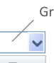

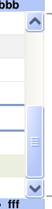

Look-ahead Scroll Bar (LASB) Notification

Look-ahead Scroll Bar Notification

|Col1|Drug Details|Col3|yyyy|zzzz|Start ▼|Col7|Col8|
|---|---|---|---|---|---|---|---|
||**ddd**– xxxx - xxxx **eee**– xxxx - xxxx **ccc**– xxxx - xxxx yyyy zzzz yyyy zzzz yyyy zzzz **aaa**·**     bbb** 2 more·**  kkk**·**  jjj**·**  iii **·**  ggg**·**  fff** **kkk**– xxxx - xxxx yyyy zzzz **Group A**(2) **Group B** **3** past medications were completed...|**ddd**– xxxx - xxxx **eee**– xxxx - xxxx **ccc**– xxxx - xxxx yyyy zzzz yyyy zzzz yyyy zzzz **aaa**·**     bbb** 2 more·**  kkk**·**  jjj**·**  iii **·**  ggg**·**  fff** **kkk**– xxxx - xxxx yyyy zzzz **Group A**(2) **Group B** **3** past medications were completed...|**ddd**– xxxx - xxxx **eee**– xxxx - xxxx **ccc**– xxxx - xxxx yyyy zzzz yyyy zzzz yyyy zzzz **aaa**·**     bbb** 2 more·**  kkk**·**  jjj**·**  iii **·**  ggg**·**  fff** **kkk**– xxxx - xxxx yyyy zzzz **Group A**(2) **Group B** **3** past medications were completed...|**aaa**·|**aaa**·|**     bbb**|**     bbb**|
||**ddd**– xxxx - xxxx **eee**– xxxx - xxxx **ccc**– xxxx - xxxx yyyy zzzz yyyy zzzz yyyy zzzz **aaa**·**     bbb** 2 more·**  kkk**·**  jjj**·**  iii **·**  ggg**·**  fff** **kkk**– xxxx - xxxx yyyy zzzz **Group A**(2) **Group B** **3** past medications were completed...|2 more·**  kkk**·**  jjj**·**  iii **·**  ggg**·**  fff**|2 more·**  kkk**·**  jjj**·**  iii **·**  ggg**·**  fff**|2 more·**  kkk**·**  jjj**·**  iii **·**  ggg**·**  fff**|2 more·**  kkk**·**  jjj**·**  iii **·**  ggg**·**  fff**|2 more·**  kkk**·**  jjj**·**  iii **·**  ggg**·**  fff**|2 more·**  kkk**·**  jjj**·**  iii **·**  ggg**·**  fff**|

For the sake of brevity, illustrations in sections other than the _Look-Ahead Scroll Bar_ **section** omit LASB notifications. Refer to that section for specific guidance on reserving space for, and displaying, LASB notifications.

**3**

Copyright ©2013 Health and Social Care Information Centre

### Structure and Layout

**Tabular Layout**

**Guidance**

MEDv-020

Present medications as lines of text within rows in a tabular format where each row represents one medication

Mandatory

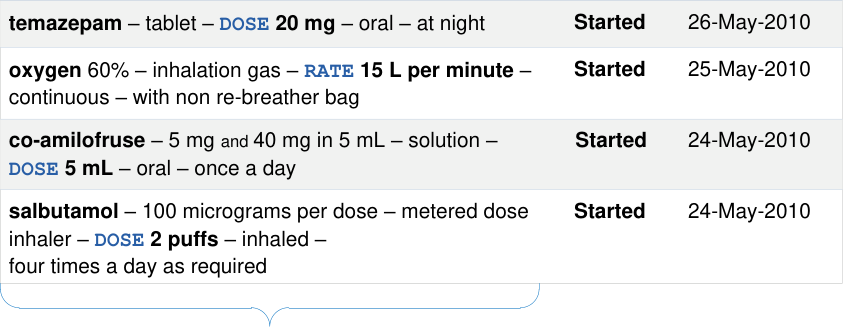

MEDv-141

Use composite columns to minimise the display of blank cells for some rows (that is, avoid placing each individual data point in a separate column)

_Recommended_

**4**

Copyright ©2013 Health and Social Care Information Centre

composite column

**Guidance**

### Structure and Layout

**Indicating List Length**

|Drug Details|Status|Start Date ▼|
|---|---|---|
|26-May-2010 **Started** **temazepam**– tablet –**`DOSE` 20 mg**– oral – at night|26-May-2010 **Started** **temazepam**– tablet –**`DOSE` 20 mg**– oral – at night|26-May-2010 **Started** **temazepam**– tablet –**`DOSE` 20 mg**– oral – at night|
|25-May-2010 **Started** **oxygen** 60% – inhalation gas –**`RATE` 15 L per minute**–  continuous – with non re-breather bag|25-May-2010 **Started** **oxygen** 60% – inhalation gas –**`RATE` 15 L per minute**–  continuous – with non re-breather bag|25-May-2010 **Started** **oxygen** 60% – inhalation gas –**`RATE` 15 L per minute**–  continuous – with non re-breather bag|
|**co-amilofruse**– 5 mgand40 mg in 5 mL – solution – **`DOSE` 5 mL**– oral – once a day 24-May-2010 **Started**|**co-amilofruse**– 5 mgand40 mg in 5 mL – solution – **`DOSE` 5 mL**– oral – once a day 24-May-2010 **Started**|**co-amilofruse**– 5 mgand40 mg in 5 mL – solution – **`DOSE` 5 mL**– oral – once a day 24-May-2010 **Started**|
|**Started** 24-May-2010 **salbutamol**– 100 micrograms per dose – metered dose inhaler –**`DOSE` 2 puffs**– inhaled – four times a day as required|**Started** 24-May-2010 **salbutamol**– 100 micrograms per dose – metered dose inhaler –**`DOSE` 2 puffs**– inhaled – four times a day as required|**Started** 24-May-2010 **salbutamol**– 100 micrograms per dose – metered dose inhaler –**`DOSE` 2 puffs**– inhaled – four times a day as required|
||||
||||

**5**

MEDv-142

When the list is scrolled to the end, display a space at the bottom of the list with a height equivalent to a line of text

_Recommended_

Copyright ©2013 Health and Social Care Information Centre

### Structure and Layout

**Gridlines and Row Formatting**

|temazepam – tablet – DOSE 20 mg – oral – at night Started 26-May-2010|Col2|
|---|---|
|25-May-2010 **Started** **oxygen** 60% – inhalation gas –**`RATE` 15 L per minute**–  continuous – with non re-breather bag|25-May-2010 **Started** **oxygen** 60% – inhalation gas –**`RATE` 15 L per minute**–  continuous – with non re-breather bag|
|**co-amilofruse**– 5 mgand40 mg in 5 mL – solution – **`DOSE` 5 mL**– oral – once a day 24-May-2010 **Started**|**co-amilofruse**– 5 mgand40 mg in 5 mL – solution – **`DOSE` 5 mL**– oral – once a day 24-May-2010 **Started**|
|**Started** 24-May-2010 **salbutamol**– 100 micrograms per dose – metered dose inhaler –**`DOSE` 2 puffs**– inhaled – four times a day as required|**Started** 24-May-2010 **salbutamol**– 100 micrograms per dose – metered dose inhaler –**`DOSE` 2 puffs**– inhaled – four times a day as required|

MEDv-021

Avoid the use of strong grids and strong vertical lines. (Use subtle methods to support distinguishing between rows in the list)

Mandatory

MEDv-022

Use subtle alternate row shading

_Recommended_

MEDv-143

Use at least alternate row shading or lines between rows

Mandatory

When using alternate row shading, ensure that colour and brightness of the background does not interfere with the readability of the foreground text

Mandatory

MEDv-145

Supplement alternate shading with 1 point pale lines between rows

_Recommended_

**6**

Copyright ©2013 Health and Social Care Information Centre

**Guidance**

Subtle gridlines between rows

MEDv-144

**Guidance**

### Structure and Layout

**Displaying Icons for Drug Details**

|Drug Details column|Col2|
|---|---|
|||
|28-May-2010 **B** **glyceryl trinitrate** – 400 micrograms per dose – sublingual spray –**`DOSE` 1 to 2 puffs**– sublingual – as required – maximum 3 doses in 15 minutes **Started**|28-May-2010 **B** **glyceryl trinitrate** – 400 micrograms per dose – sublingual spray –**`DOSE` 1 to 2 puffs**– sublingual – as required – maximum 3 doses in 15 minutes **Started**|
|27-May-2010 **Started** **B** **A** **lansoprazole** – orodispersible tablet – **`DOSE` 30 mg**– oral – once a day|27-May-2010 **Started** **B** **A** **lansoprazole** – orodispersible tablet – **`DOSE` 30 mg**– oral – once a day|
|27-May-2010 **Started** **A** **dalteparin** – 10,000 units per 1 mL – injection – **`DOSE` 10,000 units**– subcutaneous – twice a day|27-May-2010 **Started** **A** **dalteparin** – 10,000 units per 1 mL – injection – **`DOSE` 10,000 units**– subcutaneous – twice a day|
|||

MEDv-023

Support the display of icons following the text of the Drug Details column in the Medications List View

Mandatory

**Note** The lettered squares that have been used to represent icons are placeholders only and do not form part of the guidance

Copyright ©2013 Health and Social Care Information Centre

icon

**7**

**Guidance**

### Structure and Layout

**Empty Lists**

|Drug Details|Status|First Administration|
|---|---|---|
|_There are no current medications for this patient_|_There are no current medications for this patient_|_There are no current medications for this patient_|

MEDv-146

Display a message when a list is empty (for example, when there are no current medications)

Mandatory

**8**

Copyright ©2013 Health and Social Care Information Centre

**Guidance**

### Columns

**Mandatory Columns**

|drug details status information an initiation date|Col2|Col3|
|---|---|---|
||||
||||
|Drug Details|Status|**Start Date ▼**|
||||
|26-May-2010 **Started** **temazepam**– tablet –**`DOSE` 20 mg**– oral – at night|26-May-2010 **Started** **temazepam**– tablet –**`DOSE` 20 mg**– oral – at night|26-May-2010 **Started** **temazepam**– tablet –**`DOSE` 20 mg**– oral – at night|
|25-May-2010 **Started** **oxygen** 60% – inhalation gas –**`RATE` 15 L per minute**–  continuous – with non re-breather bag|25-May-2010 **Started** **oxygen** 60% – inhalation gas –**`RATE` 15 L per minute**–  continuous – with non re-breather bag|25-May-2010 **Started** **oxygen** 60% – inhalation gas –**`RATE` 15 L per minute**–  continuous – with non re-breather bag|
|**co-amilofruse**– 5 mgand40 mg in 5 mL – solution – **`DOSE` 5 mL**– oral – once a day 24-May-2010 **Started**|**co-amilofruse**– 5 mgand40 mg in 5 mL – solution – **`DOSE` 5 mL**– oral – once a day 24-May-2010 **Started**|**co-amilofruse**– 5 mgand40 mg in 5 mL – solution – **`DOSE` 5 mL**– oral – once a day 24-May-2010 **Started**|

MEDv-147

Provide a column that contains status information including information that defines whether the medication is ‘current’ or ‘past’

Mandatory

MEDv-148

Provide a column that contains drug details according to _Medication Line_ **[1]** guidance

Mandatory

**1** Medications Management – Medication Line – User Interface Design Guidance (v2.0.0.0)

**9**

Copyright ©2013 Health and Social Care Information Centre

### Columns

**Mandatory Columns**

|Drug Details|Status|Start Date ▼|
|---|---|---|
||||
|26-May-2010 **Started** **temazepam**– tablet –**`DOSE` 20 mg**– oral – at night|26-May-2010 **Started** **temazepam**– tablet –**`DOSE` 20 mg**– oral – at night|26-May-2010 **Started** **temazepam**– tablet –**`DOSE` 20 mg**– oral – at night|
|25-May-2010 **Started** **oxygen** 60% – inhalation gas –**`RATE` 15 L per minute**– continuous – with non re-breather bag|25-May-2010 **Started** **oxygen** 60% – inhalation gas –**`RATE` 15 L per minute**– continuous – with non re-breather bag|25-May-2010 **Started** **oxygen** 60% – inhalation gas –**`RATE` 15 L per minute**– continuous – with non re-breather bag|
|**co-amilofruse**– 5 mgand40 mg in 5 mL – solution –**`DOSE` 5 mL**– oral – once a day 24-May-2010 **Started**|**co-amilofruse**– 5 mgand40 mg in 5 mL – solution –**`DOSE` 5 mL**– oral – once a day 24-May-2010 **Started**|**co-amilofruse**– 5 mgand40 mg in 5 mL – solution –**`DOSE` 5 mL**– oral – once a day 24-May-2010 **Started**|

MEDv-149

**Guidance**

When displaying current medications, provide a column that contains an initiation date (such as the date of the first planned administration). The examples in this document show a Start Date column

Mandatory

|Status|Drug Details|End Date ▲|
|---|---|---|
||||
|**hydrochlorothiazide** – tablet –**`DOSE` 100 mg** – oral – 4 times a day **Completed** 26-May-2010|**hydrochlorothiazide** – tablet –**`DOSE` 100 mg** – oral – 4 times a day **Completed** 26-May-2010|**hydrochlorothiazide** – tablet –**`DOSE` 100 mg** – oral – 4 times a day **Completed** 26-May-2010|
|**methyldopa** – tablet –**`DOSE` 250 mg** – oral – twice a day **Discontinued** 25-May-2010|**methyldopa** – tablet –**`DOSE` 250 mg** – oral – twice a day **Discontinued** 25-May-2010|**methyldopa** – tablet –**`DOSE` 250 mg** – oral – twice a day **Discontinued** 25-May-2010|
|**furosemide** – tablet –**`DOSE` 40 mg** – oral – once a day **Completed** 24-May-2010|**furosemide** – tablet –**`DOSE` 40 mg** – oral – once a day **Completed** 24-May-2010|**furosemide** – tablet –**`DOSE` 40 mg** – oral – once a day **Completed** 24-May-2010|

MEDv-150

When displaying past medications, provide a column that contains a stop date (such as the date of the last administration or the date that the medication was discontinued). The examples in this document show an End Date column

Mandatory

**10**

Copyright ©2013 Health and Social Care Information Centre

**Guidance**

### Columns

**Date Columns**

The specific information to display in date columns is not part of guidance because it needs to differ between tasks and contexts. Guidance is therefore provided for the relative placement of date columns.

Illustrations in this document use column headings with the following labels:

 - **Start Date** for the start or initiation of a medication

 - **End Date** for the end or completion of a medication

|Drug Details|Status|Col3|Start Date ▼|End Date|
|---|---|---|---|---|
||||||
|26-May-2010 **Started** **temazepam**– tablet –**`DOSE` 20 mg**– oral – at night 03-Jun-2010|26-May-2010 **Started** **temazepam**– tablet –**`DOSE` 20 mg**– oral – at night 03-Jun-2010|26-May-2010 **Started** **temazepam**– tablet –**`DOSE` 20 mg**– oral – at night 03-Jun-2010|26-May-2010 **Started** **temazepam**– tablet –**`DOSE` 20 mg**– oral – at night 03-Jun-2010|26-May-2010 **Started** **temazepam**– tablet –**`DOSE` 20 mg**– oral – at night 03-Jun-2010|
|25-May-2010 **Started** **oxygen** 60% – inhalation gas –**`RATE` 15 L per minute**–  continuous – with non re-breather bag 09-Jun-2010|25-May-2010 **Started** **oxygen** 60% – inhalation gas –**`RATE` 15 L per minute**–  continuous – with non re-breather bag 09-Jun-2010|25-May-2010 **Started** **oxygen** 60% – inhalation gas –**`RATE` 15 L per minute**–  continuous – with non re-breather bag 09-Jun-2010|25-May-2010 **Started** **oxygen** 60% – inhalation gas –**`RATE` 15 L per minute**–  continuous – with non re-breather bag 09-Jun-2010|25-May-2010 **Started** **oxygen** 60% – inhalation gas –**`RATE` 15 L per minute**–  continuous – with non re-breather bag 09-Jun-2010|
|**co-amilofruse**– 5 mgand40 mg in 5 mL – solution – **`DOSE` 5 mL**– oral – once a day 24-May-2010 **Started** 06-Jun-2010|**co-amilofruse**– 5 mgand40 mg in 5 mL – solution – **`DOSE` 5 mL**– oral – once a day 24-May-2010 **Started** 06-Jun-2010|**co-amilofruse**– 5 mgand40 mg in 5 mL – solution – **`DOSE` 5 mL**– oral – once a day 24-May-2010 **Started** 06-Jun-2010|**co-amilofruse**– 5 mgand40 mg in 5 mL – solution – **`DOSE` 5 mL**– oral – once a day 24-May-2010 **Started** 06-Jun-2010|**co-amilofruse**– 5 mgand40 mg in 5 mL – solution – **`DOSE` 5 mL**– oral – once a day 24-May-2010 **Started** 06-Jun-2010|

MEDv-154

Maintain consistent placement of date columns relative to one another and relative to the Drug Details column in both current and past medications

Mandatory

**11**

When an end date column is displayed, place a start date column before (to the left of) the end date column

Mandatory

MEDv-152

When an end date column is displayed, and there is no duration column, place a start date column adjacent to the end date column

_Recommended_

Copyright ©2013 Health and Social Care Information Centre

MEDv-151

### Columns

**Date Columns**

**Guidance**

fixed width fixed width

|Drug Details|Status|Col3|Start Date ▼|End Date|
|---|---|---|---|---|
||||||
|26-May-2010 **Started** **temazepam**– tablet –**`DOSE` 20 mg**– oral – at night 03-Jun-2010|26-May-2010 **Started** **temazepam**– tablet –**`DOSE` 20 mg**– oral – at night 03-Jun-2010|26-May-2010 **Started** **temazepam**– tablet –**`DOSE` 20 mg**– oral – at night 03-Jun-2010|26-May-2010 **Started** **temazepam**– tablet –**`DOSE` 20 mg**– oral – at night 03-Jun-2010|26-May-2010 **Started** **temazepam**– tablet –**`DOSE` 20 mg**– oral – at night 03-Jun-2010|
|25-May-2010 **Started** **oxygen** 60% – inhalation gas –**`RATE` 15 L per minute**–  continuous – with non re-breather bag 09-Jun-2010|25-May-2010 **Started** **oxygen** 60% – inhalation gas –**`RATE` 15 L per minute**–  continuous – with non re-breather bag 09-Jun-2010|25-May-2010 **Started** **oxygen** 60% – inhalation gas –**`RATE` 15 L per minute**–  continuous – with non re-breather bag 09-Jun-2010|25-May-2010 **Started** **oxygen** 60% – inhalation gas –**`RATE` 15 L per minute**–  continuous – with non re-breather bag 09-Jun-2010|25-May-2010 **Started** **oxygen** 60% – inhalation gas –**`RATE` 15 L per minute**–  continuous – with non re-breather bag 09-Jun-2010|
|**co-amilofruse**– 5 mgand40 mg in 5 mL – solution – **`DOSE` 5 mL**– oral – once a day 24-May-2010 **Started** 06-Jun-2010|**co-amilofruse**– 5 mgand40 mg in 5 mL – solution – **`DOSE` 5 mL**– oral – once a day 24-May-2010 **Started** 06-Jun-2010|**co-amilofruse**– 5 mgand40 mg in 5 mL – solution – **`DOSE` 5 mL**– oral – once a day 24-May-2010 **Started** 06-Jun-2010|**co-amilofruse**– 5 mgand40 mg in 5 mL – solution – **`DOSE` 5 mL**– oral – once a day 24-May-2010 **Started** 06-Jun-2010|**co-amilofruse**– 5 mgand40 mg in 5 mL – solution – **`DOSE` 5 mL**– oral – once a day 24-May-2010 **Started** 06-Jun-2010|

MEDv-153

Use fixed width columns for dates

Mandatory

**12**

Copyright ©2013 Health and Social Care Information Centre

**Guidance**

### Columns

**Column Headings**

Drug Details Status **Start Date ▼** End Date

MEDv-155

Label columns with text that describes the contents unambiguously and succinctly (such as, ‘Status’, ‘Date Prescribed’ or ‘First Administration’)

_Recommended_

MEDv-156

Use a unique heading for each column

Mandatory

**13**

Copyright ©2013 Health and Social Care Information Centre

### Columns

**Composite Columns**

**Review and End Dates ▼**

**Review** 06-Jun-2010 **End** 12-Jun-2010

**Review** 08-Jun-2010 **End** 08-Jun-2010

**Guidance**

MEDv-027

Allow columns to contain more than one attribute for a single medication

Mandatory

MEDv-157

When combining two attributes that have the same data type (such as dates), include labels for both attributes in the column heading

Mandatory

MEDv-158

When combining two attributes that have the same data types (such as dates), include labels for both attributes within the cell

Mandatory

Copyright ©2013 Health and Social Care Information Centre

**14**

**Guidance**

### Columns

**Constraining Dimensions**

MEDv-159

Maintain the relative proportions of columns such that the Drug Details column is the widest

Mandatory

MEDv-161

Define minimum widths for all columns

_Recommended_

|widest column|Col2|Col3|Col4|Col5|
|---|---|---|---|---|
||||||
|Drug Details|Status||**Start Date  ▼**|End Date|
||||||
|26-May-2010 **Started** **temazepam**– tablet –**`DOSE` 20 mg**– oral – at night 03-Jun-2010|26-May-2010 **Started** **temazepam**– tablet –**`DOSE` 20 mg**– oral – at night 03-Jun-2010|26-May-2010 **Started** **temazepam**– tablet –**`DOSE` 20 mg**– oral – at night 03-Jun-2010|26-May-2010 **Started** **temazepam**– tablet –**`DOSE` 20 mg**– oral – at night 03-Jun-2010|26-May-2010 **Started** **temazepam**– tablet –**`DOSE` 20 mg**– oral – at night 03-Jun-2010|
|25-May-2010 **Started** **oxygen** 60% – inhalation gas –**`RATE` 15 L per minute**–  continuous – with non re-breather bag 09-Jun-2010|25-May-2010 **Started** **oxygen** 60% – inhalation gas –**`RATE` 15 L per minute**–  continuous – with non re-breather bag 09-Jun-2010|25-May-2010 **Started** **oxygen** 60% – inhalation gas –**`RATE` 15 L per minute**–  continuous – with non re-breather bag 09-Jun-2010|25-May-2010 **Started** **oxygen** 60% – inhalation gas –**`RATE` 15 L per minute**–  continuous – with non re-breather bag 09-Jun-2010|25-May-2010 **Started** **oxygen** 60% – inhalation gas –**`RATE` 15 L per minute**–  continuous – with non re-breather bag 09-Jun-2010|
|**co-amilofruse**– 5 mgand40 mg in 5 mL – solution – **`DOSE` 5 mL**– oral – once a day 24-May-2010 **Started** 06-Jun-2010|**co-amilofruse**– 5 mgand40 mg in 5 mL – solution – **`DOSE` 5 mL**– oral – once a day 24-May-2010 **Started** 06-Jun-2010|**co-amilofruse**– 5 mgand40 mg in 5 mL – solution – **`DOSE` 5 mL**– oral – once a day 24-May-2010 **Started** 06-Jun-2010|**co-amilofruse**– 5 mgand40 mg in 5 mL – solution – **`DOSE` 5 mL**– oral – once a day 24-May-2010 **Started** 06-Jun-2010|**co-amilofruse**– 5 mgand40 mg in 5 mL – solution – **`DOSE` 5 mL**– oral – once a day 24-May-2010 **Started** 06-Jun-2010|
||||||

**15**

limited number of columns

MEDv-160

Avoid the need for horizontal scrolling by limiting the number of columns visible at any one time

Mandatory

Copyright ©2013 Health and Social Care Information Centre

### Status

**Guidance**

MEDv-162

Ensure that all medications have a status value and the status cannot be blank

Mandatory

MEDv-163

Limit status descriptions to short phrases, preferably no more than two words

_Recommended_

MEDv-042

Display the status of each medication in bold

Mandatory

MEDv-164

Allow status to be supplemented with additional information (such as pharmacy verified)

_Recommended_

MEDv-165

Use the status description to differentiate between medications that have no recorded administration events and those that have

Mandatory

|Col1|Col2|Col3|Col4|
|---|---|---|---|
||Status|**Star**||
|**Not Started** 29-|**Not Started** 29-|**Not Started** 29-|M M M|
|**Started** 25-|**Started** 25-|**Started** 25-|**Started** 25-|
|**Started** 24-|**Started** 24-|**Started** 24-|**Started** 24-|
|||||

|Col1|Col2|Col3|Col4|
|---|---|---|---|
||Status|**Star**||
|**Not Started** Verified 29-|**Not Started** Verified 29-|**Not Started** Verified 29-|M|
|**Started** Not Verified 25-|**Started** Not Verified 25-|**Started** Not Verified 25-|M|
|**Started** Verified 24-|**Started** Verified 24-|**Started** Verified 24-|M|
|||||

Copyright ©2013 Health and Social Care Information Centre

**16**

**Guidance**

### Status

**17**

MEDv-167

Assign a status of ‘Started’ to medications that have an administration event recorded and have further scheduled administrations

_Recommended_

MEDv-168

Assign a status of ‘Not Started’ to medications that have an administration scheduled and a start date in the future

_Recommended_

MEDv-170

Assign a status of ‘Completed’ to medications that have administration events recorded according to their schedule (within tolerances) and have an end date in the past

_Recommended_

MEDv-171

Assign a status of ‘Discontinued’ to medications that were stopped on a date that preceded one or more of the scheduled administrations

_Recommended_

Copyright ©2013 Health and Social Care Information Centre

|Col1|Col2|Col3|Col4|
|---|---|---|---|
||Status|**Star**||
|**Started** 25-|**Started** 25-|**Started** 25-|M|
|||||

|Col1|Col2|Col3|Col4|
|---|---|---|---|
||Status|**Star**||
|**Not Started** 29-|**Not Started** 29-|**Not Started** 29-|M|
|||||

|Status|Drug Details|Col3|
|---|---|---|
|**Completed** **hydrochl**|**Completed** **hydrochl**||

|Status|Drug Details|Col3|
|---|---|---|
|**Discontinued** **methyld**|**Discontinued** **methyld**||

### Status

**Guidance**

MEDv-166

Support a status of ‘suspended’ and include medications with this status in current medications

Mandatory

MEDv-169

Assign a status of ‘Suspended’ to medications that are marked as not to be administered but which are intended to be resumed at a later date

_Recommended_

MEDv-024

Use visual design to draw attention to suspended medications

Mandatory

|Col1|Status|Star|Col4|
|---|---|---|---|
||**Suspended on** 30-May-2008|24-|M|

Copyright ©2013 Health and Social Care Information Centre

**18**

**Guidance**

### Status

|Drug Details|Status|Start Date ▼|
|---|---|---|
||||
|26-May-2010 **Started** **temazepam**– tablet –**`DOSE` 20 mg**– oral – at night|26-May-2010 **Started** **temazepam**– tablet –**`DOSE` 20 mg**– oral – at night|26-May-2010 **Started** **temazepam**– tablet –**`DOSE` 20 mg**– oral – at night|
|25-May-2010 **Started** **oxygen** 60% – inhalation gas –**`RATE` 15 L per minute**– continuous – with non re-breather bag|25-May-2010 **Started** **oxygen** 60% – inhalation gas –**`RATE` 15 L per minute**– continuous – with non re-breather bag|25-May-2010 **Started** **oxygen** 60% – inhalation gas –**`RATE` 15 L per minute**– continuous – with non re-breather bag|
|**co-amilofruse**– 5 mgand40 mg in 5 mL – solution –**`DOSE` 5 mL**– oral – once a day 24-May-2010 **Started**|**co-amilofruse**– 5 mgand40 mg in 5 mL – solution –**`DOSE` 5 mL**– oral – once a day 24-May-2010 **Started**|**co-amilofruse**– 5 mgand40 mg in 5 mL – solution –**`DOSE` 5 mL**– oral – once a day 24-May-2010 **Started**|

MEDv-025 MEDv-172

Use visual design to distinguish a list of current medications from a list of past medications

MEDv-025

Mandatory

Define medications with a status of either ‘Started’, ‘Not Started’ or ‘Suspended’ as current medications

_Recommended_

|Status|Drug Details|End Date ▲|
|---|---|---|
||||
|**hydrochlorothiazide** – tablet –**`DOSE` 100 mg** – oral – 4 times a day **Completed** 26-May-2010|**hydrochlorothiazide** – tablet –**`DOSE` 100 mg** – oral – 4 times a day **Completed** 26-May-2010|**hydrochlorothiazide** – tablet –**`DOSE` 100 mg** – oral – 4 times a day **Completed** 26-May-2010|
|**methyldopa** – tablet –**`DOSE` 250 mg** – oral – twice a day **Discontinued** 25-May-2010|**methyldopa** – tablet –**`DOSE` 250 mg** – oral – twice a day **Discontinued** 25-May-2010|**methyldopa** – tablet –**`DOSE` 250 mg** – oral – twice a day **Discontinued** 25-May-2010|
|**furosemide** – tablet –**`DOSE` 40 mg** – oral – once a day **Completed** 24-May-2010|**furosemide** – tablet –**`DOSE` 40 mg** – oral – once a day **Completed** 24-May-2010|**furosemide** – tablet –**`DOSE` 40 mg** – oral – once a day **Completed** 24-May-2010|

**19**

Define medications with a status of ‘Completed’ or ‘Discontinued’ as past medications

_Recommended_

Copyright ©2013 Health and Social Care Information Centre

MEDv-173

### Current and Past Medications

**Controls**

|Current Past|Past|Col3|
|---|---|---|
||||

default selection

one is selected

**Guidance**

MEDv-063

Provide buttons for displaying current and past medications respectively in the Medications List View and label the buttons ‘Current’ and ‘Past’

Mandatory

MEDv-062

Present the Medications List View with **Current** selected by default

Mandatory

MEDv-065

Do not allow **Current** and **Past** buttons to be selected simultaneously

Mandatory

MEDv-174

Ensure that either the **Current** or the **Past** button is selected at any one time

Mandatory

Copyright ©2013 Health and Social Care Information Centre

**20**

**Guidance**

### Current and Past Medications

**Controls**

Example of Current and Past buttons

Example of Current and Past buttons in an alternative style

MEDv-064

Use the visual formatting of the **Current** and **Past** buttons to indicate which is currently selected

Mandatory

MEDv-066

Supplement the **Past** button in the Medications List View with a drop-down control for displaying, selecting and applying a filter on the past medications view

Mandatory

MEDv-067

Include an option for displaying all past medications in the drop-down control

Mandatory

Copyright ©2013 Health and Social Care Information Centre

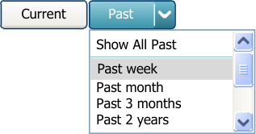

**21**

### Current and Past Medications

**Current Medications**

|Drug Details|Status|Start Date ▼|
|---|---|---|
||||
|26-May-2010 **Started** **temazepam**– tablet –**`DOSE` 20 mg**– oral – at night|26-May-2010 **Started** **temazepam**– tablet –**`DOSE` 20 mg**– oral – at night|26-May-2010 **Started** **temazepam**– tablet –**`DOSE` 20 mg**– oral – at night|
|25-May-2010 **Started** **oxygen** 60% – inhalation gas –**`RATE` 15 L per minute**– continuous – with non re-breather bag|25-May-2010 **Started** **oxygen** 60% – inhalation gas –**`RATE` 15 L per minute**– continuous – with non re-breather bag|25-May-2010 **Started** **oxygen** 60% – inhalation gas –**`RATE` 15 L per minute**– continuous – with non re-breather bag|
|**co-amilofruse**– 5 mgand40 mg in 5 mL – solution –**`DOSE` 5 mL**– oral – once a day 24-May-2010 **Started**|**co-amilofruse**– 5 mgand40 mg in 5 mL – solution –**`DOSE` 5 mL**– oral – once a day 24-May-2010 **Started**|**co-amilofruse**– 5 mgand40 mg in 5 mL – solution –**`DOSE` 5 mL**– oral – once a day 24-May-2010 **Started**|

MEDv-099

**Guidance**

By default, present current medications sorted reverse chronologically by a starting date, such that the most recent is first (top) in the list

Mandatory

MEDv-173

When displaying current medications, place the drug details in the first (furthest left) column

Mandatory

Copyright ©2013 Health and Social Care Information Centre

**22**

**Guidance**

### Current and Past Medications

**Recent Past Notifications**

|Drug Details|Status|Start Date ▼|
|---|---|---|
|25-May-2010 **Started** **oxygen** 60% – inhalation gas –**`RATE` 15 L per minute**–  continuous – with non re-breather bag|25-May-2010 **Started** **oxygen** 60% – inhalation gas –**`RATE` 15 L per minute**–  continuous – with non re-breather bag|25-May-2010 **Started** **oxygen** 60% – inhalation gas –**`RATE` 15 L per minute**–  continuous – with non re-breather bag|
|**co-amilofruse**– 5 mgand40 mg in 5 mL – solution – **`DOSE` 5 mL**– oral – once a day 24-May-2010 **Started**|**co-amilofruse**– 5 mgand40 mg in 5 mL – solution – **`DOSE` 5 mL**– oral – once a day 24-May-2010 **Started**|**co-amilofruse**– 5 mgand40 mg in 5 mL – solution – **`DOSE` 5 mL**– oral – once a day 24-May-2010 **Started**|
|**Started** 24-May-2010 **salbutamol**– 100 micrograms per dose – metered dose inhaler –**`DOSE` 2 puffs**– inhaled – four times a day as required|**Started** 24-May-2010 **salbutamol**– 100 micrograms per dose – metered dose inhaler –**`DOSE` 2 puffs**– inhaled – four times a day as required|**Started** 24-May-2010 **salbutamol**– 100 micrograms per dose – metered dose inhaler –**`DOSE` 2 puffs**– inhaled – four times a day as required|
|**2** past medications were completed or discontinued in the last 48 hours|**2** past medications were completed or discontinued in the last 48 hours|**2** past medications were completed or discontinued in the last 48 hours|
||||

MEDv-074

**23**

When displaying current medications, display a notification for medications that have been completed or discontinued within a specified time interval from the current time

Mandatory

MEDv-174

Use formatting to distinguish the recent past notifications from medications in the list

_Recommended_

Copyright ©2013 Health and Social Care Information Centre

**Guidance**

### Current and Past Medications

**Recent Past Notifications**

Time interval

MEDv-075

Clearly display the time interval within the recent past notification

Mandatory

count

MEDv-077

Display a count of the number of recently past medications within the recent past notification in the medication list

Mandatory

Copyright ©2013 Health and Social Care Information Centre

**24**

**Guidance**

### Current and Past Medications

**Past Medications**

First Column

Second Column

MEDv-175

When displaying past medications, place the status column first (furthest left) and the Drug Details column second

Mandatory

|Status Drug Details|Col2|Col3|
|---|---|---|
||||
|Status|Drug Details|**End Date ▲**|
||||
|**hydrochlorothiazide** – tablet –**`DOSE` 100 mg** – oral – 4 times a day **Completed** 26-May-2010|**hydrochlorothiazide** – tablet –**`DOSE` 100 mg** – oral – 4 times a day **Completed** 26-May-2010|**hydrochlorothiazide** – tablet –**`DOSE` 100 mg** – oral – 4 times a day **Completed** 26-May-2010|
|**methyldopa** – tablet –**`DOSE` 250 mg** – oral – twice a day **Discontinued** 25-May-2010|**methyldopa** – tablet –**`DOSE` 250 mg** – oral – twice a day **Discontinued** 25-May-2010|**methyldopa** – tablet –**`DOSE` 250 mg** – oral – twice a day **Discontinued** 25-May-2010|
|**furosemide** – tablet –**`DOSE` 40 mg** – oral – once a day **Completed** 24-May-2010|**furosemide** – tablet –**`DOSE` 40 mg** – oral – once a day **Completed** 24-May-2010|**furosemide** – tablet –**`DOSE` 40 mg** – oral – once a day **Completed** 24-May-2010|

**25**

By default, sort medications reverse chronologically by end date (or equivalent) such that the most recent is first (top) when the filter is set to ‘Past’ in the Medications List View

_Recommended_

Copyright ©2013 Health and Social Care Information Centre

MEDv-100

### Filtering

**Filtering Past Medications**

**Guidance**

MEDv-069

When a filter is applied to past medications in Medications List View, the Past button should indicate that it is currently selected

Mandatory

|Status|Drug Details|End Date ▲|
|---|---|---|
|The total list (54) is filtered to show: Past 2 months (3) Remove Filter|The total list (54) is filtered to show: Past 2 months (3) Remove Filter|The total list (54) is filtered to show: Past 2 months (3) Remove Filter|
|**hydrochlorothiazide** – tablet –**`DOSE` 100 mg** – oral – 4 times a day **Completed** 26-May-2010|**hydrochlorothiazide** – tablet –**`DOSE` 100 mg** – oral – 4 times a day **Completed** 26-May-2010|**hydrochlorothiazide** – tablet –**`DOSE` 100 mg** – oral – 4 times a day **Completed** 26-May-2010|
|**methyldopa** – tablet –**`DOSE` 250 mg** – oral – twice a day **Discontinued** 25-May-2010|**methyldopa** – tablet –**`DOSE` 250 mg** – oral – twice a day **Discontinued** 25-May-2010|**methyldopa** – tablet –**`DOSE` 250 mg** – oral – twice a day **Discontinued** 25-May-2010|
|**furosemide** – tablet –**`DOSE` 40 mg** – oral – once a day **Completed** 24-May-2010|**furosemide** – tablet –**`DOSE` 40 mg** – oral – once a day **Completed** 24-May-2010|**furosemide** – tablet –**`DOSE` 40 mg** – oral – once a day **Completed** 24-May-2010|
||||

MEDv-070

When a filter is applied to past medications in the Medications List View, display a filter notification at the top of the list below the column headings and above the scroll bar (thus ‘pushing’ the list of medications down a line)

Mandatory

Copyright ©2013 Health and Social Care Information Centre

**26**

**Guidance**

### Filtering

**Filtering Past Medications**

MEDv-068

When a filter notification is displayed, include a control for removing the filter within that notification

Mandatory

MEDv-071

Display a description of the filter in use within the filter notification in the Medications List View

Mandatory

count of unfiltered total

count of filtered total

MEDv-072

Include a count of the number of medications displayed and a count of the total (unfiltered) number of past medications in a filter notification

_Recommended_

MEDv-176

Clearly label the counts (number of medications displayed and total unfiltered number) with text that allows them to be differentiated

_Recommended_

Copyright ©2013 Health and Social Care Information Centre

**27**

**Guidance**

### Look-Ahead Scroll Bar

A look-ahead scroll bar (LASB) is a standard scroll bar that is supplemented with notifications at the top and bottom to indicate that there are items in the list that are not currently visible.

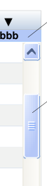

Look-ahead scroll bar notification

**Look-ahead**
**scroll bar**

Look-ahead scroll bar notification

Medications

|Drug Details|Col2|yyyy|zzzz|Start ▼|Col6|
|---|---|---|---|---|---|
||||**aaa**·|**aaa**·|**   bbb**|
|**ddd**– xxxx - xxxx **eee**– xxxx - xxxx **ccc**– xxxx - xxxx yyyy zzzz yyyy zzzz yyyy zzzz        **fff**– xxxx - xxxx yyyy zzzz **ggg**– xxxx - xxxx yyyy zzzz **hhh**– xxxx - xxxx yyyy zzzz **iii**– xxxx - xxxx yyyy zzzz **jjj**– xxxx - xxxx yyyy zzzz|**ddd**– xxxx - xxxx **eee**– xxxx - xxxx **ccc**– xxxx - xxxx yyyy zzzz yyyy zzzz yyyy zzzz        **fff**– xxxx - xxxx yyyy zzzz **ggg**– xxxx - xxxx yyyy zzzz **hhh**– xxxx - xxxx yyyy zzzz **iii**– xxxx - xxxx yyyy zzzz **jjj**– xxxx - xxxx yyyy zzzz|**ddd**– xxxx - xxxx **eee**– xxxx - xxxx **ccc**– xxxx - xxxx yyyy zzzz yyyy zzzz yyyy zzzz        **fff**– xxxx - xxxx yyyy zzzz **ggg**– xxxx - xxxx yyyy zzzz **hhh**– xxxx - xxxx yyyy zzzz **iii**– xxxx - xxxx yyyy zzzz **jjj**– xxxx - xxxx yyyy zzzz|**ddd**– xxxx - xxxx **eee**– xxxx - xxxx **ccc**– xxxx - xxxx yyyy zzzz yyyy zzzz yyyy zzzz        **fff**– xxxx - xxxx yyyy zzzz **ggg**– xxxx - xxxx yyyy zzzz **hhh**– xxxx - xxxx yyyy zzzz **iii**– xxxx - xxxx yyyy zzzz **jjj**– xxxx - xxxx yyyy zzzz|**ddd**– xxxx - xxxx **eee**– xxxx - xxxx **ccc**– xxxx - xxxx yyyy zzzz yyyy zzzz yyyy zzzz        **fff**– xxxx - xxxx yyyy zzzz **ggg**– xxxx - xxxx yyyy zzzz **hhh**– xxxx - xxxx yyyy zzzz **iii**– xxxx - xxxx yyyy zzzz **jjj**– xxxx - xxxx yyyy zzzz|**ddd**– xxxx - xxxx **eee**– xxxx - xxxx **ccc**– xxxx - xxxx yyyy zzzz yyyy zzzz yyyy zzzz        **fff**– xxxx - xxxx yyyy zzzz **ggg**– xxxx - xxxx yyyy zzzz **hhh**– xxxx - xxxx yyyy zzzz **iii**– xxxx - xxxx yyyy zzzz **jjj**– xxxx - xxxx yyyy zzzz|
||2 more ·** ooo**·** nnn**·** mmm **·** lll**·** kkk**|2 more ·** ooo**·** nnn**·** mmm **·** lll**·** kkk**|2 more ·** ooo**·** nnn**·** mmm **·** lll**·** kkk**|2 more ·** ooo**·** nnn**·** mmm **·** lll**·** kkk**|2 more ·** ooo**·** nnn**·** mmm **·** lll**·** kkk**|

Alert Icon

Diagram of a Medications List View

MEDv-177

When displaying a list of current or past medications, and the scroll bar is active because the list is longer than the space available to display them, provide a clear indication that there are medications out of view

Mandatory

MEDv-178

When displaying current medications, supplement the standard scroll bar with notifications that display the names of drugs that are out of view. This document refers to this kind of scroll bar as a look-ahead scroll bar (LASB)

_Recommended_

Copyright ©2013 Health and Social Care Information Centre

**28**

**Guidance**

### Look-Ahead Scroll Bar

**Layout**

MEDv-179

When displaying a LASB, reserve a space at the top and bottom of the list for look-ahead notifications

Mandatory

MEDv-180

Use a pale solid background colour for the space reserved for look-ahead notifications that is sufficient to distinguish the space from the background of the list

_Recommended_

Copyright ©2013 Health and Social Care Information Centre

|space|Col2|Col3|Col4|
|---|---|---|---|
|space|space|space|space|
|Drug Details|yyyy|zzzz|**Start  ▼**|
|||||
|**ddd**– xxxx - xxxx **eee**– xxxx - xxxx **ccc**– xxxx - xxxx yyyy zzzz yyyy zzzz yyyy zzzz **fff**– xxxx - xxxx yyyy zzzz **ggg**– xxxx - xxxx yyyy zzzz **hhh**– xxxx - xxxx yyyy zzzz|**ddd**– xxxx - xxxx **eee**– xxxx - xxxx **ccc**– xxxx - xxxx yyyy zzzz yyyy zzzz yyyy zzzz **fff**– xxxx - xxxx yyyy zzzz **ggg**– xxxx - xxxx yyyy zzzz **hhh**– xxxx - xxxx yyyy zzzz|**ddd**– xxxx - xxxx **eee**– xxxx - xxxx **ccc**– xxxx - xxxx yyyy zzzz yyyy zzzz yyyy zzzz **fff**– xxxx - xxxx yyyy zzzz **ggg**– xxxx - xxxx yyyy zzzz **hhh**– xxxx - xxxx yyyy zzzz|**ddd**– xxxx - xxxx **eee**– xxxx - xxxx **ccc**– xxxx - xxxx yyyy zzzz yyyy zzzz yyyy zzzz **fff**– xxxx - xxxx yyyy zzzz **ggg**– xxxx - xxxx yyyy zzzz **hhh**– xxxx - xxxx yyyy zzzz|
|||||
|||||

|pale colour Status Start Date ▼ aspirin · paracetamol|Col2|Col3|Col4|
|---|---|---|---|
|Status|Status|**Start Date  ▼**|**Start Date  ▼**|
||**aspirin**·**  paracetamol**|**aspirin**·**  paracetamol**|**aspirin**·**  paracetamol**|
|||||
|||||

**29**

**Guidance**

### Look-Ahead Scroll Bar

**Grouping**

|Drug Details|Status|Col3|Start Date ▼|
|---|---|---|---|
|||**aspirin**·** paracetamol**|**aspirin**·** paracetamol**|
|**Started** 24-May-2010 **salbutamol**– 100 micrograms per dose – metered dose inhaler –**`DOSE` 2 puffs**– inhaled – four times a day as required **Inhaled** **Rectal**(1) **Intravenous**(3)|**Started** 24-May-2010 **salbutamol**– 100 micrograms per dose – metered dose inhaler –**`DOSE` 2 puffs**– inhaled – four times a day as required **Inhaled** **Rectal**(1) **Intravenous**(3)|**Started** 24-May-2010 **salbutamol**– 100 micrograms per dose – metered dose inhaler –**`DOSE` 2 puffs**– inhaled – four times a day as required **Inhaled** **Rectal**(1) **Intravenous**(3)|**Started** 24-May-2010 **salbutamol**– 100 micrograms per dose – metered dose inhaler –**`DOSE` 2 puffs**– inhaled – four times a day as required **Inhaled** **Rectal**(1) **Intravenous**(3)|
|||||

MEDv-181

Example in which the first group in the list has been scrolled out of view. This group contains aspirin and paracetamol.

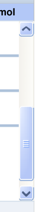

When grouping is applied, and there is a collapsed group out of view, display drug names in the look-ahead scroll bar for any drug that is out of view, irrespective of whether it is within a collapsed group or an expanded group

_Recommended_

MEDv-185

Do not include additional text or formatting to indicate grouping in the look-ahead notifications

Mandatory

Copyright ©2013 Health and Social Care Information Centre

**30**

**Guidance**

### Look-Ahead Scroll Bar

**Interaction**

|Col1|Col2|Col3|
|---|---|---|
|**ddd**– xxxx - xxxx **eee**– xxxx - xxxx **ccc**– xxxx - xxxx yyyy zzzz yyyy zzzz yyyy zzzz|**ddd**– xxxx - xxxx **eee**– xxxx - xxxx **ccc**– xxxx - xxxx yyyy zzzz yyyy zzzz yyyy zzzz|**ddd**– xxxx - xxxx **eee**– xxxx - xxxx **ccc**– xxxx - xxxx yyyy zzzz yyyy zzzz yyyy zzzz|
||||

MEDv-058

Update the look-ahead notifications dynamically in response to scrolling

Mandatory

MEDv-059

Allow the look-ahead notification to change width dynamically to accommodate its contents up to the available width

Mandatory

MEDv-182

Do not allow the look-ahead notification to be used for navigation by clicking on areas of the notification, such as drug names or counts

Mandatory

Copyright ©2013 Health and Social Care Information Centre

|Status Start Date ▼ aspirin · paracetamol|Col2|Col3|Col4|
|---|---|---|---|
|Status|Status|**Start Date  ▼**|**Start Date  ▼**|
||**aspirin**·**  paracetamol**|**aspirin**·**  paracetamol**|**aspirin**·**  paracetamol**|
|||||
|||||

|Status Start Date ▼ aspirin · paracetamol|Col2|Col3|Col4|
|---|---|---|---|
|Status|Status|**Start Date  ▼**|**Start Date  ▼**|
||**aspirin**·**  paracetamol**|**aspirin**·**  paracetamol**|**aspirin**·**  paracetamol**|
|||||
|||||

**31**

### Look-Ahead Scroll Bar

**aspirin**       - **paracetamol**

notification

up arrow

**Guidance**

MEDv-044

Restrict the look-ahead notifications to a single line each

Mandatory

MEDv-043

The look-ahead notifications should be clearly joined to the ‘up’ and ‘down’ arrow controls of the scroll bar respectively

Mandatory

MEDv-045

Do not place controls or other notifications such that they separate the look-ahead notification from the medications in the Medication List View

Mandatory

|Start Date ▼ aspirin · paracetamol|Col2|Col3|
|---|---|---|
|||**Start Date  ▼**|
||**aspirin**·**  paracetamol**|**aspirin**·**  paracetamol**|
||||
||||

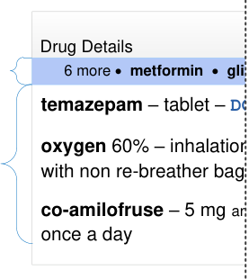

notification

medications

Copyright ©2013 Health and Social Care Information Centre

**32**

**Guidance**

### Look-Ahead Scroll Bar

**Order of Contents**

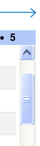

MEDv-049

The order of both the items in the look-ahead notification and the medications list should always be the same

Mandatory

MEDv-048

The look-ahead notification is populated from right to left such that the next drug in the list appears closest to the scroll bar

Mandatory

|Col1|Col2|1 · 2 · 3 · 4 · 5|
|---|---|---|
|**7 **– xxxx - xxxx **8 **– xxxx - xxxx **6 **– xxxx - xxxx yyyy zzzz yyyy zzzz yyyy zzzz **9 **– xxxx - xxxx **10**– xxxx - xxxx yyyy zzzz yyyy zzzz **11**– xxxx - xxxx yyyy zzzz |**7 **– xxxx - xxxx **8 **– xxxx - xxxx **6 **– xxxx - xxxx yyyy zzzz yyyy zzzz yyyy zzzz **9 **– xxxx - xxxx **10**– xxxx - xxxx yyyy zzzz yyyy zzzz **11**– xxxx - xxxx yyyy zzzz |**7 **– xxxx - xxxx **8 **– xxxx - xxxx **6 **– xxxx - xxxx yyyy zzzz yyyy zzzz yyyy zzzz **9 **– xxxx - xxxx **10**– xxxx - xxxx yyyy zzzz yyyy zzzz **11**– xxxx - xxxx yyyy zzzz |
||**16**·**  15**·**  14**·**  13**·**  12**|**16**·**  15**·**  14**·**  13**·**  12**|

|Col1|Col2|
|---|---|
|25-May-2010 **Started** **oxygen** 60% – inhalation gas –**`RATE` 15 L per minute**–  continuous – with non re-breather bag|25-May-2010 **Started** **oxygen** 60% – inhalation gas –**`RATE` 15 L per minute**–  continuous – with non re-breather bag|
|**co-amilofruse**– 5 mgand40 mg in 5 mL – solution – **`DOSE` 5 mL**– oral – once a day 24-May-2010 **Started**|**co-amilofruse**– 5 mgand40 mg in 5 mL – solution – **`DOSE` 5 mL**– oral – once a day 24-May-2010 **Started**|
|~~**Started**~~ ~~24-May-2010~~ ~~**salbutamol**– 100 micrograms per dose – metered dose inhaler –~~|~~**Started**~~ ~~24-May-2010~~ ~~**salbutamol**– 100 micrograms per dose – metered dose inhaler –~~|
| **`DOSE` 2 puffs**|  inhaled – four times a day as required 4 more·** paracetamol**·** atenolol**·** ramipril**·** clopidogrel**·** fluticasone**·** tiotropium**·** salbutamol**|
|||

MEDv-183

**33**

If any of the drug name text (other than the letter ascenders and descenders) is obscured by the boundaries of the list, include that drug in the look-ahead notification

_Recommended_

Copyright ©2013 Health and Social Care Information Centre

### Look-Ahead Scroll Bar

**Counts**

|Col1|oxygen 60% – inhalation gas – R continuous – with non re-breather co-amilofruse – 5 mg and 40 mg DOSE 5 mL – oral – once a day salbutamol – 100 micrograms pe inhaler – DOSE 2 puffs – inhaled –|Col3|Col4|
|---|---|---|---|
|4 more ·** paracetamol**·** atenolo**   continuous – with non re-breathe **salbutamol**– 100 micrograms p inhaler –**`DOSE` 2 puffs**– inhaled **co-amilofruse**– 5 mgand40 mg **`DOSE` 5 mL**– oral – once a day| continuous – with non re-breathe **salbutamol**– 100 micrograms p inhaler –**`DOSE` 2 puffs**– inhaled **co-amilofruse**– 5 mgand40 mg **`DOSE` 5 mL**– oral – once a day| continuous – with non re-breathe **salbutamol**– 100 micrograms p inhaler –**`DOSE` 2 puffs**– inhaled **co-amilofruse**– 5 mgand40 mg **`DOSE` 5 mL**– oral – once a day| continuous – with non re-breathe **salbutamol**– 100 micrograms p inhaler –**`DOSE` 2 puffs**– inhaled **co-amilofruse**– 5 mgand40 mg **`DOSE` 5 mL**– oral – once a day|
|4 more ·** paracetamol**·** atenolo**   continuous – with non re-breathe **salbutamol**– 100 micrograms p inhaler –**`DOSE` 2 puffs**– inhaled **co-amilofruse**– 5 mgand40 mg **`DOSE` 5 mL**– oral – once a day||4 more ·** paracetamol**·** atenolo**|** l**|
|4 more ·** paracetamol**·** atenolo**   continuous – with non re-breathe **salbutamol**– 100 micrograms p inhaler –**`DOSE` 2 puffs**– inhaled **co-amilofruse**– 5 mgand40 mg **`DOSE` 5 mL**– oral – once a day||4 more ·** paracetamol**·** atenolo**||

|Col1|oxygen 60% – inhalation gas – R continuous – with non re-breather co-amilofruse – 5 mg and 40 mg DOSE 5 mL – oral – once a day salbutamol – 100 micrograms pe inhaler – DOSE 2 puffs – inhaled –|Col3|Col4|
|---|---|---|---|
|4 more ·** paracetamol**·** atenol**   continuous – with non re-breath **salbutamol**– 100 micrograms p inhaler –**`DOSE` 2 puffs**– inhaled **co-amilofruse**– 5 mgand40 mg **`DOSE` 5 mL**– oral – once a day| continuous – with non re-breath **salbutamol**– 100 micrograms p inhaler –**`DOSE` 2 puffs**– inhaled **co-amilofruse**– 5 mgand40 mg **`DOSE` 5 mL**– oral – once a day| continuous – with non re-breath **salbutamol**– 100 micrograms p inhaler –**`DOSE` 2 puffs**– inhaled **co-amilofruse**– 5 mgand40 mg **`DOSE` 5 mL**– oral – once a day| continuous – with non re-breath **salbutamol**– 100 micrograms p inhaler –**`DOSE` 2 puffs**– inhaled **co-amilofruse**– 5 mgand40 mg **`DOSE` 5 mL**– oral – once a day|
|4 more ·** paracetamol**·** atenol**   continuous – with non re-breath **salbutamol**– 100 micrograms p inhaler –**`DOSE` 2 puffs**– inhaled **co-amilofruse**– 5 mgand40 mg **`DOSE` 5 mL**– oral – once a day||4 more ·** paracetamol**·** atenol**|** ol**|
|4 more ·** paracetamol**·** atenol**   continuous – with non re-breath **salbutamol**– 100 micrograms p inhaler –**`DOSE` 2 puffs**– inhaled **co-amilofruse**– 5 mgand40 mg **`DOSE` 5 mL**– oral – once a day||4 more ·** paracetamol**·** atenol**||

Current Medications

**Guidance**

MEDv-052

When there are more items than can be displayed in the lookahead notification for current medications, display as many as possible and end the list with a count of the remaining items that could not be displayed

Mandatory

MEDv-053

When a count is displayed in a look-ahead notification and one or more of the medications included in that count have decision support alerts, display a decision support alert icon next to the count

Mandatory

MEDv-055

When displaying current medications only, show drug names and decision support alert icons in the look-ahead notification

Mandatory

|Col1|oxygen 60% – inhalation gas – R continuous – with non re-breather co-amilofruse – 5 mg and 40 mg DOSE 5 mL – oral – once a day salbutamol – 100 micrograms pe inhaler – DOSE 2 puffs – inhaled –|Col3|Col4|
|---|---|---|---|
|4 more ·**       paracetamol**·**  atenolo**   continuous – with non re-breathe **salbutamol**– 100 micrograms p inhaler –**`DOSE` 2 puffs**– inhaled **co-amilofruse**– 5 mgand40 mg **`DOSE` 5 mL**– oral – once a day| continuous – with non re-breathe **salbutamol**– 100 micrograms p inhaler –**`DOSE` 2 puffs**– inhaled **co-amilofruse**– 5 mgand40 mg **`DOSE` 5 mL**– oral – once a day| continuous – with non re-breathe **salbutamol**– 100 micrograms p inhaler –**`DOSE` 2 puffs**– inhaled **co-amilofruse**– 5 mgand40 mg **`DOSE` 5 mL**– oral – once a day| continuous – with non re-breathe **salbutamol**– 100 micrograms p inhaler –**`DOSE` 2 puffs**– inhaled **co-amilofruse**– 5 mgand40 mg **`DOSE` 5 mL**– oral – once a day|
|4 more ·**       paracetamol**·**  atenolo**   continuous – with non re-breathe **salbutamol**– 100 micrograms p inhaler –**`DOSE` 2 puffs**– inhaled **co-amilofruse**– 5 mgand40 mg **`DOSE` 5 mL**– oral – once a day||4 more ·**       paracetamol**·**  atenolo**|**  l**|
|4 more ·**       paracetamol**·**  atenolo**   continuous – with non re-breathe **salbutamol**– 100 micrograms p inhaler –**`DOSE` 2 puffs**– inhaled **co-amilofruse**– 5 mgand40 mg **`DOSE` 5 mL**– oral – once a day||4 more ·**       paracetamol**·**  atenolo**||

Copyright ©2013 Health and Social Care Information Centre

**34**

**Guidance**

### Look-Ahead Scroll Bar

**Counts**

MEDv-050

is available in a look-ahead notification, display a count instead (as for past medications)

Mandatory

MEDv-051

Do not truncate or abbreviate drug names in the look-ahead notification

Mandatory

|Status|Start Date ▼|Col3|
|---|---|---|
|||1 more|
||||
||||

|Past Medications|Col2|Col3|
|---|---|---|
|~~**digoxin** – tablet –~~~~**`DOSE` 125 micrograms** – oral – once a day~~ ~~**Discontinued**~~|~~**digoxin** – tablet –~~~~**`DOSE` 125 micrograms** – oral – once a day~~ ~~**Discontinued**~~|~~**digoxin** – tablet –~~~~**`DOSE` 125 micrograms** – oral – once a day~~ ~~**Discontinued**~~|
| **hydrochlorothiazide** – tablet –**`DOSE` 100 mg** – oral – 4 times a day **methyldopa** – tablet –**`DOSE` 250 mg** – oral – twice a day **furosemide** – tablet –**`DOSE` 40 mg** – oral – once a day  **Discontinued** **Completed** **Completed**| **hydrochlorothiazide** – tablet –**`DOSE` 100 mg** – oral – 4 times a day **methyldopa** – tablet –**`DOSE` 250 mg** – oral – twice a day **furosemide** – tablet –**`DOSE` 40 mg** – oral – once a day  **Discontinued** **Completed** **Completed**| **hydrochlorothiazide** – tablet –**`DOSE` 100 mg** – oral – 4 times a day **methyldopa** – tablet –**`DOSE` 250 mg** – oral – twice a day **furosemide** – tablet –**`DOSE` 40 mg** – oral – once a day  **Discontinued** **Completed** **Completed**|
||3 more|3 more|
||||

MEDv-054

counts

**35**

When displaying past medications only, display counts in the look-ahead notification and not drug names

Mandatory

Copyright ©2013 Health and Social Care Information Centre

### Look-Ahead Scroll Bar

**Format of Contents**

bold

**Guidance**

MEDv-186

Display drug names in bold and in black text by default

Mandatory

MEDv-187

Display counts and descriptive text (such as ‘more’) in normal weight font

Mandatory

MEDv-188

Use a light solid background colour for the notifications that is both sufficiently different from the colour in the space reserved for notifications and sufficiently different from the black text in the notification

_Recommended_

MEDv-189

Do not use a border in a dark colour or with a weight greater than 1 point for a look-ahead notification

_Recommended_

normal weight

|background a light colour|Col2|Col3|Col4|
|---|---|---|---|
|**aspirin**·**  paracetamol** Status **Start Date  ▼**   light colour|**aspirin**·**  paracetamol** Status **Start Date  ▼**   light colour|**aspirin**·**  paracetamol** Status **Start Date  ▼**   light colour|**aspirin**·**  paracetamol** Status **Start Date  ▼**   light colour|
|Status|Status|**Start Date  ▼**|**Start Date  ▼**|
||**aspirin**·**  paracetamol**|**aspirin**·**  paracetamol**|**aspirin**·**  paracetamol**|
|||||
|||||

Copyright ©2013 Health and Social Care Information Centre

**36**

**Guidance**

### Look-Ahead Scroll Bar

**Format of Contents**

delimiter

no delimiter no delimiter

MEDv-056

Use a delimiter that is unlikely to be interpreted as a character or number (such as a black dot ‘�’), with a space either side to separate drug names and to separate the count from drug names

Mandatory

MEDv-184

Do not use leading or trailing delimiters

Mandatory

Copyright ©2013 Health and Social Care Information Centre

|Col1|Col2|Col3|Col4|Col5|
|---|---|---|---|---|
|Status||**Start Date  ▼**|||
||**aspirin**·**  paracetamol**|**aspirin**·**  paracetamol**|**aspirin**·**  paracetamol**|**aspirin**·**  paracetamol**|
||||||
||||||

**37**

### Grouping

**Grouping Control**

**Guidance**

MEDv-084

Provide a standard drop-down list for displaying, selecting and applying grouping to the medications list

Mandatory

MEDv-085

Label the grouping control ‘Group by’

Mandatory

MEDv-190

Include an option in the drop-down list to set the grouping to ‘None’

Mandatory

Copyright ©2013 Health and Social Care Information Centre

**38**

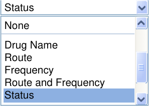
**Guidance**

### Grouping

**Displaying Groups**

|Drug Details|Status|Start Date ▼|
|---|---|---|
|25-May-2010 **Started** **oxygen** 60% – inhalation gas –**`RATE` 15 L per minute**–  continuous – with non re-breather bag|25-May-2010 **Started** **oxygen** 60% – inhalation gas –**`RATE` 15 L per minute**–  continuous – with non re-breather bag|25-May-2010 **Started** **oxygen** 60% – inhalation gas –**`RATE` 15 L per minute**–  continuous – with non re-breather bag|
|**co-amilofruse**– 5 mgand40 mg in 5 mL – solution – **`DOSE` 5 mL**– oral – once a day 24-May-2010 **Started**|**co-amilofruse**– 5 mgand40 mg in 5 mL – solution – **`DOSE` 5 mL**– oral – once a day 24-May-2010 **Started**|**co-amilofruse**– 5 mgand40 mg in 5 mL – solution – **`DOSE` 5 mL**– oral – once a day 24-May-2010 **Started**|
|**Started** 24-May-2010 **salbutamol**– 100 micrograms per dose – metered dose inhaler – **`DOSE` 2 puffs**– inhaled – four times a day as required|**Started** 24-May-2010 **salbutamol**– 100 micrograms per dose – metered dose inhaler – **`DOSE` 2 puffs**– inhaled – four times a day as required|**Started** 24-May-2010 **salbutamol**– 100 micrograms per dose – metered dose inhaler – **`DOSE` 2 puffs**– inhaled – four times a day as required|

MEDv-083

Present the Medications List View with no grouping active by default

_Recommended_

|Drug Details|Status|Start Date ▼|
|---|---|---|
|**Inhaled**|**Inhaled**|**Inhaled**|
|25-May-2010 **Started** **oxygen** 60% – inhalation gas –**`RATE` 15 L per minute**–  continuous – with non re-breather bag|25-May-2010 **Started** **oxygen** 60% – inhalation gas –**`RATE` 15 L per minute**–  continuous – with non re-breather bag|25-May-2010 **Started** **oxygen** 60% – inhalation gas –**`RATE` 15 L per minute**–  continuous – with non re-breather bag|
|**Started** 24-May-2010 **salbutamol**– 100 micrograms per dose – metered dose inhaler – **`DOSE` 2 puffs**– inhaled – four times a day as required|**Started** 24-May-2010 **salbutamol**– 100 micrograms per dose – metered dose inhaler – **`DOSE` 2 puffs**– inhaled – four times a day as required|**Started** 24-May-2010 **salbutamol**– 100 micrograms per dose – metered dose inhaler – **`DOSE` 2 puffs**– inhaled – four times a day as required|
|**Oral**|**Oral**|**Oral**|
|**co-amilofruse**– 5 mgand40 mg in 5 mL – solution – **`DOSE` 5 mL**– oral – once a day 24-May-2010 **Started**|**co-amilofruse**– 5 mgand40 mg in 5 mL – solution – **`DOSE` 5 mL**– oral – once a day 24-May-2010 **Started**|**co-amilofruse**– 5 mgand40 mg in 5 mL – solution – **`DOSE` 5 mL**– oral – once a day 24-May-2010 **Started**|

MEDv-087

**39**

Retain the column sort order in the Medications List View when grouping is applied

Mandatory

MEDv-191

Display groups expanded by default

Mandatory

Copyright ©2013 Health and Social Care Information Centre

### Grouping

**Row Shading**

**Guidance**

MEDv-192

Re-start alternate row shading at the beginning of each group. (Alternate row shading is not needed if there is only one medication in each group)

Mandatory

MEDv-193

When a group is selected in the grouping control, ensure that at least one group heading is visible in the newly grouped list

Mandatory

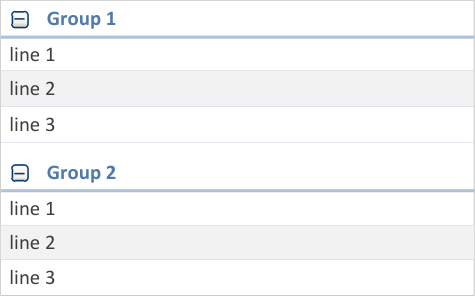

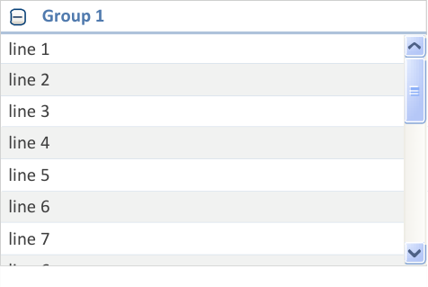

Copyright ©2013 Health and Social Care Information Centre

**40**

**Guidance**

### Grouping

**Group Headings**

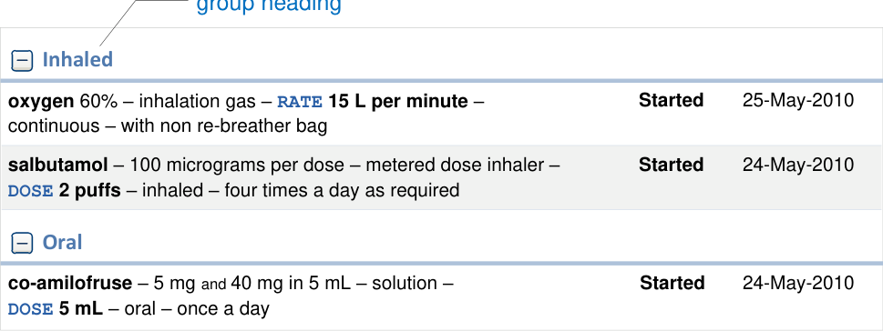

**41**

MEDv-086

Display clear and prominent headings for each group category

Mandatory

MEDv-090

Do not display group headings for empty groups

_Recommended_

Copyright ©2013 Health and Social Care Information Centre

**Guidance**

### Grouping

**Null Groups**

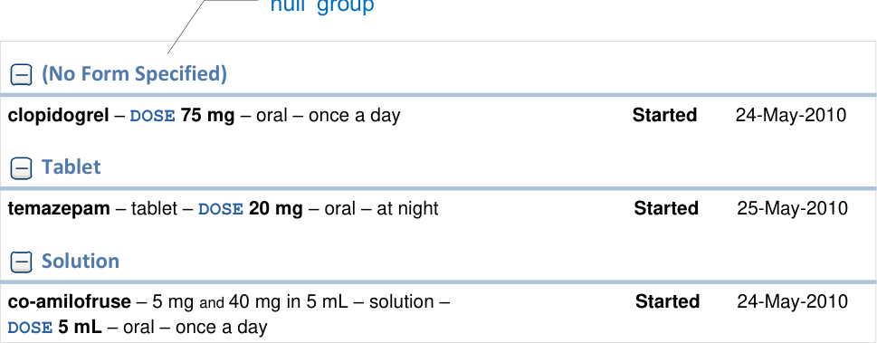

MEDv-091

Provide ‘null’ groups where necessary to support the display of medications that do not have a value for the attribute being used to group the medications

Mandatory

MEDv-194

Display the label for a ‘null’ group heading in brackets

Mandatory

MEDv-195

Display ‘null’ groups at the top of the list of groups

_Recommended_

Copyright ©2013 Health and Social Care Information Centre

**42**

**Guidance**

### Grouping

**Expand and Collapse**

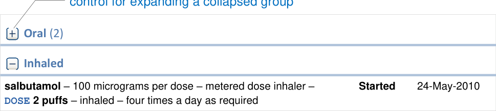

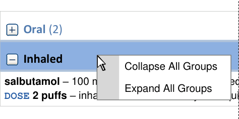

MEDv-092

Provide controls for expanding and collapsing individual groups. Place these controls at the beginning of the group heading

Mandatory

MEDv-089

When a group is collapsed, supplement the group heading with a number representing a count of medications within that group

Mandatory

MEDv-196

Support the selection of group headings and the display of a context menu that includes options for collapsing and expanding all columns

Mandatory

Copyright ©2013 Health and Social Care Information Centre

**43**

**Guidance**

### Grouping

**Combining Group Names**

a combined group

|Analgesic (2)|Col2|
|---|---|
|**Analgesic**(2)||
|**Analgesic; Non-steroidal Anti-inflammatory**(1)|**Analgesic; Non-steroidal Anti-inflammatory**(1)|
|**Non-steroidal Anti-inflammatory**(1)|**Non-steroidal Anti-inflammatory**(1)|

MEDv-198 MEDv-197

Display each medication in only one group (do not duplicate medications so that they can be displayed in more than one group)

MEDv-198

Mandatory

order

MEDv-199

When one or more medications belong to more than one group (such as analgesic and non-steroidal anti-inflammatory), create a new group and label it with the group names combined (such as ‘Analgesic; Non-steroidal Anti-inflammatory’)

Mandatory

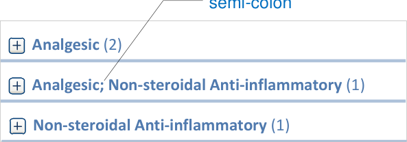

When combining group names, display the names in the same order as they would appear in a list that is sorted by that attribute

Mandatory

MEDv-200

When combining group names, separate the labels with a semi-colon

_Recommended_

Copyright ©2013 Health and Social Care Information Centre

**44**

**Guidance**

### Sorting

**Sorting Control**

sort order: most recent **first**

|Drug Details|Sta|tus|Start Date ▼|
|---|---|---|---|
|25-May-2010 **Started** **oxygen** 60% – inhalation gas –**`RATE` 15 L per minute**–  continuous – with non re-breather bag|25-May-2010 **Started** **oxygen** 60% – inhalation gas –**`RATE` 15 L per minute**–  continuous – with non re-breather bag|25-May-2010 **Started** **oxygen** 60% – inhalation gas –**`RATE` 15 L per minute**–  continuous – with non re-breather bag|25-May-2010 **Started** **oxygen** 60% – inhalation gas –**`RATE` 15 L per minute**–  continuous – with non re-breather bag|
|**co-amilofruse**– 5 mgand40 mg in 5 mL – solution – **`DOSE` 5 mL**– oral – once a day 24-May-2010 **Started**|**co-amilofruse**– 5 mgand40 mg in 5 mL – solution – **`DOSE` 5 mL**– oral – once a day 24-May-2010 **Started**|**co-amilofruse**– 5 mgand40 mg in 5 mL – solution – **`DOSE` 5 mL**– oral – once a day 24-May-2010 **Started**|**co-amilofruse**– 5 mgand40 mg in 5 mL – solution – **`DOSE` 5 mL**– oral – once a day 24-May-2010 **Started**|
|**Started** 24-May-2010 **salbutamol**– 100 micrograms per dose – metered dose inhaler – **`DOSE` 2 puffs**– inhaled – four times a day as required|**Started** 24-May-2010 **salbutamol**– 100 micrograms per dose – metered dose inhaler – **`DOSE` 2 puffs**– inhaled – four times a day as required|**Started** 24-May-2010 **salbutamol**– 100 micrograms per dose – metered dose inhaler – **`DOSE` 2 puffs**– inhaled – four times a day as required|**Started** 24-May-2010 **salbutamol**– 100 micrograms per dose – metered dose inhaler – **`DOSE` 2 puffs**– inhaled – four times a day as required|

sort order: most recent **last**

|Drug Details|Sta|tus|Start Date ▲|
|---|---|---|---|
|**Started** 24-May-2010 **salbutamol**– 100 micrograms per dose – metered dose inhaler – **`DOSE` 2 puffs**– inhaled – four times a day as required|**Started** 24-May-2010 **salbutamol**– 100 micrograms per dose – metered dose inhaler – **`DOSE` 2 puffs**– inhaled – four times a day as required|**Started** 24-May-2010 **salbutamol**– 100 micrograms per dose – metered dose inhaler – **`DOSE` 2 puffs**– inhaled – four times a day as required|**Started** 24-May-2010 **salbutamol**– 100 micrograms per dose – metered dose inhaler – **`DOSE` 2 puffs**– inhaled – four times a day as required|
|**co-amilofruse**– 5 mgand40 mg in 5 mL – solution – **`DOSE` 5 mL**– oral – once a day 24-May-2010 **Started**|**co-amilofruse**– 5 mgand40 mg in 5 mL – solution – **`DOSE` 5 mL**– oral – once a day 24-May-2010 **Started**|**co-amilofruse**– 5 mgand40 mg in 5 mL – solution – **`DOSE` 5 mL**– oral – once a day 24-May-2010 **Started**|**co-amilofruse**– 5 mgand40 mg in 5 mL – solution – **`DOSE` 5 mL**– oral – once a day 24-May-2010 **Started**|
|25-May-2010 **Started** **oxygen** 60% – inhalation gas –**`RATE` 15 L per minute**–  continuous – with non re-breather bag|25-May-2010 **Started** **oxygen** 60% – inhalation gas –**`RATE` 15 L per minute**–  continuous – with non re-breather bag|25-May-2010 **Started** **oxygen** 60% – inhalation gas –**`RATE` 15 L per minute**–  continuous – with non re-breather bag|25-May-2010 **Started** **oxygen** 60% – inhalation gas –**`RATE` 15 L per minute**–  continuous – with non re-breather bag|

MEDv-101

**45**

Allow the sort order of a list in the medications list to be changed by clicking on a column heading

Mandatory

MEDv-102

Allow the sort order of a list in the Medications List View to be reversed by clicking on the column heading for the column with the active sort applied

Mandatory

Copyright ©2013 Health and Social Care Information Centre

**Guidance**

### Sorting

**Indicating the Sort Order**

|sort order symbol column heading|Col2|Col3|
|---|---|---|
|Drug Details|Status|**Start Date  ▼**|
|25-May-2010 **Started** **oxygen** 60% – inhalation gas –**`RATE` 15 L per minute**–  continuous – with non re-breather bag|25-May-2010 **Started** **oxygen** 60% – inhalation gas –**`RATE` 15 L per minute**–  continuous – with non re-breather bag|25-May-2010 **Started** **oxygen** 60% – inhalation gas –**`RATE` 15 L per minute**–  continuous – with non re-breather bag|
|**co-amilofruse**– 5 mgand40 mg in 5 mL – solution – **`DOSE` 5 mL**– oral – once a day 24-May-2010 **Started**|**co-amilofruse**– 5 mgand40 mg in 5 mL – solution – **`DOSE` 5 mL**– oral – once a day 24-May-2010 **Started**|**co-amilofruse**– 5 mgand40 mg in 5 mL – solution – **`DOSE` 5 mL**– oral – once a day 24-May-2010 **Started**|
|**Started** 24-May-2010 **salbutamol**– 100 micrograms per dose – metered dose inhaler – **`DOSE` 2 puffs**– inhaled – four times a day as required|**Started** 24-May-2010 **salbutamol**– 100 micrograms per dose – metered dose inhaler – **`DOSE` 2 puffs**– inhaled – four times a day as required|**Started** 24-May-2010 **salbutamol**– 100 micrograms per dose – metered dose inhaler – **`DOSE` 2 puffs**– inhaled – four times a day as required|

MEDv-104 MEDv-103

Use an icon or symbol in the column heading to indicate the column by which the data is sorted and the direction of the sort

MEDv-104

Use formatting of the column heading to clearly indicate the column to which the sort order is currently applied

_Recommended_

Mandatory

MEDv-105

When the sort order is changed from the default to another attribute in the Medications List View, retain the default as a secondary sort order

Mandatory

|Drug Details|Status|Start Date ▼|
|---|---|---|
|**paracetamol** **Started** 26-May-2010|**paracetamol** **Started** 26-May-2010|**paracetamol** **Started** 26-May-2010|
|**oxygen** **Started** 25-May-2010|**oxygen** **Started** 25-May-2010|**oxygen** **Started** 25-May-2010|
|**salbutamol** **Started** 24-May-2010|**salbutamol** **Started** 24-May-2010|**salbutamol** **Started** 24-May-2010|
|**salbutamol** **Started** 12-Apr-2010|**salbutamol** **Started** 12-Apr-2010|**salbutamol** **Started** 12-Apr-2010|
|**paracetamol** **Started** 08-Apr-2010|**paracetamol** **Started** 08-Apr-2010|**paracetamol** **Started** 08-Apr-2010|

|Drug Details ▼|Status|Start Date|
|---|---|---|
|**oxygen** **Started** 25-May-2010|**oxygen** **Started** 25-May-2010|**oxygen** **Started** 25-May-2010|
|**paracetamol** **Started** 26-May-2010|**paracetamol** **Started** 26-May-2010|**paracetamol** **Started** 26-May-2010|
|**paracetamol** **Started** 08-Apr-2010|**paracetamol** **Started** 08-Apr-2010|**paracetamol** **Started** 08-Apr-2010|
|**salbutamol** **Started** 24-May-2010|**salbutamol** **Started** 24-May-2010|**salbutamol** **Started** 24-May-2010|
|**salbutamol** **Started** 12-Apr-2010|**salbutamol** **Started** 12-Apr-2010|**salbutamol** **Started** 12-Apr-2010|

Copyright ©2013 Health and Social Care Information Centre

**46**

**Guidance**

### Levels of Detail

Example 1

### + –

Example 2

Example 3

**47**

MEDv-201

Provide a control that allows the type and quantity of information displayed to be changed such that the rows and columns may change in number and be presented with a different layout

_Recommended_

Copyright ©2013 Health and Social Care Information Centre

**Guidance**

### Selection

MEDv-202

Ensure that there are no medications selected by default when a list is opened

Mandatory

|Drug Details|Sta|tus|Start Date ▼|
|---|---|---|---|
|25-May-2010 **Started** **oxygen** 60% – inhalation gas –**`RATE` 15 L per minute**–  continuous – with non re-breather bag|25-May-2010 **Started** **oxygen** 60% – inhalation gas –**`RATE` 15 L per minute**–  continuous – with non re-breather bag|25-May-2010 **Started** **oxygen** 60% – inhalation gas –**`RATE` 15 L per minute**–  continuous – with non re-breather bag|25-May-2010 **Started** **oxygen** 60% – inhalation gas –**`RATE` 15 L per minute**–  continuous – with non re-breather bag|
|**co-amilofruse**– 5 mgand40 mg in 5 mL – solution – **`DOSE` 5 mL**– oral – once a day 24-May-2010 **Started**|**co-amilofruse**– 5 mgand40 mg in 5 mL – solution – **`DOSE` 5 mL**– oral – once a day 24-May-2010 **Started**|**co-amilofruse**– 5 mgand40 mg in 5 mL – solution – **`DOSE` 5 mL**– oral – once a day 24-May-2010 **Started**|**co-amilofruse**– 5 mgand40 mg in 5 mL – solution – **`DOSE` 5 mL**– oral – once a day 24-May-2010 **Started**|
|**Started** 24-May-2010 **salbutamol**– 100 micrograms per dose – metered dose inhaler – **`DOSE` 2 puffs**– inhaled – four times a day as required|**Started** 24-May-2010 **salbutamol**– 100 micrograms per dose – metered dose inhaler – **`DOSE` 2 puffs**– inhaled – four times a day as required|**Started** 24-May-2010 **salbutamol**– 100 micrograms per dose – metered dose inhaler – **`DOSE` 2 puffs**– inhaled – four times a day as required|**Started** 24-May-2010 **salbutamol**– 100 micrograms per dose – metered dose inhaler – **`DOSE` 2 puffs**– inhaled – four times a day as required|

|Drug Details|Status|Start Date ▼|
|---|---|---|
|**oxygen** 60% – inhalation gas –**`RATE` 15 L per minute**–  continuous – with non re-breather bag **Started** 25-May-2010|**oxygen** 60% – inhalation gas –**`RATE` 15 L per minute**–  continuous – with non re-breather bag **Started** 25-May-2010|**oxygen** 60% – inhalation gas –**`RATE` 15 L per minute**–  continuous – with non re-breather bag **Started** 25-May-2010|
|**co-amilofruse**– 5 mgand40 mg in 5 mL – solution – **`DOSE` 5 mL**– oral – once a day 24-May-2010 **Started**|**co-amilofruse**– 5 mgand40 mg in 5 mL – solution – **`DOSE` 5 mL**– oral – once a day 24-May-2010 **Started**|**co-amilofruse**– 5 mgand40 mg in 5 mL – solution – **`DOSE` 5 mL**– oral – once a day 24-May-2010 **Started**|
|**Started** 24-May-2010 **salbutamol**– 100 micrograms per dose – metered dose inhaler – **`DOSE` 2 puffs**– inhaled – four times a day as required|**Started** 24-May-2010 **salbutamol**– 100 micrograms per dose – metered dose inhaler – **`DOSE` 2 puffs**– inhaled – four times a day as required|**Started** 24-May-2010 **salbutamol**– 100 micrograms per dose – metered dose inhaler – **`DOSE` 2 puffs**– inhaled – four times a day as required|

MEDv-122

Support click (or keyboard selection using the spacebar) to select a medication in the list

Mandatory

Copyright ©2013 Health and Social Care Information Centre

**48**

**Guidance**

### Selection

**Highlighting Selections**

MEDv-123

Clearly highlight selected medications in the medication list

Mandatory

|Drug Details|Status|Start Date ▼|
|---|---|---|
|**oxygen** 60% – inhalation gas –**`RATE` 15 L per minute**–  continuous – with non re-breather bag **Started** 25-May-2010|**oxygen** 60% – inhalation gas –**`RATE` 15 L per minute**–  continuous – with non re-breather bag **Started** 25-May-2010|**oxygen** 60% – inhalation gas –**`RATE` 15 L per minute**–  continuous – with non re-breather bag **Started** 25-May-2010|
|**co-amilofruse**– 5 mgand40 mg in 5 mL – solution – **`DOSE` 5 mL**– oral – once a day 24-May-2010 **Started**|**co-amilofruse**– 5 mgand40 mg in 5 mL – solution – **`DOSE` 5 mL**– oral – once a day 24-May-2010 **Started**|**co-amilofruse**– 5 mgand40 mg in 5 mL – solution – **`DOSE` 5 mL**– oral – once a day 24-May-2010 **Started**|
|**Started** 24-May-2010 **salbutamol**– 100 micrograms per dose – metered dose inhaler – **`DOSE` 2 puffs**– inhaled – four times a day as required|**Started** 24-May-2010 **salbutamol**– 100 micrograms per dose – metered dose inhaler – **`DOSE` 2 puffs**– inhaled – four times a day as required|**Started** 24-May-2010 **salbutamol**– 100 micrograms per dose – metered dose inhaler – **`DOSE` 2 puffs**– inhaled – four times a day as required|

|Drug Details|Status|Start Date ▲|
|---|---|---|
|**Started** 24-May-2010 **salbutamol**– 100 micrograms per dose – metered dose inhaler – **`DOSE` 2 puffs**– inhaled – four times a day as required|**Started** 24-May-2010 **salbutamol**– 100 micrograms per dose – metered dose inhaler – **`DOSE` 2 puffs**– inhaled – four times a day as required|**Started** 24-May-2010 **salbutamol**– 100 micrograms per dose – metered dose inhaler – **`DOSE` 2 puffs**– inhaled – four times a day as required|
|**co-amilofruse**– 5 mgand40 mg in 5 mL – solution – **`DOSE` 5 mL**– oral – once a day 24-May-2010 **Started**|**co-amilofruse**– 5 mgand40 mg in 5 mL – solution – **`DOSE` 5 mL**– oral – once a day 24-May-2010 **Started**|**co-amilofruse**– 5 mgand40 mg in 5 mL – solution – **`DOSE` 5 mL**– oral – once a day 24-May-2010 **Started**|
|**oxygen** 60% – inhalation gas –**`RATE` 15 L per minute**–  continuous – with non re-breather bag **Started** 25-May-2010|**oxygen** 60% – inhalation gas –**`RATE` 15 L per minute**–  continuous – with non re-breather bag **Started** 25-May-2010|**oxygen** 60% – inhalation gas –**`RATE` 15 L per minute**–  continuous – with non re-breather bag **Started** 25-May-2010|

MEDv-124

Maintain the selection of a medication when switching between views of a patient’s medications (such that a medication selected in a Medication List View is automatically selected when switching to the Drug Administration View)

_Recommended_

MEDv-125

Maintain the selection of a medication when applying or changing a grouping or a sort order and ensure that the selection remains visible

Mandatory

Copyright ©2013 Health and Social Care Information Centre

**49**

### Selection

**Supporting Selection**

**Guidance**

MEDv-126

Support the selection of multiple items using CTRL and click for discrete selections, and SHIFT and click for contiguous selections

Mandatory

MEDv-127

Support keyboard-only equivalents such as SHIFT and arrow key for contiguous selection and the CTRL and SPACEBAR to toggle select and deselect when making non-contiguous selections

Mandatory

MEDv-203

When an action is applied to more than one medication, display a summary of the selected medications before allowing the user to complete the action

Mandatory

|Drug Details|Status|Start Date ▲|
|---|---|---|
|line 1|line 1|line 1|
|line 2|line 2|line 2|
|line 3|line 3|line 3|
|line 4|line 4|line 4|
|line 5|line 5|line 5|
|line 6|line 6|line 6|
|line 7|line 7|line 7|

Copyright ©2013 Health and Social Care Information Centre

**50**

**Guidance**

### Selection

**Context Menu**

|context menu|Col2|Col3|Col4|Col5|
|---|---|---|---|---|
|context menu|context menu|context menu|context menu|context menu|
|Drug Details|Drug Details|Status|Status|**Start Date  ▼**|
|**oxygen** 60% – inhalation gas –**`RATE` 15 L per minute**–  continuous – with non re-breather bag **Started** 25-May-2010 Details...|**oxygen** 60% – inhalation gas –**`RATE` 15 L per minute**–  continuous – with non re-breather bag **Started** 25-May-2010 Details...|**oxygen** 60% – inhalation gas –**`RATE` 15 L per minute**–  continuous – with non re-breather bag **Started** 25-May-2010 Details...|**oxygen** 60% – inhalation gas –**`RATE` 15 L per minute**–  continuous – with non re-breather bag **Started** 25-May-2010 Details...|**oxygen** 60% – inhalation gas –**`RATE` 15 L per minute**–  continuous – with non re-breather bag **Started** 25-May-2010 Details...|
|**oxygen** 60% – inhalation gas –**`RATE` 15 L per minute**–  continuous – with non re-breather bag **Started** 25-May-2010 Details...|Details...|Details...|Details...|Details...|
|**co-amilofruse**– 5 mgand40 mg in 5 mL – solutio **`DOSE` 5 mL**– oral – once a day|n – ~~**Starte**~~ Suspend  |n – ~~**Starte**~~ Suspend  |24-May-2010 **d**|24-May-2010 **d**|
|**salbutamol**– 100 micrograms per dose – metered dose inhaler – **`DOSE` 2 puffs**– inhaled – four times a day as required **Started** 24-May-2010 Edit|d dose inhaler – **Starte** Edit|d dose inhaler – **Starte** Edit|d dose inhaler – **Starte** Edit|d dose inhaler – **Starte** Edit|

MEDv-128

Support the display of a context menu for selected medications in the Medications List View (for example, by right-clicking)

Mandatory

MEDv-129

In the context menu, provide appropriate actions and options

Mandatory

**51**

MEDv-130

In the context menu, support actions with icons where appropriate

_Recommended_

MEDv-131

In the context menu, grey out actions that are unavailable or disallowed for one or more of the current selections

Mandatory

Copyright ©2013 Health and Social Care Information Centre

### Selection

**Context Menu**

**Guidance**

MEDv-136

Include an option to access all details for one medication in the context menu

Mandatory

MEDv-132

In the context menu, define a consistent and static order of menu items in which frequently used actions are prioritised by placing them higher in the list

Mandatory

MEDv-135

In the context menu for selections in the Medications List View, provide an option for displaying all details for the selected medication

Mandatory

MEDv-133

In the context menu, group similar options so that the direct actions, actions that permit addition of information and actions that display more information, are each grouped together

Mandatory

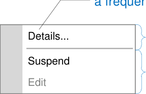

information

actions

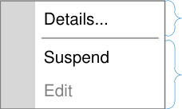

Copyright ©2013 Health and Social Care Information Centre

**52**
