_Prepared for_

**NHS Connecting for Health**

**Tuesday, 23 June 2015**

**Version 4.0.0.0 Baseline**

_Prepared by_

**Clinical Applications and Patient Safety Project**

**NHS CUI Programme Team**

**[Cuistakeholder.mailbox@hscic.gov.uk](mailto:Cuistakeholder.mailbox@hscic.gov.uk)**

HSCIC Controlled Document

### PREFACE

**Documents replaced by this document**

Medications Management – Search and Prescribe – User Interface Design Guidance 1.0.0.0 [1]

Design Guide Entry – Medications Management – Search and Prescribe 2.0.0.0

Design Guide Entry – Medications Management – Search and Prescribe 1.0.0.0

**Documents to be read in conjunction with this document**

Medications Management – Medication Line – User Interface Design Guidance 2.0.0.0

Medications Management – Medications List – User Interface Design Guidance 1.0.0.0

Medications Management – Drug Administration – User Interface Design Guidance 4.0.0.0

Design Guide Entry – Time Display 4.0.0.0

Design Guide Entry – Date Display 5.0.0.0

Design Guide Entry – Date and Time Input 3.0.0.0

Design Guide Entry – Patient Banner 4.0.0.0

Design Guidance – Accessibility Checkpoints for NHS Applications 1.0.0.0

**This document was prepared for NHS Connecting for Health which ceased to exist on 31 March**
**2013. It may contain references to organisations, projects and other initiatives which also no**
**longer exist. If you have any questions relating to any such references, or to any other aspect of**
**[the content, please contact cuistakeholder.mailbox@hscic.gov.uk](mailto:cuistakeholder.mailbox@hscic.gov.uk)**

1Previous baseline was incorrectly numbered v1.0.0.0 not v3.0.0.0. Hence, the current document is v4.0.0.0.

Copyright ©2013 Health and Social Care Information Centre

HSCIC Controlled Document

### TABLE OF CONTENTS

_**1**_ _**Introduction .................................................................................................................................... 1**_

1.1 Customer Need ......................................................................................................................... 3

1.2 Scope ........................................................................................................................................ 5

1.2.1 In Scope ............................................................................................................................ 5

1.2.2 Out of Scope ...................................................................................................................... 5

1.3 Assumptions ............................................................................................................................. 8

1.4 Dependencies ........................................................................................................................... 8

_**2**_ _**Search and Prescribe Guidance Overview ............................................................................... 10**_

2.1 Rationale Summary ................................................................................................................ 16

2.2 Summary of Guidance ............................................................................................................ 17

_**3**_ _**Guidance Details for a Prescribing Area ................................................................................... 19**_

3.1 Introduction ............................................................................................................................. 19

3.2 Principles ................................................................................................................................ 20

3.3 Guidelines ............................................................................................................................... 20

3.3.1 Relating Prescribing to Context ....................................................................................... 20

_**4**_ _**Guidance Details for Quick Lists ............................................................................................... 24**_

4.1 Introduction ............................................................................................................................. 24

4.2 Principles ................................................................................................................................ 25

4.3 Guidelines ............................................................................................................................... 26

4.3.1 Displaying a Quick List .................................................................................................... 26

4.3.2 Quick List Contents ......................................................................................................... 29

4.3.3 Notifying When a Quick List Has Changed ..................................................................... 32

4.3.4 Accommodating Multiple Quick Lists .............................................................................. 34

_**5**_ _**Guidance Details for Drug Search ............................................................................................. 36**_

5.1 Introduction ............................................................................................................................. 36

5.2 Principles ................................................................................................................................ 38

5.3 Guidelines ............................................................................................................................... 39

5.3.1 Positioning the Search Text Input Box ............................................................................ 39

5.3.2 Defining Text Input Box Behaviour .................................................................................. 41

5.3.3 Displaying Results with Progressive Matching ................................................................ 45

5.3.4 Providing Feedback for a Progressive Search ................................................................ 47

5.3.5 Limiting the Height of a Search Results List ................................................................... 49

5.3.6 Extending the Search Results List .................................................................................. 53

5.3.7 Matching Input Text to Results ........................................................................................ 55

5.3.8 Ordering Search Results ................................................................................................. 58

5.3.9 Using Groups to Limit Search Results ............................................................................ 61

Page iii

Copyright ©2013 Health and Social Care Information Centre

HSCIC Controlled Document

5.3.10 Supporting Spelling Matches and Synonyms .................................................................. 63

5.3.11 Co-Drugs and Their Ingredients ...................................................................................... 65

5.3.12 Prioritising Results ........................................................................................................... 66

5.3.13 Shortcut Keys in Search Results ..................................................................................... 69

5.3.14 Formatting Commonly Mis-Selected Matches ................................................................ 70

5.3.15 Formatting Spelling Matches and Synonyms .................................................................. 72

5.3.16 Formatting Search Results Lists ..................................................................................... 74

5.3.17 Generic Drug Names and Brand Names ........................................................................ 76

_**6**_ _**Guidance Details for Cascading Lists ....................................................................................... 79**_

6.1 Introduction ............................................................................................................................. 79

6.2 Principles ................................................................................................................................ 80

6.3 Guidelines ............................................................................................................................... 81

6.3.1 Providing Cascading Lists ............................................................................................... 81

6.3.2 Displaying Cascading Lists ............................................................................................. 86

6.3.3 Contents of Cascading Lists ............................................................................................ 93

6.3.4 Providing Cascading Lists for Brands ............................................................................. 94

_**7**_ _**Guidance Details for Required Attributes ................................................................................. 99**_

7.1 Introduction ............................................................................................................................. 99

7.2 Principles .............................................................................................................................. 100

7.3 Guidelines ............................................................................................................................. 101

7.3.1 Displaying Template Prescriptions ................................................................................ 101

7.3.2 Displaying a Selection Trail ........................................................................................... 103

7.3.3 Template Prescription Layout ........................................................................................ 106

7.3.4 Contents of a Template Prescription ............................................................................. 109

7.3.5 Maintaining Access to Template Prescriptions ............................................................. 112

7.3.6 Presenting Fields Step by Step ..................................................................................... 115

7.3.7 Using Sentence Layout ................................................................................................. 122

_**8**_ _**Guidance Details for Prescription Forms ................................................................................ 128**_

8.1 Introduction ........................................................................................................................... 128

8.2 Principles .............................................................................................................................. 129

8.3 Guidelines ............................................................................................................................. 130

8.3.1 Presentation and Layout of Prescription forms ............................................................. 130

8.3.2 Presenting a Detailed Prescription Form ...................................................................... 135

8.3.3 Structuring a Detailed Prescription ................................................................................ 141

8.3.4 Displaying Required and Optional Fields ...................................................................... 143

_**9**_ _**Guidance Details for Input Controls ........................................................................................ 151**_

9.1 Introduction ........................................................................................................................... 151

9.2 Principles .............................................................................................................................. 154

9.3 Guidelines ............................................................................................................................. 155

Page iv

Copyright ©2013 Health and Social Care Information Centre

HSCIC Controlled Document

9.3.1 Using Dynamic Controls ................................................................................................ 155

9.3.2 Presenting Selection Lists in Prescription forms ........................................................... 156

9.3.3 Using Selection Lists to Prioritise .................................................................................. 164

9.3.4 Presenting Selection Lists for Inter-Related Fields ....................................................... 167

9.3.5 Pre-Filling Input Controls ............................................................................................... 170

9.3.6 Presenting Input Controls .............................................................................................. 173

_**10**_ _**Guidance Details for Preview and Authorise ...................................................................... 181**_

10.1 Introduction .................................................................................................................... 181

10.2 Principles ....................................................................................................................... 182

10.3 Guidelines ...................................................................................................................... 183

10.3.1 Providing a Preview ....................................................................................................... 183

10.3.2 Presenting Controls for Authorising a Prescription ....................................................... 185

_**11**_ _**Document Information ........................................................................................................... 188**_

11.1 Terms and Abbreviations .............................................................................................. 188

11.2 Definitions ...................................................................................................................... 189

11.3 Nomenclature ................................................................................................................ 190

11.3.1 Body Text ...................................................................................................................... 190

11.3.2 Cross References .......................................................................................................... 190

11.4 References .................................................................................................................... 190

_**APPENDIX A**_ _**Usability Principles ................................................................................................. 193**_

_**APPENDIX B**_ _**Study ID 69: Executive Summary .......................................................................... 195**_

_**APPENDIX C**_ _**Study ID 68: Executive Summary .......................................................................... 201**_

_**APPENDIX D**_ _**Study ID 67: Executive Summary .......................................................................... 208**_

_**APPENDIX E**_ _**Study ID 46: Executive Summary .......................................................................... 214**_

_**APPENDIX F**_ _**Study ID 37: Executive Summary .......................................................................... 219**_

Page v

Copyright ©2013 Health and Social Care Information Centre

HSCIC Controlled Document

**Patient Safety Process**

The development lifecycle for this design guide includes an integrated patient / clinical safety risk
assessment and management process.

Known patient safety incidents relevant to this design guidance area have been researched and
reviewed as part of ongoing development. The resulting guidance points aim to support mitigation
of these known patient safety risks. In addition, the developers of this design guide have
undertaken a patient safety risk assessment to identify new risks that could potentially be
introduced by the guidance points in this document. Any potential risks identified have been
assessed and managed to support the ongoing clinical safety case for this design guide.

The Hazard Log records all the risks that have been identified during development and describes
mitigatory actions that, in some cases, will need to be taken by users of this design guide. The
Hazard Log is a live document that is updated as the design guide is developed and maintained.
Until this design guide has received full Clinical Authority to Release (CATR) from the NHS
Connecting for Health (CFH) Clinical Safety Group (CSG) – based on an approved Clinical Safety
Case – there may be outstanding patient safety risks yet to be identified and mitigated.

Additionally, users implementing applications that follow this design guide’s guidelines (for
example, healthcare system suppliers) are expected to undertake further clinical safety risk
assessments of their specific systems within their specific context of use.

Refer to [NHS Common User Interface for further information on the patient safety process and for](http://www.cui.nhs.uk/Pages/NHSCommonUserInterface.aspx)
the safety status and any relevant accompanying safety documentation for this design guide.

Page vi

Copyright ©2013 Health and Social Care Information Centre

HSCIC Controlled Document

### 1 INTRODUCTION

This document provides guidance for the design of searching for and prescribing of individual
medications for single patients. It describes the area of focus, lists mandatory and recommended
guidance points with usage examples and explains the rationale behind the guidance.

Electronic prescribing is envisaged as being part of a clinical system that includes a series of views,
some of which present medications information for each patient. Guidance for the display of a
patient’s medications is defined in the document _Medications Management –_ _Medications List_ **{R1}** .
Guidance for another medications view, the drug chart, is defined in the document _Medications_
_Management –_ _Drug Administration_ **{R2}** .

More detailed guidance for the layout and formatting of individual medications is defined in the
document _Medications Management –_ _Medication Line_ **{R3}** . This includes guidance that informs
the selection of attributes and defines display formatting appropriate for the information used to
express a single medication. (Later, this approach is referred to simply as ‘medication line’.)

The structure of the prescribing processes considered in the creation of this guidance has been
informed by the NHS National Programme for Information Technology (NPfIT) document _dm+d_
_Implementation Guide (Secondary Care)_ _[2]_ . This work describes a Prescribing Model that is
designed to minimise the risk when prescribing (or ‘ordering’) medications in secondary care. It
advocates a dose-based prescribing system in which:

 A prescriber specifies a drug by its generic name plus dose, route and frequency

 A nurse (for example) then selects the correct quantity of an actual product to give to the

patient

The Prescribing Model aims to provide the safeguards needed to ensure dose-based prescribing
results in prescriptions without any unsafe ambiguities for those giving medicines to patients. NHS
CFH requires software vendors to use the NHS _Dictionary of Medicines and Devices_ _[3]_ (referred to
as ‘dm+d’), so the Prescribing Model has been designed based on concepts such as those used in
the dm+d. The guidance in this document does not assume the use of the dm+d and is intended to
work with any drug database that uses the concepts of generic drug name, which equates to Virtual
Therapeutic Moiety (VTM) in the dm+d, and branded drug name, which equates to Trade Family
Name (TFN) in the dm+d.

The guidance in this document focuses on supporting secondary care settings. Although all care
settings have been considered as part of the analysis for this work, the guidance does not attempt
to meet requirements for primary care or other requirements that are specialist or specific to
settings outside of secondary care.

**Alternative Design Solutions**

Whilst many different design alternatives have been considered, researched and tested in the construction
of this guidance document, it is acknowledged that there are already a significant number of working
electronic prescribing systems which may have employed design approaches that have not been directly
assessed.

Throughout this document, in sections where such alternatives are known to exist, the guidance document
lists the key hazards that alternative design solutions must address. Within these sections, conformance
ratings apply only where the guidance is followed by Independent Software Vendors (ISVs). Where the

2 NHS NPfIT – dm+d Implementation Guide (Secondary Care) **{R4}** :
[ePrescribing reference documents — NHS Connecting for Health](http://www.connectingforhealth.nhs.uk/systemsandservices/eprescribing/refdocs)

3 NHS – dictionary of medicines + devices **{R5}** : [Welcome to the dm+d website — The NHS Dictionary of Medicines and](http://www.dmd.nhs.uk/)
[Devices](http://www.dmd.nhs.uk/)

Page 1

Copyright ©2013 Health and Social Care Information Centre

HSCIC Controlled Document

guidance is not followed it is the responsibility of the providers of alternative solutions to ensure that
known risks are addressed.

To indicate their relative importance, each guideline in this document is ranked by **Conformance**
and by **Evidence Rating** . Table 1 defines those terms:

Conformance Indicates the extent to which you should follow the guideline when defining your UI implementation. There are
two levels:

**Mandatory**           - An implementation should follow the guideline

**Recommended**         - An implementation is advised to follow the guideline

Evidence Rating Summarises the strength of the research defining the guideline and the extent to which it mitigates patient safety
hazards. There are three ratings (with example factors used to determine the appropriate rating):

 **Low** :

 Does not mitigate specific patient safety hazards

 User research findings unclear and with few participants

 Unreferenced usability principles indicate the design is not significantly better than alternatives

 **Medium** :

 Mitigates specific patient safety hazards

 User research findings clear but with few participants

 References old authoritative guidance (for example, from National Patient Safety Agency (NPSA),

Institute for Safe Medication Practices (ISMP) or World Health Organization (WHO)) that is potentially
soon to be superseded

 Referenced usability principles indicate the design is significantly better than alternatives

 **High** :

 Mitigates specific patient safety hazards

 User research findings clear and with a significant number of participants

 References recent authoritative guidance (for example, from NPSA, ISMP or WHO)

 Referenced usability principles indicate the design is significantly better than alternatives

Table 1: Conformance and Evidence Rating Definitions

**Note**

Refer to section 11.2 for definitions of the specific terminology used in this document.

Sections 4, 7 and 9 contain guidance that has been added since the previous version of this
guidance (Baseline version 1.0.0.0 dated 13-Aug-2008). All previous guidance points have been renumbered and some have been revised. Table 2 summarises the changes made by showing where
the guidance points in each original section of the previous document have been moved to in this
document:

3.3.1 Relating Drug Search to Context (two guidance points) 3.3.1 Relating Drug Search to Context

3.3.2 Positioning the Text Input Box (one guidance point)
3.3.3 Communicating the Scope of the Search (one guidance point)

3.3.4 Defining Text Input Box Behaviour (two guidance points)
3.3.5 Moving from text Input Box to Results List (two guidance points)

5.3.1 Positioning the Search Text Input Box

5.3.2 Defining Text Input Box Behaviour

3.3.6 Displaying Results with Progressive Matching (two guidance points) 5.3.3 Displaying Results with Progressive Matching

3.3.7 Providing Feedback for a Progressive Search (five guidance points)
3.3.10 Defining the Height of Search Results Lists (two guidance points)

5.3.4 Providing Feedback for a Progressive Search

Page 2

Copyright ©2013 Health and Social Care Information Centre

HSCIC Controlled Document

3.3.8 Limiting the Height of a Results List (three guidance points),
3.3.10 Defining the Height of Search Results Lists (one guidance point)

5.3.5 Limiting the Height of a Search Results List

3.3.9 Displaying a Longer Results List (three guidance points) 5.3.6 Extending the Search Results List

3.3.11 Providing Cascading Lists (three guidance points) 6.3.1 Providing Cascading Lists

3.3.12 Displaying Cascading Lists (three guidance points)
3.3.13 Displaying Selections in Cascading Lists (one guidance point)

6.3.2 Displaying Cascading Lists

3.3.13 Displaying Selections in Cascading Lists (one guidance point) 6.3.3 Contents of Cascading Lists

3.3.14 Matching Input Text to Results (three guidance points) 5.3.7 Matching Input Text to Results

3.3.15 Ordering the Results (one guidance point) 5.3.8 Ordering Search Results

3.3.16 Using Groups to Limit Search Results (two guidance points) 5.3.9 Using Groups to Limit Search Results

3.3.17 Supporting Spelling Matches (two guidance points) 5.3.10 Supporting Spelling Matches

3.3.18 Co-drugs and Their Ingredients (two guidance points) 5.3.11 Co-Drugs and Their Ingredients

3.3.19 Prioritising Results (five guidance points) and
3.3.20 Displaying Results without Prioritised Matches (one guidance point)

5.3.12 Prioritising Results

3.3.21 Defining Shortcut Keys for Prioritised Results (three guidance points) 5.3.13 Shortcut Keys in Search Results

3.3.22 Formatting Commonly Mis-Selected Matches (three guidance points) 5.3.14 Formatting Commonly Mis-Selected Matches

3.3.23 Formatting Spelling Matches (three guidance points) 5.3.15 Formatting Spelling Matches

3.3.24 Formatting List Results (three guidance points) 5.3.16 Formatting Search Results Lists

3.3.25 Generic Drug Names and Brand Names (four guidance points)
3.3.26 Supporting Selection of Brand Names (one guidance point)

Table 2: Changes Since the Last Baseline Version

#### **1.1 Customer Need**

5.3.17 Generic Drug Names and Brand Names

The first electronic prescribing systems generally evolved from individuals taking the initiative to
develop software that could replace paper-based systems, improve reporting and auditing and help
to reduce medication errors. Since these systems have evolved largely independently of one
another, there is no commonly used standard for the design of electronic prescribing systems. The
lack of a standard is itself a source of patient safety risk since clinical staff who work in more than
one location and use more than one system have to cope with very different processes and
different user interfaces for completing the same tasks.

**Medications Incidents** - In a study of safety incidents (that excluded non-preventable adverse
drug reactions) in the NHS, the National Patient Safety Agency (NPSA) found that fifteen per cent
of medication incidents reported between January 2005 and June 2006 were related to prescribing.
To put this into perspective, the same study found that the majority of incidents related to the
administration of medications (59.3 per cent), followed by incidents related to preparation and
dispensing (17.8 per cent):

 59.3 per cent – administration of medications

 17.8 per cent – preparation and dispensing

 15 per cent – prescribing

Page 3

Copyright ©2013 Health and Social Care Information Centre

HSCIC Controlled Document

These findings are published in the document _Safety in doses: medication safety incidents in the_
_NHS_ _[4]_ . In summary, the document lists the following as the most common types of reported
medication incidents, which together make up over half of all reported medication incidents:

 Incorrect dose, strength or frequency

 Omitted medication

 Wrong medication (including medications prescribed as a result of a mis-selection error)

**Existing Systems**  - Inpatient hospital care settings currently use multiple kinds of medications
documents, in both paper-based and electronic formats. These documents differ depending on the
medications that they are used for and, furthermore, they differ between care settings. The
differences in the designs of these documents may well already impact patient safety, as care
professionals move between hospitals and are faced with new prescribing processes while working
in potentially time-pressured, high-stress environments. Differences in prescribing processes and
the design of electronic prescription forms are an increasing safety concern as electronic systems
are more widely adopted.

**The Role of Electronic Prescribing**  - Research, in which extensive studies of medication-related
errors were reviewed, suggests that the most powerful means of preventing medication-related
errors are electronic prescribing and administration management, along with standards for
processes and for the writing of prescriptions (see _Medication Errors_ **{R7}**, _To Err Is Human_ **{R8}**
and _Understanding Patient Safety_ **{R9}** ).

When paper-based systems are replaced with electronic systems, visual cues, such as the colour
and thickness of a patient chart and the large surface area on which information can be displayed,
are lost. To be an effective replacement, the electronic system must find a different way of
presenting and communicating this information.

Whilst electronic prescribing is effective at mitigating some of the risks associated with paper-based
prescribing, and is generally found to reduce prescribing errors overall, it also has the potential to
introduce new kinds of errors (see _The Extent and Importance of Unintended Consequences_
_Related to Computerized Provider Order Entry_ **{R10}** ). Many of these errors are common to any
human-computer interface and can be effectively mitigated by following current best practice
usability principles.

The process of replacing a paper-based system with an electronic one inevitably also brings culture
changes and changes to processes. Electronic systems that are perceived as being too restrictive
are associated with loss of responsibility leading to complacency and over-reliance on the system.
Inflexible prescribing systems may be effective at supporting the prescribing of common
medications and the prevention of specific errors but the same inflexibility that supports these
processes also introduces problems for prescribing non-standard medications (see _Role of_
_Computerised Physician Order Entry Systems in Facilitating Medication Errors_ **{R11}** ).

The provision of a highly flexible electronic prescribing process, which still brings the benefits of
reducing errors, relies on a comprehensive system that can perform complex error checking across
information such as the patients’ medications, diagnoses, demographics and test results.

4NPSA – Safety in doses: medication safety incidents in the NHS **{R6}** :
[http://www.npsa.nhs.uk/nrls/alerts-and-directives/directives-guidance/safety-in-doses/](http://www.npsa.nhs.uk/nrls/alerts-and-directives/directives-guidance/safety-in-doses/)

Page 4

Copyright ©2013 Health and Social Care Information Centre

HSCIC Controlled Document

#### **1.2 Scope**

This guidance informs the design of a user interface for prescribing a medication for a single patient
in a hospital ward environment.

##### **1.2.1 In Scope**

Users Hospital-based doctors, nurses and pharmacists who prescribe medications

Care settings Inpatient, hospital ward environment only

Tasks Prescribing individual medications

Medications  Oral solids and liquids

 Inhalers and sprays

 Eye, ear and nose drops

 Topical liquids

 Creams, ointments and gels

 Enemas and rectal solutions

 Granules and powders

 Suppositories and pessaries

 Topical patches

 Nebuliser solutions

 Injections (insulin example only)

 Unlicensed medications (chloramphenicol example only)

Finding a Drug  Text entry searching for generic or brand name

 Pick lists (called ‘Quick Lists’)

Search Results  Differentiating between generic drugs and brand names in lists

 Displaying, ordering and formatting search results lists

 Navigating within and between search results lists

 Interacting with search result list items

 Indicating non-formulary drugs in search results lists

Template Prescriptions Presentation of lists of predefined prescriptions

Defining a Prescription  Structure and layout of the prescription form

 Presentation of required and optional attributes

 Guidance for efficiently prescribing commonly prescribed medications

 Guidance for prescribing less commonly prescribed and more detailed medications

Administration Schedules Selection from a predefined set of administration times or the definition of an individual administrative

event for a once only medication.

Previewing a Prescription Guidance for supporting the review of a prescription before it is authorised

Table 3: In Scope

##### **1.2.2 Out of Scope**

**Note**

Listing an item as out of scope does not classify it as unimportant. Project time and resource constraints
inevitably restrict what can be in scope for a particular release. It is possible that items out of scope for
this release may be considered for a future release.

Table 4 defines areas that are not covered in this guidance. Although there may be specific risks
associated with these areas that are not addressed in this guidance, it is likely that the principles in
this guidance will extend to the display of medication information in many of the areas listed below.

The patient as a user of clinical software is out of scope; the guidance is designed to inform the
design of user interfaces used by clinicians. As such, it will therefore present information in formats
that are appropriate for health care professionals. The display of medication information in views
that are designed for patients is not addressed in this guidance.

Page 5

Copyright ©2013 Health and Social Care Information Centre

HSCIC Controlled Document

The guidance has been written in such as way that it should be adaptable for use with various
display sizes and therefore does not make reference to specific dimensions for screen elements.

The care settings listed in Table 4 are out of scope because they have not been studied in depth in
our research. Some of this guidance is likely to be relevant to these care settings, but there will be
specific risks associated with each that have not been considered and therefore mitigated in this
guidance.

There are many medication types listed in Table 4 because they have not been sufficiently
researched to be able to make assumptions about the extent to which they are addressed by
guidance.

**Note**

Since this guidance uses a dose-based prescribing approach, it is not directly appropriate for Primary
Care or general practice.

Guidance Areas Details

Users Non-clinical staff, patients and other health care professionals not listed in the in scope section (that is,
only hospital-based doctors, nurses and pharmacists are in scope).

Care settings  Care settings other than inpatient, hospital ward environments, including: outpatients, clinics,

pharmacies, emergency services and departments, intensive care, High Dependency Unit (HDU),
primary care, including general practice, community and home visits, ward management, multi-patient
tasks

 Paediatric prescribing

Tasks Any task other than prescribing individual medications, including:

 Reviewing administration events to gain an understanding of the degree to which the medication has

been successfully administered

 Relating medications to information elsewhere in the patient record, including the linking of information

in a plan or notes to medications

 Medications reconciliation

 Any task that follows authorisation of a prescription, such as editing or deleting a medication after it

has been prescribed

 Creating links or associations between prescriptions or between prescriptions and other data (such as

test results)

Application Context  The display of the prescribing area in relation to other medications and non-medications views

 Interactions between and access to other views whilst prescribing

 Entry and exit points for the prescribing process, including ‘Cancel’ or ‘Close’, except for the default

entry point, ‘initiate prescribing’

Page 6

Copyright ©2013 Health and Social Care Information Centre

HSCIC Controlled Document

Guidance Areas Details

Medications

These medications may
have additional
requirements or introduce
specific risks that are not
explicitly addressed by
the guidance.

 Enteral feeds

 Dressings and devices

 Implants and sticks

 Intrauterine devices (IUDs)

 Cements

 Dialysis solutions

 Injections (except insulin example)

 Infusions and fluids (except by specific

examples)

 Combination infusions

 Total Parenteral Nutrition (TPN)

 Gases

 Blood and platelet products

 Variable dose medications

 Foams

 Radioactive agents

 Regimens and order sets

 Advisory Committee on Borderline Substances

(ACBS) products

 Over the counter (OTC) medications

 Recreational drugs

 Medications with titrating doses

 Discharge medications – to take out (TTO)

 Patient’s own drugs (PODs)

 Epidurals and patient controlled analgesia

 Extemporaneous prescriptions

 Unlicensed medications (except

chloramphenicol example)

 Controlled drugs

Prescription Types  Medication administered or supplied as part of a Patient Group Direction (PGD)

 Medication prescribed by supplementary prescribers

 Corollary orders that require a view of additional patient-related information before and/or during

prescribing (for example, warfarin and International Normalized Ratio (INR) results).

Prescription Data  Specific data fields for prescriptions, including which should be required and which optional

 Values for data fields for prescriptions

Formularies  Formulary management, including the definition of formularies and which medications belong to them

 The selection of a formulary for use during a drug search for prescribing

Recommendations The definition of a draft prescription that is sent from one prescriber to another as a recommendation for
the treatment of a particular patient.

Prescriptions with
Conditions

Definition of conditions such as criteria that must be met before administration can begin, criteria that
must be checked at each administration or criteria that determine when a medication should end.

Administration Schedules  The definition and modification of individual administrative events (except for once only medications)

in an administration schedule

 Addition of once only medications to supplement a regular medication with a first dose too far in the

future

Previewing a prescription The saving of completed medications in a list (similar to a ‘shopping cart’) such that they can be reviewed

both individually and as a set before they are authorised.

Changing Prescriptions  The selection of a medication (such as in a Medications List or a Drug Administration view) and

modification of the prescription

 The selection of a past medication for re-prescribing, such that the past medication is used as a

template for a new prescription

 Discontinuing, suspending or restarting a medication

Retrospective Prescribing The recording of prescriptions for medications that have been or are being administered.

Partial Prescriptions Saving of partially completed prescriptions for review and authorisation at another time.

Permissions Limiting access to individual controls (such as command buttons or input controls) and options available
within them (such as list items in a drop-down list) based on permissions (associated with login).

Input Forms  Structure and layout that would apply to standard forms

 Validation and error handling

 Truncation and abbreviation

Page 7

Copyright ©2013 Health and Social Care Information Centre

HSCIC Controlled Document

Guidance Areas Details

Dose Calculation  Automatic calculation of doses

 Display and input of height, weight and mass

Authorisation  Any part of the user interface process that follows the activation of a control that authorises a

prescription

 Cancelling, closing or otherwise exiting a prescription before it is complete

Decision and knowledge
support

 Decision support alerting for allergies

 Decision support for drug-to-drug interactions

 Decision support alerting based on patient medical history, demographics or other information held in

the patient record

 Knowledge support for browsing drugs by classification

 Knowledge support for looking up information about medications.

Allergies The display and recording of allergy information and adverse drug reaction risks is covered in a separate
guidance document.

Patient consent and
preference

Patient preference, such as for a particular drug form. Patient consent, particularly in a mental health
context.

Other  Sealed envelopes

 Supply and dispensing

 Guidance (other than notifications) that might be needed for when a patient is ‘Nil by Mouth’

Table 4: Out of Scope

#### **1.3 Assumptions**

A1 The majority of medications prescribed by any given clinician will come from a short list of medications that are regularly
prescribed by that clinician.

A2 The majority of prescriptions (about 80%) can be prescribed by selecting a predefined template prescription.

A3 When prescribers initiate the prescribing process, they know what they want to prescribe and are ready to prescribe it.

A4 When using the prescribing interface, the Common User Interface (CUI) Patient Banner remains visible throughout the
prescribing process.

A5 In general (with known exceptions) prescribing by generic drug name should be encouraged in preference to prescribing by
products or brand names.

Table 5: Assumptions

#### **1.4 Dependencies**

D1 This guidance is informed by the NHS NPfIT _dm+d Implementation Guide (Secondary Care)_ **{R4}**

D2 This guidance is informed by the NHS NPfIT _ePrescribing Functional Specification_ _[5]_

5 NHS NPfIT – ePrescribing Functional Specification **{R12}** :
[http://www.connectingforhealth.nhs.uk/newsroom/news-stories/eprescfunctspec](http://www.connectingforhealth.nhs.uk/newsroom/news-stories/eprescfunctspec)

Page 8

Copyright ©2013 Health and Social Care Information Centre

HSCIC Controlled Document

D3 This guidance uses the concepts ‘generic drug’ and ‘brand name’ and depends on access to, or creation of, a database or
dictionary, that can support these concepts. In the _Dictionary of Medicines and Devices_ **{R5}** (known as ‘dm+d’), the concept
Virtual Therapeutic Moiety (VTM) equates to generic drug name and the recently created Trade Family Name (TFN) equates
to brand name.

D4 The display of drug names and medications is defined by the document _Medications Management –_ _Medication Line_ **{R3}** .

D5 The display and entry of dates is defined by the documents _Time Display_ **{R13}**, _Date Display_ **{R14}** and _Date and Time_
_Input_ **{R15}**

Table 6: Dependencies

Page 9

Copyright ©2013 Health and Social Care Information Centre

HSCIC Controlled Document

### 2 SEARCH AND PRESCRIBE GUIDANCE OVERVIEW

The guidance is divided into sections that are organised such that they follow the prescribing
process from initiation through to authorisation. Within each section are a number of tables
containing guidance points, usage examples and rationale for specific aspects of the user interface.

The guidance assumes a flexible prescribing process that can support both a quick prescribing
process for the most commonly prescribed drugs and a more detailed prescribing process for less
common prescribing practices, whilst mitigating known risks and meeting a high standard of patient
safety.

**Important**

The visual representations used within this document to display the guidance are illustrative only. They
are simplified in order to facilitate understanding of the guidance points. Stylistic choices, such as colours,
fonts or icons are not part of the guidance and unless otherwise specified are not mandatory requirements
for compliance with the guidance in this document.

The usage examples in this document include examples of sets of fields, some of which are shown as
required and some as optional. These examples are illustrative only and are not intended to provide
guidance on which fields should be available for specific types of medication nor which fields should be
required or optional.

Page 10

Copyright ©2013 Health and Social Care Information Centre

HSCIC Controlled Document

|Col1|Col2|Col3|
|---|---|---|
|drug|route|option 1 option 2 option 3|
|drug|route|other...|

|Figure 1 and Figure 2 show an example of a prescribing process. The process itself does not form part of this guidance. The illustration shows how each section of the guidance can potentially relate o the previous and the next steps in the prescribing process. It thus shows a subset of the many valid alternative paths through the process of prescribing.|Col2|Col3|Col4|Col5|Col6|Col7|Col8|
|---|---|---|---|---|---|---|---|
|Start Prescribing|Start Prescribing|Start Prescribing|Start Prescribing|Start Prescribing|Start Prescribing|Start Prescribing|Start Prescribing|
|Start Prescribing|Start Prescribing|Start Prescribing|Start Prescribing|||||
|Select from the Quick List|Select from the Quick List|Select from the Quick List|Select from the Quick List|Select from the Quick List|Select from the Quick List|drug 1 Ctrl + 1 Ctrl + 2 drug 2 drug 3 drug 4 drug 5 drug 6 Ctrl + 3 Ctrl + 4 Ctrl + 5 Ctrl + 6 _Commonly Prescribed_ _Select from Quick List_|drug 1 Ctrl + 1 Ctrl + 2 drug 2 drug 3 drug 4 drug 5 drug 6 Ctrl + 3 Ctrl + 4 Ctrl + 5 Ctrl + 6 _Commonly Prescribed_ _Select from Quick List_|
|**Results** Search and select from results _Search and select_ _from results_|**Results** Search and select from results _Search and select_ _from results_|**Results** Search and select from results _Search and select_ _from results_|**Results** Search and select from results _Search and select_ _from results_|**Results** Search and select from results _Search and select_ _from results_|**Results** Search and select from results _Search and select_ _from results_|**Results** Search and select from results _Search and select_ _from results_|**Results** Search and select from results _Search and select_ _from results_|
|_Select from Cascading Lists_ drug route option 1 option 2 option 3 other... Select other fields _These selections allow the_ _system to work out which fields to_ _display in a Full Prescription Form_|_Select from Cascading Lists_ drug route option 1 option 2 option 3 other... Select other fields _These selections allow the_ _system to work out which fields to_ _display in a Full Prescription Form_|_Select from Cascading Lists_ drug route option 1 option 2 option 3 other... Select other fields _These selections allow the_ _system to work out which fields to_ _display in a Full Prescription Form_|_Select from Cascading Lists_ drug route option 1 option 2 option 3 other... Select other fields _These selections allow the_ _system to work out which fields to_ _display in a Full Prescription Form_|_Select from Cascading Lists_ drug route option 1 option 2 option 3 other... Select other fields _These selections allow the_ _system to work out which fields to_ _display in a Full Prescription Form_|_Select from Cascading Lists_ drug route option 1 option 2 option 3 other... Select other fields _These selections allow the_ _system to work out which fields to_ _display in a Full Prescription Form_|_Select from Cascading Lists_ drug route option 1 option 2 option 3 other... Select other fields _These selections allow the_ _system to work out which fields to_ _display in a Full Prescription Form_|_Select from Cascading Lists_ drug route option 1 option 2 option 3 other... Select other fields _These selections allow the_ _system to work out which fields to_ _display in a Full Prescription Form_|
|template 1 template 2 template 3 other... drug route Select a Template Prescription _Select a Template Prescription_ Skip to Full Prescription Form|template 1 template 2 template 3 other... drug route Select a Template Prescription _Select a Template Prescription_ Skip to Full Prescription Form|template 1 template 2 template 3 other... drug route Select a Template Prescription _Select a Template Prescription_ Skip to Full Prescription Form|template 1 template 2 template 3 other... drug route Select a Template Prescription _Select a Template Prescription_ Skip to Full Prescription Form|template 1 template 2 template 3 other... drug route Select a Template Prescription _Select a Template Prescription_ Skip to Full Prescription Form|template 1 template 2 template 3 other... drug route Select a Template Prescription _Select a Template Prescription_ Skip to Full Prescription Form|template 1 template 2 template 3 other... drug route Select a Template Prescription _Select a Template Prescription_ Skip to Full Prescription Form|template 1 template 2 template 3 other... drug route Select a Template Prescription _Select a Template Prescription_ Skip to Full Prescription Form|
||||||_Fields presented one by one_ drug route step-1 step-2 step-3 step-4 Complete fields Step by Step|_Fields presented one by one_ drug route step-1 step-2 step-3 step-4 Complete fields Step by Step|_Fields presented one by one_ drug route step-1 step-2 step-3 step-4 Complete fields Step by Step|
|||||||||
||||||||_See next Figure_|

Skip to Full
Prescription

Form

Required

fields
completed

|Col1|Col2|
|---|---|
|drug|route|

Figure 1: Overview of the Prescribing Process and Corresponding User Interface Prescribing Steps (Part 1 of 2)

Copyright ©2013 Health and Social Care Information Centre

Page 11

HSCIC Controlled Document

|Prescription complete with the minimum information drug route Skip to Full Required Prescription fields dose frequency Form completed pre-filled-1 pre-filled-2 pre-filled-3|Col2|Col3|Col4|Col5|Col6|
|---|---|---|---|---|---|
|drug route dose frequency pre-filled-1 pre-filled-2 pre-filled-3 _Prescription complete with_ _the minimum information_ Required fields completed Skip to Full Prescription Form|drug route dose frequency pre-filled-1 pre-filled-2 pre-filled-3 _Prescription complete with_ _the minimum information_ Required fields completed Skip to Full Prescription Form|||||
|Full Prescription Form|Full Prescription Form|Full Prescription Form|Full Prescription Form||drug - route dose frequency Field 1 Field 2 Field 3 optional 1 optional 2 optional 3 optional 4 optional 5 optional 6 optional 7 optional 8 _Full Prescription Form_|
|drug – strength – form – **`DOSE`** dose – route – frequency _Preview_ Preview|drug – strength – form – **`DOSE`** dose – route – frequency _Preview_ Preview|drug – strength – form – **`DOSE`** dose – route – frequency _Preview_ Preview|drug – strength – form – **`DOSE`** dose – route – frequency _Preview_ Preview|drug – strength – form – **`DOSE`** dose – route – frequency _Preview_ Preview|drug – strength – form – **`DOSE`** dose – route – frequency _Preview_ Preview|
|||||||

|Select a Template Prescription Complete fields Step by Step|Col2|Col3|Col4|
|---|---|---|---|
|Complete fields Step by Step Select a Template Prescription||||
|||||

Authorise

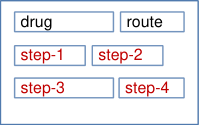

_Fields presented one by one_

_See previous Figure_

Figure 2: Overview of the Prescribing Process and Corresponding User Interface Prescribing Steps (Part 2 of 2)

**Note**

Validation and error handling is out of scope (see section 1.2.2).

The process of creating a prescription can begin with a new, blank prescription. It may also begin
by selecting an item, such as a drug name, elsewhere in the application and using it to begin the
prescribing process.

Page 12

Copyright ©2013 Health and Social Care Information Centre

HSCIC Controlled Document

For example, prescribing may be started by:

 Selecting a drug name from a reference tool (for example, the _British National_

_Formulary_ [6] (BNF))

 Selecting a drug name from a care plan or care pathway

By selecting a drug name elsewhere in the application, the first part of the prescribing process (in
which a drug is selected from a list) can be skipped. When a medication is selected from a list of
current or past medications for the current patient, the drug name and other attributes can be
carried through to the prescribing process, thus allowing other steps to be skipped. Although some
of these tasks may be performed in the view from which they were selected, other tasks may open
the medication in the prescribing area:

 Creating a prescription after one or more doses have been administered

 Modifying a prescription

 Suspending or restarting a prescription

 Discontinuing (stopping) a prescription

 Re-prescribing a past medication

Figure 3 shows these entry points in relation to (a simplified) prescribing process. Guidance relating
to these alternative entry points for the prescribing process is provided in section 3.

|Default Entry Point Create a prescription|Col2|
|---|---|
|Default Entry Point Create a prescription||

|Select from a Drug Dictionary Drug name|Col2|
|---|---|
|Select from a Drug Dictionary Drug name||

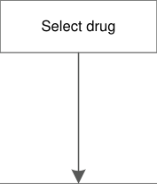

|Select route|Col2|
|---|---|
|||

|Select from a Care Pathway Drug name Part or wholly defined prescription|Col2|
|---|---|
|Select from a Care Pathway Part or wholly defined prescription Drug name||

|Define other attributes|Col2|
|---|---|
|||

Complete
prescription

|Select from a Medications View Modify Change a wholly defined Suspend prescription Re-prescribe Restart a wholly defined prescription Discontinue|Col2|
|---|---|
|Select from a Medications View _Re-prescribe_ a wholly defined prescription _Change_ a wholly defined prescription Modify Suspend Restart Discontinue||
|Select from a Medications View _Re-prescribe_ a wholly defined prescription _Change_ a wholly defined prescription Modify Suspend Restart Discontinue||

Figure 3: Entry Points

6British National Formulary **{R16}** : [http://www.bnf.org/bnf/](http://www.bnf.org/bnf/)

Copyright ©2013 Health and Social Care Information Centre

Page 13

HSCIC Controlled Document

Figure 4 represents the user interface process for prescribing. The sections in this document are

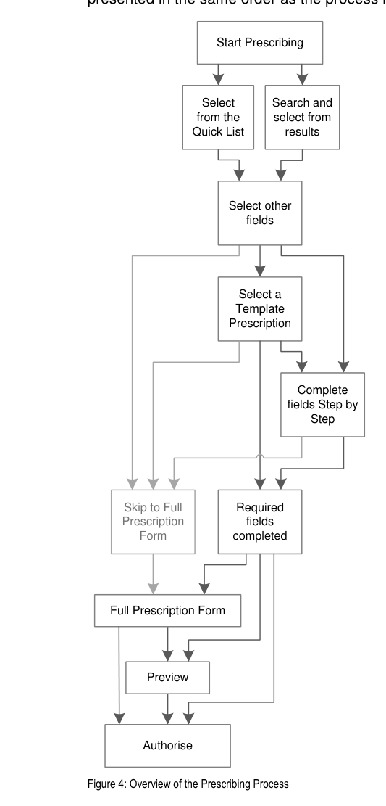

Page 14

Copyright ©2013 Health and Social Care Information Centre

HSCIC Controlled Document

Figure 5 shows the specific user interface areas for which there is guidance in this document. They
are displayed in the same order as the steps in the prescribing process illustrated in Figure 4.

Quick List Search Results

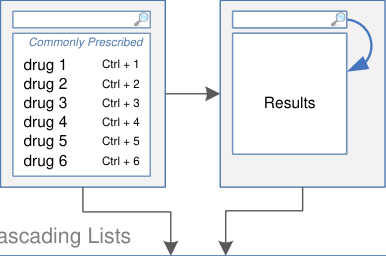

Step by Step

|drug|route|option 1 option 2 option 3|
|---|---|---|
|drug |route|other...|

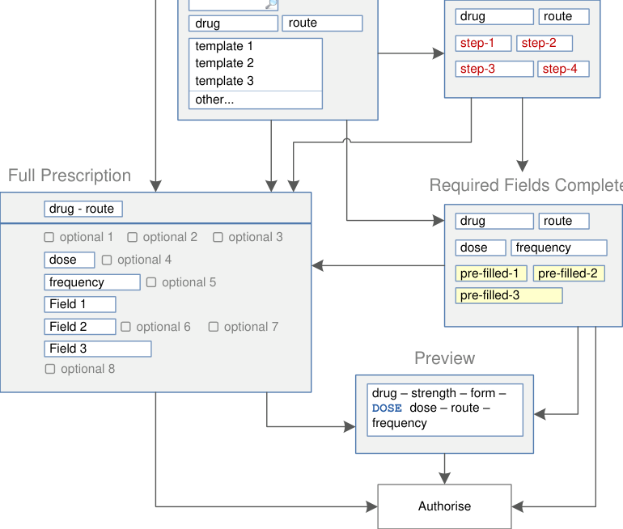

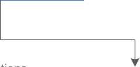

|drug|route|
|---|---|
|template 1 template 2 template 3|template 1 template 2 template 3|
|other...|other...|

Figure 5: User Interface Prescribing Steps

Copyright ©2013 Health and Social Care Information Centre

Page 15

HSCIC Controlled Document

#### **2.1 Rationale Summary**

Each table of guidance includes a rationale that summarises the design analysis, provides a brief
account of related primary and secondary research and lists the key patient safety hazards for the
guidance points in that table. The design analysis describes the deciding factors in the assessment
of alternative approaches to the user interface design and lists the usability principles that are most
pertinent. The desk research section lists the publications that have informed the guidance. The
patient safety section lists the hazards that are mitigated by the guidance and provides a brief
description of how those hazards have been mitigated. Finally, the user research section describes
findings from user feedback and user testing sessions that were used to inform the iterative design
process.

The following principles and existing standards provided benchmarks throughout the process of
developing the guidance:

Usability Principles (specifically for Search and Prescribe):

 Mitigate the risks of mis-selection and misinterpretation

 Increase efficiency by prioritising the prescription of commonly prescribed medications over

less commonly prescribed medications

 Maximise safety in the absence of decision support systems by designing for the reduction

of errors from invalid or inappropriate selections or entries

 Encourage simplicity of design by promoting user interface approaches that help to avoid

overly complex displays and interactions that require many controls

 Ensure that the prescribing process can be supported in multiple layouts and is flexible

enough to be presented in different screen dimensions

 Maximise scalability such that the prescribing process can be modified to accommodate

additional information, steps or shortcuts

 Manage users expectations and improve their efficiency by providing a clear framework

with consistent logic for the placement of user interface elements and the interactions
that they support

 Minimise the potential for important information to be hidden from view

 Adhere to a user interface strategy that gives the impression of making progress within a

single space (that has all the necessary information immediately or readily available) and
avoids the impression of needing to move between many different spaces.

General Usability Principles (see APPENDIX A):

 Jakob Nielsen’s _Ten Usability Heuristics_ _[7]_

 Ben Shneiderman’s eight golden rules of interface design **{R18}**

 ISO 9241: _Presentation of information_ **{R19}**

7 Nielsen, J – Ten Usability Heuristics **{R17}** [: http://www.useit.com/papers/heuristic_list.html](http://www.useit.com/papers/heuristic_list.html)

Page 16

Copyright ©2013 Health and Social Care Information Centre

HSCIC Controlled Document

Existing Guidance:

 NHS NPfIT – _ePrescribing Functional Specification_ **{R12}**

 NHS NPfIT – _Guidelines for the Design and Presentation of Medication Elements Required_

_in Electronic Prescribing or Medication Ordering Systems_ **{R20}**

 ISMP – _Draft Guidelines for Safe Electronic Communication of Medication Orders_ [8]

 NHS NPfIT – _dm+d Implementation Guide (Secondary Care)_ **{R4}**

#### **2.2 Summary of Guidance**

Table 7 summarises the content of this document by outlining each area of guidance (along with a
cross reference to the relevant section) and providing a visual example to illustrate how it might be
implemented:

Section 3 Prescribing Area

Section 4 Quick Lists

Section 5 Drug Search

Section 6 Cascading Lists

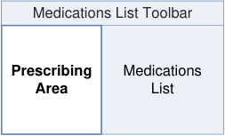

|Patient Banner|Col2|
|---|---|
|Medications List Toolbar|Medications List Toolbar|
|**Prescribing** **Area**|Medications List|

|Col1|Col2|
|---|---|
|drug 1 Ctrl + 1 Ctrl + 2 drug 2 drug 3 drug 4 drug 5 drug 6 Ctrl + 3 Ctrl + 4 Ctrl + 5 Ctrl + 6 _Commonly Prescribed_|drug 1 Ctrl + 1 Ctrl + 2 drug 2 drug 3 drug 4 drug 5 drug 6 Ctrl + 3 Ctrl + 4 Ctrl + 5 Ctrl + 6 _Commonly Prescribed_|

|abc|Col2|
|---|---|
|abcd xyz - ABC Ctrl + 1 Ctrl + 2 _Label_|abcd xyz - ABC Ctrl + 1 Ctrl + 2 _Label_|
|abca abcb abc abc adc _co-xxxxx_ _Label_|abca abcb abc abc adc _co-xxxxx_ _Label_|

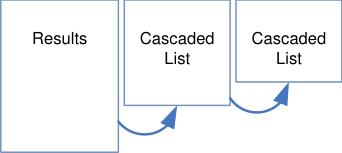

8 ISMP – ISMP MedicationSafetyAlert! – It’s Time for Standards to Improve Safety with Electronic Communication of
Medication Orders – Draft Guidelines for Safe Electronic Communication of Medication Orders **{R21}** :
[http://www.ismp.org/Newsletters/acutecare/articles/20030220.asp](http://www.ismp.org/Newsletters/acutecare/articles/20030220.asp)

Copyright ©2013 Health and Social Care Information Centre

Page 17

HSCIC Controlled Document

Section 7 Required Attributes

|drug route dose frequency xxxxxx item 1|Col2|Col3|
|---|---|---|
|drug route dose frequency item 1 xxxxxx|xxxxxx|xxxxxx|
|drug route dose frequency item 1 xxxxxx|item 1|item 1|
|| item 2||
||item 3|item 3|
||other...|other...|

Section 8 Prescription Forms

Section 9 Input Controls

Section 10 Preview and Authorise

Table 7: Summary of Guidance

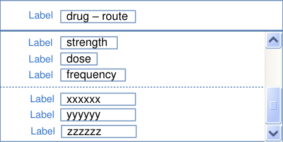

linked

linked

|xxxxxx|Col2|
|---|---|
|item 1 item 2 item 3 item 4|item 1 item 2 item 3 item 4|
|abc 12 uu|abc 12 uu|
|Option 1|Option 1|
|other...|other...|

|Label drug Label route Dose dose Label PRN Label give when... Label start Label duration|Col2|
|---|---|
|drug route dose PRN start duration Label Label Dose Label Label Label give when... Label||
|drug route dose PRN start duration Label Label Dose Label Label Label give when... Label||

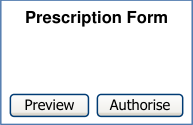

Page 18

Copyright ©2013 Health and Social Care Information Centre

HSCIC Controlled Document

### 3 GUIDANCE DETAILS FOR A PRESCRIBING AREA

#### **3.1 Introduction**

When the prescribing process is initiated, an area will be presented in which the controls for
prescribing are displayed. Although the dimensions and layout of this area are dictated by the
design and technology of the specific clinical application, guidance is provided to ensure
consistency in areas where there are potential patient safety hazards. The guidance in this section
mitigates specific hazards relating to how the prescribing area may interact with other views, such
as a list of a patient’s medications, and how the display of that list may interact with other user
interface elements, such as the patient banner.

Figure 6 shows entry points for the prescribing process. The right-hand side of the diagram is a
simplified version of the process illustrated in Figure 4. The left-hand side of the diagram illustrates
some of the possible ways in which prescribing can be started, including some examples of drug
names and medications that can be selected elsewhere in the application and carried forward into
the prescribing process. The guidance in this section relates to the context in which the prescribing
process is launched.

|Default Entry Point Create a prescription|Col2|
|---|---|
|Default Entry Point Create a prescription||

|Select drug|Col2|
|---|---|
|||

|Select from a Drug Dictionary Drug name|Col2|
|---|---|
|Select from a Drug Dictionary Drug name||

|Select from a Care Pathway Drug name Part or wholly defined prescription|Col2|
|---|---|
|Select from a Care Pathway Part or wholly defined prescription Drug name||

|Define other attributes|Col2|
|---|---|
|||

Complete
prescription

|Select from a Medications View Modify Change a wholly defined Suspend prescription Re-prescribe Restart a wholly defined prescription Discontinue|Col2|
|---|---|
|Select from a Medications View _Re-prescribe_ a wholly defined prescription _Change_ a wholly defined prescription Modify Suspend Restart Discontinue||
|Select from a Medications View _Re-prescribe_ a wholly defined prescription _Change_ a wholly defined prescription Modify Suspend Restart Discontinue||

Figure 6: The Prescribing Process – Entry Points

Copyright ©2013 Health and Social Care Information Centre

Page 19

HSCIC Controlled Document

#### **3.2 Principles**

All guidance is informed by all of the principles for search and prescribe listed in section 2.1. The
following are particularly relevant to this section:

 Ensure that the prescribing process can be supported in multiple layouts and is flexible

enough to be presented in different screen dimensions:

 Guidance does not specify the shape or dimensions of the prescribing area so that it

can remain flexible and can be displayed alongside other views

 Manage users expectations and improve their efficiency by providing a clear framework

with consistent logic for the placement of user interface elements and the interactions that
they support:

 The consistent placement of toolbars that are part of medications views and of the

patient banner ensure that prescribers know where to look for specific information

#### **3.3 Guidelines**

##### **3.3.1 Relating Prescribing to Context**

This section describes important considerations when accessing other views whilst entering
information into a prescription form. For example, views such as those for checking other
medications, current diagnoses, allergies and test results (to name a few) may be essential to
inform the prescribing process.

Views that are displayed concurrently with prescribing should be assessed to check for patient
safety risks introduced by the interactions (or perceived interactions) between the two views and by
the impact of restricting the dimensions of any view that would normally be displayed full screen.

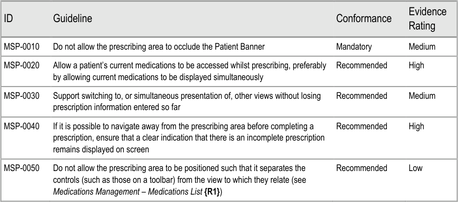

Page 20

Copyright ©2013 Health and Social Care Information Centre

HSCIC Controlled Document

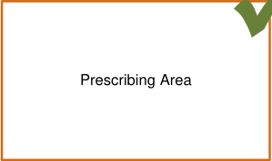

|Col1|Col2|
|---|---|
|||
|||
|Pres|cribing Area|
|||
|||

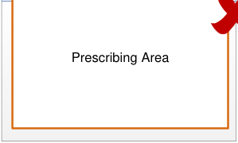

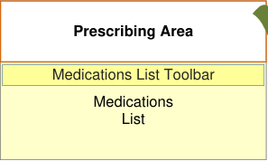

Page 21

Copyright ©2013 Health and Social Care Information Centre

HSCIC Controlled Document

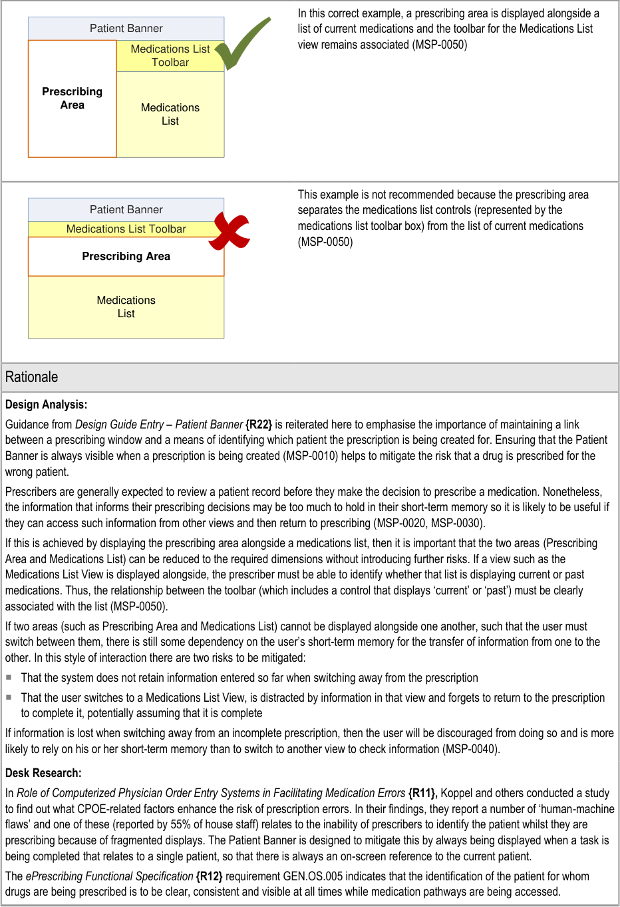

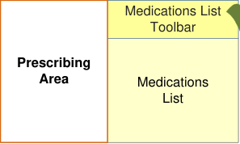

|Patient Banner|Col2|
|---|---|
|**Prescribing** **Area**|Medications List Toolbar|
|**Prescribing** **Area**|Medications List|

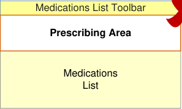

Page 22

Copyright ©2013 Health and Social Care Information Centre

HSCIC Controlled Document

Guidance in this section is informed by the following Nielsen heuristics **{R17}** :

 Visibility of system status – The Patient Banner clearly communicates the patient for whom the drug is being prescribed and, if the

prescriber switches away from this view, the system maintains a notification on screen so that the prescriber knows that there is an
incomplete prescription still open

 Recognition rather than recall – By allowing the prescriber to refer to information outside of the prescribing area, there is no need to

rely on recall of any information available in other views

 Error prevention – Ensuring that the patient banner is always visible makes it less likely that a drug can be prescribed for the wrong

patient

 User control and freedom – If prescribers begin the prescribing process and then find that they need to refer to other information,

such as a test result, during the prescribing process, a system that allows them access to other views during prescribing prevents
the need to cancel the prescription and start again

**User Research:**

In Study ID 69 (see APPENDIX B) the study participants indicated that access to current medications was important during prescribing
and that the ability to access this information without having to switch views is preferable.

Page 23

Copyright ©2013 Health and Social Care Information Centre

HSCIC Controlled Document

### 4 GUIDANCE DETAILS FOR QUICK LISTS

#### **4.1 Introduction**

The process of prescribing begins with the selection of a drug to prescribe. Drugs are presented in
a Quick List and in search results. The Quick List is displayed when the prescribing process is
started and search results are displayed when text is entered into a search text entry box. This
section provides guidance for Quick Lists and section 5 provides guidance for searching for drug
names.

The guidance in this section is part of the first step in the prescribing process, which is shown with

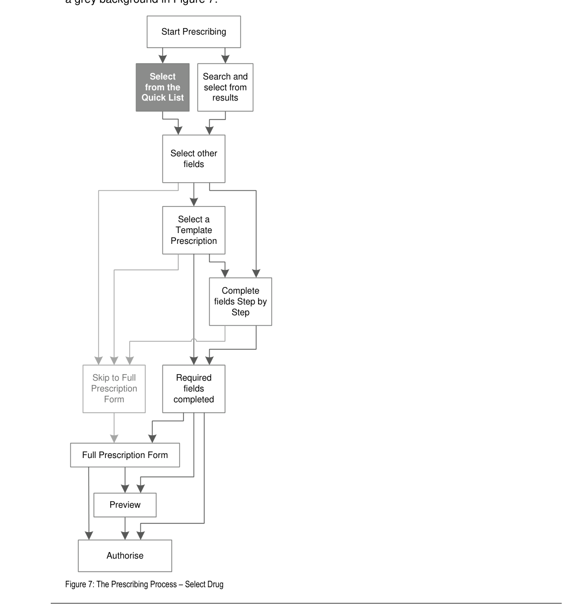

Page 24

Copyright ©2013 Health and Social Care Information Centre

HSCIC Controlled Document

Figure 8 is an extract from Figure 5 to illustrate the user interface prescribing steps covered in this
section showing the Quick List step and links to other steps:

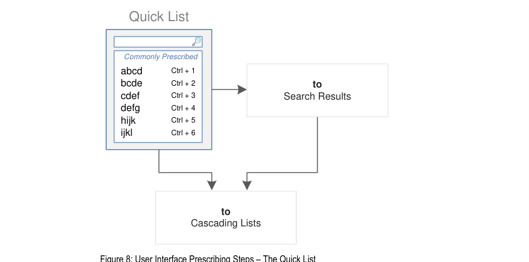

#### **4.2 Principles**

All guidance is informed by all of the principles for search and prescribe listed in section 2.1. The
following are particularly relevant to this section:

 Mitigate the risks of mis-selection and misinterpretation:

 Mitigate the risk of incorrect selection of a drug name from the Quick List

 Mitigate the potential for the Quick List to be mistaken as a suggested list of drugs to

prescribe

 Mitigate the risk of misinterpretation of the Quick List itself and the list items within it

 Maximise safety in the absence of decision support systems by designing for the reduction

of errors from invalid or inappropriate selections or entries:

 The Quick List allows drug names to be presented at the start of the prescribing

process

Page 25

Copyright ©2013 Health and Social Care Information Centre

HSCIC Controlled Document

#### **4.3 Guidelines**

##### **4.3.1 Displaying a Quick List**

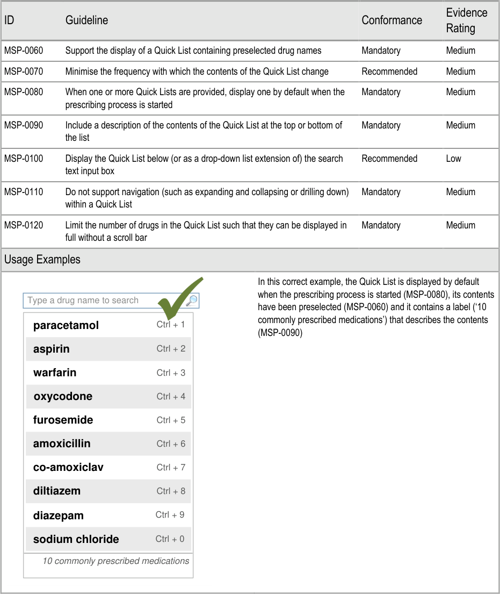

Page 26

Copyright ©2013 Health and Social Care Information Centre

HSCIC Controlled Document

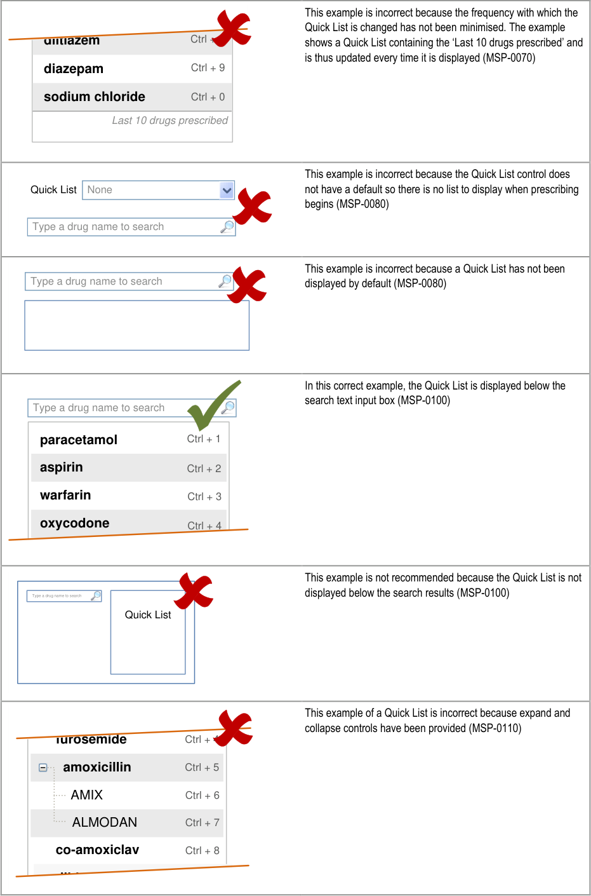

Page 27

Copyright ©2013 Health and Social Care Information Centre

HSCIC Controlled Document

9 The Joint Commission – National Patient Safety Goals – NPSG.03.03.01 – Look-alike/sound-alike drugs **{R23}** :
[http://www.jointcommission.org/AccreditationPrograms/BehavioralHealthCare/Standards/09_FAQs/NPSG/Medication_safet](http://www.jointcommission.org/AccreditationPrograms/BehavioralHealthCare/Standards/09_FAQs/NPSG/Medication_safety/NPSG.03.03.01/look_alike_sound_alike_drugs.htm)
[y/NPSG.03.03.01/look_alike_sound_alike_drugs.htm](http://www.jointcommission.org/AccreditationPrograms/BehavioralHealthCare/Standards/09_FAQs/NPSG/Medication_safety/NPSG.03.03.01/look_alike_sound_alike_drugs.htm)

Page 28

Copyright ©2013 Health and Social Care Information Centre

HSCIC Controlled Document

**Desk Research:**

The _ePrescribing Functional Specification_ **{R12}** includes a requirement (GEN.OS.082) in which it is stated that lists of favourite drugs
should not be produced by individual users without their contents being reviewed and potentially updated centrally. Guidance for the
Quick List (MSP-0060) reflects this principle of maintaining central control.

Guidance in this section is informed by the following Nielsen heuristic **{R17}** :

 Flexibility and efficiency of use – A Quick List allows the prescriber to select a drug from a list instead of having to search for it,

without impacting the efficiency of the process of searching for a drug. (The Quick List is displayed by default and no extra steps
are needed to dismiss it before starting a drug search.)

**User Research:**

In Study ID 37 (see APPENDIX F), participants who were asked about the Quick List considered it to be useful providing it contained
drugs that were relevant to them. The participants estimated that a trust-wide list of commonly prescribed drugs would not be as useful
as a list constructed for their specific context or specialty.

**Hazard Risk Analysis Summary:**

From our Patient Safety Risk Assessment analyses, we identified a number of potential hazards, including the following key risks
which are mitigated by the guidance:

**Potential Hazards:**

 The presence of a Quick List

influences the choice of drug
inappropriately for inexperienced
users

 The user thinks that the Quick List is

all there is

**Mitigations:**

 This guidance document includes an assumption (see section 1.3) that prescribers

know what they want to prescribe before they initiate the prescribing process

 The limited length of the Quick List (MSP-0120) reduces the number of available

choices. This reduces the likelihood that there will be a drug in the Quick List that is
similar to or an alternative for the one that the prescriber has in mind and thus
reduces the likelihood that the presence of such a drug may influence choice

 If a progressive search is supported (see section 5.3.3), some inexperienced users

may find it easier to type in letters than to read the contents of a Quick List. (It is
expected that a Quick List would become more useful over time as users become
more familiar with its contents)

 Text labels at the top or bottom of the search results list are used to describe the

contents of the list (MSP-0090)

 The presence of the search text input box and the in-field prompt within it (see

section 5.3.1) mitigate this risk by clearly indicating that it is possible to search for a
drug

##### **4.3.2 Quick List Contents**

**Important**

This section contains guidance for which there may be alternative solutions. Accordingly, the conformance
ratings in this section apply only where the guidance is adopted.

The Rationale section contains a summary of the known risks which are addressed in this section and
which must be addressed by any alternative solution. For more information, see the Alternative Design
Solutions note in section 1.

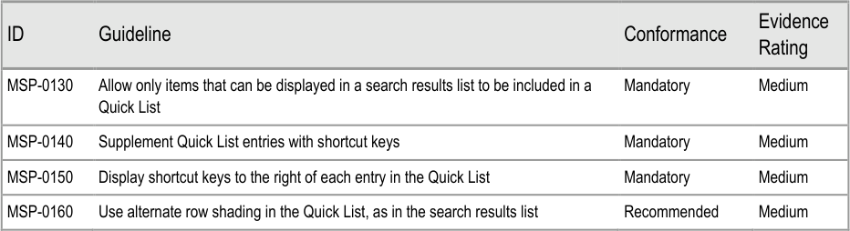

Page 29

Copyright ©2013 Health and Social Care Information Centre

HSCIC Controlled Document

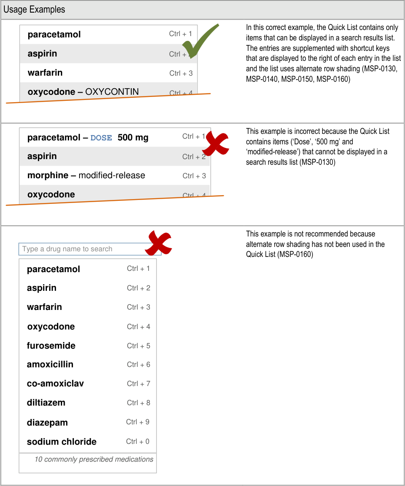

Page 30

Copyright ©2013 Health and Social Care Information Centre

HSCIC Controlled Document

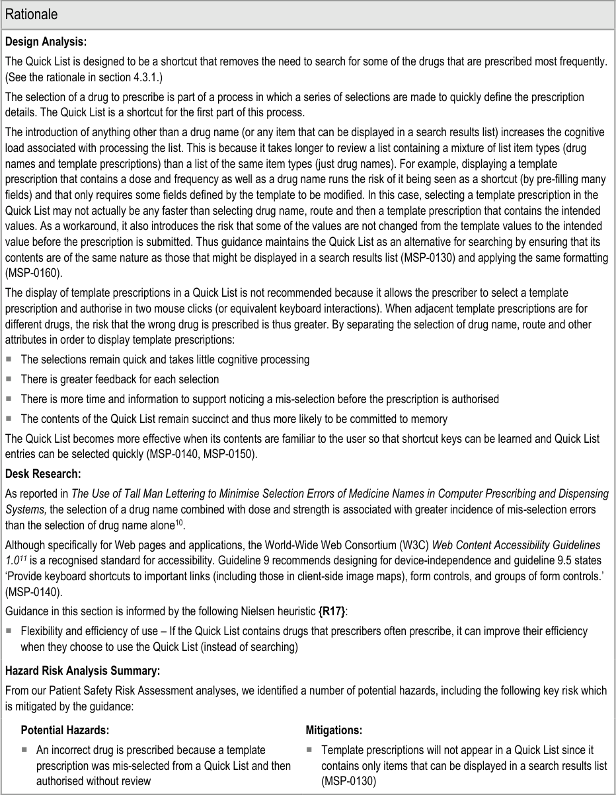

10 The Use of Tall Man Lettering to Minimise Selection Errors of Medicine Names in Computer Prescribing and Dispensing
Systems **{R24}** [: http://www.ccforpatientsafety.org/patient-safety-solutions/](http://www.ccforpatientsafety.org/patient-safety-solutions/)

11 Web Content Accessibility Guidelines 1.0 **{R25}** [: http://www.w3.org/TR/WAI-WEBCONTENT/](http://www.w3.org/TR/WAI-WEBCONTENT/)

Page 31

Copyright ©2013 Health and Social Care Information Centre

HSCIC Controlled Document

##### **4.3.3 Notifying When a Quick List Has Changed**

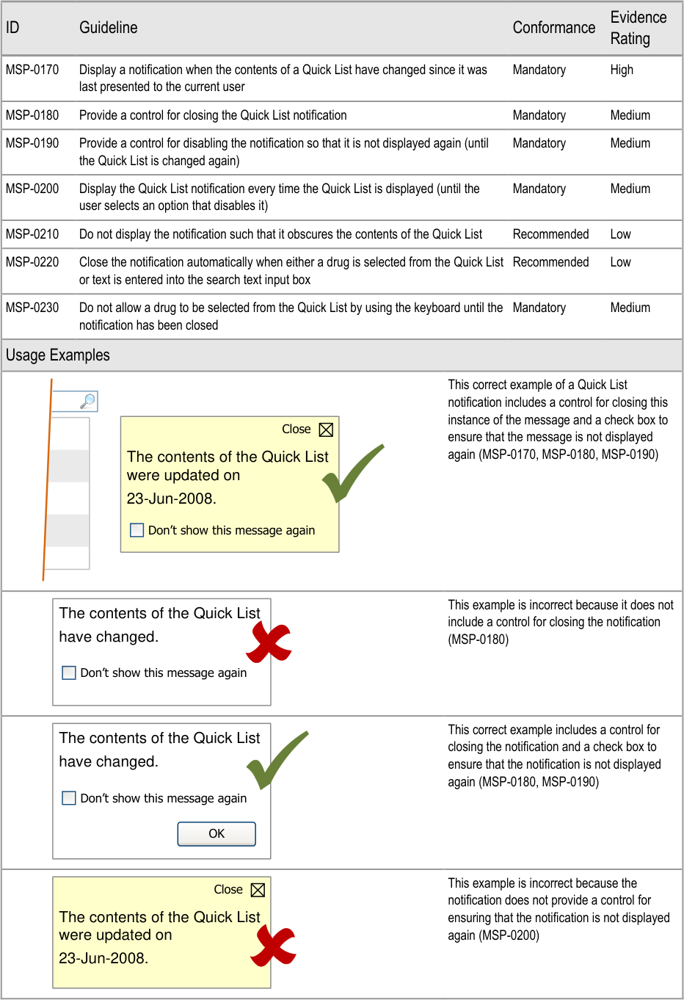

Page 32

Copyright ©2013 Health and Social Care Information Centre

HSCIC Controlled Document

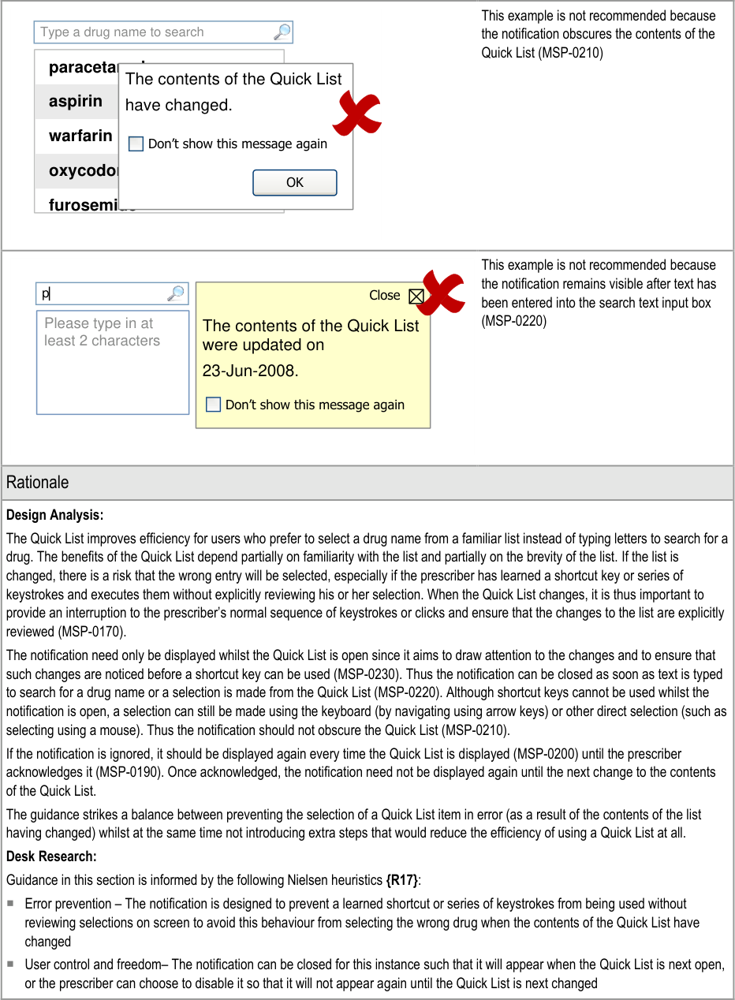

|Type a drug name to search|Col2|Col3|
|---|---|---|
|**aspirin** **oxycodone** **furosemide** **paracetamol** **warfarin** The contents of the Q have changed. Don’t show this messag|**aspirin** **oxycodone** **furosemide** **paracetamol** **warfarin** The contents of the Q have changed. Don’t show this messag|**aspirin** **oxycodone** **furosemide** **paracetamol** **warfarin** The contents of the Q have changed. Don’t show this messag|
|**aspirin** **oxycodone** **furosemide** **paracetamol** **warfarin** The contents of the Q have changed. Don’t show this messag|**ne** **de** **mol** The contents of the Q have changed. Don’t show this messag|uick List    e again OK|

Page 33

Copyright ©2013 Health and Social Care Information Centre

HSCIC Controlled Document

**Hazard Risk Analysis Summary:**

From our Patient Safety Risk Assessment analyses, we identified a number of potential hazards, including the following key risk which
is mitigated by the guidance:

**Potential Hazards:**

 The user becomes over-reliant on

shortcut keys (or sequences of
key strokes) and the Quick List
has changed

**Mitigations:**

 A notification is displayed when the contents of the Quick List has changed (MSP-0170)

 Whilst a notification is displayed, shortcut keys or sequence of key strokes do not result

in the selection of a Quick List entry (MSP-0230)

##### **4.3.4 Accommodating Multiple Quick Lists**

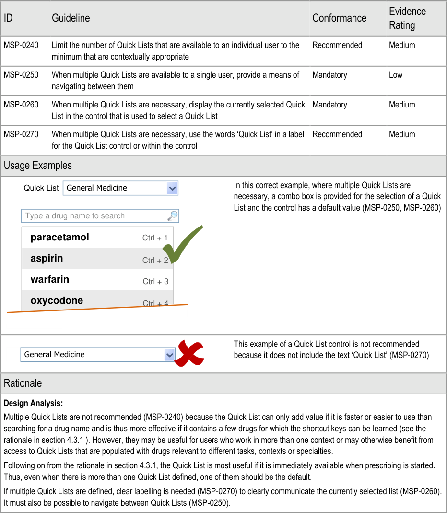

Page 34

Copyright ©2013 Health and Social Care Information Centre

HSCIC Controlled Document

**Desk Research:**

The _ePrescribing Functional Specification_ **{R12}** includes a requirement (GEN.OS.082) to support the display of different formularies
for specific users, groups of users, specialties or locations. Whilst formularies are out of scope, the principle of providing access to
multiple manually defined lists is reflected by the guidance in this section.

Guidance in this section is informed by the following Nielsen heuristic **{R17}** :

 Flexibility and efficiency of use – Access to more than one Quick List avoids an inappropriately constrained Quick List

**User Research:**

All participants in Study ID 37 (see APPENDIX F) considered the Quick List to be useful for specific areas (such as on a post-operative
cardiac ward or for the management of anaemia) in which there can be relatively small variation in prescribing. However, participants
also pointed out that some staff work in a variety of situations that might require different lists. For these situations, it may be relevant
to allow the context to define which Quick List is displayed or to allow the user to select an appropriate Quick List (that may then
remain the default for that session).

Page 35

Copyright ©2013 Health and Social Care Information Centre

HSCIC Controlled Document

### 5 GUIDANCE DETAILS FOR DRUG SEARCH

#### **5.1 Introduction**

This section and section 4 provide guidance for the selection of a drug to prescribe (from a Quick
List or from search results). Section 4 provides guidance for Quick Lists. This section provides
guidance for searching for drug names, displaying a list of search results and selecting a drug to
prescribe.

The guidance in this section is part of the first step in the prescribing process, which is shown with

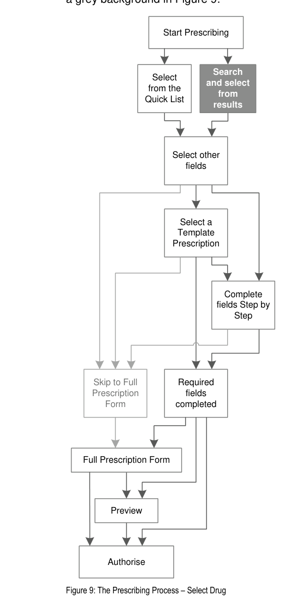

Page 36

Copyright ©2013 Health and Social Care Information Centre

HSCIC Controlled Document

The following prescribing tasks were used to inform assessment of design alternatives in order to
maintain an appropriate focus during the development of guidance:

 Find a drug that I prescribe every day

 Find a drug when I only know the brand name

 Find a drug that contains more than one ingredient and I only know one of them

 Find a drug to prescribe when the name of the drug has changed or is misspelled

 Select a medication from a list of search results containing medications that are easily

misread or confused with another drug name

These prescribing tasks address specific known patient safety hazards associated with electronic
prescribing and ensure that guidance is user-focused.

The following tasks were used as a checklist during the creation of the guidance to ensure that it
remained sufficiently flexible:

 Prescribing very long drug names with an unusually large number of characters (for

example, ‘Diphtheria + Haemophilus influenzae type B + Pertussis + Poliomyelitis +
Tetanus vaccine’)

 Less common prescribing practices requiring greater user control (for example, prescribing

a medication with an unusual or unlicensed route)

 Defining search criteria which have a large number of matches to display in the search

results

 Working with a prescribing area when screen space is limited

This guidance aims to mitigate the following patient safety hazards:

 Risk of mis-selection when drug names that look or sound similar are displayed in a list

 Risks associated with lack of familiarity with combination drugs (co-drugs)

 Risks associated with the display of, and navigation within, long lists

Figure 10 is an extract from Figure 5 and illustrates the user interface prescribing steps that are
covered in this section showing the drug search step and links to and from other steps:

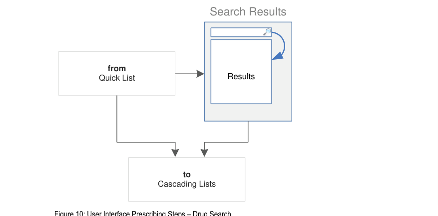

Copyright ©2013 Health and Social Care Information Centre

Page 37

HSCIC Controlled Document

#### **5.2 Principles**

All guidance is informed by all of the principles for search and prescribe listed in section 2.1. The
following are particularly relevant to this section:

 Mitigate the risks of incorrect selection and misinterpretation:

 A limited list height, coupled with progressive searching (the progressive updating of
search results as more letters are typed) encourages selection of drug names from
shorter lists

 Formatting of drug names that are known to be mis-selected and the use of
supplementary text in search results helps to avoid potential misinterpretation

 The potential for misinterpretation is mitigated by encouraging a simple user interface in
which the need for copious or complex user interface elements (such as controls and
labels) is minimised

 Increase efficiency by prioritising the prescription of commonly prescribed medications over

less commonly prescribed medications:

 Guidance for drug search results lists encourages the prioritisation of results so that
commonly prescribed medications can appear higher in the list

 Maximise safety in the absence of decision support systems by designing for the reduction

of errors from invalid or inappropriate selections or entries:

 Search results can be formatted and supplemented with additional text (such as the

ingredients of a co-drug) to help avoid inappropriate selections

 Handling of generic and brand names ensures that a brand name cannot be prescribed

without the generic name being displayed, allowing generic equivalents to be
prescribed and encouraging generic prescribing

 Adhere to a user interface strategy that gives the impression of making progress within a

single space (which has all the necessary information immediately or readily available) and
avoids the impression of needing to move between many different spaces:

 When search results lists are extended (so that all results can be seen instead of only

the first page), the list is expanded in context

 The search results are displayed such that they replace the Quick List

Page 38

Copyright ©2013 Health and Social Care Information Centre

HSCIC Controlled Document

#### **5.3 Guidelines**

##### **5.3.1 Positioning the Search Text Input Box**

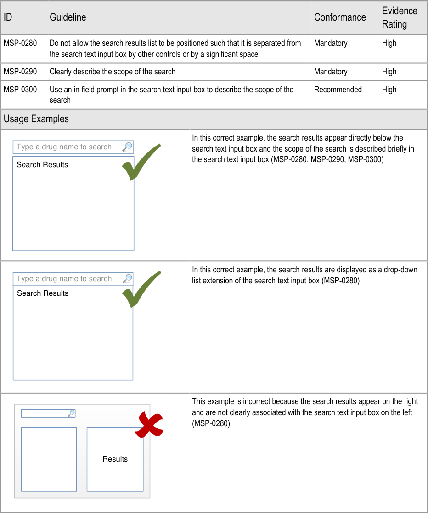

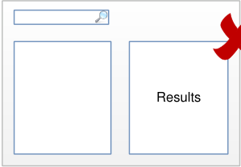

Page 39

Copyright ©2013 Health and Social Care Information Centre

HSCIC Controlled Document

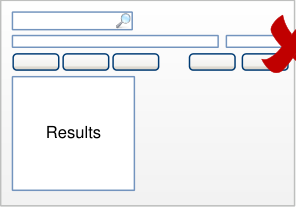

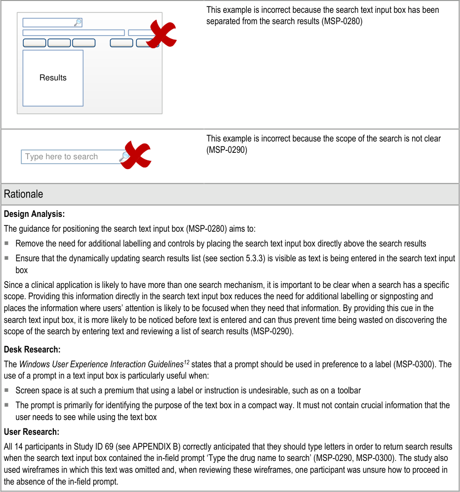

12 Microsoft – Windows User Experience Interaction Guidelines – Guidelines, Controls, Command Buttons **{R26}** :
[http://msdn.microsoft.com/en-us/library/aa511453.aspx#defaults](http://msdn.microsoft.com/en-us/library/aa511453.aspx#defaults)

Page 40

Copyright ©2013 Health and Social Care Information Centre

HSCIC Controlled Document

##### **5.3.2 Defining Text Input Box Behaviour**

This section includes guidance that refers to the use of codes to search for drugs. Codes are
arbitrary or ad-hoc sets of numbers or letters that are typed into a search text input box in order to
quickly access a specific drug name.

Page 41

Copyright ©2013 Health and Social Care Information Centre

HSCIC Controlled Document

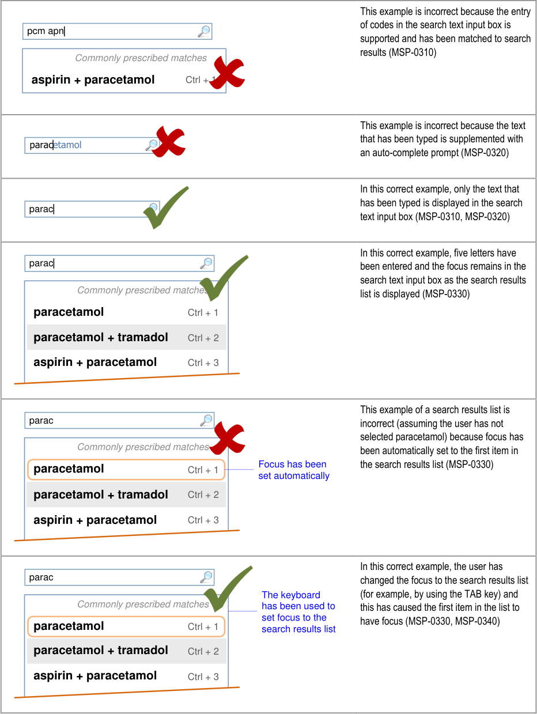

Page 42

Copyright ©2013 Health and Social Care Information Centre

HSCIC Controlled Document

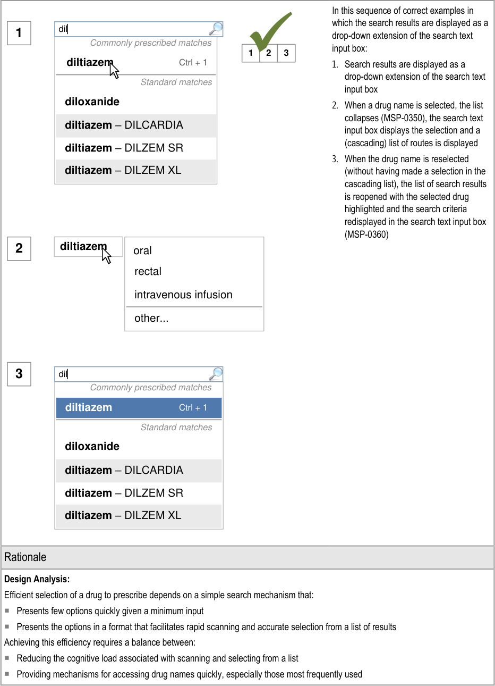

|diltiazem|oral rectal intravenous infusion|
|---|---|
|**diltiazem**|other...|

Copyright ©2013 Health and Social Care Information Centre

Page 43

HSCIC Controlled Document

**Design Analysis for Coded Entry versus Progressive Search:**

The guidance is informed by a limited analysis using Keyboard-Level Model — Goals, Objects, Methods and Selection (KLM-GOMS)
**{R27}** of alternative mouse and keyboard focused approaches. This included the use of both coded entry and cascading selection (see
section 6). Whilst the analysis was not detailed enough to predict times taken to select a drug in each design, it suggested that the use
of coded entry could be about one second faster than cascading selection using keyboard shortcuts. However, coded entry is not
without potential problems (see paragraphs below).

Coded entry is a mechanism for quick prescribing that depends on recall of codes for a limited number of drugs. It speeds up the
process of prescribing by minimising the need to read, navigate and select from lists, especially for frequently prescribed medications.
Coded entry is useful in a system that presents long lists from which selections need to be made or have complex processes for
finding a drug to prescribe.

This guidance presents a framework that provides alternative mechanisms for search and selection that help to:

 Reduce the lengths of lists

 Prioritise commonly prescribed drugs

 Minimise characters needed in the search text input box

 Provide additional alternative accelerators for quick access to commonly prescribed drugs and predefined prescriptions

When these mechanisms are combined, they help to reduce the cognitive load of the user, are comparable to coded entry for
frequently prescribed drugs and provide additional benefits for finding all drugs.

However, when combined with spelling matching, coded entry may increase the risks of misinterpretation and mis-selection, since the
relationship between codes entered and matches in the results list is difficult to communicate with clarity. Other issues with coded
entry include:

 The need to create and maintain a list of codes

 Ensuring consistency in the creation of codes

 Providing an effective mechanism for alerting users when codes have changed

 Avoiding clashes between codes and spelling matches

If coded entry is used, a separate control or area is needed for entering codes to provide support for feedback as codes are being
entered. The provision of a control for entering codes must be separate from the search text input box (MSP-0310). This allows
feedback to be provided as codes are entered and can be used to mitigate issues such as misinterpretation, mis-selection and
‘clashes’ between codes and spelling matches.

**Design Analysis for Auto-Completion** :

Auto-completion is effective for minimising the number of letters that need to be typed before a specific result is found and selected but
may increase the risk of mis-selection. A progressive search achieves similar benefits (see section 5.3.3), but instead of providing a
single match, like auto-complete, it requires a selection to be made from a list. Auto-complete introduces the risk that:

 An auto-completed drug name is accepted unintentionally

 The auto-complete suggestion may inappropriately influence the prescriber’s choice

Unlike a static search (that requires the text to be submitted before results are displayed), entering additional characters in progressive
matching reduces the number of search results. Editing those characters also changes the search results. Efficient editing of the
search text requires that the focus remains in the search text entry box. This avoids the need to navigate from the search results list
back to the search text input box before additional text can be typed or existing text edited (MSP-0320).

**Desk Research:**

Guidance in this section is informed by the following Nielsen heuristic **{R17}** :

 Error prevention – Avoiding typing codes into a search text input box, reduces the potential for display of unintended matches in a

search results list

**Hazard Risk Analysis Summary:**

From our Patient Safety Risk Assessment analyses, we identified a number of potential hazards, including the following key risk which
is mitigated by the guidance:

**Potential Hazards:**

 Auto-complete prompts the user to select

inappropriately

**Mitigations:**

 MSP-0320 mandates that auto-complete is not used in a drug search

text entry box

Page 44

Copyright ©2013 Health and Social Care Information Centre

HSCIC Controlled Document

##### **5.3.3 Displaying Results with Progressive Matching**

|Col1|Evidence ID Guideline Conformance Rating|
|---|---|
||MSP-0370 Display results using progressive matching where possible  Recommended Medium|
||MSP-0380 In the absence of progressive matching, provide a static search that submits text in the search text input box by pressing the ENTER key and/or activating a control (such as a button) to submit the search Recommended High|
||Usage Examples|
|| In this correct example, the search results list shortens as more letters are typed in so that there are fewer matches (MSP-0370) **1** **2** fi **filgrastim** filnar **morphine**– FILNARINE **morphine**– FILNARINE **1** **2**|
|| In this correct example of a search that does not have progressive matching; a button has been provided for displaying the search results (MSP-0380) fi **filgrastim** **morphine**– FILNARINE Search|
||Rationale|
||**Design Analysis:**  Guidance on the search results list (and Quick List) aims to:  Encourage a search-based approach to finding drug names  Support only limited browsing  Limit the cognitive steps for selecting a drug to prescribe A progressive search (MSP-0370) improves the efficiency of the user by supporting strategies, such as typing in letters, until the search results are short enough for the desired result to be noticeable in the search results list. This helps the user make the selection quickly and easily. This approach allows attention to move quickly between the search text input box and the search results. This is considered to be more efficient than a static search in which attention shifts from the text input box to search results and back in a more sequential way. Selection of all the text entered in the search text input box is easier in a static search, since returning focus to the search text input box automatically selects the whole contents and allows it to be replaced with new text. The need to retain focus in the search text input box to support adding and correcting of individual letters is a more common need than to replace the entire contents of the search text input box. Where technology cannot support a progressive search, a static search may be provided in which search criteria are submitted by using a button (MSP-0380). This approach is less effective as a tool for accessing shorter lists since the prescriber must make a decision about how many letters to enter before submitting the search results (rather than responding to the changing list length that is visible in a progressive search). **Note** A progressive search may support the use of the ENTER key to submit the search criteria in addition to presenting the results automatically (but with a slight delay). |

Page 45

Copyright ©2013 Health and Social Care Information Centre

HSCIC Controlled Document

**Desk Research:**

Guidance in this section is informed by the following Nielsen heuristic **{R17}** :

 Flexibility and efficiency of use – The progressive search allows users to access a short list of search results faster. The short list

reduces cognitive load thus reducing the time it takes for them to find and select the drug to prescribe

**Hazard Risk Analysis Summary:**

From our Patient Safety Risk Assessment analyses, we identified a number of potential hazards, including the following key risks,
some of which are mitigated and some partially mitigated by the guidance:

**Potential Hazards:**

 A drug name is mis-selected in

the search results list

 A drug name is mis-selected

because it appears next to or in
the same list as a look-alike or
sound-alike drug name

 The scroll bar in a list of search

results is not noticed and the
prescribers assume that the drug
they want is not available for
prescribing

 A long list of search results is

returned and an inappropriate
selection is made in preference to
navigating further through the list

 Alternate row shading is mistaken

for selection or highlighting when
there are only two or three list
items in a list or section

**Mitigations:**

 **This risk is not wholly mitigated by guidance**

 Search results are prioritised (see section 5.3.12) and listed in matched order before

alphabetical order to maximise logical grouping (see section 5.3.8)

 The list is limited in length (see section 5.3.5) and progressive matching is

recommended (MSP-0370) to encourage selection from shorter lists

 Progressive matching encourages the typing of more letters for shorter lists of search

results (MSP-0370)

 Search results lists are limited in height (see section 5.3.5)

 Drugs are displayed by searching and search results are matched to the beginnings of

words so search results share the same initial letters (see section 5.3.7)

 Search results are ordered such that generic names are listed before brand names (see

section 5.3.8)

 Search results are displayed in matched order and then alphabetically (see

section 5.3.8)

 Search results are prioritised (see section 5.3.12)

 Brand names are supplemented with generic names (when they exist) (see

section 5.3.17)

 Brand names are displayed after the generic name (when they exist) in a single list item

(see section 5.3.17)

 If _Medications Management – Medication Line_ **{R3}** guidance is followed, brand names

are differentiated by displaying them in capital letters

 The limited list length avoids the use of a scroll bar so that it is clearer when there are

further results off screen (see section 5.3.5)

 The provision of a progressive search for achieving fewer search results (MSP-0370)

 A clear, noticeable and consistent way of communicating the extent of the search

results, including the provision of text such as ‘Showing 10 of 40 matches’ at the end of
a list of search results and the provision of a control such as a button labelled ‘Show All’
at the end of a list of search results (see section 5.3.5)

 The list is limited in length and the length remains consistent (see section 5.3.5)

 A progressive search provides a mechanism for achieving fewer search results and puts

the users in control of the length of the search results list by allowing them to type in
additional letters and see the list updated as they type (MSP-0370).

 **This risk is not wholly mitigated by guidance**

 Alternate row shading should be subtle (see section 5.3.16)

 When results are displayed using progressive matching (MSP-0370) the initial list of

results is more likely to contain greater than three drugs in any one section of the list
and the user is thus familiar with presence and meaning of the alternate row shading
before the list is shortened such that this risk is introduced

Page 46

Copyright ©2013 Health and Social Care Information Centre

HSCIC Controlled Document

##### **5.3.4 Providing Feedback for a Progressive Search**

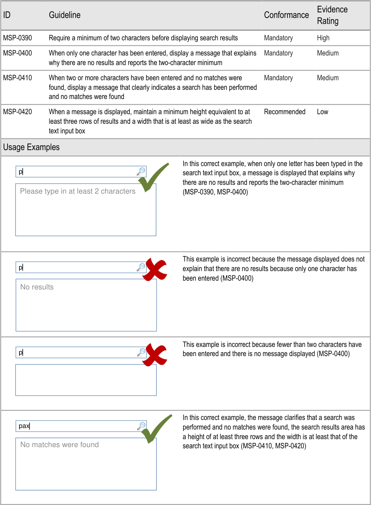

Page 47

Copyright ©2013 Health and Social Care Information Centre

HSCIC Controlled Document

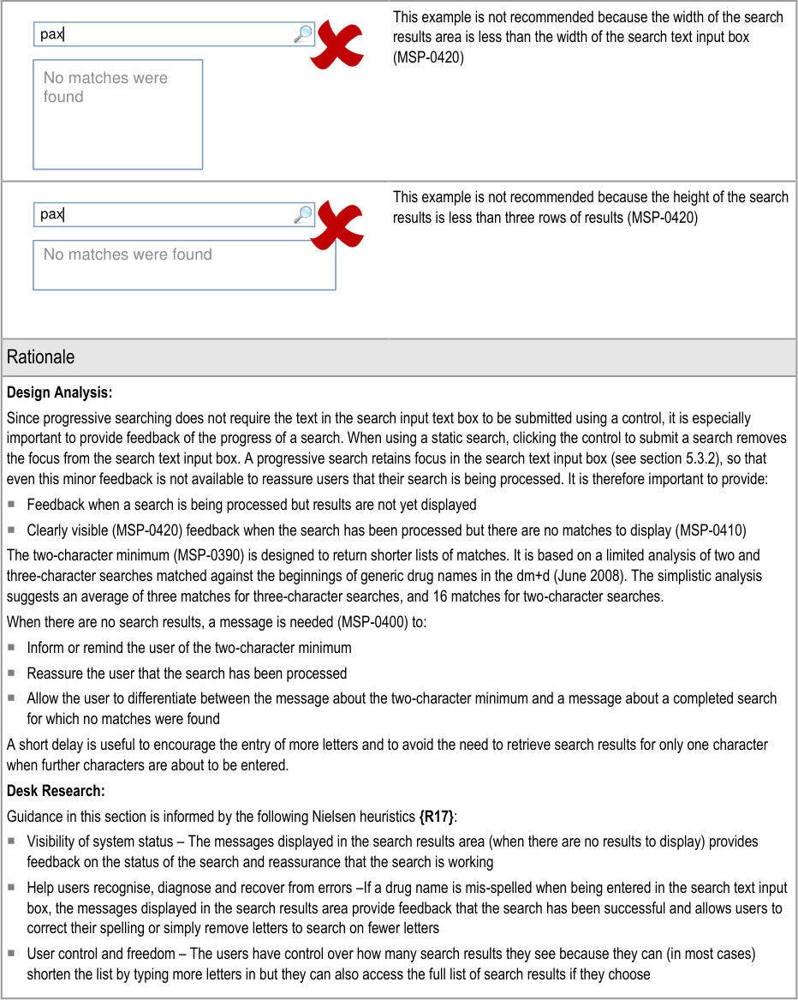

Page 48

Copyright ©2013 Health and Social Care Information Centre

HSCIC Controlled Document

##### **5.3.5 Limiting the Height of a Search Results List**

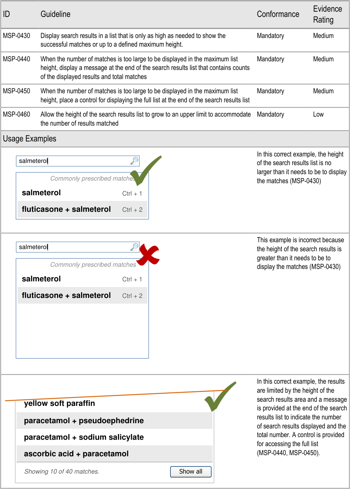

Page 49

Copyright ©2013 Health and Social Care Information Centre

HSCIC Controlled Document

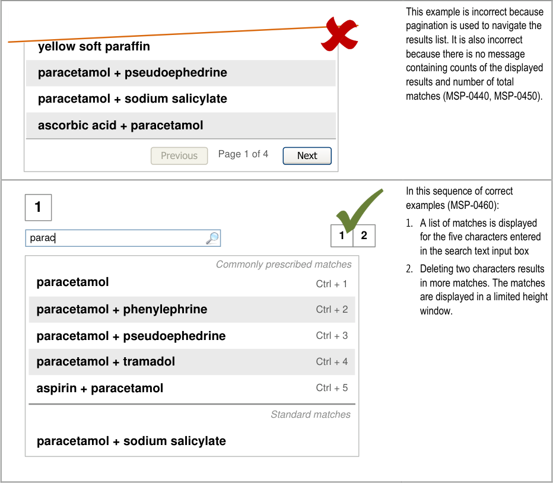

Page 50

Copyright ©2013 Health and Social Care Information Centre

HSCIC Controlled Document

|Col1|2 par Commonly prescribed matches paracetamol Ctrl + 1 paroxetine Ctrl + 2 paracetamol + phenylephrine Ctrl + 3 paracetamol + pseudoephedrine Ctrl + 4 paracetamol + tramadol Ctrl + 5 aspirin + paracetamol Ctrl + 6 Standard matches paraldehyde parathyroid hormone parecoxib paracetamol + sodium salicylate Showing 10 of 40 matches. Show all|
|---|---|
||Rationale|
||**Design Analysis:**  The search results list length is limited (MSP-0430) in order to encourage the entry of more letters so that a shorter results list can be returned. A shorter results list will be immediately noticeable since the window shrinks in height to fit the results. This approach is one that promotes searching over browsing on the basis that:  Searching is expected to be more efficient when looking for a specific drug name  Browsing is more appropriate when it is important to expose the user to more options in a way that also communicates the structure of those options One of the benefits of a progressive search is that it effectively supports the strategy of typing in enough letters to get a single match or short list of matches. By allowing the height of the search results list to change as the length of the results list changes, the changes in length can be picked up by peripheral vision, which allows the user’s attention to remain on typing in the search text input box. With a background that is different in tone to the colours used in the search results list, this visual cue is an even stronger indication of the changing search results list height. Alternative design solutions that were assessed include:  An unlimited search results list that is displayed with a scroll bar when necessary  Search results lists broken down into pages with navigation controls for moving between the pages Those two approaches are less effective than the recommended approach at achieving the following benefits:  Encourage the typing of more letters to avoid the user having to use a control to access a longer list of search results  Avoid longer lists to reduce the chances of mis-selection errors  Avoid longer lists to speed up selection from a list with fewer choices  Reduce the cognitive load associated with reviewing and selecting from a longer list  Discourage the use of the prescribing tool as a drug dictionary (for browsing or for entering brand names to look up the generic name) By allowing the full list of search results to be displayed, the drug search supports an approach to finding a medication that is closer to browsing than searching whilst still encouraging the use of the progressive search to access and therefore select from shorter lists.|

Page 51

Copyright ©2013 Health and Social Care Information Centre

HSCIC Controlled Document

**Desk Research:**

Guidance in this section is informed by the following Nielsen heuristics **{R17}** :

 Aesthetic and minimalist design – Limiting the height of the search results list keeps the drug search interface simple and removes

the need for navigation controls that are unnecessary in an efficient progressive search that returns only drug names (and
synonyms)

 Error prevention – Limiting the height of a search results lists limits the number of results immediately available for selection and

thus reduces opportunity for mis-selection

 Flexibility and efficiency of use – The limited height of search results encourages the use of the progressive drug search and this is

considered to be more efficient at supporting the task of finding a specific drug than browsing

 User control and freedom – Although the list of search results is limited, users still have the choice of extending the list so that they

can browse a larger set of search results

**Hazard Risk Analysis Summary:**

From our Patient Safety Risk Assessment analyses, we identified a number of potential hazards, including the following key risks,
some of which are mitigated and some partially mitigated by the guidance:

**Potential Hazards:**

 The scroll bar in a list of search

results is not noticed and the
prescribers assume that the
drug they want is not available
for prescribing

 A long list of search results is

returned and an inappropriate
selection is made in preference
to navigating further through the
list

 A drug name is mis-selected in

the search results list

 A drug name is mis-selected

because it appears next to or in
the same list as a look-alike or
sound-alike drug name

**Mitigations:**

 The limited list length (MSP-0430) avoids the use of a scroll bar so that it is clearer when

there are further results off screen

 The provision of a progressive search for achieving fewer search results (see

section 5.3.3)

 A clear, noticeable and consistent way of communicating the extent of the search results,

including the provision of text such as ‘Showing 10 of 40 matches’ at the end of a list of
search results (MSP-0440) and the provision of a control such as a button labelled ‘Show
All’ at the end of a list of search results (MSP-0450)

 The list is limited in length and the length remains consistent (MSP-0430)

 A progressive search provides a mechanism for achieving fewer search results and puts

the users in control of the length of the search results list by allowing them to type in
additional letters and see the list updated as they type (see section 5.3.3).

 **This risk is not wholly mitigated by guidance**

 The list is limited in length (MSP-0430) and progressive matching is recommended (see

section 5.3.3) to encourage selection from shorter lists

 Search results are prioritised (see section 5.3.12) and listed in matched order before

alphabetical order to maximise logical grouping (see section 5.3.8)

 Progressive matching encourages the typing of more letters for shorter lists of search

results see section 5.3.3)

 Search results lists are limited in height (MSP-0430)

 Drugs are displayed by searching and search results are matched to the beginnings of

words so search results share the same initial letters (see section 5.3.7)

 Search results are ordered such that generic names are listed before brand names (see

section 5.3.8)

 Search results are displayed in matched order and then alphabetically (see section 5.3.8)

 Search results are prioritised (see section 5.3.12)

 Brand names are supplemented with generic names (when they exist) (see section 5.3.17)

 Brand names are displayed after the generic name (when they exist) in a single list item

(see section 5.3.17)

 If _Medications Management – Medication Line_ **{R3}** guidance is followed, brand names

are differentiated by displaying them in capital letters

Page 52

Copyright ©2013 Health and Social Care Information Centre

HSCIC Controlled Document

##### **5.3.6 Extending the Search Results List**

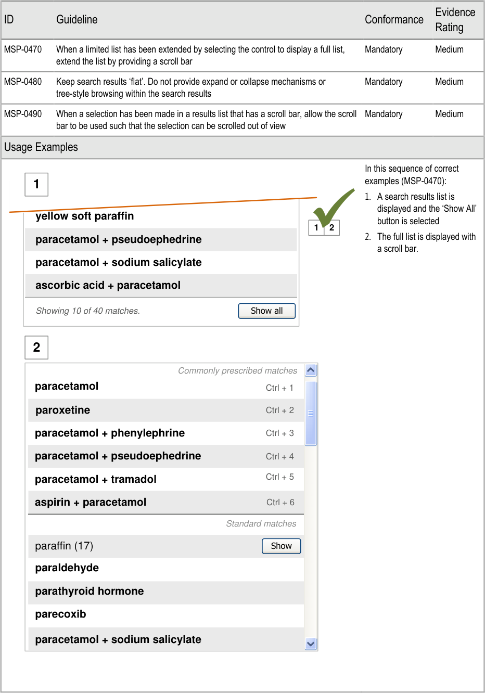

Page 53

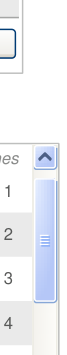

Copyright ©2013 Health and Social Care Information Centre

HSCIC Controlled Document

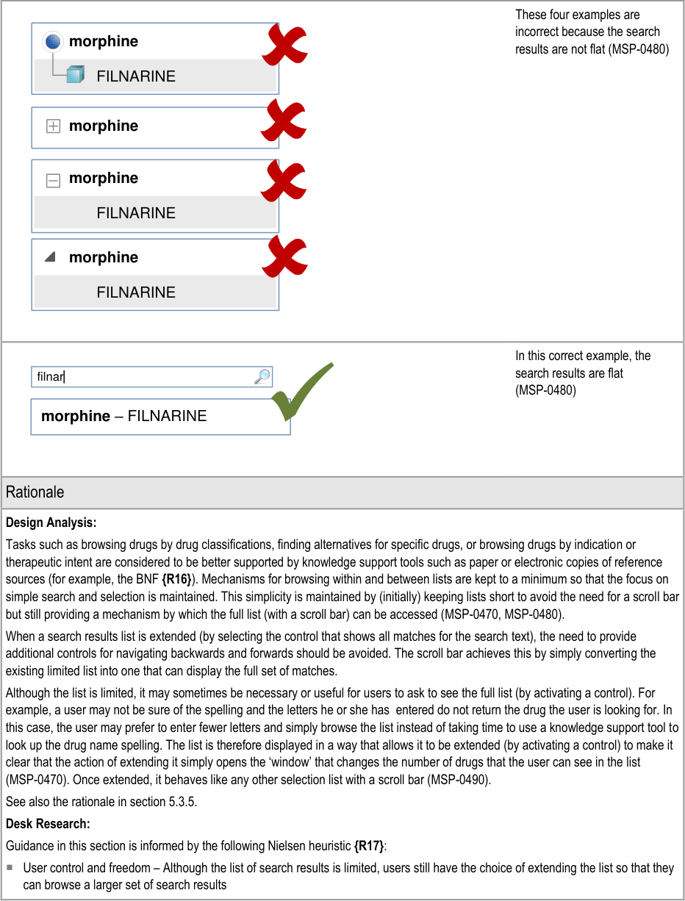

Page 54

Copyright ©2013 Health and Social Care Information Centre

HSCIC Controlled Document

##### **5.3.7 Matching Input Text to Results**

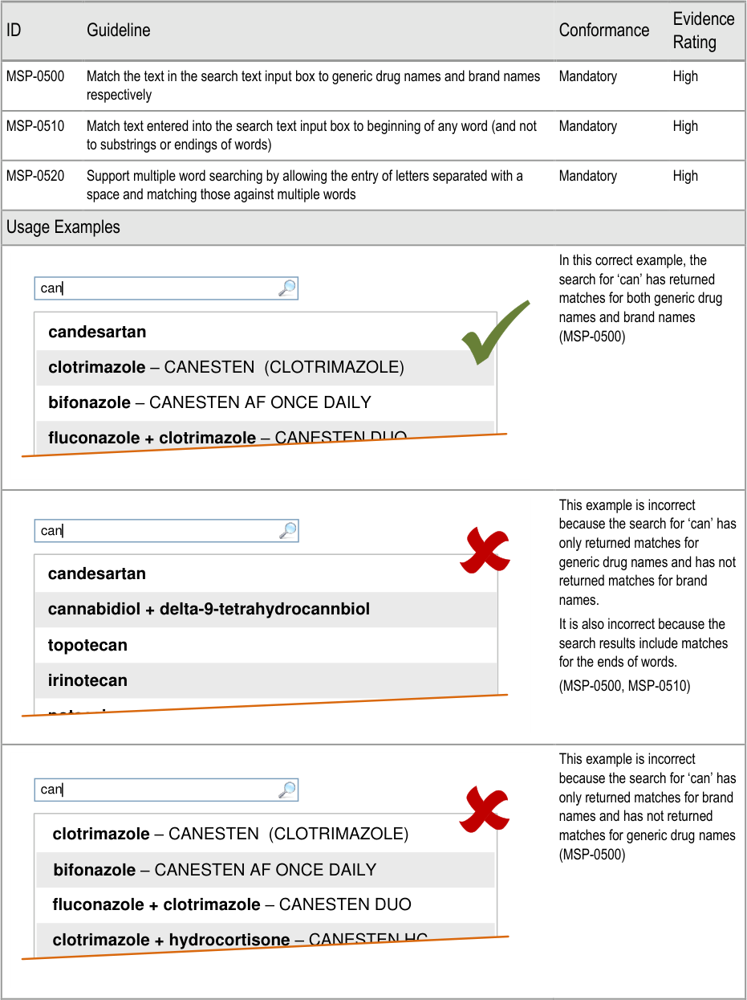

Page 55

Copyright ©2013 Health and Social Care Information Centre

HSCIC Controlled Document

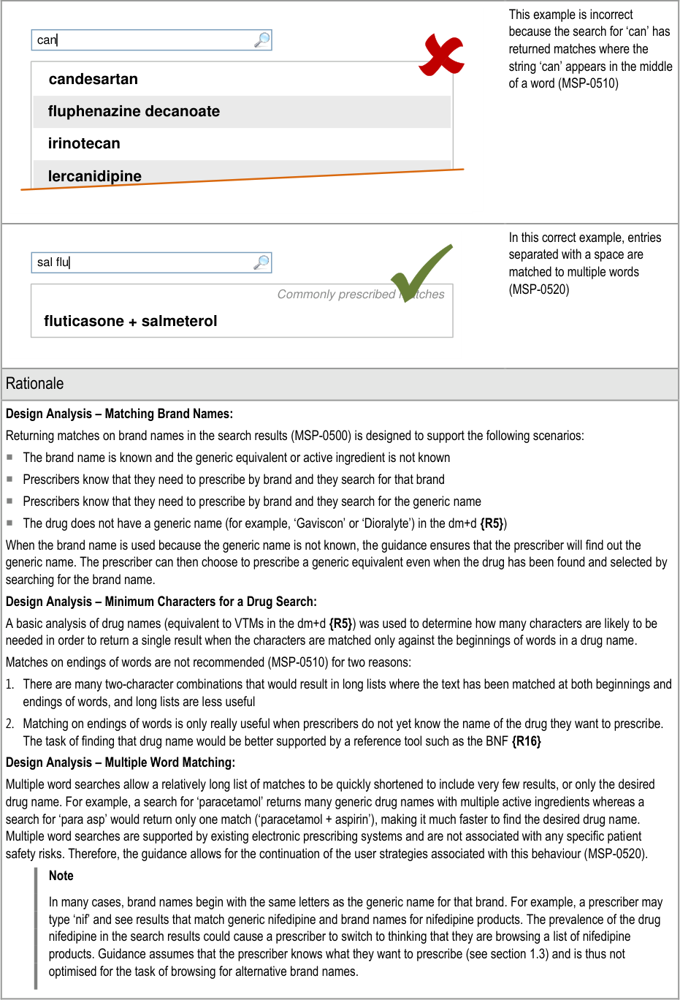

Page 56

Copyright ©2013 Health and Social Care Information Centre

HSCIC Controlled Document

**Desk Research:**

Guidance in this section is informed by the following Nielsen heuristics **{R17}** :

 Flexibility and Efficiency – Multiple word searches allow the user to type in only four characters (two sets of two characters

separated by a space) that are likely to result in a single match

 Aesthetic and minimalist design – The combination of matching letters to both generic names and to multiple words provides an

effective search mechanism that produces a simple list of matches

**User Research:**

Feedback from participants involved in Study ID 37 (see APPENDIX F) suggests that prescribers often know the brand name and not
the generic name. Participants confirmed that it would be useful to be able to find a generic drug name by searching for the brand
name.

**Hazard Risk Analysis Summary:**

From our Patient Safety Risk Assessment analyses, we identified a number of potential hazards, including the following key risks,
some of which are mitigated and some partially mitigated by the guidance:

**Potential Hazards:**

 A list of search results happens

to include more than one brand
name for the same generic drug.
The prescriber expects to see all
the brands for that generic drug.

 A list item is mis-selected

because a drug name appears
more than once in a list

 A drug name is mis-selected

because it appears next to or in
the same list as a look-alike or
sound-alike drug name

**Mitigations:**

 **This risk is not mitigated by the guidance**

 Since guidance assumes that prescribers know the name of the generic drug or brand

name that they are looking for (see section 1.3), prescribers are not expected to be
browsing the list to choose a brand name

 Search results lists contain only drug names (generic and brand) (MSP-0500)

 Results are ordered such that a brand drug is less likely to appear next to an equivalent

generic drug (see section 5.3.8)

 Cascading lists are not displayed until a drug name has been selected (see

section 6.3.1)

 Progressive matching encourages the typing of more letters for shorter lists of search

results (see section 5.3.3)

 Search results lists are limited in height (see section 5.3.5)

 Drugs are displayed by searching and search results are matched to the beginnings of

words so search results share the same initial letters (MSP-0510)

 Search results are ordered such that generic names are listed before brand names (see

section 5.3.8)

 Search results are displayed in matched order and then alphabetically (see

section 5.3.8)

 Search results are prioritised (see section 5.3.12)

 Brand names are supplemented with generic names (when they exist) (see

section 5.3.17)

 Brand names are displayed after the generic name (when they exist) in a single list item

(see section 5.3.17)

 If _Medications Management – Medication Line_ **{R3}** guidance is followed, brand names

are differentiated by displaying them in capital letters

Page 57

Copyright ©2013 Health and Social Care Information Centre

HSCIC Controlled Document

##### **5.3.8 Ordering Search Results**

**Important**

This section contains guidance for which there may be alternative solutions. Accordingly, the conformance
ratings in this section apply only where the guidance is adopted.

The Rationale section contains a summary of the known risks which are addressed in this section and
which must be addressed by any alternative solution. For more information, see the Alternative Design
Solutions note in section 1.

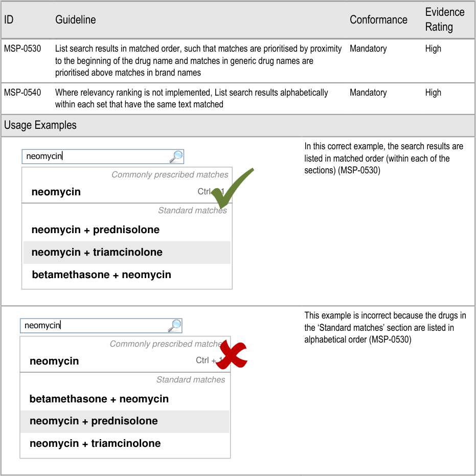

Page 58

Copyright ©2013 Health and Social Care Information Centre

HSCIC Controlled Document

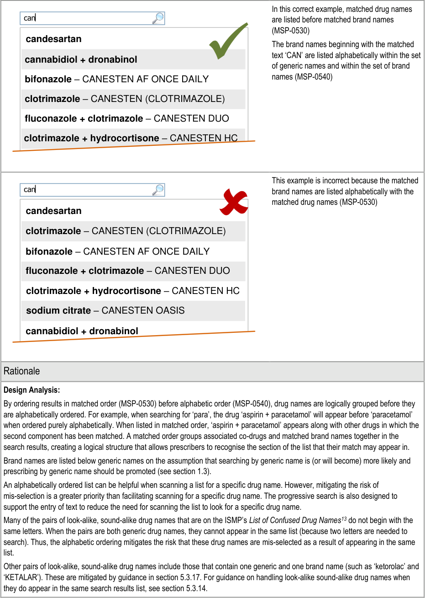

13 ISMP – List of Confused Drug Names **{R28}** [: http://www.ismp.org/tools/confuseddrugnames.pdf](http://www.ismp.org/tools/confuseddrugnames.pdf)

Page 59

Copyright ©2013 Health and Social Care Information Centre

HSCIC Controlled Document

**Desk Research:**

The _ePrescribing Functional Specification_ **{R12}** includes a guideline (GEN.OS.40) that refers to the need to be able to search by
brand name and a guideline (GEN.DR.003) that refers to the need for a generic name to be included when a brand name is displayed.

Guidance in this section is informed by the following Nielsen heuristic **{R17}** :

 Match between system and the real world – The list order is designed to display the search results in an order that appears natural

and logical (based on the task of prescribing, the search criteria entered and the scope of the search results list)

**Hazard Risk Analysis Summary:**

From our Patient Safety Risk Assessment analyses, we identified a number of potential hazards, including the following key risks,
some of which are mitigated and some partially mitigated by the guidance:

**Potential Hazards:**

 A drug name is mis-selected

in the search results list

 A list item is mis-selected

because a drug name
appears more than once in a
list

 A drug name is mis-selected

because it appears next to or
in the same list as a lookalike or sound-alike drug
name

**Mitigations:**

 **This risk is not wholly mitigated by guidance**

 Search results are prioritised (see section 5.3.12) and listed in matched order before

alphabetical order to maximise logical grouping (MSP-0530)

 The list is limited in length (see section 5.3.5) and progressive matching is recommended

(see section 5.3.3) to encourage selection from shorter lists

 Search results lists contain only drug names (generic and brand) (see section 5.3.7)

 Results are ordered such that a brand drug is less likely to appear next to an equivalent

generic drug (MSP-0530, and see section 5.3.17)

 Cascading lists are not displayed until a drug name has been selected (see section 6.3.1)

 Progressive matching encourages the typing of more letters for shorter lists of search results

(see section 5.3.3)

 Search results lists are limited in height (see section 5.3.5)

 Drugs are displayed by searching and search results are matched to the beginnings of

words so search results share the same initial letters (see section 5.3.7)

 Search results are ordered such that generic names are listed before brand names

(MSP-0530)

 Search results are displayed in matched order and then alphabetically (MSP-0540)

 Search results are prioritised (see section 5.3.12)

 Brand names are supplemented with generic names (when they exist) (see section 5.3.17)

 Brand names are displayed after the generic name (when they exist) in a single list item

(see section 5.3.17)

 If _Medications Management – Medication Line_ **{R3}** guidance is followed, brand names are

differentiated by displaying them in capital letters

Page 60

Copyright ©2013 Health and Social Care Information Centre

HSCIC Controlled Document

##### **5.3.9 Using Groups to Limit Search Results**

|Col1|Evidence ID Guideline Conformance Rating|
|---|---|
||MSP-0550 For specific searches that return significantly more results (most of these will be three or four character searches), support the display of groups in the search results list  Recommended Medium|
||MSP-0560 When a group is displayed in a search results list, provide a control (such as a button) that, when selected, replaces the original text in the search text input box with the full title of the group and replaces the original search results with the results within the group.  Recommended Medium|
||Usage Examples|
|| In this correct example, a group has been created for matches containing ‘paraffin’ for a context in which paraffin is less commonly prescribed (MSP-0550) **paracetamol** **paracetamol + pseudoephedrine** par Show paraffin (17) **paracetamol + phenylephrine** _Commonly prescribed matches_ **aspirin + paracetamol** _Standard matches_ Ctrl + 2 Ctrl + 1 Ctrl + 4 Ctrl + 3 **parecoxib** **paroxetine** **paracetamol + sodium salicylate** **paracetamol + tramadol**|
|| This example of a search results used in a context in which paraffin is rarely or never prescribed is not recommended because the list contains many matches for paraffin.(MSP-0550) **paracetamol** **paracetamol + pseudoephedrine** par **paracetamol + sodium salicylate** **paracetamol + phenylephrine** _Commonly prescribed matches_ **aspirin + paracetamol** _Standard matches_ **paracetamol + tramadol** Ctrl + 2 Ctrl + 1 Ctrl + 4 Ctrl + 3 **paraffin hard** **soft paraffin + wool fat** **hard paraffin + liquid paraffin + soft paraffin + wood alchohols**|

Page 61

Copyright ©2013 Health and Social Care Information Centre

HSCIC Controlled Document

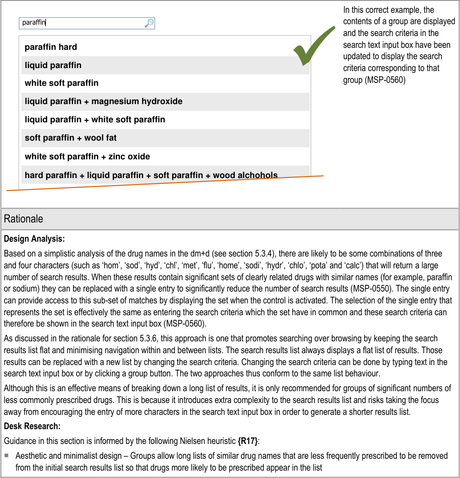

Page 62

Copyright ©2013 Health and Social Care Information Centre

HSCIC Controlled Document

##### **5.3.10 Supporting Spelling Matches and Synonyms**

See section 5.3.15 for guidance on formatting spelling matches and synonyms in the search results
lists.

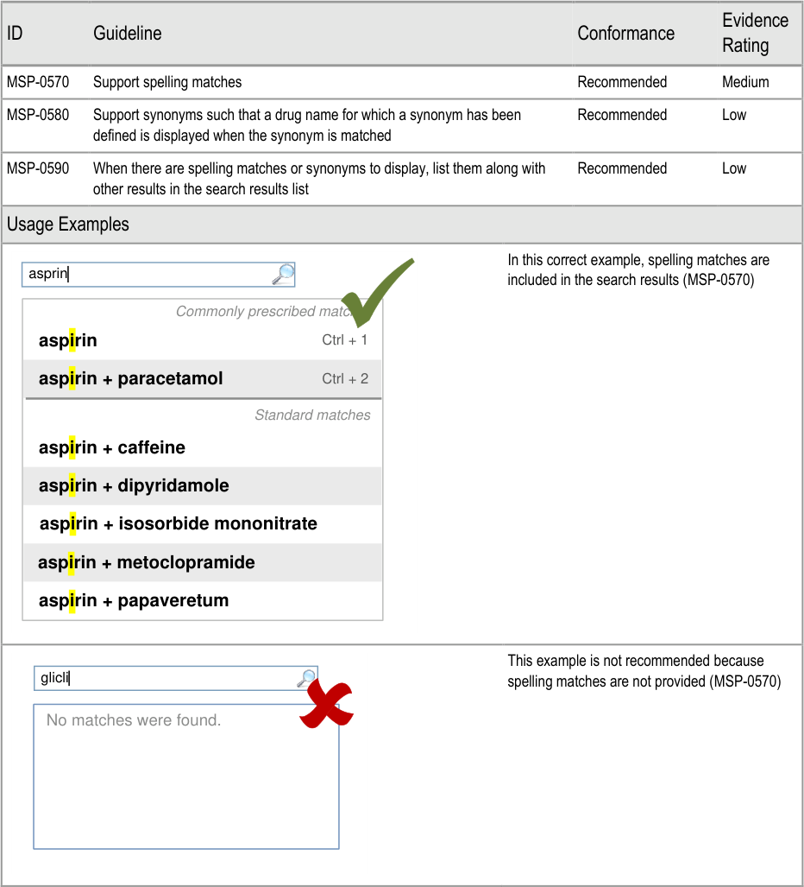

Page 63

Copyright ©2013 Health and Social Care Information Centre

HSCIC Controlled Document

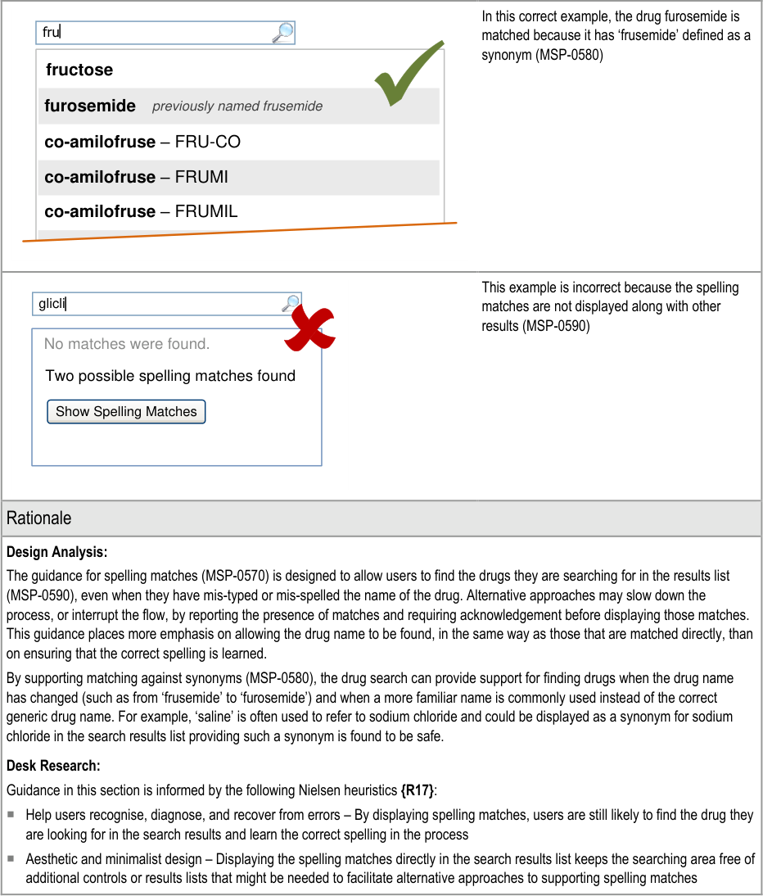

Page 64

Copyright ©2013 Health and Social Care Information Centre

HSCIC Controlled Document

##### **5.3.11 Co-Drugs and Their Ingredients**

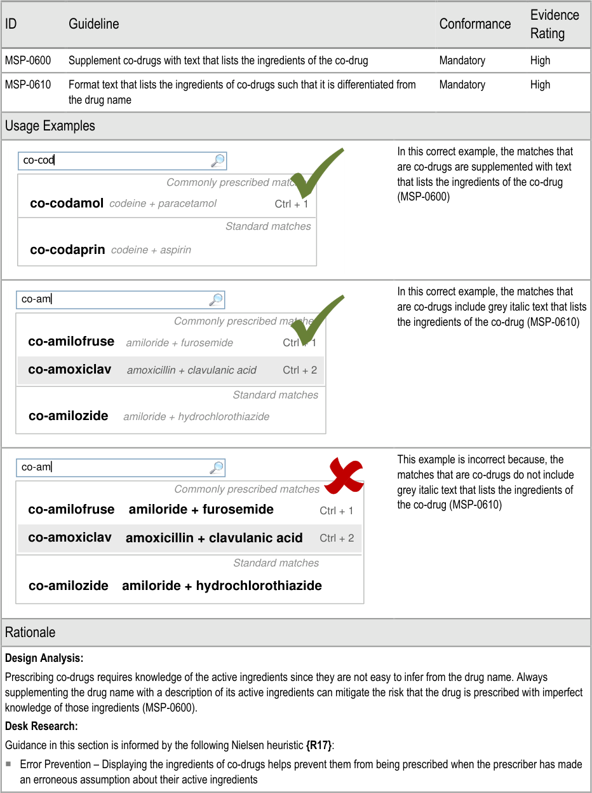

Page 65

Copyright ©2013 Health and Social Care Information Centre

HSCIC Controlled Document

**Hazard Risk Analysis Summary:**

From our Patient Safety Risk Assessment analyses, we identified a number of potential hazards, including the following key risk which
is mitigated by the guidance:

**Potential Hazards:**

 A prescriber is unfamiliar with a co-drug and makes an

incorrect assumption about its ingredients

##### **5.3.12 Prioritising Results**

**Mitigations:**

 Co-drugs are supplemented with text that describes their

active ingredients (MSP-0600)

Drug search results, cascading lists (see section 6) and other selection lists can be divided into
sections in order to bring prioritised list items to the top of a list. See section 6.3.3 for guidance on
prioritisation within cascading lists and section 9.3.3 for guidance on prioritisation within selection
lists used as input controls.

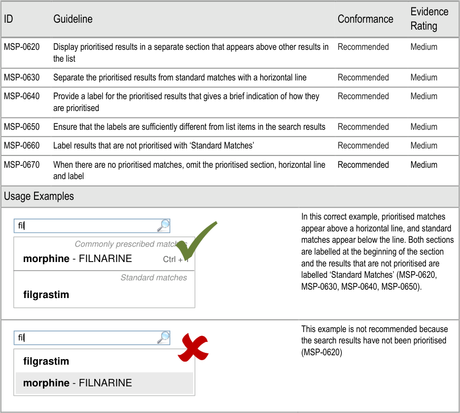

Page 66

Copyright ©2013 Health and Social Care Information Centre

HSCIC Controlled Document

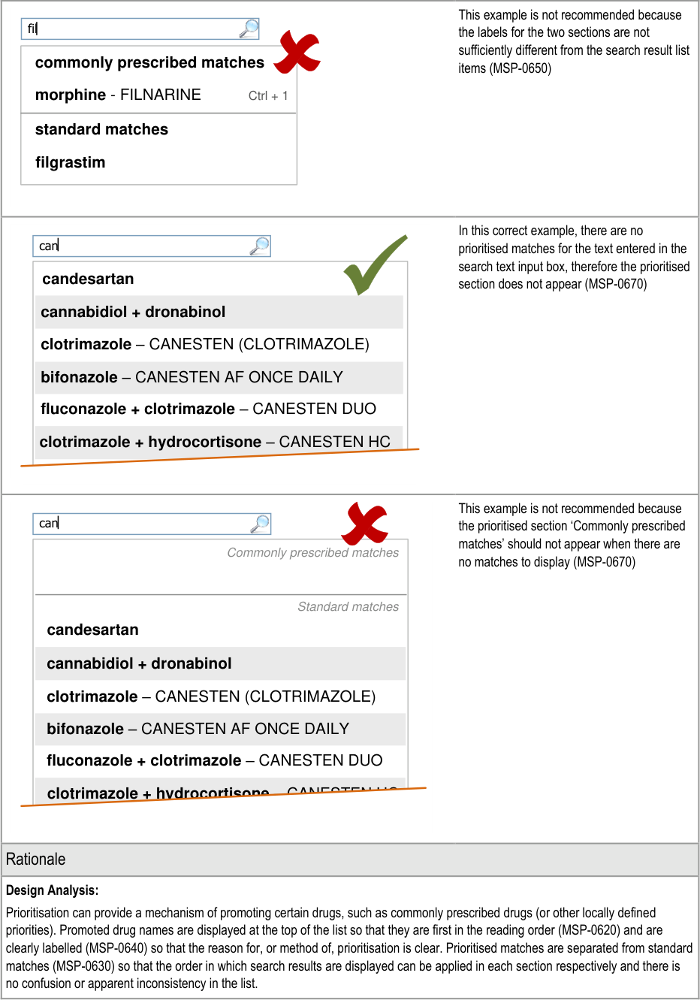

Page 67

Copyright ©2013 Health and Social Care Information Centre

HSCIC Controlled Document

There are alternative approaches to prioritising drugs that may have different merits depending on the context in which they are used.
The matches that appear in the prioritised section could be those that are prescribed most frequently by an individual or by a specific
location or trust or by manually maintaining a list. In some cases, it may be appropriate to use the prioritised section to promote the
use of medications that are on formulary and demote those that are off-formulary. Further analysis would have to be completed before
guidance could recommend the use of a particular approach to prioritisation.

The prioritised section is only needed when there are prioritised matches to be displayed (MSP-0670). Similarly, the label for the
standard matches section is only needed to differentiate it from the prioritised section and is thus not needed when there are no
prioritised matches (MSP-0660).

The guidance is designed to promote clear differentiation between the labels and the drug names in the search list so that the list can
be scanned without additional information (for example, no labels or warnings interrupting the scanning of the list (MSP-0650)).

**Desk Research:**

Guidance in this section is informed by the following Nielsen heuristics **{R17}** :

 Flexibility and efficiency of use – Accelerators are provided for prioritised medications so that they remain at the top of the list and

are easier to find and select

 Aesthetic and minimalist design – Ensuring that the search results are most prominent (reducing both the presence of, and

emphasis on, other elements of the search results lists) minimises distractions from scanning the drug names and maximises the
emphasis on the drug names

**Hazard Risk Analysis Summary:**

From our Patient Safety Risk Assessment analyses, we identified a number of potential hazards, including the following key risks,
some of which are mitigated and some partially mitigated by the guidance:

**Potential Hazards:**

 A drug name is mis-selected in

the search results list

 A drug name is mis-selected

because it appears next to or in
the same list as a look-alike or
sound-alike drug name

**Mitigations:**

 **This risk is not wholly mitigated by guidance**

 The list is limited in length (see section 5.3.5) and progressive matching is

recommended (see section 5.3.3) to encourage selection from shorter lists

 Search results are prioritised (MSP-0620) and listed in matched order before

alphabetical order to maximise logical grouping (see section 5.3.8)

 Progressive matching encourages the typing of more letters for shorter lists of search

results (MSP-0370)

 Search results lists are limited in height (see section 5.3.5)

 Drugs are displayed by searching and search results are matched to the beginnings of

words so search results share the same initial letters (see section 5.3.7)

 Search results are ordered such that generic names are listed before brand names (see

section 5.3.8)

 Search results are displayed in matched order and then alphabetically (see

section 5.3.8)

 Search results are prioritised (MSP-0620)

 Brand names are supplemented with generic names (when they exist) (see

section 5.3.17)

 Brand names are displayed after the generic name (when they exist) in a single list item

(see section 5.3.17)

 If _Medications Management – Medication Line_ **{R3}** guidance is followed, brand names

are differentiated by displaying them in capital letters

Page 68

Copyright ©2013 Health and Social Care Information Centre

HSCIC Controlled Document

##### **5.3.13 Shortcut Keys in Search Results**

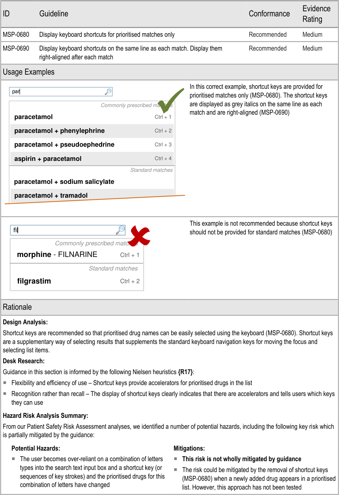

Page 69

Copyright ©2013 Health and Social Care Information Centre

HSCIC Controlled Document

##### **5.3.14 Formatting Commonly Mis-Selected Matches**

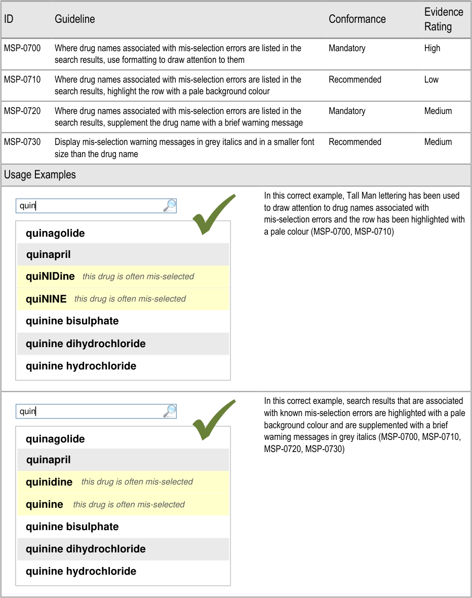

Page 70

Copyright ©2013 Health and Social Care Information Centre

HSCIC Controlled Document

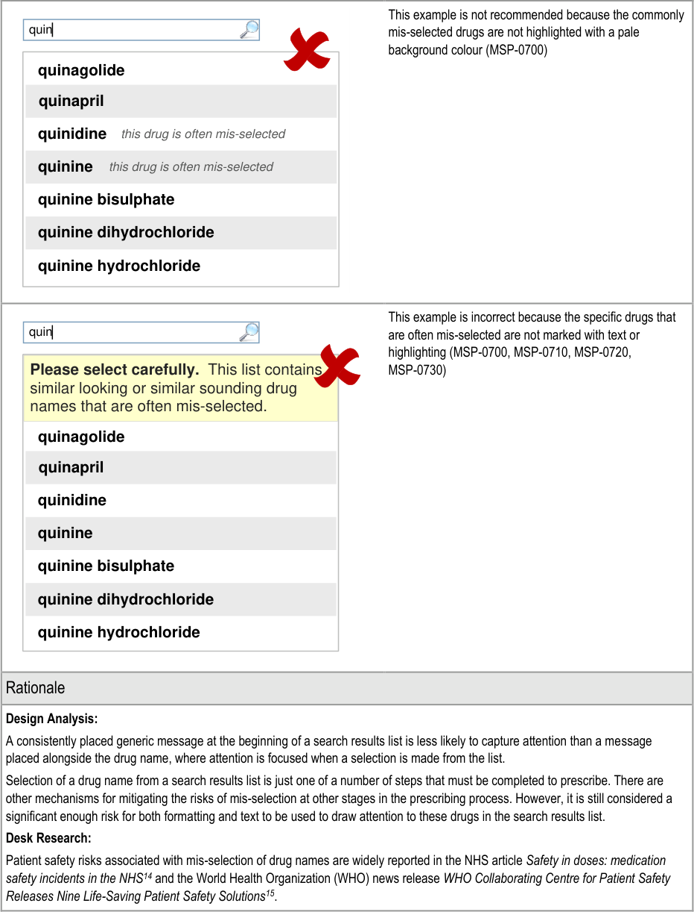

14 NHS NPSA – The fourth report from the Patient Safety Observatory – PSO/4 – Safety in doses: medication safety
incidents in the NHS **{R6}** [: http://www.nrls.npsa.nhs.uk/favicon.ico](http://www.nrls.npsa.nhs.uk/favicon.ico)

15The Joint Commission International – WHO Collaborating Centre for Patient Safety Releases Nine Life-Saving Patient
Safety Solutions **{R29}** [: http://www.ccforpatientsafety.org/patient-safety-solutions/](http://www.ccforpatientsafety.org/patient-safety-solutions/)

Page 71

Copyright ©2013 Health and Social Care Information Centre

HSCIC Controlled Document

The US Food and Drug Administration (FDA) Office of Generic Drugs _Name Differentiation Project_ _[16]_ requested manufacturers of 16
look-alike drug names to use a system known as ‘Tall Man’ lettering to mitigate the risk that they are mistaken for similar looking drug
names. However, as reported in _The Use of Tall Man Lettering to Minimise Selection Errors of Medicine Names in Computer_
_Prescribing and Dispensing Systems_ **{R24}**, findings from studies of Tall Man lettering are not conclusive and Tall Man lettering has
been statistically proven to be useful in only very specific circumstances. The only experiment within this study that tested the selection
of drug names within a selection list also included dose and formulation as part of that selection list and noted that error was more
related to dose and formulation or a combination of these than with look-alike medication names. The most effective of the three Tall
Man lettering variants used in the study was also found to significantly affect the time for the action of selecting a medication.

Tall Man lettering has been found to be useful when:

 Distinguishing names in same-different judgement tasks when participants understood the purpose of Tall Man lettering

 Improving recognition memory by increasing attention (and slowing down reading speed)

 Improving selection from an array when lettering is simulated as packaging

In short, there is no conclusive evidence that Tall Man lettering is effective at mitigating selection errors in lists of drug names when
presented as part of a prescribing process that builds the prescription step by step. Therefore, this guidance recommends the use of
other mechanisms for drawing attention to the potential for mis selection. Unlike Tall Man lettering, these mechanisms are specific to
the selection of a drug name from a list of drug names and are not expected to be implemented throughout a prescribing system to
appear whenever the drug name is displayed.

The _ePrescribing Functional Specification_ **{R12}** includes a requirement (GEN.OS.94) to specifically address the risk of mis-selection
when drugs that are known to be mis-selected are displayed in selection lists.

Guidance in this section is informed by the following Nielsen heuristic **{R17}** :

 Error prevention – Formatting of commonly mis-selected matches helps to prevent the mis-selection of an unintended drug in the

list

**Hazard Risk Analysis Summary:**

From our Patient Safety Risk Assessment analyses, we identified a number of potential hazards, including the following key risk which
is mitigated by the guidance:

**Potential Hazards:**

 A look-alike or sound-alike drug is

selected in error

**Mitigations:**

 Formatting (MSP-0700) and supplementary text warnings (MSP-0720) are used to

mark look-alike sound-alike drugs at the point of selection

##### **5.3.15 Formatting Spelling Matches and Synonyms**

This section includes guidance for formatting spelling matches and synonyms when they appear in
a search results list. See section 5.3.10 for guidance on supporting spelling matching and
synonyms.

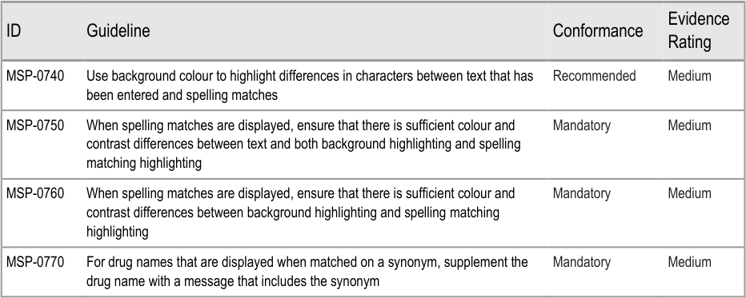

16 US Federal Drug Administration (FDA) Center for Drug Evaluation and Research (CDER) – Name Differentiation Project
**{R30}** [: http://www.fda.gov/Drugs/DrugSafety/MedicationErrors/ucm164587.htm](http://www.fda.gov/Drugs/DrugSafety/MedicationErrors/ucm164587.htm)

Page 72

Copyright ©2013 Health and Social Care Information Centre

HSCIC Controlled Document

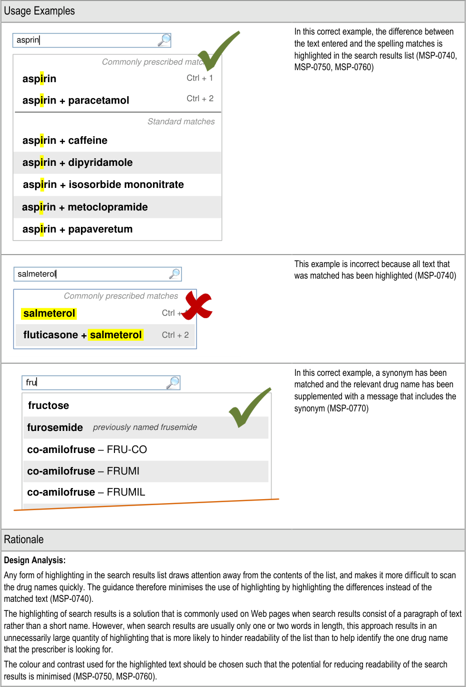

Page 73

Copyright ©2013 Health and Social Care Information Centre

HSCIC Controlled Document

When a search is tightly scoped:

 The matched text is easier to see and predict

 The expectation is that one result will be exactly what is being searched for

 Highlighting all matches is not likely to help draw attention to the drug name that is being searched for

In this guidance, only the results that are exceptions to the rules are highlighted. By restricting highlighting to the differences between
the text entered in the search text input box and the spelling matches in the list, the highlights draw attention to exceptional matches,
as well as communicating the specific difference in spelling.

**Desk Research:**

Guidance in this section is informed by the following Nielsen heuristic **{R17}** :

 Help users recognise, diagnose and recover from errors – The formatting draws attention to the specific differences between the

text entered and the ‘spelling matches’ thus allowing users to recognise that they (potentially) mis-spelled the drug name and to
identify the correct spelling

##### **5.3.16 Formatting Search Results Lists**

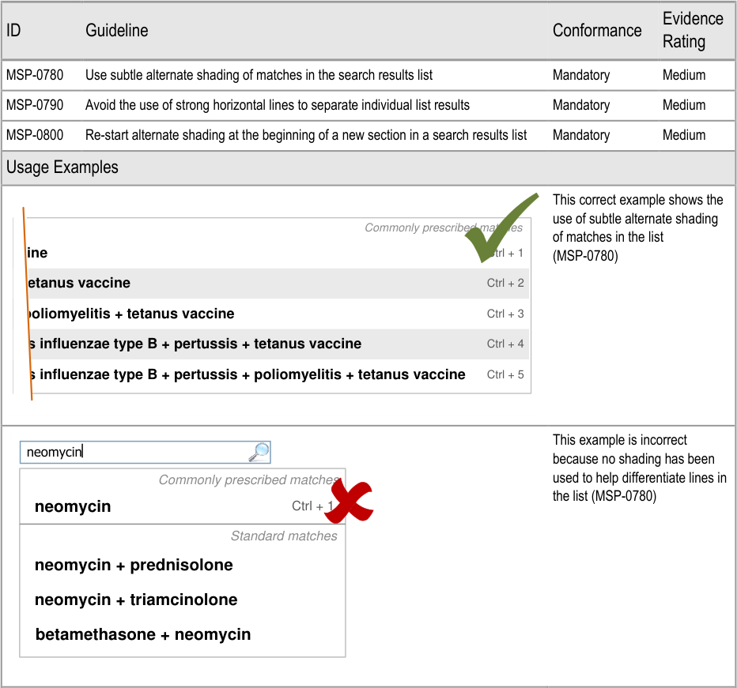

Page 74

Copyright ©2013 Health and Social Care Information Centre

HSCIC Controlled Document

Page 75

Copyright ©2013 Health and Social Care Information Centre

HSCIC Controlled Document

**Hazard Risk Analysis Summary:**

From our Patient Safety Risk Assessment analyses, we identified a number of potential hazards, including the following key risk which
is partially mitigated by the guidance:

**Potential Hazards:**

 Alternate row shading is mistaken

for selection or highlighting when
there are only two or three list items
in a list or section

**Mitigations:**

 **This risk is not wholly mitigated by guidance**

 Alternate row shading should be subtle (MSP-0780)

 When results are displayed using progressive matching (see section 5.3.3), the initial

list of results is more likely to contain greater than three drugs in any one section of
the list. The user is thus familiar with the presence and meaning of the alternate row
shading before the list is shortened such that this risk is introduced

##### **5.3.17 Generic Drug Names and Brand Names**

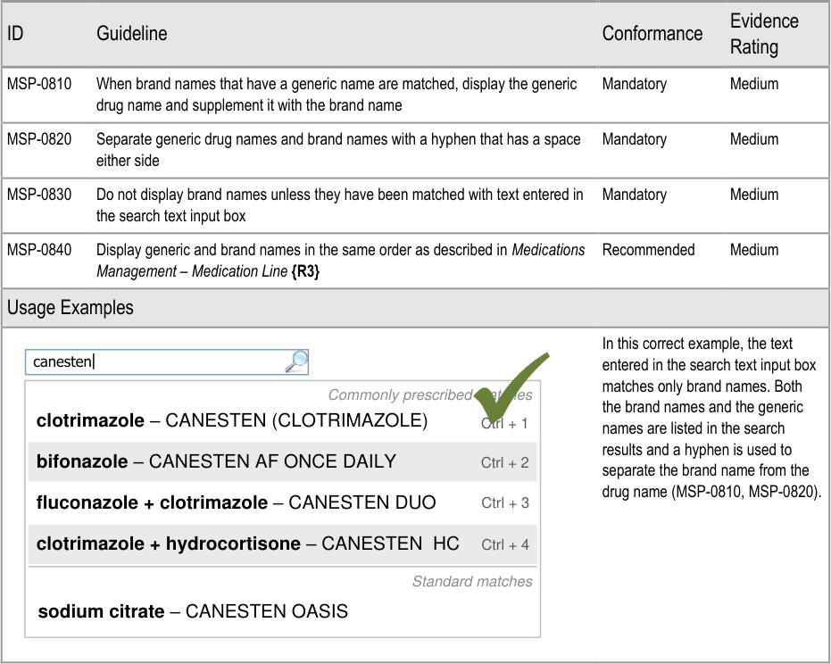

Page 76

Copyright ©2013 Health and Social Care Information Centre

HSCIC Controlled Document

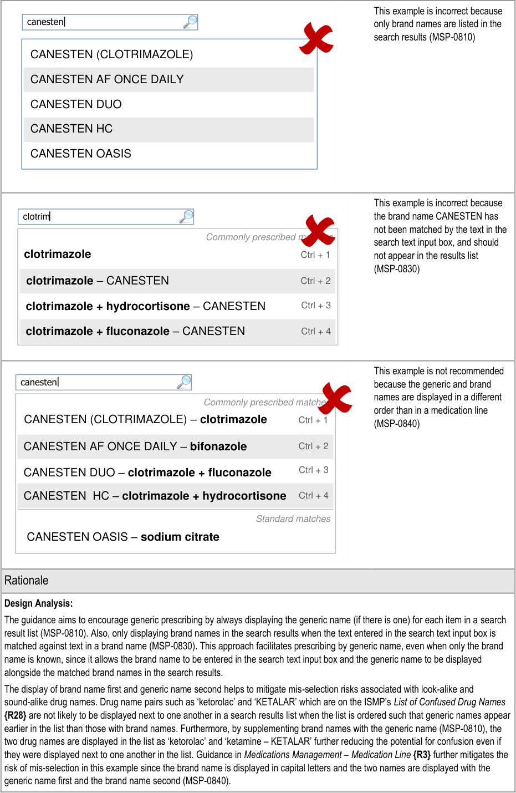

Page 77

Copyright ©2013 Health and Social Care Information Centre

HSCIC Controlled Document

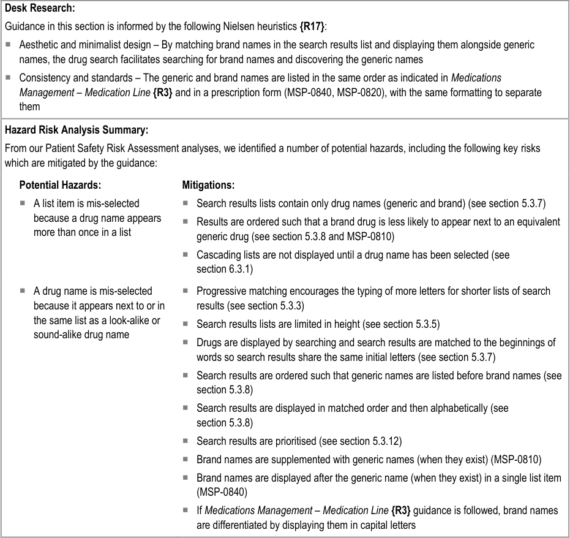

Page 78

Copyright ©2013 Health and Social Care Information Centre

HSCIC Controlled Document

### 6 GUIDANCE DETAILS FOR CASCADING LISTS

#### **6.1 Introduction**

After a drug has been selected, either from the Quick List or a list of search results, a number of
other attributes are needed to determine the type of medication that is being prescribed. This
section provides guidance for cascading lists as a means of facilitating the definition of those
attributes.

Figure 11 shows the full user interface prescribing process in which the steps covered in this

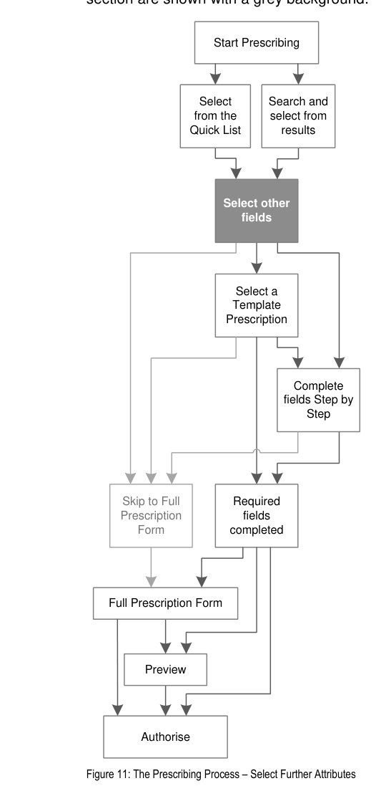

Page 79

Copyright ©2013 Health and Social Care Information Centre

HSCIC Controlled Document

Figure 12 is an extract from Figure 5 to illustrate the user interface prescribing steps covered in this
section showing the cascading list step and links to and from other steps:

Cascading Lists

|drug|route|option 1 option 2 option 3|
|---|---|---|
|drug|route|other...|

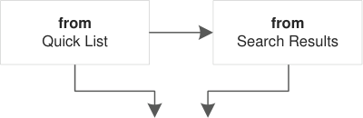

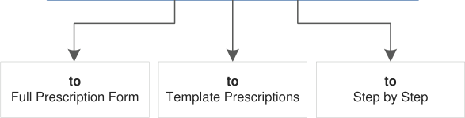

Figure 12: User Interface Prescribing Steps – Cascading Lists

#### **6.2 Principles**

All guidance is informed by all of the principles for search and prescribe listed in section 2.1. The
following are particularly relevant to this section:

 Mitigate the risks of mis-selection and misinterpretation:

 Lists can be kept open so that feedback for selections is maximised

 The contents of lists are limited by the previous selection, so a mis-selection is more
likely to be noticed because of the contents of the following list

 Encourage simplicity of design by promoting user interface approaches that help to avoid

overly complex displays and interactions that require many controls:

 Cascading lists allow the majority of a prescription to be defined using a series of

identical user input controls

 Ensure that the prescribing process can be supported in multiple layouts and is flexible

enough to be presented in different screen dimensions:

 Cascading lists can be displayed opened or closed depending on the available space

and can wrap onto a new line if necessary

 Adhere to a user interface strategy that gives the impression of making progress within a

single space (which has all the necessary information immediately or readily available) and
avoids the impression of needing to move between many different spaces:

 Cascading lists are presented within the same space, with each list supplementing the

last

Page 80

Copyright ©2013 Health and Social Care Information Centre

HSCIC Controlled Document

#### **6.3 Guidelines**

##### **6.3.1 Providing Cascading Lists**

**Important**

This section contains guidance for which there may be alternative solutions. Accordingly, the conformance
ratings in this section apply only where the guidance is adopted.

The Rationale section contains a summary of the known risks which are addressed in this section and
which must be addressed by any alternative solution. For more information, see the Alternative Design
Solutions note in section 1.

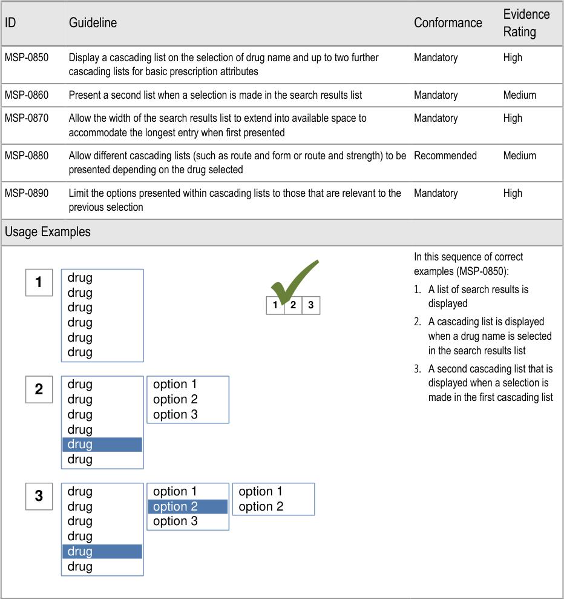

Page 81

Copyright ©2013 Health and Social Care Information Centre

HSCIC Controlled Document

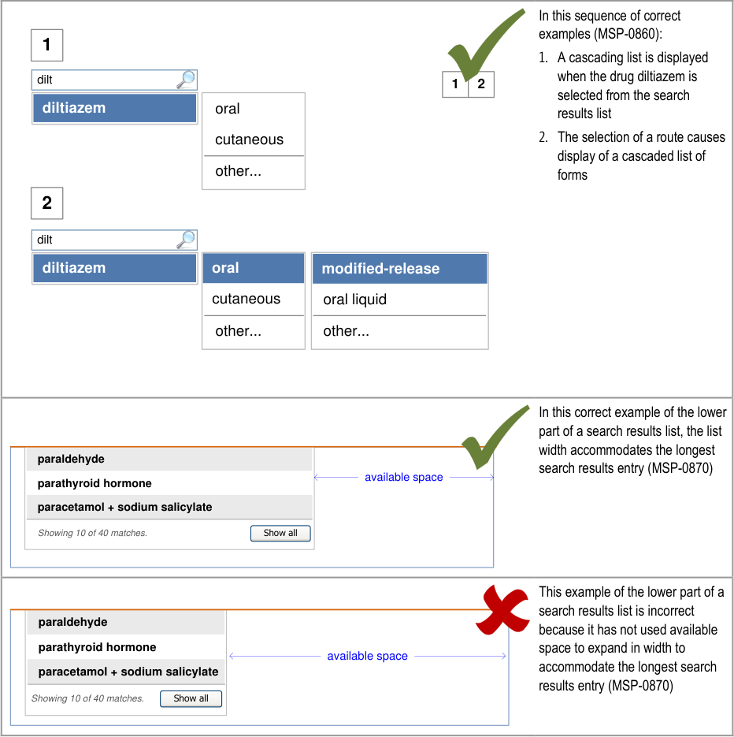

Page 82

|dilt|Col2|
|---|---|
|**diltiazem**|cutaneous oral|
|**diltiazem**|other...|

|dilt|Col2|
|---|---|
|**diltiazem**|**oral** cutaneous|
|**diltiazem**|other...|

|paraldehyde oavailable spaceo parathyroid hormone paracetamol + sodium salicylate Showing 10 of 40 matches. Show all|paraldehyde parathyroid hormone paracetamol + sodium salicylate|oavailable spaceo|
|---|---|---|
|**paracetamol + sodium salicylate** **paraldehyde** **parathyroid hormone** Show all _Showing 10 of 40 matches._ ~~oavailable spaceo~~|Show all _Showing 10 of 40 matches._|Show all _Showing 10 of 40 matches._|

|Col1|Col2|Col3|
|---|---|---|
|**paracetamol + sodium salicylate** **paraldehyde** **parathyroid hormone** Show all _Showing 10 of 40 matches._ ~~oavailable spaceo~~|**paracetamol + sodium salicylate** **paraldehyde** **parathyroid hormone**|~~oavailable spaceo~~|
|**paracetamol + sodium salicylate** **paraldehyde** **parathyroid hormone** Show all _Showing 10 of 40 matches._ ~~oavailable spaceo~~|Show all _Showing 10 of 40 matches._|Show all _Showing 10 of 40 matches._|

Copyright ©2013 Health and Social Care Information Centre

HSCIC Controlled Document

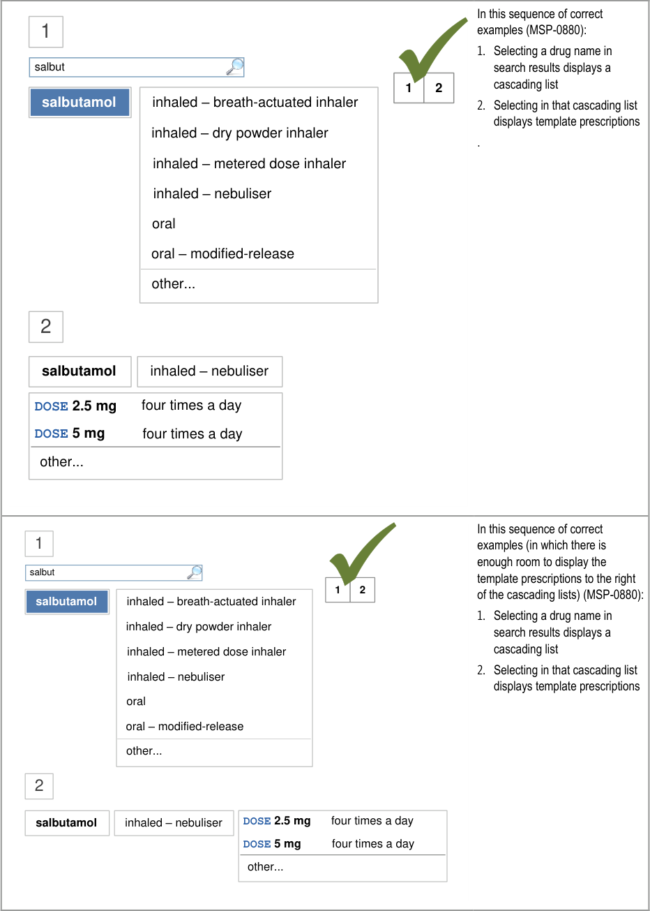

Page 83

Copyright ©2013 Health and Social Care Information Centre

HSCIC Controlled Document

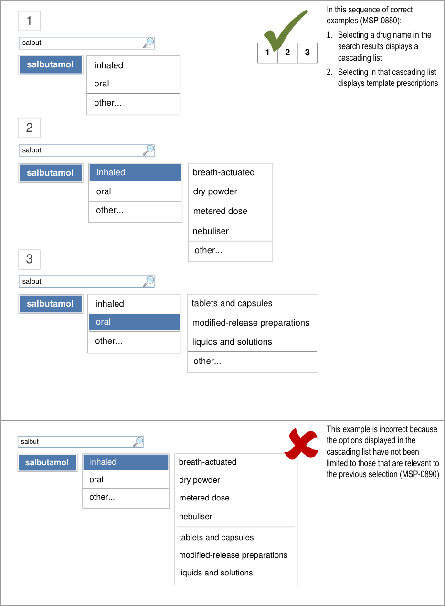

Page 84

Copyright ©2013 Health and Social Care Information Centre

HSCIC Controlled Document

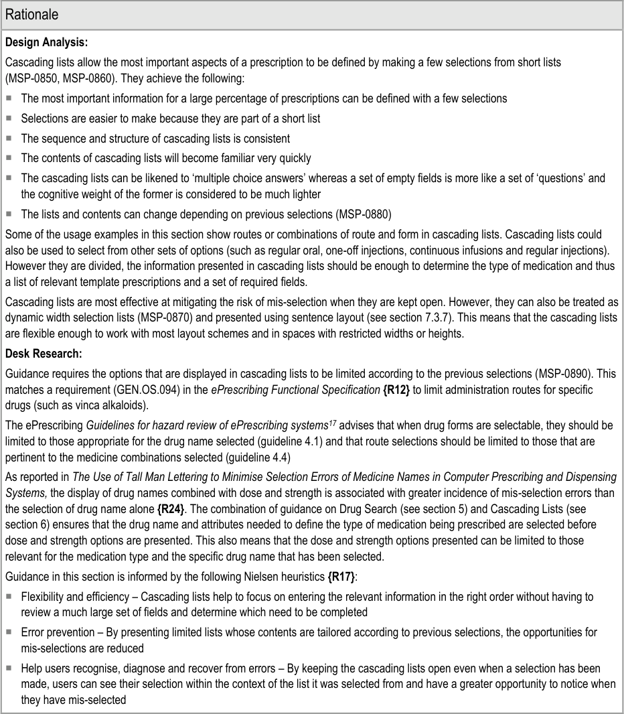

17 NHS ePrescribing: Guidelines for hazard review of ePrescribing systems **{R31}** :
[http://www.connectingforhealth.nhs.uk/systemsandservices/eprescribing/hazard_framework.pdf](http://www.connectingforhealth.nhs.uk/systemsandservices/eprescribing/hazard_framework.pdf)

Page 85

Copyright ©2013 Health and Social Care Information Centre

HSCIC Controlled Document

**Hazard Risk Analysis Summary:**

From our Patient Safety Risk Assessment analyses, we identified a number of potential hazards, including the following key risks,
some of which are mitigated and some partially mitigated by the guidance:

**Potential Hazards:**

 The name of the drug being

prescribed is not noticed at the
top of the form and is not the
intended drug

 Selections in the search results

list and cascading lists are misinterpreted because they are
not (or may not be) horizontally
aligned

 A list item is mis-selected

because a drug name appears
more than once in a list

**Mitigations:**

 The options presented after a drug is selected are filtered to be relevant to that drug

(MSP-0850)

 The drug name remains at the top of the form when switching to a detailed prescription

and is visible throughout, even when the prescription is long enough to need a scroll bar
(see section 8.3.3)

 **This risk is not wholly mitigated by guidance**

 The cascading list that is displayed on selection contains only options that are relevant to

the selection and thus may not contain the expected options (MSP-0880, MSP-0890) in
the event of a mis-selection

 Cascading lists are presented one at a time after a selection has been made in the

previous list (MSP-0860)

 When space is limited such that cascading lists obscure other information, the list

collapses (see section 6.3.2)

 Search results lists contain only drug names (generic and brand) (see section 5.3.7)

 Results are ordered such that a brand drug is less likely to appear next to an equivalent

generic drug (see section 5.3.8)

 Cascading lists are not displayed until a drug name has been selected (MSP-0850)

##### **6.3.2 Displaying Cascading Lists**

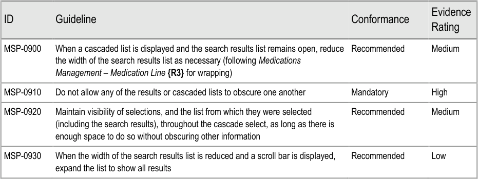

Page 86

Copyright ©2013 Health and Social Care Information Centre

HSCIC Controlled Document

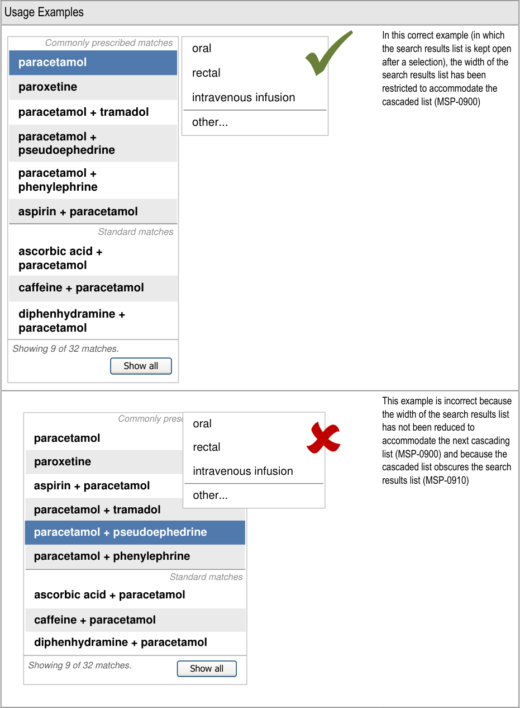

|Commonly prescribed matches paracetamol paroxetine paracetamol + tramadol paracetamol + pseudoephedrine paracetamol + phenylephrine aspirin + paracetamol Standard matches ascorbic acid + paracetamol caffeine + paracetamol diphenhydramine + paracetamol|oral rectal intravenous infusion|
|---|---|
|**paracetamol** **paracetamol +** **phenylephrine** **paracetamol +** **pseudoephedrine** **paracetamol + tramadol** _Commonly prescribed matches_ _Standard matches_ **ascorbic acid +** **paracetamol** **diphenhydramine +** **paracetamol** **paroxetine** **aspirin + paracetamol** **caffeine + paracetamol**|other...|
|_Showing 9 of 32 matches._ Show all|_Showing 9 of 32 matches._ Show all|

Page 87

|Commonly prescribed matches oral paracetamol rectal paroxetine intravenou aspirin + paracetamol other... paracetamol + tramadol paracetamol + pseudoephedrine paracetamol + phenylephrine|cribed matches oral rectal intravenou other...|s infusion|
|---|---|---|
|_Commonly prescribed matches_ **paracetamol** **paracetamol + pseudoephedrine** **paracetamol + phenylephrine** **paracetamol + tramadol** **aspirin + paracetamol** rectal oral intravenou other... **paroxetine**|_ cribed matches_ rectal oral intravenou other...||
|_Standard matches_ **ascorbic acid + paracetamol** **diphenhydramine + paracetamol** **caffeine + paracetamol**|_Standard matches_ **ascorbic acid + paracetamol** **diphenhydramine + paracetamol** **caffeine + paracetamol**|_Standard matches_ **ascorbic acid + paracetamol** **diphenhydramine + paracetamol** **caffeine + paracetamol**|
|_Showing 9 of 32 matches._ Show all|_Showing 9 of 32 matches._ Show all|_Showing 9 of 32 matches._ Show all|

Copyright ©2013 Health and Social Care Information Centre

HSCIC Controlled Document

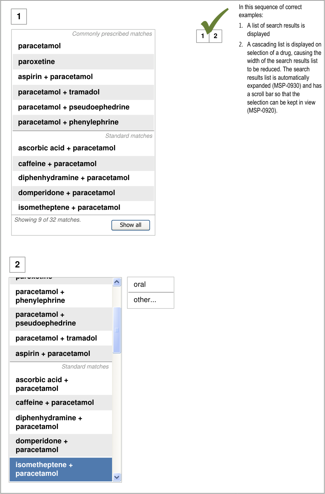

Page 88

Copyright ©2013 Health and Social Care Information Centre

HSCIC Controlled Document

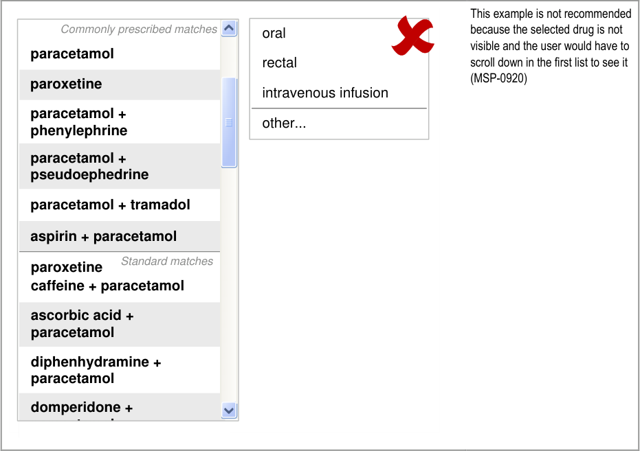

Page 89

Copyright ©2013 Health and Social Care Information Centre

HSCIC Controlled Document

Page 90

Copyright ©2013 Health and Social Care Information Centre

HSCIC Controlled Document

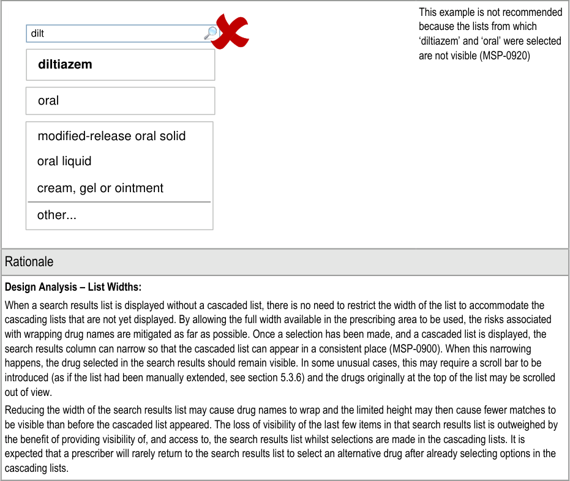

Page 91

Copyright ©2013 Health and Social Care Information Centre

HSCIC Controlled Document

This approach to managing the width of the search results lists avoids the following potential risks:

 Truncation of drug names (see _Medications Management – Medication Line_ **{R3}** ) or items in cascading lists

 The unnecessary partial display (partially off-screen) of a cascading list as a result of limited screen space, when a reduced width

search results list would bring the cascading list back into view

When a cascading list is presented with options that are not expected (because of a mis-selection) the intended selection is still
visible, thus allowing the mistakes to be confirmed

**Design Analysis – Maintaining Visibility of Selections:**

Keeping the selection lists open as prescribers make their selections allows them to continue seeing their selections in context
(MSP-0910, MSP-0920). Visibility of both the list and their selection may improve the speed at which prescribers notice when they
have mis-selected. The list that is presented after a selection has been made is also providing visual feedback. When this list does not
present the options expected, it is even more likely to help the prescriber spot a mis-selection.

Keeping the cascading lists open so that selections are displayed within the list from which they were selected achieves the following:

 Provides positive feedback for the selection

 Improves feedback for mis-selections since the intended selection is still visible (but not selected or highlighted)

 When a cascading list is presented with options that are not expected (because of a mis-selection) the intended selection is still

visible, thus allowing the mistakes to be confirmed and corrected quickly

 Cascading lists also enhance a sense of place and provide feedback for progress through the simple two to three-step selections

The cascade select approach is designed to keep the right balance between:

 A system that allows medications to be prescribed with an absolute minimum of interaction

 A system that mitigates the risks of being able to complete a prescription without paying enough attention to the details

Cascading lists guide selections in such a way that reduces the potential for mistakes and inappropriate selections.

**Desk Research:**

Guidance in this section is informed by the following Nielsen heuristic **{R17}** :

 Help users recognise, diagnose and recover from errors – By retaining the cascading lists open even when a selection has been

made, and ensuring that they are not obscured, users can see their selection within the context of the list it was selected from and
have a greater opportunity to notice when they have mis-selected

**Hazard Risk Analysis Summary:**

From our Patient Safety Risk Assessment analyses, we identified a number of potential hazards, including the following key risks,
some of which are mitigated and some partially mitigated by the guidance:

**Potential Hazards:**

 A prescriber mis-selects a prescription

element because lists contain too many
similar options

 A selection list in the prescribing area

may obscure important information in a
list of current medications

 Selections in the search results list and

cascading lists are mis-interpreted
because they are not (or may not be)
horizontally aligned

**Mitigations:**

 MSP-0920 requires that selections in cascading lists remain visible until the last

cascading list (until template prescriptions are presented or fields are presented
step by step)

 Pressing the ESC key or clicking outside of a list are mechanisms that can be

used to close a list without making a selection (see section 9.3.1)

 Selection lists can collapse once a selection has been made if necessary to

preserve visibility of other information (MSP-0920)

 **This risk is not wholly mitigated by guidance**

 The cascading list that is displayed on selection contains only options that are

relevant to the selection and thus may not contain the expected options (see
section 6.3.1) in the event of a mis-selection

 Cascading lists are presented one at a time after a selection has been made in

the previous list (see section 6.3.1)

 When space is limited such that cascading lists obscure other information, the list

collapses (MSP-0920)

Page 92

Copyright ©2013 Health and Social Care Information Centre

HSCIC Controlled Document

##### **6.3.3 Contents of Cascading Lists**

Drug search results, cascading lists and other selection lists can be divided into sections in order to
bring prioritised list items to the top of a list. See section 5.3.12 for guidance on prioritisation within
a search results list and section 9.3.3 for guidance on prioritisation within selection lists used as
input controls.

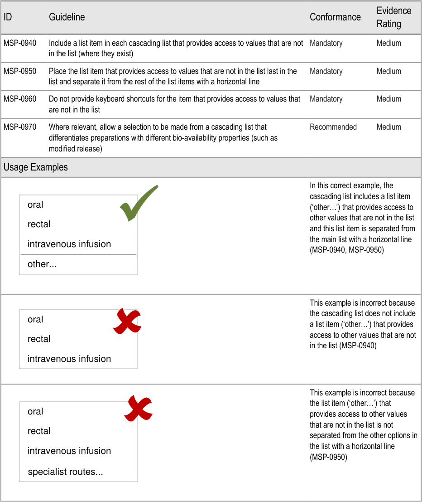

Page 93

Copyright ©2013 Health and Social Care Information Centre

HSCIC Controlled Document

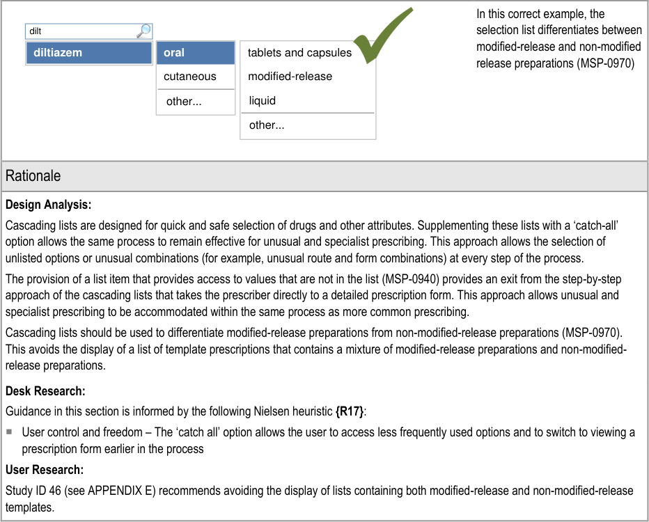

|dilt|Col2|
|---|---|
|**diltiazem**|**oral** cutaneous|
|**diltiazem**|other...|

##### **6.3.4 Providing Cascading Lists for Brands**

When a prescriber selects a brand name from a search results list, there are three possible types of
match that affect the options that should be available from the subsequent cascading list:

1. On selection of a brand name that does not have a generic name (such as DIORALYTE or

GAVISCON) cascading lists (such as route and form) will be displayed in the same way as
those presented for generic drugs. A cascading list may not need to be presented if the
brand name is for a single drug or group of drugs that do not need further attributes in
order to determine the type of medication (and thus which fields are required). See Figure
13

2. On selection of a brand name that does have a generic equivalent, a cascading list

containing both the brand selected and generic equivalents should be displayed. See
Figure 14

3. On selection of a brand name for which the display (and selection) of a generic equivalent

is not recommended (for example, because an equivalent may not be truly bioequivalent), cascading lists will be displayed for the brand only. See Figure 15

Page 94

Copyright ©2013 Health and Social Care Information Centre

HSCIC Controlled Document

These three cases are illustrated in Figure 13, Figure 14 and Figure 15:

dio

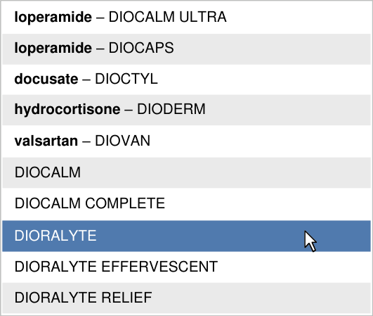

Figure 13: Selection of a Brand Name That Does Not Have a Generic Name

teno

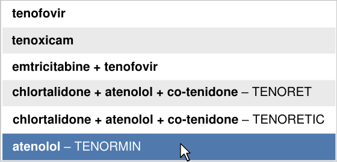

other...

**atenolol**  - oral

TENORMIN - oral

other...

Figure 14: Selection of a Brand Name That Has a Generic Equivalent (That Is Recommended to Display)

dil

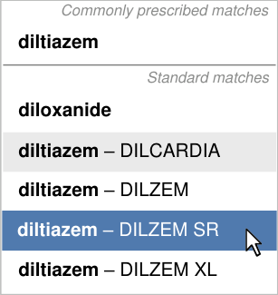

DILZEM SR              - oral              - modified-release

other...

Figure 15: Selection of a Brand Name for Which There Are No Generic Equivalents (That Are Recommended to Display)

Copyright ©2013 Health and Social Care Information Centre

Page 95

HSCIC Controlled Document

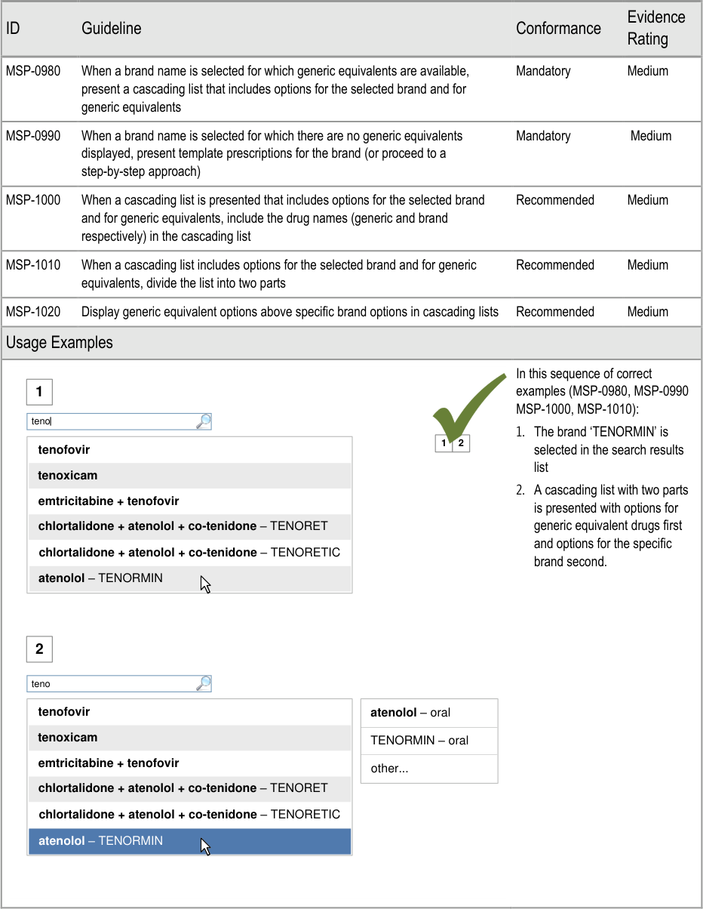

Page 96

Copyright ©2013 Health and Social Care Information Centre

HSCIC Controlled Document

Page 97

Copyright ©2013 Health and Social Care Information Centre

HSCIC Controlled Document

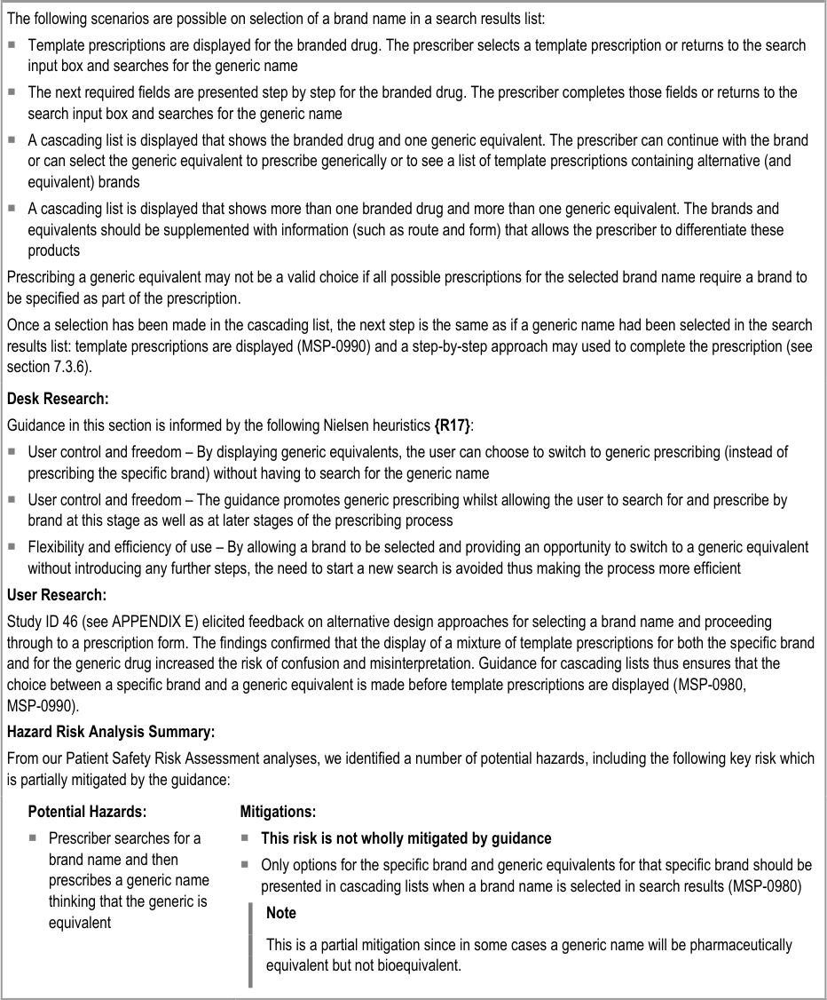

Page 98

Copyright ©2013 Health and Social Care Information Centre

HSCIC Controlled Document

### 7 GUIDANCE DETAILS FOR REQUIRED ATTRIBUTES

#### **7.1 Introduction**

The selection of a drug name and some other attributes in cascading lists allows the system to
determine the type of drug being prescribed. The definition of the remaining required attributes can
be made easier by presenting options that are only relevant to the selected drug type. Template
prescriptions (order sentences) are predefined and partially completed prescriptions that allow
several attributes to be defined with a single selection from a list.

In the absence of template prescriptions, a prescription can be defined using the step-by-step
approach or the full prescription form. In a step-by-step approach some or all of the remaining
required fields are presented and completed one by one. Guidance for the step-by-step approach
and the remaining steps is covered in section 9.

Figure 16 shows the full user interface prescribing process in which the steps covered in this

|Start Prescribing Select Search and from the select from Quick List results Select other fields Select a Template Prescription Complete fields Step by Step Skip to Full Required Prescription fields Form completed Full Prescription Form Preview Authorise|Col2|
|---|---|
| Start Prescribing Authorise Select from the Quick List Search and select from results **Complete** **fields Step** **by Step** **Select a** **Template** **Prescription** **Required** **fields** **completed** Skip to Full Prescription Form Full Prescription Form Select other fields Preview|Page 99|

Copyright ©2013 Health and Social Care Information Centre

HSCIC Controlled Document

Figure 16: The Prescribing Process – Select a Template Prescription

Figure 17 is an extract from Figure 5 to illustrate the user interface prescribing steps that are
covered in this section showing the template prescriptions step and links to and from other steps:

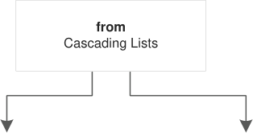

Template Prescriptions

Step by Step

|Col1|Col2|
|---|---|
|drug|route|

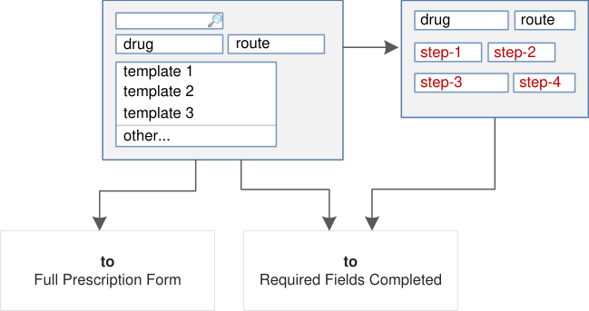

Figure 17: User Interface Prescribing Steps for Completing Required Fields – Template Prescriptions and Step by Step

#### **7.2 Principles**

All guidance is informed by all of the principles for search and prescribe listed in section 2.1. The
following are particularly relevant to this section:

 Increase efficiency by prioritising the prescription of commonly prescribed medications over

less commonly prescribed medications:

 Template prescriptions are a means of defining commonly prescribed regimens so that
many prescription values can be defined with a single selection

 Maximise safety in the absence of decision support systems by designing for the reduction

of errors from invalid or inappropriate selections or entries:

 The provision of template prescriptions reduces the number of individual selections

that need to be made for a prescription and provides access to combinations of values
that are unlikely to be invalid

 Template prescriptions can be used to display standard regimens that an organisation

may wish to promote

 Encourage simplicity of design by promoting user interface approaches that help to avoid

overly complex displays and interactions that require many controls:

 Template prescriptions allow several values to be selected at once and those options

are displayed in a format similar to a final prescription

 Maximise scalability such that the prescribing process can be modified to accommodate

additional information, steps or shortcuts:

Page 100

Copyright ©2013 Health and Social Care Information Centre

HSCIC Controlled Document

 Template prescriptions can contain whichever values are most useful or relevant and

can be supplemented with descriptive text if necessary

 Adhere to a user interface strategy that gives the impression of making progress within a

single space (which has all the necessary information immediately or readily available) and
avoids the impression of needing to move between many different spaces:

 As with drug search results and cascading lists, template prescriptions are presented

within the same space as a prescription is built up

#### **7.3  Guidelines**

##### **7.3.1 Displaying Template Prescriptions**

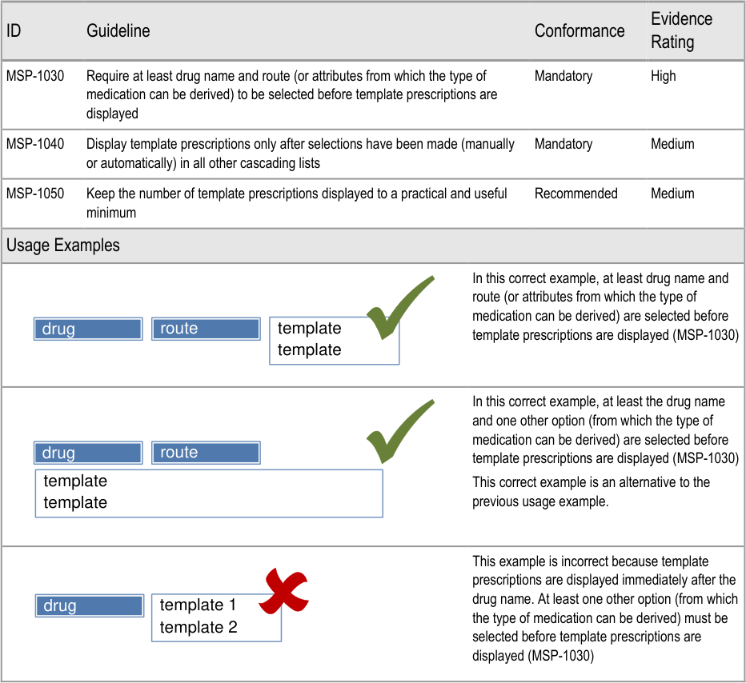

Page 101

Copyright ©2013 Health and Social Care Information Centre

HSCIC Controlled Document

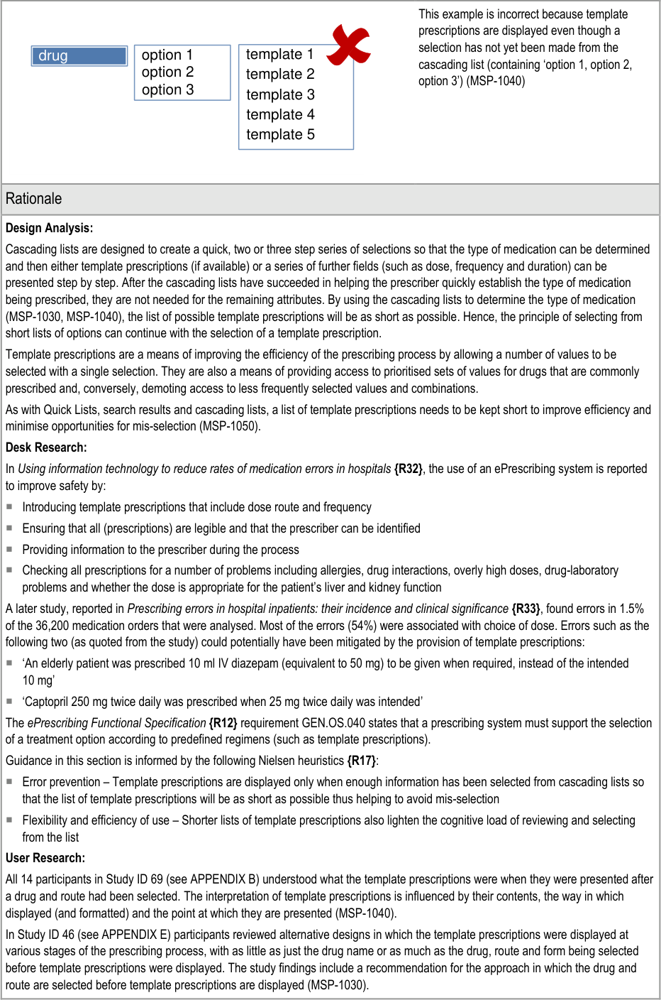

Page 102

Copyright ©2013 Health and Social Care Information Centre

HSCIC Controlled Document

**Hazard Risk Analysis Summary:**

From our Patient Safety Risk Assessment analyses, we identified a number of potential hazards, including the following key risks,
some of which are mitigated and some partially mitigated by the guidance:

**Potential Hazards:**

 A template prescription with an unlicensed dose is

selected and prescribed inappropriately

 A large number (such as 25) of template prescriptions

causes a prescriber to select the first one in the list
without reading the full list

 A prescriber selects an inappropriate template

prescription on the assumption that the template
prescriptions presented have been validated against
information (such as age, weight, test results,
diagnoses and so on available in the patient record

 A prescriber selects the template prescription from

the top of the list without reviewing the alternatives

**Mitigations:**

 **This risk is not mitigated by guidance**

 The number of template prescriptions presented in one list is limited

by the selection of drug name and further attributes (that define the
type of medication) in cascading lists (MSP-1030, MSP-1040)

 MSP-1050 requires the number of templates prescriptions in a list to

be limited

 **This risk is not mitigated by guidance**

 Mitigations for this risk are out of scope, see section 1.2.2

 **This risk is not mitigated by guidance**

##### **7.3.2 Displaying a Selection Trail**

Page 103

Copyright ©2013 Health and Social Care Information Centre

HSCIC Controlled Document

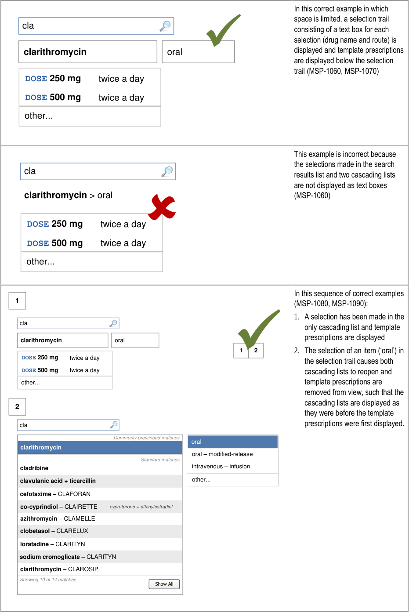

Page 104

Copyright ©2013 Health and Social Care Information Centre

HSCIC Controlled Document

Page 105

Copyright ©2013 Health and Social Care Information Centre

HSCIC Controlled Document

##### **7.3.3 Template Prescription Layout**

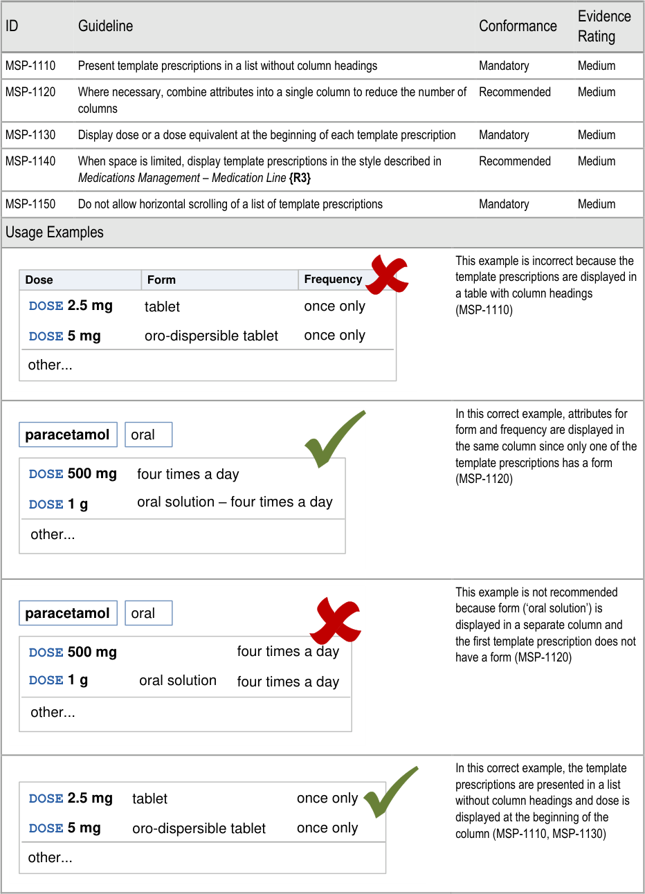

Page 106

|Dose|Form|Frequency|
|---|---|---|
|**`DOSE` 5 mg** oro-dispersible tablet **`DOSE` 2.5 mg**  tablet once only once only|**`DOSE` 5 mg** oro-dispersible tablet **`DOSE` 2.5 mg**  tablet once only once only|**`DOSE` 5 mg** oro-dispersible tablet **`DOSE` 2.5 mg**  tablet once only once only|
|other...|other...|other...|

Copyright ©2013 Health and Social Care Information Centre

HSCIC Controlled Document

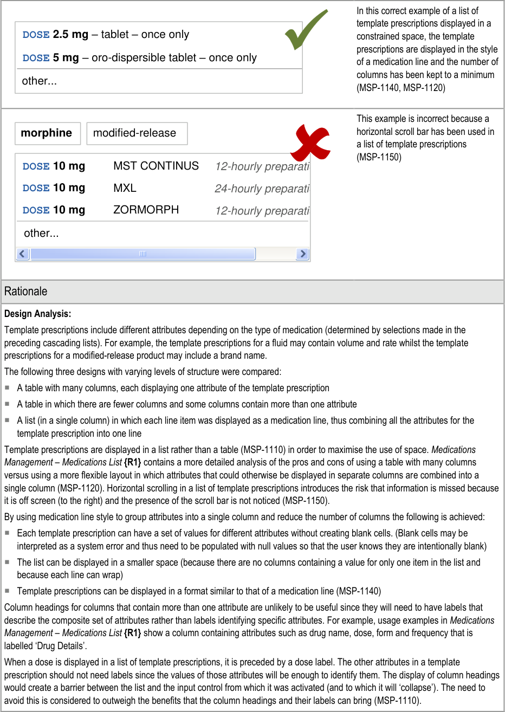

Page 107

Copyright ©2013 Health and Social Care Information Centre

HSCIC Controlled Document

**Desk Research:**

Guidance in this section is informed by the following Nielsen heuristics **{R17}** :

 Flexibility and efficiency of use – By using the medication line format to display template prescriptions the display is both more

compact and more flexible (it can wrap) so less space is needed to display them

 Consistency and standards – Each template prescription begins with the dose (or equivalent) and it is recommended that template

prescriptions are displayed following the same format as a medication line

**User Research:**

Study ID 46 (see APPENDIX E) found that the use of a table with many columns was preferred. The preference appears to come from
the need to compare attributes between template prescriptions and to pick out specific information (such as dose) more easily. The
examples used for testing showed template prescriptions in five columns and each template prescription included a minimum of four
attributes and a maximum of six. The need to compare across template prescriptions may have been a reflection of the large number
of columns and attributes in the template prescriptions used for testing.

The display of dose first (MSP-1140) helps to mitigate the concern that it may be difficult to compare important information between
template prescriptions. Guidance allows the use of a limited number of columns so that attributes, such as dose, can be placed at the
beginning of the text in a column and thus easily compared across template prescriptions.

**Hazard Risk Analysis Summary:**

From our Patient Safety Risk Assessment analyses, we identified a number of potential hazards, including the following key risks
which are mitigated by the guidance:

**Potential Hazards:**

 A template prescription is selected

from a list with a horizontal scroll bar
and one of the attributes being defined
was missed because it was off screen

 A template prescription is selected

based on reading the contents of a
single column (for example, the dose
column)

 A prescription is not wholly reviewed

because the information is displayed
in different formats, split across many
different controls

 One or more attributes of a template

prescription are mis-read because it
wrapped onto a new line

**Mitigations:**

 A horizontal scroll bar should not be used for lists of template prescriptions

(MSP-1150)

 Template prescriptions are presented without column headings (MSP-1110)

 The number of columns is kept to a minimum (MSP-1130)

 Template prescriptions are displayed in the style of a medication line (MSP-1140)

 The number of attributes in a template prescription is kept to a minimum (see

section 7.3.4)

 Guidance recommends that the number of different types of controls are minimised,

which reduces the different display formats (see section 8.1)

 Selection lists are used to combine values (such as those in a template

prescription) and display them a format similar to that displayed in a medication line
(MSP-1140)

 Guidance recommends combining controls into a single control (see section 9.3.1)

 Template prescriptions can be displayed at the beginning of a new line after

selections have been made from cascading lists (see section 7.3.2)

 Attributes can be combined into a single column to reduce the number of columns

(and thus the width of the template prescriptions) and medication line style can be
used when space is limited (MSP-1120 and MSP-1140)

 Dose is always displayed at the beginning of a template prescriptions and is thus

always consistently placed (MSP-1130)

 The number of attributes defined by a template prescription should be kept to a

minimum (see section 7.3.4)

Page 108

Copyright ©2013 Health and Social Care Information Centre

HSCIC Controlled Document

##### **7.3.4 Contents of a Template Prescription**

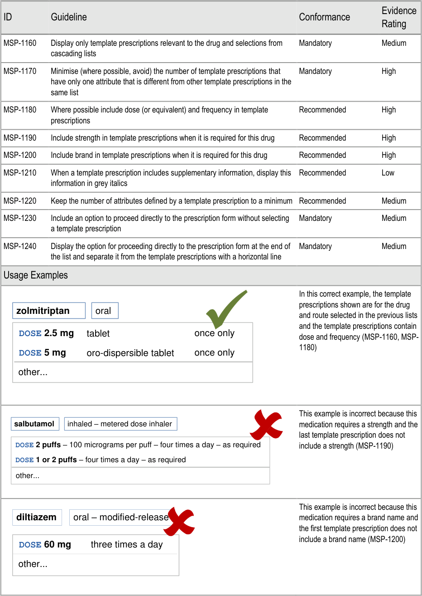

Page 109

Copyright ©2013 Health and Social Care Information Centre

HSCIC Controlled Document

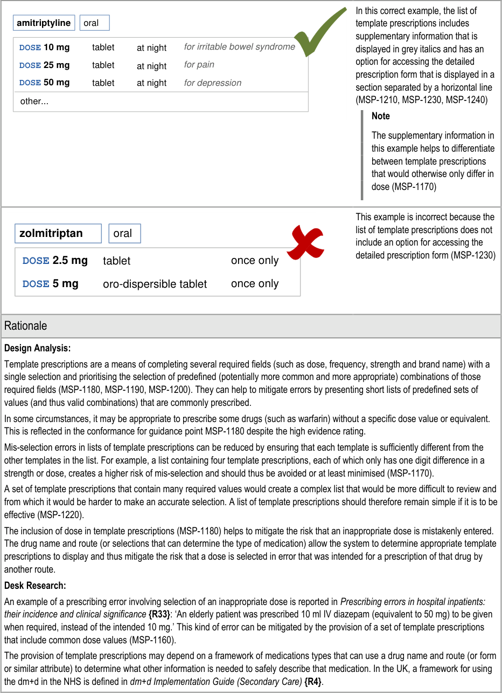

Page 110

Copyright ©2013 Health and Social Care Information Centre

HSCIC Controlled Document

Guidance in this section is informed by the following Nielsen heuristics **{R17}** :

 Flexibility and efficiency of use – Template prescriptions contain values for required fields in such a way that several required fields

can be completed with a single selection

 Error prevention – The provision of template prescriptions for commonly prescribed sets of values may help to reduce mis-selection

errors and mistaken combinations

 User controls and freedom – As with cascading lists, the user is not forced to select a template prescription and may choose to

access a detailed prescription form instead of selecting a template prescription (MSP-1230)

**User Research:**

Study ID 46 (see APPENDIX E) included findings that relate to the display of modified-release and non-modified-release options in
cascading lists and in template prescriptions. The findings included a suggestion to consider clarification of release times when
displayed modified-release preparations. The use of supplementary text (MSP-1210) provides a means of achieving this.

**Hazard Risk Analysis Summary:**

From our Patient Safety Risk Assessment analyses, we identified a number of potential hazards, including the following key risks
which are mitigated by the guidance:

**Potential Hazards:**

 A template prescription is selected

from a list of very similar template
prescriptions

 A template prescription is selected

based on reading the contents of a
single column (for example, the dose
column)

 An input control for a dose is

displayed adjacent to an input control
for a strength and causes the dose
value to be interpreted as the strength
or vice versa

 One or more attributes of a template

prescription are mis-read because it
wrapped onto a new line

**Mitigations:**

 Template prescriptions that have only one attribute that is different from other

template prescriptions in the same list should be minimised and where possible,
avoided (MSP-1170)

 Template prescriptions are presented without column headings (see section 7.3.3)

 The number of columns is kept to a minimum (see section 7.3.3)

 Template prescriptions are displayed in the style of a medication line (see

section 7.3.3)

 The number of attributes in a template prescription is kept to a minimum

(MSP-1220)

 Dose and strength can be entered by selecting a template prescription (MSP-1180,

MSP-1190) or by selecting values for individual fields that are presented in
sequence (see section 7.3.6). Thus they only appear adjacent after they have
already been completed

 In sentence layout (when dose and strength are most likely to appear adjacent),

guidance recommends that labels are incorporated into fields, so the dose label
immediately precedes the dose value (see section 7.3.7)

 Guidance recommends that labels are used for all fields whose contents could be

interpreted as belonging to a different control (see section 7.3.7)

 The dose field is always labelled (see section 9.3.6)

 Template prescriptions can be displayed at the beginning of a new line after

selections have been made from cascading lists (see section 7.3.2)

 Attributes can be combined into a single column to reduce the number of columns

(and thus the width of the template prescriptions) and medication line style can be
used when space is limited (see section 7.3.3)

 Dose is always displayed at the beginning of a template prescriptions and is thus

always consistently placed (see section 7.3.3)

 The number of attributes defined by a template prescription should be kept to a

minimum (see section MSP-1220)

Page 111

Copyright ©2013 Health and Social Care Information Centre

HSCIC Controlled Document

##### **7.3.5 Maintaining Access to Template Prescriptions**

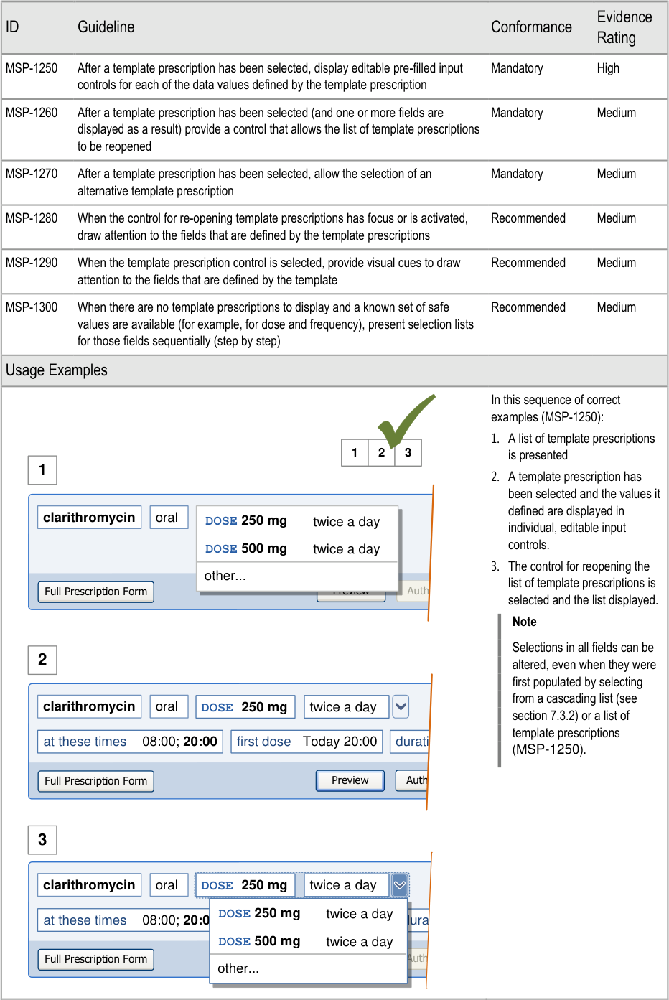

Page 112

|DOSE 250 mg|Col2|Col3|twice a day|Col5|
|---|---|---|---|---|
|**`DOSE`** **250 mg**|**0** Today 20:00 first dose d **`DOSE` 500 mg** twice a day **`DOSE` 250 mg**  twice a day|**0** Today 20:00 first dose d **`DOSE` 500 mg** twice a day **`DOSE` 250 mg**  twice a day|**0** Today 20:00 first dose d **`DOSE` 500 mg** twice a day **`DOSE` 250 mg**  twice a day|**0** Today 20:00 first dose d **`DOSE` 500 mg** twice a day **`DOSE` 250 mg**  twice a day|
|**`DOSE`** **250 mg**|~~Preview~~ other...|~~Preview~~ other...|~~Preview~~ other...|~~Preview~~ other...|

Copyright ©2013 Health and Social Care Information Centre

HSCIC Controlled Document

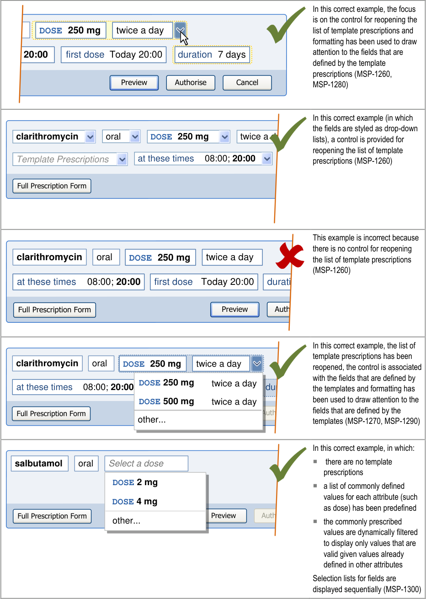

Page 113

|DOSE 250 mg|Col2|Col3|twice a day|Col5|
|---|---|---|---|---|
|**`DOSE`** **250 mg**|Today 20:00 first dose **`DOSE` 500 mg** twice a day **`DOSE` 250 mg**  twice a day|Today 20:00 first dose **`DOSE` 500 mg** twice a day **`DOSE` 250 mg**  twice a day|Today 20:00 first dose **`DOSE` 500 mg** twice a day **`DOSE` 250 mg**  twice a day|Today 20:00 first dose **`DOSE` 500 mg** twice a day **`DOSE` 250 mg**  twice a day|
|**`DOSE`** **250 mg**|~~Preview~~ other...|~~Preview~~ other...|~~Preview~~ other...|~~Preview~~ other...|

Copyright ©2013 Health and Social Care Information Centre

HSCIC Controlled Document

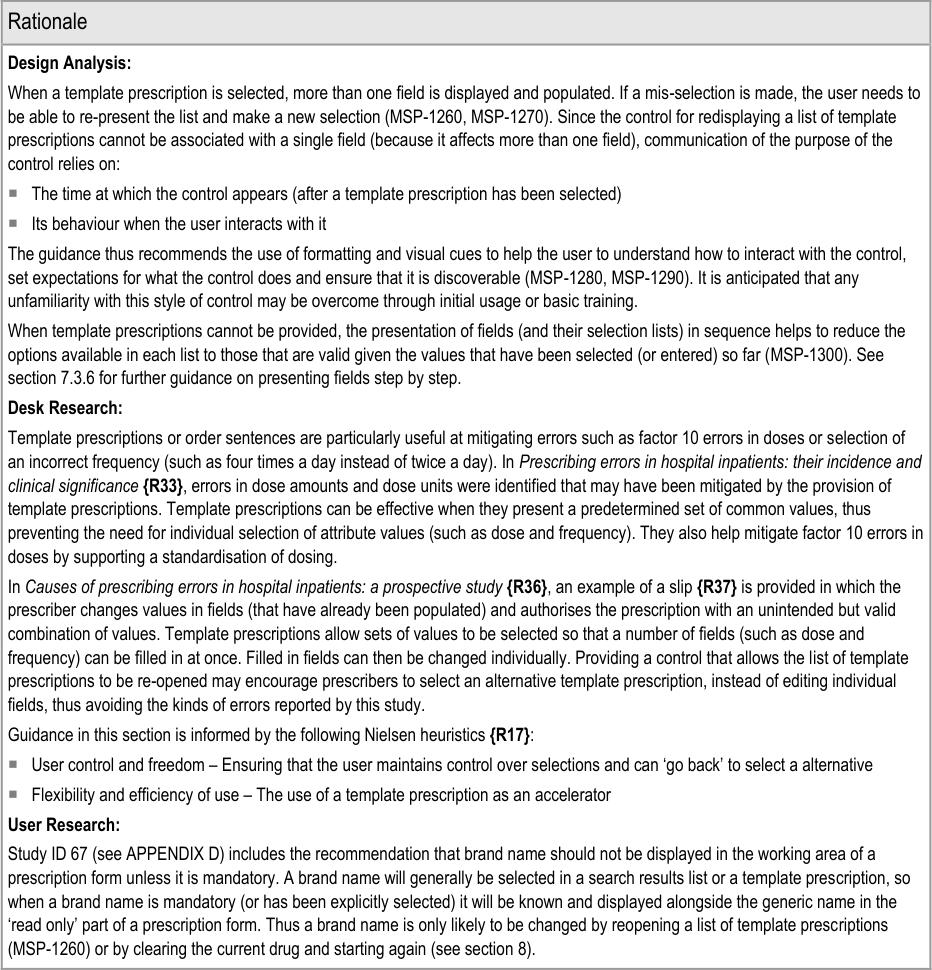

Page 114

Copyright ©2013 Health and Social Care Information Centre

HSCIC Controlled Document

##### **7.3.6 Presenting Fields Step by Step**

Prescribing begins with the selection of a drug to prescribe and continues with further selections
(from cascading lists and template prescriptions) to define the required attributes of the
prescription. Once sufficient information has been defined to determine the type of medication
being prescribed (and thus determine which other attributes will be needed), a more detailed
prescription form can be displayed.

Figure 18 illustrates the process by which a system identifies which fields should appear in a
prescription form:

**1**

**2**

**3**

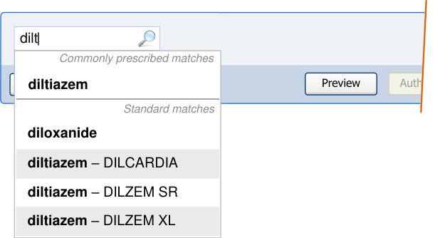

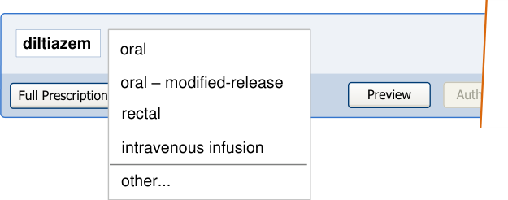

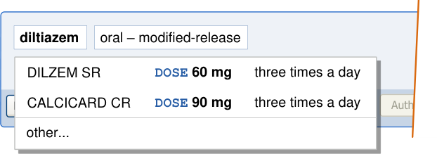

**4**

|Col1|Col2|Col3|Col4|
|---|---|---|---|
|at these times 08:00; 14:00;**20:00** first do oral – modified-release Autho Preview Full Prescription Form **diltiazem** **`DOSE` 60 mg**  twice a d DILZEM SR|at these times 08:00; 14:00;**20:00** first do oral – modified-release Autho Preview Full Prescription Form **diltiazem** **`DOSE` 60 mg**  twice a d DILZEM SR|||
|at these times 08:00; 14:00;**20:00** first do oral – modified-release Autho Preview Full Prescription Form **diltiazem** **`DOSE` 60 mg**  twice a d DILZEM SR|twice a d|a|y|
|at these times 08:00; 14:00;**20:00** first do oral – modified-release Autho Preview Full Prescription Form **diltiazem** **`DOSE` 60 mg**  twice a d DILZEM SR|twice a d|s r|e|
|at these times 08:00; 14:00;**20:00** first do oral – modified-release Autho Preview Full Prescription Form **diltiazem** **`DOSE` 60 mg**  twice a d DILZEM SR|twice a d|||

Figure 18: User Interface Example for Identifying Required Fields

Copyright ©2013 Health and Social Care Information Centre

Page 115

HSCIC Controlled Document

The sequence of events shown in Figure 18 is as follows

1. A drug name is selected

2. A list of other attributes relevant to that drug (including a route) are displayed in a

cascading list

3. Using the drug name and selection in the cascading list, the system can determine the

type of medication (such as ‘oral — modified-release’) and use this to display available
template prescriptions (if there are any)

4. When enough attributes have been defined by selecting a template prescription (or by

completing fields such as dose and frequency step by step), the remaining required fields
can be presented. The required fields are determined based on the type of medication.
For example, an ‘oral — modified-release’ medication may have the following required
fields:

a. Drug name

b. Brand name

c. Route

d. Dose

e. Frequency

f. Administration times

g. Time of first dose

h. Duration

Table 8 shows a notional example of the different sets of required fields that might be identified for
four types of medication. The four types are determined by the combination of drug name and
selections made in cascading lists.

Generic Drug Name **Required** **Required** **Required** **Required**

Brand name _Optional_ **Required** _Optional_ _Optional_

Route **Required** **Required** **Required** **Required**

Strength _Optional_ _Optional_ **Required** **Required**

Dose **Required** **Required** **Required** **Required**

Method _N/A_ _N/A_ _N/A_ **Required**

Frequency **Required** **Required** **Required** **Required**

Administration Times **Required** **Required** **Required** _N/A_

Time of First Dose **Required** **Required** **Required** _N/A_

Start Date and Time _N/A_ _N/A_ _N/A_ **Required**

Duration **Required** **Required** **Required** _Optional_

Table 8: Examples of Required Fields for Four Notional Types of Medication

Page 116

Copyright ©2013 Health and Social Care Information Centre

HSCIC Controlled Document

The majority of prescriptions have only a few required fields and thus, in most cases, a prescription
can be completed in a small number of steps. A more detailed prescription is only necessary when
additional (optional) information or a less common set of attributes needs to be defined.

In most cases, a template prescription can be selected and the set of required fields can then be
displayed. However, in the absence of template prescriptions, a step-by-step process can be used
to encourage the selection of important attributes (such as dose) from predefined, limited lists.

**Important**

This section contains guidance for which there may be alternative solutions. Accordingly, the conformance
ratings in this section apply only where the guidance is adopted.

The Rationale section contains a summary of the known risks which are addressed in this section and
which must be addressed by any alternative solution. For more information, see the Alternative Design
Solutions note in section 1.

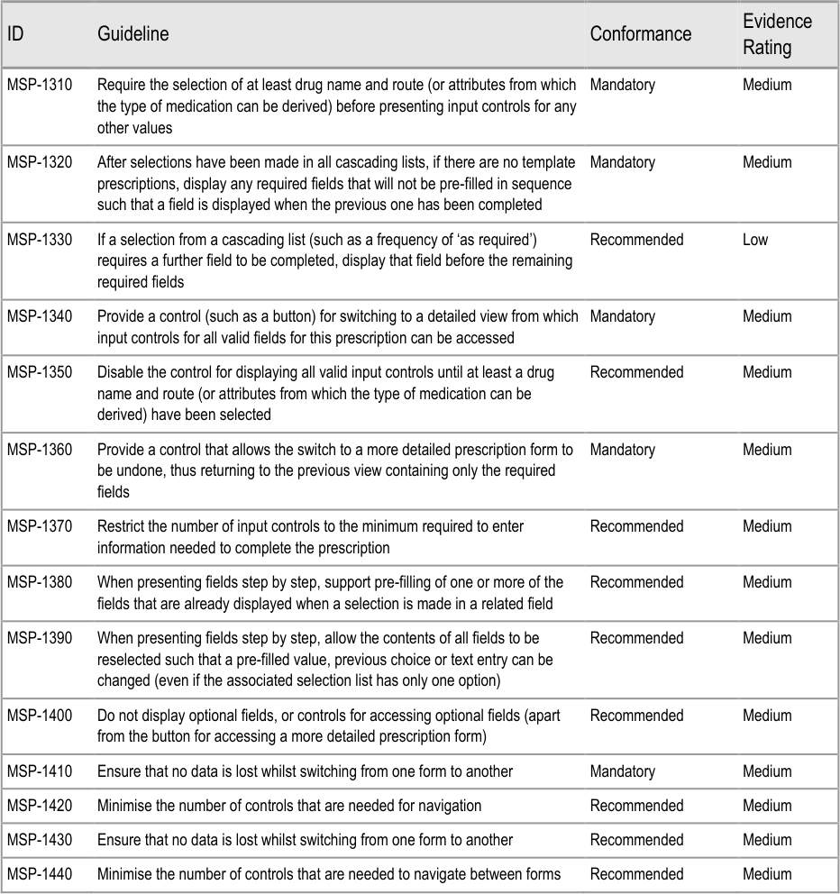

Page 117

Copyright ©2013 Health and Social Care Information Centre

HSCIC Controlled Document

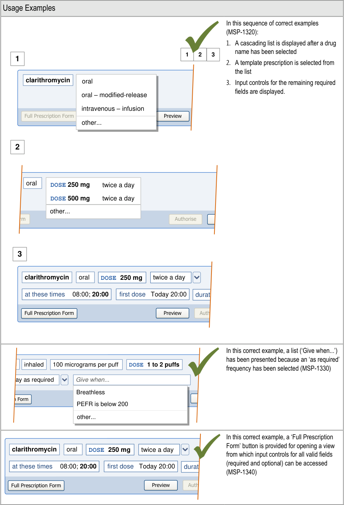

Page 118

|clarithromycin|poraarlacetamol oral – modified-release intravenous – infusion|
|---|---|
|**clarithromycin**|other...|

Copyright ©2013 Health and Social Care Information Centre

HSCIC Controlled Document

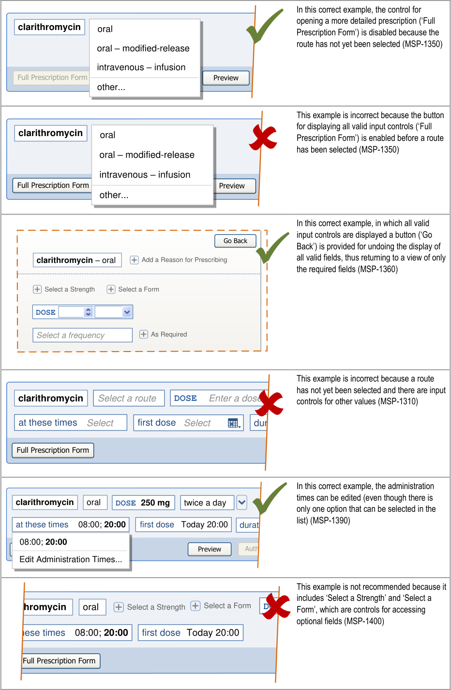

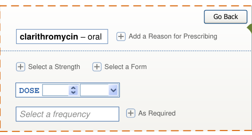

Page 119

Copyright ©2013 Health and Social Care Information Centre

HSCIC Controlled Document

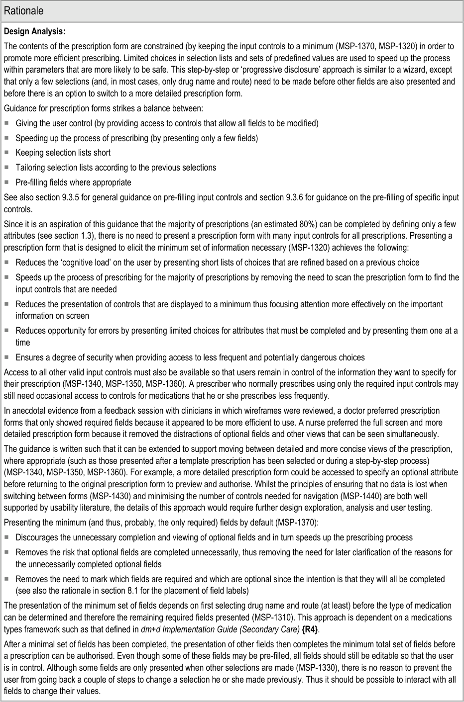

Page 120

Copyright ©2013 Health and Social Care Information Centre

HSCIC Controlled Document

**Desk Research:**

The paper _The Impact of Computerized Physician Order Entry on Medication Error Prevention_ **{R38}** reports the findings of a study of
medications errors before and after implementation of an electronic prescribing system _._ The study (which excluded ‘missed dose’
errors from its analysis) reported a significant reduction (80%) in medication errors. Three quarters of this reduction was achieved with
a relatively simple system that structured the entry of prescriptions (the paper refers to them as ‘orders’) and included rudimentary
‘order checking’. The default prescription form reduces the possibility of errors by providing a highly structured approach to entering
prescriptions and reducing the possibilities for error by limiting the options available based on values that must be entered in a
particular order, thus providing a more pro-active approach to ‘order checking’.

An earlier study, _Effect of Computerised Physician Order Entry and a Team Intervention on Prevention of Serious Medication Errors_
**{R39}** reports that implementing even a modest electronic prescribing system can result in important error reduction if the system
includes a dose selection menu, simple drug-allergy and drug-drug checking and the requirement that clinicians indicate the route and
frequency of drug doses. The prescription form first presents doses as part of a template prescription or as a selection menu when
there are no template prescriptions. (A more detailed prescription form can then also present doses within a selection menu but may in
some cases support the entry of a dose amount in figures, see section 9.3.1.)

The provision of a default prescription form that only presents fields that are relevant to the selections made so far, depends on the
availability of a framework of medications types that can use a drug name and route (or form or similar attribute) to determine what
other information is needed to safely describe that medication. In the UK, a framework for using the dm+d in the NHS is defined in
_dm+d Implementation Guide (Secondary Care)_ **{R4}** .

Guidance in this section is informed by the following Nielsen heuristics **{R17}** :

 User control and freedom – The provision of a control that allows the user to switch to a more detailed prescription form as soon as

possible (MSP-1340) allows the user to decide whether to continue with the default prescription form or to switch to a detailed
approach to prescribing. MSP-1360 ensures that the user can undo the action of switching from default to more detailed
prescription forms without losing any information entered or selected so far

 Flexibility and efficiency of use – By presenting a step-by-step prescription form first (MSP-1320), efficiency is improved for most

prescriptions whilst also providing the flexibility needed to prescribed more detailed prescriptions

 Aesthetic and minimalist design – In the default prescription form, input controls are kept to a minimum, are presented one at a

time for critical information and are presented such that information that is rarely needed is hidden, thus increasing the relative
visibility of important information

**Hazard Risk Analysis Summary:**

From our Patient Safety Risk Assessment analyses, we identified a number of potential hazards, including the following key risks
which are mitigated by the guidance:

**Potential Hazards:**

 The system presents a prescription

form complete with default values and
the prescriber is unaware of other
prescription regimens

 Individual administration times have to

be defined by the prescriber and result
in non-standard times

 A prescription is authorised with a

value that was not the intended value
because it had been automatically
updated when a value was defined in
another field

**Mitigations:**

 MSP-1320 ensures that explicit selections are made for the most important parts of

a prescription (and see section 6 for selections in cascading lists)

 Template prescriptions (see section 7) are presented as a list so that the prescriber

can see commonly prescribed regimens

 Where appropriate, pre-fill one or more fields when a selection is made in a related

field (MSP-1380)

 Pre-filling administration times when the frequency is defined (see section 9.3.5)

 Providing a selection list of (common) administration schedules (see section 9.3.6)

 Restricting the definition of individual administration event times to a more detailed

view (see section 9.3.6)

 The contents of all fields can be changed such that a pre-filled value can be

changed (MSP-1390)

 Guidance requires the use of formatting to draw attention to a field whose contents

have changed automatically (see section 9.3.5)

Page 121

Copyright ©2013 Health and Social Care Information Centre

HSCIC Controlled Document

 An input control for a dose is

displayed adjacent to an input control
for a strength and causes the dose
value to be interpreted as the strength
or vice versa

 A prescriber selects a template

prescription in order to avoid using the
more detailed prescription form
because it is too complicated

 Dose and strength can be entered by selecting a template prescription (see

section 7.3.4) or by selecting values for individual fields that are presented in
sequence (MSP-1320). Thus they only appear adjacent after they have already
been completed

 In sentence layout (when dose and strength are most likely to appear adjacent),

guidance recommends that labels are incorporated into fields, so the dose label
immediately precedes the dose value (see section 7.3.7)

 Guidance recommends that labels are used for all fields whose contents could be

interpreted as belonging to a different control (see section 7.3.7)

 The dose field is always labelled (see section 9.3.6)

 When there are no template prescriptions, the required fields can be presented and

completed one by one (MSP-1320)

##### **7.3.7 Using Sentence Layout**

Sentence layout is the display of input fields as if they were words in a sentence. Display rules
(such as those for width and wrapping) that might apply to words in a sentence are applied to the
dynamic display of input fields. This means that input fields can grow in width as values are entered
into them and wrap onto a new line as necessary. Figure 19 illustrates wrapping in sentence layout,
showing the wrapping of an input control such that it is placed at the beginning of a new line and
followed by the next input control:

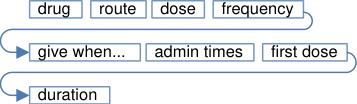

Figure 19: Wrapping in Sentence Layout

Figure 20 shows a sequence of steps in which values are typed into two dynamic width input
controls. In steps 3 and 6 the input controls grow in width to accommodate the values that have
been typed into them.

1

2

fir

4

first field

5 first field sec

Figure 20: Dynamic Width Input Controls

**Important**

This section contains guidance for which there may be alternative solutions. Accordingly, the conformance
ratings in this section apply only where the guidance is adopted.

The Rationale section contains a summary of the known risks which are addressed in this section and
which must be addressed by any alternative solution. For more information, see the Alternative Design
Solutions note in section 1.

Page 122

Copyright ©2013 Health and Social Care Information Centre

HSCIC Controlled Document

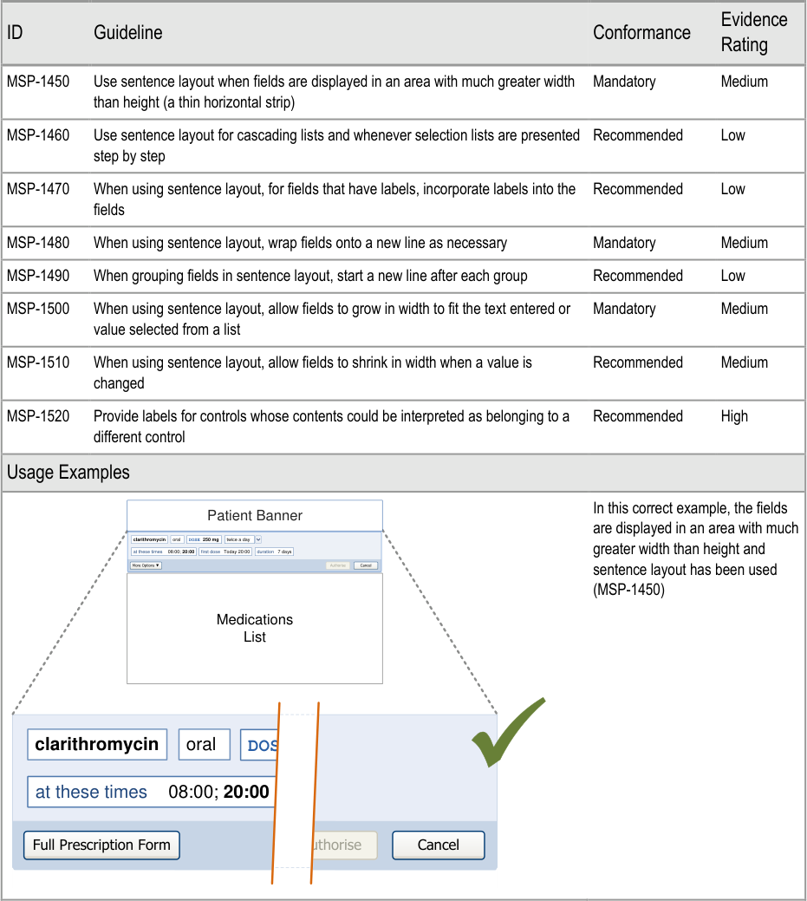

Page 123

|Patient Banner|Col2|Col3|Col4|Col5|Col6|
|---|---|---|---|---|---|
|**clarithromycin**|oral|**`DOSE`** **250 mg**|**`DOSE`** **250 mg**|twice a day|twice a day|
|08:00;**20:00** at these times|08:00;**20:00** at these times|08:00;**20:00** at these times|Today 20:00 first dose|Today 20:00 first dose|7 days duration|

Copyright ©2013 Health and Social Care Information Centre

HSCIC Controlled Document

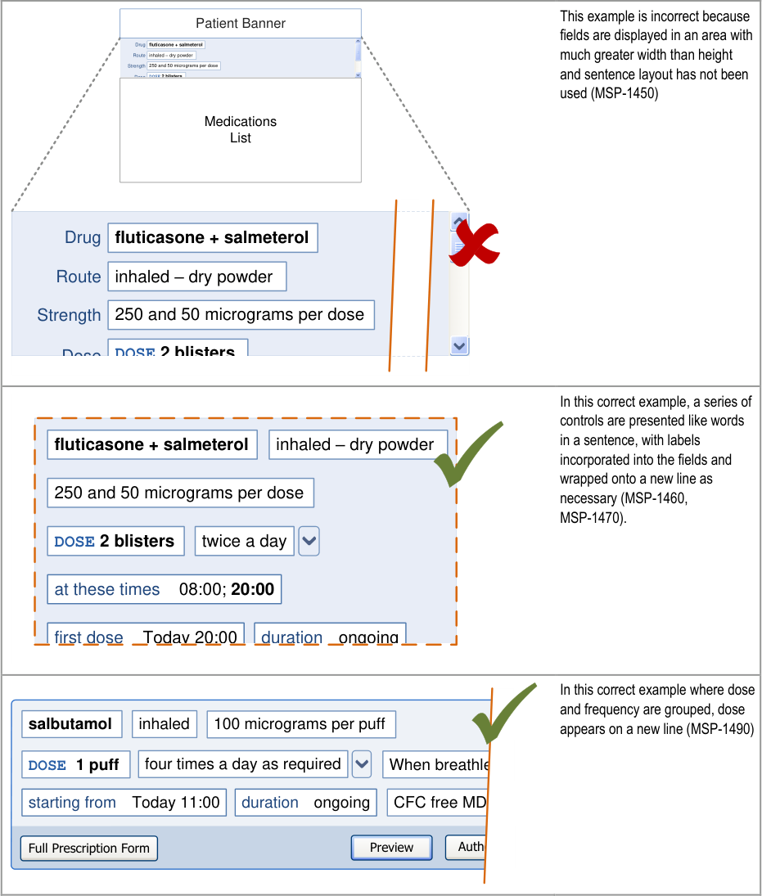

|Patient Banner Drugfluticasone + salmeterol|Col2|
|---|---|
|Route Strength |inhaled – dry powder|
|**`DOSE` 2 blisters** Dose Medications List|**`DOSE` 2 blisters** Dose Medications List|

Page 124

Copyright ©2013 Health and Social Care Information Centre

HSCIC Controlled Document

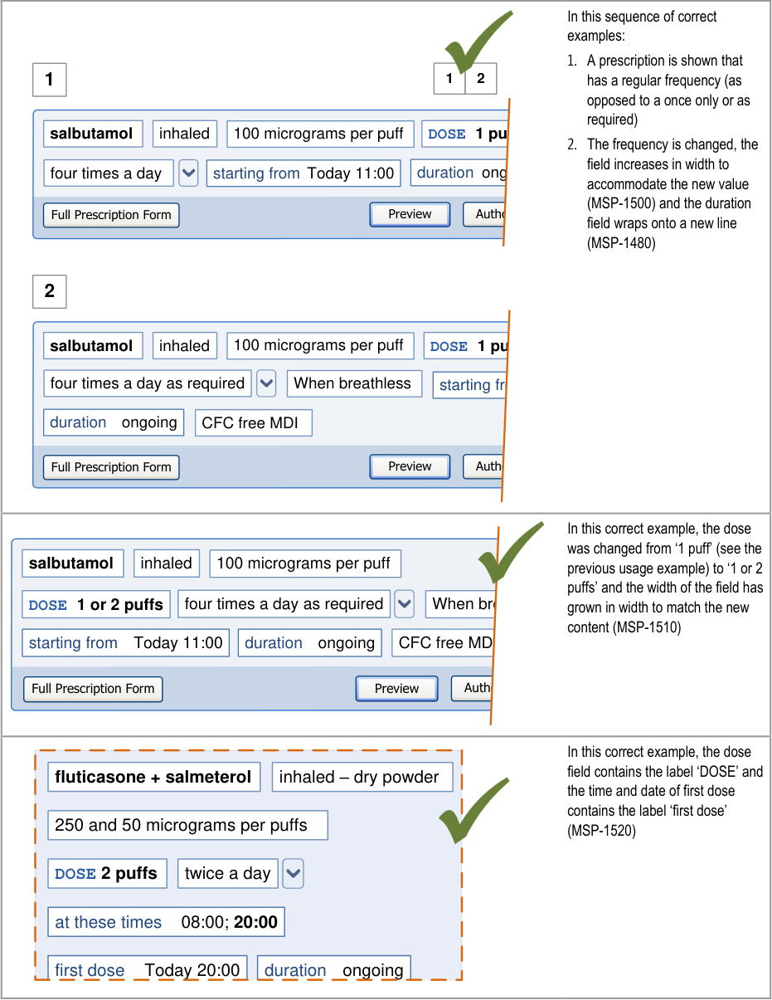

Page 125

Copyright ©2013 Health and Social Care Information Centre

HSCIC Controlled Document

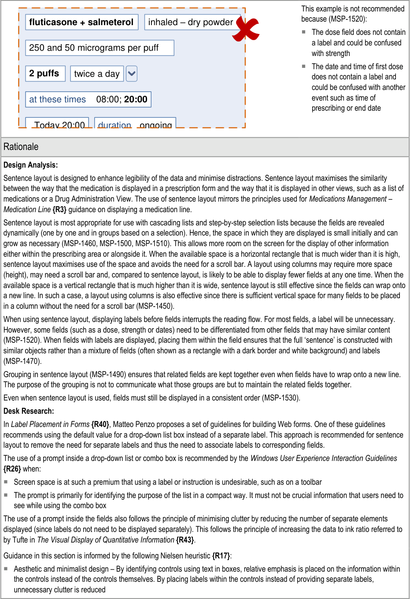

Page 126

Copyright ©2013 Health and Social Care Information Centre

HSCIC Controlled Document

**Hazard Risk Analysis Summary:**

From our Patient Safety Risk Assessment analyses, we identified a number of potential hazards, including the following key risk which
is partially mitigated by the guidance:

**Potential Hazards:**

 An input control for a dose is

displayed adjacent to an input
control for a strength and causes the
dose value to be interpreted as the
strength or vice versa

**Mitigations:**

 **This risk is not wholly mitigated by guidance**

 Dose and strength can be entered by selecting a template prescription (see section

7.3.4) or by selecting values for individual fields that are presented in sequence (see
section 7.3.6). Thus they only appear adjacent after they have already been
completed

 In sentence layout (when dose and strength are most likely to appear adjacent),

guidance recommends that labels are incorporated into fields, so the dose label
immediately precedes the dose value (MSP-1470)

 Guidance recommends that labels are used for all fields whose contents could be

interpreted as belonging to a different control (MSP-1520)

 The dose field is always labelled (see section 9.3.6)

Page 127

Copyright ©2013 Health and Social Care Information Centre

HSCIC Controlled Document

### 8 GUIDANCE DETAILS FOR PRESCRIPTION FORMS

#### **8.1 Introduction**

It is assumed (see section 1.3) that the majority of prescriptions will be completed by selecting a
template prescription and entering values for any remaining required fields. However, in some
cases, additional specific fields or more detailed prescriptions may be needed and forms with a
larger number of fields would be required to support these.

Figure 21 shows the full user interface prescribing process in which the step covered in this section

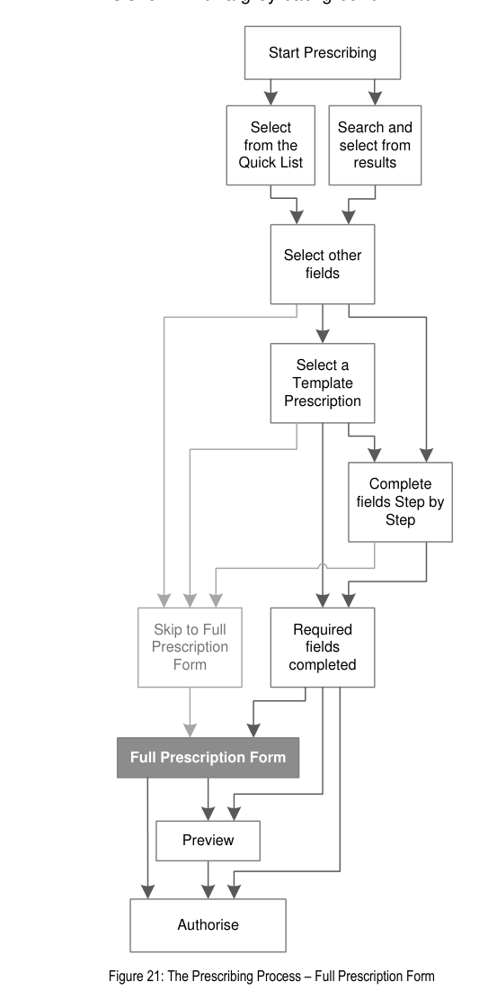

Page 128

Copyright ©2013 Health and Social Care Information Centre

HSCIC Controlled Document

Figure 22 is an extract from Figure 21 to illustrate the user interface prescribing steps covered in

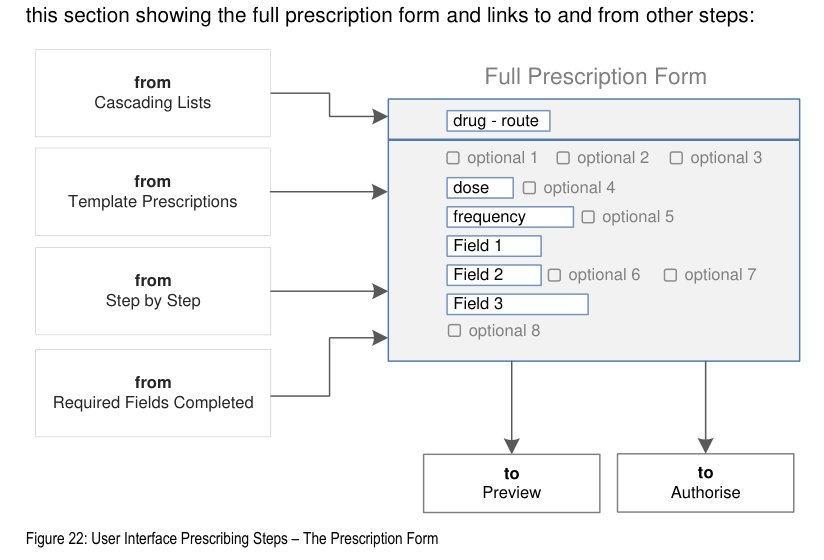

#### **8.2 Principles**

All guidance is informed by all of the principles for search and prescribe listed in section 2.1. The
following are particularly relevant to this section:

 Encourage simplicity of design by promoting user interface approaches that help to avoid

overly complex displays and interactions that require many controls:

 The number of input controls for a detailed prescription form is kept to a minimum

 The need to navigate between sections of a detailed prescription form is kept to a

minimum by displaying a view containing required fields and input controls for
common optional fields by default

 Ensure that the prescribing process can be supported in multiple layouts and is flexible

enough to be presented in different screen dimensions:

 Guidance supports (and usage examples illustrate) multiple approaches to layout,

including using columns to show labels and input controls and using sentence layout
for input controls

 Maximise scalability such that the prescribing process can be modified to accommodate

additional information, steps or shortcuts:

 Guidance supports alternative means providing access to individual optional fields,

groups of optional fields and views with larger sets of fields

 The process by which the prescriber arrives at a prescription form can incorporate

additional steps

 The prescription form can include controls that add further steps to be completed

before the prescription can be authorised

Page 129

Copyright ©2013 Health and Social Care Information Centre

HSCIC Controlled Document

 Manage users expectations and improve their efficiency by providing a clear framework

with consistent logic for the placement of user interface elements and the interactions
that they support:

 Efficiency is improved by presenting input controls for the fields that must be

completed and ensuring quick access to those that are most likely to be needed

 Input controls (and controls for accessing some optional controls) are placed in a

consistent order

 Minimise the potential for important information to be hidden from view:

 Placement of the drug name and design of the form ensures that the drug name

cannot be scrolled out of view

#### **8.3 Guidelines**

##### **8.3.1 Presentation and Layout of Prescription forms**

This section provides guidance for layout of input controls. Although most relevant for a more
detailed prescription form, the guidance in this section applies to all stages of a prescription form,
from cascading lists, template prescriptions and step-by-step required fields. See section 9 for
guidance specifically for input controls.

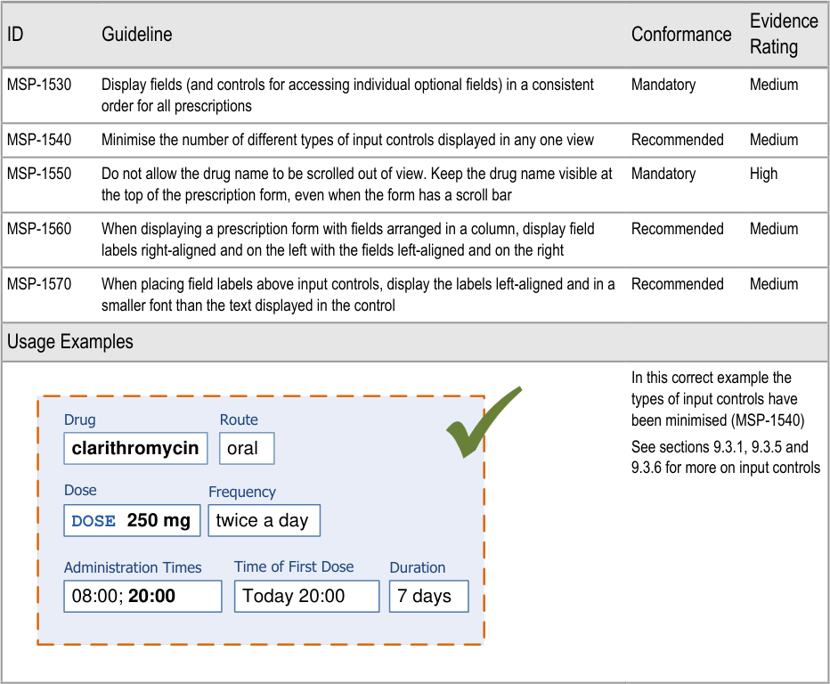

Page 130

Copyright ©2013 Health and Social Care Information Centre

HSCIC Controlled Document

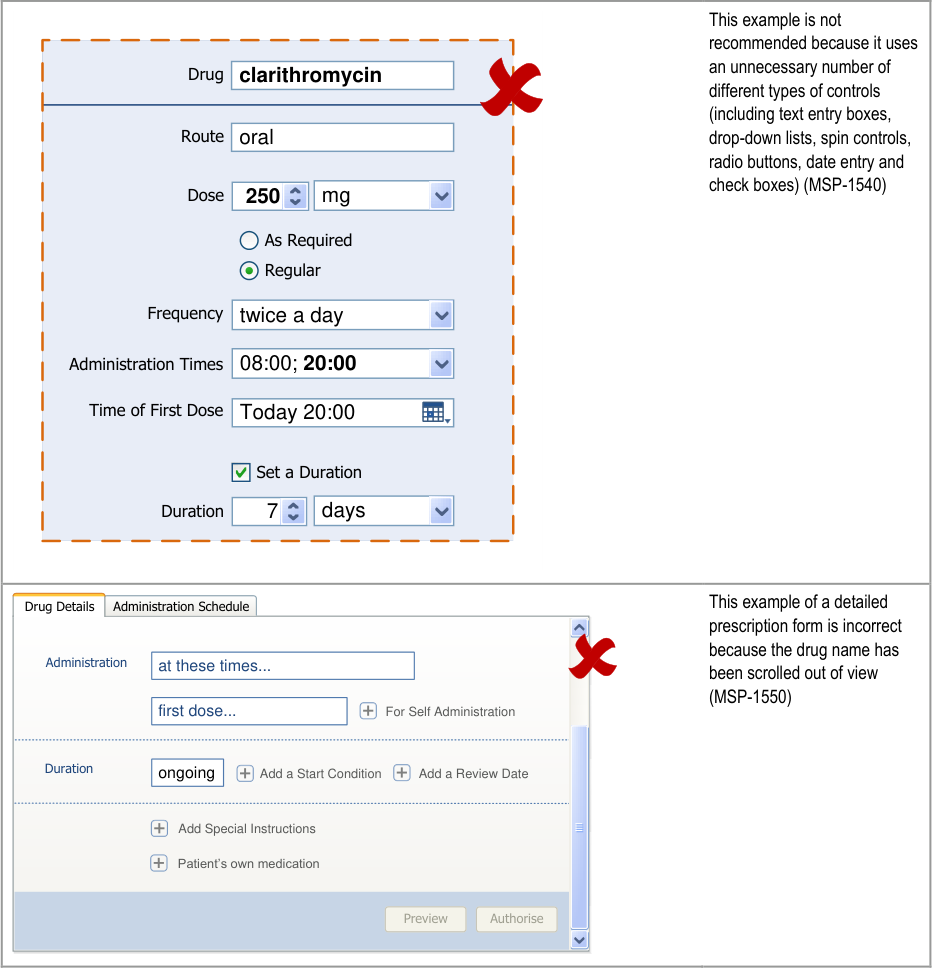

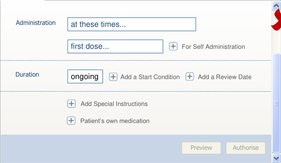

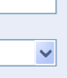

Page 131

Copyright ©2013 Health and Social Care Information Centre

HSCIC Controlled Document

|Col1|In this correct example, the fields are arranged in a column, the labels are right aligned and Drug Name clarithromycin the fields are left aligned (MSP-1560) This example also illustrates Route oral the use of more than one type of input control where necessary (where dictated by Dose 250 mg system constraints) whilst still using the minimum possible Frequency twice a day number of input controls (MSP-1540) Administration Times 08:00; 20:00 First Dose 02-Apr-2010 20:00 Duration 7 days Full Prescription Form Preview Authorise Cancel|
|---|---|
|| This example with fields arranged in a column is not recommended because the labels are left aligned (MSP-1560) Drug Name **clarithromycin** oral Route **250** Dose mg twice a day Frequency 02-Apr-2010 20:00 First Dose 7 days Duration Administration Times 08:00;**20:00** Cancel Authorise Preview Full Prescription Form|
|| In this correct example, the labels above the controls are left aligned and in a smaller font than the text in the control (MSP-1570) **clarithromycin** oral Today 20:00 **`DOSE`** **250 mg** twice a day 08:00;**20:00** Administration Times Time of First Dose 7 days Duration Frequency Drug Route Dose|

Page 132

Copyright ©2013 Health and Social Care Information Centre

HSCIC Controlled Document

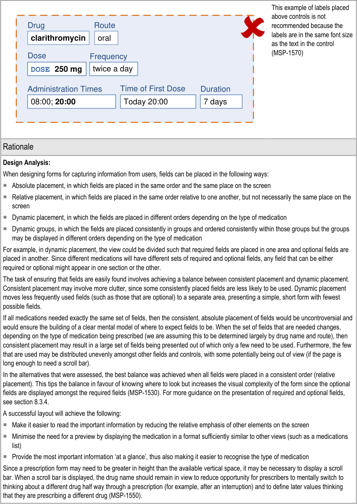

Page 133

Copyright ©2013 Health and Social Care Information Centre

HSCIC Controlled Document

**Desk Research:**

The paper, _Label Placement in Forms_ _[18]_ examined eye-tracking to assess the relative cognitive load of Web forms with different label
placement and alignment and different input controls. In this paper, Matteo Penzo confirmed findings from a previous study that
drop-down controls are the most eye-catching of (Web) form elements. In this study, he finds that they are more eye-catching than
both text-input controls and buttons. Penzo attributes this to the success of the form element in conveying its meaning and how the
user must interact with it. Since each different input control conveys meaning and how the user should interact with it differently, the
introduction of different types of controls increases the ‘competition’ for attention and understanding. This does not happen if all input
controls convey their meaning in the same way and exhibit the same interactions. This finding is relevant to MSP-1540 since it refers
to the general principle of reducing the visual noise introduced by controls.

The paper, _Should I use a drop-down?_ [19] _,_ focuses on the use of drop-down controls in Web forms. Miller and Jarrett suggest a
four-step process for choosing form elements. The third is ‘Third, look at the impact of your choice on the form as a whole. Choose a
sensible order for the options, keep the options short and avoid too many different input methods.’ This is reflected in MSP-1540.

MSP-1560 and MSP-1570 refer to the placement of labels in relation to forms when the fields have been arranged in a column. In
_Label Placement in Forms – What’s Best_ **{R42}**, Caroline Jarrett concludes that appropriate placement of field labels depends on the
users, task and specific design. Both Jarrett (in _Label Placement in Forms – What’s Best_ **{R42}** ) and Penzo (in _Label Placement in_
_Forms_ **{R40}** ) point out that the placement of a label depends on whether the labels are needed to:

 **Understand the whole form** . In which case, they should be placed so that they can be scanned independently of the fields

 **Work out what to fill in and what to leave blank** . This is relevant when only some of the fields are required and the user wants to

provide the minimum information

 **Understand what information is needed** . This is relevant when the user is not familiar with the form as a whole or not familiar

with the information needed in one or more specific fields

These tasks reflect the focus of Jarrett and Penzo’s papers on the design of Web forms and are less relevant to the task of prescribing
using a more sophisticated interface than a simple Web form since:

 Users will already be familiar with the prescription form (and many will use it regularly)

 There is no need to determine which fields should be filled in since required fields are displayed and the display of optional fields is

significantly discouraged

 When watermark text is used as a prompt within the fields, there is no need to read a separate label to determine what the field is

for

 The pattern of the prescription form is likely to be familiar

 The options presented in selection lists when a field is active also tells the user what the input control is for

Whilst usability references for the design of Web forms can inform the design of application forms as well, there are some differences
that are important in this context. One of the most significant differences is that, in general, studies on Web forms indicate they are
designed for users who will encounter that form rarely and probably only once. This impacts findings that relate to orientation when
viewing a form for the first time and the need to scan all labels in order to build up a picture of what the form covers and what must be
filled in. These usage examples are far less relevant to the design of a form that is expected to be used regularly by trained users.

The visual design principle ‘data to ink ratio’, coined by Edward Tufte in _The Visual Display of Quantitative Information_ **{R43}**, is
informed by his analysis of many examples of visual design in artefacts that are widely considered to be exemplary at efficient and
effective communication. His principle holds that the quantity of ink (in a printing metaphor) needed for the display of information
should exceed that which is used to display supporting visual structures and embellishments.

Guidance in this section is informed by the following Nielsen heuristics **{R17}** :

 Consistency and standards – Input controls for fields (both required and optional) are displayed in a consistent (relative) order

(MSP-1530)

 Aesthetic and minimalist design – The number of different input controls is limited, thus also limiting the number of different

interactions required to input information (MSP-1540)

18 Penzo, M – Label Placement in Forms **{R40}** :
[http://www.uxmatters.com/mt/archives/2006/07/label-placement-in-forms.php](http://www.uxmatters.com/mt/archives/2006/07/label-placement-in-forms.php)

19 Miller S, Jarrett C – Should I use a drop-down? Four steps for choosing form elements on the Web **{R41}** :
[http://www.formsthatwork.com/files/Articles/dropdown.pdf](http://www.formsthatwork.com/files/Articles/dropdown.pdf)

Page 134

Copyright ©2013 Health and Social Care Information Centre

HSCIC Controlled Document

**Hazard Risk Analysis Summary:**

From our Patient Safety Risk Assessment analyses, we identified a number of potential hazards, including the following key risks
which are mitigated by the guidance:

**Potential Hazards:**

 A prescription is not wholly reviewed

because the information is displayed in
different formats, split across many
different controls

 Optional information is missed from a

prescription because the prescriber could
not find the control for accessing optional
fields or other areas of a detailed
prescription form

**Mitigations:**

 MSP-1540 recommends that the number of different types of controls are

minimised, which reduces the different formats used to display it

 Selection lists are used so that the combined list items can be displayed in a

format similar to that of a medication line (see section 7.3.3)

 Guidance in section 9.3.1 recommends combining controls into a single control

 Controls for accessing optional fields are displayed in a consistent order

(MSP-1530)

 Controls for optional fields are displayed alongside required fields (see

section 8.3.2)

 Controls should be provided for all areas of a detailed prescription form such that

there is no area that can only be accessed by selecting an item from a selection
list (see section 8.3.2)

 Controls for accessing optional fields are placed where the optional field appears

when it is displayed (see section 8.3.4)

##### **8.3.2 Presenting a Detailed Prescription Form**

Some prescriptions may be defined using template prescriptions or completing the required fields
step by step. When prescribers need to be more specific or to enter more (and optional)
information, they need access to a more detailed prescription form. This section contains guidance
for presenting such a prescription form.

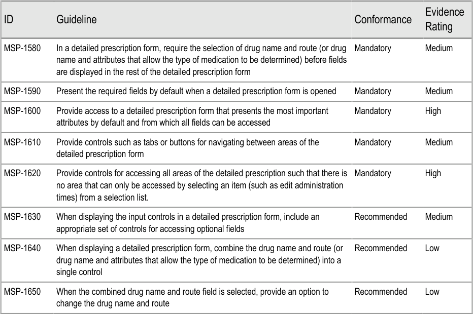

Page 135

Copyright ©2013 Health and Social Care Information Centre

HSCIC Controlled Document

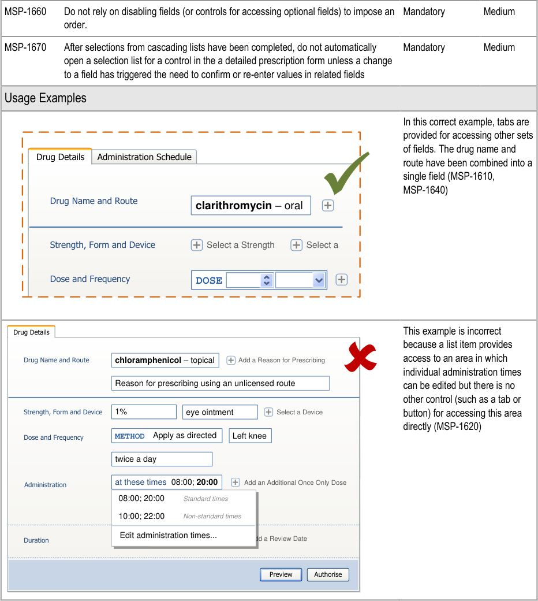

Page 136

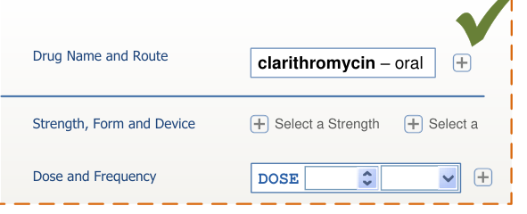

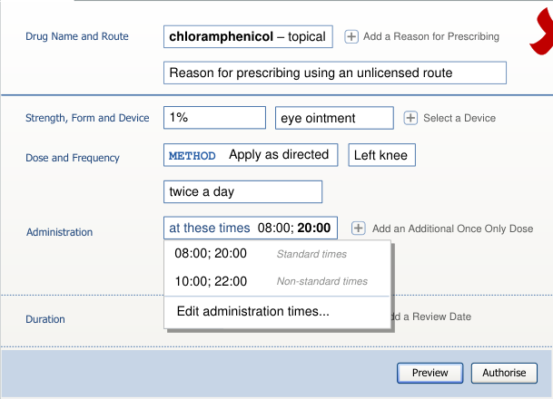

Copyright ©2013 Health and Social Care Information Centre

HSCIC Controlled Document

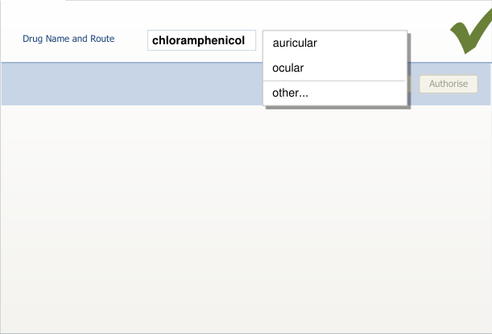

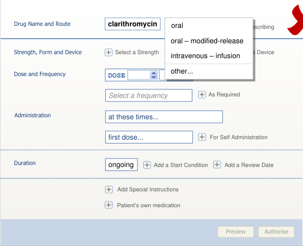

Page 137

Copyright ©2013 Health and Social Care Information Centre

HSCIC Controlled Document

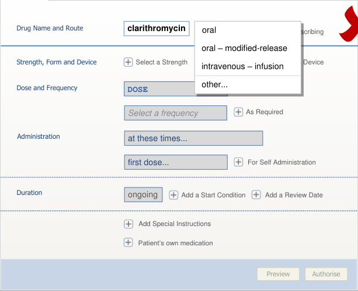

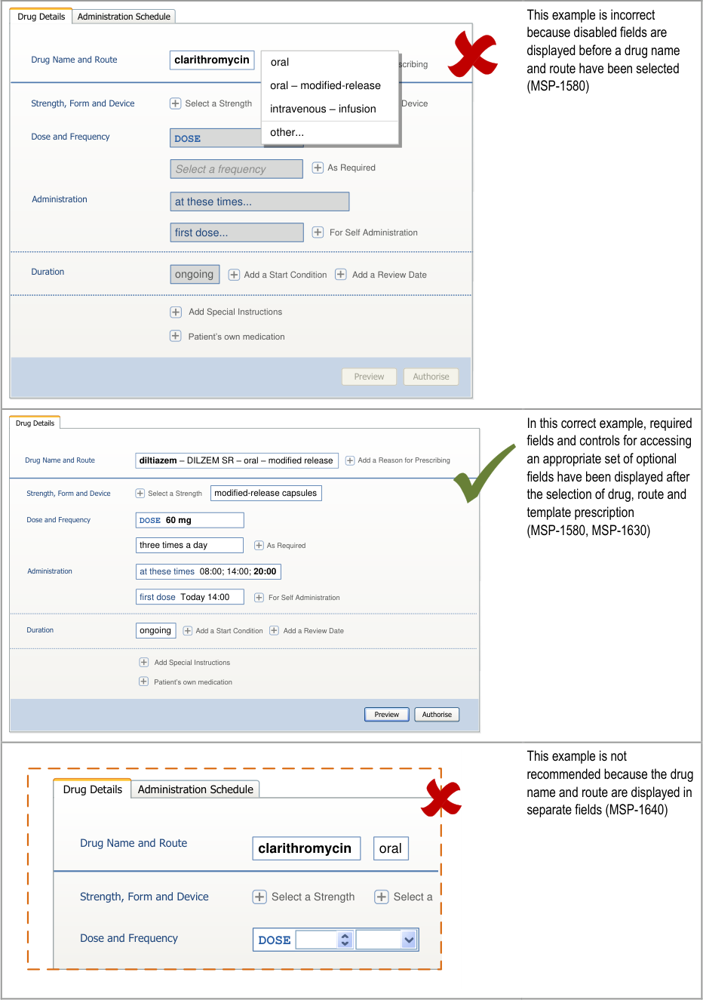

|Col1|oral Add a Reason for Pre|
|---|---|
||Select a Select a Form ~~oral – modified-release~~ intravenous – infusion|
||Enter a Site other...|
|**`DOSE`**|other..|

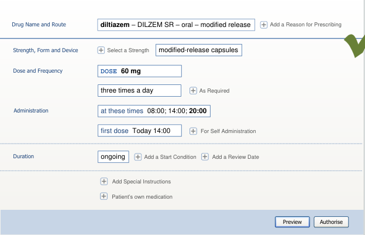

Page 138

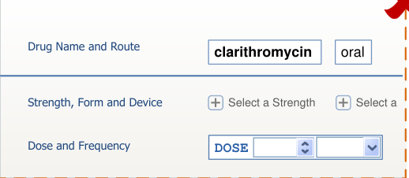

Copyright ©2013 Health and Social Care Information Centre

HSCIC Controlled Document

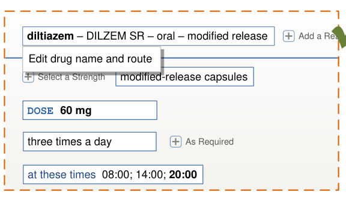

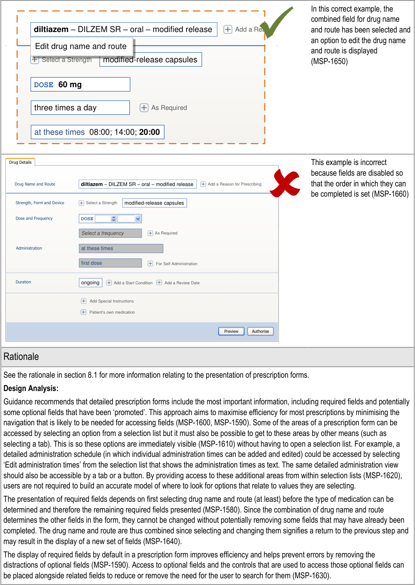

|diltiazem – DILZEM SR – oral – modified release|Col2|
|---|---|
|||
|   ~~Edit drug name and route~~|   ~~Edit drug name and route~~|
|   ~~Edit drug name and route~~||
|||

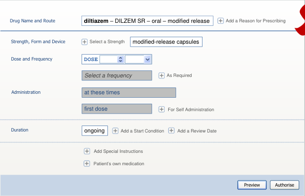

Page 139

Copyright ©2013 Health and Social Care Information Centre

HSCIC Controlled Document

Unlike the step by step, cascading list or template prescription parts of the prescribing process, a detailed prescription does not impose
an order on the entry of information in fields. A detailed prescription form is more likely to be used when a less common prescription is
being defined. Some of the fields are inter-related so the optimal way of completing a prescription may be different from one
prescription to another. Imposing an order would remove this flexibility and thus also remove the opportunity for a more efficient way of
completing the prescription (MSP-1660, MSP-1670).

**Desk Research:**

The guidance for a detailed prescription form follows the user interface principles of ‘chunking’ and prioritising (see the rationale in
section 9.3.3).

Guidance in this section is informed by the following Nielsen heuristics **{R17}** :

 Flexibility and efficiency of use – A detailed prescription presents as little information as possible to focus attention on what needs

to be completed and removes distractions

 User control and freedom – Although input controls for only the required fields are displayed by default, the prescriber has access

to optional attributes and additional fields. The prescriber may also choose to complete the input controls in a different order to the
one in which they are presented

**User Research:**

Study ID 67 (see APPENDIX D) includes the recommendation that brand name should not be displayed in the working area of a
prescription form unless it is mandatory. A brand name will generally be selected in a search results list or a template prescription so
when a brand name is mandatory (or has been explicitly selected) it will be known and displayed alongside the generic name in a
prescription form. Thus, a brand name is only likely to be changed by reopening a list of template prescriptions (see section 7.3.5) or
by clearing the current drug and starting again (MSP-1650).

Study ID 68 (see APPENDIX C) identified the need to limit optional fields that are presented by default (so that they are less likely to
be filled in unnecessarily) and to allow easy access to an appropriate set of optional fields.

**Hazard Risk Analysis Summary:**

From our Patient Safety Risk Assessment analyses, we identified a number of potential hazards, including the following key risks
which are mitigated by the guidance:

**Potential Hazards:**

 The name of the drug being prescribed

is not noticed at the top of the form and
is not the intended drug

 The prescriber cannot tell which fields

are required and which are optional

 Optional information is missed from a

prescription because the prescriber
could not find the control for accessing
optional fields or other areas of the
detailed prescription

**Mitigations:**

 The options presented after a drug is selected are filtered to be relevant to that

drug (see section 6.3.1)

 The drug name remains at the top of the form when switching to a detailed

prescription and is visible throughout, even when the prescription is long enough
to need a scroll bar (see section 8.3.3)

 In principle, the prescription form only shows required fields (MSP-1590)

 Optional fields are accessed by clicking on a different style of control (see

section 8.3.4)

 Controls for accessing optional fields are displayed in a consistent order (see

section 8.3.1)

 Controls should be provided for all areas of a detailed prescription form such that

there is no area that can only be accessed by selecting an item from a selection
list (MSP-1620)

 Controls for optional fields are displayed alongside required fields (MSP-1630)

 Controls for accessing optional fields are placed where the optional field appears

when it is displayed (see section 8.3.4)

Page 140

Copyright ©2013 Health and Social Care Information Centre

HSCIC Controlled Document

##### **8.3.3 Structuring a Detailed Prescription**

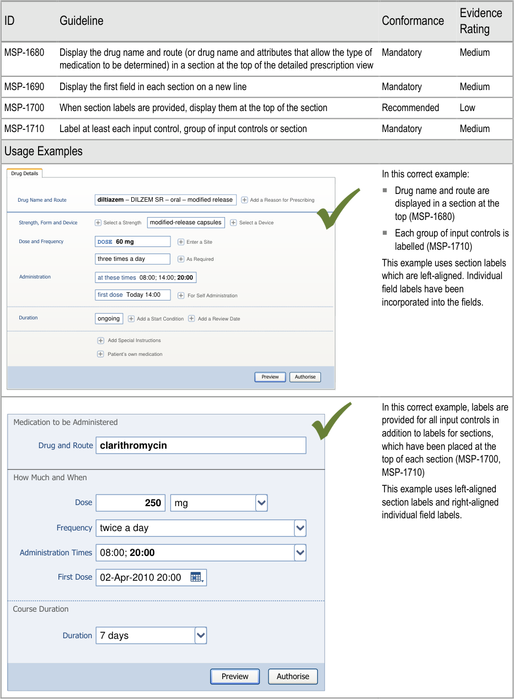

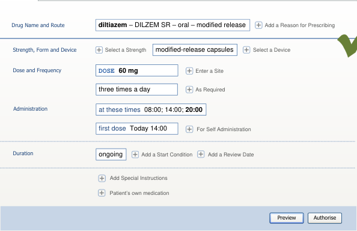

Page 141

Copyright ©2013 Health and Social Care Information Centre

HSCIC Controlled Document

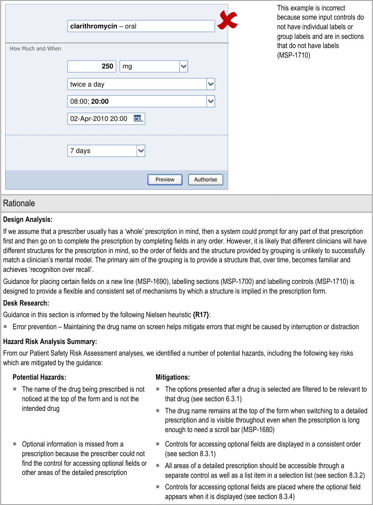

Page 142

Copyright ©2013 Health and Social Care Information Centre

HSCIC Controlled Document

##### **8.3.4 Displaying Required and Optional Fields**

This section includes guidance for how to display required and optional fields and to communicate
which fields must be completed before a prescription can be authorised.

When a detailed prescription form is presented, the required fields are displayed by default. Also
displayed are controls for accessing optional fields and, when those controls are selected, the
optional fields appear alongside the required fields. This approach is based on the assumption (see
section 1.3) that the majority of prescriptions will be completed using template prescriptions and
that most of the time only a few optional fields may be needed. However, in some cases, additional
specific fields or more detailed prescriptions may be needed and forms with a larger number of
fields would be required to support these.

This section refers to three types of control:

1. Controls for accessing individual (or very small groups) of optional fields. These controls

are defined by guidance in this section

2. Controls for accessing small sets of fields (see Figure 23)

3. Controls (such as tabs or buttons) for accessing large sets of fields (see Figure 24 and

Figure 25).

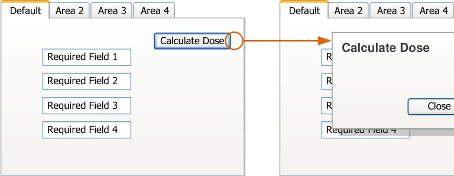

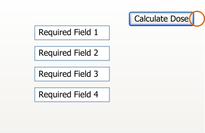

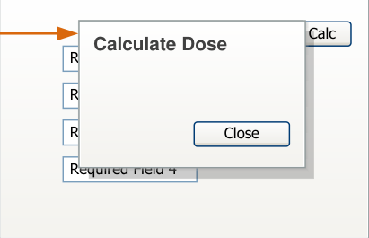

|Dose Calculate Dose equired Field 1 equired Field 2 equired Field 3 Close|Col2|Col3|
|---|---|---|
|equired Field 1 equired Field 2 equired Field 3   Dose **Calculate Dose** Close|quired Field 1 quired Field 2 quired Field 3   Dos **Calculate Dose** Close|quired Field 1 quired Field 2 quired Field 3   Dos **Calculate Dose** Close|
|e|e|e|

Figure 23: Accessing Small Sets of Fields

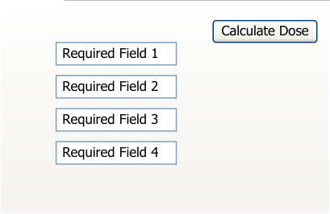

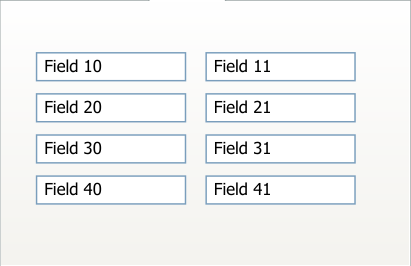

Figure 24: Using a Tab to Access a Large Set of Fields

Copyright ©2013 Health and Social Care Information Centre

Page 143

HSCIC Controlled Document

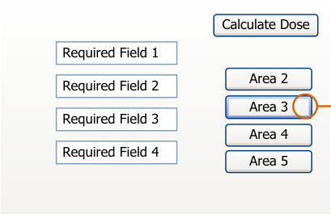

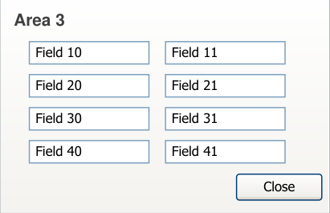

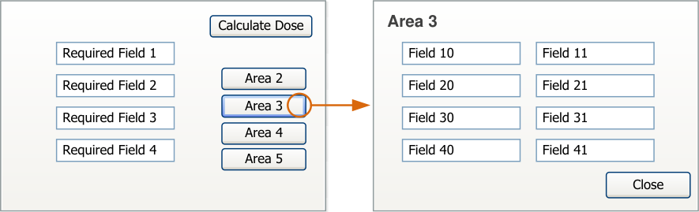

Figure 25: Using a Button to Access a Large Set of Fields

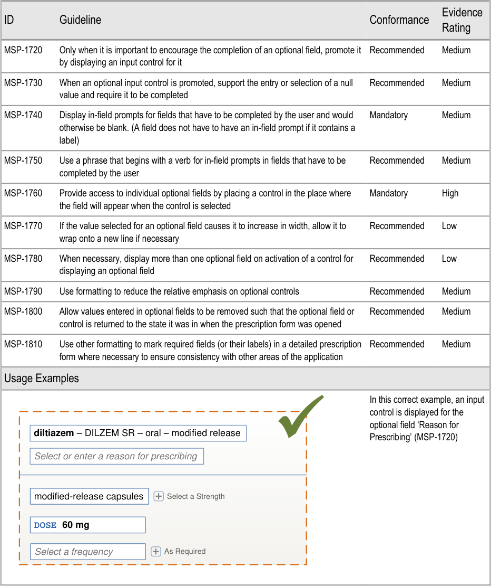

Page 144

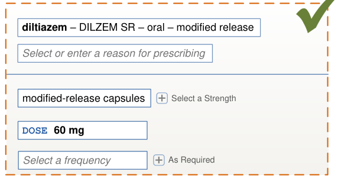

Copyright ©2013 Health and Social Care Information Centre

HSCIC Controlled Document

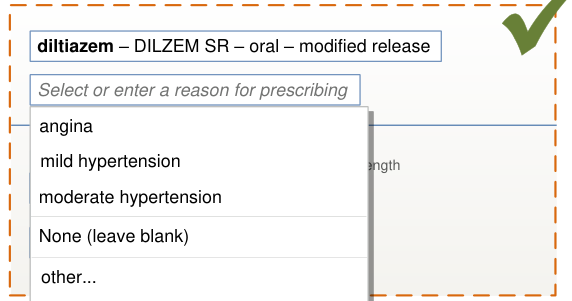

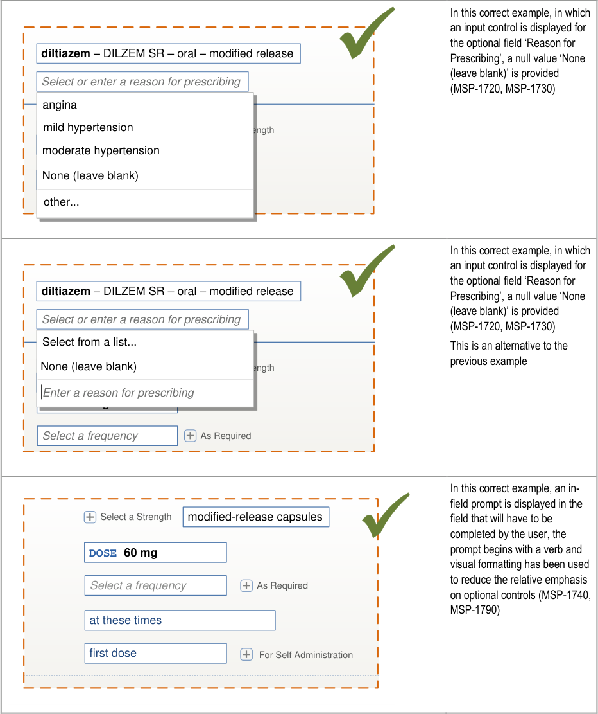

|diltiazem – DILZEM SR – oral – modified release Select or enter a reason for prescribing|Col2|Col3|Col4|
|---|---|---|---|
|**diltiazem**– DILZEM SR – oral – modified release _Select or enter a reason for prescribing_ |_Select or enter a reason for prescribing_|_Select or enter a reason for prescribing_|_Select or enter a reason for prescribing_|
|**diltiazem**– DILZEM SR – oral – modified release _Select or enter a reason for prescribing_ ||||
||Select a Str    modified-release capsules modified-release capsules ~~angina~~ mild hypertension moderate hypertension|Select a Str    modified-release capsules modified-release capsules ~~angina~~ mild hypertension moderate hypertension|ength|
||~~**`DOSE`**~~ ~~**60 mg**~~ **`DOSE`** **60 mg** None (leave blank)|||
||As Required _Select a frequency_ other...|As Required _Select a frequency_ other...|As Required _Select a frequency_ other...|
|||||

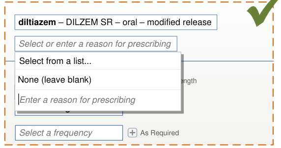

|Select or enter a reason for prescribing|Col2|
|---|---|
|~~Select from a list...~~|~~Select from a list...~~|
|||
|Select a Str modified-release capsules   None (leave blank)|Select a Str modified-release capsules   None (leave blank)|
|**`DOSE`** **60 mg** ~~modified-release capsules~~ _Enter a reason for prescribin_|_    g_|

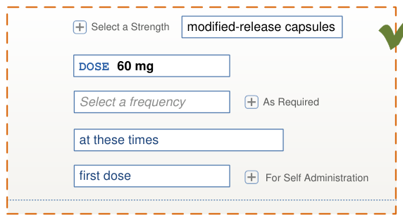

Page 145

Copyright ©2013 Health and Social Care Information Centre

HSCIC Controlled Document

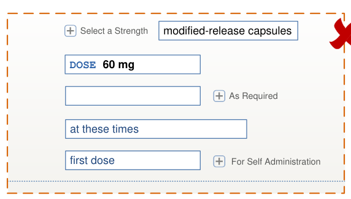

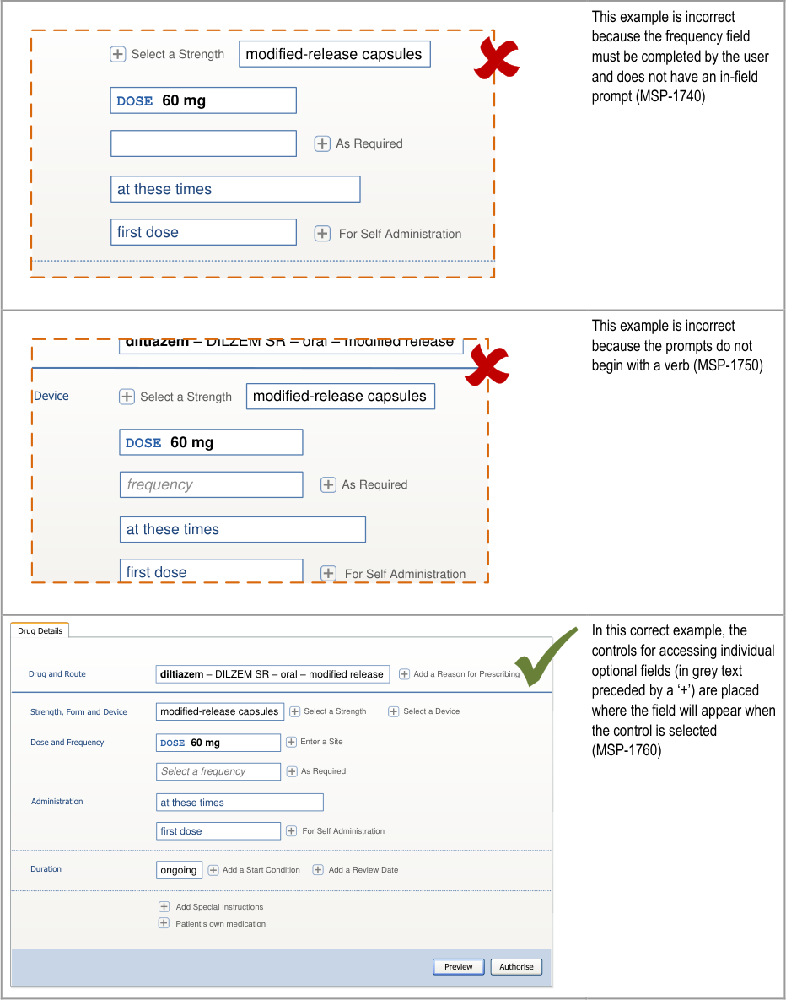

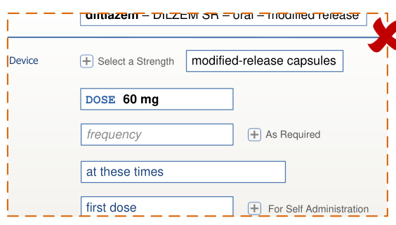

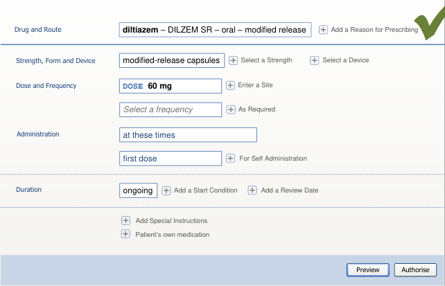

Page 146

Copyright ©2013 Health and Social Care Information Centre

HSCIC Controlled Document

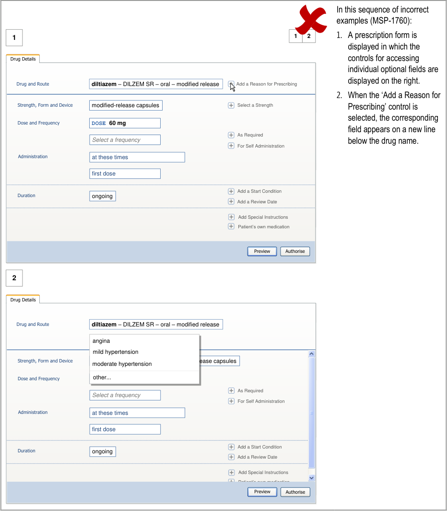

Page 147

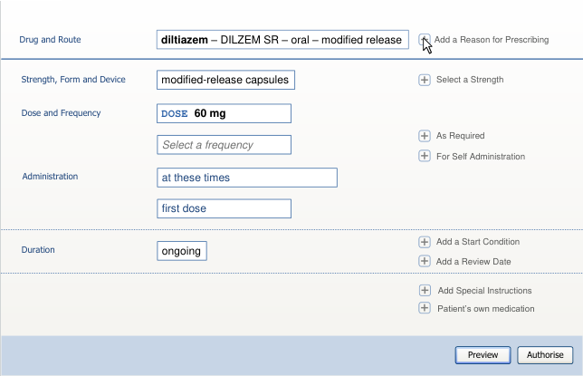

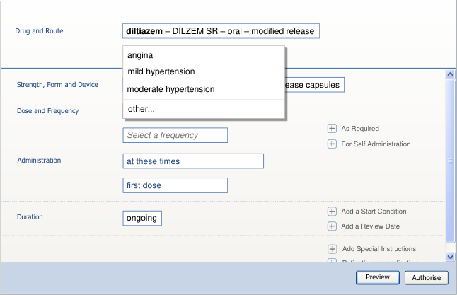

Copyright ©2013 Health and Social Care Information Centre

HSCIC Controlled Document

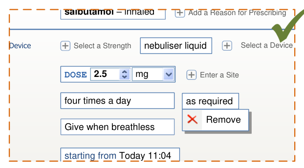

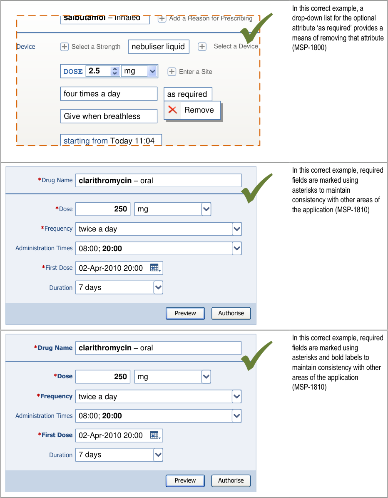

Page 148

Copyright ©2013 Health and Social Care Information Centre

HSCIC Controlled Document

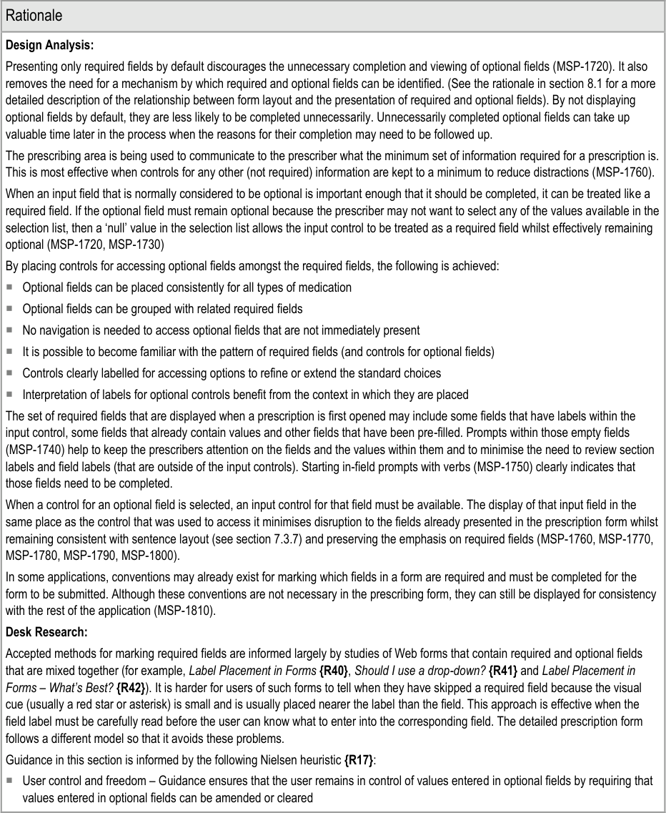

Page 149

Copyright ©2013 Health and Social Care Information Centre

HSCIC Controlled Document

**User Research:**

All 14 participants in Study ID 69 (see APPENDIX B) preferred to avoid a prescription form in which the layout of fields is absolutely
identical for all drugs. Fields in this design of a prescription form were enabled or disabled depending on the drug being prescribed.

The primary reasons they gave for their preference were:

 They did not know where they had to enter information

 They incorrectly tried to enter values in the wrong field

 The process was, or appeared to be, longer

 The disabled fields were a distraction

Guidance for cascading lists (section 6) and template prescriptions (section 7), dynamic layout of prescription forms (section 8.1) and
required fields versus optional fields (MSP-1720, MSP-1790) are designed to focus attention on the fields that are relevant, thus
avoiding the distraction caused by fields that do not need to (or cannot) be filled

**Hazard Risk Analysis Summary:**

From our Patient Safety Risk Assessment analyses, we identified a number of potential hazards, including the following key risks
which are mitigated by the guidance:

**Potential Hazards:**

 When optional attributes are specified unnecessarily,

the need for clarification may delay treatment

 Important information is not included in the

prescription because only required fields were
presented

 Presentation of both required and optional input

controls slows the process of prescribing

 Prescriber can’t work out why the prescription can’t be

authorised

 The prescriber cannot tell which fields are required

and which are optional

 Optional information is missed from a prescription

because the prescriber could not find the control for
accessing optional fields or other areas of the detailed
prescription

**Mitigations:**

 The unnecessary completion of optional fields is discouraged by not

displaying them by default (see section 8) and requiring an
additional selection before they are displayed (MSP-1760)

 The definition of drug name and route before a detailed prescription

form can be displayed (see section 8) ensures only the appropriate
(required) input fields are displayed

 Controls for accessing optional fields (MSP-1760) must be

consistently placed and presented (see section 8.1)

 Optional fields are not displayed by default (see section 8.1)

 Prompts are displayed in required input controls until they are

populated with a value (MSP-1740)

 In principle, the prescription form only shows required fields (see

section 8)

 Optional fields are accessed by clicking on a different style of

control (MSP-1760)

 Controls for accessing optional fields are displayed in a consistent

order (see section 8.3.1)

 Controls should be provided for all areas of a detailed prescription

form such that there is no area that can only be accessed by
selecting an item from a selection list (MSP-1620)

 Controls for optional fields are displayed alongside required fields

(MSP-1630)

 Controls for accessing optional fields are placed where the optional

field appears when it is displayed (see section 8.3.4)

Page 150

Copyright ©2013 Health and Social Care Information Centre

HSCIC Controlled Document

### 9 GUIDANCE DETAILS FOR INPUT CONTROLS

#### **9.1 Introduction**

This section contains guidance for the display of input controls and guidance for particular types of
controls such as selection lists.

Figure 26 shows the full user interface prescribing process in which the steps covered in this

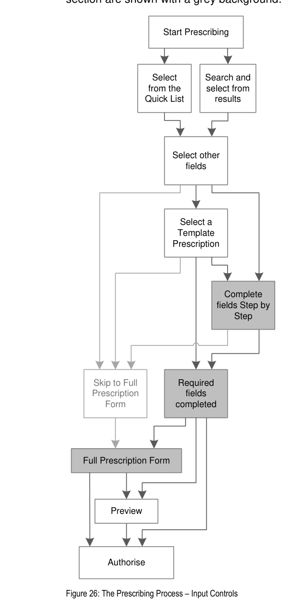

Page 151

Copyright ©2013 Health and Social Care Information Centre

HSCIC Controlled Document

Figure 27 is an extract from Figure 5 to illustrate the user interface prescribing steps that are
covered in this section showing the step-by-step alternative to template prescriptions and the
remaining steps for completing a prescription:

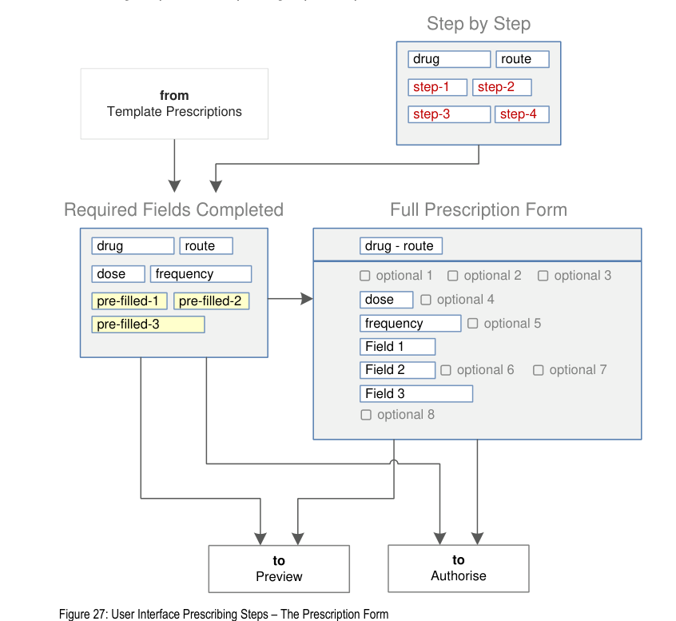

The contents of a prescription form depend on the type of medication being prescribed and this
determines which attributes are required and thus which input controls will be displayed. The
prescription form is thus dynamic.

There are three aspects of a prescription form that can be considered to be ‘dynamic’:

 The display of a set of input controls. The controls displayed will depend on the type of

medication being prescribed (see section 9.3.1)

 Input controls that may appear when a value is defined in another input control (see

section 9.3.1)

 Input controls that may be pre-filled depending on selections elsewhere in the form (see

section 9.3.5)

 Input controls whose dimensions may change as the form or field is completed (see

section 7.3.7)

Figure 28 and Figure 29 show detailed prescription forms for two different types of medication that
have different sets of required fields.

Page 152

Copyright ©2013 Health and Social Care Information Centre

HSCIC Controlled Document

The oral — modified-release medication in Figure 28 requires a brand name and a dose:

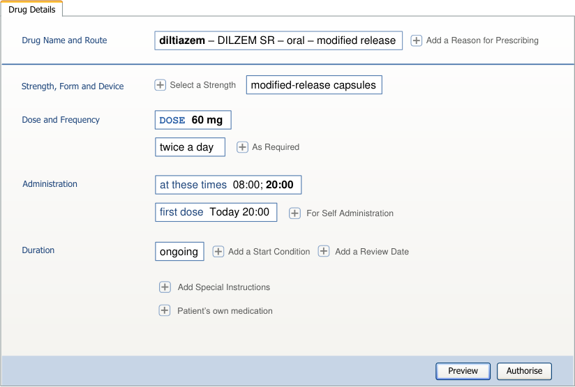

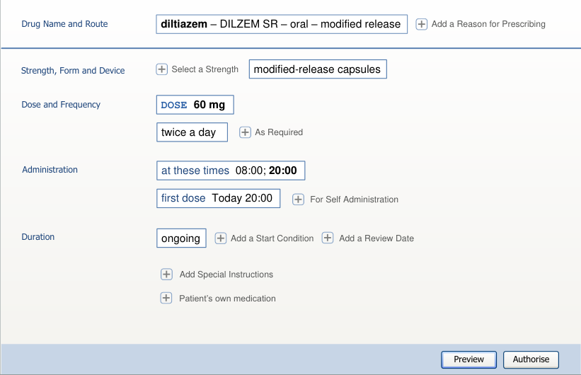

Figure 28: Detailed Prescription Showing a Set of Fields for an Oral — Modified-Release Medication

The topical medication in Figure 29 does not require a brand name but does require a method, a
strength and site:

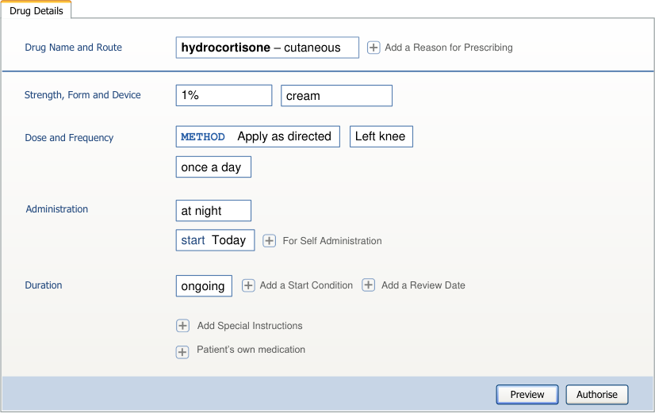

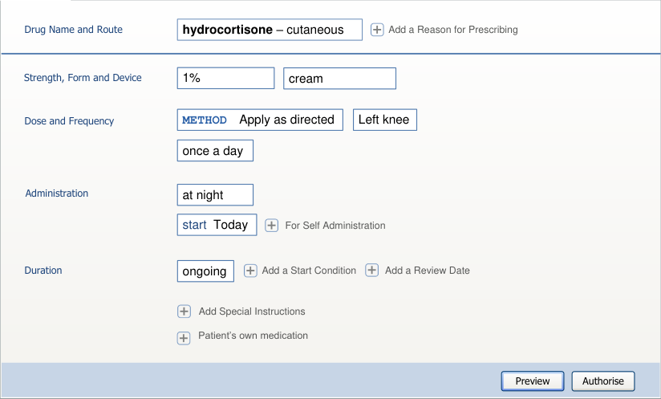

Figure 29: Detailed Prescription Showing a Set of Fields for a Topical Medication (Unlicensed Route)

Copyright ©2013 Health and Social Care Information Centre

Page 153

HSCIC Controlled Document

#### **9.2 Principles**

All guidance is informed by all of the principles for search and prescribe listed in section 2.1. The
following are particularly relevant to this section:

 Maximise safety in the absence of decision support systems by designing for the reduction

of errors from invalid or inappropriate selections or entries:

 Since options available in selection lists are dependent on values in other input fields,

the opportunity for inappropriate selections or invalid combinations is reduced

 Encourage simplicity of design by promoting user interface approaches that help to avoid

overly complex displays and interactions that require many controls:

 Prescribing forms are initially presented with as few controls as possible and it is up to

the prescriber to progressively reveal the less frequently used options and controls
associated with them

 Maximise flexibility and scalability of both the way that the prescribing process is

supported by the user interface and the dimensions of the spaces in which prescribing
takes place:

 The prescribing process is flexible so that it can support a short path through the

process and many potential different longer paths

 Additional screens can be incorporated into a detailed prescription form so that many

sets of input controls can be included in a prescription if necessary

 Manage users expectations and improve their efficiency by providing a clear framework

with consistent logic for the placement of user interface elements and the interactions
that they support:

 In the absence of template prescriptions, the parts that might make up a template

prescription are simply revealed step by step

 Input fields in a prescription form are placed using the same logic that is used to place

drug search results, cascading lists and template prescriptions

 As far as possible, all input controls use the interaction model that is familiar from

selection list interaction model similar to that of drop-down lists, combo boxes, menus
with submenus (see _Windows User Experience Interaction Guidelines_ **{R26}** ) or column
views (see _Apple Human Interface Guidelines_ **{R44}** )

 Minimise the potential for important information to be hidden from view:

 Prescription forms begin by presenting input controls for the minimum required

information and progressively reveal further input controls on demand

 Adhere to a user interface strategy that gives the impression of making progress within a

single space (which has all the necessary information immediately or readily available) and
avoids the impression of needing to move between many different spaces:

 The prescription allows most prescriptions to be completed within a small space whilst

providing access to a more detailed view at any point after the type of medication has
been established

Page 154

Copyright ©2013 Health and Social Care Information Centre

HSCIC Controlled Document

 Navigation to additional spaces is only necessary for more complex prescriptions,

detailed editing of administration schedules or for unusual attributes or combinations
of attributes

#### **9.3 Guidelines**

**Important**

The usage examples in this section include examples of sets of fields, some of which are shown as
required and some as optional. These examples are illustrative only and are not intended to provide
guidance on which fields should be available for specific types of medication nor which fields should be
required or optional.

##### **9.3.1 Using Dynamic Controls**

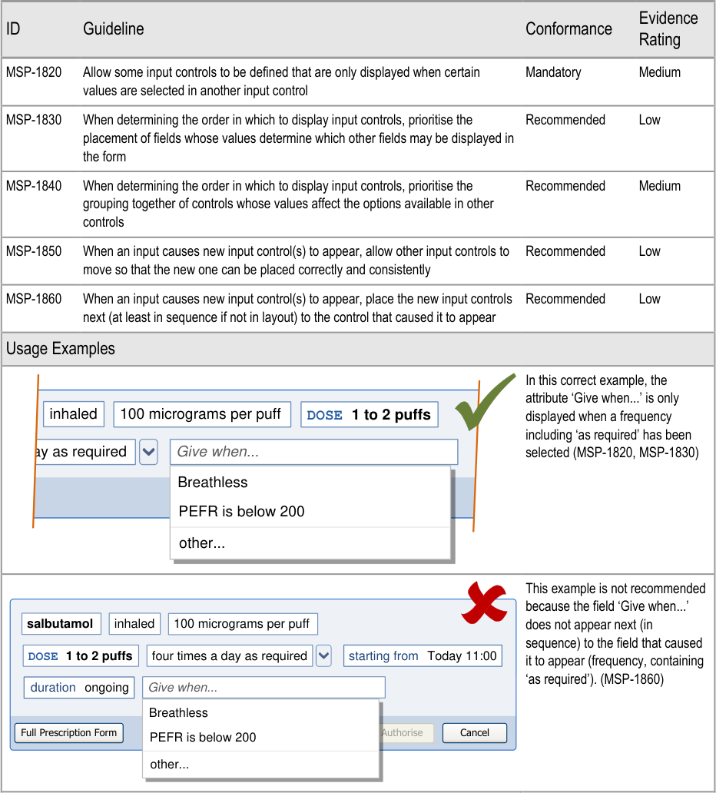

Page 155

Copyright ©2013 Health and Social Care Information Centre

HSCIC Controlled Document

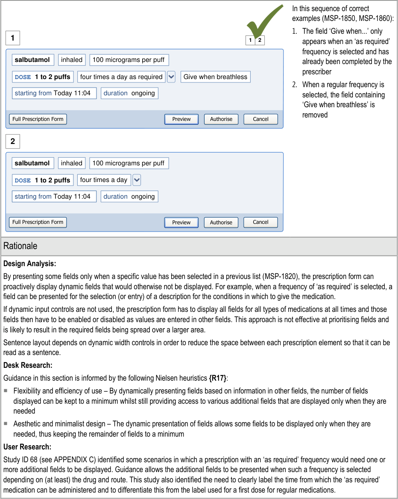

##### **9.3.2 Presenting Selection Lists in Prescription forms**

Selection lists can be used to speed up the entry of prescription information by presenting
predefined sets of choices in a list that might otherwise have to be presented as a series of
separate input controls. For example, when entering a dose, a selection list could contain a
predefined list of dose values and units. Alternatively, it could present a free-text box for the dose
amount and a selection list for the dose units. If the predefined sets of doses are appropriate, the
former approach is faster and potentially safer than the latter approach of typing in the amount in
digits and then selecting a unit (such as milligrams or grams).

Page 156

Copyright ©2013 Health and Social Care Information Centre

HSCIC Controlled Document

This section includes illustrations (such as those in Table 9) that show dose units (such as ‘mg’ and
‘g’) in lists that are not ordered alphabetically. The display of dose values in alphanumeric order
can result in selection lists with options such as those in Figure 30. This illustration shows a high
value dose (such as 1 g) listed next to a much lower value dose (such as 15 mg) and highlights the
patient safety risks associated with lists ordered in this way. The research necessary to provide
guidance for this area is not within the scope of this work so there is no guidance in this document
for mitigating this risk.

**`DOSE`** **120 mg**

**`DOSE`** **125 mg**

**`DOSE`** **15 mg**

**`DOSE`** **1 g**

**`DOSE`** **240 mg**

**`DOSE`** **250 mg**

**`DOSE`** **30 mg**

**`DOSE`** **500 mg**

**`DOSE`** **60 mg**

Figure 30: Example of a List of Dose Values in Alphanumeric Order

Table 9 illustrates a set of alternative input control styles for entering a dose. The table shows a
progression from a simple set of separate input boxes through to a more sophisticated selection list
with predefined values and a list item that includes a nested text entry box.

Style Visual Summary Description

1

2

3

**Two text entry boxes**

This approach, combined with form validation to check the
combination of the dose value and the dose unit, may be preferred
when the selection of appropriate dose units is high risk. Form
validation and confirmation from the user may be safer in this context
than a pre-populated selection list.

This approach is not recommended in the absence of sophisticated
form validation dependent on a knowledgebase that performs
extensive checks on the values entered.

**A text entry box combined with a selection list**

A text entry box for a dose may be necessary when it is not
appropriate or safe to display predefined dose values in a list. The
dose entered will need to be validated by the system and/or
confirmed by the user.

**A spin control and a predefined dose unit**

This approach may be appropriate for drugs with a narrow range of
valid doses.

Page 157

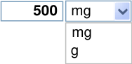

Copyright ©2013 Health and Social Care Information Centre

HSCIC Controlled Document

Style Visual Summary Description

4

5

**A selection list containing predefined sets of values**

When it is possible to define the dose values that are commonly used
and are appropriate for this drug, a pre-populated list can be
effectively used to improve efficiency and require additional effort to
define unusual dose values.

Risks are reduced when it is possible to combine this approach with
validation that checks the combination of prescription values and that
those values are appropriate for the patient.

**A selection list containing predefined sets of values including a**
**list item that combines a text entry box with a predefined value.**

This approach combines style 2 with style 4 but with predefined dose
units. It thus encourages selection rather than text entry whilst
allowing both so that any dose value can be entered.

|DOSE|Col2|
|---|---|
|**`DOSE` 500 mg**  **`DOSE` 1 g**|**`DOSE` 500 mg**  **`DOSE` 1 g**|
|other...|other...|

|DOSE|Col2|
|---|---|
|**`DOSE` 500 mg**  **`DOSE` 1 g**|**`DOSE` 500 mg**  **`DOSE` 1 g**|
|**`DOSE` ** **mg**|**`DOSE` ** **mg**|

Table 9: Alternative Input Controls for Entering a Dose

Whilst each of these styles may be appropriate in specific circumstances, guidance promotes the
use of controls such as styles 4 and 5. It is recommended to use these styles wherever possible to
improve efficiency by allowing more than one value to be defined with a single selection and to help
limit choices to predefined values and valid combinations. Styles 1, 2 and 3 need to be combined
with form validation to check that values entered in the dose and dose unit fields are valid for the
drug and for the values entered for other attributes.

The use of controls such as styles 4 and 5 depends on the availability of predefined dose values. In
most cases, a dose value is expected to be selected as part of a template prescription and has thus
been predefined along with the other attributes in the template prescription. If a selection list
containing predefined doses is displayed independently of other attributes (as part of a step by step
process, see section 7.3.6), it can be pre-filled based on the drug name and attributes selected in
cascading lists. However, if a dose selection list is displayed after values have been entered for
attributes such as strength and frequency, it may no longer be valid to display those values. See
section 9.3.4 for guidance on inter-related fields and see the rationale in that section for the
associated hazards.

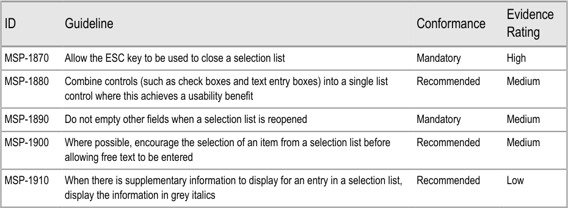

Page 158

Copyright ©2013 Health and Social Care Information Centre

HSCIC Controlled Document

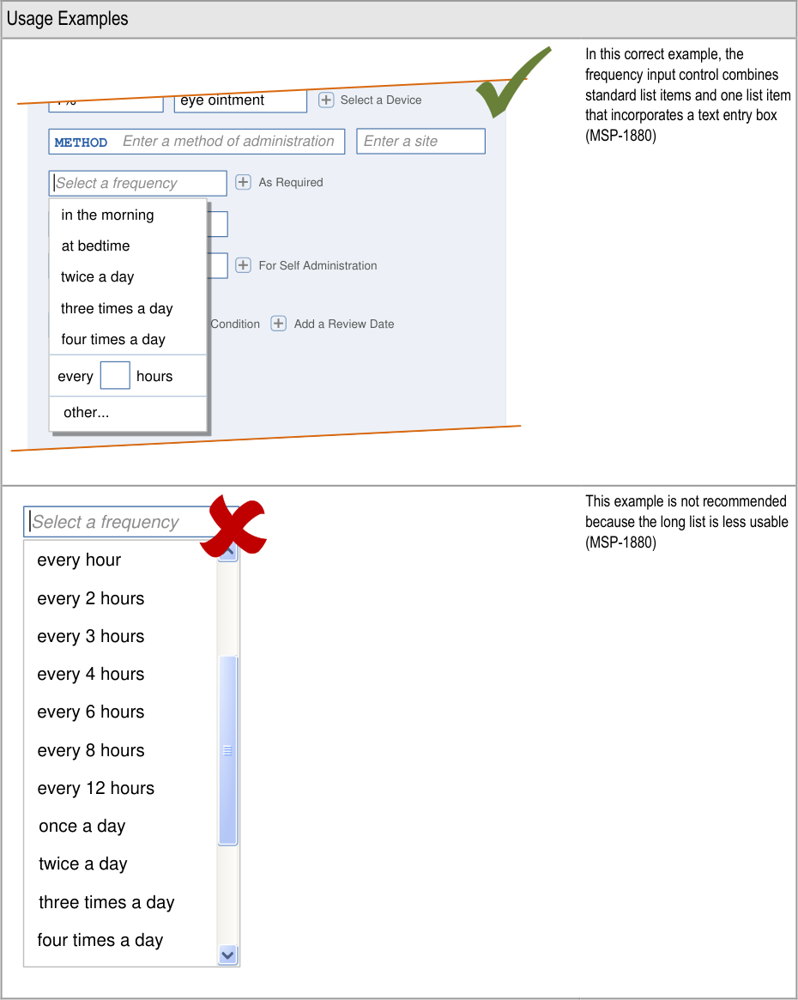

Page 159

|s|a|
|---|---|
|||
|||

Copyright ©2013 Health and Social Care Information Centre

HSCIC Controlled Document

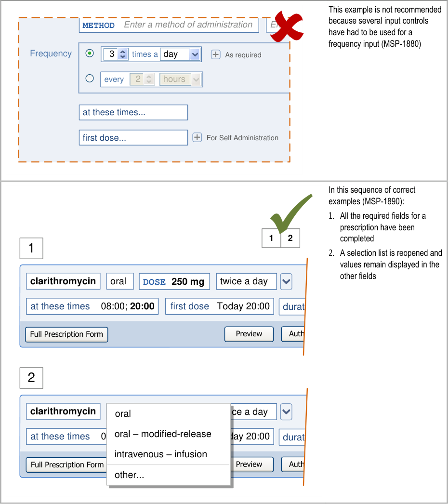

|Col1|Col2|Col3|Col4|Col5|
|---|---|---|---|---|
|first dose... at these times... **`METHOD`** _Enter a method of administration_ _Enter_ For Self Administration Frequency 3 day times a 2 hours every As required|first dose... at these times... **`METHOD`** _Enter a method of administration_ _Enter_ For Self Administration Frequency 3 day times a 2 hours every As required|_Enter_|||
|first dose... at these times... **`METHOD`** _Enter a method of administration_ _Enter_ For Self Administration Frequency 3 day times a 2 hours every As required|first dose... at these times... **`METHOD`** _Enter a method of administration_ _Enter_ For Self Administration Frequency 3 day times a 2 hours every As required|_Enter_|||
|first dose... at these times... **`METHOD`** _Enter a method of administration_ _Enter_ For Self Administration Frequency 3 day times a 2 hours every As required|3 day times a 2 hours every As required|3 day times a 2 hours every As required|||

Page 160

Copyright ©2013 Health and Social Care Information Centre

HSCIC Controlled Document

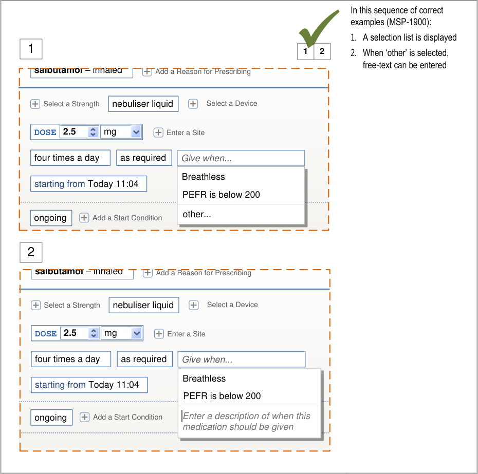

Page 161

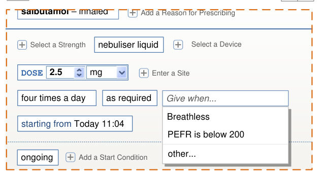

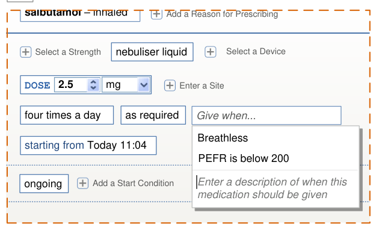

|salbutamol – inhaled Add a Reason for Prescribing|Col2|Col3|
|---|---|---|
|Select a Strength Enter a Site nebuliser liquid Select a Device **`DOSE`** **2.5** mg starting fromToday 11:04 four times a day as required _Give when..._ Breathless PEFR is below 200|Select a Strength Enter a Site nebuliser liquid Select a Device **`DOSE`** **2.5** mg starting fromToday 11:04 four times a day as required _Give when..._ Breathless PEFR is below 200|Select a Strength Enter a Site nebuliser liquid Select a Device **`DOSE`** **2.5** mg starting fromToday 11:04 four times a day as required _Give when..._ Breathless PEFR is below 200|
|Select a Strength Enter a Site nebuliser liquid Select a Device **`DOSE`** **2.5** mg starting fromToday 11:04 four times a day as required _Give when..._ Breathless PEFR is below 200|_Give when..._|_Give when..._|
|Select a Strength Enter a Site nebuliser liquid Select a Device **`DOSE`** **2.5** mg starting fromToday 11:04 four times a day as required _Give when..._ Breathless PEFR is below 200|Breathless PEFR is below 200|Breathless PEFR is below 200|
|ongoing Add a Start Condition|||
|ongoing Add a Start Condition|_Enter a description of when this_ _medication should be given_|_Enter a description of when this_ _medication should be given_|
||||

Copyright ©2013 Health and Social Care Information Centre

HSCIC Controlled Document

|Col1|In this sequence of correct examples (MSP-1900): 1. A selection list is displayed 1 1 2 2. When ‘other’ is selected, salbutamol – inhaled Add a Reason for Prescribing free-text can be entered This is an alternative to the previous example. Select a Strength nebuliser liquid Select a Device DOSE 2.5 mg Enter a Site four times a day as required Give when... Breathless starting from Today 11:04 PEFR is below 200 other... ongoing Add a Start Condition 2 salbutamol – inhaled Add a Reason for Prescribing Select a Strength nebuliser liquid Select a Device DOSE 2.5 mg Enter a Site four times a day as required Give when... Enter a description of when this starting from Today 11:04 medication should be given ongoing Add a Start Condition|
|---|---|
|| This example is not recommended because free-text must be entered and there is no opportunity to make a selection from a list (MSP-1900) Authorise inhaled **`DOSE`** **1 to 2 puffs** 100 micrograms per puff day as required When to give this as required medication _Enter a description of when this_ _medication should be given_|
|| In this correct example, supplementary information is included in the list and has been displayed in grey italics (MSP-1910)  Frequency ration twice a day ongoing Add an Additional On first dose Today 20:00 at these times 08:00;**20:00** Add a Review Date Add a Start Condition 08:00; 20:00 10:00; 22:00 Edit administration times... _Standard times_ _Non-standard times_ **`METHOD`** Apply as directed Left knee|

Page 162

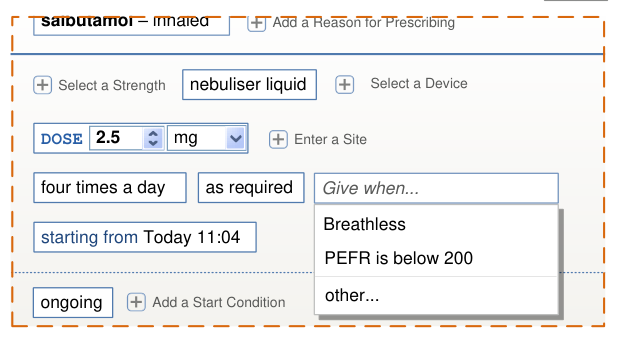

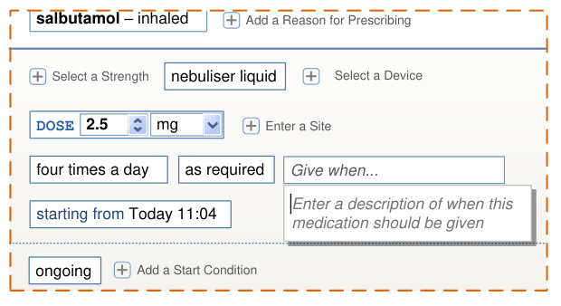

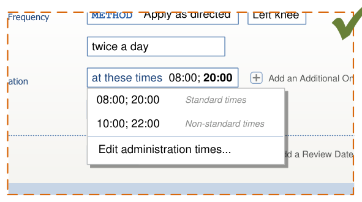

Copyright ©2013 Health and Social Care Information Centre

HSCIC Controlled Document

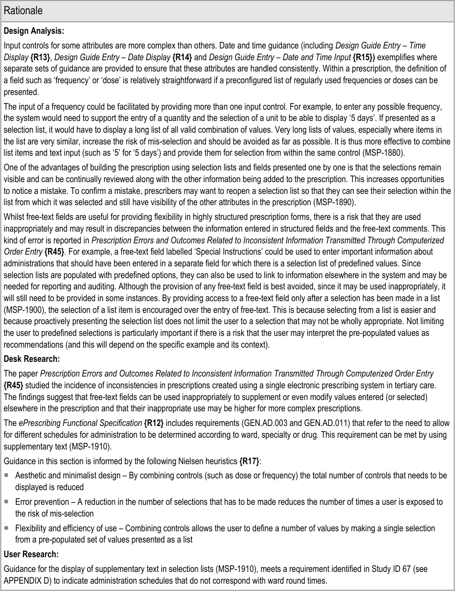

Page 163

Copyright ©2013 Health and Social Care Information Centre

HSCIC Controlled Document

**Hazard Risk Analysis Summary:**

From our Patient Safety Risk Assessment analyses, we identified a number of potential hazards, including the following key risks,
some of which are mitigated by the design and one that is not mitigated by guidance

**Potential Hazards:**

 A selection list in the prescribing area may obscure

important information in a list of current medications

 Important information about a prescription is not carried

forward into other medications views because it was
entered into a free-text field instead of a structured field

 A prescription is not wholly reviewed because the

information is displayed in different formats, split across
many different controls

 Individual administration times have to be defined by

the prescriber and result in non-standard times

 A large dose value is mis-selected because it is

displayed adjacent to the intended small dose value in
a selection list ordered alphanumerically

**Mitigations:**

 Selection lists can collapse once a selection has been made if

necessary to preserve visibility of other information (see
section 6.3.2)

 MSP-1900 recommends that,wherever possible, drop-down lists

are presented before free-text can be entered

 Guidance recommends that the number of different types of

controls are minimised, which reduces the different formats used
to display it (see section 8.1)

 Selection lists are used to combine values (such as those in a

template prescription) and display them a format similar to that
displayed in a medication line (see section 7.3.3)

 MSP-1880 recommends combining controls into a single control

 MSP-1910 recommends the use of grey italic text for

supplementary information and this could be used to indicate
when an administration schedule is non-standard

 **This risk is not mitigated by guidance**

##### **9.3.3 Using Selection Lists to Prioritise**

When a selection list is used to enter values for a prescription, more common values can be placed
at the top of the list so that they are easier to find. This process of placing such values at the top of
the list is referred as ‘prioritisation’ and this section provides guidance for prioritising selection lists
that may be presented in any part of the prescribing process.

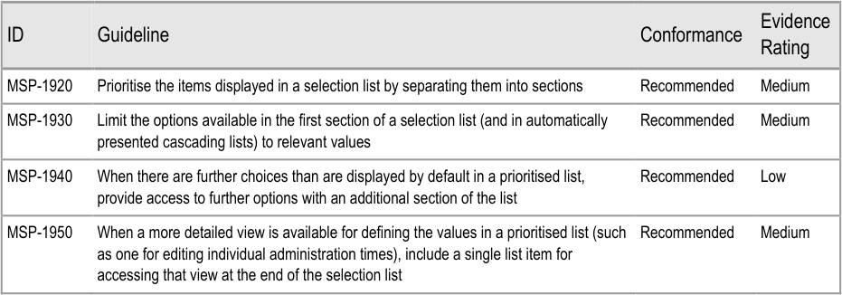

Page 164

Copyright ©2013 Health and Social Care Information Centre

HSCIC Controlled Document

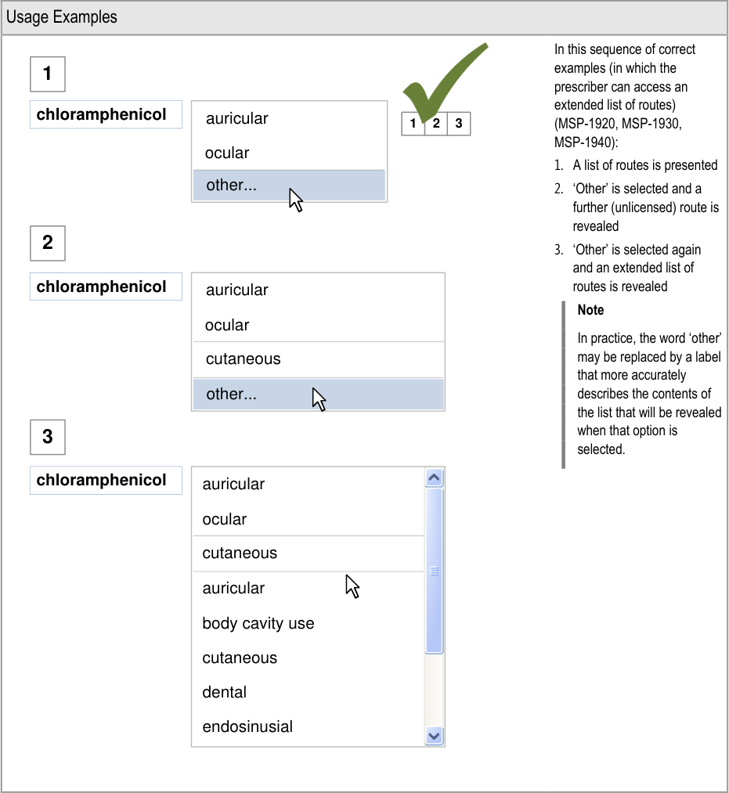

Page 165

Copyright ©2013 Health and Social Care Information Centre

HSCIC Controlled Document

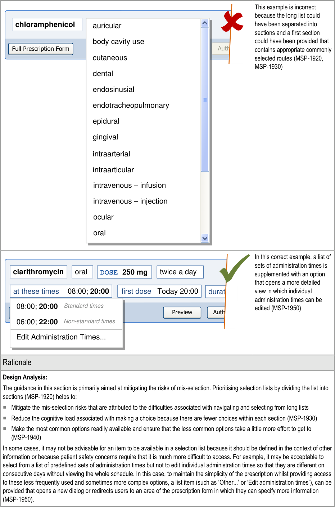

Page 166

Copyright ©2013 Health and Social Care Information Centre

HSCIC Controlled Document

**Desk Research:**

The use of sections in a selection list and the hiding of options that can be considered to be more ‘advanced’ help to break the
information into chunks. The use of ‘chunking’ and the principle of reducing load on short-term and working memory are described in
Shneiderman’s _Strategies for effective human-computer interaction_ **{R18}** .

MSP-1940 allows the prioritisation of routes that are normally prescribed whilst still allowing routes not normally associated with the
drug to be selected. This meets a requirement (GEN.OS.050) in the _ePrescribing Functional Specification_ **{R12}** to support prescribing
drugs using routes that are not normally associated with them. The prioritisation of routes can also be used as part of a mechanism
that meets the requirement (GEN.OS.062). The requirement is to be able to prioritise specific routes of administration for patients that
have reduced or unusual requirements but to still provide access to other routes (with reminders or alerts).

Guidance in this section is informed by the following Nielsen heuristics **{R17}** :

 Flexibility and efficiency of use – Selection lists can be prioritised so that the most likely (or most appropriate) values appear

towards the top, thus reducing the need for the complete list to be reviewed

 User control and freedom – Even though lists are prioritised, other options are available by making selections from the list that

reveal further choices

**User Research:**

Findings from Study ID 67 (see APPENDIX D) suggest that the ability to change the dose units (for example, from milligrams to grams)
introduces the risk that an incorrect unit (and therefore an incorrect dose) can be easily selected. Selection lists can be used to limit
the choices based on other values selected (MSP-1930) such that the dose units could be set to milligrams if appropriate and either
‘locked’, so that it cannot be changed, or displayed as the only value in the prioritised section of a selection list. An option such as
‘other’ can be provided to display an input control for changing the dose units.

**Hazard Risk Analysis Summary:**

From our Patient Safety Risk Assessment analyses, we identified a number of potential hazards, including the following key risks
which are mitigated by the guidance:

**Potential Hazards:**

 An antibiotic is prescribed

without an end date

**Mitigations:**

 Appropriate pre-filling of fields based on the drug name and route (see section 9.3.5)

 Prioritising options in selection lists (MSP-1920)

 A list item is mis-selected  Prioritising of selection lists to promote the most likely (or most appropriate) selection targets

to the top of the list (MSP-1920)

 Restricting options available in selection lists so that some selections are more difficult to

access than others (MSP-1930)

##### **9.3.4 Presenting Selection Lists for Inter-Related Fields**

This section includes guidance for the placement of fields with dynamic selection lists that may
contain different list items depending on selections made in other fields. It also includes guidance
for the behaviour of fields when a value is selected in a related field or a value is selected that
affects other fields.

Entering a value into a field may also cause a related field to be pre-filled. See section 9.3.5 for
guidance on pre-filling.

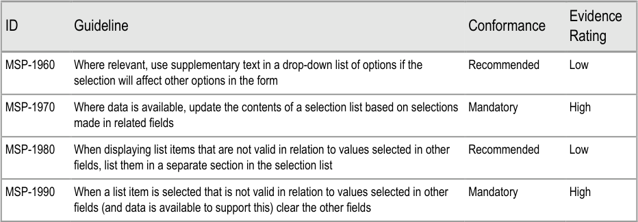

Page 167

Copyright ©2013 Health and Social Care Information Centre

HSCIC Controlled Document

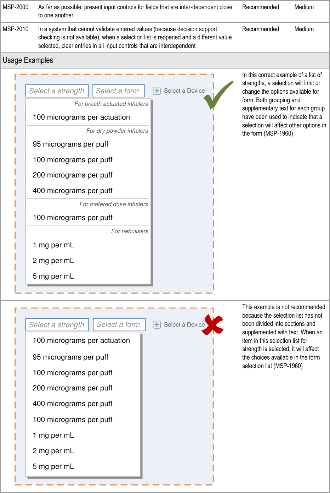

Page 168

|Select a strength|Select a form|
|---|---|
|100 micrograms per actuation 1 mg per mL 2 mg per mL 5 mg per mL 100 micrograms per puff 100 micrograms per puff 200 micrograms per puff 400 micrograms per puff 95 micrograms per puff|100 micrograms per actuation 1 mg per mL 2 mg per mL 5 mg per mL 100 micrograms per puff 100 micrograms per puff 200 micrograms per puff 400 micrograms per puff 95 micrograms per puff|

Copyright ©2013 Health and Social Care Information Centre

HSCIC Controlled Document

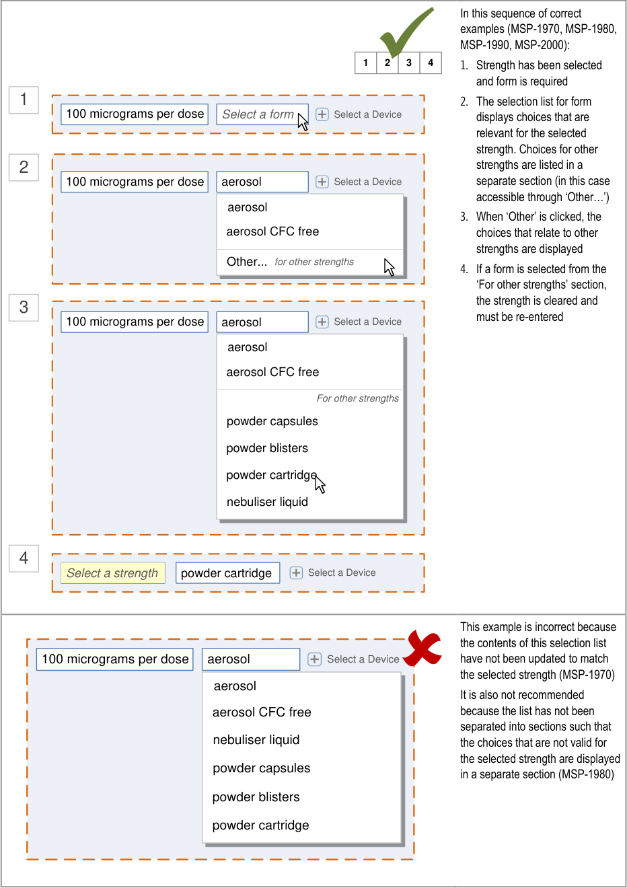

Page 169

Copyright ©2013 Health and Social Care Information Centre

HSCIC Controlled Document

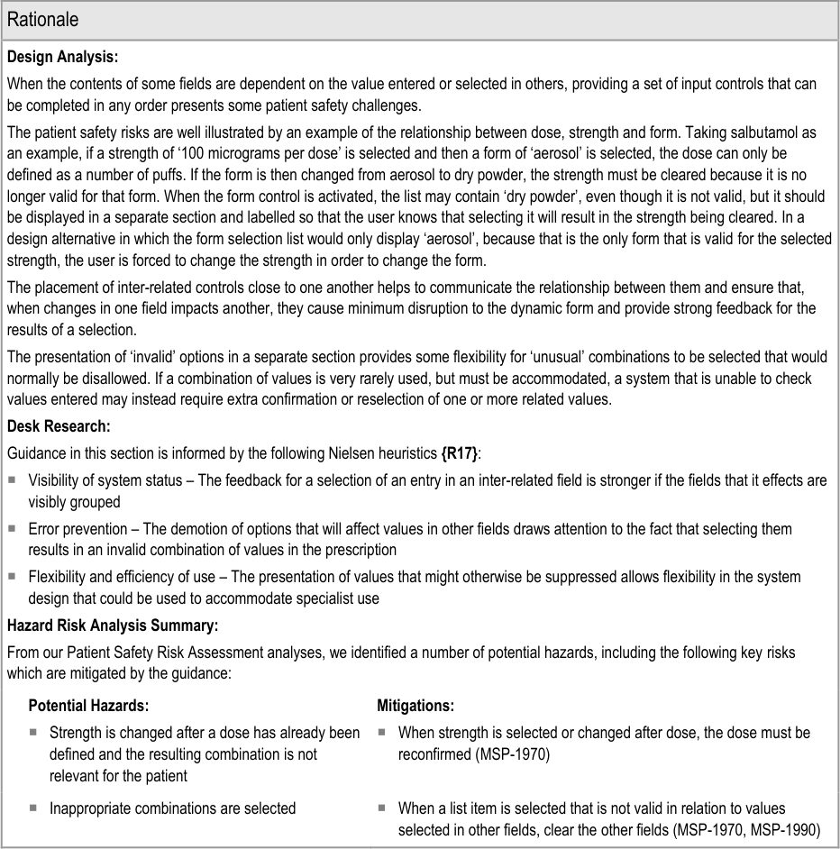

##### **9.3.5 Pre-Filling Input Controls**

This section contains guidance for presenting field that already contain a value and pre-filling fields
when values are defined in other fields.

Pre-filling input controls is most likely when fields are inter-related such that a value in one causes
the other to be pre-filled. See section 9.3.4 for guidance on inter-related fields.

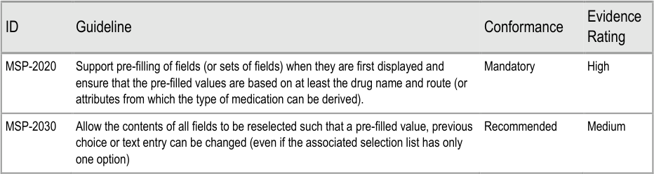

Page 170

Copyright ©2013 Health and Social Care Information Centre

HSCIC Controlled Document

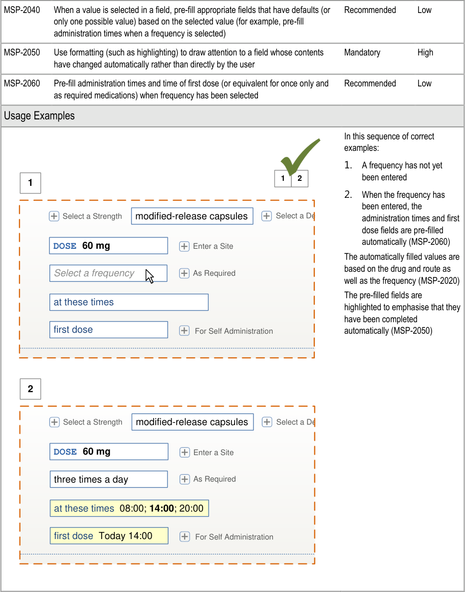

Page 171

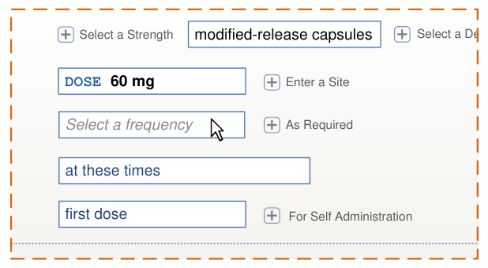

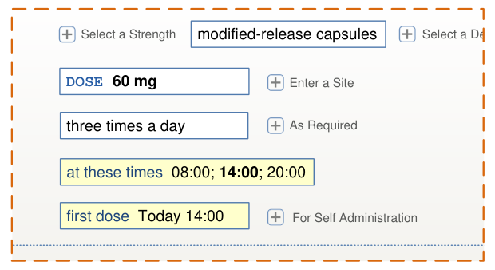

Copyright ©2013 Health and Social Care Information Centre

HSCIC Controlled Document

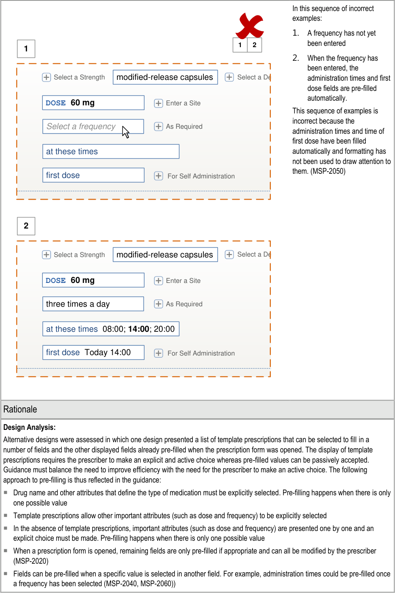

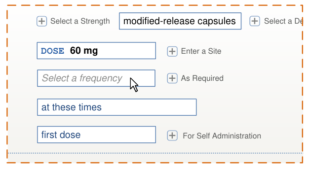

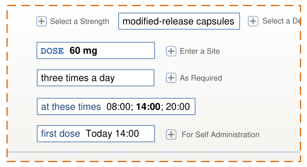

Page 172

Copyright ©2013 Health and Social Care Information Centre

HSCIC Controlled Document

See also section 7.3.6 for guidance on pre-filling when presenting fields step by step and section 9.3.6 for guidance on the pre-filling of
specific input controls.

**Desk Research:**

The pre-filling of fields such as administration times (MSP-2020), reflects the GEN.OS.052 requirement in the _ePrescribing Functional_
_Specification_ **{R12}** to provide the ability to define that specific medications should be routinely scheduled for administration at certain
times of day and to allow the system to default to these values.

Guidance in this section is informed by the following Nielsen heuristic **{R17}** :

 Flexibility and efficiency of use – Efficiency is improved by pre-filling appropriate fields (such as administration times

**User Research:**

Two designs were assessed in Study ID 46 (see APPENDIX E), one of which used pre-filling and the other used template
prescriptions. The study recommended the use of active selection (template prescriptions) rather than passive pre-filling.

**Hazard Risk Analysis Summary:**

From our Patient Safety Risk Assessment analyses, we identified a number of potential hazards, including the following key risks
which are mitigated by the guidance:

**Potential Hazards:**

 A default value is defined that is inappropriate for the

selected drug and or other values in the prescription

 A prescription is authorised with a value that was not the

intended value because it had been automatically
updated when a value was defined in another field

**Mitigations:**

 Pre-filled values must be appropriate for the drug and route at

least and preferably also reflect other values defined in the
prescription (MSP-2020)

 Guidance requires the use of formatting to draw attention to a

field whose contents have changed automatically (MSP-2050)

 The contents of all fields can be changed such that a pre-filled

value can be changed (see section 7.3.6)

 An antibiotic is prescribed without an end date  Appropriate pre-filling of fields based on the drug name and

route (MSP-2020).

 Individual administration times have to be defined by the

prescriber and result in non-standard times

##### **9.3.6 Presenting Input Controls**

 Pre-filling administration times when the frequency is defined

(MSP-2060)

 Providing a selection list of (common) administration schedules

(see section 9.3.6)

 Restricting the definition of individual administration event times

to a more detailed view (see section 9.3.6)

 Where appropriate, pre-fill one or more fields when a selection is

made in a related field (see section 7.3.6).

This section includes guidance relating to the display of specific input controls such as those for
dose and administration times.

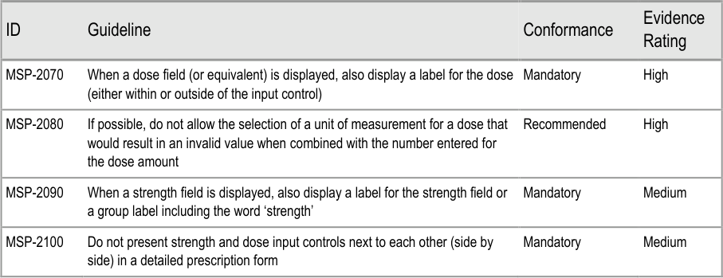

Page 173

Copyright ©2013 Health and Social Care Information Centre

HSCIC Controlled Document

Page 174

Copyright ©2013 Health and Social Care Information Centre

HSCIC Controlled Document

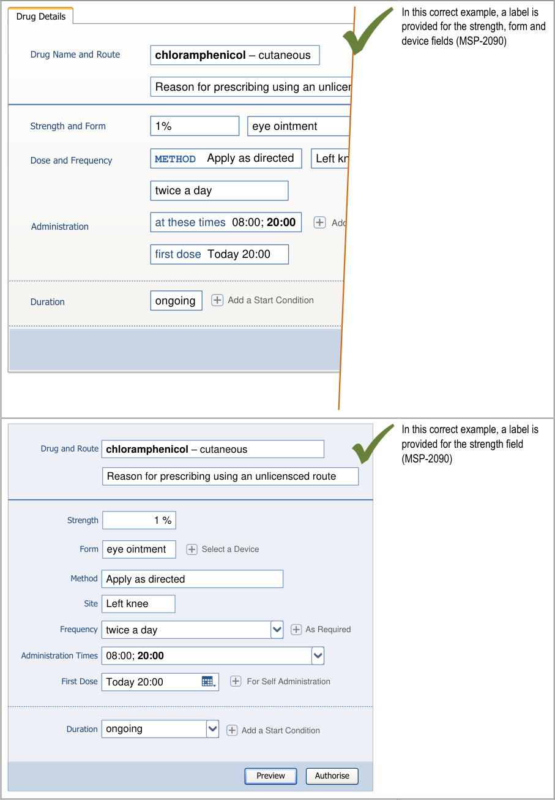

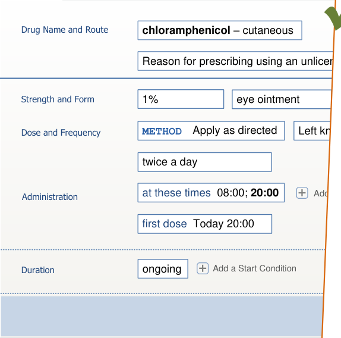

Page 175

Copyright ©2013 Health and Social Care Information Centre

HSCIC Controlled Document

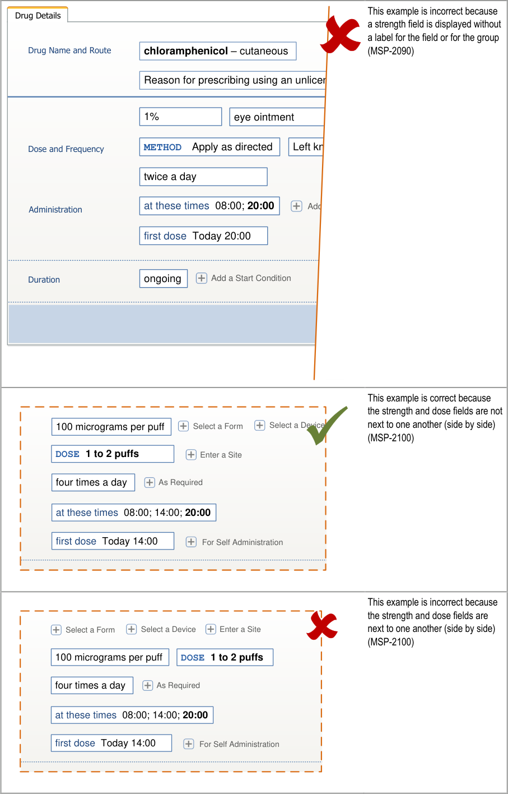

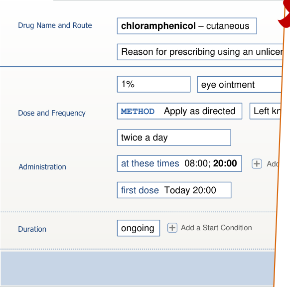

Page 176

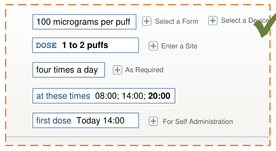

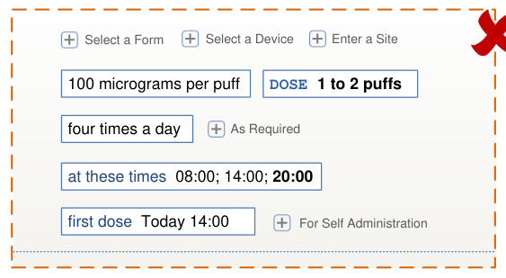

Copyright ©2013 Health and Social Care Information Centre

HSCIC Controlled Document

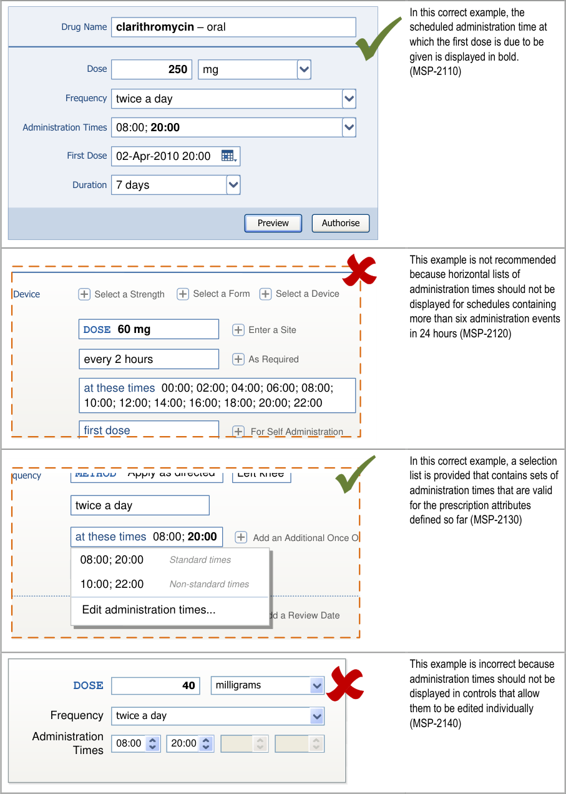

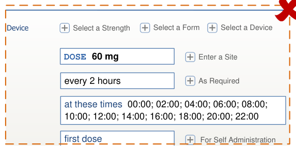

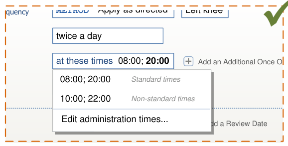

Page 177

|ni|s|
|---|---|
|||

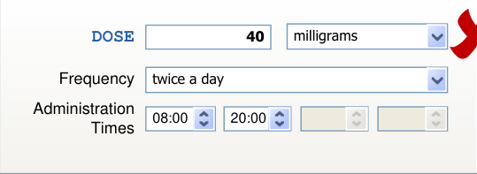

Copyright ©2013 Health and Social Care Information Centre

HSCIC Controlled Document

Page 178

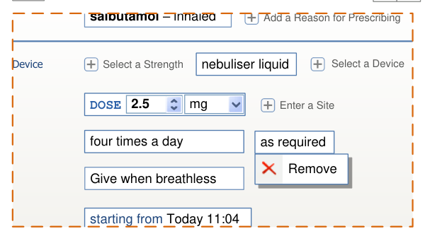

Copyright ©2013 Health and Social Care Information Centre

HSCIC Controlled Document

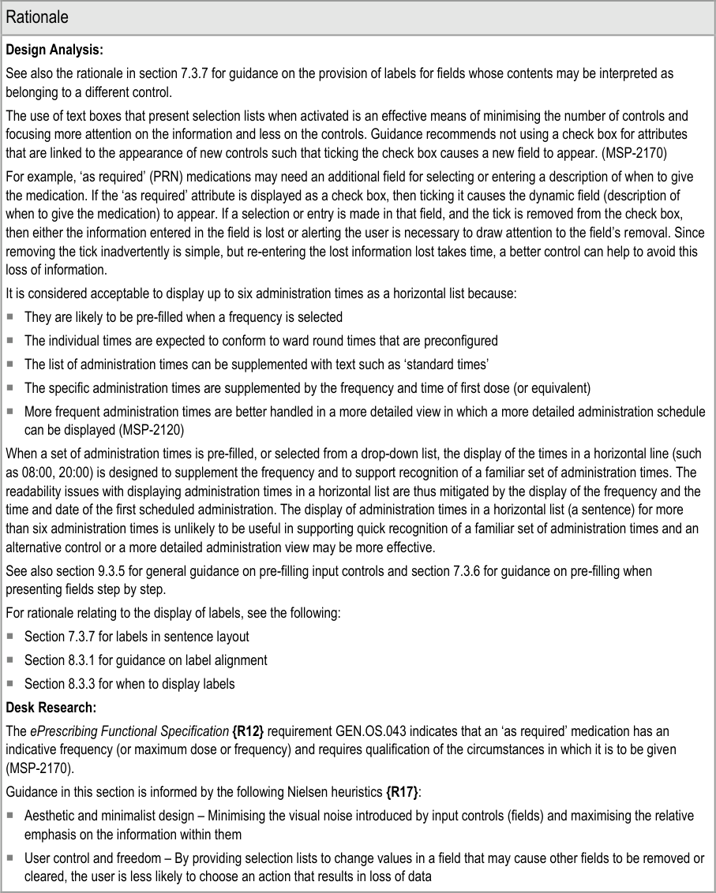

Page 179

Copyright ©2013 Health and Social Care Information Centre

HSCIC Controlled Document

**Hazard Risk Analysis Summary:**

From our Patient Safety Risk Assessment analyses, we identified a number of potential hazards, including the following key risks,
some of which are mitigated and some partially mitigated by the guidance:

**Potential Hazards:**

 An inappropriate administration

schedule is defined as a result of an
individual administration time being
edited inappropriately

 A medication is started later than

intended because the prescriber
does not notice that the first
scheduled dose is too far into the
future

 The label ‘start date’ is incorrectly

interpreted causing an inappropriate
administration schedule

 Individual administration times have

to be defined by the prescriber and
result in non-standard times

 An inappropriate value is defined as

a default

 An input control for a dose is

displayed adjacent to an input
control for a strength and causes the
dose value to be interpreted as the
strength or vice versa

**Mitigations:**

 Providing a selection list of (common) administration schedules (MSP-2130)

 Not recommended to allow individual administration times to be edited only in the

context of a view that displays a detailed administration schedule (MSP-2140)

 The first scheduled dose is displayed in bold within the list of administration times

(MSP-2110)

 When there is more than one dose, the first dose date and time is displayed in a

separate field (in addition to the administration times) (MSP-2150)

 Guidance recommends that the label for this field is different for regular, as

required and once only medications to clarify the meaning of the date and time
(MSP-2160)

 Pre-filling administration times when the frequency is defined (see section 9.3.5)

 Providing a selection list of (common) administration schedules (MSP-2130)

 Restricting the definition of individual administration event times to a more

detailed view (MSP-2140)

 Where appropriate, pre-fill one or more fields when a selection is made in a

related field (see section 7.3.6)

 **This risk is not mitigated by the guidance** . The definition of appropriate default

values is a local system configuration issue and is thus outside of the scope of
this design guidance

 Dose and strength can be entered by selecting a template prescription (see

section 7.3.4) or by selecting values for individual fields that are presented in
sequence (see section 7.3.6). Thus they only appear adjacent after they have
already been completed

 In sentence layout (when dose and strength are most likely to appear adjacent),

guidance recommends that labels are incorporated into fields, so the dose label
immediately precedes the dose value (see section 7.3.7)

 Guidance recommends that labels are used for all fields whose contents could be

interpreted as belonging to a different control (see section 7.3.7)

 The dose field is always labelled (MSP-2070)

 Strength and dose fields must not be placed adjacent in detailed prescription

forms (MSP-2100) and strength fields must be accompanied by a label that uses
the word ‘strength’ for the individual field or the group containing the strength field
(MSP-2090)

Page 180

Copyright ©2013 Health and Social Care Information Centre

HSCIC Controlled Document

### 10 GUIDANCE DETAILS FOR PREVIEW AND AUTHORISE

#### **10.1 Introduction**

Once a prescriber has completed entering prescription details, a preview of the prescription in a
more familiar format (such as that displayed in a Current Medications View) allows the prescriber to
review his or her entry before authorising. This section provides some guidance relating to
previews and the placement of controls for authorising prescriptions.

Figure 31 shows the full user interface prescribing process in which the steps covered in this

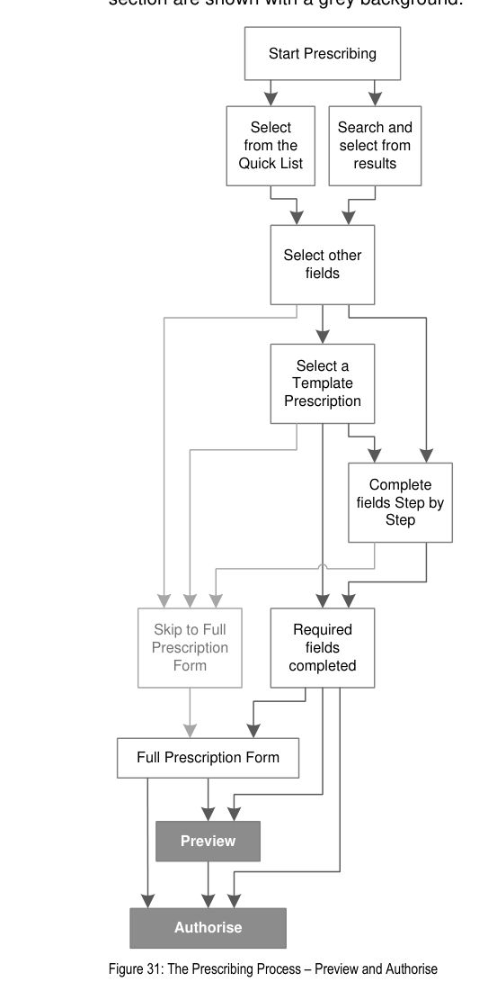

Page 181

Copyright ©2013 Health and Social Care Information Centre

HSCIC Controlled Document

Figure 32 is an extract from Figure 31 to illustrate the user interface prescribing steps covered in
this section showing the preview and authorise steps and the links to and from them:

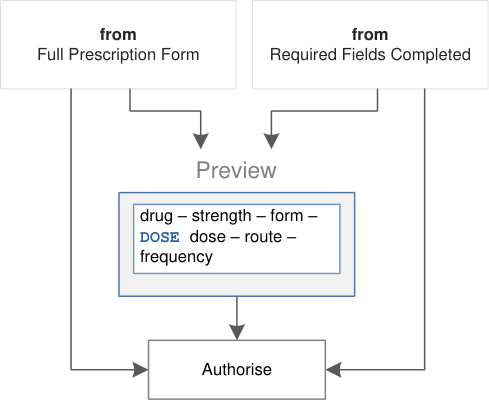

Figure 32: User Interface Prescribing Steps–- Preview and Authorise

#### **10.2 Principles**

All guidance is informed by all of the principles for search and prescribe listed in section 2.1. The
following are particularly relevant to this section:

 Mitigate the risks of mis-selection and misinterpretation:

 Appropriate setting of focus can help avoid mis-selection of a control such as
‘Authorise’.

 Maximise safety in the absence of decision support systems by designing for the reduction

of errors from invalid or inappropriate selections or entries:

 The preview is always available so that prescribers have access to the full prescription
in a format that is both more condensed and familiar from other medications views

 Maximise scalability such that the prescribing process can be modified to accommodate

additional information, steps or shortcuts:

 The preview can be extended in a system that can save completed prescriptions before
authorisation such that they can then be reviewed and authorised as a group

 Minimise the potential for important information to be hidden from view:

 A preview can become a required step when more detailed prescriptions are defined in
which the input controls are distributed across more than one screen

Page 182

Copyright ©2013 Health and Social Care Information Centre

HSCIC Controlled Document

#### **10.3 Guidelines**

##### **10.3.1 Providing a Preview**

This section includes guidance for how to provide and display a preview of all information defined
within a prescription, before final authorisation of the prescription.

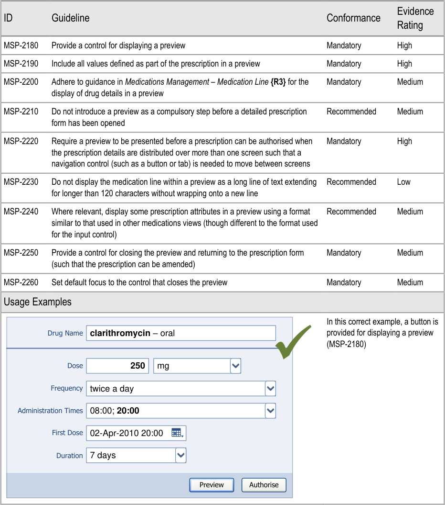

Page 183

Copyright ©2013 Health and Social Care Information Centre

HSCIC Controlled Document

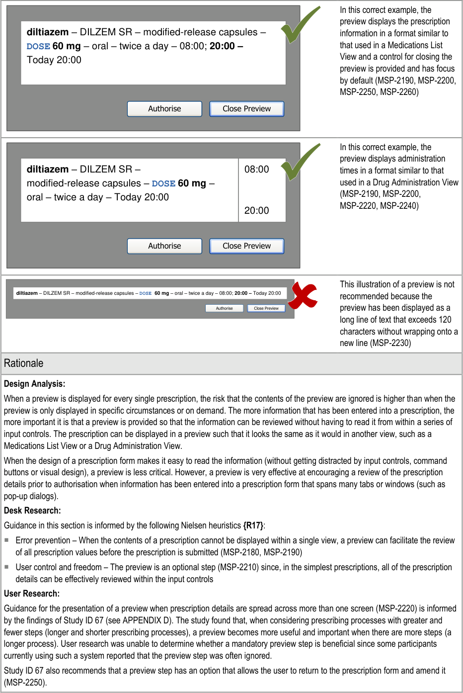

Page 184

Copyright ©2013 Health and Social Care Information Centre

HSCIC Controlled Document

**Hazard Risk Analysis Summary:**

From our Patient Safety Risk Assessment analyses, we identified a number of potential hazards, including the following key risks
which are mitigated by the guidance:

**Potential Hazards:**

 A prescription is authorised with unintended values that

were not visible from the page from which it was
authorised

 A prescription is authorised by activating a control in

error

**Mitigations:**

 Require a preview when the prescription values cannot be seen in

a single screen (regardless of whether the view has a scroll bar)
(MSP-2220)

 By default, focus is set to the control that closes the preview

(MSP-2260)

##### **10.3.2 Presenting Controls for Authorising a Prescription**

This section includes guidance for the placement and focus of command buttons used to preview
and authorise a prescription.

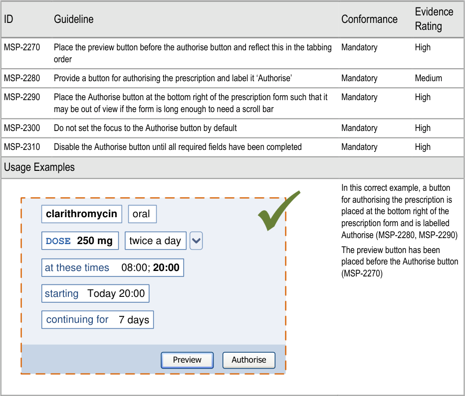

Page 185

Copyright ©2013 Health and Social Care Information Centre

HSCIC Controlled Document

|Col1|Col2|
|---|---|
|**clarithromycin** oral 08:00;**20:00** Today 20:00 **`DOSE`** **250 mg** twice a day 7 days at these times starting continuing for|Authorise|
| | |
|||

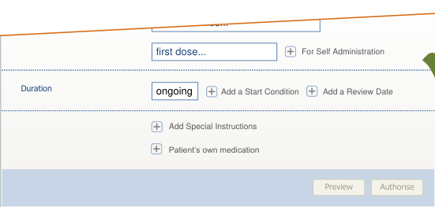

|Col1|This example is incorrect because the preview button is placed after clarithromycin oral the Authorise button (MSP-2270) DOSE 250 mg twice a day at these times 08:00; 20:00 starting Today 20:00 continuing for 7 days Authorise Preview|
|---|---|
|| This example is incorrect because the Authorise button has not been placed at the bottom right of the prescription form such that it may be out of view if the form is long enough to need a scroll bar (MSP-2290) **clarithromycin** oral 08:00;**20:00** Today 20:00 **`DOSE`** **250 mg** twice a day 7 days Authorise at these times starting continuing for|
|| In this correct example, the ‘Preview’ button has focus by default (MSP-2300) Cancel Authorise Today 20:00 twice a day 7 days Preview duration|
|| This example is incorrect because the Authorise button has focus by default (MSP-2300) Cancel Authorise Today 20:00 twice a day 7 days Preview duration|
|| In this correct example, the Authorise button is placed at the bottom right and has been disabled because some required fields have not yet been completed (MSP-2290, MSP-2310) Duration Administration **Authorise** Preview Add Special Instructions Patient’s own medication Add a Review Date Add a Start Condition For Self Administration first dose... at these times... ongoing|

Page 186

Copyright ©2013 Health and Social Care Information Centre

HSCIC Controlled Document

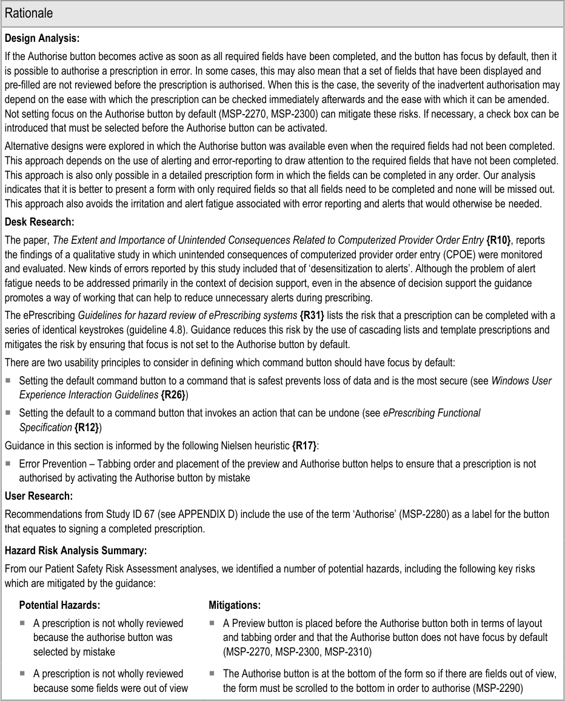

Page 187

Copyright ©2013 Health and Social Care Information Centre

HSCIC Controlled Document

### 11 DOCUMENT INFORMATION

#### **11.1 Terms and Abbreviations**

ACBS Advisory Committee on Borderline Substances

BNF British National Formulary

CATR Clinical Authority to Release

CDER Center for Drug Evaluation and Research

Co-Drugs Combination Drugs

CSG Clinical Safety Group

CUI Common User Interface

dm+d Dictionary of Medicines and Devices

FDA US Food and Drug Administration

HDU High Dependency Unit

INR International Normalized Ratio

ISMP Institute for Safe Medication Practices

ISV Independent Software Vendor

IUD Intrauterine Devices

KLM-GOMS Keyboard-Level Model — Goals, Objects, Methods and Selection

NHS National Health Service

NHS CFH NHS Connecting for Health

NPfIT National Programme for Information Technology

NPSA National Patient Safety Agency

OTC Over the Counter

PGD Patient Group Direction

POD Patient’s Own Drugs

PRN ‘As required’ medication

TFN Trade Family Name

TPN Total Parenteral Nutrition

TTO To Take Out

VDT Visual Display Terminal

VTM Virtual Therapeutic Moiety

W3C World-Wide Web Consortium

WHO World Health Organization

Table 10: Terms and Abbreviations

Copyright ©2013 Health and Social Care Information Centre

Page 188

HSCIC Controlled Document

#### **11.2 Definitions**

Authorise Equivalent to signing a prescription

The Authority The organisation implementing the NHS National Programme for IT (currently NHS Connecting for Health).

Brand name Proprietary drug name for a product (as used by the brand originator)

Conformance In the guidance tables, indicates the extent to which you should follow the guideline when defining your UI
implementation. There are two levels:

**Mandatory**           - An implementation should follow the guideline

**Recommended**          - An implementation is advised to follow the guideline

Current best practice Current best practice is used rather than best practice, as over time best practice guidance may change or be

revised due to changes to products, changes in technology, or simply the additional field deployment
experience that comes over time.

Evidence Rating In the guidance tables, summarises the strength of the research defining the guideline and the extent to which
it mitigates patient safety hazards. There are three ratings (with example factors used to determine the
appropriate rating):

 **Low:**

 Does not mitigate specific patient safety hazards

 User research findings unclear and with few participants

 Unreferenced usability principles indicate the design is not significantly better than alternatives

 **Medium:**

 Mitigates specific patient safety hazards

 User research findings clear but with few participants

 References old authoritative guidance (for example, from National Patient Safety Agency (NPSA),

Institute for Safe Medication Practices (ISMP) or World Health Organization (WHO)) that is potentially
soon to be superseded

 Referenced usability principles indicate the design is significantly better than alternatives

 **High:**

 Mitigates specific patient safety hazards

 User research findings clear and with a significant number of participants

 References recent authoritative guidance (for example, from NPSA, ISMP or WHO)

 Referenced usability principles indicate the design is significantly better than alternatives

Generic drug name The chemical or approved name of a product as opposed to the proprietary name often used by the brand
originator

NHS Entity Within this document, defined as a single NHS organisation or group that is operated within a single technical
infrastructure environment by a defined group of IT administrators.

Template
prescriptions

Table 11: Definitions

Predefined and partially completed prescriptions that allow several attributes to be defined with a single
selection from a list

Page 189

Copyright ©2013 Health and Social Care Information Centre

HSCIC Controlled Document

#### **11.3 Nomenclature**

This section shows how to interpret the different styles used in this document to denote various
types of information.

##### **11.3.1 Body Text**

Code `Monospace`

Script

Other markup languages

Interface dialog names Bold

Field names

Controls

Folder names Title Case

File names

Table 12: Body Text Styles

##### **11.3.2 Cross References**

Current document – sections Section number only

Current document – figures/tables Caption number only

Other project documents _Italics_ and possibly a footnote

Publicly available documents _Italics_ with a footnote

External Web-based content _Italics_ and a hyperlinked footnote

Table 13: Cross Reference Styles

#### **11.4 References**

**R1.** NHS CUI Programme – Medications Management – Medications List – User Interface Design
Guidance

**R2.** NHS CUI Programme – Medications Management – Drug Administration – User Interface Design
Guidance

**R3.** NHS CUI Programme – Medications Management – Medication Line – User Interface Design
Guidance

**R4.** NHS NPfIT – dm+d Implementation Guide (Secondary Care):
[http://www.connectingforhealth.nhs.uk/systemsandservices/eprescribing/refdocs/dmd_guidance.](http://www.connectingforhealth.nhs.uk/systemsandservices/eprescribing/refdocs/dmd_guidance.doc)
[doc](http://www.connectingforhealth.nhs.uk/systemsandservices/eprescribing/refdocs/dmd_guidance.doc)

**R5.** NHS – dictionary of medicines + devices:
[http://www.dmd.nhs.uk/](http://www.dmd.nhs.uk/)

**R6.** NHS NPSA – The fourth report from the Patient Safety Observatory – PSO/4 – Safety in doses:
medication safety incidents in the NHS:
[http://www.npsa.nhs.uk/nrls/alerts-and-directives/directives-guidance/safety-in-doses/](http://www.npsa.nhs.uk/nrls/alerts-and-directives/directives-guidance/safety-in-doses/)

Copyright ©2013 Health and Social Care Information Centre

1.0.0.0

4.0.0.0

2.0.0.0

29-May-2009

Release 2.3

2007-08

Page 190

HSCIC Controlled Document

**R7.** Cohen M R (Ed) – Medication Errors – Causes, Prevention, and Risk Management – Jones and
Bartlett Publishers

**R8.** Kohn L, Corrigan J, Donaldson M – To Err is Human _–_ Building a Safer Health System –
Washington, DC: National Academy Press, 2000

2004

2000

**R9.** Wachter R M – Understanding Patient Safety – The McGraw-Hill Companies, Inc, 2008 2008

**R10.** Ash JS, Sittig DF, Poon EG, Guappone K, Campbell E, Dykstra RH – JAMA – The Extent and
Importance of Unintended Consequences Related to Computerized Provider Order Entry –Vol
14, No. 4, p415

**R11.** Koppel R, Metlay JP, Cohen A, Abaluck B, Localio AR, Kimmel SE, Strom BL – Role of
Computerized Physician Order Entry Systems in Facilitating Medication Errors – JAMA – Vol
293, No. 10, p1197

**R12.** NHS NPfIT – ePrescribing Functional Specification:
[http://www.connectingforhealth.nhs.uk/newsroom/news-stories/eprescfunctspec](http://www.connectingforhealth.nhs.uk/newsroom/news-stories/eprescfunctspec)

July / August 2007

09-Mar-2005

1.0

**R13.** NHS CUI Programme – Design Guide Entry – Time Display 4.0.0.0

**R14.** NHS CUI Programme – Design Guide Entry – Date Display 4.0.0.0

**R15.** NHS CUI Programme – Design Guide Entry – Date and Time Input 3.0.0.0

**R16.** British National Formulary:
[http://www.bnf.org/bnf/](http://www.bnf.org/bnf/)

**R17.** Nielsen, J – Ten Usability Heuristics:
[http://www.useit.com/papers/heuristic/heuristic_list.html](http://www.useit.com/papers/heuristic/heuristic_list.html)

**R18.** Shneiderman, B and Reading, MA – Designing the user interface: Strategies for effective humancomputer interaction – Addison-Wesley Publishing

**R19.** British Standards Institute – BS EN ISO 9241-12: 1999 Ergonomic requirements for office work
with visual display terminals (VDTs) – Part 12: Presentation of information

**R20.** NHS NPfIT – Guidelines for the Design and Presentation of Medication Elements Required in
Electronic Prescribing or Medication Ordering Systems – NPfIT-EP-DB-0003.01

**R21.** ISMP – ISMP Medication Safety Alert! – It’s Time for Standards to Improve Safety with Electronic
Communication of Medication Orders – Draft Guidelines for Safe Electronic Communication of
Medication Orders:
[http://www.ismp.org/Newsletters/acutecare/articles/20030220.asp](http://www.ismp.org/Newsletters/acutecare/articles/20030220.asp)

58
(September 2009)

1994

Third Edition,1998

1999

2005

20-Feb-2003

**R22.** NHS CUI Programme – Design Guide Entry – Patient Banner 4.0.0.0

**R23.** The Joint Commission – National Patient Safety Goals – NPSG.03.03.01 – Look-alike/soundalike drugs:
[http://www.jointcommission.org/AccreditationPrograms/BehavioralHealthCare/Standards/09_FA](http://www.jointcommission.org/AccreditationPrograms/BehavioralHealthCare/Standards/09_FAQs/NPSG/Medication_safety/NPSG.03.03.01/look_alike_sound_alike_drugs.htm)
[Qs/NPSG/Medication_safety/NPSG.03.03.01/look_alike_sound_alike_drugs.htm](http://www.jointcommission.org/AccreditationPrograms/BehavioralHealthCare/Standards/09_FAQs/NPSG/Medication_safety/NPSG.03.03.01/look_alike_sound_alike_drugs.htm)

**R24.** NHS CFH – The Use of Tall Man Lettering to Minimise Selection Errors of Medicine Names in
Computer Prescribing and Dispensing Systems – Loughborough University Enterprises Ltd:
[http://www.connectingforhealth.nhs.uk/systemsandservices/eprescribing/refdocs/tallman.pdf](http://www.connectingforhealth.nhs.uk/systemsandservices/eprescribing/refdocs/tallman.pdf)

**R25.** W3C – Web Content Accessibility Guidelines – W3C Recommendation 5-May-1999:
[http://www.w3.org/TR/WAI-WEBCONTENT/](http://www.w3.org/TR/WAI-WEBCONTENT/)

**R26.** Microsoft – Windows User Experience Interaction Guidelines – Guidelines, Controls, Command
Buttons:
[http://msdn.microsoft.com/en-us/library/aa511453.aspx#defaults](http://msdn.microsoft.com/en-us/library/aa511453.aspx#defaults)

**R27.** Card SK, Moran TP, Newell A – The Keystroke-Level Model for User Performance Time with
Interactive Systems – Palo Alto Research Center

Copyright ©2013 Health and Social Care Information Centre

Dec-2009

July 2009

1.0

2009

1980

Page 191

HSCIC Controlled Document

**R28.** ISMP – List of Confused Drug Names:
[http://www.ismp.org/tools/confuseddrugnames.pdf](http://www.ismp.org/tools/confuseddrugnames.pdf)

**R29.** The Joint Commission International – WHO Collaborating Centre for Patient Safety Releases –
Nine Life-Saving Patient Safety Solutions:
[http://www.ccforpatientsafety.org/patient-safety-solutions/](http://www.ccforpatientsafety.org/patient-safety-solutions/)

**R30.** US FDA Center for Drug Evaluation and Research – Name Differentiation Project:
[http://www.fda.gov/Drugs/DrugSafety/MedicationErrors/ucm164587.htm](http://www.fda.gov/Drugs/DrugSafety/MedicationErrors/ucm164587.htm)

**R31.** NHS CFH – Guidelines for hazard review of ePrescribing systems:
[http://www.connectingforhealth.nhs.uk/systemsandservices/eprescribing/hazard_framework.pdf](http://www.connectingforhealth.nhs.uk/systemsandservices/eprescribing/hazard_framework.pdf)

**R32.** Bates DW – Using information technology to reduce rates of medication errors in hospitals – BMJ
2000; 320:788-91

**R33.** Dean B, Schachter M, Vincent C, Barber N – Prescribing errors in hospital inpatients: their
incidence and clinical significance – Quality Healthcare – 2002:11:340-344

**R34.** Cooper A, Reimann R, Cronin, D – About Face 3: The Essentials of Interaction Design – Wiley
Publishing Inc – 2007

**R35.** Johnson J – GUI Bloopers: Don’ts and Do’s for Software Developers and Web Designers –
Morgan Kaufmann Publishers – 2000

**R36.** Dean B, Schachter M, Vincent C, Barber N – Causes of prescribing errors in hospital inpatients:
a prospective study –The Lancet – Vol 359

2009

May 2001

1.0

2000

2002

2007

2000

20-Apr-2002

**R37.** Reason J – Human Error –Cambridge 1990

**R38.** Bates DW, Teich JM, Lee J, Seger D, Kuperman GJ, Ma’Luff N, Boyle D, Leape L – The Impact
of Computerized Physician Order Entry on Medication Error Prevention –JAMIA – 1999;6:313321

**R39.** Bates DW, Leape LL, Cullen DJ, Laird N, Petersen LA, Teich JM, Burdick E, Hickey M, Kleefield
S, Shea B, Vander Vliet M, Seger DL – Effect of Computerised Physician Order Entry and a
Team Intervention on Prevention of Serious Medication Errors –JAMA – 1998;280:1311-1316

**R40.** Penzo M – Label Placement in Forms –UX Matters:
[http://www.uxmatters.com/mt/archives/2006/07/label-placement-in-forms.php](http://www.uxmatters.com/mt/archives/2006/07/label-placement-in-forms.php)

**R41.** Miller S, Jarrett C – Should I use a drop-down? Four steps for choosing form elements on the
Web:
[http://www.formsthatwork.com/files/Articles/dropdown.pdf](http://www.formsthatwork.com/files/Articles/dropdown.pdf)

**R42.** Jarrett C – Label Placement in Forms – What’s Best? –British Computer Society Conference on
Human-Computer Interaction – Proceedings of the 22 [nd] British CHI Group Annual Conference on
HCI 2008: People and Computers XXII: Culture, Creativity, Interaction – Volume 2, pp229-30

1999

1998

12-Jul-2006

2001

Sept-2008

**R43.** Tufte E, Cheshire, CT – The Visual Display of Quantitative Information – Graphics Press, 2001 Second Edition
2001

**R44.** Apple Inc – Apple Human Interface Guidelines June 2008

**R45.** Singh H, Mani S, Espadas D, Petersen N, Franklin V, Petersen LA – Prescription Errors and
Outcomes Related to Inconsistent Information Transmitted Through Computerized Order Entry –
Arch Intern Med– Vol 169, No.10, p982-989

Table 14: References

Copyright ©2013 Health and Social Care Information Centre

25-May-2009

Page 192

HSCIC Controlled Document

### APPENDIX A USABILITY PRINCIPLES

The following usability principles have been applied through this guidance document. They are
well-recognised principles within the user experience domain.

#### **A.1 Nielsen’s Usability Heuristics**

See _Usability Engineering_ **{R17}** for more information on these principles:

 Visibility of system status

 Match between system and the real world

 User control and freedom

 Consistency and standards

 Error prevention

 Recognition rather than recall

 Flexibility and efficiency of use

 Aesthetic and minimalist design

 Help users recognise, diagnose, and recover from errors

 Help and documentation

#### **A.2 Shneiderman’s Eight Golden Rules of Interface Design**

See _Designing_ _the User Interface – Strategies for Effective Human-Computer Interaction_ **{R18}** for
more information on these principles:

 Strive for consistency

 Enable frequent users to use shortcuts

 Offer informative feedback

 Design dialogs to yield closure

 Offer error prevention and simple error handling

 Permit easy reversal of actions

 Support internal locus of control

 Reduce short-term memory load

#### **A.3 ISO 9241: Presentation of Information**

See _Ergonomic requirements for office work with visual display terminals (VDTs) – Part 12:_
_Presentation of information_ **{R19}** for more information on these principles:

 Clarity (the information content is conveyed quickly and accurately)

 Discriminability (the displayed information can be distinguished accurately)

 Conciseness (users are given only the information necessary to accomplish the task)

Page 193

Copyright ©2013 Health and Social Care Information Centre

HSCIC Controlled Document

 Consistency (the same information is presented in the same way throughout the

application, according to the user’s expectation)

 Detectability (the user’s attention is directed towards information required)

 Legibility (information is easy to read)

 Comprehensibility (meaning is clearly understandable, unambiguous, interpretable and

recognisable)

Page 194

Copyright ©2013 Health and Social Care Information Centre

HSCIC Controlled Document

### APPENDIX B STUDY ID 69: EXECUTIVE SUMMARY

#### **B.1 Abstract**

The UK National Health Service (NHS) Common User Interface (CUI) programme is a partnership
between Microsoft [®] and NHS Connecting for Health (NHS CFH), which is part the NHS National
Programme for Information Technology (NPfIT).

As part of CUI, the Clinical Applications and Patient Safety (CAPS) project has the goal of ensuring
that software applications used by the NHS enhance patient safety. To achieve this, CAPS
provides software developers with user interface design guidelines derived through a user-centric
development process that includes explicit patient-safety evaluations.

This summary describes key findings from user research carried out in April 2009 by the CUI CAPS
team on course definition in Medications Search and Prescribe. These findings are a subset from a
larger internal report prepared for the CUI CAPS Search and Prescribe team.

**Purpose:**

To gain clinical feedback on design concepts for prescribing medications in electronic systems.

**Method:**

Interviews: structured interviews with 14 Health Care Professionals (HCPs) eliciting HCP
preferences and qualitative feedback on design alternatives.

**Key Results:**

Based on clinician preference and rationale:

 Form layout and prescribing pane orientation should not (as yet) be mandated by the CUI,

as there was no clear preference or concrete safety risks elicited for the contrasting designs
shown

 Fields on the full form should be grouped by ‘field type’ rather than ‘mandatory-ness’

 Seeing the medications list while prescribing is favourable but not essential

 A field strategy like ‘dynamic mandatory’ was supported, as opposed to a display whereby

all possible fields are displayed and then the mandatory fields varied based on the drug
type

 An authorisation ‘safety catch’ cannot be mandated without further evidence

#### **B.2 Research Objectives**

To gather HCP preferences and qualitative feedback on, and to identify possible patient safety
hazards with, CUI course definition designs.

#### **B.3 Research Design**

Structured one hour interviews carried out in person. Using three common prescribing tasks
participants were taken through:

1. Wireframe design alternatives for each design area

2. An interactive prototype for one of the tasks

Page 195

Copyright ©2013 Health and Social Care Information Centre

HSCIC Controlled Document

Participants were then asked for preferences based on patient safety criteria. Other qualitative
feedback was elicited covering:

 Rationale for preference

 Design fit with current and best practice

 Design understandability

 Any potential hazards resulting from the designs

Design alternatives were order-balanced per task (in that, they were presented in differing orders to
different participants to try and minimise an order effect), and all designs were shown as a full
prescribing sequence, beginning and ending in the Medication List View.

Detailed notes from the interviews were qualitatively analysed using thematic coding.

#### **B.4 Results**

##### **B.4.1 Participant Description**

14 participants were interviewed in 12 sessions. Each had either volunteered through the NHS
CFH Event Management System (EMS) signup or had been recruited by an HCP who had
volunteered. 7 out of 14 respondents had previously taken part in CUI clinical engagement for other
work areas. Table 5 shows a summary of the participants’ profiles:

402 Doctor FY1 Teaching Hospital A Yes eTTAs

403 Doctor

Doctor

FY1

FY1

Teaching Hospital A Yes

Yes

eTTAs

eTTAs

404 Doctor Surgery ST1 Teaching Hospital B Yes eTTAs

405 Doctor Endocrine and
General Medicine

FY1 Teaching Hospital C Yes PICS

406 Doctor Endocrine FY2 Teaching Hospital C Yes PICS

407 Doctor

Doctor

408 Clinical
Pharmacologist

Acute Medicine

Acute Medicine

FY1

ST2

Teaching Hospital C Yes

Yes

PICS

PICS

ePrescribing Consultant Teaching Hospital C Yes PICS

409 Pharmacist Oncology Teaching Hospital D No CIS Healthcare
ChemoCare [®]

410 Pharmacist Paediatrics and
Women’s Services

411 Pharmacist Oncology and
Haematology

Teaching Hospital D No No

Principle Teaching Hospital D Independent CIS Healthcare
ChemoCare, Cerner
Millennium [® ] LC1, Local
databases and
spreadsheets

Teaching Hospital D No CIS Healthcare
ChemoCare

412 Pharmacy
technician

Oncology and
Haematology

413 Pharmacist Renal Teaching Hospital D No Local databases and
spreadsheets

Table 15: Interview Participants

Page 196

Copyright ©2013 Health and Social Care Information Centre

HSCIC Controlled Document

All participants were clinical staff who prescribe as part of their role, or monitor prescribing and are
aware of related medication safety issues. All participants were from acute secondary care. Eight
participants were junior doctors (who carry out the majority of inpatient prescribing). The
participants were from four different trusts and nine participants were from trusts in London.

13 out of 14 participants had used some kind of electronic system for prescribing medications,
though only those in sessions 405—409, 411 and 412 could be said to have used ‘proper’
ePrescribing systems. The majority had ‘medium’ computer experience as they had to use
computers as part of their clinical work. Several had ‘High’ computer experience, which includes
items such as being familiar with spreadsheet calculation functions and having an understanding of
databases.

##### **B.4.2 Design Areas**

Bullet text _in italics_ represents researcher recommendations or comments in order to distinguish
them from user feedback.

_**Drug Search**_

 As the drug search field gets focus automatically, its in-field prompt is never shown thus

causing confusion to some users as to where to start:

 _Therefore, the drug search prompt should remain even when the field is in focus (if_
_technology allows)_

_**Route Selection**_

 One participant felt it was not clear enough that the prescriber was selecting an unlicensed

route, and that additional actions might be required (such as a justification):

 _If in scope for CUI, consider how this could be made more obvious and what additional_
_actions might be necessary_

 It was felt that some routes were likely to be unfamiliar to many clinicians:

 _If in scope for CUI, consider how ‘very uncommon’ routes might be de-prioritised_

_**Templates**_

 One participant felt that in some instances you might want to apply default values even if

you have not selected a template prescription (for example, saline strength of 0.9%):

 _Consider the arguments for use of defaults even off-template_

_**Prescribing Pane Orientation**_

 There was no clear preference or concrete safety risks elicited for either orientation

(horizontal or vertical box):

 _Therefore, continue to allow for both approaches: horizontal or vertical orientation_

_**Authorising**_

 Opinion was divided as to whether a ‘safety-catch’ was necessary or would be effective to

prevent prescribers from accidentally selecting ‘Authorise’ before having reviewed the
whole prescription:

 _Do not mandate an extra ‘safety-catch’ step without harder evidence to its effectiveness_
_at improving the safety of authorising_

 _Consider other ways to improve chances of reviewing before authorising_

Page 197

Copyright ©2013 Health and Social Care Information Centre

HSCIC Controlled Document

_**New Prescription Building Up**_

 6 of 12 participants were slightly unclear or felt others might be unclear about the status of

the prescription building up (that is, it might be perceived as prescribed when it has not yet
been authorised):

 _Consider how the ‘not yet prescribed’ status could be made clearer_

_**Prescription Status**_

 All five participants asked agreed that a prescription status of ‘Started’ was ambiguous (as

has been seen in previous CUI user feedback):

 _Discuss prescription status options with the ePrescribing team, and ensure examples_
_given in guidance do not include the potentially ambiguous ‘Started’_

_**Medications List**_

 Having the Medications List visible while prescribing was seen as favourable but not

necessarily essential:

 _Continue to allow the Medications List to be simultaneously viewable while prescribing_

_but not that this is mandatory in all cases_

 _It raises questions about:_

i. Where the prescription building up is displayed if the Medications List is grouped
or sorted so that the new prescription would not appear at the top during
prescribing

ii. Whether there are any limits on interaction with the Medications List after a

prescription has started to be written

_**Access to More Options (Quick Prescribe)**_

 One participant did not initially notice the ‘More Options’ button (though had it not been

missing from many of the designs this error might have been more frequent):

 _Explore different positioning of the access to ‘More Options’ to ensure it is considered_
_by prescribers before authorising_

_**Adding a ‘Stat’**_

 All participants were unsure how to ‘add a stat’. Numerous requirements were elicited:

 _Assuming ‘adding a stat’ is out of scope for this CUI release, ensure that example_
_designs are not mistakenly interpreted as providing guidance on adding a stat_

_**Field Strategy**_

 Participants supported the ‘dynamic mandatory’ approach to presenting fields on the form

compared to the ‘set fields per page’ approach

 However, it is likely that there are other approaches to presenting fields that are

acceptable but not exactly like the CUI ‘dynamic mandatory’ one:

 _In the absence of more detailed evidence, continue to use a field strategy that:_

 _Promotes the mandatory fields_

 _Demotes or hides the inapplicable fields_

Page 198

Copyright ©2013 Health and Social Care Information Centre

HSCIC Controlled Document

 _Does not require the user to choose which template they require UNLESS they are_
_specifying some additional information (for example, a complex schedule)_

 _Does not promote fields that are optional but may mislead the prescriber (for_
_example, presenting an optional strength field before a mandatory dose field)_

 _Reduces the need to navigate when reviewing the prescription before authorisation_

_**Field Layout (Quick Prescribe)**_

 There was no clear overall preference or conclusive safety rationale given for either of the

three layouts (in the absence of any hard data on the actual safety or performance):

 _Therefore, there is no user feedback evidence to mandate a particular layout. Though_
_certain ‘good’ layout principles might be described_

_**Field Grouping (Full Form)**_

 All seven participants who commented on the grouping of fields on the full form preferred

fields grouped by ‘field type’ (for example, dose and frequency) rather than by whether they
were mandatory or not:

 _Therefore continue to group fields (on the full form) by ‘field type’ rather than by_
_‘mandatory-ness’_

 There was no specific feedback on the actual grouping taxonomy to use

_**Field Layout (Full Form)**_

 Though a more linear, vertical field layout was generally preferred, feedback was not

conclusive (and was not based on actual usage of the form):

 _Also given the other factors that would influence form layout in a real application (inline_
_error markers, decision support, application conventions on layout, ‘reviewability’ of the_
_resulting prescription, and so on), the CUI should not mandate an exact form layout_

_**Access to More Options (Full Form)**_

 All seven participants asked would prefer ‘More Options’ to open inline rather than opening

a new page. However, one participant felt this addition would have to be balanced against
the need to be able to ‘review’ the page before authorising

 _Therefore, expand options inline, though there may be exceptions when accessing_
_large ‘extra options’ such as administration scheduling. However, it should be_
_considered what happens once optional data has been added_

_**Administration Times**_

 As has been seen in previous user feedback, several participants suggested that arranging

administration times vertically would be preferable to a horizontal arrangement

_**Duration**_

 In relation to infusions, one participant was confused by the use of the label ‘continuing’ for

the duration field:

 _Therefore use ‘duration’ as opposed to ‘continuing’_

 _Consider the potential confusion between ‘duration’ and ‘dose duration’_

Page 199

Copyright ©2013 Health and Social Care Information Centre

HSCIC Controlled Document

_**Infusions**_

 Three participants were confused by the lack of clear field labels for the ‘rate’ field:

 _Therefore consider which fields must have explicit labels or prompts_

Copyright ©2013 Health and Social Care Information Centre

Page 200

HSCIC Controlled Document

### APPENDIX C STUDY ID 68: EXECUTIVE SUMMARY

#### **C.1 Abstract**

The UK National Health Service (NHS) Common User Interface (CUI) programme is a partnership
between Microsoft® and NHS Connecting for Health (NHS CFH), which is part the NHS National
Programme for Information Technology (NPfIT).

As part of CUI, the Clinical Applications and Patient Safety (CAPS) project has the goal of ensuring
that software applications used by the NHS enhance patient safety. To achieve this, CAPS
provides software developers with user interface design guidelines derived through a user-centric
development process that includes explicit patient-safety evaluations.

This summary describes key findings from user research carried out in November 2008 by the CUI
CAPS team on Course Definition (part of the Search and Prescribe work). These findings are a
subset of those in a larger internal report prepared for the CUI CAPS Search and Prescribe team.

**Purpose:**

To further understand existing hazards and requirements relating to medication course definition.

**Method:**

Interviews: structured interviews with 14 Healthcare Professionals (HCPs) using paper drug charts
and existing CUI designs as a stimulus for discussion.

Requirements analysis: requirements relating to course definition identified from the existing NHS
CFH ePrescribing requirements documents.

#### **C.2 Research Objectives**

To further understand existing hazards and requirements relating to medication course definition
focusing on the areas of:

 Scheduling and ‘time’ attributes

 Conditions

#### **C.3 Research Design**

Interviews were structured, lasted 30—60 minutes and carried out in person, with one to three
participants per interview. Participants were shown existing paper drug charts and old CUI course
definition designs to help elicit risks and uncover further requirements.

Detailed notes from the interviews were qualitatively analysed using thematic coding.

The NHS CFH ePrescribing requirements were searched for a set of keywords relating to course
definition. Once a requirement was flagged, relevance to CUI scope was assessed and the
requirement categorised. The output was a spreadsheet of ePrescribing requirements that can be
filtered by category relating to course definition thus aiding later analysis and retrieval.

Page 201

Copyright ©2013 Health and Social Care Information Centre

HSCIC Controlled Document

#### **C.4 Results**

##### **C.4.1 Participant Description**

14 participants were interviewed in 7 sessions. Each participant had either volunteered through the
NHS CFH Event Management System (EMS) signup or had been recruited by an HCP who had
volunteered. Table 15: Interview Participants Shows a summary of the participants’ profiles:

374 Pharmacist ENT ? No PCIS Medium

360 EPR Pharmacist

EPR Nurse

EPR Nurse

Senior

Senior

Senior

All deal with
ePrescribing
and eMAR
aspect of
system

Customised i.CM
(full ePrescribing
and eMAR)

No

Yes

Yes

High

Medium

Medium

361 Pharmacist ? Senior Yes Electronic TTOs Yes Medium

362 Doctor ? F1 Yes Electronic TTOs No High

363 Doctor

Doctor

364 Doctor

Nurse Practitioner

Nurse Practitioner

365 Nurse Practitioner

Nurse Practitioner

Nurse Practitioner

Table 16: Interview Participants

?

?

Emergency

Emergency

Emergency

Emergency

Emergency

Emergency

F1

F1

ST3

Senior

Senior

Senior

Senior

Senior

Yes

Yes

Yes

PGD

PGD

PGD

PGD

PGD

Electronic TTOs

Electronic TTOs

Electronic TTOs

No

No

No

No

Seen several
systems

No

No

No

No

No

No

No

Yes

High

Medium

Medium

Medium

Medium

Medium

Medium

High

All interview participants were clinical staff, either prescribers and/or pharmacists. All participants
were from acute secondary care and from three different trusts with diverse geographical locations.

Two interview participants had used electronic prescribing before and five others had used an
electronic TTO system with very basic prescribing functionality. The majority had medium or high
computer experience, where high experience includes items such as being familiar with
spreadsheet calculation functions and having an understanding of databases.

##### **C.4.2 Hazards**

Table 17 lists and describes the hazards identified:

1 Cannot specify prescription-specific logic as all orders are treated the same (for example, cannot
do different mandatory fields for as-required prescriptions)

2 Cannot specify medication-order-specific logic as medications are treated as just another kind of
order (for example, cannot do Adverse Drug Reaction (ADR) checking on medications)

3 Delay in first dose as the doctor is not communicating new (or changed) prescriptions

Page 202

Copyright ©2013 Health and Social Care Information Centre

HSCIC Controlled Document

4 Additional

Instructions

5 Additional

Instructions

If the prescriber (or verifier) relies on the administerer reading the relevant knowledge support,
instead of highlighting it to them by recording notes in 'additional instructions', then the
administerer may not attend to these instructions

If, during prescribing, the prescriber does not have access to the same knowledge support as the
administer has, then the prescriber may add information in 'additional instructions' that is
contradicted by this knowledge support thereby confusing the administerer

6 Attributes Prescribers may be confused by the difference between 'strength' and 'dose' at the point of course
definition

7 Attributes Presenting non-mandatory fields by default may be: distracting, confusing, unnecessarily filled in

8 Attributes Due to the large number of potential optional fields that could be displayed on the course definition
form, those that are chosen to be displayed (either by default or on demand) may be suboptimal in
some circumstances (for example, how do you choose which optional fields get displayed or are
accessible?)

9 Conditions Administration conditions not documented or not 'formalised' in a system may be missed,
misinterpreted, or cannot take advantage of system functions (for example, done through free text,
‘additional instructions’ or given verbally)

10 Have Sight Of If the prescriber is not prompted to consider previous prescriptions for the patient for the same
medication or class (especially reasons for discontinuation) they may prescribe suboptimally

11 Have Sight Of,

Schedule

12 Have Sight Of,

Schedule

If prescribers only see the medications and administration schedule for the day of prescribing (or a
few days around it) before, during or after prescribing, they may not be aware of all the patient's
current medications.
Administration views in systems are likely to show a few days by default (though should provide
access to the other current medications)

If, during prescribing, prescribers do not have access to current (and past?) medication details,
including their schedule, they may not have the necessary information to accurately complete the
prescription

13 PRN PRN has indication recorded rather than the symptom as the condition for giving (for example,
asthma not wheeze)

14 PRN PRN prescription does not record he conditions under which it was given (currently poorly
documented on paper)

15 PRN As most people know what the PRN will be for, being forced to record the reason is unnecessary
(unlikely to be a view shared by pharmacists)

16 PRN Clinicians may expect PRN to have an indication of maximum dose in 24 hours, maximum
frequency, and/or minimum interval. A course definition label for 'frequency' associated with PRN
may be misinterpreted as one of these rather than as an indicative frequency

17 PRN Though it may be theoretically correct for a PRN to always have an indicative frequency,
prescribers may not want to specify one as long as the eventual administration schedule conforms
to the minimum and/or maximum restrictions (that is, the schedule that results from the
administerer administering the PRN)
For some medications, an indicative frequency might seem odd (for example, nappy rash cream
'apply as required')

18 PRN A start date and time for PRN is likely to be confusing as the start date and time usually refers to
the first intended administration (which is not known with a PRN) (though it could be changed to
'valid from' for PRN?)

Page 203

Copyright ©2013 Health and Social Care Information Centre

HSCIC Controlled Document

19 PRN Prescribers may feel they have to provide maximum and/or minimum restrictions on PRN
administration if they do not realise that these are provided by the system (if indeed they are,
though they should be according to the CUI Drug Administration guidance)

20 Record Some medications administered in some contexts (for example, entonox or lignocaine in ED) may
be written up as part of the documentation of care and not duplicated into the medication’s record

21 Record A patient may self administer in A&E and this is not being recorded or is not recorded in the
medications record (perhaps as it is deemed to be irrelevant to the presenting complaint)

22 Review and/or

Stop Date

23 Review and/or

Stop Date

24 Review and/or

Stop Date

25 Review and/or

Stop Date

26 Review and/or

Stop Date

‘Review’ and/or ‘stop’ date is missed as it has a ‘point’ value and is not followed up. That is, it is
not ‘sticky’ or persistent over time if it is not completed (for example, if the review date falls on a
weekend)

No review criteria specified at time of prescribing makes it hard to subsequently review

Medications stopped rather than reviewed

The term 'review' is interpreted in different ways (for example, 'review after 2 days of 7 day course’
versus ‘to be followed by a review at end of 7 days', for example 'let's see how they get on after 5
days' versus 'hard stop after 5 days').
Therefore potential confusion about what it means to schedule 'a review'

Implied requirement to be able to schedule a review during a course as well as at the end of one

27 Schedule Scheduling information has to be inferred from chart graphical mark-up ‘hieroglyphics’ which may
be non-standard. Some staff may use more ‘certain’ mark-up than others (for example, blocking
out days not to administer is a pretty clear mark-up)

28 Schedule Scheduling and frequency information ‘trapped’ in graphical section of paper chart rather than
conveyed in prescription text on the left-hand side of a paper chart can be missed when
transcribing for discharge, (and at other times too)

29 Schedule The prescriber schedules administration at a suboptimal time for that medication (for example,
breaking ward conventions to administer warfarin at 18:00 or simvastatin in the morning rather
than at night)

30 Schedule Not clear that the administration time has been changed from standard times when done by
crossing out usual time on paper

31 Schedule Medications that do not have an obvious default schedule (for example, ‘bd’ and ‘tds’) are
'automatically' scheduled to times that are either unexpected by the prescriber or do not take into
account all the relevant factors.
‘od’ and ‘qds’ are more obvious as ‘od’ is likely to be scheduled at 08:00 or a medication-specific
default time and ‘qds’ will fill the usual four drug-round slots

32 Schedule Self administered drugs may not be administered according to a schedule that was suggested to
the patient at the time of prescribing. Therefore if the system 'schedules' the administration
according to this suggestion, and then does not require the actual times to be recorded, the
administration record may be misleading

33 Schedule If the scheduling (either automatic or manual) does not take account of local ward conventions
beyond 'normal' drug rounds (such as IV rounds at slightly different times to non-IV rounds),
certain medications will systematically be administered 'too early' or 'too late' (according to the
system's schedule)

Page 204

Copyright ©2013 Health and Social Care Information Centre

HSCIC Controlled Document

34 Schedule,

Conditions

35 Schedule, Dose

Interval

36 Schedule, Dose

Interval

37 Schedule, Dose

Interval

38 Schedule, Dose

Interval

39 Schedule, Dose

Interval

40 Schedule, Dose

Interval

41 Schedule, Dose

Interval, Once
Only

42 Schedule,

Duration

43 Schedule, Have

Sight Of

44 Schedule, Once

Only

45 Schedule, Once

Only

46 Schedule, Once

Only

Non-time dependant conditions scheduled with spurious time specificness and/or and incorrect
time (for example, with food in evening, pre-meds)
This might be solved by having a long time tolerance administration, plus a conditional ‘IF’, if it
cannot have formalised conditions

Double administration as the first dose was given in A&E, but was not recorded on the inpatient
chart, then another dose given on admission to the ward.
This is solved if all administrations are recorded and A&E and ward have interoperable medication
record

Dose administered in A&E and to maintain the dose interval the prescriber therefore schedules
the next dose at a non-drug round time. Then, on admission to the ward, nurses get another
prescriber to alter the time of administration to be more convenient to drug rounds, which may
then break the dose interval with the first dose given in A&E

Breaking strict dose intervals due to set round times or administration non-compliance with strict
dose interval schedule (for example, antibiotic prescribing) has historically never been
administered 'correctly' at exact time intervals

System does not alert users if they are trying to schedule doses of the same medication (including
those in other prescriptions) within a minimum dose interval (especially for 'stat' followed by
regular schedule)

Prescriber has become used to accepted practice of scheduling certain medications (for example,
antibiotics) at standard drug round times, rather than at recommended dose intervals. Another
hazard is that prescribers may not realise that in some contexts (for example, serious infection in
ITU) they must prescribe at strict dose intervals or they mistakenly do not use the strict dose
interval frequency option

Prescribers may need to schedule administration such that it breaks a minimum interval. They
should probably be forced to record a reason (from CUI Drug Administration Feedback Study ID
40)

Breaking of dose interval as the ‘stat’ dose is ‘too quickly’ followed by the first regular dose

Duration is calculated as calendar days (either by system or by user) rather than days of doses
(for example, if the first dose of a five day course is given at night, this is not a whole day of
treatment so the patient needs to continue onto the sixth day of treatment)

If prescribers do not see the administration schedule represented graphically before authorising a
prescription (as on the paper drug chart), they may not notice a scheduling error or suboptimal
scheduling as the textual expression of the frequency and schedule is less familiar (and perhaps
more open to error) (for example, that the first dose is not due for a longer time than they
intended, such as on the next day)

‘Double’ administration of ‘first’ dose as ‘stat’ and the first regular dose both given at same time
(especially if ‘stat’ is added automatically by the system?)

Delay in first dose until the next day as the default schedule is for a time that has already passed
that day (so is scheduled for the next day) and no ‘stat’ created for today (known cause of death
from a long delay in the first administration of meningitis medication)

Delay in first dose until the next round as it was not scheduled ‘due’ until the next round that day
and no ‘stat’ was created for now

Page 205

Copyright ©2013 Health and Social Care Information Centre

HSCIC Controlled Document

47 Schedule, Once

Only

48 Schedule, Once

Only

49 Schedule, Once

Only

50 Schedule, Once

Only, Time
Tolerance

51 Schedule,

Review and/or
Stop Date

52 Schedule,

Supply

Prescribing a 'stat' followed by a regular schedule may subsequently give a false impression of
when that medication started if 'separated' from each other on the chart (that is, medication line
identity question)

If prescribers have to prescribe a regular medication, started with a ‘stat’, as separate
prescriptions in two unlinked steps they may:

Forget to do one of the steps (probably by being distracted in between)

Make a mistake when scheduling them together

Not have the correct total duration for that medication (for example, total duration = stat plus four
days minus one dose of regular medication)

Correct urgency of a once only prescription is not communicated. Either because of a spurious
urgency by treating all once only prescriptions as 'stat' (causing unnecessary disruption) or a
genuinely urgent once only is not administered on time (could be a problem for other types as
well, for example, once a day medication?)

Correct degree of time-specificness of a ‘stat’ is not communicated. Either because of a spurious
specificness by specifying a time when it does not really matter or by being administered outside
of a correct narrow time tolerance (could be a problem for other types as well, for example, once a
day medication?)

Antibiotic issues: often continued inappropriately as they do not have a stop date (or accurate stop
date), prescribed inappropriately as a wrong indication and so on

Delay in ‘stat’ and/or first dose due to supply issues (for example, the prescriber did not know that
the product was not in the ward stock)

53 Start Date CUI design: course 'Start' is ambiguous as to whether it means prescription date or intended first
dose date and/or time.
All that the Wales chart says is: 'Time to be given' for its once only prescriptions. We could try:
'first dose', 'first administration', 'Start on'.

54 Start Date CUI Design: The 'Approx' flag on start date and time is confusing. It might imply it is a non-specific
way to alter the administration time tolerance (and it might not be). It might also imply that if it is
not checked then the start date and/or time has a very low time tolerance (which it might not do). It
might also imply that all administration events for this prescription are affected by this control
(which they might not be).

55 Supply Prescribers are often unaware of patients not getting medications due to supply issues

56 Therapeutic

Intent

57 Therapeutic

Intent

58 Therapeutic

Intent

Prescribers may not know the exact reason for prescribing as they are just following the
consultant's orders (and they may have not provided the rationale). Also, they may be prescribing
some time after the consultant requested the prescription.

If the therapeutic intent and/or rationale for treatment is not recorded by the prescriber,
subsequent clinicians may not be able to review the prescription as effectively as the prescriber
(especially after discharge or for antibiotics)

A clinician's answer for 'reason' could be described in multiple ways, which may miss out key
information for a subsequent reviewer or decision support trying to act on it (for example, ‘animal
bite’ versus 'laceration' versus 'infected wound', where the fact it is an animal that caused the
injury is the important factor, and 'for infection' versus 'based on microbiology reports', where the
authoritative recommendation is important)

Page 206

Copyright ©2013 Health and Social Care Information Centre

HSCIC Controlled Document

59 Therapeutic

Intent

Treatment goals may not be perceived to be 'necessary' for some medications in some contexts
(for example, PDG medications in ED)

60 Variation Nurses changing heparin dose based on results (is this allowed?)

61 Variation Warfarin prescription unclear as to whether it is to continue each day as it is prescribed as a
separate prescription for every day without a clear indication of the 'overall' course duration

62 Variation If a medication line identity is such that prescribed variations in dose, frequency and so on (either
during a day or over days) are displayed as separate medication lines, there is a chance that:

The lines become separated and disassociated

It becomes harder for the user (and system?) to perform operations aggregating the lines

For example, working out 'how much drug X the patient is getting?' or 'how long have they been
getting drug X for?'

63 Variation If a medication varies either during a day or over days, there is a chance that the variations will get
mixed up either at the time of prescribing or of administration (for example, prescribing the dose
intended for 22:00 at 8:00 and vice versa)

64 Variation Prescribers may desire a templated prescription that defines a schedule of varying doses over
several days, which cannot be supported by the template UI (for example, ‘10 mg 1 day, 10 mg 1
day, 5 mg 1 day, then as per INR value’)

65 Attributes Basic dropdowns may not be the most appropriate input mechanism for a field (for example, an
ISV may have a very large number of possible frequencies or some fields will require 'other'
options to access unlicensed routes) (partially from CUI Search and Prescribe user feedback
2006)

66 Schedule Some workflows may have the schedule set by the administerer rather than the prescriber (from
CUI Search and Prescribe user feedback 2006)

67 Attributes Different contexts may require different default settings for attributes (for example, the Emergency
Department may default its medication frequency to 'stat' (or its equivalent)

68 Attributes Form design: the user may accidentally scroll a dropdown and be unaware that they have
changed one of the values on the form

69 Attributes After a template has populated a form, the prescriber may make alterations to some fields that
imply other fields should be checked and/or changed (for example, if changing route what should
happen to a prefilled dose?)

Table 17: Hazards Identified

Page 207

Copyright ©2013 Health and Social Care Information Centre

HSCIC Controlled Document

### APPENDIX D STUDY ID 67: EXECUTIVE SUMMARY

#### **D.1 Abstract**

The UK National Health Service (NHS) Common User Interface (CUI) programme is a partnership
between Microsoft® and NHS Connecting for Health (NHS CFH), which is part the NHS National
Programme for Information Technology (NPfIT).

As part of CUI, the Clinical Applications and Patient Safety (CAPS) project has the goal of ensuring
that software applications used by the NHS enhance patient safety. To achieve this, CAPS
provides software developers with user interface design guidelines derived through a user-centric
development process that includes explicit patient-safety evaluations.

This summary describes key findings from user research carried out in January 2009 by the CUI
CAPS team on defining a medication’s course (part of the Search and Prescribe work). These
findings are a subset of those in a larger internal report prepared for the CUI CAPS Search and
Prescribe team.

**Purpose:**

To gain clinical feedback on design concepts for defining a medication’s course in electronic
systems.

**Method:**

Interviews: structured interviews with 16 Healthcare Professionals (HCPs) eliciting HCP
preferences and qualitative feedback on design alternatives.

Workshops: two workshops with six HCPs per workshop, eliciting HCP preferences and qualitative
feedback on the same design alternatives as used in interview.

**Key Results:**

Based on clinician preference and rationale:

 First dose, the administration schedule and any extra system or user-defined attributes

should be clearly visible to the prescriber before authorising the prescription

 Participant opinion and perception of risk was divided on whether a mandatory preview step

would be safer than not having one, though the arguments against having one were made
on efficiency rather than safety grounds

 The horizontal administration schedule format was disliked compared to a vertical or

‘calendar-style’ format

 Even with a ‘mandatory only’ model of displaying fields on the main prescribing form, some

optional fields may also need to be displayed on the main form either for all prescriptions or
on a per case basis

#### **D.2 Research Objectives**

To gather HCP design preferences, qualitative feedback and possible patient safety hazards of CUI
drug search designs focusing on the areas of:

 Information and workflow required before prescription authorisation (also known as ‘the

Preview’)

 Overall design of the course definition form (that is, dealing with mandatory versus optional

attributes)

Page 208

Copyright ©2013 Health and Social Care Information Centre

HSCIC Controlled Document

#### **D.3 Research Design**

Interviews were structured, lasted one hour and carried out in person. Participants were taken
through wireframe design alternatives for each area of investigation and asked for preference
based on patient safety criteria. Other qualitative feedback was elicited covering:

 Rationale for preference

 Design fit with current and best practice

 Design understandability

 Any potential hazards resulting from the designs

Workshops lasted 2.5 hours and were similar to the interviews except that they focused on
qualitative feedback and involved group discussion.

Detailed notes from the interviews and workshops were qualitatively analysed using thematic
coding.

#### **D.4 Results**

##### **D.4.1 Participant Description**

_**Interviews**_

Sixteen participants were interviewed in thirteen sessions. Each participant had either volunteered
through the NHS CFH EMS signup or had been recruited by an HCP who had volunteered. Four
out of sixteen participants had previously taken part in CUI clinical engagement for other work
areas. Table 5 shows a summary of the participants’ profiles:

374 Pharmacist ENT ? No PCIS Medium

375 Pharmacist and
Analyst

Systems ? ? PCIS High

376 Pharmacist Various ? No PCIS Medium

377 Pharmacist Medication Safety Senior Yes eTTOs – McKesson Medium/High

378 Pharmacist Care of Elderly ? Yes eTTOs – McKesson Med

379 Doctor Endocrine F1 Yes eTTOs – McKesson High

381 Pharmacist ? Lead No eTTOs and seen various ?

382 Doctor Stroke Consultant Yes PICCS Medium/High

383 Doctor Care of Elderly SpR Yes PICCS ?

384 Doctor

Doctor

385 Doctor

Doctor

386 Doctor

Pharmacist

Table 18: Interview Participants

Acute Medicine ST2

FY2

Respiratory and
Transplant

Renal

Systems

Consultant

Consultant

Consultant

Consultant

Yes PICCS ?

Yes PICCS Medium

Yes PICCS High

Page 209

Copyright ©2013 Health and Social Care Information Centre

HSCIC Controlled Document

All interview participants were clinical staff, either prescribers and/or pharmacists. All participants
were from acute secondary care, from three different trusts with diverse geographical locations.

12 interview participants had used electronic prescribing before, and the remaining 4 had used an
electronic To Take Out (TTO) system with very basic prescribing functionality. The majority had
medium or high computer experience, where high experience includes items such as being familiar
with spreadsheet calculation functions and having an understanding of databases.

_**Workshops**_

12 participants were interviewed in 2 workshops (sessions 387 and 388). Each participant had
volunteered through the NHS CFH Event Management System (EMS) signup. All 12 participants
had previously taken part in CUI clinical engagement. Table 19 shows a summary of the
participants’ profiles:

387a Pharmacist Systems ? ? JAC High

387b Doctor Paediatrics Consultant Yes Trust Developed Medium/High

387c Midwife and
Patient Safety
Officer

Midwifery Senior Yes No Medium/High

387d Pharmacist ? Senior Yes Lorenzo, JAC, Ascribe [®] High

387e Doctor General Practice GP Yes Vision High

387f Pharmacist ? Senior ? Cerner Millennium [®] Medium/High

388a Pharmacist Systems Senior ? Cerner, Lorenzo High

388b Pharmacist Medication Safety Senior ? eTTO Medium/High

388c Nurse Mental Health Senior ? No High

388d Nurse ? Senior ? eTTO ?

388e Pharmacist Medication Safety Senior ? JAC, eTTO Medium

388f Pharmacist Systems Senior ? JAC Medium/High

Table 19: Workshop Participants

The majority of participants were clinical staff, either prescribers and/or pharmacists. 11
participants were from secondary care, from a number of different trusts with diverse geographical
locations.

Eight workshop participants had used full electronic prescribing systems before and only two had
never used any kind of electronic prescribing. The majority had medium or high computer
experience, where high experience includes items such as being familiar with spreadsheet
calculation functions and having an understanding of databases.

Page 210

Copyright ©2013 Health and Social Care Information Centre

HSCIC Controlled Document

##### **D.4.2 Design Areas**

_**Information Required Before Authorisation**_

 Analysis of participant’s responses concluded that, as well as the ‘main’ drug details, before

authorising a prescription prescribers should see:

 The time of the first dose

 A representation of the schedule defined

‘Type’ was not seen as necessary.

 A principle implied from responses was that prescribers should be able to review anything

defined by the prescriber or system before authorisation

_**Format of Information Before Authorisation**_

 ‘Structured’ previews were preferred (where the drug name, drug details, first dose and

scheduled were all distinct by virtue of their positioning and formatting or labels) rather than
a single string of text as a ‘sentence’

 Consideration should be given to how to provide consistency of representation so that the

format of the prescription before authorisation is not only clear but familiar and consistent
with other representations in the application

_**Workflow – Should There Be a Mandatory Confirmation Step?**_

 Participants were divided on whether a mandatory confirmation step would be safer. Some

felt that an extra step would be ignored anyway and merely served to increase the number
of user actions to prescribe. Others felt that an extra step would remind some prescribers to
check the prescription and that seeing the information in a different format to that entered
would provide additional safety

 With this difference of opinion, it would be highly desirable to gain real usage data on the

efficacy of having an extra mandatory step on the accuracy of prescribing (or other similar
processes such as ecommerce)

 Whether a preview step is used or not, throughout the process the prescriber must be clear

as to the state of the prescription (that is, has it been prescribed or not?)

_**Administration Schedule Format**_

 The horizontal format (administration times in a sentence) was negatively commented on by

all participants

 Where shown, a vertical format, or ‘calendar’ format was thought to be more familiar and

easier to read than the horizontal format

 Whatever the format, the prescription frequency should have a clear relationship with the

schedule

 There is a risk that a ‘normal’ day’s schedule may mislead about the first dose (as this will

often not be the normal first dose of the day)

Page 211

Copyright ©2013 Health and Social Care Information Centre

HSCIC Controlled Document

_**Field Layout**_

 Though participants provided some feedback on the different layouts, user experience

rationale should be applied here. For example:

 Is it necessary for the fields to be easily scannable in these forms?

 How consistent does the form layout need to be with other forms in the application?

 What space will be available in the application to present the form?

_**Mandatory Versus Optional Fields Model**_

 Participants felt that some optional fields might need to be ‘always’ displayed so as to

remind the prescriber to consider them (for example, a ‘Special Instructions’ field)

 Participants pointed out that for certain medications there may be local policy that would

recommend use of some fields even if they are not mandatory (for example, ‘reason’ when
prescribing antibiotics):

 Therefore guidance should allow for non-mandatory ‘recommended’ fields to be
included with mandatory fields on the form

 Though the model of ‘demoting’ optional attributes by placing them on a different form was

generally supported (with the exceptions noted above), some participants felt that a
‘consistency’ model would be better. That is, that the attributes always retain a consistent
placement for all medications, rather than moving depending on whether they are
mandatory or not:

 If guidance recommends not using such a ‘consistency’ model, then it should provide
clear rationale as to why not

_**Issues with Start/First Dose**_

 Several participants were keen to have a clear option to ‘add a stat’ as this is problem in

current practice (and suggested that the system might even suggest adding a stat if the first
dose is a long time in the future):

 Adding a stat may have an effect on the label for ‘first dose’ and the subsequent
schedule times

 Making whether the date was ‘Today’ was seen as useful

 As has been seen in previous feedback, ‘Approx’ was seen as confusing

_**Duration/End**_

 Analysis of participant responses suggests that duration should generally have a default

value of ‘ongoing’ (for inpatients), unless an exception to this default such as for antibiotics:

 Therefore duration should be displayed on the main form and/or in a preview as a
system defined value

 Participants identified risks concerning:

 What a specific duration means. In that if the prescription is given a duration of ‘5 days’
but the patient only receives two doses during this time, has the duration been
completed?

 Whether the system should automatically stop a prescription if the duration is based on
a condition (for example, if based on measurement parameters) and how this is
communicated to the prescriber

Page 212

Copyright ©2013 Health and Social Care Information Centre

HSCIC Controlled Document

_**Product (Form, Strength, Brand)**_

 On balance, if strength is not mandatory it should be made less prominent during course

definition (that is, not be displayed on a ‘main’ form) due to potential confusion with dose
(several participants were confused between the two)

 Though out of scope for this CUI work, participant feedback implies the need for a default

for many prescriptions to a strength of ‘pharmacist’s choice’ or ‘dispenser to specify’

 Brand should not be displayed unless mandatory

 Participants raised the use case where a prescription is made up of multiple strength

products to achieve a dose (for example, ‘with 6 mg of warfarin’)

_**Special Instructions**_

 Analysis of participant feedback suggests that it may be necessary to consider display of a

special instructions field on the ‘main’ prescribing form

 However, it should be clear to prescribers what should and should not be included in a

‘Special Instructions’ field (as it may facilitate the unstructured recording of information that
should be structured)

 The relationship with knowledge support should also be considered

_**Miscellaneous**_

 Participants supported the idea of prescribing while the medications list was visible, though

several improvements to the design shown were suggested

 Several participants felt that the field for selecting ‘form’ should come before that for

choosing ‘strength’, as they felt form usually determined strength

 Seven issues were raised with the current design of the medications list or information

required per medication

Page 213

Copyright ©2013 Health and Social Care Information Centre

HSCIC Controlled Document

### APPENDIX E STUDY ID 46: EXECUTIVE SUMMARY

#### **E.1 Abstract**

The UK National Health Service (NHS) Common User Interface (CUI) programme is a partnership
between Microsoft® and NHS Connecting for Health (NHS CFH), which is part the NHS National
Programme for Information Technology (NPfIT).

As part of CUI, the Clinical Applications and Patient Safety (CAPS) project has the goal of ensuring
that software applications used by the NHS enhance patient safety. To achieve this, CAPS
provides software developers with user interface design guidelines derived through a user-centric
development process that includes explicit patient-safety evaluations.

This summary describes key findings from user research carried out in October 2008 by the CUI
CAPS team on drug search (part of the Search and Prescribe work). These findings are a subset of
those in a larger internal report prepared for the CUI CAPS Search and Prescribe team.

**Purpose:**

To gain clinical feedback on design concepts for drug search in electronic systems.

**Method:**

Interviews: structured interviews with 14 Healthcare Professionals (HCPs) eliciting HCP
preferences and qualitative feedback on design alternatives.

Survey: online survey with 48 HCPs using open and closed questions.

**Key Results:**

Based on clinician preference and rationale:

 Templating should be used rather than default values

 A tabular template layout should be used

 The number of templates presented to the user should be cut down by a prior selection of

route

 Generic versus branded designs require some improvements

#### **E.2 Research Objectives**

To gather HCP design preferences, qualitative feedback and possible patient safety hazards of CUI
drug search designs focusing on the areas of:

 Template prescriptions

 Generic versus branded issues

 General usability issues

Page 214

Copyright ©2013 Health and Social Care Information Centre

HSCIC Controlled Document

#### **E.3 Research Design**

Interviews were structured, lasted one hour and carried out in person. Participants were taken
through wireframe design alternatives for each area of investigation and asked for preference
based on patient safety criteria. Other qualitative feedback was elicited covering:

 Rationale for preference

 Design fit with current and best practice

 Design understandability

 Any potential hazards resulting from the designs.

The online survey used open and closed questions, generally took 20—40 minutes for respondents
to complete and focused only the template prescription issues. As with the interviews, respondents
were shown design alternatives and asked for preferences and rationale based on patient safety
criteria.

Detailed notes from the interviews were qualitatively analysed using thematic coding.

#### **E.4 Results**

##### **E.4.1 Participant Description**

_**Interviews**_

14 participants were interviewed in 11 sessions. Each participant had either volunteered through
the NHS CFH Event Management System (EMS) signup or had been recruited by an HCP who had
volunteered. 8 out of 14 participants had previously taken part in CUI clinical engagement for other
work areas. Table 5 shows a summary of the participants’ profiles:

342 Pharmacy Technician

Pharmacist

343 Pharmacist and Governance

Pharmacist

Pharmacist

?

Cancer Services

?

Renal

Cancer Services

?

Senior

Senior

?

?

Drug history

Independent

Supplementary

Independent

?

Discharge

Discharge

Discharge

Discharge

Chemotherapy
System

No

No

Yes

No

No

344 Nurse Analyst ? Senior Limited PCIS Yes

345 Nurse Analyst Diabetes Senior Limited PCIS Yes

346 Doctor Paediatrics Consultant Yes PCIS Yes

347 Pharmacist Paediatrics Consultant Independent PCIS No

348 Pharmacist and System
Manager

? Senior Independent PCIS Yes

349 Doctor Psychiatry SpR Yes JAC, HIS Yes

350 Doctor Psychiatry Consultant Yes No Yes

351 Nurse Oncology Senior Limited No No

352 Doctor SpR Elderly care Yes Discharge Yes

Table 20: Interview Participants

Copyright ©2013 Health and Social Care Information Centre

Page 215

HSCIC Controlled Document

All interview participants were clinical staff and were from five different trusts with diverse
geographical locations.

Seven interview participants had used electronic prescribing before and a further five had used an
electronic To Take Out (TTO) system with very basic prescribing functionality.

_**Online Survey**_

Survey respondents had either volunteered through the NHS CFH EMS signup or had previously
participated in a CUI clinical engagement. Responses were anonymous. Table 21 shows a
summary of the respondents’ job roles:

Community Nurse 1

Other Nurse 2

Junior Doctor 4

Consultant (Medical) 9

Surgeon 1

Anaesthetist 2

Pharmacist 23

Healthcare Scientist 1

Pharmacy Technicians 2

Healthcare Informatician 1

Healthcare Manager 1

Change Agent 1

Table 21: Online Survey Respondents

The total number of respondents was 48. 70% of respondents described themselves as patient
facing and 48% had never used an ePrescribing system before.

##### **E.4.2 Design Areas**

_**Defaults and Templates**_

 When comparing defaulting values versus template prescriptions:

 60% preferred templating

 14% preferred defaulting

 Other respondents answered: ‘no preference’ (10%), ‘it depends’ (8%) or ‘none are
safe’(8%)

 Though disadvantages were raised with both approaches, on balance the rationale given by

interview participants and survey respondents suggested that templates were the safer and
more scalable solution:

 For example, when compared with defaulting, templates forced a choice (rather than
unconscious acceptance) and the presence of alternatives prompted (though did not
ensure) thinking

 If a template approach were to be used, consideration would have to be given as to

whether the order of presentation was by ‘commoness’ or by having the ‘lowest’ first

Page 216

Copyright ©2013 Health and Social Care Information Centre

HSCIC Controlled Document

 A number of other issues were raised with the approach of suggesting values to prescribers

including how to:

 Handle ‘non-normal’ groups (such as renal insufficient and paediatric patients)

 Encourage prescribers to consider whether templates are really appropriate for their
patient

 Ensure full knowledge support is not ignored

 Prevent mis-selection if the list of templates changes over time

 Convey what the template is appropriate for and then whether this indication changes
the overall prescribing UI workflow

 Handle different ‘commonness’ in different clinical contexts

 Convey trust by provenance

 Ensure templates are easy to compare

 Ensure there is a clear path if prescribers do not want a template

_**Template Layout**_

 When comparing possible layouts, the clear preference in the survey and interviews was for

the tabular layout as this:

 Allowed comparison of each attribute

 Had dose as the first attribute

 Did not repeat attributes previously selected

 Criticism of the tabular layout was that it discouraged ‘reading the prescription as a

recognisable entity’

 Though a tabular layout was deemed superior in this feedback, consideration should be

given to its increased requirements for space

_**Drug Name in Template**_

 Though preference was slight, the majority of interview participants and survey respondents

said they would prefer not to have the drug name repeated in the template, as long as it
was clear elsewhere (such as from a still visible previous selection):

 _There are other factors that would argue against the name redisplay such as the_
_additional space taken up and distraction when comparing different templates_

_**Access to Templates**_

 Before they could see the template prescriptions, design alternatives covered whether

prescribers should have to select:

a. Just the drug

b. Drug and route

c. Drug, route and form

Each additional selection would cut down the number of templates that would be displayed.

 Preferences from the survey are likely to have been distorted by the use of a controlled

drug example, as controlled drugs require mandatory specification of the form

Page 217

Copyright ©2013 Health and Social Care Information Centre

HSCIC Controlled Document

 Based on the rationale given for preference, restriction of the visible templates by a

selection in addition to drug seems the safer approach:

 Participants felt that route was appropriate for this selection as it is almost always
known

 The NHS CFH ePrescribing team have also specified that mandatory recording of form for

each prescription will not be necessary for every prescription under their ‘modified marker’
scheme:

 Previous CUI user feedback suggested that mandatory recording of form would be
unpopular with secondary care clinicians

_**Do Not Want a Template?**_

 Interview participant preference and rationale suggested that there should be an explicit

option to not choose a template presented at the same time as the templates. Though it
may need to be made distinct from the templates to ensure it is not mistaken for one

 Consideration should also be given to:

 Retaining the prescriber’s existing selections

 A prompt if the system can tell if the templates are not appropriate for the patient

_**Modified Release**_

 Participants suggested that the modified release filter be up-front so that prescribers were

not shown templates which mixed modified and non-modified release medications:

 Also that there could be more explicit differentiation such as ‘Immediate release’

 Participants also raised issues around the clarification of exactly how fast the release was:

4, 12, or 24 hours

_**Generic Versus Branded – Morphine**_

 Form definition before brand is problematic for morphine as some brands are only available

as specific forms

 The heading ‘Generic’ was seen as very confusing for branded templates

_**Generic Versus Branded – Tylex**_

 Participants had difficulty with all four design alternatives

 Recommendations resulting from the issues raised:

 When switching from a brand to a generic name, the exact equivalent to the brand
should be clear (either by only showing it or by marking it up)

 Consider how to prescribe co-drugs as separate entities

 Mitigate the issue of combination drug contents in search being obscured after selection

 Improve encouragement of generic prescribing, perhaps by defaulting selection to the
generic option

Page 218

Copyright ©2013 Health and Social Care Information Centre

HSCIC Controlled Document

### APPENDIX F STUDY ID 37: EXECUTIVE SUMMARY

#### **F.1 Abstract**

The UK National Health Service (NHS) Common User Interface (CUI) programme is a partnership
between Microsoft® and NHS Connecting for Health (NHS CFH), which is part the NHS National
Programme for Information Technology (NPfIT).

As part of CUI, the Clinical Applications and Patient Safety (CAPS) project has the goal of ensuring
that software applications used by the NHS enhance patient safety. To achieve this, CAPS
provides software developers with user interface design guidelines derived through a user-centric
development process that includes explicit patient-safety evaluations.

This summary describes key findings from user research carried out in July 2008 by the CUI CAPS
team on searching for drugs to prescribe. These findings are a subset of those in a larger internal
report prepared for the CUI CAPS Search and Prescribe team.

**Purpose:**

To gain clinical feedback on design concepts for searching for drugs to prescribe in electronic
systems.

**Method:**

Interviews: structured interviews with 15 Healthcare Professionals (HCPs) eliciting HCP
preferences and qualitative feedback on design alternatives.

**Key Results:**

Based on clinician preference and rationale:

 The current method of searching for brands is inappropriate

 The ‘Commonly Prescribed’ grouping was well received though questions remain about

where this is ‘common’ to

 There are several suggestions for improving aspects of the search interaction

 The number of characters to trigger results display is still unclear. Current preferences are

based on speculation of possible error, which might be clarified either with real data or more
robust experimentation

#### **F.2 Research Objectives**

To gather HCP design preferences, qualitative feedback and possible patient safety hazards of CUI
course definition designs focusing on the areas of:

 Character trigger level

 Generic versus brand search

#### **F.3 Research Design**

Interviews were structured, lasted on average one hour and carried out in person. Using a variety
of prescribing tasks, participants were taken through:

1. An interactive prototype for drug searching

2. Static wireframes for some aspects of design

Page 219

Copyright ©2013 Health and Social Care Information Centre

HSCIC Controlled Document

Participants were then asked for preferences based on patient safety criteria. Other qualitative
feedback was elicited covering:

 Rationale for preference

 Design fit with current and best practice

 Design understandability

 Any potential hazards resulting from the designs.

Design alternatives were order balanced per task.

Detailed notes from the interviews were qualitatively analysed using thematic coding.

#### **F.4 Results**

##### **F.4.1 Participant Description**

15 participants were interviewed in 11 sessions. Each had either volunteered through the NHS
CFH Event Management System (EMS) signup or had been recruited by an HCP who had
volunteered. 4 out of 15 respondents had previously taken part in CUI clinical engagement for other
work areas. Table 5 shows a summary of the participants’ profiles:

280 Pharmacist

Nurse Analyst

Systems

?

Senior

? Junior

Yes

No (but trains doctors)

PCIS

?

High

Medium

281 Doctor Diabetes and
Endocrinology

SpR Yes PCIS Medium

282 Doctor Paediatrics Consultant Yes PCIS Medium

284 Nurse Analyst ? ? Yes (trains doctors) PCIS Medium

285 Pharmacist and
Analyst

Systems ? Yes (manages system) PCIS High

286 Nurse Critical Care Senior Yes PICCS Medium

287 Doctor

Doctor

Pharmacist

Intensive Care

Anaesthetics

Systems

Consultant

Consultant

Consultant

Yes

Yes

Yes

PICCS

PICCS

PICCS

Medium

Medium

High

288 Doctor Elderly Medicine SpR No - Medium

289 Pharmacist Paediatric
Oncology

Senior Yes Chemotherapy
one

Medium

Medium

Medium

290 Nurse

Pharmacist

Nephrology

Nephrology

?

Senior

A little

Yes

Proton

Proton

291 Doctor Paediatrics Associate
Specialist

Table 22: Interview Participants

No - Medium

All participants were clinical staff who prescribe as part of their role, or are involved with prescribing
and are aware of related medication safety issues. All participants were from acute secondary care.
The participants were from a number of different trusts, with diverse geographical locations.

12 out of 15 participants had used some kind of electronic search to find drugs for prescribing. The
majority had medium computer experience as they had to use computers as part of their clinical

Page 220

Copyright ©2013 Health and Social Care Information Centre

HSCIC Controlled Document

work. High experience includes items such as being familiar with spreadsheet calculation functions
and having an understanding of databases.

##### **F.4.2 Design Areas**

_**Advantages of Current System Drug Search**_

 Find a medication through generic or brand name, or local synonym

 Results filtered based on context (for example, filtered to those generally used in current

specialty)

 Indication matched to drug selected at start of prescribing process as part of decision

support check

_**‘Commonly Prescribed’ Grouping**_

 Participants were supportive of the feature

 Questions were raised about to whom the results were ‘common’. That is, if it meant

‘commonly prescribed in this trust’ is the set of commonly prescribed medications across all
contexts in that trust a small enough set to be useful?

 While some participants suggested ‘commoness’ could be per context (for example, per

specialty), this would pose problems for people working cross-speciality such as junior
doctors at night

 Some degree of banner blindness observed as four participants did not initially see the

group

_**Co-Drug Search**_

 All participants struggled to find co-drugs as missing hyphens were not tolerated by the

search

_**Naming Issues**_

 Due to the search matching on the first word in a term, participants struggled to find results

such as ‘yellow soft paraffin’ and ‘aspirin + paracetamol’ because their search key was not
at the start of the term

 Brands which have the first few letters the same as the generic drug are likely to be

promoted, as both would be returned by searches on the first few characters

_**Insulin**_

 Participants described insulin prescribing as a difficult problem, with the implication that

certain drugs such as insulin and heparin may require special handling in the search (for
example, using ‘insulin’ to return a set of related insulins)

_**Generic and Brand Search**_

 All participants felt the current design was incorrect. That is, if you search using a brand,

they felt having to re-enter the generic name in order to prescribe the generic drug was too
time-consuming

 Suggested solutions were split between:

 Returning both brand and generic names if searching on a brand name (four sessions)

 Directly diverting the prescriber to the generic name if searching on a brand name,
apart from where branded prescribing is mandatory (four sessions)

Page 221

Copyright ©2013 Health and Social Care Information Centre

HSCIC Controlled Document

_**Co-Drugs**_

 All participants liked and understood the idea of displaying the ingredients of co-drugs

 Of 11 participants asked, 9 were confused by the co-drug search and felt it was problematic

(consequently, this feature has been removed from CUI designs)

_**Quick List**_

 The majority of participants felt the Quick List would be useful, though all assumed it would

be a list customised to their clinical context (team, department or specialty) rather than a
trust-wide list

 From their explanations of why it would be useful, participants confirmed that for many

clinical contexts, or individuals, the number of medications used is small (at least for those
that are commonly prescribed)

 Participants raised concerns about mis-selection if the list slowly changed, and also

questioned how the Quick List was different to the ‘common matches’ at the top of the
search results

_**Character Trigger**_

 After performing a number of prescribing tasks on the prototype using two and four

character triggers, participant preference for a character trigger level was very mixed.
Preferences were dependant on which risk participants saw as the more serious:

 Not finding a drug due to an incorrect character being typed (potential issue with four
characters)

 Mis-selecting from a longer list of results (potential issue with two characters)

 Some participants felt four characters relied too much on correct spelling of drug names

and might increase the use of free-text prescriptions (which would be dangerous), also that
mis-selection error was still possible on four characters

 Some participants felt two characters would continue to allow clinicians to not learn the

correct spelling of drug names (a bad thing) and encourage longer results lists, which might
lead to longer reading times and mis-selection

 One participant was confused as to why results were not appearing (confirming the utility of

the ‘type _X_ characters’ hint)

Page 222

Copyright ©2013 Health and Social Care Information Centre

HSCIC Controlled Document

### REVISION AND SIGNOFF SHEET

#### **Change Record**

10-Jun-2009 Sarah Parker 3.0.0.1 Initial draft for review/discussion. Version set to v3 to correct v1 numbering
wrongly set at previous Baseline.

15-Jun-2009 Sarah Parker 3.0.0.2 Amendments following CRS

29-Jun-2009 Sarah Parker 3.0.0.3 Release 6A guidance added

22-Jul-2009 Sarah Parker 3.0.0.4 Draft for copyedit

29-Jul-2009 Mick Harney 3.0.0.5 Preliminary copyedit

31-Jul-09 Sarah Parker 3.0.0.6 Revisions following copyedit

03-Aug-2009 Manuela Perr 3.0.1.0 Raised to Working Baseline

10-Aug-2009 Mick Harney 3.0.1.1 Went through comments and changes left from 3.0.0.6. Added bookmarks.

04-Sep-2009 Sarah Parker 3.0.1.2 Amendments following CRS

21-Sep-2009 Manuela Perr 3.1.0.0 Raised to Baseline Candidate

28-Sep-2009 Sarah Parker 3.1.0.1 Updated references and made amendments following review

01-Oct-2009 Mick Harney 3.1.0.2 Copyedit of updated and amended version

02-Oct-2009 Sarah Parker 3.1.0.3 Revisions following copyedit

02-Oct-2009 Mick Harney 3.2.0.0 Raised to Baseline Candidate #2

15-Oct-2009 Sarah Parker 3.2.0.1 Revisions following verification comments

15-Oct-2009 Mick Harney 3.3.0.0 Raised to Baseline Candidate #3

28-Oct-2009 Mick Harney 4.0.0.0 Raised to Baseline

Document Status has the following meaning:

 **Drafts 0.0.0.X**  - Draft document reviewed by the Microsoft CUI Project team and the

Authority designate for the appropriate Project. The document is liable to change.

 **Working Baseline 0.0.X.0**  - The document has reached the end of the review phase and

may only have minor changes. The document will be submitted to the Authority CUI Project
team for wider review by stakeholders, ensuring buy-in and to assist in communication.

 **Baseline Candidate 0.X.0.0**  - The document has reached the end of the review phase and

it is ready to be frozen on formal agreement between the Authority and the Company

 **Baseline X.0.0.0**  - The document has been formally agreed between the Authority and the

Company

Note that minor updates or corrections to a document may lead to multiple versions at a particular
status.

#### **Open Issues Summary**

None

Page 223

Copyright ©2013 Health and Social Care Information Centre

HSCIC Controlled Document

#### **Audience**

The audience for this document includes:

 **Authority CUI Manager / Project Sponsor** . Overall project manager and sponsor for the

NHS CUI project within the Authority

 **Authority Clinical Applications and Patient Safety** Project **Project Manager.**

Responsible for ongoing management and administration of the Project

 **The Authority Project Team** . Responsible for jointly agreeing with the Company NHS CUI

Project Team the approach defined in this document and any necessary redefinition of the
Clinical Applications and Patient Safety Project strategy that results from the document or
approach agreed

 **Company NHS CUI Team** . Responsible for agreeing with the Authority Project Team the

approach defined in this document, including any necessary redefinition of the Clinical
Applications and Patient Safety Project strategy that results from the document or approach
agreed

#### **Reviewers**

Mike Carey Workstream Lead

Tim Chearman UX Architect

Peter Johnson Clinical Architect

Frank Cross Clinical Advisor

Priya Shah Clinical Advisor

Ann Slee Clinical Lead for e-Prescribing

Beverley Scott Clinical Safety Advisor

Lindsey Butler Clinical Safety Advisor

#### **Distribution**

Mike Carey Workstream Lead

Tim Chearman UX Architect

Peter Johnson Clinical Architect

Frank Cross Clinical Advisor

Priya Shah Clinical Advisor

Ann Slee Clinical Lead for e-Prescribing

Beverley Scott Clinical Safety Advisor

Lindsey Butler Clinical Safety Advisor

Page 224

Copyright ©2013 Health and Social Care Information Centre

HSCIC Controlled Document

#### **Document Properties**

Document Title Medications Management – Search and Prescribe User Interface Design Guidance

Author Clinical Applications and Patient Safety Project

Restrictions **RESTRICTED – COMMERCIAL; MICROSOFT COMMERCIAL;** Access restricted to: NHS
CUI Project Team, Microsoft NHS Account Team

Creation Date 22 May 2009

Last Updated 23 June 2015

**Copyright:**

You may re-use this information (excluding logos) free of charge in any format or medium, under
the terms of the Open Government Licence. To view this licence, visit
[nationalarchives.gov.uk/doc/open-government-licence or email psi@nationalarchives.gsi.gov.uk.](https://web.nhs.net/OWA/redir.aspx?C=dMnSAL43xUOp9X_SOcscV9mT5A0smdBIh1_vxjdSDVCERI33v7-idn6tNFCNwJYUR1PxIW-Hd-E.&URL=http%3a%2f%2fnationalarchives.gov.uk%2fdoc%2fopen-government-licence)

Page 225

Copyright ©2013 Health and Social Care Information Centre

