_Prepared for_
**NHS Connecting for Health**
**Version 3.0.0.0 Baseline**
_Prepared by_
**Clinical Application and Patient Safety Project**
**NHS CUI Programme Team**
[cuistakeholder.mailbox@hscic.gov.uk](mailto:cuistakeholder.mailbox@hscic.gov.uk)

### PREFACE

<!-- TOC -->
<!-- TOC generated by Markdown All in One style -->

- [PREFACE](#preface)
- [1 INTRODUCTION](#1-introduction)
  - [1.1 Customer Need](#11-customer-need)
  - [1.2 Scope](#12-scope)
    - [1.2.1 In Scope](#121-in-scope)
    - [1.2.2 Out of Scope](#122-out-of-scope)
  - [1.3 Dependencies and Assumptions](#13-dependencies-and-assumptions)
  - [1.4 Key Principles](#14-key-principles)
- [2 RECOMMENDATIONS AND GUIDANCE](#2-recommendations-and-guidance)
  - [2.1 Address Display](#21-address-display)
    - [2.1.1 Guidance](#211-guidance)
    - [2.1.2 Examples of Correct Usage](#212-examples-of-correct-usage)
  - [ All elements horizontally in correct](#all-elements-horizontally-in-correct)
  - [ Partial address display vertically in the](#partial-address-display-vertically-in-the)
  - [ Partial address display horizontally in](#partial-address-display-horizontally-in)
    - [2.1.3 Examples of Incorrect Usage](#213-examples-of-incorrect-usage)
  - [ Displaying labels](#displaying-labels)
  - [ Showing empty address elements See Figure 7 The address looks incomplete yet may](#showing-empty-address-elements-see-figure-7-the-address-looks-incomplete-yet-may)
    - [2.1.4 Rationale](#214-rationale)
  - [2.2 Address Input Data Elements](#22-address-input-data-elements)
    - [2.2.1 First Three Address Lines](#221-first-three-address-lines)
    - [2.2.2 Town/City](#222-towncity)
    - [2.2.3 County](#223-county)
    - [2.2.4 Postcode](#224-postcode)
  - [2.3 UK Address Input](#23-uk-address-input)
    - [2.3.1 Hints, Prompts and Tooltips](#231-hints-prompts-and-tooltips)
    - [2.3.2 Guidance](#232-guidance)
    - [2.3.3 Examples of Correct Usage](#233-examples-of-correct-usage)
    - [2.3.4 Examples of Incorrect Usage](#234-examples-of-incorrect-usage)
  - [ The labels are left-aligned  The ‘Postcode’ input box precedes the](#the-labels-are-left-aligned-the-postcode-input-box-precedes-the)
  - [ There is no ‘Postcode' input box](#there-is-no-postcode-input-box)
    - [2.3.5 Rationale](#235-rationale)
  - [2.4 UK Address Finder](#24-uk-address-finder)
    - [2.4.1 Hints, Prompts and Tooltips](#241-hints-prompts-and-tooltips)
    - [2.4.2 Guidance](#242-guidance)
    - [2.4.3 Examples of Correct Usage](#243-examples-of-correct-usage)
    - [2.4.4 Examples of Incorrect Usage](#244-examples-of-incorrect-usage)
  - [ The house/building name and number See Figure 27](#the-housebuilding-name-and-number-see-figure-27)
  - [ The house/building name and number See Figure 27 This design does not encourage the](#the-housebuilding-name-and-number-see-figure-27-this-design-does-not-encourage-the)
    - [2.4.5 Rationale](#245-rationale)
  - [2.5 Non-UK Address Input](#25-non-uk-address-input)
    - [2.5.1 Guidance](#251-guidance)
    - [2.5.2 Examples of Correct Usage](#252-examples-of-correct-usage)
    - [2.5.3 Examples of Incorrect Usage](#253-examples-of-incorrect-usage)
  - [ The alignment of the labels and input](#the-alignment-of-the-labels-and-input)
  - [ There is no input box for postal code](#there-is-no-input-box-for-postal-code)
    - [2.5.4 Rationale](#254-rationale)
- [3 DOCUMENT INFORMATION](#3-document-information)
  - [3.1 Terms and Abbreviations](#31-terms-and-abbreviations)
  - [3.2 Definitions](#32-definitions)
  - [3.3 Nomenclature](#33-nomenclature)
    - [3.3.1 Body Text](#331-body-text)
    - [3.3.2 Cross References](#332-cross-references)
  - [3.4 References](#34-references)
- [REVISION AND SIGNOFF SHEET](#revision-and-signoff-sheet)
  - [Change Record](#change-record)
  - [Open Issues Summary](#open-issues-summary)
  - [Audience](#audience)
  - [Reviewers](#reviewers)
  - [Distribution](#distribution)
  - [Document Properties](#document-properties)

<!-- /TOC -->

Source PDF: [address.pdf](../../pdfs/patient-identification-and-information-entry-and-display/address.pdf)

**Documents replaced by this document**
Address Input and Display – User Interface Design Guidance 2.0.0.0
Address Display 1.0.0.0
**Documents to be read in conjunction with this document**
Accessibility Checkpoints for NHS Applications 1.0.0.0
Accessibility for Clinical Applications 1.0.0.0
**This document was prepared for NHS Connecting for Health which ceased to exist on 31 March**
**2013. It may contain references to organisations, projects and other initiatives which also no**
**longer exist. If you have any questions relating to any such references, or to any other aspect of**
**[the content, please contact cuistakeholder.mailbox@hscic.gov.uk](mailto:cuistakeholder.mailbox@hscic.gov.uk)**
**Patient Safety Process**
The development lifecycle for this design guide includes an integrated patient / clinical safety risk assessment and management process.
Known patient safety incidents relevant to this design guidance area have been researched and reviewed as part of ongoing development. The resulting guidance points aim to support mitigation of these known patient safety risks. In addition, the developers of this design guide have undertaken a patient safety risk assessment to identify new risks that could potentially be introduced by the guidance points in this document. Any potential risks identified have been assessed and managed to support the ongoing clinical safety case for this design guide.
The Hazard Log records all the risks that have been identified during development and describes mitigatory actions that, in some cases, will need to be taken by users of this design guide. The Hazard Log is a live document that is updated as the design guide is developed and maintained. Until this design guide has received full Clinical Authority to Release (CATR) from the NHS Connecting for Health (CFH) Clinical Safety Group (CSG) – based on an approved Clinical Safety Case – there may be outstanding patient safety risks yet to be identified and mitigated.
Additionally, users implementing applications that follow this design guide’s guidelines (for example, healthcare system suppliers) are expected to undertake further clinical safety risk assessments of their specific systems within their specific context of use.
[Refer to www.cui.nhs.uk](https://emea.mail.microsoft.com/OWA/redir.aspx?C=2aab7991b0924c8f92c4e2824ab8a971&URL=http%3a%2f%2fwww.cui.nhs.uk) for further information on the patient safety process and for the safety status and any relevant accompanying safety documentation for this design guide.
### 1 INTRODUCTION

This document describes the design guidance for input and display of a postal address. It describes the area of focus, provides guidance and recommendations, and explains the rationale behind the guidance and recommendations.

This document is intended for the use of anyone whose role includes screen design, implementation, or assessment of a National Health Service (NHS) clinical application. This document can be used as guidance for the:

- Specification of an input control and a display control for an address in a user interface (UI)

- Implementation of an input control and a display control for an address within an application

- Assessment of an input control and a display control for an address in an NHS clinical

application user interface

**Note**

Elements used within a software application are commonly referred to as a ‘control’. These can take many forms but the types referred to in this document will either be ‘input controls’ that can receive input from a user, such as a button, text box, option button (radio button) or check box, or ‘display controls’ such as a label, which can only display information.

To distinguish their relative importance, each guideline in this document is ranked by **Status** . This indicates the extent to which you should follow the guideline when defining your UI implementation. There are two levels:

- **Mandatory**  - An implementation should follow the guideline

- **Recommended**  - An implementation is advised to follow the guideline

**Note**

Refer to section 3.2 for definitions of the specific terminology used in this document.

Table 1 describes the changes made since the previous version of this guidance (Baseline version 2.0.0.0 dated 12-Mar-2008):

**Deleted** None

**Modified** Enhanced context setting for guideline status (section 1)

Enhanced context setting for out of scope text (section 1.2.2)

Reference to NHS Data Model and Dictionary Service (section 2.3.5.3)

Text moved to section 2.2 (section 2.3.5.4)

Text moved to section 2.2 (section 2.3.5.5)

Text moved to section 2.2 (section 2.3.5.6)

Reference to NHS Data Model and Dictionary Service (section 2.4.5.2)

Reference to Patient Demographics Service (PDS) (section 3)

**Added** Patient Safety Process note

Address Input Data Elements (section 2.2)

Table 1: Changes Since the Last Baseline Version

Page 1

Copyright ©2013 Health and Social Care Information Centre

HSCIC Controlled Document

#### 1.1 Customer Need

NHS clinical applications store and display addresses in various contexts. For example, the address may be a patient’s residential address, or the address of a doctor's surgery.

Addresses play an important, though secondary, part in patient identification. Where only a patient’s name and gender are known, the address can help identify the correct patient from a list of matching results. The address must therefore be easily accessed, such as from the Patient Banner, as described in _Design Guide Entry – Patient Banner_ **{R1}** .

Addresses need to be stored by clinical applications, displayed on monitors and printed on referral letters and envelopes. There is therefore a need to identify best practice regarding address input and display and to promote its correct usage across all NHS clinical applications. This ensures that users have a consistent experience and maintains a high standard of data quality across the NHS.

Addresses must be accurate to enable delivery to, collection from or visits at the correct location. Therefore, it is essential that all NHS clinical applications provide an easily-readable and consistent display format for address information. Promoting patient safety is of primary importance, so it is critical that addresses are presented in a clear form that minimises ambiguity and reading and transcribing errors.

An address that is not displayed in a clear form can be misread, or not understood at all. This could have patient safety issues if, for example:

- A patient needs to be sent a letter about an appointment

- Test results need to be sent to a hospital or General Practitioner (GP) surgery

- A next of kin needs to be contacted about the patient

- A consultant needs to be contacted about a patient

If clinical systems made by different developers vary in the way they display addresses, there is a risk of misinterpretation by healthcare professionals moving between those systems. This has the potential of leading to Patient Safety Incidents, as defined by the National Patient Safety Agency (NPSA).

Having a standard method of displaying addresses makes the design and development of clinical systems easier and quicker. This benefits the NHS by having new systems available earlier and at lower cost.

The purpose of this guidance is twofold:

- To make address display consistent across all clinical systems, and all parts of any care

process that includes the need to display addresses, within the NHS

- To increase patient safety by maximising clinical utility and minimising reading and

transcribing errors

#### 1.2 Scope

This section defines the scope of this guidance document.

##### 1.2.1 In Scope

This guidance is applicable to UIs such as those displayed on desktop or laptop computers. It is assumed that, as a minimum, these computers are capable of operating at a display resolution of 1024 x 768, and have a keyboard and pointing device.

The following items are in scope:

- Input of addresses

- Display of addresses

Page 2

Copyright ©2013 Health and Social Care Information Centre

HSCIC Controlled Document

##### 1.2.2 Out of Scope

This section defines areas that are not covered in this guidance. Although there may be specific risks associated with these areas that are not addressed in this guidance, it is likely that the principles in this guidance will extend to the input and display of addresses in many of the areas listed below.

The following items are out of scope:

- **Validation of an entered address as a real address**  - Techniques to determine whether

an entered address is an actual address

- **Validation that a given address is that of the stated person**  - Techniques to validate

whether or not a valid address is that of the stated person

- **Multi-language applications**  - Languages that use right-to-left writing, such as Arabic, the

Cyrillic alphabet, such as Russian, or ideograms, such as Japanese

- **Display styles**  - Choice of display font size, background and foreground text colour will

affect the readability of addresses, as it will with all other displayed text

- **Reduced-size form factors**  - Handheld devices, such as personal digital assistants

(PDAs) and other such small mobile devices

- **Data storage and transmission**  - This guidance relates only to the display layer of a

clinical application, and does not prescribe how addresses should be stored. It is assumed that all applications will be capable of transforming an address stored in an arbitrary format into that prescribed by this guidance, without error

- **Data history and provenance**  - The recording of validity dates is left to the designer of the

NHS clinical application

- **Address types**  - Entering multiple addresses, such as for office and home, is left to the

designer of the NHS clinical application

- **Method of providing help text and user messages**  - There are many ways of providing

the user with assistance, such as tooltips, watermarks, FAQ files, and online help

- **Address picker**  - Third-party postcode-based address finders offer a set of candidate

addresses

- **Form design**  - Typically, an address will be entered in a form along with other information

such as name and email address; the positioning of these and other fields is left to the form designer

**Note**

Listing an item as out of scope does not classify it as unimportant. Project time and resource constraints inevitably restrict what can be in scope for a particular release. It is possible that items out of scope for this release may be considered for a future release.

#### 1.3 Dependencies and Assumptions

Compliance with other guidance is required as follows:

- The design of NHS clinical applications must conform to _Accessibility Checkpoints for NHS_

_Applications_ **{R2}** and _Accessibility for Clinical Applications_ **{R3}**

**Important**

The visual representations used within this document to display the guidance are illustrative only. Stylistic choices, unless otherwise specified, are not part of the guidance and are therefore not mandatory requirements for compliance with the guidance in this document.

Page 3

Copyright ©2013 Health and Social Care Information Centre

HSCIC Controlled Document

#### 1.4 Key Principles

The following key principles have shaped the guidance in this document:

- Conforming to convention and existing best practice with which clinicians are already

familiar, so as to reduce the training requirements of clinical applications

- Promoting data quality so as to reduce occurrences of errors

- Balancing the need for consistency and commonality across clinical applications with the

need to support Independent Software Vendor (ISV) requirements for flexibility

Page 4

Copyright ©2013 Health and Social Care Information Centre

HSCIC Controlled Document

### 2 RECOMMENDATIONS AND GUIDANCE

The guidance provided in this document is based upon a programme of user research, including:

- A desk-based research project looking at a range of information entry Web pages and

clinical applications

- A Web-based survey of 41 respondents from NHS clinicians and administrative staff, ISVs,

community pharmacists, and NHS Connecting for Health (CFH)

- A Patient Safety Assessment

Three different address controls are described in this document, to support:

- Input of a full address with additional optional functionality to find the postcode

- Finding an address based on a known postcode

- Input of a non-UK address

#### 2.1 Address Display

There are two forms of address display:

- In-form or vertically aligned (see Figure 1)

- In-line or horizontally aligned (see Figure 2)

These apply whether the address is a UK or non-UK address.

Figure 1: Example of Vertical Address Display

Figure 2: Example of Horizontal Address Display

##### 2.1.1 Guidance

ADR-0001 When displaying an address horizontally, only use a single comma and a single space, in that order, to delimit the different fields

Mandatory

ADR-0002 When displaying an address vertically, do not use a comma at the end of a line Recommended

ADR-0003 When displaying an address vertically, left-align the text for ease of reading Recommended

ADR-0004 When truncating an address, add an ellipsis to indicate that the address is not displayed in full and, where appropriate, provide a means for the user to access the full address

Recommended

ADR-0005 Do not split an address element when wrapping an address across multiple lines Recommended

ADR-0006 Where part of an address is not available, do not display an empty string in its place Recommended

ADR-0007 Display the postcode in all caps with a space between the first part (the outcode) and the second part (the incode)

Mandatory

ADR-0008 Do not display labels for individual address elements Recommended

Table 1: Guidance for Address Display

Page 5

Copyright ©2013 Health and Social Care Information Centre

HSCIC Controlled Document

##### 2.1.2 Examples of Correct Usage

sequence

####  All elements horizontally in correct

sequence
####  Partial address display vertically in the

correct sequence

####  Partial address display horizontally in

the correct sequence

Table 2: Correct Address Display Examples

See Figure 2 The address is displayed correctly in full

The user can see that the address is incomplete

See Figure 5 The user can see that the address is incomplete

##### 2.1.3 Examples of Incorrect Usage

distinguish the fields correctly

####  Displaying labels

The labels consume space but are not helpful: the address can be intuitively understood and address elements easily distinguished, without the labels

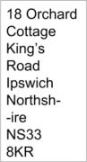

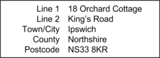
####  Showing empty address elements See Figure 7 The address looks incomplete yet may

not be: the user cannot tell

Table 3: Incorrect Address Display Examples

Page 6

Copyright ©2013 Health and Social Care Information Centre

HSCIC Controlled Document

##### 2.1.4 Rationale

This section discusses the reasons underlying the guidance for address display.

_**2.1.4.1**_ _**Splitting Addresses**_

The address is a secondary but important item of information for correct patient identification, as it can distinguish the correct individual when multiple matches are found based only on name and gender. The address must therefore be displayed in a form that is easy to read and understand. The vertical display shown in Figure 1 supports this easy-to-read form, even for very long addresses. The horizontal display shown in Figure 2 is less effective. In, Figure 1 and Figure 2, the individual elements of the address are kept intact. In cases where display space is restricted, column widths may require that address elements are split, for example, displaying a street or a county name over multiple lines. This makes the address harder to read correctly, as can be seen in Figure 3:

Figure 3: Address Element Wrongly Split in a Vertical Display

The guidance therefore recommends that text is not split within an address element.

_**2.1.4.2**_ _**Truncating Addresses**_

The importance of the address in patient identification has been discussed in section 1.1 and section 2.1.4.1. Truncating an address can make patient identification harder. It is therefore important to ensure the user is aware that an address is truncated and that they are able to access the full address. The guidance recommends the use of an ellipsis to achieve this, as shown in these figures:

Figure 4: Partial Address in a Vertical Display

Figure 5: Partial Address in a Horizontal Display

_**2.1.4.3**_ _**Readability**_

In written communication a mix of left-aligned and right-aligned addresses may be appropriate. Such addresses should be displayed in the same form on a monitor as they would appear when printed. However, when addresses that are not part of printed communication are to be viewed on a monitor, the guidance recommends left-aligning them, as that is normal and expected practice.

Page 7

Copyright ©2013 Health and Social Care Information Centre

HSCIC Controlled Document

_**2.1.4.4**_ _**Labels**_

Labels for each address element, such as ‘Town/City’ and ‘County’ are useful when entering addresses, and are discussed later in this document. However, when reading an address, these labels are rarely helpful as users can understand an address themselves, identifying the different elements correctly. Users of screen reader software will be inconvenienced when an easily understood address is broken up into its constituent elements, and each label spoken before the element. Hence this guidance recommends that labels for individual address elements, as shown in Figure 6, should not be displayed:

Figure 6: Labels Wrongly Applied in a Vertical Display

_**2.1.4.5**_ _**Missing Address Elements**_

When displaying an address it is not helpful to display empty address elements, as shown in Figure 7:

Figure 7: Empty Address Elements Wrongly Used in a Horizontal Display

This design is confusing and implies the address is incorrect. It may arise because not all elements in the address input control are required, for example, when inputting a London address, the ‘County’ element may be left blank. Additionally, screen reader software would read the punctuation and further confuse the user.

For both these reasons, the guidance recommends empty address elements are not displayed.

#### 2.2 Address Input Data Elements

The minimum number of boxes required for inputting a UK address can vary. Many addresses will only require three input boxes:

- House number and street

- Town or city

- Postcode

In addition, non-London addresses will require a ‘County’ box, and all addresses might need the name of a locality or suburb. Some addresses are not in a town but may refer to one, for example, for a farm near a town. Finally, as this control is specifically for UK addresses, no ‘Country’ input box need be provided. In this guidance we therefore recommend provision of six input boxes.

This guidance only recommends the number of input boxes so that ISVs have the flexibility to design the address control as suited to their application. During design, reference should be made to the _NHS Data Model and Dictionary_ _[1]_ and the _NHS Connecting for Health Personal_ _Demographics Service_ _[2]_ (PDS) to ensure that content and field lengths comply with the requisite standards.

1 NHS Data Model and Dictionary **{R4}** [:http://www.datadictionary.nhs.uk/index.asp](http://www.datadictionary.nhs.uk/index.asp)

2 The Personal Demographics Service **{R5}** [: http://www.connectingforhealth.nhs.uk/systemsandservices/demographics/pds/](http://www.connectingforhealth.nhs.uk/systemsandservices/demographics/pds/)

Page 8

Copyright ©2013 Health and Social Care Information Centre

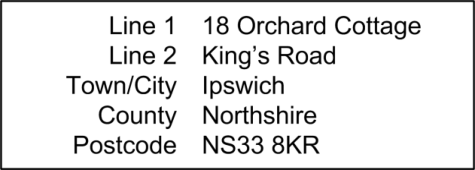
HSCIC Controlled Document

##### 2.2.1 First Three Address Lines

Any address input control must not require that a property have a number, as some will only have a name, for example, ‘The Old Mill House’. The input control must also support the input of multiple numbers, such as for a flat and its building. Therefore, in this guidance we mandate that the first three input boxes for all details up to and including street have labels that do not constrain what can be entered. These labels are ‘Line 1’, ‘Line 2’, and ‘Line 3’ respectively.

Where possible, designers of NHS clinical applications should consider validation of the address at time of input in line with PDS entry order.

Figure 8 illustrates an example address input control in a default state:

Figure 8: Example Address Input Control

##### 2.2.2 Town/City

The Town/City input box is displayed immediately below the ‘Line 3’ input box and is in the form of a free-text entry box.

Figure 9 illustrates an example address input control with the Town/City data input:

Figure 9: Example Address Input Control with Town/City Input

Page 9

Copyright ©2013 Health and Social Care Information Centre

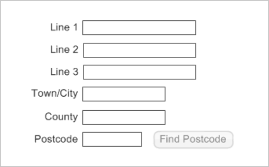

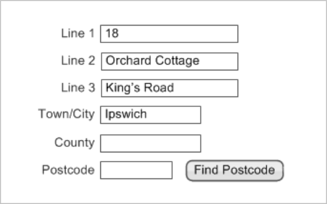
HSCIC Controlled Document

##### 2.2.3 County

The County input box is displayed immediately below the Town/City input box and is in the form of a free-text entry box.

Figure 10 illustrates an example address input control with the County input:

Figure 10: Example Address Input Control with County Input

##### 2.2.4 Postcode

The postcode is a combination of between five and seven letters and numbers. Each postcode consists of two parts separated by a single space:

- The outward postcode, or outcode

- The inward postcode, or incode

Permitting the input of partial postcodes is recommended because often this is all that users will know or have access to. However, NHS requirements for improving data quality can be supported by enabling a user to search for a postcode given the input of as much address information as they can provide. This facility would require that NHS clinical applications offer a postcode-lookup service. Where this facility is not supported, do not misleadingly display a means to invoke it, such as a button. In such cases, where a postcode is entered, it cannot be validated against the address, but only against a format description, as described in _Cabinet Office: UK Government_ _Data Standards Catalogue_ **{R6}** .

The label for the postcode input box is ‘Postcode’ (and not ‘Post code’), as this is the spelling used in _Cabinet Office: UK Government Data Standards Catalogue_ **{R6}**, and by Royal Mail **{R7}** . Where input boxes are used, the guidance on their labels is mandatory.

Figure 11 illustrates an example address input control with a Postcode input:

Figure 11: Example Address Input Control with Postcode Input

Page 10

Copyright ©2013 Health and Social Care Information Centre

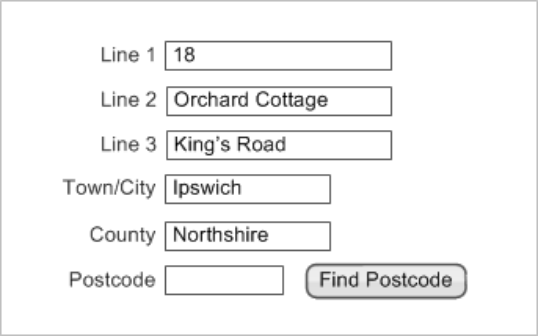

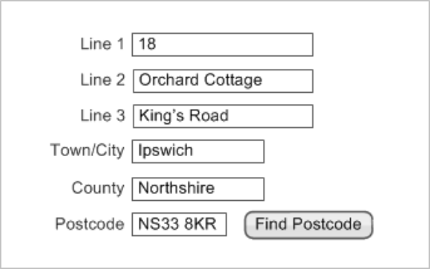
HSCIC Controlled Document

#### 2.3 UK Address Input

The purpose of the UK address input control is to enable the user to input a UK address. The control is shown in Figure 12:

Figure 12: The UK Address Input Control

##### 2.3.1 Hints, Prompts and Tooltips

The input control may provide a hint, prompt, or tooltip. Hints are instructional text placed outside but adjacent to the ‘Text Input Box’. Prompts are commonly known as watermarks and comprise instructional text placed within a text input box. Tooltips are instructional text that appear when the mouse pointer is placed over the text input box. The wording of hints, prompts and tooltips is left to the designers of NHS clinical applications. Examples of hints, prompts, and tooltips are shown in Figure 13, Figure 14 and Figure 15 respectively.

Figure 13: Example UK Address Control with Hints

Figure 14: Example UK Address Control with Prompts

Page 11

Copyright ©2013 Health and Social Care Information Centre

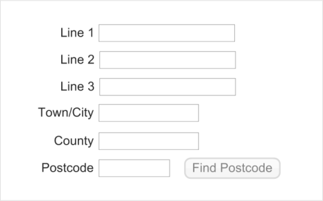

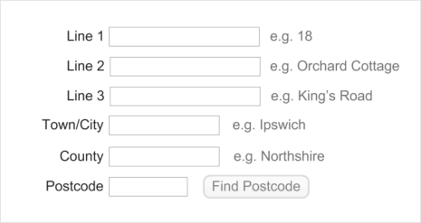

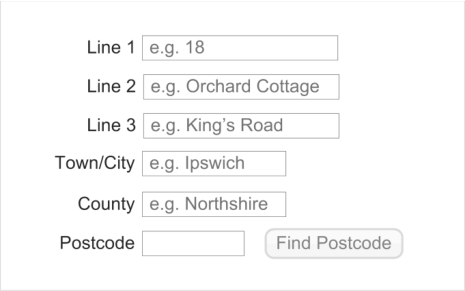
HSCIC Controlled Document

Figure 15: Example UK Address Controls with Tooltips

##### 2.3.2 Guidance

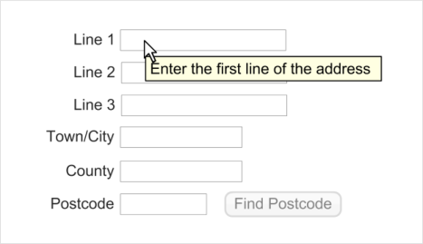

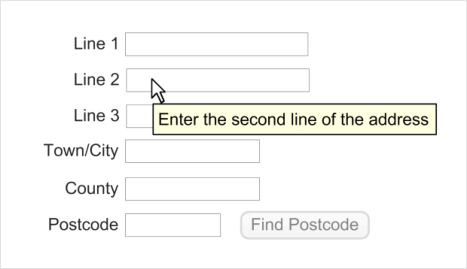

ADR-0011 Provide the following text input boxes, in the stated order, for UK address input:

 Three boxes for input of all details up to and including the street name

 One box for input of the town or city

 One box for input of the county

 One box for input of the postcode

ADR-0012 Where text input boxes are used, they must be labelled as follows:

 The three boxes for input of all details up to and including the street name, must be

labelled ‘Line 1’, ‘Line 2’ and ‘Line 3’ respectively

 The box for input of the town or city should be labelled ‘Town/City’

 The box for input of the county should be labelled ‘County’

 The box for input of the postcode should be labelled ‘Postcode’

Recommended

Mandatory

ADR-0013 Provide a means to find a postcode, to enhance data quality Recommended

ADR-0014 Display a means to find a postcode only if such a service is supported, positioning it after the postcode input box, and labelling it ‘Find Postcode’

Recommended

ADR-0015 Set the length of the postcode input box to 8 characters Mandatory

ADR-0016 Set the length of the county input box to 18 characters Recommended

ADR-0017 Set the height of each text input box to the largest character height in the currently active display font, taking the user’s settings into account

Recommended

ADR-0018 Display the text input boxes vertically with left alignment Recommended

ADR-0019 Display the labels immediately to the left of their corresponding text input box, mutually right-aligning the labels

ADR-0020 Permit address input via all the mechanisms supported on a platform such as, but not limited to, typing on a keyboard, copy and paste, and handwriting with a stylus

Copyright ©2013 Health and Social Care Information Centre

Recommended

Recommended

Page 12

HSCIC Controlled Document

ADR-0021 Permit the following characters in the address: uppercase and lowercase letters, numbers 0 to 9, the full stop, forward slash, comma, colon, apostrophe space and the hyphen

Table 4: Guidance for UK Address Input

##### 2.3.3 Examples of Correct Usage

Recommended

for. The labels are aligned to their respective boxes. All the boxes are present. These factors together contribute to complete and error-free address entry

Table 5: Correct UK Address Input Example

##### 2.3.4 Examples of Incorrect Usage

for example, the postcode box is much too large. This could mislead the user into entering incorrect data

####  The labels are left-aligned  The ‘Postcode’ input box precedes the

‘County’ input box

####  There is no ‘Postcode' input box

Table 6: Incorrect UK Address Input Examples

##### 2.3.5 Rationale

Left-alignment makes it difficult to relate the labels to their boxes and the wrong data may be entered, for example the county may be entered in the ‘Postcode’ box

The postcode must be the last item of a UK address as that is the Royal Mail’s recommendation for efficient sorting

The postcode must be entered for efficient sorting and to minimise the risk to patient confidentiality that will occur if information is sent to the wrong address

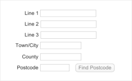

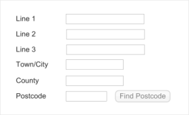

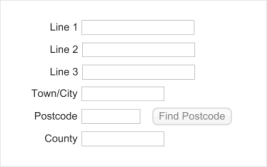

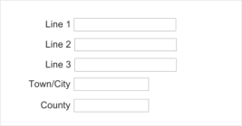

This section discusses the reasons underlying the guidance for UK address input.

Copyright ©2013 Health and Social Care Information Centre

Page 13

HSCIC Controlled Document

_**2.3.5.1**_ _**Alternative Designs**_

Alternative designs, shown in Figure 16, Figure 17 and Figure 18, were considered for the UK address input control.

Figure 16: A Rejected Design – Horizontal Input

Horizontal layout saves on screen space but risks making address input more error prone. This is because it is harder for the user to read all the elements together when checking an address after input. The vertical layout is superior in this respect and thereby better supports the NHS requirement for greater data quality. For this reason, the horizontal layout shown in Figure 12 is rejected.

Figure 17: A Rejected Design – Unstructured Input

Figure 18: A Rejected Design – Semi-Structured Input

Unstructured address input is the easiest form of data entry for a user. It allows for unusually long addresses to be entered. Also, where data is entered using copy and paste it allows for very efficient input (there is no need to repeatedly tab to the next field). However, there is a great cost in terms of data quality. An address entered in a free-form box cannot be validated because an NHS clinical application would not be able to parse the individual elements, for example, the street name. Thus, any errors in this address input will be propagated instead of being sifted out. In the online user survey 78% of respondents preferred the design in Figure 15 to those in Figure 17 and Figure 18. For these reasons, the unstructured and semi-structured address input designs were rejected.

Page 14

Copyright ©2013 Health and Social Care Information Centre

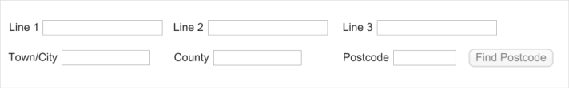

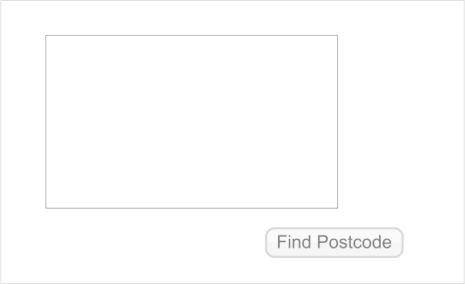

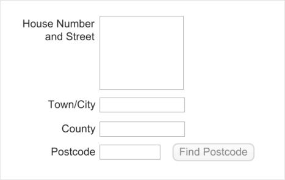
HSCIC Controlled Document

_**2.3.5.2**_ _**Permissible Characters**_

It is important to support input of the full range of potential addresses. Most frequently, these will be ordinary residential addresses but support is also required for other addresses such as, but not limited to, post office boxes, caravan sites, and mobile homes. For UK addresses, diacritical characters need not be supported. However, characters such as the full stop, forward slash, comma, hyphen, colon, apostrophe, space and all alpha-numeric characters could form part of a UK address and so their input should be supported.

_**2.3.5.3**_ _**Height and Length of the Address Input Boxes**_

The dimensions of each text input box should correctly indicate the intended purpose of the box, namely to enter a single element of an address. The height of each box should therefore be adequate to accommodate a single line, not a paragraph. The length of each box should be sufficient to permit the user to read the address element in its entirety. The checking of an address after it has been entered is a common task that users will perform each time. When a user enters an address in a box that is too short, the initial characters will scroll to the left side of the box. The user will then be forced to scroll back to the start of the box to reveal the initial characters. Keyboard users will either have to locate the left arrow or the HOME key, thereby reducing task efficiency.

Guidance on precise lengths for the input boxes are as stated in _The NHS Data Model and_ _Dictionary_ **{R4}** . The length of the postcode input box must be eight characters exactly, as this is the maximum permissible length stated in _Cabinet Office: UK Government Data Standards_ _Catalogue_ **{R6}** . The longest name for a county in the United Kingdom is Kirkcudbrightshire, in Scotland, which is 18 characters long. The minimum length of the county input box must, therefore, be 18 characters as a box of this size will display a county name in its entirety. Designers of NHS clinical applications will be constrained by the screen size available to their application and must decide on sizes for these input boxes accordingly.

_**2.3.5.4**_ _**Enabling the Postcode Finder**_

The minimum information that a postcode finder requires to identify a location is a street name and a town or city name. Hence, only enable the postcode finder after the user has entered this information. Figure 19 to Figure 22 show this sequence.

Figure 19: Input of House Number

Page 15

Copyright ©2013 Health and Social Care Information Centre

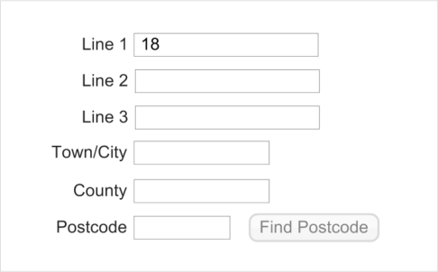
HSCIC Controlled Document

Figure 20: Input of House Name

Figure 21: Input of Street Name

Figure 22: Input of Town/City Enables the Postcode Finder

**Important**

Where a postcode lookup service is provided, it need only support UK postcodes.

Copyright ©2013 Health and Social Care Information Centre

Page 16

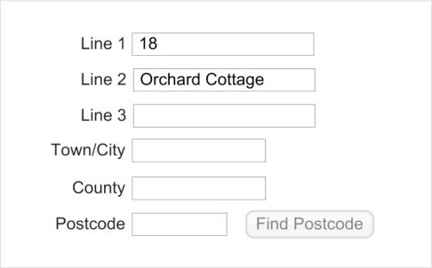

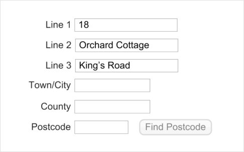

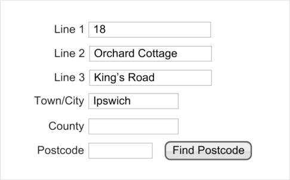
HSCIC Controlled Document

#### 2.4 UK Address Finder

The purpose of the UK Address Finder control is to enable the user to find a UK address. Such a control is shown in Figure 23:

Figure 23: The UK Address Finder Control

An NHS Clinical application should only provide this control if it supports a postcode-based address lookup service. Typically, all the matching addresses found in the database are displayed in an address picker. The user then selects one of these addresses and it is stored as if the user had input the whole address. There are two advantages in such an approach:

- There is an increase in data quality as only valid address can be selected

- The user is saved time by not having to input the full address

**Note**

The implementation of an address picker is not part of the scope of this guidance and is therefore not described in this document.

##### 2.4.1 Hints, Prompts and Tooltips

The finder control may provide hints, prompts, or tooltips. The wording of hints and prompts will depend on the context. Examples of the display of hints, prompts, and tooltips, including suggested text, are shown in Figure 24, Figure 25 and Figure 26 respectively.

Figure 24: Example of an Address Finder Control with Hints

Figure 25: Example of an Address Finder Control with Prompts

Page 17

Copyright ©2013 Health and Social Care Information Centre

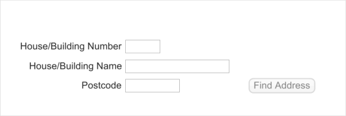

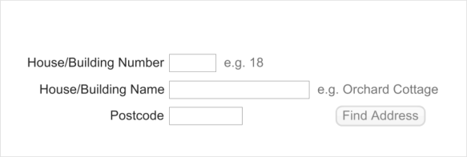

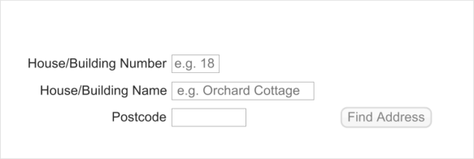
HSCIC Controlled Document

Figure 26: Examples of an Address Finder Control with Tooltips

##### 2.4.2 Guidance

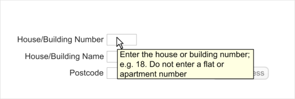

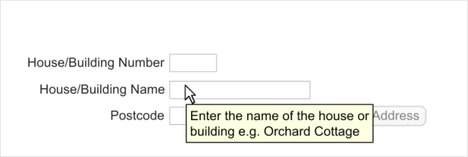

ADR-0031 Provide the following text input boxes, in the stated order, for input of a UK address:

 One box for input of house or building number

 One box for input of house or building name

 One box for input of the postcode

ADR-0032 Where text input boxes are used, they must be labelled as follows:

 The box for input of house or building number should be labelled ‘House/Building Number’

 The box for input of house or building name should be labelled ‘House/Building Name’

 The box for input of the postcode should be labelled ‘Postcode’

ADR-0033 Display a means to find an address only if such a service is supported, positioning it after the postcode input box and labelling it ‘Find Address’

Recommended

Mandatory

Recommended

ADR-0034 Set the length of the postcode input box to 8 characters Mandatory

ADR-0035 Set the height of each text input box to the largest character height in the currently active display font, taking the user’s settings into account

Recommended

ADR-0036 Display the text input boxes vertically with left alignment Recommended

ADR-0037 Display the labels immediately to the left of their corresponding text input box, mutually right-aligning the labels

ADR-0038 Permit address input via all the mechanisms supported on a platform such as, but not limited to, typing on a keyboard, copy and paste, and handwriting with a stylus

Table 7: Guidance for UK Address Finder

Copyright ©2013 Health and Social Care Information Centre

Recommended

Recommended

Page 18

HSCIC Controlled Document

##### 2.4.3 Examples of Correct Usage

sizes, are in the right order, and are indication of the input they are suited correctly aligned with their labels for. The labels are aligned to their

respective boxes. All the boxes are present. These factors together contribute to complete and error-free address entry

Table 8: Correct UK Address Finder Example

##### 2.4.4 Examples of Incorrect Usage

####  The house/building name and number See Figure 27

fields are merged

####  The house/building name and number See Figure 27 This design does not encourage the

fields are merged user to provide both number and name

leading to a larger resulting set from which an address will need to be selected

Data input must precede the search for an address, but this design implies the opposite and is therefore confusing

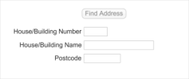

Table 9: Incorrect UK Address Finder Examples

##### 2.4.5 Rationale

This section discusses the reasons underlying the guidance for the UK Address Finder control.

_**2.4.5.1**_ _**Alternative Designs**_

Research into the design of an address finder control showed consensus had been reached on best practice. As there was little variation in competing designs, extensive further exploration was not required. However, two alternative designs, shown in Figure 27 and Figure 28, were considered for the UK address finder control.

Figure 27: A Rejected Design – Merged Fields

A postcode-based address finding service requires both a postcode and a building number to give a unique match. In some cases, buildings will have a name, rather than a number, and users require support to enter such addresses. Flat numbers within a building are not relevant as all apartments in a building will share the same postcode. When compared with Figure 23, the design in Figure 27 confuses the precise information required, and may cause users to leave out a building number or add an apartment number. In the online user survey 76% of respondents said they could not see any problems with the design in Figure 23. To support NHS requirements for data quality, the design in Figure 27 was therefore rejected.

Page 19

Copyright ©2013 Health and Social Care Information Centre

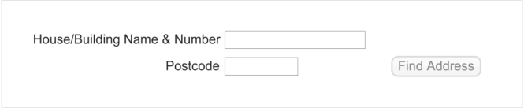
HSCIC Controlled Document

In another candidate design, two input boxes were provided for house name and for house number but with the common text in their labels separated out, as shown in Figure 28.

Figure 28: A Rejected Design – Part Merged Labels

The problem with this design is that it can require considerable effort from developers to create a control that would display as shown on all software platforms. The careful positioning of the ‘House or Building’ label is non-trivial and that of the vertical bar even more so. This design was therefore rejected in favour of Figure 23.

_**2.4.5.2**_ _**Height and Length of the Input Boxes**_

The dimensions of each text input box should correctly indicate the intended purpose of the box, namely to enter a single element of an address. The height of each box should therefore be adequate to accommodate a single line, not a paragraph. The length of the house number input box should be a minimum of five characters so as to accommodate most likely numbers. The length of the postcode input box must be eight characters exactly, as this is the maximum permissible length stated in _Cabinet Office: UK Government Data Standards Catalogue_ **{R6}** . Guidance on precise lengths for the input boxes are as stated in _The NHS Data Model and_ _Dictionary_ **{R4}** . Designers of NHS clinical applications will be constrained by the screen size available to their application and must decide on sizes for these input boxes accordingly.

_**2.4.5.3**_ _**Labels**_

As stated above, apartment numbers are not relevant for a postcode-based address search. Hence the labels are specific in asking for a house or building name and number.

_**2.4.5.4**_ _**Enabling the ‘Find Address’ Functionality**_

To find an address, the minimum information required is the postcode. In most cases, this will match with a handful of properties. A unique match can be obtained with the addition of the building number. Therefore, the ‘Find Address’ functionality must only be enabled after the postcode has been entered, as shown in the following sequence in Figure 29:

Figure 29: Input of Postcode Enables the ‘Find Address’ Functionality

Page 20

Copyright ©2013 Health and Social Care Information Centre

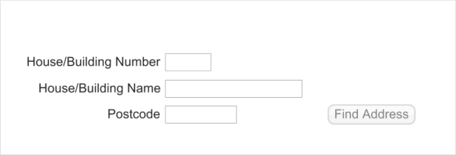

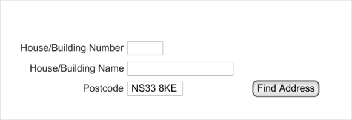
HSCIC Controlled Document

#### 2.5 Non-UK Address Input

There may be reasons to input a foreign address for a patient, for example, for an expatriate living abroad, a patient living abroad temporarily, or a patient providing the address of their next of kin.

The non-UK address input control is shown in Figure 30:

Figure 30: The Non-UK Address Input Control

##### 2.5.1 Guidance

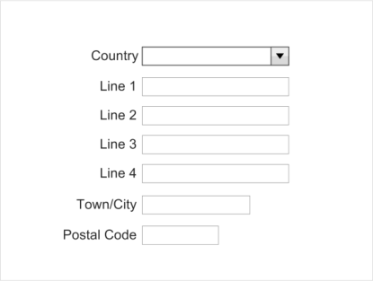

ADR-0050 Provide the following boxes, in the stated order, for input of a non-UK address:

 One editable combo box for country selection

 Four boxes for input of all details up to and including the street name

 One box for input of the town or city

 One box for input of the postal code

ADR-0051 Where used, the boxes must be labelled as follows:

 The editable combo box for country selection should be labelled ‘Country’

 The four boxes for input of all details up to and including the street name, should be

labelled ‘Line 1’, ‘Line 2’, ‘Line 3’ and ‘Line 4’ respectively

 The box for input of the town or city should be labelled ‘Town/City’

 The box for input of the postal code should be labelled ‘Postal Code’

ADR-0052 Set the height of each text input box to the largest character height in the currently active display font, taking the user’s settings into account

Recommended

Mandatory

Recommended

ADR-0053 Display the text input boxes vertically with left alignment Recommended

ADR-0054 Display the labels immediately to the left of their corresponding text input box, mutually right-aligning the labels

ADR-0055 Permit address input via all the mechanisms supported on a platform such as, but not limited to, typing on a keyboard, copy and paste, and handwriting with a stylus

Recommended

Recommended

ADR-0056 Use an editable drop-down combo box for country names Recommended

ADR-0057 Use the list of country names in ISO 3166-1 **{R8}** for the country selector drop-down combo box

Mandatory

ADR-0058 Display the country names in alphabetic order Recommended

ADR-0059 Display the country names with left alignment Recommended

Table 10: Guidance for non-UK Address Input

Page 21

Copyright ©2013 Health and Social Care Information Centre

HSCIC Controlled Document

##### 2.5.2 Examples of Correct Usage

sizes, are in the right order, and are correctly aligned with their labels

sizes, are in the right order, and are indication of the input they are suited correctly aligned with their labels for. The labels are aligned to their

respective boxes. All the boxes are present. These factors together contribute to complete and error-free address entry

The country names are taken from ISO 3166-1 **{R8}**, are displayed in alphabetical order and are left-aligned. With the use of the ISO list, there will always be an entry for any country a user wishes to select, and it will be found in the same place in the list in all ISV applications. These factors promote data quality and a consistent user experience

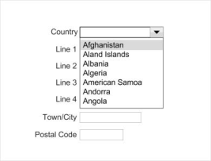

Table11: Correct Non-UK Address Input Examples

##### 2.5.3 Examples of Incorrect Usage

they are entering a non-UK address

####  The alignment of the labels and input

boxes is wrong

####  There is no input box for postal code

Table 12: Incorrect Non-UK Address Input Examples

The extra spacing between the labels and the boxes may cause a user to enter the wrong data in a box, compromising data quality

The postal code makes for efficient and correct delivery and must always be sought from the user. The absence of a postal code input box compromises data quality and potentially patient confidentiality

Page 22

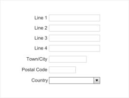

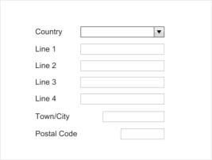

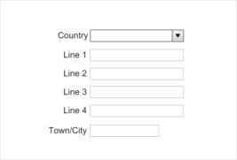

Copyright ©2013 Health and Social Care Information Centre

HSCIC Controlled Document

##### 2.5.4 Rationale

This section discusses the reasons underlying the guidance for the non-UK Address Input control.

_**2.5.4.1**_ _**Alternative Designs**_

A seemingly obvious design for a non-UK address input control is derived from the UK-address control shown in Figure 12 but with the ‘County’ input box replaced with a ‘Country’ input box, as shown in Figure 31:

Figure 31: A Rejected Design – Derivative of the UK Address Control

The similarity with the UK-address control can be a problem. Users may mistake this design for a UK-address control and wish to enter a UK address, perhaps not realising that the county cannot be entered, thus compromising data quality. Also, for all the permutations of foreign addresses, three lines may not be adequate to input all details up to and including street name. Additionally, instead of requiring users to type in a country, it would be helpful if they could select a country from a list (see section 2.5.4.2). Finally, ‘Postcode’ is the term used for postal codes in the UK whereas ‘Postal code’ is the more general term used internationally.

An alternative design also considered (displayed in Figure 32) shows how some of those negative aspects might be addressed:

Figure 32: A Rejected Design – Modified UK Address Design Using a Combo Box

However, this design still does not differentiate itself from the UK address box. A better approach is to place the ‘Country’ box at the top, discouraging input of a UK address. This is the approach taken in the recommended design shown in Figure 30.

Page 23

Copyright ©2013 Health and Social Care Information Centre

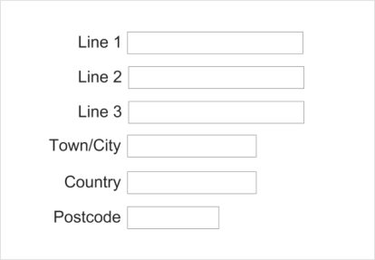

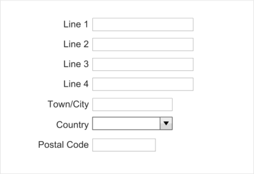
HSCIC Controlled Document

_**2.5.4.2**_ _**The Country Selector**_

A comprehensive list of countries must be displayed in the drop-down list in the Country input box. This guidance mandates the list of countries is taken from _ISO 3166-1 2006 Codes for the_ _representation of names of countries and their subdivisions -- Part 1: Country codes_ **{R8}** . This will ensure that users can reliably find the country for which they need to enter an address. Furthermore, consistency across other controls is enhanced as ISO 3166 is also mandated for telephone number input as described in _Telephone Number Input and Display User Interface_ _Design Guidance_ **{R9}** . Additionally, the list should be ordered in a systematic and consistent form so that users can efficiently find the required country, whatever NHS clinical application they are using. An alphabetic ordering meets this requirement. Finally, some users may find selecting a country from a drop-down list tedious, preferring to type in the country name. The Country box should therefore be editable to support a user typing text directly into the box, bypassing the dropdown list altogether.

_**2.5.4.3**_ _**Screen Readers**_

Users of screen readers may find the reading out of a list of countries tedious. Others may prefer not to select from a list as this requires moving a hand from the keyboard to the mouse and then scrolling to select the correct item. This guidance therefore recommends the country list be provided in an editable combo box so that users can type the country directly, or select from a list, as they prefer.

Page 24

Copyright ©2013 Health and Social Care Information Centre

HSCIC Controlled Document

### 3 DOCUMENT INFORMATION

#### 3.1 Terms and Abbreviations

CUI Common User Interface

GP General Practitioner

ISV Independent Software Vendor

LSP Local Service Provider

NHS National Health Service

NHS CFH NHS Connecting for Health

NPSA National Patient Safety Agency

PDA Personal Digital Assistant

PDS Personal Demographic Service

UI User Interface

Table 13: Terms and Abbreviations

#### 3.2 Definitions

NHS Entity Within this document, defined as a single NHS organisation or group that is operated within a single technical infrastructure environment by a defined group of IT administrators.

The Authority The organisation implementing the NHS National Programme for IT (currently NHS Connecting for Health)

Current best practice Current best practice is used rather than best practice, as over time best practice guidance may change or be revised due to changes to products, changes in technology, or simply the additional field deployment experience that comes over time.

Status Indicates the extent to which you should follow the guideline when defining your UI implementation. There are two levels:

 **Mandatory**             - An implementation should follow the guideline

 **Recommended**             - An implementation is advised to follow the guideline

Table 14: Definitions

#### 3.3 Nomenclature

This section shows how to interpret the different styles used in this document to denote various types of information.

##### 3.3.1 Body Text

Code `Monospace`

Script

Other markup languages

Page 25

Copyright ©2013 Health and Social Care Information Centre

HSCIC Controlled Document

Interface dialog names **Bold**

Field names

Controls

Folder names Title Case

File names

Table 15: Body Text Styles

##### 3.3.2 Cross References

Current document – sections Section number only

Current document – figures/tables Caption number only

Other project documents _Italics_ and possibly a footnote

Publicly available documents _Italics_ with a footnote

External Web-based content _Italics_ and a hyperlinked footnote

Table 16: Cross Reference Styles

#### 3.4 References

**R1.** NHS CUI Programme – Design Guide Entry – Patient Banner 4.0.0.0

**R2.** NHS CUI Programme – Accessibility Checkpoints for NHS Applications 1.0.0.0

**R3.** NHS CUI Programme – Accessibility for Clinical Applications 1.0.0.0

**R4.** NHS Data Model and Dictionary [http://www.datadictionary.nhs.uk/index.asp](http://www.datadictionary.nhs.uk/index.asp)

**R5.** NHS CFH – The Personal Demographics Service [http://www.connectingforhealth.nhs.uk/systemsandservices/demographics/pds/](http://www.connectingforhealth.nhs.uk/systemsandservices/demographics/pds/)

**R6.** Cabinet Office: UK Government Data Standards Catalogue [http://www.govtalk.gov.uk/gdsc/html/noframes/PostCode-2-1-Release.htm](http://www.govtalk.gov.uk/gdsc/html/noframes/PostCode-2-1-Release.htm)

**R7.** Royal Mail: Find a Postcode [http://postcode.royalmail.com/portal/rm/postcodefinder?catId=400145&pageId=pcaf_pc_searc](http://postcode.royalmail.com/portal/rm/postcodefinder?catId=400145&pageId=pcaf_pc_search&gear=postcode) [h&gear=postcode](http://postcode.royalmail.com/portal/rm/postcodefinder?catId=400145&pageId=pcaf_pc_search&gear=postcode)

**R8.** ISO 3166-1: 2006 Codes for the representation of names of countries and their subdivisions -Part 1: Country codes [http://www.iso.org/iso/country_codes/iso_3166_code_lists/english_country_names_and_code](http://www.iso.org/iso/country_codes/iso_3166_code_lists/english_country_names_and_code_elements.htm) [_elements.htm](http://www.iso.org/iso/country_codes/iso_3166_code_lists/english_country_names_and_code_elements.htm) and [http://www.iso.org/iso/iso_catalogue/catalogue_tc/catalogue_detail.htm?csnumber=2130](http://www.iso.org/iso/iso_catalogue/catalogue_tc/catalogue_detail.htm?csnumber=2130)

**R9.** NHS CUI Programme – Telephone Number Input and Display – User Interface Design Guidance

Table 17: References

Copyright ©2013 Health and Social Care Information Centre

Version 3

3.0.0.0

Page 26

HSCIC Controlled Document

### REVISION AND SIGNOFF SHEET

#### Change Record

02-Feb-2008 Ash Gupta 0.0.0.1 Initial draft

21-Feb-2008 Mick Harney 0.0.0.2 Initial copyedit

22-Feb-2008 Ash Gupta 0.0.0.3 Responses to copyedit

22-Feb-2008 Mick Harney 0.0.1.0 Raised to Working Baseline

04-Mar-2008 Ash Gupta 0.0.1.1 Comments in CRS documents incorporated

07-Mar-2008 Simon Burnham 0.0.1.2 Second copyedit

07-Mar-2008 Ash Gupta 0.0.1.2 Responses to copyedit

07-Mar-2008 Vivienne Jones 0.1.0.0 Baseline Candidate for verification

12-Mar-2008 Vivienne Jones 2.0.0.0 Baseline following email from Ash Gupta. Raised this to Baseline 2.0.0.0 as there was a previous Address Display document that this is replacing. Baseline 2.0.0.0 is in keeping with what has been applied to other guidance documents.

20-Apr-2009 Mick Harney 2.0.0.1 Foundation draft for ISB updates

09-Jun-2009 Rachel Eno 2.0.0.2 Updates

09-Jun-2009 Mick Harney 2.0.0.3 Copyedited updates

12-Jun-2009 Rachel Eno 2.0.0.4 Final revisions

12-Jun-2009 Mick Harney 2.1.0.0 Raised to Baseline Candidate

24-Jun-2009 Simon Burnham 3.0.0.0 Raised to Baseline

Document Status has the following meaning:

- **Drafts 0.0.0.X**  - Draft document reviewed by the Microsoft CUI project team and the

Authority designate for the appropriate Workstream. The document is liable to change

- **Working Baseline 0.0.X.0**  - The document has reached the end of the review phase and

may only have minor changes. The document will be submitted to the Authority CUI project team for wider review by stakeholders, ensuring buy-in and to assist in communication

- **Baseline Candidate 0.X.0.0**  - The document has reached the end of the review phase and

it is ready to be frozen on formal agreement between the Authority and the Company

- **Baseline X.0.0.0**  - The document has been formally agreed between the Authority and the

Company

Note that minor updates or corrections to a document may lead to multiple versions at a particular status.

#### Open Issues Summary

None

Page 27

Copyright ©2013 Health and Social Care Information Centre

HSCIC Controlled Document

#### Audience

The audience for this document includes:

- **Authority CUI Manager / Project Sponsor** . Overall project manager and sponsor for the

NHS CUI project within the Authority.

- **Authority CAPS Project Manager.** Responsible for ongoing management and

administration of the Project.

- **The Authority Project Team** . The Authority team involved in the development of this

document.

- **Microsoft NHS CUI Team** . The Authority team responsible for the development of this

document.

#### Reviewers

Mike Carey Toolkit Workstream Lead

Tim Chearman UX Architect

#### Distribution

Mike Carey Toolkit Workstream Lead

Tim Chearman UX Architect

#### Document Properties

Document Title Address Input and Display User Interface Design Guidance

Author NHS CUI Programme Team

Restrictions **RESTRICTED – COMMERCIAL; MICROSOFT COMMERCIAL;** Access restricted to: NHS CUI Project Team, Microsoft NHS Account Team

Creation Date 19 November 2007

Last Updated 23 June 2015

**Copyright:**

You may re-use this information (excluding logos) free of charge in any format or medium, under the terms of the Open Government Licence. To view this licence, visit [nationalarchives.gov.uk/doc/open-government-licence or email psi@nationalarchives.gsi.gov.uk.](https://web.nhs.net/OWA/redir.aspx?C=dMnSAL43xUOp9X_SOcscV9mT5A0smdBIh1_vxjdSDVCERI33v7-idn6tNFCNwJYUR1PxIW-Hd-E.&URL=http%3a%2f%2fnationalarchives.gov.uk%2fdoc%2fopen-government-licence)

Page 28

Copyright ©2013 Health and Social Care Information Centre
