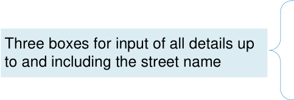
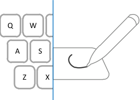

# Address Input and Display

<!-- TOC -->
<!-- TOC generated by Markdown All in One style -->

- [Address Input and Display](#address-input-and-display)
  - [Quick Implementation Guide](#quick-implementation-guide)
    - [Edition 1 22 [nd] April 2010](#edition-1-22-nd-april-2010)
      - [1](#1)
      - [Introduction Introduction](#introduction-introduction)
      - [2](#2)
      - [Guidance](#guidance)
    - [Address Display](#address-display)
      - [3](#3)
      - [When displaying an address horizontally, only use a single comma and a single space, in that order, to delimit the different fields](#when-displaying-an-address-horizontally-only-use-a-single-comma-and-a-single-space-in-that-order-to-delimit-the-different-fields)
      - [When displaying an address vertically, do not use a comma at the end of a line](#when-displaying-an-address-vertically-do-not-use-a-comma-at-the-end-of-a-line)
      - [When displaying an address vertically, left-align the text for ease of reading](#when-displaying-an-address-vertically-left-align-the-text-for-ease-of-reading)
      - [18 Orchard Cottage, King’s Road... When truncating an address, add an ellipsis to indicate that the address is not displayed in full and, where appropriate, provide a means for the user to access the full address](#18-orchard-cottage-kings-road-when-truncating-an-address-add-an-ellipsis-to-indicate-that-the-address-is-not-displayed-in-full-and-where-appropriate-provide-a-means-for-the-user-to-access-the-full-address)
      - [Do not split an address address across multiple lines](#do-not-split-an-address-address-across-multiple-lines)
      - [4](#4)
      - [Ipswich Where part of an address is](#ipswich-where-part-of-an-address-is)
      - [not available, do not display](#not-available-do-not-display)
      - [an empty string in its place](#an-empty-string-in-its-place)
      - [Display the postcode in all caps with a space between the first part (the outcode) and the second part (the incode)](#display-the-postcode-in-all-caps-with-a-space-between-the-first-part-the-outcode-and-the-second-part-the-incode)
      - [Do not display labels for individual address elements](#do-not-display-labels-for-individual-address-elements)
      - [5](#5)
    - [UK Address Input](#uk-address-input)
      - [6](#6)
      - [Provide a means to find a postcode, to enhance data quality](#provide-a-means-to-find-a-postcode-to-enhance-data-quality)
      - [Provide these input boxes, in the stated order, for UK address input](#provide-these-input-boxes-in-the-stated-order-for-uk-address-input)
      - [Where text input boxes are used, they must be labelled as illustrated](#where-text-input-boxes-are-used-they-must-be-labelled-as-illustrated)
      - [Display a means to find a postcode only if such a service is supported, positioning it after the postcode input box and labelling it ‘Find Postcode’](#display-a-means-to-find-a-postcode-only-if-such-a-service-is-supported-positioning-it-after-the-postcode-input-box-and-labelling-it-find-postcode)
      - [7 Copyright ©2013 Health and Social Care Information Centre](#7-copyright-2013-health-and-social-care-information-centre)
      - [input box to 8 characters](#input-box-to-8-characters)
      - [Set the length of the ‘County’](#set-the-length-of-the-county)
      - [input box to 18 characters](#input-box-to-18-characters)
      - [Set the height of each text input box to the largest character height in the currently active display font, taking the user’s settings into account](#set-the-height-of-each-text-input-box-to-the-largest-character-height-in-the-currently-active-display-font-taking-the-users-settings-into-account)
      - [8](#8)
      - [Display the text input boxes vertically with left alignment](#display-the-text-input-boxes-vertically-with-left-alignment)
      - [Display the labels immediately to the left of their corresponding text input box, mutually right-aligning the labels](#display-the-labels-immediately-to-the-left-of-their-corresponding-text-input-box-mutually-right-aligning-the-labels)
      - [Permit address input via all the mechanisms supported on a platform such as, but not limited to, typing on a keyboard, copy and paste, and handwriting with a stylus](#permit-address-input-via-all-the-mechanisms-supported-on-a-platform-such-as-but-not-limited-to-typing-on-a-keyboard-copy-and-paste-and-handwriting-with-a-stylus)
      - [9](#9)
      - [Permit the illustrated characters in an address](#permit-the-illustrated-characters-in-an-address)
      - [10](#10)
      - [11](#11)
    - [UK Address Finder](#uk-address-finder)
      - [Provide these text input boxes, in the stated order, for input of a UK address](#provide-these-text-input-boxes-in-the-stated-order-for-input-of-a-uk-address)
      - [12](#12)
      - [Display a means to find an address only if such a service is supported, positioning it after the postcode input box and labelling it ‘Find Address’](#display-a-means-to-find-an-address-only-if-such-a-service-is-supported-positioning-it-after-the-postcode-input-box-and-labelling-it-find-address)
      - [Set the length of the postcode input box to 8 characters](#set-the-length-of-the-postcode-input-box-to-8-characters)
      - [13](#13)
      - [to the left of their corresponding text input box, mutually right-aligning the labels](#to-the-left-of-their-corresponding-text-input-box-mutually-right-aligning-the-labels)
      - [14](#14)
    - [Non-UK Address Input](#non-uk-address-input)
      - [15](#15)
      - [Provide the illustrated boxes, in the stated order, for input of a non-UK address](#provide-the-illustrated-boxes-in-the-stated-order-for-input-of-a-non-uk-address)
      - [Where used, the boxes must be labelled as illustrated](#where-used-the-boxes-must-be-labelled-as-illustrated)
      - [Display the input boxes vertically with left alignment](#display-the-input-boxes-vertically-with-left-alignment)
      - [16](#16)
      - [Use an editable drop-down combo box for country names](#use-an-editable-drop-down-combo-box-for-country-names)
      - [Use the list of country names](#use-the-list-of-country-names)
      - [Display the country names in alphabetic order](#display-the-country-names-in-alphabetic-order)
      - [Display the country names with left alignment](#display-the-country-names-with-left-alignment)
      - [17](#17)

<!-- /TOC -->

Source PDF: [addressqig.pdf](../../pdfs/patient-identification-and-information-entry-and-display/addressqig.pdf)

## Quick Implementation Guide
### Edition 1 22 [nd] April 2010
0.0.0.1
07-Mar-2010 Changed illustration for ADR-0052
**This document was prepared for NHS Connecting for Health which ceased to exist on 31 March 2013. It may**
**contain references to organisations, projects and other initiatives which also no longer exist. If you have any**
**questions relating to any such references, or to any other aspect of the content, please contact**
**cuistakeholder.mailbox@hscic.gov.uk**
**Copyright:** You may re-use this information (excluding logos) free of charge in any format or medium, under the terms of the Open Government Licence. To view this licence, visit nationalarchives.gov.uk/doc/open-governmentlicence or email psi@nationalarchives.gsi.gov.uk.
#### 1

Copyright ©2013 Health and Social Care Information Centre

#### Introduction Introduction

Record and display postal addresses in clinical applications accurately and consistently in order to support:

  - Patient identification

  - Service delivery (such as sending appointment letters)

  - Data interoperability

**Important**

Although it contains all of the guidance points, this document omits supporting information and is therefore not intended as a substitute for the full NHS CUI document _Address Input and Display_ **[1]** . Refer to that document for the definitive statement of the design guidance in this area.

The visual representations used to display the guidance are illustrative only. Stylistic choices (for example, display font used), unless otherwise specified, are not part of the guidance and are therefore not mandatory requirements.

**1** Address Input and Display – User Interface Design Guidance (v3.0.0.0)

Copyright ©2013 Health and Social Care Information Centre

#### 2

#### Guidance

### Address Display

There are two forms of address display supported by this guidance that apply to both UK and non-UK addresses:

18 Orchard Cottage King’s Road Ipswich Northshire NS33 8KR

_In-form or vertically aligned address_

18 Orchard Cottage, King’s Road, Ipswich, Northshire, NS33 8KR

_In-line or horizontally aligned address_

#### 3

Copyright ©2013 Health and Social Care Information Centre

#### Guidance

### Address Display

18 Orchard Cottage, King’s Road, Ipswich, Northshire, NS33 8KR

ADR-0001
#### When displaying an address horizontally, only use a single comma and a single space, in that order, to delimit the different fields

Mandatory

ADR-0002

18 Orchard Cottage King’s Road Ipswich Northshire NS33 8KR

#### When displaying an address vertically, do not use a comma at the end of a line

_Recommended_

ADR-0003
#### When displaying an address vertically, left-align the text for ease of reading

_Recommended_

ADR-0004

#### 18 Orchard Cottage, King’s Road... When truncating an address, add an ellipsis to indicate that the address is not displayed in full and, where appropriate, provide a means for the user to access the full address

_Recommended_

ADR-0005

#### Do not split an address address across multiple lines

|18 Orchard|Cottage,|
|---|---|
|King’s Road|, Ipswich,|
|Northshire,|NS33 8KR|

_Wrapping of the address has caused ‘King’s_
_Recommended_
_Road’ to be displayed on a new line. It has_
_wrapped without splitting the two words_

Copyright ©2013 Health and Social Care Information Centre

#### 4

#### Guidance

### Address Display

18 Orchard Cottage Ipswich Northshire NS33 8KR

ADR-0006

#### Ipswich Where part of an address is

Northshire
#### not available, do not display
NS33 8KR
#### an empty string in its place

_Recommended_
_The name of the road is missing_

|NS33 8KR|Col2|
|---|---|
|||

space

Address

18 Orchard Cottage Ipswich Northshire NS33 8KR

ADR-0007
#### Display the postcode in all caps with a space between the first part (the outcode) and the second part (the incode)

Mandatory

ADR-0008
#### Do not display labels for individual address elements

_Recommended_

Copyright ©2013 Health and Social Care Information Centre

#### 5

#### Guidance

### UK Address Input

The minimum number of data elements required for input of a UK address can vary. Many addresses will only require three elements:

     - House number and street

     - Town or city

     - Postcode

However, addresses outside of London will require a ‘County’ and all addresses might need the name of a locality or suburb. During design, reference should be made to the _NHS Data Model and Dictionary_ **[1]** and the _NHS Connecting for Health_ _Personal Demographics Service_ (PDS) **[2]** to ensure that content and field lengths comply with the requisite standards.

Where possible, designers of NHS clinical applications should consider validation of the address at time of input in line with PDS entry order.

**1** NHS Data Model and Dictionary

http://www.datadictionary.nhs.uk/index.asp

**2** The Personal Demographics Service

[http://www.connectingforhealth.nhs.uk/systemsandservices/demographics/pds/](http://www.connectingforhealth.nhs.uk/systemsandservices/data/scg/publications/SCG002305.pdf)

Copyright ©2013 Health and Social Care Information Centre

#### 6

#### Guidance

### UK Address Input

One box for input of the town or city

One box for the input of the county

One box for the input of the postcode

Line 1

Line 2

Line 3

Town / City

County

ADR-0013
#### Provide a means to find a postcode, to enhance data quality

_Recommended_

Line 1

Line 2

Line 3

Town / City

County

ADR-00011
#### Provide these input boxes, in the stated order, for UK address input

_Recommended_

ADR-0012
#### Where text input boxes are used, they must be labelled as illustrated

Mandatory

**Note** This guidance applies to the text of the labels, not the formatting

ADR-0014
#### Display a means to find a postcode only if such a service is supported, positioning it after the postcode input box and labelling it ‘Find Postcode’

_Recommended_

#### 7 Copyright ©2013 Health and Social Care Information Centre

#### Guidance

### UK Address Input

ADR-0015

#### input box to 8 characters

8 characters Mandatory

ADR-0016
#### Set the length of the ‘County’

County
#### input box to 18 characters

18 characters

_Recommended_

ADR-0017

#### Set the height of each text input box to the largest character height in the currently active display font, taking the user’s settings into account

_Recommended_

Copyright ©2013 Health and Social Care Information Centre

Line 1

Line 2

#### 8

#### Guidance

### UK Address Input

ADR-0018
#### Display the text input boxes vertically with left alignment

_Recommended_

ADR-0019

#### Display the labels immediately to the left of their corresponding text input box, mutually right-aligning the labels

Right align _Recommended_

labels

|1 2 3 ty ty e|Left align input fields Find Postcode|
|---|---|
|||

ADR-0020

#### Permit address input via all the mechanisms supported on a platform such as, but not limited to, typing on a keyboard, copy and paste, and handwriting with a stylus

_Recommended_

Copyright ©2013 Health and Social Care Information Centre

#### 9

#### Guidance

### UK Address Input

ADR-0021

#### Permit the illustrated characters in an address

_Recommended_

Copyright ©2013 Health and Social Care Information Centre

|Aa|Uppercase and lowercase letters|
|---|---|
|0-9|Numbers 0 to 9|
|.|The full stop|
|/|Forward slash|
|,|Comma|
|:|Colon|
|‘|Apostrophe|
||Space|
|-|Hyphen|

#### 10

#### Guidance

### UK Address Input

Though the guidance does not define it, the input control should provide instructional text to guide input. This could be by using hints (text outside the text input box), prompts (watermarks inside the text input box), or tool tips.

Town / City

County

Town / City

County

Line 1

Line 2

e.g. Ipswich

e.g. Northshire

Instructional text outside of the text input box

e.g. Ipswich

e.g. Northshire

Instructional text inside the text input box

|Enter the first lin|Col2|Col3|
|---|---|---|
|Enter the first lin|Enter the first lin|Enter the first lin|
||||

Instructional text in a tool tip

#### 11

Copyright ©2013 Health and Social Care Information Centre

#### Guidance

### UK Address Finder

A UK address finder should only be provided if the clinical application supports a postcode-based address lookup service. Typically, all the matching addresses found in the database are displayed in an address picker. The user then selects one of these addresses and it is stored as if the user had input the whole address.

Thought the guidance does not define it, the finder control may provide additional text by using hints, prompts or tool tips.

House / Building Number

House / Building Name

Postcode

UK Address Finder

ADR-0031

|1 box|For input of house or building number|
|---|---|
|1 box|For input of house or building name|
|1 box|For input of the postcode|

House / Building Number

House / Building Name

Postcode

#### Provide these text input boxes, in the stated order, for input of a UK address

_Recommended_

ADR-0032

#### Where text input boxes are used, they must be labelled as illustrated

Mandatory

Copyright ©2013 Health and Social Care Information Centre

#### 12

#### Guidance

### UK Address Finder

House / Building Number

House / Building Name

Postcode

Postcode

NS33 8KR

8 characters

ADR-0033
#### Display a means to find an address only if such a service is supported, positioning it after the postcode input box and labelling it ‘Find Address’

_Recommended_

ADR-0034
#### Set the length of the postcode input box to 8 characters

Mandatory

ADR-0035
#### Set the height of each text input box to the largest character height in the currently active display font, taking the user’s settings into account

_Recommended_

Copyright ©2013 Health and Social Care Information Centre

House / Building Number

#### 13

### UK Address Finder

Right align

labels

#### Guidance

ADR-0036
#### Display the text input boxes vertically with left alignment

_Recommended_

|er me de|Left align input fields Find Address ADR-0037|
|---|---|
|||

#### to the left of their corresponding text input box, mutually right-aligning the labels

_Recommended_

ADR-0038
#### Permit address input via all the mechanisms supported on a platform such as, but not limited to, typing on a keyboard, copy and paste, and handwriting with a stylus

_Recommended_

Copyright ©2013 Health and Social Care Information Centre

#### 14

#### Guidance

### Non-UK Address Input

Non-UK address input may be required for an expatriate living abroad, a patient living abroad temporarily, or a patient providing the address of their next of kin.

ADR-0050

|1 editable combo box|For country selection|
|---|---|
|4 boxes|For all details up to and including the street name|
|1 box|For input of the town or city|
|1 box|For input of the postal code|

Country

Line 1

Line 2

Line 3

Line 4

Town / City

Postal Code

#### 15

#### Provide the illustrated boxes, in the stated order, for input of a non-UK address

_Recommended_

ADR-0051
#### Where used, the boxes must be labelled as illustrated

Mandatory

**Note** This guidance applies to the text of the labels, not the formatting

Copyright ©2013 Health and Social Care Information Centre

### Non-UK Address Input

Country

Line 1

Right align

labels

#### Guidance

ADR-0052
#### Set the height of each text input box to the largest character height in the currently active display font, taking the user’s settings into account

_Recommended_

ADR-0053
#### Display the input boxes vertically with left alignment

_Recommended_

ADR-0054
#### Display the labels immediately to the left of their corresponding text input box, mutually right-aligning the labels

_Recommended_

ADR-0055
#### Permit address input via all the mechanisms supported on a platform such as, but not limited to, typing on a keyboard, copy and paste, and handwriting with a stylus

_Recommended_

|ry 1 2 3 4 ty de|Left align input fields Find Postcode|
|---|---|
|||

Copyright ©2013 Health and Social Care Information Centre

#### 16

#### Guidance

### Non-UK Address Input

ADR-0056

Country
#### Use an editable drop-down combo box for country names

_Recommended_

ADR-0057

Country
#### Use the list of country names

Mandatory

ADR-0058
#### Display the country names in alphabetic order

_Recommended_

ADR-0059
#### Display the country names with left alignment

_Recommended_

|Col1|Col2|Col3|Col4|
|---|---|---|---|
|Afghanistan Aland Islands Albania Algeria American Samoa Andorra Angola Anguilla Antarctica Antigua and Barbuda|Afghanistan Aland Islands Albania Algeria American Samoa Andorra Angola Anguilla Antarctica Antigua and Barbuda|Afghanistan Aland Islands Albania Algeria American Samoa Andorra Angola Anguilla Antarctica Antigua and Barbuda||
|Afghanistan Aland Islands Albania Algeria American Samoa Andorra Angola Anguilla Antarctica Antigua and Barbuda|Afghanistan Aland Islands Albania Algeria American Samoa Andorra Angola Anguilla Antarctica Antigua and Barbuda|Afghanistan Aland Islands Albania Algeria American Samoa Andorra Angola Anguilla Antarctica Antigua and Barbuda||
|Afghanistan Aland Islands Albania Algeria American Samoa Andorra Angola Anguilla Antarctica Antigua and Barbuda|Afghanistan Aland Islands Albania Algeria American Samoa Andorra Angola Anguilla Antarctica Antigua and Barbuda|Afghanistan Aland Islands Albania Algeria American Samoa Andorra Angola Anguilla Antarctica Antigua and Barbuda||
|Afghanistan Aland Islands Albania Algeria American Samoa Andorra Angola Anguilla Antarctica Antigua and Barbuda|Afghanistan Aland Islands Albania Algeria American Samoa Andorra Angola Anguilla Antarctica Antigua and Barbuda|Afghanistan Aland Islands Albania Algeria American Samoa Andorra Angola Anguilla Antarctica Antigua and Barbuda||

**1** ISO 3166-1: 2006 Codes for the representation of names of countries and their subdivisions

Part 1: Country codes [http://www.iso.org/iso/country_codes/iso_3166_code_lists/](http://www.iso.org/iso/country_codes/iso_3166_code_lists/english_country_names_and_code_elements.htm) english_country_names_and_code_elements.htm

and [http://www.iso.org/iso/iso_catalogue/catalogue_tc/catalogue_detail.htm?csnumber=2130](http://www.iso.org/iso/iso_catalogue/catalogue_tc/catalogue_detail.htm?csnumber=2130)

#### 17

Copyright ©2013 Health and Social Care Information Centre
