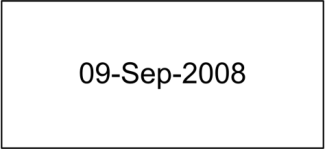
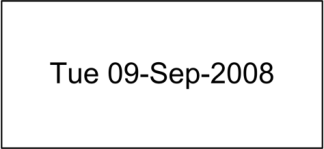
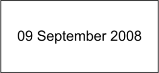
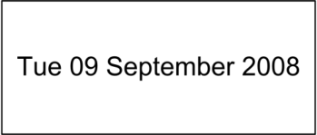
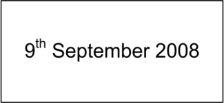

_Prepared for_

**NHS Connecting for Health**

**Tuesday, 23 June 2015**

**Version 5.0.0.0 Baseline**

_Prepared by_

**Clinical Application and Patient Safety Project**

**NHS CUI Programme Team**

[cuistakeholder.mailbox@hscic.gov.uk](mailto:cuistakeholder.mailbox@hscic.gov.uk)

HSCIC Controlled Document

### PREFACE

**Documents replaced by this document**

Design Guide Entry – Date Display 4.0.0.0

Design Guide Entry – Date Display 3.0.0.0

Design Guide Entry – Time Display 2.0.0.0

Date Display 1.0.0.0

Date and Time Release 4 Summary 1.0.0.0

**Documents to be read in conjunction with this document**

Design Guide Entry – Time Display 4.0.0.0

Design Guide Entry – Date and Time Input 3.0.0.0

Accessibility Checkpoints for NHS Applications 1.0.0.0

Accessibility for Clinical Applications 1.0.0.0

**This document was prepared for NHS Connecting for Health which ceased to exist on 31 March**
**2013. It may contain references to organisations, projects and other initiatives which also no**
**longer exist. If you have any questions relating to any such references, or to any other aspect of**
**[the content, please contact cuistakeholder.mailbox@hscic.gov.uk](mailto:cuistakeholder.mailbox@hscic.gov.uk)**

Copyright ©2013 Health and Social Care Information Centre

HSCIC Controlled Document

### TABLE OF CONTENTS

_**1**_ _**Introduction .................................................................................................................................... 1**_

1.1 Table 1: Changes Since the Last Baseline VersionCustomer Need ........................................ 1

1.2 Scope ........................................................................................................................................ 2

1.2.1 In Scope .............................................................................................................................. 2

1.2.2 Out of Scope ....................................................................................................................... 2

1.3 Key Principles ........................................................................................................................... 3

_**2**_ _**Recommendation and Guidance .................................................................................................. 4**_

2.1 General Date Display................................................................................................................ 4

2.1.1 Guidance ............................................................................................................................. 4

2.1.2 Rationale ............................................................................................................................. 5

2.2 Short Date Format .................................................................................................................... 6

2.2.1 Guidance ............................................................................................................................. 6

2.2.2 Examples of Correct Usage ................................................................................................ 7

2.2.3 Examples of Incorrect Usage .............................................................................................. 7

2.2.4 Rationale ............................................................................................................................. 7

2.3 Long Date Format ..................................................................................................................... 8

2.3.1 Guidance ............................................................................................................................. 8

2.3.2 Examples of Correct Usage ................................................................................................ 9

2.3.3 Examples of Incorrect Usage .............................................................................................. 9

2.3.4 Rationale ............................................................................................................................. 9

_**3**_ _**Document Information ................................................................................................................ 11**_

3.1 Terms and Abbreviations ........................................................................................................ 11

3.2 Definitions ............................................................................................................................... 11

3.3 Nomenclature ......................................................................................................................... 11

3.3.1 Body Text .......................................................................................................................... 11

3.3.2 Cross References.............................................................................................................. 12

3.4 References ............................................................................................................................. 12

Page iii

Copyright ©2013 Health and Social Care Information Centre

HSCIC Controlled Document

### PATIENT SAFETY PROCESS

The development lifecycle for this design guide includes an integrated patient / clinical safety risk
assessment and management process.

Known patient safety incidents relevant to this design guidance area have been researched and
reviewed as part of ongoing development. The resulting guidance points aim to support mitigation
of these known patient safety risks. In addition, the developers of this design guide have
undertaken a patient safety risk assessment to identify new risks that could potentially be
introduced by the guidance points in this document. Any potential risks identified have been
assessed and managed to support the ongoing clinical safety case for this design guide.

The Hazard Log records all the risks that have been identified during development and describes
mitigatory actions that, in some cases, will need to be taken by users of this design guide. The
Hazard Log is a live document that is updated as the design guide is developed and maintained.
Until this design guide has received full Clinical Authority to Release (CATR) from the NHS
Connecting for Health (NHS CFH) Clinical Safety Group (CSG) – based on an approved Clinical
Safety Case – there may be outstanding patient safety risks yet to be identified and mitigated.

Additionally, users implementing applications that follow this design guide’s guidelines (for
example, healthcare system suppliers) are expected to undertake further clinical safety risk
assessments of their specific systems within their specific context of use.

[Refer to www.cui.nhs.uk](https://emea.mail.microsoft.com/OWA/redir.aspx?C=2aab7991b0924c8f92c4e2824ab8a971&URL=http%3a%2f%2fwww.cui.nhs.uk) for further information on the patient safety process and for the safety
status and any relevant accompanying safety documentation for this design guide.

Page iv

Copyright ©2013 Health and Social Care Information Centre

HSCIC Controlled Document

### 1 INTRODUCTION

This document provides the design guidance for date display. It describes the area of focus,
provides guidance and recommendations, and explains the rationale behind the guidance and
recommendations.

This document is intended for the use of anyone whose role includes screen design, or the
implementation or assessment of NHS clinical applications. This document can be used as
guidance for the specification of display of dates within the user interface of a clinical application.

**Modified** Adjusted the text within rationale to reflect D+Ta-0005 (section 2.1.2)

D+Ta-0005 Removed reference to right alignment – recommending alignment only without speciftying left or right

**Deleted** Reference to Approximate Time as in scope (section 1.2.1)

**Added** Reference to Approximate Time as out of scope (section 1.2.2)

Table 1: Changes Since the Last Baseline Version describes the changes made since the previous
version of this guidance (Baseline version 4.0.0.0 dated 24-Jun-2009):

**Modified** Adjusted the text within rationale to reflect D+Ta-0005 (section 2.1.2)

D+Ta-0005 Removed reference to right alignment – recommending alignment only without speciftying left or right

**Deleted** Reference to Approximate Time as in scope (section 1.2.1)

**Added** Reference to Approximate Time as out of scope (section 1.2.2)

#### **1.1 Table 1: Changes Since the Last Baseline VersionCustomer** **Need**

Unambiguous date display enhances patient safety and application usability by eliminating
confusion between day, month and year elements. Displaying unambiguous dates is a core
element in ensuring effective patient care. It is vital that healthcare professionals correctly interpret
dates relating to patient demographics, clinical episodes and planned treatments, among others.
Dates have several forms; they can be precise, approximate or be a date range. Currently,
inconsistency and ambiguity of date display exists within the NHS and existing standards.

**Inconsistency across systems**

Clinical systems used within the NHS in England, across all care settings, differ in the way they
display dates. Inherent within this is the risk that healthcare professionals moving between clinical
systems made by different developers can misinterpret dates, potentially leading to patient safety
incidents.

**Unambiguous guidance**

None of the existing standards provide an entirely unambiguous date display (see the World Wide
Web Consortium (W3C [®] ) **{R1}** and the Organization for Standardization (ISO) **{R2}** ). For example,
ISO stipulates that the day and month elements of a date are pairs of numerical values. This
presents a risk of date misinterpretation by confusing month for day and vice versa. W3C reduces
this ambiguity by using letters for the month, but it does not specify a format for long dates to
compliment the short date format. The guidance in this document builds on these standards.

Page 1

Copyright ©2013 Health and Social Care Information Centre

HSCIC Controlled Document

**Reduce ambiguity for people brought up in different locales**

Date display is locale-specific. Some examples are provided by the W3C Internationalisation work:

“ _Visitors to a web site from varying locales may be confused by date formats. The format_
_MM/DD/YY is unique to the United States. Most of Europe uses DD/MM/YY. Japan uses_
_YY/MM/DD. The separators may be slashes, dashes or periods. Some locales print leading zeroes,_
_others suppress them. If a native Japanese speaker is reading a US English web page from a web_
_site in Germany that contains the date 03/04/02 how do they interpret it?”_ **{R3}**

Healthcare professionals working within the NHS have been brought up and educated in a wide
variety of locales, and hence are used to seeing dates in a wide variety of formats. The proportion
of healthcare professionals to whom this applies is increasing. Considering the mixed NHS
workforce using clinical systems displaying dates, there is a patient-safety concern, and therefore a
pressing need, for the unambiguous display of dates.

#### **1.2 Scope**

##### **1.2.1 In Scope**

The guidance provided has been developed for all care settings. The scope of this guidance
includes the display of single and precise dates. In addition, the scope includes considerations of
patient safety, clinical utility and patient administration, all of which have been incorporated in the
development of this guidance. Furthermore, this guidance has been developed for use in
applications using the English language only.

##### **1.2.2 Out of Scope**

This section defines areas that are not covered in this guidance. Although there may be specific
risks associated with these areas that are not addressed in this guidance, it is likely that the
principles in this guidance will extend to the display of dates in many of the areas listed below.

The following subject areas are not included within this guidance:

 **Date entry**  - Guidance on entering dates is described in _Design Guide Entry – Date and_

_Time Input_ **{R4}**

 **Display of Approximate Dates**  - This guidance only relates to the presentation of single

and precise dates

 **Default dates**  - This guidance only relates to the input of data and not to any default dates

assumed by developers

 **Time**  - This document only applies to the display of dates. Guidance on displaying time is

described in _Design Guide Entry – Time Display_ **{R5}**, and entering time is described in
_Design Guide Entry – Date and Time Input_ **{R4}**

 **Multi-language applications**  - Languages that use right-to-left writing, Cyrillic lettering or

ideograms such as Arabic, Russian and Japanese

 **Other languages**  - Languages that require more than three letters to identify the month

uniquely, for example, French which requires a four-letter abbreviation to distinguish
between Juin (June) and Juillet (July)

 **Labels**  - In addition to the date format, an important factor for clarity is the display of

unambiguous and consistent labels for dates

 **Display styles**  - Choice of display font size, background and foreground text colour will

affect the readability of dates, as it will with all other displayed text. This document does not
address general rules for text display

Page 2

Copyright ©2013 Health and Social Care Information Centre

HSCIC Controlled Document

 **Data storage**  - This guidance relates only to the display layer of a software application,

and does not prescribe the way in which data values should be stored. It is assumed that all
clinical applications will be capable of transforming a date stored in a standard format (for
example, ISO) into the format prescribed by this guidance for display purposes, without
error

**Note**

Listing an item as out of scope does not classify it as unimportant. Project time and resource constraints
inevitably restrict what can be in scope for a particular release. It is possible that items out of scope for
this release may be considered for a future release.

#### **1.3 Key Principles**

The follow key principles are reflected in the guidance discussed in this document:

 Eliminate confusion between the month and day values

 Minimise the space required to display dates on a screen

 Maintain a reading pattern that is natural to users

 Eliminate opportunities for misinterpreting the date as representing some other data

 Promote consistency across NHS applications by defining a set of two permissible date

formats

Page 3

Copyright ©2013 Health and Social Care Information Centre

HSCIC Controlled Document

### 2 RECOMMENDATION AND GUIDANCE

NHS applications can display dates in two formats, short and long, depending on the context.
Figure 1 and Figure 2 show examples of the recommended short date format and long date format
respectively.

Figure 1: Short Date Format

Figure 2: Long Date Format

General guidance which is applicable irrespective of the chosen format is presented first, followed
by the specific guidance for each format.

**Important**

The visual representations used within this document to display the guidance are illustrative only. They
are simplified in order to support understanding of the guidance points. Stylistic choices, such as colours,
fonts or icons are not part of the guidance and unless otherwise specified are not mandatory requirements
for compliance with the guidance in this document.

#### **2.1 General Date Display**

In this section, general guidance is listed followed by the supporting rationale. This rationale
supports the additional guidance described later in this document.

##### **2.1.1 Guidance**

D+Ta-0002 Display the month textually, not numerically Mandatory

D+Ta-0003 Display the month with only the first letter in capitals Mandatory

D+Ta-0004 Display the year value numerically using four digits Mandatory

D+Ta-0005 Align dates when displaying dates in a vertical column, such as in a table Recommended

D+Ta-0016 When displaying the day of the week, use one of the following abbreviations: Mon, Tue, Wed, Thu,
Fri, Sat and Sun

D+Ta-0017 Displaying the day of the week is optional, but when displayed, it must be placed immediately
before the day value, with a single space separating the permitted abbreviated form of the day,
from the day value

Recommended

Recommended

D+Ta-0022 Display null date using an appropriate value (for example, ‘Unknown’ or ‘Not recorded’) Mandatory

Table 2: Guidance – Date Formatting

Page 4

Copyright ©2013 Health and Social Care Information Centre

HSCIC Controlled Document

##### **2.1.2 Rationale**

Errors in interpreting dates correctly occur when individual elements, such as the day, month and
year values, are represented numerically. Additionally, errors can occur when one element is
mistaken for another element, such as between the day and month values. The main factors that a
date display format must address are certainty (or removal of ambiguity), clarity and readability.
The guidance proposed in this document aims to meet those factors by:

 **Certainty**

 Providing certainty for the year element by enforcing a four-digit format

 Providing certainty for the day element by inclusion of a leading zero

 Removing ambiguity between the day and month elements through the use of words to
represent the month

 Providing confirmation of the date by showing the day of the week alongside it

 **Clarity**

 Providing a clear distinction between elements through the inclusion of a single hyphen
as a separator

 Increasing clarity through the use of words to represent the month

 **Readability**

 Providing a more comfortable user experience:

 Through a natural reading pattern, and

 By displaying month names where only the first letter is capitalised (for example,
April and May), as studies have shown this to be the best readable form and
uppercase (for example, APRIL and MAY) to be the least readable form

Numerous organisations have existing standards for displaying date information in applications.
During the creation of this guidance, the following sources were consulted:

 International Standards Organization (ISO), standard ISO 8601:2004 **{R6}**

 World Wide Web Consortium (W3C), Dates and Time **{R3** and **R7}**

 The European Union

 UK Government Data Standards Catalogue **{R8}**

 Microsoft [®] Corporation, Microsoft Manual of Style for Technical Publications, Third Edition

**{R9}**

We have not adopted the ISO standard because it presents date elements in an unfamiliar
sequence for users brought up in the UK, and allows ambiguity between date and month elements
as both are represented numerically. We have taken the W3C standard as the basis for this
guidance, but extended it by requiring the day element to be two digits, and for a separator to be
provided between date elements.

The day of the week can be a useful item to have in a range of scenarios (such as, when
scheduling appointments, arranging handover and so on) as it is a natural way for people to think
about, and order, their commitments. Knowing the day of the week can help reduce the likelihood
of a date being mis-interpreted. Additionally, the day of the week is more easily remembered by
many people. These factors can contribute to greater efficiencies,therefore, the use of the day of
the week is encouraged where appropriate. Examples where the day of the week is not relevant,
and should not be displayed, are when displaying a patient’s date of birth or date of death.

Page 5

Copyright ©2013 Health and Social Care Information Centre

HSCIC Controlled Document

Guidance recommending the alignment of dates displayed in a tabular form is included to
encourage consistency of data presentation and enhance readability when a user scans for
example a list of dates. No guidance is included mandating or recommending specific alignment to
the left or right because there is a need to give developers of clinical applications some flexibility in
the design of their systems. If right alignment was mandatory it is recognised that certain data, for
example months may not be perfectly aligned. This would not be an issue were monospaced fonts
used.

#### **2.2 Short Date Format**

In all instances of clinical usage affecting patient treatment, including patient identification, NHS
applications must display dates as short dates in the form DD-MMM-YYYY, where:

 DD is the two-digit day

 MMM is the correctly abbreviated month name

 YYYY is the four-digit year

Figure 3 shows examples of the recommended short date format.

Figure 3: Short Date Format

##### **2.2.1 Guidance**

D+Ta-0006 Display dates using the short date format in all instances of clinical usage affecting patient
treatment, including patient identification

D+Ta-0018 Display the day value using two digits (values less than 10 should appear with a zero in the first
position)

D+Ta-0007 Display the month as a three letter abbreviation: Jan, Feb, Mar, Apr, Jun, Jul, Aug, Sep, Oct, Nov,
and Dec, with May being displayed in full

Mandatory

Mandatory

Mandatory

D+Ta-0008 When displaying the month, do not include any punctuation, such as a full stop Mandatory

D+Ta-0009 Use a single hyphen to separate the day and month, and the month and year Mandatory

D+Ta-0010 When using the short date format, ignore the user's regional settings Mandatory

Table 3: Short Date Formatting Guidance

Page 6

Copyright ©2013 Health and Social Care Information Centre

HSCIC Controlled Document

##### **2.2.2 Examples of Correct Usage**

####  DD-MMM-YYYY 01-Jan-2008

Tue 01-Jan-2008

28-Feb-2008

Thu 28-Feb-2008

05-Apr-2008

Sat 05-Apr-2008

31-Dec-2008

Wed 31-Dec-2008

Table 4: Correct Date Formatting Examples

The date is complete, clear, and unambiguous.

##### **2.2.3 Examples of Incorrect Usage**

####  D-MM-YY

DD-MM-YYYY

DD/MM/YYYY

DD.MM.YYYY

DD MM YYYY

####  D-MMM-YYYY

DD-MMM-YY

D-MMM-YY

####  DD/MMM/YYYY

DD.MMM.YYYY

####  DD MMM YYYY

Table 5: Incorrect Date Formatting Examples

##### **2.2.4 Rationale**

8-04-08

08-04-2008

08/04/2008

08.04.2008

08 04 2008

8-Apr-2008

08-Apr-08

8-Apr-08

08/Apr/2008

08.Apr.2008

08 Apr 2008

Patient Safety Critical

These examples lack certainty. The day and month elements are
ambiguous causing confusion and a high chance of misinterpretation
errors.

Lack of Completeness

These examples lack clarity because the day and/or year elements do
not display complete information.

Lack of Readability

These examples lack readability because the separator is unlikely to
be noticed.

Lack of Distinctiveness

This example lacks clarity when displayed in a banner context with
other data types, such as NHS Number.
The following examples illustrate this issue:

401 023 2137 08 Apr 2008

08 Apr 2008 401 023 2137

The short date format presents dates in a concise, easily readable and unambiguous form. This is
achieved through inclusion of hyphen separators between day, month and year elements, and
presentation of the month value as an abbreviated word except in the case of May. It must be used
in all cases where the NHS application displays dates that affect patient treatment and
identification. Examples of such dates are:

 Date of birth

 Medication ‘start’ and ‘end’ dates

 Appointment dates

Additionally, the short date format provides accessibility advantages:

Page 7

Copyright ©2013 Health and Social Care Information Centre

HSCIC Controlled Document

 For screen magnification users, the short date format confers an advantage over the long

date format by providing an unambiguous format within a smaller horizontal space

 For screen reader users, the format successfully distinguishes between day, month and

year elements. The hyphen will cause no problems and may assist with the separation of
the date elements. However, in the short date format, the majority of month names are read
out in unambiguous syllables. Possible issues are caused by "Apr", because a clear
syllable sound is not formed, while "Jun" and "Jul" generate similar sounds. Some screen
readers (for example, JAWS) implement common pattern recognition to improve their
renderings of standard date formats and understand Windows [®] settings for separators, but
this behaviour is not standardised across readers and cannot be presumed

#### **2.3 Long Date Format**

NHS clinical applications must present dates in the long date format in all documents intended for a
patient, such as, patient information leaflets, letters, consent forms, and appointment cards.

Figure 4 shows examples of the recommended long date format.

Figure 4: Long Date Format

##### **2.3.1 Guidance**

D+Ta-0011 Use the long date format when communicating with the patient Mandatory

D+Ta-0019 Display the day value using two digits (values less than 10 should appear with a zero in the first
position, unless the day value is displayed in ordinal form)

Mandatory

D+Ta-0012 Display the month name in full Mandatory

D+Ta-0013 Use a single whitespace to separate the day and month, and the month and year Mandatory

D+Ta-0014 When using the long date format, follow the user's default regional settings ignoring any changes
made by the user to these default settings

Mandatory

D+Ta-0015 Use the long date format when interacting with screen readers Recommended

D+Ta-0020 When displaying the day value as an ordinal number, the suffix used must be one of the following:
st, nd, rd, th

D+Ta-0021 When displaying the day value as an ordinal number, the two-letter suffix must be displayed in
lower case and as a superscript immediately after the number

Table 6: Guidance – Long Date Formatting

Copyright ©2013 Health and Social Care Information Centre

Mandatory

Mandatory

Page 8

HSCIC Controlled Document

##### **2.3.2 Examples of Correct Usage**

####  DD Month YYYY 01 January 2008

1 [st] January 2008

22 February 2008

22 [nd] February 2008

03 April 2008

3 [rd] April 2008

14 December 2008

14 [th] December 2008

Table 7: Correct Date Formatting Examples

The date is complete, clear, and unambiguous.

##### **2.3.3 Examples of Incorrect Usage**

####  DD MM YYYY

DD-MM-YYYY

DD/MM/YYYY

DD.MM.YYYY

DD MM YYYY

####  D Month YYYY

DD Month YY

D Month YY

####  DD/Month/YYYY

DD.Month.YYYY

08 04 2008

08-04-2008

08/04/2008

08.04.2008

08 04 2008

8 Apr 2008

08 April 08

8 Apr 08

08/April/2008

08.April.2008

####  DD MM YYYY 08th April 2008

2ND April 2008

1sT April 2008

23Rd April 2008

Patient Safety Critical

These examples lack certainty. The day and month elements are
ambiguous causing confusion and a high chance of misinterpretation
errors.

Lack of Completeness

These examples lack clarity because the day and/or year elements do
not display complete information.

Lack of Readability

These examples lack readability because the separator is unlikely to
be noticed.

Patient Safety Critical

These examples may be confused with medication. As the
abbreviation is not in superscript form, the number may be
misinterpreted as unit of measurement of a medication.

Table 8: Incorrect Date Formatting Examples

##### **2.3.4 Rationale**

In addition to the rationale described here, much of section 2.1.2 also applies.

When communicating with patients and other non-clinical readers, such as in notification letters for
patients, a non-technical date format is appropriate. The need to eliminate ambiguity and maximise
readability, remains. Furthermore, there is a need to ensure that the date format is understood
correctly by people from all over the world. Regional settings may be used where, for example, a
local community follows a language other than English. The long date format meets these
requirements and must therefore be used in all communications with non-clinical readers.

The ordinal form of the date, in the long date format, is the form in which dates are spoken, and is
commonly used when writing letters. It is also a format which modern word-processor software
supports, for example, by automatically superscripting a suffix (such as “rd”) upon typing. We have
considered whether or not the four suffixes used with numbers to create the ordinal form, can be
confused for units of medications. The suffix “st” can be confused, as it can mean any of the
following:

Page 9

Copyright ©2013 Health and Social Care Information Centre

HSCIC Controlled Document

 ST – Sinus Tachycardia

 ST – Soft Tissue

 st - standing

However, this guidance mitigates the risk of misinteretation, by requiring the suffix to be
superscripted. Additionally, the ordinal will always be displayed alongside the name of a month,
further minimising the risk of misinterpretation.

The long date format is the preferred format for screen reader users, because the month names
are read out in their entirety. Screen readers may not read the ordinal number correctly, but their
users are likely to be familiar with the form spoken by the reader, and will not be unduly confused.

Page 10

Copyright ©2013 Health and Social Care Information Centre

HSCIC Controlled Document

### 3 DOCUMENT INFORMATION

#### **3.1 Terms and Abbreviations**

CUI Common User Interface

ISO International Organization for Standardization

NHS National Health Service

NHS CFH NHS Connecting for Health

W3C World Wide Web Consortium

Table 9: Terms and Abbreviations

#### **3.2 Definitions**

NHS Entity Within this document, defined as a single NHS organisation or group that is operated within a single
technical infrastructure environment by a defined group of IT administrators.

The Authority The organisation implementing the NHS National Programme for IT (currently NHS Connecting for
Health).

Current best practice Current best practice is used rather than best practice, as over time best practice guidance may
change or be revised due to changes to products, changes in technology, or simply the additional
field deployment experience that comes over time.

Table 10: Definitions

#### **3.3 Nomenclature**

This section shows how to interpret the different styles used in this document to denote various
types of information.

##### **3.3.1 Body Text**

Code `Monospace`

Script

Other markup languages

Interface dialog names **Bold**

Field names

Controls

Folder names Title Case

File names

Table 11: Body Text Styles

Page 11

Copyright ©2013 Health and Social Care Information Centre

HSCIC Controlled Document

##### **3.3.2 Cross References**

Current document – sections Section number only

Current document – figures/tables Caption number only

Other project documents _Italics_ and possibly a footnote

Publicly available documents _Italics_ with a footnote

External Web-based content _Italics_ and a hyperlinked footnote

Table 12: Cross Reference Styles

#### **3.4 References**

**R1.** World Wide Web Consortium (W3C)
[http://www.w3.org](http://www.w3.org/)

**R2.** International Organization for Standardization (ISO)
[http://www.iso.org](http://www.iso.org/)

**R3.** World Wide Web Consortium (W3C) FAQ: Date formats
[http://www.w3.org/International/questions/qa-date-format](http://www.w3.org/International/questions/qa-date-format)

**R4.** NHS CUI Design Guide Workstream – Design Guide Entry – Date and Time Input 3.0.0.0

**R5.** NHS CUI Design Guide Workstream – Design Guide Entry – Time Display 4.0.0.0

**R6.** ISO 8601:2004
[http://www.iso.org/iso/iso_catalogue/catalogue_tc/catalogue_detail.htm?csnumber=40874](http://www.iso.org/iso/iso_catalogue/catalogue_tc/catalogue_detail.htm?csnumber=40874)

(See also Numeric representation of Dates and Time – [http://www.iso.org/iso/en/prods-](http://www.iso.org/iso/en/prods-services/popstds/datesandtime.html)
[services/popstds/datesandtime.html)](http://www.iso.org/iso/en/prods-services/popstds/datesandtime.html)

**R7.** World Wide Web Consortium (W3C): Dates and Time
[http://www.w3.org/International/O-time](http://www.w3.org/International/O-time)

**R8.** UK Government Data Standards Catalogue
[http://www.govtalk.gov.uk/gdsc/html/noframes/Date-1-0-Release.htm](http://www.govtalk.gov.uk/gdsc/html/noframes/Date-1-0-Release.htm)

**R9.** Microsoft Manual of Style for Technical Publications, Third Edition
[http://www.microsoft.com/mspress/books/6074.aspx](http://www.microsoft.com/mspress/books/6074.aspx)

Table 13: References

**Copyright:**

You may re-use this information (excluding logos) free of charge in any format or medium, under
the terms of the Open Government Licence. To view this licence, visit
[nationalarchives.gov.uk/doc/open-government-licence or email psi@nationalarchives.gsi.gov.uk.](https://web.nhs.net/OWA/redir.aspx?C=dMnSAL43xUOp9X_SOcscV9mT5A0smdBIh1_vxjdSDVCERI33v7-idn6tNFCNwJYUR1PxIW-Hd-E.&URL=http%3a%2f%2fnationalarchives.gov.uk%2fdoc%2fopen-government-licence)

Page 12

Copyright ©2013 Health and Social Care Information Centre

