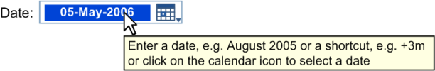
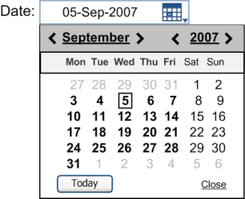
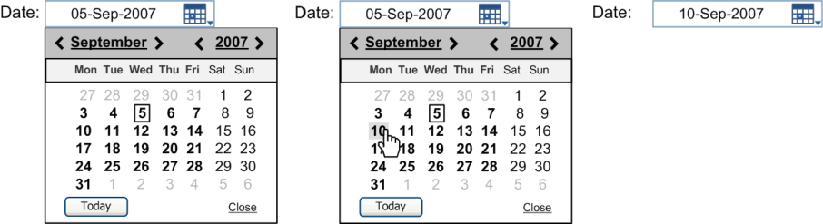
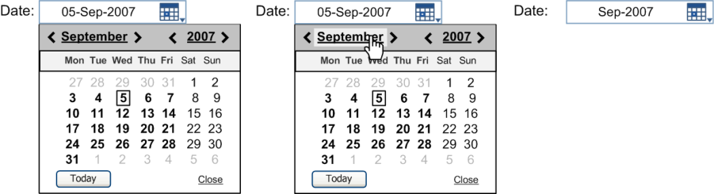
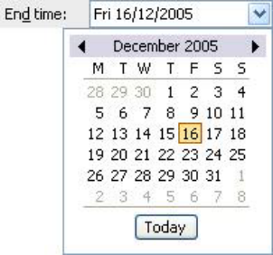
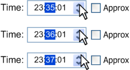
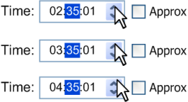
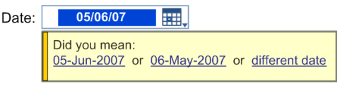
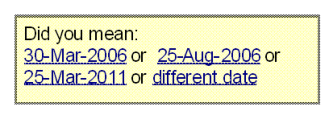

_Prepared for_

**NHS Connecting for Health**

**Tuesday, 23 June 2015**

**Version 3.0.0.0 Baseline**

_Prepared by_

**NHS CUI Programme Team**

[cuistakeholder.mailbox@hscic.gov.uk](mailto:cuistakeholder.mailbox@hscic.gov.uk)

HSCIC Controlled Document

### PREFACE

**Documents replaced by this document**

Design Guide Entry – Date and Time Input 2.0.0.0

Design Guide Entry – Date and Time Input 1.0.0.0

Date and Time Release 4 Summary 1.0.0.0

Design Guide Entry – Date Input 1.0.0.0

Design Guide Entry – Time Input 1.0.0.0

**Documents to be read in conjunction with this document**

Design Guide Entry – Time Display 4.0.0.0

Design Guide Entry – Date Display 4.0.0.0

Accessibility Checkpoints for NHS Applications 1.0.0.0

Accessibility for Clinical Applications 1.0.0.0

**This document was prepared for NHS Connecting for Health which ceased to exist on 31 March**
**2013. It may contain references to organisations, projects and other initiatives which also no**
**longer exist. If you have any questions relating to any such references, or to any other aspect of**
**[the content, please contact cuistakeholder.mailbox@hscic.gov.uk](mailto:cuistakeholder.mailbox@hscic.gov.uk)**

Copyright ©2013 Health and Social Care Information Centre

HSCIC Controlled Document

### TABLE OF CONTENTS

_**1**_ _**Introduction .................................................................................................................................... 1**_

1.1 Customer Need ......................................................................................................................... 2

1.2 Scope ........................................................................................................................................ 2

1.2.1 In Scope .............................................................................................................................. 2

1.2.2 Out of Scope ....................................................................................................................... 3

1.3 Key Principles ........................................................................................................................... 3

_**2**_ _**Recommendations and Guidance ................................................................................................ 4**_

2.1 Free Text Date Input ................................................................................................................. 4

2.1.1 Guidance ............................................................................................................................. 5

2.1.2 Examples of Correct Usage ................................................................................................ 5

2.1.3 Examples of Incorrect Usage .............................................................................................. 6

2.1.4 Rationale ............................................................................................................................. 6

2.2 Calendar Date Input.................................................................................................................. 6

2.2.1 Guidance ............................................................................................................................. 7

2.2.2 Examples of Correct Usage ................................................................................................ 7

2.2.3 Examples of Incorrect Usage .............................................................................................. 8

2.2.4 Rationale ............................................................................................................................. 8

2.3 Time Input ................................................................................................................................. 8

2.3.1 Guidance ............................................................................................................................. 9

2.3.2 Usage Examples ............................................................................................................... 10

2.3.3 Negative Examples ........................................................................................................... 10

2.3.4 Rationale ........................................................................................................................... 10

2.4 Spin Control Time Input .......................................................................................................... 11

2.4.1 Guidance ........................................................................................................................... 11

2.4.2 Examples of Correct Usage .............................................................................................. 11

2.4.3 Examples of Incorrect Usage ............................................................................................ 11

2.4.4 Rationale ........................................................................................................................... 12

2.5 Time Duration Input ................................................................................................................ 12

2.5.1 Guidance ........................................................................................................................... 12

2.5.2 Examples of Correct Usage .............................................................................................. 13

2.5.3 Examples of Incorrect Usage ............................................................................................ 13

2.5.4 Rationale ........................................................................................................................... 14

2.6 Disambiguation of Input .......................................................................................................... 14

2.6.1 Guidance ........................................................................................................................... 14

2.6.2 Examples of Correct Usage .............................................................................................. 14

2.6.3 Examples of Incorrect Usage ............................................................................................ 15

2.6.4 Rationale ........................................................................................................................... 15

_**3**_ _**Document Information ................................................................................................................ 16**_

Page iii

Copyright ©2013 Health and Social Care Information Centre

HSCIC Controlled Document

3.1 Terms and Abbreviations ........................................................................................................ 16

3.2 Definitions ............................................................................................................................... 16

3.3 Nomenclature ......................................................................................................................... 16

3.3.1 Body Text .......................................................................................................................... 16

3.3.2 Cross References.............................................................................................................. 17

3.4 References ............................................................................................................................. 17

Page iv

Copyright ©2013 Health and Social Care Information Centre

HSCIC Controlled Document

**Patient Safety Process**

The development lifecycle for this design guide includes an integrated patient / clinical safety risk
assessment and management process.

Known patient safety incidents relevant to this design guidance area have been researched and
reviewed as part of ongoing development. The resulting guidance points aim to support mitigation
of these known patient safety risks. In addition, the developers of this design guide have
undertaken a patient safety risk assessment to identify new risks that could potentially be
introduced by the guidance points in this document. Any potential risks identified have been
assessed and managed to support the ongoing clinical safety case for this design guide.

The Hazard Log records all the risks that have been identified during development and describes
mitigatory actions that, in some cases, will need to be taken by users of this design guide. The
Hazard Log is a live document that is updated as the design guide is developed and maintained.
Until this design guide has received full Clinical Authority to Release (CATR) from the NHS
Connecting for Health (CFH) Clinical Safety Group (CSG) – based on an approved Clinical Safety
Case – there may be outstanding patient safety risks yet to be identified and mitigated.

Additionally, users implementing applications that follow this design guide’s guidelines (for
example, healthcare system suppliers) are expected to undertake further clinical safety risk
assessments of their specific systems within their specific context of use.

[Refer to www.cui.nhs.uk](https://emea.mail.microsoft.com/OWA/redir.aspx?C=2aab7991b0924c8f92c4e2824ab8a971&URL=http%3a%2f%2fwww.cui.nhs.uk) for further information on the patient safety process and for the safety
status and any relevant accompanying safety documentation for this design guide.

Page v

Copyright ©2013 Health and Social Care Information Centre

HSCIC Controlled Document

### 1 INTRODUCTION

This document provides the design guidance for date and time input. It describes the area of focus,
provides guidance and recommendations, and explains the rationale behind the guidance and
recommendations.

This document is intended for use by anyone whose role includes screen design, or the
implementation or assessment of NHS clinical applications. This document can therefore be used
as guidance for the specification of entering date and times through the user interface of a clinical
application.

Table 1 describes the changes made since the previous version of this guidance (Baseline version
2.0.0.0 dated 12-Oct-2007):

**Deleted** None

**Modified** D+Tc-0007 Adding arithmetic shortcut operator for week(s)

Adjusting illustration to show ‘Approx’ as an active control (Figure 10)

**Added** Patient Safety Process note

Detail relating to default dates (section 1.2.2)

Detail relating to durations shorter than a second (section 1.2.2)

Principle relating to change between Greenwich Mean Time and British Summer Time(section 1.3)

Note relating to inclusion of visual representations as illustration only (section 2)

D+Tc-0046 Allow users to select whole value

D+Tc-0041 Prevent use of time shortcuts within date input control

D+Tc-0042 Provide users with an example of date

D+Tc-0043 Provide indication that the 24-hour clock is in use

D+Tc-0047 Enabling user to select entire value

D+Tc-0044 Prevent use of date shortcuts within time input control

D+Tc-0045 Provide users with an example of time

D+Tc-0048 Provide indication of GMT/BST duration handling

D+Tc-0049 Provide indication that system handles duration spans between GMT and BST

Adding usage example to show years, months, weeks, days, hours and minutes (section 2.5.2)

Table 1: Changes Since the Last Baseline Version

Page 1

Copyright ©2013 Health and Social Care Information Centre

HSCIC Controlled Document

#### **1.1 Customer Need**

The entry of date and time information is a fundamental function within clinical and administrative
processes. It is vital that healthcare workers correctly enter dates relating to patient demographics,
clinical episodes and planned treatments, among others. Promoting patient safety is of primary
importance and depends upon the removal of ambiguity during date and time entry. Therefore, it is
vital that date and time input controls provide a clear mechanism for guiding users towards the
entry of an accurate value, while also assisting the user to disambiguate entries when necessary.
Examples of use include:

 Specific drug administration dates within a course of medication

 Identification of a patient using a date of birth

 Key appointment dates and times within a patient care plan

In almost all cases, errors in the entry of date and time information will have safety implications for
patients.

Modern user interfaces offer the user a variety of mechanisms for entering dates and times. These
range from constrained methods, such as drop-down lists providing a small set of allowable values,
to more flexible calendar and spin controls, and highly flexible free-text entry fields. Each method
exhibits strengths and weaknesses, and can be appropriate for specific purposes.

The objective of this document is to provide a consistent, safety-assured method of entering dates
and times. A precondition for this is compliance with the NHS Common User Interface standard for
Date Display **{R1}**, as the short format described in this document is used by the date input control.
Likewise, a further precondition is compliance with the NHS Common User Interface standard for
Time Display **{R2}**, as this format is used by the time input control. These standards must be used
in all cases where the NHS application displays dates or times that affect patient treatment and
identification. The entry of dates in the long date format is currently under review.

#### **1.2 Scope**

##### **1.2.1 In Scope**

This document provides guidance and recommendations for the entry of the following forms of date
and time input:

 Fully specified dates – A fully specified date comprises three elements: day of month,

month and year

 Fully specified times – A fully specified time comprises hours and minutes and (optionally)

seconds

 Partially specified dates (such as, year only, or month and year)

 Approximate dates and times (such as cases where the exact date or time is unknown)

 Arithmetic shortcuts (such as ‘+2d’ to mean ‘plus two days’)

 Date and time durations

This document also provides guidance and recommendations for the following methods of date and
time input:

 Input via free text fields

 Input via input controls (such as, a calendar picker for dates or a ‘spin’ control for times)

This document also provides guidance and recommendations for disambiguation of date entries.

Page 2

Copyright ©2013 Health and Social Care Information Centre

HSCIC Controlled Document

##### **1.2.2 Out of Scope**

This section defines areas that are not covered in this guidance. Although there may be specific
risks associated with these areas that are not addressed in this guidance, it is likely that the
principles in this guidance will extend to the input of date and time in many of the areas listed
below.

The following subject areas are not covered within this document:

 **Date and time display**  - This document provides guidance for only the entry of date and

time. Guidance on displaying dates is described in _Design Guide Entry – Date Display_ **{R1}** .
Guidance on displaying times is described in _Design Guide Entry – Time Display_ **{R2}**

 **Default dates**  - This guidance only relates to the input of data by a user and not to any

default dates assumed by developers

 **Durations shorter than a second**  - The shortest period of time described in this

document is a second. Fractions of a second are not considered

 **Synchronisation**  - Synchronising current time across NHS systems, applications,

desktops and hospital clocks is not considered to be an issue in this guidance

 **Display styles**  - Choice of display font size, background and foreground text colour will

affect the readability, as it will with all other displayed text. This document does not address
general rules for text display

 **Data storage**  - The guidance relates only to the display layer of a software application, and

does not prescribe the way in which time values should be stored. We assume that any
clinical IT system is capable of transforming the stored time format into the displayed time
format without error

**Note**

Listing an item as out of scope does not classify it as unimportant. Project time and resource constraints
inevitably restrict what can be in scope for a particular release. It is possible that items out of scope for
this release may be considered for a future release.

#### **1.3 Key Principles**

The following key principles reflect the critical areas of guidance discussed within this document:

 Enable dates and times to be entered in a range of formats and using a variety of input

methods, including arithmetic shortcuts

 Support application scenarios where the user needs to enter approximate dates or times

 Provide the ability to enter either fully specified or partially specified dates

 Simplify the entry of times by standardising on the 24-hour clock

 Reduce the likelihood of errors by providing disambiguation of the input, where appropriate

 A system will be built using a calendar database that recognises the change between

Greenwich Mean Time (GMT) and British Summer Time (BST) where appropriate.

Page 3

Copyright ©2013 Health and Social Care Information Centre

HSCIC Controlled Document

### 2 RECOMMENDATIONS AND GUIDANCE

**Important**

The visual representations used within this document to display the guidance are illustrative only. They
are simplified in order to support understanding of the guidance points. Stylistic choices, such as colours,
fonts or icons are not part of the guidance and unless otherwise specified are not mandatory requirements
for compliance with the guidance in this document.

#### **2.1 Free Text Date Input**

This section provides guidance for the entry of dates, including fully specified dates, partially
specified dates, and dates which have been entered using arithmetic shortcuts. The entry of
partially specified dates will not be appropriate for every situation. Therefore, the designers of the
host Independent Software Vendor (ISV) application will need to decide what types of dates are
allowed for a given situation, based on the specific clinical context.

The basic date input control, as illustrated in Figure 1, comprises:

 A free text input area

 A calendar control

 An icon to access the calendar control

 A default input dependent on the context in which the control is used

 A facility to disambiguate the date entered (see section 2.6)

The control should appear with a short and descriptive label wherever it is used.

Figure 1: Example of the Recommended Date Input Control for NHS Clinical Applications (Free Text)

The date input control should provide instructions on how the control is used, for example, via the
use of tooltips, as illustrated in Figure 2. The choice of control and the instructional text will depend
on the clinical context in which the control is used.

Figure 2: Example of Instructions for Entry of Dates for NHS Clinical Applications

The date input control can be used to enter fully specified dates, partially specified dates, and
arithmetic shortcuts, as illustrated in Figure 3.

Figure 3: Examples of Different Date Entries

The use of arithmetic shortcuts allows the user to enter dates that are calculated relative to the
existing value. For example, ‘+3m’ for three months later, or ‘-2d’ for two days earlier.

The free text date input control must allow the individual date elements to be edited. For example,
the user must be able to edit each element in the date 05-May-2006, as illustrated in Figure 4.

Figure 4: Example of Individual Date Element Editing

Page 4

Copyright ©2013 Health and Social Care Information Centre

HSCIC Controlled Document

##### **2.1.1 Guidance**

D+Tc-0001 Adopt the NHS Common User Interface standard for Date Display **{R1}** for the format of any dates
displayed within the date input control

Mandatory

D+Tc-0002 Allow for both free text input of dates and the input of dates using a calendar control Mandatory

D+Tc-0003 Allow the date elements to be individually edited (day, month and year) Mandatory

D+Tc-0004 Include the calendar icon within the boundary of the date input field Mandatory

D+Tc-0005 Provide disambiguation of any free text date input Mandatory

D+Tc-0006 Provide instructions on how to use the control, for example, via the use of tooltips. The instructions
must contain details of the different date types that can be entered

D+Tc-0046 Within the date input control, allow users to select the entire value to facilitate rapid editing or entry
of arithmetic shortcuts relating to date (only)

D+Tc-0007 Allow users to enter arithmetic shortcuts, such as, ‘+3m’ for three months later or ‘-2d’ for two days
earlier. The relevant operators are:

 ‘+’ for later dates (this is optional, as whole numbers should be treated as positive by

default)
 ‘-’ for earlier dates
 ‘d’ for days
 ‘w’ for weeks
 ‘m’ for months
 ‘y’ for years

Mandatory

Mandatory

Mandatory

D+Tc-0041 Within the date input control, do not allow users to input arithmetic shortcuts relating to time Mandatory

D+Tc-0008 Allow the input of ‘Unknown’ (or similar) to specify dates not known to the user Mandatory

D+Tc-0009 Display a default input within the free text date input control Mandatory

D+Tc-0042 When displaying a default input within the free text input box, provide the user with an example of
date with either a non-specific value (such as the input mask) or a date appropriate to the clinical
context (for example, ‘today’s date’)

Table 2: Guidance – Free Text Date Input

##### **2.1.2 Examples of Correct Usage**

Recommended

####  Free text area and calendar icon

####  Free text area and calendar icon Display the calendar icon within the boundary

of the free text area
####  Editing of date elements Allow the individual date elements to be edited

Allow the individual date elements to be edited

Table 3: Correct Examples of Date Using Free Text Input

Copyright ©2013 Health and Social Care Information Centre

Page 5

HSCIC Controlled Document

##### **2.1.3 Examples of Incorrect Usage**

place; it must be included within the boundary
of the input field
####  Inclusion of calendar icon The calendar icon is omitted and it must be

The calendar icon is omitted and it must be
included

Table 4: Incorrect Examples of Date Using Free Text Input

##### **2.1.4 Rationale**

The rationale behind providing access to instructional text is to enable the user to see examples of
the different date types that can be entered and thereby rapidly familiarise themselves with the
range of functionality that the control supports.

Displaying a default input within the free text input area of the field provides the user with a further
example for the entry of dates. The default should either be a non-specific value, such as the input
mask, or be set to a date appropriate to the clinical context. For example, ‘today’s date’ may be
used for a date input field to record the date of an examination.

When the focus is placed within a date field, the entire value should be selected to facilitate rapid
editing or entry of arithmetic shortcuts. However, this should not preclude the editing of individual
date elements either via mouse selection or keyboard input.

#### **2.2 Calendar Date Input**

This section provides guidance for the input of fully specified dates and partially specified dates
using the calendar control. The calendar control, illustrated in Figure 5, is opened by clicking on the
calendar icon illustrated in Figure 1.

Figure 5: Example of the Recommended Date Input Control for NHS Clinical Applications (Calendar Control)

Fully specified dates can be entered via the calendar control by selecting the appropriate date from
the calendar, as illustrated in Figure 6. Once a date has been selected, the date is displayed in the
free text area of the control.

Page 6

Copyright ©2013 Health and Social Care Information Centre

HSCIC Controlled Document

Figure 6: Example of Entering Fully Specified Dates Using the Calendar Control for NHS Clinical Applications

A partially specified date can be entered using the calendar control by clicking either the month or
the year, as illustrated in Figure 7. When entering a partially specified date, the corresponding
value is displayed in the free text area of the control.

Figure 7: Example of Entering Partially Specified Dates Using the Calendar Control for NHS Clinical Applications

##### **2.2.1 Guidance**

D+Tc-0010 Provide access to the calendar control via a calendar icon Mandatory

D+Tc-0011 Provide the ability to select a month independently, and a year independently. Signify the
interactivity of these elements by suitable styling, for example as buttons or links, and ensure that
they have descriptive tooltips

Mandatory

D+Tc-0012 Provide a button to allow the user to enter today’s date Mandatory

D+Tc-0013 Provide a link or button to close the control Mandatory

D+Tc-0014 Provide a visual indication of the current date Mandatory

D+Tc-0015 Include the days of the week within the calendar view Mandatory

D+Tc-0016 Provide access to relevant instructional text (for example, via tooltips) on the clickable elements in
the calendar header

D+Tc-0017 Allow the calendar to be closed either when the user clicks away from the calendar or clicks on the
calendar icon

Mandatory

Mandatory

D+Tc-0018 Display the appropriate value in the free text field following selection of the date Mandatory

D+Tc-0019 Ensure that the control can be operated effectively via the keyboard (for example, using arrow
keys)

Table 5: Guidance – Calendar Date Input

##### **2.2.2 Examples of Correct Usage**

Mandatory

 Month

 Year

 Days of the week

 Dates

Table 6: Correct Examples of Date Using Calendar Input

Page 7

Copyright ©2013 Health and Social Care Information Centre

HSCIC Controlled Document

##### **2.2.3 Examples of Incorrect Usage**

be carried out by month. The
calendar must provide the ability to
independently navigate both
forwards and backwards in months
and years

Table 7: Incorrect Examples of Date Using Calendar Input

##### **2.2.4 Rationale**

The rationale for this guidance is based on an extensive analysis of existing calendar controls, from
which many of the ‘best practice’ features have been derived, such as:

 Scrolling month selection

 Day of week labelling

 A short cut for selecting today’s date

 Display of the current month in title case and the year displayed in the form YYYY

 A visual indication of the current date

In addition, the design of this calendar control also allows the user to enter both fully and partially
specified dates, and to independently manipulate both months and years. Clicking on a ‘forward’ or
‘backward’ icon will move the calendar either forward or backward by the appropriate amount (that
is, one month or one year). This allows much greater flexibility than forcing the user to navigate on
a month by month basis (see Table 7). In addition, the calendar control is specifically designed to
indicate to the user the full range of input available. This includes styling to expose the interactivity
of the header elements (which allow entry of partially specified dates) and also the behaviour of the
forward and backward icons.

#### **2.3 Time Input**

This section provides guidance for the input of fully specified time, and time entered using an
arithmetic shortcut. In addition, it describes how the entry of a time can be marked as approximate
(for example, in cases where the exact time is unknown). Evidently, the entry of an approximate
time will not be appropriate for every situation, as this will depend on the specific clinical context.

The basic time input control, as illustrated in Figure 8, comprises (from left to right):

 An input area

 A default input dependent on the context in which the control is used

 A ‘spin’ control

 A tick box to indicate if the time is approximate (where supported by the specific clinical

application)

Page 8

Copyright ©2013 Health and Social Care Information Centre

HSCIC Controlled Document

The control should appear with a short and descriptive label wherever it is used.

Figure 8: Example of the Recommended Time Input Control for NHS Clinical Applications

The time input control should provide instructions on how the control is used, for example, via the
use of tooltips, as illustrated in Figure 9. The choice of control and the instructional text will depend
on the clinical context in which the control is used.

Figure 9: Example of Instructions for Entry of Time for NHS Clinical Applications

The time input control can be used to enter fully specified times, approximate times and arithmetic
shortcuts, as illustrated in Figure 10. In addition, the ‘seconds’ element of time can be entered if
required. The inclusion of seconds is at the discretion of the host ISV application.

Figure 10: Examples of Different Time Entries

The use of arithmetic shortcuts allows the user to enter times that are calculated relative to an
existing value. For example, ‘+3h’ for three hours later, or ‘-2m’ for two minutes earlier. In addition,
the control must allow for the entry of ‘Unknown’, as illustrated in Figure 11.

Figure 11: Example of the Entry of an Unknown Time

The time input control must allow for individual editing of the time elements entered into the control.
For example, the user will be able to edit each element in the time 23:35 or 23:35:42, as illustrated
in Figure 12.

Figure 12: Example of Time Element Editing

##### **2.3.1 Guidance**

D+Tc-0020 Adopt the NHS Common User Interface standard for Time Display **{R2}** for the format of any times
displayed within the time input control

Mandatory

D+Tc-0021 Use the 24-hour clock only (rather than the 12-hour clock) Mandatory

D+Tc-0043 Provide indication to the user that the 24-hour clock is in use Mandatory

D+Tc-0022 Use an ‘Approx’ check box to allow the user to indicate an approximate time Mandatory

D+Tc-0023 Allow the time elements to be individually edited (hours, minutes and seconds) Mandatory

D+Tc-0024 Provide access to instructions on how to use the control, for example, via the use of tooltips. The
instructions must contain details of the different time types that can be entered

D+Tc-0047 Within the time input control, allow users to select the entire value to facilitate rapid editing or entry
of arithmetic shortcuts relating to time (only)

Copyright ©2013 Health and Social Care Information Centre

Mandatory

Mandatory

Page 9

HSCIC Controlled Document

D+Tc-0025 Allow users to enter arithmetic shortcuts such as ‘+3h’ for three hours later and ‘-2m’ for two
minutes earlier. The relevant operators are:

 ‘+’ for later times (this is optional, as whole numbers should be treated as positive by

default)
 ‘-’ for earlier times
 ‘h’ for hours
 ‘m’ for minutes
 ‘s’ for seconds

Mandatory

D+Tc-0044 Within the time input control do not allow users to input arithmetic shortcuts relating to date Mandatory

D+Tc-0026 Allow the entry of ‘Unknown’ (or similar) to specify times not known to the user Mandatory

D+Tc-0027 Display a default input within the time input control Mandatory

D+Tc-0045 When displaying a default input within the free text input box, provide the user with an example of
time with either a non-specific value (such as the input mask) or a time appropriate to the clinical
context

Table 8: Guidance – Time Input

##### **2.3.2 Usage Examples**

Recommended

####  Time input field, ‘Approx’ check box

Table 9: Correct Examples of Time Input

##### **2.3.3 Negative Examples**

Use of the ‘Approx’ check box

####  Time input field, ‘Approx’ check box

Approx label requires a capital A

####  Incorrect position for spin control The spin control is displayed in the wrong

place; it should be within the input field

Table 10: Incorrect Examples of Time Input

##### **2.3.4 Rationale**

The rationale behind providing access to instructional text is to enable the user to see examples of
the different time types that can be entered and thereby rapidly familiarise themselves with the
range of functionality that the control supports.

Likewise, displaying a default within the input area provides the user with a further example for time
entry. The default should either be a non-specific value, such as the input mask, or be set to a time
appropriate to the clinical context. When the focus is placed within a time field, the entire value

Page 10

Copyright ©2013 Health and Social Care Information Centre

HSCIC Controlled Document

should be selected to facilitate rapid editing or entry of arithmetic shortcuts. However, this should
not preclude the editing of individual time elements either via mouse selection or keyboard input.

#### **2.4 Spin Control Time Input**

This section provides guidance for the input of time using a spin control.

Times can be entered using a spin control, as illustrated in Figure 13 and Figure 14. If the focus of
the control is on the whole value (hours and minutes), or no time unit is selected, the time will
increase/decrease by the least significant time unit when the user clicks the relevant ‘up’ and
‘down’ spin control buttons, as illustrated in Figure 13.

Figure 13: Examples of Spin Control

If an individual element of the time is selected, the increase/decrease will be applied to that specific
time element. For example, if minutes are in the focus, the change will be applied to that element,
as illustrated in Figure 14.

Figure 14: Examples of Individual Time Element Input

##### **2.4.1 Guidance**

D+Tc-0028 Increase/decrease the whole time by the least significant time unit if the entire value is selected or
if no unit is selected

Mandatory

D+Tc-0029 Provide the ability to spin individual time units when selected Mandatory

Table 11: Guidance – Spin Control Time Input

##### **2.4.2 Examples of Correct Usage**

focus

Table 12: Correct Examples of Time Input Using the Spin Control

##### **2.4.3 Examples of Incorrect Usage**

place; it should be within the input field

(hours); the element with focus should be
incremented

Table 13: Incorrect Examples of Time Input Using the Spin Control

Page 11

Copyright ©2013 Health and Social Care Information Centre

HSCIC Controlled Document

##### **2.4.4 Rationale**

The rationale for this guidance is based on an extensive analysis of relevant Windows user
experience guidelines and existing time input controls. This analysis found the spin control to be
preferable to alternatives such as using drop-down lists for each time element. The design of the
spin control allows the user to easily adjust a time value, either forward or backward, by the
appropriate amount (that is, by the hour or by the minute). As such, it is ideally suited to time input,
as it allows users to make small, incremental changes to numeric values without moving their
hands from the mouse.

#### **2.5 Time Duration Input**

This section presents guidance for the input of time durations.

The basic duration input control is illustrated in Figure 15. The control should appear with a short
and descriptive label wherever it is used. The duration input control should provide instructions on
how the control is used, for example, via the use of tooltips.

Figure 15: Example of the Duration Input Control

Time units can be entered into the control either singly or in combination, as illustrated in Figure 16.
The units supported are as follows:

 Years (for example, ‘y’)

 Months (for example, ‘m’)

 Weeks (for example, ‘w’)

 Days (for example, ‘d’)

 Hours (for example, ‘hr’)

 Minutes (for example, ‘min’)

 Seconds (for example, ‘sec’)

Figure 16: Example of Duration Elements

The duration control can be used independently or combined with date and time controls, as
illustrated in Figure 17. In this example, the duration is calculated from the start time and end time.
However, in another scenario, it may be appropriate to calculate the end time from the start time
and duration. The precise behaviour of such combined controls is at the discretion of the host ISV
application, as the required interaction between them will depend on the specific clinical context.

Figure 17: Example of Duration Combined with Time Controls

##### **2.5.1 Guidance**

D+Tc-0030 Adopt the NHS Common User Interface standard for Time Display **{R2}** for the format of any times
displayed within the duration input control

Copyright ©2013 Health and Social Care Information Centre

Mandatory

Page 12

HSCIC Controlled Document

D+Tc-0031 Provide access to instructions on how to use the control, for example, via the use of tooltips. The
instructions must contain details of the different units that can be entered

Mandatory

D+Tc-0032 Allow entry of time duration units either singly or in combination Mandatory

D+Tc-0033 Allow editing of the individual elements of a duration Mandatory

D+Tc-0034 Ensure that the following minimal set of duration unit abbreviations is supported: **y** for years, **m** for
months, **w** for weeks, **d** for days, **hr** for hours, **min** for minutes and **sec** for seconds

D+Tc-0035 Allow the set of duration unit abbreviations to be extended appropriately, for example, ‘hrs’ as well
as ‘hr’. Ensure that any additions are unique within the entire set

D+Tc-0036 Allow the user to optionally enter white space within the duration input, for example, ‘3 hr 5 min’ as
well as ‘3hr 5min’

D+Tc-0037 Provide the facility for a user to disambiguate input which could be interpreted in more than one
way (see section 2.6), for example, ‘m’ (which could represent months or minutes)

D+Tc-0048 Where a time duration spans the change between GMT and BST, show a pop-up to inform the user
that the system will automatically handle the data within the appropriate time zone

D+Tc-0049 Where a user adjusts time manually resulting in a time duration spanning a change between GMT
and BST, show a pop-up to inform that user that the system will automatically adjust the data
according to the appropriate time zone

Table 14: Guidance – Entering Time Durations

##### **2.5.2 Examples of Correct Usage**

Mandatory

Recommended

Recommended

Recommended

Recommended

Recommended

need to enter 05min

####  NNuuu  Nuuu NNuuu  Nu NNuuu NNuuu  Nu Nu Nu Nu NNuuu

NNuuu

Table 15: Correct Examples of Using the Duration Control

##### **2.5.3 Examples of Incorrect Usage**

Double digit input, where applicable

Hours and minutes

Days, hours and minutes

Years, months, weeks, days, hours and
minutes

and minutes)

Page 13

Copyright ©2013 Health and Social Care Information Centre

HSCIC Controlled Document

Table 16: Incorrect Examples of Using the Duration Control

##### **2.5.4 Rationale**

The rationale behind this guidance is to provide a simple and memorable notation that allows the
user to express a wide variety of time durations in an unambiguous, clear manner. Whilst the use of
a relatively constrained format for the display of durations helps to reduce confusion and
interpretation errors, allowing a flexible variety of formats for the input of durations improves the
overall usability of the control.

#### **2.6 Disambiguation of Input**

This section provides guidance for the disambiguation of input, using date as an example.

Disambiguation occurs once the user has entered a date into the date input control. At this point,
the user will be prompted to disambiguate an ambiguous date via an information message, as
illustrated in Figure 18. The user is prompted with options from which to select, including the option
to enter a different date.

Figure 18: Example of Disambiguating an Ambiguous Date

##### **2.6.1 Guidance**

D+Tc-0038 Provide the facility for a user to disambiguate a date entered via the date control Mandatory

D+Tc-0039 Display a message dialog box with appropriate instructional text if the data is ambiguous or
incomplete

D+Tc-0040 Display a maximum of two suggestions based on the data entered, plus an option to re-enter the
value in the input field. Selection of a suggested value enters that value into the control

Table 17: Guidance – Disambiguation of Date Input

##### **2.6.2 Examples of Correct Usage**

Mandatory

Recommended

Option 1 or different date date

####  Meaningful message

Option 1 or Option 2 or different
date

Table 18: Correct Examples of Date Disambiguation

Two date options plus different
date

Page 14

Copyright ©2013 Health and Social Care Information Centre

HSCIC Controlled Document

##### **2.6.3 Examples of Incorrect Usage**

guidance

guidance what has been entered

incorrectly. It also does not
present options or guide the user
to the next step

This example presents too many
options. Up to two options only,
plus a different date, should be
displayed

Table 19: Incorrect Examples of Date Disambiguation

##### **2.6.4 Rationale**

The rationale behind this guidance is to provide a method by which the most common types of
ambiguous date can be identified and disambiguated at the point of entry. Most cases of
disambiguation will concern ambiguous date formats (such as dates where the day and month
value could be interchanged and still produce a valid date). These cases should be addressed by
the control itself using the instructional text in the message box. However, there will be other cases
where the input may be subject to validation rules that are external to the control and related to the
particular context of use. In such cases, the host ISV application may apply its own procedures for
data validation and error handling, which could give rise to warning messages such as:

 “The Finish date is before the Start date. Please enter a date after the Start date.”

 “The date of birth is in the future. Please enter the correct date of birth.”

In most cases, it would be logical to apply the internal disambiguation first and then subsequently
apply any external validation rules. However, the content of such rules and their precise usage is at
the discretion of the host ISV application as this will depend on the specific context of use.

Page 15

Copyright ©2013 Health and Social Care Information Centre

HSCIC Controlled Document

### 3 DOCUMENT INFORMATION

#### **3.1 Terms and Abbreviations**

BST British Summer Time

CUI Common User Interface

GMT Greenwich Mean Time

ISV Independent Software Vendor

NHS National Health Service

NHS CFH NHS Connecting for Health

UI User Interface

Table 20: Terms and Abbreviations

#### **3.2 Definitions**

NHS Entity Within this document, defined as a single NHS organisation or group that is operated within a single
technical infrastructure environment by a defined group of IT administrators.

The Authority The organisation implementing the NHS National Programme for IT (currently NHS Connecting for
Health).

Current best practice Current best practice is used rather than best practice, as over time best practice guidance may
change or be revised due to changes to products, changes in technology, or simply the additional
field deployment experience that comes over time.

Table 21: Definitions

#### **3.3 Nomenclature**

This section shows how to interpret the different styles used in this document to denote various
types of information.

##### **3.3.1 Body Text**

Code `Monospace`

Script

Other markup languages

Interface dialog names **Bold**

Field names

Controls

Folder names Title Case

File names

Table 22: Body Text Styles

Page 16

Copyright ©2013 Health and Social Care Information Centre

HSCIC Controlled Document

##### **3.3.2 Cross References**

Current document – sections Section number only

Current document – figures/tables Caption number only

Other project documents _Italics_ and possibly a footnote

Publicly available documents _Italics_ with a footnote

External Web-based content _Italics_ and a hyperlinked footnote

Table 23: Cross Reference Styles

#### **3.4 References**

**R1.** NHS CUI Design Guide Workstream – Design Guide Entry – Date Display 4.0.0.0

**R2.** NHS CUI Design Guide Workstream – Design Guide Entry – Time Display 4.0.0.0

Table 24: References

Page 17

Copyright ©2013 Health and Social Care Information Centre

HSCIC Controlled Document

### REVISION AND SIGNOFF SHEET

#### **Change Record**

13-Sep-2007 Tony Rose 1.0.0.1 Initial draft for review/discussion (Baseline 1.0.0.0 produced in Release 4 –
originally titled _Date and Time Input_ )

19-Sep-2007 Vivienne Jones 1.0.0.2 Copyedit

20-Sep-2007 Tony Rose 1.0.0.3 Accepted changes following copy edit

20-Sep-2007 Vivienne Jones 1.0.0.4 Checked changes

20-Sep-2007 Vivienne Jones 1.0.1.0 Working Baseline for review

02-Oct-2007 Tony Rose 1.0.1.1 CRS updates

03-Oct-2007 Catherine Niblock 1.0.1.2 Copyedit of updates

04-Oct-2007 Tony Rose 1.0.1.3 Accepted copy edit changes

04-Oct-2007 Catherine Niblock 1.1.0.0 Document cleansed, Baseline Candidate

10-Oct-2007 Tony Rose 1.1.0.1 Minor edit following verification

10-Oct-2007 Catherine Niblock 2.0.0.0 Copyedit of minor amendment, document cleansed and raised to Baseline

12-Oct-2007 Vivienne Jones 2.0.0.0 Update Preface to include summary document

20-Apr-2009 Mick Harney 2.0.0.1 Foundation draft for ISB updates

29-May-2009 Rachel Eno 2.0.0.2 Updates

01-Jun-2009 Mick Harney 2.0.0.3 Copyedited updates

08-Jun-2009 Rachel Eno 2.0.0.4 Additional corrections and new guidelines

10-Jun-2009 Mick Harney 2.0.0.5 Copyedited latest additions

10-Jun-2009 Rachel Eno 2.0.0.6 Final additions

10-Jun-2009 Mick Harney 2.0.0.7 Last copyedit checks

11-Jun-2009 Mick Harney 2.1.0.0 Raised to Baseline Candidate

24-Jun-2009 Simon Burnham 3.0.0.0 Raised to Baseline

Document Status has the following meaning:

 **Drafts 0.0.0.X**  - Draft document reviewed by the Microsoft CUI project team and the

Authority designate for the appropriate Workstream. The document is liable to change

 **Working Baseline 0.0.X.0**  - The document has reached the end of the review phase and

may only have minor changes. The document will be submitted to the Authority CUI project
team for wider review by stakeholders, ensuring buy-in and to assist in communication

 **Baseline Candidate 0.X.0.0**  - The document has reached the end of the review phase and

it is ready to be frozen on formal agreement between the Authority and the Company

 **Baseline X.0.0.0**  - The document has been formally agreed between the Authority and the

Company

Note that minor updates or corrections to a document may lead to multiple versions at a particular
status.

Page 18

Copyright ©2013 Health and Social Care Information Centre

HSCIC Controlled Document

#### **Audience**

The audience for this document includes:

 **Authority CUI Manager / Project Sponsor** . Overall project manager and sponsor for the

NHS CUI project within the Authority

 **Authority NHS CUI Design Guide Workstream Project Manager.** Responsible for

ongoing management and administration of the Workstream

 **The Authority Project Team** . This document defines the approach to be taken during this

assessment and therefore must be agreed by the Authority

 **Microsoft NHS CUI Team** . This document defines the approach to be taken during this

assessment, including a redefinition of the NHS CUI Design Guide Workstream strategy

#### **Reviewers**

Mike Carey Toolkit Workstream Lead

Tim Chearman UX Architect

Kit Lewis UX Architect

Dee Hackett Clinical Advisor

Peter Johnson Clinical Architect

#### **Distribution**

Mike Carey Toolkit Workstream Lead

Tim Chearman UX Architect

Kit Lewis UX Architect

Dee Hackett Clinical Advisor

Peter Johnson Clinical Architect

#### **Document Properties**

Document Title NHS CUI Design Guide Workstream Design Guide Entry – Date and Time Input

Author NHS CUI Programme Team

Restrictions **RESTRICTED – COMMERCIAL; MICROSOFT COMMERCIAL;** Access restricted to: NHS
CUI Project Team, Microsoft NHS Account Team

Creation Date 13 September 2007

Last Updated 23 June 2015

Page 19

Copyright ©2013 Health and Social Care Information Centre

HSCIC Controlled Document

**Copyright:**

You may re-use this information (excluding logos) free of charge in any format or medium, under
the terms of the Open Government Licence. To view this licence, visit
[nationalarchives.gov.uk/doc/open-government-licence or email psi@nationalarchives.gsi.gov.uk.](https://web.nhs.net/OWA/redir.aspx?C=dMnSAL43xUOp9X_SOcscV9mT5A0smdBIh1_vxjdSDVCERI33v7-idn6tNFCNwJYUR1PxIW-Hd-E.&URL=http%3a%2f%2fnationalarchives.gov.uk%2fdoc%2fopen-government-licence)

Page 20

Copyright ©2013 Health and Social Care Information Centre

