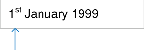
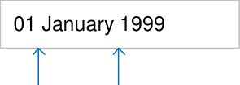
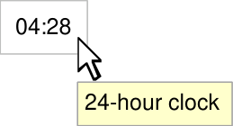
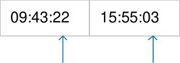
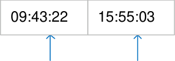
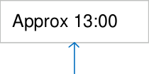
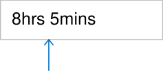

# **Date and Time Display**

## **Quick Implementation Guide**

### **Edition 1** **22 [nd] April 2010**

Copyright ©2013 Health and Social Care Information Centre

**Contents**

**Introduction** **2**

**Date Display** **3**

Short Date Format 5

Long Date Format 6

**Time Display** **8**

Duration Display

**11**

**This document was prepared for NHS Connecting for Health which ceased to exist on 31 March 2013. It may**
**contain references to organisations, projects and other initiatives which also no longer exist. If you have**
**any questions relating to any such references, or to any other aspect of the content, please contact**
**cuistakeholder.mailbox@hscic.gov.uk**

**Copyright:**
You may re-use this information (excluding logos) free of charge in any format or medium, under the terms
of the Open Government Licence. To view this licence, visit nationalarchives.gov.uk/doc/open-governmentlicence or email psi@nationalarchives.gsi.gov.uk.

**1**

Copyright ©2013 Health and Social Care Information Centre

**Guidance**

**Introduction**

Checking a date, time or duration is a small but vital and extremely frequent aspect of
clinical care. Health care professionals may encounter a variety of formats for displaying
those values. Such ambiguities can lead to misinterpretation, with clear implications for
patient safety.

Therefore, it is essential to implement a consistent format for the display of dates, times
and duration across clinical systems.

**Important**

Although it contains all of the guidance points, this document omits supporting
information and is therefore not intended as a substitute for the full NHS CUI
documents _Date Display_ **[1 ]** and _Time Display_ **[2]** . Refer to those documents for the
definitive statement of the design guidance in this area.

The visual representations used to display the guidance are illustrative only. Stylistic
choices (for example, display font used), unless otherwise specified, are not part of the
guidance and are therefore not mandatory requirements.

**1** Design Guide Entry – Date Display (v5.0.0.0)

**2** Design Guide Entry – Time Display (v4.0.0.0)

Copyright ©2013 Health and Social Care Information Centre

**2**

**Guidance**

### **Date Display**

|14-Aug-1980|Col2|
|---|---|
|||

month

D+Ta-0002

Display the month textually,
not numerically

Mandatory

D+Ta-0003

Display the month with only
the first letter in capitals

Mandatory

D+Ta-0008

When displaying the month,
do not include any
punctuation, such as a full
stop

Mandatory

D+Ta-0004

numerically using four digits

year

01-Jan-1994

06-Jan-1997

21-Feb-1997

28-Mar-1999

14-Aug-2001

Mandatory

D+Ta-0005

Align dates when displaying
dates in a vertical column, as
in a table

_Recommended_

Copyright ©2013 Health and Social Care Information Centre

**3**

### **Date Display**

**Guidance**

D+Ta-0016

When displaying the day of
the week, use one of the
illustrated abbreviations

_Recommended_

D+Ta-0017

|Mon|Monday|
|---|---|
|Tue|Tuesday|
|Wed|Wednesday|
|Thu|Thursday|
|Fri|Friday|
|Sat|Saturday|
|Sun|Sunday|

Displaying the day of the week
is optional but when
displayed, it must be placed
immediately before the day

|Tue 05-Jan-2009|Col2|
|---|---|
|||

day of the week

value, with a single space
separating the permitted
abbreviated form of the day,
from the day value

Unknown

Not recorded

_Recommended_

D+Ta-0022

Display null date using an
appropriate value (for example
‘Unknown’ or ‘Not recorded’)

Mandatory

Copyright ©2013 Health and Social Care Information Centre

**4**

**Guidance**

### **Date Display**

**Short Date Format**

|01-Jan-1999|Col2|Col3|
|---|---|---|
|Tue 05-Jan-2009|Tue 05-Jan-2009|Tue 05-Jan-2009|
|14-Aug-1980|14-Aug-1980|14-Aug-1980|
|_DD-Mmm-YYYY_|_DD-Mmm-YYYY_|_DD-Mmm-YYYY_|
||||

hyphens

D+Ta-0009

Use a single hyphen to
separate the day and month,
and the month and year

Mandatory

D+Ta-0006

Display dates using the short
date format in all instances of
clinical usage affecting patient
treatment, including patient
identification

Mandatory

D+Ta-0010

When using the short date
format, ignore the user’s regional
settings

Mandatory

D+Ta-0018

two digits (values less than 10
should appear with a zero in

|14-Aug-1980|Col2|
|---|---|
|||

day

the first position)

Mandatory

D+Ta-0007

letter abbreviation, as
illustrated, with May being
displayed in full

Mandatory

|Jan|January|
|---|---|
|Feb|February|
|Mar|March|
|Apr|April|
|May|May|
|Jun|June|

|Jul|July|
|---|---|
|Aug|August|
|Sep|September|
|Oct|October|
|Nov|November|
|Dec|December|

**5**

Copyright ©2013 Health and Social Care Information Centre

**Guidance**

### **Date Display**

**Long Date Format**

01 January 1999

5 [th] January 2009

14 August 1980

_DD Month YYYY_

|01 January 1999|Col2|
|---|---|
|||

day

D+Ta-0011

Use the long date format
when communicating with the
patient

Mandatory

D+Ta-0014

When using the long date
format, follow the user’s
default regional settings
ignoring any changes made
by the user to these default
settings

Mandatory

D+Ta-0015

Use the long date format
when interacting with screen
readers

_Recommended_

D+Ta-0019

Display the day value using
two digits (values less than 10
should appear with a zero in
the first position, unless the
day value is displayed in
ordinal form)

Mandatory

Copyright ©2013 Health and Social Care Information Centre

day

**6**

**Guidance**

### **Date Display**

**Long Date Format**

|st|1st|
|---|---|
|nd|2nd|

ordinal number

D+Ta-0020

When displaying the day value
as an ordinal number, the
suffix used must be one of
those illustrated

Mandatory

D+Ta-0021

When displaying the day
value as an ordinal number,
the two-letter suffix must be
displayed in lower case and
as a superscript immediately
after the number

Mandatory

D+Ta-0012

|rd|3rd|
|---|---|
|th|4th|

|Col1|Col2|
|---|---|
|1st January 1999|1st January 1999|

|01 January 1999|Col2|
|---|---|
|||

**7**

Mandatory

month

D+Ta-0013

Use a single whitespace to
separate the day and month,
and the month and year

space space

Mandatory

Copyright ©2013 Health and Social Care Information Centre

### **Time Display**

23:54

04:28

|09:43:22|Col2|15:55:03|Col4|
|---|---|---|---|
|||||

hours hours

|09:43:22|Col2|15:55:03|Col4|
|---|---|---|---|
|||||

minutes minutes

seconds seconds

**Guidance**

D+Tb-0001

Display time using the 24-hour
clock only

Mandatory

D+Tb-0002

Display an exact time as HH:mm

Mandatory

D+Tb-0032

Provide indication to the user
that the 24-hour clock is in use

Mandatory

D+Tb-0003

Display hours using two digits
(values less than 10 should
appear with a zero in the first
position)

Mandatory

D+Tb-0004

Display minutes using two digits
(values less than 10 should
appear with a zero in the first
position)

Mandatory

D+Tb-0005

Display seconds as two digits
(values less than 10 should
appear with a zero in the first
position)

Mandatory

Copyright ©2013 Health and Social Care Information Centre

**8**

**Guidance**

### **Time Display**

|09:43:22|Col2|15:55:03|Col4|
|---|---|---|---|
|||||

colon colon

colon colon

|Tue 05-Jan-2009 09:43:22|Col2|
|---|---|
|||

space

D+Tb-0006

Separate the hours and
minutes with a colon

Mandatory

D+Tb-0007

Separate the minutes and
seconds with a colon

Mandatory

D+Tb-0008

Separate date and time values
with a white space

Mandatory

D+Tb-0009

**9**

00:00 Display midnight as 00:00

Mandatory

D+Tb-0010

Display the last minute in the
23:59
day as 23:59

Mandatory

D+Tb-0011

Unknown Display null times using an
appropriate value, for example,
‘Unknown’ and ‘Not recorded’

Not recorded
Mandatory

Copyright ©2013 Health and Social Care Information Centre

### **Time Display**

15:55:03

From 06:23 to 08:23

Approx 02:00

**Guidance**

D+Tb-0012

Display seconds only if
required

_Recommended_

D+Tb-0013

Display time ranges as two
adjacent time displays, each
identified by a contextually
appropriate label, such as,
‘From’ and ‘To’

_Recommended_

D+Tb-0014

Precede the display of an
approximate time value with
the word ‘Approx’

Mandatory

D+Tb-0015

Display the time value using
the guidance for exact time

Mandatory

D+Tb-0016

‘Approx’ and the HH element
of the time display

space

Mandatory

Copyright ©2013 Health and Social Care Information Centre

**10**

**Guidance**

### **Duration Display**

D+Tb-0017

Display durations using the
illustrated values, as
appropriate

Mandatory

D+Tb-0033

Ensure the illustrated minimal
set of abbreviations is
supported

Mandatory

D+Tb-0018

Use whole numbers for time
duration, for example,1, 5, 60.
Do not use decimals or
fractions, for example, 0.5,
1.5, ¾

Mandatory

D+Tb-0034

Allow the set of duration unit
abbreviations to be extended
appropriately, for example,
‘hrs’ as well as ‘hr’. Ensure
that any additions are unique
within the entire set

_Recommended_

D+Tb-0026

Omit zero-valued units from
the display

Mandatory

Copyright ©2013 Health and Social Care Information Centre

|hr|hours|
|---|---|
|min|minutes|
|sec|seconds|

|y|years|
|---|---|
|m|months|
|w|weeks|
|d|days|

4hr 32min 16sec

8hrs 5mins

8hr 10sec

**Above** for a duration of eight
hours and ten seconds, the
minutes are omitted

**11**

**Guidance**

### **Duration Display**

|8hrs 5mins|Col2|Col3|
|---|---|---|
||||

no space between

values and units

space

5y 5m 5d 5min 55sec

_Years, months, days, minutes, seconds_

Approx 2hr 40min

|Approx 2hr 40min|Col2|
|---|---|
|||

space

D+Tb-0027

Display duration values and
their respective units as pairs,
with no intervening
whitespace between

Mandatory

D+Tb-0028

Use a white space as the
separator when displaying a
duration composed of more
than one unit

Mandatory

D+Tb-0029

Display time duration units in
decreasing order of
significance

Mandatory

D+Tb-0030

Precede the display of an
approximate duration value
with the word ‘Approx’

Mandatory

D+Tb-0031

Leave a white space between
the ‘Approx’ and the first
element of an approximate
duration value

Mandatory

Copyright ©2013 Health and Social Care Information Centre

**12**

