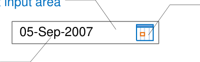
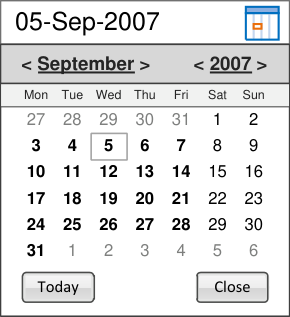
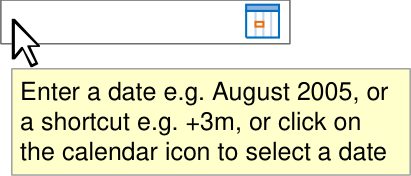
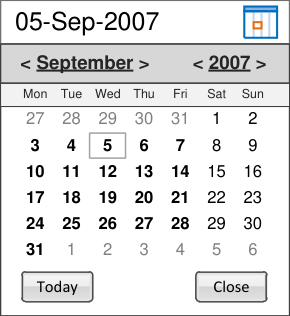
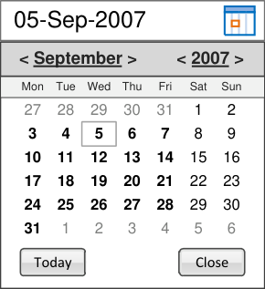
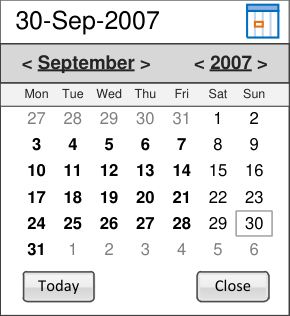
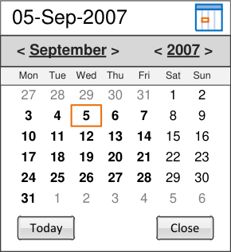
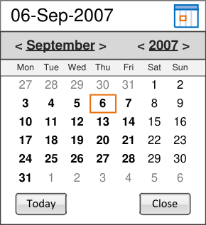
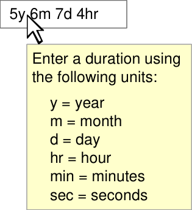

# Date and Time Input

<!-- TOC -->
<!-- TOC generated by Markdown All in One style -->

- [Date and Time Input](#date-and-time-input)
  - [Quick Implementation Guide](#quick-implementation-guide)
    - [Edition 1 22 [nd] April 2010](#edition-1-22-nd-april-2010)
    - [Date Input](#date-input)
    - [Time Input](#time-input)
    - [Duration Input](#duration-input)

<!-- /TOC -->

Source PDF: [datetimeqig.pdf](../../pdfs/patient-identification-and-information-entry-and-display/datetimeqig.pdf)

## Quick Implementation Guide

### Edition 1 22 [nd] April 2010

Copyright ©2013 Health and Social Care Information Centre

**This document was prepared for NHS Connecting for Health which ceased to exist on 31 March 2013. It may**
**contain references to organisations, projects and other initiatives which also no longer exist. If you have**
**any questions relating to any such references, or to any other aspect of the content, please contact**
**cuistakeholder.mailbox@hscic.gov.uk**

**Copyright:** You may re-use this information (excluding logos) free of charge in any format or medium, under the terms of the Open Government Licence. To view this licence, visit nationalarchives.gov.uk/doc/open-governmentlicence or email psi@nationalarchives.gsi.gov.uk.

**1**

Copyright ©2013 Health and Social Care Information Centre

**Guidance**

**Introduction**

The entry of date and time information is a fundamental function within clinical and administrative processes. Therefore, healthcare professionals should have a clear mechanism for entry of an accurate date or time value, and be assisted to disambiguate entries when necessary.

**Important**

Although it contains all of the guidance points, this document omits supporting information and is therefore not intended as a substitute for the full NHS CUI document _Date and Time Input_ **[1]** . Refer to that document for the definitive statement of the design guidance in this area.

The visual representations used to display the guidance are illustrative only. Stylistic choices (for example, display font used), unless otherwise specified, are not part of the guidance and are therefore not mandatory requirements.

**1** Design Guide Entry – Date and Time Input (v3.0.0.0)

Copyright ©2013 Health and Social Care Information Centre

**2**

**Guidance**

### Date Input

The basic date input control should comprise:

       - A free text input area

       - A calendar control

       - A default input, dependent on the context
in which the control is used

       - A facility to disambiguate the date entered

A calendar control

**3**

A default input

_**Above**_ _Elements of a basic date input control_

Though labels are not covered in this guidance, the control should have a short and descriptive label wherever it is used, for example ‘Date of Birth’.

Users should be able to input free text dates as fully specified dates, partially specified dates and arithmetic shortcuts.

The entry of partially specified dates will not be appropriate for every situation. Therefore, application designers should decide what types of dates are allowed for a given situation, based on the specific clinical context.

Copyright ©2013 Health and Social Care Information Centre

**Guidance**

### Date Input

D+Tc-0001

Adopt the NHS Common User Interface standard for _Date_ _Display_ **[1]** for the format of any dates displayed within the date input control Mandatory

D+Tc-0002

Allow for both free text input of dates and the input of dates using a calendar control Mandatory

D+Tc-0004

Include the calendar icon within the boundary of the date input field

Mandatory

Copyright ©2013 Health and Social Care Information Centre

Calendar Control

Free Text Input

**1** Design Guide Entry – Date Display (v5.0.0.0)

**4**

**Guidance**

### Date Input

**Free Text**

D+Tc-0003

Allow the date elements to be individually edited (day, month and year)

Mandatory

D+Tc-0006

Provide instructions on how to use the control, for example, via the use of tooltips. The instructions must contain details of the different date types that can be entered Mandatory

D+Tc-0008

Allow the input of ‘Unknown’ (or similar) to specify dates not known to the user Mandatory

Copyright ©2013 Health and Social Care Information Centre

**5**

**Guidance**

### Date Input

**Free Text**

|+|For later dates|
|---|---|
|-|For earlier dates|

D+Tc-0046

Within the date input control, allow users to select the entire value to facilitate rapid editing or entry of arithmetic shortcuts relating to date (only)

Mandatory

D+Tc-0007

Allow users to enter arithmetic shortcuts, such as ‘+3m’ for three months later or ‘-2d’ for two days earlier. The relevant operators are as illustrated

Mandatory

**Note** Whole numbers are treated as positive by default

D+Tc-0041

Within the date input control, do not allow users to input arithmetic shortcuts relating to time

Mandatory

Copyright ©2013 Health and Social Care Information Centre

|d|days|
|---|---|
|w|weeks|

|m|months|
|---|---|
|y|years|

**6**

**Guidance**

### Date Input

**Free Text**

**7**

Display a default input within the free text date input control

|01-Jan-2010|Col2|Col3|
|---|---|---|
|01-Jan-2010|||

Mandatory

D+Tc-0042

When displaying a default input within the free text input box, provide the user with an example of date with either a non-specific value (such as the input mask) or a date appropriate to the clinical context (for example, 'today's date')

_Recommended_

Copyright ©2013 Health and Social Care Information Centre

|DD-Mmm-YYYY|Col2|Col3|
|---|---|---|
|DD-Mmm-YYYY|||

**Guidance**

### Date Input

**Calendar**

|05-Sep-2007|Col2|Col3|Col4|
|---|---|---|---|
|05-Sep-2007||||

D+Tc-0010

Provide access to the calendar control via a calendar icon

Mandatory

D+Tc-0017

Allow the calendar to be closed either when the user clicks away from the calendar or clicks on the calendar icon

Mandatory

D+Tc-0011

Provide the ability to select a month independently, and a year independently. Signify the interactivity of these elements by suitable styling, for example as buttons or links, and ensure that they have descriptive tooltips

Mandatory

**Note** A partially specified date can be entered using the calendar control by clicking either the month or the year

Copyright ©2013 Health and Social Care Information Centre

**8**

**Guidance**

### Date Input

**Calendar**

D+Tc-0016

Provide access to relevant instructional text (for example, via tooltips) on the clickable elements in the calendar header

Mandatory

D+Tc-0015

Include the days of the week within the calendar view

Mandatory

D+Tc-0014

Provide a visual indication of the current date

Mandatory

D+Tc-0013

Provide a link or button to close the control

Mandatory

D+Tc-0012

Provide a button to allow the user to enter today's date

Mandatory

Copyright ©2013 Health and Social Care Information Centre

|05-Sep-2007|Col2|Col3|
|---|---|---|
|**< September>** **< 2007>**|**< September>** **< 2007>**|**< September>** **< 2007>**|
|Mon Tue Wed Thu Fri Sat Sun|Mon Tue Wed Thu Fri Sat Sun|Mon Tue Wed Thu Fri Sat Sun|
|27 28 29 30 31 1 2 **3** **4** **5** **6** **7** 8 9 **10** **11** **12** **13** **14** 15 16 **17** **18** **19** **20** **21** 22 23 **24** **25** **26** **27** **28** 29 30 **31** 1 2 3 4 5 6 Today Close Select a month or y clicking in the head select a day by clic|27 28 29 30 31 1 2 **3** **4** **5** **6** **7** 8 9 **10** **11** **12** **13** **14** 15 16 **17** **18** **19** **20** **21** 22 23 **24** **25** **26** **27** **28** 29 30 **31** 1 2 3 4 5 6 Today Close Select a month or y clicking in the head select a day by clic|27 28 29 30 31 1 2 **3** **4** **5** **6** **7** 8 9 **10** **11** **12** **13** **14** 15 16 **17** **18** **19** **20** **21** 22 23 **24** **25** **26** **27** **28** 29 30 **31** 1 2 3 4 5 6 Today Close Select a month or y clicking in the head select a day by clic|
|27 28 29 30 31 1 2 **3** **4** **5** **6** **7** 8 9 **10** **11** **12** **13** **14** 15 16 **17** **18** **19** **20** **21** 22 23 **24** **25** **26** **27** **28** 29 30 **31** 1 2 3 4 5 6 Today Close Select a month or y clicking in the head select a day by clic|1 2 3 4 5 6 y Close Select a month or y clicking in the head select a day by clic|1 2 3 4 5 6 y Close Select a month or y clicking in the head select a day by clic|
||||

**9**

**Guidance**

### Date Input

**Calendar**

D+Tc-0019

Ensure that the control can be operated effectively via the keyboard (for example, using arrow keys)

Mandatory

D+Tc-0018

Display the appropriate value in the free text field following selection of the date

Mandatory

Copyright ©2013 Health and Social Care Information Centre

**10**

**Guidance**

### Date Input

**Disambiguation**

|05/04/2|Provide free text Mandator D+Tc-0005|
|---|---|
|05/04/2009||
|Did you mean: 05-Apr-2009 or04-May-2009 or different date?|Did you mean: 05-Apr-2009 or04-May-2009 or different date?|

D+Tc-0038

Provide the facility for a user to disambiguate a date entered via the date control

Mandatory

D+Tc-0039

Display a message dialog box with appropriate instructional text if the data is ambiguous or incomplete

Mandatory

D+Tc-0040

Display a maximum of two suggestions based on the data entered, plus an option to re-enter the value in the input field. Selection of a suggested value enters that value into the control

_Recommended_

Copyright ©2013 Health and Social Care Information Centre

**11**

**Guidance**

### Time Input

The time input control should comprise:

     - An input area

     - A default input, dependent on the context
in which the control is used

     - A spin control

     - A tick box to indicate if the time is
approximate (where appropriate)

A default input

An input area

|12:00|Col2|
|---|---|
|12:00||

A spin control

A tick box to indicate if the time is approximate

_**Above**_ _Elements of a basic time input control_

The option to mark a time as approximate may not be appropriate for all situations, so the feature should be enabled in the control as required by the clinical context.

Though labels are not covered in this guidance, the control should have a short and descriptive label wherever it is used, for example ‘Time of Birth’.

Users can enter time in the input control as fully specified times, approximate times and arithmetic shortcuts, In addition, the ‘seconds’ element of time can be entered if required. The inclusion of seconds is at the discretion of the host ISV application.

Copyright ©2013 Health and Social Care Information Centre

**12**

**Guidance**

### Time Input

D+Tc-0022

Use an 'Approx' check box to allow the user to indicate an approximate time

Mandatory

D+Tc-0020

Adopt the NHS Common User Interface standard for _Time_ _Display_ **[1]** for the format of any times displayed within the time input control

Mandatory

D+Tc-0021

Use the 24-hour clock only (rather than the 12-hour clock)

Mandatory

D+Tc-0023

Allow the time elements to be individually edited (hours, minutes and seconds)

Mandatory

Copyright ©2013 Health and Social Care Information Centre

|23:35|Col2|
|---|---|
|23:35||

|13:54|Col2|
|---|---|
|13:54||

|13:54|Col2|
|---|---|
|13:54||

|13:54|Col2|
|---|---|
|**13**:54||

|123:54|Col2|
|---|---|
|13:54 2||

**1** Design Guide Entry – Time Display (v4.0.0.0)

**13**

**Guidance**

### Time Input

D+Tc-0047

|13:54|Col2|
|---|---|
|13:54||

Within the time input control, allow users to select the entire

or entry of arithmetic shortcuts relating to time (only)

|+3h|Col2|
|---|---|
|+3h||

Mandatory

D+Tc-0044

Within the time input control do not allow users to input arithmetic shortcuts relating to date

Mandatory

D+Tc-0025

Allow users to enter arithmetic shortcuts such as '+3h' for three hours later and '-2m' for two minutes earlier. The relevant operators are as illustrated

Mandatory

**Note** Whole numbers are treated as positive by default

|16:54|Col2|
|---|---|
|16:54||

|+|For later times|
|---|---|
|-|For earlier times|
|h|hours|
|m|minutes|
|s|seconds|

Copyright ©2013 Health and Social Care Information Centre **14**

**Guidance**

### Time Input

|hh:mm:ss|Col2|
|---|---|
|hh:mm:ss||

Enter a time using the 24hour clock, e.g. 13:05 or a shortcut, e.g. +3h.

D+Tc-0024

Provide access to instructions on how to use the control, for example, via the use of tooltips. The instructions must contain details of the different time types that can be entered

Mandatory

D+Tc-0043

Provide indication to the user that the 24-hour clock is in use

Mandatory

D+Tc-0026

Allow the entry of 'Unknown' (or similar) to specify times not known to the user

Mandatory

D+Tc-0027

Display a default input within the time input control

Mandatory

D+Tc-0045

When displaying a default input within the free text input box, provide the user with an example of time with either a non-specific value (such as the input mask) or a time appropriate to the clinical context

_Recommended_

Copyright ©2013 Health and Social Care Information Centre

|Un|Col2|
|---|---|
|Un||

|Unknown|Col2|
|---|---|
|Unknown||

|16:00|Col2|
|---|---|
|16:00||

|12:00|Col2|
|---|---|
|12:00||

**Above** A default time

|hh:mm:ss|Col2|
|---|---|
|hh:mm:ss||

**Above** A default time with a non-specific value

**15**

**Guidance**

### Time Input

D+Tc-0028

Increase/decrease the whole time by the least significant time unit if the entire value is selected or if no unit is selected

Mandatory

D+Tc-0029

Provide the ability to spin individual time units when selected

Mandatory

Copyright ©2013 Health and Social Care Information Centre

|23:35:01|Col2|
|---|---|
|23:35:01||

|23:35:02|Col2|
|---|---|
|23:35:02||

|23:35:01|Col2|
|---|---|
|**23**:35:01||

|22:35:01|Col2|
|---|---|
|22:35:01||

**16**

**Guidance**

### Duration Input

Duration 15min 30sec

Duration 30 sec

Duration 15min 30sec

**1** Design Guide Entry – Time Display (v4.0.0.0)

**17**

D+Tc-0030

Adopt the NHS Common User Interface standard for _Time_ _Display_ **[1]** for the format of any times displayed within the duration input control

Mandatory

D+Tc-0031

Provide access to instructions on how to use the control, for example, via the use of tooltips. The instructions must contain details of the different units that can be entered

Mandatory

D+Tc-0032

Allow the entry of time duration units either singly or in combination

Mandatory

Copyright ©2013 Health and Social Care Information Centre

### Duration Input

**Guidance**

D+Tc-0033

Allow editing of the individual elements of a duration

Mandatory

D+Tc-0034

Ensure that the illustrated set of duration unit abbreviations is supported

Mandatory

D+Tc-0035

|hr|hours|
|---|---|
|min|minutes|
|sec|seconds|

|y|years|
|---|---|
|m|months|
|w|weeks|
|d|days|

Duration 5y 6m 7d 4hrs Allow the set of duration unit abbreviations to be extended appropriately, for example, 'hrs' as well as 'hr'. Ensure that any additions are unique within the entire set

_Recommended_

D+Tc-0036

Duration 15min 30sec

Duration 15 min 30 sec

Allow the user to optionally enter white space within the duration input, for example ‘3 hr 5 min’ as well as ‘3hr 5min’

_Recommended_

Copyright ©2013 Health and Social Care Information Centre

**18**

**Guidance**

### Duration Input

D+Tc-0037

Provide the facility for a user to disambiguate input which could be interpreted in more than one way, for example, ‘m’ (which could represent months or minutes)’

_Recommended_

|6m|Col2|
|---|---|
|Did you mean: 6 months  or6  minutes?|Did you mean: 6 months  or6  minutes?|

|23:30|Col2|
|---|---|
|23:30||

|23:30|Col2|
|---|---|
|2 hrs||
|This duration spans the change from GMT to BST. BST runs from 28-Mar-2010 01:00 to 31-Oct-2010 02:00. During BST, times will be automatically adjusted forward one hour such that 01:00 becomes 02:00.|This duration spans the change from GMT to BST. BST runs from 28-Mar-2010 01:00 to 31-Oct-2010 02:00. During BST, times will be automatically adjusted forward one hour such that 01:00 becomes 02:00.|

D+Tc-0048 D+Tc-0049

Where a time duration spans the change between GMT and BST, show a pop-up to inform the user that the system will automatically handle the data within the appropriate time zone

_Recommended_

Where a user adjusts time manually resulting in a time duration spanning a change between GMT and BST, show a pop-up to inform that user that the system will automatically adjust the data according to the appropriate time zone.

_Recommended_

Copyright ©2013 Health and Social Care Information Centre

**19**
