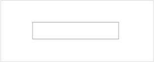
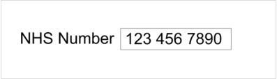
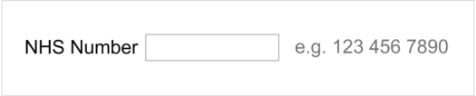
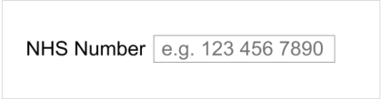
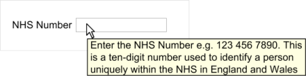
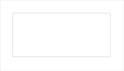
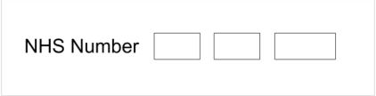
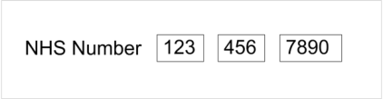

_Prepared for_

**NHS Connecting for Health**

**Tuesday, 23 June 2015**

**Version 4.0.0.0 Baseline**

_Prepared by_

**Clinical Application and Patient Safety Project**

**NHS CUI Programme Team**

**[cuistakeholder.mailbox@hscic.gov.uk](mailto:cuistakeholder.mailbox@hscic.gov.uk)**

HSCIC Controlled Document

### PREFACE

**Documents replaced by this document**

NHS Number Input and Display – User Interface Design Guidance 3.0.0.0

NHS Number Input and Display – User Interface Design Guidance 2.0.0.0

NHS Number Display 1.0.0.0

**Documents to be read in conjunction with this document**

Accessibility Checkpoints for NHS Applications 1.0.0.0

Accessibility for Clinical Applications 1.0.0.0

**This document was prepared for NHS Connecting for Health which ceased to exist on 31 March**
**2013. It may contain references to organisations, projects and other initiatives which also no**
**longer exist. If you have any questions relating to any such references, or to any other aspect of**
**[the content, please contact cuistakeholder.mailbox@hscic.gov.uk](mailto:cuistakeholder.mailbox@hscic.gov.uk)**

Copyright ©2013 Health and Social Care Information Centre

HSCIC Controlled Document

### TABLE OF CONTENTS

_**1**_ _**Introduction .................................................................................................................................... 1**_

1.1 Customer Need ......................................................................................................................... 1

1.2 Scope ........................................................................................................................................ 2

1.2.1 In Scope .............................................................................................................................. 2

1.2.2 Out of Scope ....................................................................................................................... 2

1.3 Dependencies and Assumptions .............................................................................................. 3

1.4 Key Principles ........................................................................................................................... 4

_**2**_ _**Recommendations and Guidance ................................................................................................ 5**_

2.1 NHS Number Display................................................................................................................ 5

2.1.1 Guidance ............................................................................................................................. 5

2.1.2 Examples of Correct Usage ................................................................................................ 5

2.1.3 Examples of Incorrect Usage .............................................................................................. 5

2.1.4 Rationale ............................................................................................................................. 6

2.2 NHS Number Input ................................................................................................................... 7

2.2.1 Hints, Prompts and Tooltips ................................................................................................ 7

2.2.2 Guidance ............................................................................................................................. 8

2.2.3 Examples of Correct Usage ................................................................................................ 8

2.2.4 Examples of Incorrect Usage .............................................................................................. 9

2.2.5 Rationale ............................................................................................................................. 9

_**3**_ _**Document Information ................................................................................................................ 11**_

3.1 Terms and Abbreviations ........................................................................................................ 11

3.2 Definitions ............................................................................................................................... 11

3.3 Nomenclature ......................................................................................................................... 11

3.3.1 Body Text .......................................................................................................................... 11

3.3.2 Cross References.............................................................................................................. 12

3.4 References ............................................................................................................................. 12

Page iii

Copyright ©2013 Health and Social Care Information Centre

HSCIC Controlled Document

**Patient Safety Process**

The development lifecycle for this design guide includes an integrated patient / clinical safety risk
assessment and management process.

Known patient safety incidents relevant to this design guidance area have been researched and
reviewed as part of ongoing development. The resulting guidance points aim to support mitigation
of these known patient safety risks. In addition, the developers of this design guide have
undertaken a patient safety risk assessment to identify new risks that could potentially be
introduced by the guidance points in this document. Any potential risks identified have been
assessed and managed to support the ongoing clinical safety case for this design guide.

The Hazard Log records all the risks that have been identified during development and describes
mitigatory actions that, in some cases, will need to be taken by users of this design guide. The
Hazard Log is a live document that is updated as the design guide is developed and maintained.
Until this design guide has received full Clinical Authority to Release (CATR) from the NHS
Connecting for Health (CFH) Clinical Safety Group (CSG) – based on an approved Clinical Safety
Case – there may be outstanding patient safety risks yet to be identified and mitigated.

Additionally, users implementing applications that follow this design guide’s guidelines (for
example, healthcare system suppliers) are expected to undertake further clinical safety risk
assessments of their specific systems within their specific context of use.

[Refer to www.cui.nhs.uk](https://emea.mail.microsoft.com/OWA/redir.aspx?C=2aab7991b0924c8f92c4e2824ab8a971&URL=http%3a%2f%2fwww.cui.nhs.uk) for further information on the patient safety process and for the safety
status and any relevant accompanying safety documentation for this design guide.

Page iv

Copyright ©2013 Health and Social Care Information Centre

HSCIC Controlled Document

### 1 INTRODUCTION

This document describes the design guidance for input and display of the ‘NHS Number’. It
describes the area of focus, provides guidance and recommendations, and explains the rationale
behind the guidance and recommendations.

This document is intended for the use of anyone whose role includes screen design,
implementation, or assessment of a National Health Service (NHS) clinical application. This
document can be used as guidance for the:

 Specification of an input control and a display control for an NHS Number in a user

interface (UI)

 Implementation of an input control and a display control for an NHS Number within an

application

 Assessment of an input control and a display control for an NHS Number in an NHS clinical

application user interface

**Note**

Elements used within a software application are commonly referred to as a ‘control’. These can take many
forms but the types referred to in this document will either be ‘input controls’ that can receive input from a
user, such as a button, text box, option button (radio button) or check box, or ‘display controls’ such as a
label, which can only display information.

Table 1 describes the changes made since the previous version of this guidance (Baseline version
3.0.0.0 dated 24-Jun-2009):

**Deleted** None

**Modified** None

**Added** Reference R10 (section 1.1)

Table 1: Changes Since the Last Baseline Version

#### **1.1 Customer Need**

The accurate identification of patients is vital to ensure that the correct patient receives the right
care. This is a very frequent task and must necessarily be repeated every time a patient presents
themselves, for example, to a receptionist, sometimes several times in one day. In addition to being
accurate, the patient-identification task must therefore also be performed efficiently.

This patient identifier is the NHS Number and it is fundamental to the UK National Programme for
IT (NPfIT). It is a national unique identifier that makes it possible to share patient information across
the whole of the NHS safely, efficiently and accurately. As such, it is the key to unlocking services
[such as the NHS Care Records Service, Choose and Book or the Electronic Prescription Service,](http://www.nhscarerecords.nhs.uk/)
as described in the document _NHS Number_ **{R1}** .

The NHS Number is a ten-digit number assigned to every one of the 56 million patients registered
with GPs in England and Wales. Requirements are set out in _NHS Number Standard for General_
_Practice (England)_ **[{R10}](http://www.connectingforhealth.nhs.uk/dscn/dscn2009/data-set-change/312008v1_1.pdf)** . The first nine digits are the identifier, with the tenth used as a check digit
to confirm the number's validity. It will be read from screen displays and be correlated with
information in different media, for example, wristbands (as described in _Standardising wristbands_
_improves patient safety_ **{R2}** ), paper records, and forms, to check that these show the same
identifier. Unambiguous display enhances patient safety and application usability by enabling rapid

Page 1

Copyright ©2013 Health and Social Care Information Centre

HSCIC Controlled Document

correlation with paper records and forms on which the identifier is printed. Therefore, it should be
presented in an easy-to-read and consistent format across all media.

The NHS Number will provide the means to efficiently integrate a patient’s data from disparate
registers in a trust, combining this into a master register. Additional checks with the full set of
patient information, such as family name, given name, gender, date of birth and address, are used
for greater accuracy when matching for clinical purposes, as stated in _General principles in the use_
_of the NHS number_ **{R3}** .

Encouraging widespread use of the NHS Number is an important way of reducing the number of
occasions when patients are incorrectly identified, which is a cause of clinical risk recognised by
the National Patient Safety Agency (NPSA). In addition to wristbands, in _When should I use the_
_NHS Number?_ **{R4}**, NHS Connecting for Health (CFH) recommend, as a minimum, that the NHS
Number is used on the following items:

 Clinical records – detail and summaries

 Referrals to other organisations – including electronic bookings

 Clinic appointment letters

 Test requests

 Test results

 Samples

 Discharge notices

 Payment by results

 Practice-based commissioning

Therefore, the efficient input and display of the NHS Number is critical, and is discussed in this
document.

#### **1.2 Scope**

This section defines the scope of this guidance document.

##### **1.2.1 In Scope**

This guidance is applicable to UIs such as those displayed on desktop or laptop computers. It is
assumed that, as a minimum, these computers are capable of operating at a display resolution of
1024 x 768, and have a keyboard and pointing device. The following items are in scope:

 Input of a fully specified NHS Number

 Display of a fully specified NHS Number

##### **1.2.2 Out of Scope**

This section defines areas that are not covered in this guidance. Although there may be specific
risks associated with these areas that are not addressed in this guidance, it is likely that the
principles in this guidance will extend to the input and display of an NHS number in many of the
areas listed below.

Page 2

Copyright ©2013 Health and Social Care Information Centre

HSCIC Controlled Document

The following items are out of scope:

 **Validation**  - Conformance to the required format and checksum calculation is defined in

the _UK Government Data Standards Catalogue_ **{R5}** and is outside the scope of this
guidance, as is validation that a given NHS Number is that of the stated person

 **Multi-language applications**  - Languages that use right-to-left writing, such as Arabic, the

Cyrillic alphabet such as Russian, or ideograms such as Japanese

 **Display styles**  - Choice of display font size, background and foreground text colour will

affect the readability of NHS Numbers, as with all other displayed text

 **Other patient identification numbers**  - Any locally allocated patient identification number

used in a hospital’s Patient Administration System (PAS) or other systems

 **Bar code representation**  - The display on a wristband of an NHS Number in the form of a

bar code

 **Reduced-size form factors**  - This guidance does not cover reduced-size form factors,

such as personal digital assistants (PDAs) and such other small mobile devices

 **Data storage and transmission**  - This guidance relates only to the display layer of a

clinical application, and does not prescribe how NHS Numbers should be stored. It is
assumed that all applications will be capable of transforming an NHS Number stored in an
arbitrary format, into that prescribed by this guidance, without error

 **Data history and provenance**  - The recording of dates for when an NHS Number is valid

is left to the designer of the NHS clinical application

 **Form design**  - Typically an NHS Number will be entered in a form in which a user is asked

to enter additional information such as name and contact address. This guidance does not
address form-level aspects such as the positioning of labels, error messages, or how
mandatory fields should be displayed

**Note**

Listing an item as out of scope does not classify it as unimportant. Project time and resource constraints
inevitably restrict what can be in scope for a particular release. It is possible that items out of scope for
this release may be considered for a future release.

#### **1.3 Dependencies and Assumptions**

Compliance with other guidance is required as follows:

 The design of NHS clinical applications must conform to _Accessibility Checkpoints for NHS_

_Applications_ **{R6}** and _Accessibility for Clinical Applications_ **{R7}**

**Important**

The visual representations used within this document to display the guidance are illustrative only. Stylistic
choices, unless otherwise specified, are not part of the guidance and are therefore not mandatory
requirements for compliance with the guidance in this document.

Page 3

Copyright ©2013 Health and Social Care Information Centre

HSCIC Controlled Document

#### **1.4 Key Principles**

The following key principles have shaped the guidance in this document:

 Conforming to convention and existing best practice with which clinicians are already

familiar, so as to reduce the training requirements of clinical applications

 Promoting data quality to reduce the occurrence of errors

 Balancing the need for consistency and commonality across clinical applications with the

need to support Independent Software Vendor (ISV) requirements for flexibility

Page 4

Copyright ©2013 Health and Social Care Information Centre

HSCIC Controlled Document

### 2 RECOMMENDATIONS AND GUIDANCE

The guidance provided in this document is based upon a programme of user research, including:

 A desk-based research project looking at a range of information entry Web pages and

clinical applications

 A Web-based survey of 41 respondents from NHS clinicians and administrative staff, ISVs,

community pharmacists, and NHS CFH

 A Patient Safety Assessment

#### **2.1 NHS Number Display**

NHS Numbers will be read frequently by healthcare professionals and by patients, on computer
monitors, as displayed by clinical applications, as well as on paper communications such as referral
letters, appointment cards and test results. They must, therefore, be easy to read. As they are used
to identify patients and match patient records, they must be displayed in full, to ensure these tasks
are conducted accurately. The guidance for displaying the NHS Number takes these requirements
into account.

##### **2.1.1 Guidance**

NUM-0001 Display the NHS Number in full, on a single line, without truncation or splitting it over multiple
lines

NUM-0002 Display the NHS Number as three groups, with a single space included as a separator
between groups, as follows:

 The first group must consist of the first, second and third digits in order

 The second group must consist of the fourth, fifth and sixth digits in order

 The third group must consist of the seventh, eighth, ninth and tenth digits in order

Mandatory

Mandatory

NUM-0003 Support the copying of NHS Numbers by the user as part of the ‘Copy and Paste’ task Recommended

Table 2: Guidance for NHS Number Display

##### **2.1.2 Examples of Correct Usage**

with numbers grouped to improve screen reader
performance

Table 3: Correct NHS Number Display Examples

##### **2.1.3 Examples of Incorrect Usage**

This example displays a very poor reading pattern
because a single ten-digit number is beyond the
normal capacity of short-term memory. This
representation is likely to cause errors

Page 5

Copyright ©2013 Health and Social Care Information Centre

HSCIC Controlled Document

123456

Patient Safety Critical

9999 7890 The NHS Number is split over two lines making it

likely that users will not read all ten digits or assume
that the hyphen is part of the number
####  99999 99999 12345 67890 Lack of Intuitive Structure

99 99 99 99 99 12 34 56 78 90 The display of more than four digits in a group or of

more than three groups does not make best use of
short-term memory
####  999/999/9999 123/456/7890 Poor Readability

9999

7890

12345 67890

Lack of Intuitive Structure

99 99 99 99 99

12 34 56 78 90

Poor Readability

A space provides better separation; it also assists in
differentiating the NHS Number from other numeric
data items, such as dates and telephone numbers

999.999.9999

Table 4: Incorrect NHS Number Display Examples

##### **2.1.4 Rationale**

123/456/7890

123.456.7890

This section discusses the reasons underlying the guidance for displaying NHS Numbers.

_**2.1.4.1**_ _**Wrapping and Truncation**_

Readability is enhanced when the digits comprising the NHS Number can be read together. If the
NHS Number is split over two lines, a hyphen will be inserted at the point at which the line breaks.
This could potentially cause the reader to think that the NHS Number contains the hyphen.
Alternatively, the continuation of the number on another line may not be noticed by the user, or may
be read incorrectly.

_**2.1.4.2**_ _**Accessibility**_

The provision of a separator between number groups assists with interpretation of the number by
screen readers. Without the separator, the numbers would often be read out as large numbers,
which are difficult to deconstruct into their constituent numbers.

For example, the JAWS [®] for Windows screen reader reads 4010232137 as “Four billion and ten
million two hundred and thirty two thousand one hundred and thirty seven”. However, the same
screen reader software reads out the proposed patient identification number as a string of
numbers. An inherent problem with screen readers is that the form the read-out numbers take is
dependent on the numbers themselves. Some examples are:

 401 023 2137 – read out as “four hundred and one zero two three twenty one thirty seven”

 401 230 2137 – read out as “four hundred and one two hundred and thirty twenty one thirty

seven”

 041 023 0104 – read out as “zero four one zero two three zero one zero four”

 401 230 2009 – read out as “four hundred and one two hundred and thirty two thousand

and nine”

It is unfortunate that the audible reading patterns differ according to the specific number. However,
this is considered acceptable because users of screen readers are accustomed to dealing with
such numbers.

Page 6

Copyright ©2013 Health and Social Care Information Centre

HSCIC Controlled Document

#### **2.2 NHS Number Input**

The purpose of the NHS Number input control is to enable the user to enter an NHS Number. The
control is a ‘Text Input Box’ as shown in Figure 1. Typically, it would be preceded by a label as
shown in Figure 2. Upon input, the control would display the number entered as illustrated in Figure
3.

Figure 1: Example of an NHS Number Control Without a Label

Figure 2: Example of an NHS Number Control with a Label

Figure 3: Example of an NHS Number Control with a Label (After Input)

**Important**

In the illustrations in this document, the text 'NHS Number' is provided as an example for a label. It is not
part of the control and no guidance on the wording or positioning of this label is implied.

##### **2.2.1 Hints, Prompts and Tooltips**

The input control may provide a hint, prompt, or tooltip. Hints are instructional text placed outside
but adjacent, to the text input box. Prompts are commonly known as watermarks and comprise
instructional text placed within the text input box. Tooltips are instructional text that appear when
the mouse pointer is placed over the text input box. The wording of hints and prompts is left to the
designers of NHS clinical applications. A suggestion is to use: ‘e.g. 123 456 7890’. A suggestion for
a tooltip is: ‘Enter the NHS Number e.g. 123 456 7890. This is a ten-digit number used to identify a
person uniquely within the NHS in England and Wales’. Examples of hints, prompts, and tooltips
are shown in Figure 4, Figure 5 and Figure 6 respectively.

Figure 4: Example of an NHS Number Control with a Hint

Figure 5: Example of an NHS Number Control with a Prompt

Page 7

Copyright ©2013 Health and Social Care Information Centre

HSCIC Controlled Document

Figure 6: Example of an NHS Number Control with a Tooltip

##### **2.2.2 Guidance**

NUM-0010 Provide a single text input box for NHS Number entry Recommended

NUM-0011 Permit only one NHS Number to be entered in an NHS Number input box Mandatory

NUM-0012 Set the length of the NHS Number input box such that the NHS Number is visible in full Recommended

NUM-0013 Set the height of the NHS Number input box to the largest character height in the currently
active display font, taking the user’s settings into account

NUM-0014 Permit NHS Number input via all the mechanisms supported on a platform such as, but not
limited to, typing on a keyboard, copy and paste, and handwriting with a stylus

NUM-0015 During input, reformat the numbers entered as per the NHS Number display format, namely
three numbers, space, the next three numbers, space, the last four numbers

NUM-0016 Ensure the NHS Number only consists of 10 digits and two spaces as described in
NUM-0015

NUM-0017 During input, permit only the single space character to act as a separator within the NHS
Number, discarding all other non-numeric user input, including but not limited to:

 Hyphens

 Dashes

 Forward slashes

 Back slashes

 Full stop

 Comma

 Colon

Recommended

Recommended

Recommended

Mandatory

Mandatory

NUM-0018 Do not permit input of old format and temporary NHS Numbers Mandatory

Table 5: Guidance for the Input of the NHS Number

##### **2.2.3 Examples of Correct Usage**

accommodate a single NHS Number; it
must be no bigger and no smaller

Table 6: Correct NHS Number Display Examples

Page 8

Copyright ©2013 Health and Social Care Information Centre

HSCIC Controlled Document

##### **2.2.4 Examples of Incorrect Usage**

more data than a single NHS Number
can be entered, while also
unnecessarily consuming real-estate
on a monitor

####  Long input box A long input box incorrectly implies

that more data than a single NHS
Number must be entered

Table 7: Incorrect NHS Number Display Examples

##### **2.2.5 Rationale**

The NHS Number is unique to an individual. This elevates its importance in patient identification
over patient name and date of birth, which may not be unique to an individual. The chosen layout
provides the best display format because it divides the NHS Number into a consistent set of easyto-read sections. This should increase patient safety through a reduction in patient identification
errors, caused by misreading the number.

_**2.2.5.1**_ _**Old Format and Temporary NHS Numbers**_

Historically, a number of different formats for NHS Numbers were in use in the NHS. These have all
been replaced by a new format ten-digit NHS Number. Old format NHS Numbers, of which there
are over 20 formats, consist of various combinations of uppercase alphabetic characters and
numeric digits and the delimiter character ‘/’. Temporary numbers are denoted by three letters
followed by sequence of numbers, for example, BIR1234567. This is described further in _Overview_
_of 2008 - A Demographics Business Process_ **{R8}** .

Old format NHS Numbers were finally removed in November 2007. A concerted effort has already
seen a marked reduction in the volume of temporary numbers, from over 225,000 in January 2005,
to less than 25,000 in January 2008. At the time of writing, the NHS plans to remove the remaining
historic local temporary numbers by March 2008, as advised in _Personal Communication_ **{R9}** .
Hence, input of both the old format and temporary numbers is prohibited.

As many staff in the NHS are less familiar with the new ten-digit NHS Number format, it is helpful to
display the format at every opportunity of number entry, as shown in Figure 4, Figure 5 and Figure
6 respectively. This will promote data quality, a key aim of the NHS.

_**2.2.5.2**_ _**Alternative Designs**_

An alternative design, shown in Figure 7 and Figure 8, was considered for the NHS Number input
control.

Figure 7: A Rejected Design – Multiple Boxes (Awaiting Input)

Figure 8: A Rejected Design – Multiple Boxes (After Input)

Page 9

Copyright ©2013 Health and Social Care Information Centre

HSCIC Controlled Document

In the online user survey, 59% of respondents preferred the multiple box design shown in Figure 8,
while only 35% preferred the single box design shown in Figure 3. The reasons given by those
preferring the multiple box design were that it clearly displays the three constituent groups of
numbers separately, and that this display style is a familiar one as it is used on credit cards. The
reasons given for those preferring the single box design were that it correctly implies the NHS
Number is a single number, and that it is easier to read in one box with internal separation. In spite
of the larger percentage of respondents stating a preference for the multiple box design, this design
was rejected, for the reasons discussed in Section 2.2.5.3.

_**2.2.5.3**_ _**Copy and Paste**_

The multiple box design in Figure 8 implies that the user cannot paste in an NHS Number. The
resulting behaviour upon pasting a number into the first box is unclear. Would all the pasted
numbers appear in the first box? Would only the first three numbers appear in the first box, with the
remaining numbers being rejected? Or would the numbers be pasted correctly into all the three
boxes? The reader will notice that the features that respondents liked in the multiple box design are
also supported subtly in the single box design. The multiple box design was therefore rejected
without compromising on respondents’ stated preferences.

_**2.2.5.4**_ _**Height and Length of the NHS Number Text Box**_

The dimensions of the text input box should be sufficient to correctly indicate the intended purpose
of the box, namely to enter a single NHS Number. The height of the box should therefore be
adequate to accommodate a single line, not a paragraph. The length of the box should be sufficient
to permit the user to read the NHS Number in its entirety.

The checking of an NHS Number after it has been entered is a common task and one which users
will perform after each NHS Number input. When a user enters an NHS Number in a box that is not
long enough, the initial numbers will scroll to the left side of the box, and therefore, not be visible.
The user will then be forced to scroll back to the start of the box to reveal the initial numbers of the
NHS Number. To do this, keyboard users will have to locate and press either the left arrow or the
HOME key, thereby, reducing task efficiency.

_**2.2.5.5**_ _**Automatic Reformatting**_

Entering, and then checking, the long sequence of numbers that make up an NHS Number is an
error-prone task. The required display format, namely the constituent numbers arranged in three
groups delimited by a single space, makes the number easier to read, and decreases the cognitive
load on the user. By having the control do this automatically, the user is assisted proactively, and
data quality is enhanced.

_**2.2.5.6**_ _**Screen Reader**_

Screen reader software would read out an NHS Number that did not contain any spaces in such a
way that it did not make sense. For example, the number 1234567890 would be read out by JAWS
as “one billion two hundred and thirty four million five hundred and sixty seven thousand eight
hundred and ninety”. Read out in this way, the number is almost unintelligible and cannot be
validated by the person who has just entered it. Conversely, a number displayed in the required
form, for example, 123 456 7890, would be read out by JAWS as “one hundred and twenty three
four hundred and fifty six seventy eight ninety”. Read out in this way, the number is easier for the
listener to validate.

Page 10

Copyright ©2013 Health and Social Care Information Centre

HSCIC Controlled Document

### 3 DOCUMENT INFORMATION

#### **3.1 Terms and Abbreviations**

CUI Common User Interface

GP General Practitioner

ISV Independent Software Vendor

NHS National Health Service

NHS CFH NHS Connecting for Health

NPfIT National Programme for IT

NPSA National Patient Safety Agency

PAS Patient Administration System

PCT Primary Care Trust

PDA Personal Digital Assistant

UI User Interface

Table 7: Terms and Abbreviations

#### **3.2 Definitions**

NHS Entity Within this document, defined as a single NHS organisation or group that is operated within a single
technical infrastructure environment by a defined group of IT administrators.

The Authority The organisation implementing the NHS National Programme for IT (currently NHS Connecting for
Health)

Current best practice Current best practice is used rather than best practice, as over time best practice guidance may
change or be revised due to changes to products, changes in technology, or simply the additional
field deployment experience that comes over time.

Table 8: Definitions

#### **3.3 Nomenclature**

This section shows how to interpret the different styles used in this document to denote various
types of information.

##### **3.3.1 Body Text**

Code `Monospace`

Script

Other markup languages

Interface dialog names **Bold**

Field names

Page 11

Copyright ©2013 Health and Social Care Information Centre

HSCIC Controlled Document

Controls

Folder names Title Case

File names

Table 9: Body Text Styles

##### **3.3.2 Cross References**

Current document – sections Section number only

Current document – figures/tables Caption number only

Other project documents _Italics_ and possibly a footnote

Publicly available documents _Italics_ with a footnote

External Web-based content _Italics_ and a hyperlinked footnote

Table 10: Cross Reference Styles

#### **3.4 References**

**R1.** NHS Connecting for Health: NHS Number

[http://www.connectingforhealth.nhs.uk/systemsandservices/nhsnumber](http://www.connectingforhealth.nhs.uk/systemsandservices/nhsnumber)

**R2.** NPSA Safer Practice Notice: Standardising wristbands improves patient safety:

[http://www.npsa.nhs.uk/EasySiteWeb/GatewayLink.aspx?alId=5346](http://www.npsa.nhs.uk/EasySiteWeb/GatewayLink.aspx?alId=5346)

**R3.** Department of Health: General principles in the use of the NHS number

[http://www.dh.gov.uk/en/Publicationsandstatistics/Publications/PublicationsPolicyAndGuidanc](http://www.dh.gov.uk/en/Publicationsandstatistics/Publications/PublicationsPolicyAndGuidance/DH_4006813)
[e/DH_4006813](http://www.dh.gov.uk/en/Publicationsandstatistics/Publications/PublicationsPolicyAndGuidance/DH_4006813)

**R4.** NHS Connecting for Health: When should I use the NHS Number?

[http://www.connectingforhealth.nhs.uk/systemsandservices/nhsnumber/whenusenhsnumber](http://www.connectingforhealth.nhs.uk/systemsandservices/nhsnumber/whenusenhsnumber)

**R5.** Cabinet Office: UK Government Data Standards Catalogue

[http://www.govtalk.gov.uk/gdsc/html/noframes/NHSnumber-2-0-Release.htm](http://www.govtalk.gov.uk/gdsc/html/noframes/NHSnumber-2-0-Release.htm)

2007

April 1998

**R6.** NHS CUI Design Guide Workstream – Accessibility Checkpoints for NHS Applications 1.0.0.0

**R7.** NHS CUI Design Guide Workstream – Accessibility for Clinical Applications 1.0.0.0

**R8.** Overview of 2008 - A Demographics Business Process, NPFIT-FNT-TO-DSD-0027.12 August 2007

**R9.** Personal Communication, Davie Hay, Standards Consulting Group, NHS CFH January 2008

**R10.** NHS Connecting for Health/Department of Health: NHS Number Standard for General
Practice (England)

[http://www.connectingforhealth.nhs.uk/dscn/dscn2009/data-set-change/312008v1_1.pdf](http://www.connectingforhealth.nhs.uk/dscn/dscn2009/data-set-change/312008v1_1.pdf)

Table 11: References

Copyright ©2013 Health and Social Care Information Centre

Version 1.1

March 2009

Page 12

HSCIC Controlled Document

### REVISION AND SIGNOFF SHEET

#### **Change Record**

02-Feb-2008 Ash Gupta 0.0.0.1 Initial draft

21-Feb-2008 Niki Nicolaides 0.0.0.2 Initial copyedit complete

22-Feb-2008 Ash Gupta 0.0.0.3 Copyedit amendments

22-Feb-2008 Niki Nicolaides 0.0.1.0 Copyedit complete and raised to Working Baseline

03-Mar-2008 Ash Gupta 0.0.1.1 Comments in CRS documents incorporated

05-Mar-2008 Simon Burnham 0.0.1.2 Second copyedit

06-Mar-2008 Simon Burnham 1.1.0.0 Copyedit changes accepted and raised to Baseline Candidate. Version
number changed to 1.1.0.0 as the existing document replaced by this
document is similarly titled.

12-Mar-2008 Ash Gupta 1.1.0.1 Incorporated modifications identified at verification meeting.

13-Mar2008 Simon Burnham 1.1.0.2 Changes copyedited and accepted.

17-Mar-2008 Simon Burnham 2.0.0.0 Baselined following e-mail approval.

20-Apr-2009 Mick Harney 2.0.0.1 Foundation draft for ISB updates

27-May-2009 Rachel Eno 2.0.0.2 Updated

27-May-2009 Mick Harney 2.0.0.3 Copyedit pass over updates

27-May-2009 Mick Harney 2.1.0.0 Raised to Baseline Candidate

24-June-2009 Simon Burnham 3.0.0.0 Raised to Baseline

17-Sep-2009 Rachel Eno 3.1.0.0 Added reference R10

17-Sep-2009 Manuela Perr 4.0.0.0 Raised to Baseline

Document Status has the following meaning:

 **Drafts 0.0.0.X**  - Draft document reviewed by the Microsoft CUI project team and the

Authority designate for the appropriate Workstream. The document is liable to change.

 **Working Baseline 0.0.X.0**  - The document has reached the end of the review phase and

may only have minor changes. The document will be submitted to the Authority CUI project
team for wider review by stakeholders, ensuring buy-in and to assist in communication.

 **Baseline Candidate 0.X.0.0**  - The document has reached the end of the review phase and

it is ready to be frozen on formal agreement between the Authority and the Company.

 **Baseline X.0.0.0**  - The document has been formally agreed between the Authority and the

Company.

Note that minor updates or corrections to a document may lead to multiple versions at a particular
status.

#### **Open Issues Summary**

None

Page 13

Copyright ©2013 Health and Social Care Information Centre

HSCIC Controlled Document

#### **Audience**

The audience for this document includes:

 **Authority CUI Manager / Project Sponsor** . Overall project manager and sponsor for the

NHS CUI project within the Authority.

 **Authority CAPS Project Manager.** Responsible for ongoing management and

administration of the Project.

 **The Authority Project Team** . The Authority team involved in the development of this

document.

 **Microsoft NHS CUI Team.** The Authority team responsible for the development of this

document.

#### **Reviewers**

Mike Carey Toolkit Workstream Lead

Tim Chearman UX Architect

#### **Distribution**

Mike Carey Toolkit Workstream Lead

Tim Chearman UX Architect

#### **Document Properties**

Document Title NHS Number Input and Display User Interface Design Guidance

Author NHS CUI Programme Team

Restrictions **RESTRICTED – COMMERCIAL; MICROSOFT COMMERCIAL;** Access restricted to: NHS
CUI Project Team, Microsoft NHS Account Team

Creation Date 19 November 2007

Last Updated 23 June 2015

**Copyright:**

You may re-use this information (excluding logos) free of charge in any format or medium, under
the terms of the Open Government Licence. To view this licence, visit
[nationalarchives.gov.uk/doc/open-government-licence or email psi@nationalarchives.gsi.gov.uk.](https://web.nhs.net/OWA/redir.aspx?C=dMnSAL43xUOp9X_SOcscV9mT5A0smdBIh1_vxjdSDVCERI33v7-idn6tNFCNwJYUR1PxIW-Hd-E.&URL=http%3a%2f%2fnationalarchives.gov.uk%2fdoc%2fopen-government-licence)

Page 14

Copyright ©2013 Health and Social Care Information Centre

