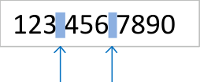
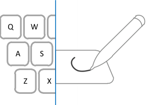
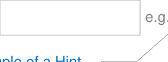
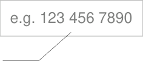
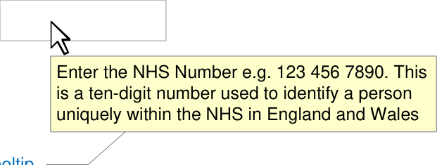

# **NHS Number** **Input and Display**

## **Quick Implementation Guide**

### **Edition 1** **22 [nd] April 2010**

Copyright ©2013 Health and Social Care Information Centre

#### **Contents**

**Introduction** **2**

**NHS Number Display** **3**

**NHS Number Input** **4**

**This document was prepared for NHS Connecting for Health which ceased to exist on 31 March 2013. It may**
**contain references to organisations, projects and other initiatives which also no longer exist. If you have any**
**questions relating to any such references, or to any other aspect of the content, please contact**
**cuistakeholder.mailbox@hscic.gov.uk**

**Copyright:**
You may re-use this information (excluding logos) free of charge in any format or medium, under the terms of
the Open Government Licence. To view this licence, visit nationalarchives.gov.uk/doc/open-governmentlicence or email psi@nationalarchives.gsi.gov.uk.

#### **1**

Copyright ©2013 Health and Social Care Information Centre

#### **Guidance** **Introduction**

The NHS Number is a national unique patient identifier that makes it possible to share
patient information across the whole of the NHS safely, efficiently and accurately. It will be
read from screen displays and correlated with information in different media, for example,
wristbands (as described in _Standardising wristbands improves patient safety_ **[1]** ). It is a key
component of services such as the NHS Care Record, Choose and Book and the Electronic
Prescription Service. The NHS Number is described further in _NHS Number_ **[2]** .

**Important**

Although it contains all of the guidance points, this document omits supporting
information and is therefore not intended as a substitute for the full NHS CUI document
_Patient Identification Number Input and Display_ [3] . Refer to that document for the
definitive statement of the design guidance in this area.

The visual representations used to display the guidance are illustrative only. Stylistic
choices (for example, display font used), unless otherwise specified, are not part of the
guidance and are therefore not mandatory requirements.

**1** NPSA Safer Practice Notice: Standardising wristbands improves patient safety
[http://www.npsa.nhs.uk/EasySiteWeb/GatewayLink.aspx?alld=5346](http://www.connectingforhealth.nhs.uk/systemsandservices/nhsnumber)

**2** NHS Connecting for Health: NHS Number
[http://www.connectingforhealth.nhs.uk/systemsandservices/nhsnumber](http://www.connectingforhealth.nhs.uk/systemsandservices/nhsnumber)

**3** Patient Identification Number Input and Display – User Interface Design Guidance (v4.0.0.0)

Copyright ©2013 Health and Social Care Information Centre

#### **2**

#### **Guidance**

### **NHS Number Display** NHS Number 123 456 7890

NUM-0001

#### Display the NHS Number in full, on a single line, without truncation or splitting it over multiple lines

Mandatory

NUM-0002

#### three groups of three, three and four digits respectively, with a

spaces
#### single space between groups

Mandatory

NUM-0003

#### Numbers by the user as part of the ‘Copy and Paste’ task

#### **3**

_Recommended_

**Important**

This document uses the label ‘NHS Number’ only as an example. It does not represent
guidance on label wording or positioning.

Copyright ©2013 Health and Social Care Information Centre

### **NHS Number Input**

#### NHS Number

### NHS Number 123 456 7890

#### **Guidance**

NUM-0010
#### Provide a single text input box for NHS Number entry

_Recommended_

NUM-0011
#### Permit only one NHS Number to be entered in an NHS Number input box

Mandatory

NUM-0012
#### Set the length of the NHS Number input box such that the NHS Number is visible in full

_Recommended_

NUM-0013

### NHS Number 123 456 7890
#### Set the height of the NHS Number input box to the largest character height in the currently active display font, taking the user’s settings into account

_Recommended_

NUM-0014

#### Permit NHS Number input via all the mechanisms supported on a platform such as, but not limited to, typing on a keyboard, copy and paste and handwriting with a stylus

_Recommended_

Copyright ©2013 Health and Social Care Information Centre

#### **4**

#### **Guidance**

### **NHS Number Input**

NUM-0015
#### During input, reformat the numbers entered as per the NHS Number display format, namely three numbers, space, the next three numbers, space, the last four numbers

_Recommended_

NUM-0016
#### Ensure that the NHS Number only consists of 10 digits and two spaces as described in guidance point NUM-0015

### 123 123 4

spaces

Mandatory

|Col1|Col2|Col3|
|---|---|---|
|123 456 7890|123 456 7890|123 456 7890|
|digits 3 digits|digits 3 digits|digits 3 digits|

4 digits

NUM-0017

#### During input, permit only the single space character to act as a separator within the NHS Number, discarding all other non-numeric user input, including but not limited to these

Mandatory

|.|Full stop|
|---|---|
|,|Comma|
|:|Colon|
|-|Hyphen|
|–  —|Dashes|
|/|Forward slash|
|\|Back slash|

#### **5**

NUM-0018
#### Do not permit input of old format and temporary NHS Numbers

Mandatory

Copyright ©2013 Health and Social Care Information Centre

#### **Guidance**

### **NHS Number Input**

#### **Hints, Prompts and Tooltips**

The input control may provide a hint, prompt or tooltip. Hints are instructional text placed
outside but adjacent to the text input box. Prompts are commonly known as watermarks
and comprise instructional text placed within the text input box. Tooltips are instructional
text that appear when the mouse pointer is placed over the text input box.

The wording of hints and prompts is left to the designers of NHS clinical applications.
Examples of hints, prompts, and tooltips are shown below.

#### NHS Number

Example of a Prompt

#### NHS Number

Copyright ©2013 Health and Social Care Information Centre

#### **6**

