_Prepared for_

**NHS Connecting for Health**

**Tuesday, 23 June 2015**

**Version 2.0.0.0 Baseline**

_Prepared by_

**Clinical Applications and Patient Safety Project**

**NHS CUI Programme Team**

**[cuistakeholder.mailbox@hscic.gov.uk](mailto:cuistakeholder.mailbox@hscic.gov.uk)**

HSCIC Controlled Document

### PREFACE

**Documents replaced by this document**

Micro Patient Banner – User Interface Design Guidance 1.0.0.0

**Documents to be read in conjunction with this document**

Design Guide Entry – Patient Banner 4.0.0.0

Patient Name Input and Display – User Interface Design Guidance 1.0.0.0

Design Guide Entry – Date Display 4.0.0.0

Sex and Current Gender Input and Display — User Interface Design Guidance 4.0.0.0

Design Guide Entry – Time Display 4.0.0.0

NHS Number Input and Display – User Interface Design Guidance 3.0.0.0

Address Input and Display – User Interface Design Guidance 3.0.0.0

Accessibility Checkpoints for NHS Applications 1.0.0.0

Accessibility for Clinical Applications 1.0.0.0

**This document was prepared for NHS Connecting for Health which ceased to exist on 31 March**
**2013. It may contain references to organisations, projects and other initiatives which also no**
**longer exist. If you have any questions relating to any such references, or to any other aspect of**
**[the content, please contact cuistakeholder.mailbox@hscic.gov.uk](mailto:cuistakeholder.mailbox@hscic.gov.uk)**

Copyright ©2013 Health and Social Care Information Centre

Page ii

HSCIC Controlled Document

### TABLE OF CONTENTS

_**1**_ _**Introduction .................................................................................................................................... 1**_

1.1 Customer Need ......................................................................................................................... 2

1.2 Scope ........................................................................................................................................ 3

1.2.1 In Scope .............................................................................................................................. 3

1.2.2 Out of Scope ....................................................................................................................... 3

1.3 Assumptions ............................................................................................................................. 4

1.4 Dependencies ........................................................................................................................... 4

_**2**_ _**Micro Patient Banner Guidance Overview .................................................................................. 5**_

2.1 Summary of Guidance .............................................................................................................. 5

_**3**_ _**Micro Patient Banner Guidance Details ...................................................................................... 8**_

3.1 Introduction ............................................................................................................................... 8

3.2 Principles .................................................................................................................................. 8

3.3 Guidelines ................................................................................................................................. 9

3.3.1 Guidance – Structure and Composition .............................................................................. 9

3.3.2 Guidance – Application Context and Positioning .............................................................. 10

3.3.3 Guidance – Minimum Data Set ......................................................................................... 11

3.3.4 Guidance – Information Grouping ..................................................................................... 13

3.3.5 Guidance – Data Labels and Values................................................................................. 14

3.3.6 Guidance – Patient Name ................................................................................................. 17

3.3.7 Guidance – Micro Patient Banner for a Deceased Patient ............................................... 18

3.3.8 Guidance – Alignment of Information ................................................................................ 19

3.4 Rationale Summary ................................................................................................................ 19

_**4**_ _**Document Information ................................................................................................................ 21**_

4.1 Terms and Abbreviations ........................................................................................................ 21

4.2 Definitions ............................................................................................................................... 21

4.3 Nomenclature ......................................................................................................................... 22

4.3.1 Body Text .......................................................................................................................... 22

4.3.2 Cross References.............................................................................................................. 22

4.4 References ............................................................................................................................. 22

Page iii

Copyright ©2013 Health and Social Care Information Centre

HSCIC Controlled Document

**Patient Safety Process**

The development lifecycle for this design guide includes an integrated patient / clinical safety risk
assessment and management process.

Known patient safety incidents relevant to this design guidance area have been researched and
reviewed as part of ongoing development. The resulting guidance points aim to support mitigation
of these known patient safety risks. In addition, the developers of this design guide have
undertaken a patient safety risk assessment to identify new risks that could potentially be
introduced by the guidance points in this document. Any potential risks identified have been
assessed and managed to support the ongoing clinical safety case for this design guide.

The Hazard Log records all the risks that have been identified during development and describes
mitigatory actions that, in some cases, will need to be taken by users of this design guide. The
Hazard Log is a live document that is updated as the design guide is developed and maintained.
Until this design guide has received full Clinical Authority to Release (CATR) from the NHS
Connecting for Health (CFH) Clinical Safety Group (CSG) – based on an approved Clinical Safety
Case – there may be outstanding patient safety risks yet to be identified and mitigated.

Additionally, users implementing applications that follow this design guide’s guidelines (for
example, healthcare system suppliers) are expected to undertake further clinical safety risk
assessments of their specific systems within their specific context of use.

[Refer to www.cui.nhs.uk](https://emea.mail.microsoft.com/OWA/redir.aspx?C=2aab7991b0924c8f92c4e2824ab8a971&URL=http%3a%2f%2fwww.cui.nhs.uk) for further information on the patient safety process and for the safety
status and any relevant accompanying safety documentation for this design guide.

Page iv

Copyright ©2013 Health and Social Care Information Centre

HSCIC Controlled Document

### 1 INTRODUCTION

This document provides guidance for the design of a Micro Patient Banner (MPB). It describes the
area of focus, lists mandatory and recommended guidance points with usage examples and
explains the rationale behind the guidance.

The term ‘patient banner’ (PAB) refers to the area of the user interface that contains demographic
information for a patient record. The patient banner is the area within the user interface that is most
often used to match records with patients and contains key information for identifying patients, such
as name, address, date of birth, and NHS number. This information may be matched with that
provided by the patient (or a third party, such as a parent), usually in their presence or over the
telephone. Information in a patient banner may also be matched with that in any of the patient’s
associated artefacts, such as samples, letters, specimens, wristbands and X-rays.

The Micro Patient Banner is a patient banner designed for small screen, hand-held devices such as
Personal Digital Assistants (PDAs). Its purpose is to display patient demographic information for
the patient whose record is currently being viewed on the PDA, so that health care staff can ensure
the correct patient is identified and the correct record is displayed, as shown in Figure 1:

Figure 1: A Micro Patient Banner Displayed on a PDA

**Note**

Existing NHS Common User Interface (CUI) guidance on the full-screen Patient Banner is targeted at
desktop monitors. Its title is _Design Guide Entry – Patient Banner_ **{R1}** .

**Important**

The visual representations used within this document to display the guidance are illustrative only. Stylistic
choices, unless otherwise specified, are not part of the guidance and are therefore not mandatory
requirements for compliance with the guidance in this document.

Page 1

Copyright ©2013 Health and Social Care Information Centre

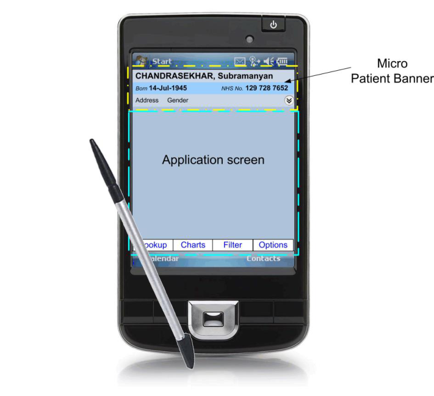
HSCIC Controlled Document

Table 1 describes the changes made since the previous version of this guidance (Baseline version
1.0.0.0 dated 12-Aug-2008):

**Deleted** None

**Modified** Enhanced out of scope context setting (section 1.2.2)

Enhanced illustrations context setting (section2)

Length of name changed from 40 to 35 characters in Rationale (section 3.3.2)

**Added** Patient Safety Process note

Table 1: Changes Since the Last Baseline Version

#### **1.1 Customer Need**

The National Patient Safety Agency (NPSA) [1] states that, although there are no accurate figures on
the frequency or cost of mismatching errors, they form a significant part of the whole range of
errors in health care. These mismatches can occur between a patient, their record, laboratory
results and, in the case of inpatients, their wristband. Whilst the wide variation in wristbands used in
the NHS has now been addressed by a standard [2], there is considerable variation in patient banner
layout across applications, which has already been the subject of CUI guidance **{R1}** . When errors
do occur, they are typically one of three main types **{R2}** :

1. The patient is given the wrong treatment due to failure to identify the patient correctly

2. The patient is given the wrong treatment as a result of a failure to match the patient

correctly with samples, specimens or X-rays

3. The patient is given the wrong treatment as a result of a failure in communication between

staff, or due to staff not performing checking procedures correctly

In addition to the NPSA, accurate patient identification is emphasised by the World Health
Organization (WHO) publication on _Patient Safety Solutions_ **{R4}**, and by the Joint Commission
**{R5}**, both of whom provide guidance on how to improve patient identification.

Handheld computers, that is PDAs, are increasingly being used by health care staff. For a list of the
many uses to which they are being applied in a health care setting, refer to _Handheld Computers_
**{R6}** . For details of adoption rates, refer to _Who’s Using PDAs?_ **{R7}** .

This Micro Patient Banner design guidance is restricted to PDA usage and aims to:

 Ensure patients are correctly identified and matched with their patient record and wristband

**{R3}** by displaying data items consistently

 Allow quick access to and display of other summary information for a patient (such as the

address)

Significant inconsistencies exist across existing micro patient banners used in PDA-based clinical
applications displaying patient information. This has a large but unquantifiable cost in terms of
incorrect identification of patients, leading to safety issues and, potentially, additional staff training.
Reduction of inconsistency is therefore an important goal in itself. Finally, having a consistent,

1 Right patient - right care, NPSA **{R2}** :
[http://www.npsa.nhs.uk/EasySiteWeb/getresource.axd?AssetID=3234&type=full&servicetype=Attachment](http://www.npsa.nhs.uk/EasySiteWeb/getresource.axd?AssetID=3234&type=full&servicetype=Attachment)

2 Standardising wristbands improves patient safety, NPSA Safer Practice Notice **{R3}** :
[Standardising wristbands improves patient safety](http://www.nrls.npsa.nhs.uk/resources/?entryid45=59824)

Page 2

Copyright ©2013 Health and Social Care Information Centre

HSCIC Controlled Document

agreed layout for micro patient banners in clinical systems makes the design and development of
such systems easier and quicker.

#### **1.2 Scope**

The guidance in this document informs the design of a patient-safe micro patient banner to support
one task, namely patient identification. This section details the items that are in scope, and those
that are out of scope, with respect to this guidance.

##### **1.2.1 In Scope**

This guidance is applicable to User Interfaces (UIs) such as those displayed on hand-held devices,
also known as PDAs. These devices are characterised by a small display screen size, typically
quoted by manufacturers as about 4 inches (that is, approximately 10 centimetres) in diagonal. It is
assumed that, as a minimum, these devices are capable of operating at a display resolution greater
than or equal to 240 x 320 pixels, but less than 1024 x 768 pixels, and have a pointing device such
as a stylus.

This guidance informs the design of demographic information displays to support the identification
of a single patient, safely and accurately. It is applicable for all care settings. This guidance was
developed primarily to support the work of the following health care staff as these are especially
likely not to have a previous relation with the patient. Additionally, they are the most likely users of
a hand-held device such as a PDA (this guidance is not limited to these roles but applies across all
health care staff in the NHS):

1. Inpatient doctor

2. Night nurse practitioner

3. Out of hours GP

4. First response paramedic

5. District nurse

6. Bank nurse

##### **1.2.2 Out of Scope**

This section defines areas that are not covered in this guidance. Although there may be specific
risks associated with these areas that are not addressed in this guidance, it is likely that the
principles in this guidance will extend to micro patient banner aspects in many of the areas listed
below.

The following items are out of scope:

 The display of clinical information

 The modification of demographic information

 The display of information for more than one patient at a time

 Information governance, security and confidentiality

 The following form factors: wall-mounted screens, whiteboards, projected images, desktop

monitors, Tablet PCs, telephones, and Smartphones

 Displaying alerts in an MPB

 Displaying an MPB in a pop-up window

 Multi-language applications that use right-to-left writing (such as Arabic), the Cyrillic

alphabet (such as Russian), or ideograms (such as Japanese)

Page 3

Copyright ©2013 Health and Social Care Information Centre

HSCIC Controlled Document

 Display styles such as the choice of font size, background and foreground text colour that

can affect the readability of information in the MPB, as with all other displayed text

 Bar code representations (such as a patient identification number in the form of a bar code)

**Note**

Listing an item as out of scope does not classify it as unimportant. Project time and resource constraints
inevitably restrict what can be in scope for a particular release. It is possible that items out of scope for
this release may be considered for a future release.

#### **1.3 Assumptions**

**A1** Existing CUI Guidance on the Patient Banner is targeted at desktop monitors and is an important reference document but is
not automatically applicable to the MPB

**A2** The ‘log in’ dialogue is out of scope and users are assumed to have logged in successfully to the application running on the
PDA in order to view the patient record and MPB

**A3** All aspects relating to security, privacy and data protection are out of scope of the MPB work

**A4** A MPB is not to be used within a Patient List, but is displayed after a single patient has been selected from a Patient List

**A5** In line with NHS policy, use of the NHS Number is to be encouraged, hence the MPB will not display any local patient
identification numbers

**A6** Whilst the MPB has not been designed for use by patients, health care staff may at their discretion, show an MPB to patients

**A7** This guidance is equally applicable on devices used in portrait and in landscape display modes

Table 2: Assumptions

#### **1.4 Dependencies**

**D1** Ongoing and unpublished work by the NHS National Programme for IT (NPfIT) that is referred to in this document as NHS
Connecting for Health (NHS CFH), such as on the display of gender and sex

**D2** Changes to the information defined in the Personal Demographics Service (PDS [3] )

**D3** Changes to any of the documents listed in the References section in this guidance document

Table 3: Dependencies

3 The Personal Demographics Service **{R24}:**
[The Personal Demographics Service — NHS Connecting for Health](http://www.connectingforhealth.nhs.uk/systemsandservices/demographics/pds)

Page 4

Copyright ©2013 Health and Social Care Information Centre

HSCIC Controlled Document

### 2 MICRO PATIENT BANNER GUIDANCE OVERVIEW

**Important**

The visual representations used within this document to display the guidance are illustrative only. They
are simplified in order to support understanding of the guidance points. Stylistic choices, such as colours,
fonts or icons are not part of the guidance and unless otherwise specified are not mandatory requirements
for compliance with the guidance in this document.

#### **2.1 Summary of Guidance**

MPB-0001 3.3.1 A Micro Patient Banner always consists of one zone, referred to in this guidance as Zone 1, and may
optionally also contain an additional zone, Zone 2

MPB-0002 3.3.1 Display of Zone 2 is optional

MPB-0003 3.3.1 Display information that facilitates patient identification in Zone 1

MPB-0004 3.3.1 Display supplementary information that may support patient identification in Zone 2

MPB-0005 3.3.1 Do not display any clinical information in a Micro Patient Banner

MPB-0006 3.3.1 In the default display of a Micro Patient Banner, show Zone 1; if Zone 2 is to be displayed in this
default state, show Zone 2 in the collapsed state

MPB-0007 3.3.1 Provide visual indication that information is occluded, while Zone 2 is expanded, if appropriate

MPB-0008 3.3.1 A Micro Patient Banner will only support data display, not data input

MPB-0009 3.3.2 Display a Micro Patient Banner at the top of the screen

MPB-0010 3.3.2 Display a Micro Patient Banner horizontally rather than vertically

MPB-0011 3.3.2 Display a Micro Patient Banner in a fixed position, unmovable by the user

MPB-0012 3.3.2 Display a Micro Patient Banner so that it occupies the full width of the application window

MPB-0013 3.3.2 Do not obscure a Micro Patient Banner with other elements of the screen

MPB-0014 3.3.2 Apply visual styling to a Micro Patient Banner (such as a thick border or distinguishing background
colour) in contrast to other elements of the application’s user interface

MPB-0015 3.3.2 Do not display a Micro Patient Banner on screens that contain information relating to more than one
patient

MPB-0016 3.3.2 Do not display a Micro Patient Banner in or alongside a Patient List

MPB-0017 3.3.3 Always display the patient’s name (family name and given name), date of birth, and NHS number in a
Micro Patient Banner

MPB-0018 3.3.3 An MPB may optionally display the patient’s title

MPB-0019 3.3.3 An MPB may optionally display the patient’s age

MPB-0020 3.3.3 Do not display the patient’s location (such as ward and bed), in an MPB

MPB-0021 3.3.3 For a deceased patient, an MPB additionally displays the date of death and age at death

MPB-0022 3.3.3 If an individual data item is not known or is otherwise unavailable, appropriate self-explanatory text or
a blank string (but not a ‘?’), are to be displayed immediately after the corresponding data label

MPB-0023 3.3.3 Display the preferred name if available

MPB-0024 3.3.3 Do not display the patient’s photograph in a MPB

MPB-0025 3.3.4 Display the elements of the patient name, date of birth and NHS number in Zone 1

Page 5

Copyright ©2013 Health and Social Care Information Centre

HSCIC Controlled Document

MPB-0026 3.3.4 Where the age of a living patient is being displayed, display the age in Zone 1

MPB-0027 3.3.4 For a deceased patient, display the date of death and the age at death in Zone 1

MPB-0028 3.3.4 Display the full address (including the postcode) and gender in the expanded Zone 2

MPB-0029 3.3.4 In the expanded Zone 2, precede the full address with the label ‘Usual address’, ’Temporary address’,
or one of the types of temporary address, as appropriate, and as defined in the PDS

MPB-0030 3.3.4 In the expanded Zone 2, provide a means to access all addresses available in the record

MPB-0031 3.3.5 Precede the date of birth with the label ‘Born’

MPB-0032 3.3.5 When displaying the age use only two abbreviated units, a lower and an upper unit, without any
intermediate units (as described in the rationale)

MPB-0033 3.3.5 Precede the gender with the label ‘Gender’

MPB-0034 3.3.5 Display the gender value in full (that is, do not display the gender value using a symbol, icon,
pictogram or a textual abbreviation)

MPB-0035 3.3.5 Precede the NHS number with the label ‘NHS No.’

MPB-0036 3.3.5 Precede the preferred name with the label ‘Preferred name’

MPB-0037 3.3.5 Precede the date of death with the label ‘Died’

MPB-0038 3.3.5 Precede the age at death with the label ‘Age at Death’

MPB-0039 3.3.5 Do not add a colon after the label text

MPB-0040 3.3.5 Do not include unnecessary punctuation in a label

MPB-0041 3.3.5 Display labels in the style given to label text

MPB-0042 3.3.5 Display values in the style given to data text

MPB-0043 3.3.5 Use text styles for labels and for values so that more visual emphasis is given to the value text relative
to the label text

MPB-0044 3.3.5 For each label in Zone 1, provide a definition and a means to access the definition (for example, by a
tooltip)

MPB-0045 3.3.5 Provide a means to inform the user that gender should only be used to identify and address the
patient correctly, not for clinical judgements

MPB-0046 3.3.5 Provide a means to access the record for all data items in Zone 1 and Zone 2

MPB-0047 3.3.5 Provide a means to enable users to adjust font properties for all text displayed in a Micro Patient
Banner, particularly the font family, size and colour

MPB-0048 3.3.6 Display the patient name elements and title, in the following order: family name, given name, title

MPB-0049 3.3.6 Do not include labels for the patient name elements and title

MPB-0050 3.3.6 Display a comma after the family name

MPB-0051 3.3.6 Display the title in parentheses, omitting the parentheses if the title is not being displayed

MPB-0052 3.3.6 Display the patient’s family name in upper case and the patient’s given name and title in title case

MPB-0053 3.3.6 Display the patient’s preferred name, if available, immediately below the family name

MPB-0054 3.3.6 Display the family name and the given name in full (that is, without truncation), splitting across lines if
absolutely necessary

MPB-0055 3.3.7 For a deceased patient, use a background area for Zone 1 in which both the colour and the pattern
are substantially different from those used for a living patient

Page 6

Copyright ©2013 Health and Social Care Information Centre

HSCIC Controlled Document

MPB-0056 3.3.7 The choice of both background colour and pattern must be such as to differentiate a Micro Patient
Banner of a deceased patient from that of a living patient

MPB-0057 3.3.7 Display the date of death along with its label

MPB-0058 3.3.7 Display the date of death below the date of birth

MPB-0059 3.3.7 Display the age at death, preceded by its label, immediately after the date of death

MPB-0060 3.3.7 Display the age at death without parentheses

MPB-0061 3.3.8 Display the patient’s preferred name (if available) immediately below the given name, with both items
left-aligned

MPB-0062 3.3.8 When a patient’s preferred name is not available, the patient’s name must be centred vertically and
left-aligned in Zone 1

MPB-0063 3.3.8 For a deceased patient, display the date of death and age at death labels and values in that order,
immediately below the label corresponding to the date of birth. Left-align both date labels

Table 4: Summary of Guidance

Page 7

Copyright ©2013 Health and Social Care Information Centre

HSCIC Controlled Document

### 3 MICRO PATIENT BANNER GUIDANCE DETAILS

#### **3.1 Introduction**

The guidance provided in this document is based upon a programme of research, including:

 A Web based survey of clinicians and administrative staff covering a range of patient

identification issues **{R16}**

 One-to-one interviews with a range of healthcare professionals **{R17}**

 A plenary discussion with members of the Clinical Spine Application (CSA) Design Steering

Group

#### **3.2 Principles**

The following key principles have shaped the guidance in this document:

 Reliable and accurate identification of an individual patient record

 Matching a patient record with:

 The correct patient, whether present in person or by phone

 Other artefacts associated with the patient, for example, samples, letters, or wristbands

 Displaying core information according to existing standards and guidance and using a

minimum data set available to all NHS clinical applications

 Promoting consistency across the mix of users, NHS clinical applications and care settings

 Displaying minimum supplementary information to support patient identification

 Minimising opportunities for human error

Page 8

Copyright ©2013 Health and Social Care Information Centre

HSCIC Controlled Document

#### **3.3 Guidelines**

##### **3.3.1 Guidance – Structure and Composition**

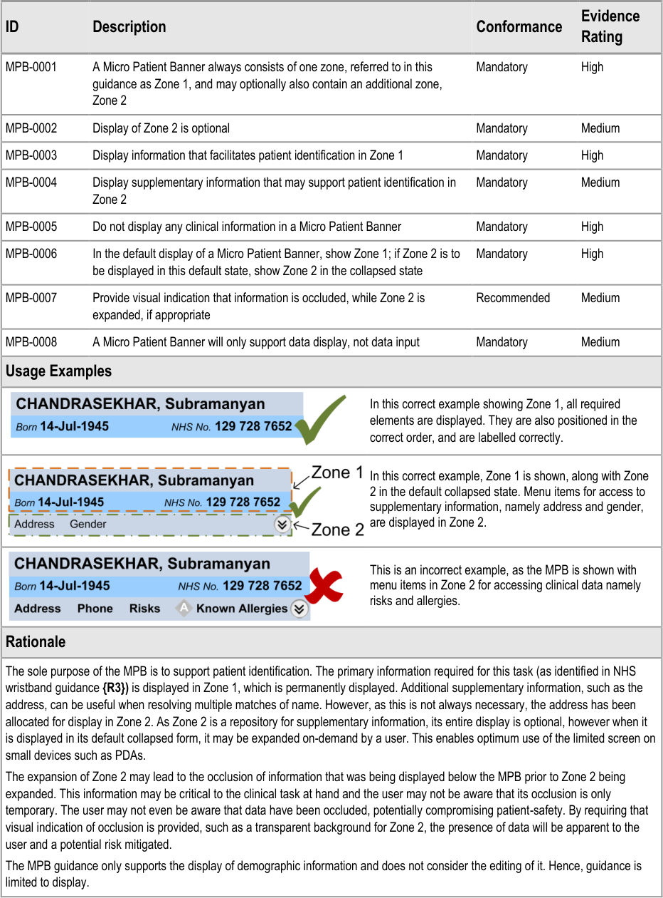

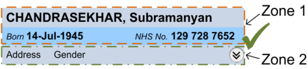

Page 9

Copyright ©2013 Health and Social Care Information Centre

HSCIC Controlled Document

##### **3.3.2 Guidance – Application Context and Positioning**

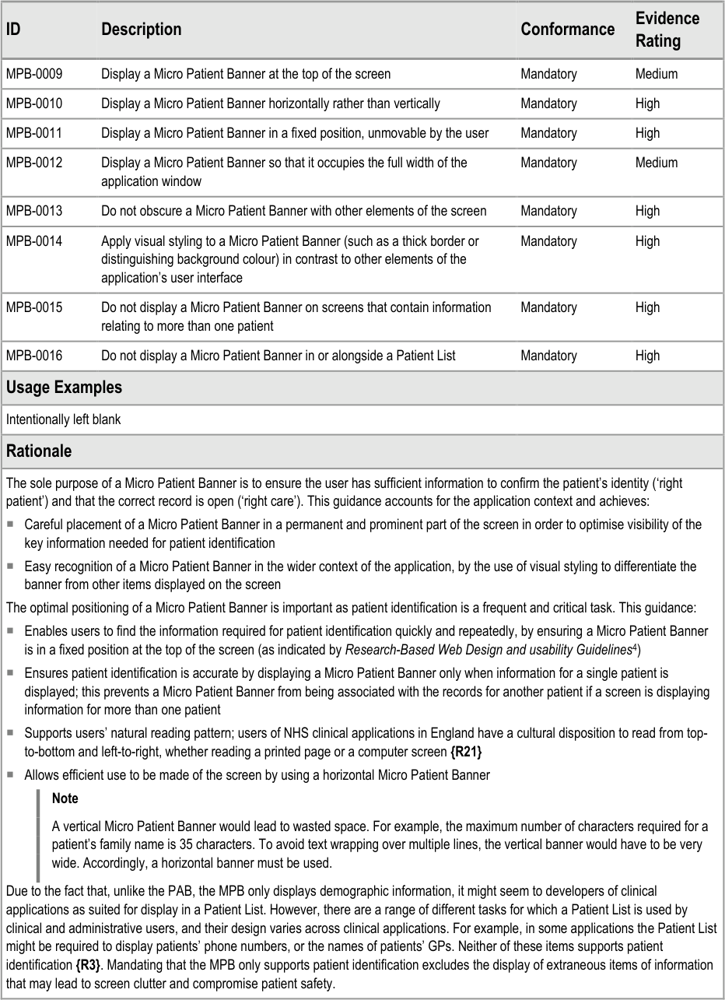

4 Koyani et al, Research-Based Web Design and Usability Guidelines: U.S. Department of Health and Human Services
**{R21}** [: http://www.usability.gov/pdfs/guidelines.html](http://www.usability.gov/pdfs/guidelines.html)

Page 10

Copyright ©2013 Health and Social Care Information Centre

HSCIC Controlled Document

##### **3.3.3 Guidance – Minimum Data Set**

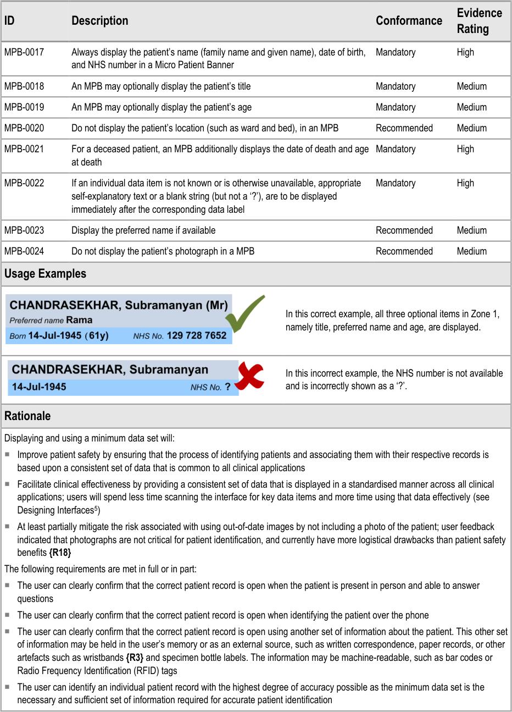

5 Tidwell J, Designing Interfaces **{R22}** :
[www.designinginterfaces.com](http://www.designinginterfaces.com/)

Page 11

Copyright ©2013 Health and Social Care Information Centre

HSCIC Controlled Document

Page 12

Copyright ©2013 Health and Social Care Information Centre

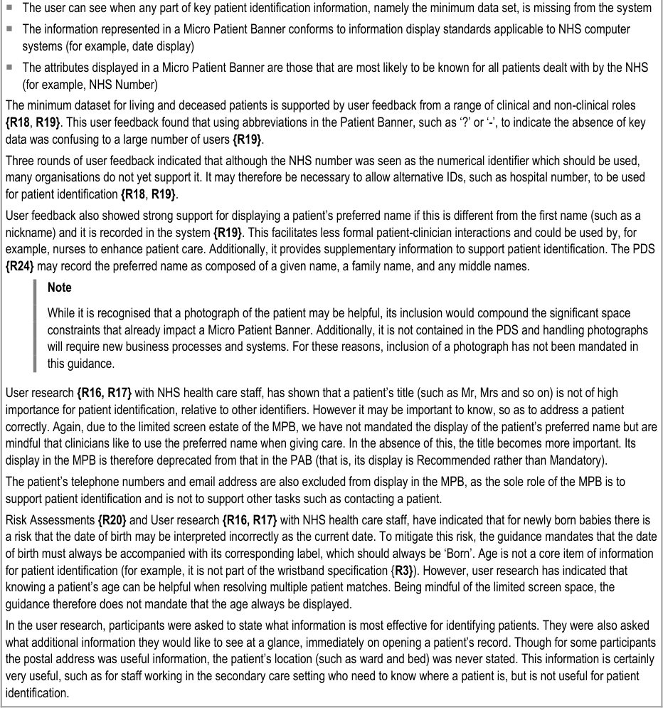
HSCIC Controlled Document

##### **3.3.4 Guidance – Information Grouping**

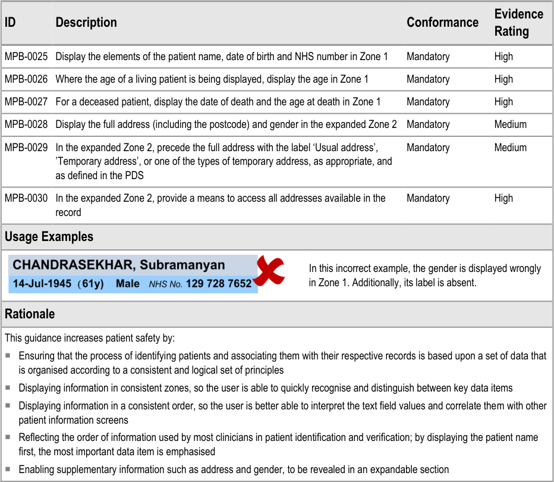

Page 13

Copyright ©2013 Health and Social Care Information Centre

HSCIC Controlled Document

##### **3.3.5 Guidance – Data Labels and Values**

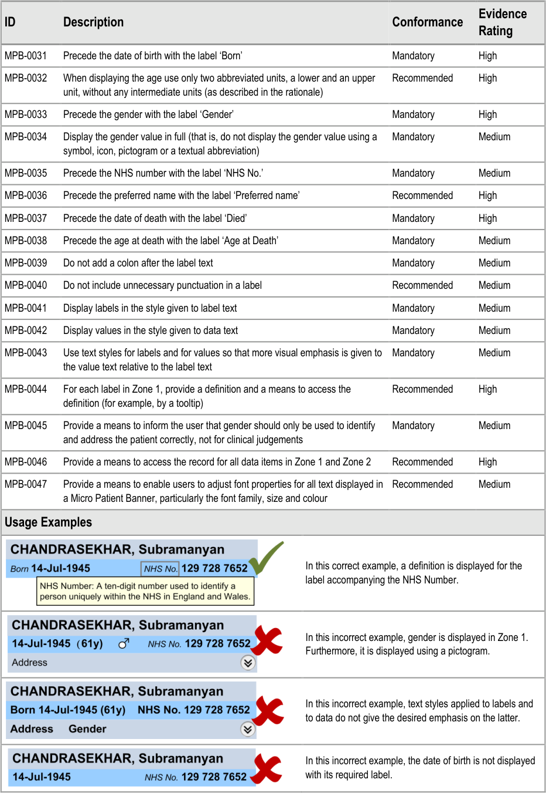

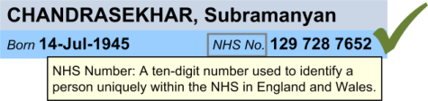

Page 14

Copyright ©2013 Health and Social Care Information Centre

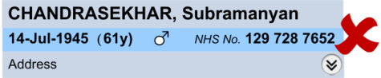

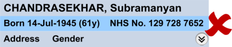
HSCIC Controlled Document

|Col1|Rationale|
|---|---|
||User feedback indicated that the labels ‘Born’, ‘Died’, ‘Preferred name’ and ‘NHS No.’ were seen as most suitable for the date of birth, date of death, preferred name and NHS number respectively**{R18}**. For example, ‘DoB’ and ‘DoD’ were determined to be hard to differentiate visually; additionally some screen readers read aloud ‘DoB’ as ‘dob’. To guide the user’s eye to relevant information, the font size and weight must be chosen so more visual emphasis is given to data values than to their corresponding labels. Data values may, therefore, be rendered in, for example, a larger font size or with greater weight than the corresponding labels to help users locate the required information efficiently. The corresponding data text style and label text style are not specified here but are left to the designers of software applications to choose. As per NHS CUI Accessibility guidance**{R14, R15}**, users should be allowed to set their own font preferences to maximise readability. For a living patient, the patient’s age is displayed in parentheses and a label is not included as displaying the actual age alongside the date of birth makes the value self-explanatory. In addition, the parentheses separate the age from the other text placed nearby and give the age a unique style, helping users to identify this part of the display efficiently. For a deceased patient, there is again a need to give the age a unique style so as to ensure users do not mistake a deceased patient for one who is alive, nor vice versa. This is achieved by doing the converse to the case of a living patient, namely, by displaying a label with the age, which is displayed without parentheses. The display of an age value has been considered carefully for the range of patients from babies to adults. Short, that is, abbreviated units are used to save on space in the already constrained Micro Patient Banner. Additionally, only two units are used, a lower and an upper unit, without any intermediate units, further economising on space without compromising the displayed value. The permitted abbreviations for the units are listed in the_Design Guide Entry – Time Display_**{R9}.** Here is a summary of the age bands with their lower and higher units: **Age** **Lower Unit** **Higher Unit** < 2 hours Minutes Minutes < 2 days Hours Hours < 4 weeks Days Days < 1 year Weeks Days < 2 years Months Days < 18 years Years Months >= 18 years Years Years Here are examples of the display of a patient’s age: **Age** **Display** 1 hour 30 minutes 90min 1 day 2 hours 5 minutes 26hrs 3 days 17 hours 7 minutes 3d 27 days 5 hours 2 minutes 27d 28 days 5 hours 2 minutes 4w 29 days 5 hours 2 minutes 4w 1d 1 year 1 day 5 hours 12m 1d 1 year 8 days 5 hours 12m 8d 1 year 39 days 5 hours 13m 8d 4 years 39 days 4y 1m|

Page 15

Copyright ©2013 Health and Social Care Information Centre

HSCIC Controlled Document

Labelling the information according to the above guidance confers the following benefits:

 Users can clearly differentiate between data items (see _How to limit clinical error in interpretation of data_ [6] )

 Users are less likely to be confused about what certain data values represent, for example, a date on its own could be a date of

birth or a date of death

 The user is able to read patient identification information in an unambiguous, consistent way wherever this information might

appear

This guidance supports the need for flexibility on the part of application designers by leaving open the choice of:

 Data and label text styles

 Label definitions. Definitions must be provided for all labels. The suggested definition for NHS number is: ‘A ten-digit number used

to identify a person uniquely within the NHS in England and Wales’ **{R12}**

 Means to access the definitions and the record

User research **{R16, R17}** with NHS health care staff has shown that using an icon such as or to display a patient’s gender is
not understood. NHS CUI guidance for sex and gender display **{R11}**, based on the _NHS Data Model and Dictionary_ **{R25}**, also
specifies other permissible values (namely ‘Not known’ and ‘Not Specified’) for which there are no graphical representations. For these
reasons, this guidance prohibits all pictorial forms of displaying gender in the MPB. A common form for displaying gender is in
abbreviated form, such as ‘M’ for male and ‘F’ for female. While these are more intuitively understood, the problem remains for the
other values, for which any abbreviation would be ambiguous. The overarching principle, which applies across all items in a MPB, is to
always display the minimum data set and accompanying labels in full, provided screen space allows for this. Any departures from this
principle should be based on sound safety assessments.

As already discussed, for age and for address, gender is not a core item of information for patient identification **{R3}**, but is a helpful
item when resolving multiple matches or when addressing a patient. In the user research, a participant commented that “ _Having_
_gender displayed reduces the chance of mistaken identity by half. It is good to know the gender when discussing patients with relatives_
_and over the phone, so that the correct personal pronouns can be used. This saves anxiety and embarrassment”._ Its display is
therefore not mandatory but, when displayed, the label ‘Gender’ must be used rather than ‘Sex’ as, for patient identification, the
patient’s current gender classification is more relevant than that recorded at birth. Comments were also made by participants about the
difference between sex and gender and that the former is used for clinical purposes (such as for prescribing). However, this difference
between sex and gender was not understood by all participants in the user research, a number of whom saw these terms as being
synonymous. To emphasise the difference, this guidance advises that suitable cautionary information be provided to users. The
suggested definition for gender is: ‘Gender: a person’s current gender. This may be different from a person’s sex, which is a person’s
gender defined at the point of birth registration.’

A further aspect mentioned by one participant in the user research was the need to know whether a patient was of transgender or
whether the sex and gender differed. These aspects stray from the aim of the Micro Patient Banner and therefore the guidance does
not advise displaying such information.

The label ‘Born’ is mandated, though wristband guidance uses ‘Date of Birth’, because the former is shorter and screen space is
limited on the MPB. In the user research, one person commented that the label helps “ _To avoid confusion with today's date [for] new_
_born babies_ .”

Finally, reference to tooltips is only to serve as an example, not as a recommended design choice. Indeed, tooltips may not be
supported by the operating system software running on the PDA, as these do not typically support stylus-hover behaviour in the way
that desktops support mouse-hover behaviour. One can envisage a tooltip-like display style activated upon touch instead of on hover.
However, the guidance does not require that PDAs used for clinical applications must have touch-sensitive screens. The guidance
endeavours to be platform-agnostic, so simply emphasises the need to support on-demand explanatory information to the user in a
form suited to the chosen platform. In addition to the suggested definition for gender given above, the following definitions are
suggested:

 Patient name: ‘The patient’s family name, followed by their given name’

 Date of birth: ‘The patient’s date of birth’.

6 Wright, P. C. Jansen, JC. Wyatt. (1998): How to limit clinical error in interpretation of data: Lancet 352: 1539-43 **{R23}** :
[http://www.ncbi.nlm.nih.gov/entrez/query.fcgi?db=PubMed&cmd=Retrieve&list_uids=9820319&dopt=Citation](http://www.ncbi.nlm.nih.gov/entrez/query.fcgi?db=PubMed&cmd=Retrieve&list_uids=9820319&dopt=Citation)

Page 16

Copyright ©2013 Health and Social Care Information Centre

HSCIC Controlled Document

##### **3.3.6 Guidance – Patient Name**

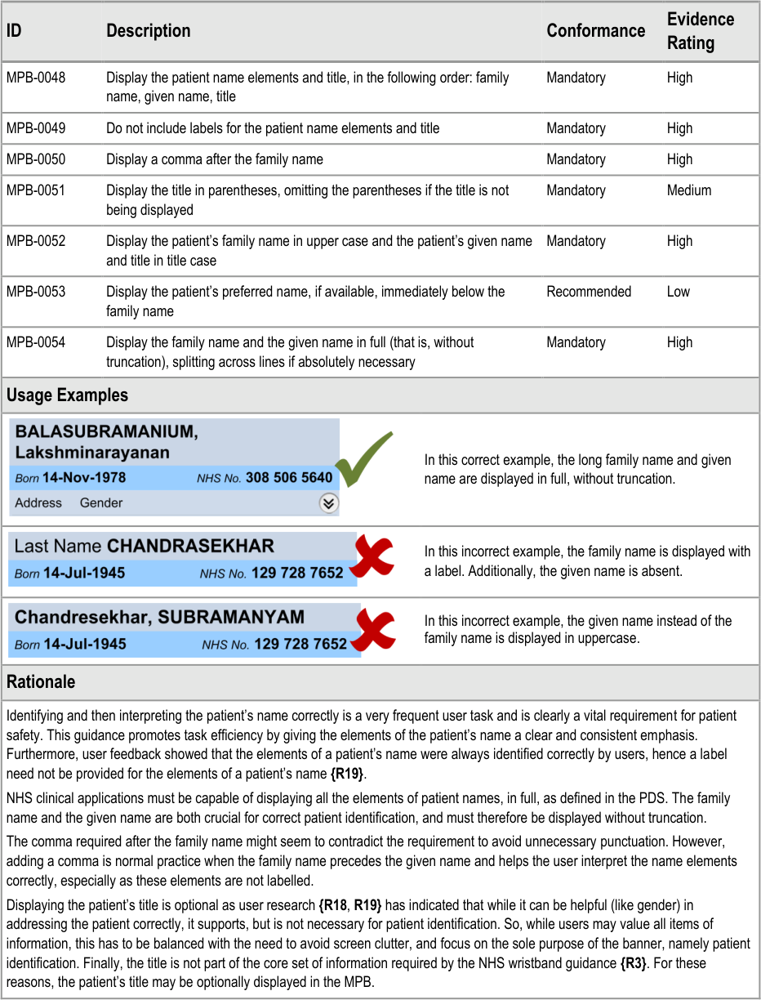

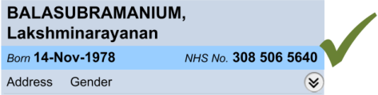

Page 17

Copyright ©2013 Health and Social Care Information Centre

HSCIC Controlled Document

##### **3.3.7 Guidance – Micro Patient Banner for a Deceased Patient**

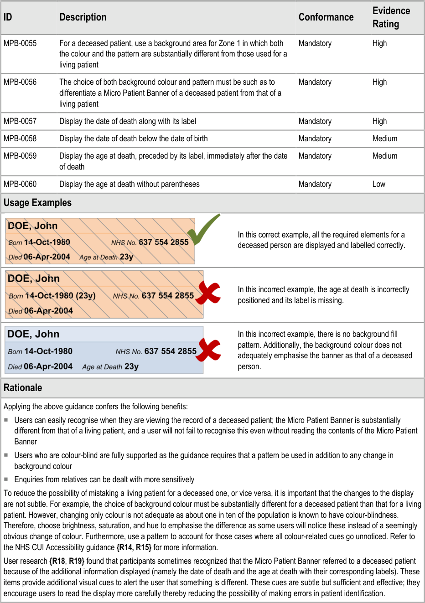

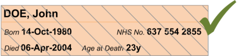

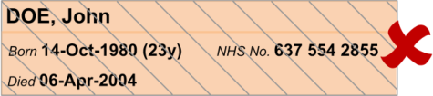

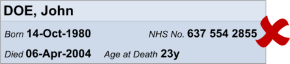

Page 18

Copyright ©2013 Health and Social Care Information Centre

HSCIC Controlled Document

##### **3.3.8 Guidance – Alignment of Information**

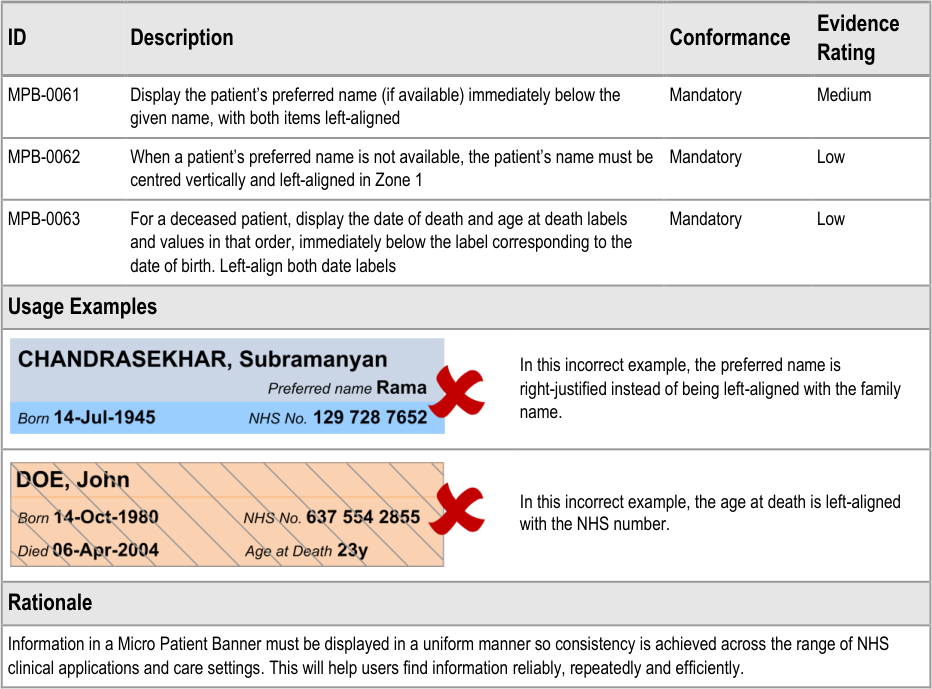

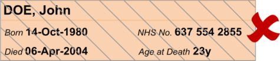

#### **3.4 Rationale Summary**

The guidance in this document mitigates patient safety issues that arise during patient
identification.

General Principles:

 Reliable and accurate identification of an individual patient record

 Matching a patient record with:

 The correct patient, whether present in person or on the telephone

 Other artefacts associated with the patient (for example, samples, letters or wristbands)

 Displaying core information according to existing standards and guidance and using a

minimum data set available to all NHS clinical applications

 Promoting consistency across the mix of users, NHS clinical applications and care settings

 Displaying minimum supplementary information to support patient identification

 Minimising opportunities for human error

Usability Principles:

 Enhance readability of data over that of corresponding labels

 Separate primary data required for patient identification from secondary supporting data

 Permanent display of primary data for frequent and efficient access

 On-demand display of secondary data to reduce screen clutter

Page 19

Copyright ©2013 Health and Social Care Information Centre

HSCIC Controlled Document

 Guidance based on feedback from user research

 Support all users by additionally addressing requirements for accessibility

Existing Standards:

 NPSA Safer Practice Notice: _Standardising wristbands improves patient safety_ **{R3}**

Evolving Standards:

 Information needed for patient identification

 Information described in the PDS

 Age display in electronic system for children (under development in the Child Health

Workstream at NHS CFH)

 Gender display

Copyright ©2013 Health and Social Care Information Centre

Page 20

HSCIC Controlled Document

### 4 DOCUMENT INFORMATION

#### **4.1 Terms and Abbreviations**

CSA Clinical Spine Application

CUI Common User Interface

MPB Micro Patient Banner

NPfIT National Programme for Information Technology

NHS National Health Service

NHS CFH NHS Connecting for Health

NPSA National Patient Safety Agency

PAB Patient Banner

PC Personal Computer

PDA Personal Digital Assistant

PDS Personal Demographics Service

RFID Radio Frequency Identification

UI User Interface

WHO World Health Organization

Table 5: Terms and Abbreviations

#### **4.2 Definitions**

NHS Entity Within this document, defined as a single NHS organisation or group that is operated within a single
technical infrastructure environment by a defined group of IT administrators.

The Authority The organisation implementing the NHS National Programme for IT (currently NHS Connecting for
Health).

Current best practice Current best practice is used rather than best practice, as over time best practice guidance may
change or be revised due to changes to products, changes in technology, or simply the additional
field deployment experience that comes over time.

Table 6: Definitions

Page 21

Copyright ©2013 Health and Social Care Information Centre

HSCIC Controlled Document

#### **4.3 Nomenclature**

This section shows how to interpret the different styles used in this document to denote various
types of information.

##### **4.3.1 Body Text**

Code `Monospace`

Script

Other markup languages

Interface dialog names **Bold**

Field names

Controls

Folder names Title Case

File names

Table 7: Body Text Styles

##### **4.3.2 Cross References**

Current document – sections Section number only

Current document – figures/tables Caption number only

Other project documents _Italics_ and possibly a footnote

Publicly available documents _Italics_ with a footnote

External Web-based content _Italics_ and a hyperlinked footnote

Table 8: Cross Reference Styles

#### **4.4 References**

**R1.** NHS CUI Design Guide Workstream – Design Guide Entry – Patient Banner 4.0.0.0

**R2.** Right patient - right care, NPSA:
[http://www.npsa.nhs.uk/EasySiteWeb/getresource.axd?AssetID=3234&type=full&servicetype=Attachment](http://www.npsa.nhs.uk/EasySiteWeb/getresource.axd?AssetID=3234&type=full&servicetype=Attachment)

**R3.** Standardising wristbands improves patient safety, NPSA Safer Practice Notice:
[Standardising wristbands improves patient safety](http://www.nrls.npsa.nhs.uk/resources/?entryid45=59824)

**R4.** WHO Collaborating Centre for Patient Safety Releases - Patient Safety Solutions – Volume 1, Solution 2:
[http://www.jcipatientsafety.org/fpdf/Presskit/PS-Solution2.pdf](http://www.jcipatientsafety.org/fpdf/Presskit/PS-Solution2.pdf)

**R5.** The Joint Commission - National Patient Safety Goals – Goal 1:
[http://www.jointcommission.org/PatientSafety/NationalPatientSafetyGoals/08_npsg_facts.htm](http://www.jointcommission.org/PatientSafety/NationalPatientSafetyGoals/08_npsg_facts.htm)

**R6.** Mohammad Al-Ubaydli, _Handheld Computers,_ BMJ 2004;328;1181-1184

**R7.** Chantelle Garritty and Khaled El Emam: Who’s Using PDAs? Estimates of PDA Use by Health Care
Providers: A Systematic Review of Surveys: J Med Internet Res 2006;8(2):e7:
[http://www.jmir.org/2006/2/e7/](http://www.jmir.org/2006/2/e7/)

2004

2007

2007

2007

**R8.** NHS CUI Design Guide Workstream – Design Guide Entry – Date Display 4.0.0.0

Page 22

Copyright ©2013 Health and Social Care Information Centre

HSCIC Controlled Document

**R9.** NHS CUI Design Guide Workstream – Design Guide Entry – Time Display 4.0.0.0

**R10.** NHS CUI Design Guide Workstream – Patient Name Input and Display – User Interface Design Guidance 2.0.0.0

**R11.** NHS CUI Design Guide Workstream – Sex and Current Gender Input and Display — User Interface
Design Guidance

4.0.0.0

**R12.** NHS CUI Design Guide Workstream – NHS Number Input and Display – User Interface Design Guidance 3.0.0.0

**R13.** NHS CUI Design Guide Workstream – Address Input and Display – User Interface Design Guidance 3.0.0.0

**R14.** NHS CUI Design Guide Workstream – Accessibility Checkpoints for NHS Applications 1.0.0.0

**R15.** NHS CUI Design Guide Workstream – Accessibility for Clinical Applications 1.0.0.0

**R16.** NHS CUI Micro Patient Banner User Research – Online Survey 1.0.0.0

**R17.** NHS CUI Micro Patient Banner User Research – Interviews 1.0.0.0

**R18.** NHS CUI Patient Banner User Research 2006-12-07 0.0.0.5

**R19.** NHS CUI Patient Banner Survey Results 2007-08-06 1.0.0.0

**R20.** NHS CUI Micro Patient Banner Hazard Log 1.0.0.0

**R21.** Koyani et al, Research-Based Web Design and Usability Guidelines: U.S. Department of Health and
Human Services:
[http://www.usability.gov/pdfs/guidelines.html](http://www.usability.gov/pdfs/guidelines.html)

**R22.** Tidwell J, Designing Interfaces:
[www.designinginterfaces.com](http://www.designinginterfaces.com/)

**R23.** Wright, P. C. Jansen, JC. Wyatt. (1998): How to limit clinical error in interpretation of data: Lancet 352:
1539-43:
[http://www.ncbi.nlm.nih.gov/entrez/query.fcgi?db=PubMed&cmd=Retrieve&list_uids=9820319&dopt=Citati](http://www.ncbi.nlm.nih.gov/entrez/query.fcgi?db=PubMed&cmd=Retrieve&list_uids=9820319&dopt=Citation)
[on](http://www.ncbi.nlm.nih.gov/entrez/query.fcgi?db=PubMed&cmd=Retrieve&list_uids=9820319&dopt=Citation)

**R24.** The Personal Demographics Service
[The Personal Demographics Service — NHS Connecting for Health](http://www.connectingforhealth.nhs.uk/systemsandservices/demographics/pds)

**R25.** National Health Service (NHS) Data Model and Dictionary:
[http://www.datadictionary.nhs.uk/index.asp](http://www.datadictionary.nhs.uk/index.asp)

Table 9: References

Copyright ©2013 Health and Social Care Information Centre

2006

First
Edition

1998

Page 23

HSCIC Controlled Document

### REVISION AND SIGNOFF SHEET

#### **Change Record**

04-Jul-2008 Ash Gupta 0.0.0.1 Initial draft for review/discussion

11-Jul-2008 Mick Harney 0.0.1.0 Made placeholder Working Baseline version prior to copyedit

11-Jul-2008 Mick Harney 0.0.2.0 First copyedit pass

17-Jul-2008 Ash Gupta 0.0.3.0 Second draft for review

17-Jul-2008 Mick Harney 0.0.4.0 Copyedit to reformat and highlight remaining input needed from author

17-Jul-2008 Ash Gupta 0.0.5.0 Remaining input added

18-Jul-2008 Mick Harney 0.1.0.0 Final copyedit checks and raised to Baseline Candidate

29-Jul-2008 Ash Gupta 0.1.0.1 Updates

29-Jul-2008 Mick Harney 0.2.0.0 Raised to Baseline Candidate for Approval

05-Aug-2008 Ash Gupta 0.2.0.1 Incorporated improvements identified while debranding

06-Aug-2008 Mick Harney 0.3.0.0 Raised to Baseline Candidate #3

12-Aug-2008 Mick Harney 1.0.0.0 Raised to Baseline

20-Apr-2009 Mick Harney 1.0.0.1 Foundation draft for ISB updates

29-May-2009 Rachel Eno 1.0.0.2 Updates

29-May-2009 Mick Harney 1.0.0.3 Copyedited updates

29-May-2009 Mick Harney 1.1.0.0 Raised to Baseline Candidate

24-June-2009 Simon Burnham 2.0.0.0 Raised to Baseline

Document Status has the following meaning:

 **Drafts 0.0.0.X**  - Draft document reviewed by the Microsoft CUI Project team and the

Authority designate for the appropriate Project. The document is liable to change.

 **Working Baseline 0.0.X.0**  - The document has reached the end of the review phase and

may only have minor changes. The document will be submitted to the Authority CUI Project
team for wider review by stakeholders, ensuring buy-in and to assist in communication.

 **Baseline Candidate 0.X.0.0**  - The document has reached the end of the review phase and

it is ready to be frozen on formal agreement between the Authority and the Company.

 **Baseline X.0.0.0**  - The document has been formally agreed between the Authority and the

Company.

Note that minor updates or corrections to a document may lead to multiple versions at a particular
status.

#### **Open Issues Summary**

None

Page 24

Copyright ©2013 Health and Social Care Information Centre

HSCIC Controlled Document

#### **Audience**

The audience for this document includes:

 **Authority CUI Manager / Project Sponsor** . Overall project manager and sponsor for the

NHS CUI project within the Authority.

 **Authority Clinical Applications and Patient Safety Project Project Manager.**

Responsible for ongoing management and administration of the Project.

 **The Authority Project Team** . This document defines the approach to be taken during this

assessment and therefore must be agreed by the Authority.

 **Microsoft NHS CUI Team** . This document defines the approach to be taken during this

assessment, including a redefinition of the Clinical Applications and Patient Safety Project
strategy.

#### **Reviewers**

Mike Carey Toolkit Workstream Lead

Tim Chearman UX Architect

Kate Verrier-Jones Clinical Advisor

#### **Distribution**

Mike Carey Toolkit Workstream Lead

Tim Chearman UX Architect

Dee Hackett Clinical Advisor

Peter Johnson Clinical Architect

Naveenta Kumar Clinical Advisor

Kate Verrier-Jones Clinical Advisor

#### **Document Properties**

Document Title Micro Patient Banner User Interface Design Guidance

Author Clinical Applications and Patient Safety Project

Restrictions **RESTRICTED – COMMERCIAL; MICROSOFT COMMERCIAL;** Access restricted to: NHS
CUI Project Team, Microsoft NHS Account Team

Creation Date 4 July 2008

Last Updated 23 June 2015

Page 25

Copyright ©2013 Health and Social Care Information Centre

HSCIC Controlled Document

**Copyright:**

You may re-use this information (excluding logos) free of charge in any format or medium, under
the terms of the Open Government Licence. To view this licence, visit
[nationalarchives.gov.uk/doc/open-government-licence or email psi@nationalarchives.gsi.gov.uk.](https://web.nhs.net/OWA/redir.aspx?C=dMnSAL43xUOp9X_SOcscV9mT5A0smdBIh1_vxjdSDVCERI33v7-idn6tNFCNwJYUR1PxIW-Hd-E.&URL=http%3a%2f%2fnationalarchives.gov.uk%2fdoc%2fopen-government-licence)

Page 26

Copyright ©2013 Health and Social Care Information Centre

