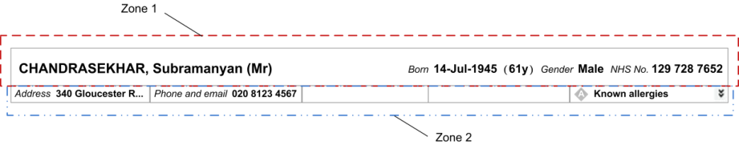
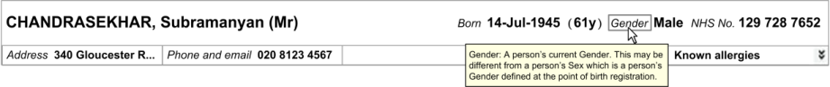
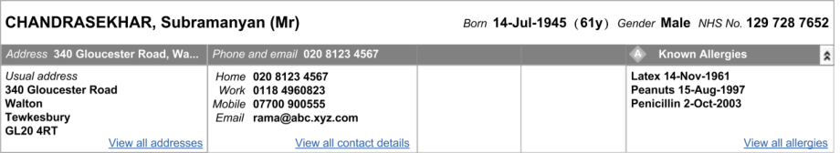

_Prepared for_
**NHS Connecting for Health**
**Version 4.0.0.0 Baseline**
_Prepared by_
**NHS CUI Programme Team**
**[cuistakeholder.mailbox@hscic.gov.uk](mailto:cuistakeholder.mailbox@hscic.gov.uk)**
### PREFACE

<!-- TOC -->
<!-- TOC generated by Markdown All in One style -->

- [PREFACE](#preface)
- [1 INTRODUCTION](#1-introduction)
  - [1.1 Customer Need](#11-customer-need)
    - [1.1.1 Overview](#111-overview)
    - [1.1.2 Eliminating Inconsistencies Across Systems](#112-eliminating-inconsistencies-across-systems)
    - [1.1.3 Simplified UI Design and Development](#113-simplified-ui-design-and-development)
  - [1.2 Scope](#12-scope)
    - [1.2.1 In Scope](#121-in-scope)
    - [1.2.2 Out of Scope](#122-out-of-scope)
    - [1.2.3 Dependencies and Assumptions](#123-dependencies-and-assumptions)
  - [1.3 Key Principles](#13-key-principles)
- [2 RECOMMENDATION AND GUIDANCE](#2-recommendation-and-guidance)
  - [2.1 Structure and Composition](#21-structure-and-composition)
    - [2.1.1 Guidance](#211-guidance)
    - [2.1.2 Rationale](#212-rationale)
  - [2.2 Application Context and Patient Banner Positioning](#22-application-context-and-patient-banner-positioning)
    - [2.2.1 Guidance](#221-guidance)
    - [2.2.2 Examples of Correct and Incorrect Usage](#222-examples-of-correct-and-incorrect-usage)
    - [2.2.3 Rationale](#223-rationale)
  - [2.3 The Minimum Data Set](#23-the-minimum-data-set)
    - [2.3.1 Guidance](#231-guidance)
    - [2.3.2 Rationale](#232-rationale)
  - [2.4 Information Groupings](#24-information-groupings)
    - [2.4.1 Guidance](#241-guidance)
    - [2.4.2 Rationale](#242-rationale)
  - [2.5 Data Labels and Values](#25-data-labels-and-values)
    - [2.5.1 Guidance](#251-guidance)
    - [2.5.2 Examples of Correct Usage](#252-examples-of-correct-usage)
    - [2.5.3 Rationale](#253-rationale)
  - [2.6 Displaying the Patient Name](#26-displaying-the-patient-name)
    - [2.6.1 Guidance](#261-guidance)
    - [2.6.2 Rationale](#262-rationale)
  - [2.7 Patient Banner for a Deceased Patient](#27-patient-banner-for-a-deceased-patient)
    - [2.7.1 Guidance](#271-guidance)
    - [2.7.2 Examples of Correct Usage](#272-examples-of-correct-usage)
    - [2.7.3 Rationale](#273-rationale)
  - [2.8 Alignment of Information](#28-alignment-of-information)
    - [2.8.1 Guidance](#281-guidance)
    - [2.8.2 Examples of Correct Usage](#282-examples-of-correct-usage)
    - [2.8.3 Rationale](#283-rationale)
  - [2.9 Displaying Allergy Propensities](#29-displaying-allergy-propensities)
    - [2.9.1 Guidance](#291-guidance)
    - [2.9.2 Examples of Correct Usage](#292-examples-of-correct-usage)
    - [2.9.3 Rationale](#293-rationale)
- [3 DOCUMENT INFORMATION](#3-document-information)
  - [3.1 Terms and Abbreviations](#31-terms-and-abbreviations)
  - [3.2 Definitions](#32-definitions)
  - [3.3 Nomenclature](#33-nomenclature)
    - [3.3.1 Body Text](#331-body-text)
    - [3.3.2 Cross References](#332-cross-references)
  - [3.4 References](#34-references)
- [REVISION AND SIGNOFF SHEET](#revision-and-signoff-sheet)
  - [Change Record](#change-record)
  - [Open Issues Summary](#open-issues-summary)
  - [Audience](#audience)
  - [Reviewers](#reviewers)
  - [Distribution](#distribution)
  - [Document Properties](#document-properties)

<!-- /TOC -->

Source PDF: [patben.pdf](../../pdfs/patient-identification-and-information-entry-and-display/patben.pdf)

**Documents replaced by this document**
Design Guide Entry – Patient Banner 3.0.0.0
Design Guide Entry – Patient Banner 2.0.0.0
Design Guide Entry – Patient Banner 1.0.0.0
Patient Banner – Release 4 Summary 1.0.0.0
**Documents to be read in conjunction with this document**
Design Guide Entry – Date Display 4.0.0.0
Design Guide Entry – Time Display 4.0.0.0
Design Guide Entry – Address Display 1.0.0.0
Sex and Current Gender Input and and Display – User Interface Design Guidance 4.0.0.0
NHS Number Input and Display – User Interface Design Guidance 3.0.0.0
Telephone Number Input and Display – User Interface Design Guidance 3.0.0.0
Accessibility Checkpoints for NHS Applications 1.0.0.0
Accessibility for Clinical Applications 1.0.0.0
**This document was prepared for NHS Connecting for Health which ceased to exist on 31 March**
**2013. It may contain references to organisations, projects and other initiatives which also no**
**longer exist. If you have any questions relating to any such references, or to any other aspect of**
**[the content, please contact cuistakeholder.mailbox@hscic.gov.uk](mailto:cuistakeholder.mailbox@hscic.gov.uk)**
**Patient Safety Process**
The development lifecycle for this design guide includes an integrated patient / clinical safety risk assessment and management process.
Known patient safety incidents relevant to this design guidance area have been researched and reviewed as part of ongoing development. The resulting guidance points aim to support mitigation of these known patient safety risks. In addition, the developers of this design guide have undertaken a patient safety risk assessment to identify new risks that could potentially be introduced by the guidance points in this document. Any potential risks identified have been assessed and managed to support the ongoing clinical safety case for this design guide.
The Hazard Log records all the risks that have been identified during development and describes mitigatory actions that, in some cases, will need to be taken by users of this design guide. The Hazard Log is a live document that is updated as the design guide is developed and maintained. Until this design guide has received full Clinical Authority to Release (CATR) from the NHS Connecting for Health (CFH) Clinical Safety Group (CSG) – based on an approved Clinical Safety Case – there may be outstanding patient safety risks yet to be identified and mitigated.
Additionally, users implementing applications that follow this design guide’s guidelines (for example, healthcare system suppliers) are expected to undertake further clinical safety risk assessments of their specific systems within their specific context of use.
Refer to [NHS Common User Interface for further information on the patient safety process and for](http://www.cui.nhs.uk/Pages/NHSCommonUserInterface.aspx) the safety status and any relevant accompanying safety documentation for this design guide.
### 1 INTRODUCTION

This document describes the design guidance for Patient Banner. It describes the area of focus, provides guidance and recommendations, and explains the rationale behind the guidance and recommendations.

A patient banner is an area within a clinical user interface (UI) that provides key information in a consistent and unambiguous manner, allowing patients to be accurately identified and matched with their associated records.

This document is intended for the use of anyone whose role includes screen design, implementation, or assessment of an NHS clinical application. This document can be used as guidance for the:

- Specification of a patient banner in a user interface

- Implementation of a patient banner within an application

- Assessment of a patient banner in an NHS clinical application user interface

Table 1 describes the changes made since the previous version of this guidance (Baseline version 3.0.0.0 dated 22-Jan-2008):

**Deleted** None

**Modified** Including text relating to display styles (section 1.2.2)

Enhanced context setting for out of scope text (section 1.2.2)

Including Patient Safety Assessment (section 2)

Correcting field length descriptor for Last Name (2.2.3 Note)

PAB-0016 Modification to wording

**Added** Patient Safety Process note

PAB-0073 Mandatory use of Zone 1

PAB-0074 Recommended use of Zone 2

PAB-0075 Zone 2 expand and collapse capability

PAB-0076 Tabbing order within displayed information

Table 1: Changes Since the Last Baseline Version

#### 1.1 Customer Need

##### 1.1.1 Overview

The term “patient banner” refers to the area of the user interface that contains header information for a patient record. The patient banner is the area within the user interface that is most often used to match records with patients and contains key information for identifying patients, such as name, address and date of birth. This information may be matched with that provided by the patient (or a third party, such as a parent), usually in their presence or over the telephone. Information in the patient banner may also be matched with that in any of the patient’s associated artefacts, such as samples, letters, specimens, wristbands and X-rays.

The National Patient Safety Agency (NPSA) **{R1}** states that although there are no accurate figures on the frequency or cost of mismatching errors, they form a significant part of the whole range of

Page 1

Copyright ©2013 Health and Social Care Information Centre

HSCIC Controlled Document

errors in health care. However, there is considerable variation in the layout of a patient banner across clinical applications.

The aims of the Patient Banner described in this guidance are to:

- Ensure patients are correctly identified and matched with their patient record by displaying

data items consistently

- Allow quick access to and display of other summary information, such as contact details

and allergies, for a patient

- Reduce and, where possible, eliminate errors in the matching of patients with their care

**{R1}**

When errors do occur, they are typically one of three main types **{R1}** :

1. The patient is given the wrong treatment as a result of a failure to identify the patient

correctly

2. The patient is given the wrong treatment as a result of a failure to match the patient

correctly with their artefacts (samples, letters, specimens, X-rays, and so on)

3. The patient is given the wrong treatment as a result of a failure in communication between

staff, or staff not performing checking procedures correctly

This guidance is concerned with each of the errors identified above, but particularly 1) and 2).

##### 1.1.2 Eliminating Inconsistencies Across Systems

Significant inconsistencies exist across patient banners in many clinical applications. This has a large but probably unquantifiable cost in terms of incorrect identification of patients, leading to safety issues and, potentially, additional staff training. Reduction of inconsistency is therefore an important goal in itself – and the primary aim of this guidance.

##### 1.1.3 Simplified UI Design and Development

Having a consistent, agreed layout for patient banners in clinical systems, potentially makes the design and development of such systems easier and quicker.

#### 1.2 Scope

##### 1.2.1 In Scope

This guidance is applicable to user interfaces displayed on desktop or laptop computers. It is assumed that, at a minimum, these computers are capable of operating at a minimum display resolution of 1024 x 768, and have a keyboard and pointing device. The following items are in scope:

- **Defining the minimum items of information that must be contained in a Patient**

**Banner in order to identify the patient**, such as, but not limited to:

 Patient name (family name, given name and title)

 Patient address

 Date of birth

 Patient age

 Date of death (displayed to aid the identification of deceased patients)

 Gender

 NHS Number

Page 2

Copyright ©2013 Health and Social Care Information Centre

HSCIC Controlled Document

- **Grouping and layout of this information**, including:

 Which data items should be grouped together

 Which data items should be given the most prominence

 Whether and where controls (such as expandable/collapsible panels) should be used

- **Labelling of information**, including:

 Which items of information in the Patient Banner are to be labelled

 How items of information are to be labelled; this will cover the label text, positioning and any elements of styling required to differentiate labels visually from data

- **Location and shape of the Patient Banner**, in order to achieve:

 Optimal visibility of the key information needed for patient identification

 Easy recognition of the Patient Banner in the context of the wider clinical application

- **Size of the Patient Banner** . This must be a balance between the minimum required for

suitable layout of the content, and the maximum that can be used at the expense of screen space left for the clinical application to use

##### 1.2.2 Out of Scope

This section defines areas that are not covered in this guidance. Although there may be specific risks associated with these areas that are not addressed in this guidance, it is likely that the principles in this guidance will extend to aspects of the Patient Banner in many of the areas listed below.

The following items are out of scope:

- **Reduced-size form factors**  - This guidance does not cover reduced-size form factors,

such as personal digital assistants (PDAs) and such other small mobile devices

- **Input of information**  - This guidance does not cover the entering of information into the

patient record

- **Display styles**  - This guidance does not cover the choice of display features such as font

size, background and foreground text colour

- **Data storage**  - This guidance does not prescribe the format for storing data displayed in

the Patient Banner

**Note**

Listing an item as out of scope does not classify it as unimportant. Project time and resource constraints inevitably restrict what can be in scope for a particular release. It is possible that items out of scope for this release may be considered for a future release.

##### 1.2.3 Dependencies and Assumptions

Compliance with other guidance is required as follows:

- The display of dates must conform to guidance for Date Display **{R2}**

- The display of age must conform to guidance for Time Display **{R3}**

- The display of gender must conform to guidance for Gender and Sex Display **{R4}**

- The display of NHS number must conform to guidance for NHS Number Display **{R5}**

- The display of addresses must conform to guidance for Address Information Display **{R6}**

Page 3

Copyright ©2013 Health and Social Care Information Centre

HSCIC Controlled Document

- The display of phone numbers must conform to guidance for Telephone Number Display

**{R7}**

- The design of NHS clinical applications must conform to _Accessibility Checkpoints for NHS_

_Clinical Applications_ **{R8}** and _Accessibility for Clinical Applications_ **{R9}**

**Important**

The diagrams, mock screenshots and icons in this document are purely illustrative.

#### 1.3 Key Principles

The following key principles have shaped the guidance in this document:

- Reliable and accurate identification of an individual patient record

- Matching a patient record with:

 The correct patient, whether present in person or by phone

 Other artefacts associated with the patient, for example, samples, letters, or wristbands

- Displaying core information according to existing standards and guidance and using a

minimum data set available to all NHS clinical applications

- Promoting consistency across the mix of users, NHS clinical applications and care settings

- Displaying minimum supplementary information to support patient identification or enhance

patient care

- Minimising opportunities where patient-clinician confidentiality and patient privacy may be

compromised

- Minimising opportunities for human error

Page 4

Copyright ©2013 Health and Social Care Information Centre

HSCIC Controlled Document

### 2 RECOMMENDATION AND GUIDANCE

The guidance provided throughout this document is based upon a programme of user research, including:

- A Web based survey of 65 clinicians covering a range of patient identification issues **{R13}**

- A Web based survey of 158 NHS clinicians and administrative staff **{R18}**

- 12 one-to-one interviews with a range of healthcare professionals

- A Patient Safety Assessment

- A plenary discussion with 10 members of the CSA Design Steering Group (Southern)

#### 2.1 Structure and Composition

This section introduces the structure of the Patient Banner and the terminology used to describe its constituent parts. The Patient Banner consists of two zones, Zone 1 and Zone 2, as shown in Figure 1. This is the default display, with Zone 2 collapsed. Zone 2, which consists of five sections, can be expanded to reveal additional information, as shown in Figure 2.

Figure 1: Patient Banner in the Default Collapsed State: Zone 1 and Zone 2

Figure 2: Patient Banner With Zone 2 Expanded

##### 2.1.1 Guidance

PAB-0001 The Patient Banner should consist of two zones, Zone 1 and Zone 2 Recommended

PAB-0073 The Patient Banner must include Zone 1 Mandatory

PAB-0002 Display information that facilitates patient identification in Zone 1 Mandatory

PAB-0074 The Patient Banner should include Zone 2 Recommended

PAB-0003 Display supplementary information that either supports patient identification or assists patient care in Zone 2

PAB-0004 Where Zone 2 is used, in the default display of the Patient Banner, show Zone 1 and Zone 2, with Zone 2 in the collapsed state

Copyright ©2013 Health and Social Care Information Centre

Mandatory

Mandatory

Page 5

HSCIC Controlled Document

PAB-0005 Zone 2 consists of five sections Mandatory

PAB-0075 Zone 2 must have expand and collapse capability Mandatory

PAB-0006 All five sections in Zone 2 expand and collapse together Mandatory

PAB-0007 Display a tooltip when the mouse is positioned over Zone 2 while Zone 2 is collapsed, stating that Zone 2 can be expanded

PAB-0008 The Patient Banner adheres to role-based access control, for example, do not display clinical information, such as allergy propensities, to non-clinical users

Table 2: Guidance – Patient Banner Structure and Composition

##### 2.1.2 Rationale

This guidance illustrates and supports:

Mandatory

Mandatory

- Enhanced patient care by providing supplementary information such as the patient’s

contact details and propensity to allergies, in Zone 2, and by making Zone 2 fully expandable

- Display of information appropriate to the user’s role. The issue of role-based display can be

addressed by using Zone 2 to display information which only certain types of users would be permitted to view

#### 2.2 Application Context and Patient Banner Positioning

The Patient Banner is used only when a patient record has been selected and opened. The Patient Banner also has the potential to support other tasks and requirements beyond those of patient identification.

The Patient Banner must reside within the context of an overall clinical application that provides access to items such as:

- Patient records and information

- Medications information

- Search and find functions

- Other “patient-centric” information, such as clinical notes, demographics and histories

An example screen layout that contains a Patient Banner is illustrated in Figure 3.

The primary focus of the guidance in this document is the selection, display and manipulation of information within the Patient Banner area (indicated by the dotted line in Figure 3), although some of the features may also be related to controls or information outside this area.

Page 6

Copyright ©2013 Health and Social Care Information Centre

HSCIC Controlled Document

Figure 3: Notional Clinical Application Context for Display of the Patient Banner

##### 2.2.1 Guidance

PAB-0009 Display the Patient Banner at the top of the application window Mandatory

PAB-0010 Display the Patient Banner across the width of the screen rather than vertically Mandatory

PAB-0011 Display the Patient Banner in a fixed position, unmovable by the user Mandatory

PAB-0012 Display the Patient Banner so that it occupies the full width of the application window Mandatory

PAB-0013 Do not obscure the Patient Banner with other elements of the screen Recommended

PAB-0014 Apply visual styling such as a thick border or distinguishing background colour, to the Patient Banner in contrast to other elements of the application’s user interface

PAB-0015 Do not display the Patient Banner on screens that contain information relating to more than one patient

Table 3: Guidance – Application Context and Patient Banner Positioning

Copyright ©2013 Health and Social Care Information Centre

Mandatory

Recommended

Page 7

HSCIC Controlled Document

##### 2.2.2 Examples of Correct and Incorrect Usage

In Figure 4 and Figure 5, the options on the left shows correct usage in conformance with this guidance; those on the right show incorrect usage.

Figure 4: Horizontal Versus Vertical Display in the Patient Banner

Figure 5: Top Versus Bottom Display in the Patient Banner

Figure 6 and Figure 7 show how the Patient Banner can be emphasised with a thick border to set it apart from the host application.

Figure 6: An Emphasised Patient Banner in Default Collapsed State

Figure 7: An Emphasised Patient Banner With Zone 2 Expanded

Page 8

Copyright ©2013 Health and Social Care Information Centre

HSCIC Controlled Document

##### 2.2.3 Rationale

The primary purpose of the Patient Banner is to ensure the user has sufficient information to confirm the patient’s identity (“right patient”) and that the correct record is open (“right care”). This guidance accounts for the application context and achieves:

- Careful placement of the Patient Banner in a permanent and prominent part of the screen in

order to optimise visibility of the key information needed for patient identification

- Easy recognition of the Patient Banner in the wider context of the application, by the use of

a thick border to differentiate the banner from other items displayed on the screen

The optimal positioning of the Patient Banner is important as patient identification is a frequent and critical task. This guidance:

- Enables users to find the information required for patient identification quickly and

repeatedly, by ensuring the Patient Banner is in a fixed position at the top of the screen **{R10}**

- Ensures patient identification is accurate by displaying the Patient Banner only when

information for a single patient is displayed; this prevents the Patient Banner from being associated with the records for another patient if a screen is displaying information for more than one patient

- Supports users’ natural reading pattern; users of NHS clinical applications in England have

a cultural disposition to read from top-to-bottom and left-to-right, whether reading a printed page or a computer screen **{R10}**

- Allows efficient use to be made of the screen by using a horizontal Patient Banner

**Note**

A vertical patient banner would lead to wasted space. For example, the _NHS Data Model and Dictionary_ _[1]_ requires a field display up to a maximum of 35 characters for patient’s last name. To avoid text wrapping over multiple lines, the vertical banner would have to be very wide. Accordingly, a horizontal banner must be used.

#### 2.3 The Minimum Data Set

This section defines the key data items that must be displayed in all Patient Banners, and represents the minimum information that is necessary and sufficient to support patient identification. The minimum data set varies depending on whether the patient is alive or deceased, as defined in Table 3. The placement of items from the minimum data set in Zones 1 and 2 is defined elsewhere in this guidance, as is the labelling of these items.

##### 2.3.1 Guidance

PAB-0016 Always display the patient’s name (family name, given name and title), date of birth, gender and NHS number in this order within the Patient Banner

PAB-0076 Enable a user to tab between the patient identification data in the same order as the displayed information as follows: the patient’s name (family name, given name and title), date of birth, gender and NHS number

Mandatory

Mandatory

PAB-0017 For a patient who is alive, the Patient Banner additionally displays contact details (comprising the Mandatory

1 NHS Data Model and Dictionary **{R11}** [: http://www.datadictionary.nhs.uk/index.asp](http://www.datadictionary.nhs.uk/index.asp)

Page 9

Copyright ©2013 Health and Social Care Information Centre

HSCIC Controlled Document

PAB-0018 For a deceased patient, the Patient Banner additionally displays the last known contact details (comprising the address and phone numbers), date of death and age at death

PAB-0019 If an individual data item is not known, or is otherwise unavailable, a blank string or appropriate self explanatory text (such as “Not Known”, but not a “?”) is to be displayed immediately after the corresponding data label

Mandatory

Mandatory

PAB-0020 Display the preferred name if available Recommended

PAB-0021 Do not display the patient’s photograph in the Patient Banner Recommended

Table 4: Guidance – Minimum Data Set

##### 2.3.2 Rationale

Displaying and using a minimum data set will:

- Improve patient safety by ensuring that the process of identifying patients and associating

them with their respective records is based upon a consistent set of data that is common to all clinical applications

- Facilitate clinical effectiveness by providing a consistent set of data that is displayed in a

standardised manner across all clinical applications; users will spend less time scanning the interface for key data items and more time using that data effectively **{R12}**

- At least partially mitigate the risk associated with using out-of-date images by not including

a photo of the patient; user feedback indicated that photographs are not critical for patient identification, and currently have more logistical drawbacks than patient safety benefits **{R13}**

The following requirements are met in full or in part:

- The user can clearly confirm that the correct patient record is open when the patient is

present in person and able to answer questions

- The user can clearly confirm that the correct patient record is open when identifying the

patient over the phone

- The user can clearly confirm that the correct patient record is open using another set of

information about the patient. This other set of information may be held in the user’s memory or as an external source, such as written correspondence, paper records, or other artefacts such as wristbands **{R14}** and specimen bottle labels. The information may be machine-readable, such as bar codes or Radio Frequency Identification (RFID) tags

- The user can identify an individual patient record with the highest degree of accuracy

possible as the minimum data set is the necessary and sufficient set of information required for accurate patient identification

- The user can see when any part of key patient identification information, namely the

minimum data set, is missing from the system

- The information represented in the Patient Banner conforms to information display

standards applicable to NHS computer systems (for example, date display)

- The attributes displayed in the Patient Banner are those that are most likely to be known for

all patients dealt with by the NHS (for example, NHS Number)

The minimum dataset for living and deceased patients is supported by user feedback from a range of clinical and non-clinical roles **{R13**, **R18}** .

Page 10

Copyright ©2013 Health and Social Care Information Centre

HSCIC Controlled Document

This user feedback found that using abbreviations in the Patient Banner, such as “?” or “-”, to indicate the absence of key data was confusing to a large number of users **{R18}** .

Three rounds of user feedback indicated that although the NHS number was seen as the numerical identifier which should be used, many organisations do not yet support it. It may therefore be necessary to allow alternative IDs, such as hospital number, to be used for patient identification **{R13**, **R18}** . This area is being investigated and additional guidance will be provided in the future.

User feedback also showed strong support for displaying a patient’s preferred name if this is different from the first name (such as a nick name) and it is recorded in the system **{R18}** . This facilitates less formal patient-clinician interactions and could be used by, for example, nurses to enhance patient care. Additionally, it provides supplementary information to support patient identification. The Personal Demographics Service (PDS) may record the preferred name as composed of a given name, a family name, and any middle names. It is intended that only the given name portion of the preferred name is displayed in the Patient Banner.

**Note**

While it is recognised that a photograph of the patient may be helpful, its inclusion would compound the significant space constraints that already impact the Patient Banner. Additionally, it is not contained in the PDS and handling photographs will require new business processes and systems. For these reasons, inclusion of a photograph has not been mandated in this guidance.

#### 2.4 Information Groupings

This section defines how the data items on the Patient Banner should be logically and visually grouped together. The core information used for patient identification is displayed in Zone 1 which must be displayed at all times when a single patient’s record is open. Zone 2 consists of five sections in an expandable panel that provides access to supplementary information.

##### 2.4.1 Guidance

PAB-0022 Display the elements of the patient name, date of birth, gender and NHS number in Zone 1 Mandatory

PAB-0023 Display the age of a living patient in Zone 1 Mandatory

PAB-0024 For a deceased patient, display the date of death and the age at death in Zone 1 Mandatory

PAB-0025 Display as much of the address as possible in a single line, in the title of the first section in Zone 2, displaying an ellipsis to show incomplete display of the address

Mandatory

PAB-0026 Display the full address including the postcode, in the first section of the expanded Zone 2 Mandatory

PAB-0027 Precede the full address with the label “Usual address”, “Temporary address”, or one of the types of temporary address, as appropriate, and as defined in the PDS

PAB-0028 Display as much of a single phone number as possible in a single line, in the title of the second section on Zone 2, displaying an ellipsis to show incomplete display of the phone number

PAB-0029 Display contact numbers and email addresses in the second section of the expanded Zone 2, in the following order: Home, Work, Mobile, Email

PAB-0030 Precede each contact number and email address with the label “Home”, “Work”, “Mobile”, or “Email”, as appropriate

Mandatory

Mandatory

Mandatory

Mandatory

PAB-0031 Optionally, display allergy propensity information in Zone 2 of the Patient Banner Recommended

PAB-0032 Reserve the fifth section of Zone 2 for the display of optional allergy propensity information Mandatory

Table 5: Guidance – Information Groupings

Page 11

Copyright ©2013 Health and Social Care Information Centre

HSCIC Controlled Document

##### 2.4.2 Rationale

This guidance increases patient safety by:

- Ensuring that the process of identifying patients and associating them with their respective

records is based upon a set of data that is organised according to a consistent and logical set of principles

- Displaying information in consistent zones, so the user is able to quickly recognise and

distinguish between key data items

- Displaying information in a consistent order, so the user is better able to interpret the text

field values and correlate them with other patient information screens

- Reflecting the order of information used by most clinicians in patient identification and

verification; by displaying the patient name, the most important data item is emphasised

- Enabling detailed information to be revealed in expandable sections, for example, full

address and allergy propensities

User feedback indicated that allergy propensity was the most important set of supplementary information that should be displayed in the Patient Banner **{R13}** as this information is not necessary for patient identification but should be known by staff dealing with a patient.

#### 2.5 Data Labels and Values

This section defines the labels that must be used alongside each data item in the Patient Banner, and the titles that must be used for the sections in Zone 2. Additionally, the visual rendering of the labels and the corresponding data items is described. The aim of this guidance is to ensure that users see a Patient Banner that is labelled, styled and formatted consistently across all NHS applications that need to display a Patient Banner.

Furthermore, it is recognised that users may want to access more information in the patient record than is displayed in the Patient Banner, for example, to check when an item was last updated. Users may also require definitions for items in the Patient Banner. This section provides guidance on both these aspects.

##### 2.5.1 Guidance

PAB-0033 Precede the date of birth with the label “Born” Mandatory

PAB-0034 When displaying the age of a living patient, place it in parentheses immediately following the date of birth, and without a label

Mandatory

PAB-0035 Precede the gender with the label “Gender” Mandatory

PAB-0036 Precede the NHS number with the label “NHS No.” Mandatory

PAB-0037 Precede the preferred name with the label “Preferred name” Recommended

PAB-0038 Precede the date of death with the label “Died” Mandatory

PAB-0039 Precede the age at death with the label “Age at Death” Mandatory

PAB-0040 Precede the address displayed in the title of the first section in Zone 2, with the label “Address” Recommended

PAB-0041 Precede the single phone number displayed in the title of the second section in Zone 2, with the label “Phone and email”

Recommended

PAB-0042 Do not add a colon after the label text Mandatory

PAB-0043 Do not include unnecessary punctuation in a label Recommended

Page 12

Copyright ©2013 Health and Social Care Information Centre

HSCIC Controlled Document

PAB-0044 Display labels in the style given to label text Mandatory

PAB-0045 Display values in the style given to data text Mandatory

PAB-0046 Give more emphasis to the value text style relative to the label text style Mandatory

PAB-0047 For each label in Zone 1, provide a definition and a means to access the definition for example, by a tooltip

Recommended

PAB-0048 Provide a means to access the record for all data items in Zone 1 Recommended

Table 6: Guidance – Data Labels and Values

##### 2.5.2 Examples of Correct Usage

Figure 8 to Figure 12 provide examples of how data labels and values could be displayed.

Figure 8: Display of a Definition for Gender by a Tooltip

Figure 9: Display of a Means to Access the Record for Gender

Figure 10: Display of a Definition for NHS Number by a Tooltip

Figure 11: Display of a Means to Access the Record for NHS Number

Figure 12: Display of Labels in Zone 2

##### 2.5.3 Rationale

User feedback indicated that the labels “Born”, “Died”, “Preferred name” and “NHS No.” were seen as most suitable for the date of birth, date of death, preferred name and NHS number respectively **{R18}** . For example, “DoB” and “DoD” were determined to be hard to differentiate, especially, as some screen readers read aloud “DoB” as “dob”.

To guide the user’s eye to relevant information, the font size and weight must be chosen so more visual emphasis is given to data values than to their corresponding labels. Data values may, therefore, be rendered in, for example, a larger font size or with greater weight than the corresponding labels to help users locate the required information efficiently. The corresponding data text style and label text style are not specified here but are left to the designers of software applications to choose.

Page 13

Copyright ©2013 Health and Social Care Information Centre

HSCIC Controlled Document

The label “Gender” must be displayed rather than “Sex” as, for the patient-identification task, the patient’s current gender classification is more relevant than that recorded at birth.

For a living patient, the patient’s age is displayed in parentheses and a label is not included as displaying the actual age alongside the date of birth makes the value self-explanatory. In addition, the parentheses separate the age from the other text placed nearby and give the age a unique style, helping users to identify this part of the display efficiently.

For a deceased patient, there is again a need to give the age a unique style so as to ensure users do not mistake a deceased patient for one who is alive, nor vice versa. This is achieved by doing the converse to the case of a living patient, namely, by displaying a label with the age, which is displayed without parentheses.

The display of an age value has been considered carefully for the range of patients from babies to adults, and is summarised in Table 7, with examples in Table 8. Short, that is, abbreviated units are used to save on space in the already constrained Patient Banner. Additionally, only two units are used, a lower and an upper unit, without any intermediate units, further economising on space without compromising the displayed value. The permitted abbreviations for the units are listed in the _Design Guide Entry – Time Display_ **{R3}** .

< 2 hours Minutes Minutes

< 2 days Hours Hours

< 4 weeks Days Days

< 1 year Weeks Days

< 2 years Months Days

< 18 years Years Months

>= 18 years Years Years

Table 7: Units to be Used for Displaying a Patient’s Age

1 hour 30 minutes Minutes Minutes ‘90min’

1 day 2 hours 5 minutes Hours Hours ‘26hrs’

3 days 17 hours 7 minutes Days Days ‘3d’

27 days 5 hours 2 minutes Days Days ‘27d’

28 days 5 hours 2 minutes Weeks Days ‘4w’

29 days 5 hours 2 minutes Weeks Days ‘4w 1d’

1 year 1 day 5 hours Months Days ‘12m 1d’

1 year 8 days 5 hours Months Days ‘12m 8d’

1 year 39 days 5 hours Months Days ‘13m 8d’

4 years 39 days Years Months ‘4y 1m’

Table 8: Examples of the Display of a Patient’s Age

Page 14

Copyright ©2013 Health and Social Care Information Centre

HSCIC Controlled Document

Labelling the information according to the above guidance confers the following benefits:

- Users can clearly differentiate between data items **{R17}**

- Users are less likely to be confused about what certain data values represent, for example,

a date on its own could be a date of birth or a date of death

- The user is able to read patient identification information in an unambiguous, consistent

way wherever this information might appear

This guidance supports the need for flexibility on the part of application designers by leaving open the choice of:

- Data and label text styles

- Label definitions. By way of illustration, definitions are shown for two labels namely

“Gender” and “NHS No.”, however definitions must be provided for all labels. The suggested definition for Gender is “ _Gender: a person’s current Gender. This may be_ _different from a person’s Sex which is a person’s Gender defined at the point of birth_ _registration_ ” **{R15}** . The suggested definition for NHS number is: “ _A ten-digit number used_ _to identify a person uniquely within the NHS in England and Wales_ ” **{R16}**

- Means to access the definitions and the record. By way of illustration, the figures show

Tooltips, however the definitions could be displayed in any other suitable form

#### 2.6 Displaying the Patient Name

This section provides guidance on displaying the elements that constitute the patient name.

##### 2.6.1 Guidance

PAB-0049 Display the patient name elements and the title in the following order: family name, given name, title

Mandatory

PAB-0050 Do not include labels for the patient name elements and the title Mandatory

PAB-0051 Display a comma after the family name Mandatory

PAB-0052 Display the title in parentheses Mandatory

PAB-0053 Display the patient’s family name in upper case and the patient’s given name and title in title case

Mandatory

PAB-0054 Display the patient’s preferred name, if available, immediately below the family name Mandatory

Table 9: Guidance – Displaying the Patient Name

##### 2.6.2 Rationale

Identifying and then interpreting the patient’s name correctly is a very frequent user task and is clearly a vital requirement for patient safety. This guidance promotes task efficiency by giving the elements of the patient’s name a clear and consistent emphasis. Furthermore, user feedback showed that the elements of a patient’s name were always identified correctly by users, hence a label need not be provided for the elements of a patient’s name **{R18}** .

NHS clinical applications must be capable of displaying all the elements of patient names, in full, as defined in the PDS. The family name and the given name are both crucial for correct patient identification, and must therefore be displayed without truncation.

Page 15

Copyright ©2013 Health and Social Care Information Centre

HSCIC Controlled Document

#### 2.7 Patient Banner for a Deceased Patient

This section provides guidance on the composition and visual rendering of the Patient Banner of a deceased patient.

##### 2.7.1 Guidance

PAB-0055 For a deceased patient, use a background area for Zone 1 in which both the colour and the pattern are substantially different from those used for a living patient

PAB-0056 The choice of both background colour and pattern must be such as to differentiate the Patient Banner of a deceased patient from that of a living patient, on all display devices, including, but not limited to, desktop monitors and projected images

Mandatory

Mandatory

PAB-0057 Display the date of death along with its label Mandatory

PAB-0058 Display the date of death below the date of birth Mandatory

PAB-0059 Display the age at death, preceded by its label, immediately after the date of death Mandatory

PAB-0060 Display the age at death without parentheses Mandatory

Table 10: Guidance – Patient Banner for a Deceased Patient

##### 2.7.2 Examples of Correct Usage

Figure 13 illustrates how the Patient Banner could look when displaying the record for a deceased patient.

Figure 13: Patient Banner for a Deceased Patient

**Note**

Readers are advised to view this document on a monitor as the rendering of the background shading in many figures may not be sufficiently clear in a printed document.

##### 2.7.3 Rationale

Applying the above guidance confers the following benefits:

- Users can easily recognise when they are viewing the record of a deceased patient; the

Patient Banner is substantially different from that of a living patient, and a user will not fail to recognise this even without reading the contents of the Patient Banner

- Users who are colour-blind are fully supported as the guidance requires that a pattern be

used in addition to any change in background colour

- Enquiries from relatives can be dealt with more sensitively

#### 2.8 Alignment of Information

This section describes the different ways of presenting information in the Patient Banner and focuses on the layout of the display in Zone 1. It deals particularly with when single and two-line displays should be used and how these should be aligned. In Zone 1, there is a finite set of different combinations of information that must be considered, depending on the information available in the patient record. For example, when a patient’s preferred name is available, it must be displayed in a fixed position. Similarly, when a patient has died, the age at death must be displayed in a fixed position.

Page 16

Copyright ©2013 Health and Social Care Information Centre

HSCIC Controlled Document

##### 2.8.1 Guidance

PAB-0061 Display the patient’s preferred name, if available, immediately below the given name, with both items left-aligned

PAB-0062 When a patient’s preferred name is not available, the patient’s name must be centred vertically and left-aligned in Zone 1

PAB-0063 For a deceased patient, display the data labels and values corresponding to the date of death and age at death in that order, immediately below the label corresponding to the date of birth, with both the date labels being left-aligned

Table 11: Guidance – Information Alignment

##### 2.8.2 Examples of Correct Usage

Mandatory

Mandatory

Mandatory

Examples of how the guidance could be used are illustrated in Figure 14 to Figure 17.

Figure 14: Display For a Living Patient: Preferred Name Not Known

Figure 15: Display For a Living Patient: Preferred Name is Known

Figure 16: Display For a Deceased Patient: Preferred Name Not Known

Figure 17: Display For a Deceased Patient: Preferred Name is Known

##### 2.8.3 Rationale

Information in the Patient Banner must be displayed in a uniform manner so consistency is achieved across the range of NHS clinical applications and care settings. This will help users find information reliably, repeatedly and efficiently.

#### 2.9 Displaying Allergy Propensities

This section provides guidance on the title and content of the fifth section of Zone 2 of the Patient Banner, namely the section devoted to the optional display of allergy propensity information.

##### 2.9.1 Guidance

PAB-0064 Use one of the following labels in the title for the Allergies section: “Known allergies”, “No known allergies”, “Allergies not recorded”, and “Allergies unavailable”

PAB-0065 Display each allergy propensity in the expanded section in Zone 2, along with the date when the record of that propensity was last updated

Copyright ©2013 Health and Social Care Information Centre

Mandatory

Mandatory

Page 17

HSCIC Controlled Document

PAB-0066 Provide a means to enable the user to view the section of the record containing Allergy propensity information, for all instances when the section title is one of: “Known allergies”, “No known allergies”, or “Allergies not recorded”

Mandatory

PAB-0067 Emphasise the label “Known allergies” in relation to the other permitted labels Mandatory

PAB-0068 Display the labels “Known allergies” and “No known allergies” in data text style Mandatory

PAB-0069 Precede the label “Known allergies” with a unique icon that gives the label greater emphasis Mandatory

PAB-0070 Precede the labels “No known allergies” and “Allergies not recorded” with a unique icon that gives the label reduced emphasis

Mandatory

PAB-0071 Display the labels “Allergies not recorded” and “Allergies unavailable” in label text style Mandatory

PAB-0072 Precede the label “Allergies unavailable” with a unique icon that gives the label reduced emphasis and that indicates allergies are not available

Table 12: Guidance – Allergy Propensities

##### 2.9.2 Examples of Correct Usage

Examples of how the guidance could be used are given in Figure 18 to Figure 20

Figure 18: Displaying Allergy Propensity Information in the Collapsed Zone 2

Figure 19: Displaying Allergy Propensities in the Expanded Zone 2

Copyright ©2013 Health and Social Care Information Centre

Mandatory

Page 18

HSCIC Controlled Document

Figure 20: Displaying Allergy Information When None is Available

##### 2.9.3 Rationale

The presentation of allergy information is a contentious issue. For example, clinical opinions differ on whether displaying a summary of allergy propensity improves patient safety, even though displaying an allergy summary is common practice in acute care on the paper records. Additionally, there is an issue of patient confidentiality, namely, whether such information should be displayed in the Patient Banner which is otherwise restricted to the display of non-clinical demographic data. Finally, some users may consider entirely different information categories, such as ‘Risks’, to be more important. This guidance reflects these concerns by:

- Demoting the display of allergy propensity information (by putting it in a less prominent

position, namely in Zone 2 instead of in Zone 1)

- Specifying that access to allergy propensity information is dependent on the user’s role, as

per PAB-0008, (albeit it may increase the complexity which applications will have to handle)

- Enabling users who may distrust summary information to access the full record (via the link

‘View all allergies’ shown in Figure 19)

- Allowing NHS clinical applications to omit the display of allergy information, (by making

Guideline PAB-0031 a ‘recommendation’ instead of ‘mandatory’)

- Leaving sections 3 and 4 of Zone 2 available for the display of other information, such as

‘Risks’

The label “Allergies unavailable” is to be displayed only in those cases where an NHS clinical application is not capable of displaying allergy information, or when it does not have access to that part of the record.

The label “Allergies not recorded” is to be displayed when, upon accessing the record, it is found that the record holds no data relating to allergy propensities.

The label ”No known allergies” is to be displayed only when the patient has no known allergy propensities, that is, when the patient record contains a definitive statement by a clinician to that effect.

Finally, the label “Known allergies” indicates information on allergies that are available, and this information is displayed in the section when Zone 2 is expanded.

User feedback found that abbreviations for values such as “Allergies unavailable”, were liable to be misinterpreted and therefore abbreviations should not be used here **{R18}** .

User feedback also supported having a link from the allergy propensity section in Zone 2 to the section of the patient record containing fuller allergy propensity information **{R18}** .

As described in 2.5.3, details of the label text style and data text style are not provided in this guidance. The illustrations in Figure 18 give an indication of the relation between these text styles, and the relation between the three icons to be used with the label.

Page 19

Copyright ©2013 Health and Social Care Information Centre

HSCIC Controlled Document

### 3 DOCUMENT INFORMATION

#### 3.1 Terms and Abbreviations

CUI Common User Interface

ISV Independent Software Vendor

LSV Local Service Provider

NHS National Health Service

NHS CFH NHS Connecting for Health

NPSA National Patient Safety Agency

PDA Personal Digital Assistants

PDS Personal Demographic Service

UI User Interface

Table 13: Terms and Abbreviations

#### 3.2 Definitions

NHS Entity Within this document, defined as a single NHS organisation or group that is operated within a single technical infrastructure environment by a defined group of IT administrators.

The Authority The organisation implementing the NHS National Programme for IT (currently NHS Connecting for Health)

Current best practice Current best practice is used rather than best practice, as over time best practice guidance may change or be revised due to changes to products, changes in technology, or simply the additional field deployment experience that comes over time.

Table 14: Definitions

#### 3.3 Nomenclature

This section shows how to interpret the different styles used in this document to denote various types of information.

##### 3.3.1 Body Text

Code `Monospace`

Script

Other markup languages

Interface dialog names **Bold**

Field names

Controls

Page 20

Copyright ©2013 Health and Social Care Information Centre

HSCIC Controlled Document

Folder names Title Case

File names

Table 15: Body Text Styles

##### 3.3.2 Cross References

Current document – sections Section number only

Current document – figures/tables Caption number only

Other project documents _Italics_ and possibly a footnote

Publicly available documents _Italics_ with a footnote

External Web-based content _Italics_ and a hyperlinked footnote

Table 16: Cross Reference Styles

#### 3.4 References

**R1.** Right Patient, Right Care, NPSA

[http://www.npsa.nhs.uk/EasysiteWeb/getresource.axd?AssetID=3234&type=Full&servicetype=](http://www.npsa.nhs.uk/EasysiteWeb/getresource.axd?AssetID=3234&type=Full&servicetype=Attachment) [Attachment](http://www.npsa.nhs.uk/EasysiteWeb/getresource.axd?AssetID=3234&type=Full&servicetype=Attachment)

2004

**R2.** NHS CUI Programme – Design Guide Entry – Date Display 4.0.0.0

**R3.** NHS CUI Programme – Design Guide Entry – Time Display 4.0.0.0

**R4.** NHS CUI Programme – Sex and Current Gender Input and Display – User Interface Design Guidance

4.0.0.0

**R5.** NHS CUI Programme– NHS Number Input and Display – User Interface Design Guidance 3.0.0.0

**R6.** NHS CUI Programme – Address Input and Display – User Interface Design Guidance 3.0.0.0

**R7.** NHS CUI Programme – Telephone Number Input and Display – User Interface Design Guidance

3.0.0.0

**R8.** NHS CUI Programme – Accessibility Checkpoints for NHS Applications 1.0.0.0

**R9.** NHS CUI Programme – Accessibility for Clinical Applications 1.0.0.0

**R10.** Koyani et al, Research-Based Web Design & Usability Guidelines. U.S. Department of Health and Human Services

[http://www.usability.gov/pdfs/guidelines.html](http://www.usability.gov/pdfs/guidelines.html)

**R11.** NHS Data Model and Dictionary

[http://www.datadictionary.nhs.uk/index.asp](http://www.datadictionary.nhs.uk/index.asp)

**R12.** Tidwell J, Designing Interfaces

[www.designinginterfaces.com](http://www.designinginterfaces.com/)

2006

Version 3

First Edition

**R13.** NHS CUI Patient Banner User Research 2006-12-07 0.0.0.5

**R14.** Standardising wristbands improves patient safety, NPSA Safer Practice Notice

[http://www.nrls.npsa.nhs.uk/resources/?entryid45=59824](http://www.nrls.npsa.nhs.uk/EasySiteWeb/getresource.axd?AssetID=60137&type=full&servicetype=Attachment)

Copyright ©2013 Health and Social Care Information Centre

2007

Page 21

HSCIC Controlled Document

**R15.** UK Government Data Standards Catalogue – Person Gender Current

[http://www.govtalk.gov.uk/gdsc/html/noframes/PersonGenderCurrent-2-0-Release.htm](http://www.govtalk.gov.uk/gdsc/html/noframes/PersonGenderCurrent-2-0-Release.htm)

**R16.** UK Government Data Standards Catalogue – NHS Number

[http://www.govtalk.gov.uk/gdsc/html/noframes/NHSnumber-2-0-Release.htm](http://www.govtalk.gov.uk/gdsc/html/noframes/NHSnumber-2-0-Release.htm)

**R17.** Wright, P. C. Jansen, JC. Wyatt. (1998) How to limit clinical error in interpretation of data Lancet 352: 1539-43

[http://www.ncbi.nlm.nih.gov/entrez/query.fcgi?db=PubMed&cmd=Retrieve&list_uids=9820319&](http://www.ncbi.nlm.nih.gov/entrez/query.fcgi?db=PubMed&cmd=Retrieve&list_uids=9820319&dopt=Citation) [dopt=Citation](http://www.ncbi.nlm.nih.gov/entrez/query.fcgi?db=PubMed&cmd=Retrieve&list_uids=9820319&dopt=Citation)

1998

**R18.** NHS CUI Patient Banner Survey Results 2007-08-06 1.0.0.0

Table 17: References

Copyright ©2013 Health and Social Care Information Centre

Page 22

HSCIC Controlled Document

### REVISION AND SIGNOFF SHEET

#### Change Record

19-Sep-2007 Ash Gupta 1.0.0.1 Initial draft for review/discussion

19-Sep-2007 Anne O’Neill 1.0.0.2 Initial edit

20-Sep-2007 Ash Gupta 1.0.0.3 Reviewed edit comments

20-Sep-2007 Anne O’Neill 1.0.1.0 Raised to Working Baseline

03-Oct-2007 Ash Gupta 1.0.1.1 Updated with CRS comments

04-Oct-2007 Anne O’Neill 1.1.0.0 Reviewed CRS comments, discussed queries with AG, cleansed document and raised to Baseline Candidate

10-Oct-2007 Ash Gupta 1.1.0.1 Final edits made

11-Oct-2007 Catherine Niblock 1.1.0.2 Copyedit of final edits

11-Oct-2007 Ash Gupta 1.1.0.3 Reviewed copyedit changes

11-Oct-2007 Catherine Niblock 2.0.0.0 Document cleansed, raised to Baseline

12-Oct-2007 Vivienne Jones 2.0.0.0 Corrected Preface to include summary document

30-Nov-2007 Ash Gupta 2.0.0.1 Revisions throughout document, including the addition of the table in section 1

04-Dec-2007 Vivienne Jones 2.0.0.2 Copyedit

05-Dec-2007 Ash Gupta 2.0.0.3 Copyedit comments incorporated and additional changes inserted into section 2.5.1

06-Dec-2007 Vivienne Jones 2.0.0.4 Copyedit comments on additional changes

06-Dec-2007 Vivienne Jones 2.0.1.0 Document cleansed. Working Baseline for review.

18-Jan-2008 Ash Gupta 2.0.1.1 References amended

21-Jan-2008 Niki Nicolaides 2.0.2.0 Checked amended references

22-Jan-2008 Vivienne Jones 3.0.0.0 Baseline following Acceptance

20-Apr-2009 Mick Harney 3.0.0.1 Foundation draft for ISB Updates

08-Jun-2009 Rachel Eno 3.0.0.2 Updated

09-Jun-2009 Mick Harney 3.0.0.3 Copyedited updates

09-Jun-2009 Rachel Eno 3.0.0.4 Further clarifications

10-Jun-2009 Mick Harney 3.0.0.5 Accepted changes

11-Jun-2009 Mick Harney 3.1.0.0 Raised to Baseline Candidate

25-Jun-2009 Simon Burnham 4.0.0.0 Raised to Baseline

Page 23

Copyright ©2013 Health and Social Care Information Centre

HSCIC Controlled Document

Document Status has the following meaning:

- **Drafts 0.0.0.X**  - Draft document reviewed by the Microsoft CUI project team and the

Authority designate for the appropriate Workstream. The document is liable to change

- **Working Baseline 0.0.X.0**  - The document has reached the end of the review phase and

may only have minor changes. The document will be submitted to the Authority CUI project team for wider review by stakeholders, ensuring buy-in and to assist in communication

- **Baseline Candidate 0.X.0.0**  - The document has reached the end of the review phase and

it is ready to be frozen on formal agreement between the Authority and the Company

- **Baseline X.0.0.0**  - The document has been formally agreed between the Authority and the

Company

Note that minor updates or corrections to a document may lead to multiple versions at a particular status.

#### Open Issues Summary

None

#### Audience

The audience for this document includes:

- **Authority CUI Manager / Project Sponsor** . Overall project manager and sponsor for the

NHS CUI project within the Authority.

- **Authority NHS CUI Design Guide Workstream Project Manager.** Responsible for

ongoing management and administration of the Workstream.

- **The Authority Project Team** . This document defines the approach to be taken during this

assessment and therefore must be agreed by the Authority.

- **Microsoft NHS CUI Team** . This document defines the approach to be taken during this

assessment, including a redefinition of the NHS CUI Design Guide Workstream strategy.

#### Reviewers

Mike Carey Toolkit Workstream Lead

Tim Chearman UX Architect

Kit Lewis UX Architect

Dee Hackett Clinical Advisor

Peter Johnson Clinical Architect

Page 24

Copyright ©2013 Health and Social Care Information Centre

HSCIC Controlled Document

#### Distribution

Mike Carey Toolkit Workstream Lead

Tim Chearman UX Architect

Kit Lewis UX Architect

Dee Hackett Clinical Advisor

Peter Johnson Clinical Architect

#### Document Properties

Document Title NHS CUI Design Guide Workstream Design Guide Entry – Patient Banner

Author NHS CUI Programme Team

Restrictions **RESTRICTED – COMMERCIAL; MICROSOFT COMMERCIAL;** Access restricted to: NHS CUI Project Team, Microsoft NHS Account Team

Creation Date 19 September 2007

Last Updated 23 June 2015

**Copyright:**

You may re-use this information (excluding logos) free of charge in any format or medium, under the terms of the Open Government Licence. To view this licence, visit [nationalarchives.gov.uk/doc/open-government-licence or email psi@nationalarchives.gsi.gov.uk.](https://web.nhs.net/OWA/redir.aspx?C=dMnSAL43xUOp9X_SOcscV9mT5A0smdBIh1_vxjdSDVCERI33v7-idn6tNFCNwJYUR1PxIW-Hd-E.&URL=http%3a%2f%2fnationalarchives.gov.uk%2fdoc%2fopen-government-licence)

Page 25

Copyright ©2013 Health and Social Care Information Centre
