_Prepared for_
**NHS Connecting for Health**
**Version 1.0.0.0 Baseline**
_Prepared by_
**Clinical Applications and Patient Safety Project**
**NHS CUI Programme Team**
**[cuistakeholder.mailbox@hscic.gov.uk](mailto:cuistakeholder.mailbox@hscic.gov.uk)**

### PREFACE

<!-- TOC -->
<!-- TOC generated by Markdown All in One style -->

- [PREFACE](#preface)
- [1 INTRODUCTION](#1-introduction)
  - [1.1 Customer Need](#11-customer-need)
  - [1.2 Scope](#12-scope)
    - [1.2.1 In Scope](#121-in-scope)
    - [1.2.2 Out of Scope](#122-out-of-scope)
  - [1.3 Assumptions](#13-assumptions)
  - [1.4 Dependencies](#14-dependencies)
- [2 GUIDANCE OVERVIEW](#2-guidance-overview)
  - [2.1 Rationale Summary](#21-rationale-summary)
  - [2.2 Summary of Guidance](#22-summary-of-guidance)
- [3 GUIDANCE DETAILS FOR PATIENT LIST LAYOUT](#3-guidance-details-for-patient-list-layout)
  - [3.1 Introduction](#31-introduction)
  - [3.2 Guidelines](#32-guidelines)
    - [3.2.1 Patient List Header](#321-patient-list-header)
    - [3.2.2 Column Headers](#322-column-headers)
    - [3.2.3 Columns](#323-columns)
    - [3.2.4 Rows and Cells](#324-rows-and-cells)
    - [3.2.5 Sublists](#325-sublists)
    - [3.2.6 Patient Identification](#326-patient-identification)
    - [3.2.7 Row Key Identifiers](#327-row-key-identifiers)
- [4 GUIDANCE DETAILS FOR MANAGING THE INFORMATION DISPLAYED](#4-guidance-details-for-managing-the-information-displayed)
  - [4.1 Introduction](#41-introduction)
  - [4.2 Guidelines](#42-guidelines)
    - [4.2.1 Managing the Columns Displayed](#421-managing-the-columns-displayed)
    - [4.2.2 Refresh Options and Update Indication](#422-refresh-options-and-update-indication)
    - [4.2.3 Displaying Historical Patient List Information](#423-displaying-historical-patient-list-information)
    - [4.2.4 Displaying Further Information](#424-displaying-further-information)
- [5 DOCUMENT INFORMATION](#5-document-information)
  - [5.1 Terms and Abbreviations](#51-terms-and-abbreviations)
  - [5.2 Definitions](#52-definitions)
  - [5.3 Nomenclature](#53-nomenclature)
    - [5.3.1 Body Text](#531-body-text)
    - [5.3.2 Cross References](#532-cross-references)
  - [5.4 References](#54-references)
- [APPENDIX A USABILITY PRINCIPLES](#appendix-a-usability-principles)
  - [A.1 Nielsen’s Usability Heuristics](#a1-nielsens-usability-heuristics)
  - [A.2 Shneiderman’s Eight Golden Rules of Interface Design](#a2-shneidermans-eight-golden-rules-of-interface-design)
  - [A.3 ISO 9241: Characteristics of Presented Information](#a3-iso-9241-characteristics-of-presented-information)
- [APPENDIX B STUDY ID 77: EXECUTIVE SUMMARY](#appendix-b-study-id-77-executive-summary)
  - [B.1 Abstract](#b1-abstract)
  - [B.1 Research Objectives](#b1-research-objectives)
  - [B.2 Research Design](#b2-research-design)
  - [B.3 Results](#b3-results)
    - [B.3.1 Participant Description](#b31-participant-description)
    - [B.3.2 Design Areas](#b32-design-areas)
- [REVISION AND SIGNOFF SHEET](#revision-and-signoff-sheet)
  - [Change Record](#change-record)
  - [Open Issues Summary](#open-issues-summary)
  - [Audience](#audience)
  - [Reviewers](#reviewers)
  - [Distribution](#distribution)
  - [Document Properties](#document-properties)

<!-- /TOC -->

Source PDF: [patlistview.pdf](../../pdfs/patient-identification-and-information-entry-and-display/patlistview.pdf)

**Documents replaced by this document**
None
**Documents to be read in conjunction with this document**
Design Guide Entry – Patient Banner 4.0.0.0
Displaying Graphs and Tables – User Interface Design Guidance 2.0.0.0
Filtering, Sorting and Grouping – User Interface Design Guidance 1.0.0.0
**This document was prepared for NHS Connecting for Health which ceased to exist on 31 March**
**2013. It may contain references to organisations, projects and other initiatives which also no**
**longer exist. If you have any questions relating to any such references, or to any other aspect of**
**[the content, please contact cuistakeholder.mailbox@hscic.gov.uk](mailto:cuistakeholder.mailbox@hscic.gov.uk)**
**Patient Safety Process**
The development lifecycle for this design guide includes an integrated patient / clinical safety risk assessment and management process.
Known patient safety incidents relevant to this design guidance area have been researched and reviewed as part of ongoing development. The resulting guidance points aim to support mitigation of these known patient safety risks. In addition, the developers of this design guide have undertaken a patient safety risk assessment to identify new risks that could potentially be introduced by the guidance points in this document. Any potential risks identified have been assessed and managed to support the ongoing clinical safety case for this design guide.
The Hazard Log records all the risks that have been identified during development and describes mitigatory actions that, in some cases, will need to be taken by users of this design guide. The Hazard Log is a live document that is updated as the design guide is developed and maintained. Until this design guide has received full Clinical Authority to Release (CATR) from the NHS Connecting for Health (CFH) Clinical Safety Group (CSG) – based on an approved Clinical Safety Case – there may be outstanding patient safety risks yet to be identified and mitigated.
Additionally, users implementing applications that follow this design guide’s guidelines (for example, healthcare system suppliers) are expected to undertake further clinical safety risk assessments of their specific systems within their specific context of use.
Refer to [NHS Common User Interface for further information on the patient safety process and for](http://www.cui.nhs.uk/Pages/NHSCommonUserInterface.aspx) the safety status and any relevant accompanying safety documentation for this design guide.
### 1 INTRODUCTION

| Term | Definition |
| --- | --- |
| Conformance | Indicates the extent to which you should follow the guideline when defining your User Interface (UI) implementation. There are two levels:  Mandatory – An implementation should follow the guideline  Recommended – An implementation is advised to follow the guideline |
| Evidence Rating | Summarises the strength of the research defining the guideline and the extent to which it mitigates patient safety hazards. There are three ratings (with example factors used to determine the appropriate rating):  Low:  Does not mitigate specific patient safety hazards  User research findings unclear and with few participants  Unreferenced usability principles indicate the design is not significantly better than alternatives  Medium:  Mitigates specific patient safety hazards  User research findings clear but with few participants  References old authoritative guidance (for example, from National Patient Safety Agency (NPSA), Institute for Safe Medication Practices (ISMP) or World Health Organization (WHO)) that is potentially soon to be superseded  Referenced usability principles indicate the design is significantly better than alternatives  High:  Mitigates specific patient safety hazards  User research findings clear and with a significant number of participants  References recent authoritative guidance (for example, from NPSA, ISMP or WHO)  Referenced usability principles indicate the design is significantly better than alternatives |

Table 1: Conformance and Evidence Rating Definitions

**Note**

Refer to section 5.2 for definitions of the specific terminology used in this document.

#### 1.1 Customer Need

Patient Lists are used in a wide range of clinical contexts within both primary and secondary care settings.

A Patient List comprises a structured list of patients specific to a service, a location or a care provider. For each patient, the list contains unique identification information and a subset of the patient’s health record appropriate to the use of the list.

Uses of Patient Lists include:

- Reviewing information about a set of patients

- Gaining an overview of their clinical situation

- Managing tasks

Page 1

Copyright ©2013 Health and Social Care Information Centre

HSCIC Controlled Document

Figure 1 illustrates a Patient List that follows the guidance in this document:

Figure 1: Example Patient List Conformant to This Guidance, Populated with Fictitious Data

**Important**

The visual representations used within this document to display the guidance are illustrative only. They are simplified in order to support understanding of the guidance points. Stylistic choices, such as colours, fonts or icons are not part of the guidance and unless otherwise specified are not mandatory requirements for compliance with the guidance in this document.

Patient Lists may be used by an individual clinician (for example, consultant) or a team (for example, nursing team). The lists are typically used for a specific time period (for example, a shift) and are updated during this period if changes to the patient information occur.

During the research and collation of data for this document no guidance was found for a common presentation of Patient Lists as defined above.

During the development of this document, potential patient safety hazards around the display of patient data within a list were identified and recorded. The guidance within this document helps mitigate these recorded hazards and is determined by three key considerations:

- Users must be able to easily access the Patient List information they need

- Users must be able to quickly and easily familiarise themselves with the Patient List layout

on first use

- Users must be able to quickly understand how to manage the display of Patient List

information

This guidance covers the safe display of information for multiple patients in a Patient List format.

Page 2

Copyright ©2013 Health and Social Care Information Centre

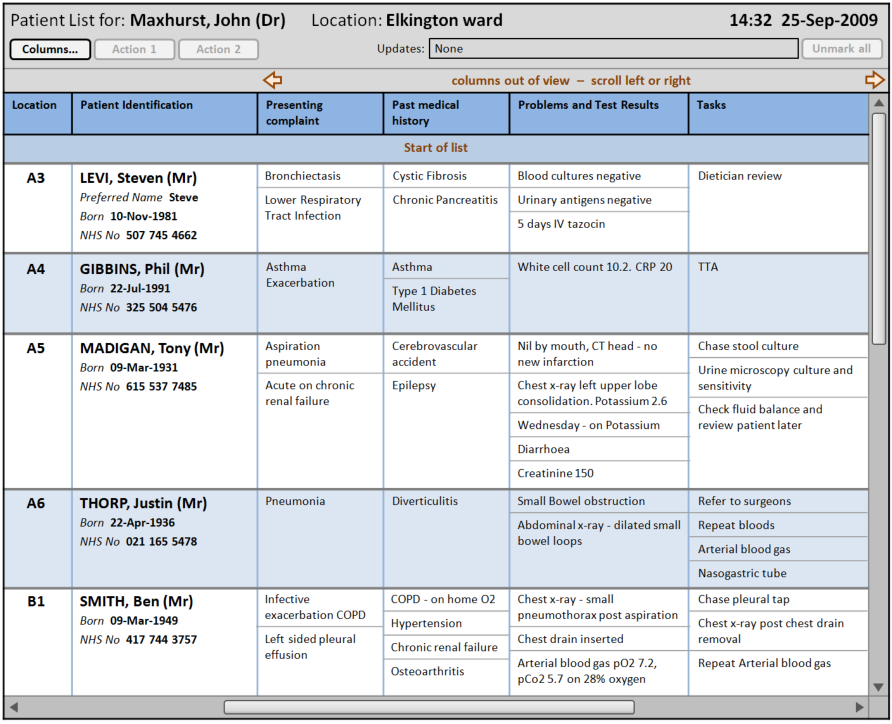
HSCIC Controlled Document

During research, the majority of identified potential patient safety hazards concerning Patient Lists applied to secondary care contexts, where teams of clinicians are caring for multiple patients in a single location (for example, a medical ward in a hospital). For this reason, the majority of examples provided throughout this document are based on a secondary care scenario, specifically a hospital respiratory ward. The medical information shown in these examples is fictitious but is based on the experiences of medical professionals who work or have recently worked on respiratory wards.

#### 1.2 Scope

This section sets out the items that are in and out of scope for this design guidance.

##### 1.2.1 In Scope

| Areas | Details |
| --- | --- |
| Datatype (format  S | tructured text (for example, tasks) excluding |
| and layout)        a | ssociated metadata (for example, task status |
| c | hanges) |
| Attribute (content  | Patient identifiers (including layout and positioning)       'Appointment' times (including multiple times) |
| and format)         | Location (static location) |
| Cells |  Cell padding                                                Multiple data types per cell  Multiple entries per cell |
| List Header |  Label and inclusion criteria of list |
| Row and Column  Hea | ders (for example, style, labels)                             Style (for example, banding  Gridlines                                                   Size and resizing (both user and system initiated) |
| More Details |  Opening items (for example, patient care records)           'Opened' items in context with list |
| Navigation |  Moving around a long or wide list (vertical and horizontal scrolling) |
| No Data |  Empty rows (beds or timeslots)                              No results in list |
| Out of View |  Indicating data out of view per cell and/or row (for        Use of out of view (that is, do you always show some example, truncation)                                         datatypes and/or attributes)  Indicating items out of list view                           Fitting items on a page (for default views) |
| Provenance |  Indication of refreshed list                                Refreshing the list |
| Updates |  Indication of update (at list or 'cell' level, including    Provenance –- when was data last updated 'new' items)                                                Snapshot history (viewing, navigating, indication of  Viewing update history                                       past, et cetera)  Viewing previous patients on the list |
| Datasets |  Alter the visible dataset (for example, adding columns, including role specific views, list level of detail, and so on) |
| Layout |  Layout of data (for example, column order) |
| Manipulation |  Indication of filtered list                                 Indication of sort order  Filtering the list                                          Showing and hiding 'columns'  Indication of grouping |
| Similarity |  Flagging similar names and similarity (indication of determining differential) |

Table 2: In Scope

 Provenance –- when was data last updated

 Snapshot history (viewing, navigating, indication of

past, et cetera)

 Indication of sort order

 Showing and hiding 'columns'

Page 3

Copyright ©2013 Health and Social Care Information Centre

HSCIC Controlled Document

##### 1.2.2 Out of Scope

This section defines areas that are not covered by this guidance. Although there may be specific hazards associated with these areas that are not addressed in this guidance, it is likely that the principles in this guidance will extend to Patient Lists in many of the areas listed in Table 3:

Alerts  Alerts of change in patient state (for example,

change of Medical Early Warning Score (MEWS))

Application  Location in window

 Context of list

 Window or port sizing

Attribute (content and format)

 Mark for discharge

 Resuscitation status

 Clinical summary (or equivalent) and its structure

Datasets  Specifying datasets for particular contexts

 Handling 'exceptional data' (that is, important data

but outside of the normal dataset)

Datatype (format and layout)

 Numerical data per cell

 Free-text

 Numerical series

 Scoring (for example, MEWS)

 Flagging potentially incorrect information

 Personal notes

 Highlighting information

Dual layout view  Ensuring equivalent patient information is presented

consistently between the two views

 Dealing with information that is only displayed in one

of the views (for example, 'summary' not shown on a schematic view)

 Consistent visual indication of selection

Form factor  Size and interaction modality

Graphical layout  Schematic, architectural, layout, and so on

 Minimum information

 Information constraints

Information Governance (IG)

 Showing and hiding data

 Screensaver or lockout

Input  Input of any data

Layout  Changing of layout (for example, column horizontal

order)

List actions The Patient List is not used to enter data into the system

Access to actions (for example, through header and incontext including selection)

 Differing actions based on list and/or selection

 Simultaneous user considerations (for example,

checkout, editing and so on)

 Search in progress

 Determining default row and column dimensions

 Association of goals with tasks, results and

outcomes

 Rationale for decisions

 Sealed information

 Multi-user view (for example, viewing in a

Multi-Disciplinary Team (MDT) meeting)

 Alter level of detail shown within a column

 Flagging and check of auto populated information

 Flagging missing data

 Graphing display

 Data structured in contextually relevant handover

information structures (for example, Mechanism Illness/Injury Signs/Symptoms Treatment (MIST))

 Abbreviations

 Misspellings

 Selection behaviour (for example, selecting a Patient

List row highlights location on a graphical schema)

 Ensuring equivalent patient information is in view in a

table when selected on a graphical schema

 Method of switching between views (if viewed

alternately)

 Access to further information

 Area showing ‘patient row’ for selection

 Area showing Patient Banner for selected location

 Restrictions on history viewing

 Find within a list

 Selection of rows, cells, data in cells, columns

(navigation, visual confirmation, states, navigation, and so on)

Page 4

Copyright ©2013 Health and Social Care Information Centre

HSCIC Controlled Document

| Areas | Details |
| --- | --- |
| Alerts |  Alerts of change in patient state (for example, change of Medical Early Warning Score (MEWS)) |
| Application |  Location in window                                        Simultaneous user considerations (for example,  Context of list                                            checkout, editing and so on)  Window or port sizing                                     Search in progress  Determining default row and column dimensions |
| Attribute (content |  Mark for discharge                                        Association of goals with tasks, results and |
| and format) |  Resuscitation status                                       outcomes  Clinical summary (or equivalent) and its structure        Rationale for decisions  Sealed information |
| Datasets |  Specifying datasets for particular contexts               Multi-user view (for example, viewing in a  Handling 'exceptional data' (that is, important data       Multi-Disciplinary Team (MDT) meeting) but outside of the normal dataset)                        Alter level of detail shown within a column |
| Datatype (format  | Numerical data per cell                                     Flagging and check of auto populated information |
| and layout)       | Free-text                                                   Flagging missing data  Numerical series                                          Graphing display  Scoring (for example, MEWS)                               Data structured in contextually relevant handover  Flagging potentially incorrect information                 information structures (for example, Mechanism Illness/Injury Signs/Symptoms Treatment (MIST))  Personal notes  Abbreviations  Highlighting information  Misspellings |
| Dual layout view  | Ensuring equivalent patient information is presented        Selection behaviour (for example, selecting a Patient consistently between the two views                           List row highlights location on a graphical schema)  Dealing with information that is only displayed in one  Ensuring equivalent patient information is in view in a of the views (for example, 'summary' not shown on a      table when selected on a graphical schema schematic view)                                         Method of switching between views (if viewed  Consistent visual indication of selection                alternately) |
| Form factor |  Size and interaction modality |
| Graphical layout |  Schematic, architectural, layout, and so on               Access to further information  Minimum information                                       Area showing ‘patient row’ for selection  Information constraints                                   Area showing Patient Banner for selected location |
| Information      S | howing and hiding data                                      Restrictions on history viewing |
| Governance (IG)  S | creensaver or lockout |
| Input |  Input of any data |
| Layout |  Changing of layout (for example, column horizontal order) |
| List actions | The Patient List is not used to enter data into the system  Find within a list Access to actions (for example, through header and in-      Selection of rows, cells, data in cells, columns context including selection)                                 (navigation, visual confirmation, states, navigation,  Differing actions based on list and/or selection           and so on) |
| List header |  Ward level aggregated scores (for example, number of infections) |
| List inclusion |  Patient’s ‘outside’ the standard set (for example,         Lists with multiple instance of the same patient those pending admission)                                   Specifying list criteria  View non-patient data (for example, ward level             Multiple patients allocated to the same bed (next information)                                                patient awaiting admission)  Data about patients not in the systems |
| Manipulation |  Indication of grouping                                     Sort on a key within multiple datatype cells  Change view setting                                        Sorting items within a cell (for example, prioritising  Use of sort order                                           patients) |
| Miscellaneous |  Handover status                                            Remote view  Colours                                                    Patient List summary in the context of a single record  Ambiguous information |
| Navigation |  Navigating to a Patient List                               Navigating from Patient List |
| Printing |  Printing all or part of a Patient List |
| Process |  Process of handover (for example, transfer of responsibility) |
| Structured layout  | Structured lines (for example, stack of Patient Banners) |
| Summary |  Indicating fallibility of summaries                        Usage of ‘how much’ data should be allowed ‘in’ a Patient List |
| Tasks |  Basic task display layout and format                       Task state transition model  Task status indicator per task                             Viewing task priority  Task status indicator per patient                          Viewing tasks independence  Hierarchical view of tasks                                 Viewing task time dependence  Filtering tasks                                            Discharge with outstanding tasks  Display of completed tasks                                 Changing a task’s status  Colour coding                                              Allocation of tasks  Role specific mark-up                                      Setting task priority  View task assignment                                       View tasks in relation to care pathway  Indicate overdue tasks |

Table 3: Out of Scope

**Note**

 Task state transition model

 Viewing task priority

 Viewing tasks independence

 Viewing task time dependence

 Discharge with outstanding tasks

 Changing a task’s status

 Allocation of tasks

 Setting task priority

 View tasks in relation to care pathway

Listing an item as out of scope does not classify it as unimportant. Project time and resource constraints inevitably restrict what can be in scope for a particular release. It is possible that items out of scope for this release may be considered for a future release.

#### 1.3 Assumptions

**A1** The quality (that is, provenance, accuracy, and completeness) of the data displayed in the Patient List is of an acceptable level. Data quality is particularly important in scenarios where there are multiple data sources (as the quality of data may vary between sources).

**A2** Where the system supports the live update of Patient List information, the system performance and connectivity is of such a level that there is minimum delay between the update being entered and the Patient List being updated.

Page 5

Copyright ©2013 Health and Social Care Information Centre

HSCIC Controlled Document

| ID | Assumption |
| --- | --- |
| A1 | The quality (that is, provenance, accuracy, and completeness) of the data displayed in the Patient List is of an acceptable level. Data quality is particularly important in scenarios where there are multiple data sources (as the quality of data may vary between sources). |
| A2 | Where the system supports the live update of Patient List information, the system performance and connectivity is of such a level that there is minimum delay between the update being entered and the Patient List being updated. |
| ID       As | sumption |
| A3       Th | e minimum screen resolution used by the clinician is 1024 x 768 pixels, although a higher resolution may be employed. |
| A4       Th | e Patient List consists entirely of information that resides in and is accessible through other views, including views that |
| re | present the data as entered into the system. |

Table 4: Assumptions

#### 1.4 Dependencies

| ID | Dependency |
| --- | --- |
| D1 | Changes in the following documents may affect the guidance presented in this document:  Design Guide Entry – Patient Banner  Displaying Graphs and Tables – User Interface Design Guidance  Filtering, Sorting and Grouping – User Interface Design Guidance |

Table 5: Dependencies

Page 6

Copyright ©2013 Health and Social Care Information Centre

HSCIC Controlled Document

### 2 GUIDANCE OVERVIEW

#### 2.1 Rationale Summary

The rationale for the current guidance draws on several pieces of evidence:

Research:

- Primary Research:

 Interviews with healthcare professionals, including doctors (see APPENDIX B)

 Regular consultation with a panel of clinical experts

- Secondary Research:

 Existing guidelines and standards

 UI best practice

Usability Principles (see APPENDIX A for details on these principles):

- Nielsen’s usability heuristics

- Shneiderman’s eight golden rules of interface design

- International Organization for Standardization (ISO) 9241: Characteristics of presented

information (taken from _BS EN ISO 9241-10: 1996 Ergonomic requirements for office work_ _with visual display terminals (VDTs) -- Part 10: Dialogues principles_ **{R1}** )

Existing Standards:

- _BS EN ISO 9241-10:1996 Ergonomic requirements for office work with visual display_

_terminals (VDTs): Part 10: Dialogues principles_ **{R1}**

- _BS 7581:1992 Guide to Presentation of tables and graphs_ **{R2}**

Evolving Standards:

- _Design Guide Entry – Patient Banner_ **{R3}**

- _Displaying Graphs and Tables – User Interface Design Guidance_ **{R4}**

- _Filtering, Sorting and Grouping – User Interface Design Guidance_ **{R5}**

Page 7

Copyright ©2013 Health and Social Care Information Centre

HSCIC Controlled Document

#### 2.2 Summary of Guidance

Table 6 summarises the content of this document by outlining each area of guidance (along with a cross reference to the relevant section) and providing a visual example to illustrate how it might be implemented:

Section 3 provides guidance on the layout of Patient Lists

Section 3.2.1 provides guidance on the Patient List header, which communicates the context of the Patient List

Section 3.2.2 provides guidance on column headers, which provide the titles for each column

Section 3.2.3 provides guidance on columns, which contain the sets of information for the Patient List

Section 3.2.4 provides guidance on rows and cells. Rows contain the information for each patient in the Patient List. Cells contain specific information for each patient

Page 8

Copyright ©2013 Health and Social Care Information Centre

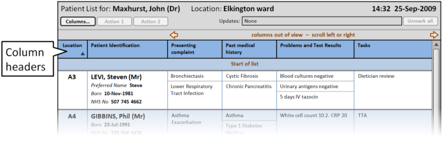

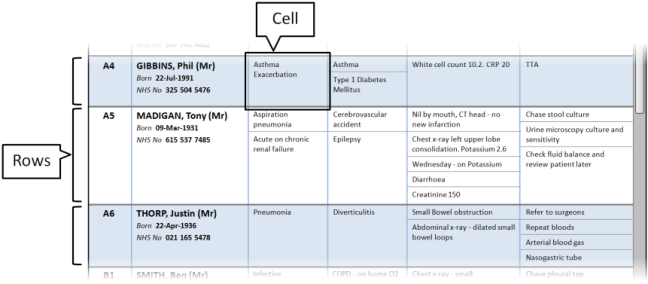
HSCIC Controlled Document

Section 3.2.5 provides guidance on sublists, which are located within cells and contain information that is structured in a list format

Section 3.2.6 provides guidance on the display of patient identification information

Section 3.2.7 provides guidance on row key identifiers, which uniquely identify each row from others in the Patient List

Section 4 provides guidance on managing the information displayed in a Patient List

Section 4.2.1 provides guidance on how to manage the columns displayed in the Patient List

Copyright ©2013 Health and Social Care Information Centre

Page 9

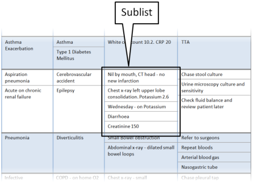

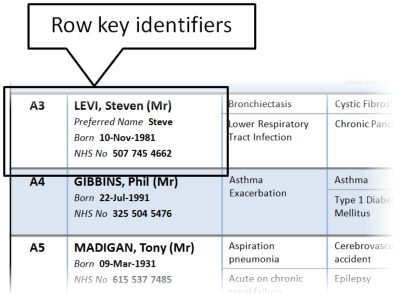

HSCIC Controlled Document

Section 4.2.2 provides guidance on notifying the user of updates to information displayed in the Patient List.

Section 4.2.3 provides guidance on displaying historical patient information as a complete Patient List ‘snapshot’.

Copyright ©2013 Health and Social Care Information Centre

Page 10

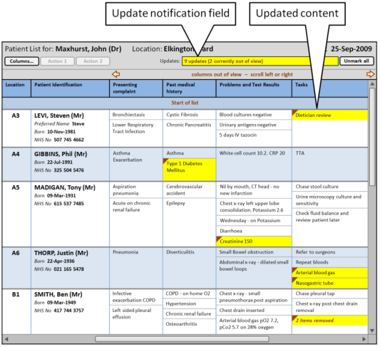

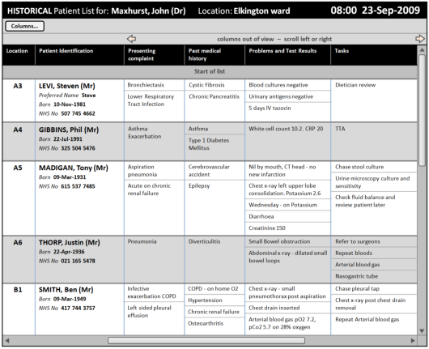
HSCIC Controlled Document

|  | Interviews with healthcare professionals, including doctors (see APPENDIX B) |
| --- | --- |
|  | Regular consultation with a panel of clinical experts |
| ondar | y Research: |
|  | Existing guidelines and standards |
|  | UI best practice |
| y Pri | nciples (see APPENDIX A for details on these principles): |
| lsen’ | s usability heuristics |
| eider | man’s eight golden rules of interface design |
| ernat | ional Organization for Standardization (ISO) 9241: Characteristics of presented |
| infor | mation (taken from BS EN ISO 9241-10: 1996 Ergonomic requirements for office work |
| with | visual display terminals (VDTs) -- Part 10: Dialogues principles {R1}) |
| Stan | dards: |
| EN IS | O 9241-10:1996 Ergonomic requirements for office work with visual display |
| minal | s (VDTs): Part 10: Dialogues principles {R1} |
| 7581: | 1992 Guide to Presentation of tables and graphs {R2} |
| Stan | dards: |
| ign G | uide Entry – Patient Banner {R3} |
| playi | ng Graphs and Tables – User Interface Design Guidance {R4} |
| terin | g, Sorting and Grouping – User Interface Design Guidance {R5} |
| Summa | ry of Guidance |
| ummar | ises the content of this document by outlining each area of guidance (along with a |
| erenc | e to the relevant section) and providing a visual example to illustrate how it might be |
| ed: |  |
| Guida | nce                                              Visual Summary |
| prov | ides guidance on the layout of Patient Lists |
| .2.1 | provides |
| on th | e Patient List |
| hich | communicates |
| xt of | the Patient List |
| .2.2 | provides |
| on co | lumn headers, |
| vide | the titles for |
| mn |  |
| .2.3 | provides |
| on co | lumns, which |
| he se | ts of |
| on fo | r the Patient List |
| .2.4 | provides |
| on ro | ws and cells. |
| ain t | he information |
| patie | nt in the Patient |
| ls co | ntain specific |
| on fo | r each patient |
| Guida | nce                                                       Visual Summary |
| .2.5 | provides |
| on su | blists, which |
| ed wi | thin cells and |
| nform | ation that is |
| d in | a list format |
| .2.6 | provides |
| on th | e display of |
| denti | fication |
| on |  |
| .2.7 | provides |
| on ro | w key |
| rs, w | hich uniquely |
| each | row from others |
| tient | List |
| prov | ides guidance on managing the information displayed in a Patient List |
| .2.1 | provides |
| on ho | w to manage |
| ns di | splayed in the |
| ist |  |
| Guida | nce                                            Visual Summary |
| .2.2 | provides |
| on no | tifying the |
| pdate | s to information |
| in t | he Patient List. |
| .2.3 | provides |
| on di | splaying |
| l pat | ient information |
| lete | Patient List |
| ’. |  |
| Guida | nce                                             Visual Summary |
| .2.4 | provides |
| on ho | w to display |
| nform | ation that a user |
| d |  |

Table 6: Summary of Guidance

Copyright ©2013 Health and Social Care Information Centre

Page 11

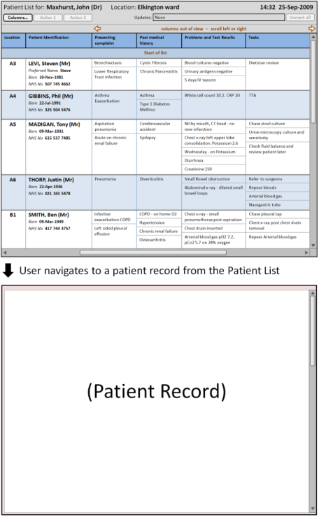
HSCIC Controlled Document

### 3 GUIDANCE DETAILS FOR PATIENT LIST LAYOUT

#### 3.1 Introduction

This section includes guidance for the layout of Patient Lists, specifically:

- Patient List headers

- Column headers

- Columns

- Rows and cells

- Sublists

- Patient identification

- Row key identifiers

#### 3.2 Guidelines

##### 3.2.1 Patient List Header

This section provides guidance on the Patient List header. This communicates the context of the list to the user. Figure 2 illustrates that feature:

Figure 2: Patient List Header

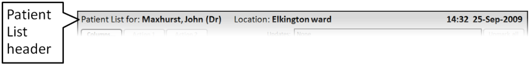

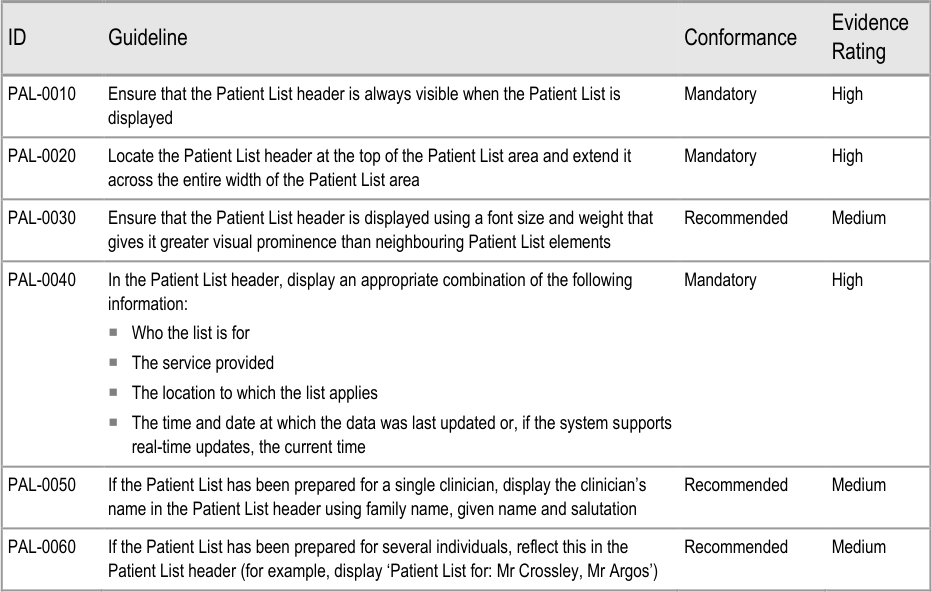

Page 12

Copyright ©2013 Health and Social Care Information Centre

HSCIC Controlled Document

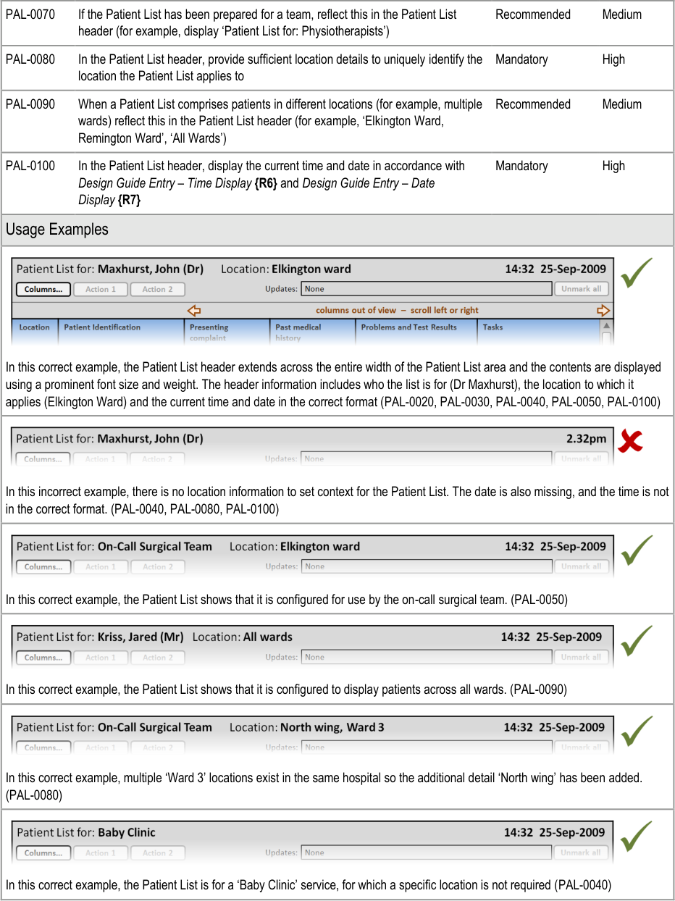

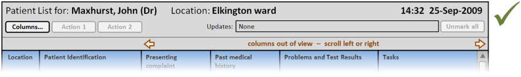

Page 13

Copyright ©2013 Health and Social Care Information Centre

HSCIC Controlled Document

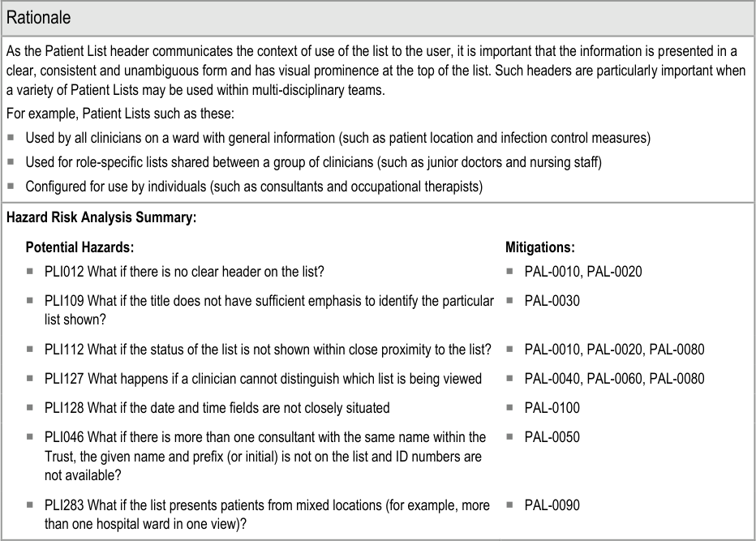

##### 3.2.2 Column Headers

| ID | Guideline | Conformance Rating |
| --- | --- | --- |
| PAL-0010 | Ensure that the Patient List header is always visible when the Patient List is displayed | Mandatory     High |
| PAL-0020 | Locate the Patient List header at the top of the Patient List area and extend it across the entire width of the Patient List area | Mandatory     High |
| PAL-0030 | Ensure that the Patient List header is displayed using a font size and weight that gives it greater visual prominence than neighbouring Patient List elements | Recommended   Medium |
| PAL-0040 | In the Patient List header, display an appropriate combination of the following information:  Who the list is for  The service provided  The location to which the list applies  The time and date at which the data was last updated or, if the system supports real-time updates, the current time | Mandatory     High |
| PAL-0050 | If the Patient List has been prepared for a single clinician, display the clinician’s name in the Patient List header using family name, given name and salutation | Recommended   Medium |
| PAL-0060 | If the Patient List has been prepared for several individuals, reflect this in the Patient List header (for example, display ‘Patient List for: Mr Crossley, Mr Argos’) | Recommended   Medium |
| AL-0070       If | the Patient List has been prepared for a team, reflect this in the Patient List | Recommended            Medium |
| he | ader (for example, display ‘Patient List for: Physiotherapists’) |  |
| AL-0080       In | the Patient List header, provide sufficient location details to uniquely identify the M | andatory               High |
| lo | cation the Patient List applies to |  |
| AL-0090       Wh | en a Patient List comprises patients in different locations (for example, multiple Recom | mended                 Medium |
| wa | rds) reflect this in the Patient List header (for example, ‘Elkington Ward, |  |
| Re | mington Ward’, ‘All Wards’) |  |
| AL-0100       In | the Patient List header, display the current time and date in accordance with | Mandatory              High |
| De | sign Guide Entry – Time Display {R6} and Design Guide Entry – Date |  |
| Di | splay {R7} |  |
| sage Examples |  |  |
| n this correct e | xample, the Patient List header extends across the entire width of the Patient List area | and the contents are displayed |
| sing a prominent | font size and weight. The header information includes who the list is for (Dr Maxhurst) | , the location to which it |
| pplies (Elkingto | n Ward) and the current time and date in the correct format (PAL-0020, PAL-0030, PAL-004 | 0, PAL-0050, PAL-0100) |
| n this incorrect | example, there is no location information to set context for the Patient List. The date | is also missing, and the time is not |
| n the correct fo | rmat. (PAL-0040, PAL-0080, PAL-0100) |  |
| n this correct e | xample, the Patient List shows that it is configured for use by the on-call surgical tea | m. (PAL-0050) |
| n this correct e | xample, the Patient List shows that it is configured to display patients across all ward | s. (PAL-0090) |
| n this correct e | xample, multiple ‘Ward 3’ locations exist in the same hospital so the additional detail | ‘North wing’ has been added. |
| PAL-0080) |  |  |
| n this correct e | xample, the Patient List is for a ‘Baby Clinic’ service, for which a specific location i | s not required (PAL-0040) |
| ationale |  |  |
| s the Patient Li | st header communicates the context of use of the list to the user, it is important that | the information is presented in a |
| lear, consistent | and unambiguous form and has visual prominence at the top of the list. Such headers are | particularly important when |
| variety of Pati | ent Lists may be used within multi-disciplinary teams. |  |
| or example, Pati | ent Lists such as these: |  |
| Used by all cli | nicians on a ward with general information (such as patient location and infection contr | ol measures) |
| Used for role-s | pecific lists shared between a group of clinicians (such as junior doctors and nursing s | taff) |
| Configured for | use by individuals (such as consultants and occupational therapists) |  |
| azard Risk Analy | sis Summary: |  |
| Potential Ha | zards:                                                                      Mitigations: |  |
|  PLI012 Wha | t if there is no clear header on the list?                                   PAL-0010, | PAL-0020 |
|  PLI109 Wha | t if the title does not have sufficient emphasis to identify the particular  PAL-0030 |  |
| list shown | ? |  |
|  PLI112 Wha | t if the status of the list is not shown within close proximity to the list?  PAL-0010, | PAL-0020, PAL-0080 |
|  PLI127 Wha | t happens if a clinician cannot distinguish which list is being viewed       PAL-0040, | PAL-0060, PAL-0080 |
|  PLI128 Wha | t if the date and time fields are not closely situated                       PAL-0100 |  |
|  PLI046 Wha | t if there is more than one consultant with the same name within the         PAL-0050 |  |
| Trust, the | given name and prefix (or initial) is not on the list and ID numbers are |  |
| not availa | ble? |  |
|  PLI283 Wha | t if the list presents patients from mixed locations (for example, more      PAL-0090 |  |
| than one h | ospital ward in one view)? |  |
| 2           Colu | mn Headers |  |
| his section prov | ides guidance on column headers, which provide the titles for each column. Figure |  |
| illustrates tha | t feature: |  |

Figure 3: Column Headers

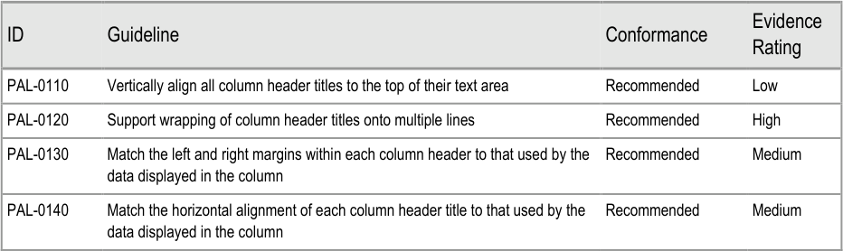

Page 14

Copyright ©2013 Health and Social Care Information Centre

HSCIC Controlled Document

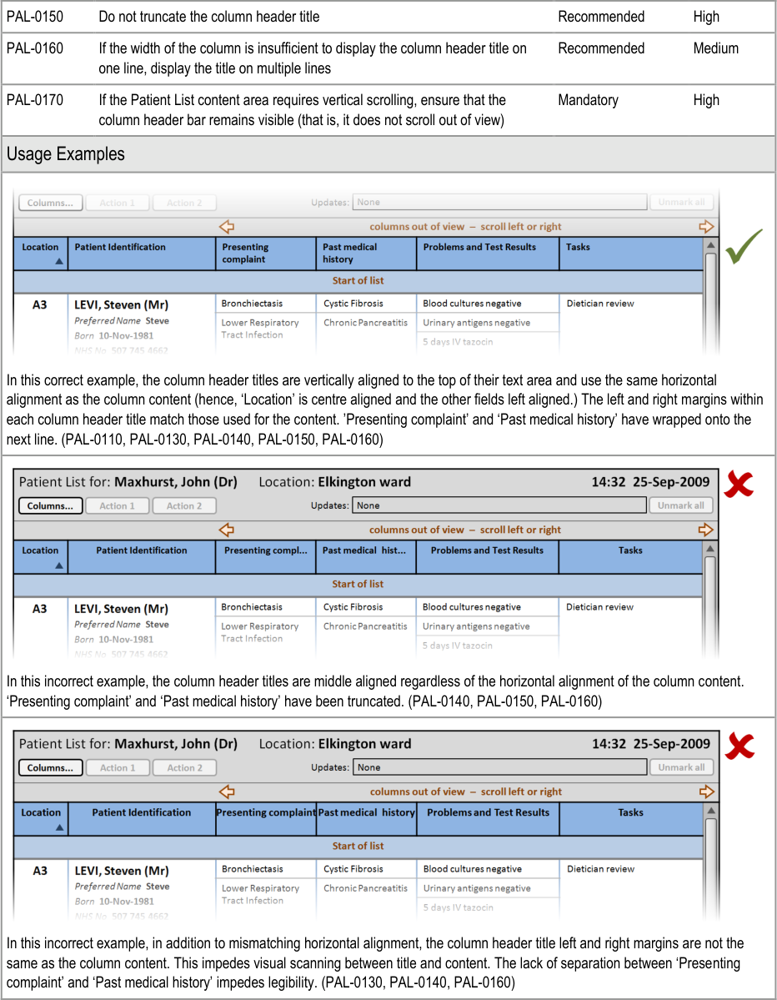

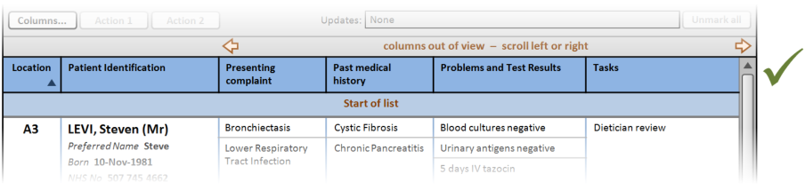

Page 15

Copyright ©2013 Health and Social Care Information Centre

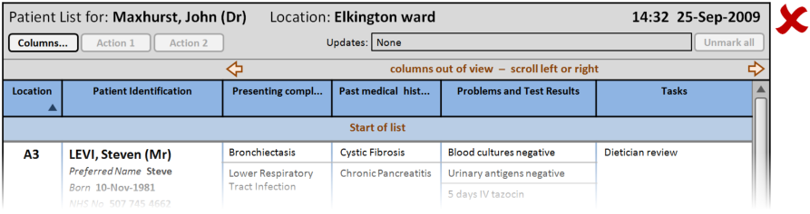

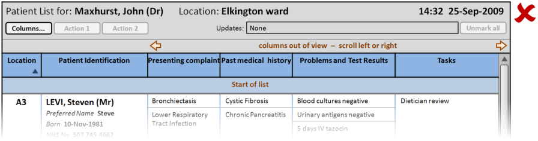
HSCIC Controlled Document

Page 16

Copyright ©2013 Health and Social Care Information Centre

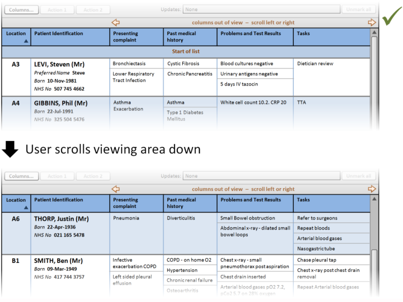

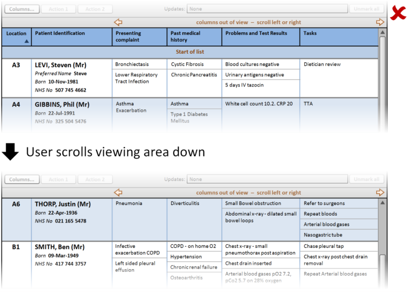

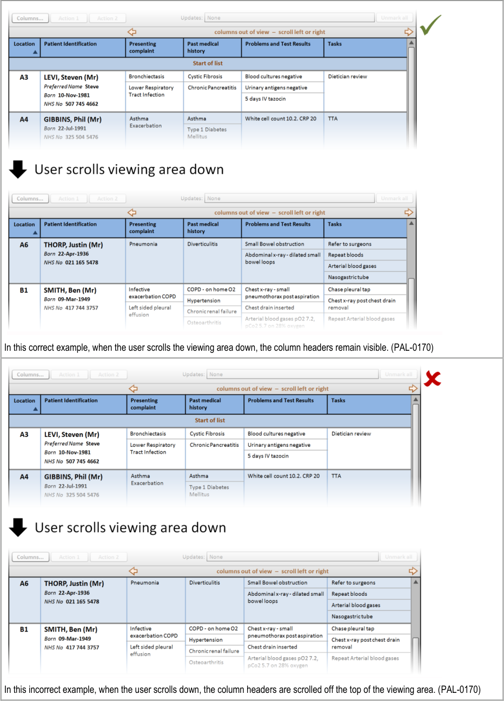
HSCIC Controlled Document

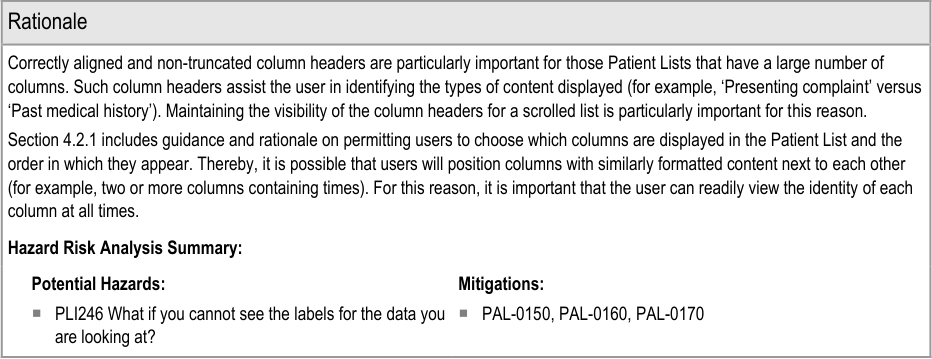

##### 3.2.3 Columns

| ID | Guideline | Conformance Rating |
| --- | --- | --- |
| PAL-0110 | Vertically align all column header titles to the top of their text area | Recommended             Low |
| PAL-0120 | Support wrapping of column header titles onto multiple lines | Recommended             High |
| PAL-0130 | Match the left and right margins within each column header to that used by the Rec data displayed in the column | ommended                Medium |
| PAL-0140 | Match the horizontal alignment of each column header title to that used by the data displayed in the column | Recommended             Medium |
| PAL-0150        Do | not truncate the column header title | Recommended              High |
| PAL-0160        If | the width of the column is insufficient to display the column header title on | Recommended              Medium |
| on | e line, display the title on multiple lines |  |
| PAL-0170        If | the Patient List content area requires vertical scrolling, ensure that the | Mandatory                High |
| co | lumn header bar remains visible (that is, it does not scroll out of view) |  |
| Usage Examples |  |  |
| In this correct ex | ample, the column header titles are vertically aligned to the top of their text ar | ea and use the same horizontal |
| alignment as the c | olumn content (hence, ‘Location’ is centre aligned and the other fields left align | ed.) The left and right margins within |
| each column header | title match those used for the content. ’Presenting complaint’ and ‘Past medical | history’ have wrapped onto the |
| next line. (PAL-01 | 10, PAL-0130, PAL-0140, PAL-0150, PAL-0160) |  |
| In this incorrect | example, the column header titles are middle aligned regardless of the horizontal | alignment of the column content. |
| ‘Presenting compla | int’ and ‘Past medical history’ have been truncated. (PAL-0140, PAL-0150, PAL-0160 | ) |
| In this incorrect | example, in addition to mismatching horizontal alignment, the column header title | left and right margins are not the |
| same as the column | content. This impedes visual scanning between title and content. The lack of sepa | ration between ‘Presenting |
| complaint’ and ‘Pa | st medical history’ impedes legibility. (PAL-0130, PAL-0140, PAL-0160) |  |
| In this correct ex | ample, when the user scrolls the viewing area down, the column headers remain visi | ble. (PAL-0170) |
| In this incorrect | example, when the user scrolls down, the column headers are scrolled off the top o | f the viewing area. (PAL-0170) |
| Rationale |  |  |
| Correctly aligned | and non-truncated column headers are particularly important for those Patient List | s that have a large number of |
| columns. Such colu | mn headers assist the user in identifying the types of content displayed (for exam | ple, ‘Presenting complaint’ versus |
| ‘Past medical hist | ory’). Maintaining the visibility of the column headers for a scrolled list is par | ticularly important for this reason. |
| Section 4.2.1 incl | udes guidance and rationale on permitting users to choose which columns are displa | yed in the Patient List and the |
| order in which the | y appear. Thereby, it is possible that users will position columns with similarly | formatted content next to each other |
| (for example, two | or more columns containing times). For this reason, it is important that the user | can readily view the identity of each |
| column at all time | s. |  |
| Hazard Risk Analys | is Summary: |  |
| Potential Haz | ards:                                             Mitigations: |  |
|  PLI246 What | if you cannot see the labels for the data you  PAL-0150, PAL-0160, PAL-0170 |  |
| are looking | at? |  |
| .3          Column | s |  |
| This section provi | des guidance on columns, which contain the sets of information for the Patient |  |
| List. Figure 4 ill | ustrates that feature: |  |

Figure 4: Columns

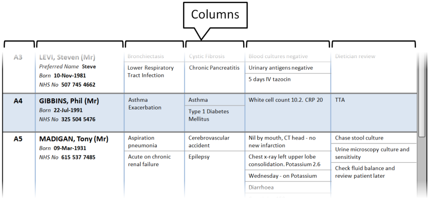

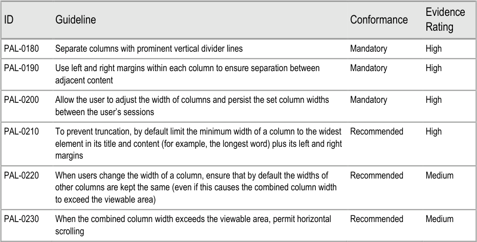

Page 17

Copyright ©2013 Health and Social Care Information Centre

HSCIC Controlled Document

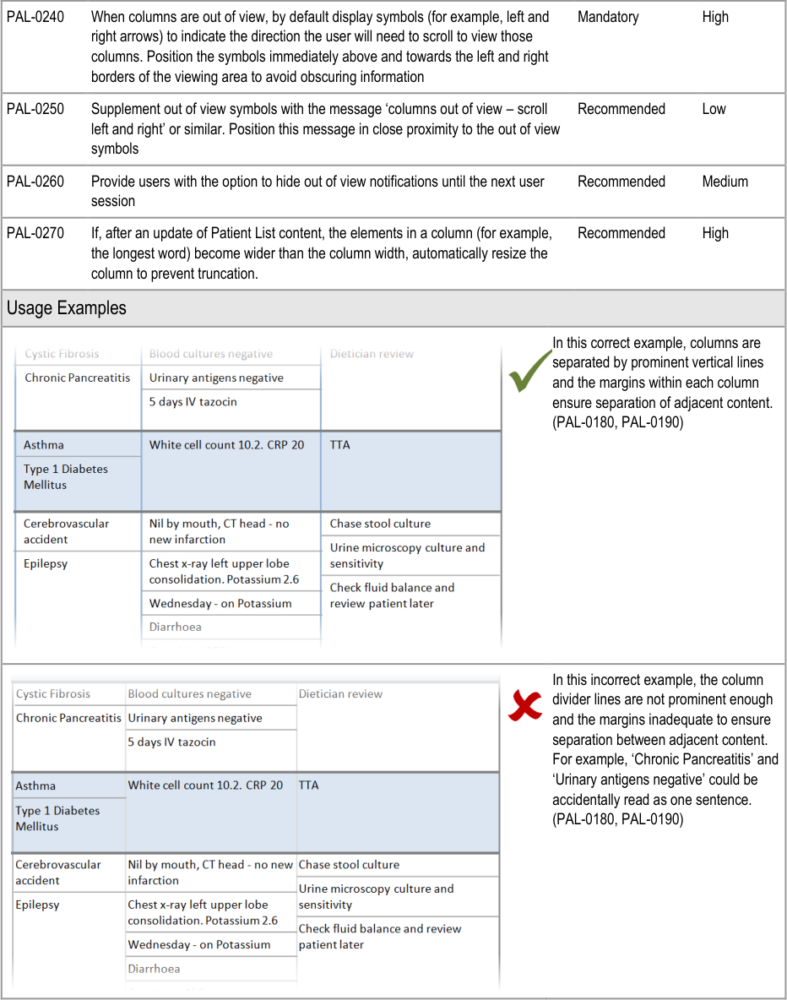

Page 18

Copyright ©2013 Health and Social Care Information Centre

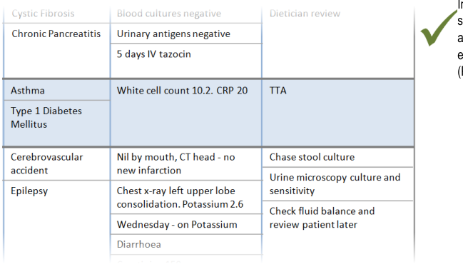

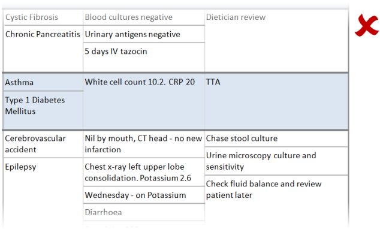
HSCIC Controlled Document

In this incorrect example, the user has been permitted to resize the middle column narrower than the widest elements resulting in the words ‘Pancreatitis’ and ‘Cerebrovascular’ being truncated. (PAL-0210)

Page 19

Copyright ©2013 Health and Social Care Information Centre

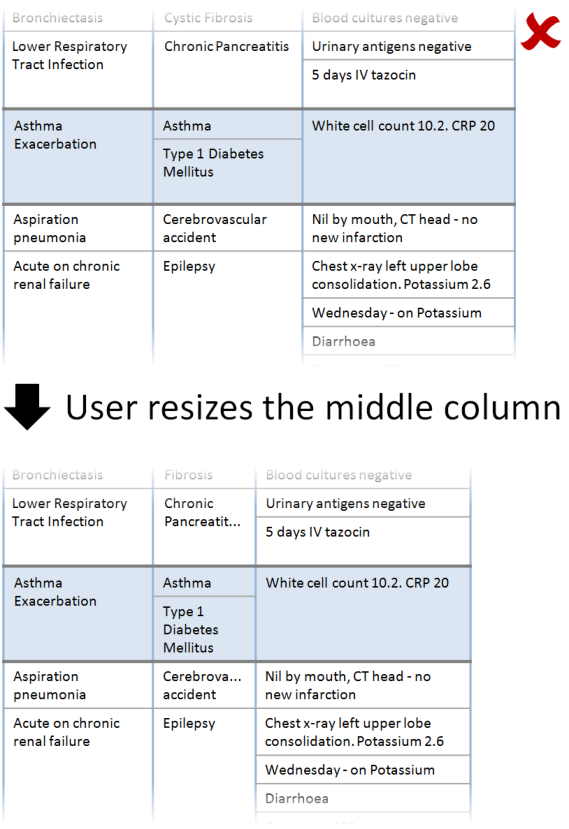
HSCIC Controlled Document

In this incorrect example, when the user resizes the first column, the other columns are automatically resized to maintain the overall width of the combined columns. As a consequence information has been relocated (for example, ‘Wednesday – on Potassium’ and ‘Diarrhoea’ are no longer in view). (This example assumes the user has not set a preference for this behaviour). (PAL-0220)

Page 20

Copyright ©2013 Health and Social Care Information Centre

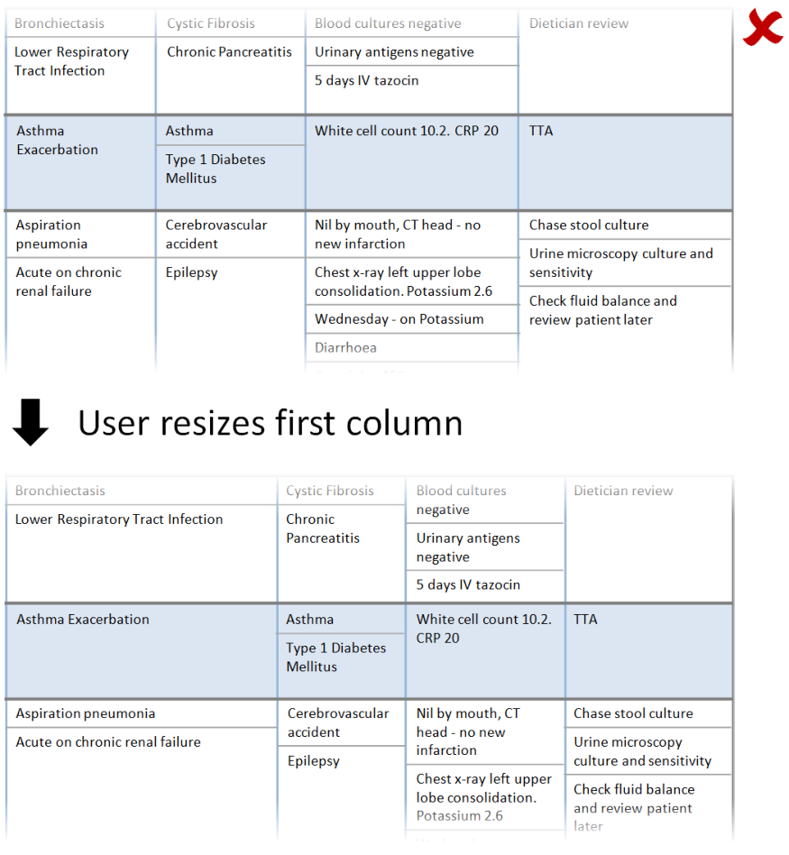
HSCIC Controlled Document

In this correct example, when the user resizes the third column (‘Presenting complaint’) the columns to the right remain the same width. The overall width has increased beyond the viewable area, so a horizontal scrollbar is displayed. The out-of-view symbols and warning message are displayed by default immediately above the viewable area. (PAL-0200, PAL-0220, PAL-0230, PAL-0240, PAL-0250, PAL-0260)

Page 21

Copyright ©2013 Health and Social Care Information Centre

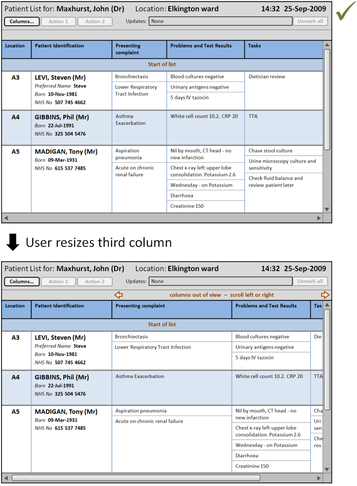
HSCIC Controlled Document

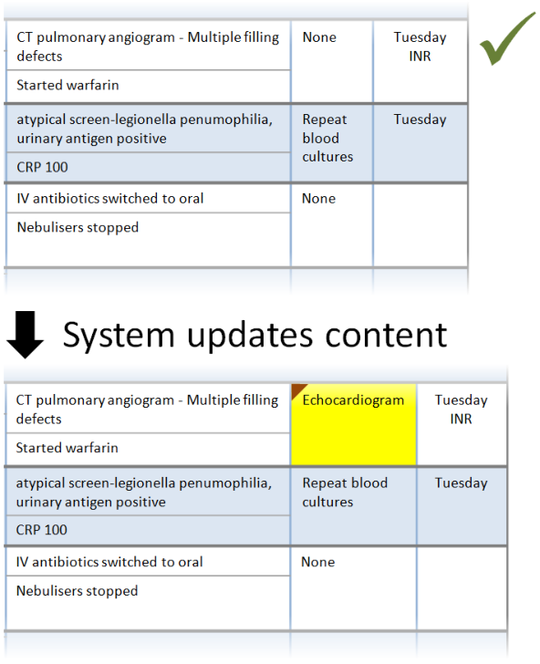

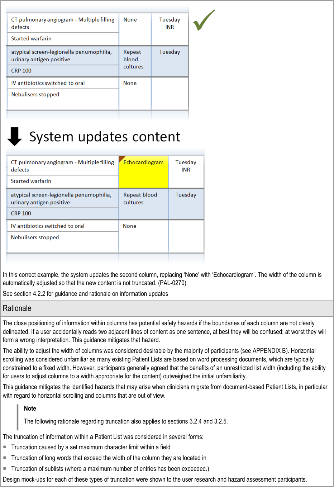

Page 22

Copyright ©2013 Health and Social Care Information Centre

HSCIC Controlled Document

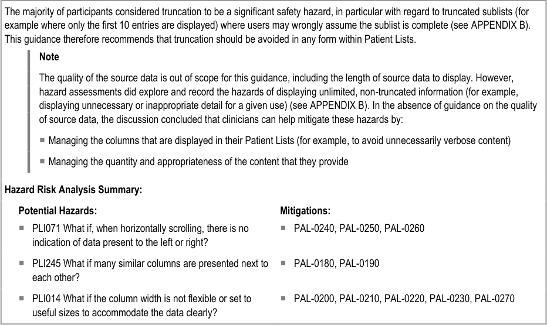
##### 3.2.4 Rows and Cells

| ID | Guideline | Conformance Rating |
| --- | --- | --- |
| PAL-0180 | Separate columns with prominent vertical divider lines | Mandatory             High |
| PAL-0190 | Use left and right margins within each column to ensure separation between adjacent content | Mandatory             High |
| PAL-0200 | Allow the user to adjust the width of columns and persist the set column widths between the user’s sessions | Mandatory             High |
| PAL-0210 | To prevent truncation, by default limit the minimum width of a column to the widest Rec element in its title and content (for example, the longest word) plus its left and righ margins | ommended              High t |
| PAL-0220 | When users change the width of a column, ensure that by default the widths of other columns are kept the same (even if this causes the combined column width to exceed the viewable area) | Recommended           Medium |
| PAL-0230 | When the combined column width exceeds the viewable area, permit horizontal scrolling | Recommended           Medium |
| PAL-0240     Wh | en columns are out of view, by default display symbols (for example, left and | Mandatory            High |
| ri | ght arrows) to indicate the direction the user will need to scroll to view those |  |
| co | lumns. Position the symbols immediately above and towards the left and right |  |
| bo | rders of the viewing area to avoid obscuring information |  |
| PAL-0250     Su | pplement out of view symbols with the message ‘columns out of view – scroll | Recommended          Low |
| le | ft and right’ or similar. Position this message in close proximity to the out of view |  |
| sy | mbols |  |
| PAL-0260     Pr | ovide users with the option to hide out of view notifications until the next user | Recommended          Medium |
| se | ssion |  |
| PAL-0270     If | , after an update of Patient List content, the elements in a column (for example, | Recommended          High |
| th | e longest word) become wider than the column width, automatically resize the |  |
| co | lumn to prevent truncation. |  |
| Usage Examples | In sep and ens (PA In div and sep For ‘Ur acc (PA | this correct example, columns are arated by prominent vertical lines the margins within each column ure separation of adjacent content. L-0180, PAL-0190) this incorrect example, the column ider lines are not prominent enough the margins inadequate to ensure aration between adjacent content. example, ‘Chronic Pancreatitis’ and inary antigens negative’ could be identally read as one sentence. L-0180, PAL-0190) |
| In this incorre | ct example, the user has been permitted to resize the middle column narrower than the w | idest elements resulting in the |
| words ‘Pancreat | itis’ and ‘Cerebrovascular’ being truncated. (PAL-0210) |  |
| In this incorre | ct example, when the user resizes the first column, the other columns are automatically | resized to maintain the overall |
| width of the co | mbined columns. As a consequence information has been relocated (for example, ‘Wednesda | y – on Potassium’ and |
| ‘Diarrhoea’ are | no longer in view). (This example assumes the user has not set a preference for this b | ehaviour). (PAL-0220) |
| In this correct | example, when the user resizes the third column (‘Presenting complaint’) the columns t | o the right remain the same |
| width. The over | all width has increased beyond the viewable area, so a horizontal scrollbar is displaye | d. The out-of-view symbols and |
| warning message | are displayed by default immediately above the viewable area. (PAL-0200, PAL-0220, PAL | -0230, PAL-0240, |
| PAL-0250, PAL-0 | 260) |  |
| In this correct | example, the system updates the second column, replacing ‘None’ with ‘Echocardiogram’. | The width of the column is |
| automatically a | djusted so that the new content is not truncated. (PAL-0270) |  |
| See section 4.2 | .2 for guidance and rationale on information updates |  |
| Rationale |  |  |
| The close posit | ioning of information within columns has potential safety hazards if the boundaries of | each column are not clearly |
| delineated. If | a user accidentally reads two adjacent lines of content as one sentence, at best they w | ill be confused; at worst they will |
| form a wrong in | terpretation. This guidance mitigates that hazard. |  |
| The ability to | adjust the width of columns was considered desirable by the majority of participants (s | ee APPENDIX B). Horizontal |
| scrolling was c | onsidered unfamiliar as many existing Patient Lists are based on word processing docume | nts, which are typically |
| constrained to | a fixed width. However, participants generally agreed that the benefits of an unrestric | ted list width (including the ability |
| for users to ad | just columns to a width appropriate for the content) outweighed the initial unfamiliari | ty. |
| This guidance m | itigates the identified hazards that may arise when clinicians migrate from document-ba | sed Patient Lists, in particular |
| with regard to | horizontal scrolling and columns that are out of view. |  |
| Note |  |  |
| The fo | llowing rationale regarding truncation also applies to sections 3.2.4 and 3.2.5. |  |
| The truncation | of information within a Patient List was considered in several forms: |  |
|  Truncation ca | used by a set maximum character limit within a field |  |
|  Truncation of | long words that exceed the width of the column they are located in |  |
|  Truncation of | sublists (where a maximum number of entries has been exceeded.) |  |
| Design mock-ups | for each of these types of truncation were shown to the user research and hazard asses | sment participants. |
| The majority of | participants considered truncation to be a significant safety hazard, in particular wi | th regard to truncated sublists (for |
| example where o | nly the first 10 entries are displayed) where users may wrongly assume the sublist is c | omplete (see APPENDIX B). |
| This guidance t | herefore recommends that truncation should be avoided in any form within Patient Lists. |  |
| Note |  |  |
| The q | uality of the source data is out of scope for this guidance, including the length of so | urce data to display. However, |
| hazar | d assessments did explore and record the hazards of displaying unlimited, non-truncated | information (for example, |
| displ | aying unnecessary or inappropriate detail for a given use) (see APPENDIX B). In the abs | ence of guidance on the quality |
| of so | urce data, the discussion concluded that clinicians can help mitigate these hazards by: |  |
|  Man | aging the columns that are displayed in their Patient Lists (for example, to avoid unne | cessarily verbose content) |
|  Man | aging the quantity and appropriateness of the content that they provide |  |
| Hazard Risk Ana | lysis Summary: |  |
| Potential | Hazards:                                                   Mitigations: |  |
|  PLI071 W | hat if, when horizontally scrolling, there is no            PAL-0240, PAL-0250, PAL-02 | 60 |
| indicati | on of data present to the left or right? |  |
|  PLI245 W | hat if many similar columns are presented next to           PAL-0180, PAL-0190 |  |
| each oth | er? |  |
|  PLI014 W | hat if the column width is not flexible or set to           PAL-0200, PAL-0210, PAL-02 | 20, PAL-0230, PAL-0270 |
| useful s | izes to accommodate the data clearly? |  |
| .4           Ro | ws and Cells |  |
| This section pr | ovides guidance on rows and cells. Rows contain the information for each patient in |  |
| the Patient Lis | t. Cells contain individual content (and sublists, where required). Figure 5 illustrate | s |
| those features: |  |  |

Figure 5: Rows and Cells

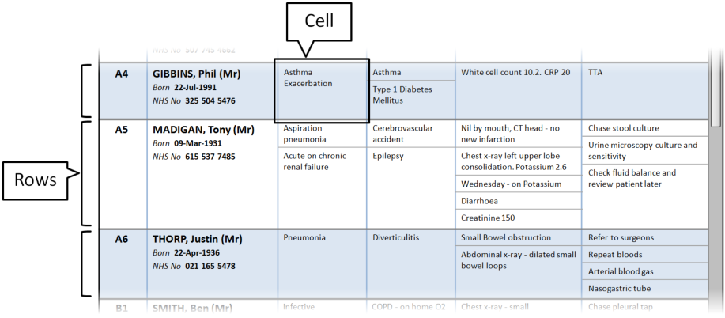

|Col1|Evidence ID Guideline Conformance Rating|
|---|---|
||PAL-0280 Orientate Patient List entries horizontally (that is, so the information for each patient is displayed across the viewing area.) **Note** This guidance overrides GTAB-191 in_Displaying Graphs and Tables –_ _User Interface Design Guidance_** {R4}** for Patient List contexts only    Mandatory High|
||PAL-0290  Separate rows using prominent horizontal divider lines Mandatory High|

Copyright ©2013 Health and Social Care Information Centre

Page 23

HSCIC Controlled Document

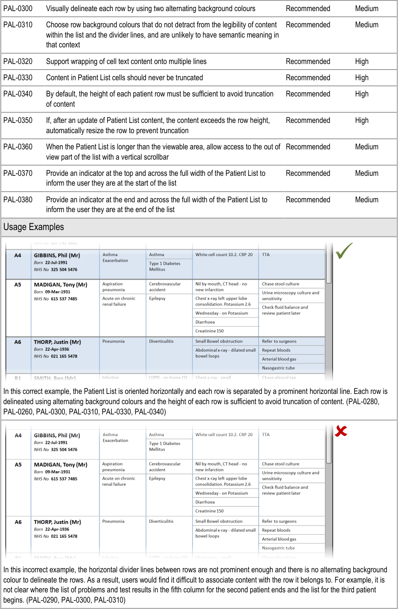

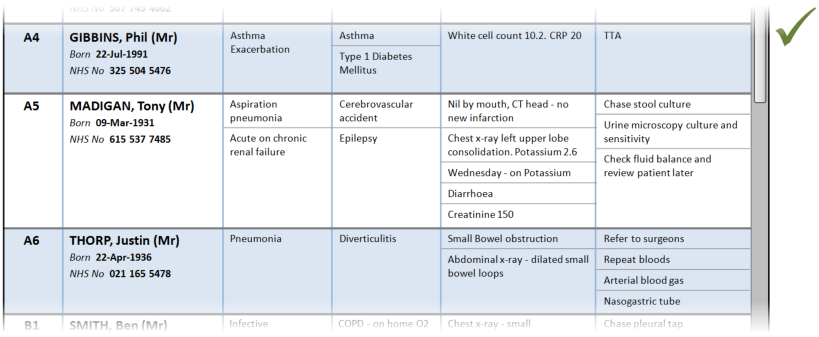

Page 24

Copyright ©2013 Health and Social Care Information Centre

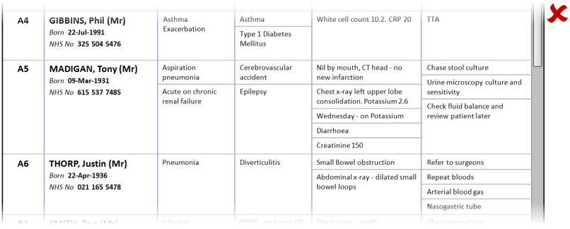
HSCIC Controlled Document

Page 25

Copyright ©2013 Health and Social Care Information Centre

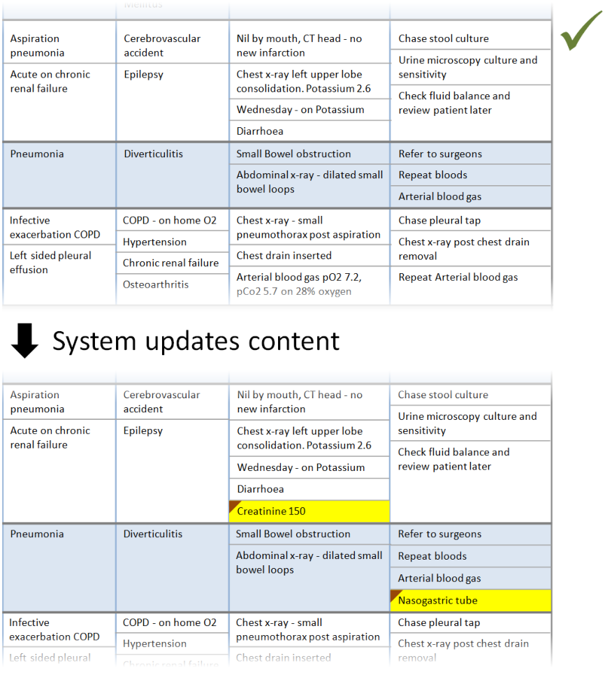

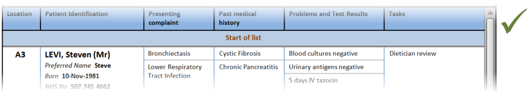

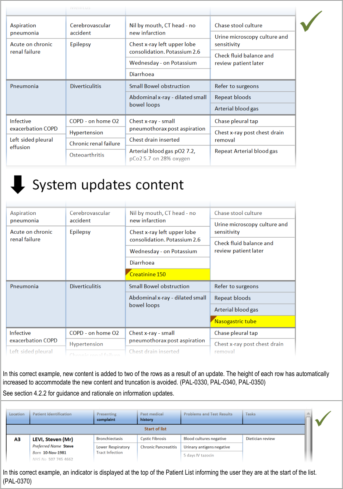
HSCIC Controlled Document

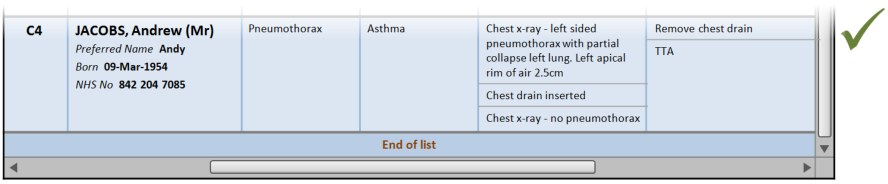

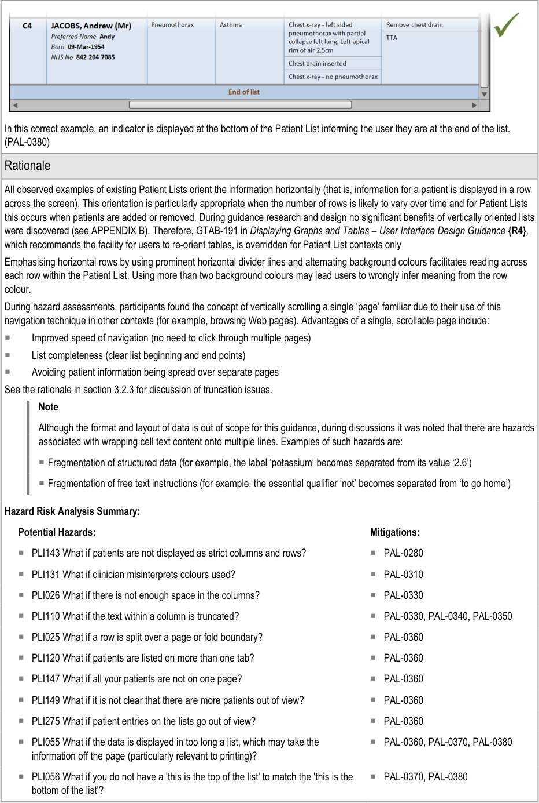

Page 26

Copyright ©2013 Health and Social Care Information Centre

HSCIC Controlled Document

##### 3.2.5 Sublists

| ID | Guideline | Conformance Rating |
| --- | --- | --- |
| PAL-0280 | Orientate Patient List entries horizontally (that is, so the information for each patient is displayed across the viewing area.) Note This guidance overrides GTAB-191 in Displaying Graphs and Tables – User Interface Design Guidance {R4} for Patient List contexts only | Mandatory                High |
| PAL-0290 | Separate rows using prominent horizontal divider lines | Mandatory                High |
| PAL-0300       Vi | sually delineate each row by using two alternating background colours | Recommended              Medium |
| PAL-0310       Ch | oose row background colours that do not detract from the legibility of content Recom | mended                     Medium |
| wi | thin the list and the divider lines, and are unlikely to have semantic meaning in |  |
| th | at context |  |
| PAL-0320       Su | pport wrapping of cell text content onto multiple lines | Recommended              High |
| PAL-0330       Co | ntent in Patient List cells should never be truncated | Recommended              High |
| PAL-0340       By | default, the height of each patient row must be sufficient to avoid truncation | Recommended              High |
| of | content |  |
| PAL-0350       If | , after an update of Patient List content, the content exceeds the row height, | Recommended              High |
| au | tomatically resize the row to prevent truncation |  |
| PAL-0360       Wh | en the Patient List is longer than the viewable area, allow access to the out of Rec | ommended                   Medium |
| vi | ew part of the list with a vertical scrollbar |  |
| PAL-0370       Pr | ovide an indicator at the top and across the full width of the Patient List to | Recommended              Medium |
| in | form the user they are at the start of the list |  |
| PAL-0380       Pr | ovide an indicator at the end and across the full width of the Patient List to | Recommended              Medium |
| in | form the user they are at the end of the list |  |
| Usage Examples |  |  |
| In this correct e | xample, the Patient List is oriented horizontally and each row is separated by a pro | minent horizontal line. Each row is |
| delineated using | alternating background colours and the height of each row is sufficient to avoid tru | ncation of content. (PAL-0280, |
| PAL-0260, PAL-030 | 0, PAL-0310, PAL-0330, PAL-0340) |  |
| In this incorrect | example, the horizontal divider lines between rows are not prominent enough and the | re is no alternating background |
| colour to delinea | te the rows. As a result, users would find it difficult to associate content with th | e row it belongs to. For example, it is |
| not clear where t | he list of problems and test results in the fifth column for the second patient ends | and the list for the third patient |
| begins. (PAL-0290 | , PAL-0300, PAL-0310) |  |
| In this correct e | xample, new content is added to two of the rows as a result of an update. The height | of each row has automatically |
| increased to acco | mmodate the new content and truncation is avoided. (PAL-0330, PAL-0340, PAL-0350) |  |
| See section 4.2.2 | for guidance and rationale on information updates. |  |
| In this correct e | xample, an indicator is displayed at the top of the Patient List informing the user | they are at the start of the list. |
| (PAL-0370) |  |  |
| In this correct e | xample, an indicator is displayed at the bottom of the Patient List informing the us | er they are at the end of the list. |
| (PAL-0380) |  |  |
| Rationale |  |  |
| All observed exam | ples of existing Patient Lists orient the information horizontally (that is, informa | tion for a patient is displayed in a row |
| across the screen | ). This orientation is particularly appropriate when the number of rows is likely to | vary over time and for Patient Lists |
| this occurs when | patients are added or removed. During guidance research and design no significant be | nefits of vertically oriented lists |
| were discovered ( | see APPENDIX B). Therefore, GTAB-191 in Displaying Graphs and Tables – User Interfac | e Design Guidance {R4}, |
| which recommends | the facility for users to re-orient tables, is overridden for Patient List contexts | only |
| Emphasising horiz | ontal rows by using prominent horizontal divider lines and alternating background co | lours facilitates reading across |
| each row within t | he Patient List. Using more than two background colours may lead users to wrongly in | fer meaning from the row |
| colour. |  |  |
| During hazard ass | essments, participants found the concept of vertically scrolling a single ‘page’ fam | iliar due to their use of this |
| navigation techni | que in other contexts (for example, browsing Web pages). Advantages of a single, scr | ollable page include: |
|       Improved s | peed of navigation (no need to click through multiple pages) |  |
|       List compl | eteness (clear list beginning and end points) |  |
|       Avoiding p | atient information being spread over separate pages |  |
| See the rationale | in section 3.2.3 for discussion of truncation issues. |  |
| Note |  |  |
| Although | the format and layout of data is out of scope for this guidance, during discussions | it was noted that there are hazards |
| associat | ed with wrapping cell text content onto multiple lines. Examples of such hazards are | : |
|  Fragme | ntation of structured data (for example, the label ‘potassium’ becomes separated fro | m its value ‘2.6’) |
|  Fragme | ntation of free text instructions (for example, the essential qualifier ‘not’ become | s separated from ‘to go home’) |
| Hazard Risk Analy | sis Summary: |  |
| Potential Haz | ards:                                                                            Mit | igations: |
|  PLI143 What | if patients are not displayed as strict columns and rows?                        P | AL-0280 |
|  PLI131 What | if clinician misinterprets colours used?                                         P | AL-0310 |
|  PLI026 What | if there is not enough space in the columns?                                     P | AL-0330 |
|  PLI110 What | if the text within a column is truncated?                                        P | AL-0330, PAL-0340, PAL-0350 |
|  PLI025 What | if a row is split over a page or fold boundary?                                  P | AL-0360 |
|  PLI120 What | if patients are listed on more than one tab?                                     P | AL-0360 |
|  PLI147 What | if all your patients are not on one page?                                        P | AL-0360 |
|  PLI149 What | if it is not clear that there are more patients out of view?                     P | AL-0360 |
|  PLI275 What | if patient entries on the lists go out of view?                                  P | AL-0360 |
|  PLI055 What | if the data is displayed in too long a list, which may take the                  P | AL-0360, PAL-0370, PAL-0380 |
| information | off the page (particularly relevant to printing)? |  |
|  PLI056 What | if you do not have a 'this is the top of the list' to match the 'this is the     P | AL-0370, PAL-0380 |
| bottom of t | he list'? |  |
| .5            Sub | lists |  |
| This section prov | ides guidance on sublists, which are located within cells and contain information |  |
| that is structure | d in a list format. Figure 6 illustrates that feature: |  |

Figure 6: Sublists

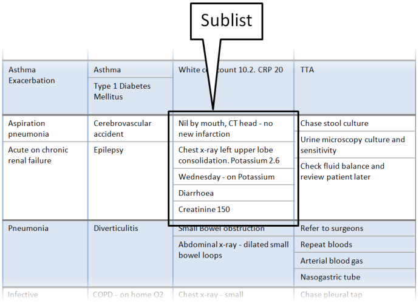

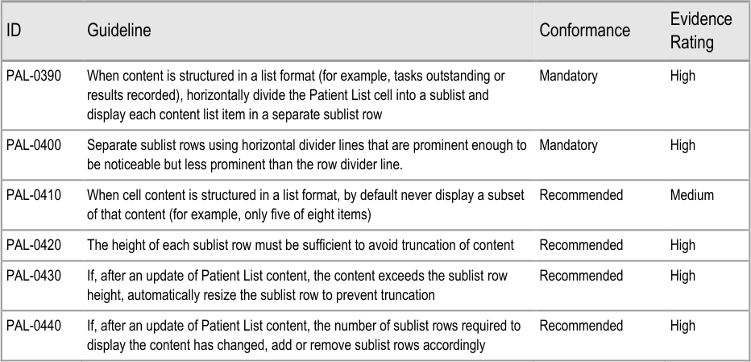

Page 27

Copyright ©2013 Health and Social Care Information Centre

HSCIC Controlled Document

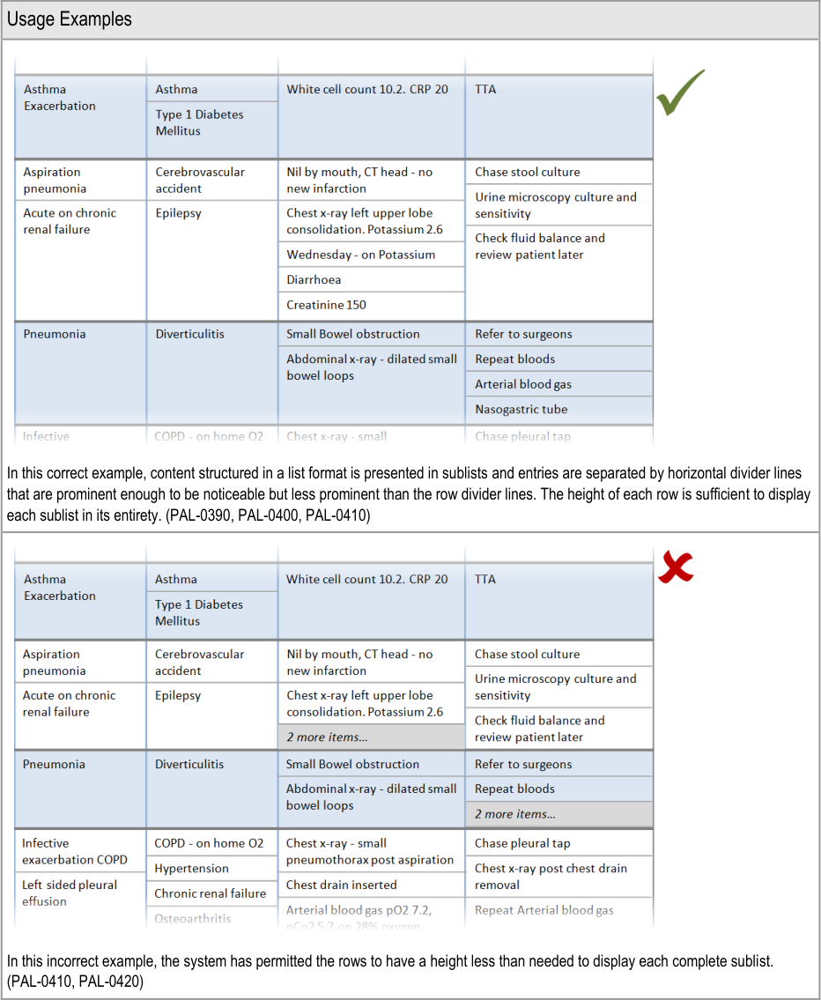

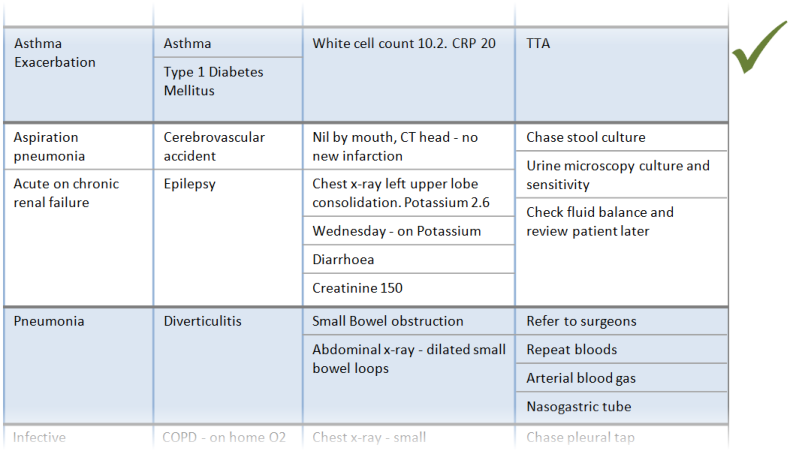

Page 28

Copyright ©2013 Health and Social Care Information Centre

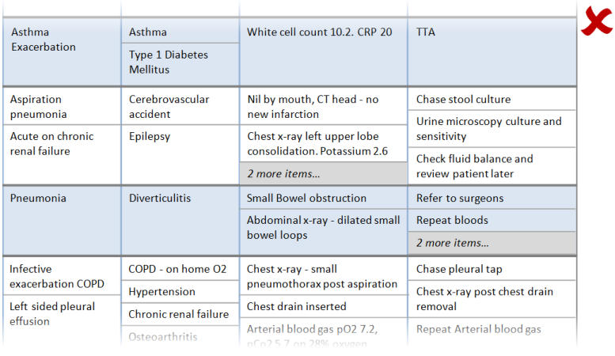
HSCIC Controlled Document

In this correct example, an update has added items to two of the sublists, which have increased in size accordingly. The rows containing the sublists have increased in height to avoid truncation. (PAL-0430, PAL-0440)

Copyright ©2013 Health and Social Care Information Centre

Page 29

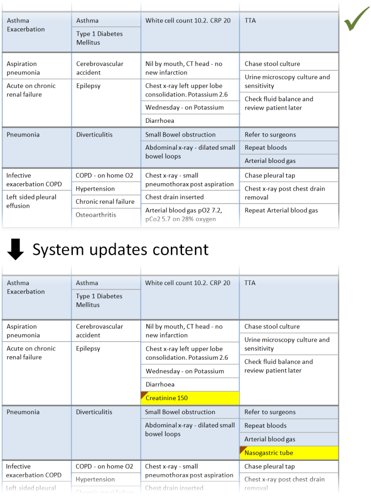
HSCIC Controlled Document

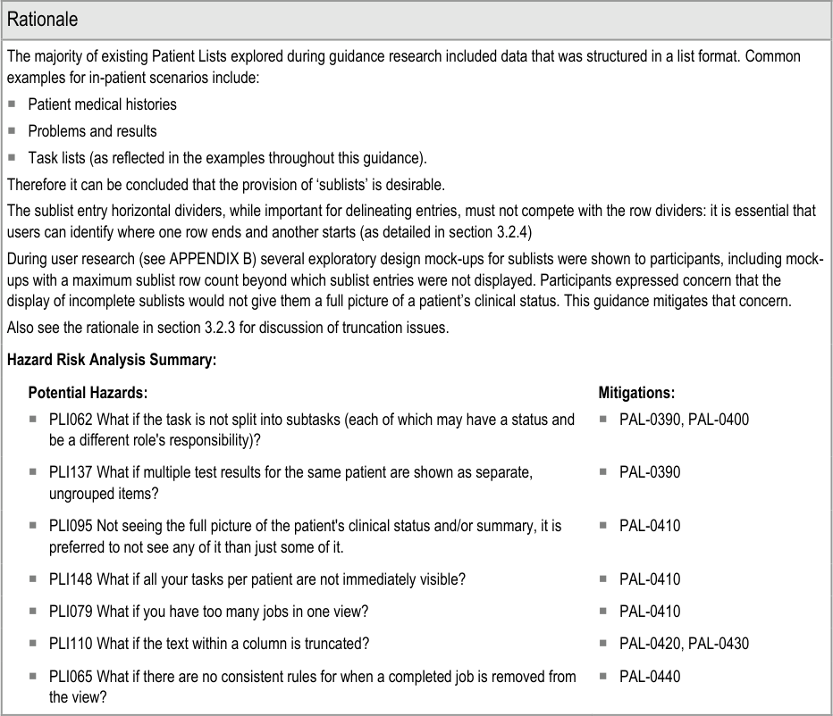

##### 3.2.6 Patient Identification

| ID | Guideline | Conformance Rating |
| --- | --- | --- |
| PAL-0450 | Locate the patient name, date of birth and NHS number in that order on separate lines in the same column | Mandatory     High |
| PAL-0460 | When both the family name and given name of a patient are unknown, display the words ‘UNKNOWN, Unknown’ and the patient gender (if known) | Recommended   Medium |
| PAL-0470 | When the family name of a patient is unknown and the given name is known,    Recomme display the word ‘UNKNOWN’, the given name and the patient gender (if known) | nded          Medium |
| PAL-0480 | When the family name of a patient is known and the given name is unknown, display the family name, the word ‘Unknown’ and the patient gender (if known). | Recommended   Medium |
| PAL-0490 | When the date of birth of a patient is unknown display the word ‘Unknown’ | Recommended   Medium |
| PAL-0500 | When an NHS number is unknown, display the word ‘Unknown’ | Recommended   Medium |
| PAL-0510 | For the duration that an NHS number is unknown, display the temporary identification number used by the care setting to uniquely identify that patient. Use the same font style as the patient name field and the label ‘Temporary Number’ or similar | Recommended   Low |
| PAL-0520 | Ensure that the display of the patient name conforms to all guidance points in section 2.6.1 of Design Guide Entry – Patient Banner {R3} | Mandatory     High |
| PAL-0530 | Ensure that the display of the preferred name (if available), date of birth and NHS number conforms to guidance points PAB-0033, PAB-0036, PAB-0037, PAB-0042, PAB-0043 and PAB-0046 in section 2.5.1 of Design Guide Entry – Patient Banner {R3} | Recommended   Medium |
| PAL-0540 | When patients on a Patient List have identical names (including the family name) visually highlight these names and display a warning symbol next to the patients’ names | Mandatory     High |
| PAL-0550 | When patients on the same Patient List have identical names (including the family name), indicate the first element of patient identification information that differentiates the patients (for example, by underlining). This might be their given name or, if identical, their date of birth or, if identical, their NHS number. | Mandatory    High |
| PAL-0560 | If supported by the system, when patients on a Patient List have similar looking or sounding names (including the family name) visually highlight those names and display a warning symbol next to the patients’ names | Recommended   Low |
| PAL-0570 | If supported by the system, when patients on the same Patient List have similar Reco looking or sounding names (including the family name), indicate the first element of patient identification information that differentiates the patients (for example, by underlining). This might be their given name or, if identical or similar, their date of birth or, if identical, their NHS number | mmended       Low |
| Usage Example | s In this correct example, the patient identifica provided in the order patient name, date of bir Where a preferred name is available, this is di patient name. (PAL-0450, PAL-0520, PAL-0530) In this incorrect example, the patient identifi not displayed in the required order. As a resul difficulty reading the information quickly and Tony Madigan’s day of birth may accidentally be the NHS number.) (PAL-0450, PAL-0520, PAL-0530) In this correct example, a patient whose family name are unknown is displayed using the words ‘ Unknown’ plus his gender. His date of birth and have the word ‘Unknown’ displayed. While his NH unknown, the temporary number used by the care uniquely identify him is displayed using the sa the patient name field, and is labelled ‘Tempor PAL-0490, PAL-0500, PAL-0510) In this correct example, a patient whose family and whose given name is known is displayed usin name, the word ‘Unknown’ and his gender. (PAL-0 PAL-0500, PAL-0510) In this correct example, a patient whose family whose given name is unknown is displayed using ‘UNKNOWN’, his given name and his gender. (PAL- PAL-0490, PAL-0500, PAL-0510) | tion information is th and NHS number. splayed after the cation information is t, users will have safely (for example, read as part of name and given UNKNOWN, NHS number also S number is setting to me font style as for ary No’ (PAL-0460, name is unknown g his family 460, PAL-0490, name is known and the word 0460, |
| In this incor | rect example, two patients in the list have the same names but this is not highlight | ed in any way, potentially leading to |
| misidentifica | tion by users of the list. (PAL-0540, PAL-0550) |  |
| In this corre | ct example, two patients in the list have the same names. This is highlighted by a s | ymbol next to the names and a changed |
| font colour f | or the identical information. The first elements of patient identification informati | on which differentiates the patients (their |
| dates of birt | h) are underlined. (PAL-0540, PAL-0550) |  |
| In this corre | ct example, two patients in the list have similar sounding names. This is highlighte | d by a symbol next to the names and a |
| changed font | colour for the similar information. The first elements of patient identification inf | ormation which differentiates the patients |
| (their dates | of birth) are underlined. (PAL-0560, PAL-0570) |  |
| Rationale |  |  |
| The clear ide | ntification of patients is essential to any Patient List. The guidance in this secti | on is consistent with that provided in |
| Design Guide | Entry – Patient Banner {R3} and extends that guidance by considering display of iden | tification information for multiple |
| patients at t | he same time. |  |
| In certain cl | inical scenarios (for example, emergency wards) the names of patients may be unknown | . Guidance on the display of |
| partially or | completely unknown patient names was informed by the NPSA communication Guidance on | the standard for Patient |
| Identifiers f | or Identity bands {R9}. |  |
| Table 7 detai | ls the differences between the NPSA guidance and the Patient List guidance on unknow | n names: |
| Name Part K | nown/Unknown                              NPSA Guidance                        Patie | nt List Guidance |
| Family name | unknown, given name unknown              Unknown Male, Unknown Male           UNKNO | WN, Unknown, Male |
| Family name | unknown, given name known                Unknown Male, Ben                    UNKNO | WN, Ben, Male |
| Family name | known, given name unknown                SMITH, Unknown Male                  SMITH | , Unknown, Male |

Figure 7: Patient Identification
Figure 7: Patient Identification

Page 30

Copyright ©2013 Health and Social Care Information Centre

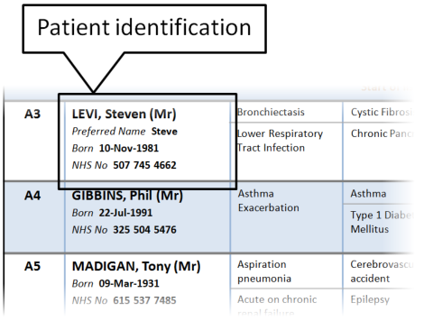
HSCIC Controlled Document


Page 31

Copyright ©2013 Health and Social Care Information Centre

HSCIC Controlled Document


Page 32

Copyright ©2013 Health and Social Care Information Centre


HSCIC Controlled Document

Page 33

Copyright ©2013 Health and Social Care Information Centre


HSCIC Controlled Document


Page 34

Copyright ©2013 Health and Social Care Information Centre

HSCIC Controlled Document

##### 3.2.7 Row Key Identifiers

| Potential Hazards: | Mitigations: |
| --- | --- |
|  PLI028 What if the different attributes in the patient identification cell are not formatted |  PAL-0450, PAL-0520, PAL-0530 |
| differently? |  |
|  PLI038 What if labels are used within the Patient List (for example, born, NHS number, |  PAL-0530 |
| gender)? |  |
|  PLI044 What if the 'NHS number' is not displayed? |  PAL-0450 |
|  PLI024 What if there is blank space in the list (for example, surname missing)? Solution:  PAL | -0460, PAL-0490 |
| would want to confirm or action this rather than leave it blank |  |
|  PLI034 What if the name prefix is not shown in the list? |  PAL-0520 |
|  PLI153 What if multiple items in the list share similar details? |  PAL-0540, PAL-0550 |
|  PLI030 What if the preferred name is not displayed on the list and staff refer to the |  PAL-0530 |
| patient by their given name? |  |
| Row Key Identifiers |  |
| s section provides guidance on row key identifiers, which uniquely identify each row from others |  |
| the Patient List. Figure 8 illustrates that feature: |  |

Figure 8: Row Key Identifiers


Page 35

Copyright ©2013 Health and Social Care Information Centre

HSCIC Controlled Document


Page 36

Copyright ©2013 Health and Social Care Information Centre


HSCIC Controlled Document

Page 37

Copyright ©2013 Health and Social Care Information Centre


HSCIC Controlled Document


Page 38

Copyright ©2013 Health and Social Care Information Centre


HSCIC Controlled Document


Page 39

Copyright ©2013 Health and Social Care Information Centre

HSCIC Controlled Document

 PLI029 What if the 'main identifier' (probably the patient name) is not the

most prominent attribute?

 PLI283 What if the list presents patients from mixed locations (for

example, more than one hospital ward in one view)?

 PLI030 What if preferred name is not displayed on the list and staff refer

to the patient by their given name?

 PAL-0600

 PAL-0640

 PAL-0590

 PLI033 What if the name prefix is shown in the list?  PAL-0590

 PLI044 What if the 'NHS number' is not displayed?  PAL-0590

 PLI016 What if empty beds are not shown in the list?  PAL-0660

 PLI017 What if empty beds are shown as completely blank lines (with no

bed number)?

 PAL-0660

 PLI015 What if empty beds are shown in the list?  PAL-0670

 PLI072 What if the visible view is horizontally long and you want to relate

information from opposite ends of the line?

 PAL-0620

Page 40

Copyright ©2013 Health and Social Care Information Centre

HSCIC Controlled Document

### 4 GUIDANCE DETAILS FOR MANAGING THE INFORMATION DISPLAYED

#### 4.1 Introduction

This section includes guidance for managing the information displayed in Patient Lists, specifically:

- Managing the columns displayed

- Refresh options and update indication

- Displaying historical Patient List information

- Displaying further information

#### 4.2 Guidelines

##### 4.2.1 Managing the Columns Displayed

This section provides guidance on how users should be able to manage the columns displayed in the Patient List. Figure 9 illustrates that feature:

Figure 9: Managing the Columns Displayed


Page 41

Copyright ©2013 Health and Social Care Information Centre

HSCIC Controlled Document


Page 42

Copyright ©2013 Health and Social Care Information Centre

HSCIC Controlled Document

Page 43

Copyright ©2013 Health and Social Care Information Centre


HSCIC Controlled Document

Page 44

Copyright ©2013 Health and Social Care Information Centre


HSCIC Controlled Document


Copyright ©2013 Health and Social Care Information Centre

Page 45

HSCIC Controlled Document

 PLI108 What if it is unclear that the list is filtered?  PAL-0750, PAL-0760

 PLI082 What if a user cannot set up lists with different inclusion criteria (for example, all

patients, all deteriorating patients)?

 PAL-0750

 PLI116 What if there is no indication what the list is ordered on?  PAL-0770

 PLI134 What if it is unclear that the sort order is per group and the amount of groups

mean the sort order is less useful than it might be?

 PAL-0770, PAL-0780

 PLI259 What if the list is only ever able to be sorted by one criterion?  PAL-0770

 PLI274 What if there is only one sort order and the user is unable to change the view of

the list depending on preference and context of use?

 PLI022 What if in a list showing patients from multiple wards the patients are not

grouped by ward?

##### 4.2.2 Refresh Options and Update Indication

| ID | Guideline | Conformance Rating |
| --- | --- | --- |
| PAL-0710 | Allow individual users to manage the columns that are displayed in the Patient List, including the order they are displayed in (with the exception of those containing row key identifier information) | Recommended   Medium |
| PAL-0720 | Do not permit the removal of columns that contain row key identifier information (for example, patient identification and ward location columns) | Mandatory     High |
| PAL-0730 | Enable users to manage default column selections for different user types (for example, default column selections for junior doctors, paediatric nurses, occupational therapists, and so on) | Recommended   Medium |
| AL-0740       O | n a user’s first use of a default column selection, size the columns to fit the Rec | ommended                 Medium |
| w | idth of the viewing area so that none are out of view. If the combined minimum |  |
| c | olumn widths exceed the width of the viewing area, use the minimum column |  |
| w | idths |  |
| AL-0750       E | nable users to filter the Patient List using the attributes displayed. Follow | Recommended              Medium |
| g | uidance in section 3.6 of Filtering Sorting and Grouping – User Interface |  |
| D | esign Guidance {R5} |  |
| AL-0760       W | hen a filter has been applied to the Patient List, ensure that the filter        Ma | ndatory                  High |
| n | otification (as mandated in section 3.6 of Filtering Sorting and Grouping – User |  |
| I | nterface Design Guidance {R5}) is located above the viewing area and uses |  |
| c | lear visual differentiation (for example, from a strong background colour) |  |
| AL-0770       E | nable users to sort the Patient List using the columns displayed. Follow | Recommended              Medium |
| g | uidance in section 3.7 of Filtering Sorting and Grouping – User Interface |  |
| D | esign Guidance {R5} |  |
| AL-0780       E | nable users to group the Patient List using the attributes displayed. Follow | Recommended              Medium |
| g | uidance in section 3.8 of Filtering Sorting and Grouping – User Interface |  |
| D | esign Guidance {R5} |  |
| AL-0790       P | ersist the users column selection, sorting, grouping and filtering settings | Recommended              Medium |
| b | etween user sessions |  |
| sage Examples |  |  |
| n this correct | example, users can select a default column set which best matches their needs and c | an also adjust the columns and the |
| rder they will | be displayed in. If the ‘Location’ or ‘Patient Identification’ column is selected, | it cannot be removed as it is a row key |
| dentifier. (PAL | -0710, PAL-0720, PAL-0730) |  |
| Note |  |  |
| The meth | od and interface for Patient List column selection and ordering is out of scope for | this guidance. The interface shown |
| in this | example is used solely to convey column management concepts and should not be consi | dered part of guidance. |
| n this incorrec | t example, the user has been allowed to remove a row key identifier (the patient id | entification information) (PAL-0720) |
| n this correct | example, the user is viewing a default column selection for the first time. The col | umns have been automatically sized to |
| it the width of | the viewing area so that none are out of view. Although the columns are narrow the | user has been made aware of the |
| omplete column | set. (PAL-0740) |  |
| n this correct | example, the Patient List has been filtered with the filter notification area displ | ayed above the viewing area using a |
| trong visual di | fferentiator. (PAL-0750, PAL-0760) |  |
| n this correct | example, the Patient List has been progressively sorted, firstly by the consultant | name in ascending alphabetical order |
| nd secondly by | the patient age in ascending order. (PAL-0770) |  |
| ationale |  |  |
| uring user rese | arch and hazard assessments (see APPENDIX B), discussions concerning column managem | ent included the |
| ollowing design | areas: |  |
| Column sets (i | ncluding default and group determined sets) |  |
| Role-based col | umn sets (for example, switching between a number of predefined sets such as ‘Junio | r Doctor’, ‘Consultant’, and so |
| on) |  |  |
| Mandatory cont | ent per role (for example, always displaying certain columns, such as ‘Tasks’, depe | nding on the users role) |
| Consistency be | tween users’ Patient Lists |  |
| articipants agr | eed that users should be given the flexibility to manage the columns displayed in t | heir Patient Lists, so that they can |
| ptimise the inf | ormation displayed to meet their individual needs. However, participants also thoug | ht that provision of ‘default’ column |
| ets for role an | d working context (for example, ‘Nursing staff – Respiratory Ward’) would be a usef | ul starting point for new users. From |
| iscussion aroun | d columns out of view (see section 3.2.3), it was recommended that at first display | column widths should be sized to |
| it within the v | iewing area to ensure the user is fully aware of all columns in the set. |  |
| Note |  |  |
| Although | guidance on determining ‘safe’ sets of columns is out of scope, during discussions | it was acknowledged that there |
| are haza | rds associated with enabling users to manage the columns in their Patient List (for | example, the risk that the user will |
| choose n | ot to display information that is essential for their role). |  |
| azard Risk Anal | ysis Summary: |  |
| Potential Haz | ards: | Mitigations: |
|  PLI006 What | if a Multi-Disciplinary Team is sharing the list and all members' information  PA | L-0710 |
| is on one l | ist? |  |
|  PLI007 What | if different roles have different views of the list? |  PAL-0710, PAL-0730 |
|  PLI018 What | if it is not possible to configure the list to suit the user? |  PAL-0710, PAL-0790 |
|  PLI020 What | if staff could not clearly and easily view a list that shows patients that are |  PAL-0710 |
| the doctor’ | s or team’s responsibility? |  |
|  PLI072 What | if the visible view is horizontally long and you want to relate information |  PAL-0710, PAL-0740 |
| from opposi | te ends of the line? |  |
|  PLI075 What | if you are not able to filter jobs by role? |  PAL-0710, PAL-0730, PAL-0790 |
|  PLI080 What | if the clinician cannot lower the level of detail to the related task level for |  PAL-0710 |
| his or her | role? |  |
|  PLI215 What | if one professional group find the data hard to read because the view |  PAL-0710, PAL-0730, PAL-0790 |
| contains da | ta that is not appropriate to them? |  |
|  PLI216 What | if data that would be relevant to all professional groups is missed because  PAL- | 0710, PAL-0730, PAL-0790 |
| it is only | contained in a view or area for one particular professional group (for example, |  |
| important i | nformation is put in a nursing section which is not read by doctors)? |  |
|  PLI222 What | if the layout of the information is optimised for one professional group or |  PAL-0710, PAL-0730, PAL-0790 |
| task? |  |  |
|  PLI229 What | if the clinician can only see some of the data per patient (for example, only  PA | L-0710 |
| some of the | tasks, some of the problems, and so on)? |  |
|  PLI094 What | if you cannot view all the patients in the list in some summary form that |  PAL-0710 |
| minimises e | verything but the patient identifiers? |  |
|  PLI091 What | if you cannot see all the associated tasks for the patient in one view AND |  PAL-0730 |
| all tasks f | or all patients in one view? |  |
|  PLI277 What | if the default view of the list is configurable? |  PAL-0790 |
|  PLI148 What | if all your tasks per patient are not immediately visible? |  PAL-0740 |
|  PLI265 What | if user preferences are not persisted from session to session? |  PAL-0790 |
|  PLI108 Wh | at if it is unclear that the list is filtered? |  PAL-0750, PAL-0760 |
|  PLI082 Wh | at if a user cannot set up lists with different inclusion criteria (for example, al | l    PAL-0750 |
| patients, | all deteriorating patients)? |  |
|  PLI116 Wh | at if there is no indication what the list is ordered on? |  PAL-0770 |
|  PLI134 Wh | at if it is unclear that the sort order is per group and the amount of groups |  PAL-0770, PAL-0780 |
| mean the | sort order is less useful than it might be? |  |
|  PLI259 Wh | at if the list is only ever able to be sorted by one criterion? |  PAL-0770 |
|  PLI274 Wh | at if there is only one sort order and the user is unable to change the view of |  PAL-0770 |
| the list | depending on preference and context of use? |  |
|  PLI022 Wh | at if in a list showing patients from multiple wards the patients are not |  PAL-0780 |
| grouped b | y ward? |  |
| 2            Re | fresh Options and Update Indication |  |
| his section pro | vides guidance on notifying the user of updates to information displayed in the |  |
| atient List. Fi | gure 10 illustrates those features: |  |

Figure 10: Refresh Options and Update Notification


Page 46

Copyright ©2013 Health and Social Care Information Centre

HSCIC Controlled Document


Page 47

Copyright ©2013 Health and Social Care Information Centre

HSCIC Controlled Document


Page 48

Copyright ©2013 Health and Social Care Information Centre


HSCIC Controlled Document

Page 49

Copyright ©2013 Health and Social Care Information Centre


HSCIC Controlled Document


Page 50

Copyright ©2013 Health and Social Care Information Centre

HSCIC Controlled Document

**Hazard Risk Analysis Summary:**

**Potential Hazards:**

 PLI001 What if entries are made into the Patient List that result in two or

more versions of the same information in the record and in the Patient List?

 PLI097 What if the information underlying the view has changed (since it

was opened) even though the refresh alert has not yet appeared?

 PLI098 What if the view is updated while open without manual refresh or

indication of a change or what those changes are?

 PLI099 What if updates are not automatic (once the view is open) and

there is no option for manual refresh?

 PLI100 What if the changes since the clinician's last view are not

indicated?

**Mitigations:**

 PAL-0800, PAL-0820, PAL-0830

 PAL-0870

 PAL-0840, PAL-0880

 PAL-0800, PAL-0870

 PAL-0800, PAL-0840, PAL-0880, PAL-0900

 PLI103 Risk of not knowing whether it was worth refreshing or not  PAL-0840, PAL-0860

 PLI104 Misinterpretation of time associated with refresh action  PAL-0840, PAL-0860

 PLI107 Updates: what if there is no marker to show what is new or what

has been updated and/or changed?

 PLI111 What if you do not realise that the status of the list has to be

manually updated?

 PLI125 What if you are not aware of the status of the list because no time

is shown?

 PLI129 What happens if you do not notice additional data which is

appearing on screen?

 PLI220 What if data in the view (either the list of patients or the data per

patient) is mistakenly interpreted to be current information when it is actually out of date?

 PLI279 What if the system allows you the ability to unmark all updates

even if all updates have not been viewed?

 PAL-0840, PAL-0880, PAL-0900

 PAL-0870

 PAL-0840, PAL-0860

 PAL-0840, PAL-0880, PAL-0900, PAL-0940

 PAL-0840, PAL-0860

 PAL-0850, PAL-0930, PAL-0980

 PLI152 What if you cannot see completed tasks?  PAL-0910, PAL-0920

 PLI066 What if completed jobs are removed too soon from the list?  PAL-0910, PAL-0920

 PLI270 What if results for unknown patient still show 'unknown' but live

system has now updated patient's record with known demographics?

 PAL-0820

Page 51

Copyright ©2013 Health and Social Care Information Centre

HSCIC Controlled Document

##### 4.2.3 Displaying Historical Patient List Information

| ID | Guideline | Conformance Rating |
| --- | --- | --- |
| PAL-0800 | Ensure that data displayed in the Patient List can be refreshed (that is, any updates to the source data can be reflected in the Patient List) | Mandatory         High |
| PAL-0810 | Apply updates to Patient List data in real-time | Recommended       High |
| PAL-0820 | If the system supports real-time update of data, ensure that updates to the source data are automatically reflected in the Patient List as soon as possible | Recommended       Medium |
| PAL-0830     If t | he system does not support real-time update of data, ensure that the system         Rec | ommended   Medium |
| auto | matically refreshes the data displayed in the Patient List using an interval |  |
| comm | unicated to the users |  |
| PAL-0840     Prov | ide an update notification field to inform the user how many updates are            Rec | ommended   Medium |
| curr | ently marked for viewing in the Patient List. Locate this field above the viewing |  |
| area |  |  |
| PAL-0850     When | the update notification field displays how many updates are currently              Rec | ommended   Medium |
| mark | ed for viewing, include advice on how many of these are currently out of view |  |
| (tha | t is, how many could be viewed if the user scrolled the viewing area |  |
| hori | zontally and/or vertically) |  |
| PAL-0860     If t | he system does not support real-time update of data, display the elapsed time       Rec | ommended   Medium |
| sinc | e the last refresh in the update notification field |  |
| PAL-0870     If t | he system does not support real-time update of data, provide an option for the     Reco | mmended    Medium |
| user | to manually trigger a refresh. Locate this option near to the update notification |  |
| fiel | d |  |
| PAL-0880     When | content within a cell is updated, bring this to the user’s attention by marking    Man | datory     High |
| the | cell with an update symbol and visually differentiating the cell (for example, by |  |
| chan | ging the cell background colour). Ensure that the update symbol does not |  |
| obsc | ure content and that the overall readability of the Patient List is not unduly |  |
| disr | upted |  |
| PAL-0890     If t | he Patient List is configured to be used by an individual clinician, do not mark    Rec | ommended   Medium |
| upda | tes that have been made by the clinician (if the system can detect this) |  |
| PAL-0900     When | a sublist entry has been updated (but not removed) visually differentiate the      Man | datory     High |
| subl | ist entry (not the entire cell) |  |
| PAL-0910     When | content has been removed by an update, display a notification in the list cell Recomme | nded       Medium |
| wher | e the content was previously displayed (for example, the text ‘item removed’) |  |
| PAL-0920     When | one or more items in a sublist have been removed by an update, display a           Rec | ommended   Medium |
| noti | fication at the end of the sublist (for example, the text ‘3 items removed’) |  |
| PAL-0930     Prov | ide the option for users to unmark each update individually for their Patient       Rec | ommended   Medium |
| List |  |  |
| PAL-0940     When | a patient has been added to the list as a result of an update, mark the            Rec | ommended   Medium |
| pati | ent identification cell with an update symbol and visually differentiate the entire |  |
| row | (for example, by changing the row background colour). Provide the option for |  |
| user | s to unmark this update as an entire row (rather than individual cells within the |  |
| row) |  |  |
| PAL-0950     When | a patient has been removed from the list as a result of an update, mark the Recommende | d          Low |
| Pati | ent Identification cell with an update symbol and visually differentiate the entire |  |
| row | (for example, by changing the row background colour). Provide the option for |  |
| user | s to unmark this update as an entire row (rather than individual cells within the |  |
| row) | ??? |  |
| PAL-0960     Prov | ide an option to unmark all updates. Locate this option next to the update          Rec | ommended   Low |
| noti | fication field. |  |
| PAL-0970     When | a user unmarks updates for their Patient List, ensure that other users’            Rec | ommended   Medium |
| Pati | ent Lists are unaffected |  |
| PAL-0980     When | a user selects the option to unmark all updates, by default alert them that        Rec | ommended   Medium |
| they | may not have seen all the updates on the list and require confirmation of the |  |
| acti | on. Provide an option to not show this alert and continue to display this option |  |
| unle | ss it is selected |  |
| Usage Examples |  |  |
| In this correct e | xample, the update notification field is displayed above the viewing area. It informs t | he users how many updates are |
| currently marked | on the Patient List and how many of these are currently out of view. An option to unmar | k all the updates is also |
| provided next to | the update notification field. (PAL-0840, PAL-0850, PAL-0960) |  |
| In this correct e | xample, the system does not support the real-time update of data and so a manual refres | h option is provide. The |
| elapsed time sinc | e the last refresh is displayed in the update notification field (PAL-0860, PAL-0870) |  |
| In this correct e | xample, the system has updated the content and two new sublist entries have been added. | The new entries are |
| visually highligh | ted using a background colour and a symbol (the corner triangle), which is positioned s | o that it does not obscure the |
| content. (PAL-088 | 0, PAL-0900) |  |
| In this correct e | xample, the system has updated the content and three entries have been removed from the | sublists. The user is |
| informed of this | by the display of ‘item removed’ messages in the sublists. (PAL-0910, PAL-0920) |  |
| In this correct e | xample, the system has updated the content and a new patient has been added to the list | . The entire row for the new |
| patient is visual | ly differentiated using the background colour and the patient identification cell has b | een marked with the update |
| symbol. (PAL-0940 | ) |  |
| In this correct e | xample, the system has updated the content and a patient has been removed from the list | , leaving that location |
| unoccupied. The e | ntire row for the unoccupied location is visually differentiated using the background c | olour and the patient |
| identification ce | ll has been marked with the update symbol. (PAL-0950) |  |
| Rationale |  |  |
| The ‘live’ update | of information displayed in Patient Lists will be an unfamiliar concept to those users | migrating from document or |
| paper based lists | . For such users, a Patient List will have typically been created at a defined point in | time (for example, at the start of a |
| shift) and update | d by the users themselves during the period of usage (for example, throughout the shift | ). However, system-based |
| Patient Lists cou | ld be updated continually, for example, for events such as: |  |
|  When the Pathol | ogy Department enter test results into the hospital system for a patient that is on the | Patient List |
|  When a patient | record is updated and the Patient List includes content sourced from that patient recor | d |
|  When a new pati | ent is admitted to a ward during a shift |  |
| Design mock-ups f | or marking updated information were shown to user research participants (see APPENDIX B | ), who particularly liked |
| how live update m | ark-ups could mitigate the risk of missing changes in patient information including imp | rovements and/or |
| deteriorations. |  |  |
| Research found th | at the safest method of clearing update mark-ups is individually on each mark-up, as cl | inicians can then ensure that |
| they have seen al | l updates (including those that may be out of view). However, this could be time consum | ing, particularly when |
| updates occur fre | quently. It was also found that sporadic viewing of a Patient List may result in it bei | ng covered with numerous update |
| mark-ups, which c | ould potentially distract from the patient information. The guidance therefore includes | recommendations on the |
| provision of a ‘c | lear all mark-up’ option. |  |
| Note |  |  |
| Determin | ing when information should be removed from the Patient List (for example, when tasks a | re completed) is out of |
| scope fo | r this guidance. However, it was considered important for users to be made aware when i | nformation is removed from |
| the Pati | ent List and so guidance on update mark-up includes removed information. |  |
| Participants disc | ussed whether users should be alerted about updates for columns they have chosen not to | display but which may |
| have been deemed | important to their role (for example, by being in the default column set for that users | role). On exploring how these |
| alerts may be mad | e, it was found that there was no clear way to convey this information in a clear and u | nambiguous manner. The |
| benefits of displ | aying alerts about information the user had chosen not to display were therefore deemed | not great enough to outweigh |
| the potential int | erface complexity. |  |
| Note |  |  |
| Indicati | on of status (for example, task completion), responsibility (for example, task allocati | on) or acceptance (for example, |
| acknowle | dgement of test results) is out of scope, therefore the guidance in this section should | not be considered suitable for |
| supporti | ng mark-up for these purposes. |  |
| Hazard Risk Analy | sis Summary: |  |
| Potential Haza | rds:                                                               Mitigations: |  |
|  PLI001 What | if entries are made into the Patient List that result in two or     PAL-0800, PAL-0820 | , PAL-0830 |
| more version | s of the same information in the record and in the Patient |  |
| List? |  |  |
|  PLI097 What | if the information underlying the view has changed (since it        PAL-0870 |  |
| was opened) | even though the refresh alert has not yet appeared? |  |
|  PLI098 What | if the view is updated while open without manual refresh or         PAL-0840, PAL-0880 |  |
| indication o | f a change or what those changes are? |  |
|  PLI099 What | if updates are not automatic (once the view is open) and            PAL-0800, PAL-0870 |  |
| there is no | option for manual refresh? |  |
|  PLI100 What | if the changes since the clinician's last view are not              PAL-0800, PAL-0840 | , PAL-0880, PAL-0900 |
| indicated? |  |  |
|  PLI103 Risk | of not knowing whether it was worth refreshing or not               PAL-0840, PAL-0860 |  |
|  PLI104 Misin | terpretation of time associated with refresh action                 PAL-0840, PAL-0860 |  |
|  PLI107 Updat | es: what if there is no marker to show what is new or what          PAL-0840, PAL-0880 | , PAL-0900 |
| has been upd | ated and/or changed? |  |
|  PLI111 What | if you do not realise that the status of the list has to be         PAL-0870 |  |
| manually upd | ated? |  |
|  PLI125 What | if you are not aware of the status of the list because no time  PAL-0840, PAL-0860 |  |
| is shown? |  |  |
|  PLI129 What | happens if you do not notice additional data which is               PAL-0840, PAL-0880 | , PAL-0900, PAL-0940 |
| appearing on | screen? |  |
|  PLI220 What | if data in the view (either the list of patients or the data per    PAL-0840, PAL-0860 |  |
| patient) is | mistakenly interpreted to be current information when it is |  |
| actually out | of date? |  |
|  PLI279 What | if the system allows you the ability to unmark all updates          PAL-0850, PAL-0930 | , PAL-0980 |
| even if all | updates have not been viewed? |  |
|  PLI152 What | if you cannot see completed tasks?                                  PAL-0910, PAL-0920 |  |
|  PLI066 What | if completed jobs are removed too soon from the list?               PAL-0910, PAL-0920 |  |
|  PLI270 What | if results for unknown patient still show 'unknown' but live        PAL-0820 |  |
| system has n | ow updated patient's record with known demographics? |  |
| .3            Dis | playing Historical Patient List Information |  |
| This section prov | ides guidance on displaying historical patient information as a complete Patient |  |
| List ‘snapshot’. | Figure 11 illustrates those features: |  |

Figure 11: Historical Patient List Information


Page 52

Copyright ©2013 Health and Social Care Information Centre

HSCIC Controlled Document


Page 53

Copyright ©2013 Health and Social Care Information Centre


HSCIC Controlled Document


##### 4.2.4 Displaying Further Information

| ID | Guideline | Conformance Rating |
| --- | --- | --- |
| PAL-0990 | Enable users to access historical Patient List information as a complete list for a specified point in time | Recommended   Medium |
| PAL-1000 | When historical Patient List information is displayed as a complete list, ensure that it is displayed in a similar format to that used by the equivalent current Patient List. | Recommended   Medium |
| PAL-1010 | When historical Patient List information is displayed as a complete list, visually emphasise the time and date to which it applies | Recommended   Medium |
| PAL-1020 | When historical Patient List information is displayed as a complete list, ensure that there is clear visual differentiation between it and current Patient Lists (for example, by using a distinct colour scheme and including the word ‘Historical’ in the header) | Mandatory     High |
| PAL-1030 | When historical Patient List information is displayed as a complete list, never display it and the equivalent current Patient List at the same time | Mandatory     High |
| Usage Examples |  |  |
| In this correct e | xample, the historical Patient List is displayed with a different colour scheme to that | used in other guidance examples, |
| and the time and | date are emphasised. The information is presented in a similar format to the current Pa | tient List. (PAL-0990, |
| PAL-1000, PAL-101 | 0, PAL-1020) |  |
| In this incorrect | example, the historical Patient List and the current Patient List are displayed at the | same time. (PAL-1030) |
| Rationale |  |  |
| When user researc | h participants (see APPENDIX B) were shown design mock-ups of historical Patient Lists, | they agreed that |
| accessing histori | cal information on current patients and on previous patients was useful. |  |
| Providing a histo | rical ‘snapshot’ of all information across a Patient List has the advantages of providi | ng clinicians with a familiar format |
| in which to view | the information. This is particularly useful if clinicians want to remind themselves of | what their Patient List looked like |
| at the end of the | ir previous shift and to discover what happened to previous patients who may have been | discharged since then. |
| Providing a histo | rical Patient List with a similar format to the current Patient List could introduce ha | zards of misidentification, so |
| specific guidelin | es are provided to mitigate this hazard. |  |
| Hazard Risk Analy | sis Summary: |  |
| Potential Haza | rds:                                                          Mitigations: |  |
|  PLI151 What | if you cannot see the details from the previous day?           PAL-0990, PAL-1000, PAL | -1010, PAL-1020, PAL-1030 |
|  PLI205 Being | unable to review previous information such as                 PAL-0990, PAL-1000, PAL | -1010, PAL-1020, PAL-1030 |
| trends (whic | h are not necessarily quantitative information), |  |
| completed ac | tions and patients who have now been discharged |  |
|  PLI219 What | if 'snapshots' of the state of the list have to be taken       PAL-0990, PAL-1000, PAL | -1010, PAL-1020, PAL-1030 |
| manually? |  |  |
|  PLI240 What | if you cannot access jobs that have been completed             PAL-0990, PAL-1000, PAL | -1010, PAL-1020, PAL-1030 |
| for a patien | t? |  |
|  PLI239 What | if you cannot get access to patients who have been             PAL-0990, PAL-1000, PAL | -1010, PAL-1020, PAL-1030 |
| on the ward | recently? |  |
| .4           Disp | laying Further Information |  |
| This section prov | ides guidance on how to display further information that a user has opened from |  |
| the Patient List. | Figure 12 illustrates that feature: |  |

Figure 12: Displaying Further Information

Page 54

Copyright ©2013 Health and Social Care Information Centre


HSCIC Controlled Document


Page 55

Copyright ©2013 Health and Social Care Information Centre

HSCIC Controlled Document

Page 56

Copyright ©2013 Health and Social Care Information Centre


HSCIC Controlled Document


Page 57

Copyright ©2013 Health and Social Care Information Centre

HSCIC Controlled Document

### 5 DOCUMENT INFORMATION

#### 5.1 Terms and Abbreviations

| Abbreviation | Definition |
| --- | --- |
| CATR | Clinical Authority to Release |
| CSG | Clinical Safety Group |
| CUI | Common User Interface |
| IG | Information Governance |
| ISMP | Institute for Safe Medication Practices |
| ISO | International Organization for Standardization |
| MDT | Multi-Disciplinary Team |
| MEWS | Medical Early Warning Score |
| MIST | Mechanism Illness/Injury Signs/Symptoms Treatment |
| NHS | National Health Service |
| NHS CFH | NHS Connecting for Health |
| NPSA | National Patient Safety Agency |
| UI | User Interface |
| VDT | Visual Display Terminal |
| WHO | World Health Organization |

Table 8: Terms and Abbreviations

#### 5.2 Definitions

The Authority The organisation implementing the NHS National Programme for IT (currently NHS Connecting for Health).

Conformance In the guidance tables, indicates the extent to which you should follow the guideline when defining your UI implementation. There are two levels:

 **Mandatory**          - An implementation should follow the guideline

 **Recommended**          - An implementation is advised to follow the guideline

Current best practice Current best practice is used rather than best practice, as over time best practice guidance may change or be

revised due to changes to products, changes in technology, or simply the additional field deployment experience that comes over time.

Page 58

Copyright ©2013 Health and Social Care Information Centre

HSCIC Controlled Document

| Term | Definition |
| --- | --- |
| The Authority | The organisation implementing the NHS National Programme for IT (currently NHS Connecting for Health). |
| Conformance | In the guidance tables, indicates the extent to which you should follow the guideline when defining your UI implementation. There are two levels:  Mandatory – An implementation should follow the guideline  Recommended – An implementation is advised to follow the guideline |
| Current best practice Cu | rrent best practice is used rather than best practice, as over time best practice guidance may change or be |
| re | vised due to changes to products, changes in technology, or simply the additional field deployment |
| ex | perience that comes over time. |
| erm | Definition |
| vidence Rating | In the guidance tables, summarises the strength of the research defining the guideline and the extent to which it mitigates patient safety hazards. There are three ratings (with example factors used to determine the appropriate rating):  Low:  Does not mitigate specific patient safety hazards  User research findings unclear and with few participants  Unreferenced usability principles indicate the design is not significantly better than alternatives  Medium:  Mitigates specific patient safety hazards  User research findings clear but with few participants  References old authoritative guidance (for example, from National Patient Safety Agency (NPSA), Institute for Safe Medication Practices (ISMP) or World Health Organization (WHO)) that is potentially soon to be superseded  Referenced usability principles indicate the design is significantly better than alternatives  High:  Mitigates specific patient safety hazards  User research findings clear and with a significant number of participants  References recent authoritative guidance (for example, from NPSA, ISMP or WHO)  Referenced usability principles indicate the design is significantly better than alternatives |
| HS Entity | Within this document, defined as a single NHS organisation or group that is operated within a single technical infrastructure environment by a defined group of IT administrators. |

Table 9: Definitions

#### 5.3 Nomenclature

This section shows how to interpret the different styles used in this document to denote various types of information.

##### 5.3.1 Body Text

| Text | Style |
| --- | --- |
| Code | Monospace |
| Script |  |
| Other markup languages |  |
| Interface dialog names | Bold |
| Field names |  |
| Controls |  |
| Folder names | Title Case |
| File names |  |

Table 10: Body Text Styles

Page 59

Copyright ©2013 Health and Social Care Information Centre

HSCIC Controlled Document

##### 5.3.2 Cross References

| Reference | Style |
| --- | --- |
| Current document – sections | Section number only |
| Current document – figures/tables | Caption number only |
| Other project documents | Italics and possibly a footnote |
| Publicly available documents | Italics with a footnote |
| External Web-based content | Italics and a hyperlinked footnote |

Table 11: Cross Reference Styles

#### 5.4 References

| Reference | Document | Version |
| --- | --- | --- |
| R1. | British Standards Institute – BS EN ISO 9241-10:1996 Ergonomic requirements for office work with visual display terminals (VDTs) – Part 10: Dialogues principles | 1996 |
| R2. | British Standards Institute – BS 7581:1992 Guide to Presentation of tables and graphs | 1992 |
| R3. | NHS CUI Programme – Design Guide Entry – Patient Banner | 4.0.0.0 |
| R4. | NHS CUI Programme – Displaying Graphs and Tables – User Interface Design Guidance | 2.0.0.0 |
| R5. | NHS CUI Programme – Filtering, Sorting and Grouping – User Interface Design Guidance | 1.0.0.0 |
| R6. | NHS CUI Programme – Design Guide Entry – Time Display | 4.0.0.0 |
| R7. | NHS CUI Programme – Design Guide Entry – Date Display | 5.0.0.0 |
| R8. | World Health Organization Collaborating Centre for Patient Safety Solutions – Aide Memoire – Volume 1, solution 2, May 2007 – Patient Identification | May 2007 |
| R9. | National Patient Safety Agency National Reporting and Learning Service – DSCN 04/2009 – Guidance on the standard for Patient Identifiers for Identity bands | March 2009 |
| R10. | Nielsen, J – Usability Engineering | 1993 |
| R11. | Shneiderman, B – Designing the User Interface: Strategies for Effective Human-Computer Interaction | Third Edition |

Table 12: References

Copyright ©2013 Health and Social Care Information Centre

Third Edition

Page 60

HSCIC Controlled Document

### APPENDIX A USABILITY PRINCIPLES

#### A.1 Nielsen’s Usability Heuristics

See _Usability Engineering_ **{R10}** for more information on these principles:

- Visibility of system status

- Match between system and the real world

- User control and freedom

- Consistency and standards

- Error prevention

- Recognition rather than recall

- Flexibility and efficiency of use

- Aesthetic and minimalist design

- Help users recognise, diagnose, and recover from errors

- Help and documentation

#### A.2 Shneiderman’s Eight Golden Rules of Interface Design

See _Designing the User Interface – Strategies for Effective Human-Computer Interaction_ **{R11}** for more information on these principles:

- Strive for consistency

- Enable frequent users to use shortcuts

- Offer informative feedback

- Design dialogs to yield closure

- Offer error prevention and simple error handling

- Permit easy reversal of actions

- Support internal locus of control

- Reduce short-term memory load

#### A.3 ISO 9241: Characteristics of Presented Information

See _Ergonomic requirements for office work with visual display terminals (VDTs) -- Part 10:_ _Dialogues principles_ **{R1}** for more information on these principles:

- Clarity (the information content is conveyed quickly and accurately)

- Discriminability (the displayed information can be distinguished accurately)

- Conciseness (users are given only the information necessary to accomplish the task)

- Consistency (the same information is presented in the same way throughout the

application, according to the user’s expectation)

- Detectability (the user’s attention is directed towards information required)

Page 61

Copyright ©2013 Health and Social Care Information Centre

HSCIC Controlled Document

- Legibility (information is easy to read)

- Comprehensibility (meaning is clearly understandable, unambiguous, interpretable and

recognisable)

Page 62

Copyright ©2013 Health and Social Care Information Centre

HSCIC Controlled Document

### APPENDIX B STUDY ID 77: EXECUTIVE SUMMARY

#### B.1 Abstract

The UK National Health Service (NHS) Common User Interface (CUI) programme is a partnership between Microsoft [®] and NHS Connecting for Health (NHS CFH), which is part the NHS National Programme for Information Technology (NPfIT).

As part of CUI, the Clinical Applications and Patient Safety (CAPS) project has the goal of ensuring that software applications used by the NHS enhance patient safety. To achieve this, CAPS provides software developers with user interface design guidelines derived through a user-centric development process that includes explicit patient-safety evaluations.

This summary describes key findings from user research carried out in November 2009 by the CUI CAPS team on Patient List Views. These findings are a subset of those in a larger internal report prepared for the CUI CAPS Patient List Views team.

**Purpose:**

To gain clinical feedback on designs for Patient List Views.

**Method:**

Interviews: structured interviews with 11 Health Care Professionals (HCPs) eliciting HCP preferences and qualitative feedback on designs.

**Key Results:**

Based on clinician preference and rationale:

- Truncating items in sublists is problematic and may hinder use of the view

- The option for end-user clinicians to be able to customise the dataset visible should be

further explored

- Marking of updates was a popular feature, though unmarking was initially unclear

- A ‘snapshots’ feature was also liked, primarily in order to access patients no longer on the

current list

#### B.1 Research Objectives

To gather HCP preferences and qualitative feedback on, and to identify possible patient safety hazards with, CUI Patient List designs.

#### B.2 Research Design

11 clinicians were interviewed across 11 structured 1 hour interviews, carried out in person. Participants were shown static designs of the Patient List View, with design alternatives per design area. Designs and example data used a secondary care inpatient scenario.

Participants were asked for preferences based on patient safety criteria. Other qualitative feedback was elicited covering:

- Rationale for preference

- Design fit with current and best practice

- Design understandability

- Any potential hazards resulting from the designs

Page 63

Copyright ©2013 Health and Social Care Information Centre

HSCIC Controlled Document

Detailed notes from the interviews were qualitatively analysed using thematic coding.

#### B.3 Results

##### B.3.1 Participant Description

| B.1 | Abstract |
| --- | --- |
| The UK | National Health Service (NHS) Common User Interface (CUI) programme is a partnership ® |
| between | Microsoft and NHS Connecting for Health (NHS CFH), which is part the NHS National |
| Program | me for Information Technology (NPfIT). |
| As part | of CUI, the Clinical Applications and Patient Safety (CAPS) project has the goal of ensuring |
| that so | ftware applications used by the NHS enhance patient safety. To achieve this, CAPS |
| provide | s software developers with user interface design guidelines derived through a user-centric |
| develop | ment process that includes explicit patient-safety evaluations. |
| This su | mmary describes key findings from user research carried out in November 2009 by the CUI |
| CAPS te | am on Patient List Views. These findings are a subset of those in a larger internal report |
| prepare | d for the CUI CAPS Patient List Views team. |
| Purpose | : |
| To gain | clinical feedback on designs for Patient List Views. |
| Method: |  |
| Intervi | ews: structured interviews with 11 Health Care Professionals (HCPs) eliciting HCP |
| prefere | nces and qualitative feedback on designs. |
| Key Res | ults: |
| Based o | n clinician preference and rationale: |
|  T | runcating items in sublists is problematic and may hinder use of the view |
|  T | he option for end-user clinicians to be able to customise the dataset visible should be |
| f | urther explored |
|  M | arking of updates was a popular feature, though unmarking was initially unclear |
|  A | ‘snapshots’ feature was also liked, primarily in order to access patients no longer on the |
| c | urrent list |
| B.1 | Research Objectives |
| To gath | er HCP preferences and qualitative feedback on, and to identify possible patient safety |
| hazards | with, CUI Patient List designs. |
| B.2 | Research Design |
| 11 clin | icians were interviewed across 11 structured 1 hour interviews, carried out in person. |
| Partici | pants were shown static designs of the Patient List View, with design alternatives per design |
| area. D | esigns and example data used a secondary care inpatient scenario. |
| Partici | pants were asked for preferences based on patient safety criteria. Other qualitative feedback |
| was eli | cited covering: |
|  R | ationale for preference |
|  D | esign fit with current and best practice |
|  D | esign understandability |
|  A | ny potential hazards resulting from the designs |
| Detaile | d notes from the interviews were qualitatively analysed using thematic coding. |
| B.3 | Results |
| B.3.1 | Participant Description |
| 11 part | icipants were interviewed in 11 sessions. Each had either volunteered through the NHS |
| CFH Eve | nt Management System (EMS) signup or had been recruited by an HCP who had |
| volunte | ered. 5 out of 11 participants had previously taken part in CUI clinical engagement for other |
| work ar | eas. Table 4 shows a summary of the participants’ profiles: CUI Feedback |
| Session | Job Role             Specialty                 Level          Used Electronic Templates? before? |
| 426 | Doctor               Obstetrics and            Senior SpR     Labour board, handwritten list         No Gynaecology |
| 427 | Doctor               Obstetrics and            Junior SpR     Labour board, printed document         No Gynaecology |
| 428 | Doctor               Obstetrics and            SpR            Labour board, handwritten list         No Gynaecology |
| 429 | Doctor               Obstetrics and            SpR            Labour board, printed document         No Gynaecology |
| 430 | Doctor               GP Rotation (Obstetrics   SHO            Labour board, printed document (both   No and Gynaecology)                         personal and shared) |
| 431 | Nurse                Renal (outpatients)       ? Consultant   Printed document (both personal and    Yes shared) |
| 432 | Nurse                Critical Care             Senior         Printed document (shared)              Yes |
| 433 | Pharmacist           ITU                       ?              Printed document (personal)            No |
| 434 | Doctor               GP Rotation / Military    ? F2           Electronic systems at two trusts,      Yes printed document (personal) |
| 435 | Doctor               Surgery                   SHO            Printed document (personal)            Yes |
| 436 | Pharmacist           Various                   ?              Electronic system, printed document    Yes (personal) |

Table 13: Interview Participants

Yes

All participants were clinical staff who used patient lists as part of their role, generally for handover and supporting their work on the wards. The majority of the participants were junior doctors. Participants were from a number of different trusts around the UK.

The majority had had no experience of using electronic patient lists.

Page 64

Copyright ©2013 Health and Social Care Information Centre

HSCIC Controlled Document

##### B.3.2 Design Areas

Bullet text _in italics_ represents researcher recommendations or comments in order to distinguish them from user feedback.

_**Current Practice**_

- Inpatient lists are used by junior doctors as “an aide memoire so you know where they are,

who they are, what they are, and what you’ve done” (p435)

- Several participants described using old versions of the patient list (usually from the

previous day) for:

 Backup – Due to still-relevant information not being transferred to the new version

 To see what had happened to patients no longer on the ward, in particular where they had been moved to

 To track the responsible staff on duty on a particular day

 To track infection risks

_**Too Much Data**_

- Participants were shown three designs for dealing with large numbers of items in a cell

sublist (for example, tasks)

- The most serious risks were with the design that forced the clinician to scroll the list within

the cell as this prevented them from comparing across patient’s tasks both within and between patients. They might forget to scroll, and they might mistakenly assume that the items were in order of importance (when it is likely they would not be as this is hard to reliably determine and varies depending on your clinical perspective)

- Advantages of showing all items in a sublist without truncation were that all items across all

patients could (in theory) be seen in ‘one go’, though, as each patient row was likely to be much higher in this case, the clinician would have to do more scrolling and/or paging in order to see and compare items between patients

- _All current paper patient lists follow an untruncated model_

- Participants suggested that a short list of patients might be useful to get an overview of the

location or as a way to select a patient

_**Current Dataset Variation**_

- As has been seen from analysis of current inpatient paper lists, participants described how

different wards can have very different datasets (for example, a general medical ward compared to a labour ward) and some modelled in different ways (for example, organising data by the body system in the Intensive Therapy Unit (ITU)):

 _Implying that a patient list design cannot ignore the issue of varying datasets between_ _wards and/or contexts_

_**Changing Dataset**_

- Participants were shown different designs for user-variation of the visible dataset. Issues

arising were:

 Disorientating ‘jumping’ if datasets were presented on different pages (in that the clinician has to re-find the patient they were interested in)

 Having to re-read information if datasets were presented on different pages

Page 65

Copyright ©2013 Health and Social Care Information Centre

HSCIC Controlled Document

 The desire to be able to compare attributes for a given patient (difficult if attributes were always displayed on separate pages)

 The belief among junior doctors that a dataset would be determined by senior staff (and possibly even non-clinical staff) and would likely be inappropriate for the juniors’ needs. Therefore, they would like the ability to vary the dataset themselves

 The desire for different roles to be able to access different datasets

 A desire to guide new staff to a recommended dataset for them in their context

 A desire to be able to vary the dataset visible dependant on patient or clinical situation

 All participants preferred a design where they could fully customise the visible dataset:

 However, this may have been influenced by a desire to account for varying datasets per ward _(which does not necessarily imply that the end-user can vary the dataset)_

- Various risks were raised with the ability for the end-user to fully customise the visible

dataset

_**Updates**_

- All participants liked the idea of marking the updates since you last saw the list:

 One participant pointed out this would be of most value in a larger team where many people were making updates to the same patients during a day (p437)

- It was not seen as necessary to indicate times of updates in this view

- Participants were unclear as to whether the update count included those updates on

columns out of view

- The first five participants shown the design initially (mistakenly) assumed unmarking would

clear all the updates from the whole team’s view and didn’t like this, preferring the update unmarking to be personal

- Other participants discussed the merits of using the updates as a kind of ‘micro-handover’

acknowledgement, in that the marking and unmarking could be shared between the team to indicate acceptance of information and tasks:

 _Following internal CUI discussion, it was felt that this kind of functionality was both out_ _of scope for this work and probably best left to a ‘proper’ communications feature_

_**Snapshots**_

- All six participants asked confirmed that they did want to know about patients who had

previously been on the ward (which is not possible from a continually updated patient list view)

- This was mainly seen as a learning opportunity, an aid in finding the patient, for checking

tasks were done for patients now not on the ward and for quick access when writing the discharge summary

 _A previous version of the patient list would mean that a clinician could find the patient’s_ _details without having to remember unique identifiers and searching for them in the_ _Patient Administration System (PAS), which may be unsuccessful or error prone as_ _patients’ unique identifiers are hard to remember_

_**History**_

- Response was generally ambivalent, with no strong opinions for or against viewing a

per-patient history

Page 66

Copyright ©2013 Health and Social Care Information Centre

HSCIC Controlled Document

_**Opening More Details**_

- The option to show more details for one patient at the same time as the patient list was only

discussed with four participants but there were more risks elicited for having the option than not having it

- It was suggested that, given space constraints, there would in any case be a limit to how

much extra information would be able to be usefully seen at the same time

_**Multiple Wards**_

- All six participants asked were initially confused by the ‘mixed’ list and all described the

benefits of seeing the patients grouped or ordered by ward

Page 67

Copyright ©2013 Health and Social Care Information Centre

HSCIC Controlled Document

### REVISION AND SIGNOFF SHEET

#### Change Record

25-Nov-2009 Steve Loader 0.0.0.1 Initial draft for review/discussion

25-Nov-2009 Mick Harney 0.0.1.0 Made up Working Baseline version for copyedit/NHS CFH reviews

27-Nov-2009 Mick Harney 0.0.1.1 First pass copyedit

08-Dec-2009 Steve Loader 0.0.1.2 Update for copyedit and NHS CFH comments

10-Dec-2009 Mick Harney 0.0.1.3 Copyedit changes. Final points to agree.

10-Dec-2009 Mick Harney 0.1.0.0 Raised to Baseline Candidate

14-Dec-2009 Steve Loader 0.1.0.1 Updating with last changes

14-Dec-2009 Mick Harney 0.2.0.0 Bookmark and re-sequence IDs and raise to Baseline Candidate #2

17-Dec-2009 Mick Harney 1.0.0.0 Raised to Baseline

Document Status has the following meaning:

- **Drafts 0.0.0.X**  - Draft document reviewed by the Microsoft CUI Project team and the

Authority designate for the appropriate Project. The document is liable to change.

- **Working Baseline 0.0.X.0**  - The document has reached the end of the review phase and

may only have minor changes. The document will be submitted to the Authority CUI Project team for wider review by stakeholders, ensuring buy-in and to assist in communication.

- **Baseline Candidate 0.X.0.0**  - The document has reached the end of the review phase and

it is ready to be frozen on formal agreement between the Authority and the Company

- **Baseline X.0.0.0**  - The document has been formally agreed between the Authority and the

Company

Note that minor updates or corrections to a document may lead to multiple versions at a particular status.

#### Open Issues Summary

None

#### Audience

The audience for this document includes:

- **Authority CUI Manager / Project Sponsor** . Overall project manager and sponsor for the

NHS CUI project within the Authority

- **Authority Clinical Applications and Patient Safety Project Project Manager.**

Responsible for ongoing management and administration of the Project

Page 68

Copyright ©2013 Health and Social Care Information Centre

HSCIC Controlled Document

- **The Authority Project Team** . Responsible for jointly agreeing with the Company NHS CUI

Project Team the approach defined in this document and any necessary redefinition of the Clinical Applications and Patient Safety Project strategy that results from the document or approach agreed

- **Company NHS CUI Team** . Responsible for agreeing with the Authority Project Team the

approach defined in this document, including any necessary redefinition of the Clinical Applications and Patient Safety Project strategy that results from the document or approach agreed

#### Reviewers

Mike Carey NHS CFH Project Manager 0.2.0.0 15-Dec-2009

Tim Chearman NHS CFH Project Lead 0.2.0.0 15-Dec-2009

Frank Cross Clinical Advisor 0.2.0.0 15-Dec-2009

Lindsey Butler Clinical Safety Advisor 0.2.0.0 15-Dec-2009

Peter Johnson Clinical Architect 0.2.0.0 15-Dec-2009

Greg Scott Clinical Advisor 0.2.0.0 15-Dec-2009

Priya Shah Clinical Advisor 0.2.0.0 15-Dec-2009

#### Distribution

As above

#### Document Properties

Document Title Patient List View User Interface Design Guidance

Author Clinical Applications and Patient Safety Project

Restrictions **RESTRICTED – COMMERCIAL; MICROSOFT COMMERCIAL;** Access restricted to: NHS CUI Project Team, Microsoft NHS Account Team

Creation Date 2 November 2009

Last Updated 23 June 2015

**Copyright:**

You may re-use this information (excluding logos) free of charge in any format or medium, under the terms of the Open Government Licence. To view this licence, visit [nationalarchives.gov.uk/doc/open-government-licence or email psi@nationalarchives.gsi.gov.uk.](https://web.nhs.net/OWA/redir.aspx?C=dMnSAL43xUOp9X_SOcscV9mT5A0smdBIh1_vxjdSDVCERI33v7-idn6tNFCNwJYUR1PxIW-Hd-E.&URL=http%3a%2f%2fnationalarchives.gov.uk%2fdoc%2fopen-government-licence)

Page 69

Copyright ©2013 Health and Social Care Information Centre
