_Prepared for_

**NHS Connecting for Health**

**Tuesday, 23 June 2015**

**Version 3.0.0.0 Baseline**

_Prepared by_

**Clinical Application and Patient Safety Project**

**NHS CUI Programme Team**

[cuistakeholder.mailbox@hscic.gov.uk](mailto:cuistakeholder.mailbox@hscic.gov.uk)

HSCIC Controlled Document

### PREFACE

**Documents replaced by this document**

Patient Name Input and Display – User Interface Design Guidance 2.0.0.0

Patient Name Input and Display – User Interface Design Guidance 1.0.0.0

**Documents to be read in conjunction with this document**

Accessibility Checkpoints for NHS Applications 1.0.0.0

Accessibility for Clinical Applications 1.0.0.0

**This document was prepared for NHS Connecting for Health which ceased to exist on 31 March**
**2013. It may contain references to organisations, projects and other initiatives which also no**
**longer exist. If you have any questions relating to any such references, or to any other aspect of**
**[the content, please contact cuistakeholder.mailbox@hscic.gov.uk](mailto:cuistakeholder.mailbox@hscic.gov.uk)**

Copyright ©2013 Health and Social Care Information Centre

HSCIC Controlled Document

### TABLE OF CONTENTS

_**1**_ _**Introduction .................................................................................................................................... 1**_

1.1 Customer Need ......................................................................................................................... 2

1.1.1 Overview ............................................................................................................................. 2

1.1.2 Eliminating Inconsistencies Across Systems ...................................................................... 2

1.1.3 Simplified User Interface Design and Development ........................................................... 2

1.2 Scope ........................................................................................................................................ 2

1.2.1 In Scope .............................................................................................................................. 2

1.2.2 Out of Scope ....................................................................................................................... 3

1.3 Dependencies and Assumptions .............................................................................................. 3

1.4 Key Principles ........................................................................................................................... 3

_**2**_ _**Recommendations and Guidance ................................................................................................ 4**_

2.1 Patient Name Display ............................................................................................................... 4

2.1.1 Guidance ............................................................................................................................. 4

2.1.2 Examples of Correct Usage ................................................................................................ 5

2.1.3 Examples of Incorrect Usage .............................................................................................. 5

2.1.4 Rationale ............................................................................................................................. 6

2.1.5 Optional Data Fields .......................................................................................................... 10

2.2 Patient Name Input Data Elements ........................................................................................ 11

2.2.1 Title .................................................................................................................................... 11

2.2.2 Family Name ..................................................................................................................... 13

2.2.3 Given Name ...................................................................................................................... 15

2.2.4 Middle Name(s) ................................................................................................................. 15

2.2.5 Suffix ................................................................................................................................. 15

2.2.6 Preferred Name ................................................................................................................. 16

2.2.7 Examples of Correct Usage .............................................................................................. 16

2.2.8 Examples of Incorrect Usage ............................................................................................ 17

2.2.9 Rationale ........................................................................................................................... 17

2.2.10 Mandatory and Optional fields ...................................................................................... 18

2.3 InForm Input Design ............................................................................................................... 18

2.3.1 Guidance ........................................................................................................................... 18

2.3.2 Examples of Correct Usage .............................................................................................. 19

2.3.3 Examples of Incorrect Usage ............................................................................................ 19

2.3.4 Rationale ........................................................................................................................... 19

2.4 InLine Input Design ................................................................................................................. 20

2.4.1 Wrapping Behaviour .......................................................................................................... 20

2.4.2 Guidance ........................................................................................................................... 21

2.4.3 Examples of Correct Usage .............................................................................................. 21

2.4.4 Examples of Incorrect Usage ............................................................................................ 21

Page iii

Copyright ©2013 Health and Social Care Information Centre

HSCIC Controlled Document

2.4.5 Rationale ........................................................................................................................... 22

2.5 Instructional Text .................................................................................................................... 22

2.5.1 Field Labels ....................................................................................................................... 22

2.5.2 Prompts ............................................................................................................................. 24

2.5.3 Tooltips .............................................................................................................................. 25

_**3**_ _**Document Information ................................................................................................................ 27**_

3.1 Terms and Abbreviations ........................................................................................................ 27

3.2 Definitions ............................................................................................................................... 27

3.3 Nomenclature ......................................................................................................................... 27

3.3.1 Body Text .......................................................................................................................... 27

3.3.2 Cross References.............................................................................................................. 28

3.4 References ............................................................................................................................. 28

Page iv

Copyright ©2013 Health and Social Care Information Centre

HSCIC Controlled Document

### PATIENT SAFETY PROCESS

The development lifecycle for this design guide includes an integrated patient / clinical safety risk
assessment and management process.

Known patient safety incidents relevant to this design guidance area have been researched and
reviewed as part of ongoing development. The resulting guidance points aim to support mitigation
of these known patient safety risks. In addition, the developers of this design guide have
undertaken a patient safety risk assessment to identify new risks that could potentially be
introduced by the guidance points in this document. Any potential risks identified have been
assessed and managed to support the ongoing clinical safety case for this design guide.

The Hazard Log records all the risks that have been identified during development and describes
mitigatory actions that, in some cases, will need to be taken by users of this design guide. The
Hazard Log is a live document that is updated as the design guide is developed and maintained.
Until this design guide has received full Clinical Authority to Release (CATR) from the NHS
Connecting for Health (NHS CFH) Clinical Safety Group (CSG) – based on an approved Clinical
Safety Case – there may be outstanding patient safety risks yet to be identified and mitigated.

Additionally, users implementing applications that follow this design guide’s guidelines (for
example, healthcare system suppliers) are expected to undertake further clinical safety risk
assessments of their specific systems within their specific context of use.

[Refer to www.cui.nhs.uk](https://emea.mail.microsoft.com/OWA/redir.aspx?C=2aab7991b0924c8f92c4e2824ab8a971&URL=http%3a%2f%2fwww.cui.nhs.uk) for further information on the patient safety process and for the safety
status and any relevant accompanying safety documentation for this design guide.

Page v

Copyright ©2013 Health and Social Care Information Centre

HSCIC Controlled Document

### 1 INTRODUCTION

This document describes the design guidance for the display and input of Patient Name data. It
describes the area of focus, provides guidance and recommendations, and explains the rationale
behind the guidance and recommendations.

This document is intended for the use of anyone whose role includes screen design,
implementation, or assessment of an NHS clinical application. This document can be used as
guidance for the:

 Specification of an input and display control for Patient Name data in a user interface (UI)

 Implementation of an input and display control for Patient Name data within an application

 Assessment of an input and display control for Patient Name data in an NHS clinical

application user interface

Figure 1, Figure 2 and Figure 3 show examples of Patient Name display, and the two formats that
can be used to accept user input.

Figure 1: Example Patient Name Display Format

Figure 2: Example InForm Style Patient Name Input Control

Figure 3: Example InLine Style Patient Name Input Control with Prompts

Table 1 describes the changes made since the previous version of this guidance (Baseline version
2.0.0.0 dated 25-Jun-2009):

**Deleted** None

**Modified** None

**Added** Additional Text to Note (Section 2)

NPSA Wristband recommendations (section 2.1.4.2)

Table 1: Changes Since the Last Baseline Version

Page 1

Copyright ©2013 Health and Social Care Information Centre

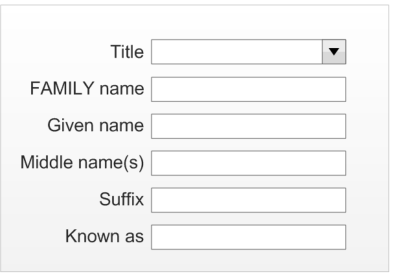
HSCIC Controlled Document

#### **1.1 Customer Need**

This section explains why the guidance has been created.

##### **1.1.1 Overview**

Patient names are displayed in multiple places within a clinical application. One example is in a
patient banner where unambiguous Patient Name display enhances patient safety and application
usability by:

 Ensuring the display of the Patient Name in a consistent and clear manner that is easy to

read, and clearly distinguishes name elements

 Ensuring quick and accurate identification of the patient

##### **1.1.2 Eliminating Inconsistencies Across Systems**

Significant inconsistencies exist in the labelling, inputting, and display of people’s names across
various clinical applications. This can result in incorrect identification of patients, leading to safety
issues and, potentially, additional staff training. Reduction of inconsistency is therefore an important
goal in itself, and the primary aim of this guidance.

##### **1.1.3 Simplified User Interface Design and Development**

Having a consistent layout and set of values for the input and display of data items in clinical
systems makes the design and development of such systems safer, easier and quicker.

#### **1.2 Scope**

This section defines the scope of this guidance document.

##### **1.2.1 In Scope**

This guidance is applicable primarily to electronic user interfaces such as those displayed on
desktop and laptop computers. However, many of the principles can be applied to paper form
design should it be required. The following items are in scope:

 **Defining the valid values for Patient Name display and input**

 **Labelling of information, including:**

 Definition of the elements of a Patient Name

 Definition of the values for each element

 How items of information are to be labelled; this will cover the label text, positioning and
any elements of styling required to differentiate labels visually from data

 **Control layout and structure, in order to achieve:**

 Optimal visibility of the values

 Easy recognition of the values in the context of the wider clinical application

 Easy recognition of data type requested for input

 Reduction of invalid entries

 **Size of input fields**, **in order to:**

 Avoid wasting screen space

 Ensure optimal display of entire data items

Page 2

Copyright ©2013 Health and Social Care Information Centre

HSCIC Controlled Document

##### **1.2.2 Out of Scope**

This section defines areas that are not covered in this guidance. Although there may be specific
risks associated with these areas that are not addressed in this guidance, it is likely that the
principles in this guidance will extend to the input and display of patient name in many of the areas
listed below.

The following items are out of scope:

 **Data storage**  - This guidance does not prescribe the format for storing data that is input or

displayed

 **Terms of use**  - This guidance does not define when an input field or display should be

presented within a system

 **Form design**  - This guidance does not prescribe the correct layout for a form, the

navigation around a form, or how these controls should be labelled

**Note**

Listing an item as out of scope does not classify it as unimportant. Project time and resource constraints
inevitably restrict what can be in scope for a particular release. It is possible that items out of scope for
this release may be considered for a future release.

#### **1.3 Dependencies and Assumptions**

Compliance with other guidance and standards is required as follows:

 The design of NHS clinical applications must conform to _Accessibility Checkpoints for NHS_

_Clinical Applications_ **{R1}** and _Accessibility for Clinical Applications_ **{R2}**

 Standards with regard to naming and identifying patients issued by the National Patient

Safety Agency (NPSA) ( _Right patient – right care_ _[1]_ and _Standardising wristbands improves_
_patient safety_ _[2]_ )

**Important**

The visual representations used within this document to display the guidance are illustrative only. Stylistic
choices are not part of this guidance and are therefore not mandatory requirements for compliance with
the guidance in this document.

#### **1.4 Key Principles**

The following key principles have shaped the guidance in this document:

 Display information according to existing standards

 Minimise opportunities for human error

 Display sufficient instructional information to support data quality

 Promote consistency across the mix of users, NHS clinical applications and care settings

 Support reliable and accurate identification of an individual patient record

 Minimise opportunities where patient-clinician relationships may be compromised through

ambiguity

1 Right patient - right care **{R3}** [: http://www.npsa.nhs.uk/EasySiteWeb/GatewayLink.aspx?alId=3234](http://www.npsa.nhs.uk/EasySiteWeb/GatewayLink.aspx?alId=3234)

2 Standardising wristbands improves patient safety **{R4}** :
[http://www.npsa.nhs.uk/EasySiteWeb/GatewayLink.aspx?alId=5346](http://www.npsa.nhs.uk/EasySiteWeb/GatewayLink.aspx?alId=5346)

Page 3

Copyright ©2013 Health and Social Care Information Centre

HSCIC Controlled Document

### 2 RECOMMENDATIONS AND GUIDANCE

The guidance provided throughout this document is based upon a programme of user research,
including:

 A desk-based research project looking at a range of information entry Web pages and

clinical applications

 A Web-based survey of 41 respondents drawn from NHS clinicians and administrative staff,

Independent Software Vendors (ISVs), community pharmacists, and NHS Connecting for
Health (NHS CFH)

 A Patient Safety Assessment

**Important:**

 The visual representations used within this document to display the guidance are illustrative only.

They are simplified in order to support understanding of the guidance points. Stylistic choices, such as
colours, fonts or icons are not part of the guidance and unless otherwise specified are not mandatory
requirements for compliance with the guidance in this document.

 This document refers to the various Patient Name inputs using consistent descriptors (‘Family Name’,

‘Given Name’ and so on). This includes the labels used within the visual representations. However,
the wording of those labels is not Mandatory but only Recommended (see section 2.5.1). It is
recognised that, where applicable and appropriate for the clinical context, implementations may use
differently worded labels. An example of alternative descriptors is used within patient wristbands
where ‘Family Name’ is replaced with ‘Last Name’ and ‘Given Name’ with ‘First Name’.

#### **2.1 Patient Name Display**

This section provides guidance for the display of a Patient Name with enough information to
distinguish it for identification purposes. Figure 4 illustrates the correct format for displaying a
Patient Name (with minimum identification attributes).

Figure 4: Patient Name Display with Minimum Attributes for Identification

##### **2.1.1 Guidance**

NID-0001 The display must present the Family Name in all uppercase letters to clearly distinguish it
from the Given Name.

NID-0002 The display must separate the Family Name and Given Name using a comma to further
establish that the Family Name is being placed first.

NID-0003 The display must include parentheses around the Title to separate and distinguish it from the
other name elements.

Mandatory

Mandatory

Mandatory

NID-0004 The display must present the name elements strictly in the order shown. Mandatory

NID-0005 The display must present all data for each specified element (Family Name, Given Name and
Title) of the Patient Name in full. Avoid truncation of information where possible.

Mandatory

NID-0006 The display must separate the presentation of Given Name and Title by a single space. Mandatory

NID-0007 The display must present the Title element in title case, for example, Sir not SIR, Mr not MR. Mandatory

NID-0008 The display must present a single pair of parentheses around the Title element, for example,
(Mr).

Copyright ©2013 Health and Social Care Information Centre

Mandatory

Page 4

HSCIC Controlled Document

NID-0009 The display must allow any free-text (up to 35 characters) to be presented in the Title
element.

NID-0010 The display must, in accordance with the UK Government Data Standards Catalogue
guidelines, omit a trailing full stop from the Title element (for example, ‘Mr’ not ‘Mr.’).

NID-0011 The display must allow the Family Name, Given Name and Title elements to present at least
the maximum field sizes given in the NHS Connecting for Health Personal Demographics
Service [3] (PDS) FS 10.00, Issue 1A, 18th January 2005 (CDT D 0222).

NID-0012 The display must allow for the Family Name and Given Name elements to consist of multiple
components. Components are constituent parts of the name element that combine with other
parts to form the element as a whole. For example, the components of the name
LIDMAN-SUN are LIDMAN and SUN and the components of Mary Jane are Mary and Jane.
Components have the following features:

 Family Name components must consist of UPPERCASE alphabetic characters only, for

example, SMITH.

 Multiple Family Name components must be separated by a hyphen or a single space, for

example, LIDMAN-SUN-DEWAR or EVANS WEST.

 Given Name components must display in title case, for example, Nadejda.

 Multiple Given Name components must be separated by a hyphen or a single space, for

example, Anne-Jorun, Nis Bank.

NID-0013 The display should allow word wrapping to occur in instances where the field length exceeds
the width allocated to it on the form. If word wrapping occurs, it should be applied only at the
end of a whole field element or at the end of a field element component, if it comprises
multiple parts (for example, Middle name(s) field).

Mandatory

Mandatory

Mandatory

Mandatory

Recommended

NID-0062 By default, include a prompt in the input boxes to indicate to a user the information required Recommended

NID-0063 Present the default prompt in an occluded form to prevent confusion with actual data input by
a user

Recommended

NID-0064 Remove the default prompt when a user begins to input data Mandatory

Table 2: General Guidance for the Use of Patient Name Input Controls

##### **2.1.2 Examples of Correct Usage**

####  Family Name, Given Name (Title) TREETAWTCHAIWONG, Lertchai (Sir)

OLIVER, James (Mr)

RUTH, Anne (Mrs)

Table 3: How to Use the Design Guide Entry

##### **2.1.3 Examples of Incorrect Usage**

Use this format to display all Patient
Names within a patient banner.

####  Family Name Given Name Title Duke James Earl Oliver Sir This example does not separate any of

the name elements, which contain
multiple components. It is impossible
to determine the Family Name, Given
Name and Title.

[3 The Personal Demographics Service: http://www.connectingforhealth.nhs.uk/demographics/pds/index_html](http://www.connectingforhealth.nhs.uk/demographics/pds/index_html)

Page 5

Copyright ©2013 Health and Social Care Information Centre

HSCIC Controlled Document

####  Family Name Given Name

Ruth Jacob

####  Family Name Given Name (Title) James Oliver Jones (Sir)

Ito Shu (Mr)

This example does not distinguish the
Given Name from the Family Name or
provide a Title, making it difficult to
determine Given Name, Family Name
and correct form of address.

These examples do not separate the
Given Name from Family Name,
making it difficult to determine what the
Given and Family Names actually are.

These examples omit a Given Name
element. Without a Given Name,
identification is difficult.

These examples omit a Family Name
element. Without a Family Name,
identification is difficult.

These examples show all elements in
the same case making it difficult to
visually separate Given and Family
Name elements. The comma,
however, provides a visual cue that
Family Name appears first.

This example shows too many name
elements, which hinder rather than aid
clarity.

This example shows only a Given and
Family Name. It does not give enough
information for a Title to be assumed.

This example shows a lack of clarity. It
is unclear if the Given Name contains
two name components or if the second
component is actually the Title.

These examples are provided in all
uppercase, making them difficult to
read.

####  Title Family Name

Family Name (Title)

####  Title Given Name

Given Name (Title)

####  Family Name, Given Name (Title)

Given Name, Family Name (Title)

####  Family Name, Given Name, Initials,

Suffix (Title)

Sario Esko (Mrs)

Mr Oliver

Oliver (Mr)

Mrs Ruth

Ruth (Mrs)

JAMES, OLIVER (SIR)

James, Oliver (Sir)

OLIVER, James Earl, E, MBE MSc
BSc (Sir)

####  Family Name, Given Name  CHARLIE, Oliver  Family Name, Given Name Title TREETAWTCHAIWONG,

Lertchai Sir

####  Family Name, GIVENNAME (Title) TREETAWTCHAIWONG,

LERTCHAI (SIR)

RUTH, JACOB (MRS)

Table 4: How Not to Use the Design Guide Entry

##### **2.1.4 Rationale**

This recommendation provides the following benefits:

 Conforms to the person Title display guidance and maximum field sizes given in the PDS

and the UK Government Data Standards Catalogue (GDSC).

 Conforms with the proposed National ID card, which uses the construct of Family Name

first, with Family Name provided in uppercase

 Ensures a consistent visual representation for Patient Name within the patient banner

across NHS clinical applications.

 Provides a clear and readable format.

 Identifies clearly and uniquely each of the name elements (Family Name, Given Name and

Title).

Page 6

Copyright ©2013 Health and Social Care Information Centre

HSCIC Controlled Document

 Promotes patient safety by enabling doctors, clinicians, health professionals and

non-clinical staff to read patients' names quickly and accurately.

The recommended layout for Patient Name provides the best format because it lends itself to
consistency and clarity, with a clear distinction between individual name elements. This increases
patient safety by minimising the potential for reading error and providing accurate confirmation of
the patient's identity.

The recommended layout achieves this through:

 Presentation of the Family Name in all uppercase to clearly distinguish it from the Given

Name.

 Separation of the Family Name and Given Name using a comma to further establish that

the Family Name is placed first.

 Inclusion of parentheses around the Title to separate and distinguish it from the other name

elements.

_**2.1.4.1**_ _**Accessibility**_

The recommended format for the Patient Name display should present no barriers to accessibility.

Consistent adherence to the Patient Name display format aids accessibility as it makes the name
elements (Family Name, Given Name and Title) uniquely identifiable and recognisable whenever
they are encountered; both individually, and as part of the entire name. It also makes the name
elements distinguishable from other elements. From an accessibility perspective, this means that
even when the name is accessed out of context (for example, by a screen reader), it will still be
easily recognisable as a name, and that each element of that name can easily be identified. Using
distinct name elements in this way also means that users with imperfect vision will still be able to
correctly identify them.

Screen reader software cannot pronounce highly variable items, such as names, accurately on all
occasions. This however should not present any interpretation problems, as each of the name
elements will be identifiable and recognisable by consistent use. If pronunciation by the screen
reader causes problems, the user can spell out the name, letter by letter, using features of the
screen reader software.

The Family Name element is presented in all uppercase letters. It is widely recognised that this
decreases reading speed for all users, but it can cause particular problems for people with reading
difficulties such as Dyslexia. Despite this, displaying the Family Name element in all uppercase is
unlikely to present any accessibility problems or reading issues, for the following reasons:

 The decrease in reading speed caused by all uppercase letters is due to a disruption of the

recognition of whole word pattern, which occurs naturally for familiar words when seen
using the mixed case representation. Since Family Names are highly variable and many are
unusual, they do not fall into the category of known and familiar words, and so will not be
affected.

 Difficulties with reading uppercase letters only occur when it is used extensively. The

Family Name element is usually relatively short.

As the Family Name is a vital element for patient identification, any slight reduction in reading
speed would actually be seen to confer an advantage. The clinician will be more likely to interpret
the name correctly, rather than make mistakes caused by false recognition.

_**2.1.4.2**_ _**Existing Standards**_

Existing standards for person name display are limited. Government standards focus primarily on
the structure of a name, but not on the visual display of the structure. As such, these have been of
limited use for defining recommendations.

Page 7

Copyright ©2013 Health and Social Care Information Centre

HSCIC Controlled Document

The following sources (as described in more detail below) provide recommendations in relation to
name display:

 NPSA standards for naming and identifying patients ( _Right patient – right care_ **{R3}** and

_Standardising wristbands improves patient safety_ **{R4}** ).

 NHS Data Model and Dictionary

 NHS Connecting for Health Personal Demographics Service (PDS)

 UK Government Data Standards (UK GDSC)

 NHS Connecting for Health

 NHS Message Implementation Manual (MIM)

 Various Public Sector organisations

 Academic research

**NPSA Standardising Wristbands Improves Patient Safety**

The Safer Practice Notice no.24, published 3 July 2007, sets out actions for the NHS when using
patient wristbands including the core identifiers required on wristbands. From 18 July 2008 the
patient name descriptors to be used on wristbands are as follows:

 **Last name**

 **First name**

**NHS Data Model and Dictionary**

The NHS Data Model and Dictionary provides a reference point for assured information standards
to support health care activities within the NHS in England. During the production of this guidance
references to field length and parameters were taken from the NHS Data Model and Dictionary,
and were correct at the time of writing.

**NHS Connecting for Health Personal Demographics Service (PDS)**

The Personal Demographics Service defines the data schema for patient demographic information
held by the NHS. This schema will be the basis for a single patient record for England.

The set of data values within the PDS schema defines a data storage standard for name elements
as follows:

 **Person Title** **(35 Characters)**  - Title in the recommendation

 **Person Given name** **(40 Characters)**  - Given name in the recommendation

 **Person Family name** **(40 Characters)**  - Family name in the recommendation

The Patient Name display recommendation is based on the data storage requirements defined for
PDS as these take priority over other contradictory standards, such as UK GDSC (below).

**UK Government Data Standards Catalogue (UK GDSC)**

The UK Government Data Standards Catalogue defines a data storage standard for name
elements as follows:

 **Person Title** **(35 Characters)**  - Title in the recommendation

 **Person Given name** **(35 Characters)**  - Given name in the recommendation.

 **Person Family name** **(35 Characters)**  - Family name in the recommendation

**Note**

The UK GDSC differs from PDS for Given name and Family name data storage requirements in that UK
GDSC are 5 characters shorter for these data elements. This difference in standards may pose a potential

Page 8

Copyright ©2013 Health and Social Care Information Centre

HSCIC Controlled Document

risk for patient safety. There might be a miscommunication between systems that use different standards
and there is a potential for truncation or loss of information.

The UK GDSC also specifies that while the full available range of generally recognised titles is
permitted, if any of these titles are used, the value must conform to the specified format, which is
an appropriate abbreviated form with no full stop.

**NHS Connecting for Health**

NHS Connecting for Health has assumed responsibility for the NHS Data Dictionary. The NHS
Data Dictionary definitions for person name data attributes (Person Title, Person Given name,
Person Family name) refer directly to the UK GDSC, fully endorsing the standards defined there.
The only exception is Person Title, which does not list ‘Miss’ as a generally recognised Title.

**NHS NPfIT Message Implementation Manual (MIM)**

The MIM definition of a person name is used to express either an unstructured name as string
content of the element, or a structured name as a set of **FAM**, **GIV**, **PFX** and **SFX** child elements.
Where:

 FAM = Person Family name

 GIV = Person Given name

 PFX = Person Title

 SFX = Person Suffix

**Public Sector Organisations**

Name identifiers exist within certain UK public sectors, for example, Passport, National ID card,
Driving Licence and Proof of Age ID. There is a lack of consistency across the display standard for
these identifiers; however, they all use uppercase letters for the Family name element. This is
therefore a common convention that supports our recommendations.

 The National ID card shows a person’s name as **‘FAMILY NAME Given name’**

 The Passport card shows a person’s name as **‘FAMILY NAME GIVEN NAME’** (displayed

on separate lines)

 The Driving Licence Card shows a person’s name as **‘FAMILY NAME GIVEN NAME**

**MIDDLE NAMES’** (with **FAMILY NAME** appearing first on a separate line)

 The Proof of ID card shows a person’s name as **‘GIVEN NAME FAMILY NAME’** (displayed

on separate lines)

Public sector organisations have many examples of name layouts for forms and lists. These do not
show consistency or definitive ‘common practice’. However, most telephone directories (online or
printed) and CRM databases list Family name first (see BT [®] directory services online [4] ).

**Academic Research**

There are some academic studies and written recommendations on the subject of reading patterns
and pattern recognition. In general, these studies conclude that there are benefits for consistent
representation of data in a recognised pattern, as this enhances familiarity and recognition of
component parts. The _Developing Quality Technical Information_ handbook by IBM [®] (2nd Edition)
**{R6}** is one such source.

Existing standards for person name display are limited, and no definitive ‘common practice’ or
consistency exists. The recommendation for Patient Name display across NHS clinical applications

[4 The Phone Book: http://www.thephonebook.bt.com/publisha.content/en/search/residential/search.publisha](http://www.thephonebook.bt.com/publisha.content/en/search/residential/search.publisha)

Page 9

Copyright ©2013 Health and Social Care Information Centre

HSCIC Controlled Document

is therefore based on usability research, readability principles and the need for consistency, clarity
and easy identification of the patient.

This recommendation was adopted on the basis of the following justifications:

 Promotion of patient safety by presenting the name in a clear and consistent format that

allows the clinician to quickly identify the patient

 Use of an easily readable format

 Provision of a clear distinction of the elements that are most important for identification and

formal communication, that is, Given name, Family name and Title

##### **2.1.5 Optional Data Fields**

This section gives the rationale behind the inclusion of the optional data fields.

**Note**

The optional data fields described in this section are not exclusive. It is acknowledged that from time to
time other Patient Name fields may be required. As such circumstances cannot be anticipated, this
document provides no specific guidelines. It is up to the applications developer concerned to design an
appropriate solution, ensuring that there is no compromise of patient safety.

**Preferred Name (Requested Name)**

The NHS PDS FS 10.00 and the UK Government Data Standards Catalogue (UK GDSC) include a
Person Requested Name as an element of the Person Name. The UK GDSC defines Person
Requested Name as “ _The name a person wishes to use which is different from the values in Title,_
_Given name(s), Family name and Name Suffix fields_ ”. This would include, for example, a
preference to be addressed by middle name rather than Given Name.

**Nick Name (Alias or Known As)**

The NHS PDS FS 10.00 and the UK GDSC also include an Alias/Known As as an element of the
Person Name. Where the Preferred name is a name ‘type’ (for example, a desired alias consisting
of the minimum data set for a Name) it should be displayed as a full name display control without
needing a separate field in an existing data set. However, where the value is more a single
Nickname, it can be attached to an existing name control as an optional field, for example, ‘JohnnyBoy’.

**Suffixes**

In most cases, the suffix is not needed as it does not serve as a primary means of identifying or
addressing the patient and can quickly become too long, taking up valuable space in locations such
as the banner (for example, Rt Hon. John Doe, K.G., K.B.E., M.B., B.Chir). The incIusion of such
unnecessary data on screen only serves to distract from the important data there.

However, there are times when the use of a suffix is important:

 When relevant for patient identification (for example, ‘Jnr’ or ‘the third (III)’)

 When related to the correct, formal way to set out a name (for example, in a letter)

Although a minimal requirement, this demonstrates a need for the optional use of a suffix. The
presence of a check box to select a) “show on screen” or b) “use on letterhead” provides a user
with the ability to use where appropriate.

**Middle Names and Initials**

It is considered that middle name or initials are not often required as they:

 Do not serve as a primary means for identifying or addressing the patient

 May distract from quickly identifying the key name elements

Page 10

Copyright ©2013 Health and Social Care Information Centre

HSCIC Controlled Document

 May result in the Patient Name becoming overlong

However, they do need to be entered, where known, in the event that the primary identifiers are not
sufficient to produce a unique match.

#### **2.2 Patient Name Input Data Elements**

A Patient Name input control can consist of up to six constituent fields with labels; Title, Family
Name, Given Name, Middle name, Suffix, and Preferred name. The minimum data required to
make the name useful is considered to be Title, Family Name and Given Name. Middle name(s),
Preferred name and Suffix are considered to improve data quality, however they are not
mandatory.

##### **2.2.1 Title**

The Title field is designed as a drop-down combo-box (as shown in Figure 5). This design allows
the developer to assist the user in the input of a pre-defined set from a drop-down list, whilst also
allowing the flexibility of free-text input to augment the complex list of possible options.

Figure 5 displays a Patient Name input control in a default state (for example, an InForm design
with prompts and no data entered). Figure 6 displays the Title input element during a simple
interaction.

Figure 5: InForm Design (All Six Fields are Visible)

Figure 6: InForm Design with Title Drop-Down Clicked

The input box should allow a maximum of 35 characters in order to support the recognised data
entry requirements. The minimum width of the input box should be decided in accordance with the
maximum length of the presets available in the drop-down box but should never be less than four
characters (due to a standard requirement being to enter ‘Miss’).

Page 11

Copyright ©2013 Health and Social Care Information Centre

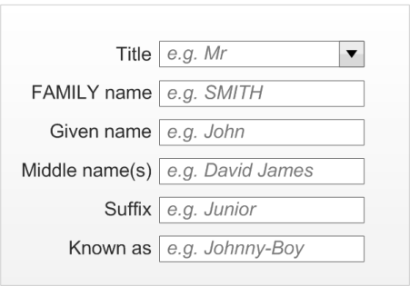

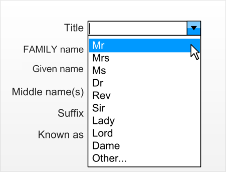
HSCIC Controlled Document

_**2.2.1.1**_ _**Guidance**_

NID-0014 Input control must allow a maximum of 35 characters. Mandatory

NID-0015 Minimum visual width of the input box must display four characters. Mandatory

NID-0016 Suggested values are:

 ‘Mr’‘Mrs’

 ‘Ms’

 ‘Dr’

 ‘Rev’

 ‘Sir’

 ‘Lady’

 ‘Lord’

 ‘Dame’

 ‘Other...’

NID-0017 One value should allow the user to invoke free-text input mode (for example ‘Other...’ in the
illustrations).

Recommended

Recommended

NID-0018 Input box should contain a relevant prompt, for example, Mr. Recommended

NID-0019 Input control should be in the form of a drop-down combo-box. Recommended

Table 5: Guidance for the Use of Title in Patient Name Input Controls

_**2.2.1.2**_ _**Other Usage Step-Through of Title Input**_

The last item in the list indicates that free-text entry is possible and therefore assists the user in
finding this functionality should they require it (for example, ‘Other...’). The suggested location is at
the end of the list because the user has searched the other options and not found what they are
looking for.

Figure 7, Figure 8 and Figure 9 display this user behaviour in sequential stages:

Figure 7: User Chooses the Other Choice

Page 12

Copyright ©2013 Health and Social Care Information Centre

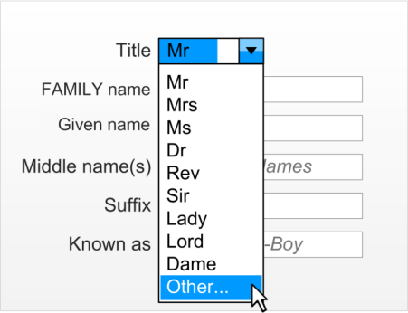
HSCIC Controlled Document

Figure 8: Focus is Placed Back in the Free-text Entry Box

Figure 9: User Enters a Non-Preset Value

##### **2.2.2 Family Name**

The Family Name input is in the form of a free-text entry box that accepts a maximum of 35
characters. Based upon average name length calculations, it is recommended that the width of the
box should never display less than eight characters and should have an optimal display length of
14 characters. At the optimal length, the box should be able to display over 99% of expected values
and even at the minimum length, it is expected that over 95% of names will be fully displayed. The
Family Name will be entered in the case chosen by the user (as they enter it), however, when the
entered value is displayed, it will all be in uppercase.

Figure 10 contains two examples of a user entering the Family Name in varieties of lowercase and
uppercase. Figure 11 demonstrates that the control will reformat the data consistently to
uppercase, when focus leaves the input field.

Page 13

Copyright ©2013 Health and Social Care Information Centre

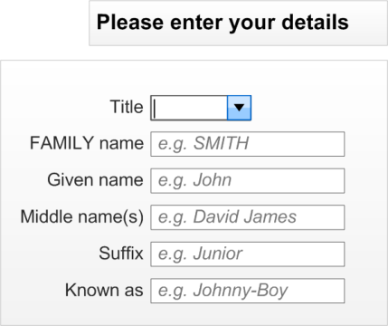

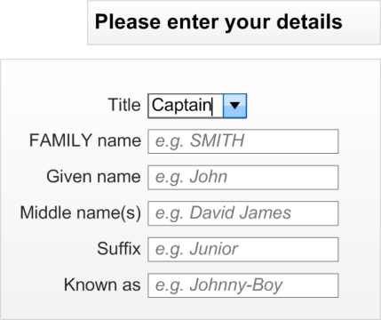
HSCIC Controlled Document

Figure 10: Two Examples of Users Entering Family Name in the Case they Believe is Most Appropriate

Figure 11: When the User moves to the Next Cell the Family Name Displays in Uppercase

_**2.2.2.1**_ _**Guidance**_

NID-0020 Family Name input must be via a free-text entry box. Mandatory

NID-0021 Family Name input box must accept a maximum of 35 characters. Mandatory

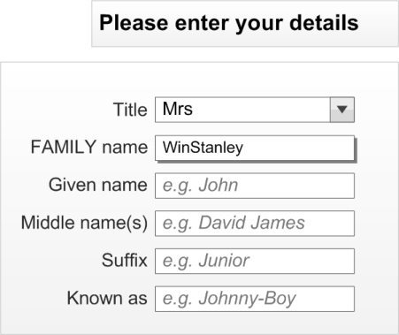

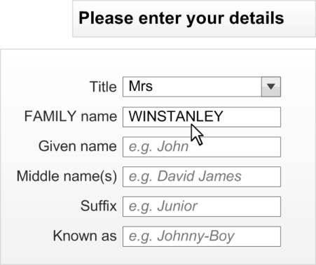

NID-0022 Family Name input box should be capable of displaying a minimum of eight characters
without occlusion.

Recommended

NID-0023 Family Name input box should optimally display 14 characters without occlusion. Recommended

NID-0024 Family Name input box should contain a relevant prompt in its default state
(for example, ‘e.g. SMITH’) in occluded form.

Recommended

NID-0025 When displaying a Family Name value, the characters should all be in uppercase. Recommended

Table 6: Guidance for the Use of Family Name in Patient Name Input Controls

Page 14

Copyright ©2013 Health and Social Care Information Centre

HSCIC Controlled Document

##### **2.2.3 Given Name**

The Given Name input is in the form of a free-text entry box that accepts a maximum of 35
characters. Based upon average UK name length calculations, it is recommended that the box be
wide enough to display at least eight characters and should have an optimal width of 14 characters.
At this optimal width, the box would be able to fully display over 99% of expected values. At the
minimum width, it is expected that over 95% will be fully displayed. The Given Name will be entered
in the case chosen by the user (as they enter it), however, when the value is displayed, the first
character will be in uppercase.

_**2.2.3.1**_ _**Guidance**_

NID-0026 Given Name input must be via a free-text entry box. Mandatory

NID-0027 Given Name input box must accept a maximum of 35 characters. Mandatory

NID-0028 Given Name input box should be capable of displaying a minimum of eight characters without
occlusion.

Recommended

NID-0029 Given Name input box should optimally display 14 characters without occlusion. Recommended

NID-0030 Given Name input box should contain a relevant prompt in its default state
(for example, ‘e.g. John’) in occluded form.

Recommended

NID-0031 When displaying a Given Name value the first character should be in uppercase. Recommended

Table 7: Guidance for the Use of Given Name in Patient Name Input Controls

##### **2.2.4 Middle Name(s)**

The Middle name input is in the form of a free-text entry box that accepts a maximum of 100
characters. This length has been chosen due to the requirement for this input to accept multiple
entries. This maximum allows a significant number of entries (at least 18 of our standard
7-character Given Names) to be entered. The Middle name will be entered and displayed in the
case chosen by the user (as they enter it).

_**2.2.4.1**_ _**Guidance**_

NID-0032 Middle name input must be via a free-text entry box. Mandatory

NID-0033 Middle name input box must accept a maximum of 100 characters. Mandatory

NID-0034 Middle name input box should be capable of displaying a minimum of eight characters without
occlusion.

Recommended

NID-0035 Middle name input box should optimally display 7 characters without occlusion. Recommended

NID-0036 Middle name input box should contain a relevant prompt in its default state
(for example, ‘e.g. David James’) in occluded form.

Table 8: Guidance for the Use of Middle Name(s) in Patient Name Input Controls

##### **2.2.5 Suffix**

Recommended

The Suffix input is in the form of a free-text entry box that accepts a maximum of 35 characters.
There are fewer mandatory requirements for this field because it is rarely used. The entry box
should be wide enough to display at least eight characters. The Suffix will be entered and displayed
in the case chosen by the user (as they enter it).

Page 15

Copyright ©2013 Health and Social Care Information Centre

HSCIC Controlled Document

_**2.2.5.1**_ _**Guidance**_

NID-0037 Suffix input must be via a free-text entry box. Mandatory

NID-0038 Suffix input box must accept a maximum of 35 characters. Mandatory

NID-0039 Suffix input box should be capable of displaying a minimum of eight characters without
occlusion.

Recommended

NID-0040 Suffix input box should optimally display 14 characters without occlusion. Recommended

NID-0041 Suffix input box should contain a relevant prompt when in its default state
(for example, ‘e.g. Junior’) in occluded form.

Table 9: Guidance for the Use of Suffix in Patient Name Input Controls

##### **2.2.6 Preferred Name**

Recommended

The Preferred name input is in the form of a free-text entry box that accepts a maximum of 35
characters. The box should be wide enough to display at least eight characters and should have an
optimal width of 14 characters. The Preferred name will be entered and displayed in the case
chosen by the user (as they enter it).

_**2.2.6.1**_ _**Guidance**_

NID-0042 Preferred name input must be via a free-text entry box. Mandatory

NID-0043 Preferred name input box must accept a maximum of 35 characters. Mandatory

NID-0044 Preferred name input box should be capable of displaying a minimum of eight characters
without occlusion.

Recommended

NID-0045 Preferred name input box should optimally display 14 characters without occlusion. Recommended

NID-0046 Preferred name input box should contain a relevant prompt in its default state
(for example, ‘e.g. Johnny-Boy’) in occluded form.

Table 10: Guidance for the Use of Preferred Name in Patient Name Input Controls

##### **2.2.7 Examples of Correct Usage**

Recommended

####  Title to accept 35

characters

####  Family Name to

accept 35
characters

####  Given Name to

accept 35
characters

####  Middle name(s) to

accept 100
characters

####  Suffix to accept 35

characters

‘abcdefghijklmnopqrstuvwxyzABCDEFGHI’ Required data length for PDS.

‘abcdefghijklmnopqrstuvwxyzABCDEFGHIJKLMN’ Required data length for PDS.

‘abcdefghijklmnopqrstuvwxyzABCDEFGHIJKLMN’ Required data length for PDS.

‘abcdefghijklmnopqrstuvwxyzABCDEFGHI’ Required data length for PDS.

Page 16

‘abcdefghijklmnopqrstuvwxyzABCDEFGHIJKLMNOPQRSTUVWXYZ
abcdefghijklmnopqrstuvwxyzABCDEFGHIJKLMNOPQRSTUVWXYZ
abcdefghijklmnopqrstuvwxyzABCDEFGHIJKLMNOPQRSTUVWXYZ
abcdefghijklmnopqrstuvwxyzABCDEFGHIJKLMNOPQRSTUVWXYZ
abcdefghijklmnopqrstuvwxyzABCDEFGHIJKLMNOPQRSTUV’

Suggested length to allow for
multiple middle names to be
entered.

Copyright ©2013 Health and Social Care Information Centre

HSCIC Controlled Document

####  Preferred name to

accept 35
characters

####  Minimum data set

of; Title, Family
Name, and Given
Name

‘abcdefghijklmnopqrstuvwxyzABCDEFGHI’ Suggested field length for a
single nickname style entry.

**Note**

A desired full name comes
under a name type rather
than name field.

This data set has been
identified as the minimum
required to ensure data
quality.

Table 11: Examples of Correct Implementation of Patient Name Guidance

##### **2.2.8 Examples of Incorrect Usage**

####  Input fields do not display the

majority (over 95%) of inputs,
as required

####  Input fields do not accept the

required input characters (for
example, 35 characters for
Family Name)

####  Input control does not control

all three fields for the minimum
data set (Title, Family Name,
and Given Name)

####  Title drop-down does not have

an option to encourage the
user to enter a different entry,
if a more applicable one is not
in the list

Table 12: Examples of Incorrect Implementation of Patient Name Guidance

##### **2.2.9 Rationale**

Not including all of the minimum data set in an input control
could compromise patient safety and data quality.

The user should be encouraged to give the best quality of
data available. They may not know that free-text entry is
possible if an alternative option (for example, ‘Other’) is not in
the list, and simply pick the most applicable one there.

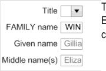

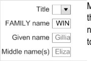

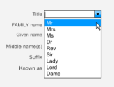

The lengths of the input values for the Title, Family Name, Given Name and Suffix input fields have
been calculated based upon the rationale outlined in the Patient Name display requirements in
section 2.1.4. The length of the Middle name(s) input field is a suggestion based upon the
requirement for multiple name entries into this field. The length of the Preferred name is based
upon the requirement to display a single nickname rather than a full name comprised of multiple
elements.

The suggested lengths of the input boxes are based on the usability heuristic **{R5}** stating that each
“text field should be large enough to accommodate the majority of anticipated entries without
scrolling”. The expected values were assessed and applied to the default length size. The minimum
sizes took this requirement but also looked at the requirement to restrict the control footprint (space
used on a screen) due to factors outside of the control (for example, restricted space on a form).

Page 17

Copyright ©2013 Health and Social Care Information Centre

HSCIC Controlled Document

##### **2.2.10 Mandatory and Optional fields**

The minimum data set required to safely input a complete patient-safe name is as follows:

 Family Name

 Given Name

The following fields are optional:

 Title

 Middles name(s)

 Suffix

 Preferred name

#### **2.3  InForm Input Design**

The InForm layout is considered the most desirable layout from a patient safety and usability
perspective. It should therefore be the default choice for the ISV when developing a Patient Name
input control. Figure 12 displays a typical InForm style input control (with all six input fields):

Figure 12: InForm Design (All Six Fields Are Visible)

##### **2.3.1 Guidance**

NID-0047 InForm field controls must be aligned on the left edge of the input boxes. Mandatory

NID-0048 InForm field controls (where they exist) must be placed underneath each other in the
following order:

 Title

 Family Name

 Given Name

 Middle name(s)

 Suffix

 Known as

Table 13: Guidance for the Use of InForm Design in Patient Name Input Controls

Copyright ©2013 Health and Social Care Information Centre

Mandatory

Page 18

HSCIC Controlled Document

##### **2.3.2 Examples of Correct Usage**

####  All input fields are

left aligned
underneath each
other in the
specified order

Table 14: Correct Patient Name Input InForm Design Examples

##### **2.3.3 Examples of Incorrect Usage**

The InForm control is reported by users to be
the preferred design for readability, usability,
and familiarity purposes.

####  Fields are not left

aligned to each
other

####  Fields not in the

correct order

Table 15: Incorrect Patient Name Input InForm Design Examples

##### **2.3.4 Rationale**

Left aligning the controls aids readability for the
user. Not left aligning them makes the control
difficult to use and understand.

The order of the fields should reflect the
display and not contradict it. Errors will occur if
they are different.

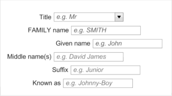

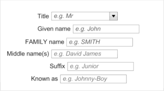

This control allows the user to input a person name in its constituent parts. It is designed to
increase patient safety by encouraging data quality as much as is practicable without losing
flexibility.

Each individual part is referred to as a field. The minimum data set constitutes those fields that are
required to safely identify a patient. The remaining fields can optionally be present in the control (for
example, the developer can choose which fields they wish to use).

The InForm design is considered to be the most desirable for a majority of users due to familiarity
and readability. It should therefore be the first choice of a designer.

Page 19

Copyright ©2013 Health and Social Care Information Centre

HSCIC Controlled Document

#### **2.4 InLine Input Design**

The InLine style design has the same fields as the InForm control but they are arranged
horizontally rather than vertically. Figure 13 displays a typical InLine style control (with all six input
fields included). Figure 14 displays how the control should wrap at whole elements, when
necessary, and that subsequent rows should align to the left edge of the first input field.

Figure 13: InLine Design (With All Six Fields Visible)

Figure 14: InLine Design Wrapped onto Two Lines (Withh All Six Fields Visible)

##### **2.4.1 Wrapping Behaviour**

The inline control should follow the wrapping behaviour illustrated in Figure 15. The basic principles
are:

 Wrap at whole fields

 Sentence style wrapping (for example, no alignment other than subsequent lines start at the

same point horizontally as the first item in the first line, therefore they are left aligned)

Page 20

Copyright ©2013 Health and Social Care Information Centre

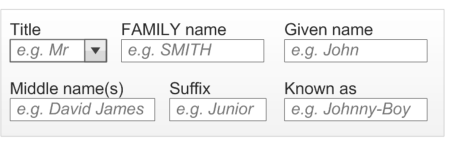

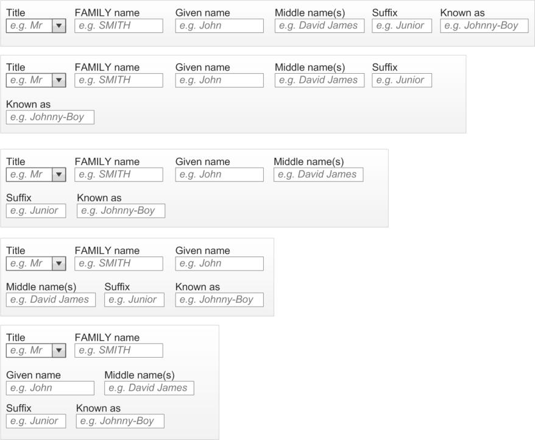
HSCIC Controlled Document

Figure 15: InLine Wrapping Behaviour (Examples Show All 6 Input Fields)

##### **2.4.2 Guidance**

NID-0049 Ensure wrapping only occurs on whole fields. Mandatory

NID-0050 Correct presentation order is:

 Title

 Family Name

 Given Name

 Middle name(s)

 Suffix

 Known as

Mandatory

NID-0051 InLine design choice should only be used when InForm has been considered undesirable. Recommended

Table 16: Guidance for the Use of InLine Design in Patient Name Input Controls

##### **2.4.3 Examples of Correct Usage**

####  Field input

controls only
wrapped at
dividing space

####  Fields in correct

order, to reinforce
display format

Table 17: Correct Patient Name Input Wrapping and Order Examples

##### **2.4.4 Examples of Incorrect Usage**

Fields must not be broken because this can
lead to errors in reading the values and
understanding the control.

The user will assume the input and display
formats will be identical and changing these
orders can lead to input error from the user.

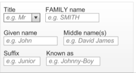

####  Fields broken

across a field

####  Fields in wrong

order

Table 18: Incorrect Patient Name Input Wrapping and Order Examples

Fields must remain intact to assist the user in
understanding the control and the data.

The order of the control input should assist the
user in understanding how it will be displayed,
therefore not confusing the user as to the
order, for example, Family Name, then Given
Name.

Page 21

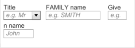

Copyright ©2013 Health and Social Care Information Centre

HSCIC Controlled Document

##### **2.4.5 Rationale**

This control allows the user to input a person name in its constituent parts. It is designed to
increase patient safety by encouraging data quality as much as is practicable without losing
flexibility.

The InLine style should be seen as the second choice for an ISV, when the InForm design has
been considered undesirable for a particular form design due to factors such as space and
precedent.

#### **2.5 Instructional Text**

This section explains the instructional text assistance to be considered when constructing the input
controls.

##### **2.5.1 Field Labels**

Each field used to make up the name input control must have a label associated with it to inform
the user what is required of them. The location of these labels are related to the layout style of the
input control selected by the developer and are displayed in Figure 16 and Figure 17.

Figure 16: Label (Title) for a Field in the InForm Style

Figure 17: Label (Title) for a Field in the InLine Style

These are the recommended field labels:

 **Title:** "Title"

 **Family Name:** "Family Name"

 **Given Name:** "Given Name"

 **Middle name:** "Middle name(s)"

 **Suffix:** "Suffix"

 **Preferred name:** "Known as"

Page 22

Copyright ©2013 Health and Social Care Information Centre

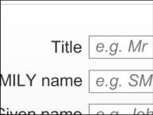

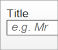
HSCIC Controlled Document

_**2.5.1.1**_ _**Guidance**_

NID-0052 Each field in a name input control must have an associated label. Mandatory

NID-0053 Labels must be programmatically linked to their associated input field. Mandatory

NID-0054 Label values should be:

 **Title:** "Title"

 **Family Name:** "Family Name"

 **Given Name:** "Given Name"

 **Middle name:** "Middle name(s)"

 **Suffix:** "Suffix"

 **Preferred name:** "Known as"

Table 19: Guidance for the Use of Field Labels in Patient Name Input Controls

_**2.5.1.2**_ _**Examples of Correct Usage**_

Recommended

####  Correct labelling

Table 20: Correct Patient Name Input Control Label Formatting Examples

_**2.5.1.3**_ _**Examples of Incorrect Usage**_

Labels are correct for the field associated to
them.

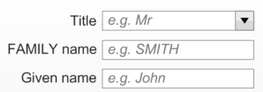

####  No label for the

different input
fields

Table 21: Incorrect Patient Name Input Control Label Formatting Examples

_**2.5.1.4**_ _**Rationale**_

Input controls with more than a single input
field require the use of labels to ensure the
user understands what is required.

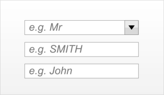

Controls that consist of multiple input fields require clear labelling to assist the user in
understanding what input is required and where.

The guidelines follow the NPSA standards for naming and identifying patients ( _Right patient – right_
_care_ **{R3}** and _Standardising wristbands improves patient safety_ **{R4}** ).

Page 23

Copyright ©2013 Health and Social Care Information Centre

HSCIC Controlled Document

##### **2.5.2 Prompts**

The controls could utilise a ‘prompt’ style design to give the clearest indication to the user of what is
expected in which input box, without increasing the screen footprint of the design. This is displayed
in Figure 18. The prompts should be visible until data is placed inside the control (either by the user
or a system). Some suggested default values are:

 **Title:** "e.g. Mr"

 **Family Name:** "e.g. SMITH"

 **Given Name:** "e.g. John"

 **Middle name(s):** "e.g. David James"

 **Suffix:** "e.g. Junior"

 **Known as:** "e.g. Johnny-Boy"

Figure 18: Example of Input Control with Prompts

_**2.5.2.1**_ _**Guidance**_

NID-0055 Each field in a name input control should have an associated prompt. Recommended

NID-0056 Prompts for Family Name should be capitalised. Recommended

NID-0057 All prompts except Family Name should have sentence style capitalisation. Recommended

NID-0058 Prompt values should be:

 **Title:** "e.g. Mr"

 **Family Name:** "e.g. SMITH"

 **Given Name:** "e.g. John"

 **Middle name(s):** "e.g. David James"

 **Suffix:** "e.g. Junior"

 **Known as:** "e.g. Johnny-Boy"

Recommended

NID-0059 Prompts should be lighter in weight and colour than the input text, and italicised. Recommended

Table 22: Guidance for the Use Of Prompts in Patient Name Input Controls

_**2.5.2.2**_ _**Examples of Correct Usage**_

####  Each input field

has an associated
prompt

####  Each prompt text

is in a lighter
colour and
italicised

####  Each prompt text

is italicised

The prompt text reinforces the labels as
instructional text for the user.

Prompts are of a lighter colour to inform the
user that it is a prompt and not a valid data
value.

The italicised format reinforces the fact that it
is a prompt and not a valid data value.

Page 24

Copyright ©2013 Health and Social Care Information Centre

HSCIC Controlled Document

####  Family Name

input field has the
prompt capitalised

####  Given Name has

the prompt with
the first letter
capitalised

Table 23: Correct Patient Name Input Control Prompt Formatting Examples

_**2.5.2.3**_ _**Examples of Incorrect Usage**_

The capitalisation of the Family Name prompt
assists the user by reinforcing the Family
Name format for display.

The prompts should reinforce the desired entry
format and for the UK, an instance of a Given
Name beginning with a lowercase letter has
not been discovered.

####  Prompts are

formatted like a
real entry

####  Family Name

input field has the
prompt not fully in
uppercase

####  Given Name does

not have the
prompt with the
first letter in
uppercase

Table 24: Incorrect Patient Name Input Control Prompt Formatting Examples

##### **2.5.3 Tooltips**

Users may incorrectly think that an entry has
been made in the box.

Users are not informed as to the correct entry
format of Family Name.

Users are not informed as to the correct entry
format of Given Name.

The controls could use tooltips to give the user more verbose instructions than can be achieved in
a prompt. Suggested default values are:

 **Title:** "Select a Title from the list or simply type in a different Title" (illustrated in Figure 19)

 **Family Name:** "Enter the person’s Family Name (surname)"

 **Given Name:** "Enter the person’s Given Name (forename or Christian name)"

 **Middle name(s):** "Enter the person’s middle name(s)"

 **Suffix:** "Enter the person’s suffix (e.g. ‘Junior’ or ‘The Third’)"

 **Known as:** "Enter the name a person likes to referred to as"

Figure 19: Example Tooltip Style Instructional Text

Page 25

Copyright ©2013 Health and Social Care Information Centre

HSCIC Controlled Document

_**2.5.3.1**_ _**Guidance**_

NID-0060 Each field in a name input control should have instructional text (for example, a tooltip). Recommended

NID-0061 Tooltip values should be:

 **Title:** "Select a Title from the list or simply type in a different Title"

 **Family Name:** "Enter the person’s Family Name (surname)"

 **Given Name:** "Enter the person’s Given Name (forename or Christian name)"

 **Middle name(s):** "Enter the person’s middle name(s)"

 **Suffix:** "Enter the person’s suffix name (e.g. ‘Junior’ or ‘The Third’)"

 **Known as:** "Enter the name a person likes to referred to as"

Table 25: Guidance for the Use of Tooltips in Patient Name Input Controls

_**2.5.3.2**_ _**Examples of Correct Usage**_

Recommended

####  Standard tooltip

presentation

####  Recommended

text used

Table 26: Correct Patient Name Input Control Tooltip Formatting Examples

Looks and behaves as a conventional tooltip.

Uses the recommended tooltip value.

Page 26

Copyright ©2013 Health and Social Care Information Centre

HSCIC Controlled Document

### 3 DOCUMENT INFORMATION

#### **3.1 Terms and Abbreviations**

CUI Common User Interface

GDSC Government Data Standards Catalogue

ISV Independent Software Vendor

MIM Message Implementation Manual

NHS National Health Service

NPSA National Patient Safety Agency

NHS CFH NHS Connecting for Health

PDA Personal Digital Assistant

PDS Personal Demographic Service

UI User Interface

Table 27: Terms and Abbreviations

#### **3.2 Definitions**

NHS Entity Within this document, defined as a single NHS organisation or group that is operated within a single
technical infrastructure environment by a defined group of IT administrators.

The Authority The organisation implementing the NHS National Programme for IT (currently NHS Connecting for
Health)

Current best practice Current best practice is used rather than best practice, as over time best practice guidance may
change or be revised due to changes to products, changes in technology, or simply the additional
field deployment experience that comes over time.

Table 28: Definitions

#### **3.3 Nomenclature**

This section shows how to interpret the different styles used in this document to denote various
types of information.

##### **3.3.1 Body Text**

Code `Monospace`

Script

Other markup languages

Interface dialog names Bold

Field names

Controls

Page 27

Copyright ©2013 Health and Social Care Information Centre

HSCIC Controlled Document

Folder names title case

File names

Table 29: Body Text Styles

##### **3.3.2 Cross References**

Current document – sections Section number only

Current document – figures/tables Caption number only

Other project documents _Italics_ and possibly a footnote

Publicly available documents _Italics_ with a footnote

External Web-based content _Italics_ and a hyperlinked footnote

Table 30: Cross Reference Styles

#### **3.4 References**

**R1.** NHS CUI Design Guide Workstream – Accessibility Checkpoints for NHS Clinical Applications 1.0.0.0

**R2.** NHS CUI Design Guide Workstream – Accessibility for Clinical Applications 1.0.0.0

**R3.** NPSA, Right patient - right care
[http://www.npsa.nhs.uk/EasySiteWeb/GatewayLink.aspx?alId=3234](http://www.npsa.nhs.uk/EasySiteWeb/GatewayLink.aspx?alId=3234)

**R4.** NPSA Safer Practice Notice, Standardising wristbands improves patient safety
[http://www.npsa.nhs.uk/EasySiteWeb/GatewayLink.aspx?alId=5346](http://www.npsa.nhs.uk/EasySiteWeb/GatewayLink.aspx?alId=5346)

**R5.** BS EN ISO 9241-17:1998 Incorporating Amendment No. 1
[http://www.iso.org/iso/iso_catalogue/catalogue_tc/catalogue_detail.htm?csnumber=16889](http://www.iso.org/iso/iso_catalogue/catalogue_tc/catalogue_detail.htm?csnumber=16889)

**R6.** Developing Quality Technical Information: A Handbook for Writers and Editors, IBM Press,
ISBN: 0-13-147749-8

Table 31: References

Copyright ©2013 Health and Social Care Information Centre

2004

2007

2.0.0.0

2 [nd] Edition

Page 28

HSCIC Controlled Document

### REVISION AND SIGNOFF SHEET

#### **Change Record**

19-Sep-2007 Alan Pimm 1.0.0.1 Initial draft for review/discussion

16-Jan-2008 L Boardman-Rule 1.0.0.2 First copyedit complete

25-Jan-2008 Tony Rose 1.0.0.3 Accepted changes following copy edit

29-Jan-2008 L Boardman-Rule 1.0.0.4 Copyedit updates.

30-Jan-2008 Tony Rose 1.0.0.5 Accepted changes following copy edit

30-Jan-2008 L Boardman-Rule 1.0.1.0 Document cleansed

18-Feb-2008 Tony Rose 1.0.1.1 Updates following review feedback

21-Feb-2008 Simon Burnham 1.0.1.2 Second copyedit

22-Feb-2008 Tony Rose 1.0.1.3 Accepted changes following copy edit

22-Feb-2008 Simon Burnham 0.1.0.0 Raised to Baseline Candidate (version number also corrected)

28-Feb-2008 Tony Rose 0.1.0.1 Updates following verification feedback

29-Feb-2008 Vivienne Jones 0.2.0.0 Accepted and checked the two amendments

29-Feb-2008 Vivienne Jones 1.0.0.0 Baseline following email approval from Tim Chearman

20-Apr-2009 Mick Harney 1.0.0.1 Foundation draft for ISB updates

01-Jun-2009 Rachel Eno 1.0.0.2 Updates

03-Jun-2009 Tinisha Rocca 1.0.0.3 Modified wireframes for ‘Given’ > ‘First’ and ‘Family’ > ‘Last’ names

05-Jun-2009 Mick Harney 1.0.0.4 Copyedited updates

10-Jun-2009 Rachel Eno 1.0.0.5 Further modifications

10-Jun-2009 Mick Harney 1.0.0.6 Copyedited latest version

10-Jun-2009 Rachel Eno 1.0.0.7 Further updates and clarifications

10-Jun-2009 Mick Harney 1.0.0.8 Final checks

11-Jun-2009 Mick Harney 1.1.0.0 Raised to Baseline Candidate

25-Jun-2009 Simon Burnham 2.0.0.0 Raised to Baseline

16-Jul-2009 Mick Harney 2.0.0.1 ‘First’ > ‘Given’ and ‘Last’ > ‘Family’ names in figures and text

22-Jul-2009 Rachel Eno 2.0.0.2 Added note about use of labels

22-Jul-2009 Mick Harney 2.1.0.0 Raised to Baseline Candidate

16-Sep-2009 Rachel Eno 2.2.0.0 Enhanced references to NPSA wristband guidance

16-Sep-2009 Manuela Perr 3.0.0.0 Raised to Baseline

Document Status has the following meaning:

 **Drafts 0.0.0.X**  - Draft document reviewed by the Microsoft CUI project team and the

Authority designate for the appropriate Workstream. The document is liable to change.

 **Working Baseline 0.0.X.0**  - The document has reached the end of the review phase and

may only have minor changes. The document will be submitted to the Authority CUI project
team for wider review by stakeholders, ensuring buy-in and to assist in communication.

Page 29

Copyright ©2013 Health and Social Care Information Centre

HSCIC Controlled Document

 **Baseline Candidate 0.X.0.0**  - The document has reached the end of the review phase and

it is ready to be frozen on formal agreement between the Authority and the Company.

 **Baseline X.0.0.0**  - The document has been formally agreed between the Authority and the

Company.

Note that minor updates or corrections to a document may lead to multiple versions at a particular
status.

#### **Open Issues Summary**

None

#### **Audience**

The audience for this document includes:

 **Authority CUI Manager / Project Sponsor** . Overall project manager and sponsor for the

NHS CUI project within the Authority.

 **Authority CAPS Project Manager.** Responsible for ongoing management and

administration of the Workstream.

 **The Authority Project Team** . The Authority team involved in the development of this

document.

 **Microsoft NHS CUI Team** . The team responsible for the development of this document.

#### **Reviewers**

Mike Carey Toolkit Workstream Lead

Tim Chearman UX Architect

Peter Johnson Clinical Architect

#### **Distribution**

Mike Carey Toolkit Workstream Lead

Tim Chearman UX Architect

Peter Johnson Clinical Architect

Page 30

Copyright ©2013 Health and Social Care Information Centre

HSCIC Controlled Document

#### **Document Properties**

Document Title Patient Name Input and Display User Interface Design Guidance

Author NHS CUI Programme Team

Restrictions **RESTRICTED – COMMERCIAL; MICROSOFT COMMERCIAL;** Access restricted to: NHS
CUI Project Team, Microsoft NHS Account Team

Creation Date 19 September 2007

Last Updated 23 June 2015

**Copyright:**

You may re-use this information (excluding logos) free of charge in any format or medium, under
the terms of the Open Government Licence. To view this licence, visit
[nationalarchives.gov.uk/doc/open-government-licence or email psi@nationalarchives.gsi.gov.uk.](https://web.nhs.net/OWA/redir.aspx?C=dMnSAL43xUOp9X_SOcscV9mT5A0smdBIh1_vxjdSDVCERI33v7-idn6tNFCNwJYUR1PxIW-Hd-E.&URL=http%3a%2f%2fnationalarchives.gov.uk%2fdoc%2fopen-government-licence)

Page 31

Copyright ©2013 Health and Social Care Information Centre

