# Patient Name Input and Display

<!-- TOC -->
<!-- TOC generated by Markdown All in One style -->

- [Patient Name Input and Display](#patient-name-input-and-display)
  - [Quick Implementation Guide](#quick-implementation-guide)
    - [Edition 1 22 [nd] April 2010](#edition-1-22-nd-april-2010)
    - [Patient Name Display](#patient-name-display)
    - [Patient Name Input](#patient-name-input)

<!-- /TOC -->

Source PDF: [patnamedispqig.pdf](../../pdfs/patient-identification-and-information-entry-and-display/patnamedispqig.pdf)

## Quick Implementation Guide

### Edition 1 22 [nd] April 2010

Version History **to be deleted in the final version**

0.0.1.1 18-May-2010 Updated diagrams for optimal character lengths

Copyright ©2013 Health and Social Care Information Centre

**This document was prepared for NHS Connecting for Health which ceased to exist on 31 March 2013. It may**
**contain references to organisations, projects and other initiatives which also no longer exist. If you have**
**any questions relating to any such references, or to any other aspect of the content, please contact**
**cuistakeholder.mailbox@hscic.gov.uk**

**Copyright:** You may re-use this information (excluding logos) free of charge in any format or medium, under the terms of the Open Government Licence. To view this licence, visit nationalarchives.gov.uk/doc/open-governmentlicence or email psi@nationalarchives.gsi.gov.uk.

**1**

Copyright ©2013 Health and Social Care Information Centre

**Guidance**

**Introduction**

The unambiguous recording and reading of patient names is vital for patient safety and application usability. Confusion is likely to lead to delays in identification (or, even worse, cause misidentification) of patients and their associated items, such as records and letters.

Therefore, a consistent and clear format for the input and display of patient names is a key component of an effective health care system.

**Important**

Although it contains all of the guidance points, this document omits supporting information and is therefore not intended as a substitute for the full NHS CUI document _Patient Name Input and Display_ **[1]** . Refer to that document for the definitive statement of the design guidance in this area.

The visual representations used to display the guidance are illustrative only. Stylistic choices (for example, display font used), unless otherwise specified, are not part of the guidance and are therefore not mandatory requirements.

**1** Patient Name Input and Display – User Interface Design Guidance (v3.0.0.0)

Copyright ©2013 Health and Social Care Information Centre

**2**

**Guidance**

### Patient Name Display

This document refers to Patient Name elements using the descriptors 'Family Name' and 'Given Name'. This includes the labels used within the visual representations. However, use of these terms is not Mandatory but only Recommended (see **Instructional Text** section). An example of alternative terms would be 'Last Name' and 'First Name'.

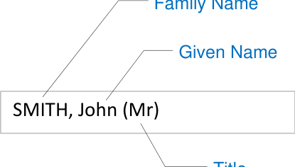

SMITH, John (Mr)

NID-0001

The display must present the Family Name in all uppercase letters to clearly distinguish it from the Given Name

Mandatory

NID-0002

**3**

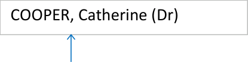

Family Name and Given Name using a comma to further

comma

establish that the Family Name is being placed first

Mandatory

Copyright ©2013 Health and Social Care Information Centre

### Patient Name Display

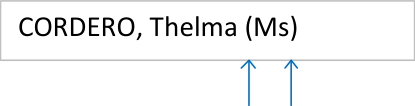

parentheses

**Guidance**

NID-0003

The display must include parentheses around the Title to separate and distinguish it from the other name elements

Mandatory

NID-0008

The display must present a single pair of parentheses around the Title element, for example, (Mr)

Mandatory

NID-0004

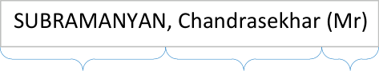

name elements strictly in the

**1.** Family Name

**2.** Given Name

**3.** Title

Mandatory

NID-0005

The display must present all data for each specified element (Family Name, Given Name and Title) of the Patient Name in full. Avoid truncation of information where possible

Mandatory

NID-0006

The display must separate the presentation of Given Name and Title by a single space

Mandatory

SMITH, John (Mr)

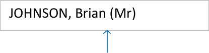

space

Copyright ©2013 Health and Social Care Information Centre

**4**

**Guidance**

### Patient Name Display

JOHNSON, Brian (Mr)

COOPER, Catherine (Dr)

EVANS WEST, Jonathan (Sir)

Up to 35 characters

|JOHNSON, Brian (Mr)|Col2|
|---|---|
|||

full stop omitted

NID-0007

The display must present the Title element in title case, for example, Sir not SIR, Mr not MR

Mandatory

NID-0009

The display must allow any free-text (up to 35 characters) to be presented in the Title element

Mandatory

NID-0011

The display must allow the Family Name, Given Name and Title elements to present at least the maximum field sizes given in the NHS Connecting for Health Personal Demographics Service (PDS) FS 10.00, Issue 1A, 18th January 2005 (CDT D 0222).

Mandatory

NID-0010

The display must, in accordance with the UK Government Data Standards Catalogue guidelines, omit a trailing full stop from the Title element (for example, 'Mr' not 'Mr.')

Mandatory

Copyright ©2013 Health and Social Care Information Centre

**5**

### Patient Name Display

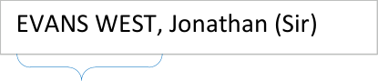

**Guidance**

NID-0012

The display must allow for the Family Name and Given Name elements to consist of multiple components. Components are constituent parts of the name element that combine with other parts to form the element as a whole

Components have the following features:

Family Name components must consist of UPPERCASE alphabetic characters only, for example, SMITH

Multiple Family Name components must be separated by a hyphen or a single space

Given Name components must display in title case, for example, Nadejda

Multiple Given Name components must be separated by a hyphen or a single space.

Mandatory

A Family Name with

two components

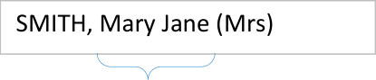

A Given Name with

two components

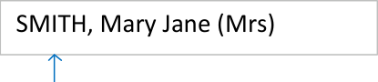

Uppercase

EVANS WEST, Jonathan (Sir)

**OR**

EVANS-WEST, Jonathan (Sir)

|SMITH, Nadejda (Mrs)|Col2|
|---|---|
|||

Title case

SMITH, Nis Bank (Mr)

SMITH, Anne-Jorun (Mrs)

Copyright ©2013 Health and Social Care Information Centre

**6**

**Guidance**

### Patient Name Display

**7**

SUBRAMANYAN, NID-0013 Chandrasekhar (Mr) The display should allow word wrapping to occur in instances where the field length exceeds the width allocated to it on the form. If word wrapping occurs, it should be applied only at the end of a whole field element or at the end of a field element component, if it comprises multiple parts (for example, Middle name(s) field)

_Recommended_

Copyright ©2013 Health and Social Care Information Centre

### Patient Name Input

Title

FAMILY name

Given name

Middle name(s)

Suffix

Known as

_e.g. SMITH_

_e.g. John_

_e.g. David James_

_e.g. Junior_

_e.g. Johnny-Boy_

**Guidance**

NID-0062

By default, include a prompt in the input boxes to indicate to a user the information required

_Recommended_

NID-0063

Present the default prompt in an occluded form to prevent confusion with actual data input by a user

_Recommended_

NID-0064

Remove the default prompt when a user begins to input data

Mandatory

_e.g. John_

Jos

Copyright ©2013 Health and Social Care Information Centre

**8**

**Guidance**

### Patient Name Input

**Fields**

A Patient Name input control can consist of up to six constituent fields with labels: Title, Family Name, Given Name, Middle name, Suffix and Known As

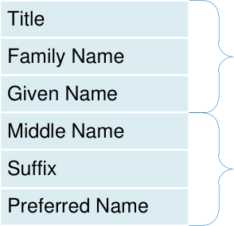

These are considered to be the minimum data required to make the name useful

These are considered to improve data quality but are not mandatory

Copyright ©2013 Health and Social Care Information Centre

**9**

### Patient Name Input

**Fields - Title**

Mr

Mrs

Ms

Dr

Rev

Title

Sir

Lady

Lord

Dame

Other...

**Guidance**

NID-0016

This table shows suggested values for ‘Title’

_Recommended_

NID-0017

One value should allow the user to invoke free-text input mode (for example 'Other...' in the illustrations)

_Recommended_

NID-0018

Input box for Title should contain a relevant prompt, for example, Mr

_Recommended_

NID-0019

Input box for Title should be in the form of a drop-down combo-box

_Recommended_

|Col1|Col2|
|---|---|
|Mr Mrs Ms Dr Rev Sir Lady Lord Dame **Other...**|Mr Mrs Ms Dr Rev Sir Lady Lord Dame **Other...**|

Title

Copyright ©2013 Health and Social Care Information Centre

**10**

**Guidance**

### Patient Name Input

**Fields - Title**

Title

Title

Up to 35 characters

**input**

NID-0014

The Title input control must allow a maximum of 35 characters

Mandatory

NID-0015

Minimum visual width of the input box must display four characters

Mandatory

Copyright ©2013 Health and Social Care Information Centre

At least four characters

**displayed**

**11**

### Patient Name Input

**Fields - Family Name**

FAMILY name

FAMILY name

FAMILY name

_e.g. SMITH_

_e.g. SMITH_

Up to 40 characters

**input**

**Guidance**

NID-0020

Family Name input must be via a free-text entry box

Mandatory

NID-0024

Family Name input box should contain a relevant prompt in its default state (for example, 'e.g. SMITH') in occluded form

_Recommended_

NID-0021

Family Name input box must accept a maximum of 40 characters

Mandatory

NID-0022

Family Name input box should be capable of displaying a minimum of eight characters without occlusion

_Recommended_

NID-0023

Family Name input box should optimally display 14 characters without occlusion

_Recommended_

At least eight characters **displayed**

FAMILY name

Optimally 14 characters

**displayed**

Copyright ©2013 Health and Social Care Information Centre

**12**

**Guidance**

### Patient Name Input

**Fields - Family Name**

FAMILY name

**13**

WINSTANLEY

NID-0025

When displaying a Family Name value, the characters should all be in uppercase

_Recommended_

Copyright ©2013 Health and Social Care Information Centre

### Patient Name Input

**Fields - Given Name**

**Guidance**

NID-0026

Given Name input must be via a free-text entry box

Mandatory

NID-0030

Given Name input box should contain a relevant prompt in its default state (for example, 'e.g. John') in occluded form

_Recommended_

Given Name

_e.g. John_

Given Name _e.g. John_ Given Name input box must accept a maximum of 35

Up to 35 characters **input** characters

_e.g. John_

NID-0027

Up to 35 characters **input**

Mandatory

NID-0028

capable of displaying a minimum of eight characters without

At least eight characters

**displayed** occlusion

At least eight characters

**displayed**

_Recommended_

Given Name input box should optimally display 14

Optimally 14 characters characters without occlusion

NID-0029

Optimally 14 characters

**displayed**

_Recommended_

Given Name Jonathan NID-0031

When displaying a Given Name value the first character should be in uppercase

_Recommended_

Copyright ©2013 Health and Social Care Information Centre

**14**

**Guidance**

### Patient Name Input

**Fields - Middle Name(s)**

Middle name(s)

_e.g. David James_

NID-0032

Middle name input must be via a free-text entry box

Mandatory

NID-0036

Middle name input box should contain a relevant prompt in its default state, (for example, 'e.g. David James') in occluded form

_Recommended_

Middle name(s) _e.g. David James_ Middle name input box must accept a maximum of 100

Up to 100 characters characters

_e.g. David James_

NID-0033

Up to 100 characters

**input**

Mandatory

Middle name input box should be capable of displaying a minimum

At least eight characters of eight characters without

**displayed**

occlusion

NID-0034

At least eight characters

**displayed**

_Recommended_

NID-0035

Optimally 7 characters

**displayed**

Middle name input box should optimally display 7 characters without occlusion

_Recommended_

Copyright ©2013 Health and Social Care Information Centre

**15**

### Patient Name Input

**Fields - Suffix**

Suffix

Suffix

_e.g. Junior_

_e.g. Junior_

Up to 35 characters **input**

**Guidance**

NID-0037

Suffix input must be via a free-text entry box

Mandatory

NID-0041

Suffix input box should contain a relevant prompt when in its default state (for example, 'e.g. Junior') in occluded form

_Recommended_

NID-0038

Suffix input must accept a maximum of 35 characters

Mandatory

NID-0039

Suffix input box should be capable of displaying a

At least eight minimum of eight characters characters **displayed** without occlusion

At least eight characters **displayed**

_Recommended_

NID-0040

Suffix input box should optimally display 14

Optimally 14 characters characters without occlusion

Optimally 14 characters

**displayed**

_Recommended_

Copyright ©2013 Health and Social Care Information Centre

**16**

**Guidance**

### Patient Name Input

**Fields – Preferred Name**

Known as

Known as

Known as

_e.g. Johnny-Boy_

Up to 35 characters **input**

NID-0042

Preferred name input must be via a free-text entry box

Mandatory

NID-0046

Preferred name input box should contain a relevant prompt in its default state (for example, 'e.g. JohnnyBoy') in occluded form

_Recommended_

NID-0043

Preferred name input box must accept a maximum of 35 characters

Mandatory

NID-0044

Preferred name input box should be capable of displaying a minimum of eight characters without occlusion

_Recommended_

NID-0045

Preferred name input box should optimally display 14 characters without occlusion

_Recommended_

Copyright ©2013 Health and Social Care Information Centre

At least eight characters **displayed**

Known as

Optimally 14 characters

**displayed**

**17**

**Guidance**

### Patient Name Input

**Control Layout**

This guidance supports two patient name input control layouts

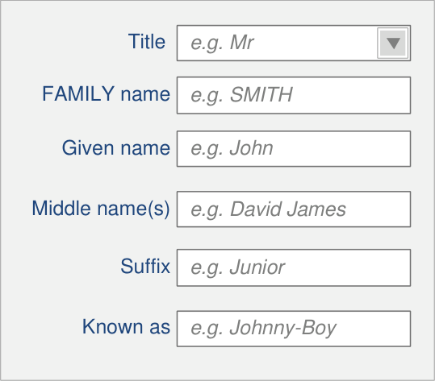

InForm Layout

The most desirable layout for patient safety and usability and the default for an application's Patient Name Input Control

InLine Layout

The InLine layout is included for instances where vertical space is constrained or where horizontal layout is the application's convention

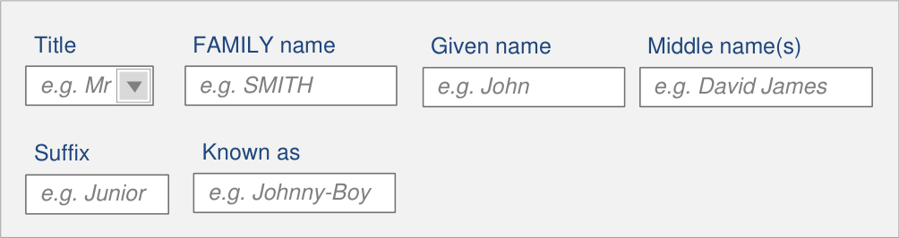

Copyright ©2013 Health and Social Care Information Centre

**18**

**Guidance**

### Patient Name Input

**Control Layout**

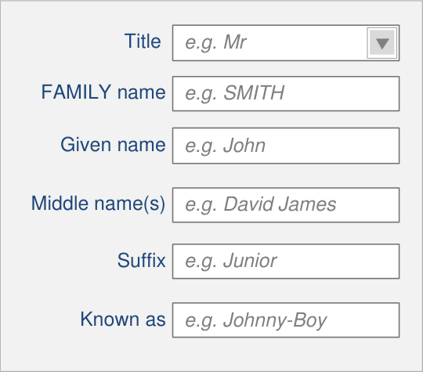

NID-0047

InForm field controls must be aligned on the left edge of the input boxes

Mandatory

NID-0048

InForm field controls (where they exist) must be placed underneath each other in the order illustrated

Mandatory

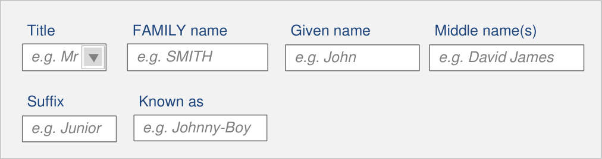

NID-0051 NID-0050

Correct presentation order is as illustrated

Mandatory

NID-0049

Ensure wrapping only occurs on whole fields

Mandatory

InLine design choice should only be used when InForm design has been considered undesirable

_Recommended_

Copyright ©2013 Health and Social Care Information Centre

**19**

**Guidance**

### Patient Name Input

**Instructional Text**

Title

FAMILY name

Given name

Middle name(s)

Suffix

Known as

_e.g. SMITH_

_e.g. John_

_e.g. David James_

_e.g. Junior_

_e.g. Johnny-Boy_

Title

FAMILY name

Given name

Middle name(s)

Suffix

Known as

**20**

NID-0052

Each field in a name input control must have an associated label

Mandatory

NID-0053

Labels must be programmatically linked to their associated input field

Mandatory

NID-0054

Label values should be as illustrated

_Recommended_

**Note** ‘Known as’ is the label for the Preferred Name input control

Copyright ©2013 Health and Social Care Information Centre

**Guidance**

### Patient Name Input

Title

FAMILY name

Given name

Middle name(s)

Suffix

Known as

**21**

_e.g. SMITH_

_e.g. John_

_e.g. David James_

_e.g. Junior_

_e.g. Johnny-Boy_

NID-0055

Each field in a name input control should have an associated prompt

_Recommended_

NID-0056

Prompts for Family Name should be capitalised

_Recommended_

NID-0057

All prompts except Family Name should have sentence style capitalisation

_Recommended_

NID-0058

Prompt values should be as illustrated

_Recommended_

NID-0059

Prompts should be lighter in weight and colour than the input text, and italicised

_Recommended_

Copyright ©2013 Health and Social Care Information Centre

### Patient Name Input

Title

FAMILY name

Given name

Middle name(s)

Suffix

Known as

**Title**

|e.g. Junior Enter the person’s M|Col2|Col3|
|---|---|---|
|_e.g. Junior_ Enter the person’s M|_ Junior_ Enter the person’s M|_ Junior_ Enter the person’s M|
||||

_e.g. Johnny-Boy_

**Middle name(s)**

_e.g. SMITH_

_e.g. John_

_e.g. David James_

**Guidance**

NID-0060

Each field in a name input control should have instructional text (for example, a tooltip)

_Recommended_

**22**

Select a Title from the list or simply type in a different Title

**FAMILY name**

Enter the person's Family Name (surname)

**Given name**

Enter the person's Given Name (forename or Christian name)

Enter the person's middle name(s)

**Suffix**

Enter the person's suffix name (e.g. 'Junior' or 'The Third')

**Known as**

Enter the name a person likes to referred to as

NID-0061

Tooltip values should be as illustrated

_Recommended_

Copyright ©2013 Health and Social Care Information Centre
