_Prepared for_

**NHS Connecting for Health**

**Tuesday, 23 June 2015**

**Version 4.0.0.0 Baseline**

_Prepared by_

**Clinical Application and Patient Safety Project**

**NHS CUI Programme Team**

**[cuistakeholder.mailbox@hscic.gov.uk](mailto:cuistakeholder.mailbox@hscic.gov.uk)**

HSCIC Controlled Document

### PREFACE

**Documents replaced by this document**

Sex and Current Gender Input and Display – User Interface Design Guidance 3.0.0.0

Design Guide Entry – Gender and Sex Display 2.0.0.0

Design Guide Entry – Gender and Sex Display 1.0.0.0

**Documents to be read in conjunction with this document**

Accessibility Checkpoints for NHS Applications 1.0.0.0

Accessibility for Clinical Applications 1.0.0.0

**This document was prepared for NHS Connecting for Health which ceased to exist on 31 March**
**2013. It may contain references to organisations, projects and other initiatives which also no**
**longer exist. If you have any questions relating to any such references, or to any other aspect of**
**[the content, please contact cuistakeholder.mailbox@hscic.gov.uk](mailto:cuistakeholder.mailbox@hscic.gov.uk)**

Copyright ©2013 Health and Social Care Information Centre

HSCIC Controlled Document

### TABLE OF CONTENTS

_**1**_ _**Introduction .................................................................................................................................... 1**_

1.1 Customer Need ......................................................................................................................... 2

1.2 Scope ........................................................................................................................................ 3

1.2.1 In Scope .............................................................................................................................. 3

1.2.2 Out of Scope ....................................................................................................................... 3

1.3 Dependencies and Assumptions .............................................................................................. 4

1.4 Key Principles ........................................................................................................................... 4

_**2**_ _**Recommendations and Guidance ................................................................................................ 5**_

2.1 Current Gender Values ............................................................................................................. 5

2.1.1 Guidance ............................................................................................................................. 5

2.1.2 Examples of Correct Usage ................................................................................................ 6

2.1.3 Examples of Incorrect Usage .............................................................................................. 6

2.1.4 Rationale ............................................................................................................................. 6

2.2 Sex Values ................................................................................................................................ 7

2.2.1 Guidance ............................................................................................................................. 7

2.2.2 Examples of Correct Usage ................................................................................................ 7

2.2.3 Examples of Incorrect Usage .............................................................................................. 8

2.2.4 Rationale ............................................................................................................................. 8

2.3 Instructional Text ...................................................................................................................... 8

2.3.1 Current Gender Instructional Text ....................................................................................... 8

2.3.2 Sex Instructional Text .......................................................................................................... 9

2.3.3 Data Values Instructional Text ............................................................................................ 9

2.3.4 Guidance ........................................................................................................................... 10

2.3.5 Examples of Correct Usage .............................................................................................. 10

2.3.6 Rationale ........................................................................................................................... 10

2.4 Control Layout and Structure .................................................................................................. 11

2.4.1 Current Gender Option Button Group ............................................................................... 11

2.4.2 Sex Option Button Group .................................................................................................. 13

2.4.3 Current Gender Drop-Down List Box ................................................................................ 15

2.4.4 Sex Drop-Down List Box ................................................................................................... 17

_**3**_ _**Document Information ................................................................................................................ 20**_

3.1 Terms and Abbreviations ........................................................................................................ 20

3.2 Definitions ............................................................................................................................... 20

3.3 Nomenclature ......................................................................................................................... 20

3.3.1 Body Text .......................................................................................................................... 20

3.3.2 Cross References.............................................................................................................. 21

3.4 References ............................................................................................................................. 21

Page iii

Copyright ©2013 Health and Social Care Information Centre

HSCIC Controlled Document

**Patient Safety Process**

The development lifecycle for this design guide includes an integrated patient / clinical safety risk
assessment and management process.

Known patient safety incidents relevant to this design guidance area have been researched and
reviewed as part of ongoing development. The resulting guidance points aim to support mitigation
of these known patient safety risks. In addition, the developers of this design guide have
undertaken a patient safety risk assessment to identify new risks that could potentially be
introduced by the guidance points in this document. Any potential risks identified have been
assessed and managed to support the ongoing clinical safety case for this design guide.

The Hazard Log records all the risks that have been identified during development and describes
mitigatory actions that, in some cases, will need to be taken by users of this design guide. The
Hazard Log is a live document that is updated as the design guide is developed and maintained.
Until this design guide has received full Clinical Authority to Release (CATR) from the NHS
Connecting for Health (CFH) Clinical Safety Group (CSG) – based on an approved Clinical Safety
Case – there may be outstanding patient safety risks yet to be identified and mitigated.

Additionally, users implementing applications that follow this design guide’s guidelines (for
example, healthcare system suppliers) are expected to undertake further clinical safety risk
assessments of their specific systems within their specific context of use.

[Refer to www.cui.nhs.uk](https://emea.mail.microsoft.com/OWA/redir.aspx?C=2aab7991b0924c8f92c4e2824ab8a971&URL=http%3a%2f%2fwww.cui.nhs.uk) for further information on the patient safety process and for the safety
status and any relevant accompanying safety documentation for this design guide.

Page iv

Copyright ©2013 Health and Social Care Information Centre

HSCIC Controlled Document

### 1 INTRODUCTION

This document describes the design guidance for the display and input of information about patient
‘Sex’ or ‘Current Gender’ status. It describes the area of focus, provides guidance and
recommendations, and explains the rationale behind the guidance and recommendations.

The term ‘Gender’ is now considered too ambiguous to be desirable or safe because different
locations and systems use it to mean different things. It is therefore desirable to use the two distinct
terms ‘Sex’ and ‘Current Gender’.

**Note**

Elements used within a software application are commonly referred to as a ‘control’. These can take many
forms but the types referred to in this document will either be ‘input controls’ that can receive input from a
user, such as a button, text box, option button (radio button) or check box, or ‘display controls’ such as a
label, which can only display information.

The Current Gender input controls are used to record the gender, according to how a patient
currently describes themselves, whereas the Sex input controls records their _phenotypic_ sex (see
section 2.4 for more information).

This document outlines the design guidance for the display of these statuses. Figure 1 shows an
example format of these statuses:

Figure 1: Example of the Format for Displaying Gender and Sex in NHS Clinical Applications

This document also outlines the design guidance for the input of these statuses; Figure 2 shows
some examples of input design:

Figure 2: Example Input Designs for Current Gender and Sex Statuses

This document is intended for use by anyone whose role includes screen design, implementation,
or assessment of an NHS clinical application. This document can be used as guidance for the:

 Specification of an input and display control for the Sex and/or Current Gender statuses in a

user interface

 Implementation of an input and display control for Sex and/or Current Gender within an

application

 Assessment of an input and display control for Sex and/or Current Gender in the user

interface for an NHS clinical application

Page 1

Copyright ©2013 Health and Social Care Information Centre

HSCIC Controlled Document

Table 1 describes the changes made since the previous version of this guidance (Baseline version
3.0.0.0 dated 07-Apr-2008):

**Deleted** None

**Modified** Enhanced out of scope context setting (section 1.2.2)

Enhanced research setting (section 2)

**Added** Patient Safety Process note

Table 1: Changes Since the Last Baseline Version

#### **1.1 Customer Need**

This section explains why the guidance has been created.

The NHS categorises a person's gender in two ways:

 **Person Gender Current** . Or ‘Current Gender’, which refers to a patient's current gender

classification.

 **Person Gender at Registration** . Or ‘Sex’, which refers to the record of a patient's gender

classification at the point of birth registration.

**Note**

For brevity and clarity, this document uses the term Sex in place of Person Gender at Registration and
Current Gender in place of Person Gender Current.

NHS applications input and display a patient's current gender or sex in various contexts. Users may
confuse the terms current gender and sex, or assume that they are synonymous. Therefore, it is
essential that all NHS applications display and explain current gender and sex terminology and
values in a clear and consistent manner.

This document details the recommendations for entering and displaying current gender and sex in
NHS applications. NHS clinical applications should use the Current Gender and Sex format to
enhance readability, ensure consistency and to cover all possible variants of Current Gender and
Sex. This recommendation provides the best display format because it decreases ambiguity
through the clear presentation of data values, and intuitive, concise labelling of patient Current
Gender and Sex. Additionally, this recommendation enables NHS clinical applications to display a
predefined, restricted set of unknown or unspecified Current Gender and Sex values. Figure 1
shows examples of how an NHS application might display Current Gender and Sex values.

The aims of this guidance are to:

 Ensure patients are correctly identified and matched with their patient record by displaying

data items consistently

 Allow the status of the patient to be entered and displayed in a legally compliant and

patient-sensitive manner

Potential consequences of not adhering to these standards include:

1. The patient is given the wrong treatment as a result of a failure to identify the patient

correctly.

2. The patient is given the wrong treatment as a result of a failure to match the patient

correctly with their artefacts (samples, letters, specimens, X-rays, and so on).

3. The patient is given the wrong treatment as a result of a failure in communication between

staff, or staff not performing or checking procedures correctly.

Page 2

Copyright ©2013 Health and Social Care Information Centre

HSCIC Controlled Document

4. The patient is categorised with a value that cannot be utilised by any other systems.

5. The patient is categorised incorrectly from a legal perspective.

6. The patient is categorised incorrectly from their perspective.

This guidance is concerned with each of the errors identified above, but particularly points 1 and 2.

#### **1.2 Scope**

This section defines the scope of this guidance document.

##### **1.2.1 In Scope**

This guidance is applicable primarily to electronic user interfaces such as those displayed on
desktop, laptop, and PDA computers. However, many of the principles can also be applied to paper
form design. It is assumed that these computers are capable of displaying Graphical User Interface
(GUI) elements (such as buttons) and have a keyboard and pointing device. The following items
are in scope:

 Defining the valid values for current gender and sex

 Labelling of information, including:

 Definition of the terms Current Gender and Sex

 Definition of the values

 How items of information are to be labelled; this will cover the label text, positioning and
any elements of styling required to differentiate labels visually from data

 Control layout and structure, in order to achieve:

 Optimal visibility of the values

 Easy recognition of the values in the context of the wider clinical application

 Easy recognition of the data type requested for input

 Reduction of invalid entries

##### **1.2.2 Out of Scope**

This section defines areas that are not covered in this guidance. Although there may be specific
risks associated with these areas that are not addressed in this guidance, it is likely that the
principles in this guidance will extend to the input and display of sex and current gender in many of
the areas listed below.

The following items are out of scope:

 **Data storage**  - This guidance does not prescribe the format for storing data that is input or

displayed

 **Terms of use**  - This guidance does not define when an input field or display should be

presented within a system or when Current Gender should be used instead of Sex, and vice
versa

 **Form design**  - This guidance does not prescribe the correct layout for a form or the

navigation around a form

**Note**

Listing an item as out of scope does not classify it as unimportant. Project time and resource constraints
inevitably restrict what can be in scope for a particular release. It is possible that items out of scope for
this release may be considered for a future release.

Page 3

Copyright ©2013 Health and Social Care Information Centre

HSCIC Controlled Document

#### **1.3 Dependencies and Assumptions**

Compliance with other guidance is required as follows:

 The design of NHS clinical applications must conform to _Accessibility Checkpoints for NHS_

_Clinical Applications_ **{R1}** and _Accessibility for Clinical Applications_ **{R2}**

**Important**

The visual representations used within this document to display guidance are illustrative only. Stylistic
choices are not part of guidance and are therefore not mandatory requirements for compliance with the
guidance in this document.

#### **1.4 Key Principles**

The following key principles have shaped the guidance in this document:

 Display information according to existing standards

 Minimise opportunities for human error

 Display sufficient instructional information to support data quality

 Promote consistency across the mix of users, NHS clinical applications and care settings

 Ensure reliable and accurate identification of an individual patient record

 Minimise opportunities where patient-clinician relationships may be compromised

Page 4

Copyright ©2013 Health and Social Care Information Centre

HSCIC Controlled Document

### 2 RECOMMENDATIONS AND GUIDANCE

The guidance provided in this document is based on a programme of user research, including:

 The evaluation of the following organisations' key standards (where relevant, standards will

have been approved by the Information Standards Board for Health and Social Care (ISB
HaSC)):

 NHS Connecting for Health Data Dictionary

 UK Government Data Standards Catalogue (GDSC)

 NHS Connecting for Health Personal Demographics Service (PDS)

 NHS Connecting for Health Message Implementation Manual (MIM)

 A desk-based research project looking at a range of information entry Web pages and

clinical applications

 A Web-based survey of 41 respondents from NHS clinicians and administrative staff,

Independent Software Vendors (ISVs), community pharmacists and NHS CFH

 A Patient Safety Assessment

#### **2.1 Current Gender Values**

Any Current Gender input or display control is restricted to the predefined set of valid values shown
in Table 1.

**Important**

The values defined in this document are based upon the current proposed changes to the NHS CFH Data
Dictionary. Should future changes be made to this document, amendments to this guidance will be
required.

##### **2.1.1 Guidance**

CGS-0001 Label the Current Gender input controls 'Current Gender'. Mandatory

CGS-0002 The Current Gender values are:

 Male

 Female

 Other Specific

 Not Known

 Not Specified

CGS-0003 The Current Gender status is one the following values:

 Male

 Female

 Other Specific

 Not Known

 Not Specified

Mandatory

Mandatory

CGS-0004 Make the definitions of the Current Gender status values accessible to the user. Mandatory

CGS-0005 Do not abbreviate Current Gender data values. Mandatory

Page 5

Copyright ©2013 Health and Social Care Information Centre

HSCIC Controlled Document

CGS-0006 Do not display the underlying coded representation of the Current Gender data values. For
example, the standard code for 'Male' may be the integer 1, but this number should not
appear.

Mandatory

CGS-0007 Label the Current Gender status display 'Current Gender'. Recommended

CGS-0008 Use ‘Not Known’ as the Current Gender default value. Recommended

Table 2: Guidance for Current Gender Data Values

##### **2.1.2 Examples of Correct Usage**

####  Alphabetic string Male

Female

Other Specific

Not Known

Not Specified

Table 3: Correct Gender Formatting Examples

##### **2.1.3 Examples of Incorrect Usage**

Use this format to display patient Current Gender within a
clinical application.

####  Numeric code 0

1

2

9

NK

M

F

NS

####  Numeric code and text 0 Not Known

1 Male

2 Female

9 Not Specified

Table 4: Incorrect Gender Formatting Examples

##### **2.1.4 Rationale**

**Patient-Safety-Critical**

This example requires the user to understand and interpret
the numeric codes or abbreviations. This representation is
likely to cause recognition errors.

**Lack of Readability**

This example lacks clarity and readability by displaying both
number and textual values for Current Gender. The relative
number values could also cause offence.

The values defined here represent the current best conclusions from the healthcare industry on
valid values for these statuses.

The use of an unambiguous alphabetical string is considered the most predictable and
recognisable format for clinicians using the systems.

Page 6

Copyright ©2013 Health and Social Care Information Centre

HSCIC Controlled Document

#### **2.2 Sex Values**

Any Sex input or display control is restricted to the predefined set of valid values shown in Table 5.

**Important**

The values defined in this document are based upon the current proposed changes to the NHS Data
Dictionary. Should future changes be made to this document, amendments to this guidance will be
required.

##### **2.2.1 Guidance**

CGS-0009 Label the Sex input controls 'Sex'. Mandatory

CGS-0010 The Sex values are:

 Male

 Female

 Not Known

 Indeterminate

CGS-0011 The Sex status must only contain one the following values:

 Male

 Female

 Not Known

 Indeterminate

Mandatory

Mandatory

CGS-0012 Sex data values must never be abbreviated. Mandatory

CGS-0013 The Sex default state is null. Mandatory

CGS-0014 The application must not display the underlying coded representation of the Sex data values.
For example, the standard code for 'Male' may be the integer 1, but this number must not
appear.

Mandatory

CGS-0015 Make the definitions of the Sex status values accessible to the user. Mandatory

CGS-0016 Label the Sex status display 'Sex'. Recommended

Table 5: Guidance for Sex Data Values

##### **2.2.2 Examples of Correct Usage**

####  Alphabetic string Male

Female

Not Known

Indeterminate

Table 6: Correct Sex Formatting Examples

Use this format to display patient Sex within a clinical
application.

Page 7

Copyright ©2013 Health and Social Care Information Centre

HSCIC Controlled Document

##### **2.2.3 Examples of Incorrect Usage**

####  Numeric code 1

2

9

M

F

NS

####  Numeric code and text 1 Male

2 Female

9 Not Specified

Table 7: Incorrect Sex Formatting Examples

##### **2.2.4 Rationale**

**Patient-Safety-Critical**

This example requires the user to understand and interpret
the numeric codes or abbreviations. This representation is
likely to cause recognition errors.

**Lack of Readability**

This example lacks clarity and readability by displaying both
number and textual values for Sex.

The values defined here represent the current best practice regarding the use of this data area.

The use of a discrete alphabetical string is considered the most predictable and recognisable
format for clinicians using the systems.

#### **2.3 Instructional Text**

The Current Gender and Sex controls are potentially confusing to the user due to the terms Sex
and Gender being used inconsistently between systems and locations. It is therefore very important
to facilitate a user's understanding of a data item through the use of instructional text.

**Important**

This section is illustrated with examples using tooltips, however, instructional text can be provided in a
variety of methods; which method is to be employed is not considered in this document as this is a
system-wide issue rather than a specific one.

##### **2.3.1 Current Gender Instructional Text**

At this time, the term ‘Current Gender’ is not in widespread use and, as a result, could be confusing
to the user. Therefore, the control label must provide the following definition:

Current Gender, as assigned by the individual to themselves

One method of achieving this is using a tooltip, as displayed in Figure 3:

Figure 3: Brief Definition of Current Gender from Control Label (Via a Tooltip)

Page 8

Copyright ©2013 Health and Social Care Information Centre

HSCIC Controlled Document

ISVs need to take responsibility for informing the user about this control by providing the following
instructional text in the format required by their application:

Current Gender is a statement by the individual about the gender they currently identify themselves to be (that is,
self-assigned). The valid values are:

 **Male**

 **Female**

 **Other Specific**  - when the person has a clear idea of what their gender is, but it is neither discretely male nor female,

for example, 'Intersex', 'transgender', 'third gender'

 **Not Known**  - used when no information on this subject is known

 **Not Specified**  - when the person is unable to specify their current gender or does not have a clear idea of their

current gender

##### **2.3.2  Sex Instructional Text**

The control must provide the following definition:

Sex, as recorded at birth or on issue of a full gender recognition certificate

A tooltip display method for instructional text is shown in Figure 4:

Figure 4: Brief Definition of Sex from Control Label (Via a Tooltip)

ISVs need to take responsibility for informing the user about this control by using the following
instructional text in the format appropriate to their application:

Sex is the phenotypic sex of the person as recorded by the Registrar on the Register of Births, or other initial registration,
or on issue of a full gender recognition certificate under the Gender Recognition Act. Valid values are:

 **Male**

 **Female**

 **Not Known**  - used when no information on this subject is known

 **Indeterminate**  - used when the person is unable to be classified as either male or female

##### **2.3.3 Data Values Instructional Text**

In addition to having instructional text for the control label, instructional text for the data values
should be provided. These could be added in a variety of methods, such as a tooltip, as
demonstrated in Figure 5:

Figure 5: Definition of Data Value from Value Label (Via a Tooltip)

Page 9

Copyright ©2013 Health and Social Care Information Centre

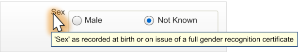

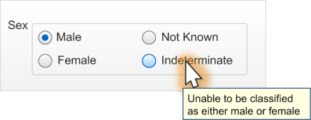
HSCIC Controlled Document

##### **2.3.4 Guidance**

CGS-0017 Provide definitions for input controls. Mandatory

CGS-0018 Provide access to definitions of the valid values. Mandatory

CGS-0019 Provide a shortened version of the definitions. Recommended

Table 8: Guidance for Instructional Text

##### **2.3.5 Examples of Correct Usage**

####  Alphabetic

string

####  Alphabetic

string

####  Alphabetic

string

####  Alphabetic

string

Current Gender is a statement by the individual about the
gender they currently identify themselves to be (that is,
self-assigned). The valid values are:

 Male

 Female

 Other Specific – when the person has a clear idea of

what their gender is, but it is neither discretely male nor
female, for example, 'Intersex', 'transgender', 'third
gender'

 Not Known – used when no information on this subject is

known

 Not Specified – when the person is unable to specify their

current gender or does not have a clear idea of their
current gender

Sex is the phenotypic sex of the person as recorded by the
Registrar on the Register of Births, or other initial
registration, or on issue of a full gender recognition certificate
under the Gender Recognition Act. Valid values are:

 Male

 Female

 Not Known – used when no information on this subject is

known

 Indeterminate – used when the person is unable to be

classified as either male or female

Sex, as recorded at birth or on issue of a full gender
recognition certificate

Use this format to define Current
Gender within a clinical application.

Use this format to define Sex within a
clinical application.

Current Gender, as assigned by the individual to themselves Use this text as a shortened definition of

Current Gender within a clinical
application, especially in cases where
brevity is paramount.

Use this text as a shortened definition of
Sex within a clinical application,
especially in cases where brevity is
paramount, such as in a tooltip design.

Table 9: Correct Examples of Instructional Text for Status Type and Data Value Definitions

##### **2.3.6 Rationale**

Shortened definitions are to be used where the full instructional text is not required or desirable, for
example, when a tooltip is placed on a control label. Whilst tooltips can contain as many as 150
characters, they should ideally contain only a brief description in order to allow the user to read it.
Additionally, certain technologies only allow a restricted amount of data to be contained in them (for
example, the Mozilla [®] Firefox [®] Web browser truncates after about 90 characters).

Page 10

Copyright ©2013 Health and Social Care Information Centre

HSCIC Controlled Document

#### **2.4 Control Layout and Structure**

The input controls should be constructed in a manner that supports only the input of a predefined
set of values. Therefore, both an 'Option Button Group’ (also known as a ‘Radio Button Group’) and
a ‘Drop-down List Box’ design have been considered.

The option button group design is considered to occupy more screen space but provides better
instruction to the user.

##### **2.4.1 Current Gender Option Button Group**

This control will be used when a user needs to enter the Current Gender that the patient has
assigned to themselves. It consists of a group of five standard option buttons within a control group,
as displayed in Figure 6. It should be used whenever the developer has room in their form design.

Figure 6: Current Gender Option Button Design (Focus on Male)

An alternative layout is displayed in Figure 7, which may be desirable when the layout is more
suited to the available screen space:

Figure 7: Inline Option Button Design

_**2.4.1.1**_ _**Guidance**_

CGS-0020 Current Gender option button group input controls must consist of five option buttons. Mandatory

CGS-0021 Current Gender option button group labels are in the following order (top to bottom first,
followed by left to right):

1. Male

2. Female

3. Other Specific

4. Not Known

5. Not Specified

CGS-0022 The Current Gender tab order is:

1. Male

2. Female

3. Other Specific

4. Not Known

5. Not Specified

Table 10: Guidance for Current Gender Option Button Design

Copyright ©2013 Health and Social Care Information Centre

Mandatory

Recommended

Page 11

HSCIC Controlled Document

_**2.4.1.2**_ _**Examples of Correct Usage**_

####  Five option

button group

####  ‘Not Known’ is

the default status

Table 11: Correct Current Gender Option Button Design Formatting Examples

_**2.4.1.3**_ _**Examples of Incorrect Usage**_

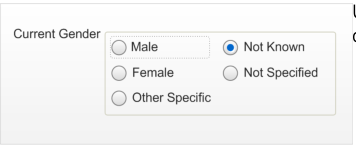

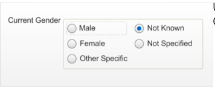

####  Incorrect

functionality
(non-discrete
choices)

####  Incorrect input

convention

####  Incorrect value

labelling

####  Too few options

(less than five
option buttons)

####  Too many

options (more
than five option
buttons)

####  Incorrect control

labelling

Table 12: Incorrect Current Gender Option Button Design Formatting Examples

**Data quality**

This example allows a user to select multiple
data values when only one should be
assigned.

**User experience**

This example uses checkboxes, suggesting
to users that multiple selections are
possible.

**Data quality**

This example allows a user to select a value
that does not adhere to ISB HaSC
standards.

**Data quality**

This example does not allow a user to enter
all the possible valid values for this status.

**Data quality**

This example allows a user to select a data
value that is not valid.

**Data quality**

This example shows a control label that
could be misinterpreted as a phenotypic sex
status.

Page 12

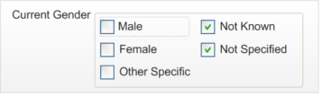

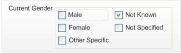

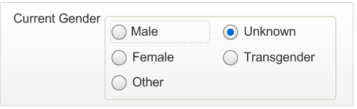

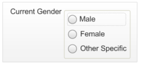

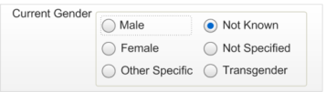

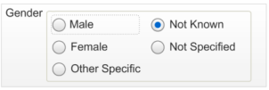

Copyright ©2013 Health and Social Care Information Centre

HSCIC Controlled Document

_**2.4.1.4**_ _**Rationale**_

The option button group design is considered to be the safest and most accessible design. It
instantly displays the valid options to the user for them to assess the correct value. The option
buttons are a known medium for selecting a single value from a predefined list and so the user
knows what is expected. Additionally, invalid values cannot be entered and, therefore, that type of
entry error is precluded.

This design minimises user effort by placing the most obvious choices first. The design also has a
default of ‘Not Known’ to encourage users to select an option only when appropriate.

This design uses controls that are recognised by assistive technologies (for example, screen
readers) and allow for easy implementation of instructional text through tooltips.

##### **2.4.2 Sex Option Button Group**

This control will be used when a user needs to enter information about the Sex value that the
patient has assigned to themselves. It consists of a group of four standard option buttons within a
control group, as displayed in Figure 8:

Figure 8: Sex Option Button Design with a Value Selected

This layout should be used whenever the developer has room in their form design. Figure 9
displays the control in its default ‘null’ state (unlike the Current Gender control, which has a default
value):

Figure 9: Sex Option Button Design in Default 'Null' State

An alternative layout is displayed in Figure 10, which may be desirable when the layout is more
suited to the available screen space:

Figure 10: Inline Option Button Design

_**2.4.2.1**_ _**Guidance**_

CGS-0023 Sex option button group input controls must consist of four option buttons. Mandatory

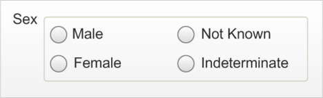

CGS-0024 Sex option button group labels are in the following order (top to bottom first followed by left to right):

1. Male

2. Female

3. Not Known

4. Indeterminate

Table 13: Guidance for Sex Option Button Group Design

Copyright ©2013 Health and Social Care Information Centre

Recommended

Page 13

HSCIC Controlled Document

_**2.4.2.2**_ _**Examples of Correct Usage**_

####  Four option

button group

####  ‘Null’ default state

Table 14: Correct Sex Option Button Grouping Examples

_**2.4.2.3**_ _**Examples of Incorrect Usage**_

Use these four discrete controls with only
one selection possible at one time.

This control must have nothing selected for
the null default state.

####  Incorrect

functionality
(non-discrete
choices)

####  Incorrect input

convention

####  Incorrect value

labelling

####  Too few options

(less than four
option buttons)

####  Too many

options (more
than five radio
buttons)

####  Incorrect control

labelling

Table 15: Incorrect Sex Option Button Grouping Examples

_**2.4.2.4**_ _**Rationale**_

**Data quality**

This example allows a user to select multiple
data values when only one should be
assigned.

**User experience**

This example uses checkboxes, suggesting
to users that multiple selections are
possible.

**Data quality**

This example allows a user to select a value
that is not recognisable to ISB HaSC
standards.

**Data quality**

This example does not allow a user to enter
all the possible valid values for this status.

**Data quality**

This example allows a user to select a data
value that is not valid.

**Data quality**

This example shows a control label that
could be misinterpreted as a Current Gender
status.

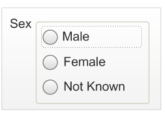

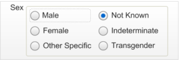

The option button group design is considered to be the safest and most accessible design. It
instantly displays the valid options to the user for them to assess the correct value. The option
buttons are a known medium for selecting a single value from a predefined list and so the user
knows what is expected. Additionally, invalid values cannot be entered and, therefore, that type of
entry error is precluded.

This design minimises user effort by placing the most obvious choices first and has a default of null
or blank (for example, “”). Patient Safety Assessments have revealed that this data is too important

Page 14

Copyright ©2013 Health and Social Care Information Centre

HSCIC Controlled Document

to leave in a default value, which could be misinterpreted as actual input. It was felt that if there is a
default value, a user might be encouraged to tab through the input control, without attempting to
select an option. Users will need to interact with a default state input control, in order to select a
valid value. Once this control has a valid value, it will not be possible for a user to set it back to the
default null state.

This design uses controls that are recognised by assistive technologies (for example, screen
readers) and allow for easy implementation of instructional text through tooltips.

##### **2.4.3 Current Gender Drop-Down List Box**

The drop-down list box design is considered desirable for developers who want to save space on a
form or where many drop-down list boxes are already implemented in their design. Figure 11
displays an example of the control in a default state, which is to have ‘Not Known’ selected:

Figure 11: Current Gender Drop-Down List Box Design Default State

Figure 12 is an example of an interaction with the control:

Figure 12: Current Gender Drop-Down List Box with Focus Shadow

_**2.4.3.1**_ _**Guidance**_

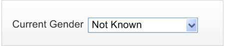

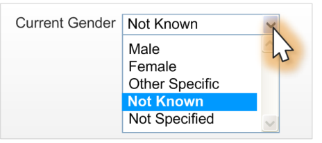

CGS-0025 Current Gender drop-down list box options are in the following order (top to bottom):

1. Male

2. Female

3. Other Specific

4. Not Known

5. Not Specified

Mandatory

CGS-0026 Use a single drop-down list box for the Current Gender control. Mandatory

CGS-0027 Do not use a prompt for the Current Gender control, due to its default value of 'Not Known'. Mandatory

Table 16: Guidance for Current Gender Drop-Down List Box Design

Page 15

Copyright ©2013 Health and Social Care Information Centre

HSCIC Controlled Document

_**2.4.3.2**_ _**Examples of Correct Usage**_

####  Drop-down list

box with five
possible values

####  ‘Not Known’ is

the default status

Table 17: Correct Current Gender Drop-Down List Box Examples

_**2.4.3.3**_ _**Examples of Incorrect Usage**_

A single drop-down list box that can be set
to one option from the five available.

Use ‘Not Known’ as the default for Current
Gender.

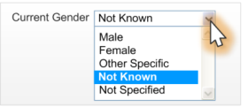

####  Incorrect

functionality
(non-discrete
choices)

####  Incorrect value

labelling

####  Too few options

(less than five
options)

####  Too many

options (more
than five options)

####  Incorrect control

labelling

####  Incorrect default

value

Table 18: Incorrect Current Gender Drop-Down List Box Examples

**Data quality**

This example allows a user to select multiple
values when only one should be assigned.

**Data quality**

This example allows a user to select a value
that is not recognisable to ISB HaSC
standards.

**Data quality**

This example does not allow a user to enter
all the possible valid values for this status.

**Data quality**

This example allows a user to select a data
value that is not valid.

**Data quality**

This example shows a control label that
could be misinterpreted as a phenotypic sex
status.

**Data quality**

This example shows a control with an
incorrect default value (Male).

Page 16

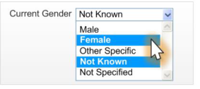

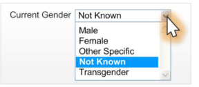

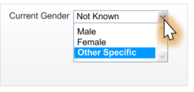

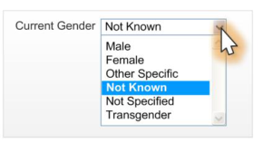

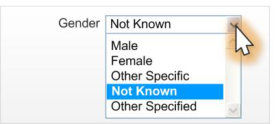

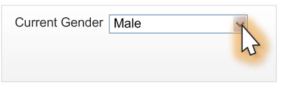

Copyright ©2013 Health and Social Care Information Centre

HSCIC Controlled Document

_**2.4.3.4**_ _**Rationale**_

The drop-down list box design increases data quality by allowing users to only enter discrete values
whilst conserving screen space.

This design minimises user effort by placing the most obvious choices first in the list order. The
design also has a default of ‘Not Known’ to encourage users to select an option only when
appropriate.

##### **2.4.4 Sex Drop-Down List Box**

The drop-down list box design is considered desirable for developers who want to save space on a
form or where many drop-down list boxes are already implemented in their design. Figure 13
displays an example of the control in a default state, which is to be in a null state with nothing
selected:

Figure 13: Default Sex Input Drop-Down List Box

Figure 14 is an example of an interaction with the control:

Figure 14: Sex Drop-Down List Box

Figure 15 shows the resulting data value displayed:

Figure 15: Static State of Control After Data Input

_**2.4.4.1**_ _**Guidance**_

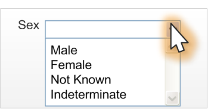

CGS-0028 Ensure that Sex controls have no value selected by default and no method of returning to this
‘null’ state.

Mandatory

CGS-0029 Use a single control for the Sex drop-down list box. Mandatory

CGS-0030 Ensure that the Sex drop-down list box is blank by default and does not contain a prompt. Recommended

Table 19: Guidance for Sex Drop-Down List Box Design

Page 17

Copyright ©2013 Health and Social Care Information Centre

HSCIC Controlled Document

_**2.4.4.2**_ _**Examples of Correct Usage**_

####  Four item

drop-down list
box

Use four discrete controls with only one
selection possible at one time.

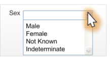
####  ‘Null’ default state Default state should be null, which will

display to users as a blank. Once a selection
has been made by a user, there is no means
of returning to this state for that data item.

Table 20: Correct Sex Drop-Down List Box Examples

_**2.4.4.3**_ _**Examples of Incorrect Usage**_

####  Incorrect

functionality
(non-discrete
choices)

####  Incorrect value

labelling

####  Too few options

(less than four
options)

####  Too many

options (more
than four options)

####  Incorrect control

labelling

####  Incorrect default

value

Table 21: Incorrect Sex Drop-Down List Box Examples

**Data quality**

This example allows a user to select multiple
data values when only one should be
assigned.

**Data quality**

This example allows a user to select a value
that is not recognisable to ISB HaSC
standards.

**Data quality**

This example does not allow a user to enter
all the possible valid values for this status.

**Data quality**

This example allows a user to select a data
value that is not valid.

**Data quality**

This example shows a control label that
could be misinterpreted as a Current Gender
status.

**Data quality**

This example shows a control with an
incorrect default value (Not Known).

Page 18

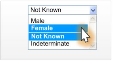

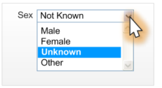

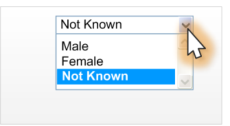

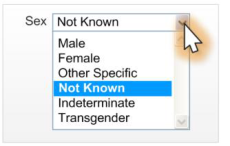

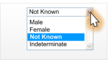

Copyright ©2013 Health and Social Care Information Centre

HSCIC Controlled Document

_**2.4.4.4**_ _**Rationale**_

The drop-down list box design increases data quality by allowing users to only enter discrete values
whilst conserving screen space.

This design minimises user effort by placing the most obvious choices first in the list order and has
a default of null or blank (for example, “”). Patient Safety Assessments have revealed that this data
is too important to leave in a default value, which could be misinterpreted as actual input. It was felt
that if there is a default value, the user might be encouraged to tab through the control, without
attempting to select an option. Users will need to interact with a default state control in order to give
it a valid value. Once this control has a valid value, it will not be possible for a user to set it back to
the default null state.

Page 19

Copyright ©2013 Health and Social Care Information Centre

HSCIC Controlled Document

### 3 DOCUMENT INFORMATION

#### **3.1 Terms and Abbreviations**

CUI Common User Interface

GDSC Government Data Standards Catalogue

ISB HaSC Information Standards Board for Health and Social Care

ISV Independent Software Vendor

MIM Message Implementation Manual

NHS National Health Service

NHS CFH NHS Connecting for Health

PDA Personal Digital Assistants

PDS Personal Demographic Service

UI User Interface

Table 22: Terms and Abbreviations

#### **3.2 Definitions**

NHS Entity Within this document, defined as a single NHS organisation or group that is operated within a single
technical infrastructure environment by a defined group of IT administrators.

The Authority The organisation implementing the NHS National Programme for IT (currently NHS Connecting for
Health)

Current best practice Current best practice is used rather than best practice, as over time best practice guidance may
change or be revised due to changes to products, changes in technology, or simply the additional
field deployment experience that comes over time.

Table 23: Definitions

#### **3.3 Nomenclature**

This section shows how to interpret the different styles used in this document to denote various
types of information.

##### **3.3.1 Body Text**

Code `Monospace`

Script

Other markup languages

Interface dialog names **Bold**

Field names

Controls

Page 20

Copyright ©2013 Health and Social Care Information Centre

HSCIC Controlled Document

Folder names Title Case

File names

Table 24: Body Text Styles

##### **3.3.2 Cross References**

Current document – sections Section number only

Current document – figures/tables Caption number only

Other project documents _Italics_ and possibly a footnote

Publicly available documents _Italics_ with a footnote

External Web-based content _Italics_ and a hyperlinked footnote

Table 25: Cross Reference Styles

#### **3.4 References**

**R1.** NHS CUI Design Guide Workstream – Accessibility Checkpoints for NHS Clinical Applications 1.0.0.0

**R2.** NHS CUI Design Guide Workstream – Accessibility for Clinical Applications 1.0.0.0

**R3.** UK Government Data Standards Catalogue – Person Gender Current
[http://www.govtalk.gov.uk/gdsc/html/noframes/PersonGenderCurrent-2-0-Release.htm](http://www.govtalk.gov.uk/gdsc/html/noframes/PersonGenderCurrent-2-0-Release.htm)

Table 26: References

Copyright ©2013 Health and Social Care Information Centre

Page 21

HSCIC Controlled Document

### REVISION AND SIGNOFF SHEET

#### **Change Record**

19-Sep-2007 Alan Pimm 0.0.0.1 Initial draft for review/discussion.

07-Jan-2008 Vivienne Jones 0.0.0.2 Initial sweep – Author corrections required before full copyedit.

11-Jan-2008 Alan Pimm 0.0.0.3 Updated from feedback of copyedit.

16-Jan-2008 Simon Burnham 0.0.0.4 Initial copyedit.

18-Jan-2008 Tony Rose 0.0.0.5 Accepted changes following copy edit.

22-Jan-2008 Simon Burnham 0.0.1.0 Raised to Working Baseline.

25-Feb-2008 Alan Pimm 0.0.1.1 CRS comments from CfH have been actioned.

26-Feb-2008 Simon Burnham 0.0.1.2 Copyedit following CRS comments.

27-Feb-2008 Alan Pimm 0.0.1.3 Accepted Copyedit changes

27-Feb-2008 Simon Burnham 0.1.0.0 Raised to Baseline Candidate

29-Feb-2008 Vivienne Jones 2.0.0.0 Baseline following email approval from Tim Chearman. Raised this to
Baseline 2.0.0.0 as there was a previous Sex and Gender Display
document that this is replacing. Baseline 2.0.0.0 is in keeping with what has
been applied to other guidance documents.

01-Apr-2008 Ash Gupta 2.0.0.1 Correction made to Tables in sections 2.1.1, 2.1.2, 2.4.1.1 and 2.4.3.1, for
Gender value. Was ‘Other Specified’; changed to ‘Other Specific’.

07-Apr-2008 Mick Harney 3.0.0.0 Raised to Baseline.

20-Apr-2009 Mick Harney 3.0.0.1 Foundation draft for ISB HaSC updates

22-May-2009 Rachel Eno 3.0.0.2 ISB HaSC-related updates

22-May-2009 Mick Harney 3.0.0.3 Copyedit pass over updates

01-Jun-2009 Rachel Eno 3.0.0.4 Additional clarifications

05-Jun-2009 Mick Harney 3.0.0.5 Copyedited latest changes

10-Jun-2009 Mick Harney 3.1.0.0 Raised to Baseline Candidate

25-Jun-2009 Simon Burnham 4.0.0.0 Raised to Baseline

Document Status has the following meaning:

 **Drafts 0.0.0.X**  - Draft document reviewed by the Microsoft CUI project team and the

Authority designate for the appropriate Workstream. The document is liable to change.

 **Working Baseline 0.0.X.0**  - The document has reached the end of the review phase and

may only have minor changes. The document will be submitted to the Authority CUI project
team for wider review by stakeholders, ensuring buy-in and to assist in communication.

 **Baseline Candidate 0.X.0.0**  - The document has reached the end of the review phase and

it is ready to be frozen on formal agreement between the Authority and the Company.

 **Baseline X.0.0.0**  - The document has been formally agreed between the Authority and the

Company.

Note that minor updates or corrections to a document may lead to multiple versions at a particular
status.

Page 22

Copyright ©2013 Health and Social Care Information Centre

HSCIC Controlled Document

#### **Open Issues Summary**

None

#### **Audience**

The audience for this document includes:

 **Authority CUI Manager / Project Sponsor** . Overall project manager and sponsor for the

NHS CUI project within the Authority.

 **Authority CAPS Project Manager** . Responsible for ongoing management and

administration of the Project.

 **The Authority Project Team** . The Authority team involved in the development of this

document.

 **Microsoft NHS CUI Team** . The team responsible for the development of this document.

#### **Reviewers**

Mike Carey Toolkit Workstream Lead

Tim Chearman UX Architect

Peter Johnson Clinical Architect

#### **Distribution**

Mike Carey Toolkit Workstream Lead

Tim Chearman UX Architect

Peter Johnson Clinical Architect

#### **Document Properties**

Document Title Sex and Current Gender Input and Display User Interface Design Guidance

Author NHS CUI Programme Team

Restrictions **RESTRICTED – COMMERCIAL; MICROSOFT COMMERCIAL;** Access restricted to: NHS
CUI Project Team, Microsoft NHS Account Team

Creation Date 19 September 2007

Last Updated 23 June 2015

Page 23

Copyright ©2013 Health and Social Care Information Centre

HSCIC Controlled Document

**Copyright:**

You may re-use this information (excluding logos) free of charge in any format or medium, under
the terms of the Open Government Licence. To view this licence, visit
[nationalarchives.gov.uk/doc/open-government-licence or email psi@nationalarchives.gsi.gov.uk.](https://web.nhs.net/OWA/redir.aspx?C=dMnSAL43xUOp9X_SOcscV9mT5A0smdBIh1_vxjdSDVCERI33v7-idn6tNFCNwJYUR1PxIW-Hd-E.&URL=http%3a%2f%2fnationalarchives.gov.uk%2fdoc%2fopen-government-licence)

Page 24

Copyright ©2013 Health and Social Care Information Centre

