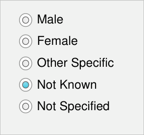
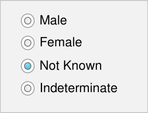
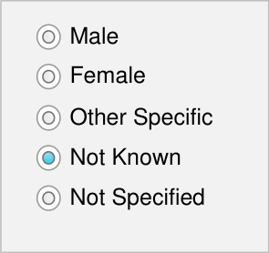
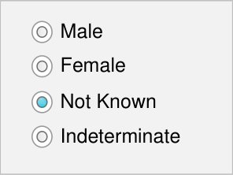
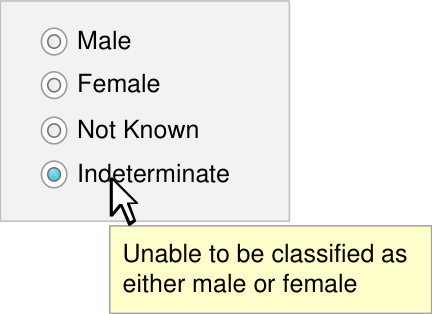

# **Sex and Current Gender** **Input and Display**

## **Quick Implementation Guide**

### **Edition 1** **22 [nd] April 2010**

Copyright ©2013 Health and Social Care Information Centre

#### **Contents**

**Introduction** **2**

**Current Gender and Sex Display**

**Current Gender and Sex Input**

**3**

**4**

Current Gender Input 5

Sex Input 8

Input Control Definitions 11

**This document was prepared for NHS Connecting for Health which ceased to exist on 31 March 2013. It may**
**contain references to organisations, projects and other initiatives which also no longer exist. If you have**
**any questions relating to any such references, or to any other aspect of the content, please contact**
**cuistakeholder.mailbox@hscic.gov.uk**

**Copyright:**
You may re-use this information (excluding logos) free of charge in any format or medium, under the terms of
the Open Government Licence. To view this licence, visit nationalarchives.gov.uk/doc/open-governmentlicence or email psi@nationalarchives.gsi.gov.uk.

#### **1**

Copyright ©2013 Health and Social Care Information Centre

#### **Guidance** **Introduction**

The NHS categorises a person’s gender in two ways:

  - **Person Gender Current**, which refers to a person’s current gender classification

For brevity and clarity, this document uses the term **Current Gender** for this concept

  - **Person Gender at Registration**, which refers to the record of a person’s gender
classification at the point of birth registration

For brevity and clarity, this document uses the term **Sex** for this concept

Healthcare professionals and patients may confuse the terms ‘Current Gender’ and ‘Sex’,
or assume that they are synonymous. Therefore, all NHS applications should display and
explain those terms in a clear and consistent manner, both at input and at subsequent
display.

Allowable values for Current Gender and Sex need to be from a pre-defined, restricted set
in order to ensure legal compliance and data interoperability and to respect patient
sensitivity.

**Important**

The values defined in this document are based upon the current proposed changes to
the _NHS Data Model and Dictionary_ **[1]** . Should future changes be made to this
document, amendments to this guidance will be required.

Although it contains all of the guidance points, this document omits supporting
information and is therefore not intended as a substitute for the full NHS CUI document
_Sex and Current Gender Input and Display_ **[2]** . Refer to that document for the definitive
statement of the design guidance in this area.

The visual representations used to display the guidance are illustrative only. Stylistic
choices (for example, display font used), unless otherwise specified, are not part of the
guidance and are therefore not mandatory requirements.

**1** NHS Data Model and Dictionary

http://www.datadictionary.nhs.uk/index.asp

**2** Sex and Current Gender Input and Display – User Interface Design Guidance (v4.0.0.0)

Copyright ©2013 Health and Social Care Information Centre

#### **2**

#### **Guidance**

### **Current Gender and Sex Display**

Male

Female

Other Specific

Not Known

Not Specified

Male

Female

Not Known

Indeterminate

CGS-0003
#### The Current Gender status is one of the illustrated values

Mandatory

CGS-0011
#### The Sex status must only contain one of the illustrated values

Mandatory

CGS-0007
_Current Gender_ Not Known

_Sex_ Female

#### Label the Current Gender status display ‘Current Gender’

#### **3**

_Recommended_

CGS-0016
#### Label the Sex status display ‘Sex’

_Recommended_

Copyright ©2013 Health and Social Care Information Centre

#### **Guidance**

### **Current Gender and Sex Input**

The guidance supports two control styles for input of Current Gender and Sex

**Option Button Group**
(also known as Radio Button Group)

Current Gender

**Drop-Down List Box**

|Current Gender|Col2|
|---|---|
|Not Known||
|Male Female Other Specific **Not Known** Not Specified|Male Female Other Specific **Not Known** Not Specified|

Sex

|Sex|Col2|
|---|---|
|||
|Male Female Not Known Indeterminate|Male Female Not Known Indeterminate|

The Option Button group design
occupies more screen space but
provides better instruction to the user.

This control style should be used if
there is room on the input form.

Copyright ©2013 Health and Social Care Information Centre

#### **4**

#### **Guidance**

### **Current Gender Input**

Current Gender

CGS-0001
#### Label the Current Gender input controls ‘Current Gender’

Mandatory

CGS-0008
#### Use ‘Not Known’ as the Current Gender default value

_Recommended_

CGS-0020
#### Current Gender option buttons group input controls must consist of five option buttons

Mandatory

CGS-0021
#### Current Gender option button group labels must be in the order illustrated

Mandatory

CGS-0022
#### The Current Gender tab order is the same as illustrated

_Recommended_

Copyright ©2013 Health and Social Care Information Centre

#### **5**

### **Current Gender Input**

Current Gender

Current Gender

|Not Known|Col2|
|---|---|
|Male Female Other Specific **Not Known** Not Specified|Male Female Other Specific **Not Known** Not Specified|

default value

#### **Guidance**

CGS-0026
#### Use a single drop-down list box for the Current Gender control

Mandatory

CGS-0025
#### Current Gender drop-down list box options are in the order illustrated

Mandatory

CGS-0027
#### Do not use a prompt for the Current Gender control, due to its default value of ‘Not Known’

Mandatory

|(thus no prom|Col2|
|---|---|
|(thus no pro|(thus no pro|
|Not Known||

Current Gender CGS-0004

#### Make the definitions of the Current Gender status values accessible to the user

Mandatory

**Note** The tooltip is one example of
how a definition might be displayed.
The display style and definition are
not part of the guidance

Copyright ©2013 Health and Social Care Information Centre

|Male Female Other Specific Not Known When the person ha Not Specified idea of what their ge is neither discretely|Col2|Col3|
|---|---|---|
|Male Female Other Specific Not Known Not Specified When the person ha idea of what their ge is neither discretely| Not Specified When the person ha idea of what their ge is neither discretely| Not Specified When the person ha idea of what their ge is neither discretely|
||||

#### **6**

#### **Guidance**

### **Current Gender Input**

Male

Female

Other Specific

Not Known

Not Specified

#### **7**

CGS-0002
#### The Current Gender values are as illustrated

Mandatory

CGS-0005
#### Do not abbreviate Current Gender data values

Mandatory

CGS-0006
#### Do not display the underlying coded representation of the Current Gender data values For example, the standard code for ‘Male’ may be the integer 1, but this number should not appear

Mandatory

Copyright ©2013 Health and Social Care Information Centre

#### **Guidance**

### **Sex Input**

Sex

CGS-0009
#### Label the Sex input controls ‘Sex’

Mandatory

CGS-0013
#### The Sex default state is null

Mandatory

CGS-0023
#### Sex option button group input controls must consist of four option buttons

Mandatory

CGS-0024
#### Sex option button group labels are in the order illustrated

_Recommended_

Copyright ©2013 Health and Social Care Information Centre

#### **8**

#### **Guidance**

### **Sex Input**

Sex

Sex

#### **9**

CGS-0028

#### Ensure that Sex controls have no value selected by default and no method of returning to this ‘null’ state

Mandatory

CGS-0029
#### Use a single control for the Sex drop-down list box

Mandatory

CGS-0030
#### Ensure that the Sex drop-down list box is blank by default and does not contain a prompt

_Recommended_

CGS-0015
#### Make the definitions of the Sex status values accessible to the user

Mandatory

**Note** The tooltip is one example of
how a definition might be displayed.
The display style and definition are
not part of the guidance

Copyright ©2013 Health and Social Care Information Centre

|Male Female Not Known Indeterminate|Col2|Col3|
|---|---|---|
||Unable to be classified as either male or female|Unable to be classified as either male or female|

|Col1|Col2|
|---|---|
|Male Female **Not Known** Indeterminate|Male Female **Not Known** Indeterminate|

### **Sex Input**

Male

Female

Not Known

Indeterminate

#### **Guidance**

CGS-0010
#### The Sex values are as illustrated

Mandatory

CGS-0012
#### Sex data values must never be abbreviated

Mandatory

CGS-0014
#### The application must not display the underlying coded representation of the Sex data values For example, the standard code for ‘Male’ may be the integer 1, but this number must not appear

Mandatory

Copyright ©2013 Health and Social Care Information Centre

#### **10**

#### **Guidance**

### **Input Control Definitions**

Current Gender

|Male ‘Current Gender’ as bFy ethmea ilnedividual to t Other Specific Not Known Not Specified|Col2|Col3|
|---|---|---|
|Male Female Other Specific Not Known Not Specified ‘Current Gender’ as by the individual to t|Male Female   ‘Current Gender’ as by the individual to t|assigned   hemselves|
|Male Female Other Specific Not Known Not Specified ‘Current Gender’ as by the individual to t|Male Female   ‘Current Gender’ as by the individual to t||

_Other Specific_

When the person has a clear idea of
what their gender is, but is neither
discretely male nor female, for example,
‘intersex’, ‘transgender’, ‘third gender’

_Not Known_

Used when no information on this
subject is known

_Not Specified_

When the person is unable to specify
their current gender or does not have a
clear idea of their current gender

#### **11**

CGS-0017
#### Provide definitions for input controls

Mandatory

CGS-0019
#### Provide a shortened version of the definitions

_Recommended_

**Left** Examples of definitions for
Current Gender values

**Note** These definitions are
examples only and do not
form part of guidance

Copyright ©2013 Health and Social Care Information Centre

### **Input Control Definitions**

Sex

#### **Guidance**

CGS-0018
#### Provide access to definitions of the valid values

Mandatory

**Left** Examples of definitions for Sex
values

**Note** These definitions are
examples only and do not
form part of the guidance

_Not Known_

Used when no information on this
subject is known

_Indeterminate_

Used when the person is unable to be
classified as either male or female

Copyright ©2013 Health and Social Care Information Centre

#### **12**

