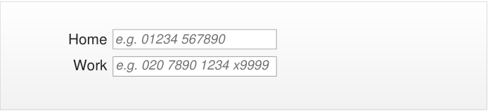
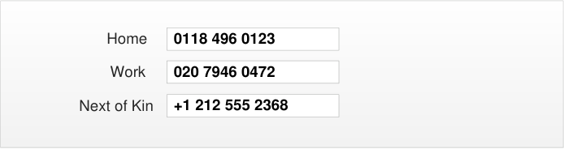
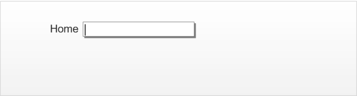
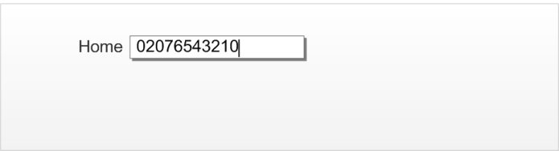
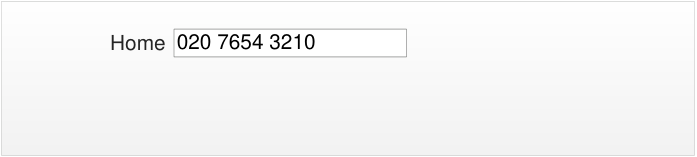
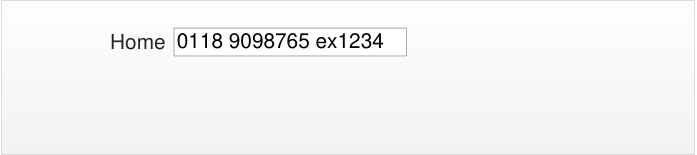
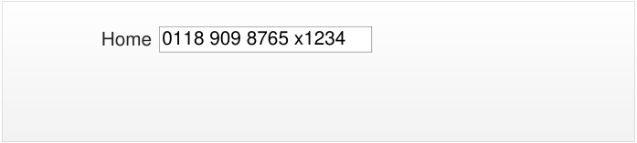
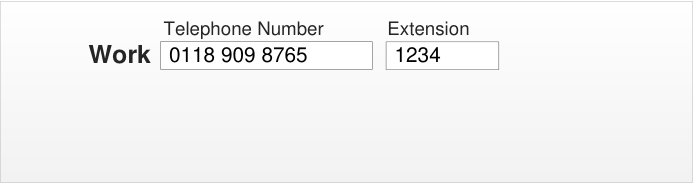

_Prepared for_

**NHS Connecting for Health**

**Tuesday, 23 June 2015**

**Version 4.0.0.0 Baseline**

_Prepared by_

**Clinical Application and Patient Safety Project**

**NHS CUI Programme Team**

**[cuistakeholder.mailbox@hscic.gov.uk](mailto:cuistakeholder.mailbox@hscic.gov.uk)**

HSCIC Controlled Document

### PREFACE

**Documents replaced by this document**

Telephone Number Input and Display – User Interface Design Guidance 3.0.0.0

Telephone Number Input and Display – User Interface Design Guidance 2.0.0.0

Design Guide Entry – Telephone Number Display 1.0.0.0

**Documents to be read in conjunction with this document**

Accessibility Checkpoints for NHS Applications 1.0.0.0

Accessibility for Clinical Applications 1.0.0.0

**This document was prepared for NHS Connecting for Health which ceased to exist on 31 March**
**2013. It may contain references to organisations, projects and other initiatives which also no**
**longer exist. If you have any questions relating to any such references, or to any other aspect of**
**[the content, please contact cuistakeholder.mailbox@hscic.gov.uk](mailto:cuistakeholder.mailbox@hscic.gov.uk)**

Copyright ©2013 Health and Social Care Information Centre

HSCIC Controlled Document

### TABLE OF CONTENTS

_**1**_ _**Introduction .................................................................................................................................... 1**_

1.1 Customer Need ......................................................................................................................... 1

1.1.1 Overview ............................................................................................................................. 1

1.1.2 Eliminating Inconsistencies Across Systems ...................................................................... 2

1.1.3 Simplified User Interface Design and Development ........................................................... 2

1.2 Scope ........................................................................................................................................ 2

1.2.1 In Scope .............................................................................................................................. 2

1.2.2 Out of Scope ....................................................................................................................... 2

1.3 Dependencies and Assumptions .............................................................................................. 3

1.4 Key Principles ........................................................................................................................... 3

_**2**_ _**Recommendations and Guidance ................................................................................................ 4**_

2.1 Telephone Number Display ...................................................................................................... 4

2.1.1 Guidance ............................................................................................................................. 5

2.1.2 Examples of Correct Usage ................................................................................................ 6

2.1.3 Examples of Incorrect Usage .............................................................................................. 6

2.1.4 Rationale ............................................................................................................................. 7

2.2 Telephone Number Input .......................................................................................................... 8

2.2.1 Unassisted Design .............................................................................................................. 8

2.2.2 Assisted Design................................................................................................................. 12

_**3**_ _**Document Information ................................................................................................................ 15**_

3.1 Terms and Abbreviations ........................................................................................................ 15

3.2 Definitions ............................................................................................................................... 15

3.3 Nomenclature ......................................................................................................................... 15

3.3.1 Body Text .......................................................................................................................... 15

3.3.2 Cross References.............................................................................................................. 16

3.4 References ............................................................................................................................. 16

_**APPENDIX A**_ _**Telephone Number Rules ......................................................................................... 17**_

PART I CSA Rules For Telephone Number Element Identification ............................................... 17

PART II Example Additional Rules Handling Extension Numbers ............................................. 19

Page iii

Copyright ©2013 Health and Social Care Information Centre

HSCIC Controlled Document

**Patient Safety Process**

The development lifecycle for this design guide includes an integrated patient / clinical safety risk
assessment and management process.

Known patient safety incidents relevant to this design guidance area have been researched and
reviewed as part of ongoing development. The resulting guidance points aim to support mitigation
of these known patient safety risks. In addition, the developers of this design guide have
undertaken a patient safety risk assessment to identify new risks that could potentially be
introduced by the guidance points in this document. Any potential risks identified have been
assessed and managed to support the ongoing clinical safety case for this design guide.

The Hazard Log records all the risks that have been identified during development and describes
mitigatory actions that, in some cases, will need to be taken by users of this design guide. The
Hazard Log is a live document that is updated as the design guide is developed and maintained.
Until this design guide has received full Clinical Authority to Release (CATR) from the NHS
Connecting for Health (CFH) Clinical Safety Group (CSG) – based on an approved Clinical Safety
Case – there may be outstanding patient safety risks yet to be identified and mitigated.

Additionally, users implementing applications that follow this design guide’s guidelines (for
example, healthcare system suppliers) are expected to undertake further clinical safety risk
assessments of their specific systems within their specific context of use.

[Refer to www.cui.nhs.uk](https://emea.mail.microsoft.com/OWA/redir.aspx?C=2aab7991b0924c8f92c4e2824ab8a971&URL=http%3a%2f%2fwww.cui.nhs.uk) for further information on the patient safety process and for the safety
status and any relevant accompanying safety documentation for this design guide.

Page iv

Copyright ©2013 Health and Social Care Information Centre

HSCIC Controlled Document

### 1 INTRODUCTION

This document describes the design guidance for the display and input of ‘Telephone number’ data.
It describes the area of focus, provides guidance and recommendations, and explains the rationale
behind the guidance and recommendations.

This document is intended for the use of anyone whose role includes screen design,
implementation, or assessment of a National Health Service (NHS) clinical application. This
document can be used as guidance for the:

 Specification of an input and display control for Telephone data in a user interface (UI)

 Implementation of an input and display control for Telephone data within an application

 Assessment of an input and display control for Telephone data in an NHS clinical

application user interface

Figure 1 shows an example of a guidance-compliant ‘Single Text Entry Box’ designed to assist in
UK-based telephone number input. Figure 2 shows an example of a text entry box combined with a
‘Country Selector’, which is guidance-compliant for non-UK-based telephone number input.

Figure 1: Single Text Entry Box

Figure 2: Country Selector Assisted Text Entry Box

**Note**

Elements used within a software application are commonly referred to as a ‘control’. These can take many
forms but the types referred to in this document will either be ‘input controls’ that can receive input from a
user, such as a button, text box, option button (radio button) or check box, or ‘display controls’ such as a
label, which can only display information.

Table 1 describes the changes made since the previous version of this guidance (Baseline version
3.0.0.0 dated 25 June 2009):

**Deleted** Brackets around area codes (throughout document)

**Amended** Text within paragraphs to reflect removal of brackets (throughout document)

**Added** Incorrect usage example (section 2.2.1.5)

Table 1: Changes Since the Last Baseline Version

#### **1.1 Customer Need**

This section explains why this guidance has been created.

##### **1.1.1 Overview**

Telephone numbers display in various contexts within an NHS application, many of which are
displayed within a clinical system. As such, it is an important requirement for both patient safety
and general usability that each number can be easily recognised as unique, in order to reduce
errors and increase efficiency. By assisting the user when inputting telephone numbers, errors are
reduced and data quality is increased.

Page 1

Copyright ©2013 Health and Social Care Information Centre

HSCIC Controlled Document

##### **1.1.2 Eliminating Inconsistencies Across Systems**

Significant inconsistencies exist across the labelling, inputting, and displaying of telephone
numbers across various clinical applications. With clinical users often switching between
applications, these inconsistencies can lead to the incorrect identification of patients, which in turn,
leads to safety issues. Reduction of inconsistency is therefore an important goal in itself and the
primary aim of this guidance.

##### **1.1.3 Simplified User Interface Design and Development**

Having a consistent layout and set of values for the input and display of data items in clinical
systems potentially makes the design and development of such systems safer, easier, and quicker.

#### **1.2 Scope**

This section defines the scope of this guidance document.

##### **1.2.1 In Scope**

This guidance is applicable primarily to electronic user interfaces such as those displayed on
desktop and laptop computers. However, many of the principles can also be applied to paper form
design, should it be required. The following items are in scope:

 **Defining the valid values for Telephone display and input**

 **Control layout and structure, in order to achieve:**

 Optimal visibility of the values

 Easy recognition of the values in the context of the wider clinical application

 Easy recognition of data type requested for input

 Reduction of invalid entries

 Optimal size of input fields

##### **1.2.2 Out of Scope**

This section defines areas that are not covered in this guidance. Although there may be specific
risks associated with these areas that are not addressed in this guidance, it is likely that the
principles in this guidance will extend to the aspects of the input and display of telephone numbers
in many of the areas listed below.

The following items are out of scope:

 **Data storage**  - This guidance does not prescribe the format for storing data that is input or

displayed

 **Terms of use**  - This guidance does not define when an input field or display should be

presented within a system

 **Form design**  - This guidance does not prescribe the correct layout for a form or the

navigation around a form

 **Fax numbers**  - This guidance does not prescribe the format for fax numbers

 **Data input control types**  - This document does not specify how the input controls should

be labelled, for example, ‘Home number’ or ‘Preferred contact’. The concept of types and
context are not explicitly supported. However, the flexible behaviour of the input control and
the exclusion of a control-level label enable the developer to reuse the same input control
for multiple situations. Figure 3 displays an example of the controls used for multiple ‘types’
of telephone data:

Page 2

Copyright ©2013 Health and Social Care Information Centre

HSCIC Controlled Document

**Telephone Details**

Figure 3: Example of Two Single Entry Boxes Used for Different Contexts

**Note**

Listing an item as out of scope does not classify it as unimportant. Project time and resource constraints
inevitably restrict what can be in scope for a particular release. It is possible that items out of scope for
this release may be considered for a future release.

#### **1.3 Dependencies and Assumptions**

Compliance with other guidance is required as follows:

 The design of NHS clinical applications must conform to _Accessibility Checkpoints for NHS_

_Clinical Applications_ **{R1}** and _Accessibility for Clinical Applications_ **{R2}**

**Important**

The visual representations used within this document to display the guidance are illustrative only. Stylistic
choices are not part of the guidance and are therefore not mandatory requirements for compliance with
the guidance in this document.

#### **1.4 Key Principles**

The following key principles have shaped the guidance in this document:

 Display information according to existing standards

 Minimise opportunities for human error

 Display sufficient instructional information to support data quality

 Promote consistency across the mix of users, NHS clinical applications and care settings

 Ensure reliable and accurate identification of an individual patient record

 Minimise opportunities where patient-clinician relationships may be compromised

Page 3

Copyright ©2013 Health and Social Care Information Centre

HSCIC Controlled Document

### 2 RECOMMENDATIONS AND GUIDANCE

The guidance provided throughout this document is based upon a programme of user research,
including:

 Previous background research for this design specification, which reviewed the standards

of the following organisations:

 UK Government Office of Communications (Ofcom)

 UK Government Data Standards

 Microsoft [®] Corporation

 IBM [®] Corporation

 Dell [®]

 A desk-based research project looking at a range of information entry Web pages and

clinical applications

 A Web-based survey of 41 respondents from NHS clinicians and administrative staff,

Independent Software Vendors (ISVs), community pharmacists, and NHS Connecting for
Health (CFH)

 A Patient Safety Assessment

**Important**

The visual representations used within this document to display the guidance are illustrative only. They
are simplified in order to support understanding of the guidance points. Stylistic choices, such as colours,
fonts or icons are not part of the guidance and unless otherwise specified are not mandatory requirements
for compliance with the guidance in this document.

#### **2.1 Telephone Number Display**

This section defines the recommendations for displaying telephone numbers in NHS clinical
applications. NHS clinical applications should display telephone numbers in this format to facilitate
contact by telephone with patients, clinicians, hospitals or surgeries.

The chosen layout provides the best display format because it shows a complete, unambiguous
presentation of telephone contact details, which includes all information and clearly identifies
optional digits.

**Note**

It is recognised that most telephone numbers stored within NHS clinical applications will relate to UK
locations. In these cases, the international code element is not required.

Telephone numbers in NHS clinical applications can comprise up to four elements, are separated
by spaces and are displayed in the following order:

 **International Code (optional)**  - Is represented by a plus (+) symbol followed by the

relevant numeric country code (which will be between two and four digits)

 **Area Code (mandatory)**  - The entire area code (including optional digits such as a leading

zero) must not be enclosed within brackets. This code is usually a sequence of between
three and six digits. Where the international code is displayed, optional digits within the
area code should be omitted

**Note**

Page 4

Copyright ©2013 Health and Social Care Information Centre

HSCIC Controlled Document

Ofcom holds responsibility for UK telecommunications. Ofcom manages the UK telephone
numbering plan, including area codes, and this may change from time to time.

 **Local Number (mandatory)**  - If the local number (typically a sequence of between four

and eight digits) contains more than six digits, then a single space should precede the final
four digits

 **Extension Number (optional)**  - Is validly represented by either:

 A single input box including an ‘x’ character displayed directly after the telephone
number followed by a numeric extension code (typically four digits in length)

The full telephone number then displays as:

+ _International Code Area Code_ _Local Number_ x _Extension Number_

 Display in a separate extension input box adjacent to the telephone number input box

The full telephone number then displays as:

+ _International Code_ _Area Code_ _Local Number_ [Extension _Extension Number_ ]

Figure 4 shows an example of the recommended telephone number format:

Figure 4: Recommended Telephone Number Formats Showing Telephone and Extension Number Within a Single Input Box

##### **2.1.1 Guidance**

TID-0001 If the country code is for the UK, for example, ‘+44’ or ‘0044’, then it must not be displayed. Mandatory

TID-0002 When displayed, the country code must always be displayed with a ‘+’ sign in front of it. Mandatory

TID-0003 When displayed, the country code must not display any leading zeros. Mandatory

TID-0004 When displayed, the country code must be separated from the rest of the telephone number by
a single space.

Mandatory

TID-0005 For UK telephone numbers, the area code must not be displayed with brackets around it. Mandatory

TID-0006 For UK telephone numbers, the area code must be separated from subsequent numbers by a
space.

TID-0007 For UK telephone numbers, extension numbers can be displayed with an ‘x’ preceding and
adjacent to the number.

TID-0008 For UK telephone numbers where the telephone and extension numbers are displayed within a
single input box, the extension number must be separated from the rest of telephone number by
a single space that precedes the ‘x’.

TID-0026 For UK telephone numbers where the extension number is displayed in a separate input box, a
label must be shown above the input box to indicate the content

Copyright ©2013 Health and Social Care Information Centre

Mandatory

Recommended

Mandatory

Recommended

Page 5

HSCIC Controlled Document

TID-0009 For UK telephone numbers, if there are more than six digits in the local number, (in other words,
not the country code, area code or extension number), then a space must be inserted before
the final four digits.

TID-0010 The telephone number should be formatted for display according to the rules detailed in
APPENDIX A.

Table 2: Guidance for Telephone Number Display

##### **2.1.2 Examples of Correct Usage**

Mandatory

Recommended

029 2018 0928

0151 496 0947

01632 96032601632
96029

016329 60541

016329 6054

020 7946 0472 x1234

+1 555 323 1020

+356 8437 4667

+91 645623 4576 7898

Use this format to display telephone numbers
within a clinical application.

#### 

[International Code <space>] Area Code
<space> Local Number [‘x’ Extension
Number]

Local numbers with more than six digits
include a space before the final four digits

Table 3: Correct Telephone Number Formatting Examples

##### **2.1.3 Examples of Incorrect Usage**

Where optional digits are omitted (029) 2018 0928
#### 

(0151) 496 0947

(01632) 960326

(01632) 96029

(016329) 60541

(016329) 6054

+44 029 2018 0928

+44 0151 496 0947

+44 01632 960326

+44 01632 96029

+44 016329 60541

+44 016329 6054

+44 29 2018 0928

+44 151 496 0947

+44 1632 960326

+44 1632 96029

+44 16329 60541

+44 16329 6054

Examples incorrectly shown with brackets around
the area codes.

This example lacks clarity because there is no
distinction between optional and mandatory digits
(such as leading zeros). It includes the
unnecessary International Code for the UK.

This example includes the unnecessary
international code for the UK, and the leading zero
from the area code is missing.

Page 6

####  

International Code <space> Area Code
<space> Local Number

International Code <space> (Area Code)
<space> Local Number

Copyright ©2013 Health and Social Care Information Centre

HSCIC Controlled Document

+442920180928

+441514960947

+441632960326

+44163296029

+441632960541

+44163296054

This example lacks completeness and readability
due to the inclusion of the international code for
the UK, the omission of the optional leading zero
from the area code and omission of the separators
between elements.

This example lacks readability due to the omission
of the separators between elements.

####  

International Code Area Code Local
Number

Area Code Local Number 02920180928

01514960947

01632960326

0163296029

01632960541

0163296054

Table 4: Incorrect Telephone Number Formatting Examples

##### **2.1.4 Rationale**

The use of spaces aids readability by logically grouping the digits into meaningful categories. The
recommended grouping follows commonly-used conventions and thus aids recognisability for the
user.

_**2.1.4.1**_ _**Accessibility**_

The inclusion of the international and area codes assists with the unique recognition of telephone
number formats from other countries. The plus sign provide a clear indication that the value
represents an international telephone number. This is important because the length of each
element of a telephone number element may vary.

An inherent problem with screen reader software is that the form that numbers take when read out
is dependent on the numbers themselves. Examples of spoken telephone numbers include:

 **01632 960154** dictated as “zero sixteen thirty two nine hundred sixty thousand one hundred

fifty four”

It is unfortunate that the audible reading patterns differ according to the specific number. However,
this is considered acceptable because screen reader users are accustomed to dealing with such
numbers.

_**2.1.4.2**_ _**Patient Safety**_

A Telephone number display affects patient safety when it appears in close proximity to the NHS
Number within a screen. In such cases, the numbers could be confused, resulting in the user
accessing the wrong patient record details. Therefore, the format of each number should provide a
clear distinction between the relevant value types. This is illustrated in Figure 5:

Figure 5: Example of a Telephone Number Format in Close Proximity to an NHS Number

NHS numbers should display as groups of digits, separated by single spaces. Telephone numbers
should exhibit formats that clearly distinguish them from associated NHS numbers. This can be
achieved easily by preceding the optional international code with a plus sign (‘+’).

Page 7

Copyright ©2013 Health and Social Care Information Centre

HSCIC Controlled Document

_**2.1.4.3**_ _**Clinical Utility**_

A user should view telephone number information in a consistent format, with a recognisable
reading pattern. This format ensures a clear distinction between the constituent elements.

One of the main considerations for users is whether to display the international code. If it is
displayed in all instances, there will never be a need to look up secondary sources for extra dialling
codes. However, most telephone numbers stored within NHS clinical applications will relate to UK
locations, in which case the international code element is redundant.

For consistency, certainty and the avoidance of ambiguity, applications should implement a single
format for all telephone numbers. It is also beneficial to use a display format that clearly
distinguishes telephone numbers from other numerical information, such as dates and NHS
numbers.

_**2.1.4.4**_ _**Display Space**_

Telephone numbers display in various contexts within an NHS application. From an application
developer’s perspective, an important consideration is display space. Telephone numbers can have
variable lengths, potentially extending up to 20 digits with the international code. Separators
increase the overall length.

#### **2.2 Telephone Number Input**

The purpose of the telephone number input control is to allow the user to enter a telephone
number. The input control has two states: a single unassisted entry input box (primarily used for UK
telephone number entry), as displayed in Figure 6, and a single entry box with country selector
assistance (primarily used for non-UK telephone numbers), as displayed in Figure 7.

Figure 6: Single Text Entry Box

Figure 7: Country Selector Assisted Text Entry Box

These two different states have been designed for the specific purpose of making different number
types easy to enter. The Single Text Entry Box encourages convenient entry of UK-based
numbers, and the Country Selector Assisted Entry Box assists the user in the convenient entry of
non-UK-based numbers. However, both designs will accept and correctly identify both UK and
non-UK numbers.

##### **2.2.1 Unassisted Design**

The ‘unassisted’ single text entry box for UK telephone entry is a freeform text entry box that:

 Uses rules to identify number formats

 Removes extraneous characters from the input

 Displays clean data in a safe and distinct format

Page 8

Copyright ©2013 Health and Social Care Information Centre

HSCIC Controlled Document

The size of the single text entry box is related to how the text is displayed in the interface. The size,
weight, style and type of font used all affect how much space is required to display the right amount
of information. The requirement is for the input box to display over 95% of the expected input
values 100% of the time. It is therefore preferable to specify the size of input boxes in relation to
character strings:

 **Default** length to accommodate the following example prompt text: 020 1234 5678 x1234

 **Minimum** length to accommodate the following example prompt text: 01234 567890

 **Maximum** length is not constrained

The rules surrounding how the telephone number input box behaves is detailed in the document
entitled _CFH NPFIT CSA – Telecommunication Address Display Requirements for CSA_ **{R3}** .
However, the NHS CUI Programme has the additional requirement to handle extension numbers
upon display.

The basic principles below should be followed:

 The Input box should accept formatted and unformatted entries

 If the number can be identified as a valid type (as per the rules in _CFH NPFIT CSA –_

_Telecommunication Address Display Requirements for CSA_ **{R3}** ), the input box should
strip out formatting upon losing focus, and replace it with a reformatted equivalent which:

 Places spaces in logical locations for readability purposes

 If the number cannot be identified as a valid type (as per the rules in _CFH NPFIT CSA –_

_Telecommunication Address Display Requirements for CSA_ **{R3}** ) then:

 The input box leaves the entry as it was entered

 The input box displays the entry to the user as it was entered

 The UK country code can be entered but is removed from display after it has been

committed

 All other country codes are retained (as detailed in APPENDIX A.)

A number of different use cases are displayed from Figure 8 to Figure 15:

Figure 8: User Is Presented with a Plain Single Entry Box Without Prompt but with ISV Supplied Labels

Figure 9: User Places Focus in the Entry Box and Selects the Control to Initiate Entry Mode

Page 9

Copyright ©2013 Health and Social Care Information Centre

HSCIC Controlled Document

Figure 10: User Types in an Unformatted Telephone Number

Figure 11: The Control Displays the Correctly Formatted Number to the User Upon Exit

Figure 12: Entry of an Extension Number Within a Single Text Entry Box

Figure 13: Example of a Reformatted Extension Number Within a Single Text Entry Box

Figure 14: Entry of a Number and an Extension Number in Separate Input Boxes

Figure 15: Example of a Reformatted Number and Extension Number Boxes

_**2.2.1.1**_ _**Prompts**_

The choice of what string to use for the prompt for an unassisted text entry box will be
context-specific. Some suggested prompts for use with certain situations are:

Copyright ©2013 Health and Social Care Information Centre

Page 10

HSCIC Controlled Document

 ‘Home’ label, for example, "e.g. 01234 567890"

 ‘Work’ label, for example, "e.g. 020 1234 5678 x1234"

 ‘Work’ label, for example, “e.g. 020 1234 5678 [separate extension box prompt] 1234”

_**2.2.1.2**_ _**Tooltips**_

The choice of what string to use for the tooltip for an unassisted text entry box will be
context-specific. Some suggested tooltips for use with certain situations are:

 ‘Home’ label, for example, ‘Enter the ‘home’ telephone number’

 ‘Work’ label, for example, ‘Enter the ‘work’ telephone number. To include an extension

number, add an ‘x’ to the front of the extension number

 ‘Work’ label, for example ‘Enter the ‘work’ telephone number. To include an extension

number, enter the number into the extension number box’

_**2.2.1.3**_ _**Guidance**_

TID-0011 Use a free-text input box for the entry of telephone number. Mandatory

TID-0027 Use a free-text input box where extension number is input into a separate input box Mandatory

TID-0012 Ensure the input box accepts formatted and unformatted entries. Mandatory

TID-0013 If the number can be identified as a valid type (as detailed in APPENDIX A), the input box
should strip out formatting upon losing focus and replace it with a reformatted equivalent.

TID-0014 Display a reformatted entry to the user which:

 Places spaces in logical locations for readability

TID-0015 If the number cannot be identified as a valid type (as detailed in APPENDIX A), display the
entry to the user as it was entered.

Mandatory

Mandatory

Mandatory

TID-0016 Remove the UK country code from display after it is committed. Mandatory

TID-0017 Retain all other country codes. Mandatory

TID-0018 Do not display UK numbers with the international prefix. Mandatory

TID-0019 Display non-UK numbers with a + prefixed to the country code. Mandatory

Table 5: Guidance for Unassisted Telephone Number Input

_**2.2.1.4**_ _**Examples of Correct Usage**_

####  A single free-text

input box design

####  Can identify and

reformat
telephone
numbers

####  Can identify and

reformat
telephone
numbers with
extensions

0118 909 8765 x1234

The user should be able to input whatever data value
they feel is most appropriate.

The input should intelligently reformat for readability
(as detailed in APPENDIX A).

The input box should be able to handle extension
numbers.

Page 11

Copyright ©2013 Health and Social Care Information Centre

HSCIC Controlled Document

####  Can identify and

reformat
telephone number
with extension
number displayed
in separate input
box

An extension number maybe displayed using a
separate input box

Telephone Number

0118 909 8765

Extension

1234

Table 6: Correct Examples of Unassisted Telephone Number Input

_**2.2.1.5**_ _**Examples of Incorrect Usage**_

####  Separate input

box for area code

A separate input box for the area code can cause
users to incorrectly guess the area code.

####  Brackets are shown around the area code on a

formatted number.

Table 7: Incorrect Examples of Unassisted Telephone Number Input

_**2.2.1.6**_ _**Rationale**_

The inconsistent length of area codes in the UK can cause users to make errors when they are
asked to distinguish the area code from the rest of the telephone number. Therefore, a single entry
text box is the safest and most effective design.

##### **2.2.2 Assisted Design**

This control prepends a country selector to the single text input box. The country selector assists
the user in selecting the correct dialling code for non-UK telephone numbers, by presenting the
user with a list box of known dialling codes, at the time of creation.

The addition of the country selector increases the screen space required by the input control and is
not seen as a regular usage case. As such, it is not envisaged as the default input control. The
primary use case for this control is as a secondary level of input after the user has stated that they
will be inputting a non-UK number.

The country selector is shown in Figure 16 and appears expanded in the context of a full input
control in Figure 17.

Figure 16: Country Selector in Default State

|Country Cod|de|Col3|Telephone Number|Col5|
|---|---|---|---|---|
|+44 (UK)|||_ e.g. 01234 567890_||
|+44 (UK)  +93 (AF)  +355 (AL)  +213 (DZ)  +376 (AD) +244 (AO)  +54 (AR) Congo, Democratic Republic of the  +242 (CD) United Kingdom Afghanistan Albania Algeria Andorra Angola Argentina|+44 (UK)  +93 (AF)  +355 (AL)  +213 (DZ)  +376 (AD) +244 (AO)  +54 (AR) Congo, Democratic Republic of the  +242 (CD) United Kingdom Afghanistan Albania Algeria Andorra Angola Argentina|+44 (UK)  +93 (AF)  +355 (AL)  +213 (DZ)  +376 (AD) +244 (AO)  +54 (AR) Congo, Democratic Republic of the  +242 (CD) United Kingdom Afghanistan Albania Algeria Andorra Angola Argentina|+44 (UK)  +93 (AF)  +355 (AL)  +213 (DZ)  +376 (AD) +244 (AO)  +54 (AR) Congo, Democratic Republic of the  +242 (CD) United Kingdom Afghanistan Albania Algeria Andorra Angola Argentina|+44 (UK)  +93 (AF)  +355 (AL)  +213 (DZ)  +376 (AD) +244 (AO)  +54 (AR) Congo, Democratic Republic of the  +242 (CD) United Kingdom Afghanistan Albania Algeria Andorra Angola Argentina|

Figure 17: Example of an Expanded Country Selector

Copyright ©2013 Health and Social Care Information Centre

Page 12

HSCIC Controlled Document

The country selector should have the following properties:

 **Default** length to accommodate the following example prompt text: "+376 (AD)"

 **Minimum** length to accommodate the following example prompt text: “+376 (AD)”

 **Maximum** length is not constrained

_**2.2.2.1**_ _**Guidance**_

TID-0020 Use a default value of +44 (UK) for the country code. Mandatory

TID-0021 Use the ISO 3166 names in the first column, the Ofcom list of dialling codes in the second
column and the ISO 3166 abbreviated country codes in the third column. Use the abbreviation
‘UK’ instead of the ISO 3166 code of ‘GB’.

TID-0022 Order the country names alphabetically.

Include United Kingdom once at the top of the list and once in its appropriate alphabetical
location.

Mandatory

Mandatory

TID-0023 Use an editable drop-down list for country codes. Recommended

TID-0024 Allow the country codes to be navigated using free-text entry. Recommended

TID-0025 Populate the country selector list with the three elements below and in this exact order:

1. Country name (left-aligned and vertically aligned to all rows).

2. Country dialling code (right-aligned using the '+' format, for example, ‘+44').

3. Country abbreviation (right-aligned, two-character code, enclosed in single brackets and

vertically aligned to all rows).

Table 8: Guidance for Assisted Telephone Number Input

_**2.2.2.2**_ _**Examples of Correct Usage**_

Recommended

####  Default selection

is the for UK

####  Drop-down list to

assist country
selection

####  Alphabetical

listing of countries
(with UK
duplication
exception)

|Country Code|e|Telephone Number|
|---|---|---|
|+44 (UK)||_ e.g. 01234 567890_|
|+44 (UK)  +93 (AF)  +355 (AL)  +213 (DZ)  +376 (AD) +244 (AO)  +54 (AR) Congo, Democratic Republic of the  +242 (CD) United Kingdom Afghanistan Albania Algeria Andorra Angola Argentina|+44 (UK)  +93 (AF)  +355 (AL)  +213 (DZ)  +376 (AD) +244 (AO)  +54 (AR) Congo, Democratic Republic of the  +242 (CD) United Kingdom Afghanistan Albania Algeria Andorra Angola Argentina|+44 (UK)  +93 (AF)  +355 (AL)  +213 (DZ)  +376 (AD) +244 (AO)  +54 (AR) Congo, Democratic Republic of the  +242 (CD) United Kingdom Afghanistan Albania Algeria Andorra Angola Argentina|

The user is only required to interact with the
country selector if it is a non-UK number.

A drop-down list of all the valid values assists the
user in correctly identifying the number they
need.

Alphabetising the country selector list assists the
user in finding the data they require. Because
‘UK’ is expected to be the primary selection of
users, it is duplicated for convenience.

Page 13

|Country Code|Col2|Telephone Number|Col4|
|---|---|---|---|
|+44 (UK)||_ e.g. 01234 567890_||
|+44 (UK)  +93 (AF)  +355 (AL)  +213 (DZ)  +376 (AD) +244 (AO)  +54 (AR) Congo, Democratic Republic of the  +242 (CD) United Kingdom Afghanistan Albania Algeria Andorra Angola Argentina|+44 (UK)  +93 (AF)  +355 (AL)  +213 (DZ)  +376 (AD) +244 (AO)  +54 (AR) Congo, Democratic Republic of the  +242 (CD) United Kingdom Afghanistan Albania Algeria Andorra Angola Argentina|+44 (UK)  +93 (AF)  +355 (AL)  +213 (DZ)  +376 (AD) +244 (AO)  +54 (AR) Congo, Democratic Republic of the  +242 (CD) United Kingdom Afghanistan Albania Algeria Andorra Angola Argentina|+44 (UK)  +93 (AF)  +355 (AL)  +213 (DZ)  +376 (AD) +244 (AO)  +54 (AR) Congo, Democratic Republic of the  +242 (CD) United Kingdom Afghanistan Albania Algeria Andorra Angola Argentina|

Table 9: Correct Examples of Assisted Telephone Number Input

Copyright ©2013 Health and Social Care Information Centre

HSCIC Controlled Document

_**2.2.2.3**_ _**Examples of Incorrect Usage**_

####  Use of separate

inputs for area
code

####  Country Code

input mechanism
that does not
allow free-text
input or display
the country code

Table 10: Incorrect Examples of Assisted Telephone Number Input

_**2.2.2.4**_ _**Rationale**_

The use of separate input boxes increases
screen clutter and the likelihood of input error.

The button input design does not suggest to the
user that they can type a selection here. It does
not display the numerical country code and so
increases the likelihood of a user committing a
duplication error by inputting the country code in
the second input box. Finally, the user cannot
check the full numerical number because they
cannot see the country code.

The country selector assists the user in the input of foreign numbers. If the user does not know the
required country code, they can select it from the alphabetised list. If they do know the country
code, they can input it directly as the input box is editable.

A large majority of cases will require a UK selection and therefore, this is both the default and the
first item on the list. A duplicate entry for the UK is in the logical location in the subsequent
alphabetised list, which ensures the user finds what they are searching for.

_**2.2.2.5**_ _**Text Input Box**_

The second field in the ‘assisted’ design, displayed with the title **Telephone Number** in Figure 17,
is the same as the single text entry box in section 2.2.1.

Page 14

Copyright ©2013 Health and Social Care Information Centre

HSCIC Controlled Document

### 3 DOCUMENT INFORMATION

#### **3.1 Terms and Abbreviations**

CSA Clinical Spine Application

CUI Common User Interface

ISV Independent Software Vendor

NHS National Health Service

NHS CFH NHS Connecting for Health

Ofcom UK Government’s Office of Communications

PDA Personal Digital Assistant

UI User Interface

Table 11: Terms and Abbreviations

#### **3.2 Definitions**

NHS Entity Within this document, defined as a single NHS organisation or group that is operated within a single
technical infrastructure environment by a defined group of IT administrators.

The Authority The organisation implementing the NHS National Programme for IT (currently NHS Connecting for Health).

Current best practice Current best practice is used rather than best practice, as over time best practice guidance may change or
be revised due to changes to products, changes in technology, or simply the additional field deployment
experience that comes over time.

Table 12: Definitions

#### **3.3 Nomenclature**

This section shows how to interpret the different styles used in this document to denote various
types of information.

##### **3.3.1 Body Text**

Code `Monospace`

Script

Other markup languages

Interface dialog names **Bold**

Field names

Controls

Folder names title case

File names

Table 13: Body Text Styles

Page 15

Copyright ©2013 Health and Social Care Information Centre

HSCIC Controlled Document

##### **3.3.2 Cross References**

Current document – sections Section number only

Current document – figures/tables Caption number only

Other project documents _Italics_ and possibly a footnote

Publicly available documents _Italics_ with a footnote

External Web-based content _Italics_ and a hyperlinked footnote

Table 14: Cross Reference Styles

#### **3.4 References**

**R1.** NHS CUI Design Guide Workstream – Accessibility Checkpoints for NHS Clinical Applications 1.0.0.0

**R2.** NHS CUI Design Guide Workstream – Accessibility for Clinical Applications 1.0.0.0

**R3.** CFH NPFIT CSA – Telecommunication Address Display Requirements for CSA 0.0.0.3

Table 15: References

Copyright ©2013 Health and Social Care Information Centre

Page 16

HSCIC Controlled Document

### APPENDIX A TELEPHONE NUMBER RULES

**Important**

For the purposes of clarity, it is important to emphasise that this Appendix is concerned only with the
display of telephone numbers. The format for telephone number storage or transmission is out of scope
for this design guidance. It is assumed that the application developer implements a suitable mechanism to
process the formats used in the target environment. This mechanism must ensure that the resulting
display of telephone numbers conforms to the guidelines in this document.

#### **PART I CSA Rules For Telephone Number Element Identification**

This section displays the list of rules defined by the Clinical Spine Application (CSA) for identifying
the elements within a telephone number. These can be found in _CFH NPFIT CSA –_
_Telecommunication Address Display Requirements for CSA_ **{R3}** .

1. If the value starts with a plus sign (+) or ‘00’, then apply International Number Prefix Rules **–**

**go to step 3** .

2. Otherwise apply UK Telephone Number Representation Rules **– go to step 11** .

The following numbered list describes the International Number Prefix Rules in the order they
should be applied.

3. If the value starts with ‘+44’, and the following digit is not ‘0’, then replace ‘+44’ with ‘0’ and

apply the UK Telephone Number Representation Rules **– go to step 11** .

4. If the value starts with ‘0044’, and the following digit is not ‘0’, then replace ‘0044’ with ‘0’;

apply the UK Telephone Number Representation Rules **– go to step 11** .

5. If the value starts with ‘+’, then apply the following International Number Representation

Rules **– go to step 8** .

6. If the value starts with ‘00’, then replace ‘00’ with ‘+’ and apply the following International

Number Representation Rules **– go to step 8** .

7. If the value starts with ‘+44’ or ‘0044’ and the following digit is ‘0’, then (this is invalid)

display the entire value as received **– end** .

The following numbered list describes the International Number Representation Rules in the
order they should be applied.

8. Add a space after the international dialling code element using the international standard

[available at http://www.itu.int/ITU-T/inr/codes.html.](http://www.itu.int/ITU-T/inr/codes.html)

9. Remove any immediately following separator character.

10.

a. If the remainder contains any non-numeric characters other than valid separator

characters, then display the remainder of the value as received **– end** .

b. Otherwise:

i. If the remainder contains any valid separator characters, then replace each
separator character with a space **– end** .

ii. Else, introduce spaces preceding every four characters, from the right, so that there

are never more than 6 characters without a break, and never fewer than 3
characters in a group **– end** .

Page 17

Copyright ©2013 Health and Social Care Information Centre

HSCIC Controlled Document

The following numbered list describes the UK Telephone Number Representation Rules in the
order they should be applied.

11.

a. If the value contains any non-numeric characters other than valid separator characters,

then display the value without further transformation **– end**

b. Otherwise, if the value contains valid separator characters, then remove the separator

characters and apply the transformation rules as specified in the following sections.

12. If the numeric value begins with ‘01’ or ‘02’, then test these geographic area number

representation rules in the following order. Only apply one rule.

a. If the code starts ‘02’, then insert a space after the 3rd digit.

b. If the code has a ‘1’ in the 3rd or 4th position, then insert a space after the 4th digit.

c. If the first 6 digits match any of the following 11 codes, then insert a space after the 6th

digit. 013873 Langholm; 015242 Hornby; 015394 Hawkshead; 015395 Grange-OverSands; 015396 Sedbergh; 016973 Wigton; 016974 Raughton Head; 017683 Appleby;
017684 Pooley Bridge; 017687 Keswick; 019467 Gosforth.

d. For all other codes, insert the space after the 5th digit.

13. Having applied the above rules, if the remainder of the number, following the space,

contains more than 6 digits, then introduce a space preceding the final four digits.

14. If the numeric value begins with ‘07’ or ‘05’ or ‘03’ or ‘04’ or ‘06’, then follow these number

representation rules:

a. Add a space after the first 5 digits (including the initial 0).

b. If the remainder contains more than 6 digits, then introduce a space preceding the final

four digits.

15. If the numeric value begins with ‘08’ or ‘09’, then follow these special services number

representation rules:

a. Add a space after the first 4 digits (including the initial 0).

b. If the remainder contains more than 6 digits, then introduce a space preceding the final

four digits.

16. If the numeric value does not begin with ‘0’, then display the value without further

transformation **– end** .

Page 18

Copyright ©2013 Health and Social Care Information Centre

HSCIC Controlled Document

#### **PART II Example Additional Rules Handling Extension Numbers**

This section lists the extra rules that are required to identify and display extension numbers. These
rules are additional to, and would need to be applied before, those defined in _CFH NPFIT CSA –_
_Telecommunication Address Display Requirements for CSA_ **{R3}** .

1. Identify if the number has any of the following characters or sequence of characters in it,

followed by a sequence of digits:

 ‘x’

 ‘ex’

 ‘ext’

 ‘extn’

 ‘extension’

 ‘extension number’

 Any of the above, followed by:
 ‘.’
 ‘:’
 ‘=’
 ‘-‘

2. If so, then remove the identified characters and replace with an ‘x’.

3. Then remove the ‘x’ with any subsequent digits and only replace them at the end of the

telephone number after all of the _CFH NPFIT CSA – Telecommunication Address Display_
_Requirements for CSA_ **{R3}** rules have been applied to the remaining telephone number.

Page 19

Copyright ©2013 Health and Social Care Information Centre

HSCIC Controlled Document

### REVISION AND SIGNOFF SHEET

#### **Change Record**

19-Sep-2007 Alan Pimm 1.0.0.1 Initial draft for review/discussion

21-Jan-2008 Niki Nicolaides 1.0.0.2 Initial copyedit complete

28-Jan-2008 Tony Rose 1.0.0.3 Accepted changes following copyedit

30-Jan-2008 Niki Nicolaides 1.0.0.4 Second copyedit complete

30-Jan-2008 Alan Pimm 1.0.0.5 Accepted changes following second copyedit

31-Jan-2008 Niki Nicolaides 1.0.1.0 Copyedit complete. Raised to Working Baseline

27-Feb-2008 Simon Burnham 1.0.1.1 Copyedit of document changes

27-Feb-2008 Tony Rose 1.0.1.2 Accepted changes following copyedit

28-Feb-2008 Simon Burnham 0.1.0.0 Raised to Baseline Candidate (version number also corrected)

03-Mar-2008 Vivienne Jones 2.0.0.0 Baseline following email approval from Tim Chearman. Raised this to
Baseline 2.0.0.0 as there was a previous Telephone Display document that
this is replacing. Baseline 2.0.0.0 is in keeping with what has been applied
to other guidance documents.

20-Apr-2009 Mick Harney 2.0.0.1 Foundation draft for ISB updates

29-May-2009 Rachel Eno 2.0.0.2 Updates

29-May-2009 Mick Harney 2.0.0.3 Copyedited updates

03-Jun-2009 Rachel Eno 2.0.0.4 Further updates

08-Jun-2009 Mick Harney 2.0.0.5 Copyedited latest changes

12-Jun-2009 Mick Harney 2.1.0.0 Raised to Baseline Candidate

25-Jun-2009 Simon Burnham 3.0.0.0 Raised to Baseline

16-Sep-2009 Rachel Eno 3.1.0.0 Removing use of brackets around area codes

16-Sep-2009 Manuela Perr 4.0.0.0 Raised to Baseline

Document Status has the following meaning:

 **Drafts 0.0.0.X**  - Draft document reviewed by the Microsoft CUI project team and the

Authority designate for the appropriate Workstream. The document is liable to change

 **Working Baseline 0.0.X.0**  - The document has reached the end of the review phase and

may only have minor changes. The document will be submitted to the Authority CUI project
team for wider review by stakeholders, ensuring buy-in and to assist in communication

 **Baseline Candidate 0.X.0.0**  - The document has reached the end of the review phase and

it is ready to be frozen on formal agreement between the Authority and the Company

 **Baseline X.0.0.0**  - The document has been formally agreed between the Authority and the

Company

Note that minor updates or corrections to a document may lead to multiple versions at a particular
status.

Page 20

Copyright ©2013 Health and Social Care Information Centre

HSCIC Controlled Document

#### **Open Issues Summary**

None

#### **Audience**

The audience for this document includes:

 **Authority CUI Manager / Project Sponsor** . Overall project manager and sponsor for the

NHS CUI project within the Authority.

 **Authority CAPS Project Manager.** Responsible for ongoing management and

administration of the Workstream.

 **The Authority Project Team** . The Authority team involved in the development of this

document.

 **Microsoft NHS CUI Team** . The team responsible for the development of this document.

#### **Reviewers**

Mike Carey Toolkit Workstream Lead

Tim Chearman UX Architect

Peter Johnson Clinical Architect

#### **Distribution**

Mike Carey Toolkit Workstream Lead

Tim Chearman UX Architect

Peter Johnson Clinical Architect

#### **Document Properties**

Document ‘Title’ Telephone Number Input and Display User Interface Design Guidance

Author NHS CUI Programme Team

Restrictions **RESTRICTED – COMMERCIAL; MICROSOFT COMMERCIAL;** Access restricted to: NHS
CUI Project Team, Microsoft NHS Account Team

Creation Date 19 September 2007

Last Updated 23 June 2015

Page 21

Copyright ©2013 Health and Social Care Information Centre

HSCIC Controlled Document

**Copyright:**

You may re-use this information (excluding logos) free of charge in any format or medium, under
the terms of the Open Government Licence. To view this licence, visit
[nationalarchives.gov.uk/doc/open-government-licence or email psi@nationalarchives.gsi.gov.uk.](https://web.nhs.net/OWA/redir.aspx?C=dMnSAL43xUOp9X_SOcscV9mT5A0smdBIh1_vxjdSDVCERI33v7-idn6tNFCNwJYUR1PxIW-Hd-E.&URL=http%3a%2f%2fnationalarchives.gov.uk%2fdoc%2fopen-government-licence)

Page 22

Copyright ©2013 Health and Social Care Information Centre

