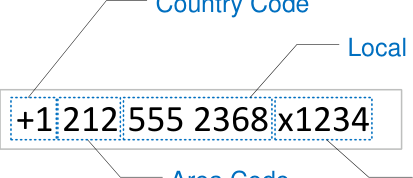
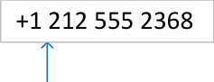
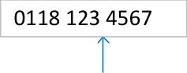
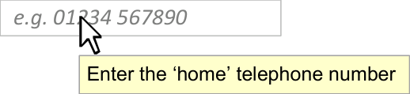
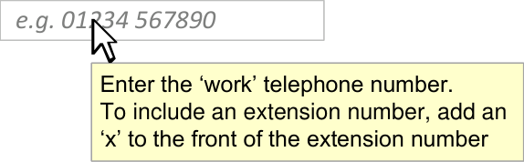
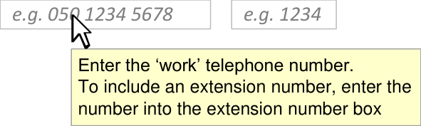

# **Telephone Number** **Input and Display**

## **Quick Implementation Guide**

### **Edition 1** **22 [nd] April 2010**

Copyright ©2013 Health and Social Care Information Centre

#### **Contents**

**Introduction** **2**

**Telephone Number Display** **3**

**Telephone Number Input** **6**

Prompts 7

Tooltips 7

Assisted Country Selector 11

**Appendix** **14**

**This document was prepared for NHS Connecting for Health which ceased to exist on 31 March 2013. It may contain**
**references to organisations, projects and other initiatives which also no longer exist. If you have any questions**
**relating to any such references, or to any other aspect of the content, please contact**
**cuistakeholder.mailbox@hscic.gov.uk**

**Copyright:**
You may re-use this information (excluding logos) free of charge in any format or medium, under the terms of the Open
Government Licence. To view this licence, visit nationalarchives.gov.uk/doc/open-government-licence or email
psi@nationalarchives.gsi.gov.uk.

#### **1**

Copyright ©2013 Health and Social Care Information Centre

#### **Guidance** **Introduction**

Telephone numbers are essential for communicating with patients and with other people
inside and outside the NHS. Therefore, they must be read and entered accurately and not
confused with other numbers, such as the patient's NHS Number.

**Important**

Although it contains all of the guidance points, this document omits supporting
information and is therefore not intended as a substitute for the full NHS CUI document
_Telephone Number Input and Display_ **[1]** . Refer to that document for the definitive
statement of the design guidance in this area.

The visual representations used to display the guidance are illustrative only. Stylistic
choices (for example, display font used), unless otherwise specified, are not part of the
guidance and are therefore not mandatory requirements.

**1** Telephone Number Input and Display – User Interface Design Guidance (v4.0.0.0)

Copyright ©2013 Health and Social Care Information Centre

#### **2**

#### **Guidance**

### **Telephone Number Display**

Telephone numbers in NHS clinical applications can comprise up to four elements:

TID-0001
#### Home 0118 496 0123 If the country code is for the UK, for example, ‘+44’ or ‘0044’, then it must not be displayed

Mandatory

TID-0002

#### Home +1 212 555 2368

space

#### When displayed, the country code must always be displayed with a ‘+’ sign in front of it

Mandatory

TID-0003
#### When displayed, the country code must not display any leading zeros

Mandatory

TID-0004

#### When displayed, the country code must be separated from the rest of the telephone number by a single space

Mandatory

Copyright ©2013 Health and Social Care Information Centre

#### **3**

#### **Guidance**

### **Telephone Number Display**

#### Work 0118 123 4567

|0118 123 4567|Col2|
|---|---|
|||

space

#### 0118 987 6543 x1234

|0118 987 6543 x1234|Col2|
|---|---|
|||

space

TID-0005
#### For UK telephone numbers, the area code must not be displayed with brackets around it

Mandatory

TID-0006
#### For UK telephone numbers, the area code must be separated from subsequent numbers by a space

Mandatory

TID-0007

#### For UK telephone numbers, extension numbers can be displayed with an ‘x’ preceding and adjacent to the number

_Recommended_

TID-0008

#### For UK telephone numbers where the telephone and extension numbers are displayed within a single input box, the extension number must be separated from the rest of the telephone number by a single space that precedes the ‘x’

Mandatory

Copyright ©2013 Health and Social Care Information Centre

#### **4**

#### **Guidance**

### **Telephone Number Display**

Telephone Number

#### 987 6543

Extension

#### 1234

TID-0026

#### For UK telephone numbers where the extension number is displayed in a separate input box, a label must be shown above the input box to indicate the content

_Recommended_

TID-0009
#### For UK telephone numbers, if there are more than six digits in the local number, (in other words, not the country code, area code or extension number), then a space must be inserted before the final four digits

Mandatory

TID-0010
#### The telephone number should be formatted for display according to the rules detailed in the Appendix

_Recommended_

Copyright ©2013 Health and Social Care Information Centre

space

#### **5**

#### **Guidance**

### **Telephone Number Input**

Telephone number input can be supported by one of two designs. Both designs will
accept and correctly identify both UK and non-UK numbers.

1. A single unassisted entry input box, optimised for UK telephone number entry.

This design should be used when it is anticipated that the majority of
telephone numbers input will be UK numbers:

#### Telephone Number e.g. 01234 567890

2. A single entry input box with country selector assistance, optimised for non-UK

telephone numbers:

Country Code

Telephone Number

#### _e.g. 01234 567890_

Copyright ©2013 Health and Social Care Information Centre

#### **6**

#### **Guidance**

### **Telephone Number Input**

#### **Prompts**

The choice of what string to use for the prompt for an unassisted text entry box will be
context specific. Here are some suggested prompts:

#### Home e.g. 01234 567890 Work e.g. 020 1234 5678

Telephone Number Extension

#### Work e.g. 050 1234 5678

#### _e.g. 1234_

#### **Tooltips**

The choice of what string to use for the tooltip for an unassisted text entry box will be
context specific. Here are some suggested tooltips:

Telephone Number Extension

Work

#### **7**

Copyright ©2013 Health and Social Care Information Centre

#### **Guidance**

### **Telephone Number Input**

TID-0011
#### Telephone Number e.g. 01234 567890 Use a free-text input box for the entry of telephone number

Mandatory

Telephone Number Extension

#### _e.g. 050 1234 5678_

#### _e.g. 1234_

TID-0027
#### Use a free-text input box where extension number is input into a separate input box

Mandatory

TID-0012

#### Ensure the input box accepts formatted and unformatted entries

Mandatory

Copyright ©2013 Health and Social Care Information Centre

Unformatted text entry

#### 01181234 01181234567

Formatted text entry

#### 01181-2 01181-23-45

#### **8**

#### **Guidance**

### **Telephone Number Input**

TID-0013
#### If the number can be identified as a valid type (as detailed in Appendix ), the input box should strip out formatting upon losing focus and replace it with a reformatted equivalent

Mandatory

TID-0014
#### Display a reformatted entry to the user which places spaces in logical locations for readability

Mandatory

TID-0015
#### If the number cannot be identified as a valid type (as detailed in Appendix ), display the entry to the user as it was entered

Mandatory

TID-0016
#### Remove the UK country code from display after it is committed

Mandatory

TID-0018
#### Do not display UK numbers with the international prefix

Mandatory

Copyright ©2013 Health and Social Care Information Centre

#### 01181-2 01181-23-45 0118 123 4567 +888 12.3 +888 12.34.5 +888 12.34.56.78 +44 118 123 4567 0118 123 4567

#### **9**

#### **Guidance**

### **Telephone Number Input**

TID-0017
#### Retain all other country codes

Mandatory

TID-0019
#### Display non-UK numbers with a + prefixed to the country code

Mandatory

Copyright ©2013 Health and Social Care Information Centre

#### +1 212 555 23 +1 212 555 2368

#### **10**

#### **Guidance**

### **Telephone Number Input**

#### **Assisted Country Selector**

The primary use case for this control is as a secondary level of input after the user has
stated that they will be inputting a non-UK number.

Country Code

Default State

Expanded

Column Contents

|+44 (UK)|Col2|Col3|Col4|
|---|---|---|---|
|United Kingdom Afghanistan Albania Algeria Andorra Angola Argentina +44 (UK) +93 (AF) +355 (AL) +213 (DZ) +376 (AD) +244 (AO) +54 (AR)|United Kingdom Afghanistan Albania Algeria Andorra Angola Argentina +44 (UK) +93 (AF) +355 (AL) +213 (DZ) +376 (AD) +244 (AO) +54 (AR)|United Kingdom Afghanistan Albania Algeria Andorra Angola Argentina +44 (UK) +93 (AF) +355 (AL) +213 (DZ) +376 (AD) +244 (AO) +54 (AR)||
|United Kingdom Afghanistan Albania Algeria Andorra Angola Argentina +44 (UK) +93 (AF) +355 (AL) +213 (DZ) +376 (AD) +244 (AO) +54 (AR)|United Kingdom Afghanistan Albania Algeria Andorra Angola Argentina +44 (UK) +93 (AF) +355 (AL) +213 (DZ) +376 (AD) +244 (AO) +54 (AR)|United Kingdom Afghanistan Albania Algeria Andorra Angola Argentina +44 (UK) +93 (AF) +355 (AL) +213 (DZ) +376 (AD) +244 (AO) +54 (AR)||
|United Kingdom Afghanistan Albania Algeria Andorra Angola Argentina +44 (UK) +93 (AF) +355 (AL) +213 (DZ) +376 (AD) +244 (AO) +54 (AR)|United Kingdom Afghanistan Albania Algeria Andorra Angola Argentina +44 (UK) +93 (AF) +355 (AL) +213 (DZ) +376 (AD) +244 (AO) +54 (AR)|United Kingdom Afghanistan Albania Algeria Andorra Angola Argentina +44 (UK) +93 (AF) +355 (AL) +213 (DZ) +376 (AD) +244 (AO) +54 (AR)||
|United Kingdom Afghanistan Albania Algeria Andorra Angola Argentina +44 (UK) +93 (AF) +355 (AL) +213 (DZ) +376 (AD) +244 (AO) +54 (AR)|United Kingdom Afghanistan Albania Algeria Andorra Angola Argentina +44 (UK) +93 (AF) +355 (AL) +213 (DZ) +376 (AD) +244 (AO) +54 (AR)|United Kingdom Afghanistan Albania Algeria Andorra Angola Argentina +44 (UK) +93 (AF) +355 (AL) +213 (DZ) +376 (AD) +244 (AO) +54 (AR)||
|Column One |Column One |Column One |Column One |

TID-0021

Country Code

Column Three

#### Use the content indicated in the illustration in columns one, two and three. Use the abbreviation ‘UK’ instead of the ISO 3166 code of ‘GB’

Mandatory

Copyright ©2013 Health and Social Care Information Centre

|One|ISO 3166 country names|
|---|---|
|Two|Ofcom list of dialling codes|
|Three|ISO 3166 abbreviated country codes|

#### **11**

### **Telephone Number Input**

#### **Assisted Country Selector**

Country Code Telephone Number

Country Code

#### **Guidance**

TID-0023
#### Use an editable drop-down list for country codes

_Recommended_

TID-0020
#### Use a default value of +44 (UK) for the country code

Mandatory

TID-0022
#### Order the country names alphabetically. Include United Kingdom once at the top of the list and once in its appropriate alphabetical location

Mandatory

TID-0024

#### Allow the country codes to be navigated using free-text entry

_Recommended_

|+44 (UK)|Col2|Col3|Col4|
|---|---|---|---|
|United Kingdom Afghanistan Albania Algeria Andorra Angola Argentina +44 (UK) +93 (AF) +355 (AL) +213 (DZ) +376 (AD) +244 (AO) +54 (AR)|United Kingdom Afghanistan Albania Algeria Andorra Angola Argentina +44 (UK) +93 (AF) +355 (AL) +213 (DZ) +376 (AD) +244 (AO) +54 (AR)|United Kingdom Afghanistan Albania Algeria Andorra Angola Argentina +44 (UK) +93 (AF) +355 (AL) +213 (DZ) +376 (AD) +244 (AO) +54 (AR)||
|United Kingdom Afghanistan Albania Algeria Andorra Angola Argentina +44 (UK) +93 (AF) +355 (AL) +213 (DZ) +376 (AD) +244 (AO) +54 (AR)|United Kingdom Afghanistan Albania Algeria Andorra Angola Argentina +44 (UK) +93 (AF) +355 (AL) +213 (DZ) +376 (AD) +244 (AO) +54 (AR)|United Kingdom Afghanistan Albania Algeria Andorra Angola Argentina +44 (UK) +93 (AF) +355 (AL) +213 (DZ) +376 (AD) +244 (AO) +54 (AR)||
|United Kingdom Afghanistan Albania Algeria Andorra Angola Argentina +44 (UK) +93 (AF) +355 (AL) +213 (DZ) +376 (AD) +244 (AO) +54 (AR)|United Kingdom Afghanistan Albania Algeria Andorra Angola Argentina +44 (UK) +93 (AF) +355 (AL) +213 (DZ) +376 (AD) +244 (AO) +54 (AR)|United Kingdom Afghanistan Albania Algeria Andorra Angola Argentina +44 (UK) +93 (AF) +355 (AL) +213 (DZ) +376 (AD) +244 (AO) +54 (AR)||
|United Kingdom Afghanistan Albania Algeria Andorra Angola Argentina +44 (UK) +93 (AF) +355 (AL) +213 (DZ) +376 (AD) +244 (AO) +54 (AR)|United Kingdom Afghanistan Albania Algeria Andorra Angola Argentina +44 (UK) +93 (AF) +355 (AL) +213 (DZ) +376 (AD) +244 (AO) +54 (AR)|United Kingdom Afghanistan Albania Algeria Andorra Angola Argentina +44 (UK) +93 (AF) +355 (AL) +213 (DZ) +376 (AD) +244 (AO) +54 (AR)||

Country Code

|Af|Col2|Col3|Col4|
|---|---|---|---|
|United Kingdom **Afghanistan** Albania Algeria Andorra Angola Argentina +44 (UK) **+93 (AF)** +355 (AL) +213 (DZ) +376 (AD) +244 (AO) +54 (AR)|United Kingdom **Afghanistan** Albania Algeria Andorra Angola Argentina +44 (UK) **+93 (AF)** +355 (AL) +213 (DZ) +376 (AD) +244 (AO) +54 (AR)|United Kingdom **Afghanistan** Albania Algeria Andorra Angola Argentina +44 (UK) **+93 (AF)** +355 (AL) +213 (DZ) +376 (AD) +244 (AO) +54 (AR)||
|United Kingdom **Afghanistan** Albania Algeria Andorra Angola Argentina +44 (UK) **+93 (AF)** +355 (AL) +213 (DZ) +376 (AD) +244 (AO) +54 (AR)|United Kingdom **Afghanistan** Albania Algeria Andorra Angola Argentina +44 (UK) **+93 (AF)** +355 (AL) +213 (DZ) +376 (AD) +244 (AO) +54 (AR)|United Kingdom **Afghanistan** Albania Algeria Andorra Angola Argentina +44 (UK) **+93 (AF)** +355 (AL) +213 (DZ) +376 (AD) +244 (AO) +54 (AR)||
|United Kingdom **Afghanistan** Albania Algeria Andorra Angola Argentina +44 (UK) **+93 (AF)** +355 (AL) +213 (DZ) +376 (AD) +244 (AO) +54 (AR)|United Kingdom **Afghanistan** Albania Algeria Andorra Angola Argentina +44 (UK) **+93 (AF)** +355 (AL) +213 (DZ) +376 (AD) +244 (AO) +54 (AR)|United Kingdom **Afghanistan** Albania Algeria Andorra Angola Argentina +44 (UK) **+93 (AF)** +355 (AL) +213 (DZ) +376 (AD) +244 (AO) +54 (AR)||
|United Kingdom **Afghanistan** Albania Algeria Andorra Angola Argentina +44 (UK) **+93 (AF)** +355 (AL) +213 (DZ) +376 (AD) +244 (AO) +54 (AR)|United Kingdom **Afghanistan** Albania Algeria Andorra Angola Argentina +44 (UK) **+93 (AF)** +355 (AL) +213 (DZ) +376 (AD) +244 (AO) +54 (AR)|United Kingdom **Afghanistan** Albania Algeria Andorra Angola Argentina +44 (UK) **+93 (AF)** +355 (AL) +213 (DZ) +376 (AD) +244 (AO) +54 (AR)||

Copyright ©2013 Health and Social Care Information Centre

#### **12**

#### **Guidance**

### **Telephone Number Input**

#### **Assisted Country Selector**

Country Code

TID-0025

#### Populate the country selector below and in this exact order:

#### **1. Country Name** Left-aligned and vertically aligned to all rows **2. Country Dialling Code** Right-aligned using the ‘+’ format, for example ‘+44’ **3. Country Abbreviation** Right-aligned, two character code, enclosed in single brackets and vertically aligned to all rows

_Recommended_

Copyright ©2013 Health and Social Care Information Centre

|+44 (UK)|Col2|Col3|
|---|---|---|
|United Kingdom Afghanistan Albania Algeria Andorra Angola Argentina +44 (UK) +93 (AF) +355 (AL) +213 (DZ) +376 (AD) +244 (AO) +54 (AR)|United Kingdom Afghanistan Albania Algeria Andorra Angola Argentina +44 (UK) +93 (AF) +355 (AL) +213 (DZ) +376 (AD) +244 (AO) +54 (AR)||
|United Kingdom Afghanistan Albania Algeria Andorra Angola Argentina +44 (UK) +93 (AF) +355 (AL) +213 (DZ) +376 (AD) +244 (AO) +54 (AR)|United Kingdom Afghanistan Albania Algeria Andorra Angola Argentina +44 (UK) +93 (AF) +355 (AL) +213 (DZ) +376 (AD) +244 (AO) +54 (AR)||
|United Kingdom Afghanistan Albania Algeria Andorra Angola Argentina +44 (UK) +93 (AF) +355 (AL) +213 (DZ) +376 (AD) +244 (AO) +54 (AR)|United Kingdom Afghanistan Albania Algeria Andorra Angola Argentina +44 (UK) +93 (AF) +355 (AL) +213 (DZ) +376 (AD) +244 (AO) +54 (AR)||
|United Kingdom Afghanistan Albania Algeria Andorra Angola Argentina +44 (UK) +93 (AF) +355 (AL) +213 (DZ) +376 (AD) +244 (AO) +54 (AR)|United Kingdom Afghanistan Albania Algeria Andorra Angola Argentina +44 (UK) +93 (AF) +355 (AL) +213 (DZ) +376 (AD) +244 (AO) +54 (AR)||

#### **13**

#### **Appendix**

### **Appendix**

The following rules are from the _NHS CFH – NPfIT SCG – SCG Guidance on Telecommunication_
_Standards_ [1] . Refer to the location indicated for the latest version of these rules.

#### **CSA Rules for Telephone Number Element Identification**

1 If the value starts with a plus sign (+) or ‘00’, then apply International
Number Prefix Rules **– go to step 3**

2 Otherwise apply UK Telephone Number Representation Rules **– go**
**to step 11**

International Number Prefix Rules

3

4

If the value starts with ‘+44’, and the following digit is not ‘0’, then
replace ‘+44’ with ‘0’ and apply the UK Telephone Number
Representation Rules **– go to step 11**

If the value starts with ‘0044’, and the following digit is not ‘0’, then
replace ‘0044’ with ‘0’; apply the UK Telephone Number
Representation Rules **– go to step 11**

5 If the value starts with ‘+’, then apply the following International
Number Representation Rules **– go to step 8**

6 If the value starts with ‘00’, then replace ‘00’ with ‘+’ and apply the
following International Number Representation Rules **– go to step 8**

7 If the value starts with ‘+44’ or ‘0044’ and the following digit is ‘0’,
then (this is invalid) display the entire value as received **– end**

International Number Representation Rules

8 Add a space after the international dialling code element using the
[international standard available at http://www.itu.int/ITU-T/inr/codes.html](http://www.itu.int/ITU-T/inr/codes.html)

9 Remove any immediately following separator character

10 **IF** the remainder contains any non-numeric characters other than
valid separator characters, then display the remainder of the value
as received **– end**

**OTHERWISE**

i. If the remainder contains any valid separator characters, then
replace each separator character with a space **– end**

ii. Else, introduce spaces preceding every four characters, from
the right, so that there are never more than 6 characters without
a break, and never fewer than 3 characters in a group **– end**

**1** NHS Connecting for Health – NPfIT SCG – SCG Guidance on Telecommunications Standards

[http://www.connectingforhealth.nhs.uk/systemsandservices/data/scg/publications/scg002305.pdf](http://www.connectingforhealth.nhs.uk/systemsandservices/data/scg/publications/scg002305.pdf)

Copyright ©2013 Health and Social Care Information Centre

#### **14**

#### **Appendix** **CSA Rules for Telephone Number Element Identification**

UK Telephone Number Representation Rules

11

12

13

**IF** the value contains any non-numeric characters other than valid
separator characters, then display the value without further
transformation **– end**

**OTHERWISE**

If the value contains valid separator characters, then remove the
separator characters and apply the transformation rules as specified
in the following sections

**IF** the numeric value begins with ‘01’ or ‘02’, then test these geographic
area number representation rules in the following order. Only apply one
rule:

a. If the code starts ‘02’, then insert a space after the 3rd digit
b. If the code has a ‘1’ in the 3rd or 4th position, then insert a space

after the 4th digit
c. If the first 6 digits match any of the following 11 codes, then insert a

space after the 6th digit:

013873 Langholm;
015242 Hornby;
015394 Hawkshead;
015395 Grange-Over-Sands;
015396 Sedbergh;
016973 Wigton;
016974 Raughton Head;
017683 Appleby;
017684 Pooley Bridge;
017687 Keswick;
019467 Gosforth.

d. For all other codes, insert the space after the 5th digit

Having applied the above rules, if the remainder of the number,
following the space, contains more than 6 digits, then introduce a space
preceding the final four digits

#### **15**

14 If the numeric value begins with ‘07’ or ‘05’ or ‘03’ or ‘04’ or ‘06’, then
follow these number representation rules:

a. Add a space after the first 5 digits (including the initial 0)
b. If the remainder contains more than 6 digits, then introduce a

space preceding the final four digits

15 If the numeric value begins with ‘08’ or ‘09’, then follow these special
services number representation rules:

a. Add a space after the first 4 digits (including the initial 0)
b. If the remainder contains more than 6 digits, then introduce a

space preceding the final four digits

16 If the numeric value does not begin with ‘0’, then display the value
without further transformation **– end**

Copyright ©2013 Health and Social Care Information Centre

#### **Appendix**

#### **Example Additional Rules for Handling Extension Numbers**

1 Identify if the number has any of the following characters or
sequence of characters in it, followed by a sequence of digits:

x ex ext extn extension extension number

Any of the above, followed by:

|.|Full stop|
|---|---|
|:|Colon|
|=|Equals sign|
|-|Hyphen|

2 If so, then remove the identified characters and replace with an ‘x’

3 Then remove the ‘x’ with any subsequent digits and only replace
them at the end of the telephone number after all of the _NHS CFH –_
_NPfIT SCG – SCG Guidance on Telecommunication Standards_ [1]
rules have been applied to the remaining telephone number.

**1** NHS Connecting for Health – NPfIT SCG – SCG Guidance on Telecommunications Standards

[http://www.connectingforhealth.nhs.uk/systemsandservices/data/scg/publications/SCG002305.pdf](http://www.connectingforhealth.nhs.uk/systemsandservices/data/scg/publications/scg002305.pdf)

Copyright ©2013 Health and Social Care Information Centre

#### **16**

